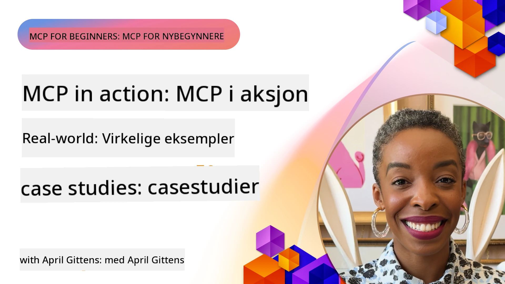

# MCP i praksis: Virkelige casestudier

_(Klikk på bildet over for å se video av denne leksjonen)_

Model Context Protocol (MCP) forvandler hvordan AI-applikasjoner samhandler med data, verktøy og tjenester. Denne delen presenterer virkelige casestudier som demonstrerer praktiske anvendelser av MCP i ulike bedriftsmiljøer.

## Oversikt

Denne delen viser konkrete eksempler på MCP-implementasjoner, med fokus på hvordan organisasjoner bruker denne protokollen for å løse komplekse forretningsutfordringer. Ved å undersøke disse casestudiene får du innsikt i MCPs allsidighet, skalerbarhet og praktiske fordeler i virkelige scenarioer.

## Viktige læringsmål

Ved å utforske disse casestudiene vil du:

- Forstå hvordan MCP kan anvendes for å løse spesifikke forretningsproblemer
- Lære om ulike integrasjonsmønstre og arkitektoniske tilnærminger
- Gjenkjenne beste praksis for implementering av MCP i bedriftsmiljøer
- Få innsikt i utfordringer og løsninger som oppstår i virkelige implementasjoner
- Identifisere muligheter for å anvende lignende mønstre i egne prosjekter

## Fremhevede casestudier

### 1. [Azure AI Reiseagenter – Referanseimplementasjon](./travelagentsample.md)

Denne casestudien undersøker Microsofts omfattende referanseløsning som demonstrerer hvordan man bygger en multi-agent, AI-drevet reiseplanleggingsapplikasjon ved hjelp av MCP, Azure OpenAI og Azure AI Search. Prosjektet viser:

- Multi-agent orkestrering gjennom MCP
- Integrasjon av bedriftsdata med Azure AI Search
- Sikker, skalerbar arkitektur ved bruk av Azure-tjenester
- Utvidbart verktøysett med gjenbrukbare MCP-komponenter
- Konversasjonsbasert brukeropplevelse drevet av Azure OpenAI

Arkitekturen og implementasjonsdetaljene gir verdifull innsikt i oppbygging av komplekse multi-agent-systemer med MCP som koordineringslag.

### 2. [Oppdatering av Azure DevOps-elementer fra YouTube-data](./UpdateADOItemsFromYT.md)

Denne casestudien demonstrerer en praktisk anvendelse av MCP for automatisering av arbeidsflytprosesser. Den viser hvordan MCP-verktøy kan brukes til å:

- Hente data fra nettplattformer (YouTube)
- Oppdatere arbeidsoppgaver i Azure DevOps-systemer
- Lage repeterbare automatiseringsflyter
- Integrere data på tvers av separate systemer

Dette eksempelet illustrerer hvordan selv relativt enkle MCP-implementasjoner kan gi betydelige effektivitetsgevinster ved å automatisere rutineoppgaver og forbedre datakonsistens mellom systemer.

### 3. [Sanntids dokumentasjonshenting med MCP](./docs-mcp/README.md)

Denne casestudien guider deg gjennom hvordan du kobler en Python-konsollklient til en Model Context Protocol (MCP)-server for å hente og logge sanntids, kontekstbevisst Microsoft-dokumentasjon. Du lærer hvordan du kan:

- Koble til en MCP-server med en Python-klient og den offisielle MCP SDK
- Bruke strømmende HTTP-klienter for effektiv, sanntids datainnhenting
- Kalle på dokumentasjonsverktøy på serveren og logge svar direkte til konsollen
- Integrere oppdatert Microsoft-dokumentasjon i arbeidsflyten uten å forlate terminalen

Kapitlet inkluderer en praktisk oppgave, et minimalt fungerende kodeeksempel, og lenker til flere ressurser for dypere læring. Se full gjennomgang og kode i det lenkede kapitlet for å forstå hvordan MCP kan transformere dokumentasjonstilgang og utviklerproduktivitet i konsollbaserte miljøer.

### 4. [Interaktiv studieplan-generator webapp med MCP](./docs-mcp/README.md)

Denne casestudien demonstrerer hvordan man bygger en interaktiv nettapplikasjon ved bruk av Chainlit og Model Context Protocol (MCP) for å generere personlige studieplaner for ethvert emne. Brukere kan spesifisere et fag (som "AI-900-sertifisering") og en studietid (for eksempel 8 uker), og appen gir en uke-for-uke oversikt over anbefalt innhold. Chainlit muliggjør et konversasjonsbasert chattegrensesnitt, som gjør opplevelsen engasjerende og tilpasningsdyktig.

- Konversasjonsbasert webapp drevet av Chainlit
- Brukerstyrte spørsmål for tema og varighet
- Uke-for-uke innholdsanbefalinger ved hjelp av MCP
- Sanntids, adaptive svar i et chattegrensesnitt

Prosjektet illustrerer hvordan konversasjonsbasert AI og MCP kan kombineres for å lage dynamiske, brukerstyrte utdanningsverktøy i et moderne nettmiljø.

### 5. [Dokumentasjon i editor med MCP-server i VS Code](./docs-mcp/README.md)

Denne casestudien viser hvordan du kan bringe Microsoft Learn Docs direkte inn i VS Code-miljøet ditt ved å bruke MCP-serveren—ingen flere bytter mellom nettleserfaner! Du får se hvordan du kan:

- Øyeblikkelig søke og lese dokumentasjon i VS Code via MCP-panelet eller kommandopaletten
- Referere dokumentasjon og sette inn lenker direkte i README- eller kursmarkdowndokumenter
- Bruke GitHub Copilot og MCP sammen for sømløse, AI-drevne dokumentasjons- og kodearbeidsflyter
- Validere og forbedre dokumentasjonen med sanntids tilbakemeldinger og Microsoft-kildepresisjon
- Integrere MCP med GitHub-arbeidsflyter for kontinuerlig validering av dokumentasjonen

Implementeringen inkluderer:

- Eksempelk .vscode/mcp.json-konfigurasjon for enkel oppsett
- Skjermbildestyrte gjennomganger av opplevelsen i editoren
- Tips for å kombinere Copilot og MCP for maksimal produktivitet

Dette scenariet er ideelt for kursforfattere, dokumentasjonsskribenter og utviklere som ønsker å holde fokus i editoren mens de jobber med dokumentasjon, Copilot og valideringsverktøy—alt drevet av MCP.

### 6. [Opprettelse av APIM MCP-server](./apimsample.md)

Denne casestudien gir en trinnvis veiledning for hvordan du oppretter en MCP-server ved bruk av Azure API Management (APIM). Den dekker:

- Oppsett av MCP-server i Azure API Management
- Eksponering av API-operasjoner som MCP-verktøy
- Konfigurering av policyer for hastighetsbegrensning og sikkerhet
- Testing av MCP-serveren ved bruk av Visual Studio Code og GitHub Copilot

Dette eksempelet viser hvordan man kan utnytte Azures muligheter til å lage en robust MCP-server som kan brukes i ulike applikasjoner, og som forbedrer integrasjonen av AI-systemer med bedrifts-APIer.

### 7. [GitHub MCP Registry — Akselererende agentintegrasjon](https://github.com/mcp)

Denne casestudien undersøker hvordan GitHubs MCP Registry, lansert i september 2025, adresserer en kritisk utfordring i AI-økosystemet: den fragmenterte oppdagelsen og utplasseringen av Model Context Protocol (MCP)-servere.

#### Oversikt
**MCP Registry** løser voksesmerter fra spredte MCP-servere på tvers av repositorier og registre, som tidligere gjorde integrasjon treg og feilutsatt. Disse serverne gjør det mulig for AI-agenter å interagere med eksterne systemer som APIer, databaser og dokumentasjonskilder.

#### Problemstilling
Utviklere som bygger agentstyrte arbeidsflyter opplevde flere utfordringer:
- **Dårlig oppdagbarhet** av MCP-servere på tvers av forskjellige plattformer
- **Redundante oppsetts-spørsmål** spredt på forum og dokumentasjon
- **Sikkerhetsrisikoer** fra uverifiserte og ikke-pålitelige kilder
- **Manglende standardisering** i serverkvalitet og kompatibilitet

#### Løsningsarkitektur
GitHubs MCP Registry sentraliserer pålitelige MCP-servere med nøkkelfunksjoner:
- **Én-klikks installasjon** integrasjon via VS Code for strømlinjeformet oppsett
- **Signal-over-støy sortering** etter stjerner, aktivitet og samfunnsgodkjenning
- **Direkte integrasjon** med GitHub Copilot og andre MCP-kompatible verktøy
- **Åpen bidragsmodell** som gjør både samfunn og bedrifts partnere i stand til å bidra

#### Forretningspåvirkning
Registeret har levert målbare forbedringer:
- **Raskere onboarding** for utviklere som bruker verktøy som Microsoft Learn MCP Server, som strømmer offisiell dokumentasjon direkte inn i agenter
- **Forbedret produktivitet** via spesialiserte servere som `github-mcp-server`, som muliggjør naturlig språk GitHub-automatisering (PR-opprettelse, CI-omkjøringer, kodeskanning)
- **Sterkere økosystemtillit** gjennom kuraterte lister og transparente konfigurasjonsstandarder

#### Strategisk verdi
For praktikere som spesialiserer seg på agentlivssyklusadministrasjon og gjenskapbare arbeidsflyter, tilbyr MCP Registry:
- **Modulær agentdistribusjon** med standardiserte komponenter
- **Register-støttede evalueringspipelines** for konsistent testing og validering
- **Tverrverktøy interoperabilitet** som muliggjør sømløs integrasjon på tvers av ulike AI-plattformer

Denne casestudien viser at MCP Registry er mer enn bare en katalog—det er en grunnleggende plattform for skalerbar, virkelighetsnær modellintegrasjon og agentbasert systemutrulling.

### 8. [Publisering til sosiale nettverk fra en agent](./publora-social-publishing.md)

Denne casestudien går gjennom en **skrivedyktig fjern-MCP-server** — en hvis verktøy tar irreversible handlinger på vegne av brukeren — med sosial publisering som eksempel. En agent utarbeider et innlegg, en menneskelig godkjenner det, og serveren planlegger det på tvers av nettverk.

Det interessante er designbegrensningene som publisering pålegger, og som gjelder for hvilken som helst server som skriver i stedet for å lese:

- **Åpen oppdagelse, autentisert utførelse** — `tools/list` besvares uten legitimasjon slik at registre og klienter kan introspektere, mens hvert `tools/call` krever token og ellers returnerer `401` med en `WWW-Authenticate`-header
- **OAuth-registrering uten en utenom-kanal steg** — dynamisk klientregistrering i dag, med Client ID Metadata Documents som retning ifølge `2026-07-28` spesifikasjonen
- **Verktøyannotasjoner** (`readOnlyHint`, `destructiveHint`, `idempotentHint`) som klienter bruker for å avgjøre hva de skal bekrefte — hint i stedet for håndhevelse, og noe tilkoblingskataloger nå forventer ved evaluering
- **Uoppfinnelige identifikatorer**, så en hallusinert verdi feiler høyt i stedet for å handle på en plausibel utseende verdi
- **Idempotensnøkler på verktøy som oppretter innlegg**, så en gjentakelse i agentens runtime ikke blir til en duplikatpublisering
- **Et no-op mål beskrevet i verktøyskjemaet** som tester hele skriveveien og ikke publiserer noe, for vurderere og CI

Kapitlet avsluttes med en kort sjekkliste du kan bruke på en server du bygger.

## Konklusjon

Disse åtte omfattende casestudiene demonstrerer bemerkelsesverdig allsidighet og praktiske anvendelser av Model Context Protocol på tvers av ulike virkelige scenarioer. Fra komplekse multi-agent reiseplanleggingssystemer og bedrifts-API-administrasjon til effektive dokumentasjonsarbeidsflyter og det revolusjonerende GitHub MCP Registry, viser disse eksemplene hvordan MCP tilbyr en standardisert, skalerbar måte å koble AI-systemer til verktøy, data og tjenester de trenger for å levere eksepsjonell verdi.

Casestudiene dekker flere dimensjoner av MCP-implementering:
- **Bedriftsintegrasjon**: Azure API Management og Azure DevOps-automatisering
- **Multi-agent orkestrering**: Reiseplanlegging med koordinerte AI-agenter
- **Utviklerproduktivitet**: VS Code-integrasjon og sanntids dokumentasjonstilgang
- **Økosystemutvikling**: GitHub MCP Registry som en grunnleggende plattform
- **Utdanningsapplikasjoner**: Interaktive studieplangeneratorer og konversasjonsgrensesnitt

Ved å studere disse implementeringene oppnår du kritiske innsikter i:
- **Arkitekturmønstre** for ulike skalaer og bruksområder
- **Implementeringsstrategier** som balanserer funksjonalitet med vedlikeholdbarhet
- **Sikkerhet og skalerbarhet** for produksjonsutplasseringer
- **Beste praksiser** for MCP-serverutvikling og klientintegrasjon
- **Økosystemtenkning** for å bygge sammenkoblede AI-drevne løsninger

Disse eksemplene viser samlet at MCP ikke bare er et teoretisk rammeverk, men en moden, produksjonsklar protokoll som muliggjør praktiske løsninger på komplekse forretningsutfordringer. Enten du bygger enkle automatiseringsverktøy eller sofistikerte multi-agent-systemer, gir mønstrene og tilnærmingene her en solid grunnmur for dine egne MCP-prosjekter.

## Ytterligere ressurser

- [Azure AI Travel Agents GitHub Repository](https://github.com/Azure-Samples/azure-ai-travel-agents)
- [Azure DevOps MCP Tool](https://github.com/microsoft/azure-devops-mcp)
- [Playwright MCP Tool](https://github.com/microsoft/playwright-mcp)
- [Microsoft Docs MCP Server](https://github.com/MicrosoftDocs/mcp)
- [GitHub MCP Registry — Akselererende agentintegrasjon](https://github.com/mcp)
- [MCP Community Examples](https://github.com/microsoft/mcp)

## Hva skjer videre

- Forrige: [Modul 8: Beste praksis](../08-BestPractices/README.md)
- Neste: [Modul 10: Effektivisering av AI-arbeidsflyter: Bygging av en MCP-server med AI Toolkit](../10-StreamliningAIWorkflowsBuildingAnMCPServerWithAIToolkit/README.md)

---

<!-- CO-OP TRANSLATOR DISCLAIMER START -->
**Ansvarsfraskrivelse**:
Dette dokumentet er oversatt ved hjelp av AI-oversettelsestjenesten [Co-op Translator](https://github.com/Azure/co-op-translator). Selv om vi streber etter nøyaktighet, vær oppmerksom på at automatiske oversettelser kan inneholde feil eller unøyaktigheter. Det opprinnelige dokumentet på originalspråket skal betraktes som den autoritative kilden. For kritisk informasjon anbefales profesjonell menneskelig oversettelse. Vi er ikke ansvarlige for eventuelle misforståelser eller feiltolkninger som oppstår ved bruk av denne oversettelsen.
<!-- CO-OP TRANSLATOR DISCLAIMER END -->