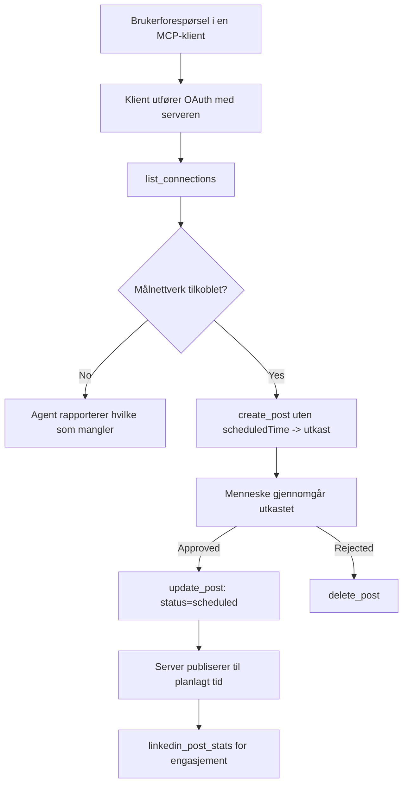

# Case Study: Publisering til sosiale nettverk fra en agent med en ekstern MCP-server

> **Ansvarsfraskrivelse:** Flere tjenester og open source-prosjekter kan publisere til sosiale nettverk, og et team kunne også integrere hvert nettverks API direkte. Scenariet nedenfor er gitt som ett arbeidet eksempel på hvordan en **skrivedyktig ekstern MCP-server** kan designes og brukes. Publora er en kommersiell tjeneste med en gratis plan; mønstrene som beskrives her gjelder for enhver MCP-server som utfører irreversible handlinger på vegne av en bruker.

## Oversikt

Agenter er flinke til å utarbeide innhold og dårlige til å levere det. En modell kan skrive en utgivelsesannonse på sekunder, og så stopper arbeidet: å publisere betyr en API per nettverk, en OAuth-app per nettverk, og et annet sett med medieretningslinjer for hver av dem. De fleste team løser dette ved å kopiere teksten inn i en nettleser for hånd.

Denne casestudien ser på hvordan det siste trinnet fullføres med en enkelt ekstern MCP-server, og — mer nyttig for alle som bygger en — på designvalgene en **skrivedyktig** server må få rett. Å lese data er tilgivende. Å publisere er det ikke: et feil verktøyskall er synlig for et publikum og kan ikke angres.

## Scenario

Et lite utviklerrelasjonsteam utarbeider innlegg i en agent (Claude, VS Code, Cursor — klienten spiller ingen rolle). De vil at agenten skal:

- se hvilke sosiale kontoer teamet har koblet til,
- utarbeide et innlegg og beholde det som et utkast for menneskelig godkjenning,
- legge ved et bilde,
- planlegge det til flere nettverk på et valgt tidspunkt,
- og senere rapportere hvordan det presterte.

Avgjørende ønsker de at agenten *ikke* skal kunne publisere ved et uhell mens de fortsatt eksperimenterer.

## Verktøy brukt

- [Publora MCP Server](https://github.com/publora/mcp-server) — en ekstern MCP-server (`streamable-http`) som eksponerer publisering, planlegging, medier og LinkedIn-analyserverktøy. Registrert i den offisielle MCP-registeret som `com.publora/mcp-server`.

## Trinnvis arbeidsflyt

1. **Koble til serveren.** Klienter som snakker OAuth gjennomfører autorisasjonskodeflyten med PKCE mot serverens egen samtykkeskjerm; klienter som ikke gjør det, som hodeløse CLI-er, bruker en Publora API-nøkkel i en header. Begge veier støttes, og hvilken du får avhenger av klienten, ikke serveren.
2. **Liste tilkoblinger.** Agenten kaller `list_connections` og mottar tilkoblede kontoer med deres identifikatorer.
3. **Utkast.** Agenten kaller `create_post` *uten* et planlagt tidspunkt. Innlegget lagres som et utkast — ingenting publiseres.
4. **Legg ved media.** Offentlige bildeadresser sendes med i samme kall; serveren laster ned og validerer dem.
5. **Planlegg.** Etter at et menneske godkjenner, setter `update_post` status til planlagt med en ISO 8601-tid.
6. **Mål.** For LinkedIn returnerer `linkedin_post_stats` engasjement når innlegget er live.

## Eksempelprompt

```text
Which social accounts do I have connected?
Draft a post announcing our new changelog page, attach the screenshot at
https://example.com/changelog.png, and keep it as a draft — do not publish it.
Once I approve, schedule it to LinkedIn and Bluesky for tomorrow at 09:00 UTC.
```

## Mermaid flytdiagram



## Teknisk implementasjon

Lærdommene nedenfor er den overførbare delen av denne casestudien.

### Åpen oppdagelse, autentisert utførelse

`tools/list` serveres uten legitimasjon; hvert `tools/call` krever en token og returnerer ellers `401` med en `WWW-Authenticate` header som peker på metadata for beskyttet ressurs. (Serveren svarer også på en uautentisert `initialize`, som bare betyr noe for klienter på protokollversjoner før `2026-07-28`; den revisjonen fjernet håndtrykket helt.)

Denne delingen betyr noe i praksis. Register, kataloger og klienter kan undersøke verktøyflaten — navn, skjemaer, annotasjoner — uten å inneha en hemmelighet, mens ingenting kan *utføres* anonymt. En server som krever token for `initialize` er i praksis usynlig for verktøy; en server som tillater anonym `tools/call` er en risiko.

### Registrering: dynamisk klientregistrering og hva som erstatter den

Serveren annonserer `/.well-known/oauth-protected-resource` og `/.well-known/oauth-authorization-server`, og støtter autorisasjonskodeflyt med PKCE (`S256`), fornyingstokener og **dynamisk klientregistrering**.

Dynamisk registrering fjerner det manuelle trinnet: uten den trenger hver klient en forhåndsutstedt `client_id`, som betyr en utenfor-bånd-forespørsel til leverandøren for hver ny klient.

Behandle dette som kompatibilitetsatferd heller enn som designen som skal kopieres. Revisjonen `2026-07-28` av spesifikasjonen avvikler dynamisk klientregistrering til fordel for Client ID Metadata Documents, der klienten ligger en metadatafil på en stabil HTTPS-URL og den URL-en *er* `client_id`. DCR fungerer fortsatt for nå, men en server som bygges i dag bør planlegge for CIMD og kun beholde DCR for eldre klienter.

### Verktøyannotasjoner er ikke pynt

Hvert verktøy har en `title` og gyldige hint: `readOnlyHint`, `destructiveHint`, `idempotentHint`, `openWorldHint`.

To grunner til å investere i dem. For det første bruker klienter hintene til å avgjøre hva de skal bekrefte med brukeren — en klient kan automatisk kjøre et leseoppslag og stoppe for godkjenning før sletting. Spesifikasjonen er eksplisitt på at annotasjoner er upålitelige hint, ikke en autorisasjonsmekanisme: de former hva en klient tilbyr å gjøre, de stopper ikke noe på serveren, og serveren må fortsatt håndheve sine egne regler. For det andre krever de store konektorkatalogene nå *dem* for gjennomgang; en server hvis verktøy mangler titler og hint vil bli returnert uansett hvor godt den fungerer.

### Gjør identifikatorer uoppfinnelige

Plattformsidentifikatorer er ugjennomsiktige strenger returnert av `list_connections`, og skjemabeskrivelsen sier eksplisitt at de må kopieres ordrett og aldri gjettes. Serveren avviser alt annet.

Modeller er flytende gjettere. Enhver skrivedyktig server bør anta at en identifikator til slutt vil bli hallusinert og gjøre at denne stien feiler høyt og tidlig, fremfor å handle på en troverdig utseende verdi.

### Feil før publisering, med en handlingsbar melding

Noen nettverk nekter tekstinnlegg og krever et bilde eller video. Det valideres når innlegget planlegges, og feilen navngir plattformen og det manglende kravet.

En agent kan gjenopprette fra "Instagram krever media — legg ved et bilde eller video" uten en ekstra runde. Den kan ikke gjenopprette fra en generisk `400`.

### Gjør forsøk sikre

De to verktøyene som lager innhold, `create_post` og `update_post`, godtar en idempotensnøkkel: gjenbruk av den med en identisk forespørsel gjenspiller det opprinnelige svaret i stedet for å lage et andre innlegg. Agentkjøringer prøver på nytt ved tidsavbrudd; uten idempotens blir et tregt svar en duplikatpublisering. De andre skriveverktøyene — slettinger, mediatrinn, LinkedIn-reaksjoner og -kommentarer — godtar ikke en slik nøkkel, så et nytt forsøk der er ikke automatisk sikkert. Det er verdt å vite hvilke av dine egne mutasjoner som er beskyttet og hvilke som ikke er.

### Gi en måte å teste som ikke publiserer noe

Serveren godtar et reservert mål, `publora-playground`, som valideres og bekreftes som en ekte destinasjon og så forkastes — ingenting når en ekte konto. Det er beskrevet i verktøyskjemaet selv, som enhver klient kan lese uten legitimasjon: `platforms`-feltet til `create_post` dokumenterer det som "et tilkoblingstest-mål som ikke krever ekte tilkobling — innlegget bekreftes og forkastes, ingenting publiseres". Kall det ved å sende det som eneste oppføring: `platforms: ["publora-playground"]`.

Dette viste seg å være en av de mest nyttige detaljene i hele flaten. Gjennomgangspersoner for konektorkataloger, bidragsytere og CI kan gjøre hele skriveveien ende-til-ende uten risiko for et ekte publikum. Enhver MCP-server med irreversible handlinger drar nytte av et dokumentert no-op mål.

## Resultater og påvirkning

- Publiseringssteget flyttet seg fra en nettleser til den samme samtalen der innholdet skrives, og en utkast-først vane holder et menneske inne i løkken. Vær presis på hva det er: et utkast er en konvensjon, ikke en grense. Den samme legitimasjonen kan planlegge eller publisere, så enhver som trenger et ekte godkjenningsstempel må håndheve det utenfor verktøyflaten — separate legitimasjoner, eller et policy-lag foran serveren.
- Per-nettverksforskjeller — mediekrav, trådning, svarstyring — håndteres én gang i serveren i stedet for i hver agent som snakker til den.
- Den samme serveren støtter flere MCP-klienter uten per-klient arbeid, fordi oppdagelse er åpen og registrering er dynamisk.
- Designbegrensningene ovenfor ble formet like mye av konektorkataloggjennomganger som av brukere: annotasjoner, OAuth og et sikkert testmål ble hver krevd av minst én av dem.

## Referanser

- [Publora MCP Server (kilde)](https://github.com/publora/mcp-server)
- [Publora API og MCP-dokumentasjon](https://docs.publora.com)
- [MCP Registry entry: `com.publora/mcp-server`](https://registry.modelcontextprotocol.io/v0/servers?search=com.publora/mcp-server)
- [MCP spesifikasjon — Autorisasjon](https://modelcontextprotocol.io/specification/draft/basic/authorization)
- [MCP spesifikasjon — Verktøyannotasjoner](https://modelcontextprotocol.io/docs/concepts/tools)

## Hva nå

- Ta en MCP-server du bygger og sjekk de tre billigste gevinstene her: annotasjoner på hvert verktøy, en idempotensnøkkel på hver skriveoperasjon, og et dokumentert no-op mål.
- Prøv den åpne oppdagelsesdelingen: kall `tools/list` mot en offentlig ekstern server uten legitimasjon, så kall et verktøy og inspiser `401`-utfordringen.
- Vurder hva "angre" betyr for ditt domene. Publisering har utkast og sletting; hvis dine handlinger ikke har ekvivalenter, hører bekreftelse hjemme i verktøydesignet, ikke i prompten.

---

<!-- CO-OP TRANSLATOR DISCLAIMER START -->
**Ansvarsfraskrivelse**:
Dette dokumentet er oversatt ved hjelp av AI-oversettelsestjenesten [Co-op Translator](https://github.com/Azure/co-op-translator). Selv om vi streber etter nøyaktighet, vær oppmerksom på at automatiske oversettelser kan inneholde feil eller unøyaktigheter. Det opprinnelige dokumentet på originalspråket skal betraktes som den autoritative kilden. For kritisk informasjon anbefales profesjonell menneskelig oversettelse. Vi er ikke ansvarlige for eventuelle misforståelser eller feiltolkninger som oppstår ved bruk av denne oversettelsen.
<!-- CO-OP TRANSLATOR DISCLAIMER END -->