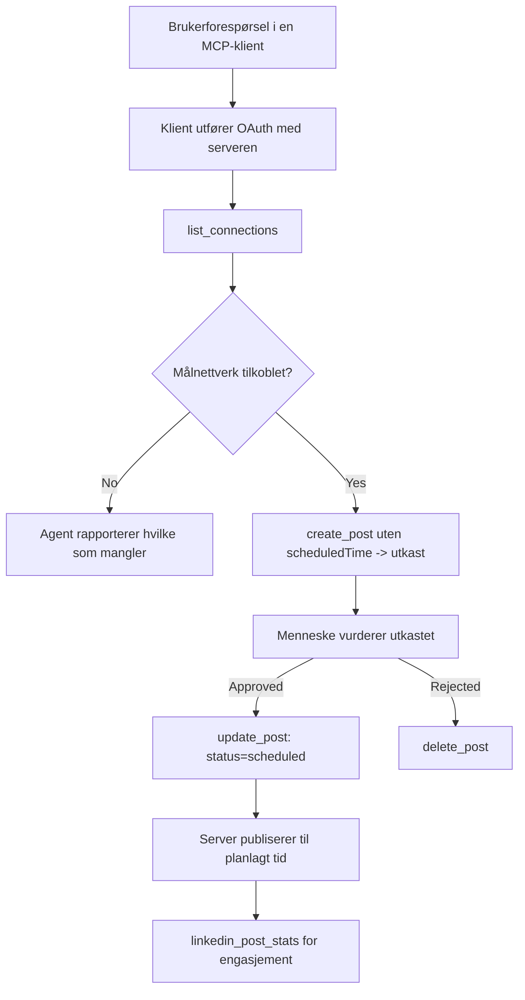

# Case Study: Publisering til sosiale nettverk fra en agent med en ekstern MCP-server

> **Ansvarsfraskrivelse:** Flere tjenester og open source-prosjekter kan publisere til sosiale nettverk, og et team kan også integrere hver nettverks API direkte. Scenariet nedenfor gis som et eksempel på hvordan en **skrivbar ekstern MCP-server** kan designes og brukes. Publora er en kommersiell tjeneste med et gratisnivå; mønstrene som beskrives her gjelder for enhver MCP-server som utfører irreversible handlinger på vegne av en bruker.

## Oversikt

Agenter er gode på å utarbeide innhold og dårlige på å levere det. En modell kan skrive en pressemelding på sekunder, og deretter stopper arbeidet: å publisere betyr en API per nettverk, en OAuth-app per nettverk, og et forskjellig sett med medieregler for hver. De fleste team løser dette ved å kopiere teksten manuelt inn i en nettleser.

Denne casestudien ser på hvordan det siste steget lukkes med en enkelt ekstern MCP-server, og – mer nyttig for alle som bygger en – på designbeslutningene en **skrivbar** server må få rett. Å lese data er tilgivende. Å publisere er det ikke: et feil verktøysanrop er synlig for et publikum og kan ikke angres.

## Scenario

Et lite developer-relations team utarbeider innlegg inne i en agent (Claude, VS Code, Cursor – klienten spiller ingen rolle). De vil at agenten skal:

- se hvilke sosiale kontoer teamet har koblet til,
- lage et utkast til innlegg og holde det som utkast for menneskelig godkjenning,
- legge ved et bilde,
- planlegge det til flere nettverk på valgt tidspunkt,
- og senere rapportere hvordan det presterte.

Viktigst av alt, de vil at agenten *ikke* skal kunne publisere ved et uhell mens de fortsatt eksperimenterer.

## Verktøy brukt

- [Publora MCP Server](https://github.com/publora/mcp-server) — en ekstern MCP-server (`streamable-http`) som eksponerer publisering, planlegging, medier og LinkedIn-analyserverktøy. Registrert i den offisielle MCP-registeret som `com.publora/mcp-server`.

## Steg-for-steg arbeidsflyt

1. **Koble til serveren.** Klienter som bruker OAuth fullfører autorisasjonskodeflyten med PKCE mot serverens eget samtykkeskjermbilde; klienter som ikke gjør det, som hodeløse CLIer, bruker en Publora API-nøkkel i en header. Begge veier støttes, og hvilken du får avhenger av klienten, ikke serveren.
2. **List oppkoblinger.** Agenten kaller `list_connections` og mottar de tilkoblede kontoene med deres identifikatorer.
3. **Utkast.** Agenten kaller `create_post` *uten* et planlagt tidspunkt. Innlegget lagres som et utkast – ingenting publiseres.
4. **Legg ved medier.** Offentlige bilde-URLer sendes i samme kall; serveren laster ned og validerer dem.
5. **Planlegg.** Etter at et menneske godkjenner, setter `update_post` status til planlagt med en ISO 8601-tid.
6. **Mål.** For LinkedIn returnerer `linkedin_post_stats` engasjement når innlegget er live.

## Eksempel prompt

```text
Which social accounts do I have connected?
Draft a post announcing our new changelog page, attach the screenshot at
https://example.com/changelog.png, and keep it as a draft — do not publish it.
Once I approve, schedule it to LinkedIn and Bluesky for tomorrow at 09:00 UTC.
```

## Mermaid flytskjema



## Teknisk implementering

Lærdommene nedenfor er den overførbare delen av denne casestudien.

### Åpen oppdagelse, autentisert kjøring

`tools/list` leveres uten legitimasjon; hvert `tools/call` krever en token
og returnerer ellers `401` med en `WWW-Authenticate` header som peker på
beskyttet-ressurs metadata. Serverens legacy endepunkt svarer også på en
uautentisert `initialize` for klienter på protokollversjoner før
`2026-07-28`; nåværende klienter bruker ikke den håndtrykken.

Denne server-spesifikke splittelsen lar registre, kataloger og klienter inspisere verktøy
navn, skjemaer, og annotasjoner uten hemmelighet, samtidig som anonym
kjøring forhindres. Åpen oppdagelse er et distribusjonsvalg, ikke et MCP-krav; en
beskyttet distribusjon kan også kreve autorisasjon for `tools/list`.

### Registrering: dynamisk klientregistrering, og hva som erstatter den

Serveren annonserer `/.well-known/oauth-protected-resource` og `/.well-known/oauth-authorization-server`, og støtter autorisasjonskodeflyten med PKCE (`S256`), oppfriskningstoken, og **dynamisk klientregistrering**.

Dynamisk registrering fjernet det manuelle steget for legacy-klienter: uten det,
trengte hver klient en forhåndsutstedt `client_id` fra leverandøren.

Behandle dette som kompatibilitetsatferd snarere enn som designet å kopiere. Spesifikasjonsrevisjonen `2026-07-28` avvikler dynamisk klientregistrering til fordel for Client ID Metadata Documents, der klienten hoster et metadata-dokument på en stabil HTTPS-URL og den URLen *er* `client_id`. DCR fungerer fortsatt foreløpig, men en server som bygges i dag bør planlegge for CIMD og beholde DCR kun for eldre klienter.

### Verktøysannotasjoner er ikke pynt

Hvert verktøy har en `title` og anvendelige hint: `readOnlyHint`, `destructiveHint`, `idempotentHint`, `openWorldHint`.

To grunner til å investere i dem. For det første bruker klienter hintene for å avgjøre hva som skal bekreftes med brukeren – en klient kan automatisk kjøre et kun lese-oppslag og stoppe for godkjenning før sletting. Spesifikasjonen er eksplisitt på at annotasjoner er uautentifiserte hint, ikke en autorisasjonsmekanisme: de former hva en klient tilbyr å gjøre, de stopper ikke noe på serveren, og en server må fortsatt håndheve sine egne regler. For det andre krever de store koblingskatalogene nå *dem* for gjennomgang; en server hvis verktøy mangler titler og hint vil bli sendt tilbake uavhengig av hvor bra den fungerer.

### Gjør identifikatorer umulige å dikte opp

Plattform-identifikatorer er ugjennomsiktige strenger returnert av `list_connections`, og skjema-beskrivelsen sier eksplisitt at de må kopieres ordrett og aldri gjettes. Serveren avviser alt annet.

Modeller er flytende gjettmaskiner. Enhver skrivbar server bør anta at en identifikator til slutt blir hallusinert og gjøre den veien til å feile høyt og tidlig, heller enn å handle på en plausibel verdi.

### Feil før publisering, med en handlingsbar melding

Enkelte nettverk nekter tekstopppostinger og krever et bilde eller video. Det valideres når innlegget planlegges, og feilen navngir plattformen og det manglende kravet.

En agent kan komme seg fra "Instagram krever medier – legg ved et bilde eller video" uten en ny runde tur-retur. Den kan ikke komme seg fra en generell `400`.

### Gjør omforsøk trygge

De to verktøyene som lager innhold, `create_post` og `update_post`, godtar en idempotensnøkkel: gjenbruk med identisk forespørsel spiller av den originale responsen istedenfor å lage et nytt innlegg. Agent-runtime gjør omforsøk ved tidsavbrudd; uten idempotens blir et tregt svar en duplikatpublisering. De andre skrivverktøyene — slettinger, mediesteps, LinkedIn reaksjoner og kommentarer — tar ikke en slik nøkkel, så omforsøk der er ikke automatisk trygt. Det er verdt å vite hvilke av dine egne mutasjoner som er beskyttet og hvilke som ikke er det.

### Gi en måte å teste som ikke publiserer noe

Serveren godtar et reservert mål, `publora-playground`, som valideres og bekreftes som et ekte mål og deretter forkastes – ingenting når en ekte konto. Det er beskrevet i verktøyskjemaet selv, som enhver klient kan lese uten legitimasjon: feltet `platforms` i `create_post` dokumenterer det som "et tilkoblingstestmål som ikke krever en ekte tilkobling — innlegget bekreftes og forkastes, ingenting publiseres". Kall det ved å sende det som det eneste oppføringen: `platforms: ["publora-playground"]`.

Dette viste seg å være en av de mest nyttige detaljene på hele grensesnittet. Gjennomgåere av koblingskataloger, bidragsytere og CI kan teste hele skriveflyten ende til ende uten risiko for et ekte publikum. Enhver MCP-server med irreversible handlinger drar nytte av et dokumentert no-op mål.

## Resultater og påvirkning

- Publiseringssteget flyttet fra en nettleser til samme samtale der innholdet skrives, og en utkast-først vane holder et menneske med i sløyfen. Vær presis på hva det er: et utkast er en konvensjon, ikke en grense. Den samme legitimasjonen kan planlegge eller publisere, så hvem som helst som trenger en ekte godkjenningsport må håndheve det utenfor verktøygrensesnittet — separate legitimasjoner, eller et policy-lag foran serveren.
- Nettverksspesifikke forskjeller — mediekrav, tråding, svar-kontroller — håndteres en gang i serveren istedenfor i hver agent som snakker til den.
- Den samme serveren støtter flere MCP-klienter uten forhåndsutstedte legitimasjoner.
    Nåværende klienter kan bruke Client ID Metadata Documents; DCR forblir et fallback
    for eldre klienter.
- Designbegrensningene ovenfor ble formet like mye av gjennomgang av koblingskataloger som av brukere: annotasjoner, OAuth og et trygt testmål var alle påkrevd av minst en av dem.

## Referanser

- [Publora MCP Server (kildekode)](https://github.com/publora/mcp-server)
- [Publora API og MCP dokumentasjon](https://docs.publora.com)
- [MCP-registerpost: `com.publora/mcp-server`](https://registry.modelcontextprotocol.io/v0/servers?search=com.publora/mcp-server)
- [MCP-spesifikasjon — Autorisasjon](https://modelcontextprotocol.io/specification/2026-07-28/basic/authorization)
- [MCP-spesifikasjon — Verktøysannotasjoner](https://modelcontextprotocol.io/docs/concepts/tools)

## Hva er neste steg

- Ta en MCP-server du bygger og sjekk de tre billigste gevinstene her: annotasjoner på hvert verktøy, en idempotensnøkkel på hver skriving, og et dokumentert no-op mål.
- Prøv den åpne oppdagelsessplitten: kall `tools/list` mot en offentlig ekstern server uten legitimasjon, deretter kall et verktøy og inspiser `401`-utfordringen.
- Vurder hva "angre" betyr for ditt domene. Publisering har utkast og sletting; hvis handlingene dine ikke har en ekvivalent, hører bekreftelse hjemme i verktøydesignet, ikke i prompten.

---

<!-- CO-OP TRANSLATOR DISCLAIMER START -->
**Ansvarsfraskrivelse**:
Dette dokumentet er oversatt ved hjelp av AI-oversettelsestjenesten [Co-op Translator](https://github.com/Azure/co-op-translator). Selv om vi streber etter nøyaktighet, vær oppmerksom på at automatiske oversettelser kan inneholde feil eller unøyaktigheter. Det opprinnelige dokumentet på originalspråket skal betraktes som den autoritative kilden. For kritisk informasjon anbefales profesjonell menneskelig oversettelse. Vi er ikke ansvarlige for eventuelle misforståelser eller feiltolkninger som oppstår ved bruk av denne oversettelsen.
<!-- CO-OP TRANSLATOR DISCLAIMER END -->