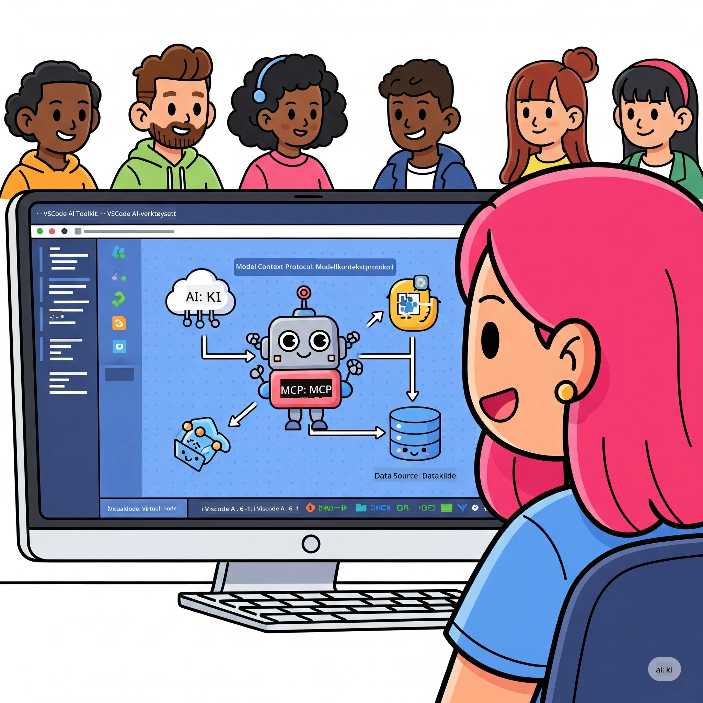
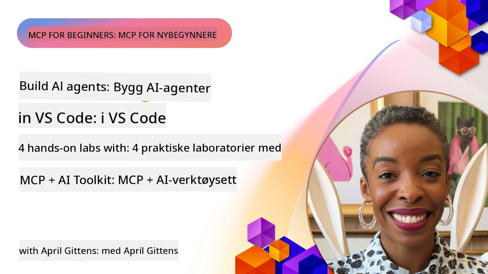

# Strømlinjeforme AI-arbeidsflyter: Bygge en MCP-server med Microsoft Foundry Toolkit

## 🎯 Oversikt

_(Klikk på bildet over for å se video av denne leksjonen)_

Velkommen til **Model Context Protocol (MCP) Workshop**! Denne omfattende praktiske workshopen kombinerer to banebrytende teknologier for å revolusjonere AI-applikasjonsutvikling:

> **Kompatibilitetsnotat:** workshop-koden ble bygget og testet med MCP
> `2025-11-25`, som vist på merket over. Bruk
> [gjeldende `2026-07-28` spesifikasjon](https://modelcontextprotocol.io/specification/2026-07-28/)
> for nye protokollimplementeringer og gjennomgå SDK-utgivelsesnotater før
> migrering av labene.

- **🔗 Model Context Protocol (MCP)**: En åpen standard for sømløs integrasjon av AI-verktøy
- **🛠️ Microsoft Foundry Toolkit Extension for VS Code**: Microsofts kraftige AI-utviklingstillegg

### 🎓 Hva du vil lære

Ved slutten av denne workshopen vil du mestre kunsten å bygge intelligente applikasjoner som kobler AI-modeller med virkelige verktøy og tjenester. Fra automatisert testing til tilpassede API-integrasjoner får du praktiske ferdigheter for å løse komplekse forretningsutfordringer.

## 🏗️ Teknologistabel

### 🔌 Model Context Protocol (MCP)

MCP er **"USB-C for AI"** – en universell standard som kobler AI-modeller til eksterne verktøy og datakilder.

**✨ Nøkkelfunksjoner:**

- 🔄 **Standardisert integrasjon**: Universelt grensesnitt for AI-verktøykoblinger
- 🏛️ **Fleksibel arkitektur**: Lokale og eksterne servere via stdio/SSE transport
- 🧰 **Rik økosystem**: Verktøy, prompt og ressurser i en protokoll
- 🔒 **Enterpriseklar**: Innebygget sikkerhet og pålitelighet

**🎯 Hvorfor MCP er viktig:**
Akkurat som USB-C eliminerte kabelkaos, eliminerer MCP kompleksiteten ved AI-integrasjoner. Én protokoll, uendelige muligheter.

### 🤖 Microsoft Foundry Toolkit Extension for VS Code

Microsofts flaggskip AI-utviklingstillegg som forvandler VS Code til en AI-kraftpakke.

**🚀 Kjernefunksjoner:**

- 📦 **Modellkatalog**: Tilgang til modeller fra Azure AI, GitHub, Hugging Face, Ollama
- ⚡ **Lokal inferens**: ONNX-optimalisert CPU/GPU/NPU utførelse
- 🏗️ **Agentbygger**: Visuell AI-agentutvikling med MCP-integrasjon
- 🎭 **Multimodal**: Støtte for tekst, syn og strukturert utdata

**💡 Utviklingsfordeler:**

- Null-konfigurasjons modellutrulling
- Visuell prompt-engineering
- Sanntidstestingsmiljø
- Sømløs MCP-serverintegrasjon

## 📚 Læringsreise

### [🚀 Modul 1: Grunnleggende Microsoft Foundry Toolkit](./lab1/README.md)

**Varighet**: 15 minutter

- 🛠️ Installer og konfigurer Microsoft Foundry Toolkit for VS Code
- 🗂️ Utforsk Modellkatalogen (100+ modeller fra GitHub, ONNX, OpenAI, Anthropic, Google)
- 🎮 Mestre det interaktive lekeområdet for sanntidstest av modeller
- 🤖 Bygg din første AI-agent med Agent Builder
- 📊 Evaluer modellens ytelse med innebygde metrikker (F1, relevans, likhet, koherens)
- ⚡ Lær batch-prosessering og multimodal støtte

**🎯 Læringsmål**: Lag en funksjonell AI-agent med omfattende forståelse av Microsoft Foundry Toolkit-funksjonaliteter

### [🌐 Modul 2: MCP med Microsoft Foundry Toolkit Grunnleggende](./lab2/README.md)

**Varighet**: 20 minutter

- 🧠 Mestre Model Context Protocol (MCP) arkitektur og konsepter
- 🌐 Utforsk Microsofts MCP-serverøkosystem
- 🤖 Bygg en nettleser-automatiseringsagent med Playwright MCP-server
- 🔧 Integrer MCP-servere med Microsoft Foundry Toolkit Agent Builder
- 📊 Konfigurer og test MCP-verktøy i dine agenter
- 🚀 Eksporter og distribuer MCP-drevne agenter for produksjon

**🎯 Læringsmål**: Distribuer en AI-agent superladet med eksterne verktøy gjennom MCP

### [🔧 Modul 3: Avansert MCP-utvikling med Microsoft Foundry Toolkit](./lab3/README.md)

**Varighet**: 20 minutter

- 💻 Lag egendefinerte MCP-servere med Microsoft Foundry Toolkit
- 🐍 Konfigurer og bruk siste versjon av MCP Python SDK (v1.9.3)
- 🔍 Sett opp og bruk MCP Inspector for feilsøking
- 🛠️ Bygg en Weather MCP Server med profesjonelle feilsøkingsarbeidsflyter
- 🧪 Feilsøk MCP-servere i både Agent Builder og Inspector-miljøer

**🎯 Læringsmål**: Utvikle og feilsøke egendefinerte MCP-servere med moderne verktøy

### [🐙 Modul 4: Praktisk MCP-utvikling - Egendefinert GitHub Clone Server](./lab4/README.md)

**Varighet**: 30 minutter

- 🏗️ Bygg en ekte GitHub Clone MCP Server for utviklingsarbeidsflyter
- 🔄 Implementer smart kloning av repositorier med validering og feilhåndtering
- 📁 Lag intelligent kataloghåndtering og VS Code-integrasjon
- 🤖 Bruk GitHub Copilot Agent Mode med egendefinerte MCP-verktøy
- 🛡️ Påfør produksjonsklar pålitelighet og plattformovergripende kompatibilitet

**🎯 Læringsmål**: Distribuer en produksjonsklar MCP-server som effektiviserer reelle utviklingsarbeidsflyter

## 💡 Virkelige applikasjoner og virkning

### 🏢 Bedriftsbrukstilfeller

#### 🔄 DevOps-Automatisering

Transformer utviklingsflyten din med intelligensautomatisering:

- **Smart Repository Management**: AI-drevet kodegjennomgang og merge-beslutninger
- **Intelligent CI/CD**: Automatisert pipeline-optimalisering basert på kodeendringer
- **Issue Triage**: Automatisk feilklassifisering og tildeling

#### 🧪 Kvalitetssikringsrevolusjon

Hev testing med AI-drevet automasjon:

- **Intelligent Testgenerering**: Lag omfattende testsuiter automatisk
- **Visuell regresjonstesting**: AI-drevet UI-endringsdeteksjon
- **Ytelsesovervåking**: Proaktiv problemidentifisering og løsning

#### 📊 Data Pipeline Intelligens

Bygg smartere databehandlingsarbeidsflyter:

- **Adaptive ETL-prosesser**: Selvoptimaliserende datatransformasjoner
- **Anomali-deteksjon**: Sanntids overvåking av datakvalitet
- **Intelligent ruting**: Smart håndtering av dataflyt

#### 🎧 Forbedret kundeopplevelse

Skap eksepsjonelle kundeinteraksjoner:

- **Kontekstbevisst support**: AI-agenter med tilgang til kundehistorikk
- **Proaktiv problemløsning**: Prediktiv kundeservice
- **Multikanalintegrasjon**: Enhetlig AI-opplevelse på tvers av plattformer

## 🛠️ Forutsetninger og oppsett

### 💻 Systemkrav

| Komponent | Krav | Notater |
|----------|-------|---------|
| **Operativsystem** | Windows 10+, macOS 10.15+, Linux | Ethvert moderne OS |
| **Visual Studio Code** | Nyeste stabile versjon | Kreves for Microsoft Foundry Toolkit |
| **Node.js** | v18.0+ og npm | For MCP-serverutvikling |
| **Python** | 3.10+ | Valgfritt for Python MCP-servere |
| **Minne** | Minst 8GB RAM | 16GB anbefalt for lokale modeller |

### 🔧 Utviklingsmiljø

#### Anbefalte VS Code-utvidelser

- **Microsoft Foundry Toolkit** (ms-windows-ai-studio.windows-ai-studio)
- **Python** (ms-python.python)
- **Python Debugger** (ms-python.debugpy)
- **GitHub Copilot** (GitHub.copilot) - Valgfritt men nyttig

#### Valgfrie verktøy

- **uv**: Moderne Python-pakkebehandler
- **MCP Inspector**: Visuelt feilsøkingsverktøy for MCP-servere
- **Playwright**: For eksempler på nettautomatisering

## 🎖️ Læringsmål og sertifiseringsløp

### 🏆 Ferdighetsmestringssjekkliste

Ved å fullføre denne workshopen vil du oppnå mestring i:

#### 🎯 Kjernetjenester

- [ ] **MCP Protokollmestring**: Dyp forståelse av arkitektur og implementeringsmønstre
- [ ] **Microsoft Foundry Toolkit Ferdigheter**: Ekspertbruk av Microsoft Foundry Toolkit for rask utvikling
- [ ] **Egendefinert serverutvikling**: Bygg, distribuer og vedlikehold produksjons-MCP-servere
- [ ] **Verktøyintegrasjonsdyktighet**: Sømløs kobling av AI med eksisterende utviklingsflyter
- [ ] **Problemløsende anvendelse**: Bruk lærte ferdigheter på reelle forretningsutfordringer

#### 🔧 Tekniske ferdigheter

- [ ] Sett opp og konfigurer Microsoft Foundry Toolkit i VS Code
- [ ] Design og implementer egendefinerte MCP-servere
- [ ] Integrer GitHub-modeller med MCP-arkitektur
- [ ] Bygg automatiserte testarbeidsflyter med Playwright
- [ ] Distribuer AI-agenter for produksjonsbruk
- [ ] Feilsøk og optimaliser MCP-serverytelse

#### 🚀 Avanserte muligheter

- [ ] Arkitekt AI-integrasjoner i bedriftsklasse
- [ ] Implementer sikkerhetsbeste praksis for AI-applikasjoner
- [ ] Design skalerbare MCP-serverarkitekturer
- [ ] Lag egendefinerte verktøykjeder for spesifikke domener
- [ ] Veiled andre i AI-native utvikling

## 📖 Tilleggsressurser

- [MCP Spesifikasjon (2026-07-28)](https://modelcontextprotocol.io/specification/2026-07-28/)
- [Microsoft Foundry Toolkit GitHub Repository](https://github.com/microsoft/vscode-ai-toolkit)
- [Eksempel MCP-servere samling](https://github.com/modelcontextprotocol/servers)
- [Best Practices Guide](https://modelcontextprotocol.io/docs/best-practices)
- [OWASP MCP Topp 10](https://microsoft.github.io/mcp-azure-security-guide/mcp/) - Sikkerhetsbeste praksis

---

**🚀 Klar til å revolusjonere AI-utviklingsarbeidsflyten din?**

La oss bygge fremtiden for intelligente applikasjoner sammen med MCP og Microsoft Foundry Toolkit!

## Hva er neste steg

Fortsett til: [Modul 11: MCP Server Hands-On Labs](../11-MCPServerHandsOnLabs/README.md)

---

<!-- CO-OP TRANSLATOR DISCLAIMER START -->
**Ansvarsfraskrivelse**:
Dette dokumentet er oversatt ved hjelp av AI-oversettelsestjenesten [Co-op Translator](https://github.com/Azure/co-op-translator). Selv om vi streber etter nøyaktighet, vær oppmerksom på at automatiske oversettelser kan inneholde feil eller unøyaktigheter. Det opprinnelige dokumentet på originalspråket skal betraktes som den autoritative kilden. For kritisk informasjon anbefales profesjonell menneskelig oversettelse. Vi er ikke ansvarlige for eventuelle misforståelser eller feiltolkninger som oppstår ved bruk av denne oversettelsen.
<!-- CO-OP TRANSLATOR DISCLAIMER END -->