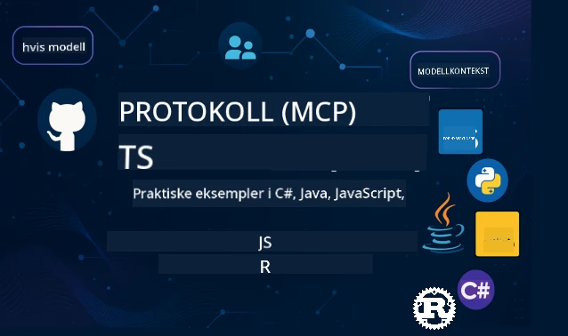

 

[](https://GitHub.com/microsoft/mcp-for-beginners/graphs/contributors)
[](https://GitHub.com/microsoft/mcp-for-beginners/issues)
[](https://GitHub.com/microsoft/mcp-for-beginners/pulls)
[](http://makeapullrequest.com)
[](https://mcptoplist.com/server/mcp.so%2Fmcp-for-beginners%2Fmicrosoft)

[](https://GitHub.com/microsoft/mcp-for-beginners/watchers)
[](https://GitHub.com/microsoft/mcp-for-beginners/fork)
[](https://GitHub.com/microsoft/mcp-for-beginners/stargazers)


[](https://discord.gg/nTYy5BXMWG)

Følg disse trinnene for å komme i gang med å bruke disse ressursene:
1. **Fork Repositoryet**: Klikk [](https://GitHub.com/microsoft/mcp-for-beginners/fork)
2. **Klon Repositoryet**:   `git clone https://github.com/microsoft/mcp-for-beginners.git`
3. **Bli med i** [](https://discord.gg/nTYy5BXMWG)


### 🌐 Støtte for flere språk

#### Støttes via GitHub Action (Automatisert og alltid oppdatert)

<!-- CO-OP TRANSLATOR LANGUAGES TABLE START -->
[Arabisk](../ar/README.md) | [Bengali](../bn/README.md) | [Bulgarsk](../bg/README.md) | [Burmese (Myanmar)](../my/README.md) | [Kinesisk (Forenklet)](../zh-CN/README.md) | [Kinesisk (Tradisjonell, Hong Kong)](../zh-HK/README.md) | [Kinesisk (Tradisjonell, Macau)](../zh-MO/README.md) | [Kinesisk (Tradisjonell, Taiwan)](../zh-TW/README.md) | [Kroatisk](../hr/README.md) | [Tsjekkisk](../cs/README.md) | [Dansk](../da/README.md) | [Nederlandsk](../nl/README.md) | [Estisk](../et/README.md) | [Finsk](../fi/README.md) | [Fransk](../fr/README.md) | [Tysk](../de/README.md) | [Gresk](../el/README.md) | [Hebraisk](../he/README.md) | [Hindi](../hi/README.md) | [Ungarsk](../hu/README.md) | [Indonesisk](../id/README.md) | [Italiensk](../it/README.md) | [Japansk](../ja/README.md) | [Kannada](../kn/README.md) | [Khmer](../km/README.md) | [Koreansk](../ko/README.md) | [Litauisk](../lt/README.md) | [Malayisk](../ms/README.md) | [Malayalam](../ml/README.md) | [Marathi](../mr/README.md) | [Nepali](../ne/README.md) | [Nigeriansk Pidgin](../pcm/README.md) | [Norsk](./README.md) | [Persisk (Farsi)](../fa/README.md) | [Polsk](../pl/README.md) | [Portugisisk (Brasil)](../pt-BR/README.md) | [Portugisisk (Portugal)](../pt-PT/README.md) | [Punjabi (Gurmukhi)](../pa/README.md) | [Rumensk](../ro/README.md) | [Russisk](../ru/README.md) | [Serbisk (Kyrillisk)](../sr/README.md) | [Slovakisk](../sk/README.md) | [Slovensk](../sl/README.md) | [Spansk](../es/README.md) | [Swahili](../sw/README.md) | [Svensk](../sv/README.md) | [Tagalog (Filippinsk)](../tl/README.md) | [Tamil](../ta/README.md) | [Telugu](../te/README.md) | [Thai](../th/README.md) | [Tyrkisk](../tr/README.md) | [Ukrainsk](../uk/README.md) | [Urdu](../ur/README.md) | [Vietnamesisk](../vi/README.md)

> **Foretrekker du å klone lokalt?**
>
> Dette repositoryet inkluderer 50+ språkoversettelser som betydelig øker nedlastningsstørrelsen. For å klone uten oversettelser, bruk sparse checkout:
>
> **Bash / macOS / Linux:**
> ```bash
> git clone --filter=blob:none --sparse https://github.com/microsoft/mcp-for-beginners.git
> cd mcp-for-beginners
> git sparse-checkout set --no-cone '/*' '!translations' '!translated_images'
> ```
>
> **CMD (Windows):**
> ```cmd
> git clone --filter=blob:none --sparse https://github.com/microsoft/mcp-for-beginners.git
> cd mcp-for-beginners
> git sparse-checkout set --no-cone "/*" "!translations" "!translated_images"
> ```
>
> Dette gir deg alt du trenger for å fullføre kurset med en mye raskere nedlasting.
<!-- CO-OP TRANSLATOR LANGUAGES TABLE END -->

# 🚀 Model Context Protocol (MCP) Pensum for nybegynnere

## **Lær MCP med praktiske kodeeksempler i C#, Java, JavaScript, Rust, Python, og TypeScript**

## 🧠 Oversikt over Model Context Protocol-pensumet
Velkommen til din reise inn i Model Context Protocol! Hvis du noen gang har lurt på hvordan AI-applikasjoner kommuniserer med forskjellige verktøy og tjenester, er du i ferd med å oppdage den elegante løsningen som forvandler hvordan utviklere bygger intelligente systemer.

Tenk på MCP som en universell oversetter for AI-applikasjoner - akkurat som USB-porter lar deg koble til hvilken som helst enhet til datamaskinen din, lar MCP AI-modeller koble til hvilket som helst verktøy eller tjeneste på en standardisert måte. Enten du bygger din første chatbot eller jobber med komplekse AI-arbeidsflyter, vil forståelsen av MCP gi deg kraften til å lage mer kapable og fleksible applikasjoner.

Dette pensumet er utformet med tålmodighet og omsorg for din læringsreise. Vi starter med enkle konsepter du allerede forstår og bygger gradvis opp kunnskapen din gjennom praktisk øvelse i ditt favoritt programmeringsspråk. Hvert steg inkluderer klare forklaringer, praktiske eksempler og mye oppmuntring underveis.

Når du fullfører denne reisen, vil du ha selvtillit til å bygge dine egne MCP-servere, integrere dem med populære AI-plattformer, og forstå hvordan denne teknologien former fremtiden for AI-utvikling. La oss starte dette spennende eventyret sammen!

### Offisiell dokumentasjon og spesifikasjoner

Dette pensumet er i samsvar med **MCP Spesifikasjon 2025-11-25** (den nyeste stabile utgaven). MCP-spesifikasjonen bruker dato-basert versjonering (YYYY-MM-DD format) for å sikre klar sporing av protokollversjoner.

> **Ser fremover:** en frikandidat for neste spesifikasjonsversjon, **2026-07-28**, er planlagt utgitt 28. juli 2026. Den gjør protokollen stateless på transportlaget, formaliserer et Extensions-rammeverk (MCP Apps, Tasks), styrker autorisasjon, og avvikler Roots, Sampling, og Logging. Se [Hva som endres i MCP: 2026-07-28 Release Candidate](./01-CoreConcepts/mcp-2026-07-28-release-candidate.md) for full oversikt.

Disse ressursene blir mer verdifulle etter hvert som din forståelse vokser, men ikke føl deg presset til å lese alt med én gang. Start med områdene som interesserer deg mest!
- 📘 [MCP Dokumentasjon](https://modelcontextprotocol.io/) – Dette er din go-to ressurs for trinnvise veiledninger og brukerguider. Dokumentasjonen er skrevet med nybegynnere i tankene, og gir klare eksempler du kan følge i ditt eget tempo.
- 📜 [MCP Spesifikasjon](https://modelcontextprotocol.io/specification/2025-11-25) – Tenk på dette som din omfattende referansemanual. Når du jobber deg gjennom pensumet, vil du finne at du vender tilbake hit for å slå opp spesifikke detaljer og utforske avanserte funksjoner.
- 📜 [MCP Spesifikasjonsversjonering](https://modelcontextprotocol.io/specification/versioning) – Dette inneholder informasjon om protokollens versjonshistorikk og hvordan MCP bruker dato-basert versjonering (YYYY-MM-DD format).
- 🧑‍💻 [MCP GitHub Repository](https://github.com/modelcontextprotocol) – Her finner du SDKer, verktøy og kodeeksempler i flere programmeringsspråk. Det er som en skattekiste av praktiske eksempler og ferdige komponenter.
- 🌐 [MCP Community](https://github.com/orgs/modelcontextprotocol/discussions) – Bli med andre lærende og erfarne utviklere i diskusjoner om MCP. Det er et støttende fellesskap hvor spørsmål er velkomne og kunnskap deles fritt.
  
## Læringsmål

Når du er ferdig med dette pensumet, vil du føle deg trygg og begeistret over dine nye ferdigheter. Her er hva du vil oppnå:

• **Forstå MCP-grunnprinsipper**: Du vil forstå hva Model Context Protocol er og hvorfor det revolusjonerer hvordan AI-applikasjoner samarbeider, med analogier og eksempler som gir mening.

• **Bygge din første MCP-server**: Du vil lage en fungerende MCP-server i ditt foretrukne programmeringsspråk, startende med enkle eksempler og bygge ferdighetene dine steg for steg.

• **Koble AI-modeller til ekte verktøy**: Du vil lære hvordan du bygger broen mellom AI-modeller og faktiske tjenester, og gi applikasjonene dine kraftige nye muligheter.

• **Implementere sikkerhetsbeste praksis**: Du vil forstå hvordan du holder dine MCP-implementasjoner trygge og sikre, og beskytter både dine applikasjoner og brukerne dine.

• **Distribuere med selvtillit**: Du vil vite hvordan du tar dine MCP-prosjekter fra utvikling til produksjon, med praktiske distribusjonsstrategier som fungerer i praksis.

• **Bli med i MCP-fellesskapet**: Du blir en del av et voksende fellesskap av utviklere som former fremtiden for AI-applikasjonsutvikling.

## Viktig bakgrunn

Før vi dykker ned i MCP-spesifikasjoner, la oss sørge for at du føler deg komfortabel med noen grunnleggende konsepter. Ikke bekymre deg om du ikke er ekspert på disse områdene – vi forklarer alt du trenger å vite underveis!

### Forstå protokoller (Grunnlaget)

Tenk på en protokoll som reglene for en samtale. Når du ringer en venn, vet dere begge at dere sier "hei" når dere svarer, tar turer med å snakke, og sier "ha det" når dere er ferdige. Datasystemer trenger lignende regler for å kommunisere effektivt.

MCP er en protokoll – et sett med avtalte regler som hjelper AI-modeller og applikasjoner til å ha produktive "samtaler" med verktøy og tjenester. Akkurat som regler for samtale gjør menneskelig kommunikasjon enklere, gjør MCP AI-applikasjonskommunikasjon mye mer pålitelig og kraftfull.

### Klient-server-forhold (Hvordan programmer samarbeider)

Du bruker allerede klient-server-forhold hver dag! Når du bruker en nettleser (klienten) for å besøke et nettsted, kobler du til en webserver som sender deg sideinnholdet. Nettleseren vet hvordan den skal be om informasjon, og serveren vet hvordan den skal svare.

I MCP har vi et lignende forhold: AI-modeller opptrer som klienter som ber om informasjon eller handlinger, mens MCP-servere gir disse mulighetene. Det er som å ha en hjelpsom assistent (serveren) som AI kan be om å utføre spesifikke oppgaver.

### Hvorfor standardisering er viktig (Få ting til å fungere sammen)

Tenk om hver bilprodusent brukte forskjellige former på bensinpumper – du måtte hatt en annen adapter for hver bil! Standardisering betyr å bli enige om felles tilnærminger slik at ting fungerer sømløst sammen.

MCP gir denne standardiseringen for AI-applikasjoner. I stedet for at hver AI-modell trenger spesialtilpasset kode for å fungere med hvert verktøy, lager MCP en universell måte for dem å kommunisere på. Dette betyr at utviklere kan bygge verktøy én gang og få dem til å fungere med mange forskjellige AI-systemer.

## 🧭 Din læringsvei – oversikt

Din MCP-reise er nøye strukturert for å bygge din selvtillit og ferdigheter gradvis. Hver fase introduserer nye konsepter samtidig som den forsterker det du allerede har lært.

### 🌱 Grunnfases: Forstå det grunnleggende (Moduler 0-2)

Her begynner eventyret ditt! Vi introduserer deg for MCP-konsepter med kjente analogier og enkle eksempler. Du vil forstå hva MCP er, hvorfor det eksisterer, og hvordan det passer inn i den større verden av AI-utvikling.


• **Modul 0 - Introduksjon til MCP**: Vi begynner med å utforske hva MCP er og hvorfor det er så viktig for moderne AI-applikasjoner. Du vil se virkelige eksempler på MCP i aksjon og forstå hvordan det løser vanlige problemer utviklere står overfor.

• **Modul 1 - Grunnleggende konsepter forklart**: Her vil du lære de essensielle byggesteinene i MCP. Vi bruker mange analogier og visuelle eksempler for å sørge for at disse konseptene føles naturlige og forståelige.

• **Modul 2 - Sikkerhet i MCP**: Sikkerhet kan høres skremmende ut, men vi vil vise deg hvordan MCP inkluderer innebygde sikkerhetsfunksjoner og lære deg beste praksis som beskytter applikasjonene dine fra starten av.

### 🔨 Byggefasen: Lage dine første implementasjoner (Modul 3)

Nå begynner den virkelige moroa! Du får praktisk erfaring med å bygge faktiske MCP-servere og klienter. Ikke bekymre deg - vi starter enkelt og veileder deg gjennom hvert steg.

Denne modulen inkluderer flere praktiske guider som lar deg øve i ditt foretrukne programmeringsspråk. Du vil lage din første server, bygge en klient for å koble til den, og til og med integrere med populære utviklingsverktøy som VS Code.

Hver guide inkluderer komplette kodeeksempler, feilsøkingsråd og forklaringer på hvorfor vi gjør spesifikke designvalg. Ved slutten av denne fasen vil du ha fungerende MCP-implementasjoner du kan være stolt av!

### 🚀 Vekstfase: Avanserte konsepter og virkelige anvendelser (Moduler 4-5)

Med det grunnleggende mestret, er du klar til å utforske mer sofistikerte MCP-funksjoner. Vi dekker praktiske implementeringsstrategier, feilsøkingsteknikker og avanserte temaer som multimodal AI-integrasjon.

Du vil også lære hvordan du kan skalere dine MCP-implementasjoner for produksjonsbruk og integrere med skyplattformer som Azure. Disse modulene forbereder deg på å bygge MCP-løsninger som kan håndtere virkelige krav.

### 🌟 Mestrephase: Fellesskap og spesialisering (Moduler 6-11)

Den siste fasen fokuserer på å bli med i MCP-fellesskapet og spesialisere deg innen områder som interesserer deg mest. Du vil lære hvordan bidra til open-source MCP-prosjekter, implementere avanserte autentiseringsmønstre og bygge omfattende løsninger integrert med databaser.

Modul 11 fortjener spesiell omtale - det er en komplett 13-labs praktisk læringsløype som lærer deg å bygge produksjonsklare MCP-servere med PostgreSQL-integrasjon. Det er som et avsluttende prosjekt som samler alt du har lært!

### 📚 Komplett læremodellstruktur

| Modul | Tema | Beskrivelse | Lenke |
|--------|-------|-------------|------|
| **Modul 0-3: Grunnleggende** | | | |
| 00 | Introduksjon til MCP | Oversikt over Model Context Protocol og dets betydning i AI-pipelines | [Les mer](./00-Introduction/README.md) |
| 01 | Grunnleggende konsepter forklart | Grundig utforskning av kjerne-MCP-koncepter | [Les mer](./01-CoreConcepts/README.md) |
| 1.1 | Hva endres i MCP (2026-07-28 RC) | Stateløst protokoll, Extensions-framework og funksjons-fjerninger som kommer i neste spesifikasjonsversjon | [Guide](./01-CoreConcepts/mcp-2026-07-28-release-candidate.md) |
| 02 | Sikkerhet i MCP | Sikkerhetstrusler og beste praksis | [Les mer](./02-Security/README.md) |
| 03 | Komme i gang med MCP | Miljøoppsett, enkle servere/klienter, integrasjon | [Les mer](./03-GettingStarted/README.md) |
| **Modul 3: Bygg din første server & klient** | | | |
| 3.1 | Første server | Lag din første MCP-server | [Guide](./03-GettingStarted/01-first-server/README.md) |
| 3.2 | Første klient | Utvikle en grunnleggende MCP-klient | [Guide](./03-GettingStarted/02-client/README.md) |
| 3.3 | Klient med LLM | Integrer store språkmodeller | [Guide](./03-GettingStarted/03-llm-client/README.md) |
| 3.4 | VS Code-integrasjon | Bruk MCP-servere i VS Code | [Guide](./03-GettingStarted/04-vscode/README.md) |
| 3.5 | stdio-server | Lag servere ved bruk av stdio-transport | [Guide](./03-GettingStarted/05-stdio-server/README.md) |
| 3.6 | HTTP-strømming | Implementer HTTP-strømming i MCP | [Guide](./03-GettingStarted/06-http-streaming/README.md) |
| 3.7 | Microsoft Foundry Toolkit | Bruk Microsoft Foundry Toolkit med MCP | [Guide](./03-GettingStarted/07-aitk/README.md) |
| 3.8 | Testing | Test din MCP-serverimplementering | [Guide](./03-GettingStarted/08-testing/README.md) |
| 3.9 | Distribusjon | Distribuer MCP-servere til produksjon | [Guide](./03-GettingStarted/09-deployment/README.md) |
| 3.10 | Avansert serverbruk | Bruk avanserte servere for avansert funksjonalitet og forbedret arkitektur | [Guide](./03-GettingStarted/10-advanced/README.md) |
| 3.11 | Enkel autentisering | Et kapittel som viser deg autentisering fra start og RBAC | [Guide](./03-GettingStarted/11-simple-auth/README.md) |
| 3.12 | MCP-verter | Konfigurer Claude Desktop, Cursor, Cline og andre MCP-verter | [Guide](./03-GettingStarted/12-mcp-hosts/README.md) |
| 3.13 | MCP Inspector | Feilsøk og test MCP-servere med Inspector-verktøyet | [Guide](./03-GettingStarted/13-mcp-inspector/README.md) |
| 3.14 | Sampling | Bruk sampling for å samarbeide med klienten | [Guide](./03-GettingStarted/14-sampling/README.md) |
| 3.15 | MCP Apps | Bygg MCP-apper | [Guide](./03-GettingStarted/15-mcp-apps/README.md) |
| **Modul 4-5: Praktisk & avansert** | | | |
| 04 | Praktisk implementering | SDK-er, feilsøking, testing, gjenbrukbare promptmaler | [Les mer](./04-PracticalImplementation/README.md) |
| 4.1 | Paginasjon | Håndtere store resultatsamlinger med cursor-basert paginering | [Guide](./04-PracticalImplementation/pagination/README.md) |
| 05 | Avanserte emner i MCP | Multimodal AI, skalering, bruk i bedrifter | [Les mer](./05-AdvancedTopics/README.md) |
| 5.1 | Azure-integrasjon | MCP-integrasjon med Azure | [Guide](./05-AdvancedTopics/mcp-integration/README.md) |
| 5.2 | Multimodalitet | Arbeide med flere modaliteter | [Guide](./05-AdvancedTopics/mcp-multi-modality/README.md) |
| 5.3 | OAuth2-demo | Implementer OAuth2-autentisering | [Guide](./05-AdvancedTopics/mcp-oauth2-demo/README.md) |
| 5.4 | Root Contexts | Forstå og implementere root-kontekster | [Guide](./05-AdvancedTopics/mcp-root-contexts/README.md) |
| 5.5 | Routing | MCP-routingstrategier | [Guide](./05-AdvancedTopics/mcp-routing/README.md) |
| 5.6 | Sampling | Samplingsteknikker i MCP | [Guide](./05-AdvancedTopics/mcp-sampling/README.md) |
| 5.7 | Skalering | Skaler MCP-implementasjoner | [Guide](./05-AdvancedTopics/mcp-scaling/README.md) |
| 5.8 | Sikkerhet | Avanserte sikkerhetshensyn | [Guide](./05-AdvancedTopics/mcp-security/README.md) |
| 5.9 | Websøk | Implementer websøk-funksjoner | [Guide](./05-AdvancedTopics/web-search-mcp/README.md) |
| 5.10 | Realtime-strømming | Bygg sanntidsstrømmingsfunksjonalitet | [Guide](./05-AdvancedTopics/mcp-realtimestreaming/README.md) |
| 5.11 | Realtime-søk | Implementer sanntidssøk | [Guide](./05-AdvancedTopics/mcp-realtimesearch/README.md) |
| 5.12 | Entra ID-autentisering | Autentisering med Microsoft Entra ID | [Guide](./05-AdvancedTopics/mcp-security-entra/README.md) |
| 5.13 | Foundry-integrasjon | Integrer med Microsoft Foundry | [Guide](./05-AdvancedTopics/mcp-foundry-agent-integration/README.md) |
| 5.14 | Kontextengineering | Teknikker for effektiv kontekstengineering | [Guide](./05-AdvancedTopics/mcp-contextengineering/README.md) |
| 5.15 | MCP egendefinert transport | Egendefinerte transportimplementasjoner | [Guide](./05-AdvancedTopics/mcp-transport/README.md) |
| 5.16 | Protokollfunksjoner | Fremdriftsvarsler, kansellering, ressurstemplater | [Guide](./05-AdvancedTopics/mcp-protocol-features/README.md) |
| 5.17 | Adversarial Multi-Agent Reasoning | To agenter argumenterer motsatte sider ved bruk av felles MCP-verktøy, evaluert av en dommeragent | [Guide](./05-AdvancedTopics/mcp-adversarial-agents/README.md) |
| **Modul 6-10: Fellesskap & beste praksis** | | | |
| 06 | Fellesskapsbidrag | Hvordan bidra til MCP-økosystemet | [Guide](./06-CommunityContributions/README.md) |
| 07 | Innsikter fra tidlig bruk | Virkelige implementeringshistorier | [Guide](./07-LessonsfromEarlyAdoption/README.md) |
| 08 | Beste praksis for MCP | Ytelse, feil-toleranse, robusthet | [Guide](./08-BestPractices/README.md) |
| 09 | MCP casestudier | Praktiske implementeringseksempler | [Guide](./09-CaseStudy/README.md) |
| 10 | Praktisk verksted | Bygg en MCP-server med Microsoft Foundry Toolkit | [Lab](./10-StreamliningAIWorkflowsBuildingAnMCPServerWithAIToolkit/README.md) |
| **Modul 11: MCP Server Hands On Lab** | | | |
| 11 | MCP Server Database-integrasjon | Omfattende 13-labs praktisk læringsløype for PostgreSQL-integrasjon | [Labs](./11-MCPServerHandsOnLabs/README.md) |
| 11.1 | Introduksjon | Oversikt over MCP med databaseintegrasjon og detaljhandelsanalysebrukstilfelle | [Lab 00](./11-MCPServerHandsOnLabs/00-Introduction/README.md) |
| 11.2 | Kjernearkitektur | Forstå MCP-serverarkitektur, databaselag og sikkerhetsmønstre | [Lab 01](./11-MCPServerHandsOnLabs/01-Architecture/README.md) |
| 11.3 | Sikkerhet & multi-leietaker | Row Level Security, autentisering og fler-leietaker datatilgang | [Lab 02](./11-MCPServerHandsOnLabs/02-Security/README.md) |
| 11.4 | Miljøoppsett | Oppsett av utviklingsmiljø, Docker, Azure-ressurser | [Lab 03](./11-MCPServerHandsOnLabs/03-Setup/README.md) |
| 11.5 | Databasedesign | PostgreSQL-oppsett, detaljhandelsskjema-design og eksempeldata | [Lab 04](./11-MCPServerHandsOnLabs/04-Database/README.md) |
| 11.6 | MCP-serverimplementering | Bygg FastMCP-serveren med databaseintegrasjon | [Lab 05](./11-MCPServerHandsOnLabs/05-MCP-Server/README.md) |
| 11.7 | Verktøyutvikling | Lage verktøy for databaseforespørsler og skjema-inspeksjon | [Lab 06](./11-MCPServerHandsOnLabs/06-Tools/README.md) |
| 11.8 | Semantisk søk | Implementere vektor-embedding med Azure OpenAI og pgvector | [Lab 07](./11-MCPServerHandsOnLabs/07-Semantic-Search/README.md) |
| 11.9 | Testing & feilsøking | Teststrategier, feilsøkingsverktøy og valideringsmetoder | [Lab 08](./11-MCPServerHandsOnLabs/08-Testing/README.md) |
| 11.10 | VS Code-integrasjon | Konfigurere VS Code MCP-integrasjon og AI Chat-bruk | [Lab 09](./11-MCPServerHandsOnLabs/09-VS-Code/README.md) |
| 11.11 | Distribusjonsstrategier | Docker-distribusjon, Azure Container Apps og skaleringsvurderinger | [Lab 10](./11-MCPServerHandsOnLabs/10-Deployment/README.md) |
| 11.12 | Overvåking | Application Insights, logging, ytelsesovervåking | [Lab 11](./11-MCPServerHandsOnLabs/11-Monitoring/README.md) |
| 11.13 | Beste praksis | Ytelsesoptimalisering, sikkerhetsherding og produksjonstips | [Lab 12](./11-MCPServerHandsOnLabs/12-Best-Practices/README.md) |
| **Modul 12: MCP verktøy** | | | |
| 12.1 | Verktøy | MCP-bruk i Copilot App | [ Guide ](./12-tooling/README.md) |

### 💻 Eksempelkodeprosjekter

En av de mest spennende delene av å lære MCP er å se kodeferdighetene dine utvikle seg trinnvis. Vi har designet kodeeksemplene våre til å starte enkelt og bli mer sofistikerte etter hvert som forståelsen din øker. Slik introduserer vi konsepter - med kode som er lett å forstå, men som demonstrerer ekte MCP-prinsipper, vil du ikke bare forstå hva denne koden gjør, men også hvorfor den er strukturert slik og hvordan det passer inn i større MCP-applikasjoner.

#### Enkle MCP kalkulatorsamples

| Språk | Beskrivelse | Lenke |
|----------|-------------|------|

| C# | MCP Server Eksempel | [Se kode](./03-GettingStarted/samples/csharp/README.md) |
| Java | MCP Kalkulator | [Se kode](./03-GettingStarted/samples/java/calculator/README.md) |
| JavaScript | MCP Demo | [Se kode](./03-GettingStarted/samples/javascript/README.md) |
| Python | MCP Server | [Se kode](../../03-GettingStarted/samples/python/mcp_calculator_server.py) |
| TypeScript | MCP Eksempel | [Se kode](./03-GettingStarted/samples/typescript/README.md) |
| Rust | MCP Eksempel | [Se kode](./03-GettingStarted/samples/rust/README.md) |

#### Avanserte MCP-implementasjoner

| Språk | Beskrivelse | Link |
|----------|-------------|------|
| C# | Avansert eksempel | [Se kode](./04-PracticalImplementation/samples/csharp/README.md) |
| Java med Spring | Container-app eksempel | [Se kode](./04-PracticalImplementation/samples/java/containerapp/README.md) |
| JavaScript | Avansert eksempel | [Se kode](./04-PracticalImplementation/samples/javascript/README.md) |
| Python | Kompleks implementasjon | [Se kode](./04-PracticalImplementation/samples/python/README.md) |
| TypeScript | Container-eksempel | [Se kode](./04-PracticalImplementation/samples/typescript/README.md) |


## 🎯 Forutsetninger for å lære MCP

For å få mest mulig ut av dette pensumet bør du ha:

- Grunnleggende kunnskap i minst ett av følgende programmeringsspråk: C#, Java, JavaScript, Python eller TypeScript
- Forståelse for klient-server-modellen og APIer
- Kjennskap til REST og HTTP-konsepter
- (Valgfritt) Bakgrunn i AI/ML-konsepter

- Delta i våre fellesskapsdiskusjoner for støtte

## 📚 Studieveiledning & Ressurser

Dette depotet inkluderer flere ressurser som hjelper deg å navigere og lære effektivt:

### Studieveiledning

En omfattende [Studieveiledning](./study_guide.md) er tilgjengelig for å hjelpe deg å navigere dette depotet effektivt. Dette visuelle pensumkartet viser hvordan alle emnene henger sammen og gir veiledning om hvordan du bruker prøveprosjektene effektivt. Det er spesielt nyttig hvis du er en visuell lærer som liker å se helheten.

Veiledningen inkluderer:
- Et visuelt pensumkart som viser alle dekkede emner
- Detaljert nedbryting av hver seksjon i depotet
- Veiledning om hvordan du bruker prøveprosjektene
- Anbefalte læringsveier for ulike ferdighetsnivåer
- Ytterligere ressurser som kompletterer læringsreisen din

### Endringslogg

Vi vedlikeholder en detaljert [Endringslogg](./changelog.md) som følger alle betydelige oppdateringer til pensummaterialene, slik at du kan holde deg oppdatert med de siste forbedringene og tilleggene.
- Nye innholds tillegg
- Strukturelle endringer
- Funksjonsforbedringer
- Dokumentasjonsoppdateringer

## 🛠️ Hvordan bruke dette pensumet effektivt

Hver leksjon i denne veiledningen inkluderer:

1. Klare forklaringer på MCP-konsepter  
2. Live kodeeksempler i flere språk  
3. Øvelser for å bygge ekte MCP-applikasjoner  
4. Ekstra ressurser for avanserte elever

### La oss lære MCP med C# - Tutorialserie
La oss lære om Model Context Protocol (MCP), et banebrytende rammeverk designet for å standardisere interaksjoner mellom AI-modeller og klientapplikasjoner. Gjennom denne nybegynnervennlige sesjonen vil vi introdusere deg til MCP og veilede deg gjennom å lage din første MCP-server.
#### C#: [https://aka.ms/letslearnmcp-csharp](https://aka.ms/letslearnmcp-csharp)
#### Java: [https://aka.ms/letslearnmcp-java](https://aka.ms/letslearnmcp-java)
#### JavaScript: [https://aka.ms/letslearnmcp-javascript](https://aka.ms/letslearnmcp-javascript)
#### Python: [https://aka.ms/letslearnmcp-python](https://aka.ms/letslearnmcp-python)

## 🎓 Din MCP-reise begynner

Gratulerer! Du har nettopp tatt det første steget i en spennende reise som vil utvide dine programmeringsferdigheter og knytte deg til det aller nyeste innen AI-utvikling.

### Det du allerede har oppnådd

Ved å lese gjennom denne introduksjonen har du allerede begynt å bygge ditt MCP-kunnskapsgrunnlag. Du forstår hva MCP er, hvorfor det er viktig, og hvordan dette pensumet vil støtte din læringsreise. Det er en betydelig prestasjon og starten på din ekspertise innen denne viktige teknologien.

### Eventyret foran deg

Når du går gjennom modulene, husk at hver ekspert en gang var nybegynner. Konseptene som nå kan virke komplekse, vil bli andre natur når du øver og anvender dem. Hvert lite steg bygger mot kraftige ferdigheter som vil tjene deg gjennom hele din utviklingskarriere.

### Ditt støttenettverk

Du blir med i et fellesskap av elever og eksperter som brenner for MCP og gjerne vil hjelpe andre til å lykkes. Enten du sitter fast på en kodingutfordring eller er ivrig etter å dele en gjennombrudd, finnes fellesskapet her for å støtte reisen din.

Hvis du sitter fast eller har spørsmål om å bygge AI-apper, bli med andre elever og erfarne utviklere i diskusjoner om MCP. Det er et støttende fellesskap hvor spørsmål er velkomne og kunnskap deles fritt.

[](https://discord.gg/nTYy5BXMWG)

Hvis du har produktinnspill eller feil mens du bygger, besøk:

[](https://aka.ms/foundry/forum)

### Klar til å begynne?

Din MCP-reise starter nå! Begynn med Modul 0 for å dykke inn i dine første praktiske MCP-opplevelser, eller utforsk prøveprosjektene for å se hva du skal bygge. Husk – alle eksperter startet akkurat der du er nå, og med tålmodighet og øvelse vil du bli overrasket over hva du kan oppnå.

Velkommen til verden av Model Context Protocol-utvikling. La oss bygge noe fantastisk sammen!

## 🤝 Bidra til læringsfellesskapet

Dette pensumet blir sterkere med bidrag fra elever som deg! Enten du retter en skrivefeil, foreslår en klarere forklaring, eller legger til et nytt eksempel, hjelper dine bidrag andre nybegynnere til å lykkes.

Takk til Microsoft Valued Professional [Shivam Goyal](https://www.linkedin.com/in/shivam2003/) for bidrag med kodeeksempler.

Bidragsprosessen er designet for å være velkommende og støttende. De fleste bidrag krever en Contributor License Agreement (CLA), men de automatiserte verktøyene vil lede deg gjennom prosessen smidig.

## 📜 Åpen kildekode-læring

Hele dette pensumet er tilgjengelig under MIT [LICENSE](../../LICENSE), noe som betyr at du kan bruke, modifisere og dele det fritt. Dette støtter vårt mål om å gjøre MCP-kunnskap tilgjengelig for utviklere overalt.
## 🤝 Retningslinjer for bidrag

Dette prosjektet ønsker bidrag og forslag velkommen. De fleste bidrag krever at du godtar en
Contributor License Agreement (CLA) som erklærer at du har rett til, og faktisk gir oss,
rettighetene til å bruke ditt bidrag. For detaljer, besøk <https://cla.opensource.microsoft.com>.

Når du sender inn en pull request, vil en CLA-bot automatisk avgjøre om du må gi en
CLA og merke PR-en deretter (f.eks. statuskontroll, kommentar). Følg bare instruksjonene
fra bot-en. Du trenger bare å gjøre dette én gang på tvers av alle repoer som bruker vår CLA.

Dette prosjektet har tatt i bruk [Microsofts Open Source Code of Conduct](https://opensource.microsoft.com/codeofconduct/).
For mer informasjon, se [Code of Conduct FAQ](https://opensource.microsoft.com/codeofconduct/faq/) eller
kontakt [opencode@microsoft.com](mailto:opencode@microsoft.com) med spørsmål eller kommentarer.

---

*Klar til å starte din MCP-reise? Begynn med [Modul 00 - Introduksjon til MCP](./00-Introduction/README.md) og ta dine første steg inn i verden av Model Context Protocol-utvikling!*


## 🎒 Andre kurs
Teamet vårt produserer andre kurs! Sjekk ut:

<!-- CO-OP TRANSLATOR OTHER COURSES START -->
### LangChain
[](https://aka.ms/langchain4j-for-beginners)
[](https://aka.ms/langchainjs-for-beginners?WT.mc_id=m365-94501-dwahlin)
[](https://github.com/microsoft/langchain-for-beginners?WT.mc_id=m365-94501-dwahlin)
---

### Azure / Edge / MCP / Agenter
[](https://github.com/microsoft/AZD-for-beginners?WT.mc_id=academic-105485-koreyst)
[](https://github.com/microsoft/edgeai-for-beginners?WT.mc_id=academic-105485-koreyst)
[](https://github.com/microsoft/mcp-for-beginners?WT.mc_id=academic-105485-koreyst)
[](https://github.com/microsoft/ai-agents-for-beginners?WT.mc_id=academic-105485-koreyst)

---
 
### Generativ AI-serie
[](https://github.com/microsoft/generative-ai-for-beginners?WT.mc_id=academic-105485-koreyst)
[-9333EA?style=for-the-badge&labelColor=E5E7EB&color=9333EA)](https://github.com/microsoft/Generative-AI-for-beginners-dotnet?WT.mc_id=academic-105485-koreyst)
[-C084FC?style=for-the-badge&labelColor=E5E7EB&color=C084FC)](https://github.com/microsoft/generative-ai-for-beginners-java?WT.mc_id=academic-105485-koreyst)
[-E879F9?style=for-the-badge&labelColor=E5E7EB&color=E879F9)](https://github.com/microsoft/generative-ai-with-javascript?WT.mc_id=academic-105485-koreyst)

---
 
### Grunnleggende læring
[](https://aka.ms/ml-beginners?WT.mc_id=academic-105485-koreyst)
[](https://aka.ms/datascience-beginners?WT.mc_id=academic-105485-koreyst)
[](https://aka.ms/ai-beginners?WT.mc_id=academic-105485-koreyst)

[](https://github.com/microsoft/Security-101?WT.mc_id=academic-96948-sayoung)
[](https://aka.ms/webdev-beginners?WT.mc_id=academic-105485-koreyst)
[](https://aka.ms/iot-beginners?WT.mc_id=academic-105485-koreyst)
[](https://github.com/microsoft/xr-development-for-beginners?WT.mc_id=academic-105485-koreyst)

---
 
### Copilot-serie
[](https://aka.ms/GitHubCopilotAI?WT.mc_id=academic-105485-koreyst)
[](https://github.com/microsoft/mastering-github-copilot-for-dotnet-csharp-developers?WT.mc_id=academic-105485-koreyst)
[](https://github.com/microsoft/CopilotAdventures?WT.mc_id=academic-105485-koreyst)
<!-- CO-OP TRANSLATOR OTHER COURSES END -->

---

<!-- CO-OP TRANSLATOR DISCLAIMER START -->
**Ansvarsfraskrivelse**:
Dette dokumentet er oversatt ved hjelp av AI-oversettelsestjenesten [Co-op Translator](https://github.com/Azure/co-op-translator). Selv om vi streber etter nøyaktighet, vær oppmerksom på at automatiske oversettelser kan inneholde feil eller unøyaktigheter. Det opprinnelige dokumentet på originalspråket skal betraktes som den autoritative kilden. For kritisk informasjon anbefales profesjonell menneskelig oversettelse. Vi er ikke ansvarlige for eventuelle misforståelser eller feiltolkninger som oppstår ved bruk av denne oversettelsen.
<!-- CO-OP TRANSLATOR DISCLAIMER END -->