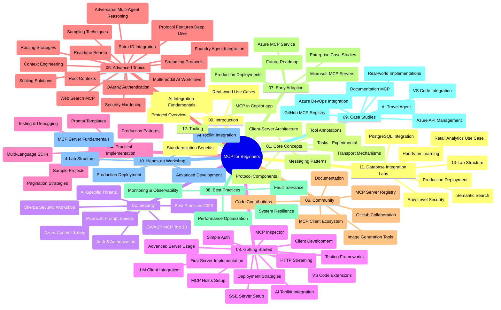

# Model Context Protocol (MCP) for Nybegynnere - Studieguide

Denne studieguiden gir en oversikt over mappestrukturen og innholdet i "Model Context Protocol (MCP) for Nybegynnere"-pensumet. Bruk denne guiden for å navigere effektivt i depotet og få mest mulig ut av de tilgjengelige ressursene.

## Depot Oversikt

Model Context Protocol (MCP) er et standardisert rammeverk for interaksjoner mellom AI-modeller og klientapplikasjoner. Opprinnelig laget av Anthropic, vedlikeholdes MCP nå av det bredere MCP-fellesskapet gjennom den offisielle GitHub-organisasjonen. Dette depotet tilbyr et omfattende pensum med praktiske kodeeksempler i C#, Java, JavaScript, Python og TypeScript, designet for AI-utviklere, systemarkitekter og programvareingeniører.

## Visuelt Pensumkart

## Depot Struktur

Depotet er organisert i tolv hovedseksjoner, hver med fokus på ulike aspekter av MCP:

1. **Introduksjon (00-Introduction/)**
   - Oversikt over Model Context Protocol
   - Hvorfor standardisering er viktig i AI-pipelines
   - Praktiske bruksområder og fordeler

2. **Kjernebegreper (01-CoreConcepts/)**
   - Klient-server-arkitektur
   - Viktige protokollkomponenter
   - Meldingsmønstre i MCP
   - Gjeldende spesifikasjon: [Hva har endret seg i MCP: Spesifikasjonen 2026-07-28](./01-CoreConcepts/mcp-2026-07-28.md) — den tilstandsløse protollkjernen, Extensions-rammeverket og utfasing av Roots/Sampling/Logging

3. **Sikkerhet (02-Security/)**
   - Sikkerhetstrusler i MCP-baserte systemer
   - Beste praksiser for sikring av implementasjoner
   - Autentiserings- og autorisasjonsstrategier
   - Praktisk [CIMD og DCR autorisasjonseksempel](./02-Security/samples/cimd-dcr-auth/README.md)
   - **Omfattende sikkerhetsdokumentasjon**:
     - MCP Sikkerhetsbeste praksiser
     - Azure Content Safety Implementasjonsveiledning
     - MCP Sikkerhetskontroller og teknikker
     - MCP Beste praksis Rask Referanse
   - **Viktige sikkerhetsemner**:
     - Angrep med prompt-injeksjon og verktøyforgiftning
     - Sesjonskapring og forvirret stedfortreder-problemer
     - Token pass-through sårbarheter
     - Overdrevne rettigheter og tilgangskontroll
     - Leverandørkjedesikkerhet for AI-komponenter
     - Integrasjon med Microsoft Prompt Shields

4. **Kom i gang (03-GettingStarted/)**
   - Miljøoppsett og konfigurasjon
   - Lage grunnleggende MCP-servere og klienter
   - Integrasjon med eksisterende applikasjoner
   - Inneholder seksjoner for:
     - Første serverimplementasjon
     - Klientutvikling
     - LLM-klientintegrasjon
     - VS Code-integrasjon
     - Server-Sent Events (SSE) server
     - Avansert serverbruk
     - HTTP-strømming
     - AI Toolkit-integrasjon
     - Teststrategier
     - Distribusjonsretningslinjer

5. **Praktisk implementering (04-PracticalImplementation/)**
   - Bruke SDK-er på tvers av ulike programmeringsspråk
   - Feilsøking, testing og valideringsteknikker
   - Lage gjenbrukbare promptmaler og arbeidsflyter
   - Eksempler på prosjekter med implementasjonsdemonstrasjoner

6. **Avanserte emner (05-AdvancedTopics/)**
   - Kontekstteknikker
   - Foundry-agentintegrasjon
   - Multimodale AI-arbeidsflyter
   - OAuth2 autentiseringsdemoer
   - Sanntidssøkfunksjonalitet
   - Sanntidsstrømming
   - Implementering av rotkontekster
   - Rutingsstrategier
   - Samplingsteknikker
   - Skaleringsmetoder
   - Sikkerhetshensyn
   - Entra ID sikkerhetsintegrasjon
   - Websøkintegrasjon
   - Adversarial multi-agent resonnering (debattmønstre)

7. **Fellesskapsbidrag (06-CommunityContributions/)**
   - Hvordan bidra med kode og dokumentasjon
   - Samarbeide via GitHub
   - Fellesskapsdrevne forbedringer og tilbakemeldinger
   - Bruke forskjellige MCP-klienter (Claude Desktop, Cline, VSCode)
   - Jobbe med populære MCP-servere inkludert bilde-generering

8. **Lærdom fra tidlig adopsjon (07-LessonsfromEarlyAdoption/)**
   - Virkelige implementasjoner og suksesshistorier
   - Bygging og distribusjon av MCP-baserte løsninger
   - Trender og fremtidig veikart
   - **Microsoft MCP Servere Guide**: Omfattende guide til 10 produksjonsklare Microsoft MCP-servere inkludert:
     - Microsoft Learn Docs MCP-server
     - Azure MCP-server (15+ spesialiserte tilkoblinger)
     - GitHub MCP-server
     - Azure DevOps MCP-server
     - MarkItDown MCP-server
     - SQL Server MCP-server
     - Playwright MCP-server
     - Dev Box MCP-server
     - Microsoft Foundry MCP-server
     - Microsoft 365 Agents Toolkit MCP-server

9. **Beste praksiser (08-BestPractices/)**
   - Ytelsesjustering og optimalisering
   - Designe feiltolerante MCP-systemer
   - Test- og robusthetsstrategier

10. **Case-studier (09-CaseStudy/)**
    - **Syv omfattende case-studier** som demonstrerer MCPs allsidighet på tvers av ulike scenarier:
    - **Azure AI Reiseagenter**: Multi-agent orkestrering med Azure OpenAI og AI Search
    - **Azure DevOps-integrasjon**: Automatisering av arbeidsflytprosesser med YouTube dataoppdateringer
    - **Sanntids dokumentasjonsinnhenting**: Python-konsollklient med HTTP-strømming
    - **Interaktiv studieplan-generator**: Chainlit webapp med konversasjonell AI
    - **In-editor dokumentasjon**: VS Code-integrasjon med GitHub Copilot arbeidsflyter
    - **Azure API Management**: Enterprise API-integrasjon med MCP serveropprettelse
    - **GitHub MCP Registry**: Økosystemutvikling og agentaktig integrasjonsplattform
    - Implementasjonseksempler som spenner over bedriftsintegrasjon, utviklerproduktivitet og økosystemutvikling

11. **Praktisk workshop (10-StreamliningAIWorkflowsBuildingAnMCPServerWithAIToolkit/)**
    - Omfattende praktisk workshop som kombinerer MCP med AI Toolkit
    - Bygge intelligente applikasjoner som kobler AI-modeller med virkelige verktøy
    - Praktiske moduler som dekker grunnleggende, tilpasset serverutvikling og produksjonsdistribusjonsstrategier
    - **Labstruktur**:
      - Lab 1: Grunnleggende MCP-server
      - Lab 2: Avansert MCP-serverutvikling
      - Lab 3: AI Toolkit-integrasjon
      - Lab 4: Produksjonsdistribusjon og skalering
    - Lab-basert læringsmetode med trinnvise instruksjoner

12. **MCP Server Database Integrasjon Labs (11-MCPServerHandsOnLabs/)**
    - **Omfattende 13-lab læringsløp** for å bygge produksjonsklare MCP-servere med PostgreSQL-integrasjon
    - **Virkelighetsnær retail analyseimplementasjon** ved bruk av Zava Retail brukstilfelle
    - **Enterprise-mønstre** inkludert Row Level Security (RLS), semantisk søk og multi-tenant data-tilgang
    - **Full labstruktur**:
      - **Lab 00-03: Grunnlag** - Introduksjon, Arkitektur, Sikkerhet, Miljøoppsett
      - **Lab 04-06: Bygge MCP-server** - Databasedesign, MCP-serverimplementasjon, Verktøyutvikling
      - **Lab 07-09: Avanserte funksjoner** - Semantisk søk, Testing & debugging, VS Code-integrasjon
      - **Lab 10-12: Produksjon & beste praksiser** - Distribusjon, overvåking, optimalisering
    - **Teknologier dekket**: FastMCP-rammeverk, PostgreSQL, Azure OpenAI, Azure Container Apps, Application Insights
    - **Læringsutbytte**: Produksjonsklare MCP-servere, databaseintegrasjonsmønstre, AI-drevet analyse, bedrifts-sikkerhet

13. **Verktøy (12-tooling/)**
    - Lær hvordan du bruker MCP i Copilot app og andre verktøy

## Ytterligere Ressurser

Depotet inkluderer støtteressurser:

- **Bilder-mappe**: Inneholder diagrammer og illustrasjoner brukt gjennom pensumet
- **Oversettelser**: Flerspråklig støtte med automatiserte oversettelser av dokumentasjon
- **Offisielle MCP-ressurser**:
  - [MCP Dokumentasjon](https://modelcontextprotocol.io/)
  - [MCP Spesifikasjon](https://modelcontextprotocol.io/specification/2026-07-28/)
  - [MCP GitHub Repository](https://github.com/modelcontextprotocol)

## Hvordan bruke dette depotet

1. **Sekvensiell læring**: Følg kapitlene i rekkefølge (00 til 11) for en strukturert læringsopplevelse.
2. **Språkspesifikt fokus**: Hvis du er interessert i et bestemt programmeringsspråk, utforsk samples-mappene for implementasjoner i ditt foretrukne språk.
3. **Praktisk implementering**: Start med "Kom i gang"-seksjonen for å sette opp miljøet ditt og lage din første MCP server og klient.
4. **Avansert utforskning**: Når du behersker det grunnleggende, gå videre til avanserte emner for å utvide kunnskapen din.
5. **Fellesskapsengasjement**: Bli med i MCP-fellesskapet via GitHub-diskusjoner og Discord-kanaler for å knytte kontakt med eksperter og andre utviklere.

## MCP-klienter og verktøy

Pensumet dekker ulike MCP-klienter og verktøy:

1. **Offisielle klienter**:
   - Visual Studio Code
   - MCP i Visual Studio Code
   - Claude Desktop
   - Claude i VSCode
   - Claude API

2. **Fellesskapsklienter**:
   - Cline (terminalbasert)
   - Cursor (kodeeditor)
   - ChatMCP
   - Windsurf

3. **MCP administrasjonsverktøy**:
   - MCP CLI
   - MCP Manager
   - MCP Linker
   - MCP Router

## Populære MCP-servere

Depotet introduserer forskjellige MCP-servere, inkludert:

1. **Offisielle Microsoft MCP-servere**:
   - Microsoft Learn Docs MCP-server
   - Azure MCP-server (15+ spesialiserte tilkoblinger)
   - GitHub MCP-server
   - Azure DevOps MCP-server
   - MarkItDown MCP-server
   - SQL Server MCP-server
   - Playwright MCP-server
   - Dev Box MCP-server
   - Microsoft Foundry MCP-server
   - Microsoft 365 Agents Toolkit MCP-server

2. **Offisielle referanseservere**:
   - Filesystem
   - Fetch
   - Memory
   - Sequential Thinking

3. **Bildegenerering**:
   - Azure OpenAI DALL-E 3
   - Stable Diffusion WebUI
   - Replicate

4. **Utviklingsverktøy**:
   - Git MCP
   - Terminal Control
   - Code Assistant

5. **Spesialiserte servere**:
   - Salesforce
   - Microsoft Teams
   - Jira & Confluence

## Bidra

Dette depotet ønsker bidrag fra fellesskapet velkommen. Se avsnittet Fellesskapsbidrag for veiledning om hvordan du kan bidra effektivt til MCP-økosystemet.

----

*Denne studieguiden ble sist oppdatert 9. september 2026. Den reflekterer MCP
Spesifikasjon `2026-07-28`, gjeldende protokollrevisjon. Noen praktiske
eksempler er uttrykkelig versjonert til `2025-11-25` mens deres SDK-er og verktøy
benytter de tilstandsløse protokoll-APIene.*

---

<!-- CO-OP TRANSLATOR DISCLAIMER START -->
**Ansvarsfraskrivelse**:
Dette dokumentet er oversatt ved hjelp av AI-oversettelsestjenesten [Co-op Translator](https://github.com/Azure/co-op-translator). Selv om vi streber etter nøyaktighet, vær oppmerksom på at automatiske oversettelser kan inneholde feil eller unøyaktigheter. Det opprinnelige dokumentet på originalspråket skal betraktes som den autoritative kilden. For kritisk informasjon anbefales profesjonell menneskelig oversettelse. Vi er ikke ansvarlige for eventuelle misforståelser eller feiltolkninger som oppstår ved bruk av denne oversettelsen.
<!-- CO-OP TRANSLATOR DISCLAIMER END -->