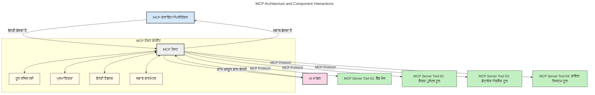
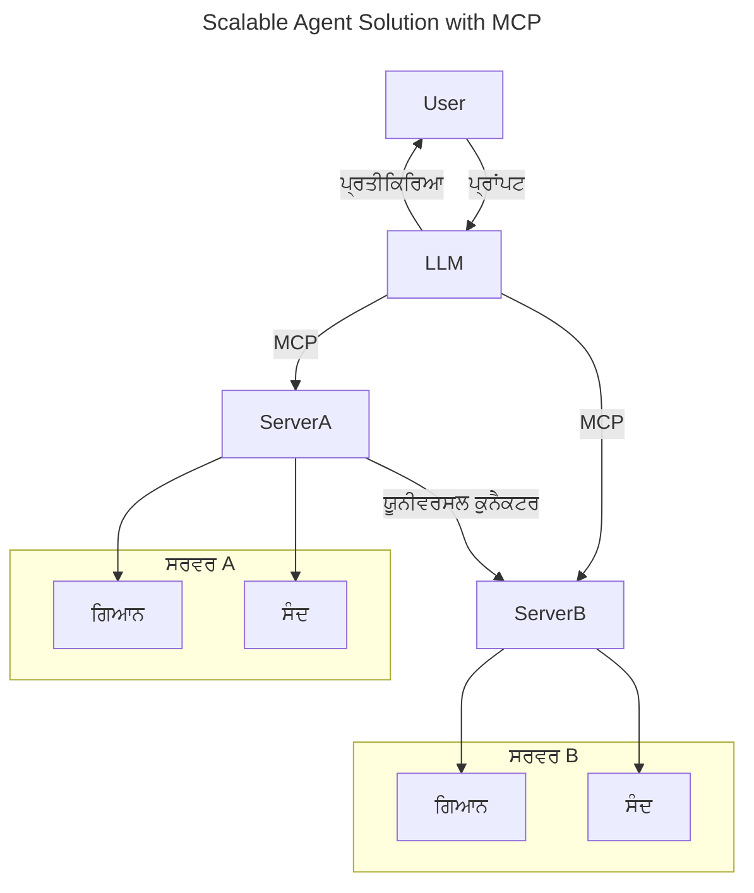
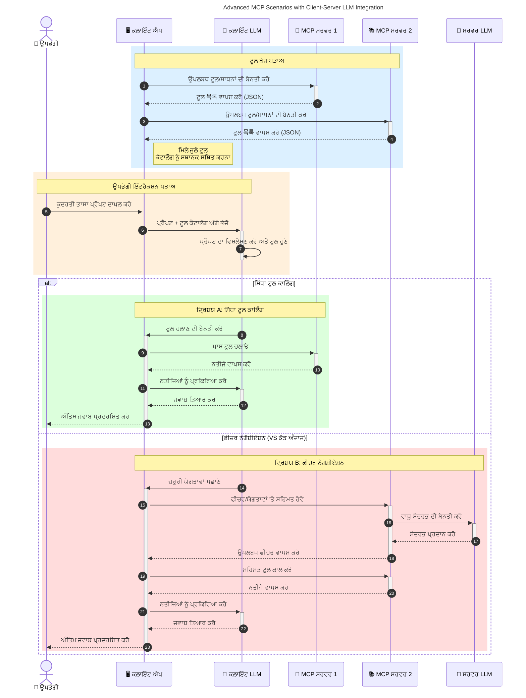

# ਮਾਡਲ ਸੰਦਰਭ ਪ੍ਰోటੋਕੋਲ (MCP) ਦਾ ਪਰਿਚਯ: ਵਿਆਪਕ AI ਐਪਲੀਕੇਸ਼ਨਾਂ ਲਈ ਇਸ ਦੀ ਅਹਿਮੀਅਤ

_(ਇਸ ਪਾਠ ਦਾ ਵੀਡੀਓ ਦੇਖਣ ਲਈ ਉੱਪਰ ਦਿੱਤੀ ਤਸਵੀਰ 'ਤੇ ਕਲਿੱਕ ਕਰੋ)_

ਜਨਰੇਟਿਵ AI ਐਪਲੀਕੇਸ਼ਨ ਇੱਕ ਵਧੀਆ ਉਨਤ ਕਦਮ ਹਨ ਕਿਉਂਕਿ ਇਹ ਅਕਸਰ ਉਪਭੋਕਤਾ ਨੂੰ ਕੁਦਰਤੀ ਭਾਸ਼ਾ ਪ੍ਰੋੰਪਟਸ ਨਾਲ ਐਪ ਨਾਲ ਸੰਵਾਦ ਕਰਨ ਦੀ ਆਗਿਆ ਦਿੰਦੇ ਹਨ। ਹਾਲਾਂਕਿ, ਜਿਵੇਂ ਜਿਵੇਂ ਇਨ੍ਹਾਂ ਐਪਸ ਵਿੱਚ ਸਮਾਂ ਅਤੇ ਸਰੋਤ ਨਿਵੇਸ਼ਿਤ ਹੁੰਦੇ ਹਨ, ਤੁਹਾਨੂੰ ਇਹ ਯਕੀਨ ਬਣਾਉਣਾ ਚਾਹੀਦਾ ਹੈ ਕਿ ਤੁਸੀਂ ਫੰਕਸ਼ਨਾਲਿਟੀ ਅਤੇ ਸਰੋਤਾਂ ਨੂੰ ਇਸ ਤਰ੍ਹਾਂ ਏਕੀਕृत ਕਰ ਸਕਦੇ ਹੋ ਜੋ ਵਾਧੇ ਲਈ ਸੁਗਮ ਹੋਵੇ, ਤੁਹਾਡਾ ਐਪ ਇੱਕ ਤੋਂ ਵੱਧ ਮਾਡਲਾਂ ਦੀ ਵਰਤੋਂ ਸਮਭਾਲ ਸਕੇ, ਅਤੇ ਵੱਖ-ਵੱਖ ਮਾਡਲ ਜਟਿਲਤਾਵਾਂ ਨੂੰ ਸੰਭਾਲ ਸਕੇ। ਸਧਾਰਨ ਸ਼ਬਦਾਂ ਵਿੱਚ, ਜਨ ਏਆਈ ਐਪਬੇਲਡਿੰਗ ਸ਼ੁਰੂ ਵਿੱਚ ਆਸਾਨ ਹੈ, ਪਰ ਜਿਵੇਂ ਜਿਵੇਂ ਇਹ ਵੱਧਦੇ ਹਨ ਅਤੇ ਜਟਿਲ ਹੋ ਜਾਂਦੇ ਹਨ, ਤੁਹਾਨੂੰ ਇੱਕ ਆਰਕੀਟੈਕਚਰ ਨੂੰ ਪਰਿਭਾਸ਼ਿਤ ਕਰਨ ਦੀ ਲੋੜ ਪੈਂਦੀ ਹੈ ਅਤੇ ਸੰਭਵ ਹੈ ਕਿ ਇੱਕ ਮਿਆਰੀਕृत ਮਾਡਲ 'ਤੇ ਨਿਰਭਰਤਾ ਹੋਵੇ ਤਾਂ ਕਿ ਤੁਹਾਡੇ ਐਪਸ ਲਗਾਤਾਰ ਤਰੀਕੇ ਨਾਲ ਬਣੇ ਰਹਿਣ। ਇੱਥੇ MCP ਚੀਜ਼ਾਂ ਨੂੰ ਵਿਵਸਥਿਤ ਕਰਨ ਅਤੇ ਇੱਕ ਮਿਆਰੀਕਰਨ ਪ੍ਰਦਾਨ ਕਰਨ ਲਈ ਆਉਂਦਾ ਹੈ।

---

## **🔍 ਮਾਡਲ ਸੰਦਰਭ ਪ੍ਰੋਟੋਕੋਲ (MCP) ਕੀ ਹੈ?**

**ਮਾਡਲ ਸੰਦਰਭ ਪ੍ਰੋਟੋਕੋਲ (MCP)** ਇੱਕ **ਖੁੱਲਾ, ਮਿਆਰੀਕ੍ਰਿਤ ਇੰਟਰਫੇਸ** ਹੈ ਜੋ ਵੱਡੇ ਲੈਂਗਵੇਜ ਮਾਡਲਾਂ (LLMs) ਨੂੰ ਬਾਹਰੀ ਸੰਦਾਂ, APIਜ਼ ਅਤੇ ਡਾਟਾ ਸਰੋਤਾਂ ਨਾਲ ਬਿਨਾ ਰੁਕਾਵਟ ਜੁੜਨ ਦੀ ਆਗਿਆ ਦਿੰਦਾ ਹੈ। ਇਹ ਇੱਕ ਸਥਿਰ ਆਰਕੀਟੈਕਚਰ ਪ੍ਰਦਾਨ ਕਰਦਾ ਹੈ ਜੋ AI ਮਾਡਲ ਦੀ ਕਾਰਗੁਜ਼ਾਰੀ ਨੂੰ ਉਸਦੇ ਪ੍ਰਸ਼ਿਕਸ਼ਣ ਡਾਟਾ ਤੋਂ ਬਾਹਰ ਵਧਾਉਂਦਾ ਹੈ, ਜਿਸ ਨਾਲ ਹੋਸ਼ਿਆਰ, ਵਿਆਪਕ ਅਤੇ ਤੇਜ਼ AI ਪ੍ਰਣਾਲੀਆਂ ਬਣਦੀਆਂ ਹਨ।

---

## **🎯 AI ਵਿੱਚ ਮਿਆਰੀਕਰਨ ਦੀ ਅਹਿਮੀਅਤ ਕਿਉਂ ਹੈ**

ਜਿਵੇਂ ਜਨਰੇਟਿਵ AI ਐਪਲੀਕੇਸ਼ਨ ਜ਼ਿਆਦਾ ਜਟਿਲ ਹੋਣ ਲੱਗਦੀਆਂ ਹਨ, ਇਹ ਜ਼ਰੂਰੀ ਹੁੰਦਾ ਹੈ ਕਿ ਅਜਿਹੇ ਮਿਆਰ ਅਪਣਾਏ ਜੁਿਹੜੇ ਨਾਲ **ਵਿਆਪਕਤਾ, ਵਿਸਥਾਰਯੋਗਤਾ, ਸੰਭਾਲਯੋਗਤਾ** ਅਤੇ **ਵੇਂਡਰ ਲੌਕ-ਇਨ ਤੋਂ ਬਚਾਵ** ਯਕੀਨੀ ਬਣਾਇਆ ਜਾਵੇ। MCP ਇਹਨੀਆਂ ਜ਼ਰੂਰਤਾਂ ਨੂੰ ਨਿਭਾਉਂਦਾ ਹੈ:

- ਮਾਡਲ-ਸੰਦ ਏਕੀਕਰਨ ਨੂੰ ਇਕਜੁਟ ਕਰਨਾ
- ਕੁੱਝ ਇੱਕ ਦਫਾ ਵਾਲੇ ਨਾਜ਼ੁਕ ਕਸਟਮ ਹੱਲਾਂ ਨੂੰ ਘਟਾਉਣਾ
- ਵੱਖ-ਵੱਖ ਵੇਂਡਰਾਂ ਦੇ ਕਈ ਮਾਡਲ ਇੱਕ ਹੀ ਪਰਿਸਰ ਵਿੱਚ ਰਹਿ ਸਕਣ

**ਨੋਟ:** ਜਦੋਂ ਕਿ MCP ਆਪਣੇ ਆਪ ਨੂੰ ਖੁੱਲੇ ਮਿਆਰੀਕਰਨ ਵਜੋਂ ਦ.assertTrue ਹੈ, ਕਿਸੇ ਮੌਜੂਦਾ ਮਿਆਰੀਕਰਨ ਸੰਸਥਾ ਜਿਵੇਂ IEEE, IETF, W3C, ISO ਜਾਂ ਕਿਸੇ ਹੋਰ ਮਿਆਰੀਕਰਨ ਸੰਸਥਾ ਰਾਹੀਂ MCP ਨੂੰ ਮਿਆਰੀਕ੍ਰਿਤ ਕਰਨ ਦੀ ਕੋਈ ਯੋਜਨਾ ਨਹੀਂ ਹੈ।

---

## **📚 ਸਿੱਖਣ ਦੇ ਉਦੇਸ਼**

ਇਸ ਲੇਖ ਦੇ ਅੰਤ ਤੱਕ, ਤੁਸੀਂ ਸਮਝ ਪਾOGੋਗੇ:

- **ਮਾਡਲ ਸੰਦਰਭ ਪ੍ਰੋਟੋਕੋਲ (MCP)** ਕੀ ਹੈ ਅਤੇ ਇਸਦੇ ਵਰਤੋਂ ਕੇਸ
- MCP ਮਾਡਲ-ਟੂ-ਟੂਲ ਸੰਚਾਰ ਨੂੰ ਕਿਵੇਂ ਮਿਆਰੀਕ੍ਰਿਤ ਕਰਦਾ ਹੈ
- MCP ਆਰਕੀਟੈਕਚਰ ਦੇ ਮੁੱਢਲੇ ਭਾਗਾਂ ਦੀ ਪਛਾਣ
- ਉਦਯੋਗ ਅਤੇ ਵਿਕਾਸ ਸੰਦੇਸ਼ਾਂ ਵਿੱਚ MCP ਦੀਆਂ ਅਸਲੀ ਦੁਨੀਆ ਦੀਆਂ ਵਰਤੋਂਆਂ ਦੀ ਪੜਚੋਲ

---

## **💡 MCP ਕਿਉਂ ਖੇਲ ਬਦਲਣ ਵਾਲਾ ਹੈ**

### **🔗 MCP AI ਇੰਟਰਐਕਸ਼ਨਾਂ ਵਿੱਚ ਵਿਖੰਡਨ ਨੂੰ ਸੁਲਝਾਉਂਦਾ ਹੈ**

MCP ਤੋਂ ਪਹਿਲਾਂ, ਮਾਡਲਾਂ ਨੂੰ ਸੰਦਾਂ ਨਾਲ ਜੋੜਨਾ ਲੋੜੀਂਦਾ ਸੀ:

- ਹਰ ਸੰਦ-ਮਾਡਲ ਜੋੜੀ ਲਈ ਕਸਟਮ ਕੋਡ
- ਹਰ ਵੇਂਡਰ ਲਈ ਗੈਰ-ਮਿਆਰੀ API
- ਅਕਸਰ ਅਪਡੇਟਾਂ ਕਾਰਨ ਟੁੱਟ ਜਾਣਾ
- ਵੱਧ ਸੰਦਾਂ ਨਾਲ ਕਮਜ਼ੋਰ ਵਿਆਪਕਤਾ

### **✅ MCP ਮਿਆਰੀਕਰਨ ਦੇ ਫਾਏਦੇ**

| **ਫਾਇਦਾ**               | **ਵੇਰਵਾ**                                                                     |
|--------------------------|--------------------------------------------------------------------------------|
| ਇੰਟਰਓਪਰੇਬਿਲਿਟੀ        | LLMs ਵੱਖ-ਵੱਖ ਵੇਂਡਰਾਂ ਦੇ ਸੰਦਾਂ ਨਾਲ ਸੁਚਾਰੂ ਕੰਮ ਕਰਦੇ ਹਨ                          |
| ਸਥਿਰਤਾ                  | ਪਲੇਟਫਾਰਮਾਂ ਅਤੇ ਸੰਦਾਂ ਉੱਤੇ ਇਕਸਾਰ ਵਰਤੋਂ                                      |
| ਦੁਬਾਰਾ ਵਰਤੋਂਯੋਗਤਾ      | ਇੱਕ ਵਾਰੀ ਬਣੇ ਸੰਦ ਪ੍ਰੋਜੈਕਟਾਂ ਅਤੇ ਪ੍ਰਣਾਲੀਆਂ ਵਿੱਚ ਵਰਤੇ ਜਾ ਸਕਦੇ ਹਨ                 |
| ਤੇਜ਼ ਵਿਕਾਸ              | ਮਿਆਰੀ, ਪਲੱਗ-ਐਂਡ-ਪਲੇਅ ਇੰਟਰਫੇਸ ਦੀ ਵਰਤੋਂ ਨਾਲ ਵਿਕਾਸ ਸਮਾਂ ਘਟਾਉਣਾ               |

---

## **🧱 MCP ਦਾ ਉੱਚ-ਸਤਰ ਦਾ ਆਰਕੀਟੈਕਚਰ ਸੰਖੇਪ** 

MCP ਇੱਕ **ਕਲਾਇੰਟ-ਸਰਵਰ ਮਾਡਲ** ਦਾ ਪਾਲਣ ਕਰਦਾ ਹੈ, ਜਿੱਥੇ:

- **MCP ਹੋਸਟ** AI ਮਾਡਲ ਚਲਾਉਂਦੇ ਹਨ
- **MCP ਕਲਾਇੰਟ** ਬੇਨਤੀ ਸ਼ੁਰੂ ਕਰਦੇ ਹਨ
- **MCP ਸਰਵਰ** ਸੰਦਰਭ, ਸੰਦ ਅਤੇ ਸਮਰੱਥਾਵਾਂ ਪ੍ਰਦਾਨ ਕਰਦੇ ਹਨ

### **ਮੁੱਖ ਘਟਕ:**

- **ਸਰੋਤ** – ਮਾਡਲਾਂ ਲਈ ਸਥਿਰ ਜਾਂ ਗਤੀਸ਼ੀਲ ਡਾਟਾ  
- **ਪ੍ਰੋੰਪਟ** – ਹੁਕੱਮਤਮਕ ਪੈਦਾ ਕਰਨ ਲਈ ਪਹਿਲਾਂ ਤੋਂ ਨਿਰਧਾਰਤ ਵਰਕਫਲੋ  
- **ਸੰਦ** – ਕਾਲ-ਯੋਗ ਕਾਰਜ ਜਿਵੇਂ ਖੋਜ, ਗਣਨਾਵਾਂ  
- **ਸੈਮਪਲਿੰਗ** – ਰਿਕਰਸੀਵ ਸੰਵਾਦਾਂ ਰਾਹੀਂ ਏਜੰਟਿਕ ਵਿਹਾਰ (MCP `2026-07-28` ਵਿੱਚ ਅਪ੍ਰਸਿੱਧ; ਨਵੇਂ ਇੰਪਲਿਮੈਂਟੇਸ਼ਨ ਸਿੱਧਾ LLM ਪਰਦਾਤਾ ਨਾਲ ਇਕਠੇ ਕਰਨੇ ਚਾਹੀਦੇ ਹਨ)
   

- **ਇਲਿਸਿਟੇਸ਼ਨ** – ਸਰਵਰ-ਸ਼ੁਰੂ ਕੀਤੇ ਬੇਨਤੀਆਂ ਉਪਭੋਗਤਾ ਇਨਪੁੱਟ ਲਈ
- **ਰੂਟਜ਼** – ਸਰਵਰ ਲਈ ਸੂਚਨਾਤਮਕ ਫਾਇਲ ਸਿਸਟਮ ਸਥਾਨ (MCP `2026-07-28` ਵਿੱਚ ਅਪ੍ਰਸਿੱਧ; ਬਿਹਤਰ ਹੈ ਸੰਦ ਪੈਰਾਮੀਟਰ, ਸਰੋਤ URIਜ਼, ਜਾਂ ਸਰਵਰ ਸੰਰਚਨਾ ਤੋਂ ਵਰਤਣਾ)
   

### **ਪ੍ਰੋਟੋਕੋਲ ਆਰਕੀਟੈਕਚਰ:**

MCP ਦੋ-ਪੱਧਰੀ ਆਰਕੀਟੈਕਚਰ ਵਰਤਦਾ ਹੈ:
- **ਡਾਟਾ ਲੇਅਰ**: JSON-RPC 2.0 ਸੁਨੇਹੇ, ਹਰ ਬੇਨਤੀ ਲਈ ਮੈਟਾਡੇਟਾ, ਖੋਜ ਅਤੇ ਪ੍ਰੋਟੋਕੋਲ ਪ੍ਰਾਇਮਿਟਿਵਜ਼
- **ਟ੍ਰਾਂਸਪੋਰਟ ਲੇਅਰ**: ਲੋਕਲ ਸਭ-ਪ੍ਰਕਿਰਿਆਵਾਂ ਲਈ stdio ਅਤੇ ਦੂਰੇ ਸਰਵਰਾਂ ਲਈ Streamable HTTP। Streamable HTTP ਸਟ੍ਰੀਮਡ ਜਵਾਬਾਂ ਲਈ SSE ਫਰੇਮਿੰਗ ਵਰਤ ਸਕਦਾ ਹੈ, ਪਰ ਪੁਰਾਣਾ HTTP+SSE ਟ੍ਰਾਂਸਪੋਰਟ ਅਪ੍ਰਸਿੱਧ ਹੈ।

---

## MCP ਸਰਵਰ ਕਿਵੇਂ ਕੰਮ ਕਰਦੇ ਹਨ

MCP ਸਰਵਰ ਹੇਠ ਲਿਖੇ ਤਰੀਕੇ ਨਾਲ ਕੰਮ ਕਰਦੇ ਹਨ:

- **ਬੇਨਤੀ ਦਾ ਪ੍ਰਵਾਹ**:
    1. ਇੱਕ ਬੇਨਤੀ ਇੱਕ ਅੰਤ ਉਪਭੋਗਤਾ ਜਾਂ ਉਹਦੇ ਵਲੋਂ ਕੰਮ ਕਰਨ ਵਾਲੇ ਸਾਫਟਵੇਅਰ ਦੁਆਰਾ ਸ਼ੁਰੂ ਕੀਤੀ ਜਾਂਦੀ ਹੈ।
    2. **MCP ਕਲਾਇੰਟ** ਬੇਨਤੀ ਨੂੰ ਇੱਕ **MCP ਹੋਸਟ** ਨੂੰ ਭੇਜਦਾ ਹੈ, ਜੋ AI ਮਾਡਲ ਰਨਟਾਈਮ ਪ੍ਰਬੰਧਿਤ ਕਰਦਾ ਹੈ।
    3. **AI ਮਾਡਲ** ਉਪਭੋਗਤਾ ਪ੍ਰੋੰਪਟ ਪ੍ਰਾਪਤ ਕਰਦਾ ਹੈ ਅਤੇ ਇਕ ਜਾਂ ਹੋਰ ਸੰਦ ਕਾਲਾਂ ਰਾਹੀਂ ਬਾਹਰੀ ਸੰਦਾਂ ਜਾਂ ਡਾਟਾ ਤੱਕ ਪਹੁੰਚ ਦੀ ਬੇਨਤੀ ਕਰ ਸਕਦਾ ਹੈ।
    4. **MCP ਹੋਸਟ**, ਸਿੱਧਾ ਮਾਡਲ ਨਹੀਂ, ਮਿਆਰੀਕ੍ਰਿਤ ਪ੍ਰੋਟੋਕੋਲ ਦੀ ਵਰਤੋਂ ਕਰਕੇ ਸੂਚਿਤ **MCP ਸਰਵਰ(ਜ਼)** ਨਾਲ ਸੰਚਾਰ ਕਰਦਾ ਹੈ।
- **MCP ਹੋਸਟ ਫੰਕਸ਼ਨਲਿਟੀ**:
    - **ਸੰਦ ਰਜਿਸਟਰੀ**: ਉਪਲਬਧ ਸੰਦਾਂ ਅਤੇ ਉਹਨਾਂ ਦੀਆਂ ਸਮਰੱਥਾਵਾਂ ਦੀ ਸੂਚੀ ਬਣਾਉਂਦਾ ਹੈ।
    - **ਪ੍ਰਮਾਣਿਕਤਾ**: ਸੰਦ ਪਹੁੰਚ ਲਈ ਅਧਿਕਾਰਾਂ ਦੀ ਜਾਂਚ ਕਰਦਾ ਹੈ।
    - **ਬੇਨਤੀ ਹੈਂਡਲਰ**: ਮਾਡਲ ਤੋਂ ਆਉਂਦੀਆਂ ਸੰਦ ਬੇਨਤੀਆਂ ਪ੍ਰੋਸੈਸ ਕਰਦਾ ਹੈ।
    - **ਜਵਾਬ ਫਾਰਮੈਟਰ**: ਮਾਡਲ ਲਈ ਸਮਝਣ ਯੋਗ ਫਾਰਮੈਟ ਵਿੱਚ ਸੰਦ ਦੇ ਨਤੀਜੇ ਤਿਆਰ ਕਰਦਾ ਹੈ।
- **MCP ਸਰਵਰ ਐਕਜ਼ਿਕਿਊਸ਼ਨ**:
    - **MCP ਹੋਸਟ** ਸੰਦ ਕਾਲਾਂ ਨੂੰ ਇੱਕ ਜਾਂ ਹੋਰ **MCP ਸਰਵਰ(ਜ਼)** ਨੂੰ ਰੂਟ ਕਰਦਾ ਹੈ, ਜੋ ਵਿਸ਼ੇਸ਼ ਕਾਰਜ (ਜਿਵੇਂ ਖੋਜ, ਗਣਨਾ, ਡੇਟਾਬੇਸ ਸਵਾਲ) ਪ੍ਰਦਾਨ ਕਰਦੇ ਹਨ।
    - **MCP ਸਰਵਰ(ਜ਼)** ਆਪਣੇ ਸੰਬੰਧਿਤ ਕਾਰਜ ਕਰਦੇ ਹਨ ਅਤੇ **MCP ਹੋਸਟ** ਨੂੰ ਇੱਕ ਸੰਗਠਿਤ ਫਾਰਮੈਟ ਵਿੱਚ ਨਤੀਜੇ ਵਾਪਸ ਕਰਦੇ ਹਨ।
    - **MCP ਹੋਸਟ** ਇਹ ਨਤੀਜੇ ਫਾਰਮੈਟ ਕਰਕੇ **AI ਮਾਡਲ** ਨੂੰ ਭੇਜਦਾ ਹੈ।
- **ਜਵਾਬ ਦੀ ਪੂਰੀ ਤਿਆਰੀ**:
    - **AI ਮਾਡਲ** ਸੰਦ ਤੋਂ ਪ੍ਰਾਪਤ ਨਤੀਜਿਆਂ ਨੂੰ ਅੰਤਿਮ ਜਵਾਬ ਵਿੱਚ ਸ਼ਾਮਿਲ ਕਰਦਾ ਹੈ।
    - **MCP ਹੋਸਟ** ਇਹ ਜਵਾਬ ਵਾਪਸ **MCP ਕਲਾਇੰਟ** ਨੂੰ ਭੇਜਦਾ ਹੈ, ਜੋ ਇਸ ਨੂੰ ਅੰਤ ਉਪਭੋਗਤਾ ਜਾਂ ਕਾਲ ਕਰਨ ਵਾਲੇ ਸਾਫਟਵੇਅਰ ਨੂੰ ਪ੍ਰਦਾਨ ਕਰਦਾ ਹੈ।
    

## 👨‍💻 MCP ਸਰਵਰ ਕਿਵੇਂ ਬਨਾਉਣਾ (ਉਦਾਹਰਨਾਂ ਸਮੇਤ)

MCP ਸਰਵਰ ਤੁਹਾਨੂੰ ਡਾਟਾ ਅਤੇ ਕਾਰਜ ਸਮਰੱਥਾ ਦਿਵਾ ਕੇ LLM ਦੀ ਯੋਗਤਾਵਾਂ ਫੈਲਾਉਣ ਦੀ ਆਗਿਆ ਦਿੰਦੇ ਹਨ। 

ਇਸਨੂੰ ਅਜ਼ਮਾਉਣ ਲਈ ਤਿਆਰ? ਇੱਥੇ ਭਿੰਨ ਭਾਸ਼ਾਵਾਂ/ਸਟੈਕ ਲਈ SDK ਅਤੇ ਸਧਾਰਨ MCP ਸਰਵਰ ਬਣਾਉਣ ਦੀਆਂ ਉਦਾਹਰਨਾਂ ਹਨ:

- **ਪਾਈਥਨ SDK**: https://github.com/modelcontextprotocol/python-sdk

- **ਟਾਈਪਸਕ੍ਰਿਪਟ SDK**: https://github.com/modelcontextprotocol/typescript-sdk

- **ਜਾਵਾ SDK**: https://github.com/modelcontextprotocol/java-sdk

- **C#/.NET SDK**: https://github.com/modelcontextprotocol/csharp-sdk

## 🌍 MCP ਲਈ ਅਸਲੀ ਦੁਨੀਆ ਦੀਆਂ ਵਰਤੋਂਆਂ

MCP AI ਯੋਗਤਾਵਾਂ ਨੂੰ ਫੈਲਾਉਣ ਨਾਲ ਵਿਆਪਕ ਐਪਲੀਕੇਸ਼ਨਾਂ ਨੂੰ ਯੋਗ ਬਣਾਉਂਦਾ ਹੈ:

| **ਐਪਲੀਕੇਸ਼ਨ**              | **ਵੇਰਵਾ**                                                                |
|------------------------------|-------------------------------------------------------------------------|
| ਉਦਯੋਗ ਡਾਟਾ ਏਕੀਕਰਨ          | LLMs ਨੂੰ ਡੇਟਾਬੇਸ, CRMਜਾਂ ਜਾਂ ਅੰਦਰੂਨੀ ਸੰਦਾਂ ਨਾਲ ਜੋੜਨਾ                 |
| ਏਜੰਟਿਕ AI ਪ੍ਰਣਾਲੀਆਂ           | ਸੰਦ ਪਹੁੰਚ ਅਤੇ ਫੈਸਲਾ-ਲੈਣ ਵਾਲੇ ਵਰਕਫਲੋ ਨਾਲ ਸਵੈ-ਚਾਲਿਤ ਏਜੰਟ ਯੋਗ ਬਣਾਉਣਾ     |
| ਬਹੁ-ਮੋਡਲ ਐਪਸ                | ਇੱਕ ਇਕਾਈਤ ਐਪ ਵਿੱਚ ਲੇਖ, ਤਸਵੀਰ ਅਤੇ ਆਡੀਓ ਸੰਦਾਂ ਦਾ ਮੇਲ                    |
| ਅਸਲੀ-ਸਮੇਂ ਡਾਟਾ ਏਕੀਕਰਨ        | ਹੋਰ ਸਹੀ, ਤਾਜ਼ਾ ਨਤੀਜੇ ਲਈ ਜੀਵੰਤ ਡਾਟਾ AI ਇੰਟਰਐਕਸ਼ਨਾਂ ਵਿੱਚ ਲਿਆਉਣਾ     |

### 🧠 MCP = AI ਇੰਟਰਐਕਸ਼ਨਾਂ ਲਈ ਵਿਸ਼ਵ ਵਿਆਪੀ ਮਿਆਰ

ਮਾਡਲ ਸੰਦਰਭ ਪ੍ਰੋਟੋਕੋਲ (MCP) AI ਇੰਟਰਐਕਸ਼ਨਾਂ ਲਈ ਇੱਕ ਵਿਸ਼ਵ ਵਿਆਪੀ ਮਿਆਰ ਵਜੋਂ ਕੰਮ ਕਰਦਾ ਹੈ, ਬਿਲਕੁਲ ਉਸ ਤਰ੍ਹਾਂ ਜਿਵੇਂ USB-C ਨੇ ਉਪਕਰਨਾਂ ਲਈ ਭੌਤਿਕ ਸੰਪਰਕ ਮਿਆਰੀਕ੍ਰਿਤ ਕੀਤੇ ਹਨ। AI ਦੀ ਦੁਨੀਆ ਵਿੱਚ, MCP ਇੱਕ ਲਗਾਤਾਰ ਇੰਟਰਫੇਸ ਪ੍ਰਦਾਨ ਕਰਦਾ ਹੈ, ਜੋ ਮਾਡਲਾਂ (ਕਲਾਇੰਟ) ਨੂੰ ਬਾਹਰੀ ਸੰਦਾਂ ਅਤੇ ਡਾਟਾ ਪ੍ਰਦਾਤਾਵਾਂ (ਸਰਵਰ) ਨਾਲ ਬਿਨਾ ਕਿਸੇ ਰੁਕਾਵਟ ਦੇ ਜੋੜਦਾ ਹੈ। ਇਸ ਨਾਲ ਹਰ API ਜਾਂ ਡਾਟਾ ਸਰੋਤ ਲਈ ਵੱਖ-ਵੱਖ, ਕਸਟਮ ਪ੍ਰੋਟੋਕੋਲ ਦੀ ਲੋੜ ਖਤਮ ਹੋ ਜਾਂਦੀ ਹੈ।

MCP ਹੇਠ, ਇੱਕ MCP-ਸਮਰਥਿਤ ਸੰਦ (ਜੋ MCP ਸਰਵਰ ਕਹਿੰਦੇ ਹਨ) ਇੱਕ ਸੰਗਠਿਤ ਮਿਆਰ ਦਾ ਪਾਲਣ ਕਰਦਾ ਹੈ। ਇਹ ਸਰਵਰ ਉਹ ਸੰਦ ਜਾਂ ਕਾਰਜਾਂ ਦੀ ਸੂਚੀ ਦੇ ਸਕਦੇ ਹਨ ਜੋ ਉਹ ਪ੍ਰਦਾਨ ਕਰਦੇ ਹਨ ਅਤੇ ਜਦੋਂ AI ਏਜੰਟ ਵਲੋਂ ਬੇਨਤੀ ਕੀਤੀ ਜਾਂਦੀ ਹੈ ਤਦ ਉਹਨਾਂ ਕਾਰਜਾਂ ਨੂੰ ਅਮਲ ਵਿੱਚ ਲਿਆਉਂਦੇ ਹਨ। MCP ਨੂੰ ਸਹਾਇਤਾ ਦੇਣ ਵਾਲੇ AI ਏਜੰਟ ਪਲੇਟਫਾਰਮ ਸਰਵਰ ਤੋਂ ਉਪਲਬਧ ਸੰਦ ਖੋਜ ਸਕਦੇ ਹਨ ਅਤੇ ਇਸ ਮਿਆਰੀਕ੍ਰਿਤ ਪ੍ਰੋਟੋਕੋਲ ਰਾਹੀਂ ਉਹਨਾਂ ਨੂੰ ਕਾਲ ਕਰ ਸਕਦੇ ਹਨ।

### 💡 ਗਿਆਨ ਤੱਕ ਪਹੁੰਚ ਆਸਾਨ ਬਣਾਉਂਦਾ ਹੈ

ਸਿਰਫ ਸੰਦ ਪ੍ਰਦਾਨ ਕਰਨ ਤੋਂ ਇਲਾਵਾ, MCP ਗਿਆਨ ਤੱਕ ਪਹੁੰਚ ਨੂੰ ਵੀ ਆਸਾਨ ਬਣਾਉਂਦਾ ਹੈ। ਇਹ ਐਪਲੀਕੇਸ਼ਨਾਂ ਨੂੰ ਵੱਡੇ ਭਾਸ਼ਾਈ ਮਾਡਲਾਂ (LLMs) ਨੂੰ ਸੰਦਰਭ ਪ੍ਰਦਾਨ ਕਰਨ ਦੀ ਆਗਿਆ ਦਿੰਦਾ ਹੈ ਜਿਵੇਂ ਕਿ ਉਹ ਵੱਖ-ਵੱਖ ਡਾਟਾ ਸਰੋਤਾਂ ਨਾਲ ਜੁੜਦੇ ਹਨ। ਉਦਾਹਰਨ ਵਜੋਂ, ਇੱਕ MCP ਸਰਵਰ ਕਿਸੇ ਕੰਪਨੀ ਦੇ ਦਸਤਾਵੇਜ਼ ਰਿਪੋਜ਼ਿਟਰੀ ਦੇ ਤੌਰ ਤੇ ਕੰਮ ਕਰ ਸਕਦਾ ਹੈ, ਜਿਸ ਨਾਲ ਏਜੰਟਾਂ ਨੂੰ ਮੰਗ 'ਤੇ ਸੰਬੰਧਿਤ ਜਾਣਕਾਰੀ ਪ੍ਰਾਪਤ ਕਰਨ ਦੀ ਆਗਿਆ ਮਿਲਦੀ ਹੈ। ਦੂਜਾ ਸਰਵਰ ਖਾਸ ਕਾਰਜਾਂ ਨੂੰ ਸੰਭਾਲ ਸਕਦਾ ਹੈ ਜਿਵੇਂ ਇਮੇਲ ਭੇਜਣਾ ਜਾਂ ਰਿਕਾਰਡਜ਼ ਅਪਡੇਟ ਕਰਨਾ। ਏਜੰਟ ਦੀ ਨਜ਼ਰ ਤੋਂ, ਇਹ ਸਿਰਫ ਸੰਦ ਹਨ ਜੋ ਉਹ ਵਰਤ ਸਕਦਾ ਹੈ—ਕੁਝ ਸੰਦ ਡਾਟਾ (ਗਿਆਨ ਸੰਦਰਭ) ਵਾਪਸ ਕਰਦੇ ਹਨ, ਦੂਜੇ ਕਾਰਜ ਕਰਦੇ ਹਨ। MCP ਦੋਹਾਂ ਨੂੰ ਕੁਸ਼ਲਤਾਪੂਰਵਕ ਨਿਭਾਉਂਦਾ ਹੈ।

ਇੱਕ ਏਜੰਟ ਜੋ MCP ਸਰਵਰ ਨਾਲ ਜੁੜਦਾ ਹੈ ਆਪਣੇ ਆਪ ਸਰਵਰ ਦੀਆਂ ਉਪਲਬਧ ਸਮਰੱਥਾਵਾਂ ਤੇ ਪਹੁੰਚਯੋਗ ਡਾਟਾ ਨੂੰ ਇੱਕ ਮਿਆਰੀ ਫਾਰਮੈਟ ਰਾਹੀਂ ਸਿੱਖਦਾ ਹੈ। ਇਹ ਮਿਆਰੀਕਰਨ ਗਤੀਸ਼ੀਲ ਸੰਦ ਉਪਲਬਧਤਾ ਨੂੰ ਸੰਭਵ ਬਣਾਉਂਦਾ ਹੈ। ਉਦਾਹਰਨ ਵਜੋਂ, ਇੱਕ ਨਵਾਂ MCP ਸਰਵਰ ਏਜੰਟ ਦੀ ਪ੍ਰਣਾਲੀ ਵਿੱਚ ਸ਼ਾਮਿਲ ਕਰਨਾ ਉਸਦੇ ਕਾਰਜਾਂ ਨੂੰ ਤੁਰੰਤ ਵਰਤਣਯੋਗ ਕਰ ਦਿੰਦਾ ਹੈ ਬਿਨਾਂ ਏਜੰਟ ਦੀਆਂ ਹਦਾਇਤਾਂ ਵਿੱਚ ਹੋਰ ਕਿਸੇ ਕਸਟਮਾਈਜ਼ੇਸ਼ਨ ਦੀ ਲੋੜ ਦੇ।

ਇਹ ਸਰਲ ਏਕੀਕਰਨ ਹੇਠਾਂ ਦਿੱਤੇ ਡਾਇਗ੍ਰਾਮ ਵਿੱਚ ਦਰਸाए ਫਲੋ ਅਨੁਸਾਰ ਹੈ, ਜਿਥੇ ਸਰਵਰ ਸੰਦਾਂ ਅਤੇ ਗਿਆਨ ਦੋਹਾਂ ਪ੍ਰਦਾਨ ਕਰਦੇ ਹਨ, ਇਹ ਸੁਨਿਸ਼ਚਿਤ ਕਰਦਾ ਹੈ ਕਿ ਸਿਸਟਮਾਂ ਵਿੱਚ ਬਿਨਾ ਕਿਸੇ ਰੁਕਾਵਟ ਦੇ ਸਹਿਯੋਗ ਹੋਵੇ। 

### 👉 ਉਦਾਹਰਨ: ਵਿਆਪਕ ਏਜੰਟ ਹੱਲ

ਯੂਨੀਵਰਸਲ ਕਨੈਕਟਰ MCP ਸਰਵਰਾਂ ਨੂੰ ਆਪਸ ਵਿੱਚ ਸੰਚਾਰ ਅਤੇ ਸਮਰੱਥਾਵਾਂ ਸਾਂਝੇ ਕਰਨ ਯੋਗ ਬਣਾਉਂਦਾ ਹੈ, ਜਿਸ ਨਾਲ ਸਰਵਰA ਸਰਵਰB ਨੂੰ ਕੰਮ ਸੌਂਪ ਸਕਦਾ ਹੈ ਜਾਂ ਉਸ ਦੇ ਸੰਦਾਂ ਅਤੇ ਗਿਆਨ ਤੱਕ ਪਹੁੰਚ ਕਰ ਸਕਦਾ ਹੈ। ਇਹ ਸੰਦਾਂ ਅਤੇ ਡਾਟਾ ਦਾ ਫੈਡਰੇਸ਼ਨ ਕਰਦਾ ਹੈ, ਵਿਆਪਕ ਅਤੇ ਮਾਡਯੂਲਰ ਏਜੰਟ ਆਰਕੀਟੈਕਚਰਾਂ ਲਈ ਸਹਾਇਕ। ਕਿਉਂਕਿ MCP ਸੰਦ ਪ੍ਰਗਟਾਵਾਂ ਨੂੰ ਮਿਆਰੀਕ੍ਰਿਤ ਕਰਦਾ ਹੈ, ਏਜੰਟ ਬਿਨਾਂ ਹਾਰਡਕੋਡ ਕੀਤੇ ਏਕੀਕਰਨ ਦੇ ਸਰਵਰਾਂ ਵਿਚਕਾਰ ਬੇਨਤੀਆਂ ਖੋਜ ਅਤੇ ਰੂਟ ਕਰ ਸਕਦੇ ਹਨ।

ਸੰਦ ਅਤੇ ਗਿਆਨ ਫੈਡਰੇਸ਼ਨ: ਸੰਸਥਾਵਾਂ 'ਚ ਸੰਦ ਅਤੇ ਡਾਟਾ ਤੱਕ ਪਹੁੰਚ ਸੰਭਵ ਹੈ, ਜਿਸ ਨਾਲ ਜ਼ਿਆਦਾ ਵਿਆਪਕ ਅਤੇ ਮਾਡਯੂਲਰ ਏਜੰਟਿਕ ਆਰਕੀਟੈਕਚਰ ਬਣਦੇ ਹਨ।

### 🔄 ਗਾਹਕ-ਪਾਸੇ LLM ਏਕੀਕਰਨ ਨਾਲ ਉੱਚ-ਪੱਧਰੀ MCP ਦ੍ਰਿਸ਼

ਆਧਾਰਭੂਤ MCP ਆਰਕੀਟੈਕਚਰ ਤੋਂ ਇਲਾਵਾ, ਕੁਝ ਉੱਚ-ਪੱਧਰੀ ਦ੍ਰਿਸ਼ਾਂ ਹਨ ਜਿਥੇ ਕਲਾਇੰਟ ਅਤੇ ਸਰਵਰ ਦੋਹਾਂ ਵਿੱਚ LLM ਹੁੰਦੇ ਹਨ, ਜੋ ਹੋਰ ਪ੍ਰਗਟ ਇੰਟਰਐਕਸ਼ਨਾਂ ਨੂੰ ਯੋਗ ਬਣਾਉਂਦੇ ਹਨ। ਹੇਠਾਂ ਦਿੱਤੇ ਡਾਇਗ੍ਰਾਮ ਵਿੱਚ, **ਕਲਾਇੰਟ ਐਪ** ਇੱਕ IDE ਹੋ ਸਕਦਾ ਹੈ ਜਿਸ ਵਿੱਚ LLM ਦੁਆਰਾ ਵਰਤੇ ਜਾਣ ਵਾਲੇ ਕਈ MCP ਸੰਦ ਉਪਲਬਧ ਹਨ:

## 🔐 MCP ਦੇ ਵਿਹਾਰਕ ਲਾਭ

ਇੱਥੇ MCP ਵਰਤਣ ਦੇ ਵਿਹਾਰਕ ਲਾਭ ਹਨ:

- **ਤਾਜ਼ਗੀ**: ਮਾਡਲ ਆਪਣੇ ਪ੍ਰਸ਼ਿਕਸ਼ਣ ਡਾਟਾ ਤੋਂ ਅੱਗੇ ਤਾਜ਼ਾ ਜਾਣਕਾਰੀ ਤੱਕ ਪਹੁੰਚ ਸਕਦੇ ਹਨ
- **ਯੋਗਤਾ ਵਿਕਾਸ**: ਮਾਡਲ ਉਹ ਕਾਰਜ ਕਰਨ ਲਈ ਵਿਸ਼ੇਸ਼ ਸੰਦ ਵਰਤ ਸਕਦੇ ਹਨ ਜਿਨ੍ਹਾਂ ਲਈ ਉਹ ਪ੍ਰਸ਼ਿਕਸ਼ਿਤ ਨਹੀਂ ਸਨ
- **ਘੱਟ ਭ੍ਰਮਿਤੀਆਂ**: ਬਾਹਰੀ ਡਾਟਾ ਸਰੋਤ ਤਥਾਂਤਮਕ ਆਧਾਰ ਪ੍ਰਦਾਨ ਕਰਦੇ ਹਨ
- **ਗੋਪਨੀਯਤਾ**: ਸੰਵੇਦਨਸ਼ੀਲ ਡਾਟਾ ਪ੍ਰੋੰਪਟਸ ਵਿੱਚ ਸਮਾਇਆ ਜਾਣ ਦਿਆਂ ਬਜਾਏ ਸੁਰੱਖਿਅਤ ਵਾਤਾਵਰਣਾਂ ਵਿੱਚ ਰਹਿ ਸਕਦਾ ਹੈ

## 📌 ਮਹੱਤਵਪੂਰਨ ਨਤੀਜੇ

MCP ਵਰਤਣ ਲਈ ਹੇਠਾਂ ਦਿੱਤੇ ਅਹੰਕਾਰਕ ਨਤੀਜੇ ਹਨ:

- **MCP** AI ਮਾਡਲਾਂ ਦੇ ਸੰਦਾਂ ਅਤੇ ਡਾਟਾ ਨਾਲ ਤਾਲਮੇਲ ਦੇ ਤਰੀਕੇ ਨੂੰ ਮਿਆਰੀਕ੍ਰਿਤ ਕਰਦਾ ਹੈ
- **ਵਿਸਥਾਰਯੋਗਤਾ, ਸਥਿਰਤਾ ਅਤੇ ਇੰਟਰਓਪਰੇਬਿਲਿਟੀ** ਨੂੰ ਉਤਸ਼ਾਹਤ ਕਰਦਾ ਹੈ
- MCP ਵਿਕਾਸ ਸਮਾਂ ਘਟਾਉਣ, ਭਰੋਸੇਯੋਗਤਾ ਵਿੱਚ ਸੁਧਾਰ ਅਤੇ ਮਾਡਲ ਯੋਗਤਾਵਾਂ ਨੂੰ ਵਧਾਉਣ ਵਿੱਚ ਸਹਾਇਤਾ ਕਰਦਾ ਹੈ
- ਕਲਾਇੰਟ-ਸਰਵਰ ਆਰਕੀਟੈਕਚਰ ਲਚਕੀਲੇ, ਵਿਸਥਾਰਯੋਗ AI ਐਪਲੀਕੇਸ਼ਨ ਬਣਾਉਂਦਾ ਹੈ

## 🧠 ਅਭਿਆਸ

ਉਸ AI ਐਪਲੀਕੇਸ਼ਨ ਬਾਰੇ ਸੋਚੋ ਜੋ ਤੁਸੀਂ ਬਣਾਉਣ ਵਿੱਚ ਰੁਚੀ ਰੱਖਦੇ ਹੋ।

- ਕਿਹੜੇ **ਬਾਹਰੀ ਸੰਦ ਜਾਂ ਡਾਟਾ** ਇਸਦੀ ਯੋਗਤਾਵਾਂ ਨੂੰ ਵਧਾ ਸਕਦੇ ਹਨ?
- MCP ਏਕੀਕਰਨ ਨੂੰ **ਸਧਾਰਨ ਅਤੇ ਭਰੋਸੇਯੋਗ** ਕਿਵੇਂ ਬਣਾ ਸਕਦਾ ਹੈ?

## ਵਾਧੂ ਸਰੋਤ

- [MCP GitHub ਰਿਪੋਜ਼ਿਟਰੀ](https://github.com/modelcontextprotocol)

## ਅਗਲਾ ਕੀ ਹੈ

ਅਗਲਾ: [ਅਧਿਆਇ 1: ਮੁੱਖ ਸੰਕਲਪ](../01-CoreConcepts/README.md)

---

<!-- CO-OP TRANSLATOR DISCLAIMER START -->
**ਅਸਵੀਕਾਰੋਪਣ**:
ਇਸ ਦਸਤਾਵੇਜ਼ ਦਾ ਅਨੁਵਾਦ ਏਆਈ ਅਨੁਵਾਦ ਸੇਵਾ [Co-op Translator](https://github.com/Azure/co-op-translator) ਦੀ ਵਰਤੋਂ ਕਰਕੇ ਕੀਤਾ ਗਿਆ ਹੈ। ਜਦੋਂ ਕਿ ਅਸੀਂ ਸਹੀਤਾਵਾਂ ਲਈ ਯਤਨਸ਼ੀਲ ਹਾਂ, ਕਿਰਪਾ ਕਰਕੇ ਧਿਆਨ ਰੱਖੋ ਕਿ ਸਵੈਚਾਲਿਤ ਅਨੁਵਾਦਾਂ ਵਿੱਚ ਗਲਤੀਆਂ ਜਾਂ ਅਸਮੱਤਿਆਵਾਂ ਹੋ ਸਕਦੀਆਂ ਹਨ। ਮੂਲ ਦਸਤਾਵੇਜ਼ ਆਪਣੀ ਮੂਲ ਭਾਸ਼ਾ ਵਿੱਚ ਅਧਿਕਾਰਕ ਸਰੋਤ ਮੰਨਿਆ ਜਾਣਾ ਚਾਹੀਦਾ ਹੈ। ਜਰੂਰੀ ਜਾਣਕਾਰੀ ਲਈ, ਪੇਸ਼ੇਵਰ ਮਨੁੱਖੀ ਅਨੁਵਾਦ ਦੀ ਸਿਫ਼ਾਰਸ਼ ਕੀਤੀ ਜਾਂਦੀ ਹੈ। ਅਸੀਂ ਇਸ ਅਨੁਵਾਦ ਦੇ ਉਪਯੋਗ ਤੋਂ ਪੈਦਾ ਹੋਣ ਵਾਲੀਆਂ ਕਿਸੇ ਵੀ ਗਲਤਫਹਿਮੀਆਂ ਜਾਂ ਗਲਤ ਵਿਆਖਿਆਵਾਂ ਲਈ ਜਵਾਬਦੇਹ ਨਹੀਂ ਹਾਂ।
<!-- CO-OP TRANSLATOR DISCLAIMER END -->