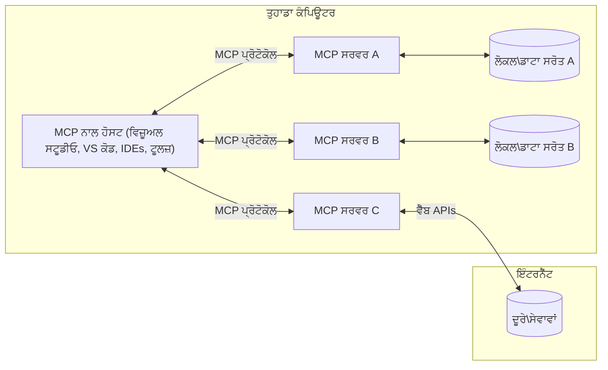

# MCP ਕੋਰ ਸੰਕਲਪ: AI ਇੰਟੀਗ੍ਰੇਸ਼ਨ ਲਈ ਮਾਡਲ ਸੰਦਰਭ ਪ੍ਰੋਟੋਕੋਲ ਵਿੱਚ ਮਾਹਰਤਾ

[](https://youtu.be/earDzWGtE84)

_(ਇਸ ਪਾਠ ਦਾ ਵੀਡੀਓ ਦੇਖਣ ਲਈ ਉਪਰ ਦਿੱਤੀ ਤਸਵੀਰ 'ਤੇ ਕਲਿੱਕ ਕਰੋ)_

[Model Context Protocol (MCP)](https://github.com/modelcontextprotocol) ਇੱਕ ਸ਼ਕਤੀਸ਼ਾਲੀ, ਮਿਆਰੀਕ੍ਰਿਤ ਫਰੇਮਵਰਕ ਹੈ ਜੋ ਵੱਡੇ ਭਾਸ਼ਾ ਮਾਡਲਾਂ (LLMs) ਅਤੇ ਬਾਹਰੀ ਟੂਲਾਂ, ਐਪਲੀਕੇਸ਼ਨਾਂ ਅਤੇ ਡਾਟਾ ਸਰੋਤਾਂ ਵਿਚਕਾਰ ਸੰਚਾਰ ਨੂੰ ਅਨੁਕੂਲਿਤ ਕਰਦਾ ਹੈ।  
ਇਹ ਗਾਈਡ ਤੁਹਾਨੂੰ MCP ਦੇ ਮੁੱਖ ਸੰਕਲਪਾਂ ਰਾਹੀਂ ਲੈ ਕੇ ਚਲੇਗੀ। ਤੁਸੀਂ ਇਸ ਦੀ ਕਲਾਇੰਟ-ਸਰਵਰ ਆਰਕੀਟੈਕਚਰ, ਜ਼ਰੂਰੀ ਘਟਕ, ਸੰਚਾਰ ਮਕੈਨਿਕਸ ਅਤੇ ਲਾਗੂ ਕਰਨ ਦੀਆਂ ਸਭ ਤੋਂ ਵਧੀਆ ਪ੍ਰਥਾਵਾਂ ਬਾਰੇ ਸਿੱਖੋਗੇ।

- **ਸਪਸ਼ਟ ਉਪਭੋਗਤਾ ਸਹਿਮਤੀ**: ਸਾਰੇ ਡਾਟਾ ਐਕਸੈਸ ਅਤੇ ਕਾਰਵਾਈਆਂ ਨੂੰ ਚਲਾਉਣ ਤੋਂ ਪਹਿਲਾਂ ਸਪਸ਼ਟ ਉਪਭੋਗਤਾ ਮਨਜ਼ੂਰੀ ਦੀ ਲੋੜ ਹੁੰਦੀ ਹੈ। ਉਪਭੋਗਤਾਵਾਂ ਨੂੰ ਸਪਸ਼ਟ ਤੌਰ 'ਤੇ ਸਮਝਣਾ ਚਾਹੀਦਾ ਹੈ ਕਿ ਕਿਹੜਾ ਡਾਟਾ ਐਕਸੈਸ ਕੀਤਾ ਜਾਵੇਗਾ ਅਤੇ ਕਿਹੜੀਆਂ ਕਾਰਵਾਈਆਂ ਕੀਤੀਆਂ ਜਾਣਗੀਆਂ, ਜਿਨ੍ਹਾਂ ਉੱਤੇ ਅਨੁਮਤੀਆਂ ਅਤੇ ਅਧਿਕਾਰਾਂ 'ਤੇ ਵਿਸਥਾਰਤ ਨਿਯੰਤਰਣ ਹੋਵੇ।

- **ਡਾਟਾ ਗੋਪਨੀਯਤਾ ਸੁਰੱਖਿਆ**: ਉਪਭੋਗਤਾ ਡਾਟਾ ਸਿਰਫ ਸਪਸ਼ਟ ਸਹਿਮਤੀ ਨਾਲ ਹੀ ਪ੍ਰਗਟ ਕੀਤਾ ਜਾਂਦਾ ਹੈ ਅਤੇ ਪੂਰੇ ਇੰਟਰੈਕਸ਼ਨ ਲਾਈਫਸਾਈਕਲ ਦੌਰਾਨ ਮਜ਼ਬੂਤ ਐਕਸੈਸ ਕੰਟਰੋਲਾਂ ਨਾਲ ਸੁਰੱਖਿਅਤ ਕੀਤਾ ਜਾਣਾ ਚਾਹੀਦਾ ਹੈ। ਲਾਗੂ ਕਰਨ ਵਾਲੇ ਅਣਅਧਿਕ੍ਰਿਤ ਡਾਟਾ ਪ੍ਰਸਾਰਣ ਨੂੰ ਰੋਕਣ ਅਤੇ ਕੜੀ ਗੋਪਨੀਯਤਾ ਸੀਮਾਵਾਂ ਨੂੰ ਬਣਾਈ ਰੱਖਣੇ ਚਾਹੀਦੇ ਹਨ।

- **ਟੂਲ ਚਲਾਉਣ ਦੀ ਸੁਰੱਖਿਆ**: ਹਰ ਟੂਲ ਕਾਲ ਲਈ ਸਪਸ਼ਟ ਉਪਭੋਗਤਾ ਸਹਿਮਤੀ ਦੀ ਲੋੜ ਹੁੰਦੀ ਹੈ ਜਿਸ ਵਿੱਚ ਟੂਲ ਦੀ ਕਾਰਗੁਜ਼ਾਰੀ, ਪੈਰਾਮੀਟਰ ਅਤੇ ਸੰਭਾਵਿਤ ਪ੍ਰਭਾਵ ਦੀ ਸਪਸ਼ਟ ਸਮਝ ਹੋਵੇ। ਮਜ਼ਬੂਤ ਸੁਰੱਖਿਆ ਸੀਮਾਵਾਂ ਅਣਚਾਹੀ, ਅਸੁਰੱਖਿਅਤ ਜਾਂ ਦੁਰਵਿਵਹਾਰਕ ਟੂਲ ਚਲਾਉਣ ਨੂੰ ਰੋਕਣੀਆਂ ਚਾਹੀਦੀਆਂ ਹਨ।

- **ਟ੍ਰਾਂਸਪੋਰਟ ਲੇਅਰ ਸੁਰੱਖਿਆ**: ਸਾਰੇ ਸੰਚਾਰ ਚੈਨਲਾਂ ਨੂੰ ਉਚਿਤ ਇਨਕ੍ਰਿਪਸ਼ਨ ਅਤੇ ਪ੍ਰਮਾਣਿਕਤਾ ਮਕੈਨਿਜ਼ਮ ਵਰਤਣੇ ਚਾਹੀਦੇ ਹਨ। ਰਿਮੋਟ ਕਨੈਕਸ਼ਨਾਂ ਨੂੰ ਸੁਰੱਖਿਅਤ ਟ੍ਰਾਂਸਪੋਰਟ ਪ੍ਰੋਟੋਕੋਲ ਅਤੇ ਢੰਗ ਨਾਲ ਕ੍ਰੈਡੈਂਸ਼ੀਅਲ ਪ੍ਰਬੰਧਨ ਲਾਗੂ ਕਰਨਾ ਚਾਹੀਦਾ ਹੈ।

#### ਲਾਗੂ ਕਰਨ ਦੇ ਨਿਰਦੇਸ਼:

- **ਅਨੁਮਤੀ ਪ੍ਰਬੰਧਨ**: ਬਰੀਕੀ ਨਾਲ ਅਨੁਮਤੀ ਪ੍ਰਣਾਲੀਆਂ ਲਾਗੂ ਕਰੋ ਜੋ ਉਪਭੋਗਤਾਵਾਂ ਨੂੰ ਨਿਯੰਤਰਿਤ ਕਰਨ ਦੀ ਆਗਿਆ ਦਿੰਦੀਆਂ ਹਨ ਕਿ ਕਿਹੜੇ ਸਰਵਰ, ਟੂਲ ਅਤੇ ਸਰੋਤ ਉਪਲਬਧ ਹਨ  
- **ਪ੍ਰਮਾਣਿਕਤਾ ਅਤੇ ਅਧਿਕਾਰ**: ਸੁਰੱਖਿਅਤ ਪ੍ਰਮਾਣਿਕਤਾ ਤਰੀਕੇ (OAuth, API ਕੁੰਜੀਆਂ) ਵਰਤੋ ਜਿਨ੍ਹਾਂ ਵਿੱਚ ਢੰਗ ਨਾਲ ਟੋਕਨ ਪ੍ਰਬੰਧਨ ਅਤੇ ਮਿਆਦ ਖਤਮ ਹੋਣਾ ਸ਼ਾਮਲ ਹੈ  
- **ਇਨਪੁੱਟ ਵੈਧਤਾ**: ਸਾਰੇ ਪੈਰਾਮੀਟਰ ਅਤੇ ਡਾਟਾ ਇਨਪੁੱਟ ਨੂੰ ਪਰਿਭਾਸ਼ਿਤ ਸਕੀਮਾਂ ਅਨੁਸਾਰ ਵੈਧ ਕਰੋ ਤਾਂ ਜੋ ਇੰਜੈਕਸ਼ਨ ਹਮਲਿਆਂ ਤੋਂ ਬਚਿਆ ਜਾ ਸਕੇ  
- **ਆਡਿਟ ਲੌਗਿੰਗ**: ਸੁਰੱਖਿਆ ਨਿਗਰਾਨੀ ਅਤੇ ਅਨੁਕੂਲਤਾ ਲਈ ਸਾਰੀਆਂ ਕਾਰਵਾਈਆਂ ਦੇ ਵਿਸਥਾਰਪੂਰਕ ਲੌਗ ਰੱਖੋ

## ਓਵਰਵਿਊ

ਇਹ ਪਾਠ ਮਾਡਲ ਸੰਦਰਭ ਪ੍ਰੋਟੋਕੋਲ (MCP) ਪਰਿਵਾਰ ਦੀ ਮੂਲ ਆਰਕੀਟੈਕਚਰ ਅਤੇ ਘਟਕਾਂ ਦੀ ਖੋਜ ਕਰਦਾ ਹੈ। ਤੁਸੀਂ ਕਲਾਇੰਟ-ਸਰਵਰ ਆਰਕੀਟੈਕਚਰ, ਮੁੱਖ ਘਟਕ ਅਤੇ ਸੰਚਾਰ ਮਕੈਨਿਕਸ ਬਾਰੇ ਜਾਣੋਗੇ ਜੋ MCP ਇੰਟਰੈਕਸ਼ਨਾਂ ਨੂੰ ਚਲਾਉਂਦੇ ਹਨ।

## ਮੁੱਖ ਸਿੱਖਣ ਦੇ ਲਕੜੀ

ਇਸ ਪਾਠ ਦੇ ਅੰਤ ਤੱਕ, ਤੁਸੀਂ:

- MCP ਕਲਾਇੰਟ-ਸਰਵਰ ਆਰਕੀਟੈਕਚਰ ਨੂੰ ਸਮਝੋਗੇ।  
- ਹੋਸਟ, ਕਲਾਇੰਟ ਅਤੇ ਸਰਵਰਾਂ ਦੀਆਂ ਭੂਮਿਕਾਵਾਂ ਅਤੇ ਜ਼ਿੰਮੇਵਾਰੀਆਂ ਦੀ ਪਛਾਣ ਕਰੋਗੇ।  
- ਉਹ ਮੁੱਖ ਵਿਸ਼ੇਸ਼ਤਾਵਾਂ ਵਿਸ਼ਲੇਸ਼ਣ ਕਰੋਗੇ ਜੋ MCP ਨੂੰ ਇੱਕ ਲਚਕੀਲਾ ਇੰਟੀਗ੍ਰੇਸ਼ਨ ਲੇਅਰ ਬਣਾਉਂਦੀਆਂ ਹਨ।  
- MCP ਪਰਿਵਾਰ ਵਿੱਚ ਜਾਣਕਾਰੀ ਕਿਵੇਂ ਪ੍ਰਵਾਹਿਤ ਹੁੰਦੀ ਹੈ, ਇਹ ਸਿੱਖੋਗੇ।  
- .NET, ਜਾਵਾ, ਪਾਇਥਨ ਅਤੇ ਜਾਵਾਸਕ੍ਰਿਪਟ ਵਿੱਚ ਕੋਡ ਉਦਾਹਰਣਾਂ ਰਾਹੀਂ ਪ੍ਰਯੋਗਿਕ ਜਾਣਕਾਰੀਆਂ ਪ੍ਰਾਪਤ ਕਰੋਗੇ।

## MCP ਆਰਕੀਟੈਕਚਰ: ਇੱਕ ਡੂੰਘੀ ਨਜ਼ਰ

MCP ਪਰਿਵਾਰ ਇੱਕ ਕਲਾਇੰਟ-ਸਰਵਰ ਮਾਡਲ 'ਤੇ ਬਣਿਆ ਹੈ। ਇਹ ਮਾਡਿਊਲਰ ਢਾਂਚਾ AI ਐਪਲੀਕੇਸ਼ਨਾਂ ਨੂੰ ਟੂਲਾਂ, ਡੇਟਾਬੇਸ, API ਅਤੇ ਸੰਦਰਭਿਕ ਸਰੋਤਾਂ ਨਾਲ ਪ੍ਰਭਾਵਸ਼ਾਲੀ ਤਰੀਕੇ ਨਾਲ ਇੰਟਰੈਕਟ ਕਰਨ ਦੀ ਆਗਿਆ ਦਿੰਦਾ ਹੈ। ਆਓ ਇਸ ਆਰਕੀਟੈਕਚਰ ਨੂੰ ਇਸਦੇ ਮੁੱਖ ਘਟਕਾਂ ਵਿੱਚ ਵੰਡਦੇ ਹਾਂ।

ਆਪਣੇ ਮੁੱਖ ਵਿੱਚ, MCP ਇੱਕ ਕਲਾਇੰਟ-ਸਰਵਰ ਆਰਕੀਟੈਕਚਰ ਦੀ ਪਾਲਣਾ ਕਰਦਾ ਹੈ ਜਿੱਥੇ ਇੱਕ ਹੋਸਟ ਐਪਲੀਕੇਸ਼ਨ ਕਈ ਸਰਵਰਾਂ ਨਾਲ ਜੁੜ ਸਕਦਾ ਹੈ:


- **MCP ਹੋਸਟਸ**: ਐਸੇ ਪ੍ਰੋਗਰਾਮ ਜਿਵੇਂ VSCode, Claude Desktop, IDEs ਜਾਂ AI ਟੂਲ ਜੋ MCP ਰਾਹੀਂ ਡਾਟਾ ਐਕਸੈਸ ਕਰਨਾ ਚਾਹੁੰਦੇ ਹਨ  
- **MCP ਕਲਾਇੰਟਸ**: ਪ੍ਰੋਟੋਕੋਲ ਕਲਾਇੰਟ ਜੋ ਸਰਵਰਾਂ ਨਾਲ 1:1 ਕਨੈਕਸ਼ਨ ਬਣਾਈ ਰੱਖਦੇ ਹਨ  
- **MCP ਸਰਵਰਸ**: ਹਲਕੇ-ਫੁਲਕੇ ਪ੍ਰੋਗਰਾਮ ਜੋ ਹਰ ਇੱਕ ਮਿਆਰੀਕ੍ਰਿਤ Model Context Protocol ਰਾਹੀਂ ਖਾਸ ਸਮਰੱਥਾਵਾਂ ਪ੍ਰਗਟ ਕਰਦੇ ਹਨ  
- **ਲੋਕਲ ਡਾਟਾ ਸਰੋਤ**: ਤੁਹਾਡੇ ਕੰਪਿਊਟਰ ਦੀਆਂ ਫਾਈਲਾਂ, ਡੇਟਾਬੇਸ ਅਤੇ ਸੇਵਾਵਾਂ ਜਿਨ੍ਹਾਂ ਤੱਕ MCP ਸਰਵਰ ਸੁਰੱਖਿਅਤ ਤਰੀਕੇ ਨਾਲ ਪਹੁੰਚ ਸਕਦੇ ਹਨ  
- **ਰਿਮੋਟ ਸੇਵਾਵਾਂ**: ਬਾਹਰੀ ਪ੍ਰਣਾਲੀਆਂ ਜੋ ਇੰਟਰਨੈੱਟ ਰਾਹੀਂ ਉਪਲਬਧ ਹਨ ਅਤੇ ਜਿਨ੍ਹਾਂ ਨਾਲ MCP ਸਰਵਰ API ਰਾਹੀਂ ਜੁੜ ਸਕਦੇ ਹਨ।

MCP ਪ੍ਰੋਟੋਕੋਲ ਇੱਕ ਵਿਕਾਸਸ਼ੀਲ ਮਿਆਰ ਹੈ ਜੋ ਤਾਰੀਖ-ਆਧਾਰਿਤ ਵਰਜਨਿੰਗ (YYYY-MM-DD ਫਾਰਮੈਟ) ਵਰਤਦਾ ਹੈ। ਮੌਜੂਦਾ ਪ੍ਰੋਟੋਕੋਲ ਵਰਜਨ **2025-11-25** ਹੈ। ਤੁਸੀਂ [ਪ੍ਰੋਟੋਕੋਲ ਵਿਸ਼ੇਸ਼ਤਾ](https://modelcontextprotocol.io/specification/2025-11-25/) ਵਿੱਚ ਤਾਜ਼ਾ ਅੱਪਡੇਟ ਵੇਖ ਸਕਦੇ ਹੋ।

### 1. ਹੋਸਟਸ

Model Context Protocol (MCP) ਵਿੱਚ, **ਹੋਸਟਸ** ਉਹ AI ਐਪਲੀਕੇਸ਼ਨ ਹਨ ਜੋ ਪ੍ਰੋਟੋਕੋਲ ਨਾਲ ਉਪਭੋਗਤਾਵਾਂ ਦੇ ਮੁੱਖ ਇੰਟਰਫੇਸ ਵਜੋਂ ਕੰਮ ਕਰਦੇ ਹਨ। ਹੋਸਟ MCP ਸਰਵਰਾਂ ਨਾਲ ਕਈ ਕਨੈਕਸ਼ਨਾਂ ਦਾ ਪ੍ਰਬੰਧਨ ਕਰਦੇ ਹਨ ਅਤੇ ਹਰ ਸਰਵਰ ਕਨੈਕਸ਼ਨ ਲਈ ਸਮਰਪਿਤ MCP ਕਲਾਇੰਟ ਬਣਾਉਂਦੇ ਹਨ। ਹੋਸਟਸ ਦੇ ਉਦਾਹਰਣ ਹਨ:

- **AI ਐਪਲੀਕੇਸ਼ਨ**: Claude Desktop, Visual Studio Code, Claude Code  
- **ਡਿਵੈਲਪਮੈਂਟ ਵਾਤਾਵਰਣ**: IDEs ਅਤੇ ਕੋਡ ਐਡੀਟਰ MCP ਇੰਟੀਗ੍ਰੇਸ਼ਨ ਨਾਲ  
- **ਕਸਟਮ ਐਪਲੀਕੇਸ਼ਨ**: ਮਕਸਦ-ਨਿਰਧਾਰਿਤ AI ਏਜੰਟ ਅਤੇ ਟੂਲ

**ਹੋਸਟਸ** ਐਪਲੀਕੇਸ਼ਨ ਹਨ ਜੋ AI ਮਾਡਲ ਇੰਟਰੈਕਸ਼ਨਾਂ ਦਾ ਸਹਿਯੋਜਨ ਕਰਦੇ ਹਨ। ਉਹ:

- **AI ਮਾਡਲਾਂ ਦਾ ਸੰਗਠਨ**: LLMs ਨੂੰ ਚਲਾਉਂਦੇ ਜਾਂ ਇੰਟਰੈਕਟ ਕਰਦੇ ਹਨ ਤਾਂ ਜੋ ਜਵਾਬ ਤਿਆਰ ਹੋਣ ਅਤੇ AI ਵਰਕਫਲੋਜ਼ ਦਾ ਸਹਿਯੋਜਨ ਹੋਵੇ  
- **ਕਲਾਇੰਟ ਕਨੈਕਸ਼ਨਾਂ ਦਾ ਪ੍ਰਬੰਧਨ**: ਹਰ MCP ਸਰਵਰ ਕਨੈਕਸ਼ਨ ਲਈ ਇੱਕ MCP ਕਲਾਇੰਟ ਬਣਾਉਂਦੇ ਅਤੇ ਬਣਾਈ ਰੱਖਦੇ ਹਨ  
- **ਉਪਭੋਗਤਾ ਇੰਟਰਫੇਸ ਨੂੰ ਨਿਯੰਤਰਿਤ ਕਰਨਾ**: ਗੱਲਬਾਤ ਦਾ ਪ੍ਰਵਾਹ, ਉਪਭੋਗਤਾ ਇੰਟਰੈਕਸ਼ਨ ਅਤੇ ਜਵਾਬ ਪ੍ਰਸਤੁਤੀ ਸੰਭਾਲਦੇ ਹਨ  
- **ਸੁਰੱਖਿਆ ਲਾਗੂ ਕਰਨਾ**: ਅਨੁਮਤੀਆਂ, ਸੁਰੱਖਿਆ ਸੀਮਾਵਾਂ ਅਤੇ ਪ੍ਰਮਾਣਿਕਤਾ ਨੂੰ ਨਿਯੰਤਰਿਤ ਕਰਦੇ ਹਨ  
- **ਉਪਭੋਗਤਾ ਸਹਿਮਤੀ ਸੰਭਾਲਣਾ**: ਡਾਟਾ ਸਾਂਝਾ ਕਰਨ ਅਤੇ ਟੂਲ ਚਲਾਉਣ ਲਈ ਉਪਭੋਗਤਾ ਮਨਜ਼ੂਰੀ ਦਾ ਪ੍ਰਬੰਧ ਕਰਦੇ ਹਨ

### 2. ਕਲਾਇੰਟਸ

**ਕਲਾਇੰਟਸ** ਅਹੰਕਾਰਪੂਰਕ ਘਟਕ ਹਨ ਜੋ ਹੋਸਟ ਅਤੇ MCP ਸਰਵਰਾਂ ਵਿਚਕਾਰ ਸਮਰਪਿਤ ਇੱਕ-ਤੋਂ-ਇੱਕ ਕਨੈਕਸ਼ਨਾਂ ਨੂੰ ਬਣਾਈ ਰੱਖਦੇ ਹਨ। ਹਰ MCP ਕਲਾਇੰਟ ਨੂੰ ਹੋਸਟ ਵੱਲੋਂ ਕਿਸੇ ਖਾਸ MCP ਸਰਵਰ ਨਾਲ ਜੁੜਨ ਲਈ ਬਣਾਇਆ ਜਾਂਦਾ ਹੈ, ਜਿਸ ਨਾਲ ਸੁਚੱਜੇ ਅਤੇ ਸੁਰੱਖਿਅਤ ਸੰਚਾਰ ਚੈਨਲ ਬਣਦੇ ਹਨ। ਕਈ ਕਲਾਇੰਟਸ ਹੋਸਟ ਨੂੰ ਇੱਕ ਸਮੇਂ ਕਈ ਸਰਵਰਾਂ ਨਾਲ ਜੁੜਨ ਦੀ ਆਗਿਆ ਦਿੰਦੇ ਹਨ।

**ਕਲਾਇੰਟਸ** ਹੋਸਟ ਐਪਲੀਕੇਸ਼ਨ ਦੇ ਅੰਦਰ ਕਨੈਕਟਰ ਘਟਕ ਹਨ। ਉਹ:

- **ਪ੍ਰੋਟੋਕੋਲ ਸੰਚਾਰ**: ਸਰਵਰਾਂ ਨੂੰ JSON-RPC 2.0 ਬੇਨਤੀ ਭੇਜਦੇ ਹਨ ਜਿਸ ਵਿੱਚ ਪ੍ਰਾਂਪਟ ਅਤੇ ਹਦਾਇਤਾਂ ਹੁੰਦੀਆਂ ਹਨ  
- **ਸਮਰੱਥਾ ਸਹਿਮਤੀ**: ਸ਼ੁਰੂਆਤ ਦੌਰਾਨ ਸਰਵਰਾਂ ਨਾਲ ਸਮਰੱਥਾਵਾਂ ਅਤੇ ਪ੍ਰੋਟੋਕੋਲ ਵਰਜਨਾਂ 'ਤੇ ਸਹਿਮਤੀ ਕਰਦੇ ਹਨ  
- **ਟੂਲ ਚਲਾਉਣਾ**: ਮਾਡਲਾਂ ਤੋਂ ਟੂਲ ਚਲਾਉਣ ਦੀਆਂ ਬੇਨਤੀਆਂ ਦਾ ਪ੍ਰਬੰਧਨ ਕਰਦੇ ਹਨ ਅਤੇ ਜਵਾਬ ਪ੍ਰਕਿਰਿਆ ਕਰਦੇ ਹਨ  
- **ਰੀਅਲ-ਟਾਈਮ ਅੱਪਡੇਟਸ**: ਸਰਵਰਾਂ ਤੋਂ ਸੂਚਨਾਵਾਂ ਅਤੇ ਤੁਰੰਤ ਅੱਪਡੇਟਸ ਸੰਭਾਲਦੇ ਹਨ  
- **ਜਵਾਬ ਪ੍ਰਕਿਰਿਆ**: ਉਪਭੋਗਤਾਵਾਂ ਨੂੰ ਦਿਖਾਉਣ ਲਈ ਸਰਵਰ ਜਵਾਬਾਂ ਨੂੰ ਪ੍ਰਕਿਰਿਆ ਅਤੇ ਫਾਰਮੈਟ ਕਰਦੇ ਹਨ

### 3. ਸਰਵਰਸ

**ਸਰਵਰਸ** ਉਹ ਪ੍ਰੋਗਰਾਮ ਹਨ ਜੋ MCP ਕਲਾਇੰਟਸ ਨੂੰ ਸੰਦਰਭ, ਟੂਲ ਅਤੇ ਸਮਰੱਥਾਵਾਂ ਪ੍ਰਦਾਨ ਕਰਦੇ ਹਨ। ਉਹ ਸਥਾਨਕ (ਹੋਸਟ ਨਾਲ ਇੱਕੋ ਮਸ਼ੀਨ) ਜਾਂ ਰਿਮੋਟ (ਬਾਹਰੀ ਪਲੇਟਫਾਰਮਾਂ 'ਤੇ) ਚਲ ਸਕਦੇ ਹਨ ਅਤੇ ਕਲਾਇੰਟ ਬੇਨਤੀਆਂ ਨੂੰ ਸੰਭਾਲਣ ਅਤੇ ਸੰਰਚਿਤ ਜਵਾਬ ਪ੍ਰਦਾਨ ਕਰਨ ਦੇ ਜ਼ਿੰਮੇਵਾਰ ਹੁੰਦੇ ਹਨ। ਸਰਵਰ ਮਿਆਰੀਕ੍ਰਿਤ Model Context Protocol ਰਾਹੀਂ ਖਾਸ ਕਾਰਗੁਜ਼ਾਰੀ ਪ੍ਰਗਟ ਕਰਦੇ ਹਨ।

**ਸਰਵਰਸ** ਸੇਵਾਵਾਂ ਹਨ ਜੋ ਸੰਦਰਭ ਅਤੇ ਸਮਰੱਥਾਵਾਂ ਪ੍ਰਦਾਨ ਕਰਦੀਆਂ ਹਨ। ਉਹ:

- **ਫੀਚਰ ਰਜਿਸਟ੍ਰੇਸ਼ਨ**: ਉਪਲਬਧ ਪ੍ਰਿਮਿਟਿਵਜ਼ (ਸਰੋਤ, ਪ੍ਰਾਂਪਟ, ਟੂਲ) ਨੂੰ ਕਲਾਇੰਟਸ ਲਈ ਰਜਿਸਟਰ ਅਤੇ ਪ੍ਰਗਟ ਕਰਦੇ ਹਨ  
- **ਬੇਨਤੀ ਪ੍ਰਕਿਰਿਆ**: ਕਲਾਇੰਟ ਤੋਂ ਟੂਲ ਕਾਲ, ਸਰੋਤ ਬੇਨਤੀਆਂ ਅਤੇ ਪ੍ਰਾਂਪਟ ਬੇਨਤੀਆਂ ਪ੍ਰਾਪਤ ਕਰਕੇ ਚਲਾਉਂਦੇ ਹਨ  
- **ਸੰਦਰਭ ਪ੍ਰਦਾਨ ਕਰਨਾ**: ਮਾਡਲ ਜਵਾਬਾਂ ਨੂੰ ਸੁਧਾਰਨ ਲਈ ਸੰਦਰਭਿਕ ਜਾਣਕਾਰੀ ਅਤੇ ਡਾਟਾ ਦਿੰਦੇ ਹਨ  
- **ਸਟੇਟ ਪ੍ਰਬੰਧਨ**: ਜਦੋਂ ਲੋੜ ਹੋਵੇ, ਸੈਸ਼ਨ ਸਥਿਤੀ ਨੂੰ ਬਣਾਈ ਰੱਖਦੇ ਅਤੇ ਸਥਿਤੀਵਾਨ ਇੰਟਰੈਕਸ਼ਨਾਂ ਨੂੰ ਸੰਭਾਲਦੇ ਹਨ  
- **ਰੀਅਲ-ਟਾਈਮ ਸੂਚਨਾਵਾਂ**: ਸਮਰੱਥਾ ਬਦਲਾਅ ਅਤੇ ਅੱਪਡੇਟਸ ਬਾਰੇ ਜੁੜੇ ਕਲਾਇੰਟਸ ਨੂੰ ਸੂਚਿਤ ਕਰਦੇ ਹਨ

ਸਰਵਰ ਕਿਸੇ ਵੀ ਵਿਅਕਤੀ ਵੱਲੋਂ ਵਿਕਸਿਤ ਕੀਤੇ ਜਾ ਸਕਦੇ ਹਨ ਤਾਂ ਜੋ ਮਾਡਲ ਸਮਰੱਥਾਵਾਂ ਨੂੰ ਵਿਸ਼ੇਸ਼ਤ ਕਾਰਗੁਜ਼ਾਰੀ ਨਾਲ ਵਧਾਇਆ ਜਾ ਸਕੇ, ਅਤੇ ਉਹ ਸਥਾਨਕ ਅਤੇ ਰਿਮੋਟ ਤੈਨਾਤੀ ਦ੍ਰਿਸ਼ਾਂਤਾਂ ਦੋਹਾਂ ਨੂੰ ਸਹਿਯੋਗ ਦਿੰਦੇ ਹਨ।

### 4. ਸਰਵਰ ਪ੍ਰਿਮਿਟਿਵਜ਼

Model Context Protocol (MCP) ਵਿੱਚ ਸਰਵਰ ਤਿੰਨ ਮੁੱਖ **ਪ੍ਰਿਮਿਟਿਵਜ਼** ਪ੍ਰਦਾਨ ਕਰਦੇ ਹਨ ਜੋ ਕਲਾਇੰਟਸ, ਹੋਸਟ ਅਤੇ ਭਾਸ਼ਾ ਮਾਡਲਾਂ ਵਿਚਕਾਰ ਧਨਾਤਮਕ ਇੰਟਰੈਕਸ਼ਨਾਂ ਲਈ ਮੂਲ ਭਵਨਾਤਮਕ ਇਕਾਈਆਂ ਨੂੰ ਪਰਿਭਾਸ਼ਿਤ ਕਰਦੇ ਹਨ। ਇਹ ਪ੍ਰਿਮਿਟਿਵਜ਼ ਪ੍ਰੋਟੋਕੋਲ ਰਾਹੀਂ ਉਪਲਬਧ ਸੰਦਰਭਿਕ ਜਾਣਕਾਰੀ ਅਤੇ ਕਾਰਵਾਈਆਂ ਦੇ ਕਿਸਮਾਂ ਨੂੰ ਨਿਰਧਾਰਤ ਕਰਦੇ ਹਨ।

MCP ਸਰਵਰ ਹੇਠਾਂ ਦਿੱਤੇ ਤਿੰਨ ਮੁੱਖ ਪ੍ਰਿਮਿਟਿਵਜ਼ ਵਿੱਚੋਂ ਕਿਸੇ ਵੀ ਸੰਯੋਜਨ ਨੂੰ ਪ੍ਰਗਟ ਕਰ ਸਕਦੇ ਹਨ:

#### ਸਰੋਤ (Resources)

**ਸਰੋਤ** ਡਾਟਾ ਸਰੋਤ ਹਨ ਜੋ AI ਐਪਲੀਕੇਸ਼ਨਾਂ ਨੂੰ ਸੰਦਰਭਿਕ ਜਾਣਕਾਰੀ ਪ੍ਰਦਾਨ ਕਰਦੇ ਹਨ। ਇਹ ਸਥਿਰ ਜਾਂ ਗਤੀਸ਼ੀਲ ਸਮੱਗਰੀ ਨੂੰ ਦਰਸਾਉਂਦੇ ਹਨ ਜੋ ਮਾਡਲ ਦੀ ਸਮਝ ਅਤੇ ਫੈਸਲਾ ਕਰਨ ਦੀ ਸਮਰੱਥਾ ਨੂੰ ਵਧਾਉਂਦੇ ਹਨ:

- **ਸੰਦਰਭਿਕ ਡਾਟਾ**: AI ਮਾਡਲ ਦੀ ਖਪਤ ਲਈ ਸੰਰਚਿਤ ਜਾਣਕਾਰੀ ਅਤੇ ਸੰਦਰਭ  
- **ਜਾਣਕਾਰੀ ਅਧਾਰ**: ਦਸਤਾਵੇਜ਼ ਸੰਗ੍ਰਹਿ, ਲੇਖ, ਮੈਨੂਅਲ ਅਤੇ ਖੋਜ ਪੱਤਰ  
- **ਲੋਕਲ ਡਾਟਾ ਸਰੋਤ**: ਫਾਈਲਾਂ, ਡੇਟਾਬੇਸ ਅਤੇ ਸਥਾਨਕ ਪ੍ਰਣਾਲੀ ਜਾਣਕਾਰੀ  
- **ਬਾਹਰੀ ਡਾਟਾ**: API ਜਵਾਬ, ਵੈੱਬ ਸੇਵਾਵਾਂ ਅਤੇ ਰਿਮੋਟ ਪ੍ਰਣਾਲੀ ਡਾਟਾ  
- **ਗਤੀਸ਼ੀਲ ਸਮੱਗਰੀ**: ਬਾਹਰੀ ਹਾਲਾਤਾਂ ਦੇ ਅਧਾਰ 'ਤੇ ਅੱਪਡੇਟ ਹੁੰਦਾ ਤੁਰੰਤ ਡਾਟਾ

ਸਰੋਤ URI ਦੁਆਰਾ ਪਛਾਣੇ ਜਾਂਦੇ ਹਨ ਅਤੇ `resources/list` ਰਾਹੀਂ ਖੋਜੇ ਜਾ ਸਕਦੇ ਹਨ ਅਤੇ `resources/read` ਮੈਥਡ ਨਾਲ ਪ੍ਰਾਪਤ ਕੀਤੇ ਜਾ ਸਕਦੇ ਹਨ:

```text
file://documents/project-spec.md
database://production/users/schema
api://weather/current
```

#### ਪ੍ਰਾਂਪਟਸ (Prompts)

**ਪ੍ਰਾਂਪਟਸ** ਦੁਬਾਰਾ ਵਰਤਣ ਯੋਗ ਟੈਮਪਲੇਟ ਹਨ ਜੋ ਭਾਸ਼ਾ ਮਾਡਲਾਂ ਨਾਲ ਇੰਟਰੈਕਸ਼ਨ ਨੂੰ ਸੰਰਚਿਤ ਕਰਨ ਵਿੱਚ ਮਦਦ ਕਰਦੇ ਹਨ। ਇਹ ਮਿਆਰੀਕ੍ਰਿਤ ਇੰਟਰੈਕਸ਼ਨ ਪੈਟਰਨ ਅਤੇ ਟੈਮਪਲੇਟ ਵਰਕਫਲੋਜ਼ ਪ੍ਰਦਾਨ ਕਰਦੇ ਹਨ:

- **ਟੈਮਪਲੇਟ-ਆਧਾਰਿਤ ਇੰਟਰੈਕਸ਼ਨ**: ਪਹਿਲਾਂ ਤੋਂ ਬਣੇ ਸੁਨੇਹੇ ਅਤੇ ਗੱਲਬਾਤ ਸ਼ੁਰੂ ਕਰਨ ਵਾਲੇ  
- **ਵਰਕਫਲੋ ਟੈਮਪਲੇਟਸ**: ਆਮ ਕਾਰਜਾਂ ਅਤੇ ਇੰਟਰੈਕਸ਼ਨਾਂ ਲਈ ਮਿਆਰੀਕ੍ਰਿਤ ਕ੍ਰਮ  
- **ਥੋੜ੍ਹੇ-ਸ਼ਾਟ ਉਦਾਹਰਣ**: ਮਾਡਲ ਨਿਰਦੇਸ਼ ਲਈ ਉਦਾਹਰਣ-ਆਧਾਰਿਤ ਟੈਮਪਲੇਟ  
- **ਸਿਸਟਮ ਪ੍ਰਾਂਪਟਸ**: ਮਾਡਲ ਦੇ ਵਿਹਾਰ ਅਤੇ ਸੰਦਰਭ ਨੂੰ ਪਰਿਭਾਸ਼ਿਤ ਕਰਨ ਵਾਲੇ ਮੂਲ ਪ੍ਰਾਂਪਟ  
- **ਗਤੀਸ਼ੀਲ ਟੈਮਪਲੇਟਸ**: ਵਿਸ਼ੇਸ਼ ਸੰਦਰਭਾਂ ਲਈ ਅਨੁਕੂਲਿਤ ਪੈਰਾਮੀਟਰਾਈਜ਼ਡ ਪ੍ਰਾਂਪਟ

ਪ੍ਰਾਂਪਟਸ ਵੈਰੀਏਬਲ ਬਦਲਾਅ ਦਾ ਸਮਰਥਨ ਕਰਦੇ ਹਨ ਅਤੇ `prompts/list` ਰਾਹੀਂ ਖੋਜੇ ਜਾ ਸਕਦੇ ਹਨ ਅਤੇ `prompts/get` ਨਾਲ ਪ੍ਰਾਪਤ ਕੀਤੇ ਜਾ ਸਕਦੇ ਹਨ:

```markdown
Generate a {{task_type}} for {{product}} targeting {{audience}} with the following requirements: {{requirements}}
```

#### ਟੂਲਸ (Tools)

**ਟੂਲਸ** ਚਲਾਏ ਜਾ ਸਕਣ ਵਾਲੇ ਫੰਕਸ਼ਨ ਹਨ ਜਿਨ੍ਹਾਂ ਨੂੰ AI ਮਾਡਲ ਖਾਸ ਕਾਰਵਾਈਆਂ ਕਰਨ ਲਈ ਕਾਲ ਕਰ ਸਕਦੇ ਹਨ। ਇਹ MCP ਪਰਿਵਾਰ ਦੇ "ਕਿਰਿਆਵਾਂ" ਹਨ, ਜੋ ਮਾਡਲਾਂ ਨੂੰ ਬਾਹਰੀ ਪ੍ਰਣਾਲੀਆਂ ਨਾਲ ਇੰਟਰੈਕਟ ਕਰਨ ਦੇ ਯੋਗ ਬਣਾਉਂਦੇ ਹਨ:

- **ਚਲਾਏ ਜਾ ਸਕਣ ਵਾਲੇ ਫੰਕਸ਼ਨ**: ਵਿਸ਼ੇਸ਼ ਪੈਰਾਮੀਟਰਾਂ ਨਾਲ ਮਾਡਲਾਂ ਵੱਲੋਂ ਕਾਲ ਕੀਤੀਆਂ ਜਾ ਸਕਣ ਵਾਲੀਆਂ ਵਿਭਿੰਨ ਕਾਰਵਾਈਆਂ  
- **ਬਾਹਰੀ ਪ੍ਰਣਾਲੀ ਇੰਟੀਗ੍ਰੇਸ਼ਨ**: API ਕਾਲ, ਡੇਟਾਬੇਸ ਪੁੱਛਗਿੱਛ, ਫਾਈਲ ਕਾਰਵਾਈਆਂ, ਗਣਨਾਵਾਂ  
- **ਵੱਖਰੀ ਪਹਿਚਾਣ**: ਹਰ ਟੂਲ ਦਾ ਇੱਕ ਵਿਲੱਖਣ ਨਾਮ, ਵਰਣਨ ਅਤੇ ਪੈਰਾਮੀਟਰ ਸਕੀਮਾ ਹੁੰਦਾ ਹੈ  
- **ਸੰਰਚਿਤ I/O**: ਟੂਲ ਵੈਧ ਪੈਰਾਮੀਟਰ ਸਵੀਕਾਰ ਕਰਦੇ ਹਨ ਅਤੇ ਸੰਰਚਿਤ, ਟਾਈਪ ਕੀਤੇ ਜਵਾਬ ਦਿੰਦੇ ਹਨ  
- **ਕਾਰਵਾਈ ਸਮਰੱਥਾਵਾਂ**: ਮਾਡਲਾਂ ਨੂੰ ਅਸਲੀ ਦੁਨੀਆ ਦੀਆਂ ਕਾਰਵਾਈਆਂ ਕਰਨ ਅਤੇ ਤਾਜ਼ਾ ਡਾਟਾ ਪ੍ਰਾਪਤ ਕਰਨ ਦੇ ਯੋਗ ਬਣਾਉਂਦੇ ਹਨ

ਟੂਲ JSON ਸਕੀਮਾ ਨਾਲ ਪੈਰਾਮੀਟਰ ਵੈਧਤਾ ਲਈ ਪਰਿਭਾਸ਼ਿਤ ਕੀਤੇ ਜਾਂਦੇ ਹਨ ਅਤੇ `tools/list` ਰਾਹੀਂ ਖੋਜੇ ਜਾਂਦੇ ਹਨ ਅਤੇ `tools/call` ਰਾਹੀਂ ਚਲਾਏ ਜਾਂਦੇ ਹਨ:

```typescript
server.tool(
  "search_products", 
  {
    query: z.string().describe("Search query for products"),
    category: z.string().optional().describe("Product category filter"),
    max_results: z.number().default(10).describe("Maximum results to return")
  }, 
  async (params) => {
    // ਖੋਜ ਚਲਾਓ ਅਤੇ ਸੰਰਚਿਤ ਨਤੀਜੇ ਵਾਪਸ ਕਰੋ
    return await productService.search(params);
  }
);
```

## ਕਲਾਇੰਟ ਪ੍ਰਿਮਿਟਿਵਜ਼

Model Context Protocol (MCP) ਵਿੱਚ, **ਕਲਾਇੰਟਸ** ਉਹ ਪ੍ਰਿਮਿਟਿਵਜ਼ ਪ੍ਰਗਟ ਕਰ ਸਕਦੇ ਹਨ ਜੋ ਸਰਵਰਾਂ ਨੂੰ ਹੋਸਟ ਐਪਲੀਕੇਸ਼ਨ ਤੋਂ ਵਾਧੂ ਸਮਰੱਥਾਵਾਂ ਦੀ ਬੇਨਤੀ ਕਰਨ ਦੀ ਆਗਿਆ ਦਿੰਦੇ ਹਨ। ਇਹ ਕਲਾਇੰਟ-ਪਾਸੇ ਪ੍ਰਿਮਿਟਿਵਜ਼ ਹੋਰ ਧਨਾਤਮਕ, ਇੰਟਰਐਕਟਿਵ ਸਰਵਰ ਲਾਗੂ ਕਰਨ ਦੀ ਆਗਿਆ ਦਿੰਦੇ ਹਨ ਜੋ AI ਮਾਡਲ ਸਮਰੱਥਾਵਾਂ ਅਤੇ ਉਪਭੋਗਤਾ ਇੰਟਰੈਕਸ਼ਨਾਂ ਤੱਕ ਪਹੁੰਚ ਸਕਦੇ ਹਨ।

### ਸੈਂਪਲਿੰਗ (Sampling)

**ਸੈਂਪਲਿੰਗ** ਸਰਵਰਾਂ ਨੂੰ ਕਲਾਇੰਟ ਦੀ AI ਐਪਲੀਕੇਸ਼ਨ ਤੋਂ ਭਾਸ਼ਾ ਮਾਡਲ ਪੂਰਨਤਾਵਾਂ ਦੀ ਬੇਨਤੀ ਕਰਨ ਦੀ ਆਗਿਆ ਦਿੰਦਾ ਹੈ। ਇਹ ਪ੍ਰਿਮਿਟਿਵ ਸਰਵਰਾਂ ਨੂੰ ਆਪਣੀ ਮਾਡਲ ਨਿਰਭਰਤਾਵਾਂ ਨੂੰ ਸ਼ਾਮਲ ਕੀਤੇ ਬਿਨਾਂ LLM ਸਮਰੱਥਾਵਾਂ ਤੱਕ ਪਹੁੰਚਣ ਦੀ ਆਗਿਆ ਦਿੰਦਾ ਹੈ:

- **ਮਾਡਲ-ਸਵਤੰਤਰ ਪਹੁੰਚ**: ਸਰਵਰ ਪੂਰਨਤਾਵਾਂ ਦੀ ਬੇਨਤੀ ਕਰ ਸਕਦੇ ਹਨ ਬਿਨਾਂ LLM SDK ਸ਼ਾਮਲ ਕੀਤੇ ਜਾਂ ਮਾਡਲ ਪਹੁੰਚ ਦਾ ਪ੍ਰਬੰਧਨ ਕੀਤੇ  
- **ਸਰਵਰ-ਆਰੰਭਿਤ AI**: ਸਰਵਰਾਂ ਨੂੰ ਕਲਾਇੰਟ ਦੇ AI ਮਾਡਲ ਦੀ ਵਰਤੋਂ ਕਰਕੇ ਸਵੈਚਾਲਿਤ ਤੌਰ 'ਤੇ ਸਮੱਗਰੀ ਤਿਆਰ ਕਰਨ ਦੀ ਆਗਿਆ ਦਿੰਦਾ ਹੈ  
- **ਪੁਨਰਾਵਰਤੀ LLM ਇੰਟਰੈਕਸ਼ਨ**: ਜਟਿਲ ਸਥਿਤੀਆਂ ਲਈ ਸਹਿਯੋਗ ਦਿੰਦਾ ਹੈ ਜਿੱਥੇ ਸਰਵਰਾਂ ਨੂੰ ਪ੍ਰਕਿਰਿਆ ਲਈ AI ਸਹਾਇਤਾ ਦੀ ਲੋੜ ਹੁੰਦੀ ਹੈ  
- **ਗਤੀਸ਼ੀਲ ਸਮੱਗਰੀ ਤਿਆਰ ਕਰਨਾ**: ਸਰਵਰਾਂ ਨੂੰ ਹੋਸਟ ਦੇ ਮਾਡਲ ਦੀ ਵਰਤੋਂ ਕਰਕੇ ਸੰਦਰਭਿਕ ਜਵਾਬ ਬਣਾਉਣ ਦੀ ਆਗਿਆ ਦਿੰਦਾ ਹੈ

ਸੈਂਪਲਿੰਗ `sampling/complete` ਮੈਥਡ ਰਾਹੀਂ ਸ਼ੁਰੂ ਹੁੰਦੀ ਹੈ, ਜਿੱਥੇ ਸਰਵਰ ਕਲਾਇੰਟਸ ਨੂੰ ਪੂਰਨਤਾ ਬੇਨਤੀਆਂ ਭੇਜਦੇ ਹਨ।

### ਇਲਿਸਿਟੇਸ਼ਨ (Elicitation)

**ਇਲਿਸਿਟੇਸ਼ਨ** ਸਰਵਰਾਂ ਨੂੰ ਕਲਾਇੰਟ ਇੰਟਰਫੇਸ ਰਾਹੀਂ ਉਪਭੋਗਤਾਵਾਂ ਤੋਂ ਵਾਧੂ ਜਾਣਕਾਰੀ ਜਾਂ ਪੁਸ਼ਟੀ ਦੀ ਬੇਨਤੀ ਕਰਨ ਦੀ ਆਗਿਆ ਦਿੰਦਾ ਹੈ:

- **ਉਪਭੋਗਤਾ ਇਨਪੁੱਟ ਬੇਨਤੀਆਂ**: ਜਦੋਂ ਟੂਲ ਚਲਾਉਣ ਲਈ ਵਾਧੂ ਜਾਣਕਾਰੀ ਦੀ ਲੋੜ ਹੋਵੇ ਤਾਂ ਸਰਵਰ ਬੇਨਤੀ ਕਰ ਸਕਦੇ ਹਨ  
- **ਪੁਸ਼ਟੀ ਡਾਇਲਾਗ**: ਸੰਵੇਦਨਸ਼ੀਲ ਜਾਂ ਪ੍ਰਭਾਵਸ਼ਾਲੀ ਕਾਰਵਾਈਆਂ ਲਈ ਉਪਭੋਗਤਾ ਮਨਜ਼ੂਰੀ ਦੀ ਬੇਨਤੀ  
- **ਇੰਟਰਐਕਟਿਵ ਵਰਕਫਲੋਜ਼**: ਸਰਵਰਾਂ ਨੂੰ ਕਦਮ-ਦਰ-ਕਦਮ ਉਪਭੋਗਤਾ ਇੰਟਰੈਕਸ਼ਨ ਬਣਾਉਣ ਦੀ ਆਗਿਆ ਦਿੰਦਾ ਹੈ  
- **ਗਤੀਸ਼ੀਲ ਪੈਰਾਮੀਟਰ ਸੰਗ੍ਰਹਿ**: ਟੂਲ ਚਲਾਉਣ ਦੌਰਾਨ ਗੁੰਮ ਜਾਂ ਵਿਕਲਪਿਕ ਪੈਰਾਮੀਟਰ ਇਕੱਠੇ ਕਰਨਾ

ਇਲਿਸਿਟੇਸ਼ਨ ਬੇਨਤੀਆਂ `elicitation/request` ਮੈਥਡ ਰਾਹੀਂ ਕੀਤੀਆਂ ਜਾਂਦੀਆਂ ਹਨ ਜੋ ਕਲਾਇੰਟ ਇੰਟਰਫੇਸ ਦੁਆਰਾ ਉਪਭੋਗਤਾ ਇਨਪੁੱਟ ਇਕੱਠਾ ਕਰਦੀਆਂ ਹਨ।

### ਲੌਗਿੰਗ (Logging)

**ਲੌਗਿੰਗ** ਸਰਵਰਾਂ ਨੂੰ ਡੀਬੱਗਿੰਗ, ਨਿਗਰਾਨੀ ਅਤੇ ਕਾਰਜਕਾਰੀ ਦ੍ਰਿਸ਼ਟਤਾ ਲਈ ਕਲਾਇੰਟਸ ਨੂੰ ਸੰਰਚਿਤ ਲੌਗ ਸੁਨੇਹੇ ਭੇਜਣ ਦੀ ਆਗਿਆ ਦਿੰਦਾ ਹੈ:

- **ਡੀਬੱਗਿੰਗ ਸਹਾਇਤਾ**: ਸਮੱਸਿਆ ਨਿਵਾਰਣ ਲਈ ਵਿਸਥਾਰਪੂਰਕ ਕਾਰਜ ਲੌਗ ਪ੍ਰਦਾਨ ਕਰਨਾ  
- **ਕਾਰਜਕਾਰੀ ਨਿਗਰਾਨੀ**: ਕਲਾਇੰਟਸ ਨੂੰ ਸਥਿਤੀ ਅੱਪਡੇਟ ਅਤੇ ਪ੍ਰਦਰਸ਼ਨ ਮੈਟਰਿਕਸ ਭੇਜਣਾ  
- **ਗਲਤੀ ਰਿਪੋਰਟਿੰਗ**: ਵਿਸਥਾਰਪੂਰਕ ਗਲਤੀ ਸੰਦਰਭ ਅਤੇ ਨਿਦਾਨ ਜਾਣਕਾਰੀ ਪ੍ਰਦਾਨ ਕਰਨਾ  
- **ਆਡਿਟ ਟ੍ਰੇਲਜ਼**: ਸਰਵਰ ਕਾਰਵਾਈਆਂ ਅਤੇ ਫੈਸਲਿਆਂ ਦੇ ਵਿਸਥਾਰਪੂਰਕ ਲੌਗ ਬਣਾਉਣਾ

ਲੌਗਿੰਗ ਸੁਨੇਹੇ ਸਰਵਰ ਕਾਰਜਾਂ ਵਿੱਚ ਪਾਰਦਰਸ਼ਤਾ ਪ੍ਰਦਾਨ ਕਰਨ ਅਤੇ ਡੀਬੱਗਿੰਗ ਨੂੰ ਸਹੂਲਤ ਦੇਣ ਲਈ ਕਲਾਇੰਟਸ ਨੂੰ ਭੇਜੇ ਜਾਂਦੇ ਹਨ।

## MCP ਵਿੱਚ ਜਾਣਕਾਰੀ ਦਾ ਪ੍ਰਵਾਹ

Model Context Protocol (MCP) ਹੋਸਟਸ, ਕਲਾਇੰਟਸ, ਸਰਵਰਾਂ ਅਤੇ ਮਾਡਲਾਂ ਵਿਚਕਾਰ ਜਾਣਕਾਰੀ ਦੇ ਸੰਰਚਿਤ ਪ੍ਰਵਾਹ ਨੂੰ ਪਰਿਭਾਸ਼ਿਤ ਕਰਦਾ ਹੈ। ਇਸ ਪ੍ਰਵਾਹ ਨੂੰ ਸਮਝਣਾ ਇਹ ਸਪਸ਼ਟ ਕਰਦਾ ਹੈ ਕਿ ਉਪਭੋਗਤਾ ਬੇਨਤੀਆਂ ਕਿਵੇਂ ਪ੍ਰਕਿਰਿਆ ਕੀਤੀਆਂ ਜਾਂਦੀਆਂ ਹਨ ਅਤੇ ਕਿਵੇਂ ਬਾਹਰੀ ਟੂਲ ਅਤੇ ਡਾਟਾ ਮਾਡਲ ਜਵਾਬਾਂ ਵਿੱਚ ਸ਼ਾਮਲ ਕੀਤੇ ਜਾਂਦੇ ਹਨ।

- **ਹੋਸਟ ਕਨੈਕਸ਼ਨ ਸ਼ੁਰੂ ਕਰਦਾ ਹੈ**  
  ਹੋਸਟ ਐਪਲੀਕੇਸ਼ਨ (ਜਿਵੇਂ IDE ਜਾਂ ਚੈਟ ਇੰਟਰਫੇਸ) ਇੱਕ MCP ਸਰਵਰ ਨਾਲ ਕਨੈਕਸ਼ਨ ਸਥਾਪਿਤ ਕਰਦਾ ਹੈ, ਆਮ ਤੌਰ 'ਤੇ STDIO, WebSocket ਜਾਂ ਹੋਰ ਸਮਰਥਿਤ ਟ੍ਰਾਂਸਪੋਰਟ ਰਾਹੀਂ।

- **ਸਮਰੱਥਾ ਸਹਿਮਤੀ**  
  ਕਲਾਇੰਟ (ਹੋਸਟ ਵਿੱਚ ਐਂਬੈਡਡ) ਅਤੇ ਸਰਵਰ ਆਪਣੇ ਸਮਰਥਿਤ ਫੀਚਰਾਂ, ਟੂਲਾਂ, ਸਰੋਤਾਂ ਅਤੇ ਪ੍ਰੋਟੋਕੋਲ ਵਰਜਨਾਂ ਬਾਰੇ ਜਾਣਕਾਰੀ ਦਾ ਅਦਾਨ-ਪ੍ਰਦਾਨ ਕਰਦੇ ਹਨ। ਇਹ ਯਕੀਨੀ ਬਣਾਉਂਦਾ ਹੈ ਕਿ ਦੋਹਾਂ ਪਾਸੇ ਸੈਸ਼ਨ ਲਈ ਉਪਲਬਧ ਸਮਰੱਥਾਵਾਂ ਨੂੰ ਸਮਝਦੇ ਹਨ।

- **ਉਪਭੋਗਤਾ ਬੇਨਤੀ**  
  ਉਪਭੋਗਤਾ ਹੋਸਟ ਨਾਲ ਇੰਟਰੈਕਟ ਕਰਦਾ ਹੈ (ਜਿਵੇਂ ਪ੍ਰਾਂਪਟ ਜਾਂ ਕਮਾਂਡ ਦਾਖਲ ਕਰਦਾ ਹੈ)। ਹੋਸਟ ਇਹ ਇਨਪੁੱਟ ਇਕੱਠਾ ਕਰਦਾ ਹੈ ਅਤੇ ਪ੍ਰਕਿਰਿਆ ਲਈ ਕਲਾਇੰਟ ਨੂੰ ਭੇਜਦਾ ਹੈ।

- **ਸਰੋਤ ਜਾਂ ਟੂਲ ਦੀ ਵਰਤੋਂ**  
  - ਕਲਾਇੰਟ ਸਰਵਰ ਤੋਂ ਵਾਧੂ ਸੰਦਰਭ ਜਾਂ ਸਰੋਤ ਬੇਨਤੀ ਕਰ ਸਕਦਾ ਹੈ (ਜਿਵੇਂ ਫਾਈਲਾਂ, ਡੇਟਾਬੇਸ ਐਂਟਰੀਜ਼ ਜਾਂ ਜਾਣਕਾਰੀ ਅਧਾਰ ਲੇਖ) ਤਾਂ ਜੋ ਮਾਡਲ ਦੀ ਸਮਝ ਨੂੰ ਵਧਾਇਆ ਜਾ ਸਕੇ।  
  - ਜੇ ਮਾਡਲ ਨਿਰਧਾਰਤ ਕਰਦਾ ਹੈ ਕਿ ਟੂਲ ਦੀ ਲੋੜ ਹੈ (ਜਿਵੇਂ ਡਾਟਾ ਲੈਣ ਲਈ, ਗਣਨਾ ਕਰਨ ਲਈ ਜਾਂ API ਕਾਲ ਕਰਨ ਲਈ), ਤਾਂ ਕਲਾਇੰਟ ਸਰਵਰ ਨੂੰ ਟੂਲ ਕਾਲ ਬੇਨਤੀ ਭੇਜਦਾ ਹੈ, ਜਿਸ ਵਿੱਚ ਟੂਲ ਦਾ ਨਾਮ ਅਤੇ ਪੈਰਾਮੀਟਰ ਸ਼ਾਮਲ ਹੁੰਦੇ ਹਨ।

- **ਸਰਵਰ ਚਲਾਉਣਾ**  
  ਸਰਵਰ ਸਰੋਤ ਜਾਂ ਟੂਲ ਬੇਨਤੀ ਪ੍ਰਾਪਤ ਕਰਦਾ ਹੈ, ਜ਼ਰੂਰੀ ਕਾਰਵਾਈਆਂ ਕਰਦਾ ਹੈ (ਜਿਵੇਂ ਫੰਕਸ਼ਨ ਚਲਾਉਣਾ, ਡੇਟਾਬੇਸ ਪੁੱਛਗਿੱਛ ਜਾਂ ਫਾਈਲ ਪ੍ਰਾਪਤ ਕਰਨਾ) ਅਤੇ ਨਤੀਜੇ ਕਲਾਇੰਟ ਨੂੰ ਸੰਰਚਿਤ ਫਾਰਮੈਟ ਵਿੱਚ ਵਾਪਸ ਭੇਜਦਾ ਹੈ।

- **ਜਵਾਬ ਤਿਆਰ ਕਰਨਾ**  
  ਕਲਾਇੰਟ ਸਰਵਰ ਦੇ ਜਵਾਬਾਂ (ਸਰੋਤ ਡਾਟਾ, ਟੂਲ ਆਉਟਪੁੱਟ ਆਦਿ) ਨੂੰ ਚੱਲ ਰਹੀ ਮਾਡਲ ਇੰਟਰੈਕਸ਼ਨ ਵਿੱਚ ਸ਼ਾਮਲ ਕਰਦਾ ਹੈ। ਮਾਡਲ ਇਸ ਜਾਣਕਾਰੀ ਦੀ ਵਰਤੋਂ ਕਰਕੇ ਇੱਕ ਵਿਸਥਾਰਪੂਰਕ ਅਤੇ ਸੰਦਰਭਿਕ ਤੌਰ 'ਤੇ ਸਬੰਧਤ ਜਵਾਬ ਤਿਆਰ ਕਰਦਾ ਹੈ।

- **ਨਤੀਜੇ ਦੀ ਪ੍ਰਸਤੁਤੀ**  
  ਹੋਸਟ ਕਲਾਇੰਟ ਤੋਂ ਅੰਤਿਮ ਆਉਟਪੁੱਟ ਪ੍ਰਾਪਤ ਕਰਦਾ ਹੈ ਅਤੇ ਇਸਨੂੰ ਉਪਭੋਗਤਾ ਨੂੰ ਦਿਖਾਉਂਦਾ ਹੈ, ਅਕਸਰ ਮਾਡਲ ਦੁਆਰਾ ਤਿਆਰ ਕੀਤਾ ਗਇਆ ਟੈਕਸਟ ਅਤੇ ਟੂਲ ਚਲਾਉਣ ਜਾਂ ਸਰੋਤ ਲੁਕਅਪ ਤੋਂ ਨਤੀਜੇ ਦੋਹਾਂ ਸ਼ਾਮਲ ਹੁੰਦੇ ਹਨ।

ਇਹ ਪ੍ਰਵਾਹ MCP ਨੂੰ ਅਗੇਤਰ, ਇੰਟਰਐਕਟਿਵ ਅਤੇ ਸੰਦਰਭ-ਸੂਚਿਤ AI ਐਪਲੀਕੇਸ਼ਨਾਂ ਲਈ ਸਮਰਥ ਬਣਾਉਂਦਾ ਹੈ ਜੋ ਮਾਡਲਾਂ ਨੂੰ ਬਾਹਰੀ ਟੂਲਾਂ ਅਤੇ ਡਾਟਾ ਸਰੋਤਾਂ ਨਾਲ ਬਿਨਾਂ ਰੁਕਾਵਟ ਜੁੜਨ ਦਿੰਦਾ ਹੈ।

## ਪ੍ਰੋਟੋਕੋਲ ਆਰਕੀਟੈਕਚਰ ਅਤੇ ਲੇਅਰ

MCP ਦੋ ਵੱਖ-ਵੱਖ ਆਰਕੀਟੈਕਚਰਲ ਲੇਅਰਾਂ 'ਤੇ مشتمل ਹੈ ਜੋ ਮਿਲ ਕੇ ਪੂਰਾ ਸੰਚਾਰ ਫਰੇਮਵਰਕ ਪ੍ਰਦਾਨ ਕਰਦੇ ਹਨ:

### ਡਾਟਾ ਲੇਅਰ

**ਡਾਟਾ ਲੇਅਰ** MCP ਪ੍ਰੋਟੋਕੋਲ ਦਾ ਮੁੱਖ ਹਿੱਸਾ ਹੈ ਜੋ **JSON-RPC 2.0** ਨੂੰ ਆਪਣਾ ਆਧਾਰ ਮੰਨਦਾ ਹੈ। ਇਹ ਲੇਅਰ ਸੁਨੇਹੇ ਦੀ ਸੰਰਚਨਾ, ਅਰਥ ਅਤੇ ਇੰਟਰੈਕਸ਼ਨ ਪੈਟਰਨ ਨੂੰ ਪਰਿਭਾਸ਼ਿਤ ਕਰਦਾ ਹੈ:

#### ਮੁੱਖ ਘਟਕ:

- **JSON-RPC 2.0 ਪ੍ਰੋਟੋਕੋਲ**: ਸਾਰੇ ਸੰਚਾਰ ਲਈ ਮਿਆਰੀਕ੍ਰਿਤ JSON-RPC 2.0 ਸੁਨੇਹਾ ਫਾਰਮੈਟ ਵਰਤਿਆ ਜਾਂਦਾ ਹੈ ਜੋ ਮੈਥਡ ਕਾਲ, ਜਵਾਬ ਅਤੇ ਸੂਚਨਾਵਾਂ ਲਈ ਹੈ
- **ਲਾਈਫਸਾਈਕਲ ਪ੍ਰਬੰਧਨ**: ਕਲਾਇੰਟਾਂ ਅਤੇ ਸਰਵਰਾਂ ਵਿਚਕਾਰ ਕਨੈਕਸ਼ਨ ਸ਼ੁਰੂਆਤ, ਸਮਰੱਥਾ ਸਹਿਮਤੀ, ਅਤੇ ਸੈਸ਼ਨ ਖਤਮ ਕਰਨ ਦੀ ਸੰਭਾਲ ਕਰਦਾ ਹੈ  
- **ਸਰਵਰ ਪ੍ਰਿਮਿਟਿਵਜ਼**: ਸਰਵਰਾਂ ਨੂੰ ਟੂਲਜ਼, ਸਰੋਤਾਂ ਅਤੇ ਪ੍ਰਾਂਪਟਾਂ ਰਾਹੀਂ ਮੁੱਖ ਕਾਰਜਕੁਸ਼ਲਤਾ ਪ੍ਰਦਾਨ ਕਰਨ ਯੋਗ ਬਣਾਉਂਦਾ ਹੈ  
- **ਕਲਾਇੰਟ ਪ੍ਰਿਮਿਟਿਵਜ਼**: ਸਰਵਰਾਂ ਨੂੰ LLMs ਤੋਂ ਸੈਂਪਲਿੰਗ ਮੰਗਣ, ਯੂਜ਼ਰ ਇਨਪੁੱਟ ਪ੍ਰਾਪਤ ਕਰਨ ਅਤੇ ਲੌਗ ਸੁਨੇਹੇ ਭੇਜਣ ਯੋਗ ਬਣਾਉਂਦਾ ਹੈ  
- **ਰੀਅਲ-ਟਾਈਮ ਸੂਚਨਾਵਾਂ**: ਪੋਲਿੰਗ ਦੇ ਬਿਨਾਂ ਗਤੀਸ਼ੀਲ ਅੱਪਡੇਟਾਂ ਲਈ ਅਸਿੰਕ੍ਰੋਨਸ ਸੂਚਨਾਵਾਂ ਦਾ ਸਮਰਥਨ ਕਰਦਾ ਹੈ  

#### ਮੁੱਖ ਵਿਸ਼ੇਸ਼ਤਾਵਾਂ:

- **ਪ੍ਰੋਟੋਕੋਲ ਵਰਜ਼ਨ ਸਹਿਮਤੀ**: ਅਨੁਕੂਲਤਾ ਯਕੀਨੀ ਬਣਾਉਣ ਲਈ ਤਾਰੀਖ-ਆਧਾਰਿਤ ਵਰਜ਼ਨਿੰਗ (YYYY-MM-DD) ਵਰਤਦਾ ਹੈ  
- **ਸਮਰੱਥਾ ਖੋਜ**: ਸ਼ੁਰੂਆਤ ਦੌਰਾਨ ਕਲਾਇੰਟ ਅਤੇ ਸਰਵਰ ਸਮਰਥਿਤ ਫੀਚਰ ਜਾਣਕਾਰੀ ਦਾ ਅਦਾਨ-ਪ੍ਰਦਾਨ ਕਰਦੇ ਹਨ  
- **ਸਟੇਟਫੁਲ ਸੈਸ਼ਨ**: ਸੰਦਰਭ ਲਗਾਤਾਰਤਾ ਲਈ ਕਈ ਇੰਟਰੈਕਸ਼ਨਾਂ ਵਿੱਚ ਕਨੈਕਸ਼ਨ ਸਥਿਤੀ ਨੂੰ ਬਰਕਰਾਰ ਰੱਖਦਾ ਹੈ  

### ਟ੍ਰਾਂਸਪੋਰਟ ਲੇਅਰ

**ਟ੍ਰਾਂਸਪੋਰਟ ਲੇਅਰ** MCP ਭਾਗੀਦਾਰਾਂ ਵਿਚਕਾਰ ਸੰਚਾਰ ਚੈਨਲ, ਸੁਨੇਹਾ ਫਰੇਮਿੰਗ ਅਤੇ ਪ੍ਰਮਾਣਿਕਤਾ ਦਾ ਪ੍ਰਬੰਧ ਕਰਦਾ ਹੈ:  

#### ਸਮਰਥਿਤ ਟ੍ਰਾਂਸਪੋਰਟ ਮਕੈਨਿਜ਼ਮ:

1. **STDIO ਟ੍ਰਾਂਸਪੋਰਟ**:  
   - ਸਿੱਧਾ ਪ੍ਰਕਿਰਿਆ ਸੰਚਾਰ ਲਈ ਮਿਆਰੀ ਇਨਪੁੱਟ/ਆਉਟਪੁੱਟ ਸਟ੍ਰੀਮਾਂ ਦੀ ਵਰਤੋਂ ਕਰਦਾ ਹੈ  
   - ਇੱਕੋ ਮਸ਼ੀਨ ਉੱਤੇ ਸਥਾਨਕ ਪ੍ਰਕਿਰਿਆਵਾਂ ਲਈ ਬਿਹਤਰ, ਕੋਈ ਨੈੱਟਵਰਕ ਓਵਰਹੈੱਡ ਨਹੀਂ  
   - ਆਮ ਤੌਰ 'ਤੇ ਸਥਾਨਕ MCP ਸਰਵਰ ਇੰਪਲੀਮੈਂਟੇਸ਼ਨਾਂ ਲਈ ਵਰਤਿਆ ਜਾਂਦਾ ਹੈ  

2. **ਸਟ੍ਰੀਮੇਬਲ HTTP ਟ੍ਰਾਂਸਪੋਰਟ**:  
   - ਕਲਾਇੰਟ ਤੋਂ ਸਰਵਰ ਸੁਨੇਹਿਆਂ ਲਈ HTTP POST ਦੀ ਵਰਤੋਂ ਕਰਦਾ ਹੈ  
   - ਸਰਵਰ ਤੋਂ ਕਲਾਇੰਟ ਸਟ੍ਰੀਮਿੰਗ ਲਈ ਵਿਕਲਪਿਕ ਸਰਵਰ-ਸੈਂਟ ਇਵੈਂਟਸ (SSE)  
   - ਨੈੱਟਵਰਕਾਂ ਵਿੱਚ ਦੂਰੇ ਸਰਵਰ ਸੰਚਾਰ ਨੂੰ ਯੋਗ ਬਣਾਉਂਦਾ ਹੈ  
   - ਮਿਆਰੀ HTTP ਪ੍ਰਮਾਣਿਕਤਾ (ਬੇਅਰਰ ਟੋਕਨ, API ਕੁੰਜੀਆਂ, ਕਸਟਮ ਹੈਡਰ) ਦਾ ਸਮਰਥਨ ਕਰਦਾ ਹੈ  
   - MCP ਸੁਰੱਖਿਅਤ ਟੋਕਨ-ਆਧਾਰਿਤ ਪ੍ਰਮਾਣਿਕਤਾ ਲਈ OAuth ਦੀ ਸਿਫਾਰਸ਼ ਕਰਦਾ ਹੈ  

#### ਟ੍ਰਾਂਸਪੋਰਟ ਅਬਸਟ੍ਰੈਕਸ਼ਨ:

ਟ੍ਰਾਂਸਪੋਰਟ ਲੇਅਰ ਡਾਟਾ ਲੇਅਰ ਤੋਂ ਸੰਚਾਰ ਵੇਰਵੇ ਅਬਸਟ੍ਰੈਕਟ ਕਰਦਾ ਹੈ, ਜਿਸ ਨਾਲ ਸਾਰੇ ਟ੍ਰਾਂਸਪੋਰਟ ਮਕੈਨਿਜ਼ਮਾਂ ਵਿੱਚ ਇੱਕੋ JSON-RPC 2.0 ਸੁਨੇਹਾ ਫਾਰਮੈਟ ਵਰਤਿਆ ਜਾ ਸਕਦਾ ਹੈ। ਇਹ ਅਬਸਟ੍ਰੈਕਸ਼ਨ ਐਪਲੀਕੇਸ਼ਨਾਂ ਨੂੰ ਸਥਾਨਕ ਅਤੇ ਦੂਰੇ ਸਰਵਰਾਂ ਵਿਚਕਾਰ ਬਿਨਾਂ ਰੁਕਾਵਟ ਬਦਲਣ ਦੀ ਆਗਿਆ ਦਿੰਦਾ ਹੈ।  

### ਸੁਰੱਖਿਆ ਵਿਚਾਰ

MCP ਇੰਪਲੀਮੈਂਟੇਸ਼ਨਾਂ ਨੂੰ ਸਾਰੇ ਪ੍ਰੋਟੋਕੋਲ ਓਪਰੇਸ਼ਨਾਂ ਵਿੱਚ ਸੁਰੱਖਿਅਤ, ਭਰੋਸੇਯੋਗ ਅਤੇ ਸੁਰੱਖਿਅਤ ਇੰਟਰੈਕਸ਼ਨਾਂ ਨੂੰ ਯਕੀਨੀ ਬਣਾਉਣ ਲਈ ਕਈ ਅਹੰਕਾਰਪੂਰਕ ਸੁਰੱਖਿਆ ਸਿਧਾਂਤਾਂ ਦੀ ਪਾਲਣਾ ਕਰਨੀ ਚਾਹੀਦੀ ਹੈ:  

- **ਯੂਜ਼ਰ ਸਹਿਮਤੀ ਅਤੇ ਨਿਯੰਤਰਣ**: ਕਿਸੇ ਵੀ ਡਾਟਾ ਤੱਕ ਪਹੁੰਚ ਜਾਂ ਓਪਰੇਸ਼ਨ ਕਰਨ ਤੋਂ ਪਹਿਲਾਂ ਯੂਜ਼ਰਾਂ ਨੂੰ ਸਪਸ਼ਟ ਸਹਿਮਤੀ ਦੇਣੀ ਚਾਹੀਦੀ ਹੈ। ਉਹਨਾਂ ਕੋਲ ਇਹ ਸਪਸ਼ਟ ਨਿਯੰਤਰਣ ਹੋਣਾ ਚਾਹੀਦਾ ਹੈ ਕਿ ਕਿਹੜਾ ਡਾਟਾ ਸਾਂਝਾ ਕੀਤਾ ਜਾ ਰਿਹਾ ਹੈ ਅਤੇ ਕਿਹੜੀਆਂ ਕਾਰਵਾਈਆਂ ਅਧਿਕ੍ਰਿਤ ਹਨ, ਜਿਸ ਲਈ ਸਰਲ ਯੂਜ਼ਰ ਇੰਟਰਫੇਸਾਂ ਦੁਆਰਾ ਗਤੀਵਿਧੀਆਂ ਦੀ ਸਮੀਖਿਆ ਅਤੇ ਮਨਜ਼ੂਰੀ ਸਹਾਇਤਾ ਪ੍ਰਦਾਨ ਕੀਤੀ ਜਾਵੇ।  

- **ਡਾਟਾ ਪ੍ਰਾਈਵੇਸੀ**: ਯੂਜ਼ਰ ਡਾਟਾ ਸਿਰਫ ਸਪਸ਼ਟ ਸਹਿਮਤੀ ਨਾਲ ਹੀ ਪ੍ਰਗਟ ਕੀਤਾ ਜਾਣਾ ਚਾਹੀਦਾ ਹੈ ਅਤੇ ਉਚਿਤ ਪਹੁੰਚ ਨਿਯੰਤਰਣਾਂ ਨਾਲ ਸੁਰੱਖਿਅਤ ਕੀਤਾ ਜਾਣਾ ਚਾਹੀਦਾ ਹੈ। MCP ਇੰਪਲੀਮੈਂਟੇਸ਼ਨਾਂ ਨੂੰ ਬਿਨਾਂ ਅਧਿਕਾਰ ਡਾਟਾ ਪ੍ਰਸਾਰਣ ਤੋਂ ਬਚਾਉਣਾ ਚਾਹੀਦਾ ਹੈ ਅਤੇ ਸਾਰੇ ਇੰਟਰੈਕਸ਼ਨਾਂ ਦੌਰਾਨ ਪ੍ਰਾਈਵੇਸੀ ਨੂੰ ਬਰਕਰਾਰ ਰੱਖਣਾ ਚਾਹੀਦਾ ਹੈ।  

- **ਟੂਲ ਸੁਰੱਖਿਆ**: ਕਿਸੇ ਵੀ ਟੂਲ ਨੂੰ ਕਾਲ ਕਰਨ ਤੋਂ ਪਹਿਲਾਂ ਸਪਸ਼ਟ ਯੂਜ਼ਰ ਸਹਿਮਤੀ ਲਾਜ਼ਮੀ ਹੈ। ਯੂਜ਼ਰਾਂ ਨੂੰ ਹਰ ਟੂਲ ਦੀ ਕਾਰਜਕੁਸ਼ਲਤਾ ਦੀ ਸਪਸ਼ਟ ਸਮਝ ਹੋਣੀ ਚਾਹੀਦੀ ਹੈ, ਅਤੇ ਅਣਚਾਹੇ ਜਾਂ ਅਸੁਰੱਖਿਅਤ ਟੂਲ ਚਲਾਉਣ ਤੋਂ ਰੋਕਣ ਲਈ ਮਜ਼ਬੂਤ ਸੁਰੱਖਿਆ ਸੀਮਾਵਾਂ ਲਾਗੂ ਕੀਤੀਆਂ ਜਾਣ।  

ਇਹ ਸੁਰੱਖਿਆ ਸਿਧਾਂਤਾਂ ਦੀ ਪਾਲਣਾ ਕਰਕੇ, MCP ਯੂਜ਼ਰ ਭਰੋਸਾ, ਪ੍ਰਾਈਵੇਸੀ ਅਤੇ ਸੁਰੱਖਿਆ ਨੂੰ ਸਾਰੇ ਪ੍ਰੋਟੋਕੋਲ ਇੰਟਰੈਕਸ਼ਨਾਂ ਵਿੱਚ ਬਰਕਰਾਰ ਰੱਖਦਾ ਹੈ ਅਤੇ ਸ਼ਕਤੀਸ਼ਾਲੀ AI ਇੰਟੀਗ੍ਰੇਸ਼ਨਾਂ ਨੂੰ ਯੋਗ ਬਣਾਉਂਦਾ ਹੈ।  

## ਕੋਡ ਉਦਾਹਰਨ: ਮੁੱਖ ਘਟਕ

ਹੇਠਾਂ ਕੁਝ ਪ੍ਰਸਿੱਧ ਪ੍ਰੋਗ੍ਰਾਮਿੰਗ ਭਾਸ਼ਾਵਾਂ ਵਿੱਚ ਕੋਡ ਉਦਾਹਰਨਾਂ ਦਿੱਤੀਆਂ ਗਈਆਂ ਹਨ ਜੋ ਮੁੱਖ MCP ਸਰਵਰ ਘਟਕਾਂ ਅਤੇ ਟੂਲਜ਼ ਨੂੰ ਲਾਗੂ ਕਰਨ ਦਾ ਤਰੀਕਾ ਦਰਸਾਉਂਦੀਆਂ ਹਨ।  

### .NET ਉਦਾਹਰਨ: ਟੂਲਜ਼ ਨਾਲ ਸਧਾਰਣ MCP ਸਰਵਰ ਬਣਾਉਣਾ

ਇਹ ਇੱਕ ਪ੍ਰਯੋਗਿਕ .NET ਕੋਡ ਉਦਾਹਰਨ ਹੈ ਜੋ ਦਿਖਾਉਂਦੀ ਹੈ ਕਿ ਕਿਵੇਂ ਕਸਟਮ ਟੂਲਜ਼ ਨਾਲ ਇੱਕ ਸਧਾਰਣ MCP ਸਰਵਰ ਲਾਗੂ ਕੀਤਾ ਜਾ ਸਕਦਾ ਹੈ। ਇਹ ਉਦਾਹਰਨ ਟੂਲਜ਼ ਨੂੰ ਪਰਿਭਾਸ਼ਿਤ ਕਰਨ ਅਤੇ ਰਜਿਸਟਰ ਕਰਨ, ਬੇਨਤੀਆਂ ਨੂੰ ਸੰਭਾਲਣ ਅਤੇ ਮਾਡਲ ਕਾਂਟੈਕਸਟ ਪ੍ਰੋਟੋਕੋਲ ਨਾਲ ਸਰਵਰ ਨੂੰ ਕਨੈਕਟ ਕਰਨ ਦਾ ਤਰੀਕਾ ਦਿਖਾਉਂਦੀ ਹੈ।  

```csharp
using System;
using System.Threading.Tasks;
using ModelContextProtocol.Server;
using ModelContextProtocol.Server.Transport;
using ModelContextProtocol.Server.Tools;

public class WeatherServer
{
    public static async Task Main(string[] args)
    {
        // Create an MCP server
        var server = new McpServer(
            name: "Weather MCP Server",
            version: "1.0.0"
        );
        
        // Register our custom weather tool
        server.AddTool<string, WeatherData>("weatherTool", 
            description: "Gets current weather for a location",
            execute: async (location) => {
                // Call weather API (simplified)
                var weatherData = await GetWeatherDataAsync(location);
                return weatherData;
            });
        
        // Connect the server using stdio transport
        var transport = new StdioServerTransport();
        await server.ConnectAsync(transport);
        
        Console.WriteLine("Weather MCP Server started");
        
        // Keep the server running until process is terminated
        await Task.Delay(-1);
    }
    
    private static async Task<WeatherData> GetWeatherDataAsync(string location)
    {
        // This would normally call a weather API
        // Simplified for demonstration
        await Task.Delay(100); // Simulate API call
        return new WeatherData { 
            Temperature = 72.5,
            Conditions = "Sunny",
            Location = location
        };
    }
}

public class WeatherData
{
    public double Temperature { get; set; }
    public string Conditions { get; set; }
    public string Location { get; set; }
}
```
  
### ਜਾਵਾ ਉਦਾਹਰਨ: MCP ਸਰਵਰ ਘਟਕ

ਇਹ ਉਦਾਹਰਨ ਉਪਰੋਕਤ .NET ਉਦਾਹਰਨ ਵਾਂਗ MCP ਸਰਵਰ ਅਤੇ ਟੂਲ ਰਜਿਸਟ੍ਰੇਸ਼ਨ ਨੂੰ ਜਾਵਾ ਵਿੱਚ ਲਾਗੂ ਕਰਦਾ ਹੈ।  

```java
import io.modelcontextprotocol.server.McpServer;
import io.modelcontextprotocol.server.McpToolDefinition;
import io.modelcontextprotocol.server.transport.StdioServerTransport;
import io.modelcontextprotocol.server.tool.ToolExecutionContext;
import io.modelcontextprotocol.server.tool.ToolResponse;

public class WeatherMcpServer {
    public static void main(String[] args) throws Exception {
        // ਇੱਕ MCP ਸਰਵਰ ਬਣਾਓ
        McpServer server = McpServer.builder()
            .name("Weather MCP Server")
            .version("1.0.0")
            .build();
            
        // ਇੱਕ ਮੌਸਮ ਟੂਲ ਰਜਿਸਟਰ ਕਰੋ
        server.registerTool(McpToolDefinition.builder("weatherTool")
            .description("Gets current weather for a location")
            .parameter("location", String.class)
            .execute((ToolExecutionContext ctx) -> {
                String location = ctx.getParameter("location", String.class);
                
                // ਮੌਸਮ ਦਾ ਡਾਟਾ ਪ੍ਰਾਪਤ ਕਰੋ (ਸਰਲ ਕੀਤਾ)
                WeatherData data = getWeatherData(location);
                
                // ਫਾਰਮੈਟ ਕੀਤਾ ਜਵਾਬ ਵਾਪਸ ਕਰੋ
                return ToolResponse.content(
                    String.format("Temperature: %.1f°F, Conditions: %s, Location: %s", 
                    data.getTemperature(), 
                    data.getConditions(), 
                    data.getLocation())
                );
            })
            .build());
        
        // stdio ਟ੍ਰਾਂਸਪੋਰਟ ਦੀ ਵਰਤੋਂ ਕਰਕੇ ਸਰਵਰ ਨੂੰ ਕਨੈਕਟ ਕਰੋ
        try (StdioServerTransport transport = new StdioServerTransport()) {
            server.connect(transport);
            System.out.println("Weather MCP Server started");
            // ਪ੍ਰਕਿਰਿਆ ਖਤਮ ਹੋਣ ਤੱਕ ਸਰਵਰ ਚਲਦਾ ਰਹੇ
            Thread.currentThread().join();
        }
    }
    
    private static WeatherData getWeatherData(String location) {
        // ਲਾਗੂ ਕਰਨ ਲਈ ਮੌਸਮ API ਨੂੰ ਕਾਲ ਕੀਤਾ ਜਾਵੇਗਾ
        // ਉਦਾਹਰਨ ਲਈ ਸਰਲ ਕੀਤਾ ਗਿਆ
        return new WeatherData(72.5, "Sunny", location);
    }
}

class WeatherData {
    private double temperature;
    private String conditions;
    private String location;
    
    public WeatherData(double temperature, String conditions, String location) {
        this.temperature = temperature;
        this.conditions = conditions;
        this.location = location;
    }
    
    public double getTemperature() {
        return temperature;
    }
    
    public String getConditions() {
        return conditions;
    }
    
    public String getLocation() {
        return location;
    }
}
```
  
### ਪਾਇਥਨ ਉਦਾਹਰਨ: MCP ਸਰਵਰ ਬਣਾਉਣਾ

ਇਹ ਉਦਾਹਰਨ fastmcp ਦੀ ਵਰਤੋਂ ਕਰਦੀ ਹੈ, ਕਿਰਪਾ ਕਰਕੇ ਪਹਿਲਾਂ ਇਸਨੂੰ ਇੰਸਟਾਲ ਕਰ ਲਵੋ:  

```python
pip install fastmcp
```
ਕੋਡ ਸੈਂਪਲ:  

```python
#!/usr/bin/env python3
import asyncio
from fastmcp import FastMCP
from fastmcp.transports.stdio import serve_stdio

# ਇੱਕ ਫਾਸਟਐਮਸੀਪੀ ਸਰਵਰ ਬਣਾਓ
mcp = FastMCP(
    name="Weather MCP Server",
    version="1.0.0"
)

@mcp.tool()
def get_weather(location: str) -> dict:
    """Gets current weather for a location."""
    return {
        "temperature": 72.5,
        "conditions": "Sunny",
        "location": location
    }

# ਇੱਕ ਕਲਾਸ ਦੀ ਵਰਤੋਂ ਕਰਦਿਆਂ ਵਿਕਲਪਿਕ ਤਰੀਕਾ
class WeatherTools:
    @mcp.tool()
    def forecast(self, location: str, days: int = 1) -> dict:
        """Gets weather forecast for a location for the specified number of days."""
        return {
            "location": location,
            "forecast": [
                {"day": i+1, "temperature": 70 + i, "conditions": "Partly Cloudy"}
                for i in range(days)
            ]
        }

# ਕਲਾਸ ਟੂਲਜ਼ ਨੂੰ ਰਜਿਸਟਰ ਕਰੋ
weather_tools = WeatherTools()

# ਸਰਵਰ ਸ਼ੁਰੂ ਕਰੋ
if __name__ == "__main__":
    asyncio.run(serve_stdio(mcp))
```
  
### ਜਾਵਾਸਕ੍ਰਿਪਟ ਉਦਾਹਰਨ: MCP ਸਰਵਰ ਬਣਾਉਣਾ

ਇਹ ਉਦਾਹਰਨ ਜਾਵਾਸਕ੍ਰਿਪਟ ਵਿੱਚ MCP ਸਰਵਰ ਬਣਾਉਣ ਅਤੇ ਦੋ ਮੌਸਮ-ਸੰਬੰਧੀ ਟੂਲਜ਼ ਨੂੰ ਰਜਿਸਟਰ ਕਰਨ ਦਾ ਤਰੀਕਾ ਦਿਖਾਉਂਦੀ ਹੈ।  

```javascript
// ਅਧਿਕਾਰਿਕ ਮਾਡਲ ਕਾਂਟੈਕਸਟ ਪ੍ਰੋਟੋਕੋਲ SDK ਦੀ ਵਰਤੋਂ ਕਰਦੇ ਹੋਏ
import { McpServer } from "@modelcontextprotocol/sdk/server/mcp.js";
import { StdioServerTransport } from "@modelcontextprotocol/sdk/server/stdio.js";
import { z } from "zod"; // ਪੈਰਾਮੀਟਰ ਵੈਰੀਫਿਕੇਸ਼ਨ ਲਈ

// ਇੱਕ MCP ਸਰਵਰ ਬਣਾਓ
const server = new McpServer({
  name: "Weather MCP Server",
  version: "1.0.0"
});

// ਇੱਕ ਮੌਸਮ ਟੂਲ ਪਰਿਭਾਸ਼ਿਤ ਕਰੋ
server.tool(
  "weatherTool",
  {
    location: z.string().describe("The location to get weather for")
  },
  async ({ location }) => {
    // ਇਹ ਆਮ ਤੌਰ 'ਤੇ ਮੌਸਮ API ਨੂੰ ਕਾਲ ਕਰੇਗਾ
    // ਪ੍ਰਦਰਸ਼ਨ ਲਈ ਸਧਾਰਨ ਕੀਤਾ ਗਿਆ
    const weatherData = await getWeatherData(location);
    
    return {
      content: [
        { 
          type: "text", 
          text: `Temperature: ${weatherData.temperature}°F, Conditions: ${weatherData.conditions}, Location: ${weatherData.location}` 
        }
      ]
    };
  }
);

// ਇੱਕ ਅਗਾਹੀ ਟੂਲ ਪਰਿਭਾਸ਼ਿਤ ਕਰੋ
server.tool(
  "forecastTool",
  {
    location: z.string(),
    days: z.number().default(3).describe("Number of days for forecast")
  },
  async ({ location, days }) => {
    // ਇਹ ਆਮ ਤੌਰ 'ਤੇ ਮੌਸਮ API ਨੂੰ ਕਾਲ ਕਰੇਗਾ
    // ਪ੍ਰਦਰਸ਼ਨ ਲਈ ਸਧਾਰਨ ਕੀਤਾ ਗਿਆ
    const forecast = await getForecastData(location, days);
    
    return {
      content: [
        { 
          type: "text", 
          text: `${days}-day forecast for ${location}: ${JSON.stringify(forecast)}` 
        }
      ]
    };
  }
);

// ਸਹਾਇਕ ਫੰਕਸ਼ਨ
async function getWeatherData(location) {
  // API ਕਾਲ ਦਾ ਅਨੁਕਰਨ ਕਰੋ
  return {
    temperature: 72.5,
    conditions: "Sunny",
    location: location
  };
}

async function getForecastData(location, days) {
  // API ਕਾਲ ਦਾ ਅਨੁਕਰਨ ਕਰੋ
  return Array.from({ length: days }, (_, i) => ({
    day: i + 1,
    temperature: 70 + Math.floor(Math.random() * 10),
    conditions: i % 2 === 0 ? "Sunny" : "Partly Cloudy"
  }));
}

// stdio ਟ੍ਰਾਂਸਪੋਰਟ ਦੀ ਵਰਤੋਂ ਕਰਕੇ ਸਰਵਰ ਨੂੰ ਜੁੜੋ
const transport = new StdioServerTransport();
server.connect(transport).catch(console.error);

console.log("Weather MCP Server started");
```
  
ਇਹ ਜਾਵਾਸਕ੍ਰਿਪਟ ਉਦਾਹਰਨ ਦਿਖਾਉਂਦੀ ਹੈ ਕਿ ਕਿਵੇਂ MCP ਕਲਾਇੰਟ ਬਣਾਇਆ ਜਾਵੇ ਜੋ ਸਰਵਰ ਨਾਲ ਕਨੈਕਟ ਕਰਦਾ ਹੈ, ਪ੍ਰਾਂਪਟ ਭੇਜਦਾ ਹੈ ਅਤੇ ਜਵਾਬ ਨੂੰ ਪ੍ਰੋਸੈਸ ਕਰਦਾ ਹੈ ਜਿਸ ਵਿੱਚ ਕੀਤੇ ਗਏ ਕਿਸੇ ਵੀ ਟੂਲ ਕਾਲ ਸ਼ਾਮਲ ਹਨ।  

## ਸੁਰੱਖਿਆ ਅਤੇ ਅਧਿਕਾਰ

MCP ਵਿੱਚ ਸੁਰੱਖਿਆ ਅਤੇ ਅਧਿਕਾਰ ਪ੍ਰਬੰਧਨ ਲਈ ਕਈ ਬਿਲਟ-ਇਨ ਧਾਰਣਾਵਾਂ ਅਤੇ ਮਕੈਨਿਜ਼ਮ ਸ਼ਾਮਲ ਹਨ ਜੋ ਪ੍ਰੋਟੋਕੋਲ ਦੌਰਾਨ ਲਾਗੂ ਕੀਤੇ ਜਾਂਦੇ ਹਨ:  

1. **ਟੂਲ ਅਧਿਕਾਰ ਨਿਯੰਤਰਣ**:  
   ਕਲਾਇੰਟ ਸੈਸ਼ਨ ਦੌਰਾਨ ਕਿਸ ਟੂਲ ਦੀ ਵਰਤੋਂ ਮਾਡਲ ਕਰ ਸਕਦਾ ਹੈ, ਇਹ ਨਿਰਧਾਰਤ ਕਰ ਸਕਦੇ ਹਨ। ਇਹ ਯਕੀਨੀ ਬਣਾਉਂਦਾ ਹੈ ਕਿ ਸਿਰਫ ਸਪਸ਼ਟ ਅਧਿਕ੍ਰਿਤ ਟੂਲ ਹੀ ਪਹੁੰਚਯੋਗ ਹਨ, ਜਿਸ ਨਾਲ ਅਣਚਾਹੇ ਜਾਂ ਅਸੁਰੱਖਿਅਤ ਓਪਰੇਸ਼ਨਾਂ ਦਾ ਖਤਰਾ ਘਟਦਾ ਹੈ। ਅਧਿਕਾਰ ਯੂਜ਼ਰ ਪਸੰਦਾਂ, ਸੰਗਠਨਾਤਮਕ ਨੀਤੀਆਂ ਜਾਂ ਇੰਟਰੈਕਸ਼ਨ ਦੇ ਸੰਦਰਭ ਅਨੁਸਾਰ ਗਤੀਸ਼ੀਲ ਤੌਰ 'ਤੇ ਸੰਰਚਿਤ ਕੀਤੇ ਜਾ ਸਕਦੇ ਹਨ।  

2. **ਪ੍ਰਮਾਣਿਕਤਾ**:  
   ਸਰਵਰ ਟੂਲਜ਼, ਸਰੋਤਾਂ ਜਾਂ ਸੰਵੇਦਨਸ਼ੀਲ ਓਪਰੇਸ਼ਨਾਂ ਤੱਕ ਪਹੁੰਚ ਦੇਣ ਤੋਂ ਪਹਿਲਾਂ ਪ੍ਰਮਾਣਿਕਤਾ ਦੀ ਮੰਗ ਕਰ ਸਕਦਾ ਹੈ। ਇਸ ਵਿੱਚ API ਕੁੰਜੀਆਂ, OAuth ਟੋਕਨ ਜਾਂ ਹੋਰ ਪ੍ਰਮਾਣਿਕਤਾ ਯੋਜਨਾਵਾਂ ਸ਼ਾਮਲ ਹੋ ਸਕਦੀਆਂ ਹਨ। ਠੀਕ ਪ੍ਰਮਾਣਿਕਤਾ ਇਹ ਯਕੀਨੀ ਬਣਾਉਂਦੀ ਹੈ ਕਿ ਸਿਰਫ ਭਰੋਸੇਯੋਗ ਕਲਾਇੰਟ ਅਤੇ ਯੂਜ਼ਰ ਹੀ ਸਰਵਰ-ਪਾਸੇ ਸਮਰੱਥਾਵਾਂ ਨੂੰ ਕਾਲ ਕਰ ਸਕਦੇ ਹਨ।  

3. **ਮਾਨਤਾ**:  
   ਸਾਰੇ ਟੂਲ ਕਾਲਾਂ ਲਈ ਪੈਰਾਮੀਟਰ ਮਾਨਤਾ ਲਾਗੂ ਕੀਤੀ ਜਾਂਦੀ ਹੈ। ਹਰ ਟੂਲ ਆਪਣੇ ਪੈਰਾਮੀਟਰਾਂ ਲਈ ਉਮੀਦ ਕੀਤੇ ਗਏ ਕਿਸਮਾਂ, ਫਾਰਮੈਟਾਂ ਅਤੇ ਸੀਮਾਵਾਂ ਨੂੰ ਪਰਿਭਾਸ਼ਿਤ ਕਰਦਾ ਹੈ, ਅਤੇ ਸਰਵਰ ਆਉਣ ਵਾਲੀਆਂ ਬੇਨਤੀਆਂ ਨੂੰ ਇਸ ਅਨੁਸਾਰ ਮਾਨਤਾ ਦਿੰਦਾ ਹੈ। ਇਹ ਖਰਾਬ ਜਾਂ ਦੁਰਵਿਵਹਾਰਕ ਇਨਪੁੱਟ ਨੂੰ ਟੂਲ ਇੰਪਲੀਮੈਂਟੇਸ਼ਨਾਂ ਤੱਕ ਪਹੁੰਚਣ ਤੋਂ ਰੋਕਦਾ ਹੈ ਅਤੇ ਓਪਰੇਸ਼ਨਾਂ ਦੀ ਅਖੰਡਤਾ ਬਣਾਈ ਰੱਖਦਾ ਹੈ।  

4. **ਰੇਟ ਲਿਮਿਟਿੰਗ**:  
   ਸਰਵਰ ਸਰੋਤਾਂ ਦੀ ਬਰਾਬਰ ਵਰਤੋਂ ਅਤੇ ਦੁਰਵਿਵਹਾਰ ਤੋਂ ਬਚਾਅ ਲਈ ਟੂਲ ਕਾਲਾਂ ਅਤੇ ਸਰੋਤ ਪਹੁੰਚ ਲਈ ਰੇਟ ਲਿਮਿਟਿੰਗ ਲਾਗੂ ਕਰ ਸਕਦਾ ਹੈ। ਰੇਟ ਲਿਮਿਟ ਯੂਜ਼ਰ, ਸੈਸ਼ਨ ਜਾਂ ਗਲੋਬਲ ਪੱਧਰ 'ਤੇ ਲਾਗੂ ਕੀਤੇ ਜਾ ਸਕਦੇ ਹਨ ਅਤੇ ਡਿਨਾਇਲ-ਆਫ-ਸਰਵਿਸ ਹਮਲਿਆਂ ਜਾਂ ਬੇਹੱਦ ਸਰੋਤ ਖਪਤ ਤੋਂ ਬਚਾਅ ਕਰਦੇ ਹਨ।  

ਇਹ ਮਕੈਨਿਜ਼ਮਾਂ ਦੇ ਮਿਲਾਪ ਨਾਲ, MCP ਭਾਸ਼ਾ ਮਾਡਲਾਂ ਨੂੰ ਬਾਹਰੀ ਟੂਲਜ਼ ਅਤੇ ਡਾਟਾ ਸਰੋਤਾਂ ਨਾਲ ਸੁਰੱਖਿਅਤ ਤਰੀਕੇ ਨਾਲ ਜੋੜਨ ਲਈ ਇੱਕ ਮਜ਼ਬੂਤ ਬੁਨਿਆਦ ਪ੍ਰਦਾਨ ਕਰਦਾ ਹੈ, ਜਦਕਿ ਯੂਜ਼ਰਾਂ ਅਤੇ ਵਿਕਾਸਕਾਰਾਂ ਨੂੰ ਪਹੁੰਚ ਅਤੇ ਵਰਤੋਂ 'ਤੇ ਸੁਖਦਾਈ ਨਿਯੰਤਰਣ ਦਿੰਦਾ ਹੈ।  

## ਪ੍ਰੋਟੋਕੋਲ ਸੁਨੇਹੇ ਅਤੇ ਸੰਚਾਰ ਪ੍ਰਵਾਹ

MCP ਸੰਚਾਰ ਸਪਸ਼ਟ ਅਤੇ ਭਰੋਸੇਯੋਗ ਇੰਟਰੈਕਸ਼ਨਾਂ ਲਈ ਸੰਰਚਿਤ **JSON-RPC 2.0** ਸੁਨੇਹਿਆਂ ਦੀ ਵਰਤੋਂ ਕਰਦਾ ਹੈ ਜੋ ਹੋਸਟ, ਕਲਾਇੰਟ ਅਤੇ ਸਰਵਰਾਂ ਵਿਚਕਾਰ ਹੁੰਦੇ ਹਨ। ਪ੍ਰੋਟੋਕੋਲ ਵੱਖ-ਵੱਖ ਕਿਸਮਾਂ ਦੇ ਓਪਰੇਸ਼ਨਾਂ ਲਈ ਵਿਸ਼ੇਸ਼ ਸੁਨੇਹਾ ਪੈਟਰਨ ਪਰਿਭਾਸ਼ਿਤ ਕਰਦਾ ਹੈ:  

### ਮੁੱਖ ਸੁਨੇਹਾ ਕਿਸਮਾਂ:

#### **ਸ਼ੁਰੂਆਤੀ ਸੁਨੇਹੇ**  
- **`initialize` ਬੇਨਤੀ**: ਕਨੈਕਸ਼ਨ ਸਥਾਪਿਤ ਕਰਦਾ ਹੈ ਅਤੇ ਪ੍ਰੋਟੋਕੋਲ ਵਰਜ਼ਨ ਅਤੇ ਸਮਰੱਥਾਵਾਂ 'ਤੇ ਸਹਿਮਤੀ ਕਰਦਾ ਹੈ  
- **`initialize` ਜਵਾਬ**: ਸਮਰਥਿਤ ਫੀਚਰਾਂ ਅਤੇ ਸਰਵਰ ਜਾਣਕਾਰੀ ਦੀ ਪੁਸ਼ਟੀ ਕਰਦਾ ਹੈ  
- **`notifications/initialized`**: ਸੰਕੇਤ ਦਿੰਦਾ ਹੈ ਕਿ ਸ਼ੁਰੂਆਤ ਮੁਕੰਮਲ ਹੋ ਗਈ ਹੈ ਅਤੇ ਸੈਸ਼ਨ ਤਿਆਰ ਹੈ  

#### **ਖੋਜ ਸੁਨੇਹੇ**  
- **`tools/list` ਬੇਨਤੀ**: ਸਰਵਰ ਤੋਂ ਉਪਲਬਧ ਟੂਲਜ਼ ਦੀ ਖੋਜ ਕਰਦਾ ਹੈ  
- **`resources/list` ਬੇਨਤੀ**: ਉਪਲਬਧ ਸਰੋਤਾਂ (ਡਾਟਾ ਸਰੋਤ) ਦੀ ਸੂਚੀ ਪ੍ਰਾਪਤ ਕਰਦਾ ਹੈ  
- **`prompts/list` ਬੇਨਤੀ**: ਉਪਲਬਧ ਪ੍ਰਾਂਪਟ ਟੈਮਪਲੇਟ ਪ੍ਰਾਪਤ ਕਰਦਾ ਹੈ  

#### **ਕਾਰਜਕਾਰੀ ਸੁਨੇਹੇ**  
- **`tools/call` ਬੇਨਤੀ**: ਦਿੱਤੇ ਗਏ ਪੈਰਾਮੀਟਰਾਂ ਨਾਲ ਕਿਸੇ ਵਿਸ਼ੇਸ਼ ਟੂਲ ਨੂੰ ਚਲਾਉਂਦਾ ਹੈ  
- **`resources/read` ਬੇਨਤੀ**: ਕਿਸੇ ਵਿਸ਼ੇਸ਼ ਸਰੋਤ ਤੋਂ ਸਮੱਗਰੀ ਪ੍ਰਾਪਤ ਕਰਦਾ ਹੈ  
- **`prompts/get` ਬੇਨਤੀ**: ਵਿਕਲਪਿਕ ਪੈਰਾਮੀਟਰਾਂ ਨਾਲ ਪ੍ਰਾਂਪਟ ਟੈਮਪਲੇਟ ਲੈਦਾ ਹੈ  

#### **ਕਲਾਇੰਟ-ਪਾਸੇ ਸੁਨੇਹੇ**  
- **`sampling/complete` ਬੇਨਤੀ**: ਸਰਵਰ ਕਲਾਇੰਟ ਤੋਂ LLM ਪੂਰਨਤਾ ਮੰਗਦਾ ਹੈ  
- **`elicitation/request`**: ਸਰਵਰ ਕਲਾਇੰਟ ਇੰਟਰਫੇਸ ਰਾਹੀਂ ਯੂਜ਼ਰ ਇਨਪੁੱਟ ਮੰਗਦਾ ਹੈ  
- **ਲੌਗਿੰਗ ਸੁਨੇਹੇ**: ਸਰਵਰ ਕਲਾਇੰਟ ਨੂੰ ਸੰਰਚਿਤ ਲੌਗ ਸੁਨੇਹੇ ਭੇਜਦਾ ਹੈ  

#### **ਸੂਚਨਾ ਸੁਨੇਹੇ**  
- **`notifications/tools/list_changed`**: ਸਰਵਰ ਕਲਾਇੰਟ ਨੂੰ ਟੂਲ ਬਦਲਾਅ ਦੀ ਸੂਚਨਾ ਦਿੰਦਾ ਹੈ  
- **`notifications/resources/list_changed`**: ਸਰਵਰ ਕਲਾਇੰਟ ਨੂੰ ਸਰੋਤ ਬਦਲਾਅ ਦੀ ਸੂਚਨਾ ਦਿੰਦਾ ਹੈ  
- **`notifications/prompts/list_changed`**: ਸਰਵਰ ਕਲਾਇੰਟ ਨੂੰ ਪ੍ਰਾਂਪਟ ਬਦਲਾਅ ਦੀ ਸੂਚਨਾ ਦਿੰਦਾ ਹੈ  

### ਸੁਨੇਹਾ ਸੰਰਚਨਾ:

ਸਾਰੇ MCP ਸੁਨੇਹੇ JSON-RPC 2.0 ਫਾਰਮੈਟ ਦੀ ਪਾਲਣਾ ਕਰਦੇ ਹਨ ਜਿਸ ਵਿੱਚ:  
- **ਬੇਨਤੀ ਸੁਨੇਹੇ**: `id`, `method`, ਅਤੇ ਵਿਕਲਪਿਕ `params` ਸ਼ਾਮਲ ਹੁੰਦੇ ਹਨ  
- **ਜਵਾਬ ਸੁਨੇਹੇ**: `id` ਅਤੇ ਜਾਂ ਤਾਂ `result` ਜਾਂ `error` ਸ਼ਾਮਲ ਹੁੰਦੇ ਹਨ  
- **ਸੂਚਨਾ ਸੁਨੇਹੇ**: `method` ਅਤੇ ਵਿਕਲਪਿਕ `params` ਸ਼ਾਮਲ ਹੁੰਦੇ ਹਨ (ਕੋਈ `id` ਜਾਂ ਜਵਾਬ ਦੀ ਉਮੀਦ ਨਹੀਂ)  

ਇਹ ਸੰਰਚਿਤ ਸੰਚਾਰ ਭਰੋਸੇਯੋਗ, ਟਰੇਸ ਕਰਨ ਯੋਗ ਅਤੇ ਵਧੇਰੇ ਵਿਸਥਾਰਯੋਗ ਇੰਟਰੈਕਸ਼ਨਾਂ ਨੂੰ ਯਕੀਨੀ ਬਣਾਉਂਦਾ ਹੈ ਜੋ ਰੀਅਲ-ਟਾਈਮ ਅੱਪਡੇਟਾਂ, ਟੂਲ ਚੇਨਿੰਗ ਅਤੇ ਮਜ਼ਬੂਤ ਤਰੁੱਟੀ ਸੰਭਾਲ ਵਰਗੀਆਂ ਉੱਚ-ਪੱਧਰੀ ਸਥਿਤੀਆਂ ਦਾ ਸਮਰਥਨ ਕਰਦਾ ਹੈ।  

## ਮੁੱਖ ਗੱਲਾਂ

- **ਆਰਕੀਟੈਕਚਰ**: MCP ਇੱਕ ਕਲਾਇੰਟ-ਸਰਵਰ ਆਰਕੀਟੈਕਚਰ ਵਰਤਦਾ ਹੈ ਜਿੱਥੇ ਹੋਸਟ ਕਈ ਕਲਾਇੰਟ ਕਨੈਕਸ਼ਨਾਂ ਨੂੰ ਸਰਵਰਾਂ ਨਾਲ ਪ੍ਰਬੰਧਿਤ ਕਰਦੇ ਹਨ  
- **ਭਾਗੀਦਾਰ**: ਪਰਿਸਰ ਵਿੱਚ ਹੋਸਟ (AI ਐਪਲੀਕੇਸ਼ਨ), ਕਲਾਇੰਟ (ਪ੍ਰੋਟੋਕੋਲ ਕਨੈਕਟਰ), ਅਤੇ ਸਰਵਰ (ਸਮਰੱਥਾ ਪ੍ਰਦਾਤਾ) ਸ਼ਾਮਲ ਹਨ  
- **ਟ੍ਰਾਂਸਪੋਰਟ ਮਕੈਨਿਜ਼ਮ**: ਸੰਚਾਰ STDIO (ਸਥਾਨਕ) ਅਤੇ ਸਟ੍ਰੀਮੇਬਲ HTTP ਨਾਲ ਵਿਕਲਪਿਕ SSE (ਦੂਰਾ) ਦਾ ਸਮਰਥਨ ਕਰਦਾ ਹੈ  
- **ਮੁੱਖ ਪ੍ਰਿਮਿਟਿਵਜ਼**: ਸਰਵਰ ਟੂਲਜ਼ (ਚਲਾਊ ਫੰਕਸ਼ਨ), ਸਰੋਤ (ਡਾਟਾ ਸਰੋਤ), ਅਤੇ ਪ੍ਰਾਂਪਟ (ਟੈਮਪਲੇਟ) ਪ੍ਰਦਾਨ ਕਰਦਾ ਹੈ  
- **ਕਲਾਇੰਟ ਪ੍ਰਿਮਿਟਿਵਜ਼**: ਸਰਵਰ ਸੈਂਪਲਿੰਗ (LLM ਪੂਰਨਤਾ), ਇਲਿਸੀਟੇਸ਼ਨ (ਯੂਜ਼ਰ ਇਨਪੁੱਟ), ਅਤੇ ਲੌਗਿੰਗ ਲਈ ਕਲਾਇੰਟ ਤੋਂ ਬੇਨਤੀਆਂ ਕਰ ਸਕਦਾ ਹੈ  
- **ਪ੍ਰੋਟੋਕੋਲ ਬੁਨਿਆਦ**: JSON-RPC 2.0 'ਤੇ ਆਧਾਰਿਤ, ਤਾਰੀਖ-ਆਧਾਰਿਤ ਵਰਜ਼ਨਿੰਗ (ਮੌਜੂਦਾ: 2025-11-25)  
- **ਰੀਅਲ-ਟਾਈਮ ਸਮਰੱਥਾਵਾਂ**: ਗਤੀਸ਼ੀਲ ਅੱਪਡੇਟਾਂ ਅਤੇ ਰੀਅਲ-ਟਾਈਮ ਸਿੰਕ੍ਰੋਨਾਈਜ਼ੇਸ਼ਨ ਲਈ ਸੂਚਨਾਵਾਂ ਦਾ ਸਮਰਥਨ  
- **ਸੁਰੱਖਿਆ ਪਹਿਲਾਂ**: ਸਪਸ਼ਟ ਯੂਜ਼ਰ ਸਹਿਮਤੀ, ਡਾਟਾ ਪ੍ਰਾਈਵੇਸੀ ਸੁਰੱਖਿਆ, ਅਤੇ ਸੁਰੱਖਿਅਤ ਟ੍ਰਾਂਸਪੋਰਟ ਮੁੱਖ ਲੋੜਾਂ ਹਨ  

## ਅਭਿਆਸ

ਆਪਣੇ ਖੇਤਰ ਵਿੱਚ ਲਾਭਦਾਇਕ ਇੱਕ ਸਧਾਰਣ MCP ਟੂਲ ਡਿਜ਼ਾਈਨ ਕਰੋ। ਪਰਿਭਾਸ਼ਿਤ ਕਰੋ:  
1. ਟੂਲ ਦਾ ਨਾਮ ਕੀ ਹੋਵੇਗਾ  
2. ਇਹ ਕਿਹੜੇ ਪੈਰਾਮੀਟਰ ਸਵੀਕਾਰ ਕਰੇਗਾ  
3. ਇਹ ਕੀ ਨਤੀਜਾ ਵਾਪਸ ਕਰੇਗਾ  
4. ਮਾਡਲ ਇਸ ਟੂਲ ਦੀ ਵਰਤੋਂ ਕਰਕੇ ਯੂਜ਼ਰ ਸਮੱਸਿਆਵਾਂ ਨੂੰ ਕਿਵੇਂ ਹੱਲ ਕਰ ਸਕਦਾ ਹੈ  

---

## ਅਗਲਾ ਕੀ ਹੈ

ਅਗਲਾ: [ਅਧਿਆਇ 2: ਸੁਰੱਖਿਆ](../02-Security/README.md)

---

<!-- CO-OP TRANSLATOR DISCLAIMER START -->
**ਅਸਵੀਕਾਰੋਪੱਤਰ**:  
ਇਹ ਦਸਤਾਵੇਜ਼ AI ਅਨੁਵਾਦ ਸੇਵਾ [Co-op Translator](https://github.com/Azure/co-op-translator) ਦੀ ਵਰਤੋਂ ਕਰਕੇ ਅਨੁਵਾਦ ਕੀਤਾ ਗਿਆ ਹੈ। ਜਦੋਂ ਕਿ ਅਸੀਂ ਸਹੀਤਾ ਲਈ ਕੋਸ਼ਿਸ਼ ਕਰਦੇ ਹਾਂ, ਕਿਰਪਾ ਕਰਕੇ ਧਿਆਨ ਵਿੱਚ ਰੱਖੋ ਕਿ ਸਵੈਚਾਲਿਤ ਅਨੁਵਾਦਾਂ ਵਿੱਚ ਗਲਤੀਆਂ ਜਾਂ ਅਸਮਰਥਤਾਵਾਂ ਹੋ ਸਕਦੀਆਂ ਹਨ। ਮੂਲ ਦਸਤਾਵੇਜ਼ ਆਪਣੀ ਮੂਲ ਭਾਸ਼ਾ ਵਿੱਚ ਪ੍ਰਮਾਣਿਕ ਸਰੋਤ ਮੰਨਿਆ ਜਾਣਾ ਚਾਹੀਦਾ ਹੈ। ਮਹੱਤਵਪੂਰਨ ਜਾਣਕਾਰੀ ਲਈ, ਪੇਸ਼ੇਵਰ ਮਨੁੱਖੀ ਅਨੁਵਾਦ ਦੀ ਸਿਫਾਰਸ਼ ਕੀਤੀ ਜਾਂਦੀ ਹੈ। ਅਸੀਂ ਇਸ ਅਨੁਵਾਦ ਦੀ ਵਰਤੋਂ ਤੋਂ ਉਤਪੰਨ ਕਿਸੇ ਵੀ ਗਲਤਫਹਿਮੀ ਜਾਂ ਗਲਤ ਵਿਆਖਿਆ ਲਈ ਜ਼ਿੰਮੇਵਾਰ ਨਹੀਂ ਹਾਂ।
<!-- CO-OP TRANSLATOR DISCLAIMER END -->