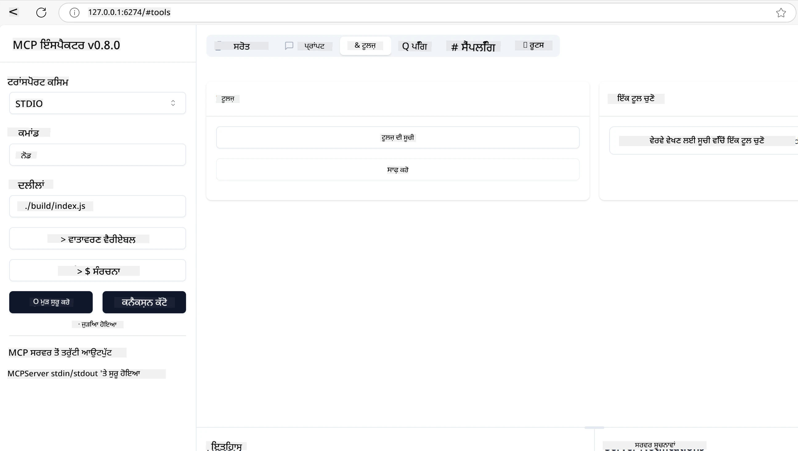
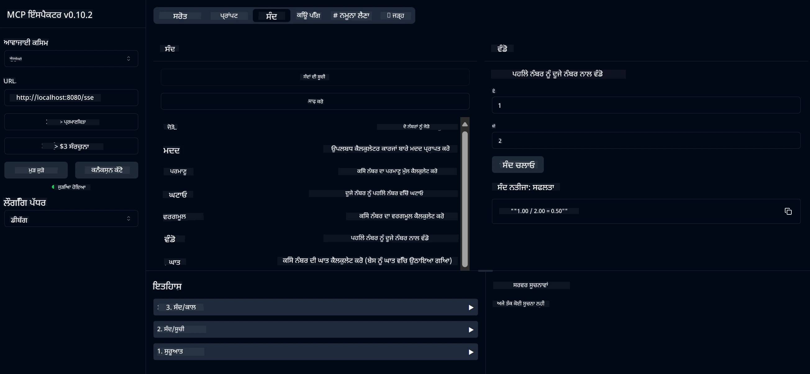
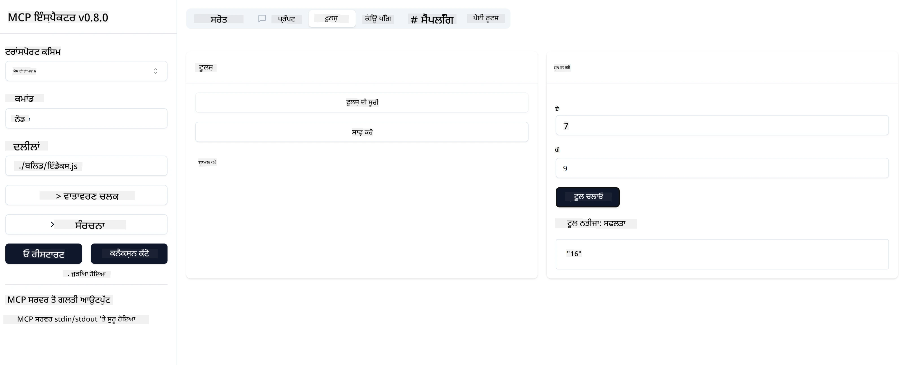

# MCP ਨਾਲ ਸ਼ੁਰੂਆਤ

> [!NOTE]
> ਇਸ ਪਾਠ ਵਿੱਚ ਜਾਵਾ HTTP ਉਦਾਹਰਨ ਲੈਗਸੀ HTTP+SSE ਟ੍ਰਾਂਸਪੋਰਟ ਵਰਤਦੀ ਹੈ ਅਤੇ
> MCP `2025-11-25` ਨਾਲ ਸੰਗਤਿਸ਼ੀਲ SDK ਲਈ ਟਾਰਗੇਟ ਕਰਦੀ ਹੈ। ਨਵੇਂ ਰਿਮੋਟ ਸਰਵਰਾਂ ਲਈ,
> `2026-07-28` ਸਟਰੀਮੇਬਲ HTTP ਟ੍ਰਾਂਸਪੋਰਟ ਦੀ ਵਰਤੋਂ ਕਰੋ ਅਤੇ ਆਪਣੇ SDK ਵਿੱਚ ਸਹਿਯੋਗ ਦੀ ਸਤਿਆਪਨਾ ਕਰੋ।

ਮੋਡਲ ਕੰਟੈਕਸਟ ਪ੍ਰੋਟੋਕੋਲ (MCP) ਨਾਲ ਤੁਹਾਡੇ ਪਹਿਲੇ ਕਦਮਾਂ ਵਿੱਚ ਤੁਹਾਡਾ ਸਵਾਗਤ ਹੈ! ਚਾਹੇ ਤੁਸੀਂ MCP ਵਿਚ ਨਵੇਂ ਹੋ ਜਾਂ ਆਪਣੀ ਸਮਝ ਨੂੰ ਡੂੰਘਾ ਕਰਨ ਦੇ ਚਾਹਵਾਨ ਹੋ, ਇਹ ਮਾਰਗਦਰਸ਼ਕ ਤੁਹਾਨੂੰ ਅਹੰਕਾਰਪੂਰਕ ਸੈਟਅੱਪ ਅਤੇ ਵਿਕਾਸ ਪ੍ਰਕਿਰਿਆ ਵਿਚ ਲੈ ਕੇ ਚਲੇਗਾ। ਤੁਸੀਂ ਜਾਣੋਗੇ ਕਿ MCP ਕਿਵੇਂ ਏਆਈ ਮਾਡਲਾਂ ਅਤੇ ਐਪਲੀਕੇਸ਼ਨਾਂ ਵਿਚਕਾਰ ਸੁਚਾਰੂ ਏਕਤਾ ਪ੍ਰਦਾਨ ਕਰਦਾ ਹੈ, ਅਤੇ ਜਲਦੀ ਹੀ MCP-ਸਮਰਥਿਤ ਹੱਲ ਬਣਾਉਣ ਅਤੇ ਟੈਸਟ ਕਰਨ ਲਈ ਆਪਣੇ ਵਾਤਾਵਰਣ ਨੂੰ ਕਿਵੇਂ ਤਿਆਰ ਕਰਨਾ ਹੈ।

> TLDR; ਜੇ ਤੁਸੀਂ ਏਆਈ ਐਪਸ ਬਣਾਉਂਦੇ ਹੋ, ਤਾਂ ਤੁਸੀਂ ਜਾਣਦੇ ਹੋ ਕਿ ਤੁਸੀਂ ਆਪਣੇ LLM (ਵੱਡਾ ਭਾਸ਼ਾ ਮਾਡਲ) ਲਈ ਉਪਕਰਣ ਅਤੇ ਹੋਰ ਸੰਸਾਧਨ ਜੋੜ ਸਕਦੇ ਹੋ, ਤਾਂ ਜੋ LLM ਹੋਰ ਗਿਆਨਵਾਨ ਬਣ ਜਾਵੇ। ਹਾਲਾਂਕਿ ਜੇ ਤੁਸੀਂ ਉਹਨਾਂ ਉਪਕਰਣਾਂ ਅਤੇ ਸੰਸਾਧਨਾਂ ਨੂੰ ਸਰਵਰ 'ਤੇ ਰੱਖਦੇ ਹੋ, ਤਾਂ ਐਪ ਅਤੇ ਸਰਵਰ ਦੀਆਂ ਯੋਗਤਾਵਾਂ ਕਿਸੇ ਵੀ ਕਲਾਇੰਟ ਦੁਆਰਾ LLM ਦੇ ਨਾਲ ਜਾਂ ਬਿਨਾਂ ਵਰਤੀ ਜਾ ਸਕਦੀਆਂ ਹਨ।

## ਝਲਕ

ਇਹ ਪਾਠ MCP ਵਾਤਾਵਰਣ ਸੈਟਅੱਪ ਅਤੇ ਪਹਿਲੀਆਂ MCP ਐਪਲੀਕੇਸ਼ਨਾਂ ਦੇ ਨਿਰਮਾਣ 'ਤੇ ਪ੍ਰਯੋਗਤਮਕ ਮਾਰਗਦਰਸ਼ਨ ਪ੍ਰਦਾਨ ਕਰਦਾ ਹੈ। ਤੁਸੀਂ ਸਿੱਖੋਗੇ ਕਿ ਜਰੂਰੀ ਉਪਕਰਣਾਂ ਅਤੇ ਫਰੇਮਵਰਕ ਸੈਟ ਕਰਨਾ, ਮੂਲ MCP ਸਰਵਰ ਬਣਾਉਣਾ, ਹੋਸਟ ਐਪਲੀਕੇਸ਼ਨਾਂ ਬਣਾਉਣਾ, ਅਤੇ ਆਪਣੀਆਂ ਲਾਗੂਵਾਤਾਂ ਦਾ ਟੈਸਟ ਕਰਨਾ ਕਿਵੇਂ ਕਰਨਾ ਹੈ।

ਮੋਡਲ ਕੰਟੈਕਸਟ ਪ੍ਰੋਟੋਕੋਲ (MCP) ਇੱਕ ਖੁੱਲਾ ਪ੍ਰੋਟੋਕੋਲ ਹੈ ਜੋ ਐਪਲੀਕੇਸ਼ਨਾਂ ਨੂੰ LLMs ਨੂੰ ਸੰਦਰਭ ਦੇਣ ਦੇ ਢੰਗ ਨੂੰ ਮਿਆਰੀਕ੍ਰਿਤ ਕਰਦਾ ਹੈ। MCP ਨੂੰ ਇੱਕ USB-C ਪੋਰਟ ਵਾਂਗ ਸੋਚੋ ਜੋ ਏਆਈ ਐਪਲੀਕੇਸ਼ਨਾਂ ਲਈ ਇੱਕ ਮਿਆਰੀਕ੍ਰਿਤ ਢੰਗ ਪ੍ਰਦਾਨ ਕਰਦਾ ਹੈ, ਜਿਸ ਨਾਲ ਏਆਈ ਮਾਡਲਾਂ ਨੂੰ ਵੱਖ-ਵੱਖ ਡੇਟਾ ਸਰੋਤਾਂ ਅਤੇ ਉਪਕਰਣਾਂ ਨਾਲ ਜੋੜਿਆ ਜਾਂਦਾ ਹੈ।

## ਸਿੱਖਣ ਦੇ ਲਕੜੇ

ਇਸ ਪਾਠ ਦੇ ਅੰਤ ਤੱਕ, ਤੁਸੀਂ ਸਮਰੱਥ ਹੋਵੋਗੇ:

- C#, ਜਾਵਾ, ਪਾਇਥਨ, ਟਾਈਪਸਕ੍ਰਿਪਟ, ਅਤੇ ਰੱਸਟ ਵਿੱਚ MCP ਲਈ ਵਿਕਾਸ ਵਾਤਾਵਰਣ ਸੈਟਅੱਪ ਕਰਨਾ
- ਮੂਲ MCP ਸਰਵਰਾਂ ਨੂੰ ਵਿਸ਼ੇਸ਼ਤਾ (ਸੰਸਾਧਨ, ਪ੍ਰੰਪਟ, ਅਤੇ ਟੂਲਜ਼) ਨਾਲ ਬਣਾਉਣਾ ਅਤੇ ਤੈਅ ਕਰਨਾ
- MCP ਸਰਵਰਾਂ ਨਾਲ ਜੁੜਨ ਵਾਲੀਆਂ ਹੋਸਟ ਐਪਲੀਕੇਸ਼ਨਾਂ ਬਣਾਉਣਾ
- MCP ਦੀਆਂ ਲਾਗੂਵਾਤਾਂ ਦਾ ਟੈਸਟ ਅਤੇ ਡੀਬੱਗ ਕਰਨਾ

## ਆਪਣਾ MCP ਵਾਤਾਵਰਣ ਸੈਟ ਕਰਨਾ

MCP ਨਾਲ ਕੰਮ ਸ਼ੁਰੂ ਕਰਨ ਤੋਂ ਪਹਿਲਾਂ, ਆਪਣਾ ਵਿਕਾਸ ਵਾਤਾਵਰਣ ਤਿਆਰ ਕਰਨਾ ਅਤੇ ਮੂਲ ਕਾਰਜਪ੍ਰਵਾਹ ਸਮਝਣਾ ਮਹੱਤਵਪੂਰਣ ਹੈ। ਇਹ ਹਿੱਸਾ ਤੁਹਾਨੂੰ MCP ਨਾਲ ਸੁਚਾਰੂ ਸ਼ੁਰੂਆਤ ਲਈ ਪਹਿਲੇ ਸੈਟਅੱਪ ਕਦਮਾਂ ਵਿੱਚ ਮਦਦ ਕਰੇਗਾ।

### ਜ਼ਰੂਰੀ ਸ਼ਰਤਾਂ

MCP ਵਿਕਾਸ ਵਿਚ ਡੁੱਬਕਾ ਲਾਉਣ ਤੋਂ ਪਹਿਲਾਂ, ਦੀਨੋ ਯਕੀਨੀ ਬਣਾਓ ਕਿ ਤੁਹਾਡੇ ਕੋਲ ਹੇਠਾਂ ਹਨ:

- **ਵਿਕਾਸ ਵਾਤਾਵਰਣ**: ਆਪਣੀ ਚੁਣੀ ਭਾਸ਼ਾ (C#, ਜਾਵਾ, ਪਾਇਥਨ, ਟਾਈਪਸਕ੍ਰਿਪਟ, ਜਾਂ ਰੱਸਟ) ਲਈ
- **IDE/ਸੰਪਾਦਕ**: ਵਿਜ਼ੂਅਲ ਸਟੂਡੀਓ, ਵਿਜ਼ੂਅਲ ਸਟੂਡੀਓ ਕੋਡ, IntelliJ, ਐਕਲਿਪਸ, ਪਾਈਚਾਰਮ, ਜਾਂ ਕੋਈ ਵੀ ਆਧੁਨਿਕ ਕੋਡ ਸੰਪਾਦਕ
- **ਪੈਕੇਜ ਮੈਨੇਜਰਸ**: NuGet, Maven/Gradle, pip, npm/yarn, ਜਾਂ ਕਾਰਗੋ
- **API ਕੁੰਜੀਆਂ**: ਜੇਕਰ ਤੁਸੀਂ ਆਪਣੇ ਹੋਸਟ ਐਪ ਵਿੱਚ ਕਿਸੇ ਏਆਈ ਸੇਵਾਵਾਂ ਦੀ ਵਰਤੋਂ ਕਰਨ ਵਾਲੇ ਹੋ

## ਮੂਲ MCP ਸਰਵਰ ਢਾਂਚਾ

ਇੱਕ MCP ਸਰਵਰ ਆਮ ਤੌਰ 'ਤੇ ਸ਼ਾਮਲ ਹੁੰਦਾ ਹੈ:

- **ਸਰਵਰ ਸੰਰਚਨਾ**: ਪੋਰਟ, ਪ੍ਰਮਾਣਿਕਤਾ, ਅਤੇ ਹੋਰ ਸੈਟਿੰਗਜ਼ ਸੈਟ ਕਰਨਾ
- **ਸੰਸਾਧਨ**: LLMs ਲਈ ਉਪਲਬਧ ਡੇਟਾ ਅਤੇ ਸੰਦਰਭ
- **ਉਪਕਰਣ**: ਉਹ ਕਾਰਜ ਜੋ ਮਾਡਲਾਂ ਕਾਲ ਕਰ ਸਕਦੇ ਹਨ
- **ਪ੍ਰੰਪਟ**: ਲਿਖਤ ਬਣਾਉਣ ਜਾਂ ਰਚਨਾ ਲਈ ਟੈਮਪਲੇਟ

ਇੱਥੇ ਟਾਈਪਸਕ੍ਰਿਪਟ ਵਿੱਚ ਇੱਕ ਸਾਦਾ ਉਦਾਹਰਨ ਦਿੱਤੀ ਗਈ ਹੈ:

```typescript
import { McpServer, ResourceTemplate } from "@modelcontextprotocol/sdk/server/mcp.js";
import { StdioServerTransport } from "@modelcontextprotocol/sdk/server/stdio.js";
import { z } from "zod";

// ਇੱਕ MCP ਸਰਵਰ ਬਣਾਓ
const server = new McpServer({
  name: "Demo",
  version: "1.0.0"
});

// ਇੱਕ ਜੋੜਣ ਵਾਲਾ ਟੂਲ ਸ਼ਾਮਿਲ ਕਰੋ
server.tool("add",
  { a: z.number(), b: z.number() },
  async ({ a, b }) => ({
    content: [{ type: "text", text: String(a + b) }]
  })
);

// ਇੱਕ ਡਾਇਨਾਮਿਕ ਗ੍ਰੀਟਿੰਗ ਸਰੋਤ ਸ਼ਾਮਿਲ ਕਰੋ
server.resource(
  "file",
  // 'list' ਪੈਰामीਟਰ ਨਿਯੰਤਰਿਤ ਕਰਦਾ ਹੈ ਕਿ ਸਰੋਤ ਕਿਵੇਂ ਉਪਲਬਧ ਫਾਈਲਾਂ ਨੂੰ ਲਿਸਟ ਕਰਦਾ ਹੈ। ਇਸ ਨੂੰ undefined ਤੇ ਸੈੱਟ ਕਰਨ ਨਾਲ ਇਸ ਸਰੋਤ ਲਈ ਲਿਸਟਿੰਗ ਅਯੋਗ ਹੋ ਜਾਂਦੀ ਹੈ।
  new ResourceTemplate("file://{path}", { list: undefined }),
  async (uri, { path }) => ({
    contents: [{
      uri: uri.href,
      text: `File, ${path}!`
    }]
  })
);

// ਇੱਕ ਫਾਈਲ ਸਰੋਤ ਸ਼ਾਮਿਲ ਕਰੋ ਜੋ ਫਾਈਲ ਸਮੱਗਰੀ ਨੂੰ ਪੜ੍ਹਦਾ ਹੈ
server.resource(
  "file",
  new ResourceTemplate("file://{path}", { list: undefined }),
  async (uri, { path }) => {
    let text;
    try {
      text = await fs.readFile(path, "utf8");
    } catch (err) {
      text = `Error reading file: ${err.message}`;
    }
    return {
      contents: [{
        uri: uri.href,
        text
      }]
    };
  }
);

server.prompt(
  "review-code",
  { code: z.string() },
  ({ code }) => ({
    messages: [{
      role: "user",
      content: {
        type: "text",
        text: `Please review this code:\n\n${code}`
      }
    }]
  })
);

// stdin 'ਤੇ ਸੁਨੇਹੇ ਪ੍ਰਾਪਤ ਕਰਨਾ ਅਤੇ stdout 'ਤੇ ਸੁਨੇਹੇ ਭੇਜਣਾ ਸ਼ੁਰੂ ਕਰੋ
const transport = new StdioServerTransport();
await server.connect(transport);
```

ਪਿਛਲੇ ਕੋਡ ਵਿੱਚ ਅਸੀਂ:

- MCP ਟਾਈਪਸਕ੍ਰਿਪਟ SDK ਤੋਂ ਜ਼ਰੂਰੀ ਕਲਾਸਜ਼ ਇੰਪੋਰਟ ਕੀਤੇ।
- ਇੱਕ ਨਵਾਂ MCP ਸਰਵਰ ਉਦਾਹਰਨ ਬਣਾਇਆ ਅਤੇ ਕਨਫਿਗਰ ਕੀਤਾ।
- ਇੱਕ ਕਸਟਮ ਟੂਲ (`calculator`) ਨੂੰ ਹੈਂਡਲਰ ਫੰਕਸ਼ਨ ਨਾਲ ਰਜਿਸਟਰ ਕੀਤਾ।
- ਆਉਣ ਵਾਲੀਆਂ MCP ਬੇਨਤੀਆਂ ਲਈ ਸਰਵਰ ਨੂੰ ਸੁਣਨਾ ਸ਼ੁਰੂ ਕੀਤਾ।

## ਟੈਸਟਿੰਗ ਅਤੇ ਡੀਬੱਗਿੰਗ

ਆਪਣਾ MCP ਸਰਵਰ ਟੈਸਟ ਕਰਨ ਤੋਂ ਪਹਿਲਾਂ, ਉਪਲਬਧ ਟੂਲਜ਼ ਅਤੇ ਡੀਬੱਗ ਕਰਨ ਲਈ ਸਰੇਸ਼ਠ ਅਭਿਆਸਾਂ ਨੂੰ ਸਮਝਣਾ ਜ਼ਰੂਰੀ ਹੈ। ਪ੍ਰਭਾਵਸ਼ਾਲੀ ਟੈਸਟਿੰਗ ਇਹ ਸੁਨਿਸ਼ਚਿਤ ਕਰਦੀ ਹੈ ਕਿ ਤੁਹਾਡਾ ਸਰਵਰ ਉਮੀਦ ਅਨੁਸਾਰ ਕੰਮ ਕਰਦਾ ਹੈ ਅਤੇ ਤੁਹਾਨੂੰ ਤੇਜ਼ੀ ਨਾਲ ਸਮੱਸਿਆਵਾਂ ਨੂੰ ਪਛਾਣਨ ਅਤੇ ਹੱਲ ਕਰਨ ਵਿੱਚ ਮਦਦ ਕਰਦੀ ਹੈ। ਹੇਠਾਂ ਦਿੱਤੇ ਹਿੱਸੇ ਵਿੱਚ ਤੁਹਾਡੀ MCP ਲਾਗੂਵਾਤ ਦੀ ਪੁਸ਼ਟੀ ਲਈ ਸਿਫਾਰਸ਼ੀ ਅਪ੍ਰੋਚ ਦਿਖਾਈ ਗਈ ਹੈ।

MCP ਤੁਹਾਡੇ ਸਰਵਰਾਂ ਦੇ ਟੈਸਟ ਅਤੇ ਡੀਬੱਗ ਲਈ ਟੂਲ ਪ੍ਰਦਾਨ ਕਰਦਾ ਹੈ:

- **ਇੰਸਪੈਕਟਰ ਟੂਲ**, ਇਹ ਗ੍ਰਾਫਿਕਲ ਇੰਟਰਫੇਸ ਤੁਹਾਨੂੰ ਆਪਣੇ ਸਰਵਰ ਨਾਲ ਕਨੈਕਟ ਕਰਨ ਅਤੇ ਆਪਣੇ ਟੂਲਜ਼, ਪ੍ਰੰਪਟ, ਅਤੇ ਸੰਸਾਧਨਾਂ ਨੂੰ ਟੈਸਟ ਕਰਨ ਦੀ ਆਗਿਆ ਦਿੰਦਾ ਹੈ।
- **ਕਰਲ**, ਤੁਸੀਂ ਕਰਲ ਜਾਂ ਹੋਰ ਕੰਮਾਂਡ ਲਾਈਨ ਟੂਲ ਦੀ ਵਰਤੋਂ ਕਰਕੇ ਆਪਣਾ ਸਰਵਰ ਕਨੈਕਟ ਕਰ ਸਕਦੇ ਹੋ ਜੋ HTTP ਕਮਾਂਡ ਚਲਾ ਸਕਦੇ ਹਨ।

### MCP ਇੰਸਪੈਕਟਰ ਦੀ ਵਰਤੋਂ

[MCP ਇੰਸਪੈਕਟਰ](https://github.com/modelcontextprotocol/inspector) ਇੱਕ ਵਿਜੁਅਲ ਟੈਸਟਿੰਗ ਟੂਲ ਹੈ ਜੋ ਤੁਹਾਨੂੰ ਮਦਦ ਕਰਦਾ ਹੈ:

1. **ਸਰਵਰ ਕਾਬਲੀਅਤਾਂ ਦੀ ਖੋਜ**: ਉਪਲਬਧ ਸੰਸਾਧਨ, ਟੂਲਜ਼, ਅਤੇ ਪ੍ਰੰਪਟ ਨੂੰ ਆਟੋਮੈਟਿਕ ਪਛਾਣਣਾ
2. **ਟੂਲ ਕਾਰਜ ਦੀ ਜਾਂਚ**: ਵੱਖ-ਵੱਖ ਪੈਰਾਮੀਟਰਾਂ ਨਾਲ ਟ੍ਰਾਈ ਕਰੋ ਅਤੇ ਰੀਅਲ-ਟਾਈਮ ਵਿੱਚ ਜਵਾਬ ਵੇਖੋ
3. **ਸਰਵਰ ਮੈਟਾਡੇਟਾ ਦੇਖੋ**: ਸਰਵਰ ਜਾਣਕਾਰੀ, ਸਕੀਮਾਂ, ਅਤੇ ਸੰਰਚਨਾਵਾਂ ਦੀ ਜਾਂਚ ਕਰੋ

```bash
# ਉਦਾਹਰਣ ਟਾਈਪਸਕ੍ਰਿਪਟ, MCP ਇੰਸਪੈਕਟਰ ਨੂੰ ਇੰਸਟਾਲ ਅਤੇ ਚਲਾਉਣਾ
npx @modelcontextprotocol/inspector node build/index.js
```

ਜਦੋਂ ਤੁਸੀਂ ਉਪਰੋਕਤ ਕਮਾਂਡ ਚਲਾਉਂਦੇ ਹੋ, MCP ਇੰਸਪੈਕਟਰ ਤੁਹਾਡੇ ਬ੍ਰਾਊਜ਼ਰ ਵਿੱਚ ਇੱਕ ਸਥਾਨਕ ਵੈਬ ਇੰਟਰਫੇਸ ਖੋਲ੍ਹੇਗਾ। ਤੁਸੀਂ ਇੱਕ ਡੈਸ਼ਬੋਰਡ ਵੇਖ ਸਕਦੇ ਹੋ ਜੋ ਤੁਹਾਡੇ ਰਜਿਸਟਰ ਕੀਤੇ MCP ਸਰਵਰਾਂ, ਉਨ੍ਹਾਂ ਦੇ ਉਪਲਬਧ ਟੂਲਜ਼, ਸੰਸਾਧਨਾਂ, ਅਤੇ ਪ੍ਰੰਪਟ ਨੂੰ ਦਰਸਾਉਂਦਾ ਹੈ। ਇਹ ਇੰਟਰਫੇਸ ਤੁਹਾਨੂੰ ਟੂਲ ਕਾਰਜ ਦੀ ਜਾਂਚ, ਸਰਵਰ ਮੈਟਾਡੇਟਾ ਦੀ ਨਿਗਰਾਨੀ, ਅਤੇ ਰੀਅਲ-ਟਾਈਮ ਜਵਾਬ ਵੇਖਣ ਦੀ ਆਗਿਆ ਦਿੰਦਾ ਹੈ ਜੋ ਕਿ ਤੁਹਾਡੇ MCP ਸਰਵਰ ਦੀਆਂ ਲਾਗੂਵਾਤਾਂ ਨੂੰ ਪੁਸ਼ਟੀ ਕਰਨ ਅਤੇ ਡੀਬੱਗ ਕਰਨ ਲਈ ਆਸਾਨ ਬਣਾਉਂਦਾ ਹੈ।

ਇਹ ਇੱਕ ਸਕਰੀਨਸ਼ਾਟ ਹੈ ਕਿ ਇਹ ਕਿਵੇਂ ਦਿਸ ਸਕਦਾ ਹੈ:



## ਆਮ ਸੈਟਅੱਪ ਮੁਸ਼ਕਿਲਾਂ ਅਤੇ ਹਲ

| ਮੁੱਦਾ | ਸੰਭਾਵਿਤ ਹੱਲ |
|-------|-------------------|
| ਕਨੈਕਸ਼ਨ ਰੱਦ ਕੀਤਾ | ਜਾਣਚ ਕਰੋ ਕਿ ਸਰਵਰ ਚੱਲ ਰਿਹਾ ਹੈ ਅਤੇ ਪੋਰਟ ਸਹੀ ਹੈ |
| ਟੂਲ ਕਾਰਜ ਵਿੱਚ ਗਲਤੀਆਂ | ਪੈਰਾਮੀਟਰ ਪ੍ਰਮਾਣਿਕਤਾ ਅਤੇ ਗਲਤੀ ਹੈਂਡਲਿੰਗ ਦੀ ਸਮੀਖਿਆ ਕਰੋ |
| ਪ੍ਰਮਾਣਿਕਤਾ ਅਸਫਲ | API ਕੁੰਜੀਆਂ ਅਤੇ ਅਧਿਕਾਰਾਂ ਦੀ ਜਾਂਚ ਕਰੋ |
| ਸਕੀਮਾ ਪ੍ਰਮਾਣਿਕਤਾ ਤ্রੁਟੀਆਂ | ਇਹ ਨਿਸ਼ਚਿਤ ਕਰੋ ਕਿ ਪੈਰਾਮੀਟਰ ਪਰਿਭਾਸ਼ਿਤ ਸਕੀਮਾ ਨਾਲ ਮਿਲਦੇ ਹਨ |
| ਸਰਵਰ ਸਟਾਰਟ ਨਹੀਂ ਹੋ ਰਿਹਾ | ਪੋਰਟ ਸੰਘਰਸ਼ ਜਾਂ ਗੁੰਮDependencies ਲਈ ਜਾਂਚ ਕਰੋ |
| CORS ਗਲਤੀਆਂ | ਕ੍ਰਾਸ-ਉਤਪੱਤੀ ਬੇਨਤੀਆਂ ਲਈ ਸਹੀ CORS ਹੈਡਰਜ਼ ਕਨਫਿਗਰ ਕਰੋ |
| ਪ੍ਰਮਾਣਿਕਤਾ ਸਬੰਧੀ ਸਮੱਸਿਆਵਾਂ | ਟੋਕਨ ਕੀ ਵੈਧਤਾ ਅਤੇ ਅਧਿਕਾਰਾਂ ਦੀ ਪੜਤਾਲ ਕਰੋ |

## ਸਥਾਨਕ ਵਿਕਾਸ

ਸਥਾਨਕ ਵਿਕਾਸ ਅਤੇ ਟੈਸਟਿੰਗ ਲਈ, ਤੁਸੀਂ MCP ਸਰਵਰਾਂ ਨੂੰ ਸਿੱਧਾ ਆਪਣੇ ਮਸ਼ੀਨ 'ਤੇ ਚਲਾ ਸਕਦੇ ਹੋ:

1. **ਸਰਵਰ ਪ੍ਰਕਿਰਿਆ ਸ਼ੁਰੂ ਕਰੋ**: ਆਪਣੀ MCP ਸਰਵਰ ਐਪਲੀਕੇਸ਼ਨ ਚਲਾਓ
2. **ਨੈੱਟਵਰਕਿੰਗ ਸੰਰਚਨਾ ਕਰੋ**: ਯਕੀਨੀ ਬਣਾਓ ਕਿ ਸਰਵਰ ਉਮੀਦ ਕੀਤੇ ਗਏ ਪੋਰਟ 'ਤੇ ਪਹੁੰਚਯੋਗ ਹੈ
3. **ਕਲਾਇੰਟ ਜੁੜੋ**: ਸਥਾਨਕ ਕਨੈਕਸ਼ਨ URL ਜਿਵੇਂ `http://localhost:3000` ਵਰਤੋਂ

```bash
# ਉਦਾਹਰਨ: ਇੱਕ ਟਾਈਪਸਕ੍ਰਿਪਟ MCP ਸਰਵਰ ਨੂੰ ਸਥਾਨਕ ਤੌਰ 'ਤੇ ਚਲਾਉਣਾ
npm run start
# ਸਰਵਰ http://localhost:3000 'ਤੇ ਚੱਲ ਰਿਹਾ ਹੈ
```

## ਆਪਣਾ ਪਹਿਲਾ MCP ਸਰਵਰ ਬਣਾਉਣਾ

ਅਸੀਂ ਪਹਿਲਾਂ ਇੱਕ [ਮੂਲ ਧਾਰਨਾ](../../01-CoreConcepts/README.md) ਨੂੰ ਕਵਰ ਕੀਤਾ ਹੈ, ਹੁਣ ਸਮਾਂ ਹੈ ਕਿ ਉਸ ਗਿਆਨ ਨੂੰ ਵਰਤੀਏ।

### ਇੱਕ ਸਰਵਰ ਕਿੰਝ ਕੰਮ ਕਰ ਸਕਦਾ ਹੈ

ਕੋਡ ਲਿਖਣ ਸ਼ੁਰੂ ਕਰਨ ਤੋਂ ਪਹਿਲਾਂ, ਆਓ ਸਨਮਾਨ ਨਾਲ ਯਾਦ ਕਰੀਏ ਕਿ ਇੱਕ ਸਰਵਰ ਕੀ ਕਰ ਸਕਦਾ ਹੈ:

ਇੱਕ MCP ਸਰਵਰ ਉਦਾਹਰਨ ਵਜੋਂ:

- ਸਥਾਨਕ ਫਾਈਲਾਂ ਅਤੇ ਡੇਟਾਬੇਸ ਐਕਸੇਸ ਕਰ ਸਕਦਾ ਹੈ
- ਰਿਮੋਟ APIs ਨਾਲ ਕਨੈਕਟ ਕਰ ਸਕਦਾ ਹੈ
- ਗਣਨਾਵਾਂ ਕਰ ਸਕਦਾ ਹੈ
- ਹੋਰ ਟੂਲਜ਼ ਅਤੇ ਸੇਵਾਵਾਂ ਨਾਲ ਸੰਯੁਕਤ ਹੋ ਸਕਦਾ ਹੈ
- ਪਰਸਪਰ ਕਿਰਿਆ ਲਈ ਉਪਯੋਗਕਰਤਾ ਇੰਟਰਫੇਸ ਪ੍ਰਦਾਨ ਕਰਦਾ ਹੈ

ਵਧੀਆ, ਹੁਣ ਜਦੋਂ ਅਸੀਂ ਇਹ ਜਾਣ ਚੁੱਕੇ ਹਾਂ ਕਿ ਅਸੀਂ ਕੀ ਕਰ ਸਕਦੇ ਹਾਂ, ਆਓ ਕੋਡਿੰਗ ਸ਼ੁਰੂ ਕਰੀਏ।

## ਅਭਿਆਸ: ਇੱਕ ਸਰਵਰ ਬਣਾਉਣਾ

ਇੱਕ ਸਰਵਰ ਬਣਾਉਣ ਲਈ, ਤੁਹਾਨੂੰ ਇਹ ਕਦਮਾਂ ਫਾਲੋ ਕਰਨੇ ਪੈਣਗੇ:

- MCP SDK ਇੰਸਟਾਲ ਕਰੋ।
- ਇੱਕ ਪ੍ਰੋਜੈਕਟ ਬਣਾਓ ਅਤੇ ਪ੍ਰੋਜੈਕਟ ਢਾਂਚਾ ਸੈੱਟ ਕਰੋ।
- ਸਰਵਰ ਕੋਡ ਲਿਖੋ।
- ਸਰਵਰ ਦਾ ਟੈਸਟ ਕਰੋ।

### -1- ਪ੍ਰੋਜੈਕਟ ਬਣਾਉਣਾ

#### ਟਾਈਪਸਕ੍ਰਿਪਟ

```sh
# ਪ੍ਰੋਜੈਕਟ ਡਾਇਰੈਕਟਰੀ ਬਣਾਓ ਅਤੇ npm ਪ੍ਰੋਜੈਕਟ ਸ਼ੁਰੂ ਕਰੋ
mkdir calculator-server
cd calculator-server
npm init -y
```

#### ਪਾਇਥਨ

```sh
# ਪ੍ਰੋਜੈਕਟ ਡਾਇਰੈਕਟਰੀ ਬਣਾਓ
mkdir calculator-server
cd calculator-server
# ਫੋਲਡਰ ਨੂੰ ਵਿਜ਼ੂਅਲ ਸਟੂਡੀਓ ਕੋਡ ਵਿੱਚ ਖੋਲ੍ਹੋ - ਜੇ ਤੁਸੀਂ ਕਿਸੇ ਹੋਰ IDE ਦੀ ਵਰਤੋਂ ਕਰ ਰਹੇ ਹੋ ਤਾਂ ਇਸਨੂੰ ਛੱਡ ਦਿਓ
code .
```

#### .NET

```sh
dotnet new console -n McpCalculatorServer
cd McpCalculatorServer
```

#### ਜਾਵਾ

ਜਾਵਾ ਲਈ, ਇੱਕ ਸਪ੍ਰਿੰਗ ਬੂਟ ਪ੍ਰੋਜੈਕਟ ਬਣਾਓ:

```bash
curl https://start.spring.io/starter.zip \
  -d dependencies=web \
  -d javaVersion=21 \
  -d type=maven-project \
  -d groupId=com.example \
  -d artifactId=calculator-server \
  -d name=McpServer \
  -d packageName=com.microsoft.mcp.sample.server \
  -o calculator-server.zip
```

ਜਿੱਪ ਫਾਈਲ ਨੂੰ ڪڍੋ:

```bash
unzip calculator-server.zip -d calculator-server
cd calculator-server
# ਵਿਕਲਪੀਕ ਤੌਰ ’ਤੇ ਬਿਨਾ ਵਰਤੇ ਟੈਸਟ ਨੂੰ ਹਟਾਓ
rm -rf src/test/java
```

ਆਪਣੀ *pom.xml* ਫਾਈਲ ਵਿੱਚ ਪੂਰੀ ਸੰਰਚਨਾ ਸ਼ਾਮਲ ਕਰੋ:

```xml
<?xml version="1.0" encoding="UTF-8"?>
<project xmlns="http://maven.apache.org/POM/4.0.0"
    xmlns:xsi="http://www.w3.org/2001/XMLSchema-instance"
    xsi:schemaLocation="http://maven.apache.org/POM/4.0.0 http://maven.apache.org/xsd/maven-4.0.0.xsd">
    <modelVersion>4.0.0</modelVersion>
    
    <!-- Spring Boot parent for dependency management -->
    <parent>
        <groupId>org.springframework.boot</groupId>
        <artifactId>spring-boot-starter-parent</artifactId>
        <version>3.5.0</version>
        <relativePath />
    </parent>

    <!-- Project coordinates -->
    <groupId>com.example</groupId>
    <artifactId>calculator-server</artifactId>
    <version>0.0.1-SNAPSHOT</version>
    <name>Calculator Server</name>
    <description>Basic calculator MCP service for beginners</description>

    <!-- Properties -->
    <properties>
        <java.version>21</java.version>
        <maven.compiler.source>21</maven.compiler.source>
        <maven.compiler.target>21</maven.compiler.target>
    </properties>

    <!-- Spring AI BOM for version management -->
    <dependencyManagement>
        <dependencies>
            <dependency>
                <groupId>org.springframework.ai</groupId>
                <artifactId>spring-ai-bom</artifactId>
                <version>1.0.0-SNAPSHOT</version>
                <type>pom</type>
                <scope>import</scope>
            </dependency>
        </dependencies>
    </dependencyManagement>

    <!-- Dependencies -->
    <dependencies>
        <dependency>
            <groupId>org.springframework.ai</groupId>
            <artifactId>spring-ai-starter-mcp-server-webflux</artifactId>
        </dependency>
        <dependency>
            <groupId>org.springframework.boot</groupId>
            <artifactId>spring-boot-starter-actuator</artifactId>
        </dependency>
        <dependency>
         <groupId>org.springframework.boot</groupId>
         <artifactId>spring-boot-starter-test</artifactId>
         <scope>test</scope>
      </dependency>
    </dependencies>

    <!-- Build configuration -->
    <build>
        <plugins>
            <plugin>
                <groupId>org.springframework.boot</groupId>
                <artifactId>spring-boot-maven-plugin</artifactId>
            </plugin>
            <plugin>
                <groupId>org.apache.maven.plugins</groupId>
                <artifactId>maven-compiler-plugin</artifactId>
                <configuration>
                    <release>21</release>
                </configuration>
            </plugin>
        </plugins>
    </build>

    <!-- Repositories for Spring AI snapshots -->
    <repositories>
        <repository>
            <id>spring-milestones</id>
            <name>Spring Milestones</name>
            <url>https://repo.spring.io/milestone</url>
            <snapshots>
                <enabled>false</enabled>
            </snapshots>
        </repository>
        <repository>
            <id>spring-snapshots</id>
            <name>Spring Snapshots</name>
            <url>https://repo.spring.io/snapshot</url>
            <releases>
                <enabled>false</enabled>
            </releases>
        </repository>
    </repositories>
</project>
```

#### ਰੱਸਟ

```sh
mkdir calculator-server
cd calculator-server
cargo init
```

### -2- ਨਿਰਭਰਤਾਵਾਂ ਜੋੜੋ

ਹੁਣ ਜਦੋਂ ਕਿ ਤੁਹਾਡੇ ਕੋਲ ਪ੍ਰੋਜੈਕਟ ਤਿਆਰ ਹੈ, ਅਗਲਾ ਕਦਮ ਨਿਰਭਰਤਾਵਾਂ ਸ਼ਾਮਲ ਕਰਨ ਦਾ ਹੈ:

#### ਟਾਈਪਸਕ੍ਰਿਪਟ

```sh
# ਜੇ ਪਹਿਲਾਂ ਤੋਂ ਇੰਸਟਾਲ ਨਹੀਂ ਹੈ, ਤਾਂ ਟਾਈਪਸਕ੍ਰਿਪਟ ਨੂੰ ਗਲੋਬਲੀ ਇੰਸਟਾਲ ਕਰੋ
npm install typescript -g

# MCP SDK ਅਤੇ ਸਕੀਮਾ ਵੈਰੀਫਿਕੇਸ਼ਨ ਲਈ Zod ਇੰਸਟਾਲ ਕਰੋ
npm install @modelcontextprotocol/sdk zod
npm install -D @types/node typescript
```

#### ਪਾਇਥਨ

```sh
# ਇੱਕ ਵਰਚੁਅਲ ਵਾਤਾਵਰਨ ਬਣਾਓ ਅਤੇ ਨਿਰਭਰਤਾਵਾਂ ਨੂੰ ਇੰਸਟਾਲ ਕਰੋ
python -m venv venv
venv\Scripts\activate
pip install "mcp[cli]"
```

#### ਜਾਵਾ

```bash
cd calculator-server
./mvnw clean install -DskipTests
```

#### ਰੱਸਟ

```sh
cargo add rmcp --features server,transport-io
cargo add serde
cargo add tokio --features rt-multi-thread
```

### -3- ਪ੍ਰੋਜੈਕਟ ਫਾਈਲਾਂ ਬਣਾਓ

#### ਟਾਈਪਸਕ੍ਰਿਪਟ

*package.json* ਫਾਈਲ ਖੋਲ੍ਹੋ ਅਤੇ ਨਿੰਮ ਲਿਖਤ ਨਾਲ ਬਦਲੋ ਤਾਂ ਜੋ ਤੁਸੀਂ ਸਰਵਰ ਨੂੰ ਬਣਾਉ ਅਤੇ ਚਲਾ ਸਕੋ:

```json
{
  "name": "calculator-server",
  "version": "1.0.0",
  "main": "index.js",
  "type": "module",
  "scripts": {
    "build": "tsc",
    "start": "npm run build && node ./build/index.js",
  },
  "keywords": [],
  "author": "",
  "license": "ISC",
  "description": "A simple calculator server using Model Context Protocol",
  "dependencies": {
    "@modelcontextprotocol/sdk": "^1.16.0",
    "zod": "^3.25.76"
  },
  "devDependencies": {
    "@types/node": "^24.0.14",
    "typescript": "^5.8.3"
  }
}
```

ਇੱਕ *tsconfig.json* ਬਣਾਓ ਜਿਸ ਵਿੱਚ ਇਹ ਲਿਖਤ ਹੋਵੇ:

```json
{
  "compilerOptions": {
    "target": "ES2022",
    "module": "Node16",
    "moduleResolution": "Node16",
    "outDir": "./build",
    "rootDir": "./src",
    "strict": true,
    "esModuleInterop": true,
    "skipLibCheck": true,
    "forceConsistentCasingInFileNames": true
  },
  "include": ["src/**/*"],
  "exclude": ["node_modules"]
}
```

ਆਪਣੇ ਸਰੋਤ ਕੋਡ ਲਈ ਡਾਇਰੈਕਟਰੀ ਬਣਾਓ:

```sh
mkdir src
touch src/index.ts
```

#### ਪਾਇਥਨ

ਇੱਕ ਫਾਈਲ *server.py* ਬਣਾਓ

```sh
touch server.py
```

#### .NET

ਜ਼ਰੂਰੀ NuGet ਪੈਕੇਜਾਂ ਇੰਸਟਾਲ ਕਰੋ:

```sh
dotnet add package ModelContextProtocol --prerelease
dotnet add package Microsoft.Extensions.Hosting
```

#### ਜਾਵਾ

ਜਾਵਾ ਸਪ੍ਰਿੰਗ ਬੂਟ ਪ੍ਰੋਜੈਕਟਾਂ ਲਈ, ਪ੍ਰੋਜੈਕਟ ਢਾਂਚਾ ਸਵੈ-ਚਾਲਿਤ ਤੌਰ 'ਤੇ ਬਣਾਇਆ ਜਾਂਦਾ ਹੈ।

#### ਰੱਸਟ

ਰੱਸਟ ਲਈ, ਜਦੋਂ ਤੁਸੀਂ `cargo init` ਚਲਾਉਂਦੇ ਹੋ ਤਾਂ ਇੱਕ *src/main.rs* ਫਾਈਲ ਮੂਲ ਰੂਪ ਵਿੱਚ ਬਣਾਈ ਜਾਂਦੀ ਹੈ। ਫਾਈਲ ਨੂੰ ਖੋਲ੍ਹੋ ਅਤੇ ਮੂਲ ਕੋਡ ਨੂੰ ਹਟਾਓ।

### -4- ਸਰਵਰ ਕੋਡ ਬਣਾਓ

#### ਟਾਈਪਸਕ੍ਰਿਪਟ

ਇੱਕ ਫਾਈਲ *index.ts* ਬਣਾਓ ਅਤੇ ਹੇਠਾਂ ਦਿੱਤਾ ਕੋਡ ਸ਼ਾਮਲ ਕਰੋ:

```typescript
import { McpServer, ResourceTemplate } from "@modelcontextprotocol/sdk/server/mcp.js";
import { StdioServerTransport } from "@modelcontextprotocol/sdk/server/stdio.js";
import { z } from "zod";
 
// ਇੱਕ MCP ਸਰਵਰ ਬਣਾਓ
const server = new McpServer({
  name: "Calculator MCP Server",
  version: "1.0.0"
});
```

ਹੁਣ ਤੁਹਾਡੇ ਕੋਲ ਇੱਕ ਸਰਵਰ ਹੈ, ਪਰ ਇਹ ਬਹੁਤ ਕੁਝ ਨਹੀਂ ਕਰਦਾ, ਆਓ ਇਹ ਠੀਕ ਕਰੀਏ।

#### ਪਾਇਥਨ

```python
# server.py
from mcp.server.fastmcp import FastMCP

# ਇੱਕ MCP ਸਰਵਰ ਬਣਾਓ
mcp = FastMCP("Demo")
```

#### .NET

```csharp
using Microsoft.Extensions.DependencyInjection;
using Microsoft.Extensions.Hosting;
using Microsoft.Extensions.Logging;
using ModelContextProtocol.Server;
using System.ComponentModel;

var builder = Host.CreateApplicationBuilder(args);
builder.Logging.AddConsole(consoleLogOptions =>
{
    // Configure all logs to go to stderr
    consoleLogOptions.LogToStandardErrorThreshold = LogLevel.Trace;
});

builder.Services
    .AddMcpServer()
    .WithStdioServerTransport()
    .WithToolsFromAssembly();
await builder.Build().RunAsync();

// add features
```

#### ਜਾਵਾ

ਜਾਵਾ ਲਈ, ਕੋਰ ਸਰਵਰ ਕੰਪੋਨੈਂਟ ਬਣਾਓ। ਸਭ ਤੋਂ ਪਹਿਲਾਂ, ਮੁੱਖ ਐਪਲੀਕੇਸ਼ਨ ਕਲਾਸ ਨੂੰ ਸੋਧੋ:

*src/main/java/com/microsoft/mcp/sample/server/McpServerApplication.java*:

```java
package com.microsoft.mcp.sample.server;

import org.springframework.ai.tool.ToolCallbackProvider;
import org.springframework.ai.tool.method.MethodToolCallbackProvider;
import org.springframework.boot.SpringApplication;
import org.springframework.boot.autoconfigure.SpringBootApplication;
import org.springframework.context.annotation.Bean;
import com.microsoft.mcp.sample.server.service.CalculatorService;

@SpringBootApplication
public class McpServerApplication {

    public static void main(String[] args) {
        SpringApplication.run(McpServerApplication.class, args);
    }
    
    @Bean
    public ToolCallbackProvider calculatorTools(CalculatorService calculator) {
        return MethodToolCallbackProvider.builder().toolObjects(calculator).build();
    }
}
```

ਕੈਲਕੂਲੇਟਰ ਸੇਵਾ ਬਣਾਓ *src/main/java/com/microsoft/mcp/sample/server/service/CalculatorService.java*:

```java
package com.microsoft.mcp.sample.server.service;

import org.springframework.ai.tool.annotation.Tool;
import org.springframework.stereotype.Service;

/**
 * Service for basic calculator operations.
 * This service provides simple calculator functionality through MCP.
 */
@Service
public class CalculatorService {

    /**
     * Add two numbers
     * @param a The first number
     * @param b The second number
     * @return The sum of the two numbers
     */
    @Tool(description = "Add two numbers together")
    public String add(double a, double b) {
        double result = a + b;
        return formatResult(a, "+", b, result);
    }

    /**
     * Subtract one number from another
     * @param a The number to subtract from
     * @param b The number to subtract
     * @return The result of the subtraction
     */
    @Tool(description = "Subtract the second number from the first number")
    public String subtract(double a, double b) {
        double result = a - b;
        return formatResult(a, "-", b, result);
    }

    /**
     * Multiply two numbers
     * @param a The first number
     * @param b The second number
     * @return The product of the two numbers
     */
    @Tool(description = "Multiply two numbers together")
    public String multiply(double a, double b) {
        double result = a * b;
        return formatResult(a, "*", b, result);
    }

    /**
     * Divide one number by another
     * @param a The numerator
     * @param b The denominator
     * @return The result of the division
     */
    @Tool(description = "Divide the first number by the second number")
    public String divide(double a, double b) {
        if (b == 0) {
            return "Error: Cannot divide by zero";
        }
        double result = a / b;
        return formatResult(a, "/", b, result);
    }

    /**
     * Calculate the power of a number
     * @param base The base number
     * @param exponent The exponent
     * @return The result of raising the base to the exponent
     */
    @Tool(description = "Calculate the power of a number (base raised to an exponent)")
    public String power(double base, double exponent) {
        double result = Math.pow(base, exponent);
        return formatResult(base, "^", exponent, result);
    }

    /**
     * Calculate the square root of a number
     * @param number The number to find the square root of
     * @return The square root of the number
     */
    @Tool(description = "Calculate the square root of a number")
    public String squareRoot(double number) {
        if (number < 0) {
            return "Error: Cannot calculate square root of a negative number";
        }
        double result = Math.sqrt(number);
        return String.format("√%.2f = %.2f", number, result);
    }

    /**
     * Calculate the modulus (remainder) of division
     * @param a The dividend
     * @param b The divisor
     * @return The remainder of the division
     */
    @Tool(description = "Calculate the remainder when one number is divided by another")
    public String modulus(double a, double b) {
        if (b == 0) {
            return "Error: Cannot divide by zero";
        }
        double result = a % b;
        return formatResult(a, "%", b, result);
    }

    /**
     * Calculate the absolute value of a number
     * @param number The number to find the absolute value of
     * @return The absolute value of the number
     */
    @Tool(description = "Calculate the absolute value of a number")
    public String absolute(double number) {
        double result = Math.abs(number);
        return String.format("|%.2f| = %.2f", number, result);
    }

    /**
     * Get help about available calculator operations
     * @return Information about available operations
     */
    @Tool(description = "Get help about available calculator operations")
    public String help() {
        return "Basic Calculator MCP Service\n\n" +
               "Available operations:\n" +
               "1. add(a, b) - Adds two numbers\n" +
               "2. subtract(a, b) - Subtracts the second number from the first\n" +
               "3. multiply(a, b) - Multiplies two numbers\n" +
               "4. divide(a, b) - Divides the first number by the second\n" +
               "5. power(base, exponent) - Raises a number to a power\n" +
               "6. squareRoot(number) - Calculates the square root\n" + 
               "7. modulus(a, b) - Calculates the remainder of division\n" +
               "8. absolute(number) - Calculates the absolute value\n\n" +
               "Example usage: add(5, 3) will return 5 + 3 = 8";
    }

    /**
     * Format the result of a calculation
     */
    private String formatResult(double a, String operator, double b, double result) {
        return String.format("%.2f %s %.2f = %.2f", a, operator, b, result);
    }
}
```

**ਉਤਪਾਦਨ-ਤਿਆਰ ਸੇਵਾ ਲਈ ਵਿਅਕਲਪੀ ਕੰਪੋਨੈਂਟ:**

ਇੱਕ ਸਟਾਰਟਅਪ ਸੰਰਚਨਾ ਬਣਾਓ *src/main/java/com/microsoft/mcp/sample/server/config/StartupConfig.java*:

```java
package com.microsoft.mcp.sample.server.config;

import org.springframework.boot.CommandLineRunner;
import org.springframework.context.annotation.Bean;
import org.springframework.context.annotation.Configuration;

@Configuration
public class StartupConfig {
    
    @Bean
    public CommandLineRunner startupInfo() {
        return args -> {
            System.out.println("\n" + "=".repeat(60));
            System.out.println("Calculator MCP Server is starting...");
            System.out.println("SSE endpoint: http://localhost:8080/sse");
            System.out.println("Health check: http://localhost:8080/actuator/health");
            System.out.println("=".repeat(60) + "\n");
        };
    }
}
```

ਇੱਕ ਸਿਹਤ ਕੰਟਰੋਲਰ ਬਣਾਓ *src/main/java/com/microsoft/mcp/sample/server/controller/HealthController.java*:

```java
package com.microsoft.mcp.sample.server.controller;

import org.springframework.http.ResponseEntity;
import org.springframework.web.bind.annotation.GetMapping;
import org.springframework.web.bind.annotation.RestController;
import java.time.LocalDateTime;
import java.util.HashMap;
import java.util.Map;

@RestController
public class HealthController {
    
    @GetMapping("/health")
    public ResponseEntity<Map<String, Object>> healthCheck() {
        Map<String, Object> response = new HashMap<>();
        response.put("status", "UP");
        response.put("timestamp", LocalDateTime.now().toString());
        response.put("service", "Calculator MCP Server");
        return ResponseEntity.ok(response);
    }
}
```

ਇੱਕ ਐਕਸਪਸ਼ਨ ਹੈਂਡਲਰ ਬਣਾਓ *src/main/java/com/microsoft/mcp/sample/server/exception/GlobalExceptionHandler.java*:

```java
package com.microsoft.mcp.sample.server.exception;

import org.springframework.http.HttpStatus;
import org.springframework.http.ResponseEntity;
import org.springframework.web.bind.annotation.ExceptionHandler;
import org.springframework.web.bind.annotation.RestControllerAdvice;

@RestControllerAdvice
public class GlobalExceptionHandler {

    @ExceptionHandler(IllegalArgumentException.class)
    public ResponseEntity<ErrorResponse> handleIllegalArgumentException(IllegalArgumentException ex) {
        ErrorResponse error = new ErrorResponse(
            "Invalid_Input", 
            "Invalid input parameter: " + ex.getMessage());
        return new ResponseEntity<>(error, HttpStatus.BAD_REQUEST);
    }

    public static class ErrorResponse {
        private String code;
        private String message;

        public ErrorResponse(String code, String message) {
            this.code = code;
            this.message = message;
        }

        // ਗੈਟਰਜ਼
        public String getCode() { return code; }
        public String getMessage() { return message; }
    }
}
```

ਇੱਕ ਕਸਟਮ ਬੈਨਰ ਬਣਾਓ *src/main/resources/banner.txt*:

```text
_____      _            _       _             
 / ____|    | |          | |     | |            
| |     __ _| | ___ _   _| | __ _| |_ ___  _ __ 
| |    / _` | |/ __| | | | |/ _` | __/ _ \| '__|
| |___| (_| | | (__| |_| | | (_| | || (_) | |   
 \_____\__,_|_|\___|\__,_|_|\__,_|\__\___/|_|   
                                                
Calculator MCP Server v1.0
Spring Boot MCP Application
```

</details>

#### ਰੱਸਟ

*src/main.rs* ਫਾਈਲ ਦੀ ਸ਼ੁਰੂਆਤ ਵਿੱਚ ਹੇਠਾਂ ਦਿੱਤਾ ਕੋਡ ਜੋੜੋ। ਇਹ ਤੁਹਾਡੇ MCP ਸਰਵਰ ਲਈ ਲੋੜੀਂਦੇ ਲਾਇਬਰੇਰੀਆਂ ਅਤੇ ਮਾਡਿਊਲਜ਼ ਨੂੰ ਇੰਪੋਰਟ ਕਰਦਾ ਹੈ।

```rust
use rmcp::{
    handler::server::{router::tool::ToolRouter, tool::Parameters},
    model::{ServerCapabilities, ServerInfo},
    schemars, tool, tool_handler, tool_router,
    transport::stdio,
    ServerHandler, ServiceExt,
};
use std::error::Error;
```

ਕੈਲਕੂਲੇਟਰ ਸਰਵਰ ਇਕ ਸਧਾਰਨ ਸਰਵਰ ਹੋਏਗਾ ਜੋ ਦੋ ਅੰਕ ਜੋੜਦਾ ਹੈ। ਆਓ ਇੱਕ struct ਬਣਾਈਏ ਜੋ ਕੈਲਕੂਲੇਟਰ ਬੇਨਤੀ ਨੂੰ ਦਰਸਾਏ।

```rust
#[derive(Debug, serde::Deserialize, schemars::JsonSchema)]
pub struct CalculatorRequest {
    pub a: f64,
    pub b: f64,
}
```

ਅਗਲਾ, ਕੈਲਕੂਲੇਟਰ ਸਰਵਰ ਦਰਸਾਉਣ ਲਈ ਇੱਕ struct ਬਣਾਓ। ਇਹ struct ਟੂਲ ਰੂਟਰ ਨੂੰ ਰੱਖੇਗਾ, ਜੋ ਕਿ ਟੂਲਜ਼ ਨੂੰ ਰਜਿਸਟਰ ਕਰਨ ਲਈ ਵਰਤਿਆ ਜਾਂਦਾ ਹੈ।

```rust
#[derive(Debug, Clone)]
pub struct Calculator {
    tool_router: ToolRouter<Self>,
}
```

ਹੁਣ, ਅਸੀਂ `Calculator` struct ਨੂੰ ਲਾਗੂ ਕਰਕੇ ਸਰਵਰ ਦਾ ਨਵਾਂ ਉਦਾਹਰਨ ਬਣਾਵਾਂਗੇ ਅਤੇ ਸਰਵਰ ਜਾਣਕਾਰੀ ਪ੍ਰਦਾਨ ਕਰਨ ਲਈ ਸਰਵਰ ਹੈਂਡਲਰ ਨੂੰ ਲਾਗੂ ਕਰਾਂਗੇ।

```rust
#[tool_router]
impl Calculator {
    pub fn new() -> Self {
        Self {
            tool_router: Self::tool_router(),
        }
    }
}

#[tool_handler]
impl ServerHandler for Calculator {
    fn get_info(&self) -> ServerInfo {
        ServerInfo {
            instructions: Some("A simple calculator tool".into()),
            capabilities: ServerCapabilities::builder().enable_tools().build(),
            ..Default::default()
        }
    }
}
```

ਅੰਤ ਵਿੱਚ, ਸਾਨੂੰ ਸਰਵਰ ਸ਼ੁਰੂ ਕਰਨ ਲਈ ਮੁੱਖ ਫੰਕਸ਼ਨ ਨੂੰ ਲਾਗੂ ਕਰਨ ਦੀ ਲੋੜ ਹੈ। ਇਹ ਫੰਕਸ਼ਨ `Calculator` struct ਦਾ ਉਦਾਹਰਨ ਬਣਾਏਗਾ ਅਤੇ ਇਸਨੂੰ ਸਟੈਂਡਰਡ ਇਨਪੁੱਟ/ਆਉਟਪੁੱਟ ਤੇ ਸਰਵ ਕਰੇਗਾ।

```rust
#[tokio::main]
async fn main() -> Result<(), Box<dyn Error>> {
    let service = Calculator::new().serve(stdio()).await?;
    service.waiting().await?;
    Ok(())
}
```

ਸਰਵਰ ਹੁਣ ਆਪਣੇ ਬਾਰੇ ਮੂਲ ਜਾਣਕਾਰੀ ਪ੍ਰਦਾਨ ਕਰਨ ਲਈ ਸੈੱਟ ਹੋ ਗਿਆ ਹੈ। ਅਗਲਾ, ਅਸੀਂ ਜੋੜ ਕਰਨ ਲਈ ਇੱਕ ਟੂਲ ਸ਼ਾਮਲ ਕਰਾਂਗੇ।

### -5- ਇੱਕ ਟੂਲ ਅਤੇ ਇੱਕ ਸੰਸਾਧਨ ਜੋੜਨਾ

ਹੇਠਾਂ ਦਿੱਤਾ ਕੋਡ ਜੋੜ ਕੇ ਇੱਕ ਟੂਲ ਅਤੇ ਸੰਸਾਧਨ ਸ਼ਾਮਲ ਕਰੋ:

#### ਟਾਈਪਸਕ੍ਰਿਪਟ

```typescript
server.tool(
  "add",
  { a: z.number(), b: z.number() },
  async ({ a, b }) => ({
    content: [{ type: "text", text: String(a + b) }]
  })
);

server.resource(
  "greeting",
  new ResourceTemplate("greeting://{name}", { list: undefined }),
  async (uri, { name }) => ({
    contents: [{
      uri: uri.href,
      text: `Hello, ${name}!`
    }]
  })
);
```

ਤੁਹਾਡਾ ਟੂਲ ਪੈਰਾਮੀਟਰ `a` ਅਤੇ `b` ਲੈਂਦਾ ਹੈ ਅਤੇ ਫੰਕਸ਼ਨ ਚਲਾਉਂਦਾ ਹੈ ਜੋ ਇਸ ਫਾਰਮ 'ਤੇ ਜਵਾਬ ਬਣਾਉਂਦਾ ਹੈ:

```typescript
{
  contents: [{
    type: "text", content: "some content"
  }]
}
```

ਤੁਹਾਡਾ ਸੰਸਾਧਨ ਇੱਕ ਸਟਰਿੰਗ `"greeting"` ਰਾਹੀਂ ਪਹੁੰਚਿਆ ਜਾਂਦਾ ਹੈ ਅਤੇ ਇਹ ਇੱਕ `name` ਪੈਰਾਮੀਟਰ ਲੈਂਦਾ ਹੈ ਅਤੇ ਟੂਲ ਵਾਂਗ ਹੀ ਜਵਾਬ ਬਣਾਉਂਦਾ ਹੈ:

```typescript
{
  uri: "<href>",
  text: "a text"
}
```

#### ਪਾਇਥਨ

```python
# ਇੱਕ ਜੋੜਣ ਵਾਲਾ ਸਾਧਨ ਸ਼ਾਮਲ ਕਰੋ
@mcp.tool()
def add(a: int, b: int) -> int:
    """Add two numbers"""
    return a + b


# ਇੱਕ ਗਤੀਸ਼ੀਲ ਸਲਾਮਤਮਯ ਸਰੋਤ ਸ਼ਾਮਲ ਕਰੋ
@mcp.resource("greeting://{name}")
def get_greeting(name: str) -> str:
    """Get a personalized greeting"""
    return f"Hello, {name}!"
```

ਉਪਰੋਕਤ ਕੋਡ ਵਿੱਚ ਅਸੀਂ:

- ਇੱਕ ਟੂਲ `add` ਪਰਿਭਾਸ਼ਤ ਕੀਤਾ ਜੋ `a` ਅਤੇ `b` ਪੈਰਾਮੀਟਰ ਲੈਂਦਾ ਹੈ, ਦੋਹਾਂ ਪੂਰਨਾਂਕ।
- ਇੱਕ ਸੰਸਾਧਨ `greeting` ਬਣਾਇਆ ਜੋ ਪੈਰਾਮੀਟਰ `name` ਲੈਂਦਾ ਹੈ।

#### .NET

ਇਹ ਤੁਹਾਡੇ Program.cs ਫਾਈਲ ਵਿੱਚ ਸ਼ਾਮਲ ਕਰੋ:

```csharp
[McpServerToolType]
public static class CalculatorTool
{
    [McpServerTool, Description("Adds two numbers")]
    public static string Add(int a, int b) => $"Sum {a + b}";
}
```

#### ਜਾਵਾ

ਟੂਲ ਪਹਿਲਾਂ ਹੀ ਪਹਿਲਲੇ ਕਦਮ ਵਿੱਚ ਬਣਾਏ ਗਏ ਹਨ।

#### ਰੱਸਟ

`impl Calculator` ਬਲੌਕ ਵਿੱਚ ਨਵਾਂ ਟੂਲ ਸ਼ਾਮਲ ਕਰੋ:

```rust
#[tool(description = "Adds a and b")]
async fn add(
    &self,
    Parameters(CalculatorRequest { a, b }): Parameters<CalculatorRequest>,
) -> String {
    (a + b).to_string()
}
```

### -6- ਆਖਰੀ ਕੋਡ

ਆਓ ਉਹ ਆਖਰੀ ਕੋਡ ਸ਼ਾਮਲ ਕਰੀਏ ਜਿਸ ਨਾਲ ਸਰਵਰ ਸ਼ੁਰੂ ਹੋ ਸਕੇ:

#### ਟਾਈਪਸਕ੍ਰਿਪਟ

```typescript
// stdin ’ਤੇ ਸੁਨੇਹੇ ਪ੍ਰਾਪਤ ਕਰਨਾ ਅਤੇ stdout ’ਤੇ ਸੁਨੇਹੇ ਭੇਜਣਾ ਸ਼ੁਰੂ ਕਰੋ
const transport = new StdioServerTransport();
await server.connect(transport);
```

ਪੂਰਾ ਕੋਡ ਇੱਥੇ ਹੈ:

```typescript
// index.ts
import { McpServer, ResourceTemplate } from "@modelcontextprotocol/sdk/server/mcp.js";
import { StdioServerTransport } from "@modelcontextprotocol/sdk/server/stdio.js";
import { z } from "zod";

// ਇੱਕ MCP ਸਰਵਰ ਬਣਾਓ
const server = new McpServer({
  name: "Calculator MCP Server",
  version: "1.0.0"
});

// ਇੱਕ ਜੋੜਲ ਸਮੱਗਰੀ ਜੋੜੋ
server.tool(
  "add",
  { a: z.number(), b: z.number() },
  async ({ a, b }) => ({
    content: [{ type: "text", text: String(a + b) }]
  })
);

// ਇੱਕ ਗਤੀਸ਼ੀਲ ਸਤਿਕਾਰ ਸਰੋਤ ਸ਼ਾਮਲ ਕਰੋ
server.resource(
  "greeting",
  new ResourceTemplate("greeting://{name}", { list: undefined }),
  async (uri, { name }) => ({
    contents: [{
      uri: uri.href,
      text: `Hello, ${name}!`
    }]
  })
);

// stdin ਤੇ ਸੁਨੇਹੇ ਪ੍ਰਾਪਤ ਕਰਨਾ ਅਤੇ stdout ਤੇ ਸੁਨੇਹੇ ਭੇਜਣਾ ਸ਼ੁਰੂ ਕਰੋ
const transport = new StdioServerTransport();
server.connect(transport);
```

#### ਪਾਇਥਨ

```python
# server.py
from mcp.server.fastmcp import FastMCP

# ਇੱਕ MCP ਸਰਵਰ ਬਣਾਉ
mcp = FastMCP("Demo")


# ਇੱਕ ਜੋੜਨ ਵਾਲਾ ਟੂਲ ਸ਼ਾਮਲ ਕਰੋ
@mcp.tool()
def add(a: int, b: int) -> int:
    """Add two numbers"""
    return a + b


# ਇੱਕ ਗਤੀਸ਼ੀਲ ਸਲਾਮ ਸੰਸਾਧਨ ਸ਼ਾਮਲ ਕਰੋ
@mcp.resource("greeting://{name}")
def get_greeting(name: str) -> str:
    """Get a personalized greeting"""
    return f"Hello, {name}!"

# ਮੁੱਖ ਕਾਰਜ ਕਾਰਜ ਖੰਡ - ਸਰਵਰ ਚਲਾਉਣ ਲਈ ਇਹ ਲਾਜ਼ਮੀ ਹੈ
if __name__ == "__main__":
    mcp.run()
```

#### .NET

ਇੱਕ Program.cs ਫਾਈਲ ਬਣਾਓ ਜਿਸ ਵਿੱਚ ਹੇਠਾਂ ਦਿੱਤਾ ਸਮੱਗਰੀ ਹੋਵੇ:

```csharp
using Microsoft.Extensions.DependencyInjection;
using Microsoft.Extensions.Hosting;
using Microsoft.Extensions.Logging;
using ModelContextProtocol.Server;
using System.ComponentModel;

var builder = Host.CreateApplicationBuilder(args);
builder.Logging.AddConsole(consoleLogOptions =>
{
    // Configure all logs to go to stderr
    consoleLogOptions.LogToStandardErrorThreshold = LogLevel.Trace;
});

builder.Services
    .AddMcpServer()
    .WithStdioServerTransport()
    .WithToolsFromAssembly();
await builder.Build().RunAsync();

[McpServerToolType]
public static class CalculatorTool
{
    [McpServerTool, Description("Adds two numbers")]
    public static string Add(int a, int b) => $"Sum {a + b}";
}
```

#### ਜਾਵਾ

ਤੁਹਾਡੀ ਪੂਰੀ ਮੁੱਖ ਐਪਲੀਕੇਸ਼ਨ ਕਲਾਸ ਇਹ ਦਰਸਾਏਗੀ:

```java
// McpServerApplication.java
package com.microsoft.mcp.sample.server;

import org.springframework.ai.tool.ToolCallbackProvider;
import org.springframework.ai.tool.method.MethodToolCallbackProvider;
import org.springframework.boot.SpringApplication;
import org.springframework.boot.autoconfigure.SpringBootApplication;
import org.springframework.context.annotation.Bean;
import com.microsoft.mcp.sample.server.service.CalculatorService;

@SpringBootApplication
public class McpServerApplication {

    public static void main(String[] args) {
        SpringApplication.run(McpServerApplication.class, args);
    }
    
    @Bean
    public ToolCallbackProvider calculatorTools(CalculatorService calculator) {
        return MethodToolCallbackProvider.builder().toolObjects(calculator).build();
    }
}
```

#### ਰੱਸਟ

ਰੱਸਟ ਸਰਵਰ ਲਈ ਅੰਤਿਮ ਕੋਡ ਇਸ ਤਰ੍ਹਾਂ ਦੇਖਣਾ ਚਾਹੀਦਾ ਹੈ:

```rust
use rmcp::{
    ServerHandler, ServiceExt,
    handler::server::{router::tool::ToolRouter, tool::Parameters},
    model::{ServerCapabilities, ServerInfo},
    schemars, tool, tool_handler, tool_router,
    transport::stdio,
};
use std::error::Error;

#[derive(Debug, serde::Deserialize, schemars::JsonSchema)]
pub struct CalculatorRequest {
    pub a: f64,
    pub b: f64,
}

#[derive(Debug, Clone)]
pub struct Calculator {
    tool_router: ToolRouter<Self>,
}

#[tool_router]
impl Calculator {
    pub fn new() -> Self {
        Self {
            tool_router: Self::tool_router(),
        }
    }
    
    #[tool(description = "Adds a and b")]
    async fn add(
        &self,
        Parameters(CalculatorRequest { a, b }): Parameters<CalculatorRequest>,
    ) -> String {
        (a + b).to_string()
    }
}

#[tool_handler]
impl ServerHandler for Calculator {
    fn get_info(&self) -> ServerInfo {
        ServerInfo {
            instructions: Some("A simple calculator tool".into()),
            capabilities: ServerCapabilities::builder().enable_tools().build(),
            ..Default::default()
        }
    }
}

#[tokio::main]
async fn main() -> Result<(), Box<dyn Error>> {
    let service = Calculator::new().serve(stdio()).await?;
    service.waiting().await?;
    Ok(())
}
```

### -7- ਸਰਵਰ ਨੂੰ ਟੈਸਟ ਕਰੋ

ਹੇਠਾਂ ਦਿੱਤੀ ਕਮਾਂਡ ਨਾਲ ਸਰਵਰ ਸ਼ੁਰੂ ਕਰੋ:

#### ਟਾਈਪਸਕ੍ਰਿਪਟ

```sh
npm run build
```

#### ਪਾਇਥਨ

```sh
mcp run server.py
```

> MCP ਇੰਸਪੈਕਟਰ ਦੀ ਵਰਤੋਂ ਕਰਨ ਲਈ, `mcp dev server.py` ਚਲਾਓ ਜੋ ਇੰਸਪੈਕਟਰ ਨੂੰ ਆਪਣੇ ਆਪ ਸ਼ੁਰੂ ਕਰਦਾ ਹੈ ਅਤੇ ਸੈਸ਼ਨ ਟੋਕਨ ਪ੍ਰਦਾਨ ਕਰਦਾ ਹੈ। ਜੇਕਰ `mcp run server.py` ਵਰਤ ਰਹੇ ਹੋ, ਤਾਂ ਤੁਹਾਨੂੰ ਇੰਸਪੈਕਟਰ ਨੂੰ ਹੱਥੋਂ ਸ਼ੁਰੂ ਕਰਨਾ ਅਤੇ ਕਨੈਕਸ਼ਨ ਸੈਟ ਕਰਨਾ ਪਵੇਗਾ।

#### .NET

ਯਕੀਨੀ ਬਣਾਓ ਕਿ ਤੁਸੀਂ ਆਪਣੇ ਪ੍ਰੋਜੈਕਟ ਡਾਇਰੈਕਟਰੀ ਵਿੱਚ ਹੋ:

```sh
cd McpCalculatorServer
dotnet run
```

#### ਜਾਵਾ

```bash
./mvnw clean install -DskipTests
java -jar target/calculator-server-0.0.1-SNAPSHOT.jar
```

#### ਰੱਸਟ

ਸਰਵਰ ਨੂੰ ਫਾਰਮੈਟ ਅਤੇ ਚਲਾਉਣ ਲਈ ਹੇਠਾਂ ਦਿੱਤੇ ਕਮਾਂਡ ਚਲਾਓ:

```sh
cargo fmt
cargo run
```

### -8- ਇੰਸਪੈਕਟਰ ਦੀ ਵਰਤੋਂ ਨਾਲ ਚਲਾਓ

ਇੰਸਪੈਕਟਰ ਇੱਕ ਵਧੀਆ ਟੂਲ ਹੈ ਜੋ ਤੁਹਾਡੇ ਸਰਵਰ ਨੂੰ ਸ਼ੁਰੂ ਕਰਦਾ ਹੈ ਅਤੇ ਤੁਸੀਂ ਇਸ ਦੇ ਨਾਲ ਮੂਲਾਂਕਣ ਕਰ ਸਕਦੇ ਹੋ ਤਾਂ ਜੋ ਇਹ ਸਹੀ ਤਰ੍ਹਾਂ ਕੰਮ ਕਰ ਰਿਹਾ ਹੈ। ਆਓ ਇਸਨੂੰ ਸ਼ੁਰੂ ਕਰੀਏ:

> [!NOTE]
> "command" ਖੇਤਰ ਵਿੱਚ ਇਹ ਵੱਖਰਾ ਦਿਸ ਸਕਦਾ ਹੈ ਕਿਉਂਕਿ ਇਸ ਵਿੱਚ ਤੁਹਾਡੇ ਖਾਸ ਰਨਟਾਈਮ ਨਾਲ ਸਰਵਰ ਚਲਾਉਣ ਲਈ ਕਮਾਂਡ ਹੁੰਦੀ ਹੈ/

#### ਟਾਈਪਸਕ੍ਰਿਪਟ

```sh
npx @modelcontextprotocol/inspector node build/index.js
```

ਜਾਂ ਇਸਨੂੰ ਆਪਣੇ *package.json* ਵਿੱਚ ਇਸ ਤਰ੍ਹਾਂ ਸ਼ਾਮਲ ਕਰੋ: `"inspector": "npx @modelcontextprotocol/inspector node build/index.js"` ਅਤੇ ਫਿਰ `npm run inspector` ਚਲਾਓ

#### ਪਾਇਥਨ

ਪਾਇਥਨ ਇੱਕ Node.js ਟੂਲ ਇੰਸਪੈਕਟਰ ਨੂੰ ਰੈਪ ਕਰਦਾ ਹੈ। ਤੁਸੀਂ ਇਸ ਟੂਲ ਨੂੰ ਇਸ ਤਰ੍ਹਾਂ ਕਾਲ ਕਰ ਸਕਦੇ ਹੋ:

```sh
mcp dev server.py
```


ਹਾਲਾਂਕਿ, ਇਹ ਟੂਲ 'ਤੇ ਉਪਲਬਧ ਸਾਰੇ ਮੇਥਡਸ ਨੂੰ ਅਮਲ ਵਿੱਚ ਨਹੀਂ ਲਿਆਉਂਦਾ ਇਸ ਲਈ ਤੁਹਾਨੂੰ ਸਿਧਾ ਹੇਠਾਂ ਦਿੱਤੇ ਤਰੀਕੇ ਨਾਲ Node.js ਟੂਲ ਚਲਾਉਣ ਦੀ ਸਿਫਾਰਿਸ਼ ਕੀਤੀ ਜਾਂਦੀ ਹੈ:

```sh
npx @modelcontextprotocol/inspector mcp run server.py
```

ਜੇ ਤੁਸੀਂ ਕਿਸੇ ਟੂਲ ਜਾਂ IDE ਦੀ ਵਰਤੋਂ ਕਰ ਰਹੇ ਹੋ ਜੋ ਸਕ੍ਰਿਪਟ ਚਲਾਉਣ ਲਈ ਕਮਾਂਡਾਂ ਅਤੇ ਆਰਗੂਮੈਂਟਾਂ ਨੂੰ ਕਨਫਿਗਰ ਕਰਨ ਦੀ ਆਗਿਆ ਦਿੰਦਾ ਹੈ,
ਤਾਂ ਯਕੀਨੀ ਬਣਾਓ ਕਿ `Command` ਫੀਲਡ ਵਿੱਚ `python` ਅਤੇ `Arguments` ਵਜੋਂ `server.py` ਸੈੱਟ ਕੀਤਾ ਹੈ। ਇਹ ਯਕੀਨ ਦਿਲਾਉਂਦਾ ਹੈ ਕਿ ਸਕ੍ਰਿਪਟ ਠੀਕ ਤਰ੍ਹਾਂ ਚੱਲਦਾ ਹੈ।

#### .NET

ਯਕੀਨੀ ਬਣਾਓ ਕਿ ਤੁਸੀਂ ਆਪਣੇ ਪ੍ਰੋਜੈਕਟ ਡਾਇਰੈਕਟਰੀ ਵਿੱਚ ਹੋ:

```sh
cd McpCalculatorServer
npx @modelcontextprotocol/inspector dotnet run
```

#### ਜਾਵਾ

ਯਕੀਨੀ ਬਣਾਓ ਕਿ ਤੁਹਾਡਾ ਕੈਲਕੁਲੇਟਰ ਸਰਵਰ ਚੱਲ ਰਿਹਾ ਹੈ
ਫਿਰ ਇੰਸਪੈਕਟਰ ਚਲਾਓ:

```cmd
npx @modelcontextprotocol/inspector
```

ਇੰਸਪੈਕਟਰ ਵੈੱਬ ਇੰਟਰਫ਼ੇਸ ਵਿੱਚ:

1. "SSE" ਨੂੰ ਟਰਾਂਸਪੋਰਟ ਕਿਸਮ ਵਜੋਂ ਚੁਣੋ
2. URL ਸੈੱਟ ਕਰੋ: `http://localhost:8080/sse`
3. "Connect" 'ਤੇ ਕਲਿੱਕ ਕਰੋ



**ਹੁਣ ਤੁਸੀਂ ਸਰਵਰ ਨਾਲ ਜੁੜੇ ਹੋ**
**ਜਾਵਾ ਸਰਵਰ ਟੈਸਟਿੰਗ ਸੈਕਸ਼ਨ ਹੁਣ ਮੁਕੰਮਲ ਹੋ ਗਿਆ ਹੈ**

ਅਗਲਾ ਸੈਕਸ਼ਨ ਸਰਵਰ ਨਾਲ ਇੰਟਰੈਕਟ ਕਰਨ ਬਾਰੇ ਹੈ।

ਤੁਹਾਨੂੰ ਹੇਠਾਂ ਦਿੱਤਾ ਗਿਆ ਯੂਜ਼ਰ ਇੰਟਰਫ਼ੇਸ ਦਿਖਾਈ ਦੇਣਾ ਚਾਹੀਦਾ ਹੈ:


1. ਕਨੈਕਟ ਬਟਨ ਚੁਣ ਕੇ ਸਰਵਰ ਨਾਲ ਜੁੜੋ
   ਜਦੋਂ ਤੁਸੀਂ ਸਰਵਰ ਨਾਲ ਜੁੜ ਜਾਓਗੇ ਤਾਂ ਤੁਹਾਨੂੰ ਹੇਠਾਂ ਦਿੱਤਾ ਹੋਇਆ ਵੇਖਣਾ ਚਾਹੀਦਾ ਹੈ:

   

1. "Tools" ਅਤੇ "listTools" ਚੁਣੋ, ਤੁਹਾਨੂੰ "Add" ਦਿਖਾਈ ਦੇਣਾ ਚਾਹੀਦਾ ਹੈ, "Add" ਨੂੰ ਚੁਣੋ ਅਤੇ ਪੈਰਾਮੀਟਰ ਮੁਲਾਂ ਭਰੋ।

   ਤੁਹਾਨੂੰ ਹੇਠਾਂ ਦਿੱਤਾ ਗਿਆ ਜਵਾਬ ਮਿਲਣਾ ਚਾਹੀਦਾ ਹੈ, ਜੋ ਕਿ "add" ਟੂਲ ਤੋਂ ਨਤੀਜਾ ਹੈ:

   

ਵਧਾਈਆਂ, ਤੁਸੀਂ ਆਪਣਾ ਪਹਿਲਾ ਸਰਵਰ ਬਣਾਉਣ ਅਤੇ ਚਲਾਉਣ ਵਿੱਚ ਸਫਲ ਹੋ ਗਏ ਹੋ!

#### ਰੱਸਟ

MCP ਇੰਸਪੈਕਟਰ CLI ਨਾਲ ਰੱਸਟ ਸਰਵਰ ਚਲਾਉਣ ਲਈ, ਹੇਠਾਂ ਦਿੱਤੇ ਕਮਾਂਡ ਦੀ ਵਰਤੋਂ ਕਰੋ:

```sh
npx @modelcontextprotocol/inspector cargo run --cli --method tools/call --tool-name add --tool-arg a=1 b=2
```

### ਅਧਿਕਾਰਿਕ SDKs

MCP ਕਈ ਭਾਸ਼ਾਵਾਂ ਲਈ ਅਧਿਕਾਰਿਕ SDKs ਪ੍ਰਦਾਨ ਕਰਦਾ ਹੈ:

- [C# SDK](https://github.com/modelcontextprotocol/csharp-sdk) - ਮਾਈਕ੍ਰੋਸੌਫਟ ਨਾਲ ਸਹਿਯੋਗ ਵਿੱਚ ਸੰਭਾਲਿਆ ਗਿਆ
- [Java SDK](https://github.com/modelcontextprotocol/java-sdk) - Spring AI ਨਾਲ ਸਹਿਯੋਗ ਵਿੱਚ ਸੰਭਾਲਿਆ ਗਿਆ
- [TypeScript SDK](https://github.com/modelcontextprotocol/typescript-sdk) - ਅਧਿਕਾਰਿਕ TypeScript ਇੰਪਲੀਮੈਂਟੇਸ਼ਨ
- [Python SDK](https://github.com/modelcontextprotocol/python-sdk) - ਅਧਿਕਾਰਿਕ Python ਇੰਪਲੀਮੈਂਟੇਸ਼ਨ
- [Kotlin SDK](https://github.com/modelcontextprotocol/kotlin-sdk) - ਅਧਿਕਾਰਿਕ Kotlin ਇੰਪਲੀਮੈਂਟੇਸ਼ਨ
- [Swift SDK](https://github.com/modelcontextprotocol/swift-sdk) - Loopwork AI ਨਾਲ ਸਹਿਯੋਗ ਵਿੱਚ ਸੰਭਾਲਿਆ ਗਿਆ
- [Rust SDK](https://github.com/modelcontextprotocol/rust-sdk) - ਅਧਿਕਾਰਿਕ Rust ਇੰਪਲੀਮੈਂਟੇਸ਼ਨ

## ਮੁੱਖ ਗੱਲਾਂ

- ਭਾਸ਼ਾ-ਵਿਸ਼ੇਸ਼ SDKs ਨਾਲ MCP ਵਿਕਾਸ ਵਾਤਾਵਰਣ ਸਥਾਪਿਤ ਕਰਨਾ ਸੌਖਾ ਹੈ
- MCP ਸਰਵਰ ਬਿਲਡ ਕਰਨਾ ਸਾਫ਼ ਸੁਥਰੇ ਸਕੀਮਾਂ ਨਾਲ ਟੂਲ ਬਣਾਉਣ ਅਤੇ ਰਜਿਸਟਰ ਕਰਨ ਵਿਚ ਸ਼ਾਮਿਲ ਹੈ
- ਭਰੋਸੇਯੋਗ MCP ਇੰਪਲੀਮੈਂਟੇਸ਼ਨਾਂ ਲਈ ਟੈਸਟਿੰਗ ਅਤੇ ਡੀਬੱਗਿੰਗ ਜ਼ਰੂਰੀ ਹੈ

## ਨਮੂਨੇ

- [Java ਕੈਲਕੁਲੇਟਰ](../samples/java/calculator/README.md)
- [.NET ਕੈਲਕੁਲੇਟਰ](../../../../03-GettingStarted/samples/csharp)
- [JavaScript ਕੈਲਕੁਲੇਟਰ](../samples/javascript/README.md)
- [TypeScript ਕੈਲਕੁਲੇਟਰ](../samples/typescript/README.md)
- [Python ਕੈਲਕੁਲੇਟਰ](../../../../03-GettingStarted/samples/python)
- [Rust ਕੈਲਕੁਲੇਟਰ](../../../../03-GettingStarted/samples/rust)

## ਅਸਾਈਨਮੈਂਟ

ਆਪਣੀ ਪਸੰਦ ਦਾ ਇਕ ਸਧਾਰਣ MCP ਸਰਵਰ ਬਣਾਓ:

1. ਆਪਣੇ ਪਸੰਦੀਦਾ ਭਾਸ਼ਾ (.NET, ਜਾਵਾ, ਪਾਇਥਨ, ਟਾਈਪਸਕ੍ਰਿਪਟ ਜਾਂ ਰੱਸਟ) ਵਿੱਚ ਟੂਲ ਨੂੰ ਲਾਗੂ ਕਰੋ।
2. ਇਨਪੁਟ ਪੈਰਾਮੀਟਰ ਅਤੇ ਵਾਪਸੀ ਮੁੱਲ ਪਰਿਭਾਸ਼ਿਤ ਕਰੋ।
3. ਸਰਵਰ ਦੇ ਕੰਮ ਕਰਨ ਨੂੰ ਯਕੀਨੀ ਬਣਾਉਣ ਲਈ ਇੰਸਪੈਕਟਰ ਟੂਲ ਚਲਾਓ।
4. ਵੱਖ-ਵੱਖ ਇਨਪੁਟ ਨਾਲ ਇੰਪਲੀਮੈਂਟੇਸ਼ਨ ਦੀ ਜਾਂਚ ਕਰੋ।

## ਹੱਲ

[Solution](./solution/README.md)

## ਵਧੀਕ ਸਰੋਤ

- [ਮਾਡਲ ਕਾਂਟੈਕਸਟ ਪ੍ਰੋਟੋਕਾਲ ਦੀ ਵਰਤੋਂ ਕਰਕੇ ਐਜ਼ੁਰ ਤੇ ਏਜੰਟ ਬਣਾਓ](https://learn.microsoft.com/azure/developer/ai/intro-agents-mcp)
- [ਰੀਮੋਟ MCP ਨਾਲ Azure Container Apps (Node.js/TypeScript/JavaScript)](https://learn.microsoft.com/samples/azure-samples/mcp-container-ts/mcp-container-ts/)
- [.NET OpenAI MCP ਏਜੰਟ](https://learn.microsoft.com/samples/azure-samples/openai-mcp-agent-dotnet/openai-mcp-agent-dotnet/)

## ਅਗਲੇ ਕਦਮ

ਅਗਲਾ: [MCP ਕਲੀਅੰਟਸ ਨਾਲ ਸ਼ੁਰੂਆਤ](../02-client/README.md)

---

<!-- CO-OP TRANSLATOR DISCLAIMER START -->
**ਅਸਵੀਕਾਰੋਪਣ**:
ਇਸ ਦਸਤਾਵੇਜ਼ ਦਾ ਅਨੁਵਾਦ ਏਆਈ ਅਨੁਵਾਦ ਸੇਵਾ [Co-op Translator](https://github.com/Azure/co-op-translator) ਦੀ ਵਰਤੋਂ ਕਰਕੇ ਕੀਤਾ ਗਿਆ ਹੈ। ਜਦੋਂ ਕਿ ਅਸੀਂ ਸਹੀਤਾਵਾਂ ਲਈ ਯਤਨਸ਼ੀਲ ਹਾਂ, ਕਿਰਪਾ ਕਰਕੇ ਧਿਆਨ ਰੱਖੋ ਕਿ ਸਵੈਚਾਲਿਤ ਅਨੁਵਾਦਾਂ ਵਿੱਚ ਗਲਤੀਆਂ ਜਾਂ ਅਸਮੱਤਿਆਵਾਂ ਹੋ ਸਕਦੀਆਂ ਹਨ। ਮੂਲ ਦਸਤਾਵੇਜ਼ ਆਪਣੀ ਮੂਲ ਭਾਸ਼ਾ ਵਿੱਚ ਅਧਿਕਾਰਕ ਸਰੋਤ ਮੰਨਿਆ ਜਾਣਾ ਚਾਹੀਦਾ ਹੈ। ਜਰੂਰੀ ਜਾਣਕਾਰੀ ਲਈ, ਪੇਸ਼ੇਵਰ ਮਨੁੱਖੀ ਅਨੁਵਾਦ ਦੀ ਸਿਫ਼ਾਰਸ਼ ਕੀਤੀ ਜਾਂਦੀ ਹੈ। ਅਸੀਂ ਇਸ ਅਨੁਵਾਦ ਦੇ ਉਪਯੋਗ ਤੋਂ ਪੈਦਾ ਹੋਣ ਵਾਲੀਆਂ ਕਿਸੇ ਵੀ ਗਲਤਫਹਿਮੀਆਂ ਜਾਂ ਗਲਤ ਵਿਆਖਿਆਵਾਂ ਲਈ ਜਵਾਬਦੇਹ ਨਹੀਂ ਹਾਂ।
<!-- CO-OP TRANSLATOR DISCLAIMER END -->