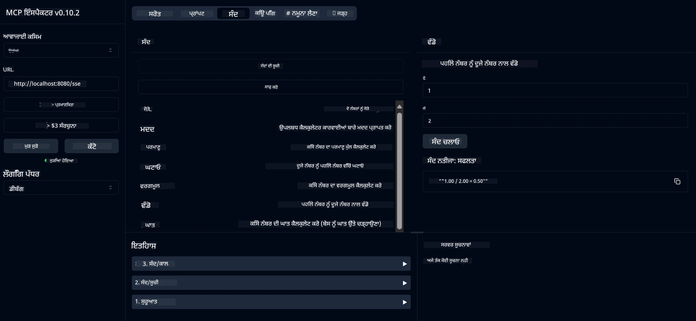

# ਬੇਸਿਕ ਕੈਲਕੂਲੇਟਰ MCP ਸੇਵਾ

> [!NOTE]
> ਇਹ ਜਾਵਾ ਹੱਲ ਲੈਗੇਸੀ HTTP+SSE ਟ੍ਰਾਂਸਪੋਰਟ ਦੀ ਵਰਤੋਂ ਕਰਦਾ ਹੈ ਅਤੇ MCP `2025-11-25` ਨਾਲ ਅਨੁਕੂਲ SDK ਨੂੰ ਲਕੜੀਦਾ ਹੈ।
> ਇਹ ਕੋਰਸ ਕੋਡ ਨਾਲ ਮੇਲ ਖਾਣ ਲਈ ਰੱਖਿਆ ਗਿਆ ਹੈ;
> ਨਵੇਂ ਰਿਮੋਟ ਸਰਵਰਾਂ ਨੂੰ `2026-07-28` ਸਟ੍ਰੀਮਏਬਲ HTTP ਸਹਾਇਤਾ ਦੀ ਵਰਤੋਂ ਕਰਨੀ ਚਾਹੀਦੀ ਹੈ।

ਇਹ ਸੇਵਾ ਮਾਡਲ ਕੰਟੈਕਸਟ ਪ੍ਰੋਟੋਕਾਲ (MCP) ਰਾਹੀਂ ਸਧਾਰਣ ਕੈਲਕੂਲੇਟਰ ਕਾਰਜ ਸਪਲਾਈ ਕਰਦੀ ਹੈ ਜੋ ਸਪ੍ਰਿੰਗ ਬੂਟ ਅਤੇ ਵੈੱਬਫਲਕਸ ਟ੍ਰਾਂਸਪੋਰਟ ਦੀ ਵਰਤੋਂ ਕਰਦੀ ਹੈ। ਇਹ ਨਵੇਂ ਸਿੱਖਣ ਵਾਲਿਆਂ ਲਈ MCP ਇੰਪਲੀਮੇਨਟੇਸ਼ਨ ਬਾਰੇ ਸਧਾਰਣ ਉਦਾਹਰਨ ਵਜੋਂ ਡਿਜ਼ਾਈਨ ਕੀਤੀ ਗਈ ਹੈ।

ਵਧੇਰੇ ਜਾਣਕਾਰੀ ਲਈ, [MCP Server Boot Starter](https://docs.spring.io/spring-ai/reference/api/mcp/mcp-server-boot-starter-docs.html) ਸੰਦਰਭ ਦਸਤਾਵੇਜ਼ ਨੂੰ ਵੇਖੋ।


## ਸੇਵਾ ਦੀ ਵਰਤੋਂ

ਸੇਵਾ MCP ਪ੍ਰੋਟੋਕਾਲ ਰਾਹੀਂ ਹੇਠ ਲਿਖੇ API ਐਂਡਪੌਇੰਟ ਪ੍ਰਦਾਨ ਕਰਦੀ ਹੈ:

- `add(a, b)`: ਦੋ ਨੰਬਰ ਜੁੜੋ
- `subtract(a, b)`: ਦੂਜੇ ਨੰਬਰ ਨੂੰ ਪਹਿਲੇ ਤੋਂ ਘਟਾਓ
- `multiply(a, b)`: ਦੋ ਨੰਬਰਾਂ ਦਾ ਗੁਣਾ ਕਰੋ
- `divide(a, b)`: ਪਹਿਲੇ ਨੰਬਰ ਨੂੰ ਦੂਜੇ ਨਾਲ ਵੰਡੋ (ਜ਼ੀਰੋ ਦੀ ਜਾਂਚ ਨਾਲ)
- `power(base, exponent)`: ਕਿਸੇ ਨੰਬਰ ਦੀ ਘਾਤ ਰਕਮ ਦੀ ਗਣਨਾ ਕਰੋ
- `squareRoot(number)`: ਵਰਗਮੂਲ ਗਣਨਾ ਕਰੋ (ਨਕਾਰਾਤਮਕ ਨੰਬਰ ਦੀ ਜਾਂਚ ਨਾਲ)
- `modulus(a, b)`: ਵੰਡ ਦੇ ਬਾਅਦ ਬਾਕੀ ਰਕਮ ਦੀ ਗਣਨਾ ਕਰੋ
- `absolute(number)`: ਪਰਮਾਣਵਿਕ ਮੁੱਲ ਦੀ ਗਣਨਾ ਕਰੋ

## ਨਿਰਭਰਤਾਵਾਂ

ਪ੍ਰੋਜੈਕਟ ਲਈ ਹੇਠ ਲਿਖੀਆਂ ਮੁੱਖ ਨਿਰਭਰਤਾਵਾਂ ਲਾਜ਼ਮੀ ਹਨ:

```xml
<dependency>
    <groupId>org.springframework.ai</groupId>
    <artifactId>spring-ai-starter-mcp-server-webflux</artifactId>
</dependency>
```

## ਪ੍ਰੋਜੈਕਟ ਬਿਲਡ ਕਰਨਾ

ਪ੍ਰੋਜੈਕਟ ਨੂੰ Maven ਦੀ ਵਰਤੋਂ ਨਾਲ ਬਣਾਓ:
```bash
./mvnw clean install -DskipTests
```

## ਸਰਵਰ ਚਲਾਉਣਾ

### ਜਾਵਾ ਦੀ ਵਰਤੋਂ ਕਰਦੇ ਹੋਏ

```bash
java -jar target/calculator-server-0.0.1-SNAPSHOT.jar
```

### MCP ਇੰਸਪੈਕਟਰ ਦੀ ਵਰਤੋਂ ਕਰਨਾ

MCP ਇੰਸਪੈਕਟਰ MCP ਸੇਵਾਵਾਂ ਨਾਲ ਇੰਟਰੇਕਟ ਕਰਨ ਲਈ ਇੱਕ ਸਹਾਇਕ ਟੂਲ ਹੈ। ਇਸ ਕੈਲਕੂਲੇਟਰ ਸੇਵਾ ਨਾਲ ਇਸ ਨੂੰ ਵਰਤਣ ਲਈ:

1. **ਨਵੀਂ ਟਰਮੀਨਲ ਵਿੰਡੋ ਵਿਚ MCP ਇੰਸਪੈਕਟਰ ਇੰਸਟਾਲ ਅਤੇ ਚਲਾਓ**:
   ```bash
   npx @modelcontextprotocol/inspector
   ```

2. **ਐਪ ਦੁਆਰਾ ਦਰਸਾਈ ਗਈ URL (‘ਆਮ ਤੌਰ ‘ਤੇ http://localhost:6274’) 'ਤੇ ਵੈੱਬ UI ਤੱਕ ਪੁੱਜੋ'**

3. **ਕਨੈਕਸ਼ਨ ਸੈੱਟਿੰਗ ਕਰੋ**:
   - ਟ੍ਰਾਂਸਪੋਰਟ ਕਿਸਮ "SSE" 'ਤੇ ਸੈੱਟ ਕਰੋ
   - ਆਪਣੇ ਚੱਲ ਰਹੇ ਸਰਵਰ ਦੇ SSE ਐਂਡਪੌਇੰਟ ਲਈ URL ਸੈੱਟ ਕਰੋ: `http://localhost:8080/sse`
   - "ਕਨੈਕਟ" 'ਤੇ ਕਲਿਕ ਕਰੋ

4. **ਟੂਲ ਵਰਤੋ**:
   - "List Tools" 'ਤੇ ਕਲਿਕ ਕਰ ਕੇ ਉਪਲਬਧ ਕੈਲਕੂਲੇਟਰ ਆਪਰੇਸ਼ਨ ਵੇਖੋ
   - ਇੱਕ ਟੂਲ ਚੁਣੋ ਅਤੇ "Run Tool" 'ਤੇ ਕਲਿਕ ਕਰਕੇ ਕਾਰਜ ਚਲਾਓ



---

<!-- CO-OP TRANSLATOR DISCLAIMER START -->
**ਅਸਵੀਕਾਰੋਪਣ**:
ਇਸ ਦਸਤਾਵੇਜ਼ ਦਾ ਅਨੁਵਾਦ ਏਆਈ ਅਨੁਵਾਦ ਸੇਵਾ [Co-op Translator](https://github.com/Azure/co-op-translator) ਦੀ ਵਰਤੋਂ ਕਰਕੇ ਕੀਤਾ ਗਿਆ ਹੈ। ਜਦੋਂ ਕਿ ਅਸੀਂ ਸਹੀਤਾਵਾਂ ਲਈ ਯਤਨਸ਼ੀਲ ਹਾਂ, ਕਿਰਪਾ ਕਰਕੇ ਧਿਆਨ ਰੱਖੋ ਕਿ ਸਵੈਚਾਲਿਤ ਅਨੁਵਾਦਾਂ ਵਿੱਚ ਗਲਤੀਆਂ ਜਾਂ ਅਸਮੱਤਿਆਵਾਂ ਹੋ ਸਕਦੀਆਂ ਹਨ। ਮੂਲ ਦਸਤਾਵੇਜ਼ ਆਪਣੀ ਮੂਲ ਭਾਸ਼ਾ ਵਿੱਚ ਅਧਿਕਾਰਕ ਸਰੋਤ ਮੰਨਿਆ ਜਾਣਾ ਚਾਹੀਦਾ ਹੈ। ਜਰੂਰੀ ਜਾਣਕਾਰੀ ਲਈ, ਪੇਸ਼ੇਵਰ ਮਨੁੱਖੀ ਅਨੁਵਾਦ ਦੀ ਸਿਫ਼ਾਰਸ਼ ਕੀਤੀ ਜਾਂਦੀ ਹੈ। ਅਸੀਂ ਇਸ ਅਨੁਵਾਦ ਦੇ ਉਪਯੋਗ ਤੋਂ ਪੈਦਾ ਹੋਣ ਵਾਲੀਆਂ ਕਿਸੇ ਵੀ ਗਲਤਫਹਿਮੀਆਂ ਜਾਂ ਗਲਤ ਵਿਆਖਿਆਵਾਂ ਲਈ ਜਵਾਬਦੇਹ ਨਹੀਂ ਹਾਂ।
<!-- CO-OP TRANSLATOR DISCLAIMER END -->