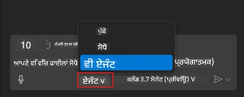
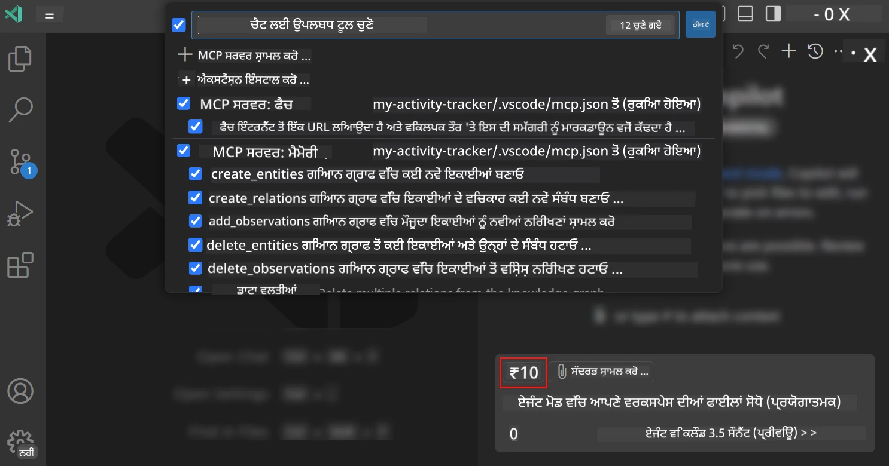
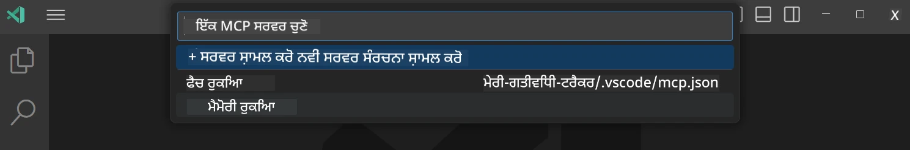
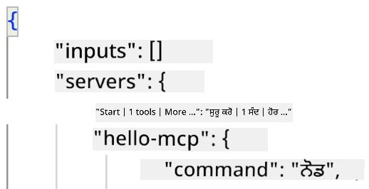
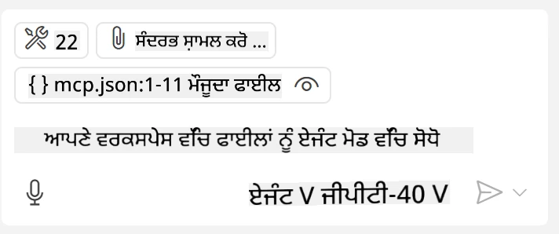
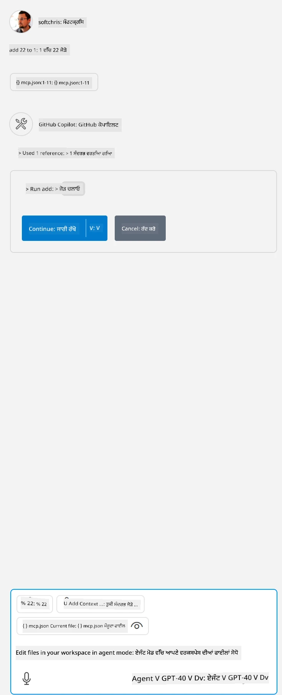

# GitHub Copilot ਏਜੰਟ ਮੋਡ ਤੋਂ ਸਰਵਰ ਦੀ ਖਪਤ ਕਰਨਾ  

ਵਿਜ਼ੂਅਲ ਸਟੂਡੀਓ ਕੋਡ ਅਤੇ GitHub Copilot ਇੱਕ ਕਲਾਇੰਟ ਵਜੋਂ ਕੰਮ ਕਰ ਸਕਦੇ ਹਨ ਅਤੇ MCP ਸਰਵਰ ਨੂੰ ਖਪਤ ਕਰ ਸਕਦੇ ਹਨ। ਤੁਸੀਂ ਪੁੱਛ ਸਕਦੇ ਹੋ ਕਿ ਅਸੀਂ ਇਹ ਕਿਉਂ ਕਰਨਾ ਚਾਹੁੰਦੇ ਹਾਂ? ਖੈਰ, ਇਸਦਾ ਮਤਲਬ ਇਹ ਹੈ ਕਿ MCP ਸਰਵਰ ਦੀਆਂ ਜਿਹੜੀਆਂ ਵੀ ਖੂਬੀਆਂ ਹਨ, ਉਹ ਹੁਣ ਤੁਹਾਡੇ IDE ਦੇ ਅੰਦਰੋਂ ਵਰਤੀ ਜਾ ਸਕਦੀਆਂ ਹਨ। ਸੋਚੋ ਤੁਸੀਂ ਉਦਾਹਰਨ ਲਈ GitHub ਦਾ MCP ਸਰਵਰ ਜੋੜ ਰਹੇ ਹੋ, ਇਸ ਨਾਲ GitHub ਨੂੰ ਪ੍ਰਾਂਪਟਾਂ ਰਾਹੀਂ ਕੰਟਰੋਲ ਕਰਨਾ ਸੰਭਵ ਹੋਵੇਗਾ ਬਿਨਾਂ ਟਰਮੀਨਲ ਵਿੱਚ ਖਾਸ ਕਮਾਂਡਾਂ ਟਾਈਪ ਕੀਤੀਆਂ। ਜਾਂ ਫਿਰ ਕੋਈ ਵੀ ਚੀਜ਼ ਜੋ ਤੁਹਾਡੇ ਡਿਵੈਲਪਰ ਅਨੁਭਵ ਨੂੰ ਸੁਧਾਰ ਸਕਦੀ ਹੋਵੇ ਅਤੇ ਇਹ ਸਬ ਕੁਦਰਤੀ ਭਾਸ਼ਾ ਰਾਹੀਂ ਕੰਟਰੋਲ ਕੀਤੀ ਜਾ ਸਕਦੀ ਹੋਵੇ। ਹੁਣ ਤੁਹਾਨੂੰ ਸਮਝ ਆਉਣ ਲੱਗੀ ਹੈ ਕਿ ਕਿਵੇਂ ਇਹ ਲਾਭਦਾਇਕ ਹੈ, ਹੈ ਨਾ?  

## ਓਵਰਵਿਊ  

ਇਸ ਪਾਠ ਵਿੱਚ ਵਿਜ਼ੂਅਲ ਸਟੂਡੀਓ ਕੋਡ ਅਤੇ GitHub Copilot ਦੇ ਏਜੰਟ ਮੋਡ ਨੂੰ MCP ਸਰਵਰ ਲਈ ਕਲਾਇੰਟ ਵਜੋਂ ਵਰਤਣ ਦਾ ਤਰੀਕਾ ਸਮਝਾਇਆ ਗਿਆ ਹੈ।  

## ਸਿੱਖਣ ਦੇ ਉਦੇਸ਼  

ਇਸ ਪਾਠ ਦੇ ਅੰਤ ਤੱਕ, ਤੁਸੀਂ ਸਮਰੱਥ ਹੋਵੋਗੇ:  

- MCP ਸਰਵਰ ਨੂੰ ਵਿਜ਼ੂਅਲ ਸਟੂਡੀਓ ਕੋਡ ਰਾਹੀਂ ਖਪਤ ਕਰੋ।  
- ਗਿਟਹਬ ਕੋਪਾਇਲਟ ਰਾਹੀਂ ਟੂਲ ਵਰਗੀਆਂ ਸਮਰੱਥਾਵਾਂ ਚਲਾਓ।  
- MCP ਸਰਵਰ ਖੋਜਣ ਅਤੇ ਪ੍ਰਬੰਧਨ ਕਰਨ ਲਈ ਵਿਜ਼ੂਅਲ ਸਟੂਡੀਓ ਕੋਡ ਨੂੰ ਸੰਰਚਿਤ ਕਰੋ।  

## ਵਰਤੋਂ  

ਤੁਸੀਂ ਆਪਣੇ MCP ਸਰਵਰ ਨੂੰ ਦੋ ਤਰੀਕਿਆਂ ਨਾਲ ਕੰਟਰੋਲ ਕਰ ਸਕਦੇ ਹੋ:  

- ਯੂਜ਼ਰ ਇੰਟਰਫੇਸ, ਇਹ ਕਿਵੇਂ ਕੀਤਾ ਜਾਂਦਾ ਹੈ, ਇਸ ਦੇਖਿਆ ਜਾਵੇਗਾ ਇਸ ਅਧਿਆਇ ਵਿੱਚ ਅੱਗੇ।  
- ਟਰਮੀਨਲ, ਟਰਮੀਨਲ ਤੋਂ ਹੀ `code` ਐਗਜ਼ਿਕਿਊਟੇਬਲ ਵਰਤ ਕੇ ਕੰਟਰੋਲ ਕਰਨਾ ਸੰਭਵ ਹੈ:  

  ਆਪਣੇ ਯੂਜ਼ਰ ਪ੍ਰੋਫ਼ਾਈਲ ਵਿੱਚ MCP ਸਰਵਰ ਜੋੜਨ ਲਈ, --add-mcp ਕਮਾਂਡ ਲਾਈਨ ਵਿਕਲਪ ਦਾ ਉਪਯੋਗ ਕਰੋ, ਅਤੇ JSON ਸਰਵਰ ਸੰਰਚਨਾ ਨੂੰ ਫਾਰਮ ਵਿੱਚ ਪੇਸ਼ ਕਰੋ {\"name\":\"server-name\",\"command\":...}।  

  ```
  code --add-mcp "{\"name\":\"my-server\",\"command\": \"uvx\",\"args\": [\"mcp-server-fetch\"]}"
  ```
  
### ਸਕ੍ਰੀਨਸ਼ਾਟ  

  
  
  

ਆਓ ਅਗਲੇ ਹਿੱਸਿਆਂ ਵਿੱਚ ਵੀਜ਼ੂਅਲ ਇੰਟਰਫੇਸ ਨੂੰ ਵਰਤਣ ਬਾਰੇ ਹੋਰ ਗੱਲ ਕਰੀਏ।  

## ਪਹੁੰਚ  

ਇਹ ਹੈ ਉੱਚ ਸਤਰ 'ਤੇ ਅਸੀਂ ਇਸਨੂੰ ਕਿਵੇਂ ਲਾਗੂ ਕਰਨਾ ਹੈ:  

- MCP ਸਰਵਰ ਦੀ ਖੋਜ ਲਈ ਇੱਕ ਫਾਈਲ ਸੰਰਚਿਤ ਕਰੋ।  
- ਉਸ ਸਰਵਰ ਨੂੰ ਸ਼ੁਰੂ ਕਰੋ ਜਾਂ ਕਨੈਕਟ ਕਰੋ ਤਾਂ ਜੋ ਇਹ ਆਪਣੀਆਂ ਸਮਰੱਥਾਵਾਂ ਦੀ ਸੂਚੀ ਦੇ ਸਕੇ।  
- GitHub Copilot ਚੈਟ ਇੰਟਰਫੇਸ ਰਾਹੀਂ ਉਨ੍ਹਾਂ ਸਮਰੱਥਾਵਾਂ ਨੂੰ ਵਰਤੋ।  

ਵਧੀਆ, ਹੁਣ ਜਦੋਂ ਸਾਡੀ ਸਮਝ ਫਲੋ ਬਾਰੇ ਹੋ ਗਈ ਹੈ, ਚਲੋ ਇੱਕ ਅਭਿਆਸ ਕਰੀਏ ਜਿਸ ਨਾਲ ਅਸੀਂ MCP ਸਰਵਰ ਨੂੰ ਵਿਜ਼ੂਅਲ ਸਟੂਡੀਓ ਕੋਡ ਰਾਹੀਂ ਵਰਤਦੇ ਹਾਂ।  

## ਅਭਿਆਸ: ਸਰਵਰ ਦੀ ਖਪਤ ਕਰਨਾ  

ਇਸ ਅਭਿਆਸ ਵਿੱਚ, ਅਸੀਂ MCP ਸਰਵਰ ਦੀ ਖੋਜ ਲਈ ਵਿਜ਼ੂਅਲ ਸਟੂਡੀਓ ਕੋਡ ਨੂੰ ਸੰਰਚਿਤ ਕਰਾਂਗੇ ਤਾਂ ਕਿ GitHub Copilot ਚੈਟ ਇੰਟਰਫੇਸ ਰਾਹੀਂ ਇਸ ਦੀ ਵਰਤੋਂ ਕੀਤੀ ਜਾ ਸਕੇ।  

### -0- ਪਹਿਲਾ ਕਦਮ, MCP ਸਰਵਰ ਖੋਜ ਨੂੰ ਯੋਗ ਕਰੋ  

ਤੁਹਾਨੂੰ MCP ਸਰਵਰਾਂ ਦੀ ਖੋਜ ਯੋਗ ਕਰਨ ਦੀ ਲੋੜ ਹੋ ਸਕਦੀ ਹੈ।  

1. Visual Studio Code ਵਿੱਚ `File -> Preferences -> Settings` ਤੇ ਜਾਓ।  

1. "MCP" ਲਈ ਖੋਜ ਕਰੋ ਅਤੇ settings.json ਫਾਈਲ ਵਿੱਚ `chat.mcp.discovery.enabled` ਨੂੰ ਯੋਗ ਕਰੋ।  

### -1- ਸੰਰਚਨਾ ਫਾਈਲ ਬਣਾਉਣਾ  

ਆਪਣੇ ਪ੍ਰੋਜੈਕਟ ਰੂਟ ਵਿੱਚ ਇੱਕ ਸੰਰਚਨਾ ਫਾਈਲ ਬਣਾਉ, ਇਸ ਲਈ ਤੁਹਾਨੂੰ MCP.json ਨਾਮਕ ਫਾਈਲ ਦੀ ਲੋੜ ਹੋਵੇਗੀ ਜੋ .vscode ਫੋਲਡਰ ਵਿੱਚ ਰੱਖੋ। ਇਹ ਇਸ ਤਰ੍ਹਾਂ ਹੋਣਾ ਚਾਹੀਦਾ ਹੈ:  

```text
.vscode
|-- mcp.json
```
  
ਹੁਣ, ਚਲੋ ਵੇਖੀਏ ਕਿ ਸਰਵਰ ਐਂਟਰੀ ਕਿਵੇਂ ਜੋੜੀ ਜਾ ਸਕਦੀ ਹੈ।  

### -2- ਸਰਵਰ ਸੈੱਟ ਕਰੋ  

*mcp.json* ਵਿੱਚ ਹੇਠਾਂ ਦਿੱਤੀ ਸਮੱਗਰੀ ਸ਼ਾਮਲ ਕਰੋ:  

```json
{
    "inputs": [],
    "servers": {
       "hello-mcp": {
           "command": "node",
           "args": [
               "build/index.js"
           ]
       }
    }
}
```
  
ਉਪਰ ਦਿੱਤਾ ਇੱਕ ਸਧਾਰਣ ਉਦਾਹਰਨ ਹੈ ਕਿ ਕਿਵੇਂ Node.js ਵਿੱਚ ਲਿਖਿਆ ਸਰਵਰ ਸ਼ੁਰੂ ਕੀਤਾ ਜਾਵੇ, ਹੋਰ ਰੰਨਟਾਈਮਾਂ ਲਈ `command` ਅਤੇ `args` ਦੀ ਵਰਤੋਂ ਕਰਕੇ ਸਰਵਰ ਸ਼ੁਰੂ ਕਰਨ ਦੀ ਸਹੀ ਕਮਾਂਡ ਦਿਓ।  

### -3- ਸਰਵਰ ਸ਼ੁਰੂ ਕਰੋ  

ਹੁਣ ਜਦੋਂ ਤੁਸੀਂ ਐਂਟਰੀ ਜੋੜ ਚੁੱਕੇ ਹੋ, ਚਲੋ ਸਰਵਰ ਸ਼ੁਰੂ ਕਰੀਏ:  

1. ਆਪਣੀ ਐਂਟਰੀ *mcp.json* ਵਿੱਚ ਲੱਭੋ ਅਤੇ ਇਹ ਯਕੀਨੀ ਬਣਾਓ ਕਿ ਤੁਹਾਨੂੰ "play" ਆਈਕਨ ਮਿਲਦਾ ਹੈ:  

    

1. "play" ਆਈਕਨ 'ਤੇ ਕਲਿੱਕ ਕਰੋ, ਤੁਹਾਨੂੰ GitHub Copilot Chat ਵਿੱਚ ਟੂਲ ਆਈਕਨ ਵਿੱਚ ਉਪਲਬਧ ਟੂਲਾਂ ਦਾ ਗਿਣਤੀ ਵੱਧਦੀ ਹੋਈ ਦੇਖਣ ਨੂੰ ਮਿਲੇਗੀ। ਜੇ ਤੁਸੀਂ ਇਸ ਟੂਲ ਆਈਕਨ 'ਤੇ ਕਲਿੱਕ ਕਰੋਗੇ, ਤਾਂ ਤੁਹਾਨੂੰ ਰਜਿਸਟਰਡ ਟੂਲਾਂ ਦੀ ਸੂਚੀ ਦੇਖਣ ਨੂੰ ਮਿਲੇਗੀ। ਤੁਸੀਂ ਹਰ ਟੂਲ ਨੂੰ ਚੈੱਕ ਜਾਂ ਅਨਚੈੱਕ ਕਰ ਸਕਦੇ ਹੋ ਕਿ GitHub Copilot ਉਹਨਾਂ ਨੂੰ ਸੰਦਰਭ ਵਜੋਂ ਵਰਤੇ:  

    

1. ਕਿਸੇ ਟੂਲ ਨੂੰ ਚਲਾਉਣ ਲਈ, ਇੱਕ ਪ੍ਰਾਂਪਟ ਲਿਖੋ ਜੋ ਤੁਹਾਨੂੰ ਪਤਾ ਹੈ ਕਿ ਤੁਹਾਡੇ ਕਿਸੇ ਟੂਲ ਦੀ ਵਰਣਨਾ ਨਾਲ ਮੇਲ ਖਾਂਦਾ ਹੈ, ਉਦਾਹਰਨ ਵਜੋਂ ਐਸਾ ਪ੍ਰਾਂਪਟ "add 22 to 1":  

    

  ਤੁਹਾਨੂੰ ਜਵਾਬ ਦੇ ਰੂਪ ਵਿੱਚ 23 ਆਉਂਦਾ ਹੋਇਆ ਵੇਖਣਾ ਚਾਹੀਦਾ ਹੈ।  

## ਕੰਮ  

ਆਪਣੇ *mcp.json* ਫਾਈਲ ਵਿੱਚ ਇੱਕ ਸਰਵਰ ਐਂਟਰੀ ਸ਼ਾਮਲ ਕਰਨ ਦੀ ਕੋਸ਼ਿਸ਼ ਕਰੋ ਅਤੇ ਇਹ ਯਕੀਨੀ ਬਣਾਓ ਕਿ ਤੁਸੀਂ ਸਰਵਰ ਨੂੰ ਸ਼ੁਰੂ/ਰੋਕ ਸਕਦੇ ਹੋ। ਇਹ ਵੀ ਯਕੀਨੀ ਬਣਾਓ ਕਿ ਤੁਸੀਂ GitHub Copilot Chat ਇੰਟਰਫੇਸ ਰਾਹੀਂ ਆਪਣੇ ਸਰਵਰ ਉੱਤੇ ਟੂਲਾਂ ਨਾਲ ਸੰਚਾਰ ਕਰ ਸਕਦੇ ਹੋ।  

## ਹੱਲ  

[ਹੱਲ](./solution/README.md)  

## ਮੁੱਖ ਸਿੱਖਿਆ  

ਇਸ ਅਧਿਆਇ ਤੋਂ ਮੁੱਖ ਸਿੱਖਿਆ ਇਹ ਹਨ:  

- ਵਿਜ਼ੂਅਲ ਸਟੂਡੀਓ ਕੋਡ ਇੱਕ ਸ਼ਾਨਦਾਰ ਕਲਾਇੰਟ ਹੈ ਜੋ ਤੁਹਾਨੂੰ ਇੱਕ ਤੋਂ ਵੱਧ MCP ਸਰਵਰਾਂ ਅਤੇ ਉਹਨਾਂ ਦੇ ਟੂਲ ਵਰਤਣ ਦਿੰਦਾ ਹੈ।  
- GitHub Copilot Chat ਇੰਟਰਫੇਸ ਉਹ ਜਾਂਗਾ ਹੈ ਜਿੱਥੇ ਤੁਸੀਂ ਸਰਵਰਾਂ ਨਾਲ ਸੰਚਾਰ ਕਰਦੇ ਹੋ।  
- ਤੁਸੀਂ ਯੂਜ਼ਰ ਤੋਂ ਇਨਪੁੱਟ ਜਿਵੇਂ ਕਿ API ਕੁੰਜੀਆਂ ਮੰਗ ਸਕਦੇ ਹੋ ਜੋ MCP ਸਰਵਰ ਨੂੰ *mcp.json* ਫਾਈਲ ਵਿੱਚ ਸਰਵਰ ਐਂਟਰੀ ਕੌਨਫਿਗਰ ਕਰਨ ਸਮੇਂ ਪਾਸ ਕੀਤੀਆਂ ਜਾ ਸਕਦੀਆਂ ਹਨ।  

## ਉਦਾਹਰਨਾਂ  

- [ਜਾਵਾ ਕੈਲਕੁਲੇਟਰ](../samples/java/calculator/README.md)  
- [.Net ਕੈਲਕੁਲੇਟਰ](../../../../03-GettingStarted/samples/csharp)  
- [ਜਾਵਾਸਕ੍ਰਿਪਟ ਕੈਲਕੁਲੇਟਰ](../samples/javascript/README.md)  
- [ਟਾਈਪਸਕ੍ਰਿਪਟ ਕੈਲਕੁਲੇਟਰ](../samples/typescript/README.md)  
- [ਪਾਇਥਨ ਕੈਲਕੁਲੇਟਰ](../../../../03-GettingStarted/samples/python)  

## ਵਾਧੂ ਸਰੋਤ  

- [Visual Studio ਡੌਕਸ](https://code.visualstudio.com/docs/copilot/chat/mcp-servers)  

## ਅਗਲਾ ਕੀ ਹੈ  

- ਅਗਲਾ: [stdio ਸਰਵਰ ਬਣਾਉਣਾ](../05-stdio-server/README.md)  

---

<!-- CO-OP TRANSLATOR DISCLAIMER START -->
**ਅਸਵੀਕਾਰੋਪਣ**:
ਇਸ ਦਸਤਾਵੇਜ਼ ਦਾ ਅਨੁਵਾਦ ਏਆਈ ਅਨੁਵਾਦ ਸੇਵਾ [Co-op Translator](https://github.com/Azure/co-op-translator) ਦੀ ਵਰਤੋਂ ਕਰਕੇ ਕੀਤਾ ਗਿਆ ਹੈ। ਜਦੋਂ ਕਿ ਅਸੀਂ ਸਹੀਤਾਵਾਂ ਲਈ ਯਤਨਸ਼ੀਲ ਹਾਂ, ਕਿਰਪਾ ਕਰਕੇ ਧਿਆਨ ਰੱਖੋ ਕਿ ਸਵੈਚਾਲਿਤ ਅਨੁਵਾਦਾਂ ਵਿੱਚ ਗਲਤੀਆਂ ਜਾਂ ਅਸਮੱਤਿਆਵਾਂ ਹੋ ਸਕਦੀਆਂ ਹਨ। ਮੂਲ ਦਸਤਾਵੇਜ਼ ਆਪਣੀ ਮੂਲ ਭਾਸ਼ਾ ਵਿੱਚ ਅਧਿਕਾਰਕ ਸਰੋਤ ਮੰਨਿਆ ਜਾਣਾ ਚਾਹੀਦਾ ਹੈ। ਜਰੂਰੀ ਜਾਣਕਾਰੀ ਲਈ, ਪੇਸ਼ੇਵਰ ਮਨੁੱਖੀ ਅਨੁਵਾਦ ਦੀ ਸਿਫ਼ਾਰਸ਼ ਕੀਤੀ ਜਾਂਦੀ ਹੈ। ਅਸੀਂ ਇਸ ਅਨੁਵਾਦ ਦੇ ਉਪਯੋਗ ਤੋਂ ਪੈਦਾ ਹੋਣ ਵਾਲੀਆਂ ਕਿਸੇ ਵੀ ਗਲਤਫਹਿਮੀਆਂ ਜਾਂ ਗਲਤ ਵਿਆਖਿਆਵਾਂ ਲਈ ਜਵਾਬਦੇਹ ਨਹੀਂ ਹਾਂ।
<!-- CO-OP TRANSLATOR DISCLAIMER END -->