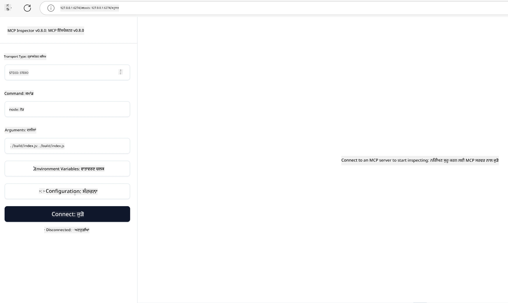

## ਟੈਸਟਿੰਗ ਅਤੇ ਡੀਬੱਗਿੰਗ

ਆਪਣੇ MCP ਸਰਵਰ ਦੀ ਟੈਸਟਿੰਗ ਸ਼ੁਰੂ ਕਰਨ ਤੋਂ ਪਹਿਲਾਂ, ਉਪਲਬਧ ਟੂਲਾਂ ਅਤੇ ਡੀਬੱਗਿੰਗ ਲਈ ਸਰਵੋਤਮ ਅਭਿਆਸਾਂ ਨੂੰ ਸਮਝਣਾ ਜ਼ਰੂਰੀ ਹੈ। ਪ੍ਰਭਾਵਸ਼ाली ਟੈਸਟਿੰਗ ਇਹ ਯਕੀਨੀ ਬਣਾਉਂਦੀ ਹੈ ਕਿ ਤੁਹਾਡਾ ਸਰਵਰ ਉਮੀਦਾਂ ਅਨੁਸਾਰ ਵਰਤਦਾ ਹੈ ਅਤੇ ਤੁਰੰਤ ਸਮੱਸਿਆਵਾਂ ਦੀ ਪਹਿਚਾਣ ਤੇ ਹੱਲ ਕਰਨ ਵਿੱਚ ਸਹਾਇਤਾ ਕਰਦੀ ਹੈ। ਅਗਲਾ ਭਾਗ ਤੁਹਾਡੇ MCP ਅਮਲ ਨੂੰ ਵੈਧ ਕਰਣ ਲਈ ਸਿਫਾਰਸ਼ੀ ਹੋਏ ਤਰੀਕਿਆਂ ਨੂੰ ਦਰਸਾਉਂਦਾ ਹੈ।

## ਝਲਕ

ਇਹ ਪਾਠ ਸਹੀ ਟੈਸਟਿੰਗ ਅਭਿਗਮ ਅਤੇ ਸਭ ਤੋਂ ਪ੍ਰਭਾਵਸ਼ਾਲੀ ਟੈਸਟਿੰਗ ਟੂਲ ਚੁਣਨ ਬਾਰੇ ਹੈ।

## ਸਿੱਖਣ ਦੇ ਲਕੜੇ

ਇਸ ਪਾਠ ਦੇ ਅੰਤ ਵਿੱਚ, ਤੁਸੀਂ ਸਮਰੱਥ ਹੋਵੋਗੇ:

- ਟੈਸਟਿੰਗ ਲਈ ਵੱਖ-ਵੱਖ ਅਭਿਗਮਾਂ ਨੂੰ ਵਰਣਨ ਕਰੋ।
- ਵੱਖ-ਵੱਖ ਟੂਲਾਂ ਦੀ ਵਰਤੋਂ ਕਰਕੇ ਆਪਣੇ ਕੋਡ ਦੀ ਪ੍ਰਭਾਵਸ਼ਾਲੀ ਟੈਸਟਿੰਗ ਕਰੋ।


## MCP ਸਰਵਰਾਂ ਦੀ ਟੈਸਟਿੰਗ

MCP ਤੁਹਾਡੇ ਸਰਵਰਾਂ ਦੀ ਟੈਸਟਿੰਗ ਅਤੇ ਡੀਬੱਗਿੰਗ ਵਿੱਚ ਮਦਦ ਲਈ ਟੂਲ ਪ੍ਰਦਾਨ ਕਰਦਾ ਹੈ:

- **MCP ਇਨਸਪੈਕਟਰ**: ਇੱਕ ਕਮਾਂਡ ਲਾਈਨ ਟੂਲ ਜੋ CLI ਟੂਲ ਅਤੇ ਵਿਜ਼ੂਅਲ ਟੂਲ ਦੋਵਾਂ ਤਰ੍ਹਾਂ ਚਲਾਇਆ ਜਾ ਸਕਦਾ ਹੈ।
- **ਮੈਨੂਅਲ ਟੈਸਟਿੰਗ**: ਤੁਸੀਂ curl ਵਰਗਾ ਟੂਲ ਵਰਤ ਕੇ ਵੈੱਬ ਬੇਨਤੀਆਂ ਚਲਾ ਸਕਦੇ ਹੋ, ਪਰ ਕੋਈ ਵੀ HTTP ਚਲਾਉਣ ਵਾਲਾ ਟੂਲ ਚੱਲੇਗਾ।
- **ਯੂਨਿਟ ਟੈਸਟਿੰਗ**: ਆਪਣੇ ਮਨਪਸੰਦ ਟੈਸਟਿੰਗ ਫਰੇਮਵਰਕ ਨੂੰ ਵਰਤ ਕੇ ਸਰਵਰ ਅਤੇ ਕਲਾਇੰਟ ਦੋਵੇਂ ਦੇ ਫੀਚਰਾਂ ਦੀ ਟੈਸਟਿੰਗ ਕਰਨਾ ਸੰਭਵ ਹੈ।

### MCP ਇਨਸਪੈਕਟਰ ਦੀ ਵਰਤੋਂ

ਅਸੀਂ ਪਹਿਲਾਂ ਪਾਠਾਂ ਵਿੱਚ ਇਸ ਟੂਲ ਦੀ ਵਰਤੋਂ ਦਾ ਵਰਣਨ ਕੀਤਾ ਹੈ ਪਰ ਆਓ ਇਸ ਬਾਰੇ ਥੋੜ੍ਹਾ ਉੱਚ ਸਤਰ 'ਤੇ ਗੱਲ ਕਰੀਏ। ਇਹ ਟੂਲ Node.js ਵਿੱਚ ਬਣਾਇਆ ਗਿਆ ਹੈ ਅਤੇ ਤੁਸੀਂ ਇਸ ਨੂੰ `npx` ਐਗਜ਼ਿਕਿਊਟੇਬਲ ਕਾਲ ਕਰਕੇ ਵਰਤ ਸਕਦੇ ਹੋ, ਜੋ ਸਥਾਈ ਤੌਰ 'ਤੇ ਟੂਲ ਡਾਊਨਲੋਡ ਅਤੇ ਇੰਸਟਾਲ ਕਰਦਾ ਹੈ ਤੇ ਰਿਕਵੈਸਟ ਚਲਾਉਣ ਮਗਰੋਂ ਆਪ ਹੀ ਸਾਫ਼ ਕਰ ਲੈਂਦਾ ਹੈ।

[MCP ਇਨਸਪੈਕਟਰ](https://github.com/modelcontextprotocol/inspector) ਤੁਹਾਡੀ ਮਦਦ ਕਰਦਾ ਹੈ:

- **ਸਰਵਰ ਦੀ ਯੋਗਤਾਵਾਂ ਦੀ ਖੋਜ**: ਉਪਲਬਧ ਸਰੋਤ, ਟੂਲਾਂ ਅਤੇ ਪ੍ਰੰਪਟਾਂ ਦੀ ਆਪਮੈਟਿਕ ਪਹਿਚਾਣ ਕਰੋ
- **ਟੂਲ ਪ੍ਰਚਾਲਨ ਦੀ ਟੈਸਟਿੰਗ**: ਵੱਖ-ਵੱਖ ਪੈਰاميਟਰ ਅਜ਼ਮਾਈਓ ਅਤੇ ਜਵਾਬ ਰੀਅਲ-ਟਾਈਮ ਵਿੱਚ ਵੇਖੋ
- **ਸਰਵਰ ਮੈਟਾਡੇਟਾ ਵੇਖੋ**: ਸਰਵਰ ਜਾਣਕਾਰੀ, ਸਕੀਮਾਵਾਂ ਅਤੇ ਸੰਰਚਨਾ ਦੀ ਜਾਂਚ ਕਰੋ

ਟੂਲ ਦਾ ਇੱਕ ਆਮ ਦੌੜ ਇੱਥੋਂ ਇਸ ਤਰ੍ਹਾਂ ਦਿਖਾਈ ਦਿੰਦਾ ਹੈ:

```bash
npx @modelcontextprotocol/inspector node build/index.js
```

ਉਪਰੋਕਤ ਕਮਾਂਡ ਇੱਕ MCP ਅਤੇ ਇਸਦੀ ਵਿਜ਼ੂਅਲ ਇੰਟਰਫੇਸ ਸ਼ੁਰੂ ਕਰਦੀ ਹੈ ਅਤੇ ਤੁਹਾਡੇ ਬ੍ਰਾਊਜ਼ਰ ਵਿੱਚ ਲੋਕਲ ਵੈੱਬ ਇੰਟਰਫੇਸ ਲਾਂਚ ਕਰਦੀ ਹੈ। ਤੁਸੀਂ ਰਜਿਸਟਰਡ MCP ਸਰਵਰਾਂ, ਉਨ੍ਹਾਂ ਦੇ ਉਪਲਬਧ ਟੂਲਾਂ, ਸਰੋਤਾਂ ਅਤੇ ਪ੍ਰੰਪਟਾਂ ਨਾਲ ਇੱਕ ਡੈਸ਼ਬੋਰਡ ਵੇਖ ਸਕਦੇ ਹੋ। ਇਹ ਇੰਟਰਫੇਸ ਤੁਹਾਨੂੰ ਇੰਟਰਐਕਟਿਵ ਤਰੀਕੇ ਨਾਲ ਟੂਲ ਪ੍ਰਚਾਲਨ ਟੈਸਟ ਕਰਨ, ਸਰਵਰ ਮੈਟਾਡੇਟਾ ਦੀ ਜਾਂਚ ਕਰਨ ਅਤੇ ਰੀਅਲ-ਟਾਈਮ ਜਵਾਬ ਵੇਖਣ ਦੀ ਆਜ਼ਾਦੀ ਦਿੰਦਾ ਹੈ, ਜਿਸ ਨਾਲ ਤੁਹਾਡੇ MCP ਸਰਵਰ ਦੇ ਅਮਲ ਦੀ ਪੇਖ-ਤਸ਼ਦੀ ਅਤੇ ਡੀਬੱਗਿੰਗ ਆਸਾਨ ਹੁੰਦੀ ਹੈ।

ਇਹ ਇੰਝ ਦਿੱਸ ਸਕਦਾ ਹੈ: 

ਤੁਸੀਂ ਇਸ ਟੂਲ ਨੂੰ CLI ਮੋਡ ਵਿੱਚ ਵੀ ਚਲਾ ਸਕਦੇ ਹੋ ਜਿਸ ਲਈ ਤੁਸੀਂ `--cli` ਵਿਸ਼ੇਸ਼ਤਾ ਜੋੜਦੇ ਹੋ। ਇੱਥੇ ਇਕ ਉਦਾਹਰਣ ਹੈ ਜਿਸ ਵਿੱਚ "CLI" ਮੋਡ ਵਿੱਚ ਟੂਲ ਚਲਾਇਆ ਗਿਆ ਹੈ ਜੋ ਸਰਵਰ ਉੱਤੇ ਸਾਰੇ ਟੂਲ ਦੀ ਸੂਚੀ ਦਿੰਦਾ ਹੈ:

```sh
npx @modelcontextprotocol/inspector --cli node build/index.js --method tools/list
```

### ਮੈਨੂਅਲ ਟੈਸਟਿੰਗ

ਇਨਸਪੈਕਟਰ ਟੂਲ ਨੂੰ ਸਰਵਰ ਯੋਗਤਾਵਾਂ ਦੀ ਟੈਸਟਿੰਗ ਲਈ ਚਲਾਉਣ ਤੋਂ ਇਲਾਵਾ, ਇੱਕ ਹੋਰ ਸਮਾਨ ਅਭਿਗਮ ਇਹ ਹੈ ਕਿ ਐਚਟੀਟੀਪੀ ਚਲਾਉਣ ਵਾਲੇ ਕਲਾਇੰਟ ਨੂੰ ਚਲਾਇਆ ਜਾਵੇ ਜਿਵੇਂ ਕਿ curl.

curl ਨਾਲ, ਤੁਸੀਂ MCP ਸਰਵਰਾਂ ਦੀ ਸਿੱਧੀ HTTP ਬੇਨਤੀਆਂ ਨਾਲ ਟੈਸਟਿੰਗ ਕਰ ਸਕਦੇ ਹੋ:

```bash
# ਉਦਾਹਰਨ: ਟੈਸਟ ਸਰਵਰ ਮੈਟਾਡੇਟਾ
curl http://localhost:3000/v1/metadata

# ਉਦਾਹਰਨ: ਇੱਕ ਟੂਲ ਚਲਾਓ
curl -X POST http://localhost:3000/v1/tools/execute \
  -H "Content-Type: application/json" \
  -d '{"name": "calculator", "parameters": {"expression": "2+2"}}'
```

ਜਿਵੇਂ ਤੁਹਾਡੇ ਹਵਾਲੇ ਥੋਂ curl ਦੀ ਵਰਤੋਂ ਦਿਖਾਈ ਗਈ ਹੈ, ਤੁਸੀਂ ਇੱਕ POST ਬੇਨਤੀ ਦੀ ਵਰਤੋਂ ਕਰਦੇ ਹੋ ਇੱਕ ਟੂਲ ਨੂੰ ਉਸਦੇ ਨਾਂ ਤੇ ਪੈਰਾਮੀਟਰ ਸਮੇਤ payload ਭੇਜ ਕੇ। ਤੁਹਾਨੂੰ ਉਹ ਅਭਿਗਮ ਵਰਤਣਾ ਚਾਹੀਦਾ ਜੋ ਤੁਹਾਨੂੰ ਸਭ ਤੋਂ ਵਧੀਆ ਲੱਗੇ। ਸਧਾਰਨ ਤੌਰ 'ਤੇ CLI ਟੂਲ ਤੇਜ਼ ਹੁੰਦੇ ਹਨ ਅਤੇ ਸਕ੍ਰਿਪਟਿੰਗ ਲਈ ਅਨੁਕੂਲ ਹੁੰਦੇ ਹਨ ਜੋ ਕਿ CI/CD ਮਾਹੌਲ ਵਿੱਚ ਲਾਭਦਾਇਕ ਸਿੱਧ ਹੋ ਸਕਦਾ ਹੈ।

### ਯੂਨਿਟ ਟੈਸਟਿੰਗ

ਆਪਣੇ ਟੂਲਾਂ ਅਤੇ ਸਰੋਤਾਂ ਲਈ ਯੂਨਿਟ ਟੈਸਟ ਬਣਾਓ ਤਾਂ ਜੋ ਇਹ ਯਕੀਨੀ ਬਣਾਇਆ ਜਾ ਸਕੇ ਕਿ ਉਹ ਉਮੀਦ ਅਨੁਸਾਰ ਕੰਮ ਕਰ ਰਹੇ ਹਨ। ਇੱਥੇ ਕੁਝ ਨਮੂਨਾ ਟੈਸਟਿੰਗ ਕੋਡ ਦਿੱਤਾ ਗਿਆ ਹੈ।

```python
import pytest

from mcp.server.fastmcp import FastMCP
from mcp.shared.memory import (
    create_connected_server_and_client_session as create_session,
)

# ਪੂਰੇ ਮੋਡੀਊਲ ਨੂੰ ਐਸਿੰਕ ਟੈਸਟਾਂ ਲਈ ਮਾਰਕ ਕਰੋ
pytestmark = pytest.mark.anyio


async def test_list_tools_cursor_parameter():
    """Test that the cursor parameter is accepted for list_tools.

    Note: FastMCP doesn't currently implement pagination, so this test
    only verifies that the cursor parameter is accepted by the client.
    """

 server = FastMCP("test")

    # ਕੁਝ ਟੈਸਟ ਟੂਲ ਬਣਾਓ
    @server.tool(name="test_tool_1")
    async def test_tool_1() -> str:
        """First test tool"""
        return "Result 1"

    @server.tool(name="test_tool_2")
    async def test_tool_2() -> str:
        """Second test tool"""
        return "Result 2"

    async with create_session(server._mcp_server) as client_session:
        # ਕਰਸਰ ਪੈਰਾਮੀਟਰ ਦੇ ਬਿਨਾਂ ਟੈਸਟ ਕਰੋ (ਛੱਡ ਦਿੱਤਾ)
        result1 = await client_session.list_tools()
        assert len(result1.tools) == 2

        # ਕਰਸਰ=None ਨਾਲ ਟੈਸਟ ਕਰੋ
        result2 = await client_session.list_tools(cursor=None)
        assert len(result2.tools) == 2

        # ਕਰਸਰ ਨੂੰ ਸਟਰਿੰਗ ਵਜੋਂ ਟੈਸਟ ਕਰੋ
        result3 = await client_session.list_tools(cursor="some_cursor_value")
        assert len(result3.tools) == 2

        # ਖਾਲੀ ਸਟਰਿੰਗ ਕਰਸਰ ਨਾਲ ਟੈਸਟ ਕਰੋ
        result4 = await client_session.list_tools(cursor="")
        assert len(result4.tools) == 2
    
```

ਉਪਰੋਕਤ ਕੋਡ ਹੇਠਾਂ ਦਿੱਤੇ ਕੰਮ ਕਰਦਾ ਹੈ:

- pytest ਫਰੇਮਵਰਕ ਦੀ ਵਰਤੋਂ ਕਰਦਾ ਹੈ ਜੋ ਤੁਹਾਨੂੰ ਟੈਸਟ ਫੰਕਸ਼ਨਾਂ ਵਜੋਂ ਬਣਾਉਣ ਅਤੇ assert ਬਿਆਨ ਵਰਤਣ ਦੀ ਆਗਿਆ ਦਿੰਦਾ ਹੈ।
- ਦੋ ਵੱਖ-ਵੱਖ ਟੂਲਾਂ ਨਾਲ ਇੱਕ MCP ਸਰਵਰ ਬਣਾਉਂਦਾ ਹੈ।
- ਕੁਝ ਸ਼ਰਤਾਂ ਪੂਰੀਆਂ ਹੋਣ ਦੀ ਜਾਂਚ ਲਈ `assert` ਬਿਆਨ ਵਰਤਦਾ ਹੈ।

ਪੂਰਾ ਫਾਇਲ ਇੱਥੇ ਦੇਖੋ: [full file here](https://github.com/modelcontextprotocol/python-sdk/blob/main/tests/client/test_list_methods_cursor.py)

ਉਪਰੋਕਤ ਫਾਇਲ ਦੇ ਨੁਸਖੇ ਚੇ, ਤੁਸੀਂ ਆਪਣੇ ਸਰਵਰ ਦੀ ਟੈਸਟਿੰਗ ਕਰ ਸਕਦੇ ਹੋ ਤਾਂ ਜੋ ਇਹ ਸੁਨਿਸ਼ਚਿਤ ਕੀਤਾ ਜਾ ਸਕੇ ਕਿ ਯੋਗਤਾਵਾਂ ਉਮੀਦਾਂ ਅਨੁਸਾਰ ਬਣ ਰਹੀਆਂ ਹਨ।

ਸਾਰੇ ਮੁੱਖ SDK ਵਿੱਚ ਸਮਾਨ ਟੈਸਟਿੰਗ ਭਾਗ ਹਨ ਇਸ ਲਈ ਤੁਸੀਂ ਆਪਣੇ ਚੁਣੇ ਹੋਏ ਰਨਟਾਈਮ ਅਨੁਸਾਰ ਅਨੁਕੂਲ ਕਰ ਸਕਦੇ ਹੋ।

## ਨਮੂਨੇ 

- [ਜਾਵਾ ਕੈਲਕुलेਟਰ](../samples/java/calculator/README.md)
- [.Net ਕੈਲਕुलेਟਰ](../../../../03-GettingStarted/samples/csharp)
- [ਜਾਵਾਸਕ੍ਰਿਪਟ ਕੈਲਕुलेਟਰ](../samples/javascript/README.md)
- [ਟਾਈਪਸਕ੍ਰਿਪਟ ਕੈਲਕुलेਟਰ](../samples/typescript/README.md)
- [ਪਾਇਥਨ ਕੈਲਕुलेਟਰ](../../../../03-GettingStarted/samples/python) 

## ਵਧੀਕ ਸਰੋਤ

- [Python SDK](https://github.com/modelcontextprotocol/python-sdk)

## ਅਗਲਾ ਕੀ ਹੈ

- ਅਗਲਾ: [Deployment](../09-deployment/README.md)

---

<!-- CO-OP TRANSLATOR DISCLAIMER START -->
**ਅਸਵੀਕਾਰੋਪਣ**:
ਇਸ ਦਸਤਾਵੇਜ਼ ਦਾ ਅਨੁਵਾਦ ਏਆਈ ਅਨੁਵਾਦ ਸੇਵਾ [Co-op Translator](https://github.com/Azure/co-op-translator) ਦੀ ਵਰਤੋਂ ਕਰਕੇ ਕੀਤਾ ਗਿਆ ਹੈ। ਜਦੋਂ ਕਿ ਅਸੀਂ ਸਹੀਤਾਵਾਂ ਲਈ ਯਤਨਸ਼ੀਲ ਹਾਂ, ਕਿਰਪਾ ਕਰਕੇ ਧਿਆਨ ਰੱਖੋ ਕਿ ਸਵੈਚਾਲਿਤ ਅਨੁਵਾਦਾਂ ਵਿੱਚ ਗਲਤੀਆਂ ਜਾਂ ਅਸਮੱਤਿਆਵਾਂ ਹੋ ਸਕਦੀਆਂ ਹਨ। ਮੂਲ ਦਸਤਾਵੇਜ਼ ਆਪਣੀ ਮੂਲ ਭਾਸ਼ਾ ਵਿੱਚ ਅਧਿਕਾਰਕ ਸਰੋਤ ਮੰਨਿਆ ਜਾਣਾ ਚਾਹੀਦਾ ਹੈ। ਜਰੂਰੀ ਜਾਣਕਾਰੀ ਲਈ, ਪੇਸ਼ੇਵਰ ਮਨੁੱਖੀ ਅਨੁਵਾਦ ਦੀ ਸਿਫ਼ਾਰਸ਼ ਕੀਤੀ ਜਾਂਦੀ ਹੈ। ਅਸੀਂ ਇਸ ਅਨੁਵਾਦ ਦੇ ਉਪਯੋਗ ਤੋਂ ਪੈਦਾ ਹੋਣ ਵਾਲੀਆਂ ਕਿਸੇ ਵੀ ਗਲਤਫਹਿਮੀਆਂ ਜਾਂ ਗਲਤ ਵਿਆਖਿਆਵਾਂ ਲਈ ਜਵਾਬਦੇਹ ਨਹੀਂ ਹਾਂ।
<!-- CO-OP TRANSLATOR DISCLAIMER END -->