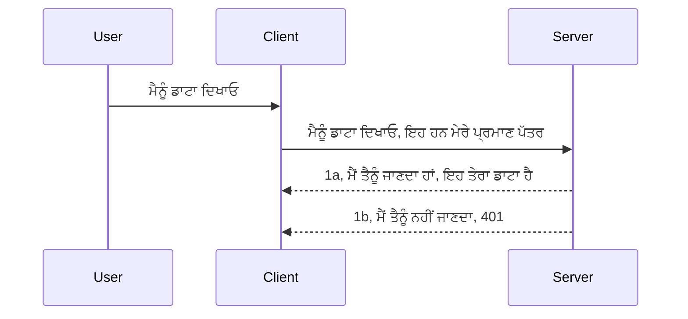

# Simple auth

MCP SDKs OAuth 2.1 ਦੇ ਉਪਯੋਗ ਦਾ ਸਮਰਥਨ ਕਰਦੇ ਹਨ ਜੋ ਕਿ ਇੱਕ ਕਾਫੀ ਜਟਿਲ ਪ੍ਰਕਿਰਿਆ ਹੈ ਜਿਸ ਵਿੱਚ auth ਸਰਵਰ, resource ਸਰਵਰ, ਸਨਮਾਨ ਪੋਸਟ ਕਰਨਾ, ਕੋਡ ਪ੍ਰਾਪਤ ਕਰਨਾ, ਕੋਡ ਨੂੰ bearer token ਵਿੱਚ ਬਦਲਣਾ ਸ਼ਾਮਲ ਹੈ ਜਦ ਤੱਕ ਤੁਸੀਂ ਅਖੀਰਕਾਰ ਆਪਣੇ resource ਡਾਟਾ ਨੂੰ ਪ੍ਰਾਪਤ ਨਹੀਂ ਕਰ ਲੈਂਦੇ। ਜੇ ਤੁਸੀਂ OAuth ਨਾਲ ਅਣਜਾਣ ਹੋ ਜੋ ਲਾਗੂ ਕਰਨ ਲਈ ਇੱਕ ਵਧੀਆ ਚੀਜ਼ ਹੈ, ਤਾਂ ਕੁਝ ਮੁਢਲੀ ਸਤਰ ਦੇ auth ਨਾਲ ਸ਼ੁਰੂ ਕਰਨਾ ਅਤੇ ਵਧੀਆ ਅਤੇ ਵਧੀਆ ਸੁਰੱਖਿਆ ਵੱਲ ਬਨਾਉਣਾ ਚੰਗਾ ਵਿਚਾਰ ਹੈ। ਇਸ ਲਈ ਇਹ ਅਧਿਆਇ ਮੌਜੂਦ ਹੈ, ਜੋ ਤੁਹਾਨੂੰ ਵਧੀਆ auth ਵੱਲ ਬਨਾਉਂਦਾ ਹੈ।

## Auth, ਅਸੀਂ ਕੀ ਮੰਨਦੇ ਹਾਂ?

Auth ਦਾ ਮਤਲਬ ਹੈ authentication ਅਤੇ authorization। ਵਿਚਾਰ ਇਹ ਹੈ ਕਿ ਸਾਨੂੰ ਦੋ ਗੱਲਾਂ ਕਰਨੀਆਂ ਪੈਂਦੀਆਂ ਹਨ:

- **Authentication**, ਜੋ ਇਹ ਪ੍ਰਕਿਰਿਆ ਹੈ ਕਿ ਅਸੀਂ ਇਹ ਪਤਾ ਲਗਾਈਏ ਕਿ ਕਿਸੇ ਵਿਅਕਤੀ ਨੂੰ ਅਸੀਂ ਆਪਣੇ ਘਰ ਵਿੱਚ ਦਾਖਲ ਹੋਣ ਦੀ ਆਗਿਆ ਦੇਣ ਦੀ ਲੋੜ ਹੈ, ਉਹ "ਇੱਥੇ" ਹੋਣ ਦਾ ਅਧਿਕਾਰ ਰੱਖਦਾ ਹੈ ਜਾਂ ਨਹੀਂ, ਜਿਸਦਾ ਅਰਥ ਹੈ ਕਿ ਉਹ ਸਾਡੇ resource ਸਰਵਰ ਜਿੱਥੇ ਸਾਡੇ MCP ਸਰਵਰ ਫੀਚਰ ਮੌਜੂਦ ਹਨ, ਉਥੇ ਪਹੁੰਚ ਰੱਖਦਾ ਹੈ।
- **Authorization**, ਇਹ ਪ੍ਰਕਿਰਿਆ ਹੈ ਜੋ ਪਤਾ ਲਗਾਉਂਦੀ ਹੈ ਕਿ ਇੱਕ ਉਪਭੋਗਤਾ ਨੂੰ ਉਹ ਵਿਸ਼ੇਸ਼ ਸਰੋਤਾਂ ਦੀ ਪਹੁੰਚ ਹੋਣੀ ਚਾਹੀਦੀ ਹੈ ਜੋ ਉਹ ਮੰਗ ਰਿਹਾ ਹੈ, ਉਦਾਹਰਨ ਲਈ ਇਹ orders ਜਾਂ ਇਹ products ਜਾ ਇਹ ਪੜ੍ਹ ਸਕਦਾ ਹੈ ਪਰ ਮਿਟਾ ਨਹੀਂ ਸਕਦਾ ਜਿਵੇਂ ਇਕ ਹੋਰ ਉਦਾਹਰਨ।

## Credentials: ਅਸੀਂ ਪ੍ਰਣਾਲੀ ਨੂੰ ਕਿਵੇਂ ਦੱਸਦੇ ਹਾਂ ਕਿ ਅਸੀਂ ਕੌਣ ਹਾਂ

ਜ਼ਿਆਦਤਰ ਵੈੱਬ ਵਿਕਾਸਕ ਆਪਣੀ ਸੋਚ ਨੂੰ ਐਸੇ ਧਿਆਨ ਵਿੱਚ ਲਿਆਉਂਦੇ ਹਨ ਕਿ ਸਰਵਰ ਨੂੰ ਇੱਕ credential ਦਿੱਤਾ ਜਾਵੇ, ਅਮੂਮਨ ਇੱਕ secret ਜੋ ਦੱਸਦਾ ਹੈ ਕਿ ਉਹ "Authentication" ਲਈ ਇੱਥੇ ਹੋਣ ਦੀ ਆਗਿਆ ਰੱਖਦਾ ਹੈ ਜਾਂ ਨਹੀਂ। ਇਹ credential ਅਕਸਰ username ਅਤੇ password ਦਾ base64 encode ਕੀਤਾ ਹੋਇਆ ਸੰਸਕਰਣ ਜਾਂ API key ਹੁੰਦਾ ਹੈ ਜੋ ਖਾਸ ਉਪਭੋਗਤਾ ਦੀ ਪਛਾਣ ਕਰਦਾ ਹੈ।

ਇਹ ਇਸ ਤਰ੍ਹਾਂ "Authorization" ਨਾਮਕ ਹੈਡਰ ਦੇ ਜ਼ਰੀਏ ਭੇਜਿਆ ਜਾਂਦਾ ਹੈ:

```json
{ "Authorization": "secret123" }
```

ਇਸਨੂੰ ਅਕਸਰ ਬੇਸਿਕ authentication ਕਿਹਾ ਜਾਂਦਾ ਹੈ। ਹੁਣ ਇਸ ਦਾ ਸਮੂਹਿਕ ਪ੍ਰਵਾਹ ਇਸ ਤਰ੍ਹਾਂ ਕੰਮ ਕਰਦਾ ਹੈ:


ਹੁਣ ਜਦੋਂ ਸਾਨੂੰ ਸਮਝ ਆ ਗਿਆ ਕਿ ਇਹ ਪ੍ਰਵਾਹੀ ਵਿਊහ ਕਿਵੇਂ ਕੰਮ ਕਰਦਾ ਹੈ, ਅਸੀਂ ਅਮਲ ਕਿਵੇਂ ਕਰੀਏ? ਜ਼ਿਆਦਤਰ ਵੈੱਬ ਸਰਵਰਾਂ ਕੋਲ middleware ਨਾਮਕ ਧਾਰਣਾ ਹੁੰਦੀ ਹੈ, ਇੱਕ ਕੋਡ ਦਾ ਹਿੱਸਾ ਜੋ ਅਰਜ਼ੀ ਦਾ ਹਿੱਸਾ ਵਜੋਂ ਚੱਲਦਾ ਹੈ ਜੋ credential ਜਾਂਚ ਸਕਦਾ ਹੈ, ਜੇ credential ਸਹੀ ਹੋਵੇ ਤਾਂ ਅਰਜ਼ੀ ਨੂੰ ਆਗੇ ਲੰਘਣ ਦਿੰਦਾ ਹੈ। ਜੇ ਅਰਜ਼ੀ ਵੈਧ credentials ਨਹੀਂ ਰੱਖਦੀ ਤਾਂ ਤੁਹਾਨੂੰ auth error ਮਿਲਦੀ ਹੈ। ਆਓ ਦੇਖੀਏ ਕਿ ਇਸਨੂੰ ਕਿਵੇਂ ਅਮਲ ਕੀਤਾ ਜਾ ਸਕਦਾ ਹੈ:

**Python**

```python
class AuthMiddleware(BaseHTTPMiddleware):
    async def dispatch(self, request, call_next):

        has_header = request.headers.get("Authorization")
        if not has_header:
            print("-> Missing Authorization header!")
            return Response(status_code=401, content="Unauthorized")

        if not valid_token(has_header):
            print("-> Invalid token!")
            return Response(status_code=403, content="Forbidden")

        print("Valid token, proceeding...")
       
        response = await call_next(request)
        # ਕਿਸੇ ਵੀ ਗਾਹਕ ਦੇ ਹੈਡਰ ਜੋੜੋ ਜਾਂ ਜਵਾਬ ਵਿੱਚ ਕਿਸੇ ਤਰ੍ਹਾਂ ਬਦਲਾਅ ਕਰੋ
        return response


starlette_app.add_middleware(CustomHeaderMiddleware)
```

ਇੱਥੇ ਸਾਡੇ ਕੋਲ ਹੈ:

- `AuthMiddleware` ਨਾਮਕ ਇੱਕ middleware ਬਣਾਇਆ ਗਿਆ ਹੈ ਜਿੱਥੇ ਇਸ ਦਾ `dispatch` ਮੈਥਡ ਵੈੱਬ ਸਰਵਰ ਵੱਲੋਂ ਕਾਲ ਕੀਤਾ ਜਾਂਦਾ ਹੈ।
- middleware ਨੂੰ ਵੈੱਬ ਸਰਵਰ ਵਿੱਚ ਸ਼ਾਮਿਲ ਕੀਤਾ ਗਿਆ:

    ```python
    starlette_app.add_middleware(AuthMiddleware)
    ```

- ਲਿਖਿਆ validation ਲਾਜਿਕ ਜੋ ਜਾਂਚਦਾ ਹੈ ਕਿ Authorization ਹੈਡਰ ਮੌਜੂਦ ਹੈ ਜਾਂ ਨਹੀਂ ਅਤੇ ਭੇਜਿਆ ਗਿਆ secret ਸਹੀ ਹੈ ਜਾਂ ਨਹੀਂ:

    ```python
    has_header = request.headers.get("Authorization")
    if not has_header:
        print("-> Missing Authorization header!")
        return Response(status_code=401, content="Unauthorized")

    if not valid_token(has_header):
        print("-> Invalid token!")
        return Response(status_code=403, content="Forbidden")
    ```

ਜੇ secret ਮੌਜੂਦ ਅਤੇ ਸਹੀ ਹੋਵੇ ਤਾਂ ਅਸੀਂ `call_next` ਕਾਲ ਕਰਕੇ ਅਰਜ਼ੀ ਨੂੰ ਆਗੇ ਲੰਘਣ ਦਿੰਦੇ ਹਾਂ ਅਤੇ ਪ੍ਰਤੀਕਿਰਿਆ ਵਾਪਸ ਕਰਦੇ ਹਾਂ।

    ```python
    response = await call_next(request)
    # ਕਿਸੇ ਵੀ ਗਾਹਕ ਦੇ ਹੈਡਰ ਸ਼ਾਮਲ ਕਰੋ ਜਾਂ ਜਵਾਬ ਵਿੱਚ ਕਿਸੇ ਤਰ੍ਹਾਂ ਬਦਲਾਅ ਕਰੋ
    return response
    ```

ਇਹ ਇਸ ਤਰ੍ਹਾਂ ਕੰਮ ਕਰਦਾ ਹੈ ਕਿ ਜੇ ਵੈੱਬ ਸਰਵਰ ਵੱਲ ਵਧੀਅੜੀ ਅਰਜ਼ੀ ਕੀਤੀ ਜਾਂਦੀ ਹੈ ਤਾਂ middleware ਕਾਲ ਹੋਵੇਗਾ ਅਤੇ ਆਪਣੀ ਅਮਲਦਾਰੀ ਦੇ ਅਨੁਸਾਰ ਅਰਜ਼ੀ ਨੂੰ ਆਗੇ ਲੰਘਣ ਦੇਵੇਗਾ ਜਾਂ ਇੱਕ ਐਰਰ ਵਾਪਸ ਕਰੇਗਾ ਜੋ ਦਰਸਾਉਂਦਾ ਹੈ ਕਿ ਕਲਾਇੰਟ ਨੂੰ ਅੱਗੇ ਵਧਣ ਦੀ ਆਗਿਆ ਨਹੀਂ ਹੈ।

**TypeScript**

ਇੱਥੇ ਅਸੀਂ ਮਸ਼ਹੂਰ framework Express ਨਾਲ middleware ਬਣਾਉਂਦੇ ਹਾਂ ਅਤੇ MCP Server ਨੂੰ ਪਹੁੰਚਣ ਤੋਂ ਪਹਿਲਾਂ ਅਰਜ਼ੀ ਨੂੰ intercept ਕਰਦੇ ਹਾਂ। ਇਹ ਕੋਡ ਹੈ:

```typescript
function isValid(secret) {
    return secret === "secret123";
}

app.use((req, res, next) => {
    // 1. ਅਧਿਕਾਰ ਹੈਡਰ ਮੌਜੂਦ ਹੈ?
    if(!req.headers["Authorization"]) {
        res.status(401).send('Unauthorized');
    }
    
    let token = req.headers["Authorization"];

    // 2. ਵੈਧਤਾ ਦੀ ਜਾਂਚ ਕਰੋ।
    if(!isValid(token)) {
        res.status(403).send('Forbidden');
    }

   
    console.log('Middleware executed');
    // 3. ਬੇਨਤੀ ਪਾਈਪਲਾਈਨ ਵਿੱਚ ਅਗਲੇ ਕਦਮ ਲਈ ਬੇਨਤੀ ਭੇਜੋ।
    next();
});
```

ਇਸ ਕੋਡ ਵਿੱਚ ਅਸੀਂ:

1. ਪਹਿਲਾਂ ਜਾਂਚ ਕਰਦੇ ਹਾਂ ਕਿ Authorization ਹੈਡਰ ਮੌਜੂਦ ਹੈ ਜਾਂ ਨਹੀਂ, ਜੇ ਨਹੀਂ ਤਾ ਅਸੀਂ 401 error ਭੇਜਦੇ ਹਾਂ।
2. ਯਕੀਨੀ ਬਣਾਓ ਕਿ credential/token ਸਹੀ ਹੈ, ਜੇ ਨਹੀਂ ਤਾਂ 403 error ਭੇਜਦੇ ਹਾਂ।
3. ਆਖਿਰਕਾਰ ਅਰਜ਼ੀ pipeline ਵਿੱਚ ਅਗੇ ਵਧਦੀ ਹੈ ਅਤੇ ਮੰਗਿਆ ਗਿਆ ਸਰੋਤ ਵਾਪਸ ਕਰਦਾ ਹੈ।

## Exercise: Authentication ਅਮਲ ਕਰੋ

ਆਓ ਆਪਣਾ ਗਿਆਨ ਲੈ ਕੇ ਇਸਨੂੰ ਅਮਲ ਕਰਨ ਦੀ ਕੋਸ਼ਿਸ਼ ਕਰੀਏ। ਯੋਜਨਾ ਇਹ ਹੈ:

Server

- ਵੈੱਬ ਸਰਵਰ ਅਤੇ MCP ਇੰਸਟੈਂਸ ਬਣਾਓ।
- ਸਰਵਰ ਲਈ middleware ਲਾਗੂ ਕਰੋ।

Client

- ਹੈਡਰ ਰਾਹੀਂ credential ਦੇ ਨਾਲ ਵੈੱਬ ਅਰਜ਼ੀ ਭੇਜੋ।

### -1- ਵੈੱਬ ਸਰਵਰ ਅਤੇ MCP ਇੰਸਟੈਂਸ ਬਣਾਓ

ਸਾਡੇ ਪਹਿਲੇ ਕਦਮ ਵਿੱਚ, ਸਾਨੂੰ ਵੈੱਬ ਸਰਵਰ ਇੰਸਟੈਂਸ ਅਤੇ MCP Server ਬਣਾਉਣਾ ਹੈ।

**Python**

ਇੱਥੇ ਅਸੀਂ MCP ਸਰਵਰ ਇੰਸਟੈਂਸ ਬਣਾਈਦੇ ਹਾਂ, starlette ਵੈੱਬ ਐਪ ਬਣਾਈਦੇ ਹਾਂ ਅਤੇ uvicorn ਨਾਲ ਹੋਸਟ ਕਰਦੇ ਹਾਂ।

```python
# MCP ਸਰਵਰ ਬਣਾਉਣਾ

app = FastMCP(
    name="MCP Resource Server",
    instructions="Resource Server that validates tokens via Authorization Server introspection",
    host=settings["host"],
    port=settings["port"],
    debug=True
)

# ਸਟਾਰਲੇਟ ਵੈੱਬ ਐਪ ਬਣਾਉਣਾ
starlette_app = app.streamable_http_app()

# uvicorn ਰਾਹੀਂ ਐਪ ਦੀ ਸੇਵਾ ਕਰਨਾ
async def run(starlette_app):
    import uvicorn
    config = uvicorn.Config(
            starlette_app,
            host=app.settings.host,
            port=app.settings.port,
            log_level=app.settings.log_level.lower(),
        )
    server = uvicorn.Server(config)
    await server.serve()

run(starlette_app)
```

ਇਸ ਕੋਡ ਵਿੱਚ ਅਸੀਂ:

- MCP ਸਰਵਰ ਬਣਾਇਆ।
- MCP Server ਤੋਂ starlette ਵੈੱਬ ਐਪ ਬਣਾਇਆ, `app.streamable_http_app()`।
- uvicorn `server.serve()` ਨਾਲ ਵੈੱਬ ਐਪ ਨੂੰ ਹੋਸਟ ਅਤੇ ਸਰਵ ਕਰਦੇ ਹਾਂ।

**TypeScript**

ਇੱਥੇ ਅਸੀਂ MCP Server ਇੰਸਟੈਂਸ ਬਣਾਉਂਦੇ ਹਾਂ।

```typescript
const server = new McpServer({
      name: "example-server",
      version: "1.0.0"
    });

    // ... ਸਰਵਰ ਸਾਂਝੇਦਾਰ, ਟੂਲ ਅਤੇ ਪ੍ਰੰਪਟ ਸੈੱਟ ਕਰੋ ...
```

ਇਹ MCP Server ਬਣਾਉਣਾ ਸਾਡੇ POST /mcp ਰੂਟ ਡਿਫ਼ਿਨੀਸ਼ਨ ਵਿੱਚ ਹੋਣਾ ਚਾਹੀਦਾ ਹੈ, ਇਸ ਲਈ ਅਸੀਂ ਉੱਪਰ ਦਿਤਾ ਕੋਡ ਲੈ ਕੇ ਇੱਥੇ ਲਿਆਉਂਦੇ ਹਾਂ:

```typescript
import express from "express";
import { randomUUID } from "node:crypto";
import { McpServer } from "@modelcontextprotocol/sdk/server/mcp.js";
import { StreamableHTTPServerTransport } from "@modelcontextprotocol/sdk/server/streamableHttp.js";
import { isInitializeRequest } from "@modelcontextprotocol/sdk/types.js"

const app = express();
app.use(express.json());

// ਸੈਸ਼ਨ ID ਦੇ ਨਾਲ ਟ੍ਰਾਂਸਪੋਰਟ ਸਟੋਰ ਕਰਨ ਲਈ ਮੈਪ
const transports: { [sessionId: string]: StreamableHTTPServerTransport } = {};

// ਕਲਾਇੰਟ-ਤੋਂ-ਸਰਵਰ ਸੰਚਾਰ ਲਈ POST ਬੇਨਤੀ ਸੰਭਾਲੋ
app.post('/mcp', async (req, res) => {
  // ਮੌਜੂਦਾ ਸੈਸ਼ਨ ID ਦੀ ਜਾਂਚ ਕਰੋ
  const sessionId = req.headers['mcp-session-id'] as string | undefined;
  let transport: StreamableHTTPServerTransport;

  if (sessionId && transports[sessionId]) {
    // ਮੌਜੂਦਾ ਟ੍ਰਾਂਸਪੋਰਟ ਨੂੰ ਦੁਬਾਰਾ ਵਰਤੋ
    transport = transports[sessionId];
  } else if (!sessionId && isInitializeRequest(req.body)) {
    // ਨਵੀਂ ਸ਼ੁਰੂਆਤੀ ਬੇਨਤੀ
    transport = new StreamableHTTPServerTransport({
      sessionIdGenerator: () => randomUUID(),
      onsessioninitialized: (sessionId) => {
        // ਸੈਸ਼ਨ ID ਦੇ ਨਾਲ ਟ੍ਰਾਂਸਪੋਰਟ ਸਟੋਰ ਕਰੋ
        transports[sessionId] = transport;
      },
      // DNS ਰੀਬਾਈਂਡਿੰਗ ਸੁਰੱਖਿਆ ਡਿਫਾਲਟ ਤੌਰ 'ਤੇ ਪਿਛਲੇ ਵਰਜਨਾਂ ਨਾਲ ਤਾਲਮੇਲ ਲਈ ਬੰਦ ਹੈ। ਜੇ ਤੁਸੀਂ ਇਹ ਸਰਵਰ
      // ਲੋਕਲ ਤੌਰ 'ਤੇ ਚਲਾ ਰਹੇ ਹੋ, ਤਾਂ ਨੀਚੇ ਦਿੱਤੇ ਗਏ ਸੈਟਿੰਗਜ਼ ਕਰਨਾ ਯਕੀਨੀ ਬਣਾਓ:
      // enableDnsRebindingProtection: ਸੱਚਾ,
      // allowedHosts: ['127.0.0.1'],
    });

    // ਬੰਦ ਹੋਣ 'ਤੇ ਟ੍ਰਾਂਸਪੋਰਟ ਸਾਫ਼ ਕਰੋ
    transport.onclose = () => {
      if (transport.sessionId) {
        delete transports[transport.sessionId];
      }
    };
    const server = new McpServer({
      name: "example-server",
      version: "1.0.0"
    });

    // ... ਸਰਵਰ ਸਰੋਤ, ਟੂਲ ਅਤੇ ਪ੍ਰਾਂਪਟ ਸੈਟ ਕਰੋ ...

    // MCP ਸਰਵਰ ਨਾਲ ਜੁੜੋ
    await server.connect(transport);
  } else {
    // ਅਵੈਧ ਬੇਨਤੀ
    res.status(400).json({
      jsonrpc: '2.0',
      error: {
        code: -32000,
        message: 'Bad Request: No valid session ID provided',
      },
      id: null,
    });
    return;
  }

  // ਬੇਨਤੀ ਸੰਭਾਲੋ
  await transport.handleRequest(req, res, req.body);
});

// GET ਅਤੇ DELETE ਬੇਨਤੀਆਂ ਲਈ ਦੁਬਾਰਾ ਵਰਤਣਯੋਗ ਹੈਂਡਲਰ
const handleSessionRequest = async (req: express.Request, res: express.Response) => {
  const sessionId = req.headers['mcp-session-id'] as string | undefined;
  if (!sessionId || !transports[sessionId]) {
    res.status(400).send('Invalid or missing session ID');
    return;
  }
  
  const transport = transports[sessionId];
  await transport.handleRequest(req, res);
};

// SSE ਰਾਹੀਂ ਸਰਵਰ-ਤੋਂ-ਕਲਾਇੰਟ ਸੂਚਨਾਵਾਂ ਲਈ GET ਬੇਨਤੀਆਂ ਸੰਭਾਲੋ
app.get('/mcp', handleSessionRequest);

// ਸੈਸ਼ਨ ਖਤਮ ਕਰਨ ਲਈ DELETE ਬੇਨਤੀਆਂ ਸੰਭਾਲੋ
app.delete('/mcp', handleSessionRequest);

app.listen(3000);
```

ਹੁਣ ਤੁਸੀਂ ਦੇਖ ਸਕਦੇ ਹੋ ਕਿ MCP Server ਬਣਾਉਣਾ `app.post("/mcp")` ਦੇ ਅੰਦਰ ਕਰ ਦਿੱਤਾ ਗਿਆ ਹੈ।

ਆਓ middleware ਬਣਾਉਣ ਦੇ ਅਗਲੇ ਕਦਮ ਵੱਲ ਵਧੀਏ ਤਾਂ ਜੋ ਅਸੀਂ ਆ ਰਹੇ credential ਦੀ ਜਾਂਚ ਕਰ ਸਕੀਏ।

### -2- ਸਰਵਰ ਲਈ middleware ਲਾਗੂ ਕਰੋ

ਹੁਣ middleware ਹਿੱਸੇ ਵਲ ਚੱਲਦੇ ਹਾਂ। ਇੱਥੇ ਅਸੀਂ ਇੱਕ middleware ਬਣਾਉਣ ਜਾ ਰਹੇ ਹਾਂ ਜੋ `Authorization` ਹੈਡਰ ਵਿੱਚ credential ਵੇਖਦਾ ਹੈ ਅਤੇ ਇਸਦੀ ਵੈਧਤਾ ਜਾਂਚਦਾ ਹੈ। ਜੇ ਇਹ ਮਨਜ਼ੂਰਯੋਗ ਹੈ ਤਾਂ ਅਰਜ਼ੀ ਅੱਗੇ ਵਧੇਗੀ ਤੇ ਜੋ ਚਾਹੀਦਾ ਹੈ (ਜਿਵੇਂ ਟੂਲ ਸੁਚੀਬੱਧ ਕਰਨੀ, ਸਰੋਤ ਪੜ੍ਹਨਾ ਜਾਂ MCP ਫੰਕਸ਼ਨਲਟੀ ਕਰਵਾਉਣਾ) ਕਰੇਗੀ।

**Python**

middleware ਬਣਾਉਣ ਲਈ, ਸਾਨੂੰ ਇਕ ਕਲਾਸ ਬਣਾਉਣੀ ਪਵੇਗੀ ਜੋ `BaseHTTPMiddleware` ਤੋਂ ਵਿਰਾਸਤ ਲੈਂਦੀ ਹੈ। ਦੋ ਦਿਲਚਸਪ ਹਿੱਸੇ ਹਨ:

- `request` ਜੋ ਅਸੀਂ ਹੈਡਰ ਜਾਣਕਾਰੀ ਲਈ ਪੜ੍ਹਦੇ ਹਾਂ।
- `call_next` callback ਜਿਸਨੂੰ ਸਾਨੂੰ ਕਾਲ ਕਰਨਾ ਹੈ ਜੇ ਕਲਾਇੰਟ ਨੇ ਸਹੀ credential ਲਿਆ ਹੈ।

ਸਭ ਤੋਂ ਪਹਿਲਾਂ, ਜੇ `Authorization` ਹੈਡਰ ਗੁੰਮ ਹੋਵੇ:

```python
has_header = request.headers.get("Authorization")

# ਕੋਈ ਹੈਡਰ ਮੌਜੂਦ ਨਹੀਂ, 401 ਨਾਲ ਅਸਫਲ, ਨਹੀਂ ਤਾਂ ਅਗੇ ਵਧੋ।
if not has_header:
    print("-> Missing Authorization header!")
    return Response(status_code=401, content="Unauthorized")
```

ਇੱਥੇ ਅਸੀਂ 401 unauthorized ਸੁਨੇਹਾ ਭੇਜ ਰਹੇ ਹਾਂ ਕਿਉਂਕਿ ਕਲਾਇੰਟ authentication ਵਿੱਚ ਫੇਲ੍ਹ ਹੋ ਰਿਹਾ ਹੈ।

ਫਿਰ, ਜੇ credential ਭੇਜਿਆ ਗਿਆ ਹੈ ਤਾਂ ਇਸਦੀ ਵੈਧਤਾ ਇਸ ਤਰ੍ਹਾਂ ਚੈੱਕ ਕਰਦੇ ਹਾਂ:

```python
 if not valid_token(has_header):
    print("-> Invalid token!")
    return Response(status_code=403, content="Forbidden")
```

ਉਪਰ 403 forbidden ਸੁਨੇਹਾ ਭੇਜਣ ਦਾ ਤਰੀਕਾ ਵੇਖੋ। ਹੇਠਾਂ ਪੂਰਾ middleware ਹੈ ਜੋ ਉਪਰ ਦਿੱਤੀ ਸਾਰੀਆਂ ਗੱਲਾਂ ਲਾਗੂ ਕਰਦਾ ਹੈ:

```python
class AuthMiddleware(BaseHTTPMiddleware):
    async def dispatch(self, request, call_next):

        has_header = request.headers.get("Authorization")
        if not has_header:
            print("-> Missing Authorization header!")
            return Response(status_code=401, content="Unauthorized")

        if not valid_token(has_header):
            print("-> Invalid token!")
            return Response(status_code=403, content="Forbidden")

        print("Valid token, proceeding...")
        print(f"-> Received {request.method} {request.url}")
        response = await call_next(request)
        response.headers['Custom'] = 'Example'
        return response

```

ਉੱਤਮ, ਪਰ `valid_token` ਫੰਕਸ਼ਨ ਕਿੱਥੇ ਹੈ? ਇਸਦਾ ਕੋਡ ਹੇਠਾਂ ਦਿੱਤਾ ਹੈ:

```python
# ਪ੍ਰੋਡਕਸ਼ਨ ਲਈ ਇਸਦਾ ਉਪਯੋਗ ਨਾ ਕਰੋ - ਇਸ ਨੂੰ ਸੁਧਾਰੋ !!
def valid_token(token: str) -> bool:
    # "Bearer " ਸਿਰਲੇਖ ਨੂੰ ਹਟਾਓ
    if token.startswith("Bearer "):
        token = token[7:]
        return token == "secret-token"
    return False
```

ਇਹ ਜ਼ਰੂਰ ਸੁਧਾਰਯੋਗ ਹੈ।

ਮਹੱਤਵਪੂਰਨ: ਤੁਹਾਡੇ ਕੋਡ ਵਿੱਚ ਕਦੇ ਵੀ ਇਸ ਤਰ੍ਹਾਂ ਦਾ secret ਨਹੀਂ ਰੱਖਣਾ ਚਾਹੀਦਾ। ਤੁਸੀਂ ਆਈਡੈਂਟੀਟੀ ਸੇਵਾ ਪ੍ਰਦਾਤਾ (IDP) ਜਾਂ ਡਾਟਾ ਸਰੋਤ ਤੋਂ ਮੁੱਲ ਪ੍ਰਾਪਤ ਕਰਨਾ ਚਾਹੀਦਾ ਹੈ ਜਾਂ ਸਭ ਤੋਂ ਵਧੀਆ, IDP ਨੂੰ ਹੀ ਵੈਧਤਾ ਕਰਨ ਦਿਓ।

**TypeScript**

ਇਸਨੂੰ Express ਨਾਲ ਲਾਗੂ ਕਰਨ ਲਈ, ਸਾਨੂੰ `use` ਮੈਥਡ ਕਾਲ ਕਰਨੀ ਪੈਂਦੀ ਹੈ ਜੋ middleware ਫੰਕਸ਼ਨਾਂ ਨੂੰ ਲੈਂਦੀ ਹੈ।

ਸਾਨੂੰ ਕਰਨ ਦੀ ਲੋੜ ਹੈ:

- ਅਰਜ਼ੀ ਵੈਰੀਏਬਲ ਨਾਲ ਇੰਟਰਐਕਟ ਕਰਕੇ `Authorization` ਪ੍ਰਾਪਰਟੀਅਤ ਵਿੱਚ ਦਿੱਤੇ credential ਦੀ ਜਾਂਚ ਕਰਨੀ।
- credential ਦਾ validation ਕਰਨਾ, ਅਤੇ ਜੇ ਸਹੀ ਹੋਵੇ ਤਾਂ ਅਰਜ਼ੀ ਨੂੰ ਆਗੇ ਵਧਣ ਦੇਣਾ ਅਤੇ MCP ਵਿੱਚ ਜੋ ਮੰਗ ਸੀ ਉਹ ਕਰਵਾਉਣਾ।

ਇੱਥੇ ਅਸੀਂ ਜਾਂਚ ਕਰ ਰਹੇ ਹਾਂ ਕਿ `Authorization` ਹੈਡਰ ਮੌਜੂਦ ਹੈ ਜਾਂ ਨਹੀਂ ਜੇ ਨਹੀਂ ਤਾਂ ਅਰਜ਼ੀ ਰੋਕਦੇ ਹਾਂ:

```typescript
if(!req.headers["authorization"]) {
    res.status(401).send('Unauthorized');
    return;
}
```

ਜੇ ਹੈਡਰ ਨਹੀਂ ਭੇਜਿਆ ਤਾਂ 401 ਮਿਲਦਾ ਹੈ।

ਫਿਰ ਅਸੀਂ ਵੇਖਦੇ ਹਾਂ ਕਿ credential ਸਹੀ ਹੈ ਜਾਂ ਨਹੀਂ, ਜੇ ਨਹੀਂ ਤਾਂ ਅਰਜ਼ੀ ਰੋਕਦੇ ਹਾਂ ਪਰ ਇਸ ਵਾਰੀ ਵੱਖਰਾ ਸੁਨੇਹਾ:

```typescript
if(!isValid(token)) {
    res.status(403).send('Forbidden');
    return;
} 
```

ਹੁਣ ਤੁਸੀਂ 403 error ਮਿਲਦੇ ਹੋ।

ਪੂਰਾ ਕੋਡ ਇਹ ਹੈ:

```typescript
app.use((req, res, next) => {
    console.log('Request received:', req.method, req.url, req.headers);
    console.log('Headers:', req.headers["authorization"]);
    if(!req.headers["authorization"]) {
        res.status(401).send('Unauthorized');
        return;
    }
    
    let token = req.headers["authorization"];

    if(!isValid(token)) {
        res.status(403).send('Forbidden');
        return;
    }  

    console.log('Middleware executed');
    next();
});
```

ਅਸੀਂ ਵੈੱਬ ਸਰਵਰ ਨੂੰ middleware ਸੈੱਟ ਕੀਤਾ ਹੈ ਜੋ credential ਦੀ ਜਾਂਚ ਕਰਦਾ ਹੈ ਜੋ ਕਲਾਇੰਟ ਭੇਜ ਰਿਹਾ ਹੈ। ਕਲਾਇੰਟ ਦਾ ਕੀ ਹਾਲ ਹੈ?

### -3- ਹੈਡਰ ਰਾਹੀਂ credential ਦੇ ਨਾਲ ਵੈੱਬ ਅਰਜ਼ੀ ਭੇਜੋ

ਸਾਨੂੰ ਯਕੀਨੀ ਬਣਾਉਣਾ ਹੈ ਕਿ ਕਲਾਇੰਟ credential ਹੈਡਰ ਵਿੱਚ ਭੇਜ ਰਿਹਾ ਹੈ। ਜਿਵੇਂ ਅਸੀਂ MCP ਕਲਾਇੰਟ ਵਰਤਣ ਜਾ ਰਹੇ ਹਾਂ, ਸਾਨੂੰ ਇਹ ਸਮਝਣਾ ਪੈਣਾ ਹੈ ਕਿ ਇਹ ਕਿਵੇਂ ਕੀਤਾ ਜਾਂਦਾ ਹੈ।

**Python**

ਕਲਾਇੰਟ ਲਈ ਅਸੀਂ credential ਦੇ ਨਾਲ ਹੈਡਰ ਇਸ ਤਰ੍ਹਾਂ ਭੇਜਦੇ ਹਾਂ:

```python
# ਮੁੱਲ ਨੂੰ ਹਾਰਡਕੋਡ ਨਾ ਕਰੋ, ਇਸ ਨੂੰ ਘੱਟੋ ਘੱਟ ਇੱਕ ਇਨਵਾਇਰਨਮੈਂਟ ਵਿਸ਼ੇਸ਼ਤਾ ਜਾਂ ਕੋਈ ਜ਼ਿਆਦਾ ਸੁਰੱਖਿਅਤ ਸਟੋਰੇਜ ਵਿੱਚ ਰੱਖੋ
token = "secret-token"

async with streamablehttp_client(
        url = f"http://localhost:{port}/mcp",
        headers = {"Authorization": f"Bearer {token}"}
    ) as (
        read_stream,
        write_stream,
        session_callback,
    ):
        async with ClientSession(
            read_stream,
            write_stream
        ) as session:
            await session.initialize()
      
            # TODO, ਕਲਾਇੰਟ ਵਿੱਚ ਤੁਸੀਂ ਕੀ ਕਰਵਾਉਣਾ ਚਾਹੁੰਦੇ ਹੋ, ਜਿਵੇਂ ਟੂਲਜ਼ ਦੀ ਸੂਚੀ ਬਣਾਉਣਾ, ਟੂਲਜ਼ ਨੂੰ ਕਾਲ ਕਰਨਾ ਆਦਿ।
```

ਇਸ ਤਰ੍ਹਾਂ `headers` ਪ੍ਰਾਪਰਟੀ ਭਰੀ ਜਾਂਦੀ ਹੈ: `headers = {"Authorization": f"Bearer {token}"}`।

**TypeScript**

ਇਸਨੂੰ ਦੋ ਕਦਮਾਂ ਵਿੱਚ ਹੱਲ ਕਰ ਸਕਦੇ ਹਾਂ:

1. ਆਪਣੇ credential ਨਾਲ configuration object ਭਰਨਾ।
2. ਇਸ configuration object ਨੂੰ transport ਵਿੱਚ ਦੇਣਾ।

```typescript

// ਇੱਥੇ ਦਿੱਤੇ ਗਏ ਤਰੀਕੇ ਨਾਲ ਮੁੱਲ ਨੂੰ ਹਾਰਡਕੋਡ ਨਾ ਕਰੋ। ਘੱਟੋ-ਘੱਟ ਇਸ ਨੂੰ ਇੱਕ env ਵੇਰੀਏਬਲ ਵਜੋਂ ਰੱਖੋ ਅਤੇ ਵਿਕਾਸ ਮੋਡ ਵਿੱਚ ਕੁਝ dotenv ਵਰਗਾ ਵਰਤੋਂ ਕਰੋ।
let token = "secret123"

// ਇੱਕ ক্লਾਇਂਟ ਟ੍ਰਾਂਸਪੋਰਟ ਵਿਕਲਪ ਆਉਬਜੈਕਟ ਪਰਿਭਾਸ਼ਿਤ ਕਰੋ
let options: StreamableHTTPClientTransportOptions = {
  sessionId: sessionId,
  requestInit: {
    headers: {
      "Authorization": "secret123"
    }
  }
};

// ਵਿਕਲਪ ਆਉਬਜੈਕਟ ਨੂੰ ਟ੍ਰਾਂਸਪੋਰਟ ਵਿੱਚ ਪਾਸ ਕਰੋ
async function main() {
   const transport = new StreamableHTTPClientTransport(
      new URL(serverUrl),
      options
   );
```

ਇੱਥੇ ਤੁਸੀਂ ਵੇਖ ਸਕਦੇ ਹੋ ਕਿ ਅਸੀਂ `options` object ਬਣਾਇਆ ਅਤੇ ਇਸਦੇ ਅੰਦਰ `requestInit` ਪ੍ਰਾਪਰਟੀ ਹੇਠਾਂ headers ਦਿੱਤੇ।

ਮਹੱਤਵਪੂਰਨ: ਇਸਨੂੰ ਕਿਵੇਂ ਸੁਧਾਰਿਆ ਜਾ ਸਕਦਾ ਹੈ? ਮੌਜੂਦਾ ਅਮਲ ਵਿੱਚ ਕੁਝ ਸਮੱਸਿਆਵਾਂ ਹਨ। ਸਭ ਤੋਂ ਪਹਿਲਾਂ, ਇਸ ਤਰ੍ਹਾਂ credential ਭੇਜਣਾ ਕਾਫੀ ਖਤਰਨਾਕ ਹੁੰਦਾ ਹੈ ਜੇਕਰ ਤੁਹਾਡੇ ਕੋਲ ਘੱਟੋ-ਘੱਟ HTTPS ਨਾ ਹੋਵੇ। ਫਿਰ ਵੀ, credential ਚੋਰੀ ਹੋ ਸਕਦਾ ਹੈ ਇਸ ਲਈ ਤੁਹਾਨੂੰ ਇੱਕ ਐਸਾ ਸਿਸਟਮ ਚਾਹੀਦਾ ਹੈ ਜਿੱਥੇ ਤੁਸੀਂ ਆਸਾਨੀ ਨਾਲ ਟੋਕਨ ਰੱਦ ਕਰ ਸਕੋ ਅਤੇ ਹੋਰ ਜਾਂਚਾਂ ਜੋੜ ਸਕੋ ਜਿਵੇਂ ਇਹ ਕਹਾਂ ਤੋਂ ਆ ਰਿਹਾ ਹੈ, ਕੀ ਇਹ ਬਹੁਤ ਵਾਰੀ ਆ ਰਹੀ ਹੈ (ਬੋਟ-ਵਾਂਗ ਵਰਤੋਂ), ਸਾਰ ਵਿੱਚ, ਇਹਨਾਂ ਚਿੰਤਾਵਾਂ ਦੀ ਇੱਕ ਪੂਰੀ ਸੂਚੀ ਹੈ।

ਸਾਫ਼ ਕਹਿਣਾ ਚਾਹੀਦਾ ਹੈ ਕਿ ਬਹੁਤ ਸਧਾਰਣ APIs ਲਈ ਜਿੱਥੇ ਤੁਸੀਂ ਨਹੀਂ ਚਾਹੁੰਦੇ ਕਿ ਬਿਨਾਂ authentication ਦੇ ਕੋਈ ਤੁਹਾਡੀ API ਨੂੰ ਕਾਲ ਕਰੇ, ਇਹ ਸ਼ੁਰੂਆਤ ਲਈ ਚੰਗਾ ਹੈ।

ਇਸਦੇ ਨਾਲ, ਆਓ ਸੁਰੱਖਿਆ ਨੂੰ ਥੋੜ੍ਹਾ ਹੋਰ ਮਜ਼ਬੂਤ ਕਰੀਏ JSON Web Token ਵਰਤ ਕੇ, ਜੋ ਕਿ JWT ਜਾਂ "JOT" tokens ਦੇ ਨਾਮ ਨਾਲ ਮਸ਼ਹੂਰ ਹੈ।

## JSON Web Tokens, JWT

ਤਾਂ ਜੋ ਅਸੀਂ ਬਹੁਤ ਸਧਾਰਣ credential ਭੇਜਣ ਤੋਂ ਬਿਹਤਰ ਕਰਨਾ ਚਾਹੁੰਦੇ ਹਾਂ। JWT ਅਪਣਾਉਣ ਨਾਲ ਸਾਨੂੰ ਕੀ ਤੁਰੰਤ ਸੁਧਾਰ ਮਿਲਦਾ ਹੈ?

- **ਸੁਰੱਖਿਆ ਸੁਧਾਰ**। ਬੇਸਿਕ auth ਵਿੱਚ ਤੁਸੀਂ username ਅਤੇ password ਦਾ base64 encode ਕੀਤਾ ਟੋਕਨ ਭੇਜਦੇ ਹੋ (ਜਾਂ API key) ਸਦਾ ਬਾਰ-ਬਾਰ ਜੋ ਖਤਰੇ ਵਧਾਉਂਦਾ ਹੈ। JWT ਨਾਲ, ਤੁਸੀਂ ਆਪਣਾ username ਅਤੇ password ਭੇਜਦੇ ਹੋ ਅਤੇ ਵਾਪਸ ਵਿੱਚ ਇੱਕ ਟੋਕਨ ਮਿਲਦਾ ਹੈ ਜੋ ਸਮੇਂ ਲਈ ਬਾਊਂਡ ਹੁੰਦਾ ਹੈ ਅਤੇ ਸਮਾਪਤ ਹੋ ਜਾਂਦਾ ਹੈ। JWT ਤੁਹਾਨੂੰ roles, scopes ਅਤੇ permissions ਵਰਗੀਆਂ ਬਰੀਕ ਪਹੁੰਚ ਨਿਯੰਤਰਣ ਆਸਾਨੀ ਨਾਲ ਦੇਂਦਾ ਹੈ।
- **Statelessness ਅਤੇ scalability**। JWT ਖੁਦ ਵਿੱਚ ਸਾਰਾ ਯੂਜ਼ਰ ਜਾਣਕਾਰੀ ਰੱਖਦੇ ਹਨ ਅਤੇ ਸਰਵਰ ਪਾਸੇ ਖਾਸਾ ਸੈਸ਼ਨ ਸਟੋਰੇਜ ਦੀ ਲੋੜ ਹਟਾ ਦਿੰਦੇ ਹਨ। ਟੋਕਨ ਨੂੰ ਸਥਾਨਕ ਤੌਰ 'ਤੇ ਭੀ ਵੈਧ ਕੀਤਾ ਜਾ ਸਕਦਾ ਹੈ।
- **Interoperability ਅਤੇ federation**। JWT Open ID Connect ਦਾ ਕੇਂਦਰ ਹੈ ਅਤੇ Entra ID, Google Identity ਅਤੇ Auth0 ਵਰਗੇ ਜਾਣੇ-ਪਹਚਾਣੇ identity providers ਨਾਲ ਵਰਤਿਆ ਜਾਂਦਾ ਹੈ। ਇਹ ਸਿੰਗਲ ਸਾਈਨ-ਆਨ ਅਤੇ ਹੋਰ ਕਈ ਐਨਟਰਪ੍ਰਾਈਜ਼ ਦਰਜੇ ਦੀਆਂ ਸੁਵਿਧਾਵਾਂ ਦਾ ਸਮਰਥਨ ਕਰਦਾ ਹੈ।
- **Modularity ਅਤੇ flexibility**। JWT API Gateways ਜਿਵੇਂ Azure API Management, NGINX ਆਦਿ ਨਾਲ ਵੀ ਵਰਤੇ ਜਾ ਸਕਦੇ ਹਨ। ਇਹ authentication ਸਕੇਨਾਰੀਓ, ਸਰਵਰ-ਟੂ-ਸਰਵਿਸ ਸੰਚਾਰ ਸਮੇਤ impersonation ਅਤੇ delegation ਸਕੇਨਾਰੀਓ ਦਾ ਸਮਰਥਨ ਕਰਦੇ ਹਨ।
- **Performance ਅਤੇ caching**। JWT ਨੂੰ ਡੀਕੋਡ ਕਰਨ ਤੋਂ ਬਾਅਦ ਕੈਸ਼ ਕੀਤਾ ਜਾ ਸਕਦਾ ਹੈ ਜੋ parsing ਦੀ ਲੋੜ ਘਟਾਉਂਦਾ ਹੈ। ਇਹ ਖਾਸ ਕਰਕੇ ਵੱਧ ਟ੍ਰੈਫਿਕ ਐਪ ਲਈ ਮਦਦਗਾਰ ਹੈ ਕਿਉਂਕਿ throughput ਬਿਹਤਰ ਬਣਾਉਂਦਾ ਹੈ ਅਤੇ ਚੁਣੇ ਹੋਏ ਇੰਫਰਾਸਟਰੱਕਚਰ ਤੇ ਲੋਡ ਘਟਾਉਂਦਾ ਹੈ।
- **ਐਡਵਾਂਸਡ ਫੀਚਰਜ਼**। ਇਹ introspection (ਸਰਵਰ ਤੇ ਵੈਧਤਾ ਜਾਂਚ) ਅਤੇ revocation (ਟੋਕਨ ਨੂੰ ਅਵੈਧ ਕਰਨਾ) ਦਾ ਭੀ ਸਮਰਥਨ ਕਰਦਾ ਹੈ।

ਇਨਾਂ ਸਾਰੀਆਂ ਸੁਵਿਧਾਵਾਂ ਨਾਲ, ਆਓ ਵੇਖੀਏ ਕਿ ਅਸੀਂ ਆਪਣੀ ਅਮਲਦਾਰੀ ਨੂੰ ਅੱਗੇ ਕਿਵੇਂ ਲੈ ਜਾ ਸਕਦੇ ਹਾਂ।

## ਬੇਸਿਕ auth ਨੂੰ JWT ਵਿੱਚ ਬਦਲਣਾ

ਤਾਂ ਜੋ ਵਿੱਚ ਬਦਲਾਅ ਬਹੁਤ ਉੱਪਰੀ ਪੱਧਰ 'ਤੇ ਕਰਨੇ ਹਨ:

- **JWT token ਬਣਾਉਣਾ ਸਿੱਖਣਾ** ਅਤੇ ਇਸਨੂੰ ਕਲਾਇੰਟ ਤੋਂ ਸਰਵਰ ਨੂੰ ਭੇਜਣ ਲਈ ਤਿਆਰ ਕਰਨਾ।
- **JWT token ਦਾ validation ਕਰਨਾ**, ਅਤੇ ਜੇ ਸਹੀ ਹੈ, ਤਾਂ ਕਲਾਇੰਟ ਨੂੰ ਸਾਡੇ ਸਰੋਤਾਂ ਦੀ ਪਹੁੰਚ ਦੇਣਾ।
- **ਸੁਰੱਖਿਅਤ ਟੋਕਨ ਸਟੋਰੇਜ**। ਅਸੀਂ ਇਹ ਟੋਕਨ ਕਿਵੇਂ ਰੱਖਦੇ ਹਾਂ।
- **ਰੂਟਾਂ ਦੀ ਰੱਖਿਆ ਕਰਨੀ**। ਸਾਡੇ ਮਾਮਲੇ ਵਿੱਚ MCP ਫੀਚਰਾਂ ਸਮੇਤ ਰੂਟਾਂ ਦੀ ਸੁਰੱਖਿਆ ਕਰਨੀ ਹੈ।
- **refresh tokens ਜੋੜਨਾ**। ਯਕੀਨੀ ਬਣਾਓ ਕਿ ਅਸੀਂ ਛੋਟੀ ਉਮਰ ਵਾਲੇ ਟੋਕਨ ਬਣਾਉਂਦੇ ਹਾਂ ਪਰ ਲੰਮੇ ਸਮੇਂ ਵਾਲੇ refresh tokens ਹੋਣ ਜੋ ਮੁੜ ਨਵੇਂ ਟੋਕਨ ਪ੍ਰਾਪਤ ਕਰਨ ਲਈ ਵਰਤ ਕੀਤੇ ਜਾ ਸਕਦੇ ਹਨ। ਨਾਲ ਹੀ refresh endpoint ਅਤੇ ਟੋਕਨ ਛੜਕੇ (rotation) ਦੀ ਰਣਨੀਤੀ ਹੋਵੇ।

### -1- JWT token ਬਣਾਉਣਾ

ਸਭ ਤੋਂ ਪਹਿਲਾਂ, JWT token ਵਿੱਚ ਇਹ ਹਿੱਸੇ ਹੁੰਦੇ ਹਨ:

- **header**, ਵਰਤੀ ਗਈ algorithm ਅਤੇ token type।
- **payload**, ਦਾਅਵੇ, ਜਿਵੇਂ sub (ਜਿਸ ਯੂਜ਼ਰ ਜਾਂ ਏਂਟੀਟੀ ਲਈ ਟੋਕਨ ਹੈ, auth ਸੰਦਰਭ ਵਿੱਚ ਇਹ ਆਮ ਤੌਰ 'ਤੇ userid ਹੁੰਦਾ ਹੈ), exp (ਮਿਆਦ ਟੋڪيਨ ਖਤਮ ਹੋਣ ਦੀ), role (ਭੂਮਿਕਾ)।
- **signature**, ਇੱਕ secret ਜਾਂ ਪ੍ਰਾਈਵੇਟ ਕੀ ਨਾਲ ਸਾਈਨ ਕੀਤਾ ਗਿਆ।

ਇਸ ਲਈ, ਸਾਨੂੰ header, payload ਅਤੇ encode ਕੀਤਾ ਟੋਕਨ ਬਣਾਉਣਾ ਪਏਗਾ।

**Python**

```python

import jwt
import jwt
from jwt.exceptions import ExpiredSignatureError, InvalidTokenError
import datetime

# JWT 'ਤੇ ਦਸਤਖਤ ਕਰਨ ਲਈ ਵਰਤੀ ਗਈ ਗੁਪਤ ਕੁੰਜੀ
secret_key = 'your-secret-key'

header = {
    "alg": "HS256",
    "typ": "JWT"
}

# ਉਪਭੋਗਤਾ ਜਾਣਕਾਰੀ ਅਤੇ ਇਸਦੇ ਦਾਅਵੇ ਅਤੇ ਮਿਆਦ ਸਮਾਂ
payload = {
    "sub": "1234567890",               # ਵਿਸ਼ਾ (ਉਪਭੋਗਤਾ ਦੀ ਪਹਚਾਣ)
    "name": "User Userson",                # ਕਸਟਮ ਦਾਅਵਾ
    "admin": True,                     # ਕਸਟਮ ਦਾਅਵਾ
    "iat": datetime.datetime.utcnow(),# ਜਾਰੀ ਕੀਤਾ ਗਿਆ
    "exp": datetime.datetime.utcnow() + datetime.timedelta(hours=1)  # ਮਿਆਦ ਖਤਮ ਹੋਣਾ
}

# ਇਸ ਨੂੰ ਕੋਡ ਕਰੋ
encoded_jwt = jwt.encode(payload, secret_key, algorithm="HS256", headers=header)
```

ਉਪਰੋਕਤ ਕੋਡ ਵਿੱਚ ਅਸੀਂ:

- HS256 algorithm ਅਤੇ type JWT ਦੇ ਰੂਪ ਵਿੱਚ header ਪਰਿਭਾਸ਼ਿਤ ਕੀਤਾ।
- ਇੱਕ payload ਬਣਾਇਆ ਜੋ subject ਜਾਂ user id, username, role, ਜਾਰੀ ਕਰਨ ਅਤੇ ਮਿਆਦ ਖ਼ਤਮ ਹੋਣ ਦਾ ਸਮਾਂ ਦਰਸਾਉਂਦਾ ਹੈ ਜੋ ਕਿ ਸਮੇਂ ਬਾਊਂਡ ਪੰਗਤ ਨੂੰ ਲਾਗੂ ਕਰਦਾ ਹੈ।

**TypeScript**

ਇੱਥੇ ਸਾਨੂੰ ਕੁਝ dependencies ਦੀ ਲੋੜ ਹੈ ਜੋ JWT token ਬਣਾਉਣ ਵਿੱਚ ਸਹਾਇਤਾ ਕਰੇਗੀ।

Dependencies

```sh

npm install jsonwebtoken
npm install --save-dev @types/jsonwebtoken
```

ਹੁਣ ਜਦ ਇਹ ਸੈੱਟ ਹੈ, ਆਓ header, payload ਬਣਾਈਏ ਅਤੇ ਇਸ ਰਾਹੀਂ encode ਕੀਤਾ ਟੋਕਨ ਬਣਾਈਏ।

```typescript
import jwt from 'jsonwebtoken';

const secretKey = 'your-secret-key'; // ਉਤਪਾਦਨ ਵਿੱਚ env vars ਦੀ ਵਰਤੋਂ ਕਰੋ

// ਪੇਲੋਡ ਨੂੰ ਪਰਿਭਾਸ਼ਿਤ ਕਰੋ
const payload = {
  sub: '1234567890',
  name: 'User usersson',
  admin: true,
  iat: Math.floor(Date.now() / 1000), // ਜਾਰੀ ਕੀਤਾ ਗਿਆ
  exp: Math.floor(Date.now() / 1000) + 60 * 60 // 1 ਘੰਟੇ ਵਿੱਚ ਸਮਾਪਤ ਹੋ ਜਾਵੇਗਾ
};

// ਹੈਡਰ ਨੂੰ ਪਰਿਭਾਸ਼ਿਤ ਕਰੋ (ਵਿਕਲਪਿਕ, jsonwebtoken ਡਿਫਾਲਟ ਸੈੱਟ ਕਰਦਾ ਹੈ)
const header = {
  alg: 'HS256',
  typ: 'JWT'
};

// ਟੋਕਨ ਬਣਾਓ
const token = jwt.sign(payload, secretKey, {
  algorithm: 'HS256',
  header: header
});

console.log('JWT:', token);
```

ਇਹ ਟੋਕਨ:

HS256 ਨਾਲ ਸਾਈਨ ਕੀਤਾ ਗਿਆ  
1 ਘੰਟੇ ਲਈ ਵੈਧ  
Claims ਵਿੱਚ sub, name, admin, iat ਅਤੇ exp ਸ਼ਾਮਲ ਹਨ।

### -2- ਟੋਕਨ ਦੀ ਵੈਧਤਾ ਜਾਂਚੋ

ਸਾਨੂੰ ਟੋਕਨ ਨੂੰ ਵੈਧ ਕਰਨ ਦੀ ਲੋੜ ਹੈ, ਇਹ ਕੁਝ ਐਸਾ ਹੈ ਜੋ ਸਰਵਰ ਸਾਈਡ 'ਤੇ ਕੀਤਾ ਜਾਣਾ ਚਾਹੀਦਾ ਹੈ ਤਾਂ ਜੋ ਅਸੀਂ ਦਿਖਾਈਏ ਕਿ ਕਲਾਇੰਟ ਜੋ ਭੇਜ ਰਿਹਾ ਹੈ, ਉਹ ਸਹੀ ਹੈ। ਇੱਥੇ ਕਈ ਜਾਂਚਾਂ ਕਰਨੀਆਂ ਪੈਂਦੀਆਂ ਹਨ ਜਿਵੇਂ ਉਸਦੀ ਰਚਨਾ ਅਤੇ ਵੈਧਤਾ। ਸਾਨੂੰ ਹੋਰ ਜਾਂਚਾਂ ਕਰਨ ਦੀ ਵੀ ਸਿਫਾਰਿਸ਼ ਕੀਤੀ ਜਾਂਦੀ ਹੈ, ਜਿਵੇਂ ਹੁਣ ਟੋਕਨ ਸਾਡੇ ਸਿਸਟਮ ਵਿੱਚ ਕਿਸ ਉਪਯੋਗਤਾ ਨੂੰ ਦਰਸਾਉਂਦਾ ਹੈ ਅਤੇ ਯੂਜ਼ਰ ਕੋਲ ਆਪਣੀ ਦਾਅਵਿਆਂ ਲਈ ਹੱਕ ਹੈ ਕਿ ਨਹੀਂ।

ਟੋਕਨ ਨੂੰ ਵੈਧ ਕਰਨ ਲਈ, ਸਾਨੂੰ ਪਹਿਲਾਂ ਇਸ ਨੂੰ ਡੀਕੋਡ ਕਰਨਾ ਪਵੇਗਾ ਤਾਂ ਜੋ ਪੜ੍ਹ ਸਕੀਏ ਅਤੇ ਫਿਰ ਉਸਦੀ ਵੈਧਤਾ ਜਾਂਚੀਏ:

**Python**

```python

# JWT ਨੂੰ ਡੀਕੋਡ ਅਤੇ ਪਰਖੋ
try:
    decoded = jwt.decode(token, secret_key, algorithms=["HS256"])
    print("✅ Token is valid.")
    print("Decoded claims:")
    for key, value in decoded.items():
        print(f"  {key}: {value}")
except ExpiredSignatureError:
    print("❌ Token has expired.")
except InvalidTokenError as e:
    print(f"❌ Invalid token: {e}")

```

ਇਸ ਕੋਡ ਵਿੱਚ ਅਸੀਂ `jwt.decode` ਕਾਲ ਕਰਦੇ ਹਾਂ ਟੋਕਨ, secret key ਅਤੇ algorithm ਦੇ ਨੰਦੇ ਆਗਿਆ ਨਾਲ। ਨੋਟ ਕਰੋ ਕਿ ਅਸੀਂ try-catch ਬਲਾਕ ਵਰਤ ਰਹੇ ਹਾਂ ਕਿਉਂਕਿ validation ਫੇਲ੍ਹ ਹੋਣ 'ਤੇ error ਉਠਦਾ ਹੈ।

**TypeScript**

ਇੱਥੇ ਸਾਨੂੰ `jwt.verify` ਕਾਲ ਕਰਨੀ ਹੈ ਜੋ ਟੋਕਨ ਨੂੰ ਡੀਕੋਡ ਕਰਕੇ ਇਸਦੀ ਜਾਂਚ ਕਰਦਾ ਹੈ। ਜੇ ਇਹ ਕਾਲ ਅਸਫਲ ਰਹੀ, ਤਾਂ ਮਤਲਬ ਟੋਕਨ ਦਾ ਸੰਰਚਨਾ ਗਲਤ ਹੈ ਜਾਂ ਇਹ ਹੁਣ ਵੈਧ ਨਹੀਂ ਰਹਿਆ।

```typescript

try {
  const decoded = jwt.verify(token, secretKey);
  console.log('Decoded Payload:', decoded);
} catch (err) {
  console.error('Token verification failed:', err);
}
```

ਨੋਟ: ਜਿਵੇਂ ਪਹਿਲਾਂ ਕਿਹਾ, ਸਾਨੂੰ ਹੋਰ ਜਾਂਚਾਂ ਕਰਣੀ ਚਾਹੀਦੀਆਂ ਹਨ ਤਾਂ ਜੋ ਇਹ ਯਕੀਨੀ ਬਣਾਇਆ ਜਾ ਸਕੇ ਕਿ ਟੋਕਨ ਸਾਡੇ ਸਿਸਟਮ ਵਿੱਚ ਉਪਭੋਗਤਾ ਨੂੰ ਦਰਸਾਉਂਦਾ ਹੈ ਅਤੇ ਉਸਦੇ ਦਾਅਵੇ ਹੁਕੂਮਤ ਦੇ ਹੱਕ ਵਿਚ ਹਨ।

ਹੁਣ ਅਸੀਂ ਰੋਲ ਅਧਾਰਿਤ ਪਹੁੰਚ ਨਿਯੰਤਰਣ (RBAC) ਬਾਰੇ ਵੇਖਦੇ ਹਾਂ।
## ਭੂਮਿਕਾ ਅਧਾਰਿਤ ਪਹੁੰਚ ਨਿਯੰਤਰਣ ਜੋੜਨਾ

ਇਹ ਵਿਚਾਰ ਹੈ ਕਿ ਅਸੀਂ ਪ੍ਰਗਟ ਕਰਨਾ ਚਾਹੁੰਦੇ ਹਾਂ ਕਿ ਵੱਖ-ਵੱਖ ਭੂਮਿਕਾਵਾਂ ਦੇ ਵੱਖ-ਵੱਖ ਅਧਿਕਾਰ ਹਨ। ਉਦਾਹਰਣ ਵਜੋਂ, ਅਸੀਂ ਮੰਨਦੇ ਹਾਂ ਕਿ ਇੱਕ ਐਡਮਿਨ ਸਾਰਾ ਕੁਝ ਕਰ ਸਕਦਾ ਹੈ ਅਤੇ ਇੱਕ ਆਮ ਯੂਜ਼ਰ ਪੜ੍ਹਨਾ/ਲਿਖਨਾ ਕਰ ਸਕਦਾ ਹੈ ਅਤੇ ਇੱਕ ਮਿਹਮਾਨ ਸਿਰਫ ਪੜ੍ਹ ਸਕਦਾ ਹੈ। ਇਸ ਲਈ, ਇੱਥੇ ਕੁਝ ਸੰਭਾਵਿਤ ਅਧਿਕਾਰ ਸਤਰਾਂ ਹਨ: 

- Admin.Write  
- User.Read  
- Guest.Read  

ਚਲੋ ਵੇਖੀਏ ਕਿ ਅਸੀਂ ਕਿਵੇਂ ਇੱਕ ਐਸਾ ਨਿਯੰਤਰਣ ਮਿਡਲਵੇਅਰ ਨਾਲ ਲਾਗੂ ਕਰ ਸਕਦੇ ਹਾਂ। ਮਿਡਲਵੇਅਰ ਨੂੰ ਹਰ ਰੂਟ ਲਈ ਜੋੜਿਆ ਜਾ ਸਕਦਾ ਹੈ ਜਾਂ ਸਾਰੇ ਰੂਟਸ ਲਈ। 

**Python**

```python
from starlette.middleware.base import BaseHTTPMiddleware
from starlette.responses import JSONResponse
import jwt

# ਕੋਡ ਵਿੱਚ ਸਿਕਰੇਟ ਨਾ ਰੱਖੋ, ਇਹ ਸਿਰਫ ਪ੍ਰਦਰਸ਼ਨ ਦੇ ਲਈ ਹੈ। ਇਸਨੂੰ ਕਿਸੇ ਸੁਰੱਖਿਅਤ ਥਾਂ ਤੋਂ ਪੜ੍ਹੋ।
SECRET_KEY = "your-secret-key" # ਇਸਨੂੰ env ਵੈਰੀਏਬਲ ਵਿੱਚ ਰੱਖੋ
REQUIRED_PERMISSION = "User.Read"

class JWTPermissionMiddleware(BaseHTTPMiddleware):
    async def dispatch(self, request, call_next):
        auth_header = request.headers.get("Authorization")
        if not auth_header or not auth_header.startswith("Bearer "):
            return JSONResponse({"error": "Missing or invalid Authorization header"}, status_code=401)

        token = auth_header.split(" ")[1]
        try:
            decoded = jwt.decode(token, SECRET_KEY, algorithms=["HS256"])
        except jwt.ExpiredSignatureError:
            return JSONResponse({"error": "Token expired"}, status_code=401)
        except jwt.InvalidTokenError:
            return JSONResponse({"error": "Invalid token"}, status_code=401)

        permissions = decoded.get("permissions", [])
        if REQUIRED_PERMISSION not in permissions:
            return JSONResponse({"error": "Permission denied"}, status_code=403)

        request.state.user = decoded
        return await call_next(request)


```
  
ਹੇਠਾਂ ਦਿੱਤੇ ਤਰੀਕੇ ਨਾਲ ਮਿਡਲਵੇਅਰ ਜੋੜਨ ਦੇ ਕੁਝ ਵੱਖ-ਵੱਖ ਤਰੀਕੇ ਹਨ:  

```python

# ਵਿਕਲਪ 1: ਸਟਾਰਲੇਟ ਐਪ ਬਣਾਉਂਦੇ ਸਮੇਂ ਮਿਡਲਵੇਅਰ ਜੋੜੋ
middleware = [
    Middleware(JWTPermissionMiddleware)
]

app = Starlette(routes=routes, middleware=middleware)

# ਵਿਕਲਪ 2: ਸਟਾਰਲੇਟ ਐਪ ਬਣ ਚੁੱਕਾ ਹੋਣ ਤੋਂ ਬਾਅਦ ਮਿਡਲਵੇਅਰ ਜੋੜੋ
starlette_app.add_middleware(JWTPermissionMiddleware)

# ਵਿਕਲਪ 3: ਹਰ ਰੂਟ ਲਈ ਮਿਡਲਵੇਅਰ ਜੋੜੋ
routes = [
    Route(
        "/mcp",
        endpoint=..., # ਹੈਂਡਲਰ
        middleware=[Middleware(JWTPermissionMiddleware)]
    )
]
```
  
**TypeScript**

ਅਸੀਂ `app.use` ਅਤੇ ਇੱਕ ਮਿਡਲਵੇਅਰ ਵਰਤ ਸਕਦੇ ਹਾਂ ਜੋ ਸਾਰੀਆਂ ਬੇਨਤੀਆਂ ਲਈ ਚੱਲੇਗਾ।  

```typescript
app.use((req, res, next) => {
    console.log('Request received:', req.method, req.url, req.headers);
    console.log('Headers:', req.headers["authorization"]);

    // 1. ਜਾਂਚੋ ਕਿ ਕੀ ਅਥਾਰਟੀਜ਼ੇਸ਼ਨ ਹੈਡਰ ਭੇਜਿਆ ਗਿਆ ਹੈ

    if(!req.headers["authorization"]) {
        res.status(401).send('Unauthorized');
        return;
    }
    
    let token = req.headers["authorization"];

    // 2. ਜਾਂਚੋ ਕਿ ਟੋਕਨ ਵੈਧ ਹੈ ਕਿ ਨਹੀਂ
    if(!isValid(token)) {
        res.status(403).send('Forbidden');
        return;
    }  

    // 3. ਜਾਂਚੋ ਕਿ ਟੋਕਨ ਯੂਜ਼ਰ ਸਾਡੇ ਸਿਸਟਮ ਵਿੱਚ ਮੌਜੂਦ ਹੈ
    if(!isExistingUser(token)) {
        res.status(403).send('Forbidden');
        console.log("User does not exist");
        return;
    }
    console.log("User exists");

    // 4. ਪੁਸ਼ਟੀ ਕਰੋ ਕਿ ਟੋਕਨ ਕੋਲ ਸਹੀ ਅਧਿਕਾਰ ਹਨ
    if(!hasScopes(token, ["User.Read"])){
        res.status(403).send('Forbidden - insufficient scopes');
    }

    console.log("User has required scopes");

    console.log('Middleware executed');
    next();
});

```
  
ਕਾਫੀ ਕੁਝ ਹੈ ਜੋ ਅਸੀਂ ਆਪਣੇ ਮਿਡਲਵੇਅਰ ਨੂੰ ਕਰਨ ਦੇ ਸਕਦੇ ਹਾਂ ਅਤੇ ਜੋ ਅਸਲ ਵਿੱਚ ਆਪਣੇ ਮਿਡਲਵੇਅਰ ਨੂੰ ਕਰਨਾ ਚਾਹੀਦਾ ਹੈ, ਖਾਸ ਕਰਕੇ:  

1. ਜਾਂਚੋ ਕਿ authorization ਹੈਡਰ ਮੌਜੂਦ ਹੈ  
2. ਜਾਂਚੋ ਕਿ ਟੋਕਨ ਵੈਧ ਹੈ, ਅਸੀਂ `isValid` ਕਾਲ ਕਰਦੇ ਹਾਂ ਜੋ ਇੱਕ ਮੈਥਡ ਹੈ ਜੋ ਅਸੀਂ ਲਿਖਿਆ ਹੈ ਜੋ JWT ਟੋਕਨ ਦੀ ਅਖੰਡਤਾ ਅਤੇ ਵੈਧਤਾ ਨੂੰ ਜਾਂਚਦਾ ਹੈ।  
3. ਜਾਂਚੋ ਕਿ ਯੂਜ਼ਰ ਸਾਡੇ ਸਿਸਟਮ ਵਿਚ ਮੌਜੂਦ ਹੈ, ਸਾਨੂੰ ਇਹ ਜਾਂਚਣੀ ਚਾਹੀਦੀ ਹੈ।  

   ```typescript
    // ਡੀਬੀ ਵਿੱਚ ਉਪਭੋਗਤਾ
   const users = [
     "user1",
     "User usersson",
   ]

   function isExistingUser(token) {
     let decodedToken = verifyToken(token);

     // TODO, ਜਾਂਚੋ ਕਿ ਉਪਭੋਗਤਾ ਡੀਬੀ ਵਿੱਚ ਮੌਜੂਦ ਹੈ ਕਿ ਨਹੀਂ
     return users.includes(decodedToken?.name || "");
   }
   ```
  
ਉਪਰ, ਅਸੀਂ ਇੱਕ ਬਹੁਤ ਸਧਾਰਣ `users` ਸੂਚੀ ਬਣਾਈ ਹੈ, ਜੋ ਕਿ ਬੇਸ਼ੱਕ ਡੇਟਾਬੇਸ ਵਿੱਚ ਹੋਣੀ ਚਾਹੀਦੀ ਹੈ।  

4. ਇਸ ਤੋਂ ਇਲਾਵਾ, ਸਾਨੂੰ ਇਹ ਵੀ ਜਾਂਚਣਾ ਚਾਹੀਦਾ ਹੈ ਕਿ ਟੋਕਨ ਕੋਲ ਸਹੀ ਅਧਿਕਾਰ ਹਨ।  

   ```typescript
   if(!hasScopes(token, ["User.Read"])){
        res.status(403).send('Forbidden - insufficient scopes');
   }
   ```
  
ਮਿਡਲਵੇਅਰ ਵਾਲੇ ਇਸ ਕੋਡ ਵਿੱਚ, ਅਸੀਂ ਜਾਂਚਦੇ ਹਾਂ ਕਿ ਟੋਕਨ ਵਿੱਚ User.Read ਦੀ ਛੂਟ ਹੈ, ਜੇ ਨਹੀਂ ਤਾਂ ਅਸੀਂ 403 ਐਰਰ ਭੇਜਦੇ ਹਾਂ। ਹੇਠਾਂ `hasScopes` ਸਹਾਇਕ ਮੈਥਡ ਹੈ।  

   ```typescript
   function hasScopes(scope: string, requiredScopes: string[]) {
     let decodedToken = verifyToken(scope);
    return requiredScopes.every(scope => decodedToken?.scopes.includes(scope));
  }  
   ```

Have a think which additional checks you should be doing, but these are the absolute minimum of checks you should be doing.

Using Express as a web framework is a common choice. There are helpers library when you use JWT so you can write less code.

- `express-jwt`, helper library that provides a middleware that helps decode your token.
- `express-jwt-permissions`, this provides a middleware `guard` that helps check if a certain permission is on the token.

Here's what these libraries can look like when used:

```typescript
const express = require('express');
const jwt = require('express-jwt');
const guard = require('express-jwt-permissions')();

const app = express();
const secretKey = 'your-secret-key'; // put this in env variable

// Decode JWT and attach to req.user
app.use(jwt({ secret: secretKey, algorithms: ['HS256'] }));

// Check for User.Read permission
app.use(guard.check('User.Read'));

// multiple permissions
// app.use(guard.check(['User.Read', 'Admin.Access']));

app.get('/protected', (req, res) => {
  res.json({ message: `Welcome ${req.user.name}` });
});

// Error handler
app.use((err, req, res, next) => {
  if (err.code === 'permission_denied') {
    return res.status(403).send('Forbidden');
  }
  next(err);
});

```
  
ਹੁਣ ਤੁਸੀਂ ਦੇਖ ਚੁੱਕੇ ਹੋ ਕਿ ਮਿਡਲਵੇਅਰ ਨੂੰ ਸਨਦਾਪੱਤਰਕਰਨ ਅਤੇ ਅਧਿਕਾਰ ਪ੍ਰਦਾਨ ਕਰਨ ਦੋਹਾਂ ਲਈ ਕਿਵੇਂ ਵਰਤਿਆ ਜਾ ਸਕਦਾ ਹੈ, ਪਰ MCP ਦਾ ਕੀ? ਕੀ ਇਹ ਸਾਡਾ ਪ੍ਰਮਾਣੀਕਰਨ ਦੇ ਤਰੀਕੇ ਨੂੰ ਬਦਲਦਾ ਹੈ? ਆਓ ਅੱਗਲੇ ਭਾਗ ਵਿੱਚ ਵੇਖੀਏ।  

### -3- MCP ਵਿਚ RBAC ਜੋੜੋ

ਹੁਣ ਤੱਕ ਤੁਸੀਂ ਵੇਖਿਆ ਕਿ ਤੁਸੀਂ ਮਿਡਲਵੇਅਰ ਰਾਹੀਂ RBAC ਕਿਵੇਂ ਜੋੜ ਸਕਦੇ ਹੋ, ਫਿਰ ਵੀ MCP ਲਈ ਪ੍ਰਤੀ MCP ਫੀਚਰ RBAC ਜੋੜਨ ਦਾ ਕੋਈ ਆਸਾਨ ਤਰੀਕਾ ਨਹੀਂ ਹੈ, ਤਾਂ ਅਸੀਂ ਕੀ ਕਰਦੇ ਹਾਂ? ਫਿਰ ਅਸੀਂ ਸਿਰਫ ਅਜਿਹਾ ਕੋਡ ਜੋੜਦੇ ਹਾਂ ਜੋ ਇਸ ਮਾਮਲੇ ਵਿੱਚ ਜਾਂਚ ਕਰਦਾ ਹੈ ਕਿ ਕਲਾਇੰਟ ਕੋਲ ਕਿਸੇ ਨਿਰਧਾਰਤ ਟੂਲ ਨੂੰ ਕਾਲ ਕਰਨ ਦੇ ਅਧਿਕਾਰ ਹਨ ਕਿ ਨਹੀਂ:  

ਤੁਹਾਨੂੰ ਮਿਲਦਾ ਹੈ ਕਿ ਪ੍ਰਤੀ ਫੀਚਰ RBAC ਦੇ ਲਾਗੂ ਕਰਨ ਲਈ ਕੁਝ ਵੱਖਰੇ ਵਿਕਲਪ ਹਨ, ਇੱਥੇ ਕੁਝ ਹਨ:  

- ਹਰ ਟੂਲ, ਸਾਂਸਾਧਨ, ਪ੍ਰಾಂਪਟ ਲਈ ਜਾਂਚ ਜੋੜੋ ਜਿੱਥੇ ਤੁਹਾਨੂੰ ਅਧਿਕਾਰ ਦੀ ਪੱਧਰ ਜਾਂਚਣੀ ਹੈ।  

   **python**  

   ```python
   @tool()
   def delete_product(id: int):
      try:
          check_permissions(role="Admin.Write", request)
      catch:
        pass # ਕਲਾਇੰਟ ਨੂੰ ਅਥਾਰਟੀਜ਼ੇਸ਼ਨ ਵਿੱਚ ਅਸਫਲਤਾ, ਅਥਾਰਟੀਜ਼ੇਸ਼ਨ ਦੀ ਗਲਤੀ ਉਠਾਓ
   ```
  
   **typescript**  

   ```typescript
   server.registerTool(
    "delete-product",
    {
      title: Delete a product",
      description: "Deletes a product",
      inputSchema: { id: z.number() }
    },
    async ({ id }) => {
      
      try {
        checkPermissions("Admin.Write", request);
        // ਕਰਨ ਵਾਲਾ ਕੰਮ, id ਨੂੰ productService ਅਤੇ remote entry ਨੂੰ ਭੇਜੋ
      } catch(Exception e) {
        console.log("Authorization error, you're not allowed");  
      }

      return {
        content: [{ type: "text", text: `Deletected product with id ${id}` }]
      };
    }
   );
   ```
  

- ਉੱਚ ਪੱਧਰ ਦਾ ਸਰਵਰ ਤਰੀਕਾ ਅਤੇ ਬੇਨਤੀ ਹੈਂਡਲਰਾਂ ਦੀ ਵਰਤੋਂ ਕਰੋ ਤਾਂ ਜੋ ਤੁਸੀਂ ਘੱਟ ਤੋਂ ਘੱਟ ਥਾਵਾਂ 'ਤੇ ਜਾਂਚ ਕਰਨ ਦੀ ਲੋੜ ਪावे।  

   **Python**  

   ```python
   
   tool_permission = {
      "create_product": ["User.Write", "Admin.Write"],
      "delete_product": ["Admin.Write"]
   }

   def has_permission(user_permissions, required_permissions) -> bool:
      # user_permissions: ਵਰਤੋਂਕਾਰ ਕੋਲ ਮੌਜੂਦ ਅਧਿਕਾਰਾਂ ਦੀ ਸੂਚੀ
      # required_permissions: ਟੂਲ ਲਈ ਲੋੜੀਂਦੇ ਅਧਿਕਾਰਾਂ ਦੀ ਸੂਚੀ
      return any(perm in user_permissions for perm in required_permissions)

   @server.call_tool()
   async def handle_call_tool(
     name: str, arguments: dict[str, str] | None
   ) -> list[types.TextContent]:
    # فرض ਕਰੋ ਕਿ request.user.permissions ਵਰਤੋਂਕਾਰ ਲਈ ਅਧਿਕਾਰਾਂ ਦੀ ਸੂਚੀ ਹੈ
     user_permissions = request.user.permissions
     required_permissions = tool_permission.get(name, [])
     if not has_permission(user_permissions, required_permissions):
        # ਗਲਤੀ ਜਮ੍ਹਾਂ ਕਰੋ "ਤੁਹਾਡੇ ਕੋਲ ਟੂਲ {name} ਨੂੰ ਕਾਲ ਕਰਨ ਦਾ ਅਧਿਕਾਰ ਨਹੀਂ ਹੈ"
        raise Exception(f"You don't have permission to call tool {name}")
     # ਜਾਰੀ ਰੱਖੋ ਅਤੇ ਟੂਲ ਕਾਲ ਕਰੋ
     # ...
   ```   
    

   **TypeScript**  

   ```typescript
   function hasPermission(userPermissions: string[], requiredPermissions: string[]): boolean {
       if (!Array.isArray(userPermissions) || !Array.isArray(requiredPermissions)) return false;
       // ਜੇ ਉਪਭੋਗਤਾ ਕੋਲ ਘੱਟੋ-ਘੱਟ ਇੱਕ ਜਰੂਰੀ ਅਨੁਮਤੀ ਹੈ ਤਾਂ ਸੱਚ ਵਾਪਸ ਕਰੋ
       
       return requiredPermissions.some(perm => userPermissions.includes(perm));
   }
  
   server.setRequestHandler(CallToolRequestSchema, async (request) => {
      const { params: { name } } = request;
  
      let permissions = request.user.permissions;
  
      if (!hasPermission(permissions, toolPermissions[name])) {
         return new Error(`You don't have permission to call ${name}`);
      }
  
      // ਜਾਰੀ ਰੱਖੋ..
   });
   ```
  
   ਧਿਆਨ ਦਿਓ, ਤੁਹਾਨੂੰ ਇਹ ਯਕੀਨੀ ਬਣਾਉਣਾ ਪਏਗਾ ਕਿ ਤੁਹਾਡਾ ਮਿਡਲਵੇਅਰ ਬੇਨਤੀ ਦੇ `user` ਗੁਣ ਤੇ ਡੀਕੋਡ ਕੀਤਾ ਟੋਕਨ ਨਿਯੁਕਤ ਕਰਦਾ ਹੈ ਤਾਂ ਜੋ ਉਪਰੋਕਤ ਕੋਡ ਸਧਾਰਣ ਬਣਾਇਆ ਜਾ ਸਕੇ।  

### ਸਾਰ

ਹੁਣ ਜਦੋਂ ਅਸੀਂ ਆਮ ਤੌਰ ਤੇ ਅਤੇ ਵਿਸ਼ੇਸ਼ ਤੌਰ ਤੇ MCP ਲਈ RBAC ਜੋੜਨ ਦੀ ਚਰਚਾ ਕਰ ਚੁੱਕੇ ਹਾਂ, ਇਹ ਸਮਾਂ ਹੈ ਕਿ ਤੁਸੀਂ ਆਪਣੇ ਆਪ ਸੁਰੱਖਿਆ ਲਾਗੂ ਕਰਨ ਦੀ ਕੋਸ਼ਿਸ਼ ਕਰੋ ਤਾਂ ਜੋ ਪੇਸ਼ ਕੀਤੇ ਗਏ ਅਸੂਲਾਂ ਨੂੰ ਸਮਝ ਸਕੋ।  

## ਅਸਾਈਨਮੈਂਟ 1: ਬੇਸਿਕ ਪ੍ਰਮਾਣੀਕਰਨ ਨਾਲ ਇੱਕ mcp ਸਰਵਰ ਅਤੇ mcp ਕਲਾਇੰਟ ਬਣਾਓ  

ਇੱਥੇ ਤੁਸੀਂ ਸਿਖਿਆ ਹੋਇਆ ਹੈਡਰਾਂ ਰਾਹੀਂ ਪ੍ਰਮਾਣਿਕਤਾ ਨਾਲ ਡੇਟਾ ਭੇਜਣ ਦੇ ਤਰੀਕੇ ਨੂੰ ਲਾਗੂ ਕਰੋਗੇ।  

## ਹੱਲ 1  

[Solution 1](./code/basic/README.md)  

## ਅਸਾਈਨਮੈਂਟ 2: ਅਸਾਈਨਮੈਂਟ 1 ਤੋਂ ਹੱਲ ਨੂੰ JWT ਨਾਲ ਅਪਗ੍ਰੇਡ ਕਰੋ  

ਪਹਿਲਾ ਹੱਲ ਲਓ ਪਰ ਇਸ ਵਾਰੀ, ਆਓ ਇਸਨੂੰ ਬਿਹਤਰ ਬਣਾਈਏ।  

ਬੇਸਿਕ ਆਥ ਦਾ ਵਰਤੋਂ ਕਰਨ ਦੀ ਬਜਾਏ, ਆਓ JWT ਵਰਤਦੇ ਹਾਂ।  

## ਹੱਲ 2  

[Solution 2](./solution/jwt-solution/README.md)  

## ਚੈਲੈਂਜ  

ਸੈਕਸ਼ਨ "Add RBAC to MCP" ਵਿੱਚ ਦੇ ਵਰਨਨ ਅਨੁਸਾਰ ਪ੍ਰਤੀ ਟੂਲ RBAC ਜੋੜੋ।  

## ਸੰਖੇਪ  

ਆਪਣੇ ਆਸਰੇ ਤੇ ਤੀਬਰ ਅਧਾਰਤ ਸੁਰੱਖਿਆ ਤੋਂ ਸ਼ੁਰੂ ਕਰਦੇ ਹੋਏ, ਬੇਸਿਕ ਸੁਰੱਖਿਆ, JWT ਅਤੇ ਇਸਨੂੰ MCP ਨਾਲ ਕਿਵੇਂ ਜੋੜਿਆ ਜਾ ਸਕਦਾ ਹੈ, ਬਾਰੇ ਤੁਸੀਂ ਕਾਫੀ ਕੁਝ ਸਿੱਖਿਆ ਹੈ।  

ਅਸੀਂ ਕਸਟਮ JWTs ਨਾਲ ਇੱਕ ਮਜ਼ਬੂਤ ਨੀਂਹ ਬਣਾਈ ਹੈ, ਪਰ ਜਿਵੇਂ ਜਿਵੇਂ ਅਸੀਂ ਵੱਧ ਰਹੇ ਹਾਂ, ਅਸੀਂ ਇੱਕ ਮਿਆਰੀ ਅਧਾਰਤ ਪਛਾਣ ਮਾਡਲ ਵੱਲ ਵਧ ਰਹੇ ਹਾਂ। Entra ਜਾਂ Keycloak ਵਰਗਾ IdP ਅਪਨਾਉਣ ਨਾਲ ਅਸੀਂ ਟੋਕਨ ਜਾਰੀ ਕਰਨ, ਵੈਧਤਾ ਜਾਂਚਣ ਅਤੇ ਜੀਵਨਚੱਕਰ ਪ੍ਰਬੰਧਨ ਨੂੰ ਇੱਕ ਭਰੋਸੇਮੰਦ ਪਲੇਟਫਾਰਮ ਤੱਕ ਸੌਂਪ ਸਕਦੇ ਹਾਂ — ਜਿਸ ਨਾਲ ਅਸੀਂ ਐਪ ਲੌਜਿਕ ਅਤੇ ਯੂਜ਼ਰ ਅਨੁਭਵ ਤੇ ਧਿਆਨ ਕੇਂਦਰਿਤ ਕਰ ਸਕਦੇ ਹਾਂ।  

ਇਸ ਲਈ ਸਾਡੇ ਕੋਲ ਇੱਕ ਹੋਰ [ਉన్నਤ ਅਧਿਆਇ Entra ਤੇ](../../05-AdvancedTopics/mcp-security-entra/README.md) ਹੈ।  

## ਅਗਲਾ ਕੀ ਹੈ  

- ਅਗਲਾ: [MCP ਹੋਸਟ ਸੈੱਟ ਅਪ ਕਰਨਾ](../12-mcp-hosts/README.md)

---

<!-- CO-OP TRANSLATOR DISCLAIMER START -->
**ਡਿਸਕਲੇਮਰ**:  
ਇਸ ਦਸਤਾਵੇਜ਼ ਦਾ ਅਨੁਵਾਦ ਏਆਈ ਅਨੁਵਾਦ ਸੇਵਾ [Co-op Translator](https://github.com/Azure/co-op-translator) ਦੀ ਵਰਤੋਂ ਕਰਕੇ ਕੀਤਾ ਗਿਆ ਹੈ। ਜਦੋਂ ਕਿ ਅਸੀਂ ਸਹੀਤਾ ਲਈ ਕੋਸ਼ਿਸ਼ ਕਰਦੇ ਹਾਂ, ਕਿਰਪਾ ਕਰਕੇ ਜਾਣੋ ਕਿ ਆਟੋਮੈਟਿਕ ਅਨੁਵਾਦ ਵਿੱਚ ਗਲਤੀਆਂ ਜਾਂ ਅਸਹੀਤਾਵਾਂ ਹੋ ਸਕਦੀਆਂ ਹਨ। ਮੂਲ ਦਸਤਾਵੇਜ਼ ਆਪਣੀ ਮੂਲ ਭਾਸ਼ਾ ਵਿੱਚ ਪ੍ਰਮਾਣਿਕ ਸਰੋਤ ਮੰਨਿਆ ਜਾਣਾ ਚਾਹੀਦਾ ਹੈ। ਮਹੱਤਵਪੂਰਨ ਜਾਣਕਾਰੀ ਲਈ, ਵਿਸ਼ੇਸ਼ਜ્ઞ ਮਾਨਵ ਅਨੁਵਾਦ ਦੀ ਸਿਫ਼ਾਰਸ਼ ਕੀਤੀ ਜਾਂਦੀ ਹੈ। ਅਸੀਂ ਇਸ ਅਨੁਵਾਦ ਦੇ ਉਪਯੋਗ ਤੋਂ ਪੈਦਾ ਹੋਣ ਵਾਲੀਆਂ ਕਿਸੇ ਵੀ ਗਲਤਫਹਮੀਆਂ ਜਾਂ ਗਲਤ ਵਿਆਖਿਆਵਾਂ ਲਈ ਜ਼ਿੰਮੇਵਾਰ ਨਹੀਂ ਹਾਂ।
<!-- CO-OP TRANSLATOR DISCLAIMER END -->