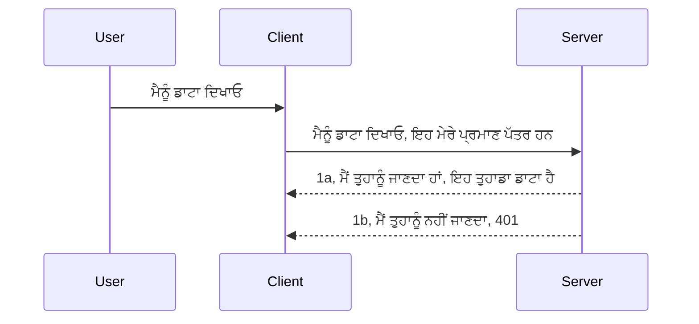

# ਸਧਾਰਣ ਪ੍ਰਮਾਣੀਕਰਨ

MCP SDKs OAuth 2.1 ਦੀ ਵਰਤੋਂ ਦਾ ਸਮਰਥਨ ਕਰਦੇ ਹਨ ਜੋ ਕਿ ਇਕ ਕਾਫੀ ਸੰਦਰਭ ਵਾਲਾ ਪ੍ਰਕਿਰਿਆ ਹੈ ਜਿਸ ਵਿੱਚ auth ਸਰਵਰ, resource ਸਰਵਰ, ਪ੍ਰਮਾਣ ਪੱਤਰ ਭੇਜਣਾ, ਕੋਡ ਪ੍ਰਾਪਤ ਕਰਨਾ, ਕੋਡ ਨੂੰ bearer token ਨਾਲ ਅਦਲਾ-ਬਦਲ ਕਰਨਾ ਜਦ ਤੱਕ ਕਿ ਤੁਸੀਂ ਅਖੀਰਕਾਰ ਆਪਣੇ resource ਡਾਟਾ ਤੱਕ ਪਹੁੰਚ ਸੱਕੋ। ਜੇਕਰ ਤੁਸੀਂ OAuth ਲਈ ਅਣਜਾਣ ਹੋ ਜੋ ਕਿ ਲਾਗੂ ਕਰਨ ਲਈ ਬਹੁਤ ਵਧੀਆ ਚੀਜ਼ ਹੈ, ਤਾਂ ਸ਼ੁਰੂਆਤ ਵਿੱਚ ਕੁਝ ਆਧਾਰਭੂਤ ਪ੍ਰਮਾਣੀਕਰਨ ਨਾਲ ਸ਼ੁਰੂ ਕਰਨਾ ਅਤੇ ਬਿਹਤਰ ਅਤੇ ਬਿਹਤਰ ਸੁਰੱਖਿਆ ਵੱਲ ਵਧਣਾ ਚੰਗੀ ਸੋਚ ਹੈ। ਇਹੀ ਕਾਰਨ ਹੈ ਕਿ ਇਹ ਅਧਿਆਇ ਮੌਜੂਦ ਹੈ, ਤਾਂ ਜੋ ਤੁਹਾਨੂੰ ਅਗੇ ਵੱਧ ਕੇ ਅਗੇ ਪprofessionāl auth ‘ਤੇ ਲਿਆ ਜਾ ਸਕੇ।

## ਪ੍ਰਮਾਣੀਕਰਨ, ਅਸੀਂ ਕੀ ਮਤਲਬ ਰੱਖਦੇ ਹਾਂ?

ਪ੍ਰਮਾਣੀਕਰਨ ਤੋਂ ਇਸ਼ਾਰਾ ਹੈ authentication ਅਤੇ authorization। ਵਿਚਾਰ ਇਹ ਹੈ ਕਿ ਸਾਨੂੰ ਦੋ ਕੰਮ ਕਰਨੇ ਹਨ:

- **Authentication**, ਜੋ ਇਹ ਪ੍ਰਕਿਰਿਆ ਹੈ ਕਿ ਅਸੀਂ ਕਿਸੇ ਨੂੰ ਆਪਣਾ ਘਰ ਵਿੱਚ ਦਾਖਲ ਹੋਣ ਦੀ ਆਗਿਆ ਦਿੰਦੇ ਹਾਂ, ਉਹ "ਇਥੇ" ਹੋਣ ਦਾ ਹੱਕ ਰੱਖਦਾ ਹੈ ਜੋ ਕਿ ਸਾਡੇ resource ਸਰਵਰ ਜਿੱਥੇ ਸਾਡੇ MCP ਸਰਵਰ ਦੀਆਂ ਵਿਸ਼ੇਸ਼ਤਾਵਾਂ ਹਨ ਉਥੇ ਪਹੁੰਚ ਹਨ।
- **Authorization**, ਇਹ ਪ੍ਰਕਿਰਿਆ ਹੈ ਕਿ ਯੂਜ਼ਰ ਨੂੰ ਇਹ ਖ਼ਾਸ resources ਜਿਨ੍ਹਾਂ ਦੀ ਉਹ ਮੰਗ ਕਰ ਰਹੇ ਹਨ ਦੀ ਪਹੁੰਚ ਹੋਣੀ ਚਾਹੀਦੀ ਹੈ ਜਾਂ ਨਹੀਂ, ਉਦਾਹਰਨ ਵਜੋਂ ਇਹ ਆਦੇਸ਼ ਜਾਂ ਇਹ ਉਤਪਾਦ ਜਾਂ ਉਹ ਸਮੱਗਰੀ ਨੂੰ ਪੜ੍ਹ ਸਕਦੇ ਹਨ ਪਰ ਮਿਟਾ ਨਹੀਂ ਸਕਦੇ, ਇੱਕ ਹੋਰ ਉਦਾਹਰਨ ਵਜੋਂ।

## ਪ੍ਰਮਾਣ ਪੱਤਰ: ਅਸੀਂ ਸਿਸਟਮ ਨੂੰ ਕਿਵੇਂ ਦੱਸਦੇ ਹਾਂ ਕਿ ਅਸੀਂ ਕੌਣ ਹਾਂ

ਖੈਰ, ਜ਼ਿਆਦਾਤਰ ਵੈੱਬ ਵਿਕਾਸਕ ਸੇਰਵਰ ਨੂੰ ਪ੍ਰਮਾਣ ਪੱਤਰ ਦੇਣ ਦੇ ਬਾਰੇ ਸੋਚਦੇ ਹਨ, ਆਮ ਤੌਰ ਤੇ ਇਕ ਰਾਜ਼ ਜੋ ਦੱਸਦਾ ਹੈ ਕੀ ਉਹ "ਪ੍ਰਮਾਣੀਕਰਨ" ਲਈ ਇੱਥੇ ਹੋਣ ਦੀ ਆਗਿਆ ਰੱਖਦੇ ਹਨ। ਇਹ ਪ੍ਰਮਾਣ ਪੱਤਰ ਆਮ ਤੌਰ ਤੇ ਯੂਜ਼ਰਨੇਮ ਅਤੇ ਪਾਸਵਰਡ ਦਾ base64 ਇਨਕੋਡ ਕੀਤਾ ਹੋਇਆ ਸੰਸਕਰਨ ਜਾਂ ਇਕ API ਕੁੰਜੀ ਹੁੰਦਾ ਹੈ ਜੋ ਇਕ ਖ਼ਾਸ ਯੂਜ਼ਰ ਨੂੰ ਯੂਨੀਕ ਤੌਰ ਤੇ ਪਛਾਣਦਾ ਹੈ।

ਇਹ ਨੂੰ "Authorization" ਨਾਮ ਦੇ ਹੈਡਰ ਰਾਹੀਂ ਭੇਜਣਾ ਸ਼ਾਮਿਲ ਹੈ ਇੰਜ:

```json
{ "Authorization": "secret123" }
```

ਇਸਨੂੰ ਆਮ ਤੌਰ ਤੇ basic authentication ਕਿਹਾ ਜਾਂਦਾ ਹੈ। ਪੂਰੇ ਪ੍ਰਵਾਹ ਨੂੰ ਸਮਝਣ ਨਾਲ ਇਹ ਤਰ੍ਹਾਂ ਕੰਮ ਕਰਦਾ ਹੈ:


```mermaid
sequenceDiagram
   participant User
   participant Client
   participant Server

   User->>Client: ਮੈਨੂੰ ਡਾਟਾ ਦਿਖਾਓ
   Client->>Server: ਮੈਨੂੰ ਡਾਟਾ ਦਿਖਾਓ, ਇਹ ਮੇਰੇ ਪ੍ਰਮਾਣ ਪੱਤਰ ਹਨ
   Server-->>Client: 1a, ਮੈਂ ਤੁਹਾਨੂੰ ਜਾਣਦਾ ਹਾਂ, ਇਹ ਤੁਹਾਡਾ ਡਾਟਾ ਹੈ
   Server-->>Client: 1b, ਮੈਂ ਤੁਹਾਨੂੰ ਨਹੀਂ ਜਾਣਦਾ, 401 
```

ਹੁਣ ਜਿਵੇਂ ਅਸੀਂ ਪ੍ਰਵਾਹ ਦੇ ਨਜ਼ਰੀਏ ਤੋਂ ਸਮਝ ਗਏ ਹਾਂ, ਇਹ ਕਿਵੇਂ ਲਾਗੂ ਕਰੀਏ? ਜ਼ਿਆਦਾਤਰ ਵੈੱਬ ਸਰਵਰ middleware ਦੀ ਧਾਰਣਾ ਰੱਖਦੇ ਹਨ, ਇਕ ਕੋਡ ਦਾ ਹਿੱਸਾ ਜੋ ਰਿਕਵੈਸਟ ਦਾ ਹਿੱਸਾ ਵਜੋਂ ਚਲਦਾ ਹੈ ਜੋ ਪ੍ਰਮਾਣ ਪੱਤਰ ਦੀ ਪੁਸ਼ਟੀ ਕਰ ਸਕਦਾ ਹੈ, ਅਤੇ ਜੇ ਪ੍ਰਮਾਣ ਪੱਤਰ ਸਹੀ ਹੈ ਤਾਂ ਰਿਕਵੈਸਟ ਨੂੰ ਆਗੇ ਆਉਣ ਦੇ ਸਕਦਾ ਹੈ। ਜੇ ਰਿਕਵੈਸਟ ਦੇ ਕੋਲ ਵੈਧ ਪ੍ਰਮਾਣ ਪੱਤਰ ਨਹੀਂ ਹੈ ਤਾਂ ਤੁਹਾਨੂੰ auth error ਮਿਲੇਗੀ। ਆਓ ਵੇਖੀਏ ਇਹ ਕਿਵੇਂ ਲਾਗੂ ਕੀਤਾ ਜਾ ਸਕਦਾ ਹੈ:

**Python**

```python
class AuthMiddleware(BaseHTTPMiddleware):
    async def dispatch(self, request, call_next):

        has_header = request.headers.get("Authorization")
        if not has_header:
            print("-> Missing Authorization header!")
            return Response(status_code=401, content="Unauthorized")

        if not valid_token(has_header):
            print("-> Invalid token!")
            return Response(status_code=403, content="Forbidden")

        print("Valid token, proceeding...")
       
        response = await call_next(request)
        # ਕਿਸੇ ਵੀ ਗਾਹਕ ਦੇ ਹੈੱਡਰ ਸ਼ਾਮਲ ਕਰੋ ਜਾਂ ਜਵਾਬ ਵਿੱਚ ਕਿਸੇ ਤਰੀਕੇ ਨਾਲ ਤਬਦੀਲੀ ਕਰੋ
        return response


starlette_app.add_middleware(CustomHeaderMiddleware)
```

ਇੱਥੇ ਸਾਡਾ:

- `AuthMiddleware` ਨਾਮ ਦਾ middleware ਬਣਾਇਆ ਗਿਆ ਹੈ ਜਿੱਥੇ ਇਸ ਦੀ `dispatch` ਮੀਥਡ ਵੈੱਬ ਸਰਵਰ ਦੁਆਰਾ ਕਾਲ ਕੀਤੀ ਜਾਂਦੀ ਹੈ।
- middleware ਨੂੰ ਵੈੱਬ ਸਰਵਰ ਵਿੱਚ ਸ਼ਾਮਲ ਕੀਤਾ ਗਿਆ:

    ```python
    starlette_app.add_middleware(AuthMiddleware)
    ```

- ਪ੍ਰਮਾਣਿਕਤਾ ਦੀ ਤੱਥ ਪਰਖਣ ਲਈ ਲਾਜਿਕ ਲਿਖੀ ਗਈ ਜੋ ਜਾਂਚਦੀ ਹੈ ਕਿ Authorization ਹੇਡਰ ਮੌਜੂਦ ਹੈ ਅਤੇ ਭੇਜਿਆ ਗਿਆ ਰਾਜ਼ ਸਹੀ ਹੈ:

    ```python
    has_header = request.headers.get("Authorization")
    if not has_header:
        print("-> Missing Authorization header!")
        return Response(status_code=401, content="Unauthorized")

    if not valid_token(has_header):
        print("-> Invalid token!")
        return Response(status_code=403, content="Forbidden")
    ```

    ਜੇ ਰਾਜ਼ ਮੌਜੂਦ ਅਤੇ ਸਹੀ ਹੈ ਤਾਂ ਅਸੀਂ `call_next` ਕਾਲ ਕਰ ਕੇ ਰਿਕਵੈਸਟ ਨੂੰ ਆਗੇ ਜਾਣ ਦਿੰਦੇ ਹਾਂ ਅਤੇ ਪ੍ਰਤੀਕ੍ਰਿਆ ਦਿੱਤੀ ਜਾਂਦੀ ਹੈ।

    ```python
    response = await call_next(request)
    # ਕਿਸੇ ਵੀ ਗਾਹਕ ਦੇ ਹੈਡਰ ਜੋੜੋ ਜਾਂ ਜਵਾਬ ਵਿੱਚ ਕਿਸੇ ਤਰ੍ਹਾਂ ਬਦਲਾਅ ਕਰੋ
    return response
    ```

ਇਹ ਇਸ ਤਰ੍ਹਾਂ ਕੰਮ ਕਰਦਾ ਹੈ ਕਿ ਜੇ ਵੈੱਬ ਰਿਕਵੈਸਟ ਸਰਵਰ ਵੱਲੋਂ ਕੀਤਾ ਜਾਂਦਾ ਹੈ ਤਾਂ middleware ਚਲਾਇਆ ਜਾਂਦਾ ਹੈ ਅਤੇ ਇਸ ਦੀ ਅਮਲਦਾਰੀ ਦੇ ਅਧਾਰ ਤੇ ਇਹ ਜਾਂ ਤਾਂ ਰਿਕਵੈਸਟ ਆਗੇ ਜਾਣ ਦਿੰਦਾ ਹੈ ਜਾਂ ਗਾਹਕ ਨੂੰ ਇੱਕ ਐਰਰ ਵਾਪਸ ਕਰਦਾ ਹੈ ਜਿਸ ਨਾਲ ਦੱਸਿਆ ਜਾਂਦਾ ਹੈ ਕਿ ਗਾਹਕ ਨੂੰ ਅੱਗੇ ਵਧਣ ਦੀ ਆਗਿਆ ਨਹੀਂ ਹੈ।

**TypeScript**

ਇੱਥੇ ਅਸੀਂ ਮਸ਼ਹੂਰ ਫ੍ਰੇਮਵਰਕ Express ਨਾਲ ਇੱਕ middleware ਬਣਾਉਂਦੇ ਹਾਂ ਜੋ MCP ਸਰਵਰ ਨੂੰ ਪਹੁੰਚਣ ਤੋਂ ਪਹਿਲਾਂ ਰਿਕਵੈਸਟ ਨੂੰ ਰੋਕਦਾ ਹੈ। ਇਹ ਕੋਡ ਇਸ ਤਰ੍ਹਾਂ ਹੈ:

```typescript
function isValid(secret) {
    return secret === "secret123";
}

app.use((req, res, next) => {
    // 1. ਅਧਿਕਾਰ ਹੇਡਰ ਮੌਜੂਦ ਹੈ?
    if(!req.headers["Authorization"]) {
        res.status(401).send('Unauthorized');
    }
    
    let token = req.headers["Authorization"];

    // 2. ਵੈਧਤਾ ਦੀ ਜਾਂਚ ਕਰੋ।
    if(!isValid(token)) {
        res.status(403).send('Forbidden');
    }

   
    console.log('Middleware executed');
    // 3. ਅਗਲੇ ਕਦਮ ਨੂੰ ਰਿਕਵੇਸਟ ਪਾਈਪਲਾਈਨ ਵਿੱਚ ਬੇਝੋ।
    next();
});
```

ਇਸ ਕੋਡ ਵਿੱਚ ਅਸੀਂ:

1. ਜਾਂਚਦੇ ਹਾਂ ਕਿ Authorization ਹੇਡਰ ਪਹਿਲਾਂ ਮੌਜੂਦ ਹੈ, ਨਹੀਂ ਤਾਂ 401 ਐਰਰ ਭੇਜਦੇ ਹਾਂ।
2. ਯਕੀਨੀ ਬਣਾਉਂਦੇ ਹਾਂ ਕਿ ਪ੍ਰਮਾਣ ਪੱਤਰ/ਟੋਕਨ ਵੈਧ ਹੈ, ਨਹੀਂ ਤਾਂ 403 ਐਰਰ ਭੇਜਦੇ ਹਾਂ।
3. ਆਖ਼ਰਕਾਰ ਰਿਕਵੈਸਟ ਨੂੰ ਅੱਗੇ ਲਾਂਦਾ ਹੈ ਅਤੇ ਮੰਗੇ ਗਏ ਸੰਸਾਧਨ ਨੂੰ ਵਾਪਸ ਕਰਦਾ ਹੈ।

## ਅਭਿਆਸ: ਪ੍ਰਮਾਣੀਕਰਨ ਲਾਗੂ ਕਰੋ

ਆਉ ਆਪਣੀ ਜਾਣਕਾਰੀ ਲੈ ਕੇ ਇਸ ਨੂੰ ਲਾਗੂ ਕਰਨ ਦੀ ਕੋਸ਼ਿਸ਼ ਕਰੀਏ। ਯੋਜਨਾ ਇਹ ਹੈ:

ਸਰਵਰ

- ਇਕ ਵੈੱਬ ਸਰਵਰ ਅਤੇ MCP ਉਦਾਹਰਨ ਬਣਾਓ।
- ਸਰਵਰ ਲਈ ਇੰਟਰਮੀਡੀਏਰੀ (middleware) ਲਾਗੂ ਕਰੋ।

ਕਲਾਇੰਟ

- ਪ੍ਰਮਾਣ ਪੱਤਰ ਦੇ ਨਾਲ ਵੈੱਬ ਰਿਕਵੈਸਟ ਭੇਜੋ, ਹੈਡਰ ਰਾਹੀਂ।

### -1- ਵੈੱਬ ਸਰਵਰ ਅਤੇ MCP ਉਦਾਹਰਨ ਬਣਾਓ

> [!WARNING]
> ਹੇਠਾਂ ਦਿੱਤਾ ਗਇਆ TypeScript ਉਦਾਹਰਨ MCP `2025-11-25` ਨੂੰ ਗੋਲੀ ਦਾ ਟੀਚਾ ਦਿੰਦਾ ਹੈ। ਇਹ `mcp-session-id`
> ਦੁਆਰਾ ਟਰਾਂਸਪੋਰਟ ਨੂੰ ਟ੍ਰੈਕ ਕਰਦਾ ਹੈ ਅਤੇ ਮੌਜੂਦਾ `2026-07-28` ਟਰਾਂਸਪੋਰਟ ਉਦਾਹਰਨ ਨਹੀਂ ਹੈ। MCP
> `2026-07-28` 'initialize' ਹੈਂਡਸ਼ੇਕ ਅਤੇ ਪ੍ਰੋਟੋਕੋਲ ਸੈਸ਼ਨ ID ਹਟਾ ਦਿੰਦਾ ਹੈ; ਨਵੀਆਂ
> ਲਾਗੂ ਵਿੱਚ ਸਵੈ-ਨਿਰਭਰ ਰਿਕਵੈਸਟ ਵਰਤੇ ਜਾਂਦੇ ਹਨ। ਵੇਖੋ
> [MCP ਵਿੱਚ ਕੀ ਬਦਲਿਆ ਹੈ: 2026-07-28 ਵਿਸ਼ੇਸ਼ਤਾ](../../01-CoreConcepts/mcp-2026-07-28.md)।

ਸਾਡੇ ਪਹਿਲੇ ਕਦਮ ਵਿੱਚ, ਸਾਨੂੰ ਵੈੱਬ ਸਰਵਰ ਉਦਾਹਰਨ ਅਤੇ MCP ਸਰਵਰ ਬਣਾਉਣਾ ਹੈ।

**Python**

ਇੱਥੇ ਅਸੀਂ ਇੱਕ MCP ਸਰਵਰ ਉਦਾਹਰਨ ਬਣਾਉਂਦੇ ਹਾਂ, ਇੱਕ starlette ਵੈੱਬ ਐਪ ਬਣਾਉਂਦੇ ਹਾਂ ਅਤੇ ਉਸ ਨੂੰ uvicorn ਨਾਲ ਹੋਸਟ ਕਰਦੇ ਹਾਂ।

```python
# MCP ਸਰਵਰ ਬਣਾਉਣਾ

app = FastMCP(
    name="MCP Resource Server",
    instructions="Resource Server that validates tokens via Authorization Server introspection",
    host=settings["host"],
    port=settings["port"],
    debug=True
)

# ਸਟਾਰਲੈੱਟ ਵੈੱਬ ਐਪ ਬਣਾਉਣਾ
starlette_app = app.streamable_http_app()

# uvicorn ਰਾਹੀਂ ਐਪ ਸਰਵ ਕਰਨਾ
async def run(starlette_app):
    import uvicorn
    config = uvicorn.Config(
            starlette_app,
            host=app.settings.host,
            port=app.settings.port,
            log_level=app.settings.log_level.lower(),
        )
    server = uvicorn.Server(config)
    await server.serve()

run(starlette_app)
```

ਇਸ ਕੋਡ ਵਿੱਚ ਅਸੀਂ:

- MCP ਸਰਵਰ ਬਣਾਇਆ ਹੈ।
- MCP ਸਰਵਰ ਤੋਂ starlette ਵੈੱਬ ਐਪ ਬਣਾਈ, `app.streamable_http_app()`।
- uvicorn ਦੀ ਵਰਤੋਂ ਕਰ ਕੇ ਵੈੱਬ ਐਪ ਹੋਸਟ ਅਤੇ ਸਰਵ ਕਰ ਰਹੇ ਹਾਂ `server.serve()`।

**TypeScript**

ਇੱਥੇ ਇੱਕ MCP ਸਰਵਰ ਉਦਾਹਰਨ ਬਣਾਈ ਗਈ ਹੈ।

```typescript
const server = new McpServer({
      name: "example-server",
      version: "1.0.0"
    });

    // ... ਸਰਵਰ ਸਰੋਤ, ਟੂਲ ਅਤੇ ਪ੍ਰਾਰੰਭਕ ਸੈਟ ਕਰੋ ...
```

ਇਹ MCP ਸਰਵਰ ਬਣਾਉਣਾ ਸਾਡੇ POST /mcp ਰੂਟ ਡਿਫਿਨੀਸ਼ਨ ਦੇ ਅੰਦਰ ਹੋਣਾ ਚਾਹੀਦਾ ਹੈ, ਇਸ ਲਈ ਆਓ ਉਪਰੋਕਤ ਕੋਡ ਲੈ ਕੇ ਇਸ ਤਰ੍ਹਾਂ ਸੋਚੀਏ:

```typescript
import express from "express";
import { randomUUID } from "node:crypto";
import { McpServer } from "@modelcontextprotocol/sdk/server/mcp.js";
import { StreamableHTTPServerTransport } from "@modelcontextprotocol/sdk/server/streamableHttp.js";
import { isInitializeRequest } from "@modelcontextprotocol/sdk/types.js"

const app = express();
app.use(express.json());

// ਸੈਸ਼ਨ ID ਦੁਆਰਾ ਟ੍ਰਾਂਸਪੋਰਟਾਂ ਨੂੰ ਸਟੋਰ ਕਰਨ ਲਈ ਮੈਪ
const transports: { [sessionId: string]: StreamableHTTPServerTransport } = {};

// ਕਲਾਇੰਟ-ਤੋਂ-ਸਰਵਰ ਸੰਚਾਰ ਲਈ POST ਬਿਨੈਆਂ ਨੂੰ ਹੇਠਾਂ ਲਿਆਉਂਦਾ ਹੈ
app.post('/mcp', async (req, res) => {
  // ਮੌਜੂਦਾ ਸੈਸ਼ਨ ID ਦੀ ਜਾਂਚ ਕਰੋ
  const sessionId = req.headers['mcp-session-id'] as string | undefined;
  let transport: StreamableHTTPServerTransport;

  if (sessionId && transports[sessionId]) {
    // ਮੌਜੂਦਾ ਟ੍ਰਾਂਸਪੋਰਟ ਦਾ ਫਿਰ ਤੋਂ ਉਪਯੋਗ ਕਰੋ
    transport = transports[sessionId];
  } else if (!sessionId && isInitializeRequest(req.body)) {
    // ਨਵਾਂ ਸ਼ੁਰੂਆਤੀ ਬਿਨੈ
    transport = new StreamableHTTPServerTransport({
      sessionIdGenerator: () => randomUUID(),
      onsessioninitialized: (sessionId) => {
        // ਸੈਸ਼ਨ ID ਦੁਆਰਾ ਟ੍ਰਾਂਸਪੋਰਟ ਸਟੋਰ ਕਰੋ
        transports[sessionId] = transport;
      },
      // DNS ਰੀਬਾਈਂਡਿੰਗ ਸੁਰੱਖਿਆ ਪਿੱਛੇ ਰਹਿਣ ਵਾਲੀ ਸੰਗਤ ਲਈ ਡੀਫਾਲਟ ਤੌਰ 'ਤੇ ਅਯੋਗ ਹੈ। ਜੇ ਤੁਸੀਂ ਇਸ ਸਰਵਰ ਨੂੰ
      // ਸਥਾਨਕ ਤੌਰ 'ਤੇ ਚਲਾ ਰਹੇ ਹੋ, ਤਾਂ ਇਹ ਨਿਸ਼ਚਿਤ ਕਰੋ ਕਿ ਤੁਸੀਂ ਸੈਟ ਕਰੋ:
      // enableDnsRebindingProtection: true,
      // allowedHosts: ['127.0.0.1'],
    });

    // ਬੰਦ ਹੋਣ ਸਮੇਂ ਟ੍ਰਾਂਸਪੋਰਟ ਨੂੰ ਸਾਫ਼ ਕਰੋ
    transport.onclose = () => {
      if (transport.sessionId) {
        delete transports[transport.sessionId];
      }
    };
    const server = new McpServer({
      name: "example-server",
      version: "1.0.0"
    });

    // ... ਸਰਵਰ ਸਰੋਤਾਂ, ਉਪਕਰਨਾਂ ਅਤੇ ਪ੍ਰੌਂਪਟਾਂ ਸੈਟ ਕਰੋ ...

    // MCP ਸਰਵਰ ਨਾਲ ਜੁੜੋ
    await server.connect(transport);
  } else {
    // ਅਵੈਧ ਬਿਨੈ
    res.status(400).json({
      jsonrpc: '2.0',
      error: {
        code: -32000,
        message: 'Bad Request: No valid session ID provided',
      },
      id: null,
    });
    return;
  }

  // ਬਿਨੈ ਦਾ ਸੰਭਾਲ ਕਰੋ
  await transport.handleRequest(req, res, req.body);
});

// GET ਅਤੇ DELETE ਬਿਨੈਆਂ ਲਈ ਦੁਬਾਰਾ ਵਰਤੋਂ ਯੋਗ ਹੈਂਡਲਰ
const handleSessionRequest = async (req: express.Request, res: express.Response) => {
  const sessionId = req.headers['mcp-session-id'] as string | undefined;
  if (!sessionId || !transports[sessionId]) {
    res.status(400).send('Invalid or missing session ID');
    return;
  }
  
  const transport = transports[sessionId];
  await transport.handleRequest(req, res);
};

// SSE ਰਾਹੀਂ ਸਰਵਰ-ਤੋਂ-ਕਲਾਇੰਟ ਸੂਚਨਾਵਾਂ ਲਈ GET ਬਿਨੈਆਂ ਦਾ ਸੰਭਾਲ ਕਰੋ
app.get('/mcp', handleSessionRequest);

// ਸੈਸ਼ਨ ਸਮਾਪਤੀ ਲਈ DELETE ਬਿਨੈਆਂ ਦਾ ਸੰਭਾਲ ਕਰੋ
app.delete('/mcp', handleSessionRequest);

app.listen(3000);
```

ਹੁਣ ਤੁਸੀਂ ਵੇਖ ਸਕਦੇ ਹੋ ਕਿ MCP ਸਰਵਰ ਬਣਾਉਣਾ `app.post("/mcp")` ਦੇ ਅੰਦਰ ਲਿਆ ਗਿਆ ਹੈ।

ਆਓ middleware ਬਣਾਉਣ ਦੇ ਅੱਗੇ ਕਦਮ ਵੱਲ ਵਧੀਏ ਤਾਂ ਕਿ ਅਸੀਂ ਆਉਣ ਵਾਲੇ ਪ੍ਰਮਾਣ ਪੱਤਰ ਦੀ ਪੁਸ਼ਟੀ ਕਰ ਸਕੀਏ।

### -2- ਸਰਵਰ ਲਈ middleware ਲਾਗੂ ਕਰੋ

ਆਓ ਅਗਲੇ middleware ਹਿੱਸੇ ਵੱਲ ਵਧੀਏ। ਇੱਥੇ ਅਸੀਂ ਇੱਕ middleware ਬਣਾਊਂਗੇ ਜੋ `Authorization` ਹੇਡਰ ਵਿੱਚ ਪ੍ਰਮਾਣ ਪੱਤਰ ਦੀ ਖੋਜ ਕਰਦਾ ਹੈ ਅਤੇ ਇਸ ਦੀ ਪੁਸ਼ਟੀ ਕਰਦਾ ਹੈ। ਜੇ ਇਹ ਮੰਨਜ਼ੂਰਯੋਗ ਹੈ ਤਾਂ ਰਿਕਵੈਸਟ ਨੂੰ ਆਪਣਾ ਕੰਮ (ਜਿਵੇਂ ਸੰਦਾਂ ਦੀ ਸੂਚੀ ਪ੍ਰਦਾਨ ਕਰਨਾ, ਸੰਸਾਧਨ ਪੜ੍ਹਨਾ ਜਾਂ MCP ਦੀ ਕੋਈ ਫੁੰਕਸ਼ਨਾਲਿਟੀ ਜੋ ਗਾਹਕ ਮੰਗ ਰਿਹਾ ਸੀ) ਕਰਨ ਦਿੰਦਾ ਹੈ।

**Python**

middleware ਬਣਾਉਣ ਲਈ, ਸਾਨੂੰ `BaseHTTPMiddleware` ਤੋਂ ਵਿਰਾਸਤ ਵਿੱਚ ਇੱਕ ਕਲਾਸ ਬਣਾਉਣੀ ਪੈਂਦੀ ਹੈ। ਦੋ ਦਿਲਚਸਪ ਹਿੱਸੇ ਹਨ:

- ਅਦਾਲਤ `request`, ਜਿਸ ਤੋਂ ਅਸੀਂ ਹੈਡਰ ਜਾਣਕਾਰੀ ਪੜ੍ਹਦੇ ਹਾਂ।
- `call_next` ਕਾਲਬੈਕ ਜੋ ਸਾਨੂੰ ਕਾਲ ਕਰਨੀ ਹੈ ਜੇ ਗਾਹਕ ਨੇ ਜਿਹੜਾ ਪ੍ਰਮਾਣ ਪੱਤਰ ਲਿਆ ਹੈ ਅਸੀਂ ਉਸਨੂੰ ਮਨਜ਼ੂਰ ਕਰੀਏ।

ਸਭ ਤੋਂ ਪਹਿਲਾਂ, ਸਾਨੂੰ ਉਸ ਸਥਿਤੀ ਨੂੰ ਸੰਭਾਲਣਾ ਹੈ ਜੇ `Authorization` ਹੇਡਰ ਗਾਇਬ ਹੋਵੇ:

```python
has_header = request.headers.get("Authorization")

# ਸਿਰਲੇਖ ਮੌਜੂਦ ਨਹੀਂ, 401 ਨਾਲ ਅਸਫਲ ਹੋ ਜਾਓ, ਨਹੀਂ ਤਾਂ ਅਗੇ ਵਧੋ।
if not has_header:
    print("-> Missing Authorization header!")
    return Response(status_code=401, content="Unauthorized")
```

ਇੱਥੇ ਅਸੀਂ 401 ਅਣਧਾਰਤ ਸੁਨੇਹਾ ਭੇਜਦੇ ਹਾਂ ਕਿਉਂਕਿ ਗਾਹਕ ਪ੍ਰਮਾਣੀਕਰਨ ਵਿਚ ਅਸਫਲ ਰਹਿ ਗਿਆ ਹੈ।

ਅਗਲੇ, ਜੇ ਇਕ ਪ੍ਰਮਾਣ ਪੱਤਰ ਦਿੱਤਾ ਗਿਆ ਸੀ, ਤਾਂ ਸਾਨੂੰ ਇਸ ਦੀ ਸਹੀਤਾ ਜਾਂਚਣੀ ਪੈਂਦੀ ਹੈ ਇਸ ਤਰ੍ਹਾਂ:

```python
 if not valid_token(has_header):
    print("-> Invalid token!")
    return Response(status_code=403, content="Forbidden")
```

ਉੱਪਰ ਦਿੱਤੇ ਗਏ ਕੋਡ ਵਿੱਚ ਸਾਨੂੰ 403 ਮਨਾਈ ਸੁਨੇਹਾ ਭੇਜਣਾ ਹੈ। ਦ੍ਰਿਸ਼ਟਾਨਤ ਦੇ ਤੌਰ ਤੇ ਸਾਰਾ middleware ਹੇਠਾਂ ਦਿੱਤਾ ਗਿਆ ਹੈ ਜੋ ਸਾਰੀਆਂ ਗੱਲਾਂ ਲਾਗੂ ਕਰਦਾ ਹੈ:

```python
class AuthMiddleware(BaseHTTPMiddleware):
    async def dispatch(self, request, call_next):

        has_header = request.headers.get("Authorization")
        if not has_header:
            print("-> Missing Authorization header!")
            return Response(status_code=401, content="Unauthorized")

        if not valid_token(has_header):
            print("-> Invalid token!")
            return Response(status_code=403, content="Forbidden")

        print("Valid token, proceeding...")
        print(f"-> Received {request.method} {request.url}")
        response = await call_next(request)
        response.headers['Custom'] = 'Example'
        return response

```

ਸ਼ਾਨਦਾਰ, ਪਰ `valid_token` ਫੰਕਸ਼ਨ ਕਿੱਥੇ ਹੈ? ਇਹ ਹੈ ਹੇਠਾਂ:

```python
# ਪ੍ਰੋਡਕਸ਼ਨ ਲਈ ਨਾ ਵਰਤੋ - ਇਸਨੂੰ ਵਧੀਆ ਬਣਾਓ !!
def valid_token(token: str) -> bool:
    # "Bearer " ਪ੍ਰੀਫਿਕਸ ਨੂੰ ਹਟਾਓ
    if token.startswith("Bearer "):
        token = token[7:]
        return token == "secret-token"
    return False
```

ਇਹ ਬੇਸ਼ੱਕ ਸੁਧਾਰਯੋਗ ਹੈ।

ਮਹੱਤਵਪੂਰਨ: ਤੁਹਾਨੂੰ ਕਦੇ ਵੀ ਇੰਝ ਦੇ ਗੁਪਤੋਲੀ ਕોડ ਵਿੱਚ ਨਹੀਂ ਰੱਖਣੇ ਚਾਹੀਦੇ। ਆਪ ਜੀ ਇਸ ਦੀ ਤੁਲਨਾ ਕਰਨ ਲਈ ਮੁੱਲ ਕਿਤੇ ਡੇਟਾ ਸਰੋਤ ਜਾਂ IDP (ਪਛਾਣ ਸੇਵਾ ਪ੍ਰਦਾਤਾ) ਤੋਂ ਲੈਣੀ ਚਾਹੀਦੀ ਹੈ ਜਾਂ ਬਿਹਤਰ ਇਹ ਕਿ IDP ਹੀ ਪੁਸ਼ਟੀ ਕਰੇ।

**TypeScript**

ਇਸ ਨੂੰ Express ਨਾਲ ਲਾਗੂ ਕਰਨ ਲਈ, ਸਾਨੂੰ `use` ਮੀਥਡ ਨੂੰ ਕਾਲ ਕਰਨਾ ਪੈਂਦਾ ਹੈ ਜੋ middleware ਫੰਕਸ਼ਨਾਂ ਨੂੰ ਲੈਂਦਾ ਹੈ।

ਸਾਨੂੰ:

- ਰਿਕੁਏਸਟ ਵੈਰੀਏਬਲ ਨਾਲ ਸੰਪਰਕ ਕਰਕੇ `Authorization` ਗੁਣ ਵਿੱਚ ਦਿੱਤਾ ਗਿਆ ਪ੍ਰਮਾਣ ਪੱਤਰ ਜਾਂਚਣਾ ਹੈ।
- ਪ੍ਰਮਾਣ ਪੱਤਰ ਦੀ ਪੁਸ਼ਟੀ ਕਰਨੀ ਹੈ, ਅਤੇ ਜੇ ਠੀਕ ਹੈ ਤਾਂ ਰਿਕੁਏਸਟ ਅੱਗੇ ਭੇਜ ਕੇ ਗਾਹਕ ਦੀ MCP ਦੀ ਮੰਗ ਨੂੰ ਜੋ ਵੀ ਬਣਾਉਂਦੀ ਹੈ (ਜਿਵੇਂ ਸੰਦਾਂ ਦੀ ਸੂਚੀ, ਸੰਸਾਧਨ ਪੜ੍ਹਨਾ ਜਾਂ ਕੋਈ ਹੋਰ MCP ਸੰਬੰਧੀ ਕਾਰਜ) ਕਰਨ ਦਿੰਦੇ ਹਾਂ।

ਇੱਥੇ ਅਸੀਂ ਜਾਂਚ ਕਰ ਰਹੇ ਹਾਂ ਕਿ `Authorization` ਹੈਡਰ ਮੌਜੂਦ ਹੈ, ਜੇ ਨਹੀਂ, ਤਾਂ ਅਸੀਂ ਰਿਕਵੈਸਟ ਨੂੰ ਰੋਕ ਦਿੰਦੇ ਹਾਂ:

```typescript
if(!req.headers["authorization"]) {
    res.status(401).send('Unauthorized');
    return;
}
```

ਜੇ ਹੇਡਰ ਪਹਿਲਾਂ ਭੇਜਿਆ ਹੀ ਨਾ ਗਿਆ ਹੋਵੇ, ਤਾਂ ਤੁਹਾਨੂੰ 401 ਮਿਲਦਾ ਹੈ।

ਅਗਲੇ, ਅਸੀਂ ਜਾਂਚ ਕਰਦੇ ਹਾਂ ਕਿ ਪ੍ਰਮਾਣ ਪੱਤਰ ਵੈਧ ਹੈ, ਨਹੀਂ ਤਾਂ ਅਸੀਂ ਫਿਰ ਤੋਂ ਰਿਕੁਏਸਟ ਰੋਕ ਦਿੰਦੇ ਹਾਂ ਪਰ ਥੋੜ੍ਹਾ ਵੱਖਰਾ ਸੁਨੇਹਾ ਦਿੰਦਿਆਂ:

```typescript
if(!isValid(token)) {
    res.status(403).send('Forbidden');
    return;
} 
```

ਹੁਣ 403 ਐਰਰ ਮਿਲਦਾ ਹੈ।

ਇਹ ਰਹੀ ਪੂਰੀ ਕੋਡ:

```typescript
app.use((req, res, next) => {
    console.log('Request received:', req.method, req.url, req.headers);
    console.log('Headers:', req.headers["authorization"]);
    if(!req.headers["authorization"]) {
        res.status(401).send('Unauthorized');
        return;
    }
    
    let token = req.headers["authorization"];

    if(!isValid(token)) {
        res.status(403).send('Forbidden');
        return;
    }  

    console.log('Middleware executed');
    next();
});
```

ਅਸੀਂ ਵੈੱਬ ਸਰਵਰ ਨੂੰ ਸੈੱਟ ਕੀਤਾ ਹੈ ਕਿ ਇਹ middleware ਵਰਤੀ ਜਾਵੇ ਜੀਹੜਾ ਉਸ ਪ੍ਰਮਾਣ ਪੱਤਰ ਦੀ ਜਾਂਚ ਕਰੇ ਜੋ ਗਾਹਕ ਉਮੀਦ ਕਰਦਾ ਹੈ ਭੇਜੇ। ਗਾਹਕ ਖੁਦ ਕਿਵੇਂ ਕਰਦਾ ਹੈ?

### -3- ਪ੍ਰਮਾਣ ਪੱਤਰ ਨਾਲ ਹੈਡਰ ਰਾਹੀਂ ਵੈੱਬ ਰਿਕਵੈਸਟ ਭੇਜੋ

ਸਾਨੂੰ ਇਹ ਯਕੀਨੀ ਬਣਾਉਣਾ ਹੈ ਕਿ ਗਾਹਕ ਪ੍ਰਮਾਣ ਪੱਤਰ ਹੈਡਰ ਰਾਹੀਂ ਭੇਜ ਰਿਹਾ ਹੈ। ਜਿਵੇਂ ਕਿ ਅਸੀਂ MCP ਗਾਹਕ ਵਰਤ ਰਹੇ ਹਾਂ, ਇਸ ਨੂੰ ਕਿਵੇਂ ਕੀਤਾ ਜਾਂਦਾ ਹੈ ਇਹ ਜਾਣਨਾ ਜਰੂਰੀ ਹੈ।

**Python**

ਗਾਹਕ ਲਈ, ਅਸੀਂ ਆਪਣਾ ਪ੍ਰਮਾਣ ਪੱਤਰ ਹੈਡਰ ਰਾਹੀਂ ਇੱਜਹੁ ਕਰਦੇ ਹਾਂ:

```python
# ਮੁੱਲ ਨੂੰ ਹਾਰਡਕੋਡ ਨਾ ਕਰੋ, ਇਸਨੂੰ ਘੱਟੋ-ਘੱਟ ਇੱਕ ਐਨਵਾਇਰਨਮੈਂਟ ਵੈਰੀਏਬਲ ਜਾਂ ਹੋਰ ਜ਼ਿਆਦਾ ਸੁਰੱਖਿਅਤ ਸਟੋਰੇਜ ਵਿੱਚ ਰੱਖੋ
token = "secret-token"

async with streamablehttp_client(
        url = f"http://localhost:{port}/mcp",
        headers = {"Authorization": f"Bearer {token}"}
    ) as (
        read_stream,
        write_stream,
        session_callback,
    ):
        async with ClientSession(
            read_stream,
            write_stream
        ) as session:
            await session.initialize()
      
            # TODO, ਕਲਾਇੰਟ ਵਿੱਚ ਕੀ ਕਰਵਾਉਣਾ ਹੈ, ਉਦਾਹਰਨ ਵਜੋਂ ਸੰਦਾਂ ਦੀ ਸੂਚੀ ਬਣਾਉਣਾ, ਸੰਦਾਂ ਨੂੰ ਕਾਲ ਕਰਨਾ ਆਦਿ।
```

ਦੇਖੋ ਕਿ ਅਸੀਂ `headers` ਗੁਣ ਨੂੰ ਇਸ ਤਰ੍ਹਾਂ ਭਰਦੇ ਹਾਂ ` headers = {"Authorization": f"Bearer {token}"}`.

**TypeScript**

ਅਸੀਂ ਇਹ ਦੋ ਕਦਮਾਂ ਵਿੱਚ ਕਰ ਸਕਦੇ ਹਾਂ:

1. ਆਪਣੇ ਪ੍ਰਮਾਣ ਪੱਤਰ ਨਾਲ ਇੱਕ ਕੌੰਫਿਗਰੇਸ਼ਨ ਵਿਚਾਰ ਬਣਾਓ।
2. ਇਸ ਕੌੰਫਿਗਰੇਸ਼ਨ ਨੂੰ ਟਰਾਂਸਪੋਰਟ ਨੂੰ ਦਿਓ।

```typescript

// ਇੱਥੇ ਦਿਖਾਏ ਮੁਤਾਬਕ ਮੁੱਲ ਨੂੰ ਸਖਤੀ ਨਾਲ ਕੋਡ ਵਿੱਚ ਨਾ ਲਿਖੋ। ਕਮ ਤੋਂ ਕਮ ਇਸਨੂੰ ਇੱਕ env ਵੈਰੀਅਬਲ ਵਜੋਂ ਰੱਖੋ ਅਤੇ development ਮੋਡ ਵਿੱਚ ਕੁਝ ਇਸ ਤਰ੍ਹਾਂ ਦੇ dotenv ਵਰਗਾ ਟੂਲ ਵਰਤੋਂ।
let token = "secret123"

// ਇੱਕ client transport ਵਿਕਲਪ ਅਬਜੈਕਟ ਨੂੰ ਪਰਿਭਾਸ਼ਿਤ ਕਰੋ
let options: StreamableHTTPClientTransportOptions = {
  sessionId: sessionId,
  requestInit: {
    headers: {
      "Authorization": "secret123"
    }
  }
};

// ਵਿਕਲਪ ਅਬਜੈਕਟ ਨੂੰ transport ਨੂੰ ਪਾਸ ਕਰੋ
async function main() {
   const transport = new StreamableHTTPClientTransport(
      new URL(serverUrl),
      options
   );
```

ਇੱਥੇ ਤੁਸੀਂ ਵੇਖੋਗੇ ਕਿ ਸਾਡਾ `options` ਵਸਤੂ ਬਣਾਇਆ ਗਿਆ ਅਤੇ ਸਾਡੇ ਹੈਡਰ `requestInit` ਗੁਣ ਅਧੀਨ ਰੱਖੇ ਗਏ।

ਮਹੱਤਵਪੂਰਨ: ਆਉਂ ਹਾਂ ਇਸ ਨੂੰ ਇੱਥੋਂ ਸੁਧਾਰਿਆ ਕਿਵੇਂ ਜਾਵੇ? ਚੰਗਾ, ਮੌਜੂਦਾ ਲਾਗੂ ਕੁਝ ਸਮੱਸਿਆਵਾਂ ਨਾਲ ਹੈ। ਸਭ ਤੋਂ ਪਹਿਲਾਂ ਐਸਾ ਪ੍ਰਮਾਣ ਪੱਤਰ ਦੇਣਾ ਕਾਫੀ ਜੋਖਮ ਵਾਲਾ ਹੈ ਜੇ ਤੁਹਾਡੇ ਕੋਲ ਘੱਟੋ-ਘੱਟ HTTPS ਨਾ ਹੋਵੇ। ਫਿਰ ਵੀ, ਪ੍ਰਮਾਣ ਪੱਤਰ ਚੋਰੀ ਹੋ ਸਕਦਾ ਹੈ ਇਸ ਲਈ ਤੁਹਾਨੂੰ ਇਕ ਐਸਾ ਸਿਸਟਮ ਚਾਹੀਦਾ ਹੈ ਜਿਥੇ ਤੁਸੀਂ ਆਸਾਨੀ ਨਾਲ ਟੋਕਨ ਨੂੰ ਰੱਦ ਕਰ ਸਕੋ ਅਤੇ ਹੋਰ ਜਾਂਚਾਂ ਵੀ ਕਰ ਸਕੋ ਜਿਵੇਂ ਟੋਕਨ ਕਿੱਥੋਂ ਆ ਰਿਹਾ ਹੈ, ਕਿੰਨੀ ਵਾਰੀ ਬਿਨਾਂ ਰੁਕਾਅਟ ਰਿਕਵੈਸਟ ਆ ਰਹੀਆਂ ਹਨ (ਬੋਟ ਵਰਗਾ ਵਰਤਾਵ), ਖੁਲਾਸਾ ਇਸ ਵਿੱਚ ਕਈ ਸੁਰੱਖਿਆ ਸੰਬੰਧੀ ਚਿੰਤਾਵਾਂ ਹਨ।

ਫਿਰ ਵੀ ਆਹ ਕਹਿਣਾ ਚਾਹੀਦਾ ਹੈ ਕਿ ਬਹੁਤ ਹੀ ਸਧਾਰਣ APIs ਲਈ ਜਿੱਥੇ ਤੁਸੀਂ ਨਹੀਂ ਚਾਹੁੰਦੇ ਕਿ ਬਿਨਾਂ ਪ੍ਰਮਾਣੀਕਰਨ ਦੇ ਕੋਈ ਵੀ ਤੁਹਾਡੇ API ਨੂੰ ਕਾਲ ਕਰੇ, ਸਾਡੇ ਕੋਲ ਇਕ ਚੰਗਾ ਸ਼ੁਰੂਆਤੀ ਨਿਧਾਨ ਹੈ।

ਇਹਦੇ ਨਾਲ, ਆਓ ਕੁਝ ਹੋਰ ਸੁਰੱਖਿਆ ਬਢ਼ਾਈਏ JSON Web Token ਵਰਗਾ ਸਟੈਂਡਰਡ ਫਾਰਮੈਟ ਵਰਤ ਕੇ, ਜਿਸਨੂੰ JWT ਜਾਂ "JOT" ਟੋਕਨ ਵੀ ਕਹਿੰਦੇ ਹਨ।

## JSON ਵੈੱਬ ਟੋਕਨ, JWT

ਤਾਂ, ਅਸੀਂ ਬਹੁਤ ਸਧਾਰਣ ਪ੍ਰਮਾਣ ਪੱਤਰ ਭੇਜਣ ਤੋਂ ਕੁਝ ਬਿਹਤਰ ਬਦਲਾਅ ਲਿਆਉਣ ਦੀ ਕੋਸ਼ਿਸ਼ ਕਰ ਰਹੇ ਹਾਂ। JWT ਗ੍ਰਹਿਣ ਕਰਨ ਨਾਲ ਸਾਨੂੰ ਤੁਰੰਤ ਕਿਹੜੇ ਸੁਧਾਰ ਮਿਲਦੇ ਹਨ?

- **ਸੁਰੱਖਿਆ ਵਿੱਚ ਸੁਧਾਰ**। ਬੇਸਿਕ auth ਵਿੱਚ ਤੁਸੀਂ ਯੂਜ਼ਰਨੇਮ ਅਤੇ ਪਾਸਵਰਡ ਨੂੰ base64 ਇਨਕੋਡ ਕੀਤੇ ਟੋਕਨ ਵਜੋਂ ਅਤੇ API ਕੁੰਜੀ ਵਜੋਂ ਵਾਰ-ਵਾਰ ਭੇਜਦੇ ਹੋ ਜੋ ਖਤਰੇ ਨੂੰ ਵਧਾ ਦਿੰਦਾ ਹੈ। JWT ਨਾਲ, ਤੁਸੀਂ ਆਪਣਾ ਯੂਜ਼ਰਨੇਮ ਅਤੇ ਪਾਸਵਰਡ ਭੇਜਦੇ ਹੋ ਅਤੇ ਟੋਕਨ ਪ੍ਰਾਪਤ ਕਰਦੇ ਹੋ ਜੋ ਸਮੇਂ-ਸੰਬੰਧੀ ਹੁੰਦਾ ਹੈ ਅਤੇ ਸਮਾਪਤ ਹੋ ਜਾਂਦਾ ਹੈ। JWT ਤੁਹਾਨੂੰ ਸੁਚੱਜੀ ਪਹੁੰਚ ਕੰਟਰੋਲ ਦੀ ਆਸਾਨੀ ਦਿੰਦਾ ਹੈ ਜਿਵੇਂ ਕਿ ਭੂਮਿਕਾਵਾਂ, ਸਕੋਪ ਅਤੇ ਅਧਿਕਾਰ।
- **ਬਿਨਾ ਸੂਚਨਾ ਅਤੇ ਵਧਾਈਯੋਗਤਾ**। JWT ਖੁਦ-ਨਿਰਭਰ ਹੁੰਦੇ ਹਨ, ਉਹ ਸਾਰੇ ਯੂਜ਼ਰ ਜਾਣਕਾਰੀ ਲੰਦੇ ਹਨ ਅਤੇ ਸਰਵਰ-ਸਾਈਡ ਸੈਸ਼ਨ ਸਟੋਰੇਜ ਦੀ ਲੋੜ ਨੂੰ ਖਤਮ ਕਰ ਦਿੰਦੇ ਹਨ। ਟੋਕਨ ਨੂੰ ਸਥਾਨਕ ਤੌਰ ਤੇ ਵੀ ਪੁਸ਼ਟੀ ਕੀਤੀ ਜਾ ਸਕਦੀ ਹੈ।
- **ਅੰਤਰ ਮੁਲ ਕੀਤੀ ਅਤੇ ਫੈਡਰੇਸ਼ਨ**। JWT Open ID Connect ਦਾ ਕੇਂਦਰ ਹੈ ਅਤੇ ਪ੍ਰਸਿੱਧ ਪਛਾਣ ਪ੍ਰਦਾਤਾ ਜਿਵੇਂ Entra ID, Google Identity ਅਤੇ Auth0 ਨਾਲ ਵਰਤੇ ਜਾਂਦੇ ਹਨ। ਉਹ ਸਿੰਗਲ ਸਾਈਨ-ਓਨ ਅਤੇ ਹੋਰ ਬਹੁਤ ਕੁਝ ਸੰਭਵ ਕਰਦੇ ਹਨ ਜੋ ਇੰਟਰਨਪ੍ਰਾਈਜ਼-ਸਤ ਹੈ।
- **ਮੋਡੀਲਰਤਾ ਅਤੇ ਲਚਕੀਲਾਪਣ**। JWT API ਗੇਟਵੇਜ਼ ਜਿਵੇਂ Azure API Management, NGINX ਆਦਿ ਨਾਲ ਵੀ ਵਰਤੇ ਜਾ ਸਕਦੇ ਹਨ। ਇਹ ਪ੍ਰਮਾਣੀਕਰਨ ਸਥਿਤੀਆਂ ਅਤੇ ਸਰਵਰ-ਸੇਵਾ ਸੰਚਾਰ ਦਾ ਸਮਰਥਨ ਕਰਦਾ ਹੈ ਜਿਸ ਵਿੱਚ ਅਣੁਕੂਲਨ ਅਤੇ ਪ੍ਰਤਿਨਿਧਿਤਾ ਲਾਗੂ ਹਨ।
- **ਪ੍ਰਦਰਸ਼ਨ ਅਤੇ ਕੈਸ਼ਿੰਗ**। JWT ਨੂੰ ਡਿਕੋਡ ਕਰਨ ਤੋਂ ਬਾਅਦ ਕੈਸ਼ ਕੀਤਾ ਜਾ ਸਕਦਾ ਹੈ ਜੋ ਪਾਰਸਿੰਗ ਦੀ ਲੋੜ ਨੂੰ ਘਟਾਉਂਦਾ ਹੈ। ਇਸ ਨਾਲ ਖਾਸ ਕਰਕੇ ਵੱਡੇ ਟ੍ਰੈਫਿਕ ਵਾਲੀਆਂ ਐਪਲੀਕੇਸ਼ਨਜ਼ ਵਿੱਚ ਗਤੀ ਵਿੱਚ ਸੁਧਾਰ ਹੁੰਦਾ ਹੈ ਅਤੇ ਤੁਹਾਡੇ ਚੁਣੇ ਹੋਏ ਇੰਫ੍ਰਾਸਟਰੱਕਚਰ ਉੱਤੇ ਲੋਡ ਘਟਦਾ ਹੈ।
- **ਅੱਗੇ ਦੀਆਂ ਖੂਬੀਆਂ**। ਇਹ ਇੰਟਰਸਪੈਕਸ਼ਨ (ਸਰਵਰ 'ਤੇ ਵੈਧਤਾ ਦੀ ਜਾਂਚ) ਅਤੇ ਰੱਦਗੀ (ਟੋਕਨ ਨੂੰ ਅਵੈਧ ਬਨਾਉਣਾ) ਦਾ ਸਮਰਥਨ ਕਰਦਾ ਹੈ।

ਇਹ ਸਾਰੀਆਂ ਫਾਇਦਿਆਂ ਨਾਲ, ਆਓ ਵੇਖੀਏ ਕਿ ਅਸੀਂ ਆਪਣੀ ਲਾਗੂਕੀ ਨੂੰ ਅਗਲੇ ਮੰਚ ਤੇ ਕਿਵੇਂ ਲੈ ਜਾ ਸਕਦੇ ਹਾਂ।

## ਬੇਸਿਕ auth ਨੂੰ JWT ਵਿਚ ਬਦਲਣਾ

ਤਾਂ, ਸਾਡੇ ਮੁੱਖ ਬਦਲਾਅ ਹਨ:

- **JWT ਟੋਕਨ ਬਣਾਉਣਾ** ਅਤੇ ਇਸ ਨੂੰ ਗਾਹਕ ਤੋਂ ਸਰਵਰ ਭੇਜਣ ਲਈ ਤਿਆਰ ਕਰਨਾ।
- **JWT ਟੋਕਨ ਦੀ ਪੁਸ਼ਟੀ ਕਰਨ ਲਈ**, ਅਤੇ ਜੇ ਠੀਕ ਹੈ, ਤਾਂ ਗਾਹਕ ਨੂੰ ਸਾਡੇ ਸੰਸਾਧਨਾਂ ਦੀ ਪਹੁੰਚ ਦੇਣਾ।
- **ਟੋਕਨ ਸੁਰੱਖਿਆ ਸਟੋਰੇਜ**। ਇਹ ਟੋਕਨ ਕਿਵੇਂ ਸਟੋਰ ਕਰੀਏ।
- **ਰੂਟਾਂ ਦੀ ਸੁਰੱਖਿਆ**। ਸਾਨੂੰ ਰੂਟਾਂ ਅਤੇ ਖ਼ਾਸ MCP ਫੀਚਰਾਂ ਦੀ ਸੁਰੱਖਿਆ ਕਰਨੀ ਹੈ।
- **ਰਿਫਰੇਸ਼ ਟੋਕਨ ਸ਼ਾਮਿਲ ਕਰੋ**। ਇਹ ਯਕੀਨੀ ਬਣਾਓ ਕਿ ਅਸੀਂ ਛੋਟੇ ਸਮੇਂ ਵਾਲੇ ਟੋਕਨ ਬਣਾਉਂਦੇ ਹਾਂ ਪਰ ਲੰਮੇ ਜੀਵਨ ਵਾਲੇ ਰਿਫਰੇਸ਼ ਟੋਕਨ ਵੀ ਜੋ ਟੋਕਨ ਮਿਆਦ ਖਤਮ ਹੋਣ 'ਤੇ ਨਵੇਂ ਟੋਕਨ ਲੈਣ ਲਈ ਵਰਤੇ ਜਾ ਸਕਦੇ ਹਨ। ਇਹ ਵੀ ਯਕੀਨੀ ਬਣਾਓ ਕਿ ਰਿਫਰੇਸ਼ ਐਂਡਪੁਆਇੰਟ ਅਤੇ ਘੁੰਮਣੀ ਯੋਜਨਾ ਹੋ।

### -1- JWT ਟੋਕਨ ਬਣਾਉਣਾ

ਸਭ ਤੋਂ ਪਹਿਲਾਂ JWT ਟੋਕਨ ਦੇ ਹਿੱਸੇ ਹੁੰਦੇ ਹਨ:

- **ਹੈਡਰ**, ਇਸ ਵਿੱਚ ਵਰਤੀ ਗਈ ਐਲਗੋਰਿਦਮ ਅਤੇ ਟੋਕਨ ਦੀ ਕਿਸਮ ਹੁੰਦੀ ਹੈ।
- **ਪੇਲੋਡ**, ਦਾਅਵੇ, ਜਿਵੇਂ ਕਿ sub (ਜੋ ਯੂਜ਼ਰ ਜਾਂ ਇਕਾਈ ਟੋਕਨ ਨੂੰ ਪ੍ਰਤੀਨਿਧਿਤਾ ਹੈ। ਪ੍ਰਮਾਣੀਕਰਨ ਸਥਿਤੀ ਵਿੱਚ ਇਹ ਆਮ ਤੌਰ ਤੇ ਯੂਜ਼ਰ ਆਈਡੀ ਹੁੰਦਾ ਹੈ), exp (ਜੇਦੋਂ ਇਹ ਮਿਆਦ ਖਤਮ ਹੁੰਦੀ ਹੈ) ਭੂਮਿਕਾ (role)।
- **ਦਸਤਖ਼ਤ**, ਇੱਕ ਗੁਪਤ ਜਾਂ ਨਿੱਜੀ ਕੁੰਜੀ ਨਾਲ ਸਾਈਨ ਕੀਤਾ ਗਿਆ।

ਇਸ ਲਈ, ਸਾਨੂੰ ਹੈਡਰ, ਪੇਲੋਡ ਅਤੇ ਐਨਕੋਡਡ ਟੋਕਨ ਬਣਾਉਣਾ ਪਏਗਾ।

**Python**

```python

import jwt
import jwt
from jwt.exceptions import ExpiredSignatureError, InvalidTokenError
import datetime

# ਜੇਡਬਲਯੂਟੀ ਸਾਈਨ ਕਰਨ ਲਈ ਗੁਪਤ ਕੁੰਜੀ
secret_key = 'your-secret-key'

header = {
    "alg": "HS256",
    "typ": "JWT"
}

# ਉਪਭੋਗੀ ਜਾਣਕਾਰੀ ਅਤੇ ਇਸ ਦੇ ਦਾਅਵੇ ਅਤੇ ਸਮਾਪਤੀ ਸਮਾਂ
payload = {
    "sub": "1234567890",               # ਵਿਸ਼ਾ (ਉਪਭੋਗੀ ID)
    "name": "User Userson",                # ਕਸਟਮ ਦਾਅਵਾ
    "admin": True,                     # ਕਸਟਮ ਦਾਅਵਾ
    "iat": datetime.datetime.utcnow(),# ਜਾਰੀ ਕੀਤਾ ਗਿਆ
    "exp": datetime.datetime.utcnow() + datetime.timedelta(hours=1)  # ਸਮਾਪਤੀ
}

# ਇਸਨੂੰ ਐਨਕੋਡ ਕਰੋ
encoded_jwt = jwt.encode(payload, secret_key, algorithm="HS256", headers=header)
```

ਉੱਪਰ ਦਿੱਤੇ ਕੋਡ ਵਿੱਚ ਅਸੀਂ:

- HS256 ਐਲਗੋਰਿਦਮ ਅਤੇ ਟਾਈਪ ਨੂੰ JWT ਵਜੋਂ ਹੈਡਰ ਵਿੱਚ ਪਰਿਭਾਸ਼ਿਤ ਕੀਤਾ।
- ਐਸਾ payload ਬਣਾਇਆ ਜੋ ਇਕ ਵਿਸ਼ਾ ਜਾਂ ਯੂਜ਼ਰ ਆਈਡੀ, ਯੂਜ਼ਰ ਨਾਮ, ਭੂਮਿਕਾ, ਜਾਰੀ ਕਰਨ ਦਾ ਸਮਾਂ ਅਤੇ ਮਿਆਦ ਖਤਮ ਕਰਨ ਦਾ ਸਮਾਂ ਨੂੰ ਸ਼ਾਮਿਲ ਕਰਦਾ ਹੈ, ਇਸ ਤਰ੍ਹਾਂ ਅਸੀਂ ਪਹਿਲਾਂ ਬਤਾਈ ਗਈ ਸਮੇਂ ਦੀ ਸੀਮਾ ਲਾਗੂ ਕੀਤੀ ਹੈ।

**TypeScript**

ਇੱਥੇ ਸਾਨੂੰ ਕੁਝ ਨਿਰਭਰਤਾਵਾਂ ਦੀ ਜਰੂਰਤ ਹੋਵੇਗੀ ਜੋ JWT ਟੋਕਨ ਬਣਾਉਣ ਵਿੱਚ ਸਹਾਇਤਾ ਕਰਨਗੀਆਂ।

Dependencies

```sh

npm install jsonwebtoken
npm install --save-dev @types/jsonwebtoken
```

ਹੁਣ ਜਦੋਂ ਇਹ ਸੈੱਟ ਹੈ, ਆਓ ਹੈਡਰ, ਪੇਲੋਡ ਬਣਾਈਏ ਅਤੇ ਇਸ ਰਾਹੀਂ ਐਨਕੋਡ ਟੋਕਨ ਬਣਾਈਏ।

```typescript
import jwt from 'jsonwebtoken';

const secretKey = 'your-secret-key'; // ਪ੍ਰੋਡਕਸ਼ਨ ਵਿੱਚ env ਵੈਰੀਏਬਲ ਵਰਤੋਂ

// ਪੇਲੋਡ ਪਰਿਭਾਸ਼ਿਤ ਕਰੋ
const payload = {
  sub: '1234567890',
  name: 'User usersson',
  admin: true,
  iat: Math.floor(Date.now() / 1000), // ਜਾਰੀ ਕੀਤਾ ਗਿਆ
  exp: Math.floor(Date.now() / 1000) + 60 * 60 // 1 ਘੰਟੇ ਵਿੱਚ ਮਿਆਦ ਖਤਮ
};

// ਹੈਡਰ ਪਰਿਭਾਸ਼ਿਤ ਕਰੋ (ਵਿਕਲਪਿਕ, jsonwebtoken ਡਿਫ਼ੌਲਟ ਸੈੱਟ ਕਰਦਾ ਹੈ)
const header = {
  alg: 'HS256',
  typ: 'JWT'
};

// ਟੋਕਨ ਬਣਾਓ
const token = jwt.sign(payload, secretKey, {
  algorithm: 'HS256',
  header: header
});

console.log('JWT:', token);
```

ਇਹ ਟੋਕਨ:

HS256 ਨਾਲ ਸਾਈਨ ਕੀਤਾ ਗਿਆ ਹੈ
1 ਘੰਟਾ ਲਈ ਵੈਧ ਹੈ
ਇਸ ਵਿੱਚ claims ਹਨ ਜਿਵੇਂ sub, name, admin, iat, ਅਤੇ exp.

### -2- ਟੋਕਨ ਦੀ ਪੁਸ਼ਟੀ ਕਰੋ

ਸਾਨੂੰ ਟੋਕਨ ਦੀ ਪੁਸ਼ਟੀ ਕਰਨੀ ਵੀ ਹੈ, ਇਹ ਉਹ ਕੰਮ ਹੈ ਜੋ ਸਾਨੂੰ ਸਰਵਰ ਤੇ ਕਰਨਾ ਚਾਹੀਦਾ ਹੈ ਤਾਂ ਜੋ ਇਹ ਯਕੀਨ ਹੋ ਸਕੇ ਕਿ ਗਾਹਕ ਜੋ ਭੇਜ ਰਹੇ ਹਨ ਉਹ ਵਾਕਈ ਵੈਧ ਹਨ। ਸਾਨੂੰ ਇੱਥੇ ਕਈ ਜਾਂਚਾਂ ਕਰਨੀਆਂ ਪੈਣਗੀਆਂ ਜਿਵੇਂ ਉਸ ਦੀ ਬਣਤਰ ਅਤੇ ਵੈਧਤਾ ਦੀ ਜਾਂਚ। ਤੁਹਾਨੂੰ ਇਸ ਨਾਲ ਨਾਲ ਹੋਰ ਜਾਂਚਾਂ ਵੀ ਸ਼ਾਮਿਲ ਕਰਨ ਦੀ ਸਿਫਾਰਸ਼ ਕੀਤੀ ਜਾਂਦੀ ਹੈ ਜਿਵੇਂ ਕਿ ਯੂਜ਼ਰ ਤੁਹਾਡੇ ਸਿਸਟਮ ਵਿੱਚ ਹੈ ਜਾਂ ਨਹੀਂ ਆਦਿ।

ਟੋਕਨ ਦੀ ਪੁਸ਼ਟੀ ਕਰਨ ਲਈ, ਸਾਨੂੰ ਇਸਨੂੰ ਡਿਕੋਡ ਕਰਨਾ ਪਵੇਗਾ ਤਾਂ ਜੋ ਅਸੀਂ ਇਸਨੂੰ ਪੜ੍ਹ ਸਕੀਏ ਅਤੇ ਫਿਰ ਇਸ ਦੀ ਵੈਧਤਾ ਦੀ ਜਾਂਚ ਕਰੀਏ:

**Python**

```python

# JWT ਨੂੰ ਡੀਕੋਡ ਅਤੇ ਸਾਬਤ ਕਰੋ
try:
    decoded = jwt.decode(token, secret_key, algorithms=["HS256"])
    print("✅ Token is valid.")
    print("Decoded claims:")
    for key, value in decoded.items():
        print(f"  {key}: {value}")
except ExpiredSignatureError:
    print("❌ Token has expired.")
except InvalidTokenError as e:
    print(f"❌ Invalid token: {e}")

```


ਇਸ ਕੋਡ ਵਿੱਚ, ਅਸੀਂ `jwt.decode` ਨੂੰ ਟੋਕਨ, ਸਿੱਕੇ ਦੀ ਕੁੰਜੀ ਅਤੇ ਚੁਣੇ ਗਏ ਐਲਗੋਰਿਦਮ ਨੂੰ ਇਨਪੁਟ ਵਜੋਂ ਇਸਤੇਮਾਲ ਕਰਕੇ ਕਾਲ ਕਰਦੇ ਹਾਂ। ਧਿਆਨ ਦਿਓ ਕਿ ਅਸੀਂ ਇੱਕ try-catch ਬਣਤਰ ਕਿਵੇਂ ਵਰਤਦੇ ਹਾਂ ਕਿਉਂਕਿ ਇੱਕ ਅਸਫਲ ਵੈਧਤਾ ਨਾਲ ਤਰੁੱਟੀ ਉਠਦੀ ਹੈ।

**TypeScript**

ਇਹੱਥੇ ਸਾਨੂੰ `jwt.verify` ਕਾਲ ਕਰਨ ਦੀ ਲੋੜ ਹੈ ਤਾਂ ਜੋ ਟੋਕਨ ਦਾ ਇੱਕ ਡੀਕੋਡ ਕੀਤਾ ਗਿਆ ਵਰਜ਼ਨ ਮਿਲ ਸਕੇ ਜਿਸਨੂੰ ਅਸੀਂ ਹੋਰ ਵਿਸ਼ਲੇਸ਼ਣ ਕਰ ਸਕੀਏ। ਜੇ ਇਹ ਕਾਲ ਫੇਲ੍ਹ ਹੁੰਦੀ ਹੈ, ਤਾਂ ਇਸਦਾ ਮਤਲਬ ਹੈ ਕਿ ਟੋਕਨ ਦੀ ਸੰਰਚਨਾ ਗਲਤ ਹੈ ਜਾਂ ਇਹ ਹੁਣ ਵੈਧ ਨਹੀਂ ਹੈ।

```typescript

try {
  const decoded = jwt.verify(token, secretKey);
  console.log('Decoded Payload:', decoded);
} catch (err) {
  console.error('Token verification failed:', err);
}
```

ਸੁਚੇਤਾਵਨੀ: ਜਿਵੇਂ ਪਹਿਲਾਂ ਦੱਸਿਆ ਗਿਆ ਸੀ, ਸਾਨੂੰ ਵਾਧੂ ਜਾਂਚਾਂ ਕਰਨੀਆਂ ਚਾਹੀਦੀਆਂ ਹਨ ਤਾਂ ਜੋ ਇਹ ਨਿਸ਼ਚਿਤ ਕਰ ਸਕੀਏ ਕਿ ਇਹ ਟੋਕਨ ਸਾਡੇ ਪ੍ਰਣਾਲੀ ਵਿੱਚ ਕਿਸੇ ਯੂਜ਼ਰ ਨੂੰ ਦਰਸਾਉਂਦਾ ਹੈ ਅਤੇ ਯੂਜ਼ਰ ਕੋਲ ਉਹ ਅਧਿਕਾਰ ਹਨ ਜੋ ਉਹ ਦਾਅਵਾ ਕਰਦਾ ਹੈ।

ਅਗਲਾ, ਆਓ ਰੋਲ ਆਧਾਰਿਤ ਪਹੁੰਚ ਨਿਯੰਤਰਣ 'ਤੇ ਨਜ਼ਰ ਮਾਰੀਏ, ਜਿਸਨੂੰ RBAC ਵੀ ਕਿਹਾ ਜਾਂਦਾ ਹੈ।

## ਰੋਲ ਆਧਾਰਿਤ ਪਹੁੰਚ ਨਿਯੰਤਰਣ ਜੋੜਨਾ

ਵਿਚਾਰ ਇਹ ਹੈ ਕਿ ਅਸੀਂ ਵੱਖ-ਵੱਖ ਰੋਲਾਂ ਕੋਲ ਵੱਖ-ਵੱਖ ਅਧਿਕਾਰ ਹਨ ਇਹ ਦਰਸਾਉਣਾ ਚਾਹੁੰਦੇ ਹਾਂ। ਉਦਾਹਰਨ ਲਈ, ਅਸੀਂ ਮੰਨਦੇ ਹਾਂ ਕਿ ਇੱਕ ਐਡਮਿਨ ਸਭ ਕੁਝ ਕਰ ਸਕਦਾ ਹੈ, ਇੱਕ ਆਮ ਯੂਜ਼ਰ ਪੜ੍ਹ ਅਤੇ ਲਿਖ ਸਕਦਾ ਹੈ ਅਤੇ ਇੱਕ ਗੈਸਟ ਸਿਰਫ ਪੜ੍ਹ ਸਕਦਾ ਹੈ। ਇਸ ਲਈ, ਇੱਥੇ ਕੁਝ ਸੰਭਾਵਿਤ ਅਧਿਕਾਰ ਪੱਧਰ ਹਨ:

- Admin.Write 
- User.Read
- Guest.Read

ਆਓ ਵੇਖੀਏ ਕਿ ਅਸੀਂ middleware ਦੇ ਨਾਲ ਇਸ ਤਰ੍ਹਾਂ ਦੇ ਨਿਯੰਤਰਣ ਨੂੰ ਕਿਵੇਂ ਲਾਗੂ ਕਰ ਸਕਦੇ ਹਾਂ। middleware ਨੁੰ ਰੂਟ ਮੁਤਾਬਕ ਅਤੇ ਸਾਰੇ ਰੂਟਾਂ ਲਈ ਜੋੜਿਆ ਜਾ ਸਕਦਾ ਹੈ।

**Python**

```python
from starlette.middleware.base import BaseHTTPMiddleware
from starlette.responses import JSONResponse
import jwt

# ਕੋਡ ਵਿੱਚ ਗੁਪਤ ਜਾਣਕਾਰੀ ਨਾ ਰੱਖੋ, ਇਹ ਸਿਰਫ ਪ੍ਰਦਰਸ਼ਨ ਲਈ ਹੈ। ਇਸਨੂੰ ਕਿਸੇ ਸੁਰੱਖਿਅਤ ਥਾਂ ਤੋਂ ਪੜ੍ਹੋ।
SECRET_KEY = "your-secret-key" # ਇਸਨੂੰ env ਵੈਰੀਏਬਲ ਵਿੱਚ ਰੱਖੋ।
REQUIRED_PERMISSION = "User.Read"

class JWTPermissionMiddleware(BaseHTTPMiddleware):
    async def dispatch(self, request, call_next):
        auth_header = request.headers.get("Authorization")
        if not auth_header or not auth_header.startswith("Bearer "):
            return JSONResponse({"error": "Missing or invalid Authorization header"}, status_code=401)

        token = auth_header.split(" ")[1]
        try:
            decoded = jwt.decode(token, SECRET_KEY, algorithms=["HS256"])
        except jwt.ExpiredSignatureError:
            return JSONResponse({"error": "Token expired"}, status_code=401)
        except jwt.InvalidTokenError:
            return JSONResponse({"error": "Invalid token"}, status_code=401)

        permissions = decoded.get("permissions", [])
        if REQUIRED_PERMISSION not in permissions:
            return JSONResponse({"error": "Permission denied"}, status_code=403)

        request.state.user = decoded
        return await call_next(request)


```

Middleware ਜੋੜਨ ਦੇ ਕੁਝ ਵੱਖ-ਵੱਖ ਤਰੀਕੇ ਹਨ, ਜਿਵੇਂ ਹੇਠਾਂ ਦਿਖਾਇਆ ਹੈ:

```python

# ਵਿਕਲਪ 1: ਸਟਾਰਲੈੱਟ ਐਪ ਬਣਾਉਂਦੇ ਸਮੇਂ ਮਿਡਲਵੇਅਰ ਸ਼ਾਮਿਲ ਕਰੋ
middleware = [
    Middleware(JWTPermissionMiddleware)
]

app = Starlette(routes=routes, middleware=middleware)

# ਵਿਕਲਪ 2: ਸਟਾਰਲੈੱਟ ਐਪ ਬਣਾਉਣ ਤੋਂ ਬਾਅਦ ਮਿਡਲਵੇਅਰ ਸ਼ਾਮਿਲ ਕਰੋ
starlette_app.add_middleware(JWTPermissionMiddleware)

# ਵਿਕਲਪ 3: ਹਰ ਰੂਟ ਲਈ ਮਿਡਲਵੇਅਰ ਸ਼ਾਮਿਲ ਕਰੋ
routes = [
    Route(
        "/mcp",
        endpoint=..., # ਹੈਂਡਲਰ
        middleware=[Middleware(JWTPermissionMiddleware)]
    )
]
```

**TypeScript**

ਅਸੀਂ `app.use` ਅਤੇ ਇਕ middleware ਵਰਤ ਸਕਦੇ ਹਾਂ ਜੋ ਸਾਰੀਆਂ ਬੇਨਤੀਆਂ ਲਈ ਚਲੇਗਾ।

```typescript
app.use((req, res, next) => {
    console.log('Request received:', req.method, req.url, req.headers);
    console.log('Headers:', req.headers["authorization"]);

    // 1. ਚੈੱਕ ਕਰੋ ਕਿ ਕੀ ਅਥਾਰਟੀਜੇਸ਼ਨ ਹੈਡਰ ਭੇਜਿਆ ਗਿਆ ਹੈ

    if(!req.headers["authorization"]) {
        res.status(401).send('Unauthorized');
        return;
    }
    
    let token = req.headers["authorization"];

    // 2. ਚੈੱਕ ਕਰੋ ਕਿ ਟੋਕਨ ਵੈਧ ਹੈ ਜਾਂ ਨਹੀਂ
    if(!isValid(token)) {
        res.status(403).send('Forbidden');
        return;
    }  

    // 3. ਚੈੱਕ ਕਰੋ ਕਿ ਟੋਕਨ ਵਰਤੋਂਕਾਰ ਸਾਡੇ ਸਿਸਟਮ ਵਿੱਚ ਮੌਜੂਦ ਹੈ
    if(!isExistingUser(token)) {
        res.status(403).send('Forbidden');
        console.log("User does not exist");
        return;
    }
    console.log("User exists");

    // 4. ਪੁਸ਼ਟੀ ਕਰੋ ਕਿ ਟੋਕਨ ਕੋਲ ਸਹੀ ਅਧਿਕਾਰ ਹਨ
    if(!hasScopes(token, ["User.Read"])){
        res.status(403).send('Forbidden - insufficient scopes');
    }

    console.log("User has required scopes");

    console.log('Middleware executed');
    next();
});

```

ਕੁਝ ਚੀਜ਼ਾਂ ਹਨ ਜੋ ਅਸੀਂ ਆਪਣੇ middleware ਨੂੰ ਕਰਨ ਦੇ ਸਕਦੇ ਹਾਂ ਅਤੇ ਕਿਵੇਂ middleware ਨੂੰ ਇਹ ਕਾਰਜ ਕਰਨਾ ਚਾਹੀਦਾ ਹੈ, ਜੋ ਕਿ ਹਨ:

1. ਜਾਂਚੋ ਕਿ ਅਥਾਰਾਈਜੇਸ਼ਨ ਹੈਡਰ ਮੌਜੂਦ ਹੈ
2. ਜਾਂਚੋ ਕਿ ਟੋਕਨ ਵੈਧ ਹੈ, ਅਸੀਂ `isValid` ਕਾਲ ਕਰਦੇ ਹਾਂ ਜੋ ਇਕ ਮੇਥਡ ਹੈ ਜੋ ਅਸੀਂ ਲਿਖਿਆ ਹੈ ਜੋ JWT ਟੋਕਨ ਦੀ ਇੰਟੀਗ੍ਰਿਟੀ ਅਤੇ ਵੈਧਤਾ ਜਾਂਚਦਾ ਹੈ।
3. ਜਾਂਚੋ ਕਿ ਯੂਜ਼ਰ ਸਾਡੇ ਪ੍ਰਣਾਲੀ ਵਿੱਚ ਮੌਜੂਦ ਹੈ, ਇਸਨੂੰ ਸਾਨੂੰ ਜਾਂਚਣਾ ਚਾਹੀਦਾ ਹੈ।

   ```typescript
    // ਡੀਬੀ ਵਿੱਚ ਯੂਜ਼ਰ
   const users = [
     "user1",
     "User usersson",
   ]

   function isExistingUser(token) {
     let decodedToken = verifyToken(token);

     // ਟੂਡੂ, ਜਾਂਚ ਕਰੋ ਕਿ ਯੂਜ਼ਰ ਡੀਬੀ ਵਿੱਚ ਮੌਜੂਦ ਹੈ ਕਿ ਨਹੀਂ
     return users.includes(decodedToken?.name || "");
   }
   ```

ਉਪਰ, ਅਸੀਂ ਇਕ ਬਹੁਤ ਸਾਦਾ `users` ਸੂਚੀ ਬਣਾਈ ਹੈ, ਜੋ ਕਿ ਜ਼ਾਹਿਰ ਹੈ ਬੇਸ ਡੇਟਾਬੇਸ ਵਿੱਚ ਹੋਣੀ ਚਾਹੀਦੀ ਹੈ।

4. ਇਤਨਾ ਹੀ ਨਹੀਂ, ਸਾਨੂੰ ਇਹ ਵੀ ਜਾਂਚਣਾ ਚਾਹੀਦਾ ਹੈ ਕਿ ਟੋਕਨ ਕੋਲ ਸਹੀ ਅਧਿਕਾਰ ਹਨ।

   ```typescript
   if(!hasScopes(token, ["User.Read"])){
        res.status(403).send('Forbidden - insufficient scopes');
   }
   ```

ਇਸ middleware ਦੇ ਕੋਡ ਵਿੱਚ, ਅਸੀਂ ਜਾਂਚਦੇ ਹਾਂ ਕਿ ਟੋਕਨ ਵਿੱਚ User.Read ਅਧਿਕਾਰ ਹੈ, ਨਹੀਂ ਤਾਂ ਅਸੀਂ 403 ਤਰੁੱਟੀ ਭੇਜਦੇ ਹਾਂ। ਹੇਠਾਂ `hasScopes` ਸਹਾਇਕ ਮੇਥਡ ਹੈ।

   ```typescript
   function hasScopes(scope: string, requiredScopes: string[]) {
     let decodedToken = verifyToken(scope);
    return requiredScopes.every(scope => decodedToken?.scopes.includes(scope));
  }
   ```

Have a think which additional checks you should be doing, but these are the absolute minimum of checks you should be doing.

Using Express as a web framework is a common choice. There are helpers library when you use JWT so you can write less code.

- `express-jwt`, helper library that provides a middleware that helps decode your token.
- `express-jwt-permissions`, this provides a middleware `guard` that helps check if a certain permission is on the token.

Here's what these libraries can look like when used:

```typescript
const express = require('express');
const jwt = require('express-jwt');
const guard = require('express-jwt-permissions')();

const app = express();
const secretKey = 'your-secret-key'; // put this in env variable

// Decode JWT and attach to req.user
app.use(jwt({ secret: secretKey, algorithms: ['HS256'] }));

// Check for User.Read permission
app.use(guard.check('User.Read'));

// multiple permissions
// app.use(guard.check(['User.Read', 'Admin.Access']));

app.get('/protected', (req, res) => {
  res.json({ message: `Welcome ${req.user.name}` });
});

// Error handler
app.use((err, req, res, next) => {
  if (err.code === 'permission_denied') {
    return res.status(403).send('Forbidden');
  }
  next(err);
});

```

ਹੁਣ ਤੁਸੀਂ ਵੇਖ ਚੁੱਕੇ ਹੋ ਕਿ middleware ਕਿਵੇਂ ਪ੍ਰਮਾਣੀਕਰਨ ਅਤੇ ਅਥਾਰਾਈਜੇਸ਼ਨ ਲਈ ਵਰਤਿਆ ਜਾ ਸਕਦਾ ਹੈ, ਪਰ MCP ਬਾਰੇ ਕੀ? ਕੀ ਇਹ ਸਾਡੇ ਅਥਾਰਟੀਕਰਨ ਦੇ ਤਰੀਕੇ ਨੂੰ ਬਦਲਦਾ ਹੈ? ਆਓ ਅਗਲੇ ਹਿੱਸੇ ਵਿੱਚ ਜਾਣਦੇ ਹਾਂ।

### -3- MCP ਵਿੱਚ RBAC ਜੋੜਨਾ

ਤੁਸੀਂ ਹੁਣ ਤੱਕ ਦੇਖਿਆ ਕਿ ਤੁਸੀਂ middleware ਰਾਹੀਂ RBAC ਜੋੜ ਸਕਦੇ ਹੋ, ਪਰ MCP ਲਈ ਕੋਈ ਆਸਾਨ ਤਰੀਕਾ ਨਹੀਂ ਹੈ ਕਿ MCP ਦੀ ਹਰ ਖਾਸ ਸਹੂਲਤ ਲਈ RBAC ਜੋੜੀਏ, ਤਾਂ ਫਿਰ ਅਸੀਂ ਕੀ ਕਰਦੇ ਹਾਂ? ਅਸੀਂ ਸਿਰਫ ਐਸਾ ਕੋਡ ਜੋੜਦੇ ਹਾਂ ਜੋ ਇਸ ਮਾਮਲੇ ਵਿੱਚ ਜਾਂਚਦਾ ਹੈ ਕਿ ਕਲਾਇੰਟ ਕੋਲ ਕਿਸੇ ਖਾਸ ਟੂਲ ਨੂੰ ਕਾਲ ਕਰਨ ਦੇ ਅਧਿਕਾਰ ਹਨ ਜਾਂ ਨਹੀਂ:

per feature RBAC ਹਾਸਲ ਕਰਨ ਦੇ ਕੁਝ ਚੋਣਾਂ ਹਨ, ਇੱਥੇ ਕੁਝ ਹਨ:

- ਹਰੇਕ ਟੂਲ, ਸਰੋਤ, ਪ੍ਰੌਮਪਟ ਲਈ ਜਾਂਚ ਸ਼ਾਮਿਲ ਕਰੋ ਜਿੱਥੇ ਤੁਹਾਨੂੰ ਅਧਿਕਾਰ ਪੱਧਰ ਦੀ ਜਾਂਚ ਕਰਨ ਦੀ ਲੋੜ ਹੈ।

   **python**

   ```python
   @tool()
   def delete_product(id: int):
      try:
          check_permissions(role="Admin.Write", request)
      catch:
        pass # ਗ੍ਰਾਹਕ ਅਧਿਕਾਰ ਪ੍ਰਮਾਣੀਕਰਨ ਵਿਚ ਅਸਫਲ, ਅਧਿਕਾਰ ਤ્રੁੱਟੀ ਉਠਾਓ
   ```

   **typescript**

   ```typescript
   server.registerTool(
    "delete-product",
    {
      title: Delete a product",
      description: "Deletes a product",
      inputSchema: { id: z.number() }
    },
    async ({ id }) => {
      
      try {
        checkPermissions("Admin.Write", request);
        // ਕਰਨਾ ਹੈ, productService ਅਤੇ remote entry ਨੂੰ id ਭੇਜੋ
      } catch(Exception e) {
        console.log("Authorization error, you're not allowed");  
      }

      return {
        content: [{ type: "text", text: `Deletected product with id ${id}` }]
      };
    }
   );
   ```


- ਅਗੇਚੜ੍ਹ ਕੇ ਸਰਵਰ ਦੇ ਤਰੀਕੇ ਅਤੇ ਬੇਨਤੀ ਹੈਂਡਲਰਾਂ ਦੀ ਵਰਤੋਂ ਕਰੋ ਤਾਂ ਜੋ ਤੁਸੀਂ ਜਿੱਥੇ ਜਾਂਚ ਕਰਨੀ ਹੈ ਘੱਟ ਤੋਂ ਘੱਟ ਕਰੋ।

   **Python**

   ```python
   
   tool_permission = {
      "create_product": ["User.Write", "Admin.Write"],
      "delete_product": ["Admin.Write"]
   }

   def has_permission(user_permissions, required_permissions) -> bool:
      # user_permissions: ਉਪਭੋਗਤਾ ਕੋਲ ਮੌਜੂਦ ਅਧਿਕਾਰਾਂ ਦੀ ਸੂਚੀ
      # required_permissions: ਸੰਦ ਲਈ ਲੋੜੀਂਦੇ ਅਧਿਕਾਰਾਂ ਦੀ ਸੂਚੀ
      return any(perm in user_permissions for perm in required_permissions)

   @server.call_tool()
   async def handle_call_tool(
     name: str, arguments: dict[str, str] | None
   ) -> list[types.TextContent]:
    # ਧਾਰਲਾ ਹੈ ਕਿ request.user.permissions ਉਪਭੋਗਤਾ ਲਈ ਅਧਿਕਾਰਾਂ ਦੀ ਸੂਚੀ ਹੈ
     user_permissions = request.user.permissions
     required_permissions = tool_permission.get(name, [])
     if not has_permission(user_permissions, required_permissions):
        # ਗਲਤੀ ਉਠਾਓ "ਤੁਹਾਡੇ ਕੋਲ ਸੰਦ {name} ਨੂੰ ਕਾਲ ਕਰਨ ਦਾ ਅਧਿਕਾਰ ਨਹੀਂ ਹੈ"
        raise Exception(f"You don't have permission to call tool {name}")
     # ਚਲਦੇ ਰਹੋ ਅਤੇ ਸੰਦ ਨੂੰ ਕਾਲ ਕਰੋ
     # ...
   ```   
   

   **TypeScript**

   ```typescript
   function hasPermission(userPermissions: string[], requiredPermissions: string[]): boolean {
       if (!Array.isArray(userPermissions) || !Array.isArray(requiredPermissions)) return false;
       // ਜੇ ਯੂਜ਼ਰ ਕੋਲ ਘੱਟੋ-ਘੱਟ ਇੱਕ ਲੋੜੀਂਦਾ ਅਨੁਮਤੀ ਹੈ ਤਾਂ ਸੱਚੇ ਨੂੰ ਵਾਪਸ ਕਰੋ
       
       return requiredPermissions.some(perm => userPermissions.includes(perm));
   }
  
   server.setRequestHandler(CallToolRequestSchema, async (request) => {
      const { params: { name } } = request;
  
      let permissions = request.user.permissions;
  
      if (!hasPermission(permissions, toolPermissions[name])) {
         return new Error(`You don't have permission to call ${name}`);
      }
  
      // ਜਾਰੀ ਰੱਖੋ..
   });
   ```

   ਧਿਆਨ ਦਿਓ, ਤੁਹਾਨੂੰ ਯਕੀਨੀ ਬਣਾਉਣਾ ਚਾਹੀਦਾ ਹੈ ਕਿ ਤੁਹਾਡਾ middleware ਡੀਕੋਡ ਕੀਤਾ ਟੋਕਨ ਬੇਨਤੀ ਦੇ user ਪ੍ਰਾਪਰਟੀ ਵਿੱਚ ਸੌਂਪਦਾ ਹੈ ਤਾਂ ਜੋ ਉਪਰੋਕਤ ਕੋਡ ਸਧਾਰਨ ਬਣਿਆ ਜਾ ਸਕੇ।

### ਸਮਾਪਤੀ

ਹੁਣ ਜਦੋਂ ਕਿ ਅਸੀਂ ਆਮ ਤੌਰ 'ਤੇ ਅਤੇ ਖਾਸ MCP ਲਈ RBAC ਵਧਾਉਣ ਬਾਰੇ ਗੱਲ ਕੀਤੀ ਹੈ, ਹੁਣ ਸਮਾਂ ਹੈ ਕਿ ਤੁਹਾਡੇ ਆਪਣੇ ਆਪ ਸੁਰੱਖਿਆ ਲਾਗੂ ਕਰਨ ਦੀ ਕੋਸ਼ਿਸ਼ ਕਰੋ ਤਾਂ ਜੋ ਤੁਸੀਂ ਤੁਹਾਨੂੰ ਦਿੱਤੇ ਗਏ ਸੰਕਲਪਾਂ ਨੂੰ ਸਮਝ ਚੁੱਕੇ ਹੋਵੋ।

## ਅਸਾਈਨਮੈਂਟ 1: ਬੁਨਿਆਦੀ ਪ੍ਰਮਾਣੀਕਰਨ ਦੀ ਵਰਤੋਂ ਕਰਕੇ mcp ਸਰਵਰ ਅਤੇ mcp ਕਲਾਇੰਟ ਬਣਾਓ

ਇੱਥੇ ਤੁਸੀਂ ਸਿੱਖਿਆ ਹੈ ਕਿ ਕਿਵੇਂ ਕ੍ਰੈਡੈਂਸ਼ੀਅਲਸ ਨੂੰ ਹੈਡਰਾਂ ਰਾਹੀਂ ਭੇਜਣਾ ਹੈ।

## ਸਲੂਸ਼ਨ 1

[Solution 1](./code/basic/README.md)

## ਅਸਾਈਨਮੈਂਟ 2: ਅਸਾਈਨਮੈਂਟ 1 ਤੋਂ ਸਲੂਸ਼ਨ ਨੂੰ JWT ਦੀ ਵਰਤੋਂ ਨਾਲ ਅੱਪਗਰੇਡ ਕਰੋ

ਪਹਿਲਾ ਸਲੂਸ਼ਨ ਲਓ ਪਰ ਇਸ ਵਾਰ, ਆਓ ਇਸਨੂੰ ਸੁਧਾਰ ਕਰੀਏ।

ਬੇਸਿਕ ਆਥ ਦੀ ਬਜਾਏ, ਆਓ JWT ਦੀ ਵਰਤੋਂ ਕਰੀਏ।

## ਸਲੂਸ਼ਨ 2

[Solution 2](./solution/jwt-solution/README.md)

## ਚੈਲੈਂਜ

ਸੈਕਸ਼ਨ "Add RBAC to MCP" ਵਿੱਚ ਦਿੱਤੀ ਗਈ per tool RBAC ਜੋੜੋ।

## ਸਮਾਰੀ

ਉਮੀਦ ਹੈ ਕਿ ਤੁਸੀਂ ਇਸ ਅਧਿਆਇ ਵਿੱਚ ਬਹੁਤ ਕੁਝ ਸਿੱਖਿਆ, ਕੋਈ ਸੁਰੱਖਿਆ ਨਾ ਹੋਣ ਤੋਂ ਲੈ ਕੇ ਬੇਸਿਕ ਸੁਰੱਖਿਆ ਤੱਕ, JWT ਤੱਕ ਅਤੇ ਇਸਨੂੰ MCP ਵਿੱਚ ਕਿਵੇਂ ਜੋੜਿਆ ਜਾ ਸਕਦਾ ਹੈ।

ਅਸੀਂ ਕਸਟਮ JWTs ਨਾਲ ਇੱਕ ਮਜ਼ਬੂਤ ਬੁਨਿਆਦ ਤਿਆਰ ਕੀਤੀ ਹੈ, ਪਰ ਜਿਵੇਂ-ਜਿਵੇਂ ਅਸੀਂ ਵਧ ਰਹੇ ਹਾਂ, ਅਸੀਂ ਇੱਕ ਮਾਨਕੀਕਰਨ ਅਧਾਰਿਤ ਪਹਿਚਾਨ ਮਾਡਲ ਵੱਲ ਵਧ ਰਹੇ ਹਾਂ। ਐਨਟਰਾ ਜਾਂ ਕੀਕਲੋਕ ਵਰਗਾ IdP ਅਪਣਾਉਣ ਨਾਲ ਅਸੀਂ ਟੋਕਨ ਜਾਰੀ ਕਰਨ, ਜਾਂਚ ਕਰਨ, ਅਤੇ ਲਾਈਫਸਾਈਕਲ ਪ੍ਰਬੰਧਨ ਨੂੰ ਇੱਕ ਭਰੋਸੇਯੋਗ ਪਲੇਟਫਾਰਮ ਨੂੰ ਸੰਪੂਰਨ ਕਰ ਸਕਦੇ ਹਾਂ — ਜਿਸ ਨਾਲ ਅਸੀਂ ਐਪ ਲਾਜਿਕ ਅਤੇ ਯੂਜ਼ਰ ਅਨੁਭਵ 'ਤੇ ਧਿਆਨ ਕੇਂਦਰਿਤ ਕਰ ਸਕਦੇ ਹਾਂ।

ਇਸ ਲਈ, ਸਾਡੇ ਕੋਲ ਐਨਟਰਾ 'ਤੇ ਇੱਕ ਹੋਰ [ਅਗਵਾ ਅਧਿਆਇ ਹੈ](../../05-AdvancedTopics/mcp-security-entra/README.md)

## ਅਗਾਂਹ ਕੀ ਹੈ

- ਅਗਲਾ: [MCP ਹੋਸਟ ਸੈਟਅੱਪ ਕਰਨਾ](../12-mcp-hosts/README.md)

---

<!-- CO-OP TRANSLATOR DISCLAIMER START -->
**ਅਸਵੀਕਾਰੋਪਣ**:
ਇਸ ਦਸਤਾਵੇਜ਼ ਦਾ ਅਨੁਵਾਦ ਏਆਈ ਅਨੁਵਾਦ ਸੇਵਾ [Co-op Translator](https://github.com/Azure/co-op-translator) ਦੀ ਵਰਤੋਂ ਕਰਕੇ ਕੀਤਾ ਗਿਆ ਹੈ। ਜਦੋਂ ਕਿ ਅਸੀਂ ਸਹੀਤਾਵਾਂ ਲਈ ਯਤਨਸ਼ੀਲ ਹਾਂ, ਕਿਰਪਾ ਕਰਕੇ ਧਿਆਨ ਰੱਖੋ ਕਿ ਸਵੈਚਾਲਿਤ ਅਨੁਵਾਦਾਂ ਵਿੱਚ ਗਲਤੀਆਂ ਜਾਂ ਅਸਮੱਤਿਆਵਾਂ ਹੋ ਸਕਦੀਆਂ ਹਨ। ਮੂਲ ਦਸਤਾਵੇਜ਼ ਆਪਣੀ ਮੂਲ ਭਾਸ਼ਾ ਵਿੱਚ ਅਧਿਕਾਰਕ ਸਰੋਤ ਮੰਨਿਆ ਜਾਣਾ ਚਾਹੀਦਾ ਹੈ। ਜਰੂਰੀ ਜਾਣਕਾਰੀ ਲਈ, ਪੇਸ਼ੇਵਰ ਮਨੁੱਖੀ ਅਨੁਵਾਦ ਦੀ ਸਿਫ਼ਾਰਸ਼ ਕੀਤੀ ਜਾਂਦੀ ਹੈ। ਅਸੀਂ ਇਸ ਅਨੁਵਾਦ ਦੇ ਉਪਯੋਗ ਤੋਂ ਪੈਦਾ ਹੋਣ ਵਾਲੀਆਂ ਕਿਸੇ ਵੀ ਗਲਤਫਹਿਮੀਆਂ ਜਾਂ ਗਲਤ ਵਿਆਖਿਆਵਾਂ ਲਈ ਜਵਾਬਦੇਹ ਨਹੀਂ ਹਾਂ।
<!-- CO-OP TRANSLATOR DISCLAIMER END -->