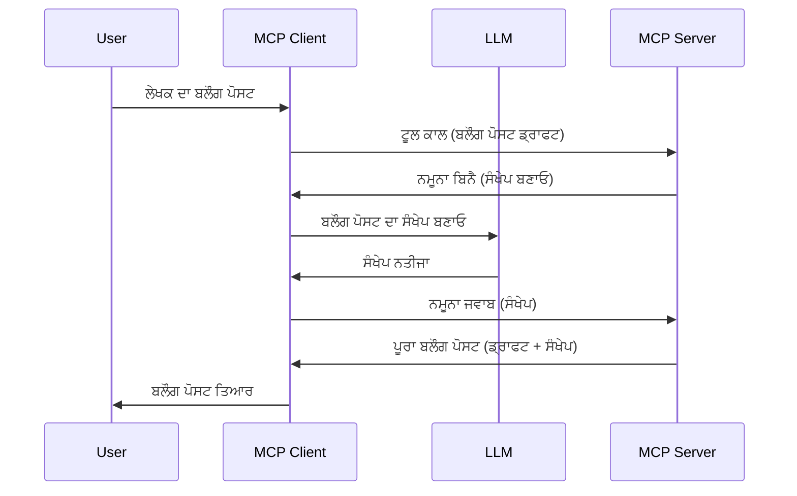

> [!WARNING]
> MCP ਦੇ `2026-07-28` ਵਿੱਚ ਸਮਪਲਿੰਗ ਨੂੰ ਅਪ੍ਰਚੀਤ ਕੀਤਾ ਗਿਆ ਹੈ। ਇਹ ਪਾਠ ਵਿਰਾਸਤੀ ਲਾਗੂ ਕਰਨ ਲਈ ਸੰਭਾਲ ਕੇ ਰੱਖਿਆ ਗਿਆ ਹੈ। ਨਵੇਂ ਸਰਵਰ ਸਿੱਧੇ ਇਕ LLM ਪ੍ਰਦਾਤਾ API ਨਾਲ ਸੰਯੋਜਿਤ ਕਰਨੇ ਚਾਹੀਦੇ ਹਨ।
> ਨਵੇਂ ਸਰਵਰ ਸਿੱਧੇ ਇਕ LLM
> ਪ੍ਰਦਾਤਾ API ਨਾਲ ਸੰਯੋਜਿਤ ਕਰਨੇ ਚਾਹੀਦੇ ਹਨ।

# ਸਮਪਲਿੰਗ - ਗਾਹਕ ਨੂੰ ਵਿਸ਼ੇਸ਼ਤਾਵਾਂ ਸੌਂਪੋ

> ਸਮਪਲਿੰਗ ਸੰਗਤਤਾ ਲਈ `2026-07-28` ਵਿਸ਼ੇਸ਼ਣ ਵਿੱਚ ਰਹਿੰਦੀ ਹੈ ਅਤੇ 28 ਜੁਲਾਈ,
> 2027 ਨੂੰ ਜਾਂ ਉਸ ਤੋਂ ਬਾਅਦ ਜਾਰੀ ਕੀਤੇ ਪਹਿਲੇ ਸੰਸ਼ੋਧਨ ਵਿੱਚ ਹਟਾਉਣ ਯੋਗ ਹੈ।
> ਇਸ ਪਾਠ ਦਿ ਉਦਾਹਰਣਾਂ ਵਿੱਚ ਉਹ SDK API ਵਰਤ ਸਕਦੇ ਹਨ ਜੋ `2025-11-25` ਲਾਗੂ ਕਰਦੇ ਹਨ।
> ਦੇਖੋ [MCP ਵਿੱਚ ਕੀ ਬਦਲਾਅ ਆਏ: 2026-07-28 ਵਿਸ਼ੇਸ਼ਣ](../../01-CoreConcepts/mcp-2026-07-28.md)।

ਵਿਰਾਸਤੀ ਲਾਗੂ ਕਰਨ ਵਿਚ, ਸਮਪਲਿੰਗ ਇੱਕ MCP ਸਰਵਰ ਨੂੰ ਗਾਹਕ ਵੱਲੋਂ ਸੰਚਾਲਿਤ LLM ਤੋਂ ਸਹਾਇਤਾ ਮੰਗਣ ਦੀ ਆਗਿਆ ਦਿੰਦਾ ਹੈ। ਨਵੇਂ ਲਾਗੂ ਕਰਨ ਲਈ, ਚੁਣੀ ਹੋਈ LLM ਪ੍ਰਦਾਤਾ ਨੂੰ ਸਿੱਧਾ ਕਾਲ ਕਰੋ।
ਗਾਹਕ ਵੱਲੋਂ ਸੰਚਾਲਿਤ LLM ਤੋਂ ਸਹਾਇਤਾ ਮੰਗਣ ਦੀ ਆਗਿਆ ਦਿੰਦਾ ਹੈ। ਨਵੇਂ ਲਾਗੂ ਕਰਨ ਲਈ, ਚੁਣੀ ਹੋਈ LLM ਪ੍ਰਦਾਤਾ ਨੂੰ ਸਿੱਧਾ ਕਾਲ ਕਰੋ।
ਸਿੱਧਾ ਕਾਲ ਕਰੋ।

ਆਓ ਕੁਝ ਵਰਤੋਂ ਮਾਮਲਿਆਂ ਦੀ ਜਾਂਚ ਕਰੀਏ ਅਤੇ ਸਮਪਲਿੰਗ ਸ਼ਾਮِل ਹੱਲ ਬਣਾਉਣਾ ਸਿੱਖੀਏ।

## ਝਲਕ

ਇਸ ਪਾਠ ਵਿੱਚ, ਅਸੀਂ ਸਮਪਲਿੰਗ ਕਦੋਂ ਅਤੇ ਕਿੱਥੇ ਵਰਤਣ ਅਤੇ ਇਸ ਨੂੰ ਕਿਵੇਂ ਸੰਰਚਿਤ ਕਰਨ ਤੇ ਧਿਆਨ ਕੇਂਦ੍ਰਿਤ ਕਰਾਂਗੇ।

## ਸਿੱਖਣ ਦੇ ਉਦੇਸ਼

ਇਸ ਅਧਿਆਇ ਵਿੱਚ, ਅਸੀਂ:

- ਸਮਝਾਵਾਂਗੇ ਕਿ ਸਮਪਲਿੰਗ ਕੀ ਹੈ ਅਤੇ ਕਦੋਂ ਇਸਦਾ ਉਪਯੋਗ ਕਰਨਾ ਹੈ।
- MCP ਵਿੱਚ ਸਮਪਲਿੰਗ ਨੂੰ ਕਿਵੇਂ ਸੰਰਚਿਤ ਕਰਨਾ ਹੈ ਦਿਖਾਂਗੇ।
- ਸਮਪਲਿੰਗ ਦੀ ਕਾਰਗੁਜ਼ਾਰੀ ਦੇ ਉਦਾਹਰਣ ਦਿਵਾਂਗੇ।

## ਸਮਪਲਿੰਗ ਕੀ ਹੈ ਅਤੇ ਇਸਦਾ ਉਪਯੋਗ ਕਿਉਂ ਕਰੀਏ?

ਸਮਪਲਿੰਗ ਇੱਕ ਉੱਚ ਦਰਜੇ ਦੀ ਵਿਸ਼ੇਸ਼ਤਾ ਹੈ ਜੋ ਹੇਠਾਂ ਦਿੱਖਾਏ ਤਰੀਕੇ ਨਾਲ ਕੰਮ ਕਰਦੀ ਹੈ:



### ਸਮਪਲਿੰਗ ਬੇਨਤੀ

ਠੀਕ ਹੈ, ਹੁਣ ਸਾਡੇ ਕੋਲ ਇੱਕ ਮਜ਼ਬੂਤ ਸਥਿਤੀ ਦਾ ਮੁਖ ਦ੍ਰਿਸ਼ ਹੈ, ਆਓ ਗੱਲ ਕਰੀਏ ਉੱਥੋਂ ਸਮਪਲਿੰਗ ਬੇਨਤੀ ਦੀ ਜੋ ਸਰਵਰ ਗਾਹਕ ਨੂੰ ਭੇਜਦਾ ਹੈ। ਏਸ ਬੇਨਤੀ ਦੀ JSON-RPC ਫਾਰਮੈਟ ਵਿੱਚ ਇਸ ਤਰ੍ਹਾਂ ਦਿਖਾਈ ਦੇ ਸਕਦੀ ਹੈ:

```json
{
  "jsonrpc": "2.0",
  "id": 1,
  "method": "sampling/createMessage",
  "params": {
    "messages": [
      {
        "role": "user",
        "content": {
          "type": "text",
          "text": "Create a blog post summary of the following blog post: <BLOG POST>"
        }
      }
    ],
    "modelPreferences": {
      "hints": [
        {
          "name": "claude-3-sonnet"
        }
      ],
      "intelligencePriority": 0.8,
      "speedPriority": 0.5
    },
    "systemPrompt": "You are a helpful assistant.",
    "maxTokens": 100
  }
}
```

ਇੱਥੇ ਕੁਝ ਗੱਲਾਂ ਹਨ ਜਿਨ੍ਹਾਂ ਨੂੰ ਵੱਖਰਾ ਕਰਨਾ ਲਾਜ਼ਮੀ ਹੈ:

- ਪ੍ਰੌਂਪਟ, ਸਮੱਗਰੀ -> ਟੈਕਸਟ ਦੇ ਹੇਠਾਂ, ਸਾਡੀ ਪ੍ਰੌਂਪਟ ਹੈ ਜੋ LLM ਨੂੰ ਬਲੌਗ ਪੋਸਟ ਸਮੱਗਰੀ ਦਾ ਸਾਰ ਨਿਕਾਲਣ ਲਈ ਹੁਕਮ ਹੈ।

- **modelPreferences**. ਇਹ ਭਾਗ ਸਿਰਫ਼ ਇੱਛਾ ਹੈ, ਇਕ ਸੁਝਾਅ ਕਿ LLM ਨਾਲ ਕਿਹੜਾ ਸੰਰਚਨਾ ਵਰਤੀ ਜਾਵੇ। ਯੂਜ਼ਰ ਚੁਣ ਸਕਦਾ ਹੈ ਕਿ ਇਹ ਸੁਝਾਅ ਮੰਨੇ ਜਾਂ ਬਦਲੇ। ਇਸ ਮਾਮਲੇ ਵਿੱਚ ਮਾਡਲ, ਗਤੀ ਅਤੇ ਬੁੱਧੀਮਤਾ ਦੀ ਪ੍ਰਾਥਮਿਕਤਾ ਬਾਰੇ ਸੁਝਾਅ ਹਨ।
- **systemPrompt**, ਇਹ ਤੁਹਾਡਾ ਆਮ ਸਿਸਟਮ ਪ੍ਰੌਂਪਟ ਹੈ ਜੋ ਤੁਹਾਡੇ LLM ਨੂੰ ਵਿਅਕਤੀਗਤ ਕਰਦਾ ਹੈ ਅਤੇ ਹੁਕਮਾਂ ਦੀ ਸੂਚੀ ਦਿੰਦਾ ਹੈ।
- **maxTokens**, ਇਹ ਇਕ ਹੋਰ ਗੁਣ ਹੈ ਜੋ ਦੱਸਦਾ ਹੈ ਕਿ ਇਸ ਕਾਰਜ ਲਈ ਕਿੰਨੇ ਟੋਕਨ ਵਰਤੇ ਜਾਣ ਚਾਹੀਦੇ ਹਨ।

### ਸਮਪਲਿੰਗ ਜਵਾਬ

ਇਹ ਜਵਾਬ MCP ਕਲਾਇੰਟ ਵੱਲੋਂ MCP ਸਰਵਰ ਨੂੰ ਭੇਜਿਆ ਜਾਂਦਾ ਹੈ ਅਤੇ ਇਹ ਨਤੀਜਾ ਹੈ ਜਦੋਂ ਕਲਾਇੰਟ LLM ਨੂੰ ਕਾਲ ਕਰਦਾ ਹੈ, ਉਸ ਜਵਾਬ ਦੀ ਉਡੀਕ ਕਰਦਾ ਹੈ ਅਤੇ ਫਿਰ ਸੁਨੇਹਾ ਤਿਆਰ ਕਰਦਾ ਹੈ। JSON-RPC ਵਿੱਚ ਇਹ ਇਸ ਤਰ੍ਹਾਂ ਦਿਖਾਈ ਦੇ ਸਕਦਾ ਹੈ:

```json
{
  "jsonrpc": "2.0",
  "id": 1,
  "result": {
    "role": "assistant",
    "content": {
      "type": "text",
      "text": "Here's your abstract <ABSTRACT>"
    },
    "model": "gpt-5",
    "stopReason": "endTurn"
  }
}
```

ਦੇਖੋ, ਜਵਾਬ ਬਲੌਗ ਪੋਸਟ ਦਾ ਸਾਰ ਹੈ ਜਿਸ ਤਰ੍ਹਾਂ ਅਸੀਂ ਮੰਗਿਆ ਸੀ। ਨਾਲ ਹੀ ਇਹ ਵੀ ਦੇਖੋ ਕਿ ਵਰਤਿਆ ਗਿਆ `model` ਉਹ ਨਹੀਂ ਜੋ ਅਸੀਂ ਮੰਗਿਆ ਸੀ, ਪਰ "gpt-5" ਹੈ "claude-3-sonnet" ਦੇ ਬਜਾਏ। ਇਹ ਦਿਖਾਉਂਦਾ ਹੈ ਕਿ ਯੂਜ਼ਰ ਸੋਚ ਬਦਲ ਸਕਦਾ ਹੈ ਅਤੇ ਤੁਹਾਡੀ ਸਮਪਲਿੰਗ ਬੇਨਤੀ ਇੱਕ ਸਿਫ਼ਾਰਸ਼ ਹੈ।

ਠੀਕ ਹੈ, ਹੁਣ ਜਦੋਂ ਕਿ ਅਸੀਂ ਮੁੱਖ ਪ੍ਰਵਾਹ ਸਮਝ ਲਿਆ ਹੈ, ਅਤੇ ਇੱਕ ਲਾਭਦਾਇਕ ਕੰਮ "ਬਲੌਗ ਪੋਸਟ ਬਨਾਉਣਾ + ਸਾਰ" ਲਈ ਇਸਦਾ ਉਪਯੋਗ ਕਰਨ ਲਈ ਕੀ ਕਰਨ ਦੀ ਲੋੜ ਹੈ ਵੇਖੀਏ।

### ਸੁਨੇਹਿਆਂ ਦੇ ਕਿਸਮਾਂ

ਸਮਪਲਿੰਗ ਸੁਨੇਹੇ ਸਿਰਫ਼ ਟੈਕਸਟ ਵਿੱਚ ਸੀਮਤ ਨਹੀਂ ਹਨ, ਤੁਸੀਂ ਫੋਟੋਆਂ ਅਤੇ ਆਡੀਓ ਵੀ ਭੇਜ ਸਕਦੇ ਹੋ। JSON-RPC ਇਸ ਤਰ੍ਹਾਂ ਵੱਖਰਾ ਦਿਖਾਈ ਦਿੰਦਾ ਹੈ:

**ਟੈਕਸਟ**

```json
{
  "type": "text",
  "text": "The message content"
}
```

**ਚਿੱਤਰ ਸਮੱਗਰੀ**


```json
{
  "type": "image",
  "data": "base64-encoded-image-data",
  "mimeType": "image/jpeg"
}
```

**ਆਡੀਓ ਸਮੱਗਰੀ**

```json
{
  "type": "audio",
  "data": "base64-encoded-audio-data",
  "mimeType": "audio/wav"
}
```

> ਨੋਟ: ਮੌਜੂਦਾ ਸਥਿਤੀ ਅਤੇ ਮਾਈਗ੍ਰੇਸ਼ਨ ਦਿਸ਼ਾ-ਨਿਰਦੇਸ਼ ਲਈ, ਵੇਖੋ
> [deprecated Sampling documentation](https://modelcontextprotocol.io/specification/2026-07-28/client/sampling).

## ਕਲਾਇੰਟ ਵਿੱਚ ਸੈਂਪਲਿੰਗ ਨੂੰ ਕਿਵੇਂ ਸੰਰਚਿਤ ਕਰਨਾ ਹੈ

> ਨੋਟ: ਜੇ ਤੁਸੀਂ ਸਿਰਫ ਸਰਵਰ ਬਣਾ ਰਹੇ ਹੋ, ਤਾਂ ਤੁਹਾਨੂੰ ਇੱਥੇ ਜ਼ਿਆਦਾ ਕੁਝ ਕਰਨ ਦੀ ਲੋੜ ਨਹੀਂ ਹੈ।

ਇੱਕ ਕਲਾਇੰਟ ਵਿੱਚ, ਤੁਹਾਨੂੰ ਹੇਠਾਂ ਦਿੱਤੀ ਫੀਚਰ ਇਸ ਤਰ੍ਹਾਂ ਦਰਸਾਉਣੀ ਪੈਂਦੀ ਹੈ:

```json
{
  "capabilities": {
    "sampling": {}
  }
}
```

ਫਿਰ ਇਹ ਤੁਹਾਡੇ ਚੁਣੇ ਹੋਏ ਕਲਾਇੰਟ ਵੱਲੋਂ ਸਰਵਰ ਨਾਲ ਇਨिशੀਅਲਾਈਜ਼ ਹੋਣ 'ਤੇ ਚੁਣਿਆ ਜਾਵੇਗਾ।

## ਕਾਰਵਾਈ ਵਿੱਚ ਸੈਂਪਲਿੰਗ ਦਾ ਉਦਾਹਰਨ - ਇੱਕ ਬਲਾਗ ਪੋਸਟ ਬਣਾਉਣਾ

ਆਓ ਇੱਕ ਸੈਂਪਲਿੰਗ ਸਰਵਰ ਇਕੱਠੇ ਕੋਡ ਕਰੀਏ, ਸਾਨੂੰ ਹੇਠਾਂ ਦਿੱਤੇ ਕੰਮ ਕਰਨੇ ਹੋਣਗੇ:

1. ਸਰਵਰ 'ਤੇ ਇੱਕ ਟੂਲ ਬਣਾਓ।
1. ਕਿਹਾ ਟੂਲ ਇੱਕ ਸੈਂਪਲਿੰਗ ਰਿਕਵੈਸਟ ਬਣਾਉਣਾ ਚਾਹੀਦਾ ਹੈ
1. ਟੂਲ ਨੂੰ ਕਲਾਇੰਟ ਦੀ ਸੈਂਪਲਿੰਗ ਰਿਕਵੈਸਟ ਦਾ ਜਵਾਬ ਦੇਣ ਦੀ ਉਡੀਕ ਕਰਨੀ ਚਾਹੀਦੀ ਹੈ।
1. ਫਿਰ ਟੂਲ ਦਾ ਨਤੀਜਾ ਤਿਆਰ ਹੋਣਾ ਚਾਹੀਦਾ ਹੈ।

ਆਓ ਕੋਡ ਕਦਮ-ਦਰ-कदम ਵੇਖੀਏ:

### -1- ਟੂਲ ਬਣਾਉਣਾ

**python**

```python
@mcp.tool()
async def create_blog(title: str, content: str, ctx: Context[ServerSession, None]) -> str:
    """Create a blog post and generate a summary"""

```

### -2- ਸੈਂਪਲਿੰਗ ਰਿਕਵੈਸਟ ਬਣਾਉਣਾ

ਆਪਣੇ ਟੂਲ ਨੂੰ ਹੇਠਾਂ ਦਿੱਤੇ ਕੋਡ ਨਾਲ ਵਧਾਓ:

**python**

```python
post = BlogPost(
        id=len(posts) + 1,
        title=title,
        content=content,
        abstract=""
    )

prompt = f"Create an abstract of the following blog post: title: {title} and draft: {content} "

result = await ctx.session.create_message(
        messages=[
            SamplingMessage(
                role="user",
                content=TextContent(type="text", text=prompt),
            )
        ],
        max_tokens=100,
)

```

### -3- ਜਵਾਬ ਲਈ ਉਡੀਕ ਕਰੋ ਅਤੇ ਜਵਾਬ ਮੁੜ ਸੌਂਪੋ

**python**

```python
post.abstract = result.content.text

posts.append(post)

# ਪੂਰਾ ਉਤਪਾਦ ਵਾਪਸ ਕਰੋ
return json.dumps({
    "id": post.title,
    "abstract": post.abstract
})
```

### -4- ਪੂਰਾ ਕੋਡ

**python**

```python
from starlette.applications import Starlette
from starlette.routing import Mount, Host

from mcp.server.fastmcp import Context, FastMCP

from mcp.server.session import ServerSession
from mcp.types import SamplingMessage, TextContent

import json


from uuid import uuid4
from typing import List
from pydantic import BaseModel


mcp = FastMCP("Blog post generator")

# app = FastAPI()

posts = []

class BlogPost(BaseModel):
    id: int
    title: str
    content: str
    abstract: str

posts: List[BlogPost] = []

@mcp.tool()
async def create_blog(title: str, content: str, ctx: Context[ServerSession, None]) -> str:
    """Create a blog post and generate a summary"""

    post = BlogPost(
        id=len(posts) + 1,
        title=title,
        content=content,
        abstract=""
    )

    prompt = f"Create an abstract of the following blog post: title: {title} and draft: {content} "

    result = await ctx.session.create_message(
        messages=[
            SamplingMessage(
                role="user",
                content=TextContent(type="text", text=prompt),
            )
        ],
        max_tokens=100,
    )

    post.abstract = result.content.text

    posts.append(post)

    # ਪੂਰਾ ਬਲੌਗ ਪੋਸਟ ਵਾਪਸ ਕਰੋ
    return json.dumps({
        "id": post.title,
        "abstract": post.abstract
    })

if __name__ == "__main__":
    print("Starting server...")
    # mcp.run()
    mcp.run(transport="streamable-http")

# ਐਪ ਚਲਾਓ: python server.py
```

### -5- Visual Studio Code ਵਿੱਚ ਇਸ ਦੀ ਪਰਖ

ਇਸਨੂੰ Visual Studio Code ਵਿੱਚ ਟੈਸਟ ਕਰਨ ਲਈ, ਹੇਠਾਂ ਦਿੱਤਾ ਕੰਮ ਕਰੋ:

1. ਟਰਮੀਨਲ ਵਿੱਚ ਸਰਵਰ ਸ਼ੁਰੂ ਕਰੋ
1. ਇਸਨੂੰ *mcp.json* ਵਿੱਚ ਸ਼ਾਮਲ ਕਰੋ (ਅਤੇ ਯਕੀਨੀ ਬਣਾਓ ਕਿ ਇਹ ਚਾਲੂ ਹੈ) ਉਦਾਹਰਨ ਲਈ ਕੁਝ ਇਉਂ:

   ```json
   "servers": {
      "blog-server": {
        "type": "http",
        "url": "http://localhost:8000/mcp"
      }
   }
   ```

1. ਇੱਕ ਪ੍ਰਾਂਪਟ ਟਾਈਪ ਕਰੋ:

   ```text
   create a blog post named "Where Python comes from", the content is "Python is actually named after Monty Python Flying Circus"
   ```

1. ਸੈਂਪਲਿੰਗ ਨੂੰ ਹੋਣ ਦਿਓ। ਪਹਿਲੀ ਵਾਰੀ ਜਦੋਂ ਤੁਸੀਂ ਇਸਨੂੰ ਟੈਸਟ ਕਰੋਗੇ, ਤੁਹਾਡੇ ਕੋਲ ਇੱਕ ਵਧੀਕ ਡਾਇਲਾਗ ਵੇਖਣ ਨੂੰ ਮਿਲੇਗਾ ਜਿਸਨੂੰ ਤੁਹਾਨੂੰ ਸਵੀਕਾਰ ਕਰਨਾ ਪਏਗਾ, ਫਿਰ ਤੁਸੀਂ ਟੂਲ ਚਲਾਉਣ ਲਈ ਆਮ ਡਾਇਲਾਗ ਵੇਖੋਗੇ

1. ਨਤੀਜੇ ਦੇਖੋ। ਤੁਹਾਨੂੰ ਨਤੀਜੇ GitHub Copilot Chat ਵਿੱਚ ਸੁੰਦਰ ਢੰਗ ਨਾਲ ਤੇਜ਼ੀ ਨਾਲ ਵੇਖਣ ਨੂੰ ਮਿਲਣਗੇ, ਪਰ ਤੁਸੀਂ ਕੱਚਾ JSON ਜਵਾਬ ਵੀ ਦੇਖ ਸਕਦੇ ਹੋ।

**ਬੋਨਸ**. Visual Studio Code ਟੂਲਿੰਗ ਵਿੱਚ ਸੈਂਪਲਿੰਗ ਲਈ ਸ਼ਾਨਦਾਰ ਸਹਾਇਤਾ ਹੈ। ਤੁਸੀਂ ਆਪਣੇ ਇੰਸਟਾਲ ਕੀਤੇ ਸਰਵਰ ਵੱਲ ਈੱਖਰ ਕਰਕੇ ਉਸ ਵਿੱਚ ਸੈਂਪਲਿੰਗ ਐਕਸੈਸ ਸੰਰਚਿਤ ਕਰ ਸਕਦੇ ਹੋ ਇਸ ਤਰ੍ਹਾਂ:

1. ਐਕਸਟੇਂਸ਼ਨ ਸੈਕਸ਼ਨ 'ਤੇ ਜਾਓ।
1. "MCP SERVERS - INSTALLED" ਸੈਕਸ਼ਨ ਵਿੱਚ ਆਪਣੇ ਇੰਸਟਾਲ ਕੀਤੇ ਸਰਵਰ ਲਈ ਕੌਗ ਆਈਕਨ ਨੂੰ ਚੁਣੋ।
1 "Configure Model Access" ਚੁਣੋ, ਇੱਥੇ ਤੁਸੀਂ ਚੁਣ ਸਕਦੇ ਹੋ ਕਿ ਜਦੋਂ ਸੈਂਪਲਿੰਗ ਕੀਤੀ ਜਾ ਰਹੀ ਹੋਵੇ ਤਾਂ GitHub Copilot ਕਿਹੜੇ ਮਾਡਲ ਵਰਤਣ ਦੀ ਆਗਿਆ ਰੱਖਦਾ ਹੈ। ਤੁਸੀਂ ਹਾਲ ਹੀ ਵਿੱਚ ਹੋਈਆਂ ਸਾਰੀਆਂ ਸੈਂਪਲਿੰਗ ਰਿਕਵੈਸਟਾਂ ਨੂੰ ਵੀ "Show Sampling requests" ਨੂੰ ਚੁਣ ਕੇ ਦੇਖ ਸਕਦੇ ਹੋ।

## ਅਸਾਈਨਮੈਂਟ

ਇਸ ਅਸਾਈਨਮੈਂਟ ਵਿੱਚ, ਤੁਸੀਂ ਕੁਝ ਵੱਖਰਾ ਸੈਂਪਲਿੰਗ ਬਣਾਉਣ ਜਾ ਰਹੇ ਹੋ, ਯਾਣੀ ਇੱਕ ਸੈਂਪਲਿੰਗ ਇੰਟੀਗਰੇਸ਼ਨ ਜੋ ਇੱਕ ਪ੍ਰੋਡਕਟ ਵੇਰਵਾ ਤਿਆਰ ਕਰਨ ਦਾ ਸਮਰਥਨ ਕਰਦਾ ਹੈ। ਇਹ ਰਹੀ ਤੁਹਾਡੀ ਸਥਿਤੀ:

**ਸਥਿਤੀ**: ਇਕ ਈ-ਕਾਮਰਸ ਦਾ ਬੈਕ ਆਫ਼ਿਸ ਵਰਕਰ ਮਦਦ ਮੰਗਦਾ ਹੈ, ਉਨ੍ਹਾਂ ਦਾ ਸਮਾਂ ਬਹੁਤ ਜਾਂਦਾ ਹੈ ਪ੍ਰੋਡਕਟ ਵੇਰਵੇ ਤਿਆਰ ਕਰਨ ਵਿੱਚ। ਇਸ ਲਈ, ਤੁਸੀਂ ਇੱਕ ਐਸੀ ਸੌਲੂਸ਼ਨ ਬਣਾਉਣੇ ਹੋ ਜਿੱਥੇ ਤੁਸੀਂ "create_product" ਨਾਮਕ ਟੂਲ ਕਾਲ ਕਰ ਸਕਦੇ ਹੋ ਜਿਸਦੇ ਦਲੀਲਾਂ "title" ਅਤੇ "keywords" ਹੋਣ ਅਤੇ ਉਹ ਇੱਕ ਪੂਰਾ ਪ੍ਰੋਡਕਟ ਤਿਆਰ ਕਰੇ ਜਿਸ ਵਿੱਚ "description" ਖੇਤਰ ਹੋਵੇ ਜੋ ਕਿ ਕਲਾਇੰਟ ਦੇ LLM ਦੁਆਰਾ ਪੂਰਾ ਹੋਵੇ।

ਟਿਪ: ਜੋ ਕੁਝ ਤੁਸੀਂ ਪਹਿਲਾਂ ਸਿੱਖਿਆ ਹੈ, ਉਸਨੂੰ ਵਰਤੋਂ ਕਰਕੇ ਇਹ ਸਰਵਰ ਅਤੇ ਇਸਦਾ ਟੂਲ ਸੈਂਪਲਿੰਗ ਰਿਕਵੈਸਟ ਦੀ ਵਰਤੋਂ ਕਰਕੇ ਬਣਾਓ।

## ਸੌਲੂਸ਼ਨ

[Solution](./solution/README.md)

## ਮੁੱਖ ਨਤੀਜੇ


ਸੈਂਪਲਿੰਗ ਇਕ ਸ਼ਕਤੀਸ਼ਾਲੀ ਵਿਸ਼ੇਸ਼ਤਾ ਹੈ ਜੋ ਸਰਵਰ ਨੂੰ ਕਲਾਇੰਟ ਨੂੰ ਕੰਮ ਸੌਂਪਣ ਦੀ ਆਗਿਆ ਦਿੰਦੀ ਹੈ ਜਦੋਂ ਉਸਨੂੰ ਕਿਸੇ LLM ਦੀ ਮਦਦ ਦੀ ਲੋੜ ਹੁੰਦੀ ਹੈ।

## ਅੱਗੇ ਕੀ ਹੈ

- [ਅਧਿਆਇ 4 - ਪ੍ਰਯੋਗਿਕ ਕਾਰਗੁਜ਼ਾਰੀ](../../04-PracticalImplementation/README.md)

---

<!-- CO-OP TRANSLATOR DISCLAIMER START -->
**ਅਸਵੀਕਾਰੋਪਣ**:
ਇਸ ਦਸਤਾਵੇਜ਼ ਦਾ ਅਨੁਵਾਦ ਏਆਈ ਅਨੁਵਾਦ ਸੇਵਾ [Co-op Translator](https://github.com/Azure/co-op-translator) ਦੀ ਵਰਤੋਂ ਕਰਕੇ ਕੀਤਾ ਗਿਆ ਹੈ। ਜਦੋਂ ਕਿ ਅਸੀਂ ਸਹੀਤਾਵਾਂ ਲਈ ਯਤਨਸ਼ੀਲ ਹਾਂ, ਕਿਰਪਾ ਕਰਕੇ ਧਿਆਨ ਰੱਖੋ ਕਿ ਸਵੈਚਾਲਿਤ ਅਨੁਵਾਦਾਂ ਵਿੱਚ ਗਲਤੀਆਂ ਜਾਂ ਅਸਮੱਤਿਆਵਾਂ ਹੋ ਸਕਦੀਆਂ ਹਨ। ਮੂਲ ਦਸਤਾਵੇਜ਼ ਆਪਣੀ ਮੂਲ ਭਾਸ਼ਾ ਵਿੱਚ ਅਧਿਕਾਰਕ ਸਰੋਤ ਮੰਨਿਆ ਜਾਣਾ ਚਾਹੀਦਾ ਹੈ। ਜਰੂਰੀ ਜਾਣਕਾਰੀ ਲਈ, ਪੇਸ਼ੇਵਰ ਮਨੁੱਖੀ ਅਨੁਵਾਦ ਦੀ ਸਿਫ਼ਾਰਸ਼ ਕੀਤੀ ਜਾਂਦੀ ਹੈ। ਅਸੀਂ ਇਸ ਅਨੁਵਾਦ ਦੇ ਉਪਯੋਗ ਤੋਂ ਪੈਦਾ ਹੋਣ ਵਾਲੀਆਂ ਕਿਸੇ ਵੀ ਗਲਤਫਹਿਮੀਆਂ ਜਾਂ ਗਲਤ ਵਿਆਖਿਆਵਾਂ ਲਈ ਜਵਾਬਦੇਹ ਨਹੀਂ ਹਾਂ।
<!-- CO-OP TRANSLATOR DISCLAIMER END -->