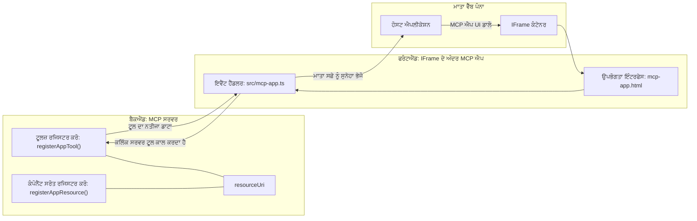
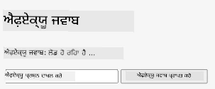
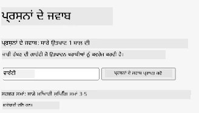
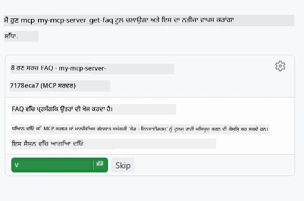
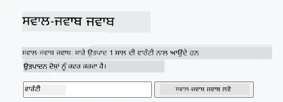

# MCP Apps

MCP Apps MCP ਵਿੱਚ ਇੱਕ ਨਵਾਂ ਪੈਰਾਡਾਈਮ ਹੈ। ਵਿਚਾਰ ਇਹ ਹੈ ਕਿ ਨਾ ਕੇਵਲ ਤੁਸੀਂ ਇੱਕ ਟੂਲ ਕਾਲ ਤੋਂ ਡਾਟਾ ਦੇ ਕੇ ਜਵਾਬ ਦਿੰਦੇ ਹੋ, ਤੁਸੀਂ ਇਹ ਵੀ ਦਿੰਦੇ ਹੋ ਕਿ ਇਸ ਜਾਣਕਾਰੀ ਨਾਲ ਕਿਵੇਂ ਇੰਟਰਐਕਟ ਕਰਨਾ ਚਾਹੀਦਾ ਹੈ। ਇਸਦਾ ਅਰਥ ਹੈ ਕਿ ਟੂਲ ਨਤੀਜੇ ਹੁਣ UI ਜਾਣਕਾਰੀ ਵੀ ਰੱਖ ਸਕਦੇ ਹਨ। ਪਰ ਅਸੀਂ ਇਹ ਕਿਉਂ ਚਾਹੁੰਦੇ ਹਾਂ? ਖੈਰ, ਸੋਚੋ ਕਿ ਤੁਸੀਂ ਅੱਜ ਕਿਵੇਂ ਕੰਮ ਕਰਦੇ ਹੋ। ਤੁਸੀਂ ਸੰਭਵ ਤੌਰ ਤੇ MCP ਸਰਵਰ ਦੇ ਨਤੀਜੇ ਲੈ ਕੇ ਉਨ੍ਹਾਂ ਦੇ ਸਾਹਮਣੇ ਕੋਈ ਫ੍ਰੰਟਐਂਡ ਲਗਾਉਂਦੇ ਹੋ, ਜੋ ਤੁਹਾਨੂੰ ਲਿਖਣਾ ਅਤੇ ਸੰਭਾਲਣਾ ਪੈਂਦਾ ਹੈ। ਕੁਈ ਵਾਰੀ ਇਹ ਚਾਹੀਦਾ ਹੈ, ਪਰ ਕੁਈ ਵਾਰੀ ਵਧੀਆ ਹੁੰਦਾ ਕਿ ਤੁਸੀਂ ਇੱਕ ਸੁਤੰਤਰ ਅਤੇ ਸਾਰੀਆਂ ਚੀਜ਼ਾਂ ਸਮੇਤ ਜਾਣਕਾਰੀ ਦਾ ਇੱਕ ਹਿੱਸਾ ਲਿਆ ਸਕੋ, ਜੋ ਡਾਟਾ ਤੋਂ ਲੈ ਕੇ ਯੂਜ਼ਰ ਇੰਟਰਫੇਸ ਤੱਕ ਸਭ ਕੁਝ ਰੱਖਦਾ ਹੋਵੇ।

## ਸੰਖੇਪ ਜਾਣਕਾਰੀ

ਇਹ ਪਾਠ MCP Apps ਬਾਰੇ ਪ੍ਰਯੋਗਿਕ ਦਿਸ਼ਾ-ਨਿਰਦੇਸ਼ ਪ੍ਰਦਾਨ ਕਰਦਾ ਹੈ, ਕਿ ਕਿਵੇਂ ਸ਼ੁਰੂਆਤ ਕਰਨੀ ਹੈ ਅਤੇ ਆਪਣੇ ਮੌਜੂਦਾ ਵੈੱਬ ਐਪਸ ਵਿੱਚ ਇਸਨੂੰ ਜੋੜਨਾ ਹੈ। MCP Apps MCP ਮਾਪਦੰਡ ਵਿੱਚ ਇਕ ਬਹੁਤ ਨਵਾਂ ਜੋੜ ਹੈ।

## ਸਿੱਖਣ ਦੇ ਉਦੇਸ਼

ਇਸ ਪਾਠ ਦੇ ਖ਼ਤਮ ਹੋਣ ਤੱਕ, ਤੁਸੀਂ ਸਮਰੱਥ ਹੋਵੋਗੇ:

- ਸਮਝਾਉਣਾ ਕਿ MCP Apps ਕੀ ਹਨ।
- ਕਦੋਂ MCP Apps ਦੀ ਵਰਤੋਂ ਕਰਨੀ ਹੈ।
- ਆਪਣੀਆਂ MCP Apps ਬਣਾਉਣਾ ਅਤੇ ਜੋੜਨਾ।

## MCP Apps - ਇਹ ਕਿਵੇਂ ਕੰਮ ਕਰਦਾ ਹੈ

MCP Apps ਦਾ ਵਿਚਾਰ ਇੱਕ ਐਸਾ ਜਵਾਬ ਪੇਸ਼ ਕਰਨਾ ਹੈ ਜੋ ਮੂਲ ਤੌਰ 'ਤੇ ਇੱਕ ਕੰਪੋਨੇਟ ਹੁੰਦਾ ਹੈ ਜੋ ਰੈਂਡਰ ਕੀਤਾ ਜਾ ਸਕਦਾ ਹੈ। ਇੰਨਾ ਕੰਪੋਨੇਟ ਵਿੱਚ ਦਿੱਖ ਅਤੇ ਇੰਟਰਐਕਟਿਵਿਟੀ ਦੋਨੋਂ ਹੋ ਸਕਦੇ ਹਨ, ਜਿਵੇਂ ਕਿ ਬਟਨ ਕਲਿੱਕ, ਯੂਜ਼ਰ ਇੰਪੁੱਟ ਅਤੇ ਹੋਰ। ਆਓ ਸਰਵਰ ਪਾਸੇ ਅਤੇ ਸਾਡੇ MCP ਸਰਵਰ ਨਾਲ ਸ਼ੁਰੂ ਕਰੀਏ। ਇੱਕ MCP App ਕੰਪੋਨੇਟ ਬਣਾਉਣ ਲਈ ਤੁਹਾਨੂੰ ਇੱਕ ਟੂਲ ਨੂੰ ਬਣਾਉਣਾ ਪੈਂਦਾ ਹੈ ਪਰ ਇੱਕ ਐਪਲੀਕੇਸ਼ਨ ਰਿਸੋਰਸ ਵੀ। ਇਹ ਦੋਨਾਂ ਹਿੱਸੇ ਇੱਕ resourceUri ਨਾਲ ਜੁੜੇ ਹੋਏ ਹਨ।

ਇੱਥੇ ਇੱਕ ਉਦਾਹਰਨ ਹੈ। ਆਓ ਵੇਖੀਏ ਕਿ ਕਿੰਝ ਕਿਰਿਆਵਾਂ ਹਨ ਅਤੇ ਹਰੇਕ ਹਿੱਸਾ ਕੀ ਕਰਦਾ ਹੈ:

```text
server.ts -- responsible for registering tools and the component as a UI component
src/
  mcp-app.ts -- wiring up event handlers
mcp-app.html -- the user interface
```

ਇਹ ਵਿਜ਼ੂਅਲ ਕੰਪੋਨੇਟ ਬਣਾਉਣ ਦੀ ਸਾਂਚਾ ਅਤੇ ਇਸਦੀ ਲੋਜਿਕ ਦਿਖਾਉਂਦਾ ਹੈ।


ਆਓ ਬੈਕਐਂਡ ਅਤੇ ਫ੍ਰੰਟਐਂਡ ਦੀ ਜਿੰਮੇਵਾਰੀਆਂ ਬਾਰੇ ਬਿਆਨ ਕਰੀਏ।

### ਬੈਕਐਂਡ

ਇੱਥੇ ਸਾਨੂੰ ਦੋ ਗੱਲਾਂ ਕਰਨੀ ਹਨ:

- ਉਹ ਟੂਲਜ਼ ਦਰਜ ਕਰਨ ਜੋ ਅਸੀਂ ਇੰਟਰਐਕਟ ਕਰਨਾ ਚਾਹੁੰਦੇ ਹਾਂ।
- ਕੰਪੋਨੇਟ ਨੂੰ ਪਰਿਭਾਸ਼ਿਤ ਕਰਨਾ।

**ਟੂਲ ਰਜਿਸਟਰ ਕਰਨਾ**

```typescript
registerAppTool(
    server,
    "get-time",
    {
      title: "Get Time",
      description: "Returns the current server time.",
      inputSchema: {},
      _meta: { ui: { resourceUri } }, // ਇਸ ਟੂਲ ਨੂੰ ਇਸਦੇ UI ਸਰੋਤ ਨਾਲ ਜੋੜਦਾ ਹੈ
    },
    async () => {
      const time = new Date().toISOString();
      return { content: [{ type: "text", text: time }] };
    },
  );

```

ਉਪਰ ਦਿੱਤਾ ਕੋਡ ਵਿਵਰਣ ਕਰਦਾ ਹੈ ਕਿ ਇੱਕ ਟੂਲ `get-time` ਕਿਵੇਂ ਖੁਲ੍ਹਦਾ ਹੈ। ਇਸਦਾ ਕੋਈ ਇਨਪੁੱਟ ਨਹੀਂ ਹੁੰਦਾ ਪਰ ਇਹ ਮੌਜੂਦਾ ਸਮਾਂ ਦਿੰਦਾ ਹੈ। ਜਦੋਂ ਸਾਨੂੰ ਯੂਜ਼ਰ ਇਨਪੁੱਟ ਮਿਲਣਾ ਹੁੰਦਾ ਹੈ ਤਾਂ ਅਸੀਂ ਟੂਲਜ਼ ਲਈ `inputSchema` ਪਰਿਭਾਸ਼ਿਤ ਕਰ ਸਕਦੇ ਹਾਂ।

**ਕੰਪੋਨੇਟ ਰਜਿਸਟਰ ਕਰਨਾ**

ਉਸੇ ਫਾਇਲ ਵਿੱਚ, ਸਾਨੂੰ ਕੰਪੋਨੇਟ ਨੂੰ ਵੀ ਦਰਜ ਕਰਨਾ ਹੁੰਦਾ ਹੈ:

```typescript
const resourceUri = "ui://get-time/mcp-app.html";

// ਸੰਸਾਧਨ ਨੂੰ ਰਜਿਸਟਰ ਕਰੋ, ਜੋ UI ਲਈ ਬੰਡਲ ਕੀਤੀ ਗਈ HTML/JavaScript ਵਾਪਸ ਕਰਦਾ ਹੈ।
registerAppResource(
  server,
  resourceUri,
  resourceUri,
  { mimeType: RESOURCE_MIME_TYPE },
  async () => {
    const html = await fs.readFile(path.join(DIST_DIR, "mcp-app.html"), "utf-8");

    return {
    contents: [
        { uri: resourceUri, mimeType: RESOURCE_MIME_TYPE, text: html },
    ],
    };
  },
);
```

ਦਿਆਨ ਦੇਣ ਯੋਗ ਗੱਲ ਹੈ ਕਿ ਅਸੀਂ `resourceUri` ਦੀ ਵਰਤੋਂ ਕਰਦੇ ਹਾਂ ਜੋ ਕੰਪੋਨੇਟ ਨੂੰ ਇਸਦੇ ਟੂਲਜ਼ ਨਾਲ ਜੋੜਦਾ ਹੈ। ਰੁਚਿਕਰ ਗੱਲ ਹੈ 콜ਬੈਕ ਜਿਸ ਵਿੱਚ ਅਸੀਂ UI ਫਾਇਲ ਲੋਡ ਕਰਕੇ ਕੰਪੋਨੇਟ ਵਾਪਸ ਕਰਦੇ ਹਾਂ।

### ਕੰਪੋਨੇਟ ਫ੍ਰੰਟਐਂਡ

ਬੈਕਐਂਡ ਵਾਂਗ, ਇੱਥੇ ਵੀ ਦੋ ਹਿੱਸੇ ਹਨ:

- ਸਾਫ਼ HTML ਵਿੱਚ ਲਿਖਿਆ ਫ੍ਰੰਟਐਂਡ।
- ਈਵੈਂਟਸ ਨੂੰ ਸੰਭਾਲਣ ਵਾਲਾ ਕੋਡ ਜੋ ਕਿ ਟੂਲ ਕਾਲ ਕਰਨ ਜਾਂ ਮਾਪੇਖੀ ਖਿੜਕੀ ਨੂੰ ਸਨੇਹੇ ਭੇਜਣ ਵਰਗੇ ਕੰਮ ਕਰਦਾ ਹੈ।

**ਯੂਜ਼ਰ ਇੰਟਰਫੇਸ**

ਆਓ ਯੂਜ਼ਰ ਇੰਟਰਫੇਸ ਵੇਖੀਏ।

```html
<!-- mcp-app.html -->
<!DOCTYPE html>
<html lang="en">
  <head>
    <meta charset="UTF-8" />
    <title>Get Time App</title>
  </head>
  <body>
    <p>
      <strong>Server Time:</strong> <code id="server-time">Loading...</code>
    </p>
    <button id="get-time-btn">Get Server Time</button>
    <script type="module" src="/src/mcp-app.ts"></script>
  </body>
</html>
```

**ਈਵੈਂਟ ਵਾਇਰਅਪ**

ਆਖਰੀ ਹਿੱਸਾ ਇਹ ਹੈ ਕਿ ਅਸੀਂ ਤੁਹਾਡੇ UI ਵਿੱਚ ਕਿਹੜੇ ਹਿੱਸੇ ਨੂੰ ਹੁਣ ਈਵੈਂਟ ਹੈਂਡਲਰ ਮਿਲਣੇ ਚਾਹੀਦੇ ਹਨ ਅਤੇ ਜੇ ਕੋਈ ਈਵੈਂਟ ਆਉਂਦਾ ਹੈ ਤਾਂ ਕੀ ਕਰਨਾ ਹੈ:

```typescript
// mcp-app.ts

import { App } from "@modelcontextprotocol/ext-apps";

// ਤੱਤ ਸਰੋਤ ਪ੍ਰਾਪਤ ਕਰੋ
const serverTimeEl = document.getElementById("server-time")!;
const getTimeBtn = document.getElementById("get-time-btn")!;

// ਐਪ ਉਦਾਹਰਨ ਬਣਾਓ
const app = new App({ name: "Get Time App", version: "1.0.0" });

// ਸਰਵਰ ਤੋਂ ਟੂਲ ਨਤੀਜੇ ਸੰਭਾਲੋ। ਸ਼ੁਰੂਆਤ ਤੋਂ ਪਹਿਲਾਂ `app.connect()` ਸੈੱਟ ਕਰੋ ਤਾਂ ਜੋ
// ਸ਼ੁਰੂਆਤੀ ਟੂਲ ਨਤੀਜੇ ਨਾ ਗੁਆਉਣ।
app.ontoolresult = (result) => {
  const time = result.content?.find((c) => c.type === "text")?.text;
  serverTimeEl.textContent = time ?? "[ERROR]";
};

// ਬਟਨ ਕਲਿੱਕ ਜੋੜੋ
getTimeBtn.addEventListener("click", async () => {
  // `app.callServerTool()` UI ਨੂੰ ਸਰਵਰ ਤੋਂ ਤਾਜ਼ਾ ਡਾਟਾ ਮੰਗਣ ਦੀ ਆਗਿਆ ਦਿੰਦਾ ਹੈ
  const result = await app.callServerTool({ name: "get-time", arguments: {} });
  const time = result.content?.find((c) => c.type === "text")?.text;
  serverTimeEl.textContent = time ?? "[ERROR]";
});

// ਹੋਸਟ ਨਾਲ ਜੁੜੋ
app.connect();
```

ਜਿਵੇਂ ਤੁਸੀਂ ਉਪਰੋਂ ਦੇਖਿਆ, ਇਹ DOM ਐਲਿਮੈਂਟਸ ਨੂੰ ਈਵੈਂਟਸ ਨਾਲ ਜੋੜਨ ਲਈ ਸਮਾਨ ਕੋਡ ਹੈ। ਖ਼ਾਸ ਤੌਰ ਤੇ `callServerTool` ਕਾਲ ਨੂੰ ਧਿਆਨ ਦਿਓ, ਜੋ ਬੈਕਐਂਡ 'ਤੇ ਟੂਲ ਕਾਲ ਕਰਦਾ ਹੈ।

## ਯੂਜ਼ਰ ਇਨਪੁੱਟ ਨਾਲ ਨਿਪਟਣਾ

ਹੁਣ ਤੱਕ ਅਸੀਂ ਇੱਕ ਕੰਪੋਨੇਟ ਵੇਖਿਆ ਹੈ ਜਿਸ ਵਿੱਚ ਇੱਕ ਬਟਨ ਹੈ ਜੋ ਕਲਿੱਕ ਹੋਣ 'ਤੇ ਇੱਕ ਟੂਲ ਕਾਲ ਕਰਦਾ ਹੈ। ਆਓ ਹੋਰ UI ਅੰਗ ਜਿਵੇਂ ਕਿ ਇਨਪੁੱਟ ਫੀਲਡ ਸ਼ਾਮਲ ਕਰੀਏ ਅਤੇ ਵੇਖੀਏ ਕਿ ਅਸੀਂ ਟੂਲ ਨੂੰ.Argument ਭੇਜ ਸਕਦੇ ਹਾਂ ਕਿ ਨਹੀਂ। ਆਓ ਇੱਕ FAQ ਕਾਰਜਕਾਰੀ ਲਾਗੂ ਕਰੀਏ। ਇਹ ਕਿਵੇਂ ਕੰਮ ਕਰਨਾ ਚਾਹੀਦਾ ਹੈ:

- ਇੱਕ ਬਟਨ ਅਤੇ ਇੱਕ ਇਨਪੁੱਟ ਐਲਿਮੈਂਟ ਹੋਣਾ ਚਾਹੀਦਾ ਹੈ ਜਿੱਥੇ ਯੂਜ਼ਰ ਕਿਸੇ ਕੀਵਰਡ ਜਿਵੇਂ "Shipping" ਲਿਖ ਕੇ ਖੋਜ ਕਰ ਸਕੇ। ਇਹ ਬੈਕਐਂਡ ਤੋਂ ਟੂਲ ਕਾਲ ਕਰੇ ਜੋ FAQ ਡਾਟਾ ਵਿੱਚ ਖੋਜ ਕਰਦਾ ਹੈ।
- ਇੱਕ ਟੂਲ ਜੋ ਦਿੱਤੀ ਗਈ FAQ ਖੋਜ ਨੂੰ ਸਹਾਇਤਾ ਕਰਦਾ ਹੈ।

ਆਓ ਪਹਿਲਾਂ ਬੈਕਐਂਡ 'ਤੇ ਲੋੜੀਦਾ ਸਹਾਇਤਾ ਜੋੜੀਏ:

```typescript
const faq: { [key: string]: string } = {
    "shipping": "Our standard shipping time is 3-5 business days.",
    "return policy": "You can return any item within 30 days of purchase.",
    "warranty": "All products come with a 1-year warranty covering manufacturing defects.",
  }

registerAppTool(
    server,
    "get-faq",
    {
      title: "Search FAQ",
      description: "Searches the FAQ for relevant answers.",
      inputSchema: zod.object({
        query: zod.string().default("shipping"),
      }),
      _meta: { ui: { resourceUri: faqResourceUri } }, // ਇਸ ਟੂਲ ਨੂੰ ਇਸਦੇ UI ਸਰੋਤ ਨਾਲ ਜੋੜਦਾ ਹੈ
    },
    async ({ query }) => {
      const answer: string = faq[query.toLowerCase()] || "Sorry, I don't have an answer for that.";
      return { content: [{ type: "text", text: answer }] };
    },
  );
```

ਅਸੀਂ ਇੱਥੇ ਵੇਖ ਰਹੇ ਹਾਂ ਕਿ ਅਸੀਂ `inputSchema` ਨੂੰ 'zod' ਸਕੀਮਾ ਦੇ ਕੇ ਪੂਰੀ ਕਰਦੇ ਹਾਂ:

```typescript
inputSchema: zod.object({
  query: zod.string().default("shipping"),
})
```

ਉਪਰ ਦਿੱਤੇ ਸਕੀਮਾ ਵਿੱਚ ਅਸੀਂ ਘੋਸ਼ਿਤ ਕੀਤਾ ਕਿ ਸਾਡੇ ਕੋਲ ਇੱਕ ਇਨਪੁੱਟ ਪੈਰਾਮੀਟਰ ਹੈ ਜਿਸਦਾ ਨਾਮ `query` ਹੈ ਅਤੇ ਇਹ ਵਿਕਲਪਿਕ ਹੈ ਅਤੇ ਇਸਦਾ ਡਿਫੌਲਟ ਮੁੱਲ "shipping" ਹੈ।

ਠੀਕ ਹੈ, ਹੁਣ *mcp-app.html* ਵਿੱਚ ਵੇਖੀਏ ਕਿ ਸਾਨੂੰ ਕੀ UI ਬਣਾਉਣਾ ਹੈ:

```html
<div class="faq">
    <h1>FAQ response</h1>
    <p>FAQ Response: <code id="faq-response">Loading...</code></p>
    <input type="text" id="faq-query" placeholder="Enter FAQ query" />
    <button id="get-faq-btn">Get FAQ Response</button>
  </div>
```

ਵਧੀਆ, ਹੁਣ ਸਾਡੇ ਕੋਲ ਇਨਪੁੱਟ ਐਲਿਮੈਂਟ ਅਤੇ ਬਟਨ ਹਨ। ਆਓ *mcp-app.ts* ਵਿੱਚ ਜਾ ਕੇ ਇਹਨਾਂ ਈਵੈਂਟਸ ਨੂੰ ਜੋੜੀਏ:

```typescript
const getFaqBtn = document.getElementById("get-faq-btn")!;
const faqQueryInput = document.getElementById("faq-query") as HTMLInputElement;

getFaqBtn.addEventListener("click", async () => {
  const query = faqQueryInput.value;
  const result = await app.callServerTool({ name: "get-faq", arguments: { query } });
  const faq = result.content?.find((c) => c.type === "text")?.text;
  faqResponseEl.textContent = faq ?? "[ERROR]";
});
```

ਉਪਰ ਦਿੱਤੇ ਕੋਡ ਵਿੱਚ ਅਸੀਂ:

- ਦਿਲਚਸਪ UI ਅੰਗਾਂ ਦੇ ਸੰਦੇਸ਼ ਬਣਾਏ।
- ਬਟਨ ਕਲਿੱਕ ਸੰਭਾਲਿਆ ਜਾਂਦਾ ਹੈ, ਇਨਪੁੱਟ ਦਾ ਮੁੱਲ ਪ੍ਰਾਪਤ ਕੀਤਾ ਜਾਂਦਾ ਹੈ ਅਤੇ ਅਸੀਂ `app.callServerTool()` ਕਾਲ ਕਰਦੇ ਹਾਂ ਜਿਸ ਵਿੱਚ `name` ਅਤੇ `arguments` ਹਨ, ਜਿੱਥੇ `arguments` ਵਿੱਚ `query` ਦਾ ਮੁੱਲ ਭੇਜਿਆ ਜਾਂਦਾ ਹੈ।

ਜਦੋਂ ਤੁਸੀਂ `callServerTool` ਕਾਲ ਕਰਦੇ ਹੋ ਤਾਂ ਇਹ ਮਾਪੇਖੀ ਖਿੜਕੀ ਨੂੰ ਸੁਨੇਹਾ ਭੇਜਦਾ ਹੈ ਅਤੇ ਉਹ ਖਿੜਕੀ MCP ਸਰਵਰ ਕਾਲ ਕਰਦੀ ਹੈ।

### ਕਮ ਕਰਕੇ ਵੇਖੋ

ਇਸ ਨੂੰ ਕਿਸੇ ਪ੍ਰਯੋਗ ਵਿੱਚ ਲਿਆਂਦੇ ਹੋਏ ਤੁਸੀਂ ਇਹ ਵੇਖੋਗੇ:



ਅਤੇ ਇੱਥੇ ਅਸੀਂ "warranty" ਵਾਂਗ ਇਨਪੁੱਟ ਦੇ ਕੇ ਕੋਸ਼ਿਸ਼ ਕੀਤੀ ਹੈ:



ਇਸ ਕੋਡ ਨੂੰ ਚਲਾਉਣ ਲਈ, [Code section](./code/README.md) ਵਿੱਚ ਜਾਓ।

## Visual Studio Code ਵਿੱਚ ਟੈਸਟਿੰਗ

Visual Studio Code ਨਾਲ ਮਿਲਜੁਲ ਕੇ MVP Apps ਦੀ ਵਧੀਆ ਸਹਾਇਤਾ ਹੈ ਅਤੇ ਇਹ ਤੁਹਾਡੇ MCP Apps ਦੀ ਜाँच ਕਰਨ ਲਈ ਸਭ ਤੋਂ ਆਸਾਨ ਤਰੀਕਿਆਂ ਵਿੱਚੋਂ ਇੱਕ ਹੈ। Visual Studio Code ਵਰਤਣ ਲਈ, *mcp.json* ਵਿੱਚ ਸਰਵਰ ਇਨਟਰੀ ਸ਼ਾਮਲ ਕਰੋ ਜਿਵੇਂ:

```json
"my-mcp-server-7178eca7": {
    "url": "http://localhost:3001/mcp",
    "type": "http"
  }
```

ਫਿਰ ਸਰਵਰ ਸ਼ੁਰੂ ਕਰੋ, ਤੁਸੀਂ ਆਪਣੇ MVP App ਨਾਲ ਚੈਟ ਵਿੰਡੋ ਰਾਹੀਂ ਗੱਲਬਾਤ ਕਰ ਸਕੋਗੇ ਜੇ ਤੁਹਾਡੇ ਕੋਲ GitHub Copilot ਇੰਸਟਾਲਡ ਹੈ।

ਜਿਵੇਂ ਤੁਸੀਂ ਇਸਨੂੰ ਪ੍ਰੰਪਟ ਦੁਆਰਾ ਚਲਾਉਂਦੇ ਹੋ, ਉਦਾਹਰਨ ਵਜੋਂ "#get-faq":



ਅਤੇ ਜਿਵੇਂ ਤੁਸੀਂ ਵੈੱਬ ਬ੍ਰਾਉਜ਼ਰ ਵਿਚ ਚਲਾਇਆ ਸੀ, ਇਹ ਇਸੇ ਤਰ੍ਹਾਂ ਉਸਾਰੀ ਕਰਦਾ ਹੈ:



## ਅਸਾਈਨਮੈਂਟ

ਇੱਕ ਰੌਕ-ਪੇਪਰ-ਸਿਸਰ ਖੇਡ ਬਣाओ। ਇਹਨਾਂ ਚੀਜ਼ਾਂ ਦਾ ਸਮਾਵੇਸ਼ ਹੋਣਾ ਚਾਹੀਦਾ ਹੈ:

UI:

- ਵਿਕਲਪਾਂ ਵਾਲੀ ਡ੍ਰਾਪਡਾਊਨ ਸੂਚੀ
- ਚੋਣ ਦਾਇਤ ਕਰਨ ਲਈ ਬਟਨ
- ਇੱਕ ਲੇਬਲ ਜੋ ਦਿਖਾਏ ਕਿ ਕਿਸਨੇ ਕੀ ਚੁਣਿਆ ਅਤੇ ਕੌਣ ਜਿੱਤਿਆ

ਸਰਵਰ:

- ਇੱਕ ਰੌਕ-ਪੇਪਰ-ਸਿਸਰ ਟੂਲ ਜੋ "ਚੋਣ" ਨੂੰ ਇਨਪੁੱਟ ਵਜੋਂ ਲੈਂਦਾ ਹੈ। ਇਹ ਕੰਪਿਊਟਰ ਦੀ ਚੋਣ ਵੀ ਰੈਂਡਰ ਕਰੇ ਅਤੇ ਜੇਤੂ ਤੈਅ ਕਰੇ।

## ਸਮਾਧਾਨ

[Solution](./assignment/README.md)

## ਸੰਖੇਪ

ਅਸੀਂ MCP Apps ਬਾਰੇ ਇਹ ਨਵਾਂ ਪੈਰਾਡਾਈਮ ਸਿੱਖਿਆ। ਇਹ ਇੱਕ ਨਵਾਂ ਪੈਰਾਡਾਈਮ ਹੈ ਜੋ MCP ਸਰਵਰਜ਼ ਨੂੰ ਨਾ ਕੇਵਲ ਡਾਟਾ ਬਾਰੇ ਪਰ ਇਸ ਡਾਟਾ ਦੇ ਪ੍ਰਦਰਸ਼ਨ ਬਾਰੇ ਵੀ ਆਪਣੀ ਰਾਇ ਦੇਣ ਦਾ ਮੌਕਾ ਦਿੰਦਾ ਹੈ।

ਇਸਦੇ ਨਾਲ ਨਾਲ, ਅਸੀਂ ਸਿੱਖਿਆ ਕਿ ਇਹ MCP Apps ਇੱਕ IFrame ਵਿੱਚ ਹੋਸਟ ਕੀਤੇ ਜਾਂਦੇ ਹਨ ਅਤੇ MCP ਸਰਵਰਜ਼ ਨਾਲ ਸੰਚਾਰ ਲਈ ਉਹਨਾਂ ਨੂੰ ਪੈਰੇਂਟ ਵੈੱਬ ਐਪ ਨੂੰ ਸੁਨੇਹੇ ਭੇਜਣੇ ਪੈਂਦੇ ਹਨ। ਇਸ ਸੰਜੋਗ ਲਈ ਕੁਝ ਲਾਇਬ੍ਰੇਰੀਆਂ ਹਨ ਜੋ ਸਿੱਧੇ ਜਾਵਾਸਕ੍ਰਿਪਟ ਅਤੇ React ਲਈ ਵੀ ਉਪਲਬਧ ਹਨ, ਜੋ ਇਸ ਸੰਚਾਰ ਨੂੰ ਆਸਾਨ ਬਣਾਉਂਦੀਆਂ ਹਨ।

## ਮੁੱਖ ਗਿਆਨ ਸੰਕਲਪ

ਇਹ ਹਨ ਜੋ ਤੁਹਾਡੇ ਸਿੱਖਿਆ:

- MCP Apps ਇੱਕ ਨਵਾਂ ਮਾਪਦੰਡ ਹੈ ਜੋ ਉਹਨਾਂ ਸਮਿਆਂ ਵਿੱਚ ਲਾਭਦਾਇਕ ਹੈ ਜਦੋਂ ਤੁਸੀਂ ਡਾਟਾ ਦੇ ਨਾਲ UI ਫੀਚਰ ਵੀ ਭੇਜਣਾ ਚਾਹੁੰਦੇ ਹੋ।
- ਇਹ ਤਰ੍ਹਾਂ ਦੇ ਐਪਸ ਸੁਰੱਖਿਆ ਦੇ ਹਿਸਾਬ ਨਾਲ IFrame ਵਿੱਚ ਚਲਾਏ ਜਾਂਦੇ ਹਨ।

## ਅਗਲਾ ਕੀ ਹੈ

- [Chapter 4](../../04-PracticalImplementation/README.md)

---

<!-- CO-OP TRANSLATOR DISCLAIMER START -->
**ਇਨਕਾਰ ਕਰਨ ਵਾਲਾ ਬਿਆਨ**:  
ਇਹ ਦਸਤਾਵੇਜ਼ ਏ.ਆਈ. ਅਨੁਵਾਦ ਸੇਵਾ [Co-op Translator](https://github.com/Azure/co-op-translator) ਦੀ ਵਰਤੋਂ ਕਰਕੇ ਅਨੁਵਾਦ ਕੀਤਾ ਗਿਆ ਹੈ। ਜਦੋਂ ਕਿ ਅਸੀਂ ਸ਼ੁੱਧਤਾ ਲਈ ਪੂਰੀ ਕੋਸ਼ਿਸ਼ ਕਰਦੇ ਹਾਂ, ਕਿਰਪਾ ਕਰਕੇ ਧਿਆਨ ਵਿੱਚ ਰੱਖੋ ਕਿ ਸਵੈਚਾਲਿਤ ਅਨੁਵਾਦਾਂ ਵਿੱਚ ਗਲਤੀਆਂ ਜਾਂ ਅਸਮਰੱਥਾ ਹੋ ਸਕਦੀ ਹੈ। ਮੂਲ ਦਸਤਾਵੇਜ਼ ਆਪਣੇ ਮੂਲ ਭਾਸ਼ਾ ਵਿੱਚ ਅਧਿਕਾਰਕ ਸਰੋਤ ਮੰਨਿਆ ਜਾਣਾ ਚਾਹੀਦਾ ਹੈ। ਮਹੱਤਵਪੂਰਨ ਜਾਣਕਾਰੀ ਲਈ, ਪੇਸ਼ੇਵਰ ਮਨੁੱਖੀ ਅਨੁਵਾਦ ਦੀ ਸਿਫਾਰਸ਼ ਕੀਤੀ ਜਾਂਦੀ ਹੈ। ਅਸੀਂ ਇਸ ਅਨੁਵਾਦ ਦੀ ਵਰਤੋਂ ਕਰਕੇ ਪੈਦਾ ਹੋਣ ਵਾਲੀਆਂ ਕਿਸੇ ਵੀ ਗਲਤਫਹਿਮੀ ਜਾਂ ਗਲਤ ਵਿਆਖਿਆਵਾਂ ਲਈ ਜ਼ਿੰਮੇਵਾਰ ਨਹੀਂ ਹਾਂ।
<!-- CO-OP TRANSLATOR DISCLAIMER END -->