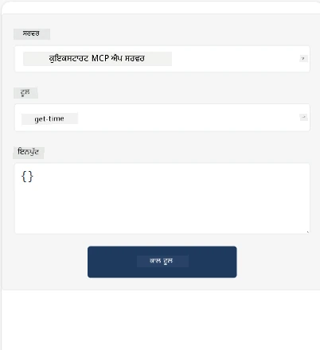
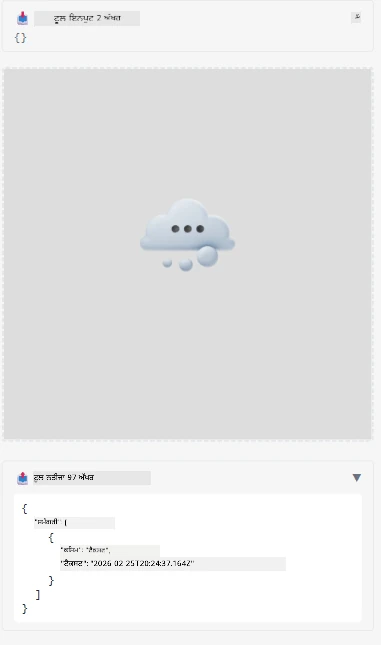

Here's a sample demonstrating MCP App

## Install 

1. Navigate to *mcp-app* folder
1. Run `npm install`, this should install frontend and backend dependencies

Verify the backend compiles by running:

```sh
npx tsc --noEmit
```

There should be no output if everything is fine.

## Run backend

> This takes a bit of extra work if you're on a Windows machine as the MCP Apps solution uses `concurrently` library to run that you need to find a replacement for. Here's the offending line *package.json* on the MCP App:

    ```json
    "start": "concurrently \"cross-env NODE_ENV=development INPUT=mcp-app.html vite build --watch\" \"tsx watch main.ts\""
    ```

This app has two parts, a backend part and a host part.

Start the backend by calling:

```sh
npm start
```

This should shart the backend on `http://localhost:3001/mcp`. 

> Note, if you're in a Codespace, you may need to set port visibility to public. Check you can reach endpoint in the browser through https://<name of Codespace>.app.github.dev/mcp

## Choice -1 Test the app in Visual Studio Code

To test the solution in Visual Studio Code, do the following:

- Add a server entry to `mcp.json` like so:

    ```json
    {
        "servers": {
            "my-mcp-server-7178eca7": {
                "url": "http://localhost:3001/mcp",
                "type": "http"
            }
        },
        "inputs": []
    }
    ```

1. Click the "start" button in *mcp.json*
1. Make sure a chat window is open and type `get-faq`, you should see a result like so:

    

## Choice -2- Test the app with a host

The repo <https://github.com/modelcontextprotocol/ext-apps> contains several different hosts that you can use to test your MVP Apps. 

We will present you with two different options here:

### Local machine

- Navigate to *ext-apps* after you've cloned the repo.

- Install dependencies

   ```sh
   npm install
   ```

- In a separate terminal window, navigate to *ext-apps/examples/basic-host*

    > if you Codespace, you need to navigate to serve.ts and line 27 and replace http://localhost:3001/mcp with your Codespace URL for the backend, so for example https://psychic-xylophone-657rpjgvxpc5g64-3001.app.github.dev/mcp

- Run the host:

    ```sh
    npm start
    ```

    This should connect the host with backend and you should see the app running like so:

    

### Codespace

It takes a bit of extra work to get a Codespace environment to work. To use a host through Codespace: 

- See the *ext-apps* directory and navigate to *examples/basic-host*. 
- Run `npm install` to install dependencies
- Run `npm start` to start the host.

## Test out the app

Try the app in the following way:

- Select "Call Tool" button and you should see the results like so:

    

Great, it's all working.

---

<!-- CO-OP TRANSLATOR DISCLAIMER START -->
**ਅਸਵੀਕਾਰੋक्ति**:  
ਇਸ ਦਸਤਾਵੇਜ਼ ਦਾ ਅਨੁਵਾਦ AI ਅਨੁਵਾਦ ਸੇਵਾ [Co-op Translator](https://github.com/Azure/co-op-translator) ਦੀ ਵਰਤੋਂ ਕਰਕੇ ਕੀਤਾ ਗਿਆ ਹੈ। ਜਦੋਂ ਕਿ ਅਸੀਂ ਸਹੀਤਾ ਲਈ ਕੋਸ਼ਿਸ਼ ਕਰਦੇ ਹਾਂ, ਕਿਰਪਾ ਕਰਕੇ ਧਿਆਨ ਵਿੱਚ ਰੱਖੋ ਕਿ ਸੋਚ-ਵਿਚਾਰ ਕਰਕੇ ਬਣਾਈਆਂ ਗਈਆਂ ਅਨੁਵਾਦਾਂ ਵਿੱਚ ਗਲਤੀਆਂ ਜਾਂ ਅਣਸਹਿਮਤੀਆਂ ਹੋ ਸਕਦੀਆਂ ਹਨ। ਮੂਲ ਦਸਤਾਵੇਜ਼ ਨੂੰ ਉਸਦੀ ਮੂਲ ਭਾਸ਼ਾ ਵਿੱਚ ਪ੍ਰਮਾਣਿਕ ਸਰੋਤ ਮੰਨਿਆ ਜਾਣਾ ਚਾਹੀਦਾ ਹੈ। ਜ਼ਰੂਰੀ ਜਾਣਕਾਰੀ ਲਈ, ਪੇਸ਼ੇਵਰ ਮਨੁੱਖੀ ਅਨੁਵਾਦ ਦੀ ਸਿਫਾਰਸ਼ ਕੀਤੀ ਜਾਂਦੀ ਹੈ। ਇਸ ਅਨੁਵਾਦ ਦੀ ਵਰਤੋਂ ਤੋਂ ਉਪਜਣ ਵਾਲੀਆਂ ਕਿਸੇ ਵੀ ਗਲਤ ਫਹਿਮੀਆਂ ਜਾਂ ਗਲਤ ਵਿਆਖਿਆਵਾਂ ਲਈ ਅਸੀਂ ਜ਼ਿੰਮੇਵਾਰ ਨਹੀਂ ਹਾਂ।
<!-- CO-OP TRANSLATOR DISCLAIMER END -->