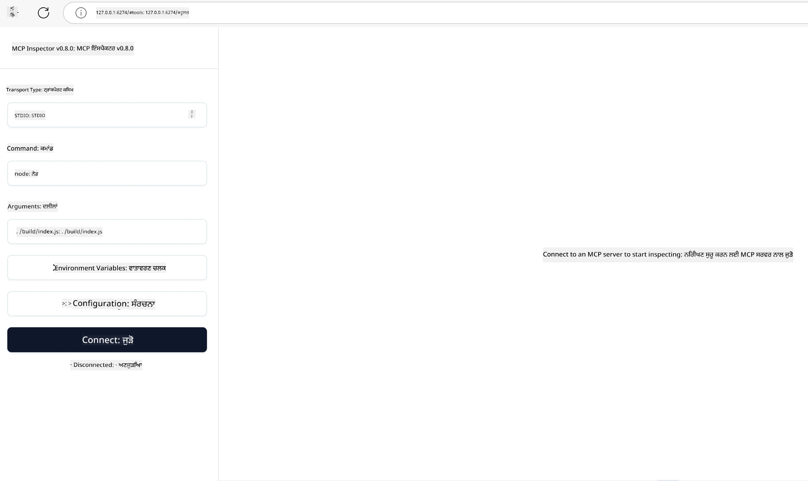

# ਵਿਹਾਰੀਕ ਕਾਰਜਨਵਾਈ

[](https://youtu.be/vCN9-mKBDfQ)

_(ਇਸ ਪਾਠ ਦੀ ਵੀਡੀਓ ਦੇਖਣ ਲਈ ਉਪਰ ਦਿੱਤੇ ਚਿੱਤਰ 'ਤੇ ਕਲਿੱਕ ਕਰੋ)_

ਵਿਹਾਰੀਕ ਕਾਰਜਨਵਾਈ ਉਹ ਜਗ੍ਹਾ ਹੈ ਜਿਥੇ ਮੋਡਲ ਕੰਟੈਕਸਟ ਪ੍ਰੋਟੋਕਾਲ (MCP) ਦੀ ਤਾਕਤ ਹਕੀਕਤ ਵਿੱਚ ਬਦਲਦੀ ਹੈ। ਜਦੋਂ ਕਿ MCP ਦੇ ਥਿਊਰੀ ਅਤੇ ਆਰਕੀਟੈਕਚਰ ਨੂੰ ਸਮਝਣਾ ਜਰੂਰੀ ਹੈ, ਅਸਲ ਮੁੱਲ ਉਸ ਸਮੇਂ ਉਭਰਦਾ ਹੈ ਜਦੋਂ ਤੁਸੀਂ ਇਸ ਵਿਚਾਰਧਾਰਾ ਨੂੰ ਵਰਤਕੇ ਹਾਲਾਤਾਂ ਦਾ ਹੱਲ ਕਰਨ ਵਾਲੇ ਹੱਲ ਬਣਾਉਂਦੇ, ਟੈਸਟ ਕਰਦੇ ਅਤੇ ਡਿਪਲੌਇ ਕਰਦੇ ਹੋ। ਇਹ ਅਧਿਆਇ ਸੰਕਲਪਾਤਮਕ ਗਿਆਨ ਅਤੇ ਹਥੌੜੀਬਾਜ਼ੀ ਵਿਕਾਸ ਵਿਚਕਾਰ ਪੁਲ ਵਜੋਂ ਕੰਮ ਕਰਦਾ ਹੈ, ਜੋ ਤੁਹਾਨੂੰ MCP-ਆਧਾਰਿਤ ਐਪਲੀਕੇਸ਼ਨਾਂ ਨੂੰ ਜਿਊਂਦਾ ਕਰਨ ਦੀ ਪ੍ਰਕਿਰਿਆ ਵਿੱਚ ਮਾਰਗਦਰਸ਼ਨ ਦਿੰਦਾ ਹੈ।

ਚਾਹੇ ਤੁਸੀਂ ਬੁੱਧਿਮਾਨ ਸਹਾਇਕ ਵਿਕਸਤ ਕਰ ਰਹੇ ਹੋ, ਕਾਰੋਬਾਰੀ ਵਰਕਫਲੋਅਜ਼ ਵਿੱਚ AI ਨੂੰ ਜੋੜ ਰਹੇ ਹੋ ਜਾਂ ਡੇਟਾ ਪ੍ਰੋਸੈਸਿੰਗ ਲਈ ਕੁਸਟਮ ਟੂਲ ਬਣਾ ਰਹੇ ਹੋ, MCP ਇੱਕ ਲਚਕੀਲਾ ਬੁਨਿਆਦ ਪ੍ਰਦਾਨ ਕਰਦਾ ਹੈ। ਇਸ ਦੀ ਭਾਸ਼ਾ-ਅਗностਿਕ ਡਿਜ਼ਾਈਨ ਅਤੇ ਪ੍ਰਸਿੱਧ ਪ੍ਰੋਗ੍ਰਾਮਿੰਗ ਭਾਸ਼ਾਵਾਂ ਲਈ ਅਧਿਕਾਰਤ SDK ਇਸਨੂੰ ਵੱਡੇ ਵਿਕਾਸਕਾਰਾਂ ਲਈ ਸੌਖਾ ਬਣਾ ਦਿੰਦੇ ਹਨ। ਇਹਨਾਂ SDKs ਦੀ ਵਰਤੋਂ ਕਰਕੇ, ਤੁਸੀਂ ਵੱਖ-ਵੱਖ ਪਲੇਟਫਾਰਮਾਂ ਅਤੇ ਵਾਤਾਵਰਣਾਂ 'ਤੇ ਤੇਜ਼ੀ ਨਾਲ ਪ੍ਰੋਟੋਟਾਈਪ, ਦੁਹਰਾਅ ਅਤੇ ਸਕੇਲ ਕਰ ਸਕਦੇ ਹੋ।

ਹੇਠਾਂ ਦਿੱਤੀਆਂ ਸੈਕਸ਼ਨਾਂ ਵਿੱਚ ਤੁਹਾਨੂੰ ਵਿਹਾਰੀਕ ਉਦਾਹਰਣ, ਨਮੂਨਾ ਕੋਡ ਅਤੇ ਡਿਪਲੌਇਮੈਂਟ ਰਣਨੀਤੀਆਂ ਮਿਲਣਗੀਆਂ ਜੋ ਦਿਖਾਉਂਦੀਆਂ ਹਨ ਕਿ ਕਿਵੇਂ C#, ਜਾਵਾ ਸਪ੍ਰਿੰਗ ਨਾਲ, ਟਾਈਪਸਕ੍ਰਿਪਟ, ਜਾਵਾਸਕ੍ਰਿਪਟ ਅਤੇ ਪਾਇਥਨ ਵਿੱਚ MCP ਨੂੰ ਲਾਗੂ ਕੀਤਾ ਜਾਂਦਾ ਹੈ। ਤੁਸੀਂ ਇਹ ਵੀ ਸਿੱਖੋਗੇ ਕਿ MCP ਸਰਵਰਾਂ ਨੂੰ ਕਿਵੇਂ ਡਿਬੱਗ ਅਤੇ ਟੈਸਟ ਕਰਨਾ ਹੈ, APIs ਨੂੰ ਕਿਵੇਂ ਪ੍ਰਬੰਧਿਤ ਕਰਨਾ ਹੈ, ਅਤੇ ਅਜ਼ੂਰ ਦੀ ਵਰਤੋਂ ਕਰਕੇ ਹੱਲਾਂ ਨੂੰ ਕਲਾਊਡ ਵਿੱਚ ਕਿਵੇਂ ਡਿਪਲੌਇ ਕਰਨਾ ਹੈ। ਇਹ ਹਥੌੜੀ ਸਾਧਨ ਤੁਹਾਡੇ ਸਿੱਖਣ ਦੀ ਗਤੀ ਨੂੰ ਤੇਜ਼ ਕਰਨ ਅਤੇ ਤੁਹਾਨੂੰ ਮਜ਼ਬੂਤ, ਪ੍ਰੋਡਕਸ਼ਨ-ਤਯਾਰ MCP ਐਪਲੀਕੇਸ਼ਨਾਂ ਨੂੰ ਆਤਮਵਿਸ਼ਵਾਸ ਨਾਲ ਬਣਾਉਣ ਵਿੱਚ ਮਦਦ ਕਰਨ ਲਈ ਡਿਜ਼ਾਇਨ ਕੀਤੇ ਗਏ ਹਨ।

## ਝਲਕ

ਇਸ ਪਾਠ ਦਾ ਧਿਆਨ MCP ਕਾਰਜਨਵਾਈ ਦੇ ਵਿਹਾਰੀਕ ਪਹਿਲੂਆਂ 'ਤੇ ਹੈ ਜੋ ਅਨੇਕ ਪ੍ਰੋਗ੍ਰਾਮਿੰਗ ਭਾਸ਼ਾਵਾਂ ਵਿੱਚ ਹੈ। ਅਸੀਂ ਵੇਖਾਂਗੇ ਕਿ ਕਿਵੇਂ MCP SDKs ਦੀ ਵਰਤੋਂ ਕਰਕੇ C#, ਜਾਵਾ ਸਪ੍ਰਿੰਗ ਨਾਲ, ਟਾਈਪਸਕ੍ਰਿਪਟ, ਜਾਵਾਸਕ੍ਰਿਪਟ ਅਤੇ ਪਾਇਥਨ ਵਿੱਚ ਮਜ਼ਬੂਤ ਐਪਲੀਕੇਸ਼ਨਾਂ ਦਾ ਨਿਰਮਾਣ, MCP ਸਰਵਰਾਂ ਦਾ ਡਿਬੱਗ ਅਤੇ ਟੈਸਟ ਕਰਨ ਅਤੇ ਦੁਬਾਰਾ ਵਰਤਣਯੋਗ ਸਰੋਤ, ਪ੍ਰਾਂਪਟ ਅਤੇ ਟੂਲ ਬਣਾਉਣੀ ਹੈ।

## ਸਿੱਖਣ ਦੇ ਲਕੜੇ

ਇਸ ਪਾਠ ਦੇ ਅੰਤ ਤੱਕ, ਤੁਸੀਂ ਸਮਰੱਥ ਹੋਵੋਗੇ:

- ਵੱਖ-ਵੱਖ ਪ੍ਰੋਗ੍ਰਾਮਿੰਗ ਭਾਸ਼ਾਵਾਂ ਵਿੱਚ ਅਧਿਕਾਰਤ SDKs ਦੀ ਵਰਤੋਂ ਕਰਕੇ MCP ਹੱਲ ਲਾਗੂ ਕਰਨਾ
- MCP ਸਰਵਰਾਂ ਨੂੰ ਵਿਧਾਨਿਕ ਢੰਗ ਨਾਲ ਡਿਬੱਗ ਅਤੇ ਟੈਸਟ ਕਰਨਾ
- ਸਰਵਰ ਫੀਚਰਾਂ (ਸਰੋਤ, ਪ੍ਰਾਂਪਟ, ਅਤੇ ਟੂਲ) ਬਣਾਉਣਾ ਅਤੇ ਵਰਤਣਾ
- ਜਟਿਲ ਕੰਮਾਂ ਲਈ ਪ੍ਰਭਾਵਸ਼ਾਲੀ MCP ਵਰਕਫਲੋਅਜ਼ ਤਿਆਰ ਕਰਨਾ
- ਪ੍ਰਦਰਸ਼ਨ ਅਤੇ ਭਰੋਸੇਯੋਗਤਾ ਲਈ MCP ਕਾਰਜਨਵਾਈਆਂ ਦਾ ਅਪਟੀਮਾਈਜ਼ੇਸ਼ਨ

## ਅਧਿਕਾਰਤ SDK ਸਰੋਤ

ਮੋਡਲ ਕੰਟੈਕਸਟ ਪ੍ਰੋਟੋਕਾਲ ਕਈ ਭਾਸ਼ਾਵਾਂ ਲਈ ਅਧਿਕਾਰਤ SDKs ਪ੍ਰਦਾਨ ਕਰਦਾ ਹੈ (ਜੋ [MCP ਨਿਰਦੇਸ਼ 2025-11-25](https://spec.modelcontextprotocol.io/specification/2025-11-25/) ਨਾਲ ਅਨੁਕੂਲ ਹਨ):

- [C# SDK](https://github.com/modelcontextprotocol/csharp-sdk)
- [ਜ਼ਾਵਾ ਸਪ੍ਰਿੰਗ SDK](https://github.com/modelcontextprotocol/java-sdk) **ਟਿੱਪਣੀ:** ਇਸ ਲਈ [Project Reactor](https://projectreactor.io) 'ਤੇ ਨਿਰਭਰਤਾ ਲੋੜੀਂਦੀ ਹੈ। (ਦੇਖੋ [ਚਰਚਾ ਮੁੱਦਾ 246](https://github.com/orgs/modelcontextprotocol/discussions/246).)
- [ਟਾਈਪਸਕ੍ਰਿਪਟ SDK](https://github.com/modelcontextprotocol/typescript-sdk)
- [ਪਾਇਥਨ SDK](https://github.com/modelcontextprotocol/python-sdk)
- [ਕੋਟਲਿਨ SDK](https://github.com/modelcontextprotocol/kotlin-sdk)
- [ਗੋ SDK](https://github.com/modelcontextprotocol/go-sdk)

## MCP SDKs ਨਾਲ ਕੰਮ ਕਰਨਾ

ਇਸ ਸੈਕਸ਼ਨ ਵਿੱਚ ਤੁਹਾਨੂੰ ਕਈ ਪ੍ਰੋਗ੍ਰਾਮਿੰਗ ਭਾਸ਼ਾਵਾਂ ਵਿੱਚ MCP ਲਾਗੂ ਕਰਨ ਦੀ ਵਿਹਾਰੀਕ ਉਦਾਹਰਣਾਂ ਮਿਲਣਗੀਆਂ। ਤੁਸੀਂ ਨਮੂਨਾ ਕੋਡ 'samples' ਡਾਇਰੈਕਟਰੀ ਵਿੱਚ ਭਾਸ਼ਾ ਅਨੁਸਾਰ ਸੰਗਠਿਤ ਪਾ ਸਕਦੇ ਹੋ।

### ਉਪਲਬਧ ਨਮੂਨੇ

ਰੇਪੋਜ਼ਟਰੀ ਵਿੱਚ [ਨਮੂਨਾ ਅਮਲ](../../../04-PracticalImplementation/samples) ਹੇਠਾਂ ਦਿੱਤੀਆਂ ਭਾਸ਼ਾਵਾਂ ਵਿੱਚ ਸ਼ਾਮਲ ਹਨ:

- [C#](./samples/csharp/README.md)
- [ਜ਼ਾਵਾ ਸਪ੍ਰਿੰਗ ਨਾਲ](./samples/java/containerapp/README.md)
- [ਟਾਈਪਸਕ੍ਰਿਪਟ](./samples/typescript/README.md)
- [ਜਾਵਾਸਕ੍ਰਿਪਟ](./samples/javascript/README.md)
- [ਪਾਇਥਨ](./samples/python/README.md)

ਹਰ ਨਮੂਨਾ ਉਸ ਖਾਸ ਭਾਸ਼ਾ ਅਤੇ ਪర్యਾਵਰਨ ਲਈ ਮੁੱਖ MCP ਸੰਕਲਪਾਂ ਅਤੇ ਅਮਲ ਪੈਟਰਨ ਦਿਖਾਉਂਦਾ ਹੈ।

### ਵਿਹਾਰੀਕ ਮਾਰਗਦਰਸ਼ਕ

ਵਿਅਹਾਰੀਕ MCP ਅਮਲੀਕਰਨ ਲਈ ਵਾਧੂ ਮਾਰਗਦਰਸ਼ਕ:

- [ਪੇਜੀਨੇਸ਼ਨ ਅਤੇ ਵੱਡੇ ਨਤੀਜਾ ਸੈੱਟ](./pagination/README.md) - ਟੂਲਾਂ, ਸਰੋਤਾਂ ਅਤੇ ਵੱਡੇ ਡੇਟਾਸੇਟ ਲਈ ਕੁਰਸਰ ਆਧਾਰਿਤ ਪੇਜੀਨੇਸ਼ਨ ਸੰਭਾਲੋ

## ਕੋਰ ਸਰਵਰ ਫੀਚਰ

MCP ਸਰਵਰ ਇਨ੍ਹਾਂ ਵਿਚੋਂ ਕਿਸੇ ਵੀ ਸੰਯੋਜਨ ਨੂੰ ਲਾਗੂ ਕਰ ਸਕਦੇ ਹਨ:

### ਸਰੋਤ

ਸਰੋਤ ਵਰਤੋਂਕਾਰ ਜਾਂ AI ਮਾਡਲ ਲਈ ਪ੍ਰਸੰਗ ਅਤੇ ਡੇਟਾ ਪ੍ਰਦਾਨ ਕਰਦੇ ਹਨ:

- ਦਸਤਾਵੇਜ਼ ਰਿਪੋਜ਼ਟਰੀਜ਼
- ਗਿਆਨ ਅਧਾਰ
- ਸੰਗਠਿਤ ਡੇਟਾ ਸਰੋਤ
- ਫਾਇਲ ਸਿਸਟਮ

### ਪ੍ਰਾਂਪਟ

ਪ੍ਰਾਂਪਟ ਵਰਤੋਂਕਾਰਾਂ ਲਈ ਟੈਮਪਲੇਟ ਕੀਤੇ ਸੁਨੇਹੇ ਅਤੇ ਵਰਕਫਲੋਅਜ਼ ਹਨ:

- ਪਹਿਲਾਂ ਨਾਲ ਪਰਿਭਾਸ਼ਿਤ ਗੱਲਬਾਤ ਦੇ ਟੈਮਪਲੇਟ
- ਮਦਦਗਾਰ ਅੰਤਰਕਿਰਿਆ ਪੈਟਰਨ
- ਵਿਸ਼ੇਸ਼ਤ ਡਾਇਲੌਗ ਲਚਕਾਂ

### ਟੂਲ

ਟੂਲ AI ਮਾਡਲ ਦੇ ਚਲਾਉਣ ਵਾਲੇ ਫੰਕਸ਼ਨ ਹਨ:

- ਡੇਟਾ ਪ੍ਰੋਸੈਸਿੰਗ ਯੁਟਿਲਿਟੀਜ਼
- ਬਾਹਰੀ API ਇੰਟੀਗ੍ਰੇਸ਼ਨ
- ਹਿਸਾਬ ਅਤੇ ਕਲਕੂਲੇਸ਼ਨ ਯੋਗਤਾਵਾਂ
- ਖੋਜ ਫੰਕਸ਼ਨਾਲਿਟੀ

## ਨਮੂਨਾ ਅਮਲ: C# ਅਮਲੀਕਰਨ

ਅਧਿਕਾਰਤ C# SDK ਰੇਪੋਜ਼ਟਰੀ ਵਿੱਚ ਕਈ ਨਮੂਨਾ ਅਮਲ ਹਨ ਜੋ MCP ਦੇ ਵੱਖਰੇ ਪਹਿਰੂਆਂ ਨੂੰ ਦਰਸਾਉਂਦੇ ਹਨ:

- **ਮੂਲ MCP ਕਲਾਇੰਟ**: MCP ਕਲਾਇੰਟ ਬਣਾਉਣ ਅਤੇ ਟੂਲ ਕਾਲ ਕਰਨ ਦਾ ਸਧਾਰਣ ਉਦਾਹਰਣ
- **ਮੂਲ MCP ਸਰਵਰ**: ਬੁਨਿਆਦੀ ਟੂਲ ਰਜਿਸਟ੍ਰੇਸ਼ਨ ਨਾਲ ਨূਨਤਮ ਸਰਵਰ ਅਮਲ
- **ਉੱਨਤ MCP ਸਰਵਰ**: ਪੂਰੀ ਤਰ੍ਹਾਂ ਲਕੜੀ ਵਾਲਾ ਸਰਵਰ ਜਿਸ ਵਿੱਚ ਟੂਲ ਰਜਿਸਟ੍ਰੇਸ਼ਨ, ਪ੍ਰਮਾਣਿਕਤਾ ਅਤੇ ਗਲਤੀ ਹੈਂਡਲਿੰਗ ਹੈ
- **ASP.NET ਇੰਟਿਗ੍ਰੇਸ਼ਨ**: ASP.NET ਕੋਰ ਦੇ ਨਾਲ ਇੰਟਿਗ੍ਰੇਸ਼ਨ ਦਿਖਾਉਣ ਵਾਲੇ ਉਦਾਹਰਣ
- **ਟੂਲ ਅਮਲ ਪੈਟਰਨ**: ਵੱਖ-ਵੱਖ ਜਟਿਲਤਾ ਵਾਲੇ ਟੂਲਾਂ ਲਈ ਪੈਟਰਨ

MCP C# SDK ਪ੍ਰੀਵਿਊ ਵਿੱਚ ਹੈ ਅਤੇ APIs ਬਦਲ ਸਕਦੇ ਹਨ। ਅਸੀਂ ਇਸ ਬਲੌਗ ਨੂੰ SDK ਦੇ ਵਿਕਾਸ ਦੇ ਨਾਲ ਨਿਰੰਤਰ ਅੱਪਡੇਟ ਕਰਦੇ ਰਹਾਂਗੇ।

### ਮੁੱਖ ਫੀਚਰ

- [C# MCP ਨੁਗੈਟ ModelContextProtocol](https://www.nuget.org/packages/ModelContextProtocol)
- ਆਪਣਾ [ਪਹਿਲਾ MCP ਸਰਵਰ ਬਣਾਉਣਾ](https://devblogs.microsoft.com/dotnet/build-a-model-context-protocol-mcp-server-in-csharp/)।

ਕੰਪਲੀਟ C# ਅਮਲੀਕਰਨ ਨਮੂਨੇ ਲਈ, ਅਧਿਕਾਰਤ [C# SDK ਨਮੂਨਾ ਰੇਪੋਜ਼ਟਰੀ](https://github.com/modelcontextprotocol/csharp-sdk) ਨੂੰ ਵੇਖੋ

## ਨਮੂਨਾ ਅਮਲੀਕਰਨ: ਜਾਵਾ ਸਪ੍ਰਿੰਗ ਨਾਲ ਅਮਲੀਕਰਨ

ਜਾਵਾ ਸਪ੍ਰਿੰਗ SDK ਪ੍ਰਦਾਨ ਕਰਦਾ ਹੈ MCP ਦੇ ਪ੍ਰਮਾਣਿਤ ਤੇਜ਼ ਤਰੀਕੇ ਨਾਲ ਕਾਰੋਬਾਰੀ-ਸਤਰ ਉਪਕਰਨਾਂ ਨਾਲ ਵਿਕਾਸ ਦੇ ਵਿਕਲਪ।

### ਮੁੱਖ ਫੀਚਰ

- ਸਪ੍ਰਿੰਗ ਫਰੇਮਵਰਕ ਇੰਟਿਗ੍ਰੇਸ਼ਨ
- ਮਜ਼ਬੂਤ ਕਿਸਮ ਸੁਰੱਖਿਆ
- ਪ੍ਰਤਿਕ੍ਰਿਆਮੁਕਤ ਪ੍ਰੋਗ੍ਰਾਮਿੰਗ ਦਾ ਸਮਰਥਨ
- ਵਿਸ਼ਤ੍ਰਿਤ ਗਲਤੀ ਹੈਂਡਲਿੰਗ

ਕੰਪਲੀਟ ਜਾਵਾ ਸਪ੍ਰਿੰਗ ਅਮਲੀਕਰਨ ਨਮੂਨਾ ਲਈ, ਨਮੂਨਾਂ ਡਾਇਰੈਕਟਰੀ ਵਿੱਚ [ਜਾਵਾ ਸਪ੍ਰਿੰਗ ਨਮੂਨਾ](samples/java/containerapp/README.md) ਨੂੰ ਵੇਖੋ।

## ਨਮੂਨਾ ਅਮਲੀਕਰਨ: ਜਾਵਾਸਕ੍ਰਿਪਟ ਅਮਲੀਕਰਨ

ਜਾਵਾਸਕ੍ਰਿਪਟ SDK MCP ਅਮਲੀਕਰਨ ਲਈ ਹਲਕਾ-ਫੁਲਕਾ ਅਤੇ ਲਚਕੀਲਾ ਤਰੀਕਾ ਦਿੰਦਾ ਹੈ।

### ਮੁੱਖ ਫੀਚਰ

- Node.js ਅਤੇ ਬ੍ਰਾਊਜ਼ਰ ਸਮਰਥਨ
- ਪ੍ਰੋਮਿਸ-ਆਧਾਰਿਤ API
- Express ਅਤੇ ਹੋਰ ਫਰੇਮਵਰਕਸ ਨਾਲ ਸੌਖੀ ਇੰਟਿਗ੍ਰੇਸ਼ਨ
- ਸਟ੍ਰੀਮਿੰਗ ਲਈ WebSocket ਸਹਾਇਤਾ

ਕੰਪਲੀਟ ਜਾਵਾਸਕ੍ਰਿਪਟ ਅਮਲੀਕਰਨ ਨਮੂਨਾ ਲਈ, ਨਮੂਨਾਂ ਡਾਇਰੈਕਟਰੀ ਵਿੱਚ [ਜਾਵਾਸਕ੍ਰਿਪਟ ਨਮੂਨਾ](samples/javascript/README.md) ਨੂੰ ਵੇਖੋ।

## ਨਮੂਨਾ ਅਮਲੀਕਰਨ: ਪਾਇਥਨ ਅਮਲੀਕਰਨ

ਪਾਇਥਨ SDK MCP ਅਮਲੀਕਰਨ ਲਈ ਇੱਕ ਪਾਇਥੋਨਿਕ ਅੰਦਾਜ਼ ਪ੍ਰਦਾਨ ਕਰਦਾ ਹੈ ਜੋ ਸ਼ਾਨਦਾਰ ML ਫਰੇਮਵਰਕ ਇੰਟੀਗ੍ਰੇਸ਼ਨ ਕਰਦਾ ਹੈ।

### ਮੁੱਖ ਫੀਚਰ

- asyncio ਨਾਲ Async/await ਸਮਰਥਨ
- FastAPI ਇੰਟਿਗ੍ਰੇਸ਼ਨ
- ਸਧਾਰਣ ਟੂਲ ਰਜਿਸਟ੍ਰੇਸ਼ਨ
- ਪ੍ਰਸਿੱਧ ML ਲਾਇਬ੍ਰੇਰੀਜ਼ ਨਾਲ ਪ੍ਰਾਕ੍ਰਿਤਿਕ ਇੰਟੀਗ੍ਰੇਸ਼ਨ

ਕੰਪਲੀਟ ਪਾਇਥਨ ਅਮਲੀਕਰਨ ਨਮੂਨਾ ਲਈ, ਨਮੂਨਾਂ ਡਾਇਰੈਕਟਰੀ ਵਿੱਚ [ਪਾਇਥਨ ਨਮੂਨਾ](samples/python/README.md) ਨੂੰ ਵੇਖੋ।

## API ਪ੍ਰਬੰਧਨ

ਅਜ਼ੂਰ API ਪ੍ਰਬੰਧਨ ਇੱਕ ਸ਼ਾਨਦਾਰ ਉਤਰ ਹੈ ਕਿ ਅਸੀਂ MCP ਸਰਵਰਾਂ ਨੂੰ ਕਿਵੇਂ ਸੁਰੱਖਿਅਤ ਕਰ ਸਕਦੇ ਹਾਂ। ਖ਼ਿਆਲ ਇਹ ਹੈ ਕਿ ਆਪਣੇ MCP ਸਰਵਰ ਤੋਂ ਅੱਗੇ ਇੱਕ ਅਜ਼ੂਰ API ਪ੍ਰਬੰਧਨ ਇੰਸਟੈਂਸ ਰੱਖੋ ਅਤੇ ਇਸ ਨੂੰ ਉਹ ਫੀਚਰ ਦਿੱਤੇ ਜੋ ਤੁਸੀਂ ਚਾਹੁੰਦੇ ਹੋ ਜਿਵੇਂ:

- ਰੇਟ ਸਿਮਿਤੀ
- ਟੋਕਨ ਪ੍ਰਬੰਧਨ
- ਨਿਗਰਾਨੀ
- ਲੋਡ ਬੈਲੈਂਸਿੰਗ
- ਸੁਰੱਖਿਆ

### ਅਜ਼ੂਰ ਨਮੂਨਾ

ਇੱਥੇ ਇੱਕ ਅਜ਼ੂਰ ਨਮੂਨਾ ਹੈ ਜੋ ਬਿਲਕੁਲ ਇਹੇ ਕਰਦਾ ਹੈ, ਅਰਥਾਤ [MCP ਸਰਵਰ ਬਣਾਉਣਾ ਅਤੇ ਅਜ਼ੂਰ API ਪ੍ਰਬੰਧਨ ਨਾਲ ਸੁਰੱਖਿਅਤ ਕਰਨਾ](https://github.com/Azure-Samples/remote-mcp-apim-functions-python)।

ਹੇਠਾਂ ਦਿੱਤੀ ਚਿੱਤਰ ਵਿੱਚ ਅਧਿਕਾਰਣ ਪ੍ਰਵਾਹ ਕਿਵੇਂ ਹੁੰਦਾ ਹੈ:


ਉਪਰੋਕਤ ਚਿੱਤਰ ਵਿੱਚ, ਹੇਠਲੇ ਗੱਲਾਂ ਹੁੰਦੀਆਂ ਹਨ:

- Microsoft Entra ਦਾ ਉਪਯੋਗ ਕਰਕੇ ਪ੍ਰਮਾਣਿਕਤਾ/ਅਧਿਕਾਰਣ ਹੁੰਦਾ ਹੈ।
- ਅਜ਼ੂਰ API ਪ੍ਰਬੰਧਨ ਦਰਵਾਜ਼ੇ ਵਜੋਂ ਕੰਮ ਕਰਦਾ ਹੈ ਅਤੇ ਨੀਤੀਆਂ ਦੀ ਵਰਤੋਂ ਕਰਕੇ ਟ੍ਰੈਫਿਕ ਨਿਰਦੇਸ਼ਤ ਅਤੇ ਪ੍ਰਬੰਧਿਤ ਕਰਦਾ ਹੈ।
- ਅਜ਼ੂਰ ਮਾਨੀਟਰ ਸਾਰੇ ਬੇਨਤੀਆਂ ਨੂੰ ਅਗਲੀ ਵਿਸ਼ਲੇਸ਼ਣ ਲਈ ਲੌਗ ਕਰਦਾ ਹੈ।

#### ਅਧਿਕਾਰਣ ਪ੍ਰਵਾਹ

ਅਧਿਕਾਰਣ ਪ੍ਰਵਾਹ ਨੂੰ ਹੋਰ ਵਿਸਥਾਰ ਨਾਲ ਦੇਖੋ:


#### MCP ਅਧਿਕਾਰਣ ਨਿਰਦੇਸ਼

ਹੋਰ ਜਾਣਕਾਰੀ ਲਈ [MCP ਅਧਿਕਾਰਣ ਨਿਰਦੇਸ਼](https://spec.modelcontextprotocol.io/specification/2025-11-25/basic/authorization/) ਨੂੰ ਵੇਖੋ

## ਰਿਮੋਟ MCP ਸਰਵਰ ਨੂੰ ਅਜ਼ੂਰ 'ਤੇ ਡਿਪਲੌਇ ਕਰੋ

ਆਓ ਵੇਖੀਏ ਕਿ ਅਸੀਂ ਪਹਿਲਾਂ ਮੰਨਿਆ ਨਮੂਨਾ ਕਿਵੇਂ ਡਿਪਲੌਇ ਕਰ ਸਕਦੇ ਹਾਂ:

1. ਰੇਪੋ ਕਲੋਨ ਕਰੋ

    ```bash
    git clone https://github.com/Azure-Samples/remote-mcp-apim-functions-python.git
    cd remote-mcp-apim-functions-python
    ```

1. `Microsoft.App` ਸਰੋਤ ਪ੍ਰਦਾਤਾ ਨੂੰ ਰਜਿਸਟਰ ਕਰੋ।

   - ਜੇ ਤੁਸੀਂ ਅਜ਼ੂਰ CLI ਦੀ ਵਰਤੋਂ ਕਰ ਰਹੇ ਹੋ, ਤਾਂ ਚਲਾਓ `az provider register --namespace Microsoft.App --wait`.
   - ਜੇ ਤੁਸੀਂ ਅਜ਼ੂਰ ਪਾਵਰਸ਼ੈਲ ਦੀ ਵਰਤੋਂ ਕਰ ਰਹੇ ਹੋ, ਤਾਂ ਚਲਾਓ `Register-AzResourceProvider -ProviderNamespace Microsoft.App`. ਫਿਰ ਕੁਝ ਸਮੇਂ ਬਾਅਦ ਚਲਾਓ `(Get-AzResourceProvider -ProviderNamespace Microsoft.App).RegistrationState` ਇਹ ਦੇਖਣ ਲਈ ਕਿ ਰਜਿਸਟ੍ਰੇਸ਼ਨ ਪੂਰੀ ਹੋਈ ਹੈ ਜਾਂ ਨਹੀਂ।

1. ਇਹ [azd](https://aka.ms/azd) ਕਮਾਂਡ ਚਲਾਓ ਜੋ API ਪ੍ਰਬੰਧਨ ਸੇਵਾ, ਫੰਕਸ਼ਨ ਐਪ (ਕੋਡ ਨਾਲ) ਅਤੇ ਸਾਰੇ ਹੋਰ ਲੋੜੀਂਦੇ ਅਜ਼ੂਰ ਸਰੋਤ ਪ੍ਰਦਾਨ ਕਰਦਾ ਹੈ

    ```shell
    azd up
    ```

    ਇਹ ਕਮਾਂਡ ਅਜ਼ੂਰ 'ਤੇ ਸਾਰੇ ਕਲਾਊਡ ਸਰੋਤ ਡਿਪਲੌਇ ਕਰੇਗੀ

### MCP ਇੰਸਪੈਕਟਰ ਨਾਲ ਆਪਣੇ ਸਰਵਰ ਦੀ ਟੈਸਟਿੰਗ

1. ਇੱਕ **ਨਵੇਂ ਟਰਮੀਨਲ ਵਿੰਡੋ** ਵਿਚ MCP ਇੰਸਪੈਕਟਰ ਨੂੰ ਇੰਸਟਾਲ ਅਤੇ ਚਲਾਓ

    ```shell
    npx @modelcontextprotocol/inspector
    ```

    ਤੁਹਾਨੂੰ ਇਸ ਵਰਗਾ ਇੰਟਰਫੇਸ ਦਿਖਾਈ ਦੇਣਾ ਚਾਹੀਦਾ ਹੈ:

    

1. ਕਨਟਰੋਲ ਕਲਿੱਕ ਕਰੋ ਅਤੇ ਐਪ ਦੁਆਰਾ ਪ੍ਰਦਾਨ ਕੀਤੇ URL ਤੋਂ MCP ਇੰਸਪੈਕਟਰ ਵੈੱਬ ਐਪ ਲੋਡ ਕਰੋ (ਜਿਵੇਂ [http://127.0.0.1:6274/#resources](http://127.0.0.1:6274/#resources))
1. ਟਰਾਂਸਪੋਰਟ ਕਿਸਮ ਨੂੰ `SSE` 'ਤੇ ਸੈੱਟ ਕਰੋ
1. ਆਪਣੇ ਚੱਲ ਰਹੇ API ਪ੍ਰਬੰਧਨ SSE ਐਂਡਪੁਆਇੰਟ (ਜੋ `azd up` ਦੇ ਬਾਅਦ ਦਿਖਾਇਆ ਗਿਆ ਹੈ) ਦਾ URL ਸੈੱਟ ਕਰੋ ਅਤੇ **ਜੁੜੋ**:

    ```shell
    https://<apim-servicename-from-azd-output>.azure-api.net/mcp/sse
    ```

1. **ਟੂਲਾਂ ਦੀ ਸੂਚੀ** ਦਿੱਸੇਗੀ। ਕਿਸੇ ਟੂਲ 'ਤੇ ਕਲਿੱਕ ਕਰੋ ਅਤੇ **ਟੂਲ ਚਲਾਓ**।

ਜੇ ਸਾਰੇ ਕਦਮ ਸਹੀ ਹੋਏ ਤਾਂ ਤੁਸੀਂ ਹੁਣ MCP ਸਰਵਰ ਨਾਲ ਜੁੜ ਗਏ ਹੋ ਅਤੇ ਤੁਸੀਂ ਟੂਲ ਕਾਲ ਕਰ ਚੁੱਕੇ ਹੋ।

## ਅਜ਼ੂਰ ਲਈ MCP ਸਰਵਰ

[Remote-mcp-functions](https://github.com/Azure-Samples/remote-mcp-functions-dotnet): ਇਹ ਰੇਪੋਜ਼ਟਰੀਆਂ ਦਾ ਸੈੱਟ ਤੇਜ਼ ਰਫਤਾਰ ਵਰਤੋਂ ਲਈ ਮਾਡਲ ਕੰਟੈਕਸਟ ਪ੍ਰੋਟੋਕਾਲ (MCP) ਸਰਵਰਾਂ ਨੂੰ ਅਜ਼ੂਰ ਫੰਕਸ਼ਨਸ ਨਾਲ Python, C# .NET ਜਾਂ Node/TypeScript ਵਿੱਚ ਬਣਾਉਣ ਅਤੇ ਡਿਪਲੌਇ ਕਰਨ ਲਈ ਤੇਜ਼ਸ਼ੁਰੂਆਤ ਟੈਮਪਲੇਟ ਹਨ।

ਨਮੂਨਾਂ ਇੱਕ ਪੂਰੀ ਸਮਾਧਾਨ ਪ੍ਰਦਾਨ ਕਰਦੇ ਹਨ ਜੋ ਵਿਕਾਸਕਾਰਾਂ ਨੂੰ ਯੋਗ ਬਣਾਉਂਦਾ ਹੈ:

- ਲੋਕਲ ਤੌਰ 'ਤੇ ਬਣਾਵਟ ਅਤੇ ਚਲਾਉ: ਲੋਕਲ ਮਸ਼ੀਨ 'ਤੇ MCP ਸਰਵਰ ਦਾ ਵਿਕਾਸ ਅਤੇ ਡਿਬੱਗਿੰਗ ਕਰੋ
- ਅਜ਼ੂਰ 'ਤੇ ਡਿਪਲੌਇ: ਅਜ਼ੂਰ ਵਿੱਚ ਆਸਾਨੀ ਨਾਲ ਡਿਪਲੌਇ ਕਰੋ ਸਿਰਫ ਇੱਕ azd up ਕਮਾਂਡ ਨਾਲ
- ਕਲਾਇੰਟਾਂ ਤੋਂ ਕਨੈਕਟ ਕਰੋ: ਵੱਖ-ਵੱਖ ਕਲਾਇੰਟਾਂੋਂ MCP ਸਰਵਰ ਨਾਲ ਜੁੜੋ, ਜਿਵੇਂ VS ਕੋਡ ਦਾ ਕੋਪਾਇਲਟ ਏਜੇਂਟ ਮੋਡ ਅਤੇ MCP ਇੰਸਪੈਕਟਰ ਟੂਲ

### ਮੁੱਖ ਫੀਚਰ

- ਡਿਜ਼ਾਈਨ ਵੱਲੋਂ ਸੁਰੱਖਿਆ: MCP ਸਰਵਰ ਕੁੰਜੀਆਂ ਅਤੇ HTTPS ਦੀ ਵਰਤੋਂ ਕਰਕੇ ਸੁਰੱਖਿਅਤ ਹੈ
- ਪ੍ਰਮਾਣਿਕਤਾ ਵਿਕਲਪ: ਬਿਲਟ-ਇਨ ਅਥ ਅਤੇ/ਜਾਂ API ਪ੍ਰਬੰਧਨ ਨਾਲ OAuth ਦਾ ਸਮਰਥਨ
- ਨੈੱਟਵਰਕ ਇਕਲੋਤਾ: ਅਜ਼ੂਰ ਵਰਚੁਅਲ ਨੈੱਟਵਰਕਸ (VNET) ਦੀ ਵਰਤੋਂ ਨਾਲ ਨੈੱਟਵਰਕ ਇਕਲੌਤਾ ਪ੍ਰਦਾਨ ਕਰਦਾ ਹੈ
- ਸਰਵਰ-ਰਹਿਤ ਆਰਕੀਟੈਕਚਰ: ਸਕੇਲਯੋਗ ਅਤੇ ਘਟਨਾ-ਚਾਲਿਤ ਅਮਲੀਕਰਨ ਲਈ ਅਜ਼ੂਰ ਫੰਕਸ਼ਨਸ ਦੀ ਵਰਤੋਂ ਕਰਦਾ ਹੈ
- ਲੋਕਲ ਵਿਕਾਸ: ਵਿਸਤ੍ਰਿਤ ਲੋਕਲ ਵਿਕਾਸ ਅਤੇ ਡਿਬੱਗਿੰਗ ਸਮਰਥਨ
- ਸਧਾਰਣ ਡਿਪਲੌਇਮੈਂਟ: ਅਜ਼ੂਰ ਲਈ ਸਰਲ ਡਿਪਲੌਇਮੈਂਟ ਪ੍ਰਕਿਰਿਆ

ਰੇਪੋਜ਼ਟਰੀ ਵਿੱਚ ਸਾਰੇ ਜਰੂਰੀ ਕਾਨਫਿਗਰੇਸ਼ਨ ਫਾਇਲਾਂ, ਸਰੋਤ ਕੋਡ ਅਤੇ ਢਾਂਚਾਗਤ ਪਰਿਭਾਸ਼ਾਂ ਹਨ ਜੋ ਤੁਹਾਨੂੰ ਉਤਪਾਦਨ-ਤਿਆਰ MCP ਸਰਵਰ ਅਮਲੀਕਰਨ ਨਾਲ ਤੇਜ਼ੀ ਨਾਲ ਸ਼ੁਰੂ ਕਰਨ ਲਈ ਮਦਦਕਾਰੀ ਹਨ।

- [Azur ਰਿਮੋਟ MCP ਫੰਕਸ਼ਨਸ Python](https://github.com/Azure-Samples/remote-mcp-functions-python) - Python ਨਾਲ ਅਜ਼ੂਰ ਫੰਕਸ਼ਨਸ ਦੀ ਵਰਤੋਂ ਕਰਕੇ MCP ਦਾ ਨਮੂਨਾ ਅਮਲੀਕਰਨ

- [Azur ਰਿਮੋਟ MCP ਫੰਕਸ਼ਨਸ .NET](https://github.com/Azure-Samples/remote-mcp-functions-dotnet) - C# .NET ਨਾਲ ਅਜ਼ੂਰ ਫੰਕਸ਼ਨਸ ਦੀ ਵਰਤੋਂ ਕਰਕੇ MCP ਦਾ ਨਮੂਨਾ ਅਮਲੀਕਰਨ

- [Azur ਰਿਮੋਟ MCP ਫੰਕਸ਼ਨਸ Node/Typescript](https://github.com/Azure-Samples/remote-mcp-functions-typescript) - Node/TypeScript ਨਾਲ ਅਜ਼ੂਰ ਫੰਕਸ਼ਨਸ ਦੀ ਵਰਤੋਂ ਕਰਕੇ MCP ਦਾ ਨਮੂਨਾ ਅਮਲੀਕਰਨ।

## ਮੁੱਖ ਸਿੱਖਣ ਵਾਲੀਆਂ ਗੱਲਾਂ

- MCP SDKs ਭਾਸ਼ਾ-ਸਪੈਸ਼ਲ ਟੂਲ ਪ੍ਰਦਾਨ ਕਰਦੇ ਹਨ ਜੋ ਮਜ਼ਬੂਤ MCP ਹੱਲ ਲਾਗੂ ਕਰਨ ਵਿੱਚ ਸਹਾਇਕ ਹਨ
- ਡਿਬੱਗ ਅਤੇ ਟੈਸਟ ਦੀ ਪ੍ਰਕਿਰਿਆ ਭਰੋਸੇਯੋਗ MCP ਐਪਲੀਕੇਸ਼ਨਾਂ ਲਈ ਬਹੁਤ ਜਰੂਰੀ ਹੈ
- ਦੁਬਾਰਾ ਵਰਤਣ-ਯੋਗ ਪ੍ਰਾਂਪਟ ਟੈਮਪਲੇਟ ਸਥਿਰ AI ਅੰਤਰਕਿਰਿਆ ਨੂੰ ਯਕੀਨੀ ਬਣਾਉਂਦੇ ਹਨ
- ਚੰਗੀ ਤਰ੍ਹਾਂ ਡਿਜ਼ਾਈਨ ਕੀਤੇ ਵਰਕਫਲੋਅਜ਼ ਕਈ ਟੂਲਾਂ ਦੀ ਵਰਤੋਂ ਕਰਕੇ ਜਟਿਲ ਕਾਰਜਾਂ ਦਾ ਆਯੋਜਨ ਕਰ ਸਕਦੇ ਹਨ
- MCP ਹੱਲ ਲਾਗੂ ਕਰਨ ਸਮੇਂ ਸੁਰੱਖਿਆ, ਪ੍ਰਦਰਸ਼ਨ ਅਤੇ ਗਲਤੀ ਪ੍ਰਬੰਧਨ ਦਾ ਧਿਆਨ ਰੱਖਣਾ ਜਰੂਰੀ ਹੈ

## ਅਭਿਆਸ

ਆਪਣੇ ਖੇਤਰ ਵਿੱਚ ਕਿਸੇ ਅਸਲੀ ਸਮੱਸਿਆ ਦਾ ਹੱਲ ਕਰਨ ਲਈ ਇੱਕ ਵਿਹਾਰੀਕ MCP ਵਰਕਫਲੋਅ ਡਿਜ਼ਾਇਨ ਕਰੋ:

1. 3-4 ਟੂਲਾਂ ਦੀ ਪਛਾਣ ਕਰੋ ਜੋ ਇਸ ਸਮੱਸਿਆ ਦਾ ਹੱਲ ਕਰਨ ਲਈ ਲਾਹੇਵੰਦ ਹੋਣ
2. ਇਕ ਵਰਕਫਲੋਅ ਚਿੱਤਰ ਬਣਾਓ ਜੋ ਦਿਖਾਉਂਦਾ ਹੈ ਕਿ ਇਹ ਟੂਲ ਕਿਵੇਂ ਆਪਸ ਵਿੱਚ ਇੰਟਰਐਕਟ ਕਰਦੇ ਹਨ
3. ਆਪਣੇ ਪਸੰਦੀਦਾ ਭਾਸ਼ਾ ਵਰਤਕੇ ਇੱਕ ਟੂਲ ਦਾ ਮੂਲ ਸੰਸਕਰਨ ਬਣਾਓ
4. ਇੱਕ ਪ੍ਰਾਂਪਟ ਟੈਮਪਲੇਟ ਬਣਾਓ ਜੋ ਮਾਡਲ ਨੂੰ ਤੁਹਾਡੇ ਟੂਲ ਦੀ ਪ੍ਰਭਾਵਸ਼ਾਲੀ ਵਰਤੋਂ ਵਿੱਚ ਮਦਦ ਕਰੇ

## ਵਾਧੂ ਸਰੋਤ

---

## ਅਗਲਾ ਕੀ ਹੈ

ਅਗਲਾ: [ਉੱਨਤ ਵਿਸ਼ੇ](../05-AdvancedTopics/README.md)

---

<!-- CO-OP TRANSLATOR DISCLAIMER START -->
**ਅਸਵੀਕਾਰਤਾ**:  
ਇਹ ਦਸਤਾਵੇਜ਼ AI ਅਨੁਵਾਦ ਸੇਵਾ [Co-op Translator](https://github.com/Azure/co-op-translator) ਦੀ ਵਰਤੋਂ ਕਰਕੇ ਅਨੁਵਾਦ ਕੀਤਾ ਗਿਆ ਹੈ। ਜਦੋਂ ਕਿ ਅਸੀਂ ਸਹੀਅਤ ਦੀ ਕੋਸ਼ਿਸ਼ ਕਰਦੇ ਹਾਂ, ਕਿਰਪਾ ਕਰਕੇ ਧਿਆਨ ਵਿੱਚ ਰੱਖੋ ਕਿ ਆਟੋਮੇਟਿਕ ਅਨੁਵਾਦਾਂ ਵਿੱਚ ਗਲਤੀਆਂ ਜਾਂ ਅਸਤੀਰਤਾਵਾਂ ਹੋ ਸਕਦੀਆਂ ਹਨ। ਮੂਲ ਦਸਤਾਵੇਜ਼ ਆਪਣੇ ਮੂਲ ਭਾਸ਼ਾ ਵਿੱਚ ਅਧਿਕਾਰਕ ਸਰੋਤ ਮੰਨਿਆ ਜਾਣਾ ਚਾਹੀਦਾ ਹੈ। ਮਹੱਤਵਪੂਰਣ ਜਾਣਕਾਰੀ ਲਈ, ਵਿਸ਼ੇਸ਼ਜ್ಞ ਮਨੁੱਖੀ ਅਨੁਵਾਦ ਦੀ ਸਿਫ਼ਾਰਿਸ਼ ਕੀਤੀ ਜਾਂਦੀ ਹੈ। ਅਸੀਂ ਇਸ ਅਨੁਵਾਦ ਦੀ ਵਰਤੋਂ ਨਾਲ ਹੋਣ ਵਾਲੀਆਂ ਕਿਸੇ ਵੀ ਗਲਤਫਹਿਮੀਆਂ ਜਾਂ ਗਲਤ ਵਿਅਾਖਿਆਵਾਂ ਲਈ ਜ਼ਿੰਮੇਵਾਰ ਨਹੀਂ ਹਾਂ।
<!-- CO-OP TRANSLATOR DISCLAIMER END -->