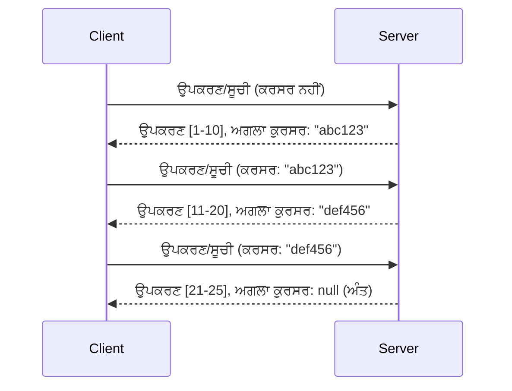

# MCP ਵਿੱਚ ਪੇਜਿਨੇਸ਼ਨ ਅਤੇ ਵੱਡੇ ਨਤੀਜੇ ਸੈੱਟ

ਜਦੋਂ ਤੁਹਾਡਾ MCP ਸਰਵਰ ਵੱਡੇ ਡੇਟਾ ਸੈੱਟਾਂ ਨੂੰ ਸੰਭਾਲਦਾ ਹੈ - ਚਾਹੇ ਉਹ ਹਜ਼ਾਰਾਂ ਫਾਇਲਾਂ ਦੀ ਲਿਸਟਿੰਗ ਹੋਵੇ, ਡੇਟਾਬੇਸ ਰਿਕਾਰਡ ਹੋਣ ਜਾਂ ਖੋਜ ਨਤੀਜੇ - ਤੁਹਾਨੂੰ ਸਮਰਥਤ ਮੈਮੋਰੀ ਪ੍ਰਬੰਧਨ ਅਤੇ ਤੁਰੰਤ ਯੂਜ਼ਰ ਅਨੁਭਵ ਪ੍ਰਦਾਨ ਕਰਨ ਲਈ ਪੇਜਿਨੇਸ਼ਨ ਦੀ ਲੋੜ ਹੁੰਦੀ ਹੈ। ਇਹ ਗਾਈਡ MCP ਵਿੱਚ ਪੇਜਿਨੇਸ਼ਨ ਦੇ ਕਿਸੇ ਤਰੀਕੇ ਨੂੰ ਲਾਗੂ ਕਰਨ ਅਤੇ ਇਸ ਦਾ ਉਪਯੋਗ ਕਰਨ ਬਾਰੇ ਹੈ।

## ਪੇਜਿਨੇਸ਼ਨ ਦਾ ਮਹੱਤਵ ਕਿਉਂ ਹੈ

ਪੇਜਿਨੇਸ਼ਨ ਦੇ ਬਿਨਾਂ ਵੱਡੇ ਜਵਾਬ ਕਾਰਨ ਹੋ ਸਕਦੇ ਹਨ:

- **ਮੇਮੋਰੀ ਖਤਮ ਹੋ ਜਾਣਾ** - ਇੱਕ ਵਾਰੀ ਵਿੱਚ ਮਿਲੀਅਨ ਰਿਕਾਰਡਾਂ ਨੂੰ ਲੋਡ ਕਰਨਾ
- **ਧੀਮੀ ਪ੍ਰਤੀਕਿਰਿਆ ਸਮਾਂ** - ਸਾਰੇ ਡੇਟਾ ਲੋਡ ਹੋਣ ਤੱਕ ਉਪਭੋਗਤਾ ਉਡੀਕ ਕਰਦੇ ਹਨ
- **ਟਾਈਮਆਉਟ ਗਲਤੀਆਂ** - ਬੇਨਤੀਆਂ ਟਾਈਮਆਉਟ ਸੀਮਾਵਾਂ ਤੋਂ ਵੱਧ ਚੱਲਦੀਆਂ ਹਨ
- **ਖਰਾਬ AI ਕਾਰਗੁਜ਼ਾਰੀ** - LLM ਵੱਡੇ ਸੰਦਰਭ ਨਾਲ ਸੰਘਰਸ਼ ਕਰਦੇ ਹਨ

MCP ਵਿਸ਼ਵਾਸਯੋਗ ਅਤੇ ਸਥਿਰ ਨਤੀਜੇ ਸੈੱਟਾਂ ਵਿੱਚ ਪੇਜਿੰਗ ਲਈ **ਕਰਸਰ-ਆਧਾਰਿਤ ਪੇਜਿਨੇਸ਼ਨ** ਵਰਤਦਾ ਹੈ।

---

## MCP ਪੇਜਿਨੇਸ਼ਨ ਕਿਵੇਂ ਕੰਮ ਕਰਦਾ ਹੈ

### ਕਰਸਰ ਸੰਕਲਪ

ਇੱਕ **ਕਰਸਰ** ਇੱਕ ਅਪਾਰਦਰਸ਼ੀ ਸਤਰ ਹੈ ਜੋ ਨਤੀਜੇ ਸੈੱਟ ਵਿੱਚ ਤੁਹਾਡੇ ਸਥਾਨ ਨੂੰ ਦਰਸਾਉਂਦਾ ਹੈ। ਇਸਨੂੰ ਤੁਸੀਂ ਇੱਕ ਲੰਬੀ ਕਿਤਾਬ ਵਿੱਚ ਬੁੱਕਮਾਰਕ ਵਾਂਗ ਸੋਚੋ।



### MCP ਵਿਧੀਆਂ ਵਿੱਚ ਪੇਜਿਨੇਸ਼ਨ

ਇਹ MCP ਵਿਧੀਆਂ ਪੇਜਿਨੇਸ਼ਨ ਦਾ ਸਮਰਥਨ ਕਰਦੀਆਂ ਹਨ:

| ਵਿਧੀ | ਵਾਪਸੀ | ਕਰਸਰ ਸਮਰਥਨ |
|--------|---------|----------------|
| `tools/list` | ਟੂਲ ਪਰਿਭਾਸ਼ਾਵਾਂ | ✅ |
| `resources/list` | ਸਰੋਤ ਪਰਿਭਾਸ਼ਾਵਾਂ | ✅ |
| `prompts/list` | ਪ੍ਰੋਮਪਟ ਪਰਿਭਾਸ਼ਾਵਾਂ | ✅ |
| `resources/templates/list` | ਸਰੋਤ ਟੈਂਪਲੇਟ | ✅ |

---

## ਸਰਵਰ ਲਾਗੂਕਰਨ

### ਪਾਇਥਨ (FastMCP)

```python
from mcp.server import Server
from mcp.types import Tool, ListToolsResult
import math

app = Server("paginated-server")

# ਨਕਲ ਕੀਤਾ ਵੱਡਾ ਡੇਟਾਸੈੱਟ
ALL_TOOLS = [
    Tool(name=f"tool_{i}", description=f"Tool number {i}", inputSchema={})
    for i in range(100)
]

PAGE_SIZE = 10

@app.list_tools()
async def list_tools(cursor: str | None = None) -> ListToolsResult:
    """List tools with pagination support."""
    
    # ਸ਼ੁਰੂਆਤੀ ਸੂਚਕ ਨੂੰ ਪ੍ਰਾਪਤ ਕਰਨ ਲਈ ਕਰਸਰ ਡਿਕੋਡ ਕਰੋ
    start_index = 0
    if cursor:
        try:
            start_index = int(cursor)
        except ValueError:
            start_index = 0
    
    # ਨਤੀਜਿਆਂ ਦਾ ਸਫ਼ਾ ਪ੍ਰਾਪਤ ਕਰੋ
    end_index = min(start_index + PAGE_SIZE, len(ALL_TOOLS))
    page_tools = ALL_TOOLS[start_index:end_index]
    
    # ਅਗਲਾ ਕਰਸਰ ਗਣਨਾ ਕਰੋ
    next_cursor = None
    if end_index < len(ALL_TOOLS):
        next_cursor = str(end_index)
    
    return ListToolsResult(
        tools=page_tools,
        nextCursor=next_cursor
    )
```

### ਟਾਈਪਸਕ੍ਰਿਪਟ

```typescript
import { Server } from "@modelcontextprotocol/sdk/server/index.js";
import { ListToolsResultSchema } from "@modelcontextprotocol/sdk/types.js";

const server = new Server({
  name: "paginated-server",
  version: "1.0.0"
});

// ਸਿਮ्युਲੇਟ ਕੀਤੀ ਵੱਡੀ ਡੇਟਾਸੈੱਟ
const ALL_TOOLS = Array.from({ length: 100 }, (_, i) => ({
  name: `tool_${i}`,
  description: `Tool number ${i}`,
  inputSchema: { type: "object", properties: {} }
}));

const PAGE_SIZE = 10;

server.setRequestHandler(ListToolsResultSchema, async (request) => {
  // ਕਰਸਰ ਨੂੰ ਡੀਕੋਡ ਕਰੋ
  let startIndex = 0;
  if (request.params?.cursor) {
    startIndex = parseInt(request.params.cursor, 10) || 0;
  }
  
  // ਨਤੀਜਿਆਂ ਦਾ ਪੰਨਾ ਪ੍ਰਾਪਤ ਕਰੋ
  const endIndex = Math.min(startIndex + PAGE_SIZE, ALL_TOOLS.length);
  const pageTools = ALL_TOOLS.slice(startIndex, endIndex);
  
  // ਅਗਲਾ ਕਰਸਰ ਗਣਨਾ ਕਰੋ
  const nextCursor = endIndex < ALL_TOOLS.length ? String(endIndex) : undefined;
  
  return {
    tools: pageTools,
    nextCursor
  };
});
```

### ਜਾਵਾ (Spring MCP)

```java
@Service
public class PaginatedToolService {
    
    private static final int PAGE_SIZE = 10;
    private final List<Tool> allTools;
    
    public PaginatedToolService() {
        // ਵੱਡੇ ਡੇਟਾਸੈੱਟ ਨੂੰ ਸ਼ੁਰੂ ਕਰੋ
        this.allTools = IntStream.range(0, 100)
            .mapToObj(i -> new Tool("tool_" + i, "Tool number " + i, Map.of()))
            .collect(Collectors.toList());
    }
    
    @McpMethod("tools/list")
    public ListToolsResult listTools(@Param("cursor") String cursor) {
        // ਕਰਸਰ ਨੂੰ ਡੀਕੋਡ ਕਰੋ
        int startIndex = 0;
        if (cursor != null && !cursor.isEmpty()) {
            try {
                startIndex = Integer.parseInt(cursor);
            } catch (NumberFormatException e) {
                startIndex = 0;
            }
        }
        
        // ਨਤੀਜਿਆਂ ਦਾ ਪੰਨਾ ਪ੍ਰਾਪਤ ਕਰੋ
        int endIndex = Math.min(startIndex + PAGE_SIZE, allTools.size());
        List<Tool> pageTools = allTools.subList(startIndex, endIndex);
        
        // ਅਗਲਾ ਕਰਸਰ ਗਣਨਾ ਕਰੋ
        String nextCursor = endIndex < allTools.size() ? String.valueOf(endIndex) : null;
        
        return new ListToolsResult(pageTools, nextCursor);
    }
}
```

---

## ਕਲਾਇੰਟ ਲਾਗੂਕਰਨ

### ਪਾਇਥਨ ਕਲਾਇੰਟ

```python
from mcp import ClientSession

async def get_all_tools(session: ClientSession) -> list:
    """Fetch all tools using pagination."""
    all_tools = []
    cursor = None
    
    while True:
        result = await session.list_tools(cursor=cursor)
        all_tools.extend(result.tools)
        
        if result.nextCursor is None:
            break
        cursor = result.nextCursor
    
    return all_tools

# ਵਰਤੋਂ
async with client_session as session:
    tools = await get_all_tools(session)
    print(f"Found {len(tools)} tools")
```

### ਟਾਈਪਸਕ੍ਰਿਪਟ ਕਲਾਇੰਟ

```typescript
import { Client } from "@modelcontextprotocol/sdk/client/index.js";

async function getAllTools(client: Client): Promise<Tool[]> {
  const allTools: Tool[] = [];
  let cursor: string | undefined = undefined;
  
  do {
    const result = await client.listTools({ cursor });
    allTools.push(...result.tools);
    cursor = result.nextCursor;
  } while (cursor);
  
  return allTools;
}

// ਵਰਤੋਂ
const tools = await getAllTools(client);
console.log(`Found ${tools.length} tools`);
```

### ਲੇਜ਼ੀ ਲੋਡਿੰਗ ਡਿਜ਼ਾਈਨ

ਬਹੁਤ ਵੱਡੇ ਡੇਟਾ ਸੈੱਟਾਂ ਲਈ, ਪੰਨਿਆਂ ਨੂੰ ਮੰਗ ਅਨੁਸਾਰ ਲੋਡ ਕਰੋ:

```python
class PaginatedToolIterator:
    """Lazily iterate through paginated tools."""
    
    def __init__(self, session: ClientSession):
        self.session = session
        self.cursor = None
        self.buffer = []
        self.exhausted = False
    
    async def __anext__(self):
        # ਬਫਰ ਤੋਂ ਉਪਲਬਧ ਹੋਣ ’ਤੇ ਵਾਪਸ ਕਰਨਾ
        if self.buffer:
            return self.buffer.pop(0)
        
        # ਜਾਂਚੋ ਕਿ ਅਸੀਂ ਸਾਰੇ ਪੰਨੇ ਖਤਮ ਕਰ ਲਈਤੇ ਨੇ
        if self.exhausted:
            raise StopAsyncIteration
        
        # ਅਗਲਾ ਪੰਨਾ ਲਿਆਓ
        result = await self.session.list_tools(cursor=self.cursor)
        self.buffer = list(result.tools)
        self.cursor = result.nextCursor
        
        if self.cursor is None:
            self.exhausted = True
        
        if not self.buffer:
            raise StopAsyncIteration
        
        return self.buffer.pop(0)
    
    def __aiter__(self):
        return self

# ਵਰਤੋਂ - ਵੱਡੇ ਡੇਟਾਸੇਟਾਂ ਲਈ ਸੰਜੀਵਨੀ ਯਾਦਗਾਰ
async for tool in PaginatedToolIterator(session):
    process_tool(tool)
```

---

## ਸਰੋਤਾਂ ਲਈ ਪੇਜਿਨੇਸ਼ਨ

ਡਾਇਰੈਕਟਰੀਆਂ ਜਾਂ ਵੱਡੇ ਡੇਟਾ ਸੈੱਟਾਂ ਲਈ ਅਕਸਰ ਸਰੋਤਾਂ ਨੂੰ ਪੇਜਿਨੇਸ਼ਨ ਦੀ ਜ਼ਰੂਰਤ ਹੁੰਦੀ ਹੈ:

```python
from mcp.server import Server
from mcp.types import Resource, ListResourcesResult
import os

app = Server("file-server")

@app.list_resources()
async def list_resources(cursor: str | None = None) -> ListResourcesResult:
    """List files in directory with pagination."""
    
    directory = "/data/files"
    all_files = sorted(os.listdir(directory))
    
    # ਕਰਸਰ ਨੂੰ ਡੀਕੋਡ ਕਰੋ (ਫਾਈਲ ਸੂਚਕਾਂਕ)
    start_index = int(cursor) if cursor else 0
    page_size = 20
    end_index = min(start_index + page_size, len(all_files))
    
    # ਇਸ ਪੰਨੇ ਲਈ ਸੋਧ ਸੂਚੀ ਬਣਾਓ
    resources = []
    for filename in all_files[start_index:end_index]:
        filepath = os.path.join(directory, filename)
        resources.append(Resource(
            uri=f"file://{filepath}",
            name=filename,
            mimeType="application/octet-stream"
        ))
    
    # ਅਗਲਾ ਕਰਸਰ ਲਗਾਓ
    next_cursor = str(end_index) if end_index < len(all_files) else None
    
    return ListResourcesResult(
        resources=resources,
        nextCursor=next_cursor
    )
```

---

## ਕਰਸਰ ਡਿਜ਼ਾਈਨ ਰਣਨੀਤੀਆਂ

### ਰਣਨੀਤੀ 1: ਇੰਡੈਕਸ-ਆਧਾਰਿਤ (ਸਰਲ)

```python
# ਕਰਸਰ ਸਿਰਫ਼ ਇੰਡੈਕਸ ਹੈ
cursor = "50"  # ਆਈਟਮ 50 ਤੋਂ ਸ਼ੁਰੂ ਕਰੋ
```

**ਫਾਇਦੇ:** ਸਧਾਰਨ, ਬਿਨਾਂ ਸਥਿਤੀ ਵਾਲਾ
**ਨੁਕਸਾਨ:** ਜੇ ਆਈਟਮ ਜੋੜੇ ਜਾਂ ਹਟਾਏ ਜਾਣ ਤਾਂ ਨਤੀਜੇ ਬਦਲ ਸਕਦੇ ਹਨ

### ਰਣਨੀਤੀ 2: ID-ਆਧਾਰਿਤ (ਸਥਿਰ)

```python
# ਕਰਸਰ ਆਖਰੀ ਵੇਖੀ ਗਈ ID ਹੈ
cursor = "item_abc123"  # ਇਸ ਆਈਟਮ ਤੋਂ ਬਾਅਦ ਸ਼ੁਰੂ ਕਰੋ
```

**ਫਾਇਦੇ:** ਜੇ ਆਈਟਮ ਬਦਲਦੇ ਵੀ ਸਥਿਰ ਰਹਿੰਦਾ ਹੈ
**ਨੁਕਸਾਨ:** ਕ੍ਰਮਬੱਧ ID ਲੋੜੀਂਦੇ

### ਰਣਨੀਤੀ 3: ਐਨਕੋਡਿਡ ਸਥਿਤੀ (ਜਟਿਲ)

```python
import base64
import json

def encode_cursor(state: dict) -> str:
    return base64.b64encode(json.dumps(state).encode()).decode()

def decode_cursor(cursor: str) -> dict:
    return json.loads(base64.b64decode(cursor).decode())

# ਕਰਸਰ ਵਿੱਚ ਕਈ ਸਥਿਤੀ ਖੇਤਰ ਹਨ
cursor = encode_cursor({
    "offset": 50,
    "filter": "active",
    "sort": "name"
})
```

**ਫਾਇਦੇ:** ਜਟਿਲ ਸਥਿਤੀ ਨੂੰ ਐਨਕੋਡ ਕਰ ਸਕਦਾ ਹੈ
**ਨੁਕਸਾਨ:** ਵੱਧ ਜਟਿਲ, ਵੱਡੇ ਕਰਸਰ ਸਤਰਾਂ

---

## ਵਧੀਆ ਅਭਿਆਸ

### 1. ਉਚਿਤ ਪੰਨਾ ਅਕਾਰ ਚੁਣੋ

```python
# ਡੇਟਾ ਆਕਾਰ ਨੂੰ ਧਿਆਨ ਵਿੱਚ ਰੱਖੋ
PAGE_SIZE_SMALL_ITEMS = 100   # ਸਾਦਾ ਮੈਟਾਡੇਟਾ
PAGE_SIZE_MEDIUM_ITEMS = 20   # ਵਧੇਰੇ ਧਨਾਢ ਓਬਜੈਕਟ
PAGE_SIZE_LARGE_ITEMS = 5     # ਜਟਿਲ ਸਮੱਗਰੀ
```

### 2. ਗਲਤ ਕਰਸਰਾਂ ਨੂੰ ਨਰਮਾਈ ਨਾਲ ਹਲ ਕਰੋ

```python
@app.list_tools()
async def list_tools(cursor: str | None = None) -> ListToolsResult:
    try:
        start_index = int(cursor) if cursor else 0
        if start_index < 0 or start_index >= len(ALL_TOOLS):
            start_index = 0  # ਸ਼ੁਰੂ ਤੋਂ ਰੀਸੈਟ ਕਰੋ
    except (ValueError, TypeError):
        start_index = 0  # ਅਵੈਧ ਕ੍ਰਸਰ, ਨਵਾਂ ਅਰੰਭ ਕਰੋ
    # ...
```

### 3. ਕੁੱਲ ਗਿਣਤੀ ਸ਼ਾਮਲ ਕਰੋ (ਇੱਛਾਕਰ)

```python
return ListToolsResult(
    tools=page_tools,
    nextCursor=next_cursor,
    # ਕੁਝ ਇੰਪਲੀਮੈਂਟੇਸ਼ਨਾਂ ਵਿੱਚ UI ਪ੍ਰਗਤੀ ਲਈ ਕੁੱਲ ਸ਼ਾਮਲ ਹੁੰਦਾ ਹੈ
    _meta={"total": len(ALL_TOOLS)}
)
```

### 4. ਕਿਨਾਰੀ ਕੇਸਾਂ ਦੀ ਜਾਂਚ ਕਰੋ

```python
async def test_pagination():
    # ਖਾਲੀ ਨਤੀਜਾ ਸੈੱਟ
    result = await session.list_tools()
    assert result.tools == []
    assert result.nextCursor is None
    
    # ਇਕੱਲਾ ਪੰਨਾ
    result = await session.list_tools()
    assert len(result.tools) <= PAGE_SIZE
    
    # ਗਲਤ ਕਰਸਰ
    result = await session.list_tools(cursor="invalid")
    assert result.tools  # ਪਹਿਲਾ ਪੰਨਾ ਵਾਪਸ ਕਰਨਾ ਚਾਹੀਦਾ ਹੈ
```

---

## ਆਮ ਫੈਲ

### ❌ ਸਾਰੇ ਨਤੀਜੇ ਵਾਪਸ ਕਰਨਾ ਫਿਰ ਕਲਾਇੰਟ-ਸਾਈਡ ਤੇ ਪੇਜਿਨੇਟ ਕਰਨਾ

```python
# ਖਰਾਬ: ਸਾਰਾ ਕੁਝ ਯਾਦاشت ਵਿੱਚ ਲੋਡ ਕਰਦਾ ਹੈ
@app.list_tools()
async def list_tools() -> ListToolsResult:
    all_tools = load_all_tools()  # 1 ਮਿਲੀਅਨ ਟੂਲਜ਼!
    return ListToolsResult(tools=all_tools)
```

### ✅ ਡੇਟਾ ਸਰੋਤ 'ਤੇ ਪੇਜਿਨੇਟ ਕਰੋ

```python
# ਚੰਗਾ: ਸਿਰਫ਼ ਜ਼ਰੂਰੀ ਚੀਜ਼ਾਂ ਹੀ ਲੋਡ ਕਰਦਾ ਹੈ
@app.list_tools()
async def list_tools(cursor: str | None = None) -> ListToolsResult:
    offset = int(cursor) if cursor else 0
    tools = await db.query_tools(offset=offset, limit=PAGE_SIZE)
    return ListToolsResult(tools=tools, nextCursor=...)
```

---

## ਅਗਲਾ ਕੀ ਹੈ

- [ਮੌਡੀਊਲ 5.14 - ਸੰਦਰਭ ਇੰਜੀਨੀਅਰਿੰਗ](../../05-AdvancedTopics/mcp-contextengineering/README.md)
- [ਮੌਡੀਊਲ 8 - ਵਧੀਆ ਅਭਿਆਸ](../../08-BestPractices/README.md)
- [3.8 - ਆਪਣੇ MCP ਸਰਵਰ ਦੀ ਜਾਂਚ ਕਰਨਾ](../../03-GettingStarted/08-testing/README.md)

---

## ਵਾਧੂ ਸਰੋਤ

- [MCP ਵਿਸ਼ੇਸ਼ਤਾ - ਪੇਜਿਨੇਸ਼ਨ](https://modelcontextprotocol.io/specification/2026-07-28/)
- [ਕਰਸਰ-ਆਧਾਰਿਤ ਪੇਜਿਨੇਸ਼ਨ ਵਿਆਖਿਆ](https://slack.engineering/evolving-api-pagination-at-slack/)
- [ਪਾਇਥਨ SDK ਪੇਜਿਨੇਸ਼ਨ ਟੈਸਟ](https://github.com/modelcontextprotocol/python-sdk/blob/main/tests/client/test_list_methods_cursor.py)

---

<!-- CO-OP TRANSLATOR DISCLAIMER START -->
**ਅਸਵੀਕਾਰੋਪਣ**:
ਇਸ ਦਸਤਾਵੇਜ਼ ਦਾ ਅਨੁਵਾਦ ਏਆਈ ਅਨੁਵਾਦ ਸੇਵਾ [Co-op Translator](https://github.com/Azure/co-op-translator) ਦੀ ਵਰਤੋਂ ਕਰਕੇ ਕੀਤਾ ਗਿਆ ਹੈ। ਜਦੋਂ ਕਿ ਅਸੀਂ ਸਹੀਤਾਵਾਂ ਲਈ ਯਤਨਸ਼ੀਲ ਹਾਂ, ਕਿਰਪਾ ਕਰਕੇ ਧਿਆਨ ਰੱਖੋ ਕਿ ਸਵੈਚਾਲਿਤ ਅਨੁਵਾਦਾਂ ਵਿੱਚ ਗਲਤੀਆਂ ਜਾਂ ਅਸਮੱਤਿਆਵਾਂ ਹੋ ਸਕਦੀਆਂ ਹਨ। ਮੂਲ ਦਸਤਾਵੇਜ਼ ਆਪਣੀ ਮੂਲ ਭਾਸ਼ਾ ਵਿੱਚ ਅਧਿਕਾਰਕ ਸਰੋਤ ਮੰਨਿਆ ਜਾਣਾ ਚਾਹੀਦਾ ਹੈ। ਜਰੂਰੀ ਜਾਣਕਾਰੀ ਲਈ, ਪੇਸ਼ੇਵਰ ਮਨੁੱਖੀ ਅਨੁਵਾਦ ਦੀ ਸਿਫ਼ਾਰਸ਼ ਕੀਤੀ ਜਾਂਦੀ ਹੈ। ਅਸੀਂ ਇਸ ਅਨੁਵਾਦ ਦੇ ਉਪਯੋਗ ਤੋਂ ਪੈਦਾ ਹੋਣ ਵਾਲੀਆਂ ਕਿਸੇ ਵੀ ਗਲਤਫਹਿਮੀਆਂ ਜਾਂ ਗਲਤ ਵਿਆਖਿਆਵਾਂ ਲਈ ਜਵਾਬਦੇਹ ਨਹੀਂ ਹਾਂ।
<!-- CO-OP TRANSLATOR DISCLAIMER END -->