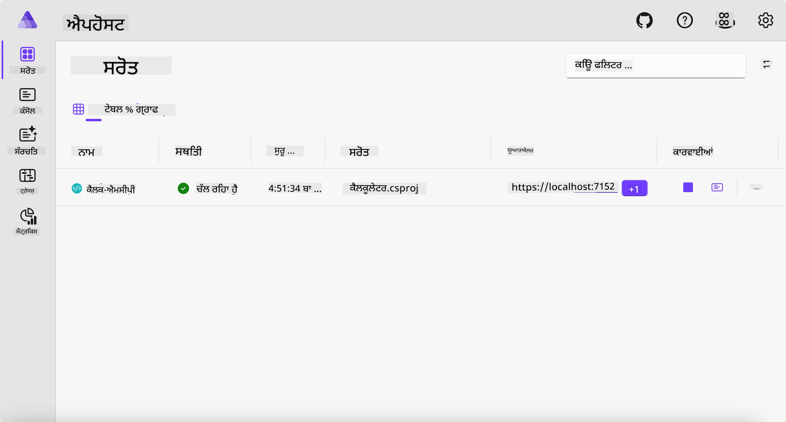
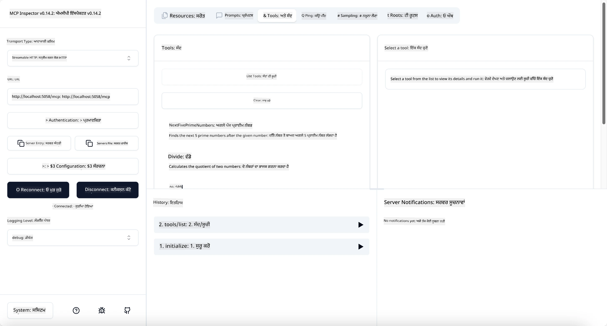
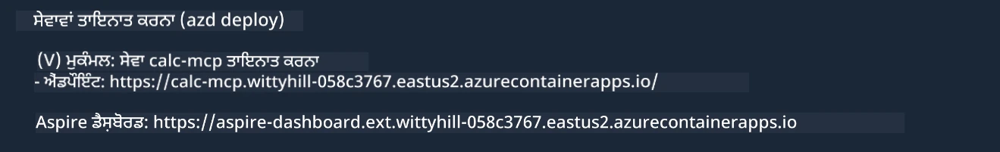

# ਨਮੂਨਾ

ਪਹਿਲਾ ਉਦਾਹਰਨ ਦਿਖਾਉਂਦਾ ਹੈ ਕਿ .NET ਪ੍ਰੋਜੈਕਟ ਨੂੰ `stdio` ਟਾਈਪ ਨਾਲ ਕਿਵੇਂ ਵਰਤਣਾ ਹੈ। ਅਤੇ ਸਵਰ ਨੂੰ ਸਥਾਨਕ ਤੌਰ 'ਤੇ ਇੱਕ ਕੰਟੇਨਰ ਵਿੱਚ ਕਿਵੇਂ ਚਲਾਉਣਾ ਹੈ। ਇਹ ਕਈ ਸਥਿਤੀਆਂ ਵਿੱਚ ਇੱਕ ਚੰਗਾ ਹੱਲ ਹੈ। ਹਾਲਾਂਕਿ, ਇਹ ਫਾਇਦੇਮੰਦ ਹੋ ਸਕਦਾ ਹੈ ਕਿ ਸਵਰ ਨੂੰ ਰਿਮੋਟ ਤੌਰ 'ਤੇ ਚਲਾਇਆ ਜਾਵੇ, ਜਿਵੇਂ ਕਿ ਬੱਦਲ ਮਾਹੌਲ ਵਿੱਚ। ਇੱਥੇ `http` ਟਾਈਪ ਆਉਂਦਾ ਹੈ।

`04-PracticalImplementation` ਫੋਲਡਰ ਵਿੱਚ ਹੱਲ ਨੂੰ ਵੇਖਦੇ ਹੋਏ, ਇਹ ਪਹਿਲੇ ਤੋਂ ਬਹੁਤ ਵੱਧ ਜਟਿਲ ਲਗ ਸਕਦਾ ਹੈ। ਪਰ ਵਾਸਤਵ ਵਿੱਚ, ਇਹ ਨਹੀਂ ਹੈ। ਜੇ ਤੁਸੀਂ ਪ੍ਰੋਜੈਕਟ `src/Calculator` ਨੂੰ ਧਿਆਨ ਨਾਲ ਵੇਖੋਗੇ, ਤਾਂ ਤੁਸੀਂ ਦੇਖੋਗੇ ਕਿ ਇਹ ਜ਼ਿਆਦਾਤਰ ਪਹਿਲਲੇ ਉਦਾਹਰਨ ਵਾਲੇ ਕੋਡ ਵਰਗਾ ਹੈ। ਇਕੱਲਾ ਫਰਕ ਇਹ ਹੈ ਕਿ ਅਸੀ HTTP ਕੌਰਸ ਨੂੰ ਸੰਭਾਲਣ ਲਈ ਇੱਕ ਵੱਖਰੀ ਲਾਇਬ੍ਰੇਰੀ `ModelContextProtocol.AspNetCore` ਵਰਤ ਰਹੇ ਹਾਂ। ਅਤੇ ਅਸੀ `IsPrime` ਢੰਗ ਨੂੰ ਗੁਪਤ (private) ਕਰ ਦਿੱਤਾ ਹੈ, ਸਿਫ਼ਤ ਇਹ ਜ਼ਾਹਰ ਕਰਨ ਲਈ ਕਿ ਤੁਸੀਂ ਆਪਣੇ ਕੋਡ ਵਿੱਚ ਗੁਪਤ ਢੰਗ ਰੱਖ ਸਕਦੇ ਹੋ। ਬਾਕੀ ਸਾਰਾ ਕੋਡ ਪਹਿਲਾਂ ਵਰਗਾ ਹੀ ਹੈ।

ਬਾਕੀ ਪ੍ਰੋਜੈਕਟ [Aspire](https://aspire.dev/get-started/what-is-aspire/) ਤੋਂ ਹਨ। ਹੱਲ ਵਿੱਚ Aspire ਹੋਣ ਨਾਲ ਵਿਕਾਸਕ ਨੇ ਵਿਕਾਸ ਅਤੇ ਟੈਸਟਿੰਗ ਦੌਰਾਨ ਬਿਹਤਰ ਤਜਰਬਾ ਮਿਲਦਾ ਹੈ ਅਤੇ ਦੇਖ-ਰেখ ਵਿੱਚ ਮਦਦ ਮਿਲਦੀ ਹੈ। ਸਵਰ ਨੂੰ ਚਲਾਉਣ ਲਈ ਇਹ ਜ਼ਰੂਰੀ ਨਹੀਂ ਹੈ, ਪਰ ਇਹ ਤੁਹਾਡੇ ਹੱਲ ਵਿੱਚ ਰੱਖਣ ਦੀ ਇੱਕ ਚੰਗੀ ਰਿਵਾਜ ਹੈ।

## ਸਵਰ ਨੂੰ ਸਥਾਨਕ ਤੌਰ 'ਤੇ ਸ਼ੁਰੂ ਕਰੋ

1. VS ਕੋਡ (C# DevKit ਐਕਸਟੈਂਸ਼ਨ ਦੇ ਨਾਲ) ਵਿੱਚ, `04-PracticalImplementation/samples/csharp` ਡਾਇਰੈਕਟਰੀ ਵਿੱਚ ਜਾਓ।
1. ਸਵਰ ਨੂੰ ਸ਼ੁਰੂ ਕਰਨ ਲਈ ਹੇਠ ਲਿਖਿਆ ਕਮਾਂਡ ਚਲਾਓ:

   ```bash
    dotnet watch run --project ./src/AppHost
   ```

1. ਜਦੋਂ ਕੋਈ ਵੈੱਬ ਬ੍ਰਾਉਜ਼ਰ Aspire ਡੈਸ਼ਬੋਰਡ ਖੋਲ੍ਹਦਾ ਹੈ, ਤਾਂ `http` URL ਨੂੰ ਨੋਟ ਕਰੋ। ਇਹ ਕੁਝ ਇਸ ਤਰ੍ਹਾਂ ਹੋਣਾ ਚਾਹੀਦਾ ਹੈ `http://localhost:5058/`।

   

## MCP ਇੰਸਪੈਕਟਰ ਨਾਲ Streamable HTTP ਦੀ ਟੈਸਟਿੰਗ ਕਰੋ

ਜੇ ਤੁਹਾਡੇ ਕੋਲ Node.js 22.7.5 ਜਾਂ ਉਸ ਤੋਂ ਉਪਰ ਹੈ, ਤਾਂ ਤੁਸੀਂ MCP ਇੰਸਪੈਕਟਰ ਦੀ ਵਰਤੋਂ ਕਰਕੇ ਆਪਣਾ ਸਵਰ ਟੈਸਟ ਕਰ ਸਕਦੇ ਹੋ।

ਸਵਰ ਨੂੰ ਚਲਾਓ ਅਤੇ ਟਰਮੀਨਲ ਵਿੱਚ ਹੇਠ ਲਿਖਿਆ ਕਮਾਂਡ ਚਲਾਓ:

```bash
npx @modelcontextprotocol/inspector http://localhost:5058
```



- ਟਰਾਂਸਪੋਰਟ ਟਾਈਪ ਵਜੋਂ `Streamable HTTP` ਚੁਣੋ।
- ਯੂਆਰਐਲ ਖੇਤਰ ਵਿੱਚ ਪਹਿਲਾਂ ਨੋਟ ਕੀਤਾ ਹੋਇਆ ਸਰਵਰ ਦਾ URL ਦਾਖਲ ਕਰੋ, ਅਤੇ `/mcp` ਵਧਾਓ। ਇਹ `http` ਹੋਣਾ ਚਾਹੀਦਾ ਹੈ (ਨਾ ਕਿ `https`), ਕੁਝ ਇਸ ਤਰ੍ਹਾਂ `http://localhost:5058/mcp`।
- ਕਨੇਕਟ ਬਟਨ ਨੂੰ ਚੁਣੋ।

ਇੰਸਪੈਕਟਰ ਦਾ ਇਕ ਵਧੀਆ ਗੁਣ ਇਹ ਹੈ ਕਿ ਇਹ ਜੋ ਕੁਝ ਹੋ ਰਿਹਾ ਹੈ ਉਸ ਨੂੰ ਵਧੀਆ ਤਰੀਕੇ ਨਾਲ ਵੇਖਾਉਂਦਾ ਹੈ।

- ਉਪਲਬਧ ਟੂਲਾਂ ਦੀ ਸੂਚੀ ਬਣਾਉਣ ਦੀ ਕੋਸ਼ਿਸ਼ ਕਰੋ
- ਕੁਝ ਟੂਲਾਂ ਨੂੰ ਵਰਤ ਕੇ ਦੇਖੋ, ਇਹ ਪਿਛਲੇ ਵਰਗੇ ਕੰਮ ਕਰਨਗੇ।

## VS ਕੋਡ ਵਿੱਚ GitHub Copilot ਚੈਟ ਨਾਲ MCP ਸਵਰ ਦੀ ਟੈਸਟਿੰਗ ਕਰੋ

Streamable HTTP ਟਰਾਂਸਪੋਰਟ ਨੂੰ GitHub Copilot ਚੈਟ ਨਾਲ ਵਰਤਣ ਲਈ, ਪਹਿਲਾਂ ਬਣਾਏ ਗਏ `calc-mcp` ਸਵਰ ਦੀ ਸੰਰਚਨਾ ਇਸ ਤਰ੍ਹਾਂ ਬਦਲੋ:

```jsonc
// .vscode/mcp.json
{
  "servers": {
    "calc-mcp": {
      "type": "http",
      "url": "http://localhost:5058/mcp"
    }
  }
}
```

ਕੁਝ ਟੈਸਟ ਕਰੋ:

- "3 prime numbers after 6780" ਪੁੱਛੋ। ਦੇਖੋ ਕਿ Copilot ਨਵੇਂ ਟੂਲਾਂ `NextFivePrimeNumbers` ਨੂੰ ਕਿਵੇਂ ਵਰਤਦੈ ਅਤੇ ਸਿਰਫ ਪਹਿਲੇ 3 ਪ੍ਰਾਈਮ ਨੰਬਰਾਂ ਨੂੰ ਵਾਪਸ ਕਰਦਾ ਹੈ।
- "7 prime numbers after 111" ਪੁੱਛੋ, ਦੇਖਣ ਲਈ ਕੀ ਹੁੰਦਾ ਹੈ।
- "John has 24 lollies and wants to distribute them all to his 3 kids. How many lollies does each kid have?" ਪੁੱਛੋ, ਦੇਖਣ ਲਈ ਕੀ ਹੁੰਦਾ ਹੈ।

## ਸਵਰ ਨੂੰ Azure 'ਤੇ ਤैनਾਤ ਕਰੋ

ਆਓ ਸਵਰ ਨੂੰ Azure 'ਤੇ ਤੈਨਾਤ ਕਰੀਏ ਤਾਂ ਜੋ ਹੋਰ ਲੋਕ ਇਸ ਨੂੰ ਵਰਤ ਸਕਣ।

ਟਰਮੀਨਲ ਵਿੱਚ ਜਾ ਕੇ `04-PracticalImplementation/samples/csharp` ਫੋਲਡਰ ਵਿੱਚ ਜਾਓ ਅਤੇ ਹੇਠ ਲਿਖਿਆ ਕਮਾਂਡ ਚਲਾਓ:

```bash
azd up
```

ਟੈਨਾਤੀ ਹੋਣ ਤੋਂ ਬਾਅਦ, ਤੁਹਾਨੂੰ ਕਿਸੇ ਇਸ ਤਰ੍ਹਾਂ ਦਾ ਸੁਨੇਹਾ ਦਿਖਾਈ ਦੇਣਾ ਚਾਹੀਦਾ ਹੈ:



URL ਨੂੰ ਕੈਪਚਰ ਕਰੋ ਅਤੇ ਇਸ ਨੂੰ MCP ਇੰਸਪੈਕਟਰ ਅਤੇ GitHub Copilot ਚੈਟ ਵਿੱਚ ਵਰਤੋਂ।

```jsonc
// .vscode/mcp.json
{
  "servers": {
    "calc-mcp": {
      "type": "http",
      "url": "https://calc-mcp.gentleriver-3977fbcf.australiaeast.azurecontainerapps.io/mcp"
    }
  }
}
```

## ਅਗਲਾ ਕੀ?

ਅਸੀ ਵੱਖ-ਵੱਖ ਟਰਾਂਸਪੋਰਟ ਟਾਈਪਾਂ ਅਤੇ ਟੈਸਟਿੰਗ ਟੂਲਾਂ ਦੀ ਕੋਸ਼ਿਸ਼ ਕਰਦੇ ਹਾਂ। ਅਸੀਂ ਤੁਹਾਡੇ MCP ਸਵਰ ਨੂੰ Azure ਤੇ ਤੈਨਾਤ ਵੀ ਕਰਦੇ ਹਾਂ। ਪਰ ਜੇ ਸਾਡਾ ਸਵਰ ਨਿੱਜੀ ਸਰੋਤਾਂ ਤੱਕ ਪਹੁੰਚ ਕਰਨੀ ਲੋੜ ਹੈ? ਉਦਾਹਰਨ ਵਜੋਂ, ਇੱਕ ਡੇਟਾਬੇਸ ਜਾਂ ਨਿੱਜੀ API? ਅਗਲੇ ਅਧਿਆਏ ਵਿੱਚ, ਅਸੀਂ ਦੇਖਾਂਗੇ ਕਿ ਅਸੀਂ ਆਪਣੇ ਸਵਰ ਦੀ ਸੁਰੱਖਿਆ ਕਿਵੇਂ ਬਿਹਤਰ ਕਰ ਸਕਦੇ ਹਾਂ।

---

<!-- CO-OP TRANSLATOR DISCLAIMER START -->
**ਅਸਵੀਕਾਰੋਪਣ**:
ਇਸ ਦਸਤਾਵੇਜ਼ ਦਾ ਅਨੁਵਾਦ ਏਆਈ ਅਨੁਵਾਦ ਸੇਵਾ [Co-op Translator](https://github.com/Azure/co-op-translator) ਦੀ ਵਰਤੋਂ ਕਰਕੇ ਕੀਤਾ ਗਿਆ ਹੈ। ਜਦੋਂ ਕਿ ਅਸੀਂ ਸਹੀਤਾਵਾਂ ਲਈ ਯਤਨਸ਼ੀਲ ਹਾਂ, ਕਿਰਪਾ ਕਰਕੇ ਧਿਆਨ ਰੱਖੋ ਕਿ ਸਵੈਚਾਲਿਤ ਅਨੁਵਾਦਾਂ ਵਿੱਚ ਗਲਤੀਆਂ ਜਾਂ ਅਸਮੱਤਿਆਵਾਂ ਹੋ ਸਕਦੀਆਂ ਹਨ। ਮੂਲ ਦਸਤਾਵੇਜ਼ ਆਪਣੀ ਮੂਲ ਭਾਸ਼ਾ ਵਿੱਚ ਅਧਿਕਾਰਕ ਸਰੋਤ ਮੰਨਿਆ ਜਾਣਾ ਚਾਹੀਦਾ ਹੈ। ਜਰੂਰੀ ਜਾਣਕਾਰੀ ਲਈ, ਪੇਸ਼ੇਵਰ ਮਨੁੱਖੀ ਅਨੁਵਾਦ ਦੀ ਸਿਫ਼ਾਰਸ਼ ਕੀਤੀ ਜਾਂਦੀ ਹੈ। ਅਸੀਂ ਇਸ ਅਨੁਵਾਦ ਦੇ ਉਪਯੋਗ ਤੋਂ ਪੈਦਾ ਹੋਣ ਵਾਲੀਆਂ ਕਿਸੇ ਵੀ ਗਲਤਫਹਿਮੀਆਂ ਜਾਂ ਗਲਤ ਵਿਆਖਿਆਵਾਂ ਲਈ ਜਵਾਬਦੇਹ ਨਹੀਂ ਹਾਂ।
<!-- CO-OP TRANSLATOR DISCLAIMER END -->