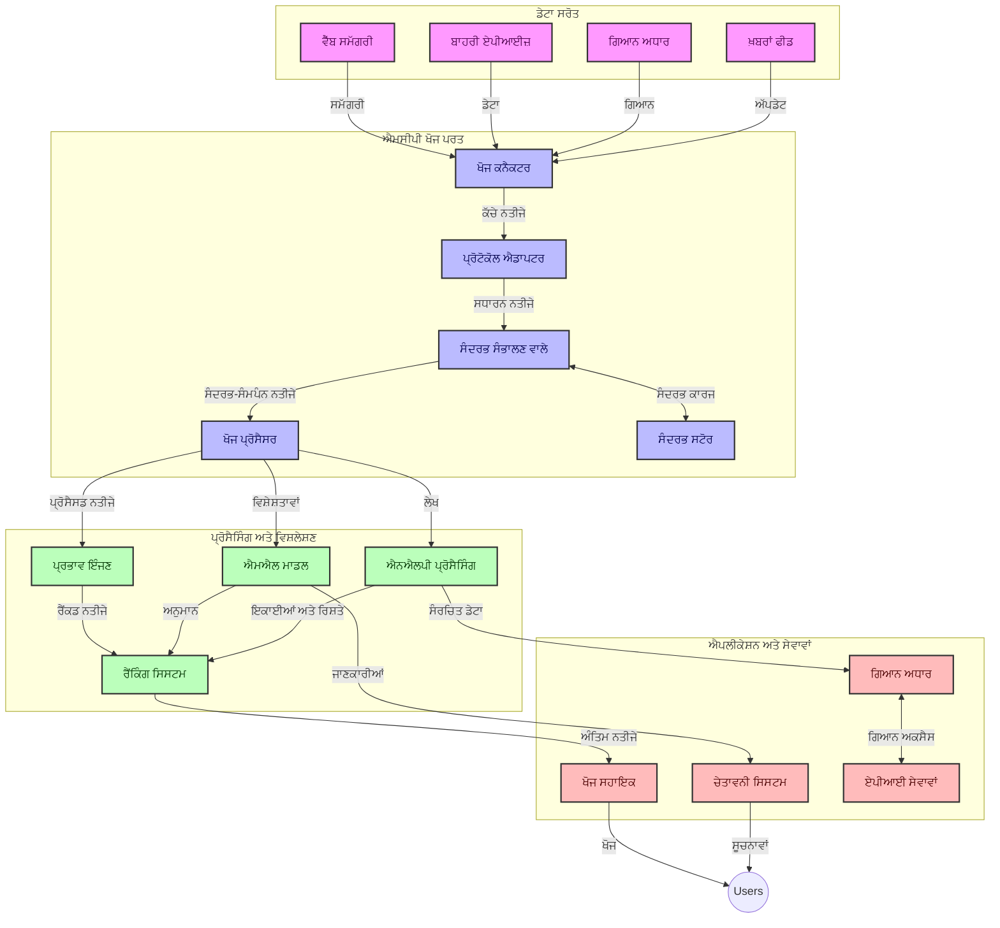
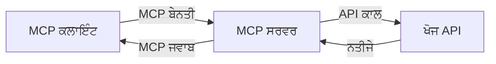
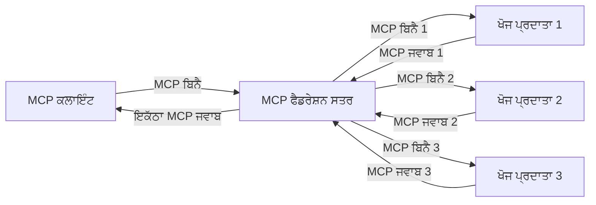
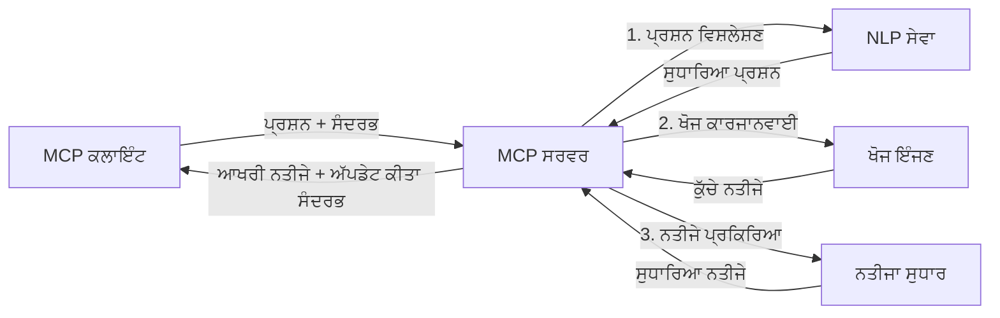

# ਰੀਅਲ-ਟਾਈਮ ਵੈੱਬ ਖੋਜ ਲਈ ਮਾਡਲ ਸੰਦਰਭ ਪ੍ਰੋਟੋਕਾਲ

## ਝਲਕ

ਅੱਜ ਦੇ ਜਾਣਕਾਰੀ-ਚਲਾਏ ਵਾਤਾਵਰਨ ਵਿੱਚ ਰੀਅਲ-ਟਾਈਮ ਵੈੱਬ ਖੋਜ ਜ਼ਰੂਰੀ ਹੋ ਗਈ ਹੈ, ਜਿੱਥੇ ਐਪਲੀਕੇਸ਼ਨਾਂ ਨੂੰ ਇੰਟਰਨੈੱਟ 'ਤੇ ਤਾਜ਼ਾ ਜਾਣਕਾਰੀ ਤੁਰੰਤ ਪ੍ਰਾਪਤ ਕਰਨ ਦੀ ਲੋੜ ਹੁੰਦੀ ਹੈ ਤਾਂ ਜੋ ਸੰਬੰਧਿਤ ਅਤੇ ਸਮੇਂ ਬੱਧ ਜਵਾਬ ਪ੍ਰਦਾਨ ਕੀਤੇ ਜਾ ਸਕਣ। ਮਾਡਲ ਸੰਦਰਭ ਪ੍ਰੋਟੋਕਾਲ (MCP) ਇਹਨਾਂ ਰੀਅਲ-ਟਾਈਮ ਖੋਜ ਪ੍ਰਕਿਰਿਆਵਾਂ ਨੂੰ ਸੁਧਾਰਨ ਵਿੱਚ ਇੱਕ ਮਹੱਤਵਪੂਰਨ ਉੱਨਤੀ ਦਰਸਾਉਂਦਾ ਹੈ, ਖੋਜ ਦੀ ਕੁਸ਼ਲਤਾ ਵਧਾਉਂਦਾ ਹੈ, ਸੰਦਰਭਿਕ ਅਖੰਡਤਾ ਨੂੰ ਬਰਕਰਾਰ ਰੱਖਦਾ ਹੈ, ਅਤੇ ਕੁੱਲ ਸਿਸਟਮ ਪ੍ਰਦਰਸ਼ਨ ਨੂੰ ਬਹਿਤਰ ਬਣਾਉਂਦਾ ਹੈ।

ਇਹ ਮਾਡਿਊਲ ਵੇਖਦਾ ਹੈ ਕਿ MCP ਕਿਵੇਂ AI ਮਾਡਲਾਂ, ਖੋਜ ਇੰਜਣਾਂ, ਅਤੇ ਐਪਲੀਕੇਸ਼ਨਾਂ ਵਿੱਚ ਸੰਦਰਭ ਪ੍ਰਬੰਧਨ ਲਈ ਇੱਕ ਮਿਆਰੀਕ੍ਰਿਤ ਪਹੁੰਚ ਪ੍ਰਦਾਨ ਕਰਕੇ ਰੀਅਲ-ਟਾਈਮ ਵੈੱਬ ਖੋਜ ਵਿੱਚ ਬਦਲਾਅ ਲਿਆਉਂਦਾ ਹੈ।

### ਤੁਸੀਂ ਕੀ ਸਿੱਖੋਗੇ

ਇਸ ਵਿਸਤ੍ਰਿਤ ਮਾਰਗਦਰਸ਼ਨ ਵਿੱਚ, ਤੁਸੀਂ ਜਾਣੋਗੇ:

- ਕਿਵੇਂ MCP AI ਮਾਡਲਾਂ ਅਤੇ ਰੀਅਲ-ਟਾਈਮ ਵੈੱਬ ਖੋਜ ਸਮਰੱਥਾਵਾਂ ਵਿੱਚ ਇੱਕ ਸਥਿਰ ਪੁਲ ਬਣਾਉਂਦਾ ਹੈ
- MCP ਨਾਲ ਕੁਸ਼ਲ ਅਤੇ ਵਿਸਤਾਰਯੋਗ ਖੋਜ ਹੱਲਾਂ ਨੂੰ ਲਾਗੂ ਕਰਨ ਲਈ ਆਰਕੀਟੈਕਚਰਲ ਰੂਪਰੇਖਾ
- ਕਈ ਪੁੱਛਗਿੱਛਾਂ ਅਤੇ ਇੰਟਰੈਕਸ਼ਨਾਂ ਵਿੱਚ ਖੋਜ ਸੰਦਰਭ ਬਰਕਰਾਰ ਰੱਖਣ ਦੀਆਂ ਤਕਨੀਕਾਂ
- ਵੱਖ-ਵੱਖ ਖੋਜ ਸਥਿਤੀਆਂ ਲਈ Python ਅਤੇ JavaScript ਵਿੱਚ ਪ੍ਰਯੋਗਕਰਤਾ ਕੋਡ ਲਾਗੂਆਈ
- MCP-ਚਲਿਤ ਖੋਜ ਪ੍ਰਣਾਲੀਆਂ ਵਿੱਚ ਪ੍ਰਸੰਗਿਕਤਾ, ਤਾਜ਼ਗੀ, ਅਤੇ ਪ੍ਰਦਰਸ਼ਨ ਨੂੰ ਸੰਤੁਲਿਤ ਕਰਨ ਦੇ ਤਰੀਕੇ

## ਰੀਅਲ-ਟਾਈਮ ਵੈੱਬ ਖੋਜ ਦਾ ਪ੍ਰਾਰੰਭ

ਰੀਅਲ-ਟਾਈਮ ਵੈੱਬ ਖੋਜ ਇੱਕ ਤਕਨਾਲੋਜੀਕ ਅੰਦਰਦਿੱਥ ਹੈ ਜੋ ਵੈੱਬ-ਆਧਾਰਿਤ ਜਾਣਕਾਰੀ ਦੀ ਨਿਰੰਤਰ ਪੁੱਛਗਿੱਛ, ਪ੍ਰਕਿਰਿਆ, ਅਤੇ ਵਿਸ਼ਲੇਸ਼ਣ ਨੂੰ ਯਕੀਨੀ ਬਣਾਉਂਦਾ ਹੈ ਜਿਵੇਂ ਕਿ ਇਹ ਪ੍ਰਕਾਸ਼ਿਤ ਜਾਂ ਅੱਪਡੇਟ ਹੁੰਦੀ ਹੈ, ਸਿਸਟਮਾਂ ਨੂੰ ਘੱਟ ਦੇਰੀ ਨਾਲ ਤਾਜ਼ਾ ਅਤੇ ਸੰਬੰਧਿਤ ਜਾਣਕਾਰੀ ਪ੍ਰਦਾਨ ਕਰਨ ਦੀ ਆਗਿਆ ਦਿੰਦਾ ਹੈ। ਪਰੰਪਰਾਗਤ ਖੋਜ ਪ੍ਰਣਾਲੀਆਂ ਦੇ ਉਲਟ, ਜੋ ਸੂਚੀਬੱਧ ਡੇਟਾ 'ਤੇ ਕੰਮ ਕਰਦੀਆਂ ਹਨ ਜੋ ਘੰਟਿਆਂ ਜਾਂ ਦਿਨਾਂ ਪੁਰਾਣੀਆਂ ਹੋ ਸਕਦੀਆਂ ਹਨ, ਰੀਅਲ-ਟਾਈਮ ਖੋਜ ਵੈੱਬ ਤੋਂ ਜੀਵੰਤ ਡੇਟਾ ਦੀ ਪ੍ਰਕਿਰਿਆ ਕਰਦੀ ਹੈ, ਜੋ ਔਨਲਾਈਨ ਸਮੱਗਰੀ ਦੀ ਵਰਤਮਾਨ ਸਥਿਤੀ ਨੂੰ ਦਰਸਾਉਂਦਾ ਹੈ।

### ਰੀਅਲ-ਟਾਈਮ ਵੈੱਬ ਖੋਜ ਦੇ ਮੁੱਢਲੇ ਅਸੂਲ:

- **ਨਿਰੰਤਰ ਪੁੱਛਗਿੱਛ ਪ੍ਰਕਿਰਿਆ**: ਖੋਜ ਪੁੱਛਗਿੱਛਾਂ ਨੂੰ ਲਗਾਤਾਰ ਅਪਡੇਟ ਹੋ ਰਹੇ ਡੇਟਾ ਸੋਰਸਾਂ ਦੇ ਖਿਲਾਫ ਪ੍ਰਕਿਰਿਆ ਕੀਤੀ ਜਾਂਦੀ ਹੈ
- **ਤਾਜ਼ਗੀ ਪ੍ਰਾਥਮਿਕਤਾ**: ਸਿਸਟਮ ਤਾਜ਼ਾ ਜਾਣਕਾਰੀ ਨੂੰ ਪ੍ਰਾਥਮਿਕਤਾ ਦੇਣ ਲਈ ਡਿਜ਼ਾਈਨ ਕੀਤੇ ਗਏ ਹਨ
- **ਪ੍ਰਸੰਗਿਕਤਾ ਦਾ ਸੰਤੁਲਨ**: ਪ੍ਰਸੰਗਿਕਤਾ ਅਤੇ ਤਾਜ਼ਗੀ ਵਿਚ ਇਕ ਸੰਤੁਲਨ ਬਣਾਈ ਰੱਖਣਾ
- **ਵਿਸਤਾਰਯੋਗ ਆਰਕੀਟੈਕਚਰ**: ਸਿਸਟਮ ਨੂੰ ਵੱਖ-ਵੱਖ ਪੁੱਛਗਿੱਛ ਬੋਝ ਅਤੇ ਡੇਟਾ ਮਾਤਰਾ ਨੂੰ ਸੰਭਾਲਣਾ ਚਾਹੀਦਾ ਹੈ
- **ਸੰਦਰਭਿਕ ਸਮਝ**: ਖੋਜ ਵਿੱਚ ਮਾਇਨੇਦਾਰ ਨਤੀਜਿਆਂ ਲਈ ਵਰਤੋਂਕਾਰ ਸੰਦਰਭ ਬਰਕਰਾਰ ਰੱਖਣਾ ਜ਼ਰੂਰੀ ਹੈ
- **ਡਾਇਨਾਮਿਕ ਪੁੱਛਗਿੱਛ ਦੁਬਾਰਾ ਰੂਪ ਦੇਣਾ**: ਸੰਦਰਭ ਅਤੇ ਪਿਛਲੇ ਨਤੀਜਿਆਂ ਅਨੁਸਾਰ ਪੁੱਛਗਿੱਛਾਂ ਨੂੰ ਸਵੈ-ਅਨੁਕੂਲ ਬਣਾਉਣਾ
- **ਮਲਟੀ-ਸੋਰਸ ਇੰਟਿਗ੍ਰੇਸ਼ਨ**: ਕਈ ਖੋਜ ਪ੍ਰਦਾਤਿਆਂ ਅਤੇ ਵੈੱਬ ਸੋਰਸਾਂ ਤੋਂ ਨਤੀਜੇ ਜੋੜਨਾ
- **ਅਰਥਵਾਦੀ ਸਮਝ**: ਸਿਰਫ਼ ਕੀਵਰਡਸ ਨਹੀਂ, ਬਲਕਿ ਅਰਥ ਦੇ ਆਧਾਰ 'ਤੇ ਪੁੱਛਗਿੱਛਾਂ ਅਤੇ ਸਮੱਗਰੀ ਦੀ ਪ੍ਰਕਿਰਿਆ
- **ਰੀਅਲ-ਟਾਈਮ ਰੈਂਕਿੰਗ**: ਨਵੇਂ ਜਾਣਕਾਰੀ ਮਿਲਦੇ ਹੀ ਨਤੀਜਿਆਂ ਦੀ ਦੂਜੀ ਦਰਜਾ ਅਜੇ ਵੀ ਲਗਾਤਾਰ ਬਦਲਣਾ

### ਮਾਡਲ ਸੰਦਰਭ ਪ੍ਰੋਟੋਕਾਲ ਅਤੇ ਰੀਅਲ-ਟਾਈਮ ਵੈੱਬ ਖੋਜ

ਮਾਡਲ ਸੰਦਰਭ ਪ੍ਰੋਟੋਕਾਲ (MCP) ਰੀਅਲ-ਟਾਈਮ ਵੈੱਬ ਖੋਜ ਵਾਤਾਵਰਨਾਂ ਵਿੱਚ ਕਈ ਅਹਮ ਚੁਣੌਤੀਆਂ ਦਾ ਸੰਮਾਧਾਨ ਕਰਦਾ ਹੈ:

1. **ਖੋਜ ਸੰਦਰਭ ਰੱਖਿਆ**: MCP ਪ੍ਰਸਾਰਤ ਖੋਜ ਹਿੱਸਿਆਂ ਵਿੱਚ ਸੰਦਰਭ ਨੂੰ ਕਿਵੇਂ ਬਰਕਰਾਰ ਰੱਖਣਾ ਹੈ ਇਸ ਨੂੰ ਮਿਆਰੀਕ੍ਰਿਤ ਕਰਦਾ ਹੈ, ਇਹ ਯਕੀਨੀ ਬਣਾਉਂਦਾ ਹੈ ਕਿ AI ਮਾਡਲਾਂ ਅਤੇ ਪ੍ਰਕਿਰਿਆ ਨੋਡਾਂ ਨੂੰ ਸੰਬੰਧਿਤ ਪੁੱਛਗਿੱਛ ਇਤਿਹਾਸ ਅਤੇ ਵਰਤੋਂਕਾਰ ਪਸੰਦਾਂ ਤੱਕ ਪਹੁੰਚ ਹੁੰਦੀ ਹੈ।

2. **ਕੁਸ਼ਲ ਪੁੱਛਗਿੱਛ ਪ੍ਰਬੰਧਨ**: ਸੰਦਰਭ ਪ੍ਰਸਾਰਣ ਲਈ ਸੋਚ-ਵਿਚਾਰ ਨਾਲ ਬਣਾਇਆ ਗਿਆ ਤਰੀਕਾ ਦੇ ਕੇ, MCP ਹਰ ਖੋਜ ਦੌਰ ਵਿੱਚ ਸੰਦਰਭ ਦੁਹਰਾਉਣ ਦੇ ਓਹਲੇ ਨੂੰ ਘਟਾਉਂਦਾ ਹੈ।

3. **ਇੰਟਰਓਪਰੇਬਿਲਿਟੀ**: MCP ਭਿੰਨ-ਭਿੰਨ ਖੋਜ ਤਕਨਾਲੋਜੀਆਂ ਅਤੇ AI ਮਾਡਲਾਂ ਵਿਚਕਾਰ ਸੰਦਰਭ ਸਾਂਝਾ ਕਰਨ ਲਈ ਇੱਕ ਆਮ ਭਾਸ਼ਾ ਬਣਾਉਂਦਾ ਹੈ, ਜਿਸ ਨਾਲ ਆਰਕੀਟੈਕਚਰ ਬਹੁਤ ਲਚਕੀਲੇ ਅਤੇ ਵਧਾਉਣਯੋਗ ਬਣ ਜਾਂਦੇ ਹਨ।

4. **ਖੋਜ-ਅਨੁਕੂਲਿਤ ਸੰਦਰਭ**: MCP ਲਾਗੂਆਈ ਇਹ ਤਿਆਰ ਕਰ ਸਕਦੀ ਹੈ ਕਿ ਕਿਹੜੇ ਸੰਦਰਭੀ ਤੱਤ ਸਭ ਤੋਂ ਜਿਆਦਾ ਪ੍ਰਭਾਵਸ਼ਾਲੀ ਖੋਜ ਲਈ ਮੌਤਵਾਦੀ ਹਨ, ਪ੍ਰਦਰਸ਼ਨ ਅਤੇ ਸਹੀਤ ਵਿੱਚ ਸੁਧਾਰ ਕਰਦਾ ਹੈ।

5. **ਅਨੁਕੂਲ ਖੋਜ ਪ੍ਰਕਿਰਿਆ**: MCP ਰਾਹੀਂ ਠੀਕ ਸੰਦਰਭ ਪ੍ਰਬੰਧਨ ਨਾਲ, ਖੋਜ ਪ੍ਰਣਾਲੀ ਯੂਜ਼ਰ ਦੀ ਬਦਲਦੀ ਲੋੜਾਂ ਅਤੇ ਜਾਣਕਾਰੀ ਦੇ ਦ੍ਰਿਸ਼ਟੀਕੋਣਾਂ ਅਨੁਸਾਰ ਪ੍ਰਕਿਰਿਆ ਨੂੰ ਬਦਲ ਸਕਦੀ ਹੈ।

ਸਮਕਾਲੀ ਐਪਲੀਕੇਸ਼ਨਾਂ ਵਿੱਚ ਜੋ ਖ਼ਬਰਾਂ ਦੇ ਇਕੱਤਰ ਕਰਨ ਤੋਂ ਲੈ ਕੇ ਰਿਸਰਚ ਸਹਾਇਕਾਂ ਤੱਕ ਫੈਲੇ ਹੋਏ ਹਨ, MCP ਦਾ ਵੈੱਬ ਖੋਜ ਤਕਨਾਲੋਜੀਆਂ ਨਾਲ ਇਕੱਠਾ ਹੋਣਾ ਹੋਰ ਬੁੱਧਿਮਾਨ, ਸੰਦਰਭ-ਸੂਚਕ ਖੋਜ ਨੂੰ ਯੋਗ ਬਣਾਉਂਦਾ ਹੈ ਜੋ ਵਰਤੋਂਕਾਰ ਇੰਟਰੈਕਸ਼ਨਾਂ ਦੇ ਨਾਲ-ਨਾਲ ਜਿਆਦਾ ਸੰਬੰਧਿਤ ਨਤੀਜੇ ਪ੍ਰਦਾਨ ਕਰ ਸਕਦਾ ਹੈ।

## ਸਿੱਖਣ ਦੇ ਉਦੇਸ਼

ਇਸ ਪਾਠ ਦੇ ਅੰਤ ਤੱਕ, ਤੁਸੀਂ ਯੋਗ ਹੋਵੋਗੇ:

- ਰੀਅਲ-ਟਾਈਮ ਵੈੱਬ ਖੋਜ ਦੇ ਮੂਲ ਤੱਤ ਅਤੇ ਆਧੁਨਿਕ ਐਪਲੀਕੇਸ਼ਨਾਂ ਵਿੱਚ ਇਸ ਦੀਆਂ ਚੁਣੌਤੀਆਂ ਨੂੰ ਸਮਝਣਾ
- ਮਾਡਲ ਸੰਦਰਭ ਪ੍ਰੋਟੋਕਾਲ (MCP) ਰੀਅਲ-ਟਾਈਮ ਵੈੱਬ ਖੋਜ ਸਮਰੱਥਾਵਾਂ ਨੂੰ ਕਿਵੇਂ ਵਧਾਉਂਦਾ ਹੈ ਇਸ ਵਿਆਖਿਆ ਕਰਨਾ
- ਪ੍ਰਸਿੱਧ ਫਰੇਮਵਰਕ ਅਤੇ APIs ਦੀ ਵਰਤੋਂ ਕਰਕੇ MCP-ਅਧਾਰਿਤ ਖੋਜ ਹੱਲਾਂ ਨੂੰ ਲਾਗੂ ਕਰਨਾ
- MCP ਨਾਲ ਵਿਸਤਾਰਯੋਗ, ਉੱਚ-ਪਦਰਸ਼ਨ ਵਾਲੇ ਖੋਜ ਆਰਕੀਟੈਕਚਰ ਡਿਜ਼ਾਈਨ ਅਤੇ ਲਾਗੂ ਕਰਨਾ
- MCP ਅਸੂਲਾਂ ਨੂੰ ਵੱਖ-ਵੱਖ ਵਰਤੋਂ ਕੇਸਾਂ ਵਿੱਚ ਲਾਗੂ ਕਰਨਾ ਜਿਵੇਂ ਕਿ ਅਰਥਵਾਦੀ ਖੋਜ, ਰਿਸਰਚ ਸਹਾਇਤਾ, ਅਤੇ AI-ਸਹਾਇਤਤ ਬ੍ਰਾਊਜ਼ਿੰਗ
- MCP-ਅਧਾਰਿਤ ਖੋਜ ਤਕਨਾਲੋਜੀਆਂ ਵਿੱਚ ਉभर ਰਹੀਆਂ ਰੁਝਾਨਾਂ ਅਤੇ ਭਵਿੱਖ ਦੇ ਨਵੀਨਤਮ ਤਰੀਕਿਆਂ ਦਾ ਮੁਲਾਂਕਣ ਕਰਨਾ
- ਵਰਤੋਂਕਾਰ ਇੰਟਰੈਕਸ਼ਨਾਂ ਤੋਂ ਸਿੱਖਣ ਵਾਲੀਆਂ ਸੰਦਰਭ-ਸੂਚਕ ਖੋਜ ਪ੍ਰਣਾਲੀਆਂ ਵਿਕਸਿਤ ਕਰਨਾ
- ਮਿਆਰੀਕ੍ਰਿਤ MCP ਪ੍ਰੋਟੋਕਾਲਾਂ ਦੀ ਵਰਤੋਂ ਕਰਕੇ AI ਸਹਾਇਕਾਂ ਵਿੱਚ ਵੈੱਬ ਖੋਜ ਸਮਰੱਥਾਵਾਂ ਨੂੰ ਇਕੱਠਾ ਕਰਨਾ
- ਬਹੁ-ਪੜਾਅ ਵਾਲੀਆਂ ਖੋਜ ਪ੍ਰਣਾਲੀਆਂ ਬਣਾਉਣਾ ਜੋ ਸੰਦਰਭ ਅਨੁਸਾਰ ਨਤੀਜਿਆਂ ਨੂੰ ਤਰਤੀਬਵਾਰ ਸੁਧਾਰਦੀਆਂ ਹਨ
- ਸੰਪੂਰਨ ਸੰਦਰਭ ਜਾਣੂਦੀ ਵਾਲੇਖੜੇ ਨਾਲ ਖੋਜ ਪ੍ਰਦਰਸ਼ਨ ਨੂੰ ਉਤਿਮ ਕਰਨਾ

### ਪਰਿਭਾਸ਼ਾ ਅਤੇ ਮਹੱਤਵਤਾ

ਰੀਅਲ-ਟਾਈਮ ਵੈੱਬ ਖੋਜ ਘੱਟ ਤੋਂ ਘੱਟ ਦੇਰੀ ਨਾਲ ਵੈੱਬ-ਆਧਾਰਿਤ ਜਾਣਕਾਰੀ ਦੀ ਨਿਰੰਤਰ ਪੁੱਛਗਿੱਛ, ਪ੍ਰਾਪਤੀ, ਅਤੇ ਸਪੁਰਦਗੀ ਵਿੱਚ ਸ਼ਾਮਲ ਹੁੰਦੀ ਹੈ। ਪਰੰਪਰਾਗਤ ਖੋਜ ਇੰਜਣ ਜੋ ਸਮੇਂ-ਸਮੇਂ 'ਤੇ ਵੈੱਬ ਨੂੰ ਕੁਲਿੰਗ ਕਰਕੇ ਸੂਚੀਬੱਧ ਕਰਦੇ ਹਨ, ਦੇ ਉਲਟ, ਰੀਅਲ-ਟਾਈਮ ਖੋਜ ਜਾਣਕਾਰੀ ਨੂੰ ਜਿਵੇਂ ਜਿਵੇਂ ਉਪਲਬਧ ਹੁੰਦੀ ਹੈ ਪ੍ਰਗਟ ਕਰਨ ਦਾ ਟੀਕਾ ਹੈ, ਜੋ ਸਭ ਤੋਂ ਤਾਜ਼ਾ ਸਮੱਗਰੀ ਤੱਕ ਤੁਰੰਤ ਪਹੁੰਚ ਯੋਗ ਬਣਾਉਂਦਾ ਹੈ।

ਰੀਅਲ-ਟਾਈਮ ਵੈੱਬ ਖੋਜ ਦੀਆਂ ਮੁੱਖ ਵਿਸ਼ੇਸ਼ਤਾਵਾਂ ਇਸ ਤਰ੍ਹਾਂ ਹਨ:

- **ਤਾਜ਼ਗੀ**: ਹਾਲੀਆ ਸਮੱਗਰੀ ਅਤੇ ਅੱਪਡੇਟਾਂ ਨੂੰ ਪ੍ਰਾਥਮਿਕਤਾ ਦੇਣਾ
- **ਨਿਰੰਤਰ ਪ੍ਰਕਿਰਿਆ**: ਨਵੀਂ ਜਾਣਕਾਰੀ ਲਈ ਲਗਾਤਾਰ ਨਿਗਰਾਨੀ
- **ਪੁੱਛਗਿੱਛ ਦਾ ਅਨੁਕੂਲਨ**: ਸੰਦਰਭ ਅਤੇ ਪ੍ਰਤੀਕ੍ਰਿਆ ਦੇ ਅਧਾਰ 'ਤੇ ਖੋਜ ਪੁੱਛਗਿੱਛਾਂ ਨੂੰ ਸੁਧਾਰਨਾ
- **ਤੁਰੰਤ ਸਪੁਰਦਗੀ**: ਘੱਟ ਤੋਂ ਘੱਟ ਦੇਰੀ ਨਾਲ ਖੋਜ ਨਤੀਜੇ ਪ੍ਰਦਾਨ ਕਰਨਾ
- **ਸੰਦਰਭ ਰੱਖੜ**: ਪਿਛਲੀਆਂ ਪੁੱਛਗਿੱਛਾਂ 'ਤੇ ਅਧਾਰਿਤ ਬਿਹਤਰ ਪ੍ਰਸੰਗਿਕਤਾ ਬਣਾਉਣਾ

### ਪਰੰਪਰਾਗਤ ਵੈੱਬ ਖੋਜ ਵਿੱਚ ਚੁਣੌਤੀਆਂ

ਪਰੰਪਰਾਗਤ ਵੈੱਬ ਖੋਜ ਤਰੀਕੇ ਰੀਅਲ-ਟਾਈਮ ਸਥਿਤੀਆਂ 'ਚ ਕਈ ਸੀਮਾਵਾਂ ਦਾ ਸਾਹਮਣਾ ਕਰਦੇ ਹਨ:

1. **ਸੰਦਰਭ ਟੁੱਟਣਾ**: ਕਈ ਪੁੱਛਗਿੱਛਾਂ ਵਿੱਚ ਖੋਜ ਸੰਦਰਭ ਬਰਕਰਾਰ ਰੱਖਣ ਵਿੱਚ ਮੁਸ਼ਕਲ
2. **ਜਾਣਕਾਰੀ ਦੀ ਤਾਜ਼ਗੀ**: ਸਭ ਤੋਂ ਹਾਲੀਆ ਜਾਣਕਾਰੀ ਤੱਕ ਪਹੁੰਚ ਅਤੇ ਪ੍ਰਾਥਮਿਕਤਾ ਦੇਣ ਵਿੱਚ ਚੁਣੌਤੀਆਂ
3. **ਇਕੱਤਰਤਾ ਦੀ ਪੇਚੀਦਗੀ**: ਖੋਜ ਸਿਸਟਮਾਂ ਅਤੇ ਐਪਲੀਕੇਸ਼ਨਾਂ ਵਿੱਚ ਇੰਟਰਓਪਰੇਬਿਲਿਟੀ ਸਮੱਸਿਆਵਾਂ
4. **ਵਿਲੰਬ ਸਮੱਸਿਆਵਾਂ**: ਵੱਧ ਡੇਟਾ ਖੋਜ ਦੇ ਬਾਵਜੂਦ ਜਵਾਬ ਦੇਣ ਦੇ ਸਮੇਂ ਦੀ ਲੋੜ ਦਾ ਸੰਤੁਲਨ
5. **ਪ੍ਰਸੰਗਿਕਤਾ ਟਿਊਨਿੰਗ**: ਤਾਜ਼ਗੀ ਨੂੰ ਪ੍ਰਾਥਮਿਕਤਾ ਦਿੰਦਿਆਂ ਸਹੀਅਤਾ ਅਤੇ ਪ੍ਰਸੰਗਿਕਤਾ ਨਿਸ਼ਚਿਤ ਕਰਨਾ

## ਖੋਜ ਲਈ ਮਾਡਲ ਸੰਦਰਭ ਪ੍ਰੋਟੋਕਾਲ (MCP) ਨੂੰ ਸਮਝਣਾ

### ਖੋਜ ਸੰਦਰਭ ਵਿੱਚ MCP ਕੀ ਹੈ?

ਮਾਡਲ ਸੰਦਰਭ ਪ੍ਰੋਟੋਕਾਲ (MCP) ਇੱਕ ਮਿਆਰੀਕ੍ਰਿਤ ਸੰਚਾਰ ਪ੍ਰੋਟੋਕਾਲ ਹੈ ਜੋ AI ਮਾਡਲਾਂ ਅਤੇ ਐਪਲੀਕੇਸ਼ਨਾਂ ਵਿਚਕਾਰ ਕੁਸ਼ਲ ਇੰਟਰਐਕਸ਼ਨ ਨੂੰ ਸੁਗਮ ਬਣਾਉਂਦਾ ਹੈ। ਰੀਅਲ-ਟਾਈਮ ਵੈੱਬ ਖੋਜ ਦੇ ਸੰਦਰਭ ਵਿੱਚ, MCP ਲਈ ਇੱਕ ਢਾਂਚਾ ਪ੍ਰਦਾਨ ਕਰਦਾ ਹੈ:

- ਪੁੱਛਗਿੱਛ ਸੀਕੁਐਂਸਾਂ ਵਿੱਚ ਖੋਜ ਸੰਦਰਭ ਨੂੰ ਬਰਕਰਾਰ ਰੱਖਣਾ
- ਖੋਜ ਪੁੱਛਗਿੱਛ ਅਤੇ ਨਤੀਜਾ ਫਾਰਮੈਟਾਂ ਨੂੰ ਮਿਆਰੀ ਰੂਪ ਦੇਣਾ
- ਖੋਜ ਪੈਰਾਮੀਟਰਾਂ ਅਤੇ ਨਤੀਜਿਆਂ ਦੇ ਪ੍ਰਸਾਰਣ ਨੂੰ ਯਥਾਥਿਤ ਕਰਨਾ
- ਮਾਡਲ ਤੋਂ ਖੋਜ ਇੰਜਣ ਨਾਲ ਸੰਚਾਰ ਵਿੱਚ ਸੁਧਾਰ

### ਮੁੱਖ ਪੁਆਇੰਟ ਅਤੇ ਆਰਕੀਟੈਕਚਰ

ਰੀਅਲ-ਟਾਈਮ ਵੈੱਬ ਖੋਜ ਲਈ MCP ਆਰਕੀਟੈਕਚਰ ਵਿੱਚ ਕਈ ਮੁੱਖ ਹਿੱਸੇ ਸ਼ਾਮਲ ਹਨ:

1. **ਪੁੱਛਗਿੱਛ ਸੰਦਰਭ ਹੈਂਡਲਰ**: ਕਈ ਪੁੱਛਗਿੱਛਾਂ ਵਿੱਚ ਖੋਜ ਸੰਦਰਭ ਨੂੰ ਪ੍ਰਬੰਧਿਤ ਅਤੇ ਬਰਕਰਾਰ ਰੱਖਦੇ ਹਨ
2. **ਖੋਜ ਪ੍ਰੋਸੈਸਰ**: ਸੰਦਰਭ-ਸੂਚਕ ਤਕਨੀਕਾਂ ਨਾਲ ਆਉਣ ਵਾਲੀਆਂ ਖੋਜ ਬੇਨਤੀਆਂ ਨੂੰ ਪ੍ਰਕਿਰਿਆ ਕਰਦੇ ਹਨ
3. **ਪ੍ਰੋਟੋਕਾਲ ਐਡੈਪਟਰ**: ਵੱਖ-ਵੱਖ ਖੋਜ APIs ਵਿੱਚ ਬਦਲਾਅ ਕਰਦੇ ਹਨ ਜਦੋਂ ਕਿ ਸੰਦਰਭ ਨੂੰ ਬਰਕਰਾਰ ਰੱਖਦੇ ਹਨ
4. **ਸੰਦਰਭ ਸਟੋਰ**: ਖੋਜ ਇਤਿਹਾਸ ਅਤੇ ਪਸੰਦਾਂ ਨੂੰ ਕੁਸ਼ਲਤਾਪੂਰਵਕ ਸੰਭਾਲਦਾ ਹੈ
5. **ਖੋਜ ਕਨੈਕਟਰ**: ਵੱਖ-ਵੱਖ ਖੋਜ ਇੰਜਣਾਂ ਅਤੇ ਵੈੱਬ APIs ਨਾਲ ਜੁੜਦੇ ਹਨ



### MCP ਰੀਅਲ-ਟਾਈਮ ਵੈੱਬ ਖੋਜ ਨੂੰ ਕਿਵੇਂ ਸੁਧਾਰਦਾ ਹੈ

MCP ਪਰੰਪਰਾਗਤ ਵੈੱਬ ਖੋਜ ਚੁਣੌਤੀਆਂ ਦਾ ਹੱਲ ਇਸ ਤਰ੍ਹਾਂ ਕਰਦਾ ਹੈ:

- **ਸੰਦਰਭਿਕ ਲਗਾਤਾਰਤਾ**: ਪੂਰੇ ਖੋਜ ਸੈਸ਼ਨ ਵਿੱਚ ਪੁੱਛਗਿੱਛਾਂ ਦੇ ਰਿਸ਼ਤਿਆਂ ਨੂੰ ਬਰਕਰਾਰ ਰੱਖਣਾ
- **ਅਨੁਕੂਲਿਤ ਪ੍ਰਸਾਰਣ**: ਬੁੱਧੀਮਾਨ ਸੰਦਰਭ ਪ੍ਰਬੰਧਨ ਰਾਹੀਂ ਖੋਜ ਪੈਰਾਮੀਟਰਾਂ ਵਿੱਚ ਦੁਹਰਾਉ ਨੂੰ ਘਟਾਉਣਾ
- **ਮਿਆਰੀਕ੍ਰਿਤ ਇੰਟਰਫੇਸ**: ਖੋਜ ਹਿੱਸਿਆਂ ਲਈ ਸਥਿਰ APIs ਪ੍ਰਦਾਨ ਕਰਨਾ
- **ਘੱਟ ਵਿੱਲੰਬ**: ਕੁਸ਼ਲ ਸੰਦਰਭ ਸੰਭਾਲਣ ਨਾਲ ਪ੍ਰਕਿਰਿਆ ਓਹਲਾ ਘਟਾਉਣਾ
- **ਵਧੀਕ ਪ੍ਰਸੰਗਿਕਤਾ**: ਕਈ ਪੁੱਛਗਿੱਛਾਂ ਵਿੱਚ ਵਰਤੋਂਕਾਰ ਦੀ ਇਰਾਦਾ ਨੂੰ ਬਰਕਰਾਰ ਰੱਖ ਕੇ ਖੋਜ ਪ੍ਰਸੰਗਿਕਤਾ ਸਧਾਰਨਾ

## ਇੰਟਿਗ੍ਰੇਸ਼ਨ ਅਤੇ ਲਾਗੂਆਈ

ਰੀਅਲ-ਟਾਈਮ ਵੈੱਬ ਖੋਜ ਪ੍ਰਣਾਲੀਆਂ ਵਿੱਚ ਪ੍ਰਦਰਸ਼ਨ ਅਤੇ ਸੰਦਰਭਿਕ ਅਖੰਡਤਾ ਦੋਹਾਂ ਨੂੰ ਬਰਕਰਾਰ ਰੱਖਣ ਲਈ ਧਿਆਨਪੂਰਵਕ ਆਰਕੀਟੈਕਚਰਲ ਡਿਜ਼ਾਈਨ ਅਤੇ ਲਾਗੂਆਈ ਦੀ ਲੋੜ ਹੁੰਦੀ ਹੈ। ਮਾਡਲ ਸੰਦਰਭ ਪ੍ਰੋਟੋਕਾਲ AI ਮਾਡਲਾਂ ਅਤੇ ਖੋਜ ਤਕਨਾਲੋਜੀਆਂ ਨੂੰ ਇਕੱਠਾ ਕਰਨ ਲਈ ਇੱਕ ਮਿਆਰੀਕ੍ਰਿਤ ਪਹੁੰਚ ਪੇਸ਼ ਕਰਦਾ ਹੈ, ਜਿਸ ਨਾਲ ਹੋਰ ਪਰਿਪੱਕਵ, ਸੰਦਰਭ-ਜਾਣੂ ਖੋਜ ਪਾਇਪਲਾਈਨਾਂ ਬਣਾਈਆਂ ਜਾ ਸਕਦੀਆਂ ਹਨ।

### ਖੋਜ ਆਰਕੀਟੈਕਚਰਾਂ ਵਿੱਚ MCP ਇੰਟਿਗ੍ਰੇਸ਼ਨ ਦਾ ਝਲਕ

ਰੀਅਲ-ਟਾਈਮ ਵੈੱਬ ਖੋਜ ਵਾਤਾਵਰਨਾਂ ਵਿੱਚ MCP ਲਾਗੂ ਕਰਨ ਵਿੱਚ ਕਈ ਮੁੱਖ ਵਿਚਾਰ ਸ਼ਾਮਲ ਹਨ:

1. **ਖੋਜ ਸੰਦਰਭ ਸੀਰੀਅਲਾਈਜ਼ੇਸ਼ਨ**: MCP ਖੋਜ ਬੇਨਤੀਆਂ ਵਿੱਚ ਪ੍ਰਸੰਗ ਗਿਆਨ ਕੋਡਿੰਗ ਲਈ ਕੁਸ਼ਲ ਤਰੀਕੇ ਪ੍ਰਦਾਨ ਕਰਦਾ ਹੈ, ਇਹ ਯਕੀਨੀ ਬਨਾਉਂਦਾ ਹੈ ਕਿ ਜੀਵਨਚੱਕਰ ਦੇ ਦੌਰਾਨ ਮੁੱਖ ਸੰਦਰਭ ਪੁੱਛਗਿੱਛ ਨਾਲ ਜੁੜਿਆ ਰਹੇ। ਇਸ ਵਿੱਚ ਖੋਜ ਸਬੰਧੀ ਮੈਟਾ ਡੇਟਾ ਲਈ ਮਿਆਰੀਕ੍ਰਿਤ ਸੀਰੀਅਲਾਈਜ਼ੇਸ਼ਨ ਫਾਰਮੈਟ ਸ਼ਾਮਲ ਹਨ।

2. **ਸਟੇਟਫੁਲ ਖੋਜ ਪ੍ਰਕਿਰਿਆ**: MCP ਖੋਜ ਦੌਰਾਨ ਲਗਾਤਾਰ ਸੰਦਰਭ ਪ੍ਰਤੀਨਿਧੀ ਰੱਖ ਕੇ ਹੋਰ ਬੁੱਧੀਮਾਨ ਸਟੇਟਫੁਲ ਪ੍ਰਕਿਰਿਆ ਯੋਗ ਬਣਾਉਂਦਾ ਹੈ। ਇਹ ਖਾਸ ਤੌਰ 'ਤੇ ਮਲਟੀ-ਪੜਾਅ ਖੋਜ ਪਾਇਪਲਾਈਨਾਂ ਵਿੱਚ ਗੁਣਵੱਤਾ ਵਾਲੇ ਨਤੀਜੇ ਲਈ ਮਦਦਗਾਰ ਹੈ।

3. **ਪੁੱਛਗਿੱਛ ਵਿਸਤਾਰ ਅਤੇ ਸੁਧਾਰ**: ਖੋਜ ਪ੍ਰਣਾਲੀਆਂ ਵਿੱਚ MCP ਅਮਲ ਸੰਦਰਭ ਅਨੁਸਾਰ ਬਹੁਤ ਹੀ ਸੁਧਰੇ ਹੋਏ ਪੁੱਛਗਿੱਛ ਵਿਸਤਾਰ ਅਤੇ ਸੁਧਾਰ ਨੂੰ ਮਦਦ ਕਰਦੇ ਹਨ, ਜਿਸ ਨਾਲ ਖੋਜ ਸੈਸ਼ਨ ਵਿੱਚ ਜਿਆਦਾ ਪ੍ਰਸੰਗਿਕ ਨਤੀਜੇ ਪ੍ਰਾਪਤ ਹੁੰਦੇ ਹਨ।

4. **ਨਤੀਜੇ ਕੈਸ਼ਿੰਗ ਅਤੇ ਪ੍ਰਾਥਮਿਕਤਾ**: MCP ਸੰਦਰਭ ਪ੍ਰਬੰਧਨ ਨੂੰ ਮਿਆਰੀਕ੍ਰਿਤ ਕਰਕੇ ਨਤੀਜੇ ਕੈਸ਼ਿੰਗ ਅਤੇ ਪ੍ਰਾਥਮਿਕਤਾ ਸੰਭਾਲ ਵਿੱਚ ਮਦਦ ਕਰਦਾ ਹੈ, ਜਿਸ ਨਾਲ ਹਿੱਸਾ ਲੈਣ ਵਾਲੇ ਤੱਤ ਬਦਲਦੇ ਖੋਜ ਸੰਦਰਭ ਦੇ ਅਨੁਸਾਰ ਅਨੁਕੂਲ ਹੋ ਸਕਦੇ ਹਨ।

5. **ਖੋਜ ਸੰਘ (ਫੈਡਰੇਸ਼ਨ) ਅਤੇ ਇਕੱਤਰਤਾ**: MCP ਬਹੁ-ਪਿਛੋਕੜਾਂ ਵਿੱਚ ਖੋਜ ਨੂੰ ਹੋਰ ਉੱਚ ਪੱਧਰ ਦਾ ਸੰਘ ਬਣਾਉਂਦਾ ਹੈ ਕੇ ਸੰਦਰਭ ਦੀ ਬਣਤਰਵਾਰ ਪ੍ਰਤੀਨਿਧੀ ਦੇ ਕੇ, ਜੋ ਵਿਭਿੰਨ ਸਰੋਤਾਂ ਤੋਂ ਨਤੀਜੇ ਇੱਕੱਠੇ ਕਰਨ ਨੂੰ ਵਧੀਆ ਬਣਾਉਂਦਾ ਹੈ।

ਵੱਖ-ਵੱਖ ਖੋਜ ਤਕਨਾਲੋਜੀਆਂ ਵਿੱਚ MCP ਦੀ ਲਾਗੂਆਈ ਉਨਾਂ ਦੇ ਵਿਚਕਾਰ ਸੰਦਰਭ ਪ੍ਰਬੰਧਨ ਲਈ ਇੱਕ ਸੰਗਠਿਤ ਪਹੁੰਚ ਬਣਾਉਂਦੀ ਹੈ, ਜੋ ਕਸਟਮ ਇਕਾਈਧਾਰਕ ਕੋਡ ਦੀ ਲੋੜ ਘਟਾਉਂਦਾ ਹੈ ਅਤੇ ਖੋਜ ਪੁੱਛਗਿੱਛਾਂ ਵਿੱਚ ਸੰਮਤ ਅਰਥਪੂਰਨ ਸੰਦਰਭ ਬਰਕਰਾਰ ਰੱਖਣ ਦੀ ਯੋਗਤਾ ਵਧਾਉਂਦਾ ਹੈ।

### ਵੱਖ-ਵੱਖ ਵੈੱਬ ਖੋਜ ਲਾਗੂਆਈ ਵਿੱਚ MCP

ਇਹ ਉਦਾਹਰਣ ਮੌਜੂਦਾ MCP ਵਿਸ਼ੇਸ਼ਣ ਦੇ ਅਨੁਸਾਰ ਹਨ ਜੋ ਇੱਕ JSON-RPC ਅਧਾਰਿਤ ਪ੍ਰੋਟੋਕਾਲ ਤੇ ਧਿਆਨ ਕੇਂਦ੍ਰਿਤ ਕਰਦਾ ਹੈ ਜਿਸਨੇ ਵਿਲੱਖਣ ਪਰਿਵਹਨ ਰੂਪਰੇਖਾਵਾਂ ਹਨ। ਕੋਡ ਪ੍ਰਦਾਨ ਕਰਦਾ ਹੈ ਕਿ ਤੁਹਾਡੇ ਲਈ ਕਿਵੇਂ ਵਿਅਕਤੀਗਤ ਖੋਜ ਇੰਟਿਗ੍ਰੇਸ਼ਨਾਂ ਨੂੰ MCP ਪ੍ਰੋਟੋਕਾਲ ਨਾਲ ਪੂਰੀ ਮੇਲ ਖਾਂਦਿਆਂ ਲਾਗੂ ਕੀਤਾ ਜਾ ਸਕਦਾ ਹੈ।


<details>
<summary>ਜਨਰਲ ਖੋਜ API ਨਾਲ Python ਲਾਗੂਆਈ</summary>

```python
import asyncio
import json
import aiohttp
from typing import Dict, Any, Optional, List
from contextlib import asynccontextmanager
from collections.abc import AsyncIterator

# ਮਿਆਰੀ MCP ਲਾਇਬ੍ਰੇਰੀਆਂ ਨੂੰ ਆਯਾਤ ਕਰੋ
from mcp.client.session import ClientSession
from mcp.client.streamable_http import streamablehttp_client
from mcp.types import TextContent, CreateMessageRequestParams, CreateMessageResult
from mcp.server.fastmcp import FastMCP

# ਵੈੱਬ ਖੋਜ ਲਈ ਇੱਕ FastMCP ਸਰਵਰ ਬਣਾਓ
search_server = FastMCP("WebSearch")

# ਵੈੱਬ ਖੋਜ ਕਾਰਜਾਂ ਨੂੰ ਸੰਭਾਲਨ ਲਈ ਕਲਾਸ
class WebSearchHandler:
    def __init__(self, api_endpoint: str, api_key: str):
        self.api_endpoint = api_endpoint
        self.api_key = api_key
        self.session = None
        
    async def initialize(self):
        """Initialize the HTTP session"""
        self.session = aiohttp.ClientSession(
            headers={"Authorization": f"Bearer {self.api_key}"}
        )
    
    async def close(self):
        """Close the HTTP session"""
        if self.session:
            await self.session.close()
            
    async def perform_search(self, query: str, max_results: int = 5, 
                           include_domains: List[str] = None, 
                           exclude_domains: List[str] = None,
                           time_period: str = "any") -> Dict[str, Any]:
        """Perform web search using the search API"""
        # ਖੋਜ ਪੈਰਾਮੀਟਰ ਬਣਾਓ
        search_params = {
            "q": query,
            "limit": max_results,
            "time": time_period
        }
        
        if include_domains:
            search_params["site"] = ",".join(include_domains)
            
        if exclude_domains:
            search_params["exclude_site"] = ",".join(exclude_domains)
        
        # ਖੋਜ ਬੇਨਤੀ ਕਰੋ
        try:
            async with self.session.get(
                self.api_endpoint,
                params=search_params
            ) as response:
                if response.status != 200:
                    error_text = await response.text()
                    raise Exception(f"Search API error: {response.status} - {error_text}")
                
                search_data = await response.json()
                
                # API-ਵਿਸ਼ੇਸ਼ ਜਵਾਬ ਨੂੰ ਮਿਆਰੀ ਫਾਰਮੈਟ ਵਿੱਚ ਬਦਲੋ
                results = []
                for item in search_data.get("results", []):
                    results.append({
                        "title": item.get("title", ""),
                        "url": item.get("url", ""),
                        "snippet": item.get("snippet", ""),
                        "date": item.get("published_date", ""),
                        "source": item.get("source", "")
                    })
                
                return {
                    "query": query,
                    "totalResults": len(results),
                    "results": results
                }
        except Exception as e:
            print(f"Search API request error: {e}")
            raise

# ਖੋਜ ਹੈਂਡਲਰ ਨੂੰ ਸ਼ੁਰੂ ਕਰੋ
search_handler = WebSearchHandler(
    api_endpoint="https://api.search-service.example/search",
    api_key="your-api-key-here"
)

# ਖੋਜ ਹੈਂਡਲਰ ਨੂੰ ਪ੍ਰਬੰਧਿਤ ਕਰਨ ਲਈ ਜ਼ਿੰਦਗੀ ਅਵਧੀ ਸੈੱਟ ਕਰੋ
@asyncio.asynccontextmanager
async def app_lifespan(server: FastMCP):
    """Manage application lifecycle"""
    await search_handler.initialize()
    try:
        yield {"search_handler": search_handler}
    finally:
        await search_handler.close()

# ਸਰਵਰ ਲਈ ਜ਼ਿੰਦਗੀ ਅਵਧੀ ਸੈੱਟ ਕਰੋ
search_server = FastMCP("WebSearch", lifespan=app_lifespan)

# ਵੈੱਬ ਖੋਜ ਟੂਲ ਨੂੰ ਰਜਿਸਟਰ ਕਰੋ
@search_server.tool()
async def web_search(query: str, max_results: int = 5, 
                   include_domains: List[str] = None,
                   exclude_domains: List[str] = None,
                   time_period: str = "any") -> Dict[str, Any]:
    """
    Search the web for information
    
    Args:
        query: The search query
        max_results: Maximum number of results to return (default: 5)
        include_domains: List of domains to include in search results
        exclude_domains: List of domains to exclude from search results
        time_period: Time period for results ("day", "week", "month", "any")
        
    Returns:
        Dictionary containing search results
    """
    ctx = search_server.get_context()
    search_handler = ctx.request_context.lifespan_context["search_handler"]
    
    results = await search_handler.perform_search(
        query=query,
        max_results=max_results,
        include_domains=include_domains,
        exclude_domains=exclude_domains,
        time_period=time_period
    )
    
    return results

# ਉਦਾਹਰਨ ਗ੍ਰਾਹਕ ਵਰਤੋਂ
async def client_example():
    # Streamable HTTP ਟ੍ਰਾਂਸਪੋਰਟ ਦੀ ਵਰਤੋਂ ਨਾਲ ਖੋਜ ਸਰਵਰ ਨਾਲ ਜੁੜੋ
    async with streamablehttp_client("http://localhost:8000/mcp") as (read, write, _):
        async with ClientSession(read, write) as session:
            # ਕਨੈਕਸ਼ਨ ਸ਼ੁਰੂ ਕਰੋ
            await session.initialize()
            
            # web_search ਟੂਲ ਨੂੰ ਕਾਲ ਕਰੋ
            search_results = await session.call_tool(
                "web_search", 
                {
                    "query": "latest developments in AI and Model Context Protocol",
                    "max_results": 5,
                    "time_period": "day",
                    "include_domains": ["github.com", "microsoft.com"]
                }
            )
            
            print(f"Search results: {search_results}")

# ਸਰਵਰ ਚਲਾਉਣ ਦਾ ਉਦਾਹਰਨ
if __name__ == "__main__":
    # Streamable HTTP ਟ੍ਰਾਂਸਪੋਰਟ ਨਾਲ ਸਰਵਰ ਚਲਾਓ
    search_server.run(transport="streamable-http")
```
</details> 

<details>
<summary>ਬ੍ਰਾਊਜ਼ਰ-ਆਧਾਰਿਤ ਖੋਜ ਨਾਲ JavaScript ਲਾਗੂਆਈ</summary>


```javascript
// ਵੈੱਬ ਖੋਜ ਲਈ MCP ਸਰਵਰ ਦੀ ਲਾਗੂ ਕਰਨਾ
import { McpServer, ResourceTemplate } from '@modelcontextprotocol/sdk/server/mcp.js';
import { StreamableHTTPServerTransport } from '@modelcontextprotocol/sdk/server/streamableHttp.js';
import { z } from 'zod';

// ਵੈੱਬ ਖੋਜ ਲਈ ਇਕ MCP ਸਰਵਰ ਬਣਾਓ
const searchServer = new McpServer({
    name: "BrowserSearch",
    description: "A server that provides web search capabilities"
});

// ਖੋਜ ਸੇਵਾ ਕਲਾਸ
class SearchService {
    constructor(searchApiUrl, apiKey) {
        this.searchApiUrl = searchApiUrl;
        this.apiKey = apiKey;
    }

    async performSearch(parameters) {
        const {
            query = '',
            maxResults = 5,
            includeDomains = [],
            excludeDomains = [],
            timePeriod = 'any'
        } = parameters;
        
        // ਪੈਰਾਮੀਟਰਾਂ ਨਾਲ ਖੋਜ URL ਬਣਾਓ
        const url = new URL(this.searchApiUrl);
        url.searchParams.append('q', query);
        url.searchParams.append('limit', maxResults);
        url.searchParams.append('time', timePeriod);
        
        if (includeDomains.length > 0) {
            url.searchParams.append('site', includeDomains.join(','));
        }
        
        if (excludeDomains.length > 0) {
            url.searchParams.append('exclude_site', excludeDomains.join(','));
        }
        
        try {
            const response = await fetch(url.toString(), {
                method: 'GET',
                headers: {
                    'Authorization': `Bearer ${this.apiKey}`,
                    'Content-Type': 'application/json'
                }
            });
            
            if (!response.ok) {
                const errorText = await response.text();
                throw new Error(`Search API error: ${response.status} - ${errorText}`);
            }
            
            const searchData = await response.json();
            
            // API-ਖਾਸ ਜਵਾਬ ਨੂੰ ਇਕ ਸਧਾਰਣ ਫਾਰਮੇਟ ਵਿੱਚ ਬਦਲੋ
            const results = searchData.results?.map(item => ({
                title: item.title || '',
                url: item.url || '',
                snippet: item.snippet || '',
                date: item.published_date || '',
                source: item.source || ''
            })) || [];
            
            return {
                query,
                totalResults: results.length,
                results
            };
        } catch (error) {
            console.error('Search API request error:', error);
            throw error;
        }
    }
}

// ਖੋਜ ਸੇਵਾ ਨੂੰ ਸ਼ੁਰੂ ਕਰੋ
const searchService = new SearchService(
    'https://api.search-service.example/search',
    'your-api-key-here'
);

// ਸਰਵਰ ਲਈ ਸੰਦਰਭ ਪ੍ਰਦਾਤਾ ਸੈੱਟ ਕਰੋ
searchServer.setContextProvider(() => {
    return {
        searchService
    };
});

// ਵੈੱਬ ਖੋਜ ਟੂਲ ਦੀ رجਿਸਟਰ ਕਰੋ
searchServer.tool({
    name: 'web_search',
    description: 'Search the web for information',
    parameters: {
        type: 'object',
        properties: {
            query: {
                type: 'string',
                description: 'The search query'
            },
            maxResults: {
                type: 'integer',
                description: 'Maximum number of results to return',
                default: 5
            },
            includeDomains: {
                type: 'array',
                items: { type: 'string' },
                description: 'List of domains to include in search results'
            },
            excludeDomains: {
                type: 'array',
                items: { type: 'string' },
                description: 'List of domains to exclude from search results'
            },
            timePeriod: {
                type: 'string',
                description: 'Time period for results',
                enum: ['day', 'week', 'month', 'any'],
                default: 'any'
            }
        },
        required: ['query']
    },
    handler: async (params, context) => {
        const { searchService } = context;
        return await searchService.performSearch(params);
    }
});

// ਖੋਜ ਸਰਵਰ ਨਾਲ ਜੁੜਨ ਲਈ ਨਮੂਨਾ ਕਲਾਇਂਟ ਕੋਡ
import { Client } from '@modelcontextprotocol/sdk/client/index.js';
import { StreamableHTTPClientTransport } from '@modelcontextprotocol/sdk/client/streamableHttp.js';

async function connectToSearchServer() {
    // ਖੋਜ ਸਰਵਰ ਨਾਲ ਜੁੜੋ
    const transport = new StreamableHTTPClientTransport(
        new URL('http://localhost:8000/mcp')
    );
    
    const client = new Client({
        name: 'search-client',
        version: '1.0.0'
    });
    
    await client.connect(transport);
    
    // ਖੋਜ ਟੂਲ ਚਲਾਓ
    const searchResults = await client.callTool({
        name: 'web_search',
        arguments: {
            query: 'Model Context Protocol implementation examples',
            maxResults: 10,
            timePeriod: 'week',
            includeDomains: ['github.com', 'docs.microsoft.com']
        }
    });
    
    console.log('Search results:', searchResults);
    
    // ਸਾਫਸੁਥਰਾ ਕਰਨਾ
    await client.disconnect();
}

// ਸਰਵਰ ਸ਼ੁਰੂ ਕਰੋ
const transport = new StreamableHTTPServerTransport();
await searchServer.connect(transport);
console.log('Search server running at http://localhost:8000/mcp');

// ਇੱਕ ਵੱਖਰੇ ਪ੍ਰਕਿਰਿਆ ਵਿੱਚ ਜਾਂ ਸਰਵਰ ਸ਼ੁਰੂ ਹੋਣ ਤੋਂ ਬਾਅਦ
// connectToSearchServer().catch(console.error);
```
</details> 


## ਕੋਡ ਉਦਾਹਰਣਾਂ ਦੇ ਲਈ ਛੋਟਣੀ

> **ਮਹੱਤਵਪੂਰਨ ਨੋਟ**: ਹੇਠਾਂ ਦਿੱਤੇ ਕੋਡ ਉਦਾਹਰਣ ਮਾਡਲ ਸੰਦਰਭ ਪ੍ਰੋਟੋਕਾਲ (MCP) ਨੂੰ ਵੈੱਬ ਖੋਜ ਕਾਰਜਸ਼ੀਲਤਾ ਨਾਲ ਜੋੜਦੇ ਹਨ। ਜਦਕਿ ਉਹ ਅਧਿਕਾਰਿਕ MCP SDK ਦੇ ਨਮੂਨਿਆਂ ਅਤੇ ਢਾਂਚਿਆਂ ਦੀ ਪਾਲਣਾ ਕਰਦੇ ਹਨ, ਇਹ ਸਿੱਖਣ ਦੇ ਖਾਤਿਰ ਸਧਾਰਨ ਕੀਤੇ ਗਏ ਹਨ।
> 
> ਇਹ ਉਦਾਹਰਣ ਦਰਸਾਉਂਦੇ ਹਨ:
> 
> 1. **Python ਲਾਗੂਆਈ**: ਇੱਕ FastMCP ਸਰਵਰ ਲਾਗੂਆਈ ਜੋ ਵੈੱਬ ਖੋਜ ਟੂਲ ਪ੍ਰਦਾਨ ਕਰਦਾ ਹੈ ਅਤੇ ਬਾਹਰੀ ਖੋਜ API ਨਾਲ ਜੁੜਦਾ ਹੈ। ਇਸ ਉਦਾਹਰਣ ਵਿੱਚ ਸਹੀ ਜੀਵਨਚੱਕਰ ਪ੍ਰਬੰਧਨ, ਸੰਦਰਭ ਸੰਭਾਲਣ, ਅਤੇ ਟੂਲ ਲਾਗੂਆਈ ਦਿਖਾਈ ਗਈ ਹੈ ਜੋ [ਅਧਿਕਾਰਿਕ MCP Python SDK](https://github.com/modelcontextprotocol/python-sdk) ਦੇ ਨਮੂਨੇ ਦੀ ਪਾਲਣਾ ਕਰਦੇ ਹਨ। ਸਰਵਰ ਸਿਫਾਰਸ਼ੀ Streamable HTTP ਪਰਿਵਹਨ ਕਰਦਾ ਹੈ ਜਿਸਨੇ ਪੁਰਾਣੇ SSE ਪਰਿਵਹਨ ਦੀ ਥਾਂ ਲੈ ਲਈ ਹੈ।
> 
> 2. **JavaScript ਲਾਗੂਆਈ**: TypeScript/JavaScript ਲਾਗੂਆਈ ਜੋ FastMCP ਪੈਟਰਨ ਦਾ ਇਸਤੇਮਾਲ ਕਰਦਾ ਹੈ [ਅਧਿਕਾਰਿਕ MCP TypeScript SDK](https://github.com/modelcontextprotocol/typescript-sdk) ਵਿੱਚ ਜਿਥੇ ਖੋਜ ਸਰਵਰ ਬਣਾ ਕੇ ਸਹੀ ਟੂਲ ਪਰਿਭਾਸ਼ਾ ਅਤੇ ਕਲਾਇੰਟ ਕਨੈਕਸ਼ਨਾਂ ਦੀ ਪਾਲਣਾ ਕੀਤੀ ਗਈ ਹੈ। ਇਹ ਤਾਜ਼ਾ ਸੈਸ਼ਨ ਪ੍ਰਬੰਧਨ ਅਤੇ ਸੰਦਰਭ ਬਰਕਰਾਰੀ ਲਈ ਪ੍ਰਮੁੱਖ ਸਿਫਾਰਸ਼ੀਤ ਪ੍ਰਣਾਲੀਆਂ ਦੀ ਪਾਲਣਾ ਕਰਦਾ ਹੈ।
> 
> ਇਹ ਉਦਾਹਰਣ ਪੈਦਾ ਕਰਨੀ ਲਈ ਵਾਧੂ ਤੌਰ 'ਤੇ ਗਲਤੀ ਹੇਠਾਂ ਲਿਆਵਣ, ਪ੍ਰਮਾਣਿਕਤਾ ਅਤੇ ਖਾਸ API ਇਕਾਈਧਾਰਕ ਕੋਡ ਦੀ ਲੋੜ ਹੋ ਸਕਦੀ ਹੈ। ਖੋਜ API ਏਂਡਪੌਇੰਟ (`https://api.search-service.example/search`) ਜੀ ਟਿੱਪਣੀ ਹਨ ਅਤੇ ਪ੍ਰਵਾਹੀ ਸੇਵਾਵਾਂ ਦੇ ਅਸਲੀ ਏਂਡਪੌਇੰਟ ਨਾਲ ਬਦਲੇ ਜਾਣੇ ਚਾਹੀਦੇ ਹਨ।
> 
> ਪੂਰੇ ਲਾਗੂਆਈ ਵੇਰਵੇ ਅਤੇ ਸਭ ਤੋਂ ਅੱਪ-ਟੂ-ਡੇਟ ਤਰੀਕੇ ਲਈ,
> [ਅਧਿਕਾਰਿਕ MCP ਵਿਸ਼ੇਸ਼ਕਰਨ](https://modelcontextprotocol.io/specification/2026-07-28/)
> ਅਤੇ SDK ਦਸਤਾਵੇਜ਼ਾਂ ਨੂੰ ਵੇਖੋ।

## ਮੁੱਖ ਅਸੂਲ

### ਮਾਡਲ ਸੰਦਰਭ ਪ੍ਰੋਟੋਕਾਲ (MCP) ਫਰੇਮਵਰਕ

ਇਸਦਾ ਆਧਾਰ, ਮਾਡਲ ਸੰਦਰਭ ਪ੍ਰੋਟੋਕਾਲ AI ਮਾਡਲਾਂ, ਐਪਲੀਕੇਸ਼ਨਾਂ ਅਤੇ ਸੇਵਾਵਾਂ ਲਈ ਸੰਦਰਭ ਬਦਲਣ ਦਾ ਇੱਕ ਮਿਆਰੀ ਤਰੀਕਾ ਪ੍ਰਦਾਨ ਕਰਦਾ ਹੈ। ਰੀਅਲ-ਟਾਈਮ ਵੈੱਬ ਖੋਜ ਵਿੱਚ, ਇਹ ਫਰੇਮਵਰਕ ਸੰਗਰਹਿਤ, ਬਹੁ-ਚਰਣੀ ਖੋਜ ਅਨੁਭਵ ਬਣਾਉਣ ਲਈ ਜਰੂਰੀ ਹੈ। ਮੁੱਖ ਹਿੱਸੇ ਹਨ:

1. **ਕਲਾਇੰਟ-ਸਰਵਰ ਆਰਕੀਟੈਕਚਰ**: MCP ਖੋਜ ਕਲਾਇੰਟਾਂ (ਬੇਨਤੀਕਾਰੀਆਂ) ਅਤੇ ਖੋਜ ਸਰਵਰਾਂ (ਪਰਦਾਤਾ) ਵਿਚਕਾਰ ਸਪਸ਼ਟ ਵੰਡ ਛੇਤੀ ਰੱਖਦਾ ਹੈ, ਜੋ ਲਚਕੀਲੇ ਤੌਰ 'ਤੇ ਤਾਇਨਾਤੀ ਮਾਡਲਾਂ ਨੂੰ ਆਗਿਆ ਦਿੰਦਾ ਹੈ।

2. **JSON-RPC ਸੰਚਾਰ**: ਇਹ ਪ੍ਰੋਟੋਕਾਲ ਸੁਨੇਹੇ ਦੇ ਅਦਾਨ-ਪ੍ਰਦਾਨ ਲਈ JSON-RPC ਦੀ ਵਰਤੋਂ ਕਰਦਾ ਹੈ, ਜੋ ਵੈੱਬ ਤਕਨਾਲੋਜੀਆਂ ਨਾਲ ਅਨੁਕੂਲ ਅਤੇ ਵੱਖ-ਵੱਖ ਪਲੇਟਫਾਰਮਾਂ 'ਤੇ ਅਸਾਨ ਲਾਗੂਆਈ ਯੋਗ ਹੈ।

3. **ਸੰਦਰਭ ਪ੍ਰਬੰਧਨ**: MCP ਕਈ ਇੰਟਰੈਕਸ਼ਨਾਂ ਵਿੱਚ ਖੋਜ ਸੰਦਰਭ ਨੂੰ ਬਰਕਰਾਰ ਰੱਖਣ, ਅੱਪਡੇਟ ਕਰਨ ਅਤੇ ਵਰਤਣ ਲਈ ਬਣਤਰਵਾਰ ਤਰੀਕੇ ਨਿਯਤ ਕਰਦਾ ਹੈ।

4. **ਟੂਲ ਪਰਿਭਾਸ਼ਾਵਾਂ**: ਖੋਜ ਸਮਰੱਥਾਵਾਂ ਨੂੰ ਮਿਆਰੀਕ੍ਰਿਤ ਟੂਲ ਦੇ ਤੌਰ 'ਤੇ ਸਥਾਪਤ ਕੀਤਾ ਜਾਂਦਾ ਹੈ ਜੋ ਸਪਸ਼ਟ ਪੈਰਾਮੀਟਰ ਅਤੇ ਵਾਪਸੀ ਮੁੱਲ ਪ੍ਰਦਾਨ ਕਰਦੇ ਹਨ।

5. **ਸਟ੍ਰੀਮਿੰਗ ਸਹਾਇਤਾ**: ਇਹ ਪ੍ਰੋਟੋਕਾਲ ਨਤੀਜੇ ਧੀਰੇ-ਧੀਰੇ ਆਉਂਦੇ ਸਮੇਂ ਲਈ ਲਾਜ਼ਮੀ ਸਟ੍ਰੀਮਿੰਗ ਨਤੀਜੇ ਸਹਾਇਤਾ ਕਰਦਾ ਹੈ।

### ਵੈੱਬ ਖੋਜ ਇੰਟਿਗ੍ਰੇਸ਼ਨ ਪੈਟਰਨ

MCP ਨੂੰ ਵੈੱਬ ਖੋਜ ਨਾਲ ਜੋੜਦੇ ਸਮੇਂ, ਕਈ ਪੈਟਰਨ ਸਾਹਮਣੇ ਆਉਂਦੇ ਹਨ:

#### 1. ਸਿੱਧਾ ਖੋਜ ਪ੍ਰਦਾਤਾ ਇੰਟਿਗ੍ਰੇਸ਼ਨ



ਇਸ ਪੈਟਰਨ ਵਿੱਚ, MCP ਸਰਵਰ ਸੀਧਾ ਇੱਕ ਜਾਂ ਵੱਧ ਖੋਜ API ਨਾਲ ਜੁੜਦਾ ਹੈ, MCP ਬੇਨਤੀਆਂ ਨੂੰ API-ਖਾਸ ਕਾਲਾਂ ਵਿੱਚ ਬਦਲਦਾ ਹੈ ਅਤੇ ਨਤੀਜੇ MCP ਜਵਾਬਾਂ ਵਜੋਂ ਫਾਰਮੈਟ ਕਰਦਾ ਹੈ।

#### 2. ਸੰਦਰਭ ਬਰਕਰਾਰ ਰੱਖਣ ਵਾਲੀ ਸੰਘਰਸ਼ਿਤ ਖੋਜ



ਇਹ ਪੈਟਰਨ ਕਈ MCP-ਅਨੁਕੂਲ ਖੋਜ ਪ੍ਰਦਾਤਿਆਂ ਦੇ ਵਿਚਕਾਰ ਪੁੱਛਗਿੱਛਾਂ ਦਾ ਵੰਡ ਕਰਦਾ ਹੈ, ਹਰ ਇੱਕ ਖੋਜ ਸਮੱਗਰੀਆਂ ਜਾਂ ਖੋਜ ਸਮਰੱਥਾਵਾਂ ਵਿੱਚ ਵੱਖ-ਵੱਖ ਤਰ੍ਹਾਂ ਵਿੱਚ ਮਾਹਿਰ ਹੋ ਸਕਦਾ ਹੈ, ਜਦੋਂ ਕਿ ਇਕੱਤਰ ਸੰਦਰਭ ਨੂੰ ਬਰਕਰਾਰ ਰੱਖਦਾ ਹੈ।

#### 3. ਸੰਦਰਭ-ਸੁਧਾਰੇ ਹੋਏ ਖੋਜ ਚੇਨ



ਇਸ ਨਮੂਨੇ ਵਿੱਚ, ਖੋਜ ਪ੍ਰਕਿਰਿਆ ਕਈ ਪੜਾਵਾਂ ਵਿੱਚ ਵੰਡ ਜਾਂਦੀ ਹੈ, ਹਰ ਪੜਾਅ 'ਤੇ ਸੰਦਰਭ ਨੂੰ ਵਧਾਇਆ ਜਾਂਦਾ ਹੈ, ਜਿਸ ਨਾਲ ਲਗਾਤਾਰ ਹੋਰ ਪ੍ਰਸੰਗਿਕ ਨਤੀਜੇ ਪ੍ਰਾਪਤ ਹੁੰਦੇ ਹਨ।

### ਖੋਜ ਸੰਦਰਭ ਦੇ ਹਿੱਸਿਆਂ

MCP-ਅਧਾਰਿਤ ਵੈੱਬ ਖੋਜ ਵਿੱਚ, ਸੰਦਰਭ ਵਿੱਚ ਆਮ ਤੌਰ 'ਤੇ ਸ਼ਾਮਲ ਹੁੰਦੇ ਹਨ:

- **ਪੁੱਛਗਿੱਛ ਇਤਿਹਾਸ**: ਸੈਸ਼ਨ ਵਿੱਚ ਪਿਛਲੀਆਂ ਖੋਜ ਪੁੱਛਗਿੱਛਾਂ
- **ਵਰਤੋਂਕਾਰ ਪਸੰਦਾਂ**: ਭਾਸ਼ਾ, ਖੇਤਰ, ਸੁਰੱਖਿਅਤ ਖੋਜ ਸੈਟਿੰਗਜ਼
- **ਇੰਟਰੈਕਸ਼ਨ ਇਤਿਹਾਸ**: ਕਿਹੜੇ ਨਤੀਜੇ ਤੇ ਕਲਿੱਕ ਕੀਤਾ ਗਿਆ, ਨਤੀਜਿਆਂ ਉੱਤੇ ਬਿਤਾਇਆ ਸਮਾਂ
- **ਖੋਜ ਪੈਰਾਮੀਟਰ**: ਫਿਲਟਰ, ਵਰਗੀਕਰਨ ਕਰਮ, ਅਤੇ ਹੋਰ ਖੋਜ ਬਦਲਾਂ
- **ਡੋਮੇਨ ਗਿਆਨ**: ਖੋਜ ਨਾਲ ਸਬੰਧਤ ਵਿਸ਼ੇਸ਼ ਸੰਦਰਭ
- **ਕਾਲਾਤਮਕ ਸੰਦਰਭ**: ਸਮੇਂ-ਅਧਾਰਿਤ ਪ੍ਰਸੰਗਿਕਤਾ ਕਾਰਕ
- **ਸਰੋਤ ਪਸੰਦਾਂ**: ਭਰੋਸੇਯੋਗ ਜਾਂ ਪਸੰਦੀਦਾ ਜਾਣਕਾਰੀ ਸਰੋਤ

## ਵਰਤੋਂ ਕੇਸ ਅਤੇ ਐਪਲੀਕੇਸ਼ਨ

### ਰਿਸਰਚ ਅਤੇ ਜਾਣਕਾਰੀ ਇਕੱਤਰ ਕਰਨਾ

MCP ਰਿਸਰਚ ਕਾਰਜ ਪ੍ਰਵਾਹ ਨੂੰ ਵਧਾਉਂਦਾ ਹੈ:

- ਰਿਸਰਚ ਸੈਸ਼ਨਾਂ ਵਿੱਚ ਖੋਜ ਸੰਦਰਭ ਨੂੰ ਬਰਕਰਾਰ ਰੱਖਣਾ
- ਜਿਆਦਾ ਸੁਧਰੇ ਹੋਏ ਅਤੇ ਸੰਦਰਭ-ਉਪਯੋਗ ਪੁੱਛਗਿੱਛਾਂ ਨੂੰ ਯੋਗ ਬਣਾਉਣਾ
- ਬਹੁ-ਸਰੋਤ ਖੋਜ ਸੰਘ ਦਾ ਸਮਰਥਨ
- ਖੋਜ ਨਤੀਜਿਆਂ ਤੋਂ ਗਿਆਨ ਨਿਕਾਸ ਕਰਨ ਨੂੰ ਸੁਗਮ ਕਰਨਾ

### ਰੀਅਲ-ਟਾਈਮ ਖ਼ਬਰਾਂ ਅਤੇ ਰੁਝਾਨ ਨਿਗਰਾਨੀ

MCP-ਚਲਿਤ ਖੋਜ ਖ਼ਬਰਾਂ ਦੀ ਨਿਗਰਾਨੀ ਲਈ ਫਾਇਦੇ ਪ੍ਰਦਾਨ ਕਰਦਾ ਹੈ:

- ਨਜ਼ਦੀਕੀ-ਰੀਅਲ-ਟਾਈਮ ਵਿੱਚ ਉਭਰ ਰਹੀਆਂ ਖ਼ਬਰਾਂ ਦੀ ਖੋਜ
- ਸੰਬੰਧਿਤ ਜਾਣਕਾਰੀ ਦੀ ਸੰਦਰਭਿਕ ਛਟਾਈ
- ਕਈ ਸਰੋਤਾਂ ਵਿੱਚ ਵਿਸ਼ੇਅ ਅਤੇ ਇਕਾਈ ਟਰੈਕਿੰਗ
- ਵਰਤੋਂਕਾਰ ਸੰਦਰਭ ਅਨੁਸਾਰ ਨਿੱਜੀ ਖ਼ਬਰ ਅਲਰਟ

### AI-ਸਹਾਇਤਤ ਬ੍ਰਾਊਜ਼ਿੰਗ ਅਤੇ ਰਿਸਰਚ

MCP AI-ਸਹਾਇਤਤ ਬ੍ਰਾਊਜ਼ਿੰਗ ਲਈ ਨਵੀਆਂ ਸੰਭਾਵਨਾਵਾਂ ਪੈਦਾ ਕਰਦਾ ਹੈ:

- ਮੌਜੂਦਾ ਬ੍ਰਾਊਜ਼ਰ ਸਰਗਰਮੀ ਅਨੁਸਾਰ ਸੰਦਰਭਿਕ ਖੋਜ ਸੁਝਾਵਾਂ
- LLM-ਚਲਿਤ ਸਹਾਇਕਾਂ ਨਾਲ ਵੈੱਬ ਖੋਜ ਦਾ ਬੇਰੁਕਾਵਟ ਇੰਟਿਗ੍ਰੇਸ਼ਨ
- ਬਹੁ-ਪੜਾਅ ਖੋਜ ਸੁਧਾਰ ਜਿਨ੍ਹਾਂ ਵਿੱਚ ਸੰਦਰਭ ਬਰਕਰਾਰ ਰੱਖਿਆ ਜਾਂਦਾ ਹੈ
- ਵਧੀਕ ਸੱਚਾਈ ਜਾਂਚ ਅਤੇ ਜਾਣਕਾਰੀ ਦੀ ਪੁਸ਼ਟੀ

## ਭਵਿੱਖ ਦੇ ਰੁਝਾਨ ਅਤੇ ਨਵੀਨਤਮ ਸਰਗਰਮੀਆਂ

### MCP ਦਾ ਵੈੱਬ ਖੋਜ ਵਿੱਚ ਵਿਕਾਸ

ਅੱਗੇ ਦੇਖਦੇ ਹੋਏ, ਅਸੀਂ MCP ਦੇ ਵਿਕਾਸ ਦੀ ਉਮੀਦ ਕਰਦੇ ਹਾਂ ਜੋ ਕਿ ਹੱਲ ਕਰਨ ਵਿੱਚ ਸਮਰੱਥ ਹੋਵੇਗਾ:


- **ਮਲਟੀਮੋਡਲ ਖੋਜ**: ਲਿੱਖਤ, ਚਿੱਤਰ, ਆਡੀਓ ਅਤੇ ਵੀਡੀਓ ਖੋਜ ਨੂੰ ਸੰਰੱਖਿਤ ਸੰਦਰਭ ਨਾਲ ਜੋੜਨਾ  
- **ਵਿਕੇਂਦ੍ਰਤ ਖੋਜ**: ਵੰਡੇ ਹੋਏ ਅਤੇ ਸੰਘਰਸ਼ਤ ਖੋਜ ਪਰਿਆਵਰਣਾਂ ਦਾ ਸਹਿਯੋਗ ਕਰਨਾ  
- **ਖੋਜ ਪ੍ਰਾਈਵੇਸੀ**: ਸੰਦਰਭ-ਜਾਣੂ ਪ੍ਰਾਈਵੇਸੀ ਸੰਰੱਖਣ ਵਾਲੇ ਖੋਜ ਮਕੈਨਿਜ਼ਮ  
- **ਕੁਐਰੀ ਸਮਝਣਾ**: ਕੁਦਰਤੀ ਭਾਸ਼ਾ ਖੋਜ ਪੁੱਛਗਿੱਛਾਂ ਦਾ ਡੂੰਘਾ ਅਰਥਤਮਕ ਵਿਸ਼ਲੇਸ਼ਣ  

### ਤਕਨਾਲੋਜੀ ਵਿੱਚ ਸੰਭਾਵਿਤ ਤਰੱਕੀਆਂ  

ਉਭਰ ਰਹੀਆਂ ਤਕਨਾਲੋਜੀਆਂ ਜੋ MCP ਖੋਜ ਦਾ ਭਵਿੱਖ ਗੜਨਗੀਆਂ:  

1. **ਨਿਊਰਲ ਖੋਜ ਆਰਕੀਟੈਕਚਰ**: MCP ਲਈ ਐਮਬੈਡਿੰਗ ਅਧਾਰਿਤ ਖੋਜ ਪ੍ਰਣਾਲੀਆਂ  
2. **ਨਿੱਜੀ ਖੋਜ ਸੰਦਰਭ**: ਸਮੇਂ ਦੇ ਨਾਲ ਵਿਅਕਤੀਗਤ ਉਪਭੋਗਤਾ ਖੋਜ ਨਮੂਨਿਆਂ ਦਾ ਸਿੱਖਣਾ  
3. **ਜਾਣਕਾਰੀ ਗ੍ਰਾਫ ਇੰਟੀਗਰੇਸ਼ਨ**: ਖੇਤਰ-ਵਿਸ਼ੇਸ਼ ਜ਼ਾਨਕਾਰੀ ਗ੍ਰਾਫ ਦੁਆਰਾ ਸੰਦਰਭ-ਵਧੀਤ ਖੋਜ  
4. **ਕ੍ਰਾਸ-ਮੋਡਲ ਸੰਦਰਭ**: ਵੱਖ-ਵੱਖ ਖੋਜ ਮੋਡਾਲਟੀਆਂ ਵਿਚ ਸੰਦਰਭ ਬਣਾਈ ਰੱਖਣਾ  

## ਅਭਿਆਸ ਅਭਿਆਸ  

### ਅਭਿਆਸ 1: ਬੁਨਿਆਦੀ MCP ਖੋਜ ਪਾਈਪਲਾਈਨ ਸੈਟਅਪ ਕਰਨਾ  

ਇਸ ਅਭਿਆਸ ਵਿੱਚ, ਤੁਸੀਂ ਸਿੱਖੋਗੇ ਕਿ:  
- ਇੱਕ ਬੁਨਿਆਦੀ MCP ਖੋਜ ਵਾਤਾਵਰਨ ਸੈਟਅਪ ਕਰਨਾ  
- ਵੈੱਬ ਖੋਜ ਲਈ ਸੰਦਰਭ ਹੈਂਡਲਰ ਲਾਗੂ ਕਰਨਾ  
- ਖੋਜ ਦੁਹਰਾਵਾਂ ਦੌਰਾਨ ਸੰਦਰਭ ਸੰਰક્ષણ ਦੀ ਜਾਂਚ ਅਤੇ ਪ੍ਰਮਾਣਿਕਤਾ ਕਰਨੀ  

### ਅਭਿਆਸ 2: MCP ਖੋਜ ਨਾਲ ਇੱਕ ਅਨੁਸੰਧਾਨ ਸਹਾਇਕ ਬਣਾਉਣਾ  

ਇਕ ਪੂਰਾ ਐਪਲੀਕੇਸ਼ਨ ਬਣਾਓ ਜੋ:  
- ਕੁਦਰਤੀ ਭਾਸ਼ਾ ਅਨੁਸੰਧਾਨ ਸਵਾਲ ਪ੍ਰਕਿਰਿਆ ਕਰਦਾ ਹੈ  
- ਸੰਦਰਭ-ਜਾਣੂ ਵੈੱਬ ਖੋਜ ਕਰਦਾ ਹੈ  
- ਕਈ ਸਰੋਤਾਂ ਤੋਂ ਜਾਣਕਾਰੀ ਸੰਗ੍ਰਹਿਤ ਕਰਦਾ ਹੈ  
- ਵਿਵਸਥਿਤ ਅਨੁਸੰਧਾਨ ਨਤੀਜੇ ਪੇਸ਼ ਕਰਦਾ ਹੈ  

### ਅਭਿਆਸ 3: MCP ਨਾਲ ਬਹੁ-ਸਰੋਤ ਖੋਜ ਸੰਘਰਸ਼ ਲਾਗੂ ਕਰਨਾ  

ਉन्नਤ ਅਭਿਆਸ ਜੋ ਕਵਰੇਜ ਕਰਦਾ ਹੈ:  
- ਕਈ ਖੋਜ ਇੰਜਣਾਂ ਨੂੰ ਸੰਦਰਭ-ਜਾਣੂ ਪੁੱਛਗਿੱਛ ਭੇਜਣਾ  
- ਨਤੀਜਿਆਂ ਦੀ ਰੈਂਕਿੰਗ ਅਤੇ ਸਮੂਹਬੱਧਤਾ  
- ਖੋਜ ਨਤੀਜਿਆਂ ਦੀ ਸੰਦਰਭਕ ਦੋਹਰਾਈ ਰੋਕਥਾਮ  
- ਸਰੋਤ-ਵਿਸ਼ੇਸ਼ ਮੈਟਾਡੇਟਾ ਦਾ ਪ੍ਰਬੰਧਨ  

## ਵਾਧੂ ਸਰੋਤ  

- [Model Context Protocol Specification](https://modelcontextprotocol.io/specification/2026-07-28/) - ਅਧਿਕਾਰਕ MCP ਵਿਸ਼ੇਸ਼ਤਾ ਅਤੇ ਵਿਸਥਾਰ ਨਾਲ ਪ੍ਰੋਟੋਕਾਲ ਦਸਤਾਵੇਜ਼  
- [Model Context Protocol Documentation](https://modelcontextprotocol.io/) - ਵਿਸਥਾਰਤ ਟਿਊਟੋਰਿਅਲ ਅਤੇ ਲਾਗੂ ਕਰਨ ਦੇ मार्गਦਰਸ਼ਨ  
- [MCP Python SDK](https://github.com/modelcontextprotocol/python-sdk) - MCP ਪ੍ਰੋਟੋਕਾਲ ਦੀ ਅਧਿਕਾਰਕ ਪਾਇਥਨ ਲਾਗੂਆ ਕਰਨਾ  
- [MCP TypeScript SDK](https://github.com/modelcontextprotocol/typescript-sdk) - MCP ਪ੍ਰੋਟੋਕਾਲ ਦੀ ਅਧਿਕਾਰਕ TypeScript ਲਾਗੂਆ ਕਰਨਾ  
- [MCP Reference Servers](https://github.com/modelcontextprotocol/servers) - MCP ਸਰਵਰਾਂ ਦੀ ਸੰਦੇਸ਼ ਲਾਗੂਆ ਕਰਨਗੀਆਂ  
- [Bing Web Search API Documentation](https://learn.microsoft.com/en-us/bing/search-apis/bing-web-search/overview) - ਮਾਇਕਰੋਸਾਫਟ ਦਾ ਵੈੱਬ ਖੋਜ API  
- [Google Custom Search JSON API](https://developers.google.com/custom-search/v1/overview) - ਗੂਗਲ ਦਾ ਪ੍ਰੋਗ੍ਰਾਮਯੋਗ ਯੋਗ ਖੋਜ ਇੰਜਣ  
- [SerpAPI Documentation](https://serpapi.com/search-api) - ਖੋਜ ਇੰਜਣ ਨਤੀਜੇ صفحہ API  
- [Meilisearch Documentation](https://www.meilisearch.com/docs) - ਖੁੱਲ੍ਹਾ ਸਰੋਤ ਖੋਜ ਇੰਜਣ  
- [Elasticsearch Documentation](https://www.elastic.co/guide/index.html) - ਵੰਡੇ ਗਏ ਖੋਜ ਅਤੇ ਵਿਸ਼ਲੇਸ਼ਣ ਇੰਜਣ  
- [LangChain Documentation](https://python.langchain.com/docs/get_started/introduction) - LLM ਨਾਲ ਐਪਲੀਕੇਸ਼ਨਾਂ ਤਿਆਰ ਕਰਨਾ  

## ਸਿੱਖਣ ਦੇ ਨਤੀਜੇ  

ਇਸ ਮਾਡਿਊਲ ਨੂੰ ਪੂਰਾ ਕਰਕੇ, ਤੁਸੀਂ ਸਖਤ ਹੋਵੋਗੇ ਕਿ:  

- ਅਸਲੀ ਸਮੇਂ ਵੈੱਬ ਖੋਜ ਦੇ ਮੂਲ-ਤੱਤ ਅਤੇ ਇਸ ਦੀਆਂ ਚੁਣੌਤੀਆਂ ਨੂੰ ਸਮਝੋ  
- ਕਿਵੇਂ Model Context Protocol (MCP) ਅਸਲੀ ਸਮੇਂ ਵੈੱਬ ਖੋਜ ਯੋਗਤਾਵਾਂ ਨੂੰ ਵਧਾਉਂਦਾ ਹੈ ਨੂੰ ਸਮਝਾਓ  
- ਲੋਕਪ੍ਰਿਯ ਫਰੇਮਵਰਕ ਅਤੇ API ਦੀ ਵਰਤੋਂ ਨਾਲ MCP-ਆਧਾਰਿਤ ਖੋਜ ਹੱਲ ਲਾਗੂ ਕਰੋ  
- MCP ਨਾਲ ਸਕੇਲਏਬਲ, ਉੱਚ-ਕਾਰਗਰਤਾ ਖੋਜ ਆਰਕੀਟੈਕਚਰ ਡਿਜ਼ਾਈਨ ਅਤੇ ਤैनਾਤ ਕਰੋ  
- MCP ਸੰਕਲਪਾਂ ਨੂੰ ਵੱਖ-ਵੱਖ ਵਰਤੋਂ ਕੇਸਾਂ ਵਿੱਚ ਲਾਗੂ ਕਰੋ ਜਿਵੇਂ ਕਿ ਅਰਥਤਮਕ ਖੋਜ, ਅਨੁਸੰਧਾਨ ਸਹਾਇਕ, ਅਤੇ AI-ਸਹਾਇਤ ਬ੍ਰਾਊਜ਼ਿੰਗ  
- MCP-ਆਧਾਰਿਤ ਖੋਜ ਤਕਨਾਲੋਜੀਆਂ ਵਿੱਚ ਉਭਰਦੇ ਰੁਝਾਨਾਂ ਅਤੇ ਭਵਿੱਖੀ ਨਵੀਨਤਾਵਾਂ ਨੂੰ ਮੂਲਾਂਕਣ ਕਰੋ  


### ਭਰੋਸਾ ਅਤੇ ਸੁਰੱਖਿਆ ਸੰਬੰਧੀ ਵਿਚਾਰ  

ਜਦੋਂ MCP-ਆਧਾਰਿਤ ਵੈੱਬ ਖੋਜ ਹੱਲ ਲਾਗੂ ਕਰਦੇ ਹੋ, MCP ਵਿਸ਼ੇਸ਼ਤਾ ਤੋਂ ਇਹ ਮੁੱਖ ਸਿਧਾਂਤ ਯਾਦ ਰੱਖੋ:  

1. **ਉਪਭੋਗਤਾ ਸਹਿਮਤੀ ਅਤੇ ਨਿਯੰਤਰਣ**: ਉਪਭੋਗਤਿਆਂ ਨੂੰ ਸਾਫ ਸਾਫ ਸਹਿਮਤ ਹੋਣਾ ਅਤੇ ਸਾਰੇ ਡੇਟਾ ਪਹੁੰਚ ਅਤੇ ਕਾਰਜਾਂ ਨੂੰ ਸਮਝਣਾ ਜ਼ਰੂਰੀ ਹੈ। ਇਹ ਖਾਸ ਕਰਕੇ ਉਹ ਵੈੱਬ ਖੋਜ ਲਾਗੂਆ ਕਰਨ ਲਈ ਮਹੱਤਵਪੂਰਨ ਹੈ ਜੋ ਬਾਹਰੀ ਡੇਟਾ ਸਰੋਤਾਂ ਨੂੰ ਪਹੁੰਚ ਸਕਦੇ ਹਨ।  

2. **ਡੇਟਾ ਪ੍ਰਾਈਵੇਸੀ**: ਖੋਜ ਪੁੱਛਗਿੱਛਾਂ ਅਤੇ ਨਤੀਜਿਆਂ ਦਾ ਸਹੀ ਤਰੀਕੇ ਨਾਲ ਸੰਭਾਲ ਕਰੋ, ਖ਼ਾਸ ਕਰਕੇ ਜਦੋਂ ਇਹ ਸੰਵੇਦਨਸ਼ੀਲ ਜਾਣਕਾਰੀ ਦਰਸਾ ਸਕਦੇ ਹਨ। ਉਪਭੋਗਤਾ ਡੇਟਾ ਦੀ ਸੁਰੱਖਿਆ ਲਈ ਉਚਿਤ ਪਹੁੰਚ ਨਿਯੰਤਰਣ ਲਾਗੂ ਕਰੋ।  

3. **ਸੰਦ ਸੁਰੱਖਿਆ**: ਖੋਜ ਸੰਦਾਂ ਲਈ ਢੁਕਵਾਂ ਪ੍ਰਮਾਣਿਕਤਾ ਅਤੇ ਪ੍ਰਮਾਣੀਕਰਨ ਲਾਗੂ ਕਰੋ, ਕਿਉਂਕਿ ਇਹ ਵਾਂਛਿਤ ਕੋਡ ਕਾਰਗੁਜ਼ਾਰੀ ਰਾਹੀਂ ਸੰਭਾਵਿਤ ਸੁਰੱਖਿਆ ਖ਼ਤਰਿਆਂ ਦਾ ਪ੍ਰਤੀਨਿਧਿਤਾ ਕਰਦੇ ਹਨ। ਸੰਦ ਦੇ ਵਿਵਰਣਾਂ ਨੂੰ ਅਣਹੋਣਡੇ ਸਮਝੋ ਜਦ ਤਕ ਇਹ ਕਿਸੇ ਭਰੋਸੇਯੋਗ ਸਰਵਰ ਤੋਂ ਪ੍ਰਾਪਤ ਨਾ ਹੋਣ।  

4. **ਸਾਫ ਦਸਤਾਵੇਜ਼ਕਰਨ**: ਤੁਹਾਡੇ MCP-ਆਧਾਰিত ਖੋਜ ਲਾਗੂਆ ਕਰਨ ਬਾਰੇ ਯੋਗਤਾਵਾਂ, ਸੀਮਾਵਾਂ ਅਤੇ ਸੁਰੱਖਿਆ ਸੰਬੰਧੀ ਵਿਚਾਰਾਂ ਬਾਰੇ ਸਾਫ ਦਸਤਾਵੇਜ਼ ਉਪਲਬਧ ਕਰਵਾਓ, MCP ਵਿਸ਼ੇਸ਼ਤਾ ਦੇ ਲਾਗੂ ਕਰਨ ਵਾਲੇ ਦਿਸ਼ਾ-ਨਿਰਦੇਸ਼ਾਂ ਦੀ ਪਾਲਣਾ ਕਰਦੇ ਹੋਏ।  

5. **ਮਜ਼ਬੂਤ ਸਹਿਮਤੀ ਪ੍ਰਵਾਹ**: ਮਜ਼ਬੂਤ ਸਹਿਮਤੀ ਅਤੇ ਪ੍ਰਮਾਣੀਕਰਨ ਪ੍ਰਵਾਹ ਬਣਾਓ ਜੋ ਹਰ ਸੰਦ ਦੀ ਵਰਤੋਂ ਕਰਨ ਤੋਂ ਪਹਿਲਾਂ ਸਪਸ਼ਟ ਤੌਰ ਤੇ ਵਿਆਖਿਆ ਕਰਦੀਆਂ ਹਨ, ਖਾਸ ਕਰਕੇ ਉਹ ਸੰਦ ਜੋ ਬਾਹਰੀ ਵੈੱਬ ਸਰੋਤਾਂ ਨਾਲ ਇੰਟਰੈਕਟ ਕਰਦੇ ਹਨ।  

MCP ਸੁਰੱਖਿਆ ਅਤੇ ਭਰੋਸਾ ਸੰਬੰਧੀ ਵਿਚਾਰਾਂ ਦੀ ਪੂਰੀ ਜਾਣਕਾਰੀ ਲਈ, ਵੇਖੋ  
[ਅਧਿਕਾਰਕ ਦਸਤਾਵੇਜ਼](https://modelcontextprotocol.io/specification/2026-07-28/basic/security_best_practices)।  

## ਅਗਲਾ ਕੀ ਹੈ  

- [5.12 Entra ID Authentication for Model Context Protocol Servers](../mcp-security-entra/README.md)  

---

<!-- CO-OP TRANSLATOR DISCLAIMER START -->
**ਅਸਵੀਕਾਰੋਪਣ**:
ਇਸ ਦਸਤਾਵੇਜ਼ ਦਾ ਅਨੁਵਾਦ ਏਆਈ ਅਨੁਵਾਦ ਸੇਵਾ [Co-op Translator](https://github.com/Azure/co-op-translator) ਦੀ ਵਰਤੋਂ ਕਰਕੇ ਕੀਤਾ ਗਿਆ ਹੈ। ਜਦੋਂ ਕਿ ਅਸੀਂ ਸਹੀਤਾਵਾਂ ਲਈ ਯਤਨਸ਼ੀਲ ਹਾਂ, ਕਿਰਪਾ ਕਰਕੇ ਧਿਆਨ ਰੱਖੋ ਕਿ ਸਵੈਚਾਲਿਤ ਅਨੁਵਾਦਾਂ ਵਿੱਚ ਗਲਤੀਆਂ ਜਾਂ ਅਸਮੱਤਿਆਵਾਂ ਹੋ ਸਕਦੀਆਂ ਹਨ। ਮੂਲ ਦਸਤਾਵੇਜ਼ ਆਪਣੀ ਮੂਲ ਭਾਸ਼ਾ ਵਿੱਚ ਅਧਿਕਾਰਕ ਸਰੋਤ ਮੰਨਿਆ ਜਾਣਾ ਚਾਹੀਦਾ ਹੈ। ਜਰੂਰੀ ਜਾਣਕਾਰੀ ਲਈ, ਪੇਸ਼ੇਵਰ ਮਨੁੱਖੀ ਅਨੁਵਾਦ ਦੀ ਸਿਫ਼ਾਰਸ਼ ਕੀਤੀ ਜਾਂਦੀ ਹੈ। ਅਸੀਂ ਇਸ ਅਨੁਵਾਦ ਦੇ ਉਪਯੋਗ ਤੋਂ ਪੈਦਾ ਹੋਣ ਵਾਲੀਆਂ ਕਿਸੇ ਵੀ ਗਲਤਫਹਿਮੀਆਂ ਜਾਂ ਗਲਤ ਵਿਆਖਿਆਵਾਂ ਲਈ ਜਵਾਬਦੇਹ ਨਹੀਂ ਹਾਂ।
<!-- CO-OP TRANSLATOR DISCLAIMER END -->