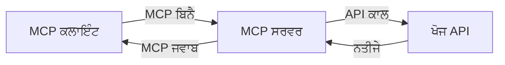
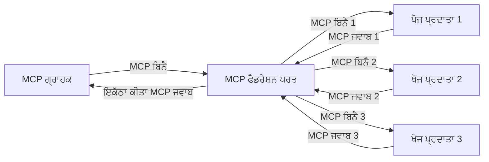
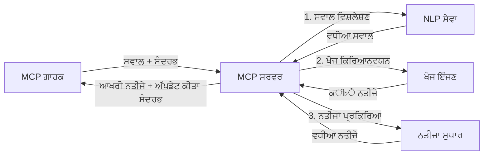

# ਮਾਡਲ ਸੰਦਰਭ ਪ੍ਰੋਟੋਕਾਲ ਵਾਸਤੇ ਲਾਈਵ ਵੈੱਬ ਖੋਜ

## ਓਵਰਵਿਊ

ਲਾਈਵ ਵੈੱਬ ਖੋਜ ਅੱਜਕੱਲ੍ਹ ਦੇ ਜਾਣਕਾਰੀ-ਚਲਾਏ ਜਾਣ ਵਾਲੇ ਮਾਹੌਲ ਵਿੱਚ ਬਹੁਤ ਜਰੂਰੀ ਹੋ ਗਈ ਹੈ, ਜਿੱਥੇ ਐਪਲੀਕੇਸ਼ਨ ਨੂੰ ਇੰਟਰਨੈੱਟ 'ਤੇ ਤੱਤਕਾਲ ਅਪਡੇਟ ਕੀਤੀ ਜਾਣਕਾਰੀ ਤੱਕ ਤੁਰੰਤ ਪਹੁੰਚ ਦੀ ਲੋੜ ਹੁੰਦੀ ਹੈ ਤਾਂ ਜੋ ਉਹ ਪ੍ਰਸੰਗਿਕ ਅਤੇ ਸਮੇਂ-ਸੁਚਿਤ ਜਵਾਬ ਦੇ ਸਕਣ। ਮਾਡਲ ਸੰਦਰਭ ਪ੍ਰੋਟੋਕਾਲ (ਐਮਸੀਪੀ) ਇਨ੍ਹਾਂ ਲਾਈਵ ਖੋਜ ਪ੍ਰਕਿਰਿਆਵਾਂ ਨੂੰ ਸੁਧਾਰਨ ਵਿੱਚ ਇੱਕ ਮਹੱਤਵਪੂਰਕ ਤਰੱਕੀ ਪ੍ਰਦਾਨ ਕਰਦਾ ਹੈ, ਖੋਜ ਦੀ ਕਾਰਗੁਜ਼ਾਰੀ ਨੂੰ ਬਿਹਤਰ ਬਣਾਉਂਦਾ ਹੈ, ਸੰਦਰਭ ਦੀ ਅਖੰਡਤਾ ਨੂੰ ਕਾਇਮ ਰੱਖਦਾ ਹੈ, ਅਤੇ ਕੁੱਲ ਪ੍ਰਣਾਲੀ ਦੇ ਪ੍ਰਦਰਸ਼ਨ ਨੂੰ ਸੁਧਾਰਦਾ ਹੈ।

ਇਹ ਮਾਡਿਊਲ ਵੇਖਦਾ ਹੈ ਕਿ ਕਿਵੇਂ ਐਮਸੀਪੀ ਲਾਈਵ ਵੈੱਬ ਖੋਜ ਨੂੰ ਬਦਲਦਾ ਹੈ ਅਤੇ ਏਆਈ ਮਾਡਲ, ਖੋਜ ਇੰਜਣ ਅਤੇ ਐਪਲੀਕੇਸ਼ਨਾਂ ਵਿੱਚ ਸੰਦਰਭ ਪਰਬੰਧਨ ਲਈ ਇੱਕ ਸਾਧਾਰਣ ਰਵੱਈਏ ਨੂੰ ਮੁਹैया ਕਰਵਾਉਂਦਾ ਹੈ।

### ਤੁਹਾਨੂੰ ਕੀ ਸਿੱਖਣ ਨੂੰ ਮਿਲੇਗਾ

ਇਸ ਵਿਸਤ੍ਰਿਤ ਗਾਈਡ ਵਿੱਚ, ਤੁਸੀਂ ਪਤਾ ਲਗਾਵੋਗੇ:

- ਕਿਵੇਂ ਐਮਸੀਪੀ ਏਆਈ ਮਾਡਲਾਂ ਅਤੇ ਲਾਈਵ ਵੈੱਬ ਖੋਜ ਸਮਰੱਥਾਵਾਂ ਵਿਚਕਾਰ ਇੱਕ ਬੇਧੜਕ ਪੁਲ ਬਣਾਉਂਦਾ ਹੈ
- ਮਾਡਲਾਂ ਵਿੱਚ ਕਾਰਗੁਜ਼ਾਰ ਅਤੇ ਸਕੇਲਯੋਗ ਖੋਜ ਹੱਲ ਲਾਗੂ ਕਰਨ ਲਈ ਆਰਕੀਟੈਕਚਰਲ ਪੈਟਰਨ
- ਕਈ ਪ੍ਰਸ਼ਨਾਂ ਅਤੇ ਇੰਟਰੈਕਸ਼ਨਾਂ ਦੌਰਾਨ ਖੋਜ ਸੰਦਰਭ ਕਾਇਮ ਰੱਖਣ ਦੀਆਂ ਤਕਨੀਕਾਂ
- ਵੱਖ-ਵੱਖ ਖੋਜ ਸੈਨਾਰਿਓਜ਼ ਵਾਸਤੇ Python ਅਤੇ JavaScript ਵਿੱਚ ਪ੍ਰਯੋਗਿਕ ਕੋਡ ਲਾਗੂ ਕਰਨਾ
- ਐਮਸੀਪੀ-ਸੰਚਾਲਿਤ ਖੋਜ ਪ੍ਰਣਾਲੀਆਂ ਵਿੱਚ ਪ੍ਰਸੰਗਿਕਤਾ, ਤਾਜਗੀ, ਅਤੇ ਕਾਰਗੁਜ਼ਾਰੀ ਨੂੰ ਬੈਲੈਂਸ ਕਰਨ ਦੇ ਢੰਗ

## ਲਾਈਵ ਵੈੱਬ ਖੋਜ ਦਾ ਪਰਿਚਯ

ਲਾਈਵ ਵੈੱਬ ਖੋਜ ਇੱਕ ਤਕਨੀਕੀ ਤਰੀਕਾ ਹੈ ਜੋ ਲਗਾਤਾਰ ਪ੍ਰਸ਼ਨਾਂ, ਪ੍ਰਕਿਰਿਆ, ਅਤੇ ਵੈੱਬ ਅਧਾਰਿਤ ਜਾਣਕਾਰੀ ਦਾ ਵਿਸ਼ਲੇਸ਼ਣ ਕਰਨ ਵਿੱਚ ਸਹਾਇਤਾ ਕਰਦਾ ਹੈ ਜਿਵੇਂ ਉਹ ਛਪਾਈ ਜਾਂ ਅੱਪਡੇਟ ਹੁੰਦੀ ਹੈ, ਜਿਸ ਨਾਲ ਪ੍ਰਣਾਲੀਆਂ ਨੂੰ ਘੱਟ ਤੋਂ ਘੱਟ ਦੇਰੀ ਨਾਲ ਨਵੀਂ ਅਤੇ ਸੰਦਰਭਿਕ ਜਾਣਕਾਰੀ ਪ੍ਰদান ਕਰਨ ਦੀ ਸਮਰੱਥਾ ਮਿਲਦੀ ਹੈ। ਪਰੰਪਰਾਗਤ ਖੋਜ ਪ੍ਰਣਾਲੀਆਂ ਨਾਲੋਂ ਵੱਖਰਾ, ਜੋ ਇੰਡੈਕਸਡ ਡੇਟਾ ਉੱਤੇ ਕੰਮ ਕਰਦੀਆਂ ਹਨ ਜੋ ਘੰਟਿਆਂ ਜਾਂ ਦਿਨਾਂ ਪੁਰਾਣਾ ਹੋ ਸਕਦਾ ਹੈ, ਲਾਈਵ ਖੋਜ ਵੈੱਬ ਤੋਂ ਤਤਕਾਲ ਡਾਟਾ ਪ੍ਰਕਿਰਿਆ ਕਰਦਾ ਹੈ ਅਤੇ ਆਨਲਾਈਨ ਸਮੱਗਰੀ ਦੀ ਮੌਜੂਦਾ ਹਾਲਤ ਨੂੰ ਦਰਸਾਉਂਦਾ ਹੈ।

### ਲਾਈਵ ਵੈੱਬ ਖੋਜ ਦੇ ਮੁੱਖ ਢਾਂਚੇ:

- **ਲਗਾਤਾਰ ਪ੍ਰਸ਼ਨ ਪ੍ਰਕਿਰਿਆ**: ਖੋਜ ਪ੍ਰਸ਼ਨ ਲਗਾਤਾਰ ਅੱਪਡੇਟ ਹੋ ਰਹੇ ਡਾਟਾ ਸ੍ਰੋਤਾਂ ਦੇ ਖਿਲਾਫ ਪ੍ਰਕਿਰਿਆ ਕਰਦੇ ਹਨ
- **ਤਾਜਗੀ ਨੂੰ ਤਰਜੀਹ**: ਪ੍ਰਣਾਲੀ ਨਵੀਂ ਜਾਣਕਾਰੀ ਨੂੰ ਤਰਜੀਹ ਦਿੰਦੀ ਹੈ
- **ਪ੍ਰਸੰਗਿਕਣ ਦਾ ਸਨੀਚਿਤ ਕਰਨਾ**: ਪ੍ਰਸੰਗਿਕਤਾ ਅਤੇ ਤਾਜਗੀ ਵਿੱਚ ਸੰਤੁਲਨ ਬਣਾਉਣਾ
- **ਸਕੇਲਯੋਗ ਆਰਕੀਟੈਕਚਰ**: ਪ੍ਰਣਾਲੀਆਂ ਨੂੰ ਵੱਖ-ਵੱਖ ਪ੍ਰਸ਼ਨ ਲੋਡਾਂ ਅਤੇ ਡਾਟਾ ਮਾਤਰਾ ਨੂੰ ਸੰਭਾਲਣਾ ਚਾਹੀਦਾ ਹੈ
- **ਸੰਦਰਭ ਪਰਕਿਰਿਆ**: ਖੋਜ ਦੁਹਾਈਆਂ ਦੌਰਾਨ ਉਪਭੋਗੀ ਸੰਦਰਭ ਨੂੰ ਕਾਇਮ ਰੱਖਣਾ ਅਰਥਪੂਰਨ ਨਤੀਜੇ ਲਈ ਮਹੱਤਵਪੂਰਕ ਹੈ
- **ਗਤਿਸੀਲ ਪ੍ਰਸ਼ਨ ਪੁਨਰ-ਗਠਨ**: ਸੰਦਰਭ ਅਤੇ ਪਹਿਲੇ ਨਤੀਜਿਆਂ ਦੇ ਆਧਾਰ 'ਤੇ ਪ੍ਰਸ਼ਨਾਂ ਨੂੰ ਸਮਾਇਕ ਤੌਰ 'ਤੇ ਬਦਲਣਾ
- **ਬਹੁ-ਸਰੋਤ ਇੰਟਿਗ੍ਰੇਸ਼ਨ**: ਕਈ ਖੋਜ ਮੁਹੱਈਆਕਾਰਾਂ ਅਤੇ ਵੈੱਬ ਸਰੋਤਾਂ ਦੇ ਨਤੀਜੇ ਜੋੜਨਾ
- **ਅਰਥਾਤਮਕ ਸਮਝ**: ਸਿਰਫ ਕੀਵਰਡਾਂ ਦੇ ਬਜਾਏ ਅਰਥ ਦੇ ਅਧਾਰ 'ਤੇ ਪ੍ਰਸ਼ਨਾਂ ਅਤੇ ਸਮੱਗਰੀ ਦਾ ਪ੍ਰਕਿਰਿਆ
- **ਲਾਈਵ ਰੈਂਕਿੰਗ**: ਨਵੇਂ ਜਾਣਕਾਰੀ ਮੌਜੂਦ ਹੋਣ ਦੇ ਨਾਲ ਨਤੀਜਿਆਂ ਦੀ ਮੁਕਾਬਲਾ-ਵਾਰ ਦਰਜਾ ਜਾਰੀ ਰੱਖਣਾ

### ਮਾਡਲ ਸੰਦਰਭ ਪ੍ਰੋਟੋਕਾਲ ਅਤੇ ਲਾਈਵ ਵੈੱਬ ਖੋਜ

ਮਾਡਲ ਸੰਦਰਭ ਪ੍ਰੋਟੋਕਾਲ (ਐਮਸੀਪੀ) ਲਾਈਵ ਵੈੱਬ ਖੋਜ ਵਾਤਾਵਰਣ ਵਿੱਚ ਕਈ ਅਹੰਕਾਰਪੂਰਣ ਚੁਣੌਤੀਆਂ ਦਾ ਸੁਧਾਰ ਕਰਦਾ ਹੈ:

1. **ਖੋਜ ਸੰਦਰਭ ਦੀ ਰੱਖਿਆ**: ਐਮਸੀਪੀ ਇਹ ਕਾਇਮ ਕਰਦਾ ਹੈ ਕਿ ਵੰਡੇ ਹੋਏ ਖੋਜ ਘਟਕਾਂ ਵਿਚ ਸੰਦਰਭ ਕਿਵੇਂ ਸੰਭਾਲਿਆ ਜਾਂਦਾ ਹੈ, ਇਹ ਯਕੀਨੀ ਬਣਾਉਂਦਾ ਹੈ ਕਿ ਏਆਈ ਮਾਡਲਾਂ ਅਤੇ ਪ੍ਰਕਿਰਿਆ ਨੋਡਾਂ ਨੂੰ ਪ੍ਰਸੰਗਿਕ ਪ੍ਰਸ਼ਨ ਇਤਿਹਾਸ ਅਤੇ ਉਪਭੋਗੀ ਪਸੰਦਾਂ ਤੱਕ ਪਹੁੰਚ ਰਹੇ।

2. **ਕੁਸ਼ਲ ਪ੍ਰਸ਼ਨ ਪ੍ਰਬੰਧਨ**: ਸੰਦਰਭ ਸੰਚਾਰ ਲਈ ਸੰਰਚਿਤ ਮਕੈਨਿਜ਼ਮ ਦਿੰਦੇ ਹੋਏ, ਐਮਸੀਪੀ ਹਰੇਕ ਖੋਜ ਚੱਕਰ ਵਿੱਚ ਸੰਦਰਭ ਦੁਹਰਾਉਣ ਦੀ ਓਵਰਹੈੱਡ ਘਟਾਉਂਦਾ ਹੈ।

3. **ਇੰਟਰਓਪਰੇਬਲਿਟੀ**: ਐਮਸੀਪੀ ਵੱਖ-ਵੱਖ ਖੋਜ ਤਕਨੀਕਾਂ ਅਤੇ ਏਆਈ ਮਾਡਲਾਂ ਵਿੱਚ ਸੰਦਰਭ ਸਾਂਝਾ ਕਰਨ ਵਾਸਤੇ ਇੱਕ ਆਮ ਭਾਸ਼ਾ ਬਣਾਉਂਦਾ ਹੈ, ਜੋ ਹੋਰ ਲਚਕੀਲੇ ਅਤੇ ਬਡ਼ਾਏ ਜਾ ਸਕਣ ਵਾਲੇ ਆਰਕੀਟੈਕਚਰ ਬਣਾਉਂਦਾ ਹੈ।

4. **ਖੋਜ-ਸੁਧਾਰਿਤ ਸੰਦਰਭ**: ਐਮਸੀਪੀ ਲਾਗੂ ਕਰਨ ਨਾਲ ਖੋਜ ਲਈ ਸਭ ਤੋਂ ਪ੍ਰਸੰਗਿਕ ਸੰਦਰਭ ਤੱਤਾਂ ਨੂੰ ਤਰਜੀਹ ਦਿੱਤੀ ਜਾ ਸਕਦੀ ਹੈ, ਕਾਰਗੁਜ਼ਾਰੀ ਅਤੇ ਸਹੀਤਾ ਦੋਹਾਂ ਲਈ ਆਪਟੀਮਾਈਜ਼ ਕੀਤਾ ਜਾ ਸਕਦਾ ਹੈ।

5. **ਐਡਾਪਟਿਵ ਖੋਜ ਪ੍ਰਕਿਰਿਆ**: ਐਮਸੀਪੀ ਦੇ ਜ਼ਰੀਏ ਸਹੀ ਸੰਦਰਭ ਪਰਬੰਧਨ ਨਾਲ, ਖੋਜ ਪ੍ਰਣਾਲੀਆਂ ਉਪਭੋਗੀ ਦੀਆਂ ਬਦਲ ਰਹੀਆਂ ਲੋੜਾਂ ਅਤੇ ਜਾਣਕਾਰੀ ਹਾਲਾਤ ਦੇ ਅਧਾਰ 'ਤੇ ਪ੍ਰਕਿਰਿਆ ਨੂੰ ਗਤੀਸ਼ੀਲ ਤੌਰ 'ਤੇ ਬਦਲ ਸਕਦੀਆਂ ਹਨ।

ਆਧੁਨਿਕ ਐਪਲੀਕੇਸ਼ਨਾਂ ਵਿੱਚ ਜੋ ਖ਼ਬਰ ਦਰਸ਼ਾਵਾਂ ਤੋਂ ਲੈ ਕੇ ਖੋਜ ਸਹਾਇਤਾਵਾਂ ਤੱਕ ਹਨ, ਐਮਸੀਪੀ ਦਾ ਵੈੱਬ ਖੋਜ ਤਕਨੀਕਾਂ ਨਾਲ ਇੰਟਿਗ੍ਰੇਸ਼ਨ ਹੋਰ ਬੁੱਧੀਮਾਨ, ਸੰਦਰਭ-ਜਾਣੂ ਖੋਜ ਯਕੀਨੀ ਬਣਾਉਂਦਾ ਹੈ, ਜੋ ਜਿਵੇਂ ਜਿਵੇਂ ਉਪਭੋਗੀ ਦੀਆਂ ਇੰਟਰੈਕਸ਼ਨਾਂ ਵਧਦੀਆਂ ਹਨ ਪ੍ਰਸੰਗਿਕ ਨਤੀਜੇ ਪ੍ਰਦਾਨ ਕਰ ਸਕਦਾ ਹੈ।

## ਸਿੱਖਣ ਦੇ ਲੱਛਣ

ਇਸ ਪਾਠ ਦੇ ਅੰਤ ਤੱਕ, ਤੁਸੀਂ ਸਮਰੱਥ ਹੋਵੋਗੇ:

- ਲਾਈਵ ਵੈੱਬ ਖੋਜ ਦੇ ਬੁਨਿਆਦੀ ਤੱਥ ਅਤੇ ਆਧੁਨਿਕ ਐਪਲੀਕੇਸ਼ਨਾਂ ਵਿੱਚ ਇਸ ਦੀਆਂ ਚੁਣੌਤੀਆਂ ਨੂੰ ਸਮਝਣਾ
- ਸਮਝਾਉਣਾ ਕਿ ਕਿਵੇਂ ਮਾਡਲ ਸੰਦਰਭ ਪ੍ਰੋਟੋਕਾਲ (ਐਮਸੀਪੀ) ਲਾਈਵ ਵੈੱਬ ਖੋਜ ਸਮਰੱਥਾਵਾਂ ਨੂੰ ਸੁਧਾਰਦਾ ਹੈ
- ਲੋਕਪ੍ਰਿਯ ਫਰੇਮਵਰਕ ਅਤੇ ਏਪੀਆਈਜ਼ ਦੀ ਵਰਤੋਂ ਨਾਲ ਐਮਸੀਪੀ-ਆਧਾਰਿਤ ਖੋਜ ਹੱਲ ਲਾਗੂ ਕਰਨਾ
- ਐਮਸੀਪੀ ਨਾਲ ਸਕੇਲਯੋਗ, ਉੱਚ-ਕਾਰਗੁਜ਼ਾਰੀ ਵਾਲੇ ਖੋਜ ਆਰਕੀਟੈਕਚਰ ਡਿਜ਼ਾਈਨ ਅਤੇ ਤੈਨਾਤ ਕਰਨਾ
- ਐਮਸੀਪੀ ਸੰਕਲਪਾਂ ਨੂੰ ਵੱਖ-ਵੱਖ ਵਰਤੋਂ ਦੇ ਕੇਸਾਂ ਵਿੱਚ ਲਾਗੂ ਕਰਨਾ ਜਿਵੇਂ ਅਰਥਾਤਮਕ ਖੋਜ, ਖੋਜ ਸਹਾਇਤਾ, ਅਤੇ ਏਆਈ-ਵਾਧੂਤ ਬ੍ਰਾਊਜ਼ਿੰਗ
- ਉਭਰ ਰਹੇ ਰੁਝਾਨਾਂ ਅਤੇ ਭਵਿੱਖ ਦੇ ਨਵੀਨਤਮ ਤਕਨਾਲੋਜੀਆਂ ਦਾ ਮੁਲਾਂਕਣ ਕਰਨਾ ਜੋ ਐਮਸੀਪੀ-ਆਧਾਰਿਤ ਖੋਜ ਲਈ ਹਨ
- ਇੰਟਰੈਕਸ਼ਨਾਂ ਤੋਂ ਸਿਖਣ ਵਾਲੀਆਂ ਸੰਦਰਭ-ਜਾਣੂ ਖੋਜ ਪ੍ਰਣਾਲੀਆਂ ਵਿਕਸਤ ਕਰਨੀ
- ਮਿਆਰੀ ਐਮਸੀਪੀ ਪ੍ਰੋਟੋਕਾਲਾਂ ਦੀ ਵਰਤੋਂ ਕਰਕੇ ਏਆਈ ਸਹਾਇਤਾਵਾਂ ਵਿੱਚ ਵੈੱਬ ਖੋਜ ਸਮਰੱਥਾਵਾਂ ਨੂੰ ਜੋੜਨਾ
- ਕਈ-ਚਰਣ ਵਾਲੀਆਂ ਖੋਜ ਪਾਈਪਲਾਈਨਾਂ ਬਣਾਉਂਦੀਆਂ ਹਨ ਜੋ ਸੰਦਰਭ ਦੇ ਅਧਾਰ 'ਤੇ ਨਤੀਜਿਆਂ ਨੂੰ ਕ੍ਰਮਵੱਧੀ ਸੁਧਾਰ ਕਰਦੀਆਂ ਹਨ
- ਵਿਸਤ੍ਰਿਤ ਸੰਦਰਭ ਜਾਗਰੂਕਤਾ ਦੌਰਾਨ ਖੋਜ ਪ੍ਰਦਰਸ਼ਨ ਨੂੰ ਬਹੁਤੱਮ ਬਣਾਉਣਾ

### ਪਰਿਭਾਸ਼ਾ ਅਤੇ ਮਹੱਤਤਾ

ਲਾਈਵ ਵੈੱਬ ਖੋਜ ਵੈੱਬ ਅਧਾਰਿਤ ਜਾਣਕਾਰੀ ਦੀ ਲਗਾਤਾਰ ਖੋਜ, ਪ੍ਰਾਪਤੀ ਅਤੇ ਸੁਚਿਤ ਪ੍ਰਦਾਨ ਵਿੱਚ ਸਹਾਇਤਾ ਕਰਦੀ ਹੈ ਜਿਸ ਵਿੱਚ ਘੱਟੋ-ਘੱਟ ਦੇਰੀ ਹੁੰਦੀ ਹੈ। ਪਰੰਪਰਾਗਤ ਖੋਜ ਇੰਜਣ ਜੋ ਵੈੱਬ ਨੂੰ ਸਮੇਤ ਸਮੇਤ ਕਰਕੇ ਅਤੇ ਸੂਚੀਬੱਧ ਕਰਦੇ ਹਨ, ਉਸਦੇ ਉਲਟ ਲਾਈਵ ਖੋਜ ਜਾਣਕਾਰੀ ਨੂੰ ਜਿਵੇਂ ਉਹ ਉਪਲਬਧ ਹੁੰਦੀ ਹੈ ਤੁਰੰਤ ਸਰਫੇਸ ਕਰਨ ਦਾ ਲਕਸ਼ ਬਣਾਉਂਦੀ ਹੈ, ਜਿਸ ਨਾਲ ਸਭ ਤੋਂ ਤਾਜ਼ਾ ਸਮੱਗਰੀ ਤੁਰੰਤ ਮਿਲਦੀ ਹੈ।

ਲਾਈਵ ਵੈੱਬ ਖੋਜ ਦੀਆਂ ਮੁੱਖ ਖ਼ਾਸੀਅਤਾਂ ਹਨ:

- **ਤਾਜ਼ਗੀ**: ਨਵੀਂ ਸਮੱਗਰੀ ਅਤੇ ਅੱਪਡੇਟਾਂ ਨੂੰ ਤਰਜੀਹ ਦੇਣਾ
- **ਲਗਾਤਾਰ ਪ੍ਰਕਿਰਿਆ**: ਨਵੀਂ ਜਾਣਕਾਰੀ ਲਈ ਲਗਾਤਾਰ ਨਿਗਰਾਨੀ ਕਰਨੀ
- **ਪ੍ਰਸ਼ਨ ਅਨੁਕੂਲਤਾ**: ਸੰਦਰਭ ਅਤੇ ਪ੍ਰਤਿਕਿਰਿਆ ਦੇ ਆਧਾਰ 'ਤੇ ਖੋਜ ਪ੍ਰਸ਼ਨਾਂ ਦਾ ਸੁਧਾਰ ਕਰਨਾ
- **ਤੁਰੰਤ ਸਪੁਰਦਗੀ**: ਘੱਟ ਤੋਂ ਘੱਟ ਦੇਰੀ ਨਾਲ ਨਤੀਜੇ ਉਪਲਬਧ ਕਰਵਾਉਣਾ
- **ਸੰਦਰਭ ਧਾਰਨਾ**: ਬਿਹਤਰ ਪ੍ਰਸੰਗਿਕਤਾ ਲਈ ਪਿਛਲੇ ਪ੍ਰਸ਼ਨਾਂ ਦੀ ਵਰਤੋਂ ਕਰਨਾ

### ਪਰੰਪਰਾਗਤ ਵੈੱਬ ਖੋਜ ਵਿੱਚ ਚੁਣੌਤੀਆਂ

ਪਰੰਪਰਾਗਤ ਵੈੱਬ ਖੋਜ ਦ੍ਰਿਸ਼ਟਿਕੋਣ ਲਾਈਵ ਸੈਨਾਰਿਓਜ਼ 'ਚ ਕਈ ਸੀਮਾਵਾਂ ਨਾਲ ਜੂਝਦੇ ਹਨ:

1. **ਸੰਦਰਭ ਭਿੰਨ-ਭਿੰਨ ਹਿੱਸਿਆਂ ਵਿੱਚ ਟੁੱਟਣਾ**: ਕਈ ਪ੍ਰਸ਼ਨਾਂ ਵਿੱਚ ਖੋਜ ਸੰਦਰਭ ਨੂੰ ਕਾਇਮ ਰੱਖਣ ਵਿੱਚ ਮੁਸ਼ਕਿਲ
2. **ਸੂਚਨਾ ਦੀ ਤਾਜ਼ਗੀ**: ਸਭ ਤੋਂ ਤਾਜ਼ਾ ਜਾਣਕਾਰੀ ਤੱਕ ਪਹੁੰਚ ਅਤੇ ਤਰਜੀਹ ਵਿੱਚ ਚੁਣੌਤੀਆਂ
3. **ਇੰਟੀਗ੍ਰੇਸ਼ਨ ਦੀ ਜਟਿਲਤਾ**: ਖੋਜ ਪ੍ਰਣਾਲੀ ਅਤੇ ਐਪਲੀਕੇਸ਼ਨਾਂ ਵਿਚਕਾਰ ਇੰਟਰਓਪਰੇਬਿਲਿਟੀ ਸਮੱਸਿਆਵਾਂ
4. **ਵਿਲੰਬ ਸਮੱਸਿਆਵਾਂ**: ਵਿਆਪਕ ਖੋਜ ਅਤੇ ਪ੍ਰਤੀਕਿਰਿਆ ਸਮੇਂ ਦੇ ਲੋੜਾਂ ਵਿੱਚ ਸੰਤੁਲਨ
5. **ਪ੍ਰਸੰਗਿਕਤਾ ਦੀ ਸਮੇਂ-ਸੁਧਾਰ**: ਤਾਜ਼ਗੀ ਨੁੰ ਤਰਜੀਹ ਦਿੰਦਿਆਂ ਸਹੀਤਾ ਅਤੇ ਪ੍ਰਸੰਗਿਕਤਾ ਯਕੀਨੀ ਬਣਾਉਣਾ

## ਖੋਜ ਲਈ ਮਾਡਲ ਸੰਦਰਭ ਪ੍ਰੋਟੋਕਾਲ (ਐਮਸੀਪੀ) ਨੂੰ ਸਮਝਣਾ

### ਖੋਜ ਸੰਦਰਭਾਂ ਵਿੱਚ ਐਮਸੀਪੀ ਕੀ ਹੈ?

ਮਾਡਲ ਸੰਦਰਭ ਪ੍ਰੋਟੋਕਾਲ (ਐਮਸੀਪੀ) ਇੱਕ ਮਿਆਰੀਕਰਿਤ ਸੰਚਾਰ ਪ੍ਰੋਟੋਕਾਲ ਹੈ ਜੋ ਏਆਈ ਮਾਡਲਾਂ ਅਤੇ ਐਪਲੀਕੇਸ਼ਨਾਂ ਵਿਚਕਾਰ ਪ੍ਰਭਾਵਸ਼ਾਲੀ ਇੰਟਰੈਕਸ਼ਨ ਨੂੰ ਸੁਗਮ ਬਣਾਉਂਦਾ ਹੈ। ਲਾਈਵ ਵੈੱਬ ਖੋਜ ਦੇ ਸੰਦਰਭ ਵਿੱਚ, ਐਮਸੀਪੀ ਹੇਠਾਂ ਦਿੱਤੇ ਲਈ ਢਾਂਚਾ ਪ੍ਰਦਾਨ ਕਰਦਾ ਹੈ:

- ਪ੍ਰਸ਼ਨ ਲੜੀਵਾਰਾਂ ਦੌਰਾਨ ਖੋਜ ਸੰਦਰਭ ਦੀ ਰੱਖਿਆ
- ਖੋਜ ਪ੍ਰਸ਼ਨ ਅਤੇ ਨਤੀਜੇ ਦੇ ਫਾਰਮੈਟਾਂ ਨੂੰ ਮਿਆਰੀਕਰਿਤ ਕਰਨਾ
- ਖੋਜ ਪੈਰਾਮੀਟਰ ਅਤੇ ਨਤੀਜਿਆਂ ਦੇ ਸੰਚਾਰ ਨੂੰ ਆਪਟਮਾਈਜ਼ ਕਰਨਾ
- ਮਾਡਲ ਤੋਂ ਖੋਜ ਇੰਜਣ ਤੱਕ ਸੰਚਾਰ ਵਿੱਚ ਸੁਧਾਰ ਕਰਨਾ

### ਮੁੱਖ ਘਟਕ ਅਤੇ ਆਰਕੀਟੈਕਚਰ

ਲਾਈਵ ਵੈੱਬ ਖੋਜ ਲਈ ਐਮਸੀਪੀ ਆਰਕੀਟੈਕਚਰ ਵਿੱਚ ਕਈ ਮੁੱਖ ਭਾਗ ਸ਼ਾਮਲ ਹਨ:

1. **ਪ੍ਰਸ਼ਨ ਸੰਦਰਭ ਹੈਂਡਲਰ**: ਕਈ ਪ੍ਰਸ਼ਨਾਂ ਵਿੱਚ ਖੋਜ ਸੰਦਰਭ ਨੂੰ ਸੰਭਾਲਣਾ ਅਤੇ ਬਰਕਰਾਰ ਰੱਖਣਾ
2. **ਖੋਜ ਪ੍ਰੋਸੈਸਰ**: ਸੰਦਰਭ-ਜਾਣੂ ਤਕਨੀਕਾਂ ਦਾ ਵਰਤੋਂ ਕਰਕੇ ਆ ਰਹੀਆਂ ਖੋਜ ਮੰਗਾਂ ਦੀ ਪ੍ਰਕਿਰਿਆ ਕਰਨਾ
3. **ਪ੍ਰੋਟੋਕਾਲ ਐਡਾਪਟਰ**: ਵੱਖ-ਵੱਖ ਖੋਜ ਏਪੀਆਈਜ਼ ਵਿਚਕਾਰ ਬਦਲਾਅ ਕਰਦੇ ਹੋਏ ਸੰਦਰਭ ਨੂੰ ਬਰਕਰਾਰ ਰੱਖਣਾ
4. **ਸੰਦਰਭ ਸਟੋਰ**: ਖੋਜ ਇਤਿਹਾਸ ਅਤੇ ਪਸੰਦਾਂ ਨੂੰ ਪਰਣਾਲੀ ਬਣਾ ਕੇ ਸੰਗ੍ਰਹਿਤ ਅਤੇ ਮੁੜ ਪ੍ਰਾਪਤ ਕਰਨਾ
5. **ਖੋਜ ਕਨੈਕਟਰ**: ਵੱਖ-ਵੱਖ ਖੋਜ ਇੰਜਣਾਂ ਅਤੇ ਵੈੱਬ ਏਪੀਆਈਜ਼ ਨਾਲ ਜੋੜਨਾ

```mermaid
graph TD
    subgraph "ਡਾਟਾ ਸਰੋਤ"
        Web[ਵੈੱਬ ਸਮੱਗਰੀ]
        APIs[ਬਾਹਰੀ ਏਪੀਆਈਜ਼]
        DB[ਗਿਆਨ ਅਧਾਰ]
        News[ਖ਼ਬਰਾਂ ਫੀਡ]
    end

    subgraph "ਐਮਸੀਪੀ ਖੋਜ ਪਰਤ"
        SC[ਖੋਜ ਕਨੈਕਟਰ]
        PA[ਪ੍ਰੋਟੋਕੋਲ ਐਡੈਪਟਰ]
        CH[ਸੰਦਰਭ ਹੈਂਡਲਰ]
        SP[ਖੋਜ ਪ੍ਰੋਸੈਸਰ]
        CS[ਸੰਦਰਭ ਸਟੋਰ]
    end

    subgraph "ਪ੍ਰੋਸੈਸਿੰਗ ਅਤੇ ਵਿਸ਼ਲੇਸ਼ਣ"
        RE[ਪ੍ਰাসੰਗਿਕਤਾ ਇੰਜਣ]
        ML[ਐਮਐਲ ਮਾਡਲ]
        NLP[ਐਨਐਲਪੀ ਪ੍ਰੋਸੈਸਿੰਗ]
        Rank[ਰੈਂਕਿੰਗ ਸਿਸਟਮ]
    end

    subgraph "ਐਪਲੀਕੇਸ਼ਨ ਅਤੇ ਸੇਵਾਵਾਂ"
        RA[ਖੋਜ ਸਹਾਇਕ]
        Alerts[ਅਲਰਟ ਸਿਸਟਮ]
        KB[ਗਿਆਨ ਅਧਾਰ]
        API[ਏਪੀਆਈ ਸੇਵਾਵਾਂ]
    end

    Web -->|ਸਮੱਗਰੀ| SC
    APIs -->|ਡਾਟਾ| SC
    DB -->|ਗਿਆਨ| SC
    News -->|ਅਪਡੇਟ| SC
    
    SC -->|ਕੱਚੇ ਨਤੀਜੇ| PA
    PA -->|ਸਧਾਰਣ ਨਤੀਜੇ| CH
    CH <-->|ਸੰਦਰਭ ਕਾਰਵਾਈਆਂ| CS
    CH -->|ਸੰਦਰਭ ਨਾਲ ਭਰਪੂਰ ਨਤੀਜੇ| SP
    SP -->|ਪ੍ਰੋਸੈਸ ਕੀਤੇ ਨਤੀਜੇ| RE
    SP -->|ਫੀਚਰ| ML
    SP -->|ਲਿਖਤ| NLP
    
    RE -->|ਰੈਂਕ ਕੀਤੇ ਨਤੀਜੇ| Rank
    ML -->|ਅਨੁਮਾਨ| Rank
    NLP -->|ਇੱਕਾਈਆਂ ਅਤੇ ਸਬੰਧ| Rank
    
    Rank -->|ਆਖਰੀ ਨਤੀਜੇ| RA
    ML -->|ਅੰਦਰੂਨੀ ਜਾਣਕਾਰੀ| Alerts
    NLP -->|ਸੰਰਚਿਤ ਡਾਟਾ| KB
    
    RA -->|ਖੋਜ| Users((Users))
    Alerts -->|ਸੂਚਨਾਵਾਂ| Users
    KB <-->|ਗਿਆਨ ਪਹੁੰਚ| API

    classDef sources fill:#f9f,stroke:#333,stroke-width:2px,color:#4a004a
    classDef mcp fill:#bbf,stroke:#333,stroke-width:2px,color:#00004a
    classDef processing fill:#bfb,stroke:#333,stroke-width:2px,color:#003300
    classDef apps fill:#fbb,stroke:#333,stroke-width:2px,color:#4a0000
    
    class Web,APIs,DB,News sources
    class SC,PA,CH,SP,CS mcp
    class RE,ML,NLP,Rank processing
    class RA,Alerts,KB,API apps
```



### ਐਮਸੀਪੀ ਕਿਵੇਂ ਲਾਈਵ ਵੈੱਬ ਖੋਜ ਨੂੰ ਸੁਧਾਰਦਾ ਹੈ

ਐਮਸੀਪੀ ਪਰੰਪਰਾਗਤ ਵੈੱਬ ਖੋਜ ਚੁਣੌਤੀਆਂ ਦਾ ਹੱਲ ਕਰਦਾ ਹੈ:

- **ਸੰਦਰਭਕ ਲਗਾਤਾਰਤਾ**: ਪੂਰੇ ਖੋਜ ਸੈਸ਼ਨ ਵਿੱਚ ਪ੍ਰਸ਼ਨਾਂ ਦੇ ਦਰਮਿਆਨ ਸੰਬੰਧ ਬਣਾਏ ਰੱਖਣਾ
- **ਆਪਟਮਾਈਜ਼ਡ ਟ੍ਰਾਂਸਮੀਸ਼ਨ**: ਬੁੱਧੀਮਾਨ ਸੰਦਰਭ ਪਰਬੰਧਨ ਰਾਹੀਂ ਖੋਜ ਪੈਰਾਮੀਟਰਾਂ ਵਿੱਚ ਦੁਹਰਾਵਟ ਘਟਾਉਣਾ
- **ਮਿਆਰੀਕਰਿਤ ਇੰਟਰਫੇਸ**: ਖੋਜ ਖੰਡਾਂ ਲਈ ਸਥਿਰ ਏਪੀਆਈ ਪ੍ਰਦਾਨ ਕਰਨਾ
- **ਵਿਲੰਬ ਘਟਾਉਣ**: ਪ੍ਰਭਾਵਸ਼ਾਲੀ ਸੰਦਰਭ ਸੰਭਾਲ ਕੇ ਪ੍ਰਕਿਰਿਆ ਓਵਰਹੈੱਡ ਨੂੰ ਘਟਾਉਣਾ
- **ਵਧੀਆ ਪ੍ਰਸੰਗਿਕਤਾ**: ਕਈ ਪ੍ਰਸ਼ਨਾਂ ਦੌਰਾਨ ਉਪਭੋਗੀ ਦੀ ਭਾਵਨਾ ਨੂੰ ਬਰਕਰਾਰ ਰੱਖਕੇ ਖੋਜ ਪ੍ਰਸੰਗਿਕਤਾ ਨੂੰ ਮਜ਼ਬੂਤ ਕਰਨਾ

## ਇੰਟੀਗ੍ਰੇਸ਼ਨ ਅਤੇ ਲਾਗੂ ਕਰਨ

ਲਾਈਵ ਵੈੱਬ ਖੋਜ ਪ੍ਰਣਾਲੀਆਂ ਨੂੰ ਕਾਰਗੁਜ਼ਾਰੀ ਅਤੇ ਸੰਦਰਭ ਅਖੰਡਤਾ ਦੋਹਾਂ ਨੂੰ ਕਾਇਮ ਰੱਖਣ ਲਈ ਸੰਵਿਧਾਨਕ ਡਿਜ਼ਾਈਨ ਅਤੇ ਤਿਆਰੀ ਦੀ ਲੋੜ ਹੁੰਦੀ ਹੈ। ਮਾਡਲ ਸੰਦਰਭ ਪ੍ਰੋਟੋਕਾਲ ਏਆਈ ਮਾਡਲਾਂ ਅਤੇ ਖੋਜ ਤਕਨੀਕਾਂ ਨੂੰ ਜੋੜਨ ਲਈ ਇੱਕ ਮਿਆਰੀ ਰਸਤਾ ਦਿੰਦਾ ਹੈ, ਜੋ ਹੋਰ ਉੱਚ ਦਰਜੇ ਦੀ ਸੰਦਰਭ-ਜਾਣੂ ਖੋਜ ਪਾਈਪਲਾਈਨਾਂ ਦੀ ਵਰਤੋਂ ਨੂੰ ਯਕੀਨੀ ਬਣਾਉਂਦਾ ਹੈ।

### ਖੋਜ ਆਰਕੀਟੈਕਚਰਾਂ ਵਿੱਚ ਐਮਸੀਪੀ ਇਕੱਤਰਤਾ ਦਾ ਓਵਰਵਿਊ

ਲਾਈਵ ਵੈੱਬ ਖੋਜ ਵਾਤਾਵਰਣ ਵਿੱਚ ਐਮਸੀਪੀ ਲਾਗੂ ਕਰਦੇ ਸਮੇਂ ਕੁਝ ਮੁੱਖ ਗੱਲਾਂ ਦਾ ਧਿਆਨ ਰੱਖਣਾ ਪੈਂਦਾ ਹੈ:

1. **ਖੋਜ ਸੰਦਰਭ ਸੀਰੀਅਲਾਈਜ਼ੇਸ਼ਨ**: ਐਮਸੀਪੀ ਖੋਜ ਮੰਗਾਂ ਵਿੱਚ ਸੰਦਰਭਕ ਜਾਣਕਾਰੀ ਨੂੰ ਕੋਡ ਕਰਨ ਲਈ ਪ੍ਰਭਾਵਸ਼ਾਲੀ ਢੰਗ ਪ੍ਰਦਾਨ ਕਰਦਾ ਹੈ, ਇਹ ਯਕੀਨੀ ਬਣਾਉਂਦਾ ਹੈ ਕਿ ਜਰੂਰੀ ਸੰਦਰਭ ਪ੍ਰਸ਼ਨ ਦੇ ਦੌਰਾਨ ਪ੍ਰਕਿਰਿਆ ਪਾਈਪਲਾਈਨ ਵਿੱਚ ਚਲਦਾ ਰਿਹਾ। ਇਸ ਵਿੱਚ ਮਿਆਰੀ ਸੀਰੀਅਲਾਈਜ਼ੇਸ਼ਨ ਫਾਰਮੈਟ ਸ਼ਾਮਲ ਹਨ ਜੋ ਖੋਜ ਸੰਬੰਧਿਤ ਮੈਟਾਡੇਟਾ ਲਈ ਆਪਟੀਮਾਈਜ਼ਡ ਹੁੰਦੇ ਹਨ।

2. **ਸਥਿਤੀ ਵਾਲੀ ਖੋਜ ਪ੍ਰਕਿਰਿਆ**: ਐਮਸੀਪੀ ਲਗਾਤਾਰ ਸੰਦਰਭ ਪ੍ਰਤੀਨਿਧਤਾ ਰੱਖਕੇ ਹੋਰ ਤਕਨੀਕੀ ਸਥਿਤੀ ਵਾਲੀ ਪ੍ਰਕਿਰਿਆ ਨੂੰ ਸੰਭਵ ਬਣਾਉਂਦਾ ਹੈ। ਇਹ ਖਾਸ ਕਰਕੇ ਬਹੁ-ਚਰਣ ਖੋਜ ਪਾਈਪਲਾਈਨਾਂ ਵਿੱਚ ਕਦਰਯੋਗ ਹੈ ਜਿੱਥੇ ਸੰਦਰਭ ਸੁਧਾਰ ਨਤੀਜਿਆਂ ਨੂੰ ਬਿਹਤਰ ਬਣਾਉਂਦਾ ਹੈ।

3. **ਪ੍ਰਸ਼ਨ ਵਿਆਪਕ ਕਰਨਾ ਅਤੇ ਸੁਧਾਰਨਾ**: ਐਮਸੀਪੀ ਲਾਗੂ ਕਰਨ ਵਾਲੀ ਖੋਜ ਪ੍ਰਣਾਲੀਆਂ ਇਕੱਤਰਿਤ ਸੰਦਰਭ ਦੇ ਅਧਾਰ 'ਤੇ ਪਰੌਗਟ ਪ੍ਰਸ਼ਨਾਂ ਨੂੰ ਵਧਾਉਣ ਅਤੇ ਸੁਧਾਰ ਕਰਨ ਵਿੱਚ ਸਹਾਇਤਾ ਕਰ ਸਕਦੀਆਂ ਹਨ, ਜਿਸ ਨਾਲ ਜਿਵੇਂ ਜਿਵੇਂ ਖੋਜ ਸੈਸ਼ਨ ਅੱਗੇ ਵਧਦਾ ਹੈ, ਨਤੀਜੇ ਹੋਰ ਪ੍ਰਸੰਗਿਕ ਬਣਦਿਆਂ ਹਨ।

4. **ਨਤੀਜੇ ਕੈਸ਼ਿੰਗ ਅਤੇ ਤਰਜੀਹ**: ਸੰਦਰਭ ਸੰਭਾਲਨ ਨੂੰ ਮਿਆਰੀਕਰਿਤ ਕਰਕੇ, ਐਮਸੀਪੀ ਨਤੀਜਿਆਂ ਦੇ ਕੈਸ਼ਿੰਗ ਅਤੇ ਤਰਜੀਹ ਨੂੰ ਪਰਬੰਧਿਤ ਕਰਨ ਵਿੱਚ ਮਦਦ ਕਰਦਾ ਹੈ, ਜੋ ਪ੍ਰਣਾਲੀਆਂ ਨੂੰ ਵਿਕਸ਼ਿਤ ਜਾ ਰਹੇ ਖੋਜ ਸੰਦਰਭ ਦੇ ਅਧਾਰ 'ਤੇ ਅਨੁਕੂਲ ਬਣਾਉਂਦਾ ਹੈ।

5. **ਖੋਜ ਸੰਘਰਸ਼ਣ ਅਤੇ ਸਮੁੱਚੀकरण**: ਐਮਸੀਪੀ ਕਈ ਬੈਕਐਂਡਾਂ ਵਿਚ ਖੋਜ ਦੀ ਹੋਰ ਸੋਫਿਸਟੀਕੇਟਿਡ ਸੰਘਰਸ਼ਣ ਨੂੰ ਸਹੂਲਤ ਦਿੰਦਾ ਹੈ, ਖੋਜ ਸੰਦਰਭ ਦੀ ਸੰਰਚਿਤ ਪ੍ਰਤੀਨਿਧਤਾਵਾਂ ਨੂੰ ਮੁਹੱਈਆ ਕਰਕੇ, ਵੱਖ-ਵੱਖ ਸਰੋਤਾਂ ਤੋਂ ਨਤੀਜਿਆਂ ਦਾ ਹੋਰ ਅਰਥਪੂਰਕ ਸਮੁੱਚੀਕਰਨ ਯਕੀਨੀ ਬਣਾਉਂਦਾ ਹੈ।

ਵੱਖ-ਵੱਖ ਖੋਜ ਤਕਨੀਕਾਂ ਵਿੱਚ ਐਮਸੀਪੀ ਦੀ ਲਾਗੂਆਤ ਸੰਦਰਭ ਪਰਬੰਧਨ ਲਈ ਇੱਕ ਇਕਸਾਰ ਰਸਤਾ ਬਣਾਉਂਦੀ ਹੈ, ਜਦ ਕਿ ਕਸਟਮ ਇੰਟਿਗ੍ਰੇਸ਼ਨ ਕੋਡ ਦੀ ਲੋੜ ਨੂੰ ਘਟਾਉਂਦੀ ਹੈ ਅਤੇ ਖੋਜ ਪ੍ਰਸ਼ਨਾਂ ਦੇ ਵਿਕਾਸ ਨਾਲ ਸੰਦਰਭ ਨੂੰ ਅਰਥਪੂਰਕ ਬਰਕਰਾਰ ਰੱਖਣ ਲਈ ਪ੍ਰਣਾਲੀ ਦੀ ਸਮਰੱਥਾ ਵਧਾਉਂਦੀ ਹੈ।

### ਵੱਖ-ਵੱਖ ਵੈੱਬ ਖੋਜ ਲਾਗੂਆਤਾਂ ਵਿੱਚ ਐਮਸੀਪੀ

ਇਹ ਉਦਾਹਰਣ ਮੌਜੂਦਾ ਐਮਸੀਪੀ ਨਿਰਧਾਰਨ ਦੇ ਅਨੁਸਾਰ ਹਨ ਜੋ JSON-RPC ਆਧਾਰਿਤ ਪ੍ਰੋਟੋਕਾਲ 'ਤੇ ਕੇਂਦਰਿਤ ਹੈ ਜਿਸ ਨਾਲ ਵੱਖ-ਵੱਖ ਟ੍ਰਾਂਸਪੋਰਟ ਮਕੈਨਿਜ਼ਮ ਹੁੰਦੇ ਹਨ। ਕੋਡ ਵਿਖਾਂਦਾ ਹੈ ਕਿ ਤੁਸੀਂ ਵਿਅਕਤੀਗਤ ਖੋਜ ਇੰਟਿਗ੍ਰੇਸ਼ਨ ਕਿਵੇਂ ਕਰ ਸਕਦੇ ਹੋ ਜਦ ਕਿ ਐਮਸੀਪੀ ਪ੍ਰੋਟੋਕਾਲ ਨਾਲ ਪੂਰੀ ਤਰ੍ਹਾਂ ਅਨੁਕੂਲਤਾ ਰੱਖਦੇ ਹੋ।


<details>
<summary>ਜਨਰਿਕ ਖੋਜ API ਨਾਲ Python ਲਾਗੂਆਤ</summary>

```python
import asyncio
import json
import aiohttp
from typing import Dict, Any, Optional, List
from contextlib import asynccontextmanager
from collections.abc import AsyncIterator

# ਮਿਆਰੀ MCP ਲਾਇਬ੍ਰੇਰੀਆਂ ਨੂੰ ਆਮਦ ਕਰੋ
from mcp.client.session import ClientSession
from mcp.client.streamable_http import streamablehttp_client
from mcp.types import TextContent, CreateMessageRequestParams, CreateMessageResult
from mcp.server.fastmcp import FastMCP

# ਵੈੱਬ ਖੋਜ ਲਈ FastMCP ਸਰਵਰ ਬਣਾਓ
search_server = FastMCP("WebSearch")

# ਵੈੱਬ ਖੋਜ ਕਾਰਜਾਂ ਨੂੰ ਸੰਭਾਲਣ ਲਈ ਕਲਾਸ
class WebSearchHandler:
    def __init__(self, api_endpoint: str, api_key: str):
        self.api_endpoint = api_endpoint
        self.api_key = api_key
        self.session = None
        
    async def initialize(self):
        """Initialize the HTTP session"""
        self.session = aiohttp.ClientSession(
            headers={"Authorization": f"Bearer {self.api_key}"}
        )
    
    async def close(self):
        """Close the HTTP session"""
        if self.session:
            await self.session.close()
            
    async def perform_search(self, query: str, max_results: int = 5, 
                           include_domains: List[str] = None, 
                           exclude_domains: List[str] = None,
                           time_period: str = "any") -> Dict[str, Any]:
        """Perform web search using the search API"""
        # ਖੋਜ ਪੈਰਾਮੀਟਰ ਬਣਾਓ
        search_params = {
            "q": query,
            "limit": max_results,
            "time": time_period
        }
        
        if include_domains:
            search_params["site"] = ",".join(include_domains)
            
        if exclude_domains:
            search_params["exclude_site"] = ",".join(exclude_domains)
        
        # ਖੋਜ ਬੇਨਤੀ ਕਰੋ
        try:
            async with self.session.get(
                self.api_endpoint,
                params=search_params
            ) as response:
                if response.status != 200:
                    error_text = await response.text()
                    raise Exception(f"Search API error: {response.status} - {error_text}")
                
                search_data = await response.json()
                
                # API-ਵਿਸ਼ੇਸ਼ ਜਵਾਬ ਨੂੰ ਮਿਆਰੀ ਫਾਰਮੈਟ ਵਿੱਚ ਬਦਲੋ
                results = []
                for item in search_data.get("results", []):
                    results.append({
                        "title": item.get("title", ""),
                        "url": item.get("url", ""),
                        "snippet": item.get("snippet", ""),
                        "date": item.get("published_date", ""),
                        "source": item.get("source", "")
                    })
                
                return {
                    "query": query,
                    "totalResults": len(results),
                    "results": results
                }
        except Exception as e:
            print(f"Search API request error: {e}")
            raise

# ਖੋਜ ਹੈਂਡਲਰ ਨੂੰ ਸ਼ੁਰੂ ਕਰੋ
search_handler = WebSearchHandler(
    api_endpoint="https://api.search-service.example/search",
    api_key="your-api-key-here"
)

# ਖੋਜ ਹੈਂਡਲਰ ਨੂੰ ਸੰਭਾਲਣ ਲਈ ਆਯੂ ਕਾਲ ਦਾ ਪ੍ਰਬੰਧ ਕਰੋ
@asyncio.asynccontextmanager
async def app_lifespan(server: FastMCP):
    """Manage application lifecycle"""
    await search_handler.initialize()
    try:
        yield {"search_handler": search_handler}
    finally:
        await search_handler.close()

# ਸਰਵਰ ਲਈ ਆਯੂ ਕਾਲ ਸੈੱਟ ਕਰੋ
search_server = FastMCP("WebSearch", lifespan=app_lifespan)

# ਵੈੱਬ ਖੋਜ ਦਾ ਜੰਤਰ ਦਰਜ ਕਰੋ
@search_server.tool()
async def web_search(query: str, max_results: int = 5, 
                   include_domains: List[str] = None,
                   exclude_domains: List[str] = None,
                   time_period: str = "any") -> Dict[str, Any]:
    """
    Search the web for information
    
    Args:
        query: The search query
        max_results: Maximum number of results to return (default: 5)
        include_domains: List of domains to include in search results
        exclude_domains: List of domains to exclude from search results
        time_period: Time period for results ("day", "week", "month", "any")
        
    Returns:
        Dictionary containing search results
    """
    ctx = search_server.get_context()
    search_handler = ctx.request_context.lifespan_context["search_handler"]
    
    results = await search_handler.perform_search(
        query=query,
        max_results=max_results,
        include_domains=include_domains,
        exclude_domains=exclude_domains,
        time_period=time_period
    )
    
    return results

# ਉਦਾਹਰਨ ਕਲਾਇੰਟ ਵਰਤੋਂ
async def client_example():
    # Streamable HTTP ਟ੍ਰਾਂਸਪੋਰਟ ਦੀ ਵਰਤੋਂ ਨਾਲ ਖੋਜ ਸਰਵਰ ਨਾਲ ਜੁੜੋ
    async with streamablehttp_client("http://localhost:8000/mcp") as (read, write, _):
        async with ClientSession(read, write) as session:
            # ਕਨੈਕਸ਼ਨ ਨੂੰ ਸ਼ੁਰੂ ਕਰੋ
            await session.initialize()
            
            # web_search ਜੰਤਰ ਨੂੰ ਕਾਲ ਕਰੋ
            search_results = await session.call_tool(
                "web_search", 
                {
                    "query": "latest developments in AI and Model Context Protocol",
                    "max_results": 5,
                    "time_period": "day",
                    "include_domains": ["github.com", "microsoft.com"]
                }
            )
            
            print(f"Search results: {search_results}")

# ਸਰਵਰ ਚਲਾਉਣ ਦਾ ਉਦਾਹਰਨ
if __name__ == "__main__":
    # Streamable HTTP ਟ੍ਰਾਂਸਪੋਰਟ ਨਾਲ ਸਰਵਰ ਚਲਾਓ
    search_server.run(transport="streamable-http")
```
</details> 

<details>
<summary>Browser-ਅਧਾਰਿਤ ਖੋਜ ਨਾਲ JavaScript ਲਾਗੂਆਤ</summary>


```javascript
// ਵੈੱਬ ਖੋਜ ਲਈ MCP ਸਰਵਰ ਅਮਲਦਾਰੀ
import { McpServer, ResourceTemplate } from '@modelcontextprotocol/sdk/server/mcp.js';
import { StreamableHTTPServerTransport } from '@modelcontextprotocol/sdk/server/streamableHttp.js';
import { z } from 'zod';

// ਵੈੱਬ ਖੋਜ ਲਈ ਇੱਕ MCP ਸਰਵਰ ਬਣਾਓ
const searchServer = new McpServer({
    name: "BrowserSearch",
    description: "A server that provides web search capabilities"
});

// ਖੋਜ ਸੇਵਾ ਵਰਗ
class SearchService {
    constructor(searchApiUrl, apiKey) {
        this.searchApiUrl = searchApiUrl;
        this.apiKey = apiKey;
    }

    async performSearch(parameters) {
        const {
            query = '',
            maxResults = 5,
            includeDomains = [],
            excludeDomains = [],
            timePeriod = 'any'
        } = parameters;
        
        // ਪੈਰਾਮੀਟਰਾਂ ਨਾਲ ਖੋਜ URL ਬਣਾਓ
        const url = new URL(this.searchApiUrl);
        url.searchParams.append('q', query);
        url.searchParams.append('limit', maxResults);
        url.searchParams.append('time', timePeriod);
        
        if (includeDomains.length > 0) {
            url.searchParams.append('site', includeDomains.join(','));
        }
        
        if (excludeDomains.length > 0) {
            url.searchParams.append('exclude_site', excludeDomains.join(','));
        }
        
        try {
            const response = await fetch(url.toString(), {
                method: 'GET',
                headers: {
                    'Authorization': `Bearer ${this.apiKey}`,
                    'Content-Type': 'application/json'
                }
            });
            
            if (!response.ok) {
                const errorText = await response.text();
                throw new Error(`Search API error: ${response.status} - ${errorText}`);
            }
            
            const searchData = await response.json();
            
            // API-ਵਿਸ਼ੇਸ਼ ਜਵਾਬ ਨੂੰ ਇੱਕ ਮਿਆਰੀ ਫਾਰਮੈਟ ਵਿੱਚ ਬਦਲੋ
            const results = searchData.results?.map(item => ({
                title: item.title || '',
                url: item.url || '',
                snippet: item.snippet || '',
                date: item.published_date || '',
                source: item.source || ''
            })) || [];
            
            return {
                query,
                totalResults: results.length,
                results
            };
        } catch (error) {
            console.error('Search API request error:', error);
            throw error;
        }
    }
}

// ਖੋਜ ਸੇਵਾ ਸ਼ੁਰੂ ਕਰੋ
const searchService = new SearchService(
    'https://api.search-service.example/search',
    'your-api-key-here'
);

// ਸਰਵਰ ਲਈ ਪ੍ਰਸੰਗ ਪ੍ਰਦਾਤਾ ਸੈੱਟ ਕਰੋ
searchServer.setContextProvider(() => {
    return {
        searchService
    };
});

// ਵੈੱਬ ਖੋਜ ਟੂਲ ਨੂੰ ਦਰਜ ਕਰੋ
searchServer.tool({
    name: 'web_search',
    description: 'Search the web for information',
    parameters: {
        type: 'object',
        properties: {
            query: {
                type: 'string',
                description: 'The search query'
            },
            maxResults: {
                type: 'integer',
                description: 'Maximum number of results to return',
                default: 5
            },
            includeDomains: {
                type: 'array',
                items: { type: 'string' },
                description: 'List of domains to include in search results'
            },
            excludeDomains: {
                type: 'array',
                items: { type: 'string' },
                description: 'List of domains to exclude from search results'
            },
            timePeriod: {
                type: 'string',
                description: 'Time period for results',
                enum: ['day', 'week', 'month', 'any'],
                default: 'any'
            }
        },
        required: ['query']
    },
    handler: async (params, context) => {
        const { searchService } = context;
        return await searchService.performSearch(params);
    }
});

// ਖੋਜ ਸਰਵਰ ਨਾਲ ਜੁੜਨ ਲਈ ਉਦਾਹਰਨ ਕਸਟਮਰ ਕੋਡ
import { Client } from '@modelcontextprotocol/sdk/client/index.js';
import { StreamableHTTPClientTransport } from '@modelcontextprotocol/sdk/client/streamableHttp.js';

async function connectToSearchServer() {
    // ਖੋਜ ਸਰਵਰ ਨਾਲ ਜੁੜੋ
    const transport = new StreamableHTTPClientTransport(
        new URL('http://localhost:8000/mcp')
    );
    
    const client = new Client({
        name: 'search-client',
        version: '1.0.0'
    });
    
    await client.connect(transport);
    
    // ਖੋਜ ਟੂਲ ਚਲਾਓ
    const searchResults = await client.callTool({
        name: 'web_search',
        arguments: {
            query: 'Model Context Protocol implementation examples',
            maxResults: 10,
            timePeriod: 'week',
            includeDomains: ['github.com', 'docs.microsoft.com']
        }
    });
    
    console.log('Search results:', searchResults);
    
    // ਸਾਫ਼-ਸਫਾਈ
    await client.disconnect();
}

// ਸਰਵਰ ਸ਼ੁਰੂ ਕਰੋ
const transport = new StreamableHTTPServerTransport();
await searchServer.connect(transport);
console.log('Search server running at http://localhost:8000/mcp');

// ਇੱਕ ਵੱਖਰੇ ਪ੍ਰਕਿਰਿਆ ਵਿੱਚ ਜਾਂ ਸਰਵਰ ਸ਼ੁਰੂ ਹੋਣ ਤੋਂ ਬਾਅਦ
// connectToSearchServer().catch(console.error);
```
</details> 


## ਕੋਡ ਉਦਾਹਰਣਾਂ ਦੀ ਛੱਡਿਆਈ

> **ਮਹੱਤਵਪੂਰਣ ਨੋਟ**: ਹੇਠਾਂ ਦਿੱਤੇ ਕੋਡ ਉਦਾਹਰਣ ਮਾਡਲ ਸੰਦਰਭ ਪ੍ਰੋਟੋਕਾਲ (ਐਮਸੀਪੀ) ਦਾ ਵੈੱਬ ਖੋਜ ਸਮਰੱਥਾ ਨਾਲ ਇੰਟਿਗ੍ਰੇਸ਼ਨ ਦਿਖਾਉਂਦੇ ਹਨ। ਜਿਵੇਂ ਕਿ ਉਹ ਅਧਿਕਾਰਿਕ ਐਮਸੀਪੀ SDK ਦੇ ਪੈਟਰਨਾਂ ਅਤੇ ਢਾਂਚਿਆਂ ਦੀ ਪਾਲਣਾ ਕਰਦੇ ਹਨ, ਇਹ ਸਿੱਖਣ ਦੇ ਉਦੇਸ਼ ਲਈ ਸਧਾਰਨ ਕੀਤੇ ਗਏ ਹਨ।
> 
> ਇਹ ਉਦਾਹਰਣ ਦਿਖਾਉਂਦੇ ਹਨ:
> 
> 1. **Python ਲਾਗੂਆਤ**: ਇੱਕ FastMCP ਸਰਵਰ ਲਾਗੂਆਤ ਜੋ ਇੱਕ ਵੈੱਬ ਖੋਜ ਟੂਲ ਮੁਹੱਈਆ ਕਰਾਉਂਦਾ ਹੈ ਅਤੇ ਬਾਹਰੀ ਖੋਜ ਏਪੀਆਈ ਨਾਲ ਜੁੜਦਾ ਹੈ। ਇਸ ਉਦਾਹਰਣ ਵਿੱਚ ਜੀਵਨਕਾਲ ਪ੍ਰਬੰਧਨ, ਸੰਦਰਭ ਸੰਭਾਲ ਅਤੇ [ਅਧਿਕਾਰਿਕ MCP Python SDK](https://github.com/modelcontextprotocol/python-sdk) ਦੇ ਪੈਟਰਨਾਂ ਦੀ ਪਾਲਣਾ ਕਰਦਿਆਂ ਟੂਲ ਲਾਗੂਆਤ ਦਰਸਾਈ ਗਈ ਹੈ। ਸਰਵਰ ਨੂੰ ਸਿਫਾਰਸ਼ੀ ਕੰਮ ਵਾਲੇ Streamable HTTP ਟ੍ਰਾਂਸਪੋਰਟ ਦੀ ਵਰਤੋਂ ਕਰਦਾ ਹੈ ਜੋ ਉਤਪਾਦਨ ਤੈਨਾਤੀਆਂ ਲਈ ਪੁਲਿਹਾਂ ਹਟਾ ਚੁੱਕਾ ਹੈ।
> 
> 2. **JavaScript ਲਾਗੂਆਤ**: [ਅਧਿਕਾਰਿਕ MCP TypeScript SDK](https://github.com/modelcontextprotocol/typescript-sdk) ਵਿੱਚੋਂ FastMCP ਪੈਟਰਨ ਦੀ ਵਰਤੋਂ ਕਰਕੇ ਇੱਕ TypeScript/JavaScript ਲਾਗੂਆਤ ਜੋ ਇੱਕ ਖੋਜ ਸਰਵਰ ਬਣਾਉਂਦਾ ਹੈ ਜਿਸ ਵਿੱਚ ਢੰਗ ਨਾਲ ਯੰਤਰ ਪਰਿਭਾਸ਼ਾ ਅਤੇ ਕਲਾਇੰਟ ਜੁੜਾਵ ਹਨ। ਇਹ ਸੈਸ਼ਨ ਪ੍ਰਬੰਧਨ ਅਤੇ ਸੰਦਰਭ ਨੂੰ ਬਚਾਉਣ ਲਈ ਤਾਜ਼ਾਤਮ ਪੈਟਰਨਾਂ ਦੀ ਪਾਲਣਾ ਕਰਦਾ ਹੈ।
> 
> ਇਹ ਉਦਾਹਰਣ ਵੱਖ-ਵੱਖ ਤਰ੍ਹਾਂ ਦੀਆਂ ਅਤਿਰਿਕਤ ਗਲਤੀ ਸੰਭਾਲ, ਪ੍ਰਮਾਣੀਕਰਨ ਅਤੇ ਨਿਰਧਾਰਿਤ ਏਪੀਆਈ ਇੰਟੀਗ੍ਰੇਸ਼ਨ ਕੋਡ ਦੀ ਲੋੜ ਹੋਵੇਗੀ ਜਦ ਏਸ ਨੂੰ ਪ੍ਰੋਡਕਸ਼ਨ ਵਿੱਚ ਵਰਤਣਾ ਹੋਵੇ। ਖੋਜ ਏਪੀਆਈ ਐਂਡਪੌਇੰਟ (https://api.search-service.example/search) ਸਿਰਫ ਸਥਾਨਕ ਹਨ ਅਤੇ ਪ੍ਰਮੁੱਖ ਖੋਜ ਸੇਵਾ ਐਂਡਪੌਇੰਟ ਨਾਲ ਬਦਲਣੇ ਹੋਣਗੇ।
> 
> ਪੂਰੀ ਲਾਗੂਆਤ ਵੇਰਵਿਆਂ ਅਤੇ ਸਭ ਤੋਂ ਨਵੀਂ ਵਿਧੀਆਂ ਲਈ, ਕਿਰਪਾ ਕਰਕੇ [ਅਧਿਕਾਰਿਕ MCP ਨਿਰਧਾਰਨ](https://spec.modelcontextprotocol.io/) ਅਤੇ SDK ਦਸਤਾਵੇਜ਼ਾਂ ਨੂੰ ਵੇਖੋ।

## ਮੁੱਖ ਢਾਂਚੇ

### ਮਾਡਲ ਸੰਦਰਭ ਪ੍ਰੋਟੋਕਾਲ (ਐਮਸੀਪੀ) ਫਰੇਮਵਰਕ

ਆਪਣੇ ਅਧਾਰ 'ਤੇ, ਮਾਡਲ ਸੰਦਰਭ ਪ੍ਰੋਟੋਕਾਲ ਏਆਈ ਮਾਡਲਾਂ, ਐਪਲੀਕੇਸ਼ਨਾਂ ਅਤੇ ਸੇਵਾਵਾਂ ਲਈ ਸੰਦਰਭ ਬਦਲਣ ਦਾ ਮਿਆਰੀ ਤਰੀਕਾ ਪ੍ਰਦਾਨ ਕਰਦਾ ਹੈ। ਲਾਈਵ ਵੈੱਬ ਖੋਜ ਵਿੱਚ, ਇਹ ਫਰੇਮਵਰਕ ਸੰਗਠਿਤ, ਕਈ-ਚਰਣ ਵਾਲੇ ਖੋਜ ਅਨੁਭਵ ਬਣਾਉਣ ਲਈ ਜਰੂਰੀ ਹੈ। ਮੁੱਖ ਭਾਗ ਸ਼ਾਮਲ ਹਨ:

1. **ਕਲਾਇੰਟ-ਸਰਵਰ ਆਰਕੀਟੈਕਚਰ**: ਐਮਸੀਪੀ ਖੋਜ ਕਲਾਇੰਟਾਂ (ਮੰਗ ਕਰਨ ਵਾਲੇ) ਅਤੇ ਖੋਜ ਸਰਵਰਾਂ (ਪ੍ਰਦਾਨਕਰਤਾ) ਵਿੱਚ ਇਕ ਸਪਸ਼ਟ ਵੰਡ ਬਣਾਉਂਦਾ ਹੈ, ਜੋ ਲਚਕੀਲੇ ਤੈਨਾਤ ਮਾਡਲਾਂ ਲਈ ਰਾਹ ਦਿੰਦਾ ਹੈ।

2. **JSON-RPC ਸੰਚਾਰ**: ਪ੍ਰੋਟੋਕਾਲ ਸੰਦੇਸ਼ਾਂ ਦੇ ਆਦਾਨ-ਪ੍ਰਦਾਨ ਲਈ JSON-RPC ਦੀ ਵਰਤੋਂ ਕਰਦਾ ਹੈ, ਜੋ ਵੈੱਬ ਤਕਨਾਲੋਜੀਆਂ ਨਾਲ ਅਨੁਕੂਲ ਹੈ ਅਤੇ ਵੱਖ-ਵੱਖ ਪਲੇਟਫਾਰਮਾਂ 'ਤੇ ਆਸਾਨੀ ਨਾਲ ਲਾਗੂ ਹੋ ਸਕਦਾ ਹੈ।

3. **ਸੰਦਰਭ ਪਰਬੰਧਨ**: ਐਮਸੀਪੀ ਕਈ ਇੰਟਰੈਕਸ਼ਨਾਂ ਵਿੱਚ ਖੋਜ ਸੰਦਰਭ ਨੂੰ ਕਾਇਮ, ਅਪਡੇਟ ਅਤੇ ਵਰਤਣ ਲਈ ਢਾਂਚਾਗਤ ਤਰੀਕੇ ਪਰਿਭਾਸ਼ਿਤ ਕਰਦਾ ਹੈ।

4. **ਟੂਲ ਪਰਿਭਾਸ਼ਾਵਾਂ**: ਖੋਜ ਸਮਰੱਥਾਵਾਂ ਨੂੰ ਸੰਰਚਿਤ ਟੂਲਾਂ ਵਜੋਂ ਪ੍ਰਦਾਨ ਕੀਤਾ ਜਾਂਦਾ ਹੈ ਜਿਨ੍ਹਾਂ ਦੇ ਪੈਰਾਮੀਟਰ ਅਤੇ ਵਾਪਸੀ ਮੁੱਲ ਸਪੱਸ਼ਟ ਹੋਣ।

5. **ਸਟ੍ਰੀਮਿੰਗ ਸਹਾਇਤਾ**: ਪ੍ਰੋਟੋਕਾਲ ਸਟ੍ਰੀਮਿੰਗ ਨਤੀਜੇ ਸਹਾਇਤਾ ਦਿੰਦਾ ਹੈ, ਜੋ ਲਾਈਵ ਖੋਜ ਲਈ ਜਰੂਰੀ ਹੈ ਜਿੱਥੇ ਨਤੀਜੇ ਕ੍ਰਮਵੱਧੀ ਤੌਰ 'ਤੇ ਪਹੁੰਚਦੇ ਹਨ।

### ਵੈੱਬ ਖੋਜ ਇੰਟੀਗ੍ਰੇਸ਼ਨ ਪੈਟਰਨ

ਜਦੋਂ ਐਮਸੀਪੀ ਨੂੰ ਵੈੱਬ ਖੋਜ ਨਾਲ ਜੋੜਿਆ ਜਾਂਦਾ ਹੈ ਤਾਂ ਕੁਝ ਮੁੱਖ ਪੈਟਰਨ ਸਾਹਮਣੇ ਆਉਂਦੇ ਹਨ:

#### 1. ਸਿੱਧਾ ਖੋਜ ਮੁਹੱਈਆਕਾਰ ਇੰਟੀਗ੍ਰੇਸ਼ਨ



ਇਸ ਪੈਟਰਨ ਵਿੱਚ, ਐਮਸੀਪੀ ਸਰਵਰ ਸਿੱਧਾ ਇੱਕ ਜਾਂ ਇੱਕ ਤੋਂ ਵੱਧ ਖੋਜ APIਜ਼ ਨਾਲ ਇੰਟਰਫੇਸ ਕਰਦਾ ਹੈ, ਐਮਸੀਪੀ ਬੇਨਤੀਆਂ ਨੂੰ API-ਖਾਸ ਕਾਲਾਂ ਵਿੱਚ ਤਬਦੀਲ ਕਰਦਾ ਹੈ ਅਤੇ ਨਤੀਜਿਆਂ ਨੂੰ ਐਮਸੀਪੀ ਜਵਾਬਾਂ ਵਜੋਂ ਸੁਤੰਤਰਿਤ ਕਰਦਾ ਹੈ।

#### 2. ਸੰਦਰਭ ਰੱਖਦੇ ਹੋਏ ਸੰਘਰਸ਼ਿਤ ਖੋਜ



ਇਹ ਪੈਟਰਨ ਕਈ ਐਮਸੀਪੀ-ਅਨੁਕੂਲ ਖੋਜ ਮੁਹੱਈਆਕਾਰਾਂ ਵਿਚ ਖੋਜ ਪ੍ਰਸ਼ਨਾਂ ਦਾ ਵੰਡ ਕਰਦਾ ਹੈ, ਹਰ ਇੱਕ ਵੱਖ-ਵੱਖ ਕਿਸਮ ਦੀ ਸਮੱਗਰੀ ਜਾਂ ਖੋਜ ਸਮਰੱਥਾ ਵਿੱਚ ਵਿਸ਼ੇਸ਼ ਗਿਆਨ ਰੱਖਦਾ ਹੈ, ਜਦਕਿ ਇੱਕੱਤਰ ਸੰਦਰਭ ਕਾਇਮ ਰੱਖਦਾ ਹੈ।

#### 3. ਸੰਦਰਭ ਨਾਲ ਵਧੀਆ ਬਣਾਈ ਖੋਜ ਚੇਨ



ਇਸ ਪੈਟਰਨ ਵਿੱਚ, ਖੋਜ ਪ੍ਰਕਿਰਿਆ ਕਈ ਚਰਣਾਂ ਵਿੱਚ ਵੰਡਿਆ ਗਿਆ ਹੁੰਦਾ ਹੈ, ਹਰ ਕਦਮ ਤੇ ਸੰਦਰਭ ਨੂੰ ਵਧਾਇਆ ਜਾਂਦਾ ਹੈ, ਜਿਸ ਨਾਲ ਨਤੀਜੇ ਕ੍ਰਮਵੱਧੀ ਤੌਰ 'ਤੇ ਹੋਰ ਪ੍ਰਸੰਗਿਕ ਬਣਦੇ ਹਨ।

### ਖੋਜ ਸੰਦਰਭ ਦੇ ਭਾਗ

ਐਮਸੀਪੀ-ਆਧਾਰਿਤ ਵੈੱਬ ਖੋਜ ਵਿੱਚ, ਸੰਦਰਭ ਆਮ ਤੌਰ 'ਤੇ ਸ਼ਾਮਲ ਹੁੰਦਾ ਹੈ:

- **ਪ੍ਰਸ਼ਨ ਇਤਿਹਾਸ**: ਸੈਸ਼ਨ ਵਿੱਚ ਪਹਿਲਾਂ ਦੇ ਖੋਜ ਪ੍ਰਸ਼ਨ
- **ਉਪਭੋਗਤਾ ਪਸੰਦਾਂ**: ਭਾਸ਼ਾ, ਖੇਤਰ, ਸੁਰੱਖਿਅਤ ਖੋਜ ਸੈਟਿੰਗ
- **ਇੰਟਰੈਕਸ਼ਨ ਇਤਿਹਾਸ**: ਕਿਹੜੇ ਨਤੀਜੇ ਕਲਿੱਕ ਕੀਤੇ ਗਏ, ਨਤੀਜਿਆਂ 'ਤੇ ਲਗਾਇਆ ਸਮਾਂ
- **ਖੋਜ ਪੈਰਾਮੀਟਰ**: ਫਿਲਟਰ, ਛਾਂਟੀ ਦਾ ਕ੍ਰਮ, ਅਤੇ ਹੋਰ ਖੋਜ ਸੁਧਾਰ
- **ਡੋਮੇਨ ਗਿਆਨ**: ਖੋਜ ਲਈ ਸੰਬੰਧਿਤ ਵਿਸ਼ੇਸ਼ ਸੰਦਰਭ
- **ਕਾਲਾਂਕਨੀ ਸੰਦਰਭ**: ਸਮੇਂ ਦੇ ਅਧਾਰ 'ਤੇ ਪ੍ਰਸੰਗਿਕ ਤੱਤ
- **ਸਰੋਤ ਪਸੰਦਾਂ**: ਭਰੋਸੇਯੋਗ ਜਾਂ ਤਰਜੀਹ ਦਿਤੇ ਸਰੋਤ

## ਵਰਤੋਂ ਦੇ ਕੇਸ ਅਤੇ ਐਪਲੀਕੇਸ਼ਨ

### ਖੋਜ ਅਤੇ ਜਾਣਕਾਰੀ ਸੰਗ੍ਰਹਿ

ਐਮਸੀਪੀ ਖੋਜ ਕਾਰਜ ਪ੍ਰਣਾਲੀਆਂ ਨੂੰ ਬਿਹਤਰੀਂ ਬਣਾਂਦਾ ਹੈ:

- ਖੋਜ ਸੈਸ਼ਨਾਂ ਵਿਚ ਸੰਦਰਭ ਰੱਖਣਾ
- ਹੋਰ ਸੋਫਿਸਟੀਕੇਟਿਡ ਅਤੇ ਸੰਦਰਭ-ਮੁਸਤਕਿਲ ਪ੍ਰਸ਼ਨਾਂ ਨੂੰ ਯੋਗ ਬਣਾਉਣਾ
- ਬਹੁ-ਸਰੋਤ ਖੋਜ ਸੰਘਰਸ਼ਣ ਦਾ ਸਮਰਥਨ
- ਖੋਜ ਨਤੀਜਿਆਂ ਵਿੱਚੋਂ ਗਿਆਨ ਕੱਢਣ ਦੀ ਸੁਵਿਧਾ

### ਲਾਈਵ ਖ਼ਬਰਾਂ ਅਤੇ ਰੁਝਾਨ ਨਿਗਰਾਨੀ

ਐਮਸੀਪੀ-ਸੰਚਾਲਿਤ ਖੋਜ ਖ਼ਬਰ ਨਿਗਰਾਨੀ ਲਈ ਲਾਭ ਪੈਦਾ ਕਰਦੀ ਹੈ:

- ਉਭਰ ਰਹੀਆਂ ਖ਼ਬਰਾਂ ਦੀ ਨਜ਼ਦੀਕੀ-ਲਾਈਵ ਖੋਜ
- ਪ੍ਰਸੰਗਿਕ ਜਾਣਕਾਰੀ ਦਾ ਸੰਦਰਭ-ਅਧਾਰਿਤ ਫਿਲਟਰਿੰਗ
- ਕਈ ਸਰੋਤਾਂ ਵਿੱਚ ਵਿਸ਼ੇ ਅਤੇ ਇਕਾਈ ਟਰੈਕਿੰਗ
- ਉਪਭੋਗੀ ਸੰਦਰਭ 'ਤੇ ਆਧਾਰਿਤ ਨਿੱਜੀ ਖ਼ਬਰਾਂ ਦੀ ਸੂਚਨਾ

### ਏਆਈ ਵਾਧੂਤ ਬ੍ਰਾਊਜ਼ਿੰਗ ਅਤੇ ਖੋਜ

ਐਮਸੀਪੀ ਏਆਈ ਵਾਧੂਤ ਬ੍ਰਾਊਜ਼ਿੰਗ ਲਈ ਨਵੇਂ ਮੌਕੇ ਬਣਾਉਂਦਾ ਹੈ:

- ਮੌਜੂਦਾ ਬ੍ਰਾਊਜ਼ਰ ਸਰਗਰਮੀ ਦੇ ਅਧਾਰ 'ਤੇ ਸੰਦਰਭ-ਅਨੁਕੂਲ ਖੋਜ ਸੁਝਾਅ
- ਵੈੱਬ ਖੋਜ ਅਤੇ ਵੱਡੇ ਭਾਸ਼ਾ ਮਾਡਲ ਚਲਾਇਆ ਸਹਾਇਕਾਂ ਦੀ ਸਹਿਯੋਗਪੂਰਨ ਏਕਤਾ
- ਬਹੁ-ਚਰਣ ਵਾਲੀ ਖੋਜ ਸੁਧਾਰ ਨਾਲ ਸੰਦਰਭ ਦਾ ਸੰਭਾਲ
- ਮਜ਼ਬੂਤ ਤੱਥ-ਜਾਂਚ ਅਤੇ ਜਾਣਕਾਰੀ ਸਹਿਮਤੀ

## ਭਵਿੱਖ ਦੇ ਰੁਝਾਨ ਅਤੇ ਨਵੀਨਤਮ ਇਜਾਦਾਂ

### ਵੈੱਬ ਖੋਜ ਵਿੱਚ ਐਮਸੀਪੀ ਦਾ ਵਿਕਾਸ

ਭਵਿੱਖ ਵੱਲ ਦੇਖਦੇ ਹੋਏ, ਅਸੀਂ ਉਮੀਦ ਕਰਦੇ ਹਾਂ ਕਿ ਐਮਸੀਪੀ ਹੇਠ ਲਿਖੀਆਂ ਗੱਲਾਂ ਨੂੰ ਸੰਬੋਧਨ ਕਰੇਗਾ:


- **ਮਲਟੀਮੋਡਲ ਖੋਜ**: ਟੈਕਸਟ, ਚਿੱਤਰ, ਆਡੀਓ, ਅਤੇ ਵੀਡੀਓ ਖੋਜ ਨੂੰ ਸੰਰੱਖਿਤ ਸੰਦਰਭ ਨਾਲ ਇੱਕਠਾ ਕਰਨਾ
- **ਵਿਕੇਂਦ੍ਰਿਤ ਖੋਜ**: ਵੰਡੇ ਅਤੇ ਸੰਘੀਖਿਆਤ ਖੋਜ ਪਰਿਸ਼ਰਾਂ ਦਾ ਸਮਰਥਨ ਕਰਨਾ
- **ਖੋਜ ਗੋਪਨੀਯਤਾ**: ਸੰਦਰਭ-ਜਾਣੂ ਗੋਪਨੀਯਤਾ-ਰਖਿਆਸ਼ੀਲ ਖੋਜ ਢੰਗ
- **ਪ੍ਰਸ਼ਨ ਸਝਣਾ**: ਕੁਦਰਤੀ ਭਾਸ਼ਾ ਖੋਜ ਪ੍ਰਸ਼ਨਾਂ ਦੀ ਡੂੰਘੀ ਸੈਂਮਾਂਟਿਕ ਵਿਸ਼ਲੇਸ਼ਣ

### ਤਕਨਾਲੋਜੀ ਵਿੱਚ ਸੰਭਾਵੀ ਉਨਤੀ

ਉਭਰ ਰਹੀਆਂ ਤਕਨਾਲੋਜੀਆਂ ਜੋ MCP ਖੋਜ ਦੇ ਭਵਿੱਖ ਨੂੰ ਆਕਾਰ ਦੇਣਗੀਆਂ:

1. **ਨਿਊਰਲ ਖੋਜ ਸਰੰਜਾਮ**: MCP ਲਈ ਐਮਬੈਡਿੰਗ-ਅਧਾਰਿਤ ਖੋਜ ਪ੍ਰਣਾਲੀਆਂ ਜੋ ਅਨੁਕੂਲਤ ਕੀਤੀਆਂ ਗਈਆਂ ਹਨ
2. **ਨਿੱਜੀਕਰਿਤ ਖੋਜ ਸੰਦਰਭ**: ਸਮੇਂ ਦੇ ਨਾਲ ਵਿਅਕਤੀਗਤ ਉਪਭੋਗਤਾ ਖੋਜ ਰੁਝਾਨਾਂ ਨੂੰ ਸਿੱਖਣਾ
3. **ਜਾਣਕਾਰੀ ਗ੍ਰਾਫ ਇਕੀਕਰਨ**: ਖੇਤਰ-ਵਿਸ਼ੇਸ਼ ਗਿਆਨ ਗ੍ਰਾਫਾਂ ਦੁਆਰਾ ਵਧੀਕ ਸੰਦਰਭਿਕ ਖੋਜ
4. **ਕ੍ਰਾਸ-ਮੋਡਲ ਸੰਦਰਭ**: ਵੱਖ-ਵੱਖ ਖੋਜ ਮੋਡਲਾਂ ਵਿੱਚ ਸੰਦਰਭ ਬਰਕਰਾਰ ਰੱਖਣਾ

## ਵਰਕਸ਼ਾਪ ਅਭ્યાસ

### ਅਭਿਆਸ 1: ਇੱਕ ਮੁੱਢਲੇ MCP ਖੋਜ ਪਾਈਪਲਾਈਨ ਨੂੰ ਸੈੱਟ ਕਰਨਾ

ਇਸ ਅਭਿਆਸ ਵਿੱਚ, ਤੁਸੀਂ ਸਿੱਖੋਗੇ ਕਿ ਕਿਵੇਂ:
- ਇੱਕ ਬੁਨਿਆਦੀ MCP ਖੋਜ ਵਾਤਾਵਰਣ ਕਨਫਿਗਰ ਕਰਨਾ
- ਵੈੱਬ ਖੋਜ ਲਈ ਸੰਦਰਭ ਹੈਂਡਲਰ ਲਾਗੂ ਕਰਨਾ
- ਖੋਜ ਦੌਰਾਨ ਸੰਦਰਭ ਦੀ ਸੰਰਖਿਆ ਦੀ ਜਾਂਚ ਅਤੇ ਪ੍ਰਮਾਣਿਤ ਕਰਨਾ

### ਅਭਿਆਸ 2: MCP ਖੋਜ ਨਾਲ ਇੱਕ ਰਿਸਰਚ ਸਹਾਇਕ ਬਣਾਉਣਾ

ਇੱਕ ਪੂਰਾ ਐਪਲੀਕੇਸ਼ਨ ਬਣਾਓ ਜੋ:
- ਕੁਦਰਤੀ ਭਾਸ਼ਾ ਰਿਸਰਚ ਪ੍ਰਸ਼ਨਾਂ ਨੂੰ ਪ੍ਰਕਿਰਿਆ ਕਰਦਾ ਹੈ
- ਸੰਦਰਭ-ਜਾਣੂ ਵੈੱਬ ਖੋਜ ਕਰਦਾ ਹੈ
- ਕਈ ਸਰੋਤਾਂ ਤੋਂ ਜਾਣਕਾਰੀ ਸੰਗ੍ਰਹਿਤ ਕਰਦਾ ਹੈ
- ਸੰਗਠਿਤ ਰਿਸਰਚ ਨਤੀਜੇ ਪੇਸ਼ ਕਰਦਾ ਹੈ

### ਅਭਿਆਸ 3: MCP ਨਾਲ ਬਹੁ-ਸਰੋਤ ਖੋਜ ਫੈਡਰੇਸ਼ਨ ਲਾਗੂ ਕਰਨਾ

ਉੱਨਤ ਅਭਿਆਸ ਜੋ ਸ਼ਾਮਲ ਹੈ:
- ਬਹੁ-ਖੋਜ ਯੰਤਰਾਂ ਨੂੰ ਸੰਦਰਭ-ਜਾਣੂ ਪ੍ਰਸ਼ਨ ਭੇਜਣਾ
- ਨਤੀਜਿਆਂ ਦੀ ਰੈਂਕਿੰਗ ਅਤੇ ਸੰਘਣਾ
- ਖੋਜ ਨਤੀਜਿਆਂ ਦੀ ਸੰਦਰਭਿਕ ਡਿਡੂਪਲੀਕੇਸ਼ਨ
- ਸਰੋਤ-ਵਿਸ਼ੇਸ਼ ਮੈਟਾਡੇਟਾ ਦਾ ਸੰਭਾਲ

## ਵਾਧੂ ਸਰੋਤ

- [Model Context Protocol Specification](https://spec.modelcontextprotocol.io/) - ਅਧਿਕਾਰਕ MCP ਵਿਸ਼ੇਸ਼ਣ ਅਤੇ ਵਿਸਥਾਰ ਤਰੀਕੇ ਨਾਲ ਪ੍ਰੋਟੋਕੋਲ ਦਸਤਾਵੇਜ਼
- [Model Context Protocol Documentation](https://modelcontextprotocol.io/) - ਵਿਸਥਾਰਿਤ ਟਿਊਟੋਰਿਯਲ ਅਤੇ ਲਾਗੂ ਕਰਨ ਦੀਆਂ ਗਾਈਡਾਂ
- [MCP Python SDK](https://github.com/modelcontextprotocol/python-sdk) - MCP ਪ੍ਰੋਟੋਕੋਲ ਦੀ ਅਧਿਕਾਰਕ Python ਲਾਗੂ ਕਰਨ ਵਾਲਾ
- [MCP TypeScript SDK](https://github.com/modelcontextprotocol/typescript-sdk) - MCP ਪ੍ਰੋਟੋਕੋਲ ਦੀ ਅਧਿਕਾਰਕ TypeScript ਲਾਗੂ ਕਰਨ ਵਾਲਾ
- [MCP Reference Servers](https://github.com/modelcontextprotocol/servers) - MCP ਸਰਵਰਾਂ ਦੀ ਰੈਫਰੈਂਸ ਲਾਗੂ ਕਰਨੀਆਂ
- [Bing Web Search API Documentation](https://learn.microsoft.com/en-us/bing/search-apis/bing-web-search/overview) - ਮਾਈਕਰੋਸੌਫਟ ਦਾ ਵੈੱਬ ਖੋਜ API
- [Google Custom Search JSON API](https://developers.google.com/custom-search/v1/overview) - Google ਦਾ ਪ੍ਰੋਗ੍ਰਾਮੇਬਲ ਖੋਜ ਇੰਜਣ
- [SerpAPI Documentation](https://serpapi.com/search-api) - ਖੋਜ ਇੰਜਣ ਨਤੀਜੇ ਪੰਨਾ API
- [Meilisearch Documentation](https://www.meilisearch.com/docs) - ਖੁੱਲ੍ਹਾ ਸਰੋਤ ਖੋਜ ਇੰਜਣ
- [Elasticsearch Documentation](https://www.elastic.co/guide/index.html) - ਵਿਕੇਂਦ੍ਰਿਤ ਖੋਜ ਅਤੇ ਵਿਸ਼ਲੇਸ਼ਣ ਇੰਜਣ
- [LangChain Documentation](https://python.langchain.com/docs/get_started/introduction) - LLMs ਨਾਲ ਐਪਲੀਕੇਸ਼ਨ ਬਣਾਉਣਾ

## ਸਿਖਣ ਦੇ ਨਤੀਜੇ

ਇਸ ਮਾਡਿਊਲ ਨੂੰ ਪੂਰਾ ਕਰਨ ਨਾਲ ਤੁਸੀਂ ਸਮਰੱਥ ਹੋਵੋਗੇ ਕਿ:

- ਰੀਅਲ-ਟਾਈਮ ਵੈੱਬ ਖੋਜ ਦੇ ਮੂਲ ਸਿਧਾਂਤ ਅਤੇ ਇਸ ਦੀਆਂ ਚੁਣੌਤੀਆਂ ਨੂੰ ਸਮਝੋ
- ਸਮਝਾਓ ਕਿ ਮਾਡਲ ਸੰਦਰਭ ਪ੍ਰੋਟੋਕੋਲ (MCP) ਰੀਅਲ-ਟਾਈਮ ਵੈੱਬ ਖੋਜ ਸਮਰੱਥਾਵਾਂ ਨੂੰ ਕਿਵੇਂ ਵਧਾਉਂਦਾ ਹੈ
- ਲੋਕਪ੍ਰਿਯ ਫਰੇਮਵਰਕ ਅਤੇ APIਜ਼ ਦਾ ਇਸਤੇਮਾਲ ਕਰਕੇ MCP-ਅਧਾਰਿਤ ਖੋਜ ਹੱਲ ਲਾਗੂ ਕਰੋ
- MCP ਨਾਲ ਸਕੇਲ ਕਰਨਯੋਗ, ਉੱਚ-ਕੁਸ਼ਲਤਾ ਖੋਜ ਸਰੰਜਾਮਾਂ ਦਾ ਡਿਜ਼ਾਈਨ ਅਤੇ ਡੀਪਲੌਇ ਕਰੋ
- MCP ਧਾਰਨਾਵਾਂ ਨੂੰ ਵੱਖ-ਵੱਖ ਉਪਯੋਗ ਮਾਮਲਿਆਂ ਵਿੱਚ ਲਾਗੂ ਕਰੋ ਜਿਵੇਂ ਸੈਂਮਾਂਟਿਕ ਖੋਜ, ਰਿਸਰਚ ਸਹਾਇਤਾ, ਅਤੇ AI-ਵਧਾਇਆ ਬ੍ਰਾਊਜ਼ਿੰਗ
- MCP ਅਧਾਰਿਤ ਖੋਜ ਤਕਨਾਲੋਜੀਆਂ ਵਿੱਚ ਉਭਰ ਰਹੇ ਰੁਝਾਨ ਅਤੇ ਭਵਿਖੀ ਪ੍ਰਗਟੀਆਂ ਦਾ ਮੂਲਾਂਕਣ ਕਰੋ


### ਵਿਸ਼ਵਾਸ ਅਤੇ ਸੁਰੱਖਿਆ ਵਿਚਾਰ

ਜਦ MCP-ਅਧਾਰਿਤ ਵੈੱਬ ਖੋਜ ਹੱਲ ਲਾਗੂ ਕਰਦੇ ਹੋ, ਤਾਂ MCP ਵਿਸ਼ੇਸ਼ਣ ਤੋਂ ਇਹ ਮਹੱਤਵਪੂਰਨ ਸਿਧਾਂਤ ਯਾਦ ਰੱਖੋ:

1. **ਉਪਭੋਗਤਾ ਸਹਿਮਤੀ ਅਤੇ ਨਿਯੰਤਰਣ**: ਉਪਭੋਗਤਾਵਾਂ ਨੂੰ ਸਪਸ਼ਟ ਤੌਰ ‘ਤੇ ਸਾਰੀਆਂ ਡੇਟਾ ਪਹੁੰਚ ਅਤੇ ਕਾਰਵਾਈਆਂ ਲਈ ਸਹਿਮਤ ਹੋਣਾ ਅਤੇ ਸਮਝਣਾ ਲਾਜ਼ਮੀ ਹੈ। ਇਹ ਵੈੱਬ ਖੋਜ ਲਾਗੂ ਕਰਨ ਲਈ ਖਾਸ ਤੌਰ ‘ਤੇ ਜਰੂਰੀ ਹੈ ਜਿਹੜੇ ਬਾਹਰੀ ਡੇਟਾ ਸਰੋਤਾਂ ਤੱਕ ਪਹੁੰਚ ਸਕਦੇ ਹਨ।

2. **ਡੇਟਾ ਗੋਪਨੀਯਤਾ**: ਖੋਜ ਪ੍ਰਸ਼ਨਾਂ ਅਤੇ ਨਤੀਜਿਆਂ ਨਾਲ ਸਹੀ ਹੇਠਾਂ-ਲੇਖਣੀਆਂ ਯਕੀਨੀ ਬਣਾਓ, ਖਾਸ ਕਰਕੇ ਜਦ ਇਹ ਸੰਵੇਦਨਸ਼ੀਲ ਜਾਣਕਾਰੀ ਸ਼ਾਮਿਲ ਹੋ ਸਕਦੀ ਹੈ। ਉਪਯੋਗਕਰਤਾ ਡੇਟਾ ਦੀ ਰੱਖਿਆ ਲਈ ਯੋਗ ਪਹੁੰਚ ਨਿਯੰਤਰਣ ਲਾਗੂ ਕਰੋ।

3. **ਟੂਲ ਸੁਰੱਖਿਆ**: ਖੋਜ ਟੂਲਾਂ ਲਈ ਢੰਗ ਨਾਲ ਪ੍ਰਮਾਣੀਕਰਨ ਅਤੇ ਪ੍ਰਮਾਣਿਤੀ ਲਾਗੂ ਕਰੋ, ਕਿਉਂਕਿ ਇਹ ਅਕਸਰ ਕ੍ਰਿਆਨਵਿਤ ਕੋਡ ਰਾਹੀਂ ਸੰਭਾਵਿਤ ਸੁਰੱਖਿਆ ਖਤਰਿਆਂ ਦਾ ਪ੍ਰਤੀਨਿਧਿਤ ਕਰਦੇ ਹਨ। ਟੂਲ ਦੇ ਵਰਣਨ ਨੂੰ ਵਿਸ਼ਵਾਸਯੋਗ ਸਰਵਰ ਤੋਂ ਨਾ ਮਿਲਣ ‘ਤੇ ਅਣਵਿਸ਼ਵਾਸਯੋਗ ਮੰਨਿਆ ਜਾਣਾ ਚਾਹੀਦਾ ਹੈ।

4. **ਸਪਸ਼ਟ ਦਸਤਾਵੇਜ਼ੀकरण**: MCP-ਅਧਾਰਿਤ ਖੋਜ ਲਾਗੂ ਕਰਨ ਲਈ ਸਮਰੱਥਾਵਾਂ, ਸੀਮਾਵਾਂ ਅਤੇ ਸੁਰੱਖਿਆ ਵਿਚਾਰਾਂ ਬਾਰੇ ਸਪਸ਼ਟ ਦਸਤਾਵੇਜ਼ ਦਿੱਤਾ ਜਾਵੇ, MCP ਵਿਸ਼ੇਸ਼ਣ ਵਿਚੋਂ ਲਾਗੂ ਕਰਨ ਦੀਆਂ ਗਾਈਡਾਂ ਨੂੰ ਤਰਤੀਬ ਨਾਲ ਮੰਨਦੇ ਹੋਏ।

5. **ਮਜਬੂਤੀਂ ਸਹਿਮਤੀ ਪ੍ਰਕਿਰਿਆਵਾਂ**: ਐਸੀਆਂ ਮਜਬੂਤ ਸਹਿਮਤੀ ਅਤੇ ਅਧਿਕਾਰਕ ਪ੍ਰਕਿਰਿਆਵਾਂ ਬਣਾਓ, ਜੋ ਹਰ ਟੂਲ ਦੀ ਵਰਤੋਂ ਤੋਂ ਪਹਿਲਾਂ ਇਸ ਦੀ ਕਾਰਗੁਜ਼ਾਰੀ ਨੂੰ ਸਪਸ਼ਟ ਤੌਰ ‘ਤੇ ਸਮਝਾਈ, ਖਾਸ ਕਰਕੇ ਟੂਲਾਂ ਲਈ ਜੋ ਬਾਹਰੀ ਵੈੱਬ ਸਰੋਤਾਂ ਨਾਲ ਕੰਮ ਕਰਦੇ ਹਨ।

MCP ਸੁਰੱਖਿਆ ਅਤੇ ਵਿਸ਼ਵਾਸ ਵਿਚਾਰਾਂ ਬਾਰੇ ਪੂਰੀ ਜਾਣਕਾਰੀ ਲਈ, [ਅਧਿਕਾਰਕ ਦਸਤਾਵੇਜ਼](https://modelcontextprotocol.io/specification/2025-11-25/basic/security_best_practices) ਨੂੰ ਵੇਖੋ।

## ਅੱਗੇ ਕੀ ਹੈ

- [5.12 ਮਾਡਲ ਸੰਦਰਭ ਪ੍ਰੋਟੋਕੋਲ ਸਰਵਰਾਂ ਲਈ Entra ID ਪ੍ਰਮਾਣੀਕਰਨ](../mcp-security-entra/README.md)

---

<!-- CO-OP TRANSLATOR DISCLAIMER START -->
**ਅਸਵੀਕਾਰੋਪਣ**:
ਇਸ ਦਸਤਾਵੇਜ਼ ਦਾ ਅਨੁਵਾਦ ਏਆਈ ਅਨੁਵਾਦ ਸੇਵਾ [Co-op Translator](https://github.com/Azure/co-op-translator) ਦੀ ਵਰਤੋਂ ਕਰਕੇ ਕੀਤਾ ਗਿਆ ਹੈ। ਜਦੋਂ ਕਿ ਅਸੀਂ ਸਹੀਤਾਵਾਂ ਲਈ ਯਤਨਸ਼ੀਲ ਹਾਂ, ਕਿਰਪਾ ਕਰਕੇ ਧਿਆਨ ਰੱਖੋ ਕਿ ਸਵੈਚਾਲਿਤ ਅਨੁਵਾਦਾਂ ਵਿੱਚ ਗਲਤੀਆਂ ਜਾਂ ਅਸਮੱਤਿਆਵਾਂ ਹੋ ਸਕਦੀਆਂ ਹਨ। ਮੂਲ ਦਸਤਾਵੇਜ਼ ਆਪਣੀ ਮੂਲ ਭਾਸ਼ਾ ਵਿੱਚ ਅਧਿਕਾਰਕ ਸਰੋਤ ਮੰਨਿਆ ਜਾਣਾ ਚਾਹੀਦਾ ਹੈ। ਜਰੂਰੀ ਜਾਣਕਾਰੀ ਲਈ, ਪੇਸ਼ੇਵਰ ਮਨੁੱਖੀ ਅਨੁਵਾਦ ਦੀ ਸਿਫ਼ਾਰਸ਼ ਕੀਤੀ ਜਾਂਦੀ ਹੈ। ਅਸੀਂ ਇਸ ਅਨੁਵਾਦ ਦੇ ਉਪਯੋਗ ਤੋਂ ਪੈਦਾ ਹੋਣ ਵਾਲੀਆਂ ਕਿਸੇ ਵੀ ਗਲਤਫਹਿਮੀਆਂ ਜਾਂ ਗਲਤ ਵਿਆਖਿਆਵਾਂ ਲਈ ਜਵਾਬਦੇਹ ਨਹੀਂ ਹਾਂ।
<!-- CO-OP TRANSLATOR DISCLAIMER END -->