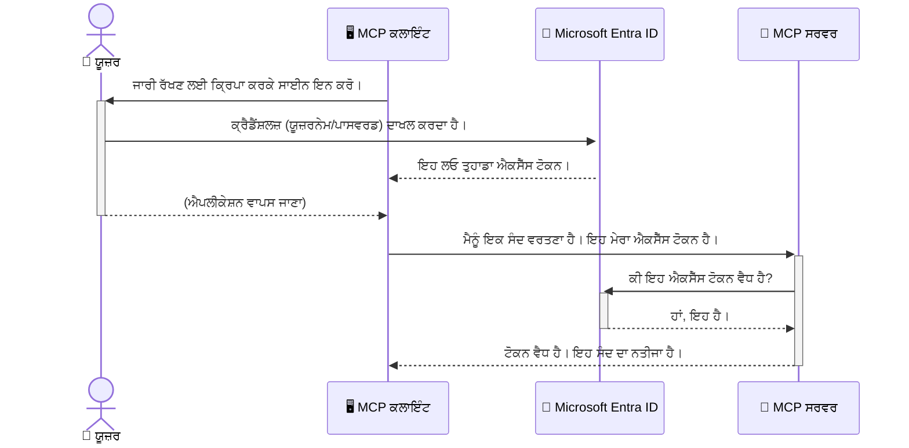

# ਏਆਈ ਵਰਕਫਲੋਜ਼ ਦੀ ਸੁਰੱਖਿਆ: ਮਾਡਲ ਕੌਂਟੈਕਸਟ ਪ੍ਰੋਟੋਕੋਲ ਸਰਵਰਾਂ ਲਈ ਐਨਟਰਾ ID ਪ੍ਰਮਾਣਿਕਤਾ

> [!NOTE]
> ਇਸ ਪਾਠ ਵਿੱਚ ਰਿਮੋਟ ਸਰਵਰ ਕੋਡ ਲੇਗੇਸੀ `/sse` ਅਤੇ `/message`
> ਐਂਡਪੌਇੰਟਾਂ ਦੀ ਰੱਖਿਆ ਕਰਦਾ ਹੈ ਅਤੇ MCP `2025-11-25` ਨੂੰ ਟਾਰਗਟ ਕਰਦਾ ਹੈ। ਇਸ ਦੀ ਪਛਾਣ ਅਤੇ ਟੋਕਨ-ਸਥਿਰਤਾ
> ਅਭਿਆਸਾਂ ਨੂੰ ਜਾਰੀ ਰੱਖੋ, ਪਰ ਨਵੀਆਂ ਕਾਰਜਵਾਹੀਆਂ ਲਈ `2026-07-28`-ਸੰਗਤ ਸਟ੍ਰੀਮੇਬਲ HTTP ਟ੍ਰਾਂਸਪੋਰਟ ਦੀ ਵਰਤੋਂ ਕਰੋ।


## ਪਰਿਚਯ
ਆਪਣੇ ਮਾਡਲ ਕੌਂਟੈਕਸਟ ਪ੍ਰੋਟੋਕੋਲ (MCP) ਸਰਵਰ ਦੀ ਸੁਰੱਖਿਆ ਕਰਨਾ ਆਪਣੇ ਘਰ ਦੇ ਮੁੱਖ ਦਰਵਾਜ਼ੇ ਨੂੰ ਲਾਕ ਕਰਨ ਜਿੰਨਾ ਜਰੂਰੀ ਹੈ। ਆਪਣੇ MCP ਸਰਵਰ ਨੂੰ ਖੁਲਾ ਛੱਡਣਾ ਤੁਹਾਡੇ ਟੂਲ ਅਤੇ ਡੇਟਾ ਨੂੰ ਬਿਨਾਂ ਅਧਿਕਾਰ ਵਾਪਸੀ ਤੋਂ ਸਮਰਪਿਤ ਕਰ ਦੇਂਦਾ ਹੈ, ਜਿਸ ਨਾਲ ਸੁਰੱਖਿਆ ਉਲੰਘਣਾਂ ਹੋ ਸਕਦੀਆਂ ਹਨ। Microsoft Entra ID ਇੱਕ ਮਜ਼ਬੂਤ ਕਲਾਉਡ-ਅਧਾਰਿਤ ਪਛਾਣ ਅਤੇ ਐਕਸੈਸ ਪ੍ਰਬੰਧਨ ਹਲ ਪ੍ਰਦਾਨ ਕਰਦਾ ਹੈ, ਜੋ ਇਹ ਸੁਨਿਸ਼ਚਿਤ ਕਰਦਾ ਹੈ ਕਿ ਸਿਰਫ਼ ਅਧਿਕਾਰ ਪ੍ਰਾਪਤ ਉਪਭੋਗਤਾ ਅਤੇ ਐਪਲੀਕੇਸ਼ਨ ਹੀ ਤੁਹਾਡੇ MCP ਸਰਵਰ ਨਾਲ ਸੰਵਾਦ ਕਰ ਸਕਦੇ ਹਨ। ਇਸ ਭਾਗ ਵਿੱਚ, ਤੁਸੀਂ ਸਿੱਖੋਗੇ ਕਿ ਐਨਟਰਾ ID ਪ੍ਰਮਾਣਿਕਤਾ ਦੀ ਵਰਤੋਂ ਕਰਕੇ ਆਪਣੇ ਏਆਈ ਵਰਕਫਲੋਜ਼ ਨੂੰ ਕਿਵੇਂ ਰੱਖਿਆ ਕਰਨਾ ਹੈ।

## ਸਿੱਖਣ ਦੇ ਲਕੜ-ਆਉਟਕਾਮ
ਇਸ ਭਾਗ ਦੇ ਅੰਤ ਤੱਕ, ਤੁਸੀਂ ਸਮਰੱਥ ਹੋਵੋਗੇ:

- MCP ਸਰਵਰਾਂ ਦੀ ਸੁਰੱਖਿਆ ਮਹੱਤਵ ਨੂੰ ਸਮਝਣਾ।
- Microsoft Entra ID ਅਤੇ OAuth 2.0 ਪ੍ਰਮਾਣਿਕਤਾ ਦੇ ਮੂਲ ਸਰੂਪ ਨੂੰ ਸਮਝਾਉਣਾ।
- ਲੋਕ ਅਤੇ ਗੁਪਤ ਗਾਹਕਾਂ ਵਿੱਚ ਅੰਤਰ ਨੂੰ ਪਛਾਣਨਾ।
- ਸਥਾਨਕ (ਪਬਲਿਕ ਕਲਾਇੰਟ) ਅਤੇ ਰਿਮੋਟ (ਗੁਪਤ ਕਲਾਇੰਟ) MCP ਸਰਵਰ ਪਰਿਦ੍ਰਿਸ਼ਾਂ ਵਿੱਚ ਐਨਟਰਾ ID ਪ੍ਰਮਾਣਿਕਤਾ ਲਾਗੂ ਕਰਨਾ।
- ਏਆਈ ਵਰਕਫਲੋਜ਼ ਤਿਆਰ ਕਰਦਿਆਂ ਸੁਰੱਖਿਆ ਲਈ ਸਹੀ ਅਭਿਆਸਾਂ ਨੂੰ ਲਾਗੂ ਕਰਨਾ।

## ਸੁਰੱਖਿਆ ਅਤੇ MCP

ਜਿਵੇਂ ਤੁਸੀਂ ਆਪਣੇ ਘਰ ਦੇ ਮੁੱਖ ਦਰਵਾਜ਼ੇ ਨੂੰ ਖ਼ਰਾਬ ਛੱਡਦੇ ਨਹੀਂ, ਤਿਵੇਂ ਤੁਹਾਡੇ ਲਈ MCP ਸਰਵਰ ਨੂੰ ਕਿਸੇ ਵੀ ਲਈ ਖੁਲਾ ਛੱਡਣਾ ਸਹੀ ਨਹੀਂ ਹੈ। ਤੁਹਾਡੇ ਏਆਈ ਵਰਕਫਲੋਜ਼ ਦੀ ਸੁਰੱਖਿਆ ਮਜ਼ਬੂਤ, ਭਰੋਸੇਯੋਗ ਅਤੇ ਸੁਰੱਖਿਅਤ ਐਪਲੀਕੇਸ਼ਨਾਂ ਬਣਾਉਣ ਲਈ ਜ਼ਰੂਰੀ ਹੈ। ਇਸ ਅਧਿਆਇ ਵਿੱਚ, ਤੁਸੀਂ ਸਿੱਖੋਗੇ ਕਿ Microsoft Entra ID ਦੀ ਵਰਤੋਂ ਕਰਕੇ ਆਪਣੇ MCP ਸਰਵਰਾਂ ਦਾ ਸੁਰੱਖਿਆ ਕਿਵੇਂ ਕਰਨੀ ਹੈ, ਤਾਂ ਜੋ ਸਿਰਫ ਅਧਿਕਾਰਤ ਉਪਭੋਗਤਾ ਅਤੇ ਐਪਲੀਕੇਸ਼ਨ ਹੀ ਤੁਹਾਡੇ ਟੂਲ ਅਤੇ ਡੇਟਾ ਨਾਲ ਸੰਵਾਦ ਕਰ ਸਕਣ।

## MCP ਸਰਵਰਾਂ ਲਈ ਸੁਰੱਖਿਆ ਕਿਉਂ ਜਰੂਰੀ ਹੈ

ਸੋਚੋ ਤੁਹਾਡੇ MCP ਸਰਵਰ ਵਿੱਚ ਇਕ ਟੂਲ ਹੈ ਜੋ ਈਮੇਲ ਭੇਜ ਸਕਦਾ ਹੈ ਜਾਂ ਗ੍ਰਾਹਕ ਡੇਟਾਬੇਸ ਤੱਕ ਪਹੁੰਚ ਰੱਖਦਾ ਹੈ। ਇੱਕ ਅਸੁਰੱਖਿਅਤ ਸਰਵਰ ਦਾ ਮਤਲਬ ਹੈ ਕਿ ਕੋਈ ਵੀ ਉਸ ਟੂਲ ਦੀ ਵਰਤੋਂ ਕਰ ਸਕਦਾ ਹੈ, ਜਿਸ ਨਾਲ ਬਿਨਾਂ ਅਧਿਕਾਰ ਡੇਟਾ ਤੱਕ ਪਹੁੰਚ, ਸਪੈਮ ਜਾਂ ਹੋਰ ਖ਼ਰਾਬ ਕਿਰਿਆਵਾਂ ਹੋ ਸਕਦੀਆਂ ਹਨ।

ਪ੍ਰਮਾਣਿਕਤਾ ਲਾਗੂ ਕਰਕੇ, ਤੁਸੀਂ ਇਹ ਸੁਨਿਸ਼ਚਿਤ ਕਰਦੇ ਹੋ ਕਿ ਤੁਹਾਡੇ ਸਰਵਰ ਤੇ ਹਰ ਇਕ ਬੇਨਤੀ ਦੀ ਜਾਂਚ ਹੋਵੇ, ਜੋ ਬੇਨਤੀ ਕਰਨ ਵਾਲੇ ਉਪਭੋਗਤਾ ਜਾਂ ਐਪਲੀਕੇਸ਼ਨ ਦੀ ਪਛਾਣ ਕਰਦਾ ਹੈ। ਇਹ ਤੁਹਾਡੇ ਏਆਈ ਵਰਕਫਲੋਜ਼ ਦੀ ਸੁਰੱਖਿਅਤ ਕਰਨ ਵਿੱਚ ਪਹਿਲਾ ਅਤੇ ਸਭ ਤੋਂ ਮਹੱਤਵਪੂਰਨ ਕਦਮ ਹੈ।

## Microsoft Entra ID ਦਾ ਪਰਿਚય

[**Microsoft Entra ID**](https://adoption.microsoft.com/microsoft-security/entra/) ਇੱਕ ਕਲਾਉਡ-ਅਧਾਰਿਤ ਪਛਾਣ ਅਤੇ ਐਕਸੈਸ ਪ੍ਰਬੰਧਨ ਸੇਵਾ ਹੈ। ਇਸਨੂੰ ਆਪਣੇ ਐਪਲੀਕੇਸ਼ਨਾਂ ਲਈ ਇੱਕ ਵਿਸ਼ਵ ਭਰ ਦਾ ਸੁਰੱਖਿਆ ਗਾਰਡ ਸਮਝੋ। ਇਹ ਉਪਭੋਗਤਾ ਪਛਾਣਾਂ ਦੀ ਪੁਸ਼ਟੀ (ਪ੍ਰਮਾਣਿਕਤਾ) ਕਰਨ ਅਤੇ ਉਹਨਾਂ ਨੂੰ ਕੀ ਕਰਨ ਦੀ ਆਗਿਆ ਹੈ (ਅਧਿਕਾਰਿਤ ਕਰਨਾ) ਦੇ ਨੇੜੇ ਕਠਿਨ ਪ੍ਰਕਿਰਿਆ ਨੂੰ ਹਲ ਕਰਦਾ ਹੈ।

ਐਨਟਰਾ ID ਦੀ ਵਰਤੋਂ ਕਰਕੇ, ਤੁਸੀਂ:

- ਉਪਭੋਗਤਾਵਾਂ ਲਈ ਸੁਰੱਖਿਅਤ ਸਾਈਨ-ਇਨ ਯੋਗ ਕਰ ਸਕਦੇ ਹੋ।
- APIs ਅਤੇ ਸਰਵਿਸਾਂ ਦੀ ਰਕਸ਼ਾ ਕਰ ਸਕਦੇ ਹੋ।
- ਕੇਂਦਰੀ ਸਥਾਨ ਤੋਂ ਐਕਸੈਸ ਨੀਤੀਆਂ ਦਾ ਪ੍ਰਬੰਧਨ ਕਰ ਸਕਦੇ ਹੋ।

MCP ਸਰਵਰਾਂ ਲਈ, ਐਨਟਰਾ ID ਇੱਕ ਮਜ਼ਬੂਤ ਅਤੇ ਵਿਸ਼ਵਾਸਯੋਗ ਹਲ ਪ੍ਰਦਾਨ ਕਰਦਾ ਹੈ ਜੋ ਇਹ ਪ੍ਰਬੰਧਿਤ ਕਰਦਾ ਹੈ ਕਿ ਤੁਹਾਡੇ ਸਰਵਰ ਦੀਆਂ ਸਮਰੱਥਾਵਾਂ ਨੂੰ ਕੌਣ ਪਹੁੰਚ ਸਕਦਾ ਹੈ।

---

## ਮੰਤਰੀ ਨੂੰ ਸਮਝਣਾ: ਐਨਟਰਾ ID ਪ੍ਰਮਾਣਿਕਤਾ ਕਿਵੇਂ ਕੰਮ ਕਰਦੀ ਹੈ

ਐਨਟਰਾ ID ਪ੍ਰਮਾਣਿਕਤਾ ਨੂੰ ਸੰਭਾਲਣ ਲਈ ਖੁੱਲੇ ਮਿਆਰਾਂ ਵਰਗੇ **OAuth 2.0** ਦੀ ਵਰਤੋਂ ਕਰਦਾ ਹੈ। ਜਦੋਂਕਿ ਵਿਸਥਾਰ ਜਟਿਲ ਹੋ ਸਕਦਾ ਹੈ, ਮੂਲ ਤੱਤ ਬਹੁਤ ਸੌਖਾ ਹੈ ਅਤੇ ਇੱਕ ਉਦਾਹਰਣ ਨਾਲ ਸਮਝਿਆ ਜਾ ਸਕਦਾ ਹੈ।

### OAuth 2.0 ਦਾ ਨਰਮ ਪਰਿਚਯ: ਵੈਲੇਟ ਕੁੰਜੀ

OAuth 2.0 ਨੂੰ ਆਪਣੀ ਕਾਰ ਲਈ ਇੱਕ ਵੈਲੇਟ ਸੇਵਾ ਵਾਂਗ ਸੋਚੋ। ਜਦੋਂ ਤੁਸੀਂ ਰੈਸਟੋਰੈਂਟ ਵਿੱਚ ਪਹੁੰਚਦੇ ਹੋ, ਤੁਸੀਂ ਵੈਲੇਟ ਨੂੰ ਆਪਣੀ ਮੁੱਖ ਕੁੰਜੀ ਨਹੀਂ ਦਿੰਦੇ। ਇਸਦੀ ਬਜਾਏ, ਤੁਸੀਂ ਇੱਕ **ਵੈਲੇਟ ਕੁੰਜੀ** ਦਿੰਦੇ ਹੋ ਜਿਸਦੇ ਹੱਦਬੰਦ ਹੱਕ ਹੁੰਦੇ ਹਨ— ਇਹ ਕਾਰ ਸ਼ੁਰੂ ਕਰ ਸਕਦੀ ਹੈ ਅਤੇ ਦਰਵਾਜ਼ੇ ਬੰਦ ਕਰ ਸਕਦੀ ਹੈ, ਪਰ ਟਰੰਕ ਜਾਂ ਗਲੋਵ ਕਮਪਾਰਟਮੈਂਟ ਖੋਲ੍ਹ ਨਹੀਂ ਸਕਦੀ।

ਇਸ ਉਦਾਹਰਣ ਵਿੱਚ:

- **ਤੁਸੀਂ** **ਉਪਭੋਗਤਾ** ਹੋ।
- **ਤੁਹਾਡੀ ਕਾਰ** **MCP ਸਰਵਰ** ਹੈ ਜਿਸ ਵਿੱਚ ਕੀਮਤੀ ਟੂਲ ਅਤੇ ਡੇਟਾ ਹਨ।
- **ਵੈਲੇਟ** ਹੈ **Microsoft Entra ID**।
- **ਪਾਰਕੀੰਗ ਅਟੈਂਡੈਂਟ** ਹੈ **MCP ਕਲਾਇੰਟ** (ਉਹ ਐਪਲੀਕੇਸ਼ਨ ਜੋ ਸਰਵਰ ਤੱਕ ਪਹੁੰਚਣ ਦਾ ਯਤਨ ਕਰਦਾ ਹੈ)।
- **ਵੈਲੇਟ ਕੁੰਜੀ** ਹੈ **ਐਕਸੈਸ ਟੋਕਨ**।

ਐਕਸੈਸ ਟੋਕਨ ਇੱਕ ਸੁਰੱਖਿਅਤ ਲਿਖਤੀ ਸਟਰਿੰਗ ਹੈ ਜੋ MCP ਕਲਾਇੰਟ ਨੂੰ ਛੁੱਟੀਤੋਂ ਬਾਅਦ ਐਨਟਰਾ ID ਤੋਂ ਮਿਲਦਾ ਹੈ। ਫਿਰ ਕਲਾਇੰਟ ਇਹ ਟੋਕਨ MCP ਸਰਵਰ ਨੂੰ ਹਰ ਬੇਨਤੀ ਨਾਲ ਦਿਖਾਉਂਦਾ ਹੈ। ਸਰਵਰ ਇਸ ਟੋਕਨ ਨੂੰ ਜਾਂਚ ਸਕਦਾ ਹੈ ਤਾਂ ਜੋ ਬੇਨਤੀ ਕਾਨੂੰਨੀ ਹੈ ਅਤੇ ਕਲਾਇੰਟ ਕੋਲ ਜ਼ਰੂਰੀ ਅਧਿਕਾਰ ਹਨ, ਸਾਰੇ ਤੁਹਾਡੇ ਅਸਲ ਪ੍ਰਮਾਣਪੱਤਰ (ਜਿਵੇਂ ਪਾਸਵਰਡ) ਨੂੰ ਸੰਭਾਲਣ ਦੀ ਜ਼ਰੂਰਤ ਬਿਨਾਂ।

### ਪ੍ਰਮਾਣਿਕਤਾ ਦਰਪ੍ਰਵਾਹ

ਇਸ ਪ੍ਰਕਿਰਿਆ ਦਾ ਅਮਲ ਵਿੱਚ ਕੰਮ ਕਰਨ ਦਾ ਤਰੀਕਾ ਇਹ ਹੈ:



### Microsoft Authentication Library (MSAL) ਦਾ ਪੇਸ਼ਕਸ਼

ਕੋਡ ਵਿੱਚ ਜਾਉਣ ਤੋਂ ਪਹਿਲਾਂ, ਇਹ ਜ਼ਰੂਰੀ ਹੈ ਕਿ ਤੁਸੀਂ ਉਦਾਹਰਣਾਂ ਵਿੱਚ ਦੇਖੋਗੇ ਇੱਕ ਮਹੱਤਵਪੂਰਨ ਭਾਗ: **Microsoft Authentication Library (MSAL)**।

MSAL Microsoft ਵੱਲੋਂ ਵਿਕਸਤ ਇੱਕ ਲਾਇਬ੍ਰੇਰੀ ਹੈ ਜੋ ਡਿਵੈਲਪਰਾਂ ਲਈ ਪ੍ਰਮਾਣਿਕਤਾ ਸੰਭਾਲਣਾ ਬਹੁਤ ਆਸਾਨ ਬਣਾ ਦਿੰਦੀ ਹੈ। ਤੁਹਾਡੇ ਲਈ ਸਾਰੇ ਗੁੰਝਲਦਾਰ ਕੋਡ ਲਿਖਣ ਦੀ ਜ਼ਰੂਰਤ ਨਹੀਂ ਰਹਿੰਦੀ ਜੋ ਸੁਰੱਖਿਆ ਟੋਕਨਾਂ ਨੂੰ ਸੰਭਾਲਦਾ ਹੈ, ਸਾਈਨ-ਇਨ ਪ੍ਰਬੰਧਿਤ ਕਰਦਾ ਹੈ, ਅਤੇ ਸੈਸ਼ਨਾਂ ਨੂੰ ਰੀਫ੍ਰੈਸ਼ ਕਰਦਾ ਹੈ, MSAL ਇਹ ਸਭ ਭਾਰੀ ਕੰਮ ਕਰਦਾ ਹੈ।

ਇੱਕ ਲਾਇਬ੍ਰੇਰੀ ਵਰਗੇ MSAL ਦੀ ਵਰਤੋਂ ਬਹੁਤ ਸਿਫ਼ਾਰਸ਼ ਕੀਤੀ ਜਾਂਦੀ ਹੈ ਕਿਉਂਕਿ:

- **ਇਹ ਸੁਰੱਖਿਅਤ ਹੈ:** ਇਹ ਉਦਯੋਗ ਮਿਆਰੀ ਪ੍ਰੋਟੋਕੋਲਾਂ ਅਤੇ ਸੁਰੱਖਿਆ ਦੇ ਸਭ ਤੋਂ ਵਧੀਆ ਅਭਿਆਸਾਂ ਨੂੰ ਲਾਗੂ ਕਰਦਾ ਹੈ, ਜੋ ਤੁਹਾਡੇ ਕੋਡ ਵਿੱਚ ਕਮਜ਼ੋਰੀਆਂ ਦੇ ਖਤਰੇ ਨੂੰ ਘਟੀ ਕਰਦਾ ਹੈ।
- **ਇਹ ਵਿਕਾਸ ਨੂੰ ਸਾਦਾ ਕਰਦਾ ਹੈ:** ਇਹ OAuth 2.0 ਅਤੇ OpenID ਕਨੈਕਟ ਪ੍ਰੋਟੋਕੋਲ ਦੀ ਪੇਚੀਦਗੀ ਨੂੰ ਛੁਪਾਉਂਦਾ ਹੈ, ਤੁਹਾਡੇ ਐਪਲੀਕੇਸ਼ਨ ਵਿੱਚ ਕੇਵਲ ਕੁਝ ਲਾਈਨਾਂ ਕੋਡ ਨਾਲ ਮਜ਼ਬੂਤ ਪ੍ਰਮਾਣਿਕਤਾ ਸ਼ਾਮਿਲ ਕਰਨ ਦੀ ਆਗਿਆ ਦਿੰਦਿਆਂ।
- **ਇਹ ਰਖ-ਰਖਾਅ ਵਾਲੀ ਹੈ:** Microsoft MSAL ਨੂੰ ਨਵੇਂ ਸੁਰੱਖਿਆ ਖ਼ਤਰਿਆਂ ਅਤੇ ਪਲੇਟਫਾਰਮ ਬਦਲਾਵਾਂ ਨੂੰ ਸੰਬੋਧਨ ਕਰਨ ਲਈ ਨਿਯਮਤ ਤੌਰ 'ਤੇ ਰੱਖ ਰੱਖਾਅ ਕਰਦਾ ਹੈ।

MSAL .NET, ਜਾਵਾ ਸਕ੍ਰਿਪਟ/ਟਾਈਪਸਕ੍ਰਿਪਟ, ਪਾਈਥਨ, ਜਾਵਾ, ਗੋ ਅਤੇ ਆਈਓਐਸ ਅਤੇ ਐਂਡਰਾਇਡ ਜੈਸੀਆਂ ਮੋਬਾਈਲ ਪਲੇਟਫਾਰਮਾਂ ਸਮੇਤ ਬਹੁਤ ਭਾਸ਼ਾਵਾਂ ਅਤੇ ਐਪਲੀਕੇਸ਼ਨ ਫਰੇਮਵਰਕਾਂ ਨੂੰ ਸਹਿਯੋਗ ਦਿੰਦਾ ਹੈ। ਇਸਦਾ ਅਰਥ ਹੈ ਕਿ ਤੁਸੀਂ ਆਪਣੇ ਸਾਰੇ ਤਕਨਾਲੋਜੀ ਸਟੈਕ ਵਿੱਚ ਇਕੋ ਜਿਹੇ ਪ੍ਰਮਾਣਿਕਤਾ ਪੈਟਰਨ ਦੀ ਵਰਤੋਂ ਕਰ ਸਕਦੇ ਹੋ।

MSAL ਬਾਰੇ ਹੋਰ ਜਾਣਕਾਰੀ ਲਈ ਤੁਸੀਂ ਅਧਿਕਾਰਕ [MSAL ਓਵਰਵਿਊ ਦਸਤਾਵੇਜ਼](https://learn.microsoft.com/entra/identity-platform/msal-overview) ਨੂੰ ਦੇਖ ਸਕਦੇ ਹੋ।

---

## ਐਨਟਰਾ ID ਨਾਲ ਆਪਣੇ MCP ਸਰਵਰ ਨੂੰ ਸੁਰੱਖਿਅਤ ਕਰਨਾ: ਕਦਮ-ਬਾਈ-ਕਦਮ ਮਾਰਗਦਰਸ਼ਨ

ਹੁਣ, ਆਓ ਦੇਖੀਏ ਕਿ ਐਨਟਰਾ ID ਦੀ ਵਰਤੋਂ ਕਰਕੇ ਸਥਾਨਕ MCP ਸਰਵਰ (ਜੋ `stdio` ਦੇ ਜ਼ਰੀਏ ਸੰਚਾਰ ਕਰਦਾ ਹੈ) ਨੂੰ ਕਿਵੇਂ ਸੁਰੱਖਿਅਤ ਕੀਤਾ ਜਾ ਸਕਦਾ ਹੈ। ਇਹ ਉਦਾਹਰਣ ਇੱਕ **ਪਬਲਿਕ ਕਲਾਇੰਟ** ਦੀ ਵਰਤੋਂ ਕਰਦਾ ਹੈ, ਜੋ ਉਪਭੋਗਤਾ ਦੇ ਮਸ਼ੀਨ 'ਤੇ ਚੱਲ ਰਹੀਆਂ ਐਪਲੀਕੇਸ਼ਨਾਂ ਲਈ ਠੀਕ ਹੈ, ਜਿਵੇਂ ਡੈਸਕਟਾਪ ਐਪ ਜਾਂ ਸਥਾਨਕ ਵਿਕਾਸ ਸਰਵਰ।

### ਸਥਿਤੀ 1: ਸਥਾਨਕ MCP ਸਰਵਰ ਦੀ ਸੁਰੱਖਿਆ (ਇੱਕ ਪਬਲਿਕ ਕਲਾਇੰਟ ਨਾਲ)

ਇਸ ਸਥਿਤੀ ਵਿੱਚ, ਅਸੀਂ ਇੱਕ MCP ਸਰਵਰ ਦੇਖਾਂਗੇ ਜੋ ਸਥਾਨਕ ਚੱਲਦਾ ਹੈ, `stdio` ਦੇ ਨਾਲ ਸੰਚਾਰ ਕਰਦਾ ਹੈ ਅਤੇ ਯੂਜ਼ਰ ਨੂੰ ਸਾਖੀ ਕਰਨ ਲਈ ਐਨਟਰਾ ID ਦੀ ਵਰਤੋਂ ਕਰਦਾ ਹੈ ਜਿਸ ਤੋਂ ਬਾਅਦੋਂ ਹੀ ਇਸਦੇ ਟੂਲਾਂ ਤੱਕ ਪਹੁੰਚ ਦੀ ਆਗਿਆ ਮਿਲਦੀ ਹੈ। ਸਰਵਰ ਕੋਲ ਇੱਕ ਸਧਾਰਣ ਟੂਲ ਹੋਵੇਗਾ ਜੋ Microsoft Graph API ਤੋਂ ਯੂਜ਼ਰ ਦੀ ਪ੍ਰੋਫ਼ਾਈਲ ਜਾਣਕਾਰੀ ਲੈਂਦਾ ਹੈ।

#### 1. ਐਨਟਰਾ ID 'ਚ ਐਪਲੀਕੇਸ਼ਨ ਸੈੱਟ ਅੱਪ ਕਰਨਾ

ਕਿਸੇ ਵੀ ਕੋਡ ਨੂੰ ਲਿਖਣ ਤੋਂ ਪਹਿਲਾਂ, ਤੁਹਾਨੂੰ ਆਪਣੇ ਐਪਲੀਕੇਸ਼ਨ ਨੂੰ Microsoft Entra ID ਵਿੱਚ ਰਜਿਸਟਰ ਕਰਨਾ ਚਾਹੀਦਾ ਹੈ। ਇਹ ਐਨਟਰਾ ID ਨੂੰ ਤੁਹਾਡੇ ਐਪਲੀਕੇਸ਼ਨ ਬਾਰੇ ਦੱਸਦਾ ਹੈ ਅਤੇ ਪ੍ਰਮਾਣਿਕਤਾ ਸੇਵਾ ਦੀ ਵਰਤੋਂ ਲਈ ਪਰਮਿਸ਼ਨ ਦਿੰਦਾ ਹੈ।

1. **[Microsoft Entra ਪੋਰਟਲ](https://entra.microsoft.com/)** 'ਤੇ ਜਾਓ।
2. **ਐਪ ਰਜਿਸਟ੍ਰੇਸ਼ਨ** 'ਚ ਜਾਓ ਅਤੇ **ਨਿਊ ਰਜਿਸਟ੍ਰੇਸ਼ਨ** 'ਤੇ ਕਲਿੱਕ ਕਰੋ।
3. ਆਪਣੇ ਐਪਲੀਕੇਸ਼ਨ ਦਾ ਨਾਮ ਦਿਓ (ਜਿਵੇਂ "ਮੇਰਾ ਸਥਾਨਕ MCP ਸਰਵਰ")।
4. **ਸਪੋਰਟਿਡ ਅਕਾਊਂਟ ਕਿਸਮਾਂ** ਲਈ, **ਇਸ ਸੰਗਠਨਾਤਮਕ ਡਾਇਰੈਕਟਰੀ ਵਿੱਚ ਖਾਤੇ ਸਿਰਫ਼** ਚੁਣੋ।
5. ਇਸ ਉਦਾਹਰਣ ਲਈ **Redirect URI** ਖਾਲੀ ਛੱਡੋ।
6. **ਰਜਿਸਟਰ ਕੀਤਾ** 'ਤੇ ਕਲਿੱਕ ਕਰੋ।

ਇੱਕ ਵਾਰੀ ਰਜਿਸਟਰ ਹੋ ਜਾਣ ਤੋਂ ਬਾਅਦ, **ਐਪਲੀਕੇਸ਼ਨ (ਕਲਾਇੰਟ) ID** ਅਤੇ **ਡਾਇਰੈਕਟਰੀ (ਟੇਨੈਂਟ) ID** ਨੂੰ ਨੋਟ ਕਰੋ। ਤੁਹਾਨੂੰ ਇਹ ਆਪਣੇ ਕੋਡ ਵਿੱਚ ਲੋੜ ਪਵੇਗੀ।

#### 2. ਕੋਡ: ਇਕ ਵਿਸਥਾਰ

ਆਓ ਕੋਡ ਦੇ ਮੁੱਖ ਹਿੱਸਿਆਂ ਨੂੰ ਵੇਖੀਏ ਜੋ ਪ੍ਰਮਾਣਿਕਤਾ ਨੂੰ ਸੰਭਾਲਦੇ ਹਨ। ਇਸ ਉਦਾਹਰਣ ਲਈ ਪੂਰਾ ਕੋਡ [Entra ID - Local - WAM](https://github.com/Azure-Samples/mcp-auth-servers/tree/main/src/entra-id-local-wam) ਫੋਲਡਰ ਵਿੱਚ [mcp-auth-servers GitHub ਰਿਪੋਜਿਟਰੀ](https://github.com/Azure-Samples/mcp-auth-servers) ਵਿੱਚ ਉਪਲਬਧ ਹੈ।

**`AuthenticationService.cs`**

ਇਹ ਕਲਾਸ ਐਨਟਰਾ ID ਨਾਲ ਸੰਵਾਦ ਕਰਨ ਦੀ ਜਿੰਮੇਦਾਰ ਹੈ।

- **`CreateAsync`**: ਇਹ ਵਿਧੀ MSAL (Microsoft Authentication Library) ਤੋਂ `PublicClientApplication` ਨੂੰ ਸ਼ੁਰੂ ਕਰਦੀ ਹੈ। ਇਹ ਤੁਹਾਡੇ ਐਪਲੀਕੇਸ਼ਨ ਦੇ `clientId` ਅਤੇ `tenantId` ਨਾਲ ਕਾਂਫ਼ਿਗਰ ਕੀਤੀ ਗਈ ਹੈ।
- **`WithBroker`**: ਇਹ ਬ੍ਰੋਕਰ ਦੀ ਵਰਤੋਂ ਯੋਗ ਕਰਦਾ ਹੈ (ਜਿਵੇਂ Windows Web Account Manager), ਜੋ ਬਹੁਤ ਸੁਰੱਖਿਅਤ ਅਤੇ ਬਿਨਾ ਰੁਕਾਵਟ ਦੇ ਇੱਕ-ਸਾਈਨ-ਆਨ ਅਨੁਭਵ ਦਿੰਦਾ ਹੈ।
- **`AcquireTokenAsync`**: ਇਹ ਮੁੱਖ ਵਿਧੀ ਹੈ। ਇਹ ਪਹਿਲਾਂ ਚੁੱਪਲੇ ਢੰਗ ਨਾਲ ਟੋਕਨ ਪ੍ਰਾਪਤ ਕਰਨ ਦੀ ਕੋਸ਼ਿਸ਼ ਕਰਦਾ ਹੈ (ਜਿਸਦਾ ਮਤਲਬ ਹੈ ਕਿ ਯੂਜ਼ਰ ਨੂੰ ਦੁਬਾਰਾ ਸਾਈਨ-ਇਨ ਕਰਨ ਦੀ ਲੋੜ ਨਹੀਂ ਜੇ ਉਹ ਪਹਿਲਾਂ ਹੀ ਘੁੰਮ ਦੌਰਾਨ ਇੱਕ ਮਾਲਕੀ ਸੈਸ਼ਨ ਰੱਖਦਾ ਹੈ)। ਜੇ ਇੱਕ ਚੁੱਪਟਾ ਟੋਕਨ ਪ੍ਰਾਪਤ ਨਾ ਹੋ ਸਕੇ, ਤਾਂ ਇਹ ਯੂਜ਼ਰ ਨੂੰ ਇੰਟਰਐਕਟਿਵਲੀ ਸਾਈਨ-ਇਨ ਕਰਨ ਲਈ ਪ੍ਰੇਰਿਤ ਕਰੇਗਾ।

```csharp
// Simplified for clarity
public static async Task<AuthenticationService> CreateAsync(ILogger<AuthenticationService> logger)
{
    var msalClient = PublicClientApplicationBuilder
        .Create(_clientId) // Your Application (client) ID
        .WithAuthority(AadAuthorityAudience.AzureAdMyOrg)
        .WithTenantId(_tenantId) // Your Directory (tenant) ID
        .WithBroker(new BrokerOptions(BrokerOptions.OperatingSystems.Windows))
        .Build();

    // ... cache registration ...

    return new AuthenticationService(logger, msalClient);
}

public async Task<string> AcquireTokenAsync()
{
    try
    {
        // Try silent authentication first
        var accounts = await _msalClient.GetAccountsAsync();
        var account = accounts.FirstOrDefault();

        AuthenticationResult? result = null;

        if (account != null)
        {
            result = await _msalClient.AcquireTokenSilent(_scopes, account).ExecuteAsync();
        }
        else
        {
            // If no account, or silent fails, go interactive
            result = await _msalClient.AcquireTokenInteractive(_scopes).ExecuteAsync();
        }

        return result.AccessToken;
    }
    catch (Exception ex)
    {
        _logger.LogError(ex, "An error occurred while acquiring the token.");
        throw; // Optionally rethrow the exception for higher-level handling
    }
}
```

**`Program.cs`**

ਇੱਥੇ MCP ਸਰਵਰ ਸੈੱਟ ਕੀਤਾ ਜਾਂਦਾ ਹੈ ਅਤੇ ਪ੍ਰਮਾਣਿਕਤਾ ਸਰਵਿਸ ਇਕੱਠੀ ਕੀਤੀ ਜਾਂਦੀ ਹੈ।

- **`AddSingleton<AuthenticationService>`**: ਇਹ `AuthenticationService` ਨੂੰ ਡਿਪੈਂਡੇੰਸੀ ਇੰਜੈਕਸ਼ਨ ਕੰਟੇਨਰ ਵਿੱਚ ਰਜਿਸਟਰ ਕਰਦਾ ਹੈ, ਤਾਂ ਜੋ ਇਹ ਐਪਲੀਕੇਸ਼ਨ ਦੇ ਹੋਰ ਹਿੱਸਿਆਂ ਦੁਆਰਾ ਵਰਤਿਆ ਜਾ ਸਕੇ (ਜਿਵੇਂ ਸਾਡੇ ਟੂਲ)।
- **`GetUserDetailsFromGraph` ਟੂਲ**: ਇਸ ਟੂਲ ਨੂੰ ਇੱਕ `AuthenticationService` ਦੀ ਜ਼ਰੂਰਤ ਹੁੰਦੀ ਹੈ। ਇਸ ਲਈ ਇਹ ਪਹਿਲਾਂ `authService.AcquireTokenAsync()` ਕਾਲ ਕਰਦਾ ਹੈ ਤਾਂ ਜੋ ਇੱਕ ਸਹੀਐਕਸੈਸ ਟੋਕਨ ਮਿਲੇ। ਜੇ ਪ੍ਰਮਾਣਿਕਤਾ ਸਫਲ ਹੁੰਦੀ ਹੈ, ਤਾਂ ਇਹ ਟੋਕਨ ਵਰਤਕੇ Microsoft Graph API ਨੂੰ ਕਾਲ ਕਰਦਾ ਹੈ ਅਤੇ ਯੂਜ਼ਰ ਦੇ ਵੇਰਵੇ ਪ੍ਰਾਪਤ ਕਰਦਾ ਹੈ।

```csharp
// Simplified for clarity
[McpServerTool(Name = "GetUserDetailsFromGraph")]
public static async Task<string> GetUserDetailsFromGraph(
    AuthenticationService authService)
{
    try
    {
        // This will trigger the authentication flow
        var accessToken = await authService.AcquireTokenAsync();

        // Use the token to create a GraphServiceClient
        var graphClient = new GraphServiceClient(
            new BaseBearerTokenAuthenticationProvider(new TokenProvider(authService)));

        var user = await graphClient.Me.GetAsync();

        return System.Text.Json.JsonSerializer.Serialize(user);
    }
    catch (Exception ex)
    {
        return $"Error: {ex.Message}";
    }
}
```

#### 3. ਸਾਰੀ ਪ੍ਰਕਿਰਿਆ ਕਿਵੇਂ ਕੰਮ ਕਰਦੀ ਹੈ

1. ਜਦੋਂ MCP ਕਲਾਇੰਟ `GetUserDetailsFromGraph` ਟੂਲ ਦੀ ਵਰਤੋਂ ਕਰਨ ਦੀ ਕੋਸ਼ਿਸ਼ ਕਰਦਾ ਹੈ, ਟੂਲ ਪਹਿਲਾਂ `AcquireTokenAsync` ਨੂੰ ਕਾਲ ਕਰਦਾ ਹੈ।
2. `AcquireTokenAsync` MSAL ਲਾਇਬ੍ਰੇਰੀ ਨੂੰ ਇੱਕ ਸਹੀ ਟੋਕਨ ਦੀ ਜਾਂਚ ਕਰਨ ਲਈ ਪ੍ਰੇਰਿਤ ਕਰਦਾ ਹੈ।
3. ਜੇ ਕੋਈ ਟੋਕਨ ਨਹੀਂ ਮਿਲਦਾ, ਤਾਂ MSAL, ਬ੍ਰੋਕਰ ਦੁਆਰਾ, ਯੂਜ਼ਰ ਨੂੰ ਉਸਦੇ ਐਨਟਰਾ ID ਖਾਤੇ ਨਾਲ ਸਾਈਨ-ਇਨ ਕਰਨ ਲਈ ਕਹਿੰਦਾ ਹੈ।
4. ਜਿਵੇਂ ਹੀ ਯੂਜ਼ਰ ਸਾਈਨ-ਇਨ ਕਰਦਾ ਹੈ, ਐਨਟਰਾ ID ਇੱਕ ਐਕਸੈਸ ਟੋਕਨ ਜਾਰੀ ਕਰਦਾ ਹੈ।
5. ਟੂਲ ਟੋਕਨ ਪ੍ਰਾਪਤ ਕਰਦਾ ਹੈ ਅਤੇ ਇਸਦਾ ਉਪਯੋਗ ਕਰਕੇ Microsoft Graph API ਨੂੰ ਸੁਰੱਖਿਅਤ ਕਾਲ ਕਰਦਾ ਹੈ।
6. ਯੂਜ਼ਰ ਦੇ ਵੇਰਵੇ MCP ਕਲਾਇੰਟ ਨੂੰ ਵਾਪਸ ਕੀਤੇ ਜਾਂਦੇ ਹਨ।

ਇਹ ਪ੍ਰਕਿਰਿਆ ਇਹ ਯਕੀਨੀ ਬਣਾਉਂਦੀ ਹੈ ਕਿ ਸਿਰਫ ਪ੍ਰਮਾਣਿਤ ਉਪਭੋਗਤਾ ਟੂਲ ਦੀ ਵਰਤੋਂ ਕਰ ਸਕਦੇ ਹਨ, ਜਿਸ ਨਾਲ ਤੁਹਾਡੇ ਸਥਾਨਕ MCP ਸਰਵਰ ਦੀ ਸੁਰੱਖਿਆ ਹੋ ਜਾਂਦੀ ਹੈ।

### ਸਥਿਤੀ 2: ਰਿਮੋਟ MCP ਸਰਵਰ ਦੀ ਸੁਰੱਖਿਆ (ਇੱਕ ਗੁਪਤ ਕਲਾਇੰਟ ਨਾਲ)

ਜਦੋਂ ਤੁਹਾਡਾ MCP ਸਰਵਰ ਇੱਕ ਰਿਮੋਟ ਮਸ਼ੀਨ 'ਤੇ ਚੱਲ ਰਿਹਾ ਹੁੰਦਾ ਹੈ (ਜਿਵੇਂ ਕਲਾਉਡ ਸਰਵਰ) ਅਤੇ HTTP ਸਟ੍ਰੀਮਿੰਗ ਵਰਗੇ ਪ੍ਰੋਟੋਕੋਲ 'ਤੇ ਸੰਚਾਰ ਕਰਦਾ ਹੈ, ਤਾਂ ਸੁਰੱਖਿਆ ਦੇ ਮਾਪਦੰਡ ਵੱਖਰੇ ਹੁੰਦੇ ਹਨ। ਇਸ ਮਾਮਲੇ ਵਿੱਚ, ਤੁਸੀਂ ਇੱਕ **ਗੁਪਤ ਕਲਾਇੰਟ** ਅਤੇ **Authorization Code Flow** ਦੀ ਵਰਤੋਂ ਕਰਨੀ ਚਾਹੀਦੀ ਹੈ। ਇਹ ਇੱਕ ਜ਼ਿਆਦਾ ਸੁਰੱਖਿਅਤ ਤਰੀਕਾ ਹੈ ਕਿਉਂਕਿ ਐਪਲੀਕੇਸ਼ਨ ਦੇ ਰਾਜ਼ ਬਰਾਊਜ਼ਰ ਨੂੰ ਕਦੇ ਨਹੀਂ ਦਿਖਾਏ ਜਾਂਦੇ।

ਇਹ ਉਦਾਹਰਣ ਇੱਕ TypeScript-ਅਧਾਰਿਤ MCP ਸਰਵਰ ਦੀ ਵਰਤੋਂ ਕਰਦਾ ਹੈ ਜੋ Express.js ਦੁਆਰਾ HTTP ਬੇਨਤੀਆਂ ਨੂੰ ਸੰਭਾਲਦਾ ਹੈ।

#### 1. ਐਨਟਰਾ ID ਵਿੱਚ ਐਪਲੀਕੇਸ਼ਨ ਸੈੱਟਅੱਪ ਕਰਨਾ

ਐਨਟਰਾ ID ਵਿੱਚ ਸੈੱਟਅੱਪ ਪਬਲਿਕ ਕਲਾਇੰਟ ਦੇ ਵਾਂਗ ਹੀ ਹੈ, ਪਰ ਇੱਕ ਮੁੱਖ ਅੰਤਰ ਨਾਲ: ਤੁਹਾਨੂੰ ਇੱਕ **ਕਲਾਇੰਟ ਸੀਕ੍ਰੇਟ** ਬਣਾਉਣੀ ਪੈਂਦੀ ਹੈ।

1. **[Microsoft Entra ਪੋਰਟਲ](https://entra.microsoft.com/)** 'ਤੇ ਜਾਓ।
2. ਆਪਣੇ ਐਪ ਰਜਿਸਟ੍ਰੇਸ਼ਨ ਵਿੱਚ, **Certificates & secrets** ਟੈਬ 'ਚ ਜਾਓ।
3. **New client secret** 'ਤੇ ਕਲਿੱਕ ਕਰੋ, ਇਸਨੂੰ ਇੱਕ ਵਰਣਨ ਦਿਓ ਅਤੇ **Add** 'ਤੇ ਕਲਿੱਕ ਕਰੋ।
4. **ਜ਼ਰੂਰੀ:** ਸੀਕ੍ਰੇਟ ਮੁੱਲ ਨੂੰ ਤੁਰੰਤ ਕਾਪੀ ਕਰੋ। ਤੁਸੀਂ ਇਸਨੂੰ ਫਿਰ ਕਦੇ ਨਹੀਂ ਦੇਖ ਸਕਦੇ।
5. ਤੁਹਾਨੂੰ ਇੱਕ **Redirect URI** ਵੀ ਸੈੱਟ ਕਰਨੀ ਪਵੇਗੀ। **Authentication** ਟੈਬ 'ਚ ਜਾਓ, **Add a platform** 'ਤੇ ਕਲਿੱਕ ਕਰੋ, **Web** ਚੁਣੋ, ਅਤੇ ਆਪਣੇ ਐਪ ਲਈ Redirect URI ਭਰੋ (ਜਿਵੇਂ `http://localhost:3001/auth/callback`)।

> **⚠️ ਮਹੱਤਵਪੂਰਨ ਸੁਰੱਖਿਆ ਚੇਤਾਵਨੀ:** ਪ੍ਰੋਡਕਸ਼ਨ ਐਪਲੀਕੇਸ਼ਨਾਂ ਲਈ, Microsoft ਗੁਪਤ ਸੀਕ੍ਰੇਟ ਦੀ ਥਾਂ **secretless authentication** ਤਰੀਕਿਆਂ ਜਿਵੇਂ **Managed Identity** ਜਾਂ **Workload Identity Federation** ਦੀ ਸ਼ਕਤੀ ਨਾਲ ਸਿਫਾਰਸ਼ ਕਰਦਾ ਹੈ। ਕਲਾਇੰਟ ਸੀਕ੍ਰੇਟ ਸੁਰੱਖਿਆ ਦੇ ਖਤਰਿਆਂ ਨੂੰ ਪੈਦਾ ਕਰਦੇ ਹਨ ਕਿਉਂਕਿ ਇਹ ਪ੍ਰਕਾਸ਼ਿਤ ਜਾਂ ਸਮਝੌਤਾ ਕੀਤੇ ਜਾ ਸਕਦੇ ਹਨ। ਮੈਨੇਜਡ ਆਈਡੈਂਟਿਟੀ ਤੁਹਾਡੇ ਕੋਡ ਜਾਂ ਸੰਰਚਨਾ ਵਿੱਚ ਪ੍ਰਮਾਣਪੱਤਰ ਸਟੋਰ ਕਰਨ ਦੀ ਲੋੜ ਖਤਮ ਕਰਦਾ ਹੈ ਅਤੇ ਇੱਕ ਜ਼ਿਆਦਾ ਸੁਰੱਖਿਅਤ ਪਹੁੰਚ ਦਿੰਦਾ ਹੈ।
>
> ਮੈਨੇਜਡ ਆਈਡੈਂਟਿਟੀਆਂ ਬਾਰੇ ਅਤੇ ਉਨ੍ਹਾਂ ਨੂੰ ਕਿਵੇਂ ਲਾਗੂ ਕਰਨਾ ਹੈ, ਇਸ ਬਾਰੇ ਹੋਰ ਜਾਣਕਾਰੀ ਲਈ, [Managed identities for Azure resources overview](https://learn.microsoft.com/entra/identity/managed-identities-azure-resources/overview) ਵੇਖੋ।

#### 2. ਕੋਡ: ਇਕ ਵਿਸਥਾਰ

ਇਹ ਉਦਾਹਰਣ ਸੈਸ਼ਨ-ਅਧਾਰਿਤ ਤਰੀਕੇ ਦੀ ਵਰਤੋਂ ਕਰਦਾ ਹੈ। ਜਦੋਂ ਯੂਜ਼ਰ ਪ੍ਰਮਾਣਿਤ ਹੁੰਦਾ ਹੈ, ਸਰਵਰ ਐਕਸੈਸ ਟੋਕਨ ਅਤੇ ਰੀਫ੍ਰੈਸ਼ ਟੋਕਨ ਇੱਕ ਸੈਸ਼ਨ ਵਿੱਚ ਸਟੋਰ ਕਰਦਾ ਹੈ ਅਤੇ ਯੂਜ਼ਰ ਨੂੰ ਇੱਕ ਸੈਸ਼ਨ ਟੋਕਨ ਦਿੰਦਾ ਹੈ। ਇਹ ਸੈਸ਼ਨ ਟੋਕਨ ਅਗਲੀ ਬੇਨਤੀਆਂ ਲਈ ਵਰਤਿਆ ਜਾਂਦਾ ਹੈ। ਇਸ ਉਦਾਹਰਣ ਦਾ ਪੂਰਾ ਕੋਡ [Entra ID - Confidential client](https://github.com/Azure-Samples/mcp-auth-servers/tree/main/src/entra-id-cca-session) ਫੋਲਡਰ ਵਿੱਚ [mcp-auth-servers GitHub ਰਿਪੋਜਿਟਰੀ](https://github.com/Azure-Samples/mcp-auth-servers) ਵਿੱਚ ਉਪਲਬਧ ਹੈ।

**`Server.ts`**

ਇਹ ਫਾਇਲ Express ਸਰਵਰ ਅਤੇ MCP ਟ੍ਰਾਂਸਪੋਰਟ ਪਰਤ ਸੈੱਟ ਕਰਦੀ ਹੈ।

- **`requireBearerAuth`**: ਇਹ ਮਿਡਲਵੇਅਰ `/sse` ਅਤੇ `/message` ਐਂਡਪੌਇੰਟਾਂ ਦੀ ਰੱਖਿਆ ਕਰਦਾ ਹੈ। ਇਹ ਬੇਨਤੀਆਂ ਦੀ `Authorization` ਹੈਡਰ ਵਿੱਚ ਇੱਕ ਸਹੀ ਬੇਅਰਰ ਟੋਕਨ ਦੀ ਜਾਂਚ ਕਰਦਾ ਹੈ।
- **`EntraIdServerAuthProvider`**: ਇਹ ਇੱਕ ਕਸਟਮ ਕਲਾਸ ਹੈ ਜੋ `McpServerAuthorizationProvider` ਇੰਟਰਫੇਸ ਨੂੰ ਲਾਗੂ ਕਰਦਾ ਹੈ। ਇਹ OAuth 2.0 ਪ੍ਰਵਾਹ ਸੰਭਾਲਣ ਲਈ ਜਿੰਮੇਵਾਰ ਹੈ।
- **`/auth/callback`**: ਇਹ ਐਂਡਪੌਇੰਟ ਉਪਭੋਗਤਾ ਪ੍ਰਮਾਣਿਕਤਾ ਬਾਅਦ ਐਨਟਰਾ ID ਤੋਂ ਰੀਡਾਇਰੈਕਟ ਨੂੰ ਸੰਭਾਲਦਾ ਹੈ। ਇਹ ਪਰਮਿਸ਼ਨ ਕੋਡ ਨੂੰ ਐਕਸੈਸ ਟੋਕਨ ਅਤੇ ਰੀਫਰੇਸ਼ ਟੋਕਨ ਵਿੱਚ ਬਦਲਦਾ ਹੈ।

```typescript
// ਸਪੱਸ਼ਟਤਾ ਲਈ ਸਧਾਰਣ ਕੀਤਾ ਗਿਆ
const app = express();
const { server } = createServer();
const provider = new EntraIdServerAuthProvider();

// SSE ਐਂਡਪੌਇੰਟ ਦੀ ਰੱਖਿਆ ਕਰੋ
app.get("/sse", requireBearerAuth({
  provider,
  requiredScopes: ["User.Read"]
}), async (req, res) => {
  // ... ਟ੍ਰਾਂਸਪੋਰਟ ਨਾਲ ਜੁੜੋ ...
});

// ਸੁਨੇਹਾ ਐਂਡਪੌਇੰਟ ਦੀ ਰੱਖਿਆ ਕਰੋ
app.post("/message", requireBearerAuth({
  provider,
  requiredScopes: ["User.Read"]
}), async (req, res) => {
  // ... ਸੁਨੇਹਾ ਸੰਭਾਲੋ ...
});

// OAuth 2.0 ਕਾਲਬੈਕ ਨੂੰ ਸੰਭਾਲੋ
app.get("/auth/callback", (req, res) => {
  provider.handleCallback(req.query.code, req.query.state)
    .then(result => {
      // ... ਸਫਲਤਾ ਜਾਂ ਅਸਫਲਤਾ ਸੰਭਾਲੋ ...
    });
});
```

**`Tools.ts`**

ਇਹ ਫਾਇਲ ਉਹ ਟੂਲ ਨਿਰਧਾਰਤ ਕਰਦੀ ਹੈ ਜੋ MCP ਸਰਵਰ ਪ੍ਰਦਾਨ ਕਰਦਾ ਹੈ। `getUserDetails` ਟੂਲ ਪਹਿਲਾਂ ਦੀ ਉਦਾਹਰਣ ਦੇ ਸਮਾਨ ਹੈ, ਪਰ ਇਹ ਐਕਸੈਸ ਟੋਕਨ ਸੈਸ਼ਨ ਤੋਂ ਲੈਂਦਾ ਹੈ।

```typescript
// ਸਪੱਸ਼ਟਤਾ ਲਈ ਸਧਾਰਨ ਕੀਤਾ ਗਿਆ
server.setRequestHandler(CallToolRequestSchema, async (request) => {
  const { name } = request.params;
  const context = request.params?.context as { token?: string } | undefined;
  const sessionToken = context?.token;

  if (name === ToolName.GET_USER_DETAILS) {
    if (!sessionToken) {
      throw new AuthenticationError("Authentication token is missing or invalid. Ensure the token is provided in the request context.");
    }

    // ਸੈਸ਼ਨ ਸਟੋਰ ਤੋਂ ਏਨਟਰਾ ID ਟੋਕਨ ਪ੍ਰਾਪਤ ਕਰੋ
    const tokenData = tokenStore.getToken(sessionToken);
    const entraIdToken = tokenData.accessToken;

    const graphClient = Client.init({
      authProvider: (done) => {
        done(null, entraIdToken);
      }
    });

    const user = await graphClient.api('/me').get();

    // ... ਯੂਜ਼ਰ ਵੇਰਵੇ ਵਾਪਸ ਦਿਓ ...
  }
});
```

**`auth/EntraIdServerAuthProvider.ts`**

ਇਹ ਕਲਾਸ ਲੌਜਿਕ ਸੰਭਾਲਦੀ ਹੈ:

- ਯੂਜ਼ਰ ਨੂੰ ਐਨਟਰਾ ID ਸਾਈਨ-ਇਨ ਪੰਨਾ ਵੱਲ ਰੀਡਾਇਰੈਕਟ ਕਰਨਾ।
- ਪਰਮਿਸ਼ਨ ਕੋਡ ਨੂੰ ਐਕਸੈਸ ਟੋਕਨ ਵਿੱਚ ਬਦਲਣਾ।
- `tokenStore` ਵਿੱਚ ਟੋਕਨਾਂ ਨੂੰ ਸਟੋਰ ਕਰਨਾ।
- ਜਦੋਂ ਟੋਕਨ ਮਿਆਦ ਖ਼ਤਮ ਕਰਦਾ ਹੈ ਤਾਂ ਉਸਨੂੰ ਤਾਜ਼ਾ ਕਰਨਾ।


#### 3. ਇਹ ਸਾਰਾ ਕੰਮ ਕਿਵੇਂ ਮਿਲ ਕੇ ਚੱਲਦਾ ਹੈ

1. ਜਦੋਂ ਕੋਈ ਯੂਜ਼ਰ ਪਹਿਲਾਂ ਵਾਰ MCP ਸਰਵਰ ਨਾਲ ਜੁੜਨ ਦੀ ਕੋਸ਼ਿਸ਼ ਕਰਦਾ ਹੈ, ਤਾਂ `requireBearerAuth` ਮਿਡਲਵੇਅਰ ਦੇਖੇਗਾ ਕਿ ਉਹਨਾਂ ਕੋਲ ਵੈਧ ਸੈਸ਼ਨ ਨਹੀਂ ਹੈ ਅਤੇ ਉਹਨਾਂ ਨੂੰ Entra ID ਸਾਈਨ-ਇਨ ਪੇਜ਼ 'ਤੇ ਰੀਡਾਇਰੈਕਟ ਕਰੇਗਾ।
2. ਯੂਜ਼ਰ ਆਪਣੇ Entra ID ਅਕਾਊਂਟ ਨਾਲ ਸਾਈਨ-ਇਨ ਕਰਦਾ ਹੈ।
3. Entra ID ਯੂਜ਼ਰ ਨੂੰ `/auth/callback` ਐਂਡਪੌਇੰਟ 'ਤੇ ਇੱਕ ਅਥਾਰਾਈਜ਼ੇਸ਼ਨ ਕੋਡ ਨਾਲ ਵਾਪਸ ਰੀਡਾਇਰੈਕਟ ਕਰਦਾ ਹੈ।
4. ਸਰਵਰ ਕੋਡ ਨੂੰ ਐਕਸੈਸ ਟੋਕਨ ਅਤੇ ਰਿਫਰੇਸ਼ ਟੋਕਨ ਵਿੱਚ ਬਦਲਦਾ ਹੈ, ਉਹਨਾਂ ਨੂੰ ਸਟੋਰ ਕਰਦਾ ਹੈ, ਅਤੇ ਇੱਕ ਸੈਸ਼ਨ ਟੋਕਨ ਬਣਾਉਂਦਾ ਹੈ ਜੋ ਕਲਾਇੰਟ ਨੂੰ ਭੇਜਿਆ ਜਾਂਦਾ ਹੈ।
5. ਕਲਾਇੰਟ ਹੁਣ MCP ਸਰਵਰ ਲਈ ਸਾਰੇ ਭਵਿੱਖੀ ਨਿਵੇਦਨਾਂ ਵਿੱਚ `Authorization` ਹੈਡਰ ਵਿੱਚ ਇਸ ਸੈਸ਼ਨ ਟੋਕਨ ਦੀ ਵਰਤੋਂ ਕਰ ਸਕਦਾ ਹੈ।
6. ਜਦੋਂ `getUserDetails` ਟੂਲ ਕਾਲ ਕੀਤਾ ਜਾਂਦਾ ਹੈ, ਇਹ ਸੈਸ਼ਨ ਟੋਕਨ ਦੀ ਵਰਤੋਂ ਕਰਕੇ Entra ID ਐਕਸੈਸ ਟੋਕਨ ਨੂੰ ਲੱਭਦਾ ਹੈ ਅਤੇ ਫਿਰ Microsoft Graph API ਨੂੰ ਕਾਲ ਕਰਦਾ ਹੈ।

ਇਹ ਪ੍ਰਕਿਰਿਆ ਪਬਲਿਕ ਕਲਾਇੰਟ ਫਲੋ ਨਾਲੋਂ ਜ਼ਿਆਦਾ ਜਟਿਲ ਹੈ, ਪਰ ਇਹ ਇੰਟਰਨੇਟ-ਮੁਖੀ ਐਂਡਪੌਇੰਟ ਲਈ ਜ਼ਰੂਰੀ ਹੈ। ਕਿਉਂਕਿ ਦੂਰੇ MCP ਸਰਵਰ ਪਬਲਿਕ ਇੰਟਰਨੇਟ ਦੁਆਰਾ ਪਹੁੰਚ ਯੋਗ ਹੁੰਦੇ ਹਨ, ਉਹਨਾਂ ਨੂੰ ਅਣਧਿਕ੍ਰਿਤ ਪਹੁੰਚ ਅਤੇ ਸੰਭਾਵਿਤ ਹਮਲਿਆਂ ਤੋਂ ਬਚਾਅ ਲਈ ਕਠੋਰ ਸੁਰੱਖਿਆ ਉਪਾਯਾਂ ਦੀ ਲੋੜ ਹੁੰਦੀ ਹੈ।


## ਸੁਰੱਖਿਆ ਲਈ ਸਰਵੋਤਮ ਅਭਿਆਸ

- **ਹਮੇਸ਼ਾ HTTPS ਵਰਤੋਂ ਕਰੋ**: ਕਲਾਇੰਟ ਅਤੇ ਸਰਵਰ ਵਿਚਕਾਰ ਸੰਚਾਰ ਨੂੰ ਇੰਕ੍ਰਿਪਟ ਕਰੋ ਤਾਂ ਜੋ ਟੋਕਨ ਚੋਰੀ ਤੋਂ ਬਚੇ ਰਹਿਣ।
- **ਰੋਲ-ਆਧਾਰਿਤ ਪਹੁੰਚ ਨਿਯੰਤਰਣ (RBAC) ਲਾਗੂ ਕਰੋ**: ਸਿਰਫ਼ ਇਹ ਨਾ ਦੇਖੋ ਕਿ ਯੂਜ਼ਰ ਪ੍ਰਮਾਣਿਤ ਹੈ ਜਾਂ ਨਹੀਂ; ਇਹ ਵੀ ਜਾਂਚੋ ਕਿ ਉਹਨਾਂ ਕੋਲ ਕੀ ਅਧਿਕਾਰ ਹਨ। ਤੁਸੀਂ Entra ID ਵਿੱਚ ਰੋਲ_DEFINE ਕਰ ਸਕਦੇ ਹੋ ਅਤੇ ਆਪਣੇ MCP ਸਰਵਰ ਵਿੱਚ ਉਹਨਾਂ ਦੀ ਜਾਂਚ ਕਰ ਸਕਦੇ ਹੋ।
- **ਨਿਗਰਾਨੀ ਅਤੇ ਆਡਿਟ ਕਰੋ**: ਸਾਰੇ ਪ੍ਰਮਾਣਿਕਤਾ ਇਵੈਂਟਾਂ ਦਾ ਲੌਗ ਰੱਖੋ ਤਾਂ ਜੋ ਤੁਹਾਡੇ ਕੋਲ ਸ਼ੱਕੀ ਗਤੀਵਿਧੀਆਂ ਦੀ ਪਛਾਣ ਕਰਕੇ ਪ੍ਰਤੀਕਿਰਿਆ ਕਰਨ ਦਾ ਮੌਕਾ ਹੋਵੇ।
- **ਰੇਟ ਲਿਮਿਟਿੰਗ ਅਤੇ ਥਰੌਟਲਿੰਗ ਸੰਭਾਲੋ**: Microsoft Graph ਅਤੇ ਹੋਰ APIs ਦੁਆਰਾ ਦੁਰਵਰਤੇ ਤੋਂ ਬਚਾਅ ਲਈ ਰੇਟ ਲਿਮਿਟਿੰਗ ਲਾਗੂ ਕੀਤੀ ਜਾਂਦੀ ਹੈ। MCP ਸਰਵਰ ਵਿੱਚ ਐਕਸਪੋਨੇਨਸ਼ੀਅਲ ਬੈਕਆਫ ਅਤੇ ਮੁੜ ਕੋਸ਼ਿਸ਼ ਲੋਜਿਕ ਲਾਗੂ ਕਰੋ ਤਾਂ ਜੋ HTTP 429 (ਬਹੁਤ ਜ਼ਿਆਦਾ ਅਰਜ਼ੀਆਂ) ਜਵਾਬਾਂ ਨੂੰ ਸੁਚੱਜੇ ਤਰੀਕੇ ਨਾਲ ਸਮਭਾਲਿਆ ਜਾ सके। API ਕਾਲਾਂ ਨੂੰ ਘਟਾਉਣ ਲਈ ਅਕਸਰ ਵਰਤੀ ਜਾਣ ਵਾਲੀ ਡੇਟਾ ਨੂੰ ਕੈਸ਼ਿੰਗ ਕਰਨ ਬਾਰੇ ਸੋਚੋ।
- **ਟੋਕਨ ਸੁਰੱਖਿਅਤ ਸਟੋਰੇਜ਼**: ਐਕਸੈਸ ਟੋਕਨ ਅਤੇ ਰਿਫਰੇਸ਼ ਟੋਕਨ ਨੂੰ ਸੁਰੱਖਿਅਤ ਢੰਗ ਨਾਲ ਸਟੋਰ ਕਰੋ। ਸਥਾਨਕ ਐਪਲੀਕੇਸ਼ਨਾਂ ਲਈ, ਸਿਸਟਮ ਦੀ ਸੁਰੱਖਿਅਤ ਸਟੋਰੇਜ਼ ਮਕੈਨਿਜ਼ਮ ਦੀ ਵਰਤੋਂ ਕਰੋ। ਸਰਵਰ ਐਪਲੀਕੇਸ਼ਨਾਂ ਲਈ, ਇੰਕ੍ਰਿਪਟਿਡ ਸਟੋਰੇਜ ਜਾਂ Azure Key Vault ਵਰਗੀਆਂ ਸੁਰੱਖਿਅਤ ਕੀ ਮੈਨੇਜਮੈਂਟ ਸੇਵਾਵਾਂ ਦਾ ਪ੍ਰਯੋਗ ਕਰੋ।
- **ਟੋਕਨ ਮਿਆਦ ختم ਹੋਣ ਦੀ ਸੰਭਾਲ**: ਐਕਸੈਸ ਟੋਕਨ ਦੀ ਮਿਆਦ ਸੀਮਿਤ ਹੁੰਦੀ ਹੈ। ਰਿਫਰੇਸ਼ ਟੋਕਨ ਦੀ ਵਰਤੋਂ ਕਰਕੇ ਸਵੈਚਲਤ ਟੋਕਨ ਰਿਫ੍ਰੈਸ਼ ਲਾਗੂ ਕਰੋ ਤਾਂ ਜੋ ਯੂਜ਼ਰ ਅਣਤਰੋਧੀ ਤਜਰਬਾ ਪ੍ਰਾਪਤ ਕਰੇ ਬਿਨਾਂ ਮੁੜ-ਪ੍ਰਮਾਣਿਕਤਾ ਦੀ ਲੋੜ ਪਏ।
- **Azure API Management ਵਰਤਣ ਬਾਰੇ ਸੋਚੋ**: ਜਦੋਂ ਕਿ MCP ਸਰਵਰ ਵਿੱਚ ਸੁਰੱਖਿਆ ਸਿੱਧੇ ਲਾਗੂ ਕਰਨ ਨਾਲ ਤੁਹਾਨੂੰ ਵਿਸਤ੍ਰਤ ਨਿਯੰਤਰਣ ਮਿਲਦਾ ਹੈ, API ਗੇਟਵੇਜ਼ ਜਿਵੇਂ Azure API Management ਸੁਰੱਖਿਆ ਦੀਆਂ ਅਨੇਕ ਚਿੰਤਾਵਾਂ ਨੂੰ ਆਪਣੇ ਆਪ ਸੰਭਾਲ ਸਕਦੇ ਹਨ, ਜਿਵੇਂ ਪ੍ਰਮਾਣਿਕਤਾ, ਅਥਾਰਾਈਜ਼ੇਸ਼ਨ, ਰੇਟ ਲਿਮਿਟਿੰਗ, ਅਤੇ ਨਿਗਰਾਨੀ। ਇਹ ਇੱਕ ਕੇਂਦਰੀ ਸੁਰੱਖਿਆ ਪਰਤ ਪ੍ਰਦਾਨ ਕਰਦੇ ਹਨ ਜੋ ਤੁਹਾਡੇ ਕਲਾਇੰਟਾਂ ਅਤੇ MCP ਸਰਵਰਾਂ ਦੇ ਵਿਚਕਾਰ ਹੁੰਦੀ ਹੈ। MCP ਨਾਲ API ਗੇਟਵੇਜ਼ ਦੀ ਵਰਤੋਂ ਬਾਰੇ ਵਧੇਰੇ ਜਾਣਕਾਰੀ ਲਈ ਸਾਡਾ [Azure API Management Your Auth Gateway For MCP Servers](https://techcommunity.microsoft.com/blog/integrationsonazureblog/azure-api-management-your-auth-gateway-for-mcp-servers/4402690) ਵੇਖੋ।


## ਮੁੱਖ ਨੁਕਤੇ

- ਆਪਣੇ MCP ਸਰਵਰ ਦੀ ਸੁਰੱਖਿਆ ਤੁਹਾਡੇ ਡੇਟਾ ਅਤੇ ਉਪਕਰਨਾਂ ਦੀ ਰੱਖਿਆ ਲਈ ਬਹੁਤ ਜ਼ਰੂਰੀ ਹੈ।
- Microsoft Entra ID ਪ੍ਰਮਾਣਿਕਤਾ ਅਤੇ ਅਥਾਰਾਈਜ਼ੇਸ਼ਨ ਲਈ ਇਕ ਮਜ਼ਬੂਤ ਅਤੇ ਸਕੇਲਏਬਲ ਹੱਲ ਪ੍ਰਦਾਨ ਕਰਦਾ ਹੈ।
- ਸਥਾਨਕ ਐਪਲੀਕੇਸ਼ਨਾਂ ਲਈ **ਪਬਲਿਕ ਕਲਾਇੰਟ** ਅਤੇ ਦੂਰੇ ਸਰਵਰਾਂ ਲਈ **ਕੰਫ਼ਿਡੈਂਸ਼િયલ ਕਲਾਇੰਟ** ਦੀ ਵਰਤੋਂ ਕਰੋ।
- ਵੈੱਬ ਐਪਲੀਕੇਸ਼ਨਾਂ ਲਈ **Authorization Code Flow** ਸਭ ਤੋਂ ਸੁਰੱਖਿਅਤ ਵਿਕਲਪ ਹੈ।


## ਅਭਿਆਸ

1. ਅਜਿਹਾ ਕੋਈ MCP ਸਰਵਰ ਜਿਸਨੂੰ ਤੁਸੀਂ ਬਣਾਉਣਾ ਚਾਹੁੰਦੇ ਹੋ, ਉਸ ਬਾਰੇ ਸੋਚੋ। ਕੀ ਇਹ ਸਥਾਨਕ ਸਰਵਰ ਹੋਵੇਗਾ ਜਾਂ ਦੂਰਾ ਸਰਵਰ?
2. ਆਪਣੀਆਂ ਜਵਾਬਾਂ ਦੇ ਅਧਾਰ 'ਤੇ, ਕੀ ਤੁਸੀਂ ਪਬਲਿਕ ਜਾਂ ਕੰਫ਼ਿਡੈਂਸ਼િયલ ਕਲਾਇੰਟ ਦੀ ਵਰਤੋਂ ਕਰੋਗੇ?
3. Microsoft Graph ਖਿਲਾਫ ਕਾਰਵਾਈ ਕਰਨ ਲਈ ਤੁਹਾਡਾ MCP ਸਰਵਰ ਕਿਹੜੇ ਅਧਿਕਾਰ ਦੀ ਮੰਗ ਕਰੇਗਾ?


## ਹੱਥ-ਕੰਮ ਅਭਿਆਸ

### ਅਭਿਆਸ 1: Entra ID ਵਿੱਚ ਇੱਕ ਐਪਲੀਕੇਸ਼ਨ ਰਜਿਸਟਰ ਕਰੋ
Microsoft Entra ਪੋਰਟਲ ਤੇ ਜਾਓ।
ਆਪਣੇ MCP ਸਰਵਰ ਲਈ ਇੱਕ ਨਵਾਂ ਐਪਲੀਕੇਸ਼ਨ ਰਜਿਸਟਰ ਕਰੋ।
ਐਪਲੀਕੇਸ਼ਨ (ਕਲਾਇੰਟ) ID ਅਤੇ ਡਾਇਰੈਕਟਰੀ (ਟੈਨੈਂਟ) ID ਨੂੰ ਦਰਜ ਕਰੋ।

### ਅਭਿਆਸ 2: ਸਥਾਨਕ MCP ਸਰਵਰ (ਪਬਲਿਕ ਕਲਾਇੰਟ) ਦੀ ਸੁਰੱਖਿਆ ਕਰੋ
- MSAL (Microsoft Authentication Library) ਨੂੰ ਯੂਜ਼ਰ ਪ੍ਰਮਾਣੀਕਰਨ ਲਈ ਏਕੀਕ੍ਰਿਤ ਕਰਨ ਲਈ ਕੋਡ ਉਦਾਹਰਨ ਦੀ ਪਾਲਣਾ ਕਰੋ।
- Microsoft Graph ਤੋਂ ਯੂਜ਼ਰ ਵੇਰਵਿਆਂ ਨੂੰ ਪ੍ਰਾਪਤ ਕਰਨ ਵਾਲੇ MCP ਟੂਲ ਨੂੰ ਕਾਲ ਕਰ ਕੇ ਪ੍ਰਮਾਣਿਕਤਾ ਦੀ ਪ੍ਰਕਿਰਿਆ ਦੀ ਜਾਂਚ ਕਰੋ।

### ਅਭਿਆਸ 3: ਦੂਰੇ MCP ਸਰਵਰ (ਕੰਫ਼ਿਡੈਂਸ਼ியல் ਕਲਾਇੰਟ) ਦੀ ਸੁਰੱਖਿਆ ਕਰੋ
- Entra ID ਵਿੱਚ ਇੱਕ ਕੰਫ਼ਿਡੈਂਸ਼િયલ ਕਲਾਇੰਟ ਰਜਿਸਟਰ ਕਰੋ ਅਤੇ ਇੱਕ ਕਲਾਇੰਟ ਸਕ੍ਰਿਟ ਬਣਾਓ।
- ਆਪਣੇ Express.js MCP ਸਰਵਰ ਨੂੰ Authorization Code Flow ਦੀ ਵਰਤੋਂ ਲਈ ਸੰਰਚਿਤ ਕਰੋ।
- ਸੁਰੱਖਿਅਤ ਐਂਡਪੌਇੰਟਾਂ ਦੀ ਜਾਂਚ ਕਰੋ ਅਤੇ ਟੋਕਨ-ਆਧਾਰਿਤ ਪਹੁੰਚ ਦੀ ਪੁਸ਼ਟੀ ਕਰੋ।

### ਅਭਿਆਸ 4: ਸਰਵੋਤਮ ਸੁਰੱਖਿਆ ਅਭਿਆਸ ਲਾਗੂ ਕਰੋ
- ਆਪਣੇ ਸਥਾਨਕ ਜਾਂ ਦੂਰੇ ਸਰਵਰ ਲਈ HTTPS ਨੂੰ ਯਕੀਨੀ ਬਣਾਓ।
- ਆਪਣੇ ਸਰਵਰ ਲੋਜਿਕ ਵਿੱਚ ਰੋਲ-ਆਧਾਰਿਤ ਪਹੁੰਚ ਨਿਯੰਤਰਣ (RBAC) ਲਾਗੂ ਕਰੋ।
- ਟੋਕਨ ਦੀ ਮਿਆਦ਼ ਖਤਮ ਹੋਣ ਅਤੇ ਸੁਰੱਖਿਅਤ ਟੋਕਨ ਸਟੋਰੇਜ਼ ਨੂੰ ਸ਼ਾਮਲ ਕਰੋ।

## ਸਰੋਤ

1. **MSAL ਓਵਰਵਿਊ ਦਸਤਾਵੇਜ਼**  
   ਜਾਣੋ ਕਿ Microsoft Authentication Library (MSAL) ਕਿਵੇਂ ਪਲੇਟਫਾਰਮਾਂ 'ਤੇ ਸੁਰੱਖਿਅਤ ਟੋਕਨ ਪ੍ਰਾਪਤੀ ਦੀ ਸਹੂਲਤ ਦਿੰਦਾ ਹੈ:  
   [MSAL Overview on Microsoft Learn](https://learn.microsoft.com/en-gb/entra/msal/overview)

2. **Azure-Samples/mcp-auth-servers GitHub ਰਿਪਾਜ਼ਿਟਰੀ**  
   MCP ਸਰਵਰਾਂ ਦੀਆਂ ਪ੍ਰਮਾਣਿਕਤਾ ਪ੍ਰਕਿਰਿਆਵਾਂ ਦਿਖਾਉਂਦੀਆਂ ਉਦਾਹਰਣਾਂ:  
   [Azure-Samples/mcp-auth-servers on GitHub](https://github.com/Azure-Samples/mcp-auth-servers)

3. **Azure ਰਿਸੋਰਸز ਲਈ ਮੈਨੇਜਡ ਆਈਡੈਂਟੀਟੀਆਂ ਓਵਰਵਿਊ**  
   ਸਿਸਟਮ ਜਾਂ ਯੂਜ਼ਰ ਅਸਾਈਨ ਕੀਤੀਆਂ ਮੈਨੇਜਡ ਆਈਡੈਂਟੀਟੀਆਂ ਦੀ ਵਰਤੋਂ ਕਰਕੇ ਗੁਪਤ ਚੀਜ਼ਾਂ ਨੂੰ ਖਤਮ ਕਰਨ ਬਾਰੇ ਸਮਝੋ:  
   [Managed Identities Overview on Microsoft Learn](https://learn.microsoft.com/en-us/entra/identity/managed-identities-azure-resources/)

4. **Azure API Management: MCP ਸਰਵਰਾਂ ਲਈ ਤੁਹਾਡਾ ਅਥਾਰਾਈਜ਼ੇਸ਼ਨ ਗੇਟਵੇ**  
   MCP ਸਰਵਰਾਂ ਲਈ ਇੱਕ ਸੁਰੱਖਿਅਤ OAuth2 ਗੇਟਵੇ ਵਜੋਂ APIM ਦੀ ਵਰਤੋਂ ਦਾ ਗੁੰਝਲਦਾਰ ਜਾਇਜ਼ਾ:  
   [Azure API Management Your Auth Gateway For MCP Servers](https://techcommunity.microsoft.com/blog/integrationsonazureblog/azure-api-management-your-auth-gateway-for-mcp-servers/4402690)

5. **Microsoft Graph ਪਰਮੀਸ਼ਨਜ਼ ਰੈਫਰੈਂਸ**  
   Microsoft Graph ਲਈ ਡੈਲੀਗੇਟਿਡ ਅਤੇ ਐਪਲੀਕੇਸ਼ਨ ਪ੍ਰਮੀਸ਼ਨਾਂ ਦੀ ਵਿਆਪਕ ਸੂਚੀ:  
   [Microsoft Graph Permissions Reference](https://learn.microsoft.com/zh-tw/graph/permissions-reference)


## ਸਿੱਖਣ ਦੇ ਨਤੀਜੇ
ਇਸ ਭਾਗ ਨੂੰ ਪੂਰਾ ਕਰਨ ਤੋਂ ਬਾਅਦ, ਤੁਸੀਂ ਸਮਰੱਥ ਹੋ ਜਾਵੋਗੇ ਕਿ:

- ਸਾਡੇ MCP ਸਰਵਰਾਂ ਅਤੇ AI ਵਰਕਫ਼ਲੋਜ਼ ਲਈ ਪ੍ਰਮਾਣਿਕਤਾ ਕਿਉਂ ਜਰੂਰੀ ਹੈ, ਇਸ ਨੂੰ ਸੰਪੂਰਣ ਤਰ੍ਹਾਂ ਸਮਝਾ ਸਕੋ।
- ਦੋਹਾਂ ਸਥਾਨਕ ਅਤੇ ਦੂਰੇ MCP ਸਰਵਰ ਸਥਿਤੀਆਂ ਲਈ Entra ID ਪ੍ਰਮਾਣਿਕਤਾ ਸੈੱਟਅੱਪ ਅਤੇ ਸੰਰਚਿਤ ਕਰੋ।
- ਤੁਹਾਡੇ ਸਰਵਰ ਦੀ ਡਿਪਲੋਇਮੈਂਟ ਦੇ ਮੁਤਾਬਕ ਉਚਿਤ ਕਲਾਇੰਟ ਕਿਸਮ (ਪਬਲਿਕ ਜਾਂ ਕੰਫ਼ਿਡੈਂਸ਼ੀਅਲ) ਚੁਣੋ।
- ਸੁਰੱਖਿਅਤ ਕੋਡਿੰਗ ਅਭਿਆਸਾਂ ਨੂੰ ਲਾਗੂ ਕਰੋ, ਜਿਵੇਂ ਕਿ ਟੋਕਨ ਸਟੋਰੇਜ਼ ਅਤੇ ਰੋਲ-ਆਧਾਰਿਤ ਅਥਾਰਾਈਜ਼ੇਸ਼ਨ।
- ਆਪਣੇ MCP ਸਰਵਰ ਅਤੇ ਉਸ ਦੇ ਉਪਕਰਨਾਂ ਨੂੰ ਅਣਧਿਕ੍ਰਿਤ ਪਹੁੰਚ ਤੋਂ ਬਾਅਤਰੀਂ ਤਰੀਕੇ ਨਾਲ ਸੁਰੱਖਿਅਤ ਕਰੋ।

## ਅਗਲਾ ਕੀ ਹੈ

- [5.13 Model Context Protocol (MCP) Microsoft Foundry ਨਾਲ ਇੰਟਿਗ੍ਰੇਸ਼ਨ](../mcp-foundry-agent-integration/README.md)

---

<!-- CO-OP TRANSLATOR DISCLAIMER START -->
**ਅਸਵੀਕਾਰੋਪਣ**:
ਇਸ ਦਸਤਾਵੇਜ਼ ਦਾ ਅਨੁਵਾਦ ਏਆਈ ਅਨੁਵਾਦ ਸੇਵਾ [Co-op Translator](https://github.com/Azure/co-op-translator) ਦੀ ਵਰਤੋਂ ਕਰਕੇ ਕੀਤਾ ਗਿਆ ਹੈ। ਜਦੋਂ ਕਿ ਅਸੀਂ ਸਹੀਤਾਵਾਂ ਲਈ ਯਤਨਸ਼ੀਲ ਹਾਂ, ਕਿਰਪਾ ਕਰਕੇ ਧਿਆਨ ਰੱਖੋ ਕਿ ਸਵੈਚਾਲਿਤ ਅਨੁਵਾਦਾਂ ਵਿੱਚ ਗਲਤੀਆਂ ਜਾਂ ਅਸਮੱਤਿਆਵਾਂ ਹੋ ਸਕਦੀਆਂ ਹਨ। ਮੂਲ ਦਸਤਾਵੇਜ਼ ਆਪਣੀ ਮੂਲ ਭਾਸ਼ਾ ਵਿੱਚ ਅਧਿਕਾਰਕ ਸਰੋਤ ਮੰਨਿਆ ਜਾਣਾ ਚਾਹੀਦਾ ਹੈ। ਜਰੂਰੀ ਜਾਣਕਾਰੀ ਲਈ, ਪੇਸ਼ੇਵਰ ਮਨੁੱਖੀ ਅਨੁਵਾਦ ਦੀ ਸਿਫ਼ਾਰਸ਼ ਕੀਤੀ ਜਾਂਦੀ ਹੈ। ਅਸੀਂ ਇਸ ਅਨੁਵਾਦ ਦੇ ਉਪਯੋਗ ਤੋਂ ਪੈਦਾ ਹੋਣ ਵਾਲੀਆਂ ਕਿਸੇ ਵੀ ਗਲਤਫਹਿਮੀਆਂ ਜਾਂ ਗਲਤ ਵਿਆਖਿਆਵਾਂ ਲਈ ਜਵਾਬਦੇਹ ਨਹੀਂ ਹਾਂ।
<!-- CO-OP TRANSLATOR DISCLAIMER END -->