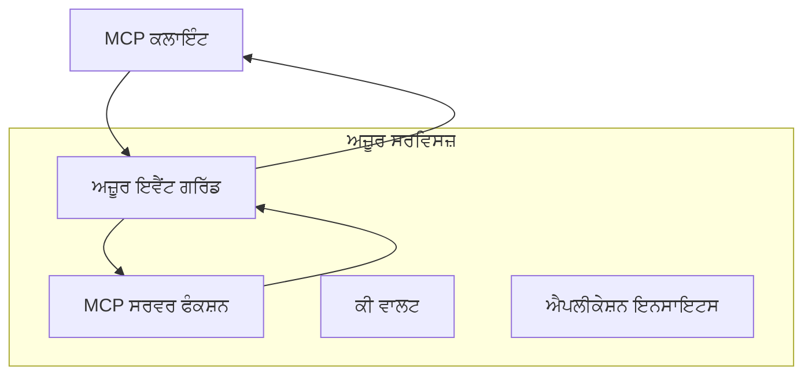
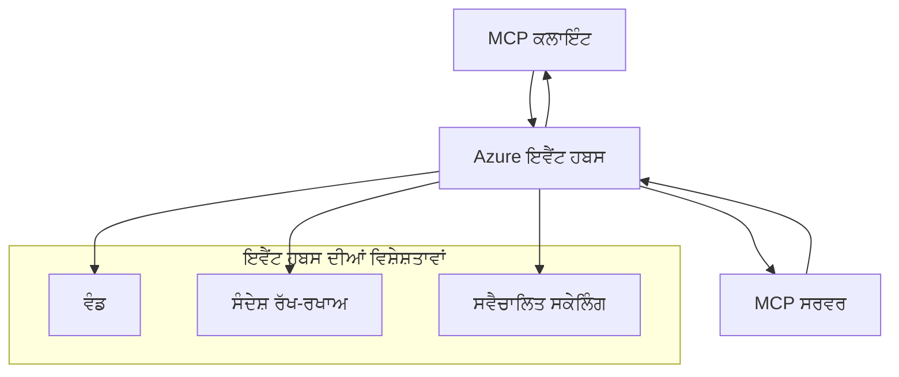

# MCP ਕਸਟਮ ਟ੍ਰਾਂਸਪੋਰਟ - ਐਡਵਾਂਸਡ ਇੰਪਲੀਮੈਂਟੇਸ਼ਨ ਗਾਈਡ

ਮਾਡਲ ਕਾਂਟੈਕਸਟ ਪ੍ਰੋਟੋਕੋਲ (MCP) ਵਿਸ਼ੇਸ਼ ਪਰਿਵੇਸ਼ਾਂ ਲਈ ਕਸਟਮ ਟ੍ਰਾਂਸਪੋਰਟ ਇੰਪਲੀਮੈਂਟੇਸ਼ਨ ਦੀ ਆਗਿਆ ਦਿੰਦਾ ਹੈ।
ਇਸ ਐਡਵਾਂਸਡ ਗਾਈਡ ਵਿੱਚ ਅਜ਼ੂਰ ਇਵੈਂਟ ਗ੍ਰਿਡ ਅਤੇ
ਅਜ਼ੂਰ ਇਵੈਂਟ ਹਬਜ਼ ਨੂੰ ਆਰਕੀਟੈਕਚਰ ਪੈਟਰਨ ਵਜੋਂ ਵੇਖਿਆ ਗਿਆ ਹੈ।
ਇਹ ਮਿਆਰੀ MCP ਟ੍ਰਾਂਸਪੋਰਟ ਨਹੀਂ ਹਨ ਅਤੇ ਦੋਹਾਂ ਐਂਡਪੌਇੰਟਾਂ ਦਾ ਕਸਟਮ ਮੈਪਿੰਗ 'ਤੇ ਸਹਿਮਤੀ ਲਾਜ਼ਮੀ ਹੈ।

> **MCP `2026-07-28` ਸਕੋਪ:** ਮੌਜੂਦਾ ਪ੍ਰੋਟੋਕੋਲ ਕੋਲ ਪ੍ਰੋਟੋਕੋਲ-ਪੱਧਰੀ ਸੈਸ਼ਨ ਨਹੀਂ ਹਨ,
> ਇਸ ਲਈ ਕਸਟਮ ਟ੍ਰਾਂਸਪੋਰਟ ਸੈਸ਼ਨ ਫ਼ਿਡਲਿਟੀ ਜਾਂ ਪ੍ਰਤੀ-ਸੈਸ਼ਨ ਆਰਡਰਿੰਗ 'ਤੇ ਨਿਰਭਰ ਨਹੀਂ ਹੋਣੇ ਚਾਹੀਦੇ।
> `Mcp-Method` ਅਤੇ ਸ਼ਰਤੀ `Mcp-Name` ਹੈਡਰਜ਼ ਮਿਆਰੀ ਸਟ੍ਰੀਮ ਕਰਨ ਯੋਗ HTTP ਟ੍ਰਾਂਸਪੋਰਟ ਦੀਆਂ ਲੋੜਾਂ ਹਨ;
> ਇੱਕ ਗੈਰ-HTTP ਟ੍ਰਾਂਸਪੋਰਟ ਲਈ, ਜੇ ਮੱਧਵਰਤੀ JSON-RPC ਬਾਡੀ ਡੀਕੋਡ ਕੀਤੇ ਬਿਨਾਂ ਰੂਟਿੰਗ ਕਰਨੀ ਲੋੜੀਂਦੀ ਹੈ,
> ਤਾਂ ਸਪੱਸ਼ਟ ਸਹਿਮਤ ਮੈਪਿੰਗ ਹੋਣੀ ਚਾਹੀਦੀ ਹੈ। ਵੇਖੋ
> [MCP ਵਿੱਚ ਕੀ ਬਦਲਿਆ ਗਿਆ ਹੈ: 2026-07-28 ਵਿਸ਼ੇਸ਼ਤਾ](../../01-CoreConcepts/mcp-2026-07-28.md)।


## ਪਰਿਚਯ

MCP ਦੇ ਮਿਆਰੀ ਟ੍ਰਾਂਸਪੋਰਟ stdio ਅਤੇ ਸਟ੍ਰੀਮ ਕਰਨ ਯੋਗ HTTP ਹਨ। ਕੁਝ ਉਦਯੋਗੀ ਪਰਿਵੇਸ਼
ਮੌਜੂਦਾ ਸੰਦੇਸ਼ ਪ੍ਰਣਾਲੀ ਨਾਲ ਇੰਟੀਗ੍ਰੇਸ਼ਨ ਲਈ ਕਸਟਮ ਮੈਪਿੰਗ ਵਰਤਦੇ ਹਨ,
ਪਰ ਇਸ ਨਾਲ ਉਹ MCP ਹੋਸਟਾਂ ਅਤੇ SDKs ਨਾਲ ਜੋ ਸਿਰਫ ਮਿਆਰੀ ਟ੍ਰਾਂਸਪੋਰਟ ਨੂੰ ਲਾਗੂ ਕਰਦੇ ਹਨ,
ਪਰਸਪਰ ਪ੍ਰਚਾਰਯੋਗਤਾ ਘਟ ਜਾਂਦੀ ਹੈ।

ਇਹ ਪਾਠ MCP ਵਿਸ਼ੇਸ਼ਤਾ `2026-07-28` ਦੀ ਅਵਿਨਾਭਾਵੀ ਲੋੜਾਂ ਨੂੰ ਅਜ਼ੂਰ ਸੰਦੇਸ਼ ਸੇਵਾਵਾਂ ਅਤੇ ਸਥਾਪਿਤ ਉਦਯੋਗੀ ਇੰਟੀਗ੍ਰੇਸ਼ਨ
ਪੈਟਰਨਾਂ ਨਾਲ ਲਾਗੂ ਕਰਦਾ ਹੈ।


### **MCP ਟ੍ਰਾਂਸਪੋਰਟ ਆਰਕੀਟੈਕਚਰ**

**MCP ਵਿਸ਼ੇਸ਼ਤਾ `2026-07-28` ਤੋਂ:**

- **ਮਿਆਰੀ ਟ੍ਰਾਂਸਪੋਰਟ:** stdio ਅਤੇ ਸਟ੍ਰੀਮ ਕਰਨ ਯੋਗ HTTP
- **ਕਸਟਮ ਟ੍ਰਾਂਸਪੋਰਟ:** ਵਿਕਲਪਿਕ, ਲਾਗੂ ਕਰਨ-ਵਿਸ਼ੇਸ਼ ਮੈਪਿੰਗ ਜੋ ਦੋਹਾਂ ਐਂਡਪੌਇੰਟ ਵੱਲੋਂ ਸਹਿਮਤ ਕੀਤੀਆਂ ਗਈਆਂ

- **ਸੰਦੇਸ਼ ਫਾਰਮੈਟ:** JSON-RPC 2.0 ਨਾਲ MCP-ਵਿਸ਼ੇਸ਼ ਵਾਧੇ
- **ਆਪਣੇ ਵਿੱਚ ਸਮੇਤ ਪ੍ਰਾਰੰਭਿਕ ਬੇਨਤੀਆਂ:** ਕੋਈ ਪ੍ਰੋਟੋਕੋਲ ਸੈਸ਼ਨ ਜਾਂ ਹੈਂਡਸ਼ੇਕ ਉਪਲਬਧ ਨਹੀਂ ਹੈ
  ਜੋ ਬੇਨਤੀਆਂ ਵਿਚਕਾਰ ਸਥਿਤੀ ਲਿਜਾਣ ਲਈ ਹੋਵੇ

## ਸਿੱਖਣ ਦੇ ਲਕੜੀਬੱਧ ਉਦੇਸ਼

ਇਸ ਐਡਵਾਂਸਡ ਪਾਠ ਦੇ ਅੰਤ ਤੱਕ, ਤੁਸੀਂ ਸਮਰੱਥ ਹੋਵੋਗੇ:

- **ਕਸਟਮ ਟ੍ਰਾਂਸਪੋਰਟ ਦੀਆਂ ਲੋੜਾਂ ਨੂੰ ਸਮਝੋ:** ਕਿਸੇ ਵੀ ਟ੍ਰਾਂਸਪੋਰਟ ਲੇਅਰ 'ਤੇ MCP ਪ੍ਰੋਟੋਕੋਲ ਲਾਗੂ ਕਰੋ ਅਤੇ ਪਾਲਣਾ ਜਾਰੀ ਰਖੋ
- **ਅਜ਼ੂਰ ਇਵੈਂਟ ਗ੍ਰਿਡ ਟ੍ਰਾਂਸਪੋਰਟ ਬਣਾਓ:** ਅਜ਼ੂਰ ਇਵੈਂਟ ਗ੍ਰਿਡ ਦੀ ਵਰਤੋਂ ਕਰਕੇ ਇਵੈਂਟ-ਚਾਲਤ MCP ਸਰਵਰ ਸਿਰਲੇਸ ਸਕੇਲਬਿਲਟੀ ਲਈ ਬਣਾਓ
- **ਅਜ਼ੂਰ ਇਵੈਂਟ ਹਬਜ਼ ਟ੍ਰਾਂਸਪੋਰਟ ਲਾਗੂ ਕਰੋ:** ਹਾਈ-ਥਰੂਪੁੱਟ MCP ਹੱਲਾਂ ਲਈ ਅਜ਼ੂਰ ਇਵੈਂਟ ਹਬਜ਼ ਦੀ ਡਿਜ਼ਾਇਨ ਬਣਾਓ ਜੋ ਰੀਅਲ-ਟਾਈਮ ਸਟ੍ਰੀਮਿੰਗ ਲਈ ਹਨ
- **ਉਦਯੋਗੀ ਪੈਟਰਨ ਲਾਗੂ ਕਰੋ:** ਮੌਜੂਦਾ ਅਜ਼ੂਰ ਬੁਨਿਆਦੀ ਢਾਂਚੇ ਅਤੇ ਸੁਰੱਖਿਆ ਮਾਡਲਾਂ ਨਾਲ ਕਸਟਮ ਟ੍ਰਾਂਸਪੋਰਟਾਂ ਨੂੰ ਜੋੜੋ
- **ਟ੍ਰਾਂਸਪੋਰਟ ਭਰੋਸੇਯੋਗਤਾ ਦਾ ਸਮਾਨਭਾਵ ਕਰੋ:** ਸੰਦੇਸ਼ ਦੀ ਟਿਕਾਉਣ, ਆਰਡਰਿੰਗ, ਅਤੇ ਗਲਤੀ ਨਿਬੜਾਈ ਉਦਯੋਗੀ ਸੰਦਰਭਾਂ ਲਈ ਲਾਗੂ ਕਰੋ
- **ਕਾਰਕੁਸ਼ਲਤਾ ਨੂੰ ਸੁਧਾਰੋ:** ਸਕੇਲ, ਦੇਰੀ ਅਤੇ ਥਰੂਪੁੱਟ ਲੋੜਾਂ ਲਈ ਟ੍ਰਾਂਸਪੋਰਟ ਹੱਲਾਂ ਦੀ ਡਿਜ਼ਾਇਨ ਕਰੋ

## **ਟ੍ਰਾਂਸਪੋਰਟ ਲੋੜਾਂ**

### **MCP `2026-07-28` ਲਈ ਮੁੱਖ ਲੋੜਾਂ**

```yaml
Message Protocol:
  format: "JSON-RPC 2.0 with MCP extensions"
    correlation: "Match responses to requests by JSON-RPC id"
    state: "Each request must be self-contained"
  
Transport Layer:
  reliability: "Transport MUST handle connection failures gracefully"
  security: "Transport MUST support secure communication"
    identification: "Carry protocol version, capabilities, and identity per request"
  
Custom Transport:
    compliance: "Map the selected MCP revision without adding session assumptions"
  extensibility: "MAY add transport-specific features"
    interoperability: "Both endpoints MUST agree on the custom mapping"
```

## **ਅਜ਼ੂਰ ਇਵੈਂਟ ਗ੍ਰਿਡ ਟ੍ਰਾਂਸਪੋਰਟ ਇੰਪਲੀਮੈਂਟੇਸ਼ਨ**

ਅਜ਼ੂਰ ਇਵੈਂਟ ਗ੍ਰਿਡ ਇੱਕ ਸਰਵਰਲੈੱਸ ਇਵੈਂਟ ਰੂਟਿੰਗ ਸੇਵਾ ਪ੍ਰਦਾਨ ਕਰਦਾ ਹੈ ਜੋ ਇਵੈਂਟ-ਚਾਲਿਤ MCP ਆਰਕੀਟੈਕਚਰਾਂ ਲਈ ਆਦਰਸ਼ ਹੈ। ਇਹ ਇੰਪਲੀਮੈਂਟੇਸ਼ਨ ਸਕੇਲਯੋਗ, ਢੀਲੇ ਜੁੜੇ MCP ਸਿਸਟਮ ਬਣਾਉਣਾ ਦਿਖਾਉਂਦੀ ਹੈ।

### **ਆਰਕੀਟੈਕਚਰ ਓਵਰਵਿਊ**



### **C# ਇੰਪਲੀਮੈਂਟੇਸ਼ਨ - ਇਵੈਂਟ ਗ੍ਰਿਡ ਟ੍ਰਾਂਸਪੋਰਟ**

```csharp
using Azure.Messaging.EventGrid;
using Microsoft.Extensions.Azure;
using System.Text.Json;

public class EventGridMcpTransport : IMcpTransport
{
    private readonly EventGridPublisherClient _publisher;
    private readonly string _topicEndpoint;
    private readonly string _clientId;
    
    public EventGridMcpTransport(string topicEndpoint, string accessKey, string clientId)
    {
        _publisher = new EventGridPublisherClient(
            new Uri(topicEndpoint), 
            new AzureKeyCredential(accessKey));
        _topicEndpoint = topicEndpoint;
        _clientId = clientId;
    }
    
    public async Task SendMessageAsync(McpMessage message)
    {
        var eventGridEvent = new EventGridEvent(
            subject: $"mcp/{_clientId}",
            eventType: "MCP.MessageReceived",
            dataVersion: "1.0",
            data: JsonSerializer.Serialize(message))
        {
            Id = Guid.NewGuid().ToString(),
            EventTime = DateTimeOffset.UtcNow
        };
        
        await _publisher.SendEventAsync(eventGridEvent);
    }
    
    public async Task<McpMessage> ReceiveMessageAsync(CancellationToken cancellationToken)
    {
        // Event Grid is push-based, so implement webhook receiver
        // This would typically be handled by Azure Functions trigger
        throw new NotImplementedException("Use EventGridTrigger in Azure Functions");
    }
}

// Azure Function for receiving Event Grid events
[FunctionName("McpEventGridReceiver")]
public async Task<IActionResult> HandleEventGridMessage(
    [EventGridTrigger] EventGridEvent eventGridEvent,
    ILogger log)
{
    try
    {
        var mcpMessage = JsonSerializer.Deserialize<McpMessage>(
            eventGridEvent.Data.ToString());
        
        // Process MCP message
        var response = await _mcpServer.ProcessMessageAsync(mcpMessage);
        
        // Send response back via Event Grid
        await _transport.SendMessageAsync(response);
        
        return new OkResult();
    }
    catch (Exception ex)
    {
        log.LogError(ex, "Error processing Event Grid MCP message");
        return new BadRequestResult();
    }
}
```

### **ਟਾਈਪਸਕ੍ਰਿਪਟ ਇੰਪਲੀਮੈਂਟੇਸ਼ਨ - ਇਵੈਂਟ ਗ੍ਰਿਡ ਟ੍ਰਾਂਸਪੋਰਟ**

```typescript
import { EventGridPublisherClient, AzureKeyCredential } from "@azure/eventgrid";
import { McpTransport, McpMessage } from "./mcp-types";

export class EventGridMcpTransport implements McpTransport {
    private publisher: EventGridPublisherClient;
    private clientId: string;
    
    constructor(
        private topicEndpoint: string,
        private accessKey: string,
        clientId: string
    ) {
        this.publisher = new EventGridPublisherClient(
            topicEndpoint,
            new AzureKeyCredential(accessKey)
        );
        this.clientId = clientId;
    }
    
    async sendMessage(message: McpMessage): Promise<void> {
        const event = {
            id: crypto.randomUUID(),
            source: `mcp-client-${this.clientId}`,
            type: "MCP.MessageReceived",
            time: new Date(),
            data: message
        };
        
        await this.publisher.sendEvents([event]);
    }
    
    // ਅਜ਼ੂਰ ਫੰਕਸ਼ਨਾਂ ਰਾਹੀਂ ਘਟਨਾ ਚਲਿਤ ਪ੍ਰਾਪਤੀ
    onMessage(handler: (message: McpMessage) => Promise<void>): void {
        // ਲਾਗੂ ਕਰਨ ਲਈ ਅਜ਼ੂਰ ਫੰਕਸ਼ਨਾਂ ਗਟਨਾ ਗ੍ਰਿਡ ਟਰਿਗਰ ਦੀ ਵਰਤੋਂ ਕੀਤੀ ਜਾਵੇਗੀ
        // ਇਹ webhook ਪ੍ਰਾਪਤਿਕਰਤਾ ਲਈ ਇੱਕ ਧਾਰਣਾਤਮਕ ਇੰਟਰਫੇਸ ਹੈ
    }
}

// ਅਜ਼ੂਰ ਫੰਕਸ਼ਨਾਂ ਲਾਗੂ ਕਰਨ
import { app, InvocationContext, EventGridEvent } from "@azure/functions";

app.eventGrid("mcpEventGridHandler", {
    handler: async (event: EventGridEvent, context: InvocationContext) => {
        try {
            const mcpMessage = event.data as McpMessage;
            
            // MCP ਸੁਨੇਹਾ ਪ੍ਰਕਿਰਿਆ ਕਰੋ
            const response = await mcpServer.processMessage(mcpMessage);
            
            // ਗਟਨਾ ਗ੍ਰਿਡ ਰਾਹੀਂ ਜਵਾਬ ਭੇਜੋ
            await transport.sendMessage(response);
            
        } catch (error) {
            context.error("Error processing MCP message:", error);
            throw error;
        }
    }
});
```

### **ਪਾਇਥਨ ਇੰਪਲੀਮੈਂਟੇਸ਼ਨ - ਇਵੈਂਟ ਗ੍ਰਿਡ ਟ੍ਰਾਂਸਪੋਰਟ**

```python
from azure.eventgrid import EventGridPublisherClient, EventGridEvent
from azure.core.credentials import AzureKeyCredential
import asyncio
import json
from typing import Callable, Optional
import uuid
from datetime import datetime

class EventGridMcpTransport:
    def __init__(self, topic_endpoint: str, access_key: str, client_id: str):
        self.client = EventGridPublisherClient(
            topic_endpoint, 
            AzureKeyCredential(access_key)
        )
        self.client_id = client_id
        self.message_handler: Optional[Callable] = None
    
    async def send_message(self, message: dict) -> None:
        """Send MCP message via Event Grid"""
        event = EventGridEvent(
            data=message,
            subject=f"mcp/{self.client_id}",
            event_type="MCP.MessageReceived",
            data_version="1.0"
        )
        
        await self.client.send(event)
    
    def on_message(self, handler: Callable[[dict], None]) -> None:
        """Register message handler for incoming events"""
        self.message_handler = handler

# ਏਜ਼ਰ ਫੰਕਸ਼ਨਸ ਦੀ ਲਾਗੂ ਕਰਨੀ
import azure.functions as func
import logging

def main(event: func.EventGridEvent) -> None:
    """Azure Functions Event Grid trigger for MCP messages"""
    try:
        # ਇਵੈਂਟ ਗ੍ਰਿੱਡ ਇਵੈਂਟ ਤੋਂ MCP ਸੁਨੇਹਾ ਪਾਰਸ ਕਰੋ
        mcp_message = json.loads(event.get_body().decode('utf-8'))
        
        # MCP ਸੁਨੇਹਾ ਪ੍ਰਕਿਰਿਆ ਕਰੋ
        response = process_mcp_message(mcp_message)
        
        # ਜਵਾਬ ਵਾਪਸ ਇਵੈਂਟ ਗ੍ਰਿੱਡ ਰਾਹੀਂ ਭੇਜੋ
        # (ਲਾਗੂ ਕਰਨ ਵਾਲਾ ਨਵਾਂ ਇਵੈਂਟ ਗ੍ਰਿੱਡ ਕਲਾਇੰਟ ਬਣਾਏਗਾ)
        
    except Exception as e:
        logging.error(f"Error processing MCP Event Grid message: {e}")
        raise
```

## **ਅਜ਼ੂਰ ਇਵੈਂਟ ਹਬਜ਼ ਟ੍ਰਾਂਸਪੋਰਟ ਇੰਪਲੀਮੈਂਟੇਸ਼ਨ**

ਅਜ਼ੂਰ ਇਵੈਂਟ ਹਬਜ਼ MCP ਪਰਿਸਥਿਤੀਆਂ ਲਈ ਹਾਈ-ਥਰੂਪੁੱਟ, ਰੀਅਲ-ਟਾਈਮ ਸਟ੍ਰੀਮਿੰਗ ਸਮਰੱਥਾਵਾਂ ਪ੍ਰਦਾਨ ਕਰਦਾ ਹੈ ਜਿੱਥੇ ਘੱਟ ਡਿเล ਅਤੇ ਵੱਡੀ ਸੰਦੇਸ਼ ਮਾਤਰਾ ਦੀ ਜ਼ਰੂਰਤ ਹੁੰਦੀ ਹੈ।

### **ਆਰਕੀਟੈਕਚਰ ਓਵਰਵਿਊ**




### **C# ਇੰਪਲੀਮਿੰਟੇਸ਼ਨ - ਇਵੈਂਟ ਹਬਜ਼ ਟ੍ਰਾਂਸਪੋਰਟ**

```csharp
using Azure.Messaging.EventHubs;
using Azure.Messaging.EventHubs.Producer;
using Azure.Messaging.EventHubs.Consumer;
using System.Text;

public class EventHubsMcpTransport : IMcpTransport, IDisposable
{
    private readonly EventHubProducerClient _producer;
    private readonly EventHubConsumerClient _consumer;
    private readonly string _consumerGroup;
    private readonly CancellationTokenSource _cancellationTokenSource;
    
    public EventHubsMcpTransport(
        string connectionString, 
        string eventHubName,
        string consumerGroup = "$Default")
    {
        _producer = new EventHubProducerClient(connectionString, eventHubName);
        _consumer = new EventHubConsumerClient(
            consumerGroup, 
            connectionString, 
            eventHubName);
        _consumerGroup = consumerGroup;
        _cancellationTokenSource = new CancellationTokenSource();
    }
    
    public async Task SendMessageAsync(McpMessage message)
    {
        var messageBody = JsonSerializer.Serialize(message);
        var eventData = new EventData(Encoding.UTF8.GetBytes(messageBody));
        
        // Add MCP-specific properties
        eventData.Properties.Add("MessageType", message.Method ?? "response");
        eventData.Properties.Add("MessageId", message.Id);
        eventData.Properties.Add("Timestamp", DateTimeOffset.UtcNow);
        
        await _producer.SendAsync(new[] { eventData });
    }
    
    public async Task StartReceivingAsync(
        Func<McpMessage, Task> messageHandler)
    {
        await foreach (PartitionEvent partitionEvent in _consumer.ReadEventsAsync(
            _cancellationTokenSource.Token))
        {
            try
            {
                var messageBody = Encoding.UTF8.GetString(
                    partitionEvent.Data.EventBody.ToArray());
                var mcpMessage = JsonSerializer.Deserialize<McpMessage>(messageBody);
                
                await messageHandler(mcpMessage);
            }
            catch (Exception ex)
            {
                // Handle deserialization or processing errors
                Console.WriteLine($"Error processing message: {ex.Message}");
            }
        }
    }
    
    public void Dispose()
    {
        _cancellationTokenSource?.Cancel();
        _producer?.DisposeAsync().AsTask().Wait();
        _consumer?.DisposeAsync().AsTask().Wait();
        _cancellationTokenSource?.Dispose();
    }
}
```

### **ਟਾਈਪਸਕ੍ਰਿਪਟ ਇੰਪਲੀਮਿੰਟੇਸ਼ਨ - ਇਵੈਂਟ ਹਬਜ਼ ਟ੍ਰਾਂਸਪੋਰਟ**

```typescript
import { 
    EventHubProducerClient, 
    EventHubConsumerClient, 
    EventData 
} from "@azure/event-hubs";

export class EventHubsMcpTransport implements McpTransport {
    private producer: EventHubProducerClient;
    private consumer: EventHubConsumerClient;
    private isReceiving = false;
    
    constructor(
        private connectionString: string,
        private eventHubName: string,
        private consumerGroup: string = "$Default"
    ) {
        this.producer = new EventHubProducerClient(
            connectionString, 
            eventHubName
        );
        this.consumer = new EventHubConsumerClient(
            consumerGroup,
            connectionString,
            eventHubName
        );
    }
    
    async sendMessage(message: McpMessage): Promise<void> {
        const eventData: EventData = {
            body: JSON.stringify(message),
            properties: {
                messageType: message.method || "response",
                messageId: message.id,
                timestamp: new Date().toISOString()
            }
        };
        
        await this.producer.sendBatch([eventData]);
    }
    
    async startReceiving(
        messageHandler: (message: McpMessage) => Promise<void>
    ): Promise<void> {
        if (this.isReceiving) return;
        
        this.isReceiving = true;
        
        const subscription = this.consumer.subscribe({
            processEvents: async (events, context) => {
                for (const event of events) {
                    try {
                        const messageBody = event.body as string;
                        const mcpMessage: McpMessage = JSON.parse(messageBody);
                        
                        await messageHandler(mcpMessage);
                        
                        // ਘੱਟੋ-ਘੱਟ ਇੱਕ ਵਾਰ ਜਿਹੜੀ ਸੇਵਾ ਲਈ ਚੈਕਪੋਇੰਟ ਅਪਡੇਟ ਕਰੋ
                        await context.updateCheckpoint(event);
                    } catch (error) {
                        console.error("Error processing Event Hubs message:", error);
                    }
                }
            },
            processError: async (err, context) => {
                console.error("Event Hubs error:", err);
            }
        });
    }
    
    async close(): Promise<void> {
        this.isReceiving = false;
        await this.producer.close();
        await this.consumer.close();
    }
}
```

### **ਪਾਈਥਨ ਇੰਪਲੀਮਿੰਟੇਸ਼ਨ - ਇਵੈਂਟ ਹਬਜ਼ ਟ੍ਰਾਂਸਪੋਰਟ**

```python
from azure.eventhub import EventHubProducerClient, EventHubConsumerClient
from azure.eventhub import EventData
import json
import asyncio
from typing import Callable, Dict, Any
import logging

class EventHubsMcpTransport:
    def __init__(
        self, 
        connection_string: str, 
        eventhub_name: str,
        consumer_group: str = "$Default"
    ):
        self.producer = EventHubProducerClient.from_connection_string(
            connection_string, 
            eventhub_name=eventhub_name
        )
        self.consumer = EventHubConsumerClient.from_connection_string(
            connection_string,
            consumer_group=consumer_group,
            eventhub_name=eventhub_name
        )
        self.is_receiving = False
    
    async def send_message(self, message: Dict[str, Any]) -> None:
        """Send MCP message via Event Hubs"""
        event_data = EventData(json.dumps(message))
        
        # MCP-ਵਿਸ਼ੇਸ਼ ਗੁਣ ਸ਼ਾਮਲ ਕਰੋ
        event_data.properties = {
            "messageType": message.get("method", "response"),
            "messageId": message.get("id"),
            "timestamp": "2025-01-14T10:30:00Z"  # ਅਸਲ ਟਾਈਮਸਟੈਂਪ ਵਰਤੋ
        }
        
        async with self.producer:
            event_data_batch = await self.producer.create_batch()
            event_data_batch.add(event_data)
            await self.producer.send_batch(event_data_batch)
    
    async def start_receiving(
        self, 
        message_handler: Callable[[Dict[str, Any]], None]
    ) -> None:
        """Start receiving MCP messages from Event Hubs"""
        if self.is_receiving:
            return
        
        self.is_receiving = True
        
        async with self.consumer:
            await self.consumer.receive(
                on_event=self._on_event_received(message_handler),
                starting_position="-1"  # ਸ਼ੁਰੂਅਾਤ ਤੋਂ ਸ਼ੁਰੂ ਕਰੋ
            )
    
    def _on_event_received(self, handler: Callable):
        """Internal event handler wrapper"""
        async def handle_event(partition_context, event):
            try:
                # Event Hubs ਘਟਨਾ ਤੋਂ MCP ਸੁਨੇਹਾ ਵਿਖੋ
                message_body = event.body_as_str(encoding='UTF-8')
                mcp_message = json.loads(message_body)
                
                # MCP ਸੁਨੇਹਾ ਪ੍ਰਕਿਰਿਆ ਕਰੋ
                await handler(mcp_message)
                
                # ਘੱਟੋ-ਘੱਟ ਇੱਕ ਵਾਰੀ ਡਿਲਿਵਰੀ ਲਈ ਚੈੱਕਪੌਇੰਟ ਅੱਪਡੇਟ ਕਰੋ
                await partition_context.update_checkpoint(event)
                
            except Exception as e:
                logging.error(f"Error processing Event Hubs message: {e}")
        
        return handle_event
    
    async def close(self) -> None:
        """Clean up transport resources"""
        self.is_receiving = False
        await self.producer.close()
        await self.consumer.close()
```

## **ਅਡਵਾਂਸਡ ਟ੍ਰਾਂਸਪੋਰਟ ਪੈਟਰਨز**

### **ਸੰਦਸ਼ ਦੀ ਮਜ਼ਬੂਤੀ ਅਤੇ ਭਰੋਸੇਯੋਗਤਾ**

```csharp
// Implementing message durability with retry logic
public class ReliableTransportWrapper : IMcpTransport
{
    private readonly IMcpTransport _innerTransport;
    private readonly RetryPolicy _retryPolicy;
    
    public async Task SendMessageAsync(McpMessage message)
    {
        await _retryPolicy.ExecuteAsync(async () =>
        {
            try
            {
                await _innerTransport.SendMessageAsync(message);
            }
            catch (TransportException ex) when (ex.IsRetryable)
            {
                // Log and retry
                throw;
            }
        });
    }
}
```

### **ਟ੍ਰਾਂਸਪੋਰਟ ਸੁਰੱਖਿਆ ਇੰਟੇਗ੍ਰੇਸ਼ਨ**

```csharp
// Integrating Azure Key Vault for transport security
public class SecureTransportFactory
{
    private readonly SecretClient _keyVaultClient;
    
    public async Task<IMcpTransport> CreateEventGridTransportAsync()
    {
        var accessKey = await _keyVaultClient.GetSecretAsync("EventGridAccessKey");
        var topicEndpoint = await _keyVaultClient.GetSecretAsync("EventGridTopic");
        
        return new EventGridMcpTransport(
            topicEndpoint.Value.Value,
            accessKey.Value.Value,
            Environment.MachineName
        );
    }
}
```

### **ਟ੍ਰਾਂਸਪੋਰਟ ਮਾਨੀਟਰਿੰਗ ਅਤੇ ਦੇਖਰੇਖ**

```csharp
// Adding telemetry to custom transports
public class ObservableTransport : IMcpTransport
{
    private readonly IMcpTransport _transport;
    private readonly ILogger _logger;
    private readonly TelemetryClient _telemetryClient;
    
    public async Task SendMessageAsync(McpMessage message)
    {
        using var activity = Activity.StartActivity("MCP.Transport.Send");
        activity?.SetTag("transport.type", "EventGrid");
        activity?.SetTag("message.method", message.Method);
        
        var stopwatch = Stopwatch.StartNew();
        
        try
        {
            await _transport.SendMessageAsync(message);
            
            _telemetryClient.TrackDependency(
                "EventGrid",
                "SendMessage",
                DateTime.UtcNow.Subtract(stopwatch.Elapsed),
                stopwatch.Elapsed,
                true
            );
        }
        catch (Exception ex)
        {
            _telemetryClient.TrackException(ex);
            throw;
        }
    }
}
```

## **ਐਂਟਰਪ੍ਰਾਈਜ਼ ਇੰਟੇਗ੍ਰੇਸ਼ਨ ਸਿਨੇਰੀਓਜ਼**

### **ਸਿਨੇਰੀਓ 1: ਵੰਡਿਆ ਹੋਇਆ MCP ਪ੍ਰੋਸੈਸਿੰਗ**

ਬਹੁਤ ਸਾਰੇ ਪ੍ਰੋਸੈਸਿੰਗ ਨੋਡਾਂ ਵਿੱਚ MCP ਅਰਜ਼ੀਆਂ ਵੰਡਣ ਲਈ ਐਜ਼ਯੂਰ ਇਵੈਂਟ ਗ੍ਰਿਡ ਦੀ ਵਰਤੋਂ:

```yaml
Architecture:
  - MCP Client sends requests to Event Grid topic
  - Multiple Azure Functions subscribe to process different tool types
  - Results aggregated and returned via separate response topic
  
Benefits:
  - Horizontal scaling based on message volume
  - Fault tolerance through redundant processors
  - Cost optimization with serverless compute
```

### **ਸਿਨੇਰੀਓ 2: ਰੀਅਲ-ਟਾਈਮ MCP ਸਟ੍ਰੀਮਿੰਗ**

ਉੱਚ-ਫ੍ਰੀਕਵੈਂਸੀ MCP अन्तਕਿਰਿਆਵਾਂ ਲਈ ਐਜ਼ਯੂਰ ਇਵੈਂਟ ਹਬਜ਼ ਦੀ ਵਰਤੋਂ:

```yaml
Architecture:
  - MCP Client streams continuous requests via Event Hubs
  - Stream Analytics processes and routes messages
  - Multiple consumers handle different aspect of processing
  
Benefits:
  - Low latency for real-time scenarios
  - High throughput for batch processing
  - Built-in partitioning for parallel processing
```

### **ਸਿਨੇਰੀਓ 3: ਹਾਇਬਰਿਡ ਟ੍ਰਾਂਸਪੋਰਟ ਆਰਕੀਟੈਕਚਰ**

ਵੱਖ-ਵੱਖ ਪ੍ਰਯੋਗਾਂ ਲਈ ਅਨੇਕ ਟ੍ਰਾਂਸਪੋਰਟਾਂ ਦਾ ਜੋੜ:

```csharp
public class HybridMcpTransport : IMcpTransport
{
    private readonly IMcpTransport _realtimeTransport; // Event Hubs
    private readonly IMcpTransport _batchTransport;    // Event Grid
    private readonly IMcpTransport _fallbackTransport; // HTTP Streaming
    
    public async Task SendMessageAsync(McpMessage message)
    {
        // Route based on message characteristics
        var transport = message.Method switch
        {
            "tools/call" when IsRealtime(message) => _realtimeTransport,
            "resources/read" when IsBatch(message) => _batchTransport,
            _ => _fallbackTransport
        };
        
        await transport.SendMessageAsync(message);
    }
}
```

## **ਪੈਫਾਰਮੈਂਸ ਅਪਟੀਮਾਈਜ਼ੇਸ਼ਨ**

### **ਇਵੈਂਟ ਗ੍ਰਿਡ ਲਈ ਸੰਦਸ਼ ਬੈਚਿੰਗ**

```csharp
public class BatchingEventGridTransport : IMcpTransport
{
    private readonly List<McpMessage> _messageBuffer = new();
    private readonly Timer _flushTimer;
    private const int MaxBatchSize = 100;
    
    public async Task SendMessageAsync(McpMessage message)
    {
        lock (_messageBuffer)
        {
            _messageBuffer.Add(message);
            
            if (_messageBuffer.Count >= MaxBatchSize)
            {
                _ = Task.Run(FlushMessages);
            }
        }
    }
    
    private async Task FlushMessages()
    {
        List<McpMessage> toSend;
        lock (_messageBuffer)
        {
            toSend = new List<McpMessage>(_messageBuffer);
            _messageBuffer.Clear();
        }
        
        if (toSend.Any())
        {
            var events = toSend.Select(CreateEventGridEvent);
            await _publisher.SendEventsAsync(events);
        }
    }
}
```

### **ਇਵੈਂਟ ਹਬਜ਼ ਲਈ ਪਾਰਟੀਸ਼ਨਿੰਗ ਰਣਨੀਤੀ**

```csharp
public class PartitionedEventHubsTransport : IMcpTransport
{
    public async Task SendMessageAsync(McpMessage message)
    {
        // Partition by client ID for session affinity
        var partitionKey = ExtractClientId(message);
        
        var eventData = new EventData(JsonSerializer.SerializeToUtf8Bytes(message))
        {
            PartitionKey = partitionKey
        };
        
        await _producer.SendAsync(new[] { eventData });
    }
}
```

## **ਕਸਟਮ ਟ੍ਰਾਂਸਪੋਰਟ ਦਾ ਟੈਸਟਿੰਗ**

### **ਟੈਸਟ ਡਬਲਜ਼ ਨਾਲ ਯੂਨਿਟ ਟੈਸਟਿੰਗ**

```csharp
[Test]
public async Task EventGridTransport_SendMessage_PublishesCorrectEvent()
{
    // Arrange
    var mockPublisher = new Mock<EventGridPublisherClient>();
    var transport = new EventGridMcpTransport(mockPublisher.Object);
    var message = new McpMessage { Method = "tools/list", Id = "test-123" };
    
    // Act
    await transport.SendMessageAsync(message);
    
    // Assert
    mockPublisher.Verify(
        x => x.SendEventAsync(
            It.Is<EventGridEvent>(e => 
                e.EventType == "MCP.MessageReceived" &&
                e.Subject == "mcp/test-client"
            )
        ),
        Times.Once
    );
}
```

### **ਐਜ਼ਯੂਰ ਟੈਸਟ ਕੰਟੇਨਰਜ਼ ਨਾਲ ਇੰਟੈਗ੍ਰੇਸ਼ਨ ਟੈਸਟਿੰਗ**

```csharp
[Test]
public async Task EventHubsTransport_IntegrationTest()
{
    // Using Testcontainers for integration testing
    var eventHubsContainer = new EventHubsContainer()
        .WithEventHub("test-hub");
    
    await eventHubsContainer.StartAsync();
    
    var transport = new EventHubsMcpTransport(
        eventHubsContainer.GetConnectionString(),
        "test-hub"
    );
    
    // Test message round-trip
    var sentMessage = new McpMessage { Method = "test", Id = "123" };
    McpMessage receivedMessage = null;
    
    await transport.StartReceivingAsync(msg => {
        receivedMessage = msg;
        return Task.CompletedTask;
    });
    
    await transport.SendMessageAsync(sentMessage);
    await Task.Delay(1000); // Allow for message processing
    
    Assert.That(receivedMessage?.Id, Is.EqualTo("123"));
}
```

## **ਸਰੋਤੋਂ ਸੁਰੱਖਿਆ ਅਤੇ ਮਾਰਗਦਰਸ਼ਨ**

### **ਟ੍ਰਾਂਸਪੋਰਟ ਡਿਜ਼ਾਇਨ ਸਿਧਾਂਤ**

1. **ਆਈਡੇਮਪੋਟੈਂਸੀ**: ਡੁਪਲਿਕੇਟ ਸੰਦਸ਼ਾਂ ਨੂੰ ਸੰਭਾਲਣ ਲਈ ਸੁਨਿਸ਼ਚਿਤ ਕਰੋ ਕਿ ਸੰਦਸ਼ ਪ੍ਰੋਸੈਸਿੰਗ ਆਈਡੇਮਪੋਟੈਂਟ ਹੈ
2. **ਗਲਤੀ ਸੰਭਾਲਣਾ**: ਵਿਸ਼ਤ੍ਰਿਤ ਗਲਤੀ ਸੰਭਾਲਣ ਅਤੇ ਡੈੱਡ ਲੈਟਰ ਕਿਊਜ਼ ਲਾਗੂ ਕਰੋ
3. **ਮਾਨੀਟਰਿੰਗ**: ਵਿਸਤ੍ਰਿਤ ਟੈਲੀਮੀਟਰੀ ਅਤੇ ਸਿਹਤ ਜਾਂਚਾਂ ਸ਼ਾਮਲ ਕਰੋ
4. **ਸੁਰੱਖਿਆ**: ਪ੍ਰਬੰਧਿਤ ਆਈਡੈਂਟਿਟੀਜ਼ ਅਤੇ ਘੱਟੋ-ਘੱਟ ਅਧਿਕਾਰ ਪਹੁੰਚ ਦੀ ਵਰਤੋਂ ਕਰੋ
5. **ਪੈਫਾਰਮੈਂਸ**: ਆਪਣੇ ਵਿਸ਼ੇਸ਼ ਲੇਟੈਂਸੀ ਅਤੇ ਥਰੂਪੁੱਟ ਦੀਆਂ ਲੋੜਾਂ ਲਈ ਡਿਜ਼ਾਇਨ ਕਰੋ

### **ਐਜ਼ਯੂਰ-ਵਿਸ਼ੇਸ਼ ਸਿਫ਼ਾਰਸ਼ਾਂ**

1. **ਮੈਨੇਜਡ ਆਈਡੈਂਟਿਟੀ ਦੀ ਵਰਤੋਂ ਕਰੋ**: ਪ੍ਰੋਡਕਸ਼ਨ ਵਿੱਚ ਕਨੈਕਸ਼ਨ ਸਟਰਿੰਗਜ਼ ਤੋਂ ਬਚੋ
2. **ਸਰਕਿਟ ਬ੍ਰੇਕਰ ਲਾਗੂ ਕਰੋ**: ਐਜ਼ਯੂਰ ਸੇਵਾ ਅਵਰੋਧਾਂ ਤੋਂ ਬਚਾਓ
3. **ਖਰਚ ਮਾਨੀਟਰ ਕਰੋ**: ਸੰਦਸ਼ ਐਅਰੀਏ ਅਤੇ ਪ੍ਰੋਸੈਸਿੰਗ ਖਰਚਾਂ ਦਾ ਟ੍ਰੈਕ ਰੱਖੋ
4. **ਸCALE ਲਈ ਯੋਜਨਾ ਬਣਾਓ**: ਸ਼ੁਰੂਆਤੀ ਪਾਰਟੀਸ਼ਨਿੰਗ ਅਤੇ ਸਕੇਲਿੰਗ ਰਣਨੀਤੀਆਂ ਡਿਜ਼ਾਇਨ ਕਰੋ
5. **ਧੁਰੀ ਤਹਿ ਕਰਕੇ ਟੈਸਟ ਕਰੋ**: ਵਿਸ਼ਤ੍ਰਿਤ ਟੈਸਟਿੰਗ ਲਈ ਐਜ਼ਯੂਰ ਡੈਵਟੈਸਟ ਲੈਬਜ਼ ਦੀ ਵਰਤੋਂ ਕਰੋ

## **ਸੰਘਰਸ਼**

ਕਸਟਮ MCP ਟ੍ਰਾਂਸਪੋਰਟ ਸ਼ਕਤੀਸ਼ਾਲੀ ਐਂਟਰਪ੍ਰਾਈਜ਼ ਸਿਨੇਰੀਓਜ਼ ਨੂੰ ਸੰਭਾਲਦੇ ਹਨ ਜੋ ਐਜ਼ਯੂਰ ਦੇ ਮੈਸੇਜਿੰਗ ਸੇਵਾਵਾਂ ਦੀ ਵਰਤੋਂ ਕਰਦੇ ਹਨ। ਇਵੈਂਟ ਗ੍ਰਿਡ ਜਾਂ ਇਵੈਂਟ ਹਬਜ਼ ਟ੍ਰਾਂਸਪੋਰਟ ਲਾਗੂ ਕਰਕੇ, ਤੁਸੀਂ ਸਕੇਲਬਲ, ਭਰੋਸੇਯੋਗ MCP ਹੱਲ ਬਣਾ ਸਕਦੇ ਹੋ ਜੋ ਮੌਜੂਦਾ ਐਜ਼ਯੂਰ ਇੰਫਰਾਸ਼ਟਰੱਕਚਰ ਨਾਲ ਬਿਨਾਂ ਕਿਸੇ ਰੁਕਾਵਟ ਦੇ ਮਿਲਦੇ ਹਨ।

ਦਿੱਤੇ ਗਏ ਉਦਾਹਰਣ ਪ੍ਰੋਡਕਸ਼ਨ-ਤਿਆਰ ਪੈਟਰਨ ਦਿਖਾਉਂਦੇ ਹਨ ਜੋ ਕਸਟਮ ਟ੍ਰਾਂਸਪੋਰਟ ਲਾਗੂ ਕਰਨ ਲਈ MCP ਪ੍ਰੋਟੋਕਾਲ ਅਨੁਕੂਲਤਾ ਅਤੇ ਐਜ਼ਯੂਰ ਦੀਆਂ ਸ੍ਰੇਸ਼ਠ ਰੀਤਾਂ ਨੂੰ ਬਰਕਰਾਰ ਰੱਖਦੇ ਹਨ।

## **ਵਾਧੂ ਸਰੋਤ**

- [MCP ਵਿਸ਼ੇਸ਼ਤਾ 2026-07-28](https://modelcontextprotocol.io/specification/2026-07-28/)
- [ਐਜ਼ਯੂਰ ਇਵੈਂਟ ਗ੍ਰਿਡ ਦਸਤਾਵੇਜ਼](https://docs.microsoft.com/azure/event-grid/)
- [ਐਜ਼ਯੂਰ ਇਵੈਂਟ ਹਬਜ਼ ਦਸਤਾਵੇਜ਼](https://docs.microsoft.com/azure/event-hubs/)
- [ਐਜ਼ਯੂਰ ਫੰਕਸ਼ਨਜ਼ ਇਵੈਂਟ ਗ੍ਰਿਡ ਟ੍ਰਿਗਰ](https://docs.microsoft.com/azure/azure-functions/functions-bindings-event-grid)
- [ਐਜ਼ਯੂਰ SDK ਫਾਰ .NET](https://github.com/Azure/azure-sdk-for-net)
- [ਐਜ਼ਯੂਰ SDK ਫਾਰ ਟਾਈਪਸਕ੍ਰਿਪਟ](https://github.com/Azure/azure-sdk-for-js)
- [ਐਜ਼ਯੂਰ SDK ਫਾਰ ਪਾਈਥਨ](https://github.com/Azure/azure-sdk-for-python)

---

> *ਇਹ ਗਾਈਡ ਕਸਟਮ ਆਰਕੀਟੈਕਚਰ ਪੈਟਰਨਾਂ 'ਤੇ ਧਿਆਨ ਕੇਂਦ੍ਰਿਤ ਕਰਦੀ ਹੈ। ਪ੍ਰੋਟੋਕੋਲ ਦੀ ਪੁਸ਼ਟੀ ਕਰੋ

> [MCP Specification 2026-07-28](https://modelcontextprotocol.io/specification/2026-07-28/) ਦੇ ਖਿਲਾਫ ਵਰਤਾਵ,
> ਅਤੇ ਤੁਹਾਡੇ ਜ਼ਰੂਰਤਾਂ ਅਤੇ ਸੇਵਾ ਸੀਮਾਵਾਂ ਦੇ ਖਿਲਾਫ ਅਜ਼ੂਰੀ ਇਸਤੇਮਾਲ ਦੀ ਪੁਸ਼ਟੀ ਕਰੋ.*


## ਅਗਲਾ ਕੀ ਹੈ
- [6. ਕਮਿਊਨਿਟੀ ਯੋਗਦਾਨ](../../06-CommunityContributions/README.md)

---

<!-- CO-OP TRANSLATOR DISCLAIMER START -->
**ਅਸਵੀਕਾਰੋਪਣ**:
ਇਸ ਦਸਤਾਵੇਜ਼ ਦਾ ਅਨੁਵਾਦ ਏਆਈ ਅਨੁਵਾਦ ਸੇਵਾ [Co-op Translator](https://github.com/Azure/co-op-translator) ਦੀ ਵਰਤੋਂ ਕਰਕੇ ਕੀਤਾ ਗਿਆ ਹੈ। ਜਦੋਂ ਕਿ ਅਸੀਂ ਸਹੀਤਾਵਾਂ ਲਈ ਯਤਨਸ਼ੀਲ ਹਾਂ, ਕਿਰਪਾ ਕਰਕੇ ਧਿਆਨ ਰੱਖੋ ਕਿ ਸਵੈਚਾਲਿਤ ਅਨੁਵਾਦਾਂ ਵਿੱਚ ਗਲਤੀਆਂ ਜਾਂ ਅਸਮੱਤਿਆਵਾਂ ਹੋ ਸਕਦੀਆਂ ਹਨ। ਮੂਲ ਦਸਤਾਵੇਜ਼ ਆਪਣੀ ਮੂਲ ਭਾਸ਼ਾ ਵਿੱਚ ਅਧਿਕਾਰਕ ਸਰੋਤ ਮੰਨਿਆ ਜਾਣਾ ਚਾਹੀਦਾ ਹੈ। ਜਰੂਰੀ ਜਾਣਕਾਰੀ ਲਈ, ਪੇਸ਼ੇਵਰ ਮਨੁੱਖੀ ਅਨੁਵਾਦ ਦੀ ਸਿਫ਼ਾਰਸ਼ ਕੀਤੀ ਜਾਂਦੀ ਹੈ। ਅਸੀਂ ਇਸ ਅਨੁਵਾਦ ਦੇ ਉਪਯੋਗ ਤੋਂ ਪੈਦਾ ਹੋਣ ਵਾਲੀਆਂ ਕਿਸੇ ਵੀ ਗਲਤਫਹਿਮੀਆਂ ਜਾਂ ਗਲਤ ਵਿਆਖਿਆਵਾਂ ਲਈ ਜਵਾਬਦੇਹ ਨਹੀਂ ਹਾਂ।
<!-- CO-OP TRANSLATOR DISCLAIMER END -->