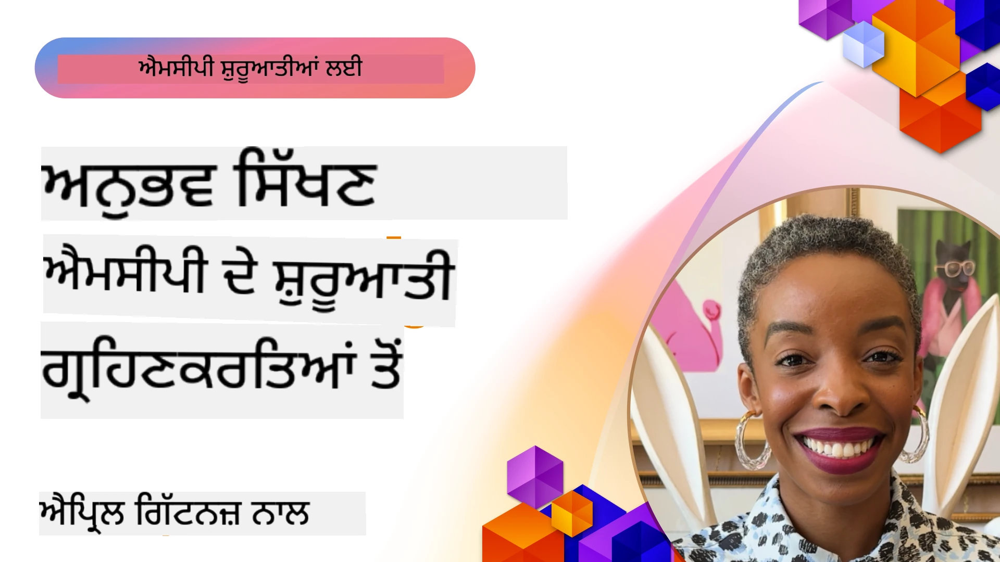

# 🌟 ਪਹਿਲਾਂ ਅਪਣਾਉਣ ਵਾਲਿਆਂ ਤੋਂ ਸਿੱਖਿਆ

[](https://youtu.be/jds7dSmNptE)

_(ਇਸ ਪਾਠ ਦਾ ਵੀਡੀਓ ਦੇਖਣ ਲਈ ਉਪਰ ਦਿੱਤੀ ਤਸਵੀਰ ਤੇ ਕਲਿੱਕ ਕਰੋ)_

## 🎯 ਇਹ ਮਾਡਿਊਲ ਕੀ ਕੁਝ ਦਿਖਾਉਂਦਾ ਹੈ

ਇਹ ਮਾਡਿਊਲ ਦਿੱਸਦਾ ਹੈ ਕਿ ਅਸਲੀ ਸੰਗਠਨ ਅਤੇ ਵਿਕਾਸਕਾਰ ਮਾਡਲ ਕਾਂਟੈਕਸਟ ਪ੍ਰੋਟੋਕੋਲ (MCP) ਦਾ ਪ੍ਰਯੋਗ ਕਰਕੇ ਕਿਵੇਂ ਅਸਲੀ ਚੁਣੌਤੀਆਂ ਨੂੰ ਸਮਾਧਾਨ ਕਰਦੇ ਹਨ ਅਤੇ ਨਵੀਨਤਾ ਨੂੰ ਪ੍ਰੋਤਸਾਹਿਤ ਕਰਦੇ ਹਨ। ਵਿਸਥਾਰਪੂਰਕ ਕੇਸ ਅਧਿਐਨ, ਹੱਥੋਂ ਹੱਥ ਪ੍ਰੋਜੈਕਟਾਂ ਅਤੇ ਪਾਠਾਈ ਉਦਾਹਰਨਾਂ ਰਾਹੀਂ, ਤੁਸੀਂ ਜਾਣੋਗੇ ਕਿ MCP ਕਿਵੇਂ ਭਰੋਸੇਯੋਗ, ਵੱਧਣਯੋਗ AI ਇਨਟੀਗ੍ਰੇਸ਼ਨ ਲਈ ਯੋਗ ਬਣਾਉਂਦਾ ਹੈ ਜੋ ਭਾਸ਼ਾ ਮਾਡਲਾਂ, ਸੰਦਾਂ, ਅਤੇ ਉਦਯੋਗਿਕ ਡੇਟਾ ਕਨੈਕਟ ਕਰਦਾ ਹੈ।

### 📚 MCP ਨੂੰ ਕਾਰਵਾਈ ਵਿੱਚ ਵੇਖੋ

ਕੀ ਤੁਸੀਂ ਇਹਨਾਂ ਸਿਧਾਂਤਾਂ ਨੂੰ ਪ੍ਰੋਡਕਸ਼ਨ-ਤਿਆਰ ਸੰਦਾਂ 'ਤੇ ਲਾਗੂ ਹੁੰਦੇ ਦੇਖਣਾ ਚਾਹੁੰਦੇ ਹੋ? ਸਾਡੇ [**10 Microsoft MCP ਸਰਵਰ ਜੋ ਵਿਕਾਸਕਾਰ ਦੀ ਉਤਪਾਦਕਤਾ ਬਦਲ ਰਹੇ ਹਨ**](microsoft-mcp-servers.md) ਨੂੰ ਵੇਖੋ, ਜੋ ਅਸਲ Microsoft MCP ਸਰਵਰਾਂ ਨੂੰ ਦਿਖਾਉਂਦੇ ਹਨ ਜੋ ਤੁਸੀਂ ਅੱਜ ਹੀ ਵਰਤ ਸਕਦੇ ਹੋ।

## ਓਵਰਵਿਊ

ਇਹ ਪਾਠ ਵੇਖਾਉਂਦਾ ਹੈ ਕਿ ਪਹਿਲਾਂ ਅਪਣਾਉਣ ਵਾਲਿਆਂ ਨੇ ਮਾਡਲ ਕਾਂਟੈਕਸਟ ਪ੍ਰੋਟੋਕੋਲ (MCP) ਨੂੰ ਕਿਵੇਂ ਵਰਤ ਕੇ ਅਸਲੀ ਸੰਸਾਰ ਦੀਆਂ ਚੁਣੌਤੀਆਂ ਦਾ ਹੱਲ ਲੱਭਿਆ ਅਤੇ ਉਦਯੋਗਾਂ ਵਿੱਚ ਨਵੀਨਤਾ ਨੂੰ ਪ੍ਰੋਤਸਾਹਿਤ ਕੀਤਾ। ਵਿਸਥਾਰਪੂਰਕ ਕੇਸ ਅਧਿਐਨਾਂ ਅਤੇ ਹੱਥੋਂ ਹੱਥ ਪ੍ਰੋਜੈਕਟਾਂ ਰਾਹੀਂ, ਤੁਸੀਂ ਵੇਖੋਗੇ ਕਿ MCP ਕਿਵੇਂ ਮਿਆਰੀਕ੍ਰਿਤ, ਭਰੋਸੇਯੋਗ ਅਤੇ ਵੱਧਣਯੋਗ AI ਇਨਟੀਗ੍ਰੇਸ਼ਨ ਨੂੰ ਯੋਗ ਬਣਾਉਂਦਾ ਹੈ — ਵੱਡੇ ਭਾਸ਼ਾ ਮਾਡਲਾਂ, ਸੰਦਾਂ ਅਤੇ ਉਦਯੋਗਿਕ ਡਾਟਾ ਨੂੰ ਇੱਕਠੇ ਇਕ_framework ਵਿੱਚ ਜੁੜਦਾ ਹੈ। ਤੁਸੀਂ MCP-ਆਧਾਰਿਤ ਸਮਾਧਾਨਾਂ ਨੂੰ ਡਿਜ਼ਾਈਨ ਅਤੇ ਬਣਾਉਣ ਦਾ ਪ੍ਰਯੋਗਿਕ ਤਜਰਬਾ ਪ੍ਰਾਪਤ ਕਰੋਗੇ, ਸਾਬਤ ਹੋਏ ਅਮਲ ਪੈਟਰਨਾਂ ਤੋਂ ਸਿੱਖੋਗੇ ਅਤੇ ਪ੍ਰੋਡਕਸ਼ਨ ਵਾਤਾਵਰਨਾਂ ਵਿੱਚ MCP ਲਾਗੂ ਕਰਨ ਲਈ ਵਧੀਆ ਅਭਿਆਸਾਂ ਦੀ ਖੋਜ ਕਰੋਗੇ। ਇਹ ਪਾਠ ਨਵੇਂ ਰੁਝਾਨ, ਭਵਿੱਖ ਦੀ ਦਿਸ਼ਾ ਅਤੇ ਖੁੱਲਾ ਸਰੋਤ ਸੰਸਾਧਨਾਂ ਨੂੰ ਵੀ ਉਜਾਗਰ ਕਰਦਾ ਹੈ, ਜੋ ਤੁਹਾਨੂੰ MCP ਤਕਨੀਕ ਅਤੇ ਇਸ ਦੇ ਵਿਕਾਸਸ਼ੀਲ ਪ੍ਰਣਾਲੀ ਵਿੱਚ ਆਗੇ ਰਹਿਣ ਵਿੱਚ ਮਦਦ ਕਰਦੇ ਹਨ।

## ਸਿੱਖਣ ਦੇ ਮੁੱਖ ਉਦੇਸ਼

- ਵੱਖ-ਵੱਖ ਉਦਯੋਗਾਂ ਵਿੱਚ ਅਸਲੀ ਦੁਨੀਆ MCP ਹਲਾਂ ਦਾ ਵਿਸ਼ਲੇਸ਼ਣ ਕਰੋ
- ਪੂਰੇ MCP-ਆਧਾਰਿਤ ਐਪਲੀਕੇਸ਼ਨਾਂ ਨੂੰ ਡਿਜ਼ਾਈਨ ਅਤੇ ਤਿਆਰ ਕਰੋ
- MCP ਤਕਨੀਕ ਵਿੱਚ ਨਵੇਂ ਰੁਝਾਨ ਅਤੇ ਭਵਿੱਖ ਦੀਆਂ ਦਿਸ਼ਾਵਾਂ ਦੀ ਖੋਜ ਕਰੋ
- ਅਸਲੀ ਵਿਕਾਸ ਸੰਦਰਭ ਵਿੱਚ ਵਧੀਆ ਅਭਿਆਸਾਂ ਨੂੰ ਲਾਗੂ ਕਰੋ

## ਅਸਲੀ ਦੁਨੀਆ MCP ਲਾਗੂਆਂ

### ਕੇਸ ਸਟਡੀ 1: ਉਦਯੋਗਿਕ ਗਾਹਕ ਸਹਾਇਤਾ ਆਟੋਮੇਸ਼ਨ

ਇੱਕ ਬਹੁ-ਰਾਸ਼ਟਰ ਕੰਪਨੀ ਨੇ ਆਪਣੇ ਗਾਹਕ ਸਹਾਇਤਾ ਪ੍ਰਣਾਲੀਆਂ ਵਿੱਚ ਏਆਈ ਇੰਟਰੈਕਸ਼ਨਾਂ ਨੂੰ ਮਿਆਰੀਕ੍ਰਿਤ ਕਰਨ ਲਈ MCP-ਆਧਾਰਿਤ ਹਲ ਲਾਗੂ ਕੀਤਾ। ਇਸ ਨੇ ਉਨ੍ਹਾਂ ਨੂੰ ਯੋਗ ਬਣਾਇਆ:

- ਕਈ LLM ਪ੍ਰਦਾਤਾਵਾਂ ਲਈ ਇੱਕ ਇਕਕੀਕ੍ਰਿਤ ਇੰਟਰਫੇਸ ਬਣਾਉਣ
- ਵਿਭਾਗਾਂ ਵਿੱਚ ਸਥਿਰ ਪ੍ਰੌਮਪਟ ਪ੍ਰਬੰਧਨ ਰੱਖਣ
- ਮਜ਼ਬੂਤ ਸੁਰੱਖਿਆ ਅਤੇ ਅਨੁਕੂਲਤਾ ਕੰਟਰੋਲ ਲਾਗੂ ਕਰਨ
- ਖਾਸ ਜ਼ਰੂਰਤਾਂ ਦੇ ਅਧਾਰ 'ਤੇ ਵੱਖ-ਵੱਖ AI ਮਾਡਲਾਂ ਵਿਚਕਾਰ ਆਸਾਨੀ ਨਾਲ ਬਦਲਣਾ

**ਤਕਨੀਕੀ ਲਾਗੂਆ:**

```python
# ਗਾਹਕ ਸਮਰਥਨ ਲਈ ਪਾਈਥਨ MCP ਸਰਵਰ ਨਿਰਮਾਣ
import logging
import asyncio
from modelcontextprotocol import create_server, ServerConfig
from modelcontextprotocol.server import MCPServer
from modelcontextprotocol.transports import create_http_transport
from modelcontextprotocol.resources import ResourceDefinition
from modelcontextprotocol.prompts import PromptDefinition
from modelcontextprotocol.tool import ToolDefinition

# ਲੌਗਿੰਗ ਸੈਟअप ਕਰੋ
logging.basicConfig(level=logging.INFO)

async def main():
    # ਸਰਵਰ ਸੰਰਚਨਾ ਬਣਾਓ
    config = ServerConfig(
        name="Enterprise Customer Support Server",
        version="1.0.0",
        description="MCP server for handling customer support inquiries"
    )
    
    # MCP ਸਰਵਰ ਨੂੰ ਸ਼ੁਰੂ ਕਰੋ
    server = create_server(config)
    
    # ਗਿਆਨ ਅਧਾਰ ਸਰੋਤ ਰਜਿਸਟਰ ਕਰੋ
    server.resources.register(
        ResourceDefinition(
            name="customer_kb",
            description="Customer knowledge base documentation"
        ),
        lambda params: get_customer_documentation(params)
    )
    
    # ਪ੍ਰੋੰਪਟ ਟੈਮਪਲેટ ਰਜਿਸਟਰ ਕਰੋ
    server.prompts.register(
        PromptDefinition(
            name="support_template",
            description="Templates for customer support responses"
        ),
        lambda params: get_support_templates(params)
    )
    
    # ਸਮਰਥਨ ਸੰਦ ਰਜਿਸਟਰ ਕਰੋ
    server.tools.register(
        ToolDefinition(
            name="ticketing",
            description="Create and update support tickets"
        ),
        handle_ticketing_operations
    )
    
    # HTTP ਟ੍ਰਾਂਸਪੋਰਟ ਨਾਲ ਸਰਵਰ ਸ਼ੁਰੂ ਕਰੋ
    transport = create_http_transport(port=8080)
    await server.run(transport)

if __name__ == "__main__":
    asyncio.run(main())
```

**ਨਤੀਜੇ:** ਮਾਡਲ ਲਾਗਤਾਂ ਵਿੱਚ 30% ਕਮੀ, ਜਵਾਬ ਦੀ ਸਥਿਰਤਾ ਵਿੱਚ 45% ਸੁਧਾਰ, ਅਤੇ ਵਿਸ਼ਵ ਵਿਆਪੀ ਕਾਰਜਾਂ ਵਿੱਚ ਬਿਹਤਰ ਅਨੁਕੂਲਤਾ।

### ਕੇਸ ਸਟਡੀ 2: ਸਿਹਤ ਸੇਵਾ ਨਿਧਾਰਕ ਸਹਾਇਕ

ਇੱਕ ਸਿਹਤ ਸੇਵਾ ਪ੍ਰਦਾਤਾ ਨੇ ਪੇਸ਼ਕੀ ਹੋਈਆਂ ਵਿਸ਼ੇਸ਼ਜ ਗਿਆਨ ਵਾਲੀਆਂ ਮੈਡੀਕਲ AI ਮਾਡਲਾਂ ਨੂੰ ਜੋੜਨ ਲਈ MCP ਢਾਂਚਾ ਵਿਕਸਤ ਕੀਤਾ, ਜਦੋਂ ਕਿ ਸੰਵੇਦਨਸ਼ੀਲ ਮਰੀਜ਼ ਡੇਟਾ ਦੀ ਸੁਰੱਖਿਆ ਯਕੀਨੀ ਬਣਾਈ:

- ਆਮ ਅਤੇ ਵਿਸ਼ੇਸ਼ਜ ਮੈਡੀਕਲ ਮਾਡਲਾਂ ਵਿੱਚ ਸੁਚਾਰੂ ਬਦਲਾਅ
- ਕੜੀਆਂ ਪ੍ਰਾਈਵੇਸੀ ਕੰਟਰੋਲ ਅਤੇ ਆਡਿਟ ਟ੍ਰੇਲ
- ਮੌਜੂਦਾ ਇਲੈਕਟ੍ਰਾਨਿਕ ਹੈਲਥ ਰਿਕਾਰਡ (EHR) ਪ੍ਰਣਾਲੀਆਂ ਨਾਲ ਇਨਟੀਗ੍ਰੇਸ਼ਨ
- ਮੈਡੀਕਲ ਸ਼ਬਦਾਵਲੀ ਲਈ ਸਥਿਰ ਪ੍ਰੌਮਪਟ ਇੰਜੀਨੀਅਰਿੰਗ

**ਤਕਨੀਕੀ ਲਾਗੂਆ:**

```csharp
// C# MCP host application implementation in healthcare application
using Microsoft.Extensions.DependencyInjection;
using ModelContextProtocol.SDK.Client;
using ModelContextProtocol.SDK.Security;
using ModelContextProtocol.SDK.Resources;

public class DiagnosticAssistant
{
    private readonly MCPHostClient _mcpClient;
    private readonly PatientContext _patientContext;
    
    public DiagnosticAssistant(PatientContext patientContext)
    {
        _patientContext = patientContext;
        
        // Configure MCP client with healthcare-specific settings
        var clientOptions = new ClientOptions
        {
            Name = "Healthcare Diagnostic Assistant",
            Version = "1.0.0",
            Security = new SecurityOptions
            {
                Encryption = EncryptionLevel.Medical,
                AuditEnabled = true
            }
        };
        
        _mcpClient = new MCPHostClientBuilder()
            .WithOptions(clientOptions)
            .WithTransport(new HttpTransport("https://healthcare-mcp.example.org"))
            .WithAuthentication(new HIPAACompliantAuthProvider())
            .Build();
    }
    
    public async Task<DiagnosticSuggestion> GetDiagnosticAssistance(
        string symptoms, string patientHistory)
    {
        // Create request with appropriate resources and tool access
        var resourceRequest = new ResourceRequest
        {
            Name = "patient_records",
            Parameters = new Dictionary<string, object>
            {
                ["patientId"] = _patientContext.PatientId,
                ["requestingProvider"] = _patientContext.ProviderId
            }
        };
        
        // Request diagnostic assistance using appropriate prompt
        var response = await _mcpClient.SendPromptRequestAsync(
            promptName: "diagnostic_assistance",
            parameters: new Dictionary<string, object>
            {
                ["symptoms"] = symptoms,
                patientHistory = patientHistory,
                relevantGuidelines = _patientContext.GetRelevantGuidelines()
            });
            
        return DiagnosticSuggestion.FromMCPResponse(response);
    }
}
```

**ਨਤੀਜੇ:** ਡਾਕਟਰਾਂ ਲਈ ਨਿਧਾਰਕ ਸੁਝਾਵਾਂ ਵਿੱਚ ਸੁਧਾਰ, ਸਮੂਹ HIPAA ਅਨੁਕੂਲਤਾ ਦੇ ਨਾਲ, ਅਤੇ ਪ੍ਰਣਾਲੀਆਂ ਵਿਚਕਾਰ ਸੰਦਰਭ ਬਦਲਾਵ ਵਿੱਚ ਮਹੱਤਵਪੂਰਣ ਕਮੀ।

### ਕੇਸ ਸਟਡੀ 3: ਵਿੱਤੀ ਸੇਵਾਵਾਂ ਖਤਰਾ ਵਿਸ਼ਲੇਸ਼ਣ

ਇੱਕ ਵਿੱਤੀ ਸੰਸਥਾ ਨੇ ਆਪਣੇ ਵੱਖਰੇ ਵੱਖਰੇ ਵਿਭਾਗਾਂ ਵਿੱਚ ਖਤਰਾ ਵਿਸ਼ਲੇਸ਼ਣ ਪ੍ਰਕਿਰਿਆਵਾਂ ਨੂੰ ਮਿਆਰੀਕ੍ਰਿਤ ਕਰਨ ਲਈ MCP ਲਾਗੂ ਕੀਤਾ:

- ਕਰੈਡਿਟ ਖਤਰਾ, ਧੋਖਾਧੜੀ ਪਛਾਣ ਅਤੇ ਨਿਵੇਸ਼ ਖਤਰਾ ਮਾਡਲਾਂ ਲਈ ਇਕ ਇਕਕੀਕ੍ਰਿਤ ਇੰਟਰਫੇਸ ਬਣਾਇਆ
- ਕੱਟੜੰਨ ਪਹੁੰਚ ਕੰਟਰੋਲ ਅਤੇ ਮਾਡਲ ਵਰਜ਼ਨਿੰਗ ਲਾਗੂ ਕੀਤੀ
- ਸਾਰੀਆਂ AI ਸਿਫਾਰਿਸ਼ਾਂ ਦੀ ਆਡਿਟਯੋਗਤਾ ਯਕੀਨੀ ਬਣਾਈ
- ਵੱਖ-ਵੱਖ ਪ੍ਰਣਾਲੀਆਂ ਵਿੱਚ ਸਥਿਰ ਡਾਟਾ ਫਾਰਮੈਟਿੰਗ ਰੱਖੀ

**ਤਕਨੀਕੀ ਲਾਗੂਆ:**

```java
// ਵਿੱਤੀ ਜੋਖਮ ਮੁਲਾਂਕਣ ਲਈ ਜਾਵਾ MCP ਸਰਵਰ
import org.mcp.server.*;
import org.mcp.security.*;

public class FinancialRiskMCPServer {
    public static void main(String[] args) {
        // ਵਿੱਤੀ ਅਨੁਕੂਲਤਾ ਫੀਚਰਾਂ ਨਾਲ MCP ਸਰਵਰ ਬਣਾਓ
        MCPServer server = new MCPServerBuilder()
            .withModelProviders(
                new ModelProvider("risk-assessment-primary", new AzureOpenAIProvider()),
                new ModelProvider("risk-assessment-audit", new LocalLlamaProvider())
            )
            .withPromptTemplateDirectory("./compliance/templates")
            .withAccessControls(new SOCCompliantAccessControl())
            .withDataEncryption(EncryptionStandard.FINANCIAL_GRADE)
            .withVersionControl(true)
            .withAuditLogging(new DatabaseAuditLogger())
            .build();
            
        server.addRequestValidator(new FinancialDataValidator());
        server.addResponseFilter(new PII_RedactionFilter());
        
        server.start(9000);
        
        System.out.println("Financial Risk MCP Server running on port 9000");
    }
}
```

**ਨਤੀਜੇ:** ਬਿਹਤਰ ਰੈਗੂਲੇਟਰੀ ਅਨੁਕੂਲਤਾ, 40% ਤੇਜ਼ ਮਾਡਲ ਤਿਆਰੀ ਚੱਕਰ, ਅਤੇ ਵਿਭਾਗਾਂ ਵਿੱਚ ਖਤਰਾ ਅੰਕੜੇ ਦੀ ਸਥਿਰਤਾ ਵਿੱਚ ਸੁਧਾਰ।

### ਕੇਸ ਸਟਡੀ 4: Microsoft Playwright MCP ਸਰਵਰ ਬ੍ਰਾਊਜ਼ਰ ਆਟੋਮੇਸ਼ਨ ਲਈ

Microsoft ਨੇ [Playwright MCP ਸਰਵਰ](https://github.com/microsoft/playwright-mcp) ਵਿਕਸਤ ਕੀਤਾ ਹੈ, ਜੋ ਮਾਡਲ ਕਾਂਟੈਕਸਟ ਪ੍ਰੋਟੋਕੋਲ ਰਾਹੀਂ ਸੁਰੱਖਿਅਤ, ਮਿਆਰੀਕ੍ਰਿਤ ਬ੍ਰਾਊਜ਼ਰ ਆਟੋਮੇਸ਼ਨ ਯੋਗ ਬਣਾਉਂਦਾ ਹੈ। ਇਹ ਪ੍ਰੋਡਕਸ਼ਨ-ਤਿਆਰ ਸਰਵਰ AI ਏਜੰਟਾਂ ਅਤੇ LLMs ਨੂੰ ਵੈੱਬ ਬ੍ਰਾਊਜ਼ਰਾਂ ਨਾਲ ਨਿਯੰਤਰਿਤ, ਆਡੀਟਯੋਗ ਅਤੇ ਵਿਸਥਾਰਸ਼ੀਲ ਢੰਗ ਨਾਲ ਅੰਤਰਕ੍ਰਿਆ ਕਰਨ ਦੀ ਆਗਿਆ ਦਿੰਦਾ ਹੈ - ਇਸ ਤਰ੍ਹਾਂ ਆਟੋਮੇਟੇਡ ਵੈੱਬ ਟੈਸਟਿੰਗ, ਡਾਟਾ ਅਧਿਕਾਰਨ ਅਤੇ ਐਂਡ-ਟੂ-ਐਂਡ ਵਰਕਫਲੋਜ਼ ਵਰਗੇ ਵਰਤੋਂ ਮਾਮਲੇ ਅਸਾਨ ਬਣਦੇ ਹਨ।

> **🎯 ਪ੍ਰੋਡਕਸ਼ਨ ਤਿਆਰ ਸੰਦ**
> 
> ਇਹ ਕੇਸ ਸਟਡੀ ਇੱਕ ਅਸਲੀ MCP ਸਰਵਰ ਨੂੰ ਦਿਖਾਉਂਦੀ ਹੈ ਜਿਸਨੂੰ ਤੁਸੀਂ ਅੱਜ ਹੀ ਵਰਤ ਸਕਦੇ ਹੋ! Playwright MCP ਸਰਵਰ ਅਤੇ 9 ਹੋਰ ਪ੍ਰੋਡਕਸ਼ਨ-ਤਿਆਰ Microsoft MCP ਸਰਵਰਾਂ ਬਾਰੇ ਜ਼ਿਆਦਾ ਜਾਣਕਾਰੀ ਲਈ ਸਾਡੇ [**Microsoft MCP ਸਰਵਰ ਮਾਰਗਦਰਸ਼ਿਕ**](microsoft-mcp-servers.md#8--playwright-mcp-server) ਨੂੰ ਦੇਖੋ।

**ਮੁੱਖ ਵਿਸ਼ੇਸ਼ਤਾਵਾਂ:**
- MCP ਸੰਦਾਂ ਵਜੋਂ ਬ੍ਰਾਊਜ਼ਰ ਆਟੋਮੇਸ਼ਨ ਸਮਰੱਥਾਵਾਂ (ਨੈਵੀਗੇਸ਼ਨ, ਫਾਰਮ ਭਰਨਾ, ਸਕਰੀਨਸ਼ਾਟ ਕੈਪਚਰ ਆਦਿ) ਦਾ ਪ੍ਰਦਰਸ਼ਨ
- ਗੈਰ-ਅਧਿਕਾਰਤ ਕਾਰਵਾਈ ਤੋਂ ਬਚਾਅ ਲਈ ਕੱਟੜ ਪਹੁੰਚ ਕੰਟਰੋਲ ਅਤੇ ਸੈਂਡਬਾਕਸਿੰਗ ਲਾਗੂ ਕੀਤੀ
- ਸਾਰੇ ਬ੍ਰਾਊਜ਼ਰ ਇੰਟਰੈਕਸ਼ਨਾਂ ਲਈ ਵਿਸਥਾਰਸ਼ੀਲ ਆਡਿਟ ਲਾਗ ਮੁਹੱਈਆ ਕਰਵਾਏ 
- ਏਜੰਟ-ਚਲਿਤ ਆਟੋਮੇਸ਼ਨ ਲਈ Azure OpenAI ਅਤੇ ਹੋਰ LLM ਪ੍ਰਦਾਤਾਵਾਂ ਨਾਲ ਇਨਟੀਗ੍ਰੇਸ਼ਨ ਦਾ ਸਮਰਥਨ
- GitHub Copilot ਦੇ ਕੋਡਿੰਗ ਏਜੰਟ ਨੂੰ ਵੈੱਬ ਬ੍ਰਾਊਜ਼ਿੰਗ ਸਮਰੱਥਾਵਾਂ ਨਾਲ ਸਸ਼ਕਤ ਕਰਦਾ ਹੈ

**ਤਕਨੀਕੀ ਲਾਗੂਆ:**

```typescript
// ਟਾਈਪਸਕ੍ਰਿਪਟ: MCP ਸਰਵਰ ਵਿੱਚ ਪ੍ਲੇਰਾਈਟ ਬ੍ਰਾਊਜ਼ਰ ਆਟੋਮੇਸ਼ਨ ਟੂਲਜ਼ ਨੂੰ ਰਜਿਸਟਰ ਕਰਨਾ
import { createServer, ToolDefinition } from 'modelcontextprotocol';
import { launch } from 'playwright';

const server = createServer({
  name: 'Playwright MCP Server',
  version: '1.0.0',
  description: 'MCP server for browser automation using Playwright'
});

// ਇਕ ਟੂਲ ਰਜਿਸਟਰ ਕਰੋ ਜੋ URL ਤੇ ਜਾਵੇ ਅਤੇ ਸਕ੍ਰੀਨਸ਼ਾਟ ਲਵੇ
server.tools.register(
  new ToolDefinition({
    name: 'navigate_and_screenshot',
    description: 'Navigate to a URL and capture a screenshot',
    parameters: {
      url: { type: 'string', description: 'The URL to visit' }
    }
  }),
  async ({ url }) => {
    const browser = await launch();
    const page = await browser.newPage();
    await page.goto(url);
    const screenshot = await page.screenshot();
    await browser.close();
    return { screenshot };
  }
);

// MCP ਸਰਵਰ ਸ਼ੁਰੂ ਕਰੋ
server.listen(8080);
```

**ਨਤੀਜੇ:**

- AI ਏਜੰਟਾਂ ਅਤੇ LLMs ਲਈ ਸੁਰੱਖਿਅਤ, ਪ੍ਰੋਗਰਾਮੈਟਿਕ ਬ੍ਰਾਊਜ਼ਰ ਆਟੋਮੇਸ਼ਨ ਯੋਗ ਬਣਾਇਆ
- ਮੈਨੂਅਲ ਟੈਸਟਿੰਗ ਦੇ ਯਤਨ ਘਟਾਏ ਅਤੇ ਵੈੱਬ ਐਪਲੀਕੇਸ਼ਨਾਂ ਲਈ ਟੈਸਟ ਕਵਰੇਜ ਵਧਾਇਆ
- ਉਦਯੋਗਿਕ ਵਾਤਾਵਰਨ ਵਿੱਚ ਬ੍ਰਾਊਜ਼ਰ-ਆਧਾਰਿਤ ਸੰਦ ਇਨਟੀਗ੍ਰੇਸ਼ਨ ਲਈ ਦੁਹਰਾਈ ਜਾ ਸਕਣ ਵਾਲਾ, ਵਿਸਥਾਰਸ਼ੀਲ ਫਰੇਮਵਰਕ ਪ੍ਰਦਾਨ ਕੀਤਾ
- GitHub Copilot ਦੀ ਵੈੱਬ ਬ੍ਰਾਊਜ਼ਿੰਗ ਸਮਰੱਥਾਵਾਂ ਨੂੰ ਚਲਾਉਂਦਾ ਹੈ

**ਹਵਾਲੇ:**

- [Playwright MCP ਸਰਵਰ GitHub ਰਿਪੋਜ਼ਟਰੀ](https://github.com/microsoft/playwright-mcp)
- [Microsoft AI ਅਤੇ ਆਟੋਮੇਸ਼ਨ ਹੱਲ](https://azure.microsoft.com/en-us/products/ai-services/)

### ਕੇਸ ਸਟਡੀ 5: Azure MCP – ਉਦਯੋਗਿਕ ਮਾਡਲ ਕਾਂਟੈਕਸਟ ਪ੍ਰੋਟੋਕੋਲ ਇੱਕ ਸਰਵਿਸ ਵਜੋਂ

Azure MCP ਸਰਵਰ ([https://aka.ms/azmcp](https://aka.ms/azmcp)) Microsoft ਦੀ ਪ੍ਰਬੰਧਿਤ, ਉਦਯੋਗਿਕ ਮਾਡਲ ਕਾਂਟੈਕਸਟ ਪ੍ਰੋਟੋਕੋਲ ਦੀ ਹੈ, ਜੋ ਇੱਕ ਕਲਾਊਡ ਸੇਵਾ ਵਜੋਂ ਵੱਧਣਯੋਗ, ਸੁਰੱਖਿਅਤ ਅਤੇ ਅਨੁਕੂਲ MCP ਸਰਵਰ ਸਮਰੱਥਾਵਾਂ ਦਿੰਦਾ ਹੈ। Azure MCP ਸੰਗਠਨਾਵਾਂ ਨੂੰ MCP ਸਰਵਰਾਂ ਨੂੰ ਤੇਜ਼ੀ ਨਾਲ ਤੈਨਾਤ ਕਰਨ, ਪ੍ਰਬੰਧਤ ਕਰਨ ਅਤੇ Azure AI, ਡਾਟਾ ਅਤੇ ਸੁਰੱਖਿਆ ਸੇਵਾਵਾਂ ਨਾਲ ਜੋੜਨ ਦੀ ਆਗਿਆ ਦਿੰਦਾ ਹੈ, ਜਿਸ ਨਾਲ ਆਪਰੇਸ਼ਨਲ ਓਹਦਾ ਘਟਦਾ ਹੈ ਅਤੇ AI ਅਪਣਾਉਣ ਤੇਜ਼ ਹੁੰਦਾ ਹੈ।

> **🎯 ਪ੍ਰੋਡਕਸ਼ਨ ਤਿਆਰ ਸੰਦ**
> 
> ਇਹ ਇੱਕ ਅਸਲ MCP ਸਰਵਰ ਹੈ ਜੋ ਤੁਸੀਂ ਅੱਜ ਹੀ ਵਰਤ ਸਕਦੇ ਹੋ! Microsoft Foundry MCP ਸਰਵਰ ਬਾਰੇ ਹੋਰ ਜਾਣਕਾਰੀ ਲਈ ਸਾਡੇ [**Microsoft MCP ਸਰਵਰ ਮਾਰਗਦਰਸ਼ਿਕ**](microsoft-mcp-servers.md) ਨੂੰ ਵੇਖੋ।


- ਪੂਰੀ ਤਰ੍ਹਾਂ ਪ੍ਰਬੰਧਿਤ MCP ਸਰਵਰ ਹੋਸਟਿੰਗ ਬਿਲਟ-ਇਨ ਸਕੇਲਿੰਗ, ਨਿਗਰਾਨੀ ਅਤੇ ਸੁਰੱਖਿਆ ਨਾਲ
- Azure OpenAI, Azure AI Search, ਅਤੇ ਹੋਰ Azure ਸੇਵਾਵਾਂ ਨਾਲ ਸਥਾਨਕ ਇਨਟੀਗ੍ਰੇਸ਼ਨ
- Microsoft Entra ID ਰਾਹੀਂ ਉਦਯੋਗਿਕ ਪ੍ਰਮਾਣੀਕਰਨ ਅਤੇ ਅਧਿਕਾਰਤਾ
- ਕਸਟਮ ਸੰਦਾਂ, ਪ੍ਰੌਮਪਟ ਟੈਂਪਲੇਟਾਂ, ਅਤੇ ਸਰੋਤ ਕਨੈਕਟਰਾਂ ਲਈ ਸਮਰਥਨ
- ਉਦਯੋਗਿਕ ਸੁਰੱਖਿਆ ਅਤੇ ਨਿਯਮਕ ਅਨੁਕੂਲਤਾਵਾਂ ਨਾਲ ਅਨੁਕੂਲਤਾ

**ਤਕਨੀਕੀ ਲਾਗੂਆ:**

```yaml
# Example: Azure MCP server deployment configuration (YAML)
apiVersion: mcp.microsoft.com/v1
kind: McpServer
metadata:
  name: enterprise-mcp-server
spec:
  modelProviders:
    - name: azure-openai
      type: AzureOpenAI
      endpoint: https://<your-openai-resource>.openai.azure.com/
      apiKeySecret: <your-azure-keyvault-secret>
  tools:
    - name: document_search
      type: AzureAISearch
      endpoint: https://<your-search-resource>.search.windows.net/
      apiKeySecret: <your-azure-keyvault-secret>
  authentication:
    type: EntraID
    tenantId: <your-tenant-id>
  monitoring:
    enabled: true
    logAnalyticsWorkspace: <your-log-analytics-id>
```

**ਨਤੀਜੇ:**  
- ਉਦਯੋਗਿਕ AI ਪ੍ਰੋਜੈਕਟਾਂ ਲਈ ਮੁੱਲ-ਤਕਦੀਮ ਦਾ ਸਮਾਂ ਘਟਾਇਆ, ਇੱਕ ਤਿਆਰ-ਤੋਂ-ਵਰਤੋਂ ਕਰਨ-ਯੋਗ, ਅਨੁਕੂਲ MCP ਸਰਵਰ ਪਲੇਟਫਾਰਮ ਪ੍ਰਦਾਨ ਕਰਕੇ
- LLMs, ਸੰਦਾਂ, ਅਤੇ ਉਦਯੋਗਿਕ ਡੇਟਾ ਸਰੋਤਾਂ ਦੀ ਸਧਾਰਨ ਇਨਟੀਗ੍ਰੇਸ਼ਨ
- MCP ਵਰਕਲੋਡਾਂ ਲਈ ਸੁਧਰੀ ਸੁਰੱਖਿਆ, ਨਿਗਰਾਨੀ ਅਤੇ ਆਪਰੇਸ਼ਨਲ ਕੁਸ਼ਲਤਾ
- Azure SDK ਦੇ ਵਧੀਆ ਅਭਿਆਸਾਂ ਅਤੇ ਮੌਜੂਦਾ ਪ੍ਰਮਾਣੀਕਰਨ ਪੈਟਰਨਾਂ ਨਾਲ ਕੋਡ ਗੁਣਵੱਤਾ ਵਿੱਚ ਸੁਧਾਰ

**ਹਵਾਲੇ:**  
- [Azure MCP ਦਸਤਾਵੇਜ਼](https://aka.ms/azmcp)
- [Azure MCP ਸਰਵਰ GitHub ਰਿਪੋਜ਼ਟਰੀ](https://github.com/Azure/azure-mcp)
- [Azure AI ਸੇਵਾਵਾਂ](https://azure.microsoft.com/en-us/products/ai-services/)
- [Microsoft MCP ਸੈਂਟਰ](https://mcp.azure.com)

## ਕੇਸ ਸਟਡੀ 6: NLWeb 
MCP (Model Context Protocol) ਚੈਟਬੋਟਾਂ ਅਤੇ AI ਸਹਾਇਕਾਂ ਲਈ ਟੂਲਾਂ ਨਾਲ ਅੰਤਰਕ੍ਰਿਆ ਕਰਨ ਵਾਲਾ ਇਕ ਉਭਰਦਾ ਪ੍ਰੋਟੋਕੋਲ ਹੈ। ਹਰ ਇੱਕ NLWeb ਉਦਾਹਰਨ ਇੱਕ MCP ਸਰਵਰ ਵੀ ਹੁੰਦੀ ਹੈ, ਜੋ ਇੱਕ ਕੋਰ ਮੈਥਡ ask ਨੂੰ ਸਹਾਇਤਾ ਦਿੰਦੀ ਹੈ, ਜੋ ਕਿਸੇ ਵੈੱਬਸਾਈਟ ਨੂੰ ਕੁਦਰਤੀ ਭਾਸ਼ਾ ਵਿੱਚ ਪ੍ਰਸ਼ਨ ਪੁੱਛਣ ਲਈ ਵਰਤੀ ਜਾਂਦੀ ਹੈ। ਵਾਪਸ ਮਿਲਣ ਵਾਲਾ ਜਵਾਬ schema.org ਵਰਤਦਾ ਹੈ, ਜੋ ਵੈੱਬ ਡੇਟਾ ਵਰਣਨ ਲਈ ਇੱਕ ਵਿਸ਼ੇਸ਼ ਪ੍ਰਚਲਤ ਵਾਕਯੰਜ ਹੈ। ਲਗਭਗ ਕਹਿਣ ਤਾਂ MCP, NLWeb ਵਰਗਾ ਹੈ ਜਿਵੇਂ Http, HTML ਹੈ। NLWeb ਪ੍ਰੋਟੋਕੋਲਾਂ, Schema.org ਫਾਰਮੈਟਾਂ ਅਤੇ ਨਮੂਨਾ ਕੋਡ ਨੂੰ ਜੋੜਦਾ ਹੈ, ਜਿਸ ਨਾਲ ਸਾਈਟਾਂ ਨੂੰ ਤੇਜ਼ੀ ਨਾਲ ਇਹ ਐਂਡਪੋਇੰਟ ਬਣਾਉਣ ਵਿੱਚ ਮਦਦ ਮਿਲਦੀ ਹੈ, ਜੋ ਮਨੁੱਖਾਂ ਲਈ ਗੱਲ-ਬਾਤੀ ਇੰਟਰਫੇਸ ਅਤੇ ਮਸ਼ੀਨਾਂ ਲਈ ਕੁਦਰਤੀ ਏਜੰਟ-ਟੂ-ਏਜੰਟ ਅੰਤਰਕ੍ਰਿਆ ਫਾਫ਼ਦਾ ਹੈ।

NLWeb ਦੇ ਦੋ ਵੱਖ-ਵੱਖ ਘਟਕ ਹਨ।
- ਇਕ ਪ੍ਰੋਟੋਕੋਲ, ਜੋ ਸ਼ੁਰੂਆਤੀ ਲਈ ਬਹੁਤ ਸਾਦਾ ਹੈ, ਇੱਕ ਸਾਈਟ ਨਾਲ ਕੁਦਰਤੀ ਭਾਸ਼ਾ ਵਿਚ ਇੰਟਰਫੇਸ ਕਰਨ ਲਈ ਅਤੇ ਇਕ ਫਾਰਮੈਟ, ਜੋ ਵਾਪਸੀ ਜਵਾਬ ਲਈ json ਅਤੇ schema.org ਵਰਤਦਾ ਹੈ। ਹੋਰ ਵੇਰਵੇ ਲਈ REST API ਦੀ ਦਸਤਾਵੇਜ਼ੀਕਰਨ ਵੇਖੋ।
- (1) ਦੀ ਸਿੱਧੀ ਲਾਗੂਆ ਜੋ ਮੌਜੂਦਾ ਮਾਰਕਅੱਪ ਨੂੰ ਵਰਤਦੀ ਹੈ, ਸਾਈਟਾਂ ਲਈ ਜੋ ਆਈਟਮਾਂ ਦੀ ਸੂਚੀ ਵਜੋਂ ਸਮਝੇ ਜਾ ਸਕਦੇ ਹਨ (ਉਤਪਾਦ, ਵਿਧੀਆਂ, ਆਕਰਸ਼ਣ, ਸਮੀਖਿਆਵਾਂ, ਆਦਿ)। ਉਪਭੋਗਤਾ ਇੰਟਰਫੇਸ ਵਿਜਟਾਂ ਦੇ ਸੈੱਟ ਨਾਲ, ਸਾਈਟਾਂ ਸੌਖੀ ਗੱਲਬਾਤੀ ਇੰਟਰਫੇਸ ਪ੍ਰਦਾਨ ਕਰ ਸਕਦੀਆਂ ਹਨ। ਇਹ ਕਿਵੇਂ ਕੰਮ ਕਰਦਾ ਹੈ ਇਸ ਲਈ Life of a chat query ਦੀ ਦਸਤਾਵੇਜ਼ੀਕਰਨ ਵੇਖੋ।
 
**ਹਵਾਲੇ:**  
- [Azure MCP ਦਸਤਾਵੇਜ਼](https://aka.ms/azmcp)
- [NLWeb](https://github.com/microsoft/NlWeb)

### ਕੇਸ ਸਟਡੀ 7: Microsoft Foundry MCP ਸਰਵਰ – ਉਦਯੋਗਿਕ AI ਏਜੰਟ ਇਨਟੀਗ੍ਰੇਸ਼ਨ

Microsoft Foundry MCP ਸਰਵਰ ਦਰਸਾਉਂਦੇ ਹਨ ਕਿ MCP ਕਿਵੇਂ ਉਦਯੋਗਿਕ ਵਾਤਾਵਰਨਾਂ ਵਿੱਚ AI ਏਜੰਟਾਂ ਅਤੇ ਵਰਕਫਲੋਜ਼ ਨੂੰ ਵਿਵਸਥਿਤ ਅਤੇ ਪ੍ਰਬੰਧਿਤ ਕਰਨ ਲਈ ਵਰਤਿਆ ਜਾ ਸਕਦਾ ਹੈ। MCP ਨੂੰ Microsoft Foundry ਨਾਲ ਜੋੜ ਕੇ, ਸੰਗਠਨਾਂ ਨੂੰ ਏਜੰਟ ਇੰਟਰੈਕਸ਼ਨਾਂ ਨੂੰ ਮਿਆਰੀਕ੍ਰਿਤ ਕਰਨ, Foundry ਦੇ ਵਰਕਫਲੋ ਪ੍ਰਬੰਧਨ ਨੂੰ ਲਾਭਦਾਏ ਅਤੇ ਸੁਰੱਖਿਅਤ, ਵੱਧਣਯੋਗ ਡਿਪਲੋਇਮੈਂਟ ਯਕੀਨੀ ਬਣਾਉਣ ਵਿੱਚ ਸਹਾਇਤਾ ਮਿਲਦੀ ਹੈ।

> **🎯 ਪ੍ਰੋਡਕਸ਼ਨ ਤਿਆਰ ਸੰਦ**
> 
> ਇਹ ਇੱਕ ਅਸਲ MCP ਸਰਵਰ ਹੈ ਜੋ ਤੁਸੀਂ ਅੱਜ ਹੀ ਵਰਤ ਸਕਦੇ ਹੋ! Microsoft Foundry MCP ਸਰਵਰ ਬਾਰੇ ਹੋਰ ਜਾਣਕਾਰੀ ਲਈ ਸਾਡੇ [**Microsoft MCP ਸਰਵਰ ਮਾਰਗਦਰਸ਼ਿਕ**](microsoft-mcp-servers.md#9--microsoft-foundry-mcp-server) ਨੂੰ ਵੇਖੋ।

**ਮੁੱਖ ਵਿਸ਼ੇਸ਼ਤਾਵਾਂ:**
- Azure ਦੀ AI ਪ੍ਰਣਾਲੀ ਲਈ ਵਿਸਤਰੀਤ ਪਹੁੰਚ, ਜਿਸ ਵਿੱਚ ਮਾਡਲ ਕੈਟਲਾਗ ਅਤੇ ਡਿਪਲੋਇਮੈਂਟ ਪ੍ਰਬੰਧਨ ਸ਼ਾਮਲ ਹਨ
- RAG ਐਪਲੀਕੇਸ਼ਨਾਂ ਲਈ Azure AI Search ਨਾਲ ਗਿਆਨ ਦੀ ਇੰਡੈਕਸਿੰਗ
- AI ਮਾਡਲ ਪ੍ਰਦਰਸ਼ਨ ਅਤੇ ਗੁਣਵੱਤਾ ਯਕੀਨੀ ਬਣਾਉਣ ਲਈ ਮੁਲਾਂਕਣ ਕਰਨ ਵਾਲੇ ਸੰਦ
- ਸਭ ਤੋਂ ਅੱਗੇ ਵਧਣ ਵਾਲੇ ਖੋਜ ਮਾਡਲਾਂ ਲਈ Microsoft Foundry ਕੈਟਲਾਗ ਅਤੇ ਲੈਬਜ਼ ਨਾਲ ਇਨਟੀਗ੍ਰੇਸ਼ਨ
- ਪ੍ਰੋਡਕਸ਼ਨ ਸੰਦਰਭ ਲਈ ਏਜੰਟ ਪ੍ਰਬੰਧਨ ਅਤੇ ਮੁਲਾਂਕਣ ਸਮਰੱਥਾਵਾਂ

**ਨਤੀਜੇ:**
- AI ਏਜੰਟ ਵਰਕਫਲੋਜ਼ ਦਾ ਤੇਜ਼ ਪਹਿਚਾਣ ਅਤੇ ਮਜ਼ਬੂਤ ਨਿਗਰਾਨੀ
- ਅਗਲੇ ਪੱਧਰੀ ਸੰਦਰਭਾਂ ਲਈ Azure AI ਸੇਵਾਵਾਂ ਨਾਲ ਸੁਚਾਰੂ ਇਨਟੀਗ੍ਰੇਸ਼ਨ
- ਏਜੰਟ ਪਾਈਪਲਾਈਨਾਂ ਦੀ ਨਿਰਮਾਣ, ਤੈਨਾਤੀ ਅਤੇ ਨਿਗਰਾਨੀ ਲਈ ਇਕਕੀਕ੍ਰਿਤ ਇੰਟਰਫੇਸ
- ਉਦਯੋਗਾਂ ਲਈ ਸੁਧਰੇ ਸੁਰੱਖਿਆ, ਅਨੁਕੂਲਤਾ ਅਤੇ ਆਪਰੇਸ਼ਨਲ ਕੁਸ਼ਲਤਾ
- ਜਟਿਲ ਏਜੰਟ-ਚਲਿਤ ਪ੍ਰਕਿਰਿਆਵਾਂ ਤੇ ਨਿਯੰਤਰਣ ਰੱਖਦਿਆਂ AI ਅਪਣਾਉਣ ਵਿੱਚ ਤੇਜ਼ੀ

**ਹਵਾਲੇ:**
- [Microsoft Foundry MCP ਸਰਵਰ GitHub ਰਿਪੋਜ਼ਟਰੀ](https://github.com/azure-ai-foundry/mcp-foundry)
- [MCP ਨਾਲ Azure AI ਏਜੰਟਾਂ ਦੀ ਇਨਟੀਗ੍ਰੇਸ਼ਨ (Microsoft Foundry ਬਲੌਗ)](https://devblogs.microsoft.com/foundry/integrating-azure-ai-agents-mcp/)

### ਕੇਸ ਸਟਡੀ 8: Foundry MCP Playground – ਪ੍ਰਯੋਗ ਅਤੇ ਪ੍ਰੋਟੋਟਾਈਪਿੰਗ

Foundry MCP Playground ਇੱਕ ਤਿਆਰ-ਤੋਂ-ਵਰਤੋਂ ਕਰਨ ਵਾਲਾ ਵਾਤਾਵਰਨ ਦਿੰਦਾ ਹੈ ਜਿਸ ਵਿੱਚ MCP ਸਰਵਰ ਅਤੇ Microsoft Foundry ਇਨਟੀਗ੍ਰੇਸ਼ਨ ਦਾ ਅਨੁਸੰਧਾਨ ਕੀਤਾ ਜਾ ਸਕਦਾ ਹੈ। ਵਿਕਾਸਕਾਰ Microsoft Foundry ਕੈਟਲਾਗ ਅਤੇ ਲੈਬਜ਼ ਤੋਂ ਸਰੋਤ ਵਰਤ ਕੇ AI ਮਾਡਲਾਂ ਅਤੇ ਏਜੰਟ ਵਰਕਫਲੋਜ਼ ਦਾ ਜਲਦੀ ਪ੍ਰੋਟੋਟਾਈਪ, ਟੈਸਟ ਅਤੇ ਮੁਲਾਂਕਣ ਕਰ ਸਕਦੇ ਹਨ। ਇਹ PlayGround ਸੈਟਅਪ ਨੂੰ ਸੌਖਾ ਬਣਾਉਂਦਾ ਹੈ, ਨਮੂਨਾ ਪ੍ਰੋਜੈਕਟ ਮੁਹੱਈਆ ਕਰਵਾਉਂਦਾ ਹੈ ਅਤੇ ਸਹਿਯੋਗੀ ਵਿਕਾਸ ਦਾ ਸਮਰਥਨ ਕਰਦਾ ਹੈ, ਜਿਸ ਨਾਲ ਘੱਟ ਝੰਜਟ ਲਈ ਵਧੀਆ ਅਭਿਆਸਾਂ ਅਤੇ ਨਵੇਂ ਸੰਦਰਭਾਂ ਦੀ ਜਾਂਚ ਕਰਨਾ ਆਸਾਨ ਹੁੰਦਾ ਹੈ। ਇਹ ਖਾਸ ਕਰਕੇ ਟੀਮਾਂ ਲਈ ਲਾਭਦਾਇਕ ਹੈ ਜੋ ਵਿਚਾਰਾਂ ਨੂੰ ਸਾਬਤ ਕਰਨ, ਪ੍ਰਯੋਗ ਸਾਂਝੇ ਕਰਨ ਅਤੇ ਜ਼ਿਆਦਾ ਤੇਜ਼ ਸਿੱਖਣ ਲਈ ਖੋਜ ਕਰਦੀਆਂ ਹਨ। ਸਵੀਕਾਰ ਕਰਨ ਦੀ ਰੁਕਾਵਟ ਘਟਾ ਕੇ, ਇਹ PlayGround MCP ਅਤੇ Microsoft Foundry ਪ੍ਰਣਾਲੀ ਵਿੱਚ ਨਵੀਨਤਾ ਅਤੇ ਸਮੁਦਾਇਕ ਯੋਗਦਾਨ ਨੂੰ ਉਤਸ਼ਾਹਿਤ ਕਰਦਾ ਹੈ।

**ਹਵਾਲੇ:**

- [Foundry MCP Playground GitHub ਰਿਪੋਜ਼ਟਰੀ](https://github.com/azure-ai-foundry/foundry-mcp-playground)

### ਕੇਸ ਸਟਡੀ 9: Microsoft Learn Docs MCP ਸਰਵਰ – AI ਨਾਲ ਚਲਾਈ ਜਾਣ ਵਾਲੀ ਦਸਤਾਵੇਜ਼ੀ ਪਹੁੰਚ

Microsoft Learn Docs MCP ਸਰਵਰ ਇੱਕ ਕਲਾਊਡ-ਹੋਸਟ ਕੀਤੀ ਸੇਵਾ ਹੈ ਜੋ AI ਸਹਾਇਕਾਂ ਨੂੰ ਮਾਡਲ ਕਾਂਟੈਕਸਟ ਪ੍ਰੋਟੋਕੋਲ ਰਾਹੀਂ ਅਧਿਕਾਰਿਕ Microsoft ਦਸਤਾਵੇਜ਼ੀਕਰਨ ਤੱਕ ਰੀਅਲ-ਟਾਈਮ ਪਹੁੰਚ ਦਿੰਦੀ ਹੈ। ਇਹ ਪ੍ਰੋਡਕਸ਼ਨ-ਤਿਆਰ ਸਰਵਰ ਵਿਆਪਕ Microsoft Learn ਪਰਿਵਾਰ ਨਾਲ ਜੁੜਦਾ ਹੈ ਅਤੇ ਸਾਰੀਆਂ ਅਧਿਕਾਰਿਕ Microsoft ਸਰੋਤਾਂ 'ਤੇ ਸੰਮਾਨਤਮਕ ਖੋਜ ਯੋਗ ਬਣਾਉਂਦਾ ਹੈ।

> **🎯 ਪ੍ਰੋਡਕਸ਼ਨ ਤਿਆਰ ਸੰਦ**
> 
> ਇਹ ਇੱਕ ਅਸਲ MCP ਸਰਵਰ ਹੈ ਜੋ ਤੁਸੀਂ ਅੱਜ ਹੀ ਵਰਤ ਸਕਦੇ ਹੋ! Microsoft Learn Docs MCP ਸਰਵਰ ਬਾਰੇ ਹੋਰ ਜਾਣਕਾਰੀ ਲਈ ਸਾਡੇ [**Microsoft MCP ਸਰਵਰ ਮਾਰਗਦਰਸ਼ਿਕ**](microsoft-mcp-servers.md#1--microsoft-learn-docs-mcp-server) ਨੂੰ ਵੇਖੋ।

**ਮੁੱਖ ਵਿਸ਼ੇਸ਼ਤਾਵਾਂ:**
- ਅਧਿਕਾਰਿਕ Microsoft ਦਸਤਾਵੇਜ਼ੀਕਰਨ, Azure ਦਸਤਾਵੇਜ਼ ਅਤੇ Microsoft 365 ਦਸਤਾਵੇਜ਼ 'ਤੇ ਰੀਅਲ-ਟਾਈਮ ਪਹੁੰਚ
- ਸੰਮਾਨਤਮਕ ਖੋਜ ਦੀਆਂ ਉੱਨਤ ਖੂਬੀਆਂ ਜੋ ਸੰਦਰਭ ਅਤੇ ਮਨਸ਼ਾ ਨੂੰ ਸਮਝਦੀਆਂ ਹਨ
- Microsoft Learn ਸਮੱਗਰੀ ਜਾਰੀ ਹੋਣ ਦੇ ਨਾਲ ਸਦਾ ਅਪ-ਟੂ-ਡੇਟ ਜਾਣਕਾਰੀ
- Microsoft Learn, Azure ਦਸਤਾਵੇਜ਼ ਅਤੇ Microsoft 365 ਸਰੋਤਾਂ 'ਤੇ ਵਿਆਪਕ ਕਵਰੇਜ
- ਲੇਖਾਂ ਦੇ ਸਿਰਲੇਖਾਂ ਅਤੇ URLs ਸਮੇਤ 10 ਉੱਚ-ਗੁਣਵੱਤਾ ਵਾਲੇ ਸਮੱਗਰੀ ਟੁਕੜੇ ਵਾਪਸ ਕਰਦਾ ਹੈ

**ਇਹ ਕਿਉਂ ਜ਼ਰੂਰੀ ਹੈ:**
- Microsoft ਤਕਨੀਕਾਂ ਲਈ "ਪੁਰਾਣਾ AI ਗਿਆਨ" ਸਮੱਸਿਆ ਦਾ ਹੱਲ ਕਰਦਾ ਹੈ
- AI ਸਹਾਇਕਾਂ ਨੂੰ ਨਵੀਨਤਮ .NET, C#, Azure, ਅਤੇ Microsoft 365 ਫੀਚਰਾਂ ਦੀ ਪਹੁੰਚ ਯਕੀਨੀ ਬਣਾਉਂਦਾ ਹੈ
- ਸਹੀ ਕੋਡ ਜਨਰੇਸ਼ਨ ਲਈ ਇੱਕ ਪ੍ਰਮਾਣਿਕ, ਪਹਿਲੀ ਪਾਰਟੀ ਜਾਣਕਾਰੀ ਪ੍ਰਦਾਨ ਕਰਦਾ ਹੈ
- ਜ਼ਲਦੀ ਬਦਲ ਰਹੀਆਂ Microsoft ਤਕਨੀਕਾਂ ਨਾਲ ਕੰਮ ਕਰਨ ਵਾਲੇ ਵਿਕਾਸਕਾਰਾਂ ਲਈ ਜਰੂਰੀ

**ਨਤੀਜੇ:**
- Microsoft ਤਕਨੀਕਾਂ ਲਈ AI-ਜਨਰੇਟੇਡ ਕੋਡ ਦੀ ਸਹੀਤਾ ਵਿੱਚ ਡ੍ਰਾਮੇਟਿਕ ਸੁਧਾਰ
- ਮੌਜੂਦਾ ਦਸਤਾਵੇਜ਼ੀਕਰਨ ਅਤੇ ਵਧੀਆ ਅਭਿਆਸਾਂ ਖੋਜਣ ਲਈ ਸਮਾਂ ਘਟਾਉਣਾ
- ਸੰਦਰਭ-ਸੂਚਿਤ ਦਸਤਾਵੇਜ਼ੀ ਪ੍ਰਾਪਤੀ ਨਾਲ ਵਿਕਾਸਕਾਰ ਉਤਪਾਦਕਤਾ ਵਿੱਚ ਸੁਧਾਰ
- IDE ਨੂੰ ਛੱਡੇ ਬਿਨਾ ਵਿਕਾਸ ਵਰਕਫਲੋਜ਼ ਨਾਲ ਸੌਖੀ ਇਨਟੀਗ੍ਰੇਸ਼ਨ

**ਹਵਾਲੇ:**
- [Microsoft Learn Docs MCP ਸਰਵਰ GitHub ਰਿਪੋਜ਼ਟਰੀ](https://github.com/MicrosoftDocs/mcp)
- [Microsoft Learn ਦਸਤਾਵੇਜ਼ੀਕਰਨ](https://learn.microsoft.com/)

## ਹੱਥੋਂ-ਹੱਥ ਪ੍ਰੋਜੈਕਟ

### ਪ੍ਰੋਜੈਕਟ 1: ਬਹੁ-ਪ੍ਰਦਾਤਾ MCP ਸਰਵਰ ਬਣਾਓ

**ਉਦੇਸ਼:** ਇੱਕ ਐਸਾ MCP ਸਰਵਰ ਬਣਾਉਣਾ ਜੋ ਨਿਰਧਾਰਿਤ ਮਾਪਦੰਡਾਂ ਦੇ ਆਧਾਰ 'ਤੇ ਕਈ AI ਮਾਡਲ ਪ੍ਰਦਾਤਾਵਾਂ ਵੱਲ ਰਿਕਵੇਸਟਾਂ ਰਾਊਟ ਕਰ ਸਕੇ।

**ਆਵਸ਼ਕਤਾਵਾਂ:**

- ਘੱਟੋ-ਘੱਟ ਤਿੰਨ ਵੱਖਰੇ ਮਾਡਲ ਪ੍ਰਦਾਤਾ (ਜਿਵੇਂ OpenAI, Anthropic, ਸਥਾਨਕ ਮਾਡਲ) ਦਾ ਸਮਰਥਨ
- ਰਿਕਵੇਸਟ ਮੈਟਾਡੇਟਾ ਅਧਾਰਤ ਰਾਊਟਿੰਗ ਮਕੈਨਿਜ਼ਮ ਲਾਗੂ ਕਰੋ
- ਪ੍ਰਦਾਤਾ ਪ੍ਰਮਾਣਪੱਤਰਾਂ ਦੀ ਪ੍ਰਬੰਧਕੀ ਲਈ ਕਨਫਿਗਰੇਸ਼ਨ ਪ੍ਰਣਾਲੀ ਬਣਾਓ
- ਪ੍ਰਦਰਸ਼ਨ ਅਤੇ ਲਾਗਤ ਨੂੰ ਵਧੀਆ ਬਣਾਉਣ ਲਈ ਕੈਸ਼ਿੰਗ ਸ਼ਾਮਲ ਕਰੋ
- ਵਰਤੋਂ ਨਿਗਰਾਨੀ ਲਈ ਸਧਾਰਣ ਡੈਸ਼ਬੋਰਡ ਬਣਾਓ

**ਲਾਗੂ ਕਰਨ ਦੇ ਕਦਮ:**

1. ਮੁੱਢਲੀ MCP ਸਰਵਰ ਢਾਂਚੇ ਸੈੱਟ ਕਰੋ
2. ਹਰ AI ਮਾਡਲ ਸੇਵਾ ਲਈ ਪ੍ਰਦਾਤਾ ਐਡਾਪਟਰ ਲਾਗੂ ਕਰੋ
3. ਬੇਨਤੀ ਵਿਸ਼ੇਸ਼ਤਾਵਾਂ ਅਧਾਰਿਤ ਰਾਊਟਿੰਗ ਲੋਜਿਕ ਬਣਾਓ
4. ਘਣਭੀੜ ਵਾਲੀਆਂ ਬੇਨਤੀਆਂ ਲਈ ਕੈਸ਼ਿੰਗ ਮਕੈਨਿਜ਼ਮ ਸ਼ਾਮਲ ਕਰੋ
5. ਮਾਨੀਟਰਿੰਗ ਡੈਸ਼ਬੋਰਡ ਵਿਕਸਿਤ ਕਰੋ
6. ਵੱਖ-ਵੱਖ ਰਿਕਵੇਸਟ ਪੈਟਰਨਾਂ ਨਾਲ ਟੈਸਟ ਕਰੋ

**ਟੈਕਨੋਲੋਜੀਆਂ:** ਆਪਣੇ ਪਸੰਦ ਤੋਂ Python (.NET/Java/Python), ਕੈਸ਼ਿੰਗ ਲਈ Redis, ਅਤੇ ਡੈਸ਼ਬੋਰਡ ਲਈ ਇੱਕ ਸਧਾਰਣ ਵੈੱਬ ਫਰੇਮਵਰਕ ਚੁਣੋ।

### ਪ੍ਰੋਜੈਕਟ 2: ਉਦਯੋਗਿਕ ਪ੍ਰੌਮਪਟ ਪ੍ਰਬੰਧਨ ਪ੍ਰਣਾਲੀ

**ਉਦੇਸ਼:** ਇੱਕ MCP-ਆਧਾਰਿਤ ਪ੍ਰਣਾਲੀ ਵਿਕਸਿਤ ਕਰੋ ਜੋ ਸੰਗਠਨ ਵਿੱਚ ਪ੍ਰੌਮਪਟ ਟੈਂਪਲੇਟਾਂ ਦਾ ਪ੍ਰਬੰਧਨ, ਵਰਜ਼ਨਿੰਗ, ਅਤੇ ਤੈਨਾਤੀ ਕਰ ਸਕੇ।

**ਆਵਸ਼ਕਤਾਵਾਂ:**


- ਪ੍ਰਾਂਪਟ ਟੈਮਪਲੇਟਾਂ ਲਈ ਕੇਂਦਰਿਤ ਰਿਪੋਜ਼ੀਟਰੀ ਬਣਾਓ
- ਵਰਜਨਿੰਗ ਅਤੇ ਮਨਜ਼ੂਰੀ ਵਰਕਫਲੋਜ਼ ਨੂੰ ਲਾਗੂ ਕਰੋ
- ਨਮੂਨਾ ਇੰਪੁੱਟਸ ਨਾਲ ਟੈਮਪਲੇਟ ਟੈਸਟਿੰਗ ਸਮਰੱਥਾਵਾਂ ਤਿਆਰ ਕਰੋ
- ਭੂਮਿਕਾ-ਆਧਾਰਿਤ ਪਹੁੰਚ ਨਿਯੰਤਰਣ ਵਿਕਸਿਤ ਕਰੋ
- ਟੈਮਪਲੇਟ ਪ੍ਰਾਪਤੀ ਅਤੇ ਤਾਇਨਾਤੀ ਲਈ API ਬਣਾਓ

**ਲਾਗੂ ਕਰਨ ਦੇ ਕਦਮ:**

1. ਟੈਮਪਲੇਟ ਸਟੋਰੇਜ ਲਈ ਡੇਟਾਬੇਸ ਸਕੀਮਾ ਡਿਜ਼ਾਈਨ ਕਰੋ
2. ਟੈਮਪਲੇਟ CRUD ਓਪਰੇਸ਼ਨਾਂ ਲਈ ਮੁੱਖ API ਬਣਾਓ
3. ਵਰਜਨਿੰਗ ਸਿਸਟਮ ਲਾਗੂ ਕਰੋ
4. ਮਨਜ਼ੂਰੀ ਵਰਕਫਲੋ ਬਣਾਓ
5. ਟੈਸਟਿੰਗ ਫਰੇਮਵਰਕ ਵਿਕਸਤ ਕਰੋ
6. ਪ੍ਰਬੰਧਨ ਲਈ ਸਾਦਾ ਵੈੱਬ ਇੰਟਰਫੇਸ ਬਣਾਓ
7. MCP ਸਰਵਰ ਨਾਲ ਇੰਟੀਗ੍ਰੇਟ ਕਰੋ

**ਤਕਨੀਕਾਂ:** ਤੁਹਾਡੇ ਚਾਹੇ ਹੋਏ ਬੈਕਐਂਡ ਫਰੇਮਵਰਕ, SQL ਜਾਂ NoSQL ਡੇਟਾਬੇਸ, ਅਤੇ ਪ੍ਰਬੰਧਨ ਇੰਟਰਫੇਸ ਲਈ ਫਰੰਟਐਂਡ ਫਰੇਮਵਰਕ।

### ਪ੍ਰਾਜੈਕਟ 3: MCP-ਆਧਾਰਿਤ ਸਮੱਗਰੀ ਜਨਰੇਸ਼ਨ ਪਲੇਟਫਾਰਮ

**ਉਦੇਸ਼:** ਇੱਕ ਸਮੱਗਰੀ ਜਨਰੇਸ਼ਨ ਪਲੇਟਫਾਰਮ ਤਿਆਰ ਕਰੋ ਜੋ MCP ਦੀ ਵਰਤੋਂ ਕਰਕੇ ਵੱਖ-ਵੱਖ ਸਮੱਗਰੀ ਕਿਸਮਾਂ ਵਿੱਚ ਸਥਿਰ ਨਤੀਜੇ ਪ੍ਰਦਾਨ ਕਰੇ।

**ਲੋੜਾਂ:**

- ਕਈ ਸਮੱਗਰੀ ਫਾਰਮੈਟ (ਬਲੌਗ ਪੋਸਟਾਂ, ਸੋਸ਼ਲ ਮੀਡੀਆ, ਮਾਰਕੀਟਿੰਗ ਕਾਪੀ) ਨੂੰ ਸਹਿਯੋਗ ਦਿਓ
- ਟੈਮਪਲੇਟ-ਆਧਾਰਿਤ ਜਨਰੇਸ਼ਨ ਨੂੰ ਵਿਅਕਤੀਗਤ ਵਿਕਲਪਾਂ ਦੇ ਨਾਲ ਲਾਗੂ ਕਰੋ
- ਸਮੱਗਰੀ ਸਮੀਖਿਆ ਅਤੇ ਫੀਡਬੈਕ ਸਿਸਟਮ ਬਣਾਓ
- ਸਮੱਗਰੀ ਕਾਰਗੁਜ਼ਾਰੀ ਮਾਪਦੰਡਾਂ ਨੂੰ ਟ੍ਰੈਕ ਕਰੋ
- ਸਮੱਗਰੀ ਵਰਜਨਿੰਗ ਅਤੇ ਦੁਹਰਾਈ ਦਾ ਸਹਿਯੋਗ ਦਿਓ

**ਲਾਗੂ ਕਰਨ ਦੇ ਕਦਮ:**

1. MCP ਕਲਾਇੰਟ ਇੰਫਰਾਸਟਰੱਕਚਰ ਸੈੱਟਅਪ ਕਰੋ
2. ਵੱਖ-ਵੱਖ ਸਮੱਗਰੀ ਕਿਸਮਾਂ ਲਈ ਟੈਮਪਲੇਟ ਬਣਾਓ
3. ਸਮੱਗਰੀ ਜਨਰੇਸ਼ਨ ਪਾਈਪਲਾਈਨ ਬਣਾਓ
4. ਸਮੀਖਿਆ ਸਿਸਟਮ ਲਾਗੂ ਕਰੋ
5. ਮੈਟ੍ਰਿਕਸ ਟ੍ਰੈਕਿੰਗ ਸਿਸਟਮ ਵਿਕਸਿਤ ਕਰੋ
6. ਟੈਮਪਲੇਟ ਪ੍ਰਬੰਧਨ ਅਤੇ ਸਮੱਗਰੀ ਜਨਰੇਸ਼ਨ ਲਈ ਯੂਜ਼ਰ ਇੰਟਰਫੇਸ ਬਣਾਓ

**ਤਕਨੀਕਾਂ:** ਤੁਹਾਡੀ ਪਸੰਦੀਦਾ ਪ੍ਰੋਗ੍ਰਾਮਿੰਗ ਭਾਸ਼ਾ, ਵੈੱਬ ਫਰੇਮਵਰਕ, ਅਤੇ ਡੇਟਾਬੇਸ ਸਿਸਟਮ।

## MCP ਤਕਨਾਲੋਜੀ ਲਈ ਭਵਿੱਖੀ ਦਿਸ਼ਾਵਾਂ

### ਉਭਰਦੇ ਰੁਜਾਨ

1. **ਮਲਟੀ-ਮੋਡਲ MCP**
   - MCP ਦਾ ਵਿਕਾਸ ਤਸਵੀਰ, ਆਡੀਓ ਅਤੇ ਵੀਡੀਓ ਮਾਡਲਾਂ ਨਾਲ ਮਿਆਰੀ ਸੰਵਾਦਾਂ ਲਈ
   - ਕ੍ਰਾਸ-ਮੋਡਲ ਤਰਕਸ਼ੀਲਤਾ ਦੀ ਵਿਕਾਸ
   - ਵੱਖ-ਵੱਖ ਮੋਡਾਲਿਟੀਆਂ ਲਈ ਮਿਆਰੀ ਪ੍ਰਾਂਪਟ ਫਾਰਮੈਟ

2. **ਫੈਡਰੇਟਿਡ MCP ਇੰਫਰਾਸਟਰੱਕਚਰ**
   - ਫੈਲਾਏ ਗਏ MCP ਨੈੱਟਵਰਕ ਜੋ ਸੰਗਠਨਾਂ ਵਿੱਚ ਸਰੋਤ ਸਾਂਝੇ ਕਰ ਸਕਦੇ ਹਨ
   - ਸੁਰੱਖਿਅਤ ਮਾਡਲ ਸਾਂਝੇਦਾਰੀ ਲਈ ਮਿਆਰੀ ਪ੍ਰੋਟੋਕੋਲ
   - ਪ੍ਰਾਈਵੇਸੀ-ਸੰਰੱਖਿਤ ਗਣਨਾ ਤਕਨੀਕਾਂ

3. **MCP ਮਾਰਕੀਟਪਲੇਸਜ਼**
   - MCP ਟੈਮਪਲੇਟਾਂ ਅਤੇ ਪਲੱਗਇਨਾਂ ਨੂੰ ਸਾਂਝਾ ਕਰਨ ਅਤੇ ਮੂਲਿਆਕੰਨ ਕਰਨ ਵਾਲੇ ਪਰਿਵਾਰ
   - ਗੁਣਵੱਤਾ ਅਸ਼ੋਰੈਂਸ ਅਤੇ ਪ੍ਰਮਾਣੀਕਰਨ ਪ੍ਰਕਿਰਿਆਵਾਂ
   - ਮਾਡਲ ਮਾਰਕੀਟਪਲੇਸ ਨਾਲ ਇੰਟੀਗ੍ਰੇਸ਼ਨ

4. **ਐਜ ਕੰਪਿਊਟਿੰਗ ਲਈ MCP**
   - ਸਰੋਤ-ਸੀਮਤ ਐਜ ਡਿਵਾਈਸز ਲਈ MCP ਮਿਆਰਾਂ ਦਾ ਅਨੁਕੂਲਨ
   - ਘੱਟ-ਬੈਂਡਵਿਡਥ ਮਾਹੌਲਾਂ ਲਈ ਅਪਟੀਮਾਈਜ਼ਡ ਪ੍ਰੋਟੋਕੋਲ
   - IoT ਪਰਿਵਾਰਾਂ ਲਈ ਵਿਸ਼ੇਸ਼ MCP ਲਾਗੂ ਕਰਨ

5. **ਨਿਯਾਮਕ ਢਾਂਚੇ**
   - ਨਿਯਮਾਂ ਦੀ ਪਾਲਣਾ ਲਈ MCP ਵਿਸਤਾਰਾਂ ਦਾ ਵਿਕਾਸ
   - ਮਿਆਰੀ ਆਡੀਟ ਟ੍ਰੇਲ ਅਤੇ ਵਿਆਖਿਆਤਮਕ ਇੰਟਰਫੇਸ
   - ਉਭਰ ਰਹੇ AI ਸਰਕਾਰ ਪ੍ਰਬੰਧਨ ਢਾਂਚਿਆਂ ਨਾਲ ਇੰਟੀਗ੍ਰੇਸ਼ਨ

### ਮਾਇਕ੍ਰੋਸਾਫਟ ਵੱਲੋਂ MCP ਹੱਲ

ਮਾਇਕ੍ਰੋਸਾਫਟ ਅਤੇ ਐਜ਼ੂਰੇ ਨੇ ਵਿਕਾਸਕਾਰਾਂ ਦੀ ਮਦਦ ਲਈ ਵੱਖ-ਵੱਖ ਖੁੱਲ੍ਹੇ ਸਰੋਤ ਰਿਪੋਜ਼ੀਟਰੀਜ਼ ਤਿਆਰ ਕੀਤੀਆਂ ਹਨ ਜੋ ਵੱਖ-ਵੱਖ ਸਥਿਤੀਆਂ ਵਿੱਚ MCP ਨੂੰ ਲਾਗੂ ਕਰਨ ਵਿੱਚ ਸਹਾਇਕ ਹਨ:

#### ਮਾਇਕ੍ਰੋਸਾਫਟ ਸੰਸਥਾ

1. [playwright-mcp](https://github.com/microsoft/playwright-mcp) - ਬ੍ਰਾਉਜ਼ਰ ਆਟੋਮੈਸ਼ਨ ਅਤੇ ਟੈਸਟਿੰਗ ਲਈ ਇੱਕ Playwright MCP ਸਰਵਰ
2. [files-mcp-server](https://github.com/microsoft/files-mcp-server) - ਸਥਾਨਕ ਟੈਸਟਿੰਗ ਅਤੇ ਕਮਿਊਨਿਟੀ ਯੋਗਦਾਨ ਲਈ OneDrive MCP ਸਰਵਰ ਲਾਗੂ ਕਰਨ
3. [NLWeb](https://github.com/microsoft/NlWeb) - NLWeb ਖੁੱਲ੍ਹੇ ਪ੍ਰੋਟੋਕੋਲਾਂ ਅਤੇ ਸੰਬੰਧਤ ਖੁੱਲ੍ਹੇ ਸਰੋਤ ਟੂਲਾਂ ਦਾ ਇਕੱਠਾ ਹੈ। ਇਸਦਾ ਮੁੱਖ ਧਿਆਨ AI ਵੈੱਬ ਲਈ ਮੂਲਭੂਤ ਪਰਤ ਬਣਾਉਣਾ ਹੈ

#### Azure-Samples ਸੰਸਥਾ

1. [mcp](https://github.com/Azure-Samples/mcp) - ਮਲਟੀ-ਭਾਸ਼ਾਈ ਵਰਤੋਂ ਨਾਲ Azure ‘ਤੇ MCP ਸਰਵਰ ਬਣਾਉਣ ਅਤੇ ਇੰਟੀਗ੍ਰੇਸ਼ਨ ਲਈ ਨਮੂਨੇ, ਟੂਲ ਅਤੇ ਸਰੋਤਾਂ ਦੇ ਲਿੰਕ
2. [mcp-auth-servers](https://github.com/Azure-Samples/mcp-auth-servers) - ਮੌਜੂਦਾ ਮਾਡਲ ਸੰਦਰਭ ਪ੍ਰੋਟੋਕੋਲ ਵਿਸ਼ੇਸ਼ਣ ਨਾਲ ਪ੍ਰਮਾਣੀਕਰਨ ਨੂੰ ਦਰਸਾਉਂਦੇ MCP ਸਰਵਰ ਦੇ ਹਵਾਲੇ
3. [remote-mcp-functions](https://github.com/Azure-Samples/remote-mcp-functions) - Azure Functions ਵਿੱਚ ਦੂਰ MCP ਸਰਵਰ ਲਾਗੂ ਕਰਨ ਲਈ ਲੈਂਡਿੰਗ ਪੇਜ਼ ਅਤੇ ਭਾਸ਼ਾ-ਵਿਸ਼ੇਸ਼ ਰਿਪੋਜ਼ੀਟਰੀ ਲਿੰਕ
4. [remote-mcp-functions-python](https://github.com/Azure-Samples/remote-mcp-functions-python) - Azure Functions ਨਾਲ Python ਵਰਤ ਕੇ ਦੂਰ MCP ਸਰਵਰ ਬਣਾਉਣ ਅਤੇ ਤਾਇਨਾਤ ਕਰਨ ਲਈ ਤੁਰੰਤ ਸ਼ੁਰੂਆਤੀ ਟੈਮਪਲੇਟ
5. [remote-mcp-functions-dotnet](https://github.com/Azure-Samples/remote-mcp-functions-dotnet) - Azure Functions ਨਾਲ .NET/C# ਵਰਤ ਕੇ ਦੂਰ MCP ਸਰਵਰ ਬਣਾਉਣ ਅਤੇ ਤਾਇਨਾਤ ਕਰਨ ਲਈ ਤੁਰੰਤ ਸ਼ੁਰੂਆਤੀ ਟੈਮਪਲੇਟ
6. [remote-mcp-functions-typescript](https://github.com/Azure-Samples/remote-mcp-functions-typescript) - Azure Functions ਨਾਲ TypeScript ਵਰਤ ਕੇ ਦੂਰ MCP ਸਰਵਰ ਬਣਾਉਣ ਅਤੇ ਤਾਇਨਾਤ ਕਰਨ ਲਈ ਤੁਰੰਤ ਸ਼ੁਰੂਆਤੀ ਟੈਮਪਲੇਟ
7. [remote-mcp-apim-functions-python](https://github.com/Azure-Samples/remote-mcp-apim-functions-python) - Python ਵਰਤ ਕੇ ਦੂਰ MCP ਸਰਵਰਾਂ ਲਈ Azure API ਪ੍ਰਬੰਧਨ ਦਾ AI ਗੇਟਵੇ
8. [AI-Gateway](https://github.com/Azure-Samples/AI-Gateway) - APIM ❤️ AI ਪ੍ਰਯੋਗ ਸ਼ਾਮिल MCP ਸਮਰੱਥਾਵਾਂ, ਜੋ Azure OpenAI ਅਤੇ AI Foundry ਨਾਲ ਜੋੜਦਾ ਹੈ

ਇਹ ਰਿਪੋਜ਼ੀਟਰੀਜ਼ ਵੱਖ-ਵੱਖ ਪ੍ਰੋਗ੍ਰਾਮਿੰਗ ਭਾਸ਼ਾਵਾਂ ਅਤੇ Azure ਸੇਵਾਵਾਂ ਵਿੱਚ ਮਾਡਲ ਸੰਦਰਭ ਪ੍ਰੋਟੋਕੋਲ ਨਾਲ ਕੰਮ ਕਰਨ ਲਈ ਵੱਖ-ਵੱਖ ਲਾਗੂ ਕਰਨ, ਟੈਮਪਲੇਟ ਅਤੇ ਸਰੋਤ ਦਿੰਦੇ ਹਨ। ਇਹ ਮੂਲ ਸਰਵਰ ਲਾਗੂ ਕਰਨ ਤੋਂ ਲੈ ਕੇ ਪ੍ਰਮਾਣੀਕਰਨ, ਕਲਾਉਡ ਤਾਇਨਾਤੀ, ਅਤੇ ਉਦਯੋਗ ਇਕਾਈ ਇੰਟੀਗ੍ਰੇਸ਼ਨ ਸਥਿਤੀਆਂ ਲਈ ਵਰਤ ਰਹੇ ਹਨ।

#### MCP ਸਰੋਤ ਫੋਲਡਰ

ਅਧਿਕਾਰਿਕ ਮਾਇਕ੍ਰੋਸਾਫਟ MCP ਰਿਪੋਜ਼ੀਟਰੀ ਵਿੱਚ [MCP ਸਰੋਤਾਂ ਦਾ ਫੋਲਡਰ](https://github.com/microsoft/mcp/tree/main/Resources) ਨਮੂਨਾ ਸਰੋਤ, ਪ੍ਰਾਂਪਟ ਟੈਮਪਲੇਟ, ਅਤੇ ਮਾਡਲ ਸੰਦਰਭ ਪ੍ਰੋਟੋਕੋਲ ਸਰਵਰਾਂ ਲਈ ਟੂਲ ਪਰਿਭਾਸ਼ਾਵਾਂ ਦੀ ਸੁਚੀਬੱਧ ਸੰਗ੍ਰਹਿ ਪ੍ਰਦਾਨ ਕਰਦਾ ਹੈ। ਇਹ ਫੋਲਡਰ ਵਿਕਾਸਕਾਰਾਂ ਨੂੰ MCP ਨਾਲ ਤੇਜ਼ੀ ਨਾਲ ਸ਼ੁਰੂਆਤ ਕਰਨ ਵਿੱਚ ਸਹਾਇਤਾ ਦੇਣ ਲਈ ਤਿਆਰ ਕੀਤਾ ਗਿਆ ਹੈ, ਜਿੱਥੇ ਦੁਹਰਾਏ ਜਾਣ ਯੋਗ ਇਮਾਰਤੀ ਖੰਡ ਅਤੇ ਸਰਵੋਤਮ ਅਭਿਆਸ ਦੇ ਉਦਾਹਰਣ ਦੇਂਦਾ ਹੈ:

- **ਪ੍ਰਾਂਪਟ ਟੈਮਪਲੇਟ:** ਆਮ AI ਕੰਮਾਂ ਅਤੇ ਸਥਿਤੀਆਂ ਲਈ ਤਿਆਰ-ਇਸਤਮਾਲ ਪ੍ਰਾਂਪਟ ਟੈਮਪਲੇਟ, ਜੋ ਤੁਹਾਡੇ ਆਪਣੇ MCP ਸਰਵਰ ਲਾਗੂ ਕਰਨ ਲਈ ਅਨੁਕੂਲੀਕਰਨ ਕੀਤਾ ਜਾ ਸਕਦਾ ਹੈ।
- **ਟੂਲ ਪਰਿਭਾਸ਼ਾਵਾਂ:** ਉਦਾਹਰਨ ਦੇਣ ਵਾਲੀਆਂ ਟੂਲ ਸਕੀਮਾਂ ਅਤੇ ਮੈਟਾਡੇਟਾ ਜੋ ਵੱਖ-ਵੱਖ MCP ਸਰਵਰਾਂ ਵਿੱਚ ਟੂਲ ਇੰਟੀਗ੍ਰੇਸ਼ਨ ਅਤੇ ਕਾਲ ਨੂੰ ਮਿਆਰੀ ਬਣਾਉਂਦੇ ਹਨ।
- **ਸਰੋਤ ਨਮੂਨੇ:** MCP ਢਾਂਚੇ ਵਿੱਚ ਡਾਟਾ ਸੰਗ੍ਰਹਿਤ کرنے, API ਅਤੇ ਬਾਹਰੀ ਸੇਵਾਵਾਂ ਨਾਲ ਜੁੜਨ ਲਈ ਉਦਾਹਰਨ ਸਰੋਤ ਪਰਿਭਾਸ਼ਾਵਾਂ।
- **ਹਵਾਲਾ ਲਾਗੂ ਕਰਨ:** ਵਰਤੋਂ ਵਿੱਚ ਆਉਂਦੀਆਂ MCP ਪ੍ਰੋਜੈਕਟਾਂ ਵਿੱਚ ਸਰੋਤਾਂ, ਪ੍ਰਾਂਪਟਾਂ, ਅਤੇ ਟੂਲਾਂ ਨੂੰ ਢਾਂਚਾ-ਬੱਧ ਕਰਨ ਅਤੇ ਪ੍ਰਬੰਧਿਤ ਕਰਨ ਲਈ ਵਿਹੰਗਮ ਨਮੂਨੇ।

ਇਹ ਸਰੋਤ ਵਿਕਾਸ ਨੂੰ ਤੇਜ਼ ਕਰਦੇ ਹਨ, ਮਿਆਰੀਕਰਨ ਨੂੰ ਉਤਸ਼ਾਹਿਤ ਕਰਦੇ ਹਨ, ਅਤੇ MCP-ਆਧਾਰਿਤ ਹੱਲਾਂ ਦੀ ਨਿਰਮਾਣ ਅਤੇ ਤਾਇਨਾਤੀ ਵੇਲੇ ਸਰੋਤਮ ਅਭਿਆਸ ਯਕੀਨੀ ਬਣਾਉਂਦੇ ਹਨ।

#### MCP ਸਰੋਤ ਫੋਲਡਰ

- [MCP ਸਰੋਤ (ਨਮੂਨਾ ਪ੍ਰਾਂਪਟ, ਟੂਲ, ਅਤੇ ਸਰੋਤ ਪਰਿਭਾਸ਼ਾਵਾਂ)](https://github.com/microsoft/mcp/tree/main/Resources)

### ਖੋਜ ਦੇ ਮੌਕੇ

- MCP ਫਰੇਮਵਰਕਾਂ ਵਿੱਚ ਪ੍ਰਭਾਵਸ਼ਾਲੀ ਪ੍ਰਾਂਪਟ ਅਨੁਕੂਲਨ ਤਕਨੀਕਾਂ
- ਬਹੁ-ਕਿਰਾਏਦਾਰ MCP ਤਾਇਨਾਤੀਆਂ ਲਈ ਸੁਰੱਖਿਆ ਮਾਡਲ
- ਵੱਖ-ਵੱਖ MCP ਲਾਗੂ ਕਰਨ ਵਿੱਚ ਪ੍ਰਦਰਸ਼ਨ ਦੀ ਮਾਪ-ਤੋਲ
- MCP ਸਰਵਰਾਂ ਲਈ ਸ਼ਾਸਤਰੀ ਪੁਸ਼ਟੀਕਰਨ ਵਿਧੀਆਂ

## ਨਤੀਜਾ

ਮਾਡਲ ਸੰਦਰਭ ਪ੍ਰੋਟੋਕੋਲ (MCP) ਉਦਯੋਗਾਂ ਵਿੱਚ ਮਿਆਰੀਕ੍ਰਿਤ, ਸੁਰੱਖਿਅਤ, ਅਤੇ ਪਰસ્પਰ-ਕਾਮਯਾਬ AI ਏਕਤਾ ਦਾ ਭਵਿੱਖ ਤੇਜ਼ੀ ਨਾਲ ਦੇਖਾ ਰਿਹਾ ਹੈ। ਇਸ ਪਾਠ ਵਿੱਚ ਕੇਸ ਅਧਿਐਨਾਂ ਅਤੇ ਹਥਿਆਰਾਂ ਵਾਲੇ ਪ੍ਰਾਜੈਕਟਾਂ ਰਾਹੀਂ, ਤੁਸੀਂ ਵੇਖਿਆ ਕਿ ਮਾਇਕ੍ਰੋਸਾਫਟ ਅਤੇ ਐਜ਼ੂਰੇ ਸਮੇਤ ਸ਼ੁਰੂਆਤੀ ਅਪਣਾਉਣ ਵਾਲੇ ਕਿਵੇਂ MCP ਦੀ ਵਰਤੋਂ ਕਰਕੇ ਅਸਲ ਦੁਨੀਆ ਦੀਆਂ ਸਮੱਸਿਆਵਾਂ ਦਾ ਹੱਲ ਕਰ ਰਹੇ ਹਨ, AI ਨੂੰ ਤੇਜ਼ੀ ਨਾਲ ਅਪਣਾਉਣ, ਅਤੇ ਅਨੁਕੂਲਤਾ, ਸੁਰੱਖਿਆ, ਅਤੇ ਸਕੇਲਬਿਲਟੀ ਨੂੰ ਯਕੀਨੀ ਬਨਾਉਣ ਲਈ। MCP ਦਾ ਮਾਡਯੂਲਰ ਦ੍ਰਿਸ਼ਟੀਕੋਣ ਸੰਗਠਨਾਂ ਨੂੰ ਵੱਡੇ ਭਾਸ਼ਾ ਮਾਡਲ, ਟੂਲ, ਅਤੇ ਉਦਯੋਗਿਕ ਡੇਟਾ ਨੂੰ ਇਕਜੁਟ, ਆਡੀਟ ਕਰਨ ਯੋਗ ਢਾਂਚੇ ਵਿੱਚ ਜੋੜਨ ਦੀ ਸਮਰੱਥਾ ਪ੍ਰਦਾਨ ਕਰਦਾ ਹੈ। ਜਿਵੇਂ ਕਿ MCP ਅੱਗੇ ਵਧਦਾ ਹੈ, ਕਮਿਊਨਿਟੀ ਨਾਲ ਜੁੜੇ ਰਹਿਣਾ, ਖੁੱਲ੍ਹੇ ਸਰੋਤਾਂ ਦੀ ਖੋਜ, ਅਤੇ ਸਰਵੋਤਮ ਅਭਿਆਸਾਂ ਨੂੰ ਲਾਗੂ ਕਰਨਾ ਮਜ਼ਬੂਤ, ਭਵਿੱਖ-ਤਿਆਰ AI ਹੱਲਾਂ ਦੀ ਰਚਨਾ ਲਈ ਮੁੱਖ ਹੋਵੇਗਾ।

## ਵਾਧੂ ਸਰੋਤ

- [MCP Foundry GitHub ਰਿਪੋਜ਼ੀਟਰੀ](https://github.com/azure-ai-foundry/mcp-foundry)
- [Foundry MCP Playground](https://github.com/azure-ai-foundry/foundry-mcp-playground)
- [MCP ਨਾਲ Azure AI ਏਜੰਟਾਂ ਦੀ ਇੰਟੀਗ੍ਰੇਸ਼ਨ (Microsoft Foundry Blog)](https://devblogs.microsoft.com/foundry/integrating-azure-ai-agents-mcp/)
- [MCP GitHub ਰਿਪੋਜ਼ੀਟਰੀ (Microsoft)](https://github.com/microsoft/mcp)
- [MCP ਸਰੋਤ ਫੋਲਡਰ (ਨਮੂਨਾ ਪ੍ਰਾਂਪਟ, ਟੂਲ, ਅਤੇ ਸਰੋਤ ਪਰਿਭਾਸ਼ਾਵਾਂ)](https://github.com/microsoft/mcp/tree/main/Resources)
- [MCP ਕਮਿਊਨਿਟੀ ਅਤੇ ਦਸਤਾਵੇਜ਼](https://modelcontextprotocol.io/introduction)
- [MCP ਵਿਸ਼ੇਸ਼ਣ (2026-07-28)](https://modelcontextprotocol.io/specification/2026-07-28/)
- [Azure MCP ਦਸਤਾਵੇਜ਼](https://aka.ms/azmcp)
- [OWASP MCP ਟੌਪ 10](https://microsoft.github.io/mcp-azure-security-guide/mcp/) - ਸੁਰੱਖਿਆ ਦੇ ਸਰਵੋਤਮ ਅਭਿਆਸ
- [Playwright MCP ਸਰਵਰ GitHub ਰਿਪੋਜ਼ੀਟਰੀ](https://github.com/microsoft/playwright-mcp)
- [Files MCP ਸਰਵਰ (OneDrive)](https://github.com/microsoft/files-mcp-server)
- [Azure-Samples MCP](https://github.com/Azure-Samples/mcp)
- [MCP Auth Servers (Azure-Samples)](https://github.com/Azure-Samples/mcp-auth-servers)
- [Remote MCP Functions (Azure-Samples)](https://github.com/Azure-Samples/remote-mcp-functions)
- [Remote MCP Functions Python (Azure-Samples)](https://github.com/Azure-Samples/remote-mcp-functions-python)
- [Remote MCP Functions .NET (Azure-Samples)](https://github.com/Azure-Samples/remote-mcp-functions-dotnet)
- [Remote MCP Functions TypeScript (Azure-Samples)](https://github.com/Azure-Samples/remote-mcp-functions-typescript)
- [Remote MCP APIM Functions Python (Azure-Samples)](https://github.com/Azure-Samples/remote-mcp-apim-functions-python)
- [AI-Gateway (Azure-Samples)](https://github.com/Azure-Samples/AI-Gateway)
- [Microsoft AI and Automation Solutions](https://azure.microsoft.com/en-us/products/ai-services/)

## ਅਭਿਆਸ

1. ਇੱਕ ਕੇਸ ਅਧਿਐਨ ਦੀ ਜਾਂਚ ਕਰੋ ਅਤੇ ਵਿਕਲਪਕ ਲਾਗੂ ਕਰਨ ਦਾ ਤਰੀਕਾ ਸੁਝਾਓ।
2. ਪ੍ਰਾਜੈਕਟ ਵਿਚੋਂ ਇੱਕ ਚੁਣੋ ਅਤੇ ਵਿਸਤ੍ਰਿਤ ਤਕਨੀਕੀ ਵਿਸ਼ੇਸ਼ਣ ਬਣਾਓ।
3. ਇੱਕ ਉਦਯੋਗ ਦੀ ਖੋਜ ਕਰੋ ਜੋ ਕੇਸ ਅਧਿਐਨਾਂ ਵਿੱਚ ਕਵਰ ਨਹੀਂ ਕੀਤਾ ਗਿਆ ਹੈ ਅਤੇ ਆਪਣੇ ਖਾਸ ਚੁਣੌਤੀਆਂ ਲਈ MCP ਕਿਵੇਂ ਮੁਹੱਈਆ ਕਰ ਸਕਦਾ ਹੈ ਉਸਦਾ ਖਾਕਾ ਤਿਆਰ ਕਰੋ।
4. ਭਵਿੱਖ ਦੀਆਂ ਦਿਸ਼ਾਵਾਂ ਵਿੱਚੋਂ ਇੱਕ ਦੀ ਖੋਜ ਕਰੋ ਅਤੇ ਉਸ ਦੇ ਸਹਾਇਤਾ ਲਈ ਇੱਕ ਨਵਾਂ MCP ਵਿਸਤਾਰ ਦਾ ਸੰਕਲਪ ਬਣਾਓ।

## ਅਗਲਾ ਕੀ ਹੈ

ਵਧੇਰੇ ਜਾਣੋ: [Microsoft MCP ਸਰਵਰ](./microsoft-mcp-servers.md)

ਜਾਰੀ ਰੱਖੋ: [ਮੋਡੀਊਲ 8: ਸਰਵੋਤਮ ਅਭਿਆਸ](../08-BestPractices/README.md)

---

<!-- CO-OP TRANSLATOR DISCLAIMER START -->
**ਅਸਵੀਕਾਰੋਪਣ**:
ਇਸ ਦਸਤਾਵੇਜ਼ ਦਾ ਅਨੁਵਾਦ ਏਆਈ ਅਨੁਵਾਦ ਸੇਵਾ [Co-op Translator](https://github.com/Azure/co-op-translator) ਦੀ ਵਰਤੋਂ ਕਰਕੇ ਕੀਤਾ ਗਿਆ ਹੈ। ਜਦੋਂ ਕਿ ਅਸੀਂ ਸਹੀਤਾਵਾਂ ਲਈ ਯਤਨਸ਼ੀਲ ਹਾਂ, ਕਿਰਪਾ ਕਰਕੇ ਧਿਆਨ ਰੱਖੋ ਕਿ ਸਵੈਚਾਲਿਤ ਅਨੁਵਾਦਾਂ ਵਿੱਚ ਗਲਤੀਆਂ ਜਾਂ ਅਸਮੱਤਿਆਵਾਂ ਹੋ ਸਕਦੀਆਂ ਹਨ। ਮੂਲ ਦਸਤਾਵੇਜ਼ ਆਪਣੀ ਮੂਲ ਭਾਸ਼ਾ ਵਿੱਚ ਅਧਿਕਾਰਕ ਸਰੋਤ ਮੰਨਿਆ ਜਾਣਾ ਚਾਹੀਦਾ ਹੈ। ਜਰੂਰੀ ਜਾਣਕਾਰੀ ਲਈ, ਪੇਸ਼ੇਵਰ ਮਨੁੱਖੀ ਅਨੁਵਾਦ ਦੀ ਸਿਫ਼ਾਰਸ਼ ਕੀਤੀ ਜਾਂਦੀ ਹੈ। ਅਸੀਂ ਇਸ ਅਨੁਵਾਦ ਦੇ ਉਪਯੋਗ ਤੋਂ ਪੈਦਾ ਹੋਣ ਵਾਲੀਆਂ ਕਿਸੇ ਵੀ ਗਲਤਫਹਿਮੀਆਂ ਜਾਂ ਗਲਤ ਵਿਆਖਿਆਵਾਂ ਲਈ ਜਵਾਬਦੇਹ ਨਹੀਂ ਹਾਂ।
<!-- CO-OP TRANSLATOR DISCLAIMER END -->