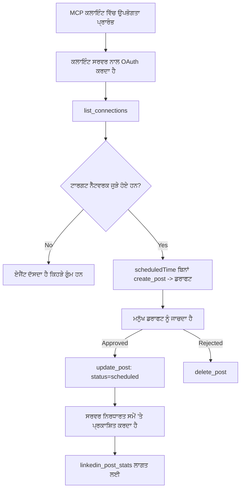

# ਕੇਸ ਅਧਿਐਨ: ਰਿਮੋਟ MCP ਸਰਵਰ ਵਾਲੇ ਏਜੰਟ ਤੋਂ ਸੋਸ਼ਲ ਨੈੱਟਵਰਕਾਂ ‘ਤੇ ਪ੍ਰਕਾਸ਼ਨ

> **ਅਸਵੀਕਾਰ:** ਕਈ ਸੇਵਾਵਾਂ ਅਤੇ ਖੁੱਲ੍ਹੇ ਸਰੋਤ ਪ੍ਰੋਜੈਕਟ ਸੋਸ਼ਲ ਨੈੱਟਵਰਕਾਂ ‘ਤੇ ਪ੍ਰਕਾਸ਼ਨ ਕਰ ਸਕਦੇ ਹਨ, ਅਤੇ ਇੱਕ ਟੀਮ ਹਰ ਨੈੱਟਵਰਕ ਦੇ API ਨੂੰ ਸਿੱਧਾ ਇੰਟਿਗ੍ਰੇਟ ਵੀ ਕਰ ਸਕਦੀ ਹੈ। ਹੇਠਾਂ ਉੱਲੇਖਿਤ ਸਥਿਤੀ ਇੱਕ ਕੰਮ ਕੀਤਾ ਉਦਾਹਰਣ ਹੈ ਕਿ ਕਿਸ ਤਰ੍ਹਾਂ ਇੱਕ **ਲਿਖਣ-ਯੋਗ ਰਿਮੋਟ MCP ਸਰਵਰ** ਨੂੰ ਡਿਜ਼ાઇન ਅਤੇ ਵਰਤਿਆ ਜਾ ਸਕਦਾ ਹੈ। Publora ਇੱਕ ਵਪਾਰਕ ਸੇਵਾ ਹੈ ਜਿਸਦਾ ਮੁਫ਼ਤ ਟੀਅਰ ਵੀ ਹੈ; ਇੱਥੇ ਦਿੱਤੇ ਗਏ ਪੈਟਰਨ ਕਿਸੇ ਵੀ MCP ਸਰਵਰ ‘ਤੇ ਲਾਗੂ ਹੁੰਦੇ ਹਨ ਜੋ ਉਪਯੋਗਕਰਤਾ ਦੀ ਤਰਫੋਂ ਅਪਰਿਵਰਤਨੀਏ ਕਾਰਵਾਈ ਕਰਦਾ ਹੈ।

## ਜਾਇਜ਼ਾ

ਏਜੰਟ ਸਮੱਗਰੀ ਦਾ ਡਰਾਫਟ ਬਣਾਉਣ ਵਿੱਚ ਚੰਗੇ ਹੁੰਦੇ ਹਨ ਪਰ ਇਸ ਨੂੰ ਪਹੁੰਚਾਉਣ ਵਿੱਚ ਕਮਜ਼ੋਰ। ਇੱਕ ਮਾਡਲ ਸੈਕਿੰਡਾਂ ਵਿੱਚ ਰਿਲੀਜ਼ ਐਲਾਨ ਲਿਖ ਸਕਦਾ ਹੈ, ਫਿਰ ਕੰਮ ਰੁਕ ਜਾਂਦਾ ਹੈ: ਪ੍ਰਕਾਸ਼ਨ ਕਰਨ ਲਈ ਹਰ ਨੈੱਟਵਰਕ ਲਈ API, ਹਰ ਨੈੱਟਵਰਕ ਲਈ OAuth ਐਪ ਅਤੇ ਹਰ ਇੱਕ ਲਈ ਵੱਖ-ਵੱਖ ਮੀਡੀਆ ਨਿਯਮ ਲਾਜ਼ਮੀ ਹੁੰਦੇ ਹਨ। ਜ਼ਿਆਦातर ਟੀਮਾਂ ਇਸ ਮਸਲੇ ਨੂੰ ਹੱਥੋਂ ਟੈਕਸਟ ਬ੍ਰਾਊਜ਼ਰ ਵਿੱਚ ਕਾਪੀ ਕਰਕੇ ਹੱਲ ਕਰਦੀਆਂ ਹਨ।

ਇਹ ਕੇਸ ਅਧਿਐਨ ਵੇਖਦਾ ਹੈ ਕਿ ਓਹ ਆਖਰੀ ਕਦਮ ਕਿਸ ਤਰ੍ਹਾਂ ਇੱਕ ਇਕੱਲਾ ਰਿਮੋਟ MCP ਸਰਵਰ ਨਾਲ ਮੁਕੰਮਲ ਹੁੰਦਾ ਹੈ, ਅਤੇ — ਜਿਨ੍ਹਾਂ ਲਈ ਇਹ ਬਨਾਉਣ ਵਾਲੇ ਹਨ — ਉਹ ਡਿਜ਼ਾਈਨ ਫੈਸਲੇ ਜੋ ਇੱਕ **ਲਿਖਣ-ਯੋਗ** ਸਰਵਰ ਨੂੰ ਠੀਕ ਕਰਨੇ ਪੈੰਦੇ ਹਨ। ਡੇਟਾ ਪੜ੍ਹਨਾ ਸਮਝਦਾਰ ਹੁੰਦਾ ਹੈ। ਪ੍ਰਕਾਸ਼ਨ ਨਹੀਂ: ਗਲਤ ਟੂਲ ਕਾਲ ਦਰਸ਼ਕਾਂ ਲਈ ਦਿੱਖਾਈ ਦਿੰਦੀ ਹੈ ਅਤੇ ਇਸਨੂੰ ਵਾਪਸ ਨਹੀਂ ਕੀਤਾ ਜਾ ਸਕਦਾ।

## ਸਥਿਤੀ

ਇੱਕ ਛੋਟੀ ਡਿਵੈਲਪਰ-ਸਬੰਧੀ ਟੀਮ ਏਜੰਟ (Claude, VS Code, Cursor — ਕਲਾਇੰਟ ਵੱਡੀ ਗੱਲ ਨਹੀਂ) ਵਿੱਚ ਪੋਸਟਾਂ ਦਾ ਡਰਾਫਟ ਬਣਾਉਂਦੀ ਹੈ। ਉਹ ਚਾਹੁੰਦੇ ਹਨ ਕਿ ਏਜੰਟ:

- ਵੇਖੇ ਕਿ ਟੀਮ ਨੇ ਕਿਹੜੇ ਸੋਸ਼ਲ ਖਾਤੇ ਜੁੜੇ ਹਨ,
- ਇੱਕ ਪੋਸਟ ਦਾ ਖਾਕਾ ਬਣਾਏ ਅਤੇ ਮਨੁੱਖੀ ਮਨਜ਼ੂਰੀ ਲਈ ਇਸ ਨੂੰ ਡਰਾਫਟ ਵਜੋਂ ਰੱਖੇ,
- ਇੱਕ ਚਿੱਤਰ ਜੁੜੇ,
- ਇਸ ਨੂੰ ਚੁਣੇ ਹੋਏ ਸਮੇਂ ‘ਤੇ ਕਈ ਨੈੱਟਵਰਕਾਂ ‘ਤੇ ਸ਼ੈਡਿਊਲ ਕਰੇ,
- ਅਤੇ ਫਿਰ ਇਸਦੀ ਪ੍ਰਦਰਸ਼ਨ ਰਿਪੋਰਟ ਦੇਵੇ।

ਸਭ ਤੋਂ ਜਰੂਰੀ ਗੱਲ, ਉਹ ਚਾਹੁੰਦੇ ਹਨ ਕਿ ਏਜੰਟ ਅਜਿਹੇ ਦੌਰਾਨ ਗਲਤੀ ਨਾਲ ਪ੍ਰਕਾਸ਼ਨ ਨਾ ਕਰ ਸਕੇ ਜਦੋਂ ਉਹ ਹਜੇ ਤੱਕ ਪ੍ਰਯੋਗ ਕਰ ਰਹੇ ਹੁੰ।

## ਵਰਤੇ ਗਏ ਟੂਲ

- [Publora MCP Server](https://github.com/publora/mcp-server) — ਇੱਕ ਰਿਮੋਟ MCP ਸਰਵਰ (`streamable-http`) ਜੋ ਪ੍ਰਕਾਸ਼ਨ, ਸ਼ੈਡਿਊਲਿੰਗ, ਮੀਡੀਆ ਅਤੇ LinkedIn ਵਿਸ਼ਲੇਸ਼ਣ ਟੂਲ ਪ੍ਰਦਾਨ ਕਰਦਾ ਹੈ। ਸਿਰਕਾਰੀ MCP ਰਜਿਸਟਰੀ ਵਿੱਚ `com.publora/mcp-server` ਰੂਪ ਵਿੱਚ ਦਰਜ।

## ਕਦਮ ਦਰ ਕਦਮ ਕਾਰਜਪ੍ਰਣਾਲੀ

1. **ਸਰਵਰ ਨਾਲ ਜੁੜੋ।** ਉਹ ਕਲਾਇੰਟ ਜੋ OAuth ਬੋਲਦੇ ਹਨ, ਸਰਵਰ ਦੀ ਆਪਣੀ ਸਹਿਮਤੀ ਸਕ्रीन ‘ਤੇ PKCE ਨਾਲ ਪ੍ਰਮਾਣੀਕਰਨ-ਕੋਡ ਪ੍ਰਕਿਰਿਆ ਪੂਰੀ ਕਰਦੇ ਹਨ; ਜਿਹੜੇ ਨਹੀਂ ਕਰਦੇ ਜਿਵੇਂ ਕਿ ਹੈਡਲੈਸ CLI, ਉਹ ਸਿਰਲੇਖ ਵਿੱਚ Publora API ਕੁੰਜੀ ਵਰਤਦੇ ਹਨ। ਦੋਨਾਂ ਰਾਹਾਂ ਲਈ ਸਮਰਥਨ ਹੈ, ਅਤੇ ਤੁਹਾਨੂੰ ਜੋ ਮਿਲਦਾ ਹੈ ਉਹ ਕਲਾਇੰਟ ‘ਤੇ ਨਿਰਭਰ ਕਰਦਾ ਹੈ, ਸਰਵਰ ‘ਤੇ ਨਹੀਂ।
2. **ਕਨੈਕਸ਼ਨਾਂ ਦੀ ਸੂਚੀ ਬਣਾਓ।** ਏਜੰਟ `list_connections` ਕਾਲ ਕਰਦਾ ਹੈ ਅਤੇ ਜੋੜੇ ਖਾਤੇ ਆਪਣੇ ਆਈਡੈਂਟਿਫਾਇਰ ਨਾਲ ਪ੍ਰਾਪਤ ਕਰਦਾ ਹੈ।
3. **ਡਰਾਫਟ ਬਣਾਓ।** ਏਜੰਟ `create_post` ਕਾਲ ਕਰਦਾ ਹੈ ਬਿਨਾਂ ਕਿਸੇ ਸ਼ੈਡਿਊਲ ਸਮੇਂ ਦੇ। ਪੋਸਟ ਡਰਾਫਟ ਵਜੋਂ ਸਟੋਰ ਹੁੰਦੀ ਹੈ — ਕੁਝ ਪ੍ਰਕਾਸ਼ਿਤ ਨਹੀਂ ਹੁੰਦਾ।
4. **ਮੀਡੀਆ ਜੋੜੋ।** ਸਰਵਜਨਕ ਚਿੱਤਰ URLs ਇਕੋ ਕਾਲ ਵਿੱਚ ਦਿੱਤੇ ਜਾਂਦੇ ਹਨ; ਸਰਵਰ ਉਹਨਾਂ ਨੂੰ ਡਾਊਨਲੋਡ ਕਰਕੇ ਜਾਂਚਦਾ ਹੈ।
5. **ਸ਼ੈਡਿਊਲ ਕਰੋ।** ਮਨੁੱਖੀ ਮਨਜ਼ੂਰੀ ਤੋਂ ਬਾਅਦ, `update_post` ISO 8601 ਸਮੇਂ ਨਾਲ ਸਥਿਤੀ ਸ਼ੈਡਿਊਲ ਕਰਦਾ ਹੈ।
6. **ਮਾਪੋ।** LinkedIn ਲਈ, `linkedin_post_stats` ਇਕ ਵਾਰ ਪੋਸਟ ਲਾਈਵ ਹੋਣ ‘ਤੇ ਸਹਿਭਾਗੀਤਾ ਵਾਪਸ ਕਰਦਾ ਹੈ।

## ਉਦਾਹਰਣ ਪ੍ਰੰਪਟ

```text
Which social accounts do I have connected?
Draft a post announcing our new changelog page, attach the screenshot at
https://example.com/changelog.png, and keep it as a draft — do not publish it.
Once I approve, schedule it to LinkedIn and Bluesky for tomorrow at 09:00 UTC.
```

## Mermaid ਫਲੋਚਾਰਟ



## ਤਕਨੀਕੀ ਅਮਲ

ਹੇਠਾਂ ਦਿੱਤੇ ਪਾਠ ਇਸ ਕੇਸ ਅਧਿਐਨ ਦਾ ਟ੍ਰਾਂਸਫ੍ਰੇਬਲ ਹਿੱਸਾ ਹਨ।

### ਖੁੱਲ੍ਹੀ ਖੋਜ, ਪ੍ਰਮਾਣੀਕ੍ਰਿਤ ਅਮਲ

`tools/list` ਬਿਨਾਂ ਪ੍ਰਮਾਣ-ਪੱਤਰਾਂ ਦੇ ਸੇਵਾ ਦਿੱਤੀ ਜਾਂਦੀ ਹੈ; ਹਰ `tools/call` ਲਈ ਟੋਕਨ ਲਾਜ਼ਮੀ ਹੈ
ਅਤੇ ਨਹੀਂ ਤਾਂ `401` ਵਾਪਸ ਕਰਦਾ ਹੈ ਜਿਸ ਨਾਲ `WWW-Authenticate` ਸਿਰਲੇਖ ਹੁੰਦਾ ਹੈ ਜੋ

ਸੁਰੱਖਿਅਤ-ਸੰਸਾਧਨ ਮੈਟਾਡੇਟਾ। ਸਰਵਰ ਦਾ ਲੇਗਸੀ ਐਂਡਪੌਇੰਟ ਵੀ ਪ੍ਰੋਟੋਕਾਲ ਵਰਜ਼ਨਾਂ ਤੋਂ ਪਹਿਲਾਂ ਕਲਾਇੰਟਾਂ ਲਈ ਅਨਾਂਕ੍ਰਿਪਟ `initialize` ਨੂੰ ਜਵਾਬ ਦਿੰਦਾ ਹੈ
`2026-07-28`; ਮੌਜੂਦਾ ਕਲਾਇੰਟ ਉਨ੍ਹਾਂ ਹੈਂਡਸ਼ੇਕ ਦੀ ਵਰਤੋਂ ਨਹੀਂ ਕਰਦੇ।


ਇਹ ਸਰਵਰ-ਵਿਸ਼ੇਸ਼ ਵੰਡ ਆਨੰਦਾਰਾਂ, ਕੈਟਾਲਾਗਾਂ ਅਤੇ ਕਲਾਇੰਟਾਂ ਨੂੰ ਟੂਲ ਨਾਮਾਂ, ਸਕੀਮਾਂ ਅਤੇ ਟਿੱਪਣੀਆਂ ਨੂੰ ਬਿਨਾਂ ਕਿਸੇ ਸਿੱਕਟ ਦੇ ਜਾਂਚਣ ਦੀ ਆਗਿਆ ਦਿੰਦਾ ਹੈ ਜਦਕਿ ਅਜਾਣੇ ਕਾਰਜ ਨੂੰ ਰੋਕਦਾ ਹੈ।
ਓਪਨ ਡਿਸਕਵਰੀ ਇੱਕ ਡਿਪਲੌਇਮੈਂਟ ਚੋਣ ਹੈ, MCP ਦੀ ਲੋੜ ਨਹੀਂ; ਇੱਕ ਸੁਰੱਖਿਅਤ ਡਿਪਲੌਇਮੈਂਟ ਵੀ `tools/list` ਲਈ ਅਧਿਕਾਰ ਦੀ ਮੰਗ ਕਰ ਸਕਦਾ ਹੈ।


ਹਰ ਕਲਾਇੰਟ ਨੂੰ ਵਿਕਰੇਤਾ ਵੱਲੋਂ ਪਹਿਲਾਂ ਜਾਰੀ ਕੀਤਾ ਹੋਇਆ `client_id` ਚਾਹੀਦਾ ਸੀ।


### ਪਛਾਣਕਰਤਾਂ ਨੂੰ ਅਣ-ਬਣਾਈ ਜਾ ਸਕਣ ਵਾਲੀ ਨਾ ਬਣਾਓ

ਪਲੇਟਫਾਰਮ ਪਛਾਣਕਰਤਾਂ ਅੰਧੇਰੇ ਸਤਰਾਂ ਹਨ ਜੋ `list_connections` ਵੱਲੋਂ ਵਾਪਸ ਦਿੱਤੀਆਂ ਜਾਂਦੀਆਂ ਹਨ, ਅਤੇ ਸਕੀਮਾ ਵੇਰਵਾ ਸਾਫ਼ ਕਹਿੰਦਾ ਹੈ ਕਿ ਉਹਨਾਂ ਨੂੰ ਬਿਲਕੁਲ ਵਾੜੀ ਵਜੋਂ ਨਕਲ ਕਰਨਾ ਅਤੇ ਕਦੇ ਵੀ ਅੰਦਾਜ਼ਾ ਨਹੀਂ ਲਗਾਉਣਾ। ਸਰਵਰ ਕਿਸੇ ਹੋਰ ਚੀਜ਼ ਨੂੰ ਵਾਪਸ ਨਹੀਂ ਲੈਂਦਾ।

ਮਾਡਲ ਹੁਸ਼ਿਆਰ ਅੰਦਾਜ਼ਾ ਲਗਾਉਣ ਵਾਲੇ ਹਨ। ਕੋਈ ਵੀ ਲਿਖਣ ਯੋਗ ਸਰਵਰ ਮੰਨ ਕੇ ਚੱਲਣਾ ਚਾਹੀਦਾ ਹੈ ਕਿ ਇੱਕ ਪਛਾਣਕਰਤਾ ਅਖੀਰ ਵਿੱਚ ਗਲਤ ਸਿਰਜਿਆ ਜਾਵੇਗਾ ਅਤੇ ਉਸ ਰਸਤੇ ਨੂੰ ਜ਼ੋਰ ਨਾਲ ਤੇ ਜਲਦੀ ਫੇਲ ਕਰਨਾ ਚਾਹੀਦਾ ਹੈ, ਨਾ ਕਿ ਸਮਝਦਾਰ ਦਿੱਸਣ ਵਾਲੀ ਮੂਲ ਕਦਰ 'ਤੇ ਅਮਲ ਕਰਨਾ।

### ਪ੍ਰਕਾਸ਼ਿਤ ਕਰਨ ਤੋਂ ਪਹਿਲਾਂ ਅਸਫਲ ਹੋਵੋ, ਕਾਰਵਾਈਯੋਗ ਸੁਨੇਹੇ ਨਾਲ

ਕੁਝ ਨੈਟਵਰਕ ਸਿਰਫ ਟੈਕਸਟ ਪੋਸਟਾਂ ਨੂੰ ਮਨਜ਼ੂਰ ਨਹੀਂ ਕਰਦੇ ਅਤੇ ਚਾਹੁੰਦੇ ਹਨ ਕਿ ਕੋਈ ਤਸਵੀਰ ਜਾਂ ਵੀਡੀਓ ਲਾਈ ਜਾਵੇ। ਇਸਨੂੰ ਜਦੋਂ ਪੋਸਟ ਕਾਰਜ ਨਿਯਤ ਕੀਤਾ ਜਾਂਦਾ ਹੈ ਤਦ ਜਾਂਚਿਆ ਜਾਂਦਾ ਹੈ, ਅਤੇ ਗਲਤੀ ਵਿੱਚ ਪਲੇਟਫਾਰਮ ਅਤੇ ਘੱਟ ਰਹੀ ਜਰੂਰਤ ਦਾ ਨਾਮ ਹੁੰਦਾ ਹੈ।

ਇੱਕ ਏਜੰਟ "Instagram ਮੀਡੀਆ ਚਾਹੀਦਾ ਹੈ — ਇਕ ਤਸਵੀਰ ਜਾਂ ਵੀਡੀਓ ਜੁੜੋ" ਤੋਂ ਵਾਪਸੀ ਕਰ ਸਕਦਾ ਹੈ ਬਿਨਾ ਹੋਰ ਯਾਤਰਾ ਕੀਤੇ। ਪਰ ਉਹ ਇੱਕ ਆਮ `400` ਤੋਂ ਉबर ਨਹੀਂ ਸਕਦਾ।

### ਰੀਟ੍ਰਾਈਜ਼ ਨੂੰ ਸੁਰੱਖਿਅਤ ਬਨਾਓ

ਦੋ ਟੂਲ ਜੋ ਸਮੱਗਰੀ ਬਣਾਉਂਦੇ ਹਨ, `create_post` ਅਤੇ `update_post`, ਇੱਕ idempotency ਕੁੰਜੀ ਨੂੰ ਸਵੀਕਾਰ ਕਰਦੇ ਹਨ: ਜਿਸਨੂੰ ਦੁਬਾਰਾ ਵਰਤ ਕੇ ਉਸੇ ਬਿਨੈ ਨਾਲ ਪਹਿਲਾ ਜਵਾਬ ਮੁੜ ਖੇਡਿਆ ਜਾਂਦਾ ਹੈ ਨਾ ਕਿ ਦੂਜਾ ਪੋਸਟ ਬਣਾਈ ਜਾਂਦੀ ਹੈ। ਏਜੰਟ ਰੰਟਾਈਮ ਟਾਇਮਆਉਟ 'ਤੇ ਰੀਟ੍ਰਾਈ ਕਰਦੇ ਹਨ; ਬਿਨਾ idempotency ਦੇ, ਇੱਕ ਹੌਲੀ ਜਵਾਬ ਇੱਕ ਨਕਲ ਪ੍ਰਕਾਸ਼ਨ ਬਣ ਜਾਂਦਾ ਹੈ। ਹੋਰ ਲਿਖਣ ਵਾਲੇ ਟੂਲ — ਮਿਟਾਉਣ, ਮੀਡਿਆ ਕਦਮ, LinkedIn ਪ੍ਰਤੀਕਿਰਿਆਵਾਂ ਅਤੇ ਟਿੱਪਣੀਆਂ — ਇਹ ਨਹੀਂ ਲੈਂਦੇ, ਇਸ ਲਈ ਉੱਥੇ ਰੀਟ੍ਰਾਈ ਆਪਣੇ ਆਪ ਸੁਰੱਖਿਅਤ ਨਹੀਂ ਹੁੰਦਾ। ਤੁਹਾਡੇ ਆਪਣੇ ਮਿਊਟੇਸ਼ਨਾਂ ਵਿੱਚੋਂ ਕਿਹੜੇ ਸੁਰੱਖਿਅਤ ਹਨ ਅਤੇ ਕਿਹੜੇ ਨਹੀਂ ਇਹ ਜਾਣਣਾ ਲਾਜ਼ਮੀ ਹੈ।


### ਕੁਝ ਵੀ ਪ੍ਰਕਾਸ਼ਿਤ ਨਾ ਕਰਨ ਦੀ ਜਾਂਚ ਕਰਨ ਲਈ ਇੱਕ ਤਰੀਕਾ ਪ੍ਰਦਾਨ ਕਰੋ


ਸਰਵਰ ਇੱਕ_reserved ਟਾਰਗੇਟ, `publora-playground`, ਨੂੰ ਕਬੂਲ ਕਰਦਾ ਹੈ, ਜਿਸ ਦੀ ਜाँच ਕੀਤੀ ਜਾਂਦੀ ਹੈ ਅਤੇ ਇਹ ਇਕ ਅਸਲੀ ਮੰਜ਼ਿਲ ਵਾਂਗ ਸਵੀਕਾਰ ਕੀਤਾ ਜਾਂਦਾ ਹੈ ਅਤੇ ਫਿਰ ਖਾਰਜ ਕਰ ਦਿੱਤਾ ਜਾਂਦਾ ਹੈ — ਕੁਝ ਵੀ ਜੀਵੰਤ ਖਾਤੇ ਤਕ ਨਹੀਂ ਪਹੁੰਚਦਾ। ਇਹ ਸੰਦ ਸਿੱਧਾਂਤ ਖੁਦ ਵਿੱਚ ਵੇਰਵਾ ਦਿੱਤਾ ਗਿਆ ਹੈ, ਜਿਸ ਨੂੰ ਕੋਈ ਵੀ ਗਾਹਕ ਬਿਨਾ ਪ੍ਰਮਾਣ ਪੱਤਰਾਂ ਦੇ ਪੜ੍ਹ ਸਕਦਾ ਹੈ: `create_post` ਦੇ `platforms` ਖੇਤਰ ਵਿੱਚ ਇਸਨੂੰ "ਇੱਕ ਕੁਨੈਕਸ਼ਨ-ਟੈਸਟ ਟਾਰਗੇਟ ਜੋ ਕਿਸੇ ਅਸਲੀ ਕੁਨੈਕਸ਼ਨ ਦੀ ਲੋੜ ਨਹੀਂ ਰੱਖਦਾ — ਪੋਸਟ ਸਵੀਕਰਿਆ ਜਾਂਦਾ ਹੈ ਅਤੇ ਖਾਰਜ ਕਰ ਦਿੱਤਾ ਜਾਂਦਾ ਹੈ, ਕੁਝ ਵੀ ਪ੍ਰਕਾਸ਼ਿਤ ਨਹੀਂ ਕੀਤਾ ਜਾਂਦਾ" ਵਜੋਂ ਦਰਸਾਇਆ ਗਿਆ ਹੈ। ਇਸ ਨੂੰ ਸਿਰਫ਼ ਇੱਕ ਐਂਟਰੀ ਵਜੋਂ ਪਾਸ ਕਰਕੇ ਬੁਲਾਇਆ ਜਾ ਸਕਦਾ ਹੈ: `platforms: ["publora-playground"]`।

ਇਹ ਸਾਰੇ ਸਤਹ ਵਿਚੋਂ ਸਭ ਤੋਂ ਲਾਭਦਾਇਕ ਵੇਰਵਿਆਂ ਵਿੱਚੋਂ ਇੱਕ ਸਾਬਤ ਹੋਇਆ। ਕੰਨੈਕਟਰ ਡਾਇਰੈਕਟਰੀਆਂ ਦੇ ਸਮੀਖਿਆਕਾਰ, ਯੋਗਦਾਨਦਾਤਾ ਅਤੇ CI ਬਿਨਾ ਕਿਸੇ ਜ਼ਿੰਮੇਵਾਰੀ ਵਾਲੇ ਦਰਸ਼ਕਾਂ ਦੇ ਪੂਰੇ ਲਿਖਣ ਵਾਲੇ ਰਸਤੇ ਦਾ ਅੰਤੀਮ ਤੋਂ ਅੰਤ ਤੱਕ ਅਭਿਆਸ ਕਰ ਸਕਦੇ ਹਨ। ਕੋਈ ਵੀ MCP ਸਰਵਰ ਜਿਸ ਵਿੱਚ ਅਪਰਿਵਰਤਨੀਯ ਕਾਰਵਾਈਆਂ ਹੋਣ, ਉਸਨੂੰ ਇੱਕ ਦਸਤਾਵੇਜ਼ਬੱਧ ਨੋ-ਓਪ ਟਾਰਗੇਟ ਨਾਲ ਲਾਭ ਹੁੰਦਾ ਹੈ।

## ਨਤੀਜੇ ਅਤੇ ਪ੍ਰਭਾਵ

- ਪ੍ਰਕਾਸ਼ਨ ਕਦਮ ਬਰਾਊਜ਼ਰ ਤੋਂ ਰੂਪ ਵਿੱਚ ਉਸੇ ਗੱਲਬਾਤ ਵੱਲ ਆ ਗਿਆ ਜਿੱਥੇ ਸਮੱਗਰੀ ਲਿਖੀ ਜਾਂਦੀ ਹੈ, ਅਤੇ ਇਕ ਡਰਾਫਟ-ਪਹਿਲਾਂ ਦੀ ਆਦਤ ਇੱਕ ਮਨੁੱਖ ਨੂੰ ਲੂਪ ਵਿੱਚ ਰੱਖਦੀ ਹੈ। ਇਸ ਬਾਰੇ ਸਪਸ਼ਟ ਹੋਵੋ ਕਿ ਇਹ ਕੀ ਹੈ: ਇੱਕ ਡਰਾਫਟ ਇੱਕ ਰਵਾਇਤ ਹੈ, ਹੱਦ ਨਹੀਂ। ਇੱਕੋ ਪ੍ਰਮਾਣ ਪੱਤਰ ਸਮੇਂਤਾਲਿਕ (schedule) ਜਾਂ ਪ੍ਰਕਾਸ਼ਿਤ (publish) ਕਰ ਸਕਦਾ ਹੈ, ਇਸਲਈ ਜੋ ਵੀ ਕਈ ਸੱਚੇ ਮਨਜ਼ੂਰੀ darwaje ਚਾਹੁੰਦਾ ਹੈ, ਉਸਨੂੰ ਸੰਦ ਸਤਹ ਤੋਂ ਬਾਹਰ – ਅਲੱਗ ਅਲੱਗ ਪ੍ਰਮਾਣ ਪੱਤਰਾਂ ਜਾਂ ਸਰਵਰ ਤੋਂ ਪਹਿਲਾਂ ਨੀਤੀ ਪਰਤ ਦਵਾਰਾ ਲਾਗੂ ਕਰਨਾ ਪੈਂਦਾ ਹੈ।
- ਪਰ-ਨੈੱਟਵਰਕ ਫਰਕ — ਮੀਡੀਆ ਦੀਆਂ ਲੋੜਾਂ, ਧਾਗਾ-ਬੰਨ੍ਹਣ, ਜਵਾਬ ਵੱਡਾ-ਚੋਪੇ — ਇਹ ਸਰਵਰ ਵਿੱਚ ਇੱਕ ਵਾਰੀ ਸੰਭਾਲੇ ਜਾਂਦੇ ਹਨ ਨਾ ਕਿ ਹਰ ਇੱਕ ਏਜੰਟ ਵਿੱਚ ਜੋ ਉਸ ਨਾਲ ਗੱਲ ਕਰਦਾ ਹੈ।
- ਇੱਕੋ ਸਰਵਰ ਕਈ MCP ਗਾਹਕਾਂ ਨੂੰ ਬਿਨਾ ਪ੍ਰੀ-ਜਾਰੀ ਕੀਤੇ ਪ੍ਰਮਾਣ ਪੱਤਰਾਂ ਦੇ ਸਹਾਰਾ ਦਿੰਦਾ ਹੈ।
    ਮੌਜੂਦਾ ਗਾਹਕ Client ID Metadata Documents ਵਾਪਰ ਸਕਦੇ ਹਨ; DCR ਪੁਰਾਣੇ ਗਾਹਕਾਂ ਲਈ ਇਕ ਬੈਕਅੱਪ ਹੈ
   ।
- ਉੱਪਰ ਦਿੱਤੇ ਡਿਜ਼ਾਈਨ ਬੰਧਨਾਂ ਨੂੰ ਯੂਜ਼ਰਾਂ ਦੇ ਨਾਲ-ਨਾਲ ਕੰਨੈਕਟਰ-ਡਾਇਰੈਕਟਰੀ ਸਮੀਖਿਆਵਾਂ ਵੱਲੋਂ ਸ਼ਕਲ ਦਿੱਤੀ ਗਈ ਸੀ: ਟੀਪਣੀਆਂ, OAuth ਅਤੇ ਇਕ ਸੁਰੱਖਿਅਤ ਟੈਸਟ ਟਾਰਗੇਟ ਹਰ ਇੱਕ ਵੱਲੋਂ ਘੱਟੋ-ਘੱਟ ਇੱਕ ਵਾਰੀ ਲੋੜ ਸੀ।

## ਸੰਦਰਭ

- [Publora MCP ਸਰਵਰ (ਸਰੋਤ)](https://github.com/publora/mcp-server)
- [Publora API ਅਤੇ MCP ਦਸਤਾਵੇਜ਼ੀਕਰਨ](https://docs.publora.com)
- [MCP ਰਜਿਸਟਰੀ ਐਂਟਰੀ: `com.publora/mcp-server`](https://registry.modelcontextprotocol.io/v0/servers?search=com.publora/mcp-server)
- [MCP ਵਿਸ਼ੇਸ਼ਤਾ — ਅਧਿਕਾਰਤਾ](https://modelcontextprotocol.io/specification/2026-07-28/basic/authorization)
- [MCP ਵਿਸ਼ੇਸ਼ਤਾ — ਸੰਦ ਟੀਪਣੀਆਂ](https://modelcontextprotocol.io/docs/concepts/tools)

## ਅਗਲਾ ਕੀ ਹੈ

- ਜਿਹੜਾ MCP ਸਰਵਰ ਤੁਸੀਂ ਬਣਾ ਰਹੇ ਹੋ ਉਸ ਵਿੱਚੋਂ ਤਿੰਨ ਸਭ ਤੋਂ ਸਸਤੇ ਫੈਦੇ ਦੇਖੋ: ਹਰ ਸੰਦ 'ਤੇ ਟੀਪਣੀਆਂ, ਹਰ ਲਿਖਤ 'ਤੇ ਇੱਕ idempotency ਚੀਵ, ਅਤੇ ਦਸਤਾਵੇਜ਼ਬੱਧ ਨੋ-ਓਪ ਟਾਰਗੇਟ।
- ਖੁੱਲ੍ਹਾ-ਖੋਜ ਵੰਡ ਨੂੰ ਕੋਸ਼ਿਸ਼ ਕਰੋ: ਕਿਸੇ ਪਬਲਿਕ ਰਿਮੋਟ ਸਰਵਰ ਨੂੰ ਕਿਸੇ ਪ੍ਰਮਾਣ ਪੱਤਰ ਦੇ ਬਿਨਾ `tools/list` ਕਾਲ ਕਰੋ, ਫਿਰ ਕਿਸੇ ਸੰਦ ਨੂੰ ਕਾਲ ਕਰੋ ਅਤੇ `401` ਚੈਲੇਂਜ ਨੂੰ ਵੇਖੋ।
- ਸੋਚੋ ਕਿ ਤੁਹਾਡੇ ਖੇਤਰ ਵਿੱਚ "ਰੱਦ ਕਰੋ" ਦਾ ਕੀ ਮਤਲਬ ਹੈ। ਪ੍ਰਕਾਸ਼ਨ ਵਿੱਚ ਡਰਾਫਟ ਅਤੇ ਮਿਟਾਉਂਦੇ ਹਨ; ਜੇ ਤੁਹਾਡੇ ਕੰਮਾਂ ਦਾ ਕੋਈ ਤਦਬੀਰ ਨਹੀਂ, ਤਾਂ ਪੁਸ਼ਟੀ ਕਰਨ ਦਾ ਕੰਮ ਸੰਦ ਡਿਜ਼ਾਈਨ ਵਿੱਚ ਹੋਣਾ ਚਾਹੀਦਾ ਹੈ, ਪ੍ਰਾਂਪਟ ਵਿੱਚ ਨਹੀਂ।

---

<!-- CO-OP TRANSLATOR DISCLAIMER START -->
**ਅਸਵੀਕਾਰੋਪਣ**:
ਇਸ ਦਸਤਾਵੇਜ਼ ਦਾ ਅਨੁਵਾਦ ਏਆਈ ਅਨੁਵਾਦ ਸੇਵਾ [Co-op Translator](https://github.com/Azure/co-op-translator) ਦੀ ਵਰਤੋਂ ਕਰਕੇ ਕੀਤਾ ਗਿਆ ਹੈ। ਜਦੋਂ ਕਿ ਅਸੀਂ ਸਹੀਤਾਵਾਂ ਲਈ ਯਤਨਸ਼ੀਲ ਹਾਂ, ਕਿਰਪਾ ਕਰਕੇ ਧਿਆਨ ਰੱਖੋ ਕਿ ਸਵੈਚਾਲਿਤ ਅਨੁਵਾਦਾਂ ਵਿੱਚ ਗਲਤੀਆਂ ਜਾਂ ਅਸਮੱਤਿਆਵਾਂ ਹੋ ਸਕਦੀਆਂ ਹਨ। ਮੂਲ ਦਸਤਾਵੇਜ਼ ਆਪਣੀ ਮੂਲ ਭਾਸ਼ਾ ਵਿੱਚ ਅਧਿਕਾਰਕ ਸਰੋਤ ਮੰਨਿਆ ਜਾਣਾ ਚਾਹੀਦਾ ਹੈ। ਜਰੂਰੀ ਜਾਣਕਾਰੀ ਲਈ, ਪੇਸ਼ੇਵਰ ਮਨੁੱਖੀ ਅਨੁਵਾਦ ਦੀ ਸਿਫ਼ਾਰਸ਼ ਕੀਤੀ ਜਾਂਦੀ ਹੈ। ਅਸੀਂ ਇਸ ਅਨੁਵਾਦ ਦੇ ਉਪਯੋਗ ਤੋਂ ਪੈਦਾ ਹੋਣ ਵਾਲੀਆਂ ਕਿਸੇ ਵੀ ਗਲਤਫਹਿਮੀਆਂ ਜਾਂ ਗਲਤ ਵਿਆਖਿਆਵਾਂ ਲਈ ਜਵਾਬਦੇਹ ਨਹੀਂ ਹਾਂ।
<!-- CO-OP TRANSLATOR DISCLAIMER END -->