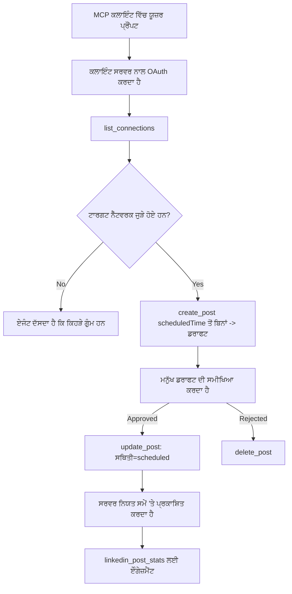

# ਕੇਸ ਅਧਿਐਨ: ਇੱਕ ਏਜੰਟ ਤੋਂ ਸੋਸ਼ਲ ਨੈੱਟਵਰਕਾਂ ‘ਤੇ ਪ੍ਰਕਾਸ਼ਨ ਕਰਨਾ ਇੱਕ ਦੂਰਦਰਾਜ਼ MCP ਸਰਵਰ ਨਾਲ

> **ਅਸਵੀਕਾਰੋक्ति:** ਕਈ ਸੇਵਾਵਾਂ ਅਤੇ ਖੁੱਲ੍ਹੇ ਸਰੋਤ ਪ੍ਰਾਜੈਕਟ ਸੋਸ਼ਲ ਨੈੱਟਵਰਕਾਂ ‘ਤੇ ਪ੍ਰਕਾਸ਼ਨ ਕਰ ਸਕਦੇ ਹਨ, ਅਤੇ ਇੱਕ ਟੀਮ ਹਰ ਨੈੱਟਵਰਕ ਦੀ API ਨੂੰ ਸਿੱਧਾ ਜੋੜ ਵੀ ਸਕਦੀ ਹੈ। ਹੇਠਾਂ ਦਿੱਤਾ ਗਿਆ ਦ੍ਰਿਸ਼ ਇੱਕ ਕੰਮ ਕੀਤਾ ਉਦਾਹਰਨ ਵਜੋਂ ਦਿੱਤਾ ਗਿਆ ਹੈ ਕਿ ਕਿਵੇਂ ਇੱਕ **ਲਿਖਣ ਯੋਗ ਦੂਰਦਰਾਜ਼ MCP ਸਰਵਰ** ਡਿਜ਼ਾਈਨ ਅਤੇ ਵਰਤਿਆ ਜਾ ਸਕਦਾ ਹੈ। Publora ਇੱਕ ਵਪਾਰਕ ਸੇਵਾ ਹੈ ਜਿਸ ਵਿੱਚ ਮੁਫ਼ਤ ਪੱਧਰ ਹੈ; ਇੱਥੇ ਵਰਣਿਤ ਪੈਟਰਨ ਕਿਸੇ ਵੀ MCP ਸਰਵਰ ‘ਤੇ ਲਾਗੂ ਹੁੰਦੇ ਹਨ ਜੋ ਕਿਸੇ ਯੂਜ਼ਰ ਦੀ ਓਰ ਤੋਂ ਅਪਰਿਵਰਤਨ ਯੋਗ ਕਾਰਵਾਈ ਕਰਦਾ ਹੈ।

## ਸਾਰ

ਏਜੰਟਾਂ ਸਮੱਗਰੀ ਦ੍ਰਾਫਟ ਕਰਨ ਵਿੱਚ ਚੰਗੇ ਹਨ ਅਤੇ ਇਸ ਨੂੰ ਪਹੁੰਚਾਉਣ ਵਿੱਚ ਕਮਜ਼ੋਰ। ਇੱਕ ਮਾਡਲ ਸਕਿੰਟਾਂ ਵਿੱਚ ਰਿਲੀਜ਼ ਦਾ ਐਲਾਨ ਲਿਖ ਸਕਦਾ ਹੈ, ਪਰ ਫਿਰ ਕੰਮ ਰੁਕ ਜਾਂਦਾ ਹੈ: ਪ੍ਰਕਾਸ਼ਨ ਕਰਨ ਲਈ ਹਰ ਨੈੱਟਵਰਕ ਲਈ API, ਹਰ ਨੈੱਟਵਰਕ ਲਈ OAuth ਐਪ, ਅਤੇ ਹਰ ਇੱਕ ਲਈ ਮੀਡੀਆ ਨਿਯਮਾਂ ਦਾ ਵੱਖਰਾ ਸੈੱਟ ਲਗਦਾ ਹੈ। ਜ਼ਿਆਦਾਤਰ ਟੀਮਾਂ ਇਸ ਨੂੰ ਹੱਥ ਨਾਲ ਬਰਾਊਜ਼ਰ ਵਿੱਚ ਟੈਕਸਟ ਕਾਪੀ ਕਰਕੇ ਸਮਾਧਾਨ ਕਰਦੀਆਂ ਹਨ।

ਇਹ ਕੇਸ ਅਧਿਐਨ ਵੇਖਦਾ ਹੈ ਕਿ ਇਹ ਆਖਰੀ ਕਦਮ ਇੱਕ ਹੀ ਦੂਰਦਰਾਜ਼ MCP ਸਰਵਰ ਨਾਲ ਕਿਵੇਂ ਬੰਦ ਕੀਤਾ ਜਾਂਦਾ ਹੈ, ਅਤੇ — ਜੋ ਕੋਈ ਵੀ ਇਕ ਸਰਵਰ ਬਣਾ ਰਿਹਾ ਹੈ ਉਸ ਲਈ ਵਧੇਰੇ ਲਾਭਦਾਇਕ — ਇੱਕ **ਲਿਖਣ ਯੋਗ** ਸਰਵਰ ਨੂੰ ਸਹੀ ਤਰੀਕੇ ਨਾਲ ਕਿਹੜੇ ਡਿਜ਼ਾਈਨ ਫੈਸਲੇ ਕਰਨੇ ਚਾਹੀਦੇ ਹਨ। ਡਾਟਾ ਪੜ੍ਹਨਾ ਸਹਿਣਸ਼ੀਲ ਹੁੰਦਾ ਹੈ। ਪ੍ਰਕਾਸ਼ਨ ਨਹੀਂ: ਗਲਤ ਟੂਲ ਕਾਲ ਦਰਸ਼ਕਾਂ ਨੇ ਵੇਖੀ ਜਾਂਦੀ ਹੈ ਅਤੇ ਪਿੱਛੇ ਨਹੀਂ ਹਟਾਈ ਜਾ ਸਕਦੀ।

## ਦਰਸ਼

ਇੱਕ ਛੋਟੀ ਡਿਵੈਲਪਰ-ਰਿਸ਼ਤੇਦਾਰ ਟੀਮ ਏਜੰਟ ਦੇ ਅੰਦਰ ਪੋਸਟਾਂ ਦ੍ਰਾਫਟ ਕਰਦੀ ਹੈ (Claude, VS Code, Cursor — ਕਲਾਇਂਟ ਦੀ ਕੋਈ ਪਰਵਾਹ ਨਹੀਂ). ਉਹ ਚਾਹੁੰਦੇ ਹਨ ਕਿ ਏਜੰਟ:

- ਦੇਖੇ ਕਿ ਟੀਮ ਨੇ ਕਿਹੜੇ ਸੋਸ਼ਲ ਖਾਤੇ ਜੋੜੇ ਹਨ,
- ਇੱਕ ਪੋਸਟ ਦਾ ਮਸੌਦਾ ਤਿਆਰ ਕਰੇ ਅਤੇ ਮਨੁੱਖੀ ਮੰਜੂਰੀ ਲਈ ਮਸੌਦੇ ਵਜੋਂ ਰੱਖੇ,
- ਇੱਕ ਚਿੱਤਰ ਜੁੜੇ,
- ਚੁਣੇ ਹੋਏ ਸਮੇਂ ‘ਤੇ ਕਈ ਨੈੱਟਵਰਕਾਂ ‘ਤੇ ਨਿਯਤ ਕਰੇ,
- ਅਤੇ ਬਾਅਦ ਵਿੱਚ ਇਸਦੇ ਪ੍ਰਦਰਸ਼ਨ ਬਾਰੇ ਰਿਪੋਰਟ ਕਰੇ.

ਅਹੰਕਾਰਪੂਰਵਕ, ਉਹ ਚਾਹੁੰਦੇ ਹਨ ਕਿ ਏਜੰਟ *ਅਕਸੂਜੇ ਵਿੱਚ* ਪ੍ਰਕਾਸ਼ਨ ਨਾ ਕਰ ਸਕੇ ਜਦੋਂ ਉਹ ਅਜੇ ਵੀ ਪਰਖ ਰਹੇ ਹੋਣ।

## ਵਰਤੇ ਟੂਲ

- [Publora MCP Server](https://github.com/publora/mcp-server) — ਇੱਕ ਦੂਰਦਰਾਜ਼ MCP ਸਰਵਰ (`streamable-http`) ਜੋ ਪ੍ਰਕਾਸ਼ਨ, ਨਿਯਤਕਰਨ, ਮੀਡੀਆ ਅਤੇ LinkedIn ਵਿਸ਼ਲੇਸ਼ਣ ਟੂਲ ਉਪਲਬਧ ਕਰਾਉਂਦਾ ਹੈ। ਅਧਿਕਾਰਕ MCP ਰਜਿਸਟਰੀ ਵਿੱਚ `com.publora/mcp-server` ਵਜੋਂ ਦਰਜ।

## ਕਦਮ-ਦਰ-ਕਦਮ ਕਾਰਜਪ੍ਰਵਾਹ

1. **ਸਰਵਰ ਨੂੰ ਜੁੜੋ।** OAuth ਵਲੋਂ ਗੱਲ ਕਰਦੇ ਕਲਾਇੰਟ ਸਰਵਰ ਦੇ ਆਪਣੇ ਸਹਮਤੀ ਸਕ੍ਰੀਨ ਦੇ ਖਿਲਾਫ PKCE ਨਾਲ ਪ੍ਰਮਾਣਿਕਤਾ-ਕੋਡ ਪ੍ਰਕਿਰਿਆ ਨੂੰ ਪੂਰਾ ਕਰਦੇ ਹਨ; ਜਿਹੜੇ ਕਲਾਇੰਟ ਨਹੀਂ ਕਰਦੇ, ਜਿਵੇਂ कि ਹੈਡਲੇਸ CLI, ਉਹਨਾਂ ਲਈ ਸਿਰਲੇਖ ਵਿੱਚ Publora API ਕੁੰਜੀ ਵਰਤੀ ਜਾਂਦੀ ਹੈ। ਦੋਵੇਂ ਰਸਤੇ ਸਮਰਥਿਤ ਹਨ, ਅਤੇ ਕਲਾਇੰਟ ‘ਤੇ ਨਿਰਭਰ ਹੈ ਕਿ ਤੁਸੀਂ ਕਿਹੜਾ ਰਸਤਾ ਪ੍ਰਾਪਤ ਕਰਦੇ ਹੋ, ਨਾ ਕਿ ਸਰਵਰ ‘ਤੇ।
2. **ਜੁੜੇ ਖਾਤੇ ਦਿਖਾਓ।** ਏਜੰਟ `list_connections` ਕਾਲ ਕਰਦਾ ਹੈ ਅਤੇ ਜੁੜੇ ਖਾਤਿਆਂ ਨੂੰ ਉਹਨਾਂ ਦੇ ਪਛਾਣਕਰਤਾ ਨਾਲ ਪ੍ਰਾਪਤ ਕਰਦਾ ਹੈ।
3. **ਪੋਸਟ ਤਿਆਰ ਕਰੋ।** ਏਜੰਟ *ਬਿਨਾਂ* ਕਿਸੇ ਨਿਯਤ ਸਮੇਂ ਦੇ `create_post` ਕਾਲ ਕਰਦਾ ਹੈ। ਪੋਸਟ ਇਕ ਮਸੌਦੇ ਵਜੋਂ ਸੰਭਾਲੀ ਜਾਂਦੀ ਹੈ — ਕੁਝ ਪ੍ਰਕਾਸ਼ਤ ਨਹੀਂ ਹੁੰਦਾ।
4. **ਮੀਡੀਆ ਨੂੰ ਜੋੜੋ।** ਸਰਕਾਰੀ ਚਿੱਤਰ URLs ਨੂੰ ਉਹੀ ਕਾਲ ਵਿੱਚ ਭੇਜਿਆ ਜਾਂਦਾ ਹੈ; ਸਰਵਰ ਇਨ੍ਹਾਂ ਨੂੰ ਡਾਊਨਲੋਡ ਕਰਕੇ ਸਹੀ ਉਨ੍ਹਾਂ ਨੂੰ ਮੰਨਦਾ ਹੈ।
5. **ਨਿਯਤ ਕਰੋ।** ਮਨੁੱਖੀ ਮੰਜੂਰੀ ਤੋਂ ਬਾਅਦ, `update_post` ਸਥਿਤੀ ਨੂੰ ISO 8601 ਸਮੇਂ ਨਾਲ ਨਿਯਤ ਕਰਦਾ ਹੈ।
6. **ਮਾਪੋ।** LinkedIn ਲਈ, `linkedin_post_stats` ਜਦ ਪੋਸਟ ਲਾਈਵ ਹੁੰਦੀ ਹੈ ਤਾਂ ਭਾਗੀਦਾਰੀ ਵਾਪਸ ਦਿੰਦਾ ਹੈ।

## ਉਦਾਹਰਨ ਪ੍ਰਾਂਪਟ

```text
Which social accounts do I have connected?
Draft a post announcing our new changelog page, attach the screenshot at
https://example.com/changelog.png, and keep it as a draft — do not publish it.
Once I approve, schedule it to LinkedIn and Bluesky for tomorrow at 09:00 UTC.
```

## Mermaid ਫਲੋਚਾਰਟ



## ਤਕਨੀਕੀ ਲਾਗੂ

ਹੇਠਾਂ ਦਿੱਤੇ ਪਾਠ ਇਸ ਕੇਸ ਅਧਿਐਨ ਦਾ ਬਦਲਣ ਯੋਗ ਹਿੱਸਾ ਹਨ।

### ਖੁੱਲ੍ਹਾ ਖੋਜ, ਪ੍ਰਮਾਣਿਤ ਕਾਰਗੁਜ਼ਾਰੀ

`tools/list` ਕਿਸੇ ਵੀ ਪ੍ਰਮਾਣ ਪੱਤਰ ਦੇ ਬਿਨਾਂ ਸੇਵਾ ਕੀਤਾ ਜਾਂਦਾ ਹੈ; ਹਰ `tools/call` ਲਈ ਇੱਕ ਟੋਕਨ ਲੋੜੀਂਦਾ ਹੈ ਨਹੀਂ ਤਾਂ `401` ਨਾਲ `WWW-Authenticate` ਸਿਰਲੇਖ ਨੂੰ protected-resource ਮੈਟਾਡੇਟਾ ਵਲ ਦਰਸਾਉਂਦਾ ਹੈ। (ਸਰਵਰ ਇੱਕ ਬਿਨਾਂ ਪ੍ਰਮਾਣ ਪੱਤਰ ਵਾਲਾ `initialize` ਵੀ ਜਵਾਬ ਦਿੰਦਾ ਹੈ, ਜੋ ਕੇਵਲ `2026-07-28` ਤੋਂ ਪਹਿਲਾਂ ਪ੍ਰੋਟੋਕਾਲ ਵਰਜ਼ਨਾਂ ਲਈ ਹੋਰਵਾਂ ਮਤਲਬ ਰੱਖਦਾ ਹੈ; ਉਸ ਸੁਧਾਰ ਵਿੱਚ ਹੈਂਡਸ਼ੇਕ ਪੂਰੀ ਤਰ੍ਹਾਂ ਹਟਾਇਆ ਗਿਆ ਸੀ।)

ਇਹ ਵੰਡ ਅਮਲ ਵਿੱਚ ਮੱਤਵਪੂਰਣ ਹੈ। ਰਜਿਸਟਰ, ਕੈਟਾਲੌਗ ਅਤੇ ਕਲਾਇੰਟ ਬਿਨਾਂ କੋਈ ਰਾਜ਼ ਰੱਖਣ ਦੇ ਟੂਲ ਦਾੇ ਊਪਰਲੇ ਪਾਸਾ — ਨਾਮ, ਸਕੀਮਾ, ਟਿੱਪਣੀਆਂ — ਵੇਖ ਸਕਦੇ ਹਨ, ਜਦਕਿ ਕੁਝ ਵੀ ਬਿਨਾਂ ਪਛਾਣ ਵਾਲਾ ਨਹੀਂ ਚੱਲ ਸਕਦਾ। ਜਿਸ ਸਰਵਰ ਨੂੰ `initialize` ਲਈ ਟੋਕਨ ਚਾਹੀਦਾ ਹੈ, ਉਹ ਟੂਲਿੰਗ ਲਈ ਲਗਭਗ ਅਦ੍ਰਿਸ਼੍ਯ ਹੈ; ਜਿਹੜਾ ਸਰਵਰ ਅਨਾਨੀ `tools/call` ਲਈ ਆਗਿਆ ਦਿੰਦਾ ਹੈ, ਉਹ ਇੱਕ ਜ਼ਿੰਮੇਵਾਰੀ ਹੈ।

### ਰਜਿਸਟਰੇਸ਼ਨ: ਡਾਇਨਾਮਿਕ ਕਲਾਇੰਟ ਰਜਿਸਟਰੇਸ਼ਨ, ਅਤੇ ਇਸਦੀ ਥਾਂ ਕੀ ਲੈਂਦਾ ਹੈ

ਸਰਵਰ `/.well-known/oauth-protected-resource` ਅਤੇ `/.well-known/oauth-authorization-server` ਨੂੰ ਪ੍ਰਚਾਰ ਕਰਦਾ ਹੈ ਅਤੇ PKCE (`S256`), ਰਿਫ੍ਰੈਸ਼ ਟੋਕੇਨ, ਅਤੇ **ਡਾਇਨਾਮਿਕ ਕਲਾਇੰਟ ਰਜਿਸਟਰੇਸ਼ਨ** ਨਾਲ ਪ੍ਰਮਾਣਿਕਤਾ-ਕੋਡ ਪ੍ਰਕਿਰਿਆ ਦਾ ਸਹਿਯੋਗ ਕਰਦਾ ਹੈ।

ਡਾਇਨਾਮਿਕ ਰਜਿਸਟਰੇਸ਼ਨ ਮੈਨੂਅਲ ਕਦਮ ਨੂੰ ਹਟਾਉਂਦਾ ਹੈ: ਬਿਨਾਂ ਇਸਦੇ ਹਰ ਕਲਾਇੰਟ ਨੂੰ ਪਹਿਲਾਂ ਜਾਰੀ ਕੀਤਾ `client_id` ਚਾਹੀਦਾ, ਜਿਸਦਾ ਮਤਲਬ ਹੈ ਹਰ ਨਵੇਂ ਕਲਾਇੰਟ ਲਈ ਵਿਕਰੇਤਾ ਨੂੰ ਬਾਹਰਲੇ ਬੰਦੂਕ ਦੀ ਬੇਨਤੀ।

ਇਸ ਨੂੰ ਕਾਪੈਬਿਲਿਟੀ ਦੀ ਤਰ੍ਹਾਂ ਲਓ ਨਾ ਕਿ ਨਕਲ ਕਰਨ ਯੋਗ ਡਿਜ਼ਾਈਨ ਵਜੋਂ। `2026-07-28` ਦੀ ਵਿਸ਼ੇਸ਼ਤਾ ਸੰਸ਼ੋਧਨ ਡਾਇਨਾਮਿਕ ਕਲਾਇੰਟ ਰਜਿਸਟਰੇਸ਼ਨ ਨੂੰ ਛੱਡ ਕੇ Client ID Metadata ਦਸਤਾਵੇਜ਼ਾਂ ਨੂੰ ਅਗਰਾਹਕ ਕਰਦੀ ਹੈ, ਜਿੱਥੇ ਕਲਾਇੰਟ ਇੱਕ metadata ਦਸਤਾਵੇਜ਼ ਨੂੰ ਇੱਕ ਸਥਿਰ HTTPS URL ‘ਤੇ ਰੱਖਦਾ ਹੈ ਅਤੇ ਉਹ URL ਖੁਦ `client_id` ਹੁੰਦਾ ਹੈ। ਡੀਸੀਅਰ ਅਜੇ ਵੀ ਕੰਮ ਕਰਦਾ ਹੈ, ਪਰ ਅਜਿਹੇ ਸਰਵਰ ਜੋ ਅੱਜ ਬਣਾਏ ਜਾ ਰਹੇ ਹਨ ਉਹ CIMD ਲਈ ਯੋਜਨਾ ਬਣਾਉਣ ਅਤੇ ਡੀਸੀਅਰ ਨੂੰ ਸਿਰਫ ਪੁਰਾਣੇ ਕਲਾਇੰਟਾਂ ਲਈ ਰੱਖਣ।

### ਟੂਲ ਟਿੱਪਣੀਆਂ ਸਜਾਵਟ ਨਹੀਂ ਹਨ

ਹਰ ਟੂਲ 'title' ਅਤੇ ਲਾਗੂ ਹਿੰਟਾਂ: `readOnlyHint`, `destructiveHint`, `idempotentHint`, `openWorldHint` ਰੱਖਦਾ ਹੈ।

ਦੋ ਕਾਰਨ ਇਨਵੈਸਟ ਕਰਨ ਲਈ। ਪਹਿਲਾ, ਕਲਾਇੰਟ ਹਿੰਟਾਂ ਨੂੰ ਵਰਤ ਕੇ ਯੂਜ਼ਰ ਨਾਲ ਕੀ ਪੁੱਛਣਾ ਹੈ ਫੈਸਲਾ ਕਰਦਾ ਹੈ — ਇੱਕ ਕਲਾਇੰਟ ਇੱਕ ਪੜ੍ਹਨ-ਕੇਵਲ ਲੁੱਕਅੱਪ ਆਪ-ਚਲਾਉ ਸਕਦਾ ਹੈ ਅਤੇ ਹਟਾਉਣ ਤੋਂ ਪਹਿਲਾਂ ਮੰਜੂਰੀ ਲਈ ਰੁੱਕਦਾ ਹੈ। ਨਿਰਦੇਸ਼ਿਕਾ ਸਪਸ਼ਟ ਹੈ ਕਿ ਟਿੱਪਣੀਆਂ ਭਰੋਸੇਯੋਗ ਹਿੰਟ ਹਨ, ਪ੍ਰਮਾਣਿਕਤਾ ਪদ্ধਤੀ ਨਹੀਂ: ਇਹ ਉਹ ਕਰਨਾ ਜੋ ਕਲਾਇੰਟ ਕਰੂਗਾ ਉਸਨੂੰ ਬਦਲਦੇ ਹਨ, ਸਰਵਰ ‘ਤੇ ਕੁਝ ਰੋਕਦੇ ਨਹੀਂ, ਅਤੇ ਸਰਵਰ ਨੂੰ ਆਪਣੇ ਨਿਯਮ ਆਮਲ ਕਰਨੇ ਹੁੰਦੇ ਹਨ। ਦੂਜਾ, ਮੁੱਖ ਕਨੈਕਟਰ ਡਾਇਰੈਕਟਰੀਆਂ ਹੁਣ ਸਮੀਖਿਆ ਲਈ ਉਹਨਾਂ ਦੀ ਮੰਗ ਕਰਦੀਆਂ ਹਨ; ਕੋਈ ਵੀ ਸਰਵਰ ਜਿਸਦੇ ਟੂਲਾਂ ਵਿੱਚ ਸਿਰਲੇਖ ਅਤੇ ਹਿੰਟ ਨਹੀਂ, ਚੰਗੀ ਤਰ੍ਹਾਂ ਕਾਰਜ ਕਰਨ ਦੇ ਬਾਵਜੂਦ ਵਾਪਸ ਭੇਜਿਆ ਜਾਏਗਾ।

### ਪਛਾਣਕਰਤਾਈਆਂ ਕੱਰਮ-ਰੂਪ ਨਹੀਂ ਬਣਾਉ

ਪਲੇਟਫਾਰਮ ਪਛਾਣਕਰਤਾ ਉਹ ਓਪੇਕ ਸਤਰਿੰਗ ਹਨ ਜੋ `list_connections` ਵਲੋਂ ਵਾਪਸ ਕੀਤੇ ਜਾਂਦੇ ਹਨ ਅਤੇ ਸਕੀਮਾ ਵਰਣਨ ਖੁੱਲ੍ਹਾ ਦੱਸਦਾ ਹੈ ਕਿ ਉਨ੍ਹਾਂ ਨੂੰ ਹੇਠਾਂ ਦਿੱਤੇ ਬਿਨ੍ਹਾਂ ਸਹੀ-ਸਹੀ ਕਾਪੀ ਕੀਤਾ ਜਾਣਾ ਚਾਹੀਦਾ ਹੈ ਅਤੇ ਕਦੇ ਕਦੇ ਭਵਿੱਖਵਾਣੀ ਨਹੀਂ ਕਰਨੀ ਚਾਹੀਦੀ। ਸਰਵਰ ਕੁਝ ਹੋਰ ਅਸਵੀਕਾਰ ਕਰਦਾ ਹੈ।

ਮਾਡਲ fluent guessers ਹਨ। ਕੋਈ ਵੀ ਲਿਖਣ ਯੋਗ ਸਰਵਰ ਇਹ ਅਨੁਮਾਨ ਲਗਾਏਗਾ ਕਿ ਇੱਕ ਪਛਾਣਕਰਤਾ ਅੰਤ ਵਿੱਚ ਵੱਡਾ ਬਣਾਇਆ ਜਾਵੇਗਾ ਅਤੇ ਉਸ ਰਸਤੇ ਨੂੰ ਤੇਜ਼ ਅਤੇ ਸ਼ੋਰਤ ਸਪਸਕ ਨਤੀਜੇ ਨਾਲ ਅਸਫਲ ਕਰ ਦੇਵੇਗਾ, ਬਜ਼ਾਏ ਕਿ ਇੱਕ ਯੋਗਯੋਗ ਵੇਖਣ ਵਾਲੀ ਕਦਰ ‘ਤੇ ਕਾਰਵਾਈ ਕਰੇ।

### ਪ੍ਰਕਾਸ਼ਨ ਤੋਂ ਪਹਿਲਾਂ ਅਸਫਲ ਹੋਵੋ, ਕਾਰਵਾਈਯੋਗ ਸੁਨੇਹਾ ਦੇ ਕੇ

ਕੁਝ ਨੈੱਟਵਰਕ ਟੈਕਸਟ-ਕੇਵਲ ਪੋਸਟਾਂ ਨੂੰ ਮਨਜ਼ੂਰ ਨਹੀਂ ਕਰਦੇ ਅਤੇ ਇੱਕ ਚਿੱਤਰ ਜਾਂ ਵੀਡੀਓ ਮੰਗਦੇ ਹਨ। ਇਹ ਯਕੀਨੀ ਬਣਾਉਂਦਾ ਹੈ ਜਦੋਂ ਪੋਸਟ ਨਿਯਤ ਹੁੰਦੀ ਹੈ, ਤੇ ਆਗਿਆ ਵਿੱਚ ਪਲੇਟਫਾਰਮ ਅਤੇ ਗੁੰਮਿਸ਼ਤ ਲੋੜ ਦਾ ਨਾਂ ਦੱਸਦਾ ਹੈ।

ਏਜੰਟ "Instagram ਨੂੰ ਮੀਡੀਆ ਚਾਹੀਦਾ — ਇੱਕ ਚਿੱਤਰ ਜਾਂ ਵੀਡੀਓ ਜੋੜੋ" ਤੋਂ ਬਿਨਾਂ ਵਾਪਸੀ ਸੜਕ ਤੋਂ ਬਿਨਾਂ ਮੁੜ ਪ੍ਰਯਾਸ ਕਰ ਸਕਦਾ ਹੈ। ਇਹ ਇੱਕ ਸਾਂਝਾ `400` ਤੋਂ ਬਚ ਨਹੀਂ ਸਕਦਾ।

### ਮੁੜ ਕੋਸ਼ਿਸ਼ਾਂ ਨੂੰ ਸੁਰੱਖਿਅਤ ਬਣਾਓ

ਦੋ ਟੂਲ ਜੋ ਸਮੱਗਰੀ ਬਣਾਉਂਦੇ ਹਨ, `create_post` ਅਤੇ `update_post`, ਇੱਕ idempotency ਕੁੰਜੀ ਸਵੀਕਾਰ ਕਰਦੇ ਹਨ: ਇਸ ਨੂੰ ਇੱਕੋ ਜਿਹੇ ਬੇਨਤੀ ਨਾਲ ਦੁਬਾਰਾ ਵਰਤੋਂ ਕਰਨ ‘ਤੇ ਮੂਲ ਜਵਾਬ ਮੁੜ ਚਲਾਇਆ ਜਾਂਦਾ ਹੈ ਬਜਾਏ ਕਿ ਦੂਜੀ ਪੋਸਟ ਬਣਾਉਣ ਦੇ। ਏਜੰਟ ਰਨਟਾਈਮ ਟਾਈਮਆਉਟ ਵੱਲੋਂ ਮੁੜ ਕੋਸ਼ਿਸ਼ ਕਰਦੇ ਹਨ; ਬਿਨਾਂ idempotency ਦੇ, ਧੀਮੇ ਜਵਾਬ ਨਾਲ ਡੁਪਲਿਕੇਟ ਪ੍ਰਕਾਸ਼ਨ ਹੋ ਸਕਦਾ ਹੈ। ਬਾਕੀ ਲਿਖਣ ਵਾਲੇ ਟੂਲ — ਹਟਾਉਣਾ, ਮੀਡੀਆ ਕਦਮ, LinkedIn ਪ੍ਰਤਿਕ੍ਰਿਆਵਾਂ ਅਤੇ ਟਿੱਪਣੀਆਂ — ਕੋਈ idempotency ਨਹੀਂ ਲੈਂਦੇ, ਇਸ ਲਈ ਉੱਥੇ ਮੁੜ ਕੋਸ਼ਿਸ਼ ਸੁਰੱਖਿਅਤ ਨਹੀਂ। ਜਾਣਨਾ ਲਾਭਦਾਇਕ ਹੈ ਕਿ ਤੁਹਾਡੇ ਆਪਣੇ ਕਿਸ ਮਿਊਟੇਸ਼ਨਾਂ ਦੀ ਸੁਰੱਖਿਆ ਹੈ ਅਤੇ ਕਿਹੜੀ ਨਹੀਂ।

### ਪ੍ਰਕਾਸ਼ਿਤ ਕੁਝ ਨਹੀਂ ਕਰਨ ਦੀ ਜਾਂਚ ਦਾ ਤਰੀਕਾ ਪ੍ਰਦਾਨ ਕਰੋ

ਸਰਵਰ ਇੱਕ ਰਾਖ਼ਵਾਲਾ ਟਾਰਗੇਟ `publora-playground` ਨੂੰ ਸਵੀਕਾਰ ਕਰਦਾ ਹੈ, ਜਿਸ ਨੂੰ ਇੱਕ ਅਸਲੀ ਮੰਜ਼ਿਲ ਵਾਂਗ ਸਹੀ ਸਮਝ ਕੇ, ਫਿਰ ਤਿਆਗ ਦਿੱਤਾ ਜਾਂਦਾ ਹੈ — ਕੁਝ ਵੀ ਜ਼ਿੰਦਾ ਖਾਤੇ ਤੱਕ ਨਹੀਂ ਪਹੁੰਚਦਾ। ਇਹ ਟੂਲ ਸਕੀਮਾ ਵਿੱਚ ਆਪਣੇ ਆਪ ਵਰਣਿਤ ਹੈ, ਜੋ ਕੋਈ ਵੀ ਕਲਾਇੰਟ ਬਿਨਾਂ ਪ੍ਰਮਾਣ ਪੱਤਰ ਦੇ ਪੜ੍ਹ ਸਕਦਾ ਹੈ: `create_post` ਦਾ `platforms` ਖੇਤਰ ਇਸਨੂੰ "ਇੱਕ ਕਨੈਕਸ਼ਨ ਟੈਸਟ ਟਾਰਗੇਟ ਜੋ ਕੋਈ ਅਸਲੀ ਕਨੈਕਸ਼ਨ ਨਹੀਂ ਮੰਗਦਾ — ਪੋਸਟ ਸਵੀਕਾਰ ਕੀਤੀ ਅਤੇ ਤਿਆਗ ਦਿੱਤੀ ਜਾਂਦੀ ਹੈ, ਕੁਝ ਪ੍ਰਕਾਸ਼ਤ ਨਹੀਂ ਹੁੰਦਾ" ਦਸਦਾ ਹੈ। ਇਸਨੂੰ ਇੰਝ ਸਿਲੈਕਟ ਕਰੋ ਜੋ ਸਿਰਫ਼ ਇੱਕ ਐਂਟਰੀ ਵਜੋਂ ਪਾਸ ਕਰੋ: `platforms: ["publora-playground"]`।

ਇਹ ਸਾਰੀ ਸਰਫੇਸ ਦਾ ਸਭ ਤੋਂ ਲਾਭਦਾਇਕ ਤਫਸੀਲਾਂ ਵਿੱਚੋਂ ਇੱਕ ਸਾਬਤ ਹੋਇਆ। ਕਨੈਕਟਰ ਡਾਇਰੈਕਟਰੀਆਂ ਦੇ ਸਮੀਖਿਆਕਾਰਾਂ, ਯੋਗਦਾਨਕਾਰਾਂ ਅਤੇ ਸੀਆਈ ਕੋਈ ਵੀ ਲਿਖਨ ਵਾਲੀ ਰਾਹ ਨੂੰ ਬਿਨਾ ਕਿਸੇ ਅਸਲੀ ਦਰਸ਼ਕ ਤੋਂ ਖਤਰੇ ਦੇ ਅਖੀਰ ਤੱਕ ਪਰਖ ਸਕਦੇ ਹਨ। ਕੋਈ ਵੀ MCP ਸਰਵਰ ਜੋ ਅਪਰਿਵਰਤਨ ਯੋਗ ਕਾਰਵਾਈ ਕਰਦਾ ਹੈ, ਇੱਕ ਦਸਤਾਵੇਜ਼ਬੱਧ no-op ਟਾਰਗੇਟ ਨਾਲ ਲਾਭਾਂ ਵਿੱਚ ਹੁੰਦਾ ਹੈ।

## ਨਤੀਜੇ ਅਤੇ ਪ੍ਰਭਾਵ

- ਪ੍ਰਕਾਸ਼ਨ ਕਦਮ ਬਰਾਊਜ਼ਰ ਤੋਂ ਉਸੇ ਗੱਲਬਾਤ ਵਿੱਚ ਆ ਗਿਆ ਜਿੱਥੇ ਸਮੱਗਰੀ ਲਿਖੀ ਜਾਂਦੀ ਹੈ, ਅਤੇ ਮਸੌਦਾ-ਪਹਿਲਾ ਆਦਤ ਇੱਕ ਮਨੁੱਖ ਨੂੰ ਲੂਪ ਵਿੱਚ ਰੱਖਦੀ ਹੈ। ਸਪਸ਼ਟ ਹੋ ਜਾਓ ਕਿ ਇਹ ਕੀ ਹੈ: ਇੱਕ ਮਸੌਦਾ ਪਰੰਪਰ ਹੈ, ਸੀਮਾ ਨਹੀਂ। ਉਹੀ ਪ੍ਰਮਾਣਿਕਤਾ ਨਿਯਤ ਕਰ ਸਕਦੀ ਜਾਂ ਪ੍ਰਕਾਸ਼ਿਤ ਕਰ ਸਕਦੀ ਹੈ, ਇਸ ਲਈ ਜੋ ਕੋਈ ਅਸਲੀ ਮਨਜ਼ੂਰੀ ਗੇਟ ਚਾਹੀਦਾ ਹੈ ਉਹ ਟੂਲ ਸਰਫੇਸ ਤੋਂ ਬਾਹਰ ਲਾਗੂ ਕਰਨਾ ਚਾਹੀਦਾ ਹੈ — ਵੱਖਰਾ ਪ੍ਰਮਾਣਿਕਤਾ, ਜਾਂ ਸਰਵਰ ਦੇ ਸਾਹਮਣੇ ਇੱਕ ਨੀਤੀ ਵੀਭਾਗ।
- ਪ੍ਰਤਿਯਕ ਨੈੱਟਵਰਕ ਫਰਕ — ਮੀਡੀਆ ਲੋੜਾਂ, ਥ੍ਰੈਡਿੰਗ, ਜਵਾਬ ਨਿਯੰਤਰਕ — ਇੱਕ ਵਾਰੀ ਸਰਵਰ ਵਿੱਚ ਸੰਭਾਲੇ ਜਾਂਦੇ ਹਨ ਬਜਾਏ ਹਰ ਏਜੰਟ ਵਿੱਚ ਜੋ ਇਸ ਨਾਲ ਗੱਲ ਕਰਦਾ ਹੈ।
- ਉਹੀ ਸਰਵਰ ਕਈ MCP ਕਲਾਇੰਟਾਂ ਨੂੰ ਬਿਨਾਂ ਪ੍ਰਤਿਯਕ-ਕਲਾਇੰਟ ਕੰਮ ਦੇ ਸਹਾਰਦਾ ਹੈ, ਕਿਉਂਕਿ ਖੋਜ ਖੁੱਲ੍ਹੀ ਹੈ ਅਤੇ ਰਜਿਸਟਰੇਸ਼ਨ ਗਤੀਸ਼ੀਲ ਹੈ।
- ਉੱਪਰੋਕਤ ਡਿਜ਼ਾਈਨ ਸੀਮਾਵਾਂ ਉਪਭੋਗਤਾਵਾਂ ਦੇ ਨਾਲ-ਨਾਲ ਕਨੈਕਟਰ ਡਾਇਰੈਕਟਰੀ ਸਮੀਖਿਆਕਾਰਾਂ ਵੱਲੋਂ ਬਣਾਈਆਂ ਗਈਆਂ ਸਨ: ਟਿੱਪਣੀਆਂ, OAuth ਅਤੇ ਇੱਕ ਸੁਰੱਖਿਅਤ ਟੈਸਟ ਟਾਰਗੇਟ ਹਰ ਇੱਕ ਘੱਟੋ-ਘੱਟ ਇੱਕ ਵੱਲੋਂ ਲਾਜ਼ਮੀ ਸਨ।

## ਹਵਾਲੇ

- [Publora MCP Server (ਸਰੋਤ)](https://github.com/publora/mcp-server)
- [Publora API ਅਤੇ MCP ਦਸਤਾਵੇਜ਼](https://docs.publora.com)
- [MCP ਰਜਿਸਟਰੀ ਐਂਟ੍ਰੀ: `com.publora/mcp-server`](https://registry.modelcontextprotocol.io/v0/servers?search=com.publora/mcp-server)
- [MCP ਵਿਸ਼ੇਸ਼ਤਾ — ਪ੍ਰਮਾਣਿਕਤਾ](https://modelcontextprotocol.io/specification/draft/basic/authorization)
- [MCP ਵਿਸ਼ੇਸ਼ਤਾ — ਟੂਲ ਟਿੱਪਣੀਆਂ](https://modelcontextprotocol.io/docs/concepts/tools)

## ਅਗਲਾ ਕੀ ਹੈ

- ਇੱਕ MCP ਸਰਵਰ ਲਓ ਜੋ ਤੁਸੀਂ ਬਣਾ ਰਹੇ ਹੋ ਅਤੇ ਇੱਥੇ ਤਿੰਨ ਸਭ ਤੋਂ ਸਸਤੇ ਫਾਇਦੇ ਜਾਂਚੋ: ਹਰ ਟੂਲ ਤੇ ਟਿੱਪਣੀਆਂ, ਹਰ ਲਿਖਾਈ ‘ਤੇ idempotency ਕੁੰਜੀ, ਅਤੇ ਦਸਤਾਵੇਜ਼ਬੱਧ no-op ਟਾਰਗੇਟ।
- ਖੁੱਲ੍ਹਾ-ਖੋਜ ਵੰਡ ਦੀ ਕੋਸ਼ਿਸ਼ ਕਰੋ: ਪ੍ਰਮਾਣ ਪੱਤਰ ਦੇ ਬਿਨਾਂ ਕਿਸੇ ਸਰਵਰ ‘ਤੇ `tools/list` ਕਾਲ ਕਰੋ, ਫਿਰ ਇੱਕ ਟੂਲ ਕਾਲ ਕਰੋ ਅਤੇ `401` ਚੈਲੇਂਜ ਦਾ ਮੁਆਇਨਾ ਕਰੋ।
- ਸੋਚੋ ਕਿ "ਪਿੱਛੇ ਹਟਾਉਣਾ" ਤੁਹਾਡੇ ਖੇਤਰ ਵਿੱਚ ਕੀ ਮਤਲਬ ਰੱਖਦਾ ਹੈ। ਪ੍ਰਕਾਸ਼ਨ ਕੋਲ ਮਸੌਦੇ ਅਤੇ ਹਟਾਉਣਾ ਹੁੰਦੇ ਹਨ; ਜੇ ਤੁਹਾਡੇ ਕਾਰਵਾਈਆਂ ਦਾ ਕੋਈ ਸਮਾਨ ਨਹੀਂ ਹੈ, ਤਾਂ ਪੁਸ਼ਟੀ ਟੂਲ ਡਿਜ਼ਾਈਨ ਵਿੱਚ ਹੁੰਦੀ ਹੈ, ਪ੍ਰਾਂਪਟ ਵਿੱਚ ਨਹੀਂ।

---

<!-- CO-OP TRANSLATOR DISCLAIMER START -->
**ਅਸਵੀਕਾਰੋਪਣ**:
ਇਸ ਦਸਤਾਵੇਜ਼ ਦਾ ਅਨੁਵਾਦ ਏਆਈ ਅਨੁਵਾਦ ਸੇਵਾ [Co-op Translator](https://github.com/Azure/co-op-translator) ਦੀ ਵਰਤੋਂ ਕਰਕੇ ਕੀਤਾ ਗਿਆ ਹੈ। ਜਦੋਂ ਕਿ ਅਸੀਂ ਸਹੀਤਾਵਾਂ ਲਈ ਯਤਨਸ਼ੀਲ ਹਾਂ, ਕਿਰਪਾ ਕਰਕੇ ਧਿਆਨ ਰੱਖੋ ਕਿ ਸਵੈਚਾਲਿਤ ਅਨੁਵਾਦਾਂ ਵਿੱਚ ਗਲਤੀਆਂ ਜਾਂ ਅਸਮੱਤਿਆਵਾਂ ਹੋ ਸਕਦੀਆਂ ਹਨ। ਮੂਲ ਦਸਤਾਵੇਜ਼ ਆਪਣੀ ਮੂਲ ਭਾਸ਼ਾ ਵਿੱਚ ਅਧਿਕਾਰਕ ਸਰੋਤ ਮੰਨਿਆ ਜਾਣਾ ਚਾਹੀਦਾ ਹੈ। ਜਰੂਰੀ ਜਾਣਕਾਰੀ ਲਈ, ਪੇਸ਼ੇਵਰ ਮਨੁੱਖੀ ਅਨੁਵਾਦ ਦੀ ਸਿਫ਼ਾਰਸ਼ ਕੀਤੀ ਜਾਂਦੀ ਹੈ। ਅਸੀਂ ਇਸ ਅਨੁਵਾਦ ਦੇ ਉਪਯੋਗ ਤੋਂ ਪੈਦਾ ਹੋਣ ਵਾਲੀਆਂ ਕਿਸੇ ਵੀ ਗਲਤਫਹਿਮੀਆਂ ਜਾਂ ਗਲਤ ਵਿਆਖਿਆਵਾਂ ਲਈ ਜਵਾਬਦੇਹ ਨਹੀਂ ਹਾਂ।
<!-- CO-OP TRANSLATOR DISCLAIMER END -->