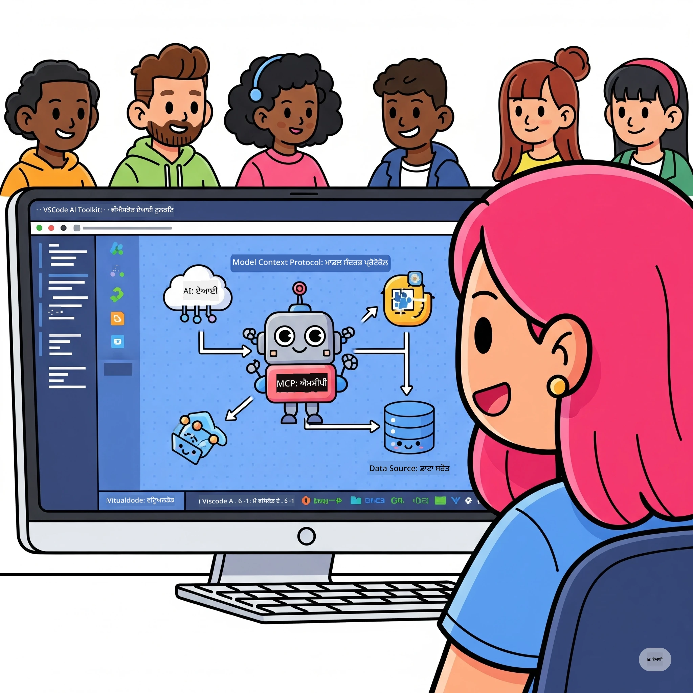

# ਏਆਈ ਵਰਕਫਲੋਜ਼ ਨੂੰ ਸਧਾਰਣਾ: ਮਾਈਕ੍ਰੋਸਾਫਟ ਫਾਊਂਡਰੀ ਟੂਲਕਿਟ ਨਾਲ MCP ਸਰਵਰ ਬਣਾਉਣਾ

## 🎯 ਝਲਕ

_(ਇਸ ਪਾਠ ਦੀ ਵੀਡੀਓ ਵੇਖਣ ਲਈ ਉੱਪਰ ਦਿੱਤੀ ਤਸਵੀਰ 'ਤੇ ਕਲਿੱਕ ਕਰੋ)_

ਤੁਹਾਡੀ ਸਵਾਗਤ ਹੈ **ਮਾਡਲ ਕੋਂਟੈਕਸਟ ਪ੍ਰੋਟੋਕੋਲ (MCP) ਵਰਕਸ਼ਾਪ** ਵਿੱਚ! ਇਹ ਵਿਆਪੀ ਹੈਂਡਜ਼-ਆਨ ਵਰਕਸ਼ਾਪ ਦੋ ਅਗਵਾਈ ਵਾਲੀ ਤਕਨਾਲੋਜੀਆਂ ਨੂੰ ਜੋੜਦਾ ਹੈ ਜੋ ਏਆਈ ਐਪਲੀਕੇਸ਼ਨ ਵਿਕਾਸ ਵਿੱਚ ਕ੍ਰਾਂਤੀ ਲਿਆਉਂਦੀਆਂ ਹਨ:

> **ਸੰਗਤਤਾ ਨੋਟ:** ਵਰਕਸ਼ਾਪ ਕੋਡ MCP
> `2025-11-25` ਨਾਲ ਬਣਾਇਆ ਅਤੇ ਟੈਸਟ ਕੀਤਾ ਗਿਆ ਸੀ, ਜਿਵੇਂ ਉੱਪਰ ਦਿੱਤੇ ਬੈਜ ਨਾਲ ਦਰਸਾਇਆ ਗਿਆ ਹੈ। ਨਵੀਂ ਪ੍ਰੋਟੋਕੋਲ ਲਾਗੂਤਾਂ ਲਈ
> [ਮੌਜੂਦਾ `2026-07-28` ਵਿਸ਼ੇਸ਼ਤਾ](https://modelcontextprotocol.io/specification/2026-07-28/)
> ਵਰਤੋ ਅਤੇ ਲੈਬਾਂ ਨੂੰ ਮਾਈਗਰੇਟ ਕਰਨ ਤੋਂ ਪਹਿਲਾਂ SDK ਰਿਲੀਜ਼ ਨੋਟਸ ਦੀ ਸਮੀਖਿਆ ਕਰੋ।

- **🛠️ مائیکروسافٹ فاؤنڈری ٹولکِٹ ایکسٹینشن برائے VS کوڈ**: ਮਾਈਕ੍ਰੋਸਾਫਟ ਦੀ ਸ਼ਕਤੀਸ਼ਾਲੀ ਏਆਈ ਵਿਕਾਸ ਐਕਸਟੇਂਸ਼ਨ

## 🏗️ ਤਕਨਾਲੋਜੀ ਸਟੈਕ

### 🔌 ਮਾਡਲ ਕੋਂਟੈਕਸਟ ਪ੍ਰੋਟੋਕੋਲ (MCP)

MCP ਹੈ **"ਏਆਈ ਲਈ USB-C"** - ਇੱਕ ਸਰਵਜਨੀਨ ਮਿਆਰੀ ਜੋ ਏਆਈ ਮਾਡਲਾਂ ਨੂੰ ਬਾਹਰੀ ਟੂਲਾਂ ਅਤੇ ਡੇਟਾ ਸਰੋਤਾਂ ਨਾਲ ਜੋੜਦਾ ਹੈ।

**✨ ਮੁੱਖ ਵਿਸ਼ੇਸ਼ਤਾਵਾਂ:**

- 🔄 **ਮਿਆਰੀ ਇੰਟਿਗ੍ਰੇਸ਼ਨ**: ਏਆਈ-ਟੂਲ ਕੁਨੈਕਸ਼ਨਾਂ ਲਈ ਸਰਵਜਨੀਨ ਇੰਟਰਫੇਸ
- 🏛️ **ਲਚਕੀਲਾ ਆਰਕੀਟੈਕਚਰ**: ਸਥਾਨਕ ਅਤੇ ਦੂਰੀਦਰ ਪ੍ਰੋਟੋਕੋਲ ਸਰਵਰ stdio/SSE ਟਰਾਂਸਪੋਰਟ ਰਾਹੀਂ
- 🧰 **ਸਮૃੱਧ ਪਰਿਸਰੀ**: ਇੱਕ ਪ੍ਰੋਟੋਕੋਲ ਵਿੱਚ ਟੂਲ, ਪ੍ਰਾਮਪਟ ਅਤੇ ਸਰੋਤ
- 🔒 **ਉਦਯੋਗ-ਤਿਆਰ**: ਸ਼ਾਮਲ ਸੁਰੱਖਿਆ ਅਤੇ ਭਰੋਸੇਯੋਗਤਾ

**🎯 MCP ਕਿਉਂ ਮਹੱਤਵਪੂਰਣ ਹੈ:**
ਜਿਵੇਂ USB-C ਨੇ ਕੇਬਲ ਗੜਬੜ ਨੂੰ ਖ਼ਤਮ ਕੀਤਾ, MCP ਏਆਈ ਇੰਟਿਗ੍ਰੇਸ਼ਨਜ਼ ਦੀ ਜਟਿਲਤਾ ਨੂੰ ਹਟਾਉਂਦਾ ਹੈ। ਇੱਕ ਪ੍ਰੋਟੋਕੋਲ, ਅਣਅੰਤ ਸੰਭਾਵਨਾਵਾਂ।

### 🤖 ਮਾਈਕ੍ਰੋਸਾਫਟ ਫਾਊਂਡਰੀ ਟੂਲਕਿਟ ਐਕਸਟੇਂਸ਼ਨ ਫ਼ਰ VS ਕੋਡ

ਮਾਈਕ੍ਰੋਸਾਫਟ ਦਾ ਪ੍ਰਧਾਨ ਏਆਈ ਵਿਕਾਸ ਐਕਸਟੇਂਸ਼ਨ ਜੋ VS ਕੋਡ ਨੂੰ ਏਆਈ ਸੱਤਰ ਬਣਾਉਂਦਾ ਹੈ।

**🚀 ਮੁੱਖ ਖੂਬੀਆਂ:**

- 📦 **ਮਾਡਲ ਕੈਟਾਲੌਗ**: Azure AI, GitHub, Hugging Face, Ollama ਤੋਂ ਮਾਡਲਾਂ ਤੱਕ ਪਹੁੰਚ
- ⚡ **ਸਥਾਨਕ ਇਨਫਰੈਂਸ**: ONNX-ਅਪਟਿਮਾਈਜ਼ਡ CPU/GPU/NPU ਕਿਰਿਆਸ਼ੀਲਤਾ
- 🏗️ **ਏਜੰਟ ਬਿਲਡਰ**: MCP ਇੰਟੀਗ੍ਰੇਸ਼ਨ ਨਾਲ ਵਿਜ਼ੂਅਲ ਏਆਈ ਏਜੰਟ ਵਿਕਾਸ
- 🎭 **ਬਹੁ-ਮਾਡਲ**: ਟੈਕਸਟ, ਵਿਜ਼ਨ, ਅਤੇ ਸੰਰਚਿਤ ਨਤੀਜਾ ਸਮਰਥਨ

**💡 ਵਿਕਾਸੀ ਲਾਭ:**

- ਜ਼ੀਰੋ-ਕਨਫਿਗ ਮਾਡਲ ਡਿਪਲੋਇਮੈਂਟ
- ਵਿਜ਼ੂਅਲ ਪ੍ਰਾਮਪਟ ਇੰਜੀਨੀਅਰਿੰਗ
- ਰੀਅਲ-ਟਾਈਮ ਟੈਸਟਿੰਗ ਪਲੇਗ੍ਰਾਊਂਡ
- ਬਿਨਾ ਰੁਕਾਵਟ ਦੇ MCP ਸਰਵਰ ਇੰਟੀਗ੍ਰੇਸ਼ਨ

## 📚 ਸਿੱਖਣ ਦੀ ਯਾਤਰਾ

### [🚀 ਮੋਡੀਊਲ 1: ਮਾਈਕ੍ਰੋਸਾਫਟ ਫਾਊਂਡਰੀ ਟੂਲਕਿਟ ਮੂਢਭੂਤ עੱ[./lab1/README.md)

**ਅਵਧੀ**: 15 ਮਿਨਟ

- 🛠️ VS ਕੋਡ ਲਈ ਮਾਈਕ੍ਰੋਸਾਫਟ ਫਾਊਂਡਰੀ ਟੂਲਕਿਟ ਇੰਸਟਾਲ ਅਤੇ ਸੰਰਚਿਤ ਕਰੋ
- 🗂️ ਮਾਡਲ ਕੈਟਾਲੌਗ ਦੀ ਖੋਜ ਕਰੋ (GitHub, ONNX, OpenAI, Anthropic, Google ਤੋਂ 100+ ਮਾਡਲ)
- 🎮 ਰੀਅਲ-ਟਾਈਮ ਮਾਡਲ ਟੈਸਟਿੰਗ ਲਈ ਇੰਟਰੈਕਟਿਵ ਪਲੇਗ੍ਰਾਊਂਡ ਵਿੱਚ ਪਕੜ ਹਾਸਲ ਕਰੋ
- 🤖 ਆਪਣਾ ਪਹਿਲਾ ਏਆਈ ਏਜੰਟ ਏਜੰਟ ਬਿਲਡਰ ਨਾਲ ਬਣਾਓ
- 📊 ਬਿਲਟ-ਇਨ ਮੈਟ੍ਰਿਕਸ ਨਾਲ ਮਾਡਲ ਪ੍ਰਦਰਸ਼ਨ ਦਾ ਮੁਲਾਂਕਣ ਕਰੋ (F1, ਸਬੰਧਿਤਤਾ, ਸਮਾਨਤਾ, ਸੰਗਤ)
- ⚡ ਬੈਚ ਪ੍ਰੋਸੈਸਿੰਗ ਅਤੇ ਬਹੁ-ਮਾਡਲ ਸਹਿਯੋਗ ਖੂਬੀਆਂ ਸਿੱਖੋ

**🎯 ਸਿੱਖਣ ਦਾ ਨਤੀਜਾ**: ਮਾਈਕ੍ਰੋਸਾਫਟ ਫਾਊਂਡਰੀ ਟੂਲਕਿਟ ਦੀ ਸਮਝ ਦੇ ਨਾਲ ਇੱਕ ਕਾਰਗਰ ਏਆਈ ਏਜੰਟ ਬਣਾਉਣ

### [🌐 ਮੋਡੀਊਲ 2: MCP ਨਾਲ ਮਾਈਕ੍ਰੋਸਾਫਟ ਫਾਊਂਡਰੀ ਟੂਲਕਿਟ ਮੂਢਭੂਤ](./lab2/README.md)

**ਅਵਧੀ**: 20 ਮਿਨਟ

- 🧠 ਮਾਡਲ ਕੋਂਟੈਕਸਟ ਪ੍ਰੋਟੋਕੋਲ (MCP) ਦੀ ਆਰਕੀਟੈਕਚਰ ਅਤੇ ਸੰਕਲਪ ਅਨੁਭਵ ਕਰੋ
- 🌐 ਮਾਈਕ੍ਰੋਸਾਫਟ ਦੇ MCP ਸਰਵਰ ਪਰਿਵਾਰ ਦੀ ਜਾਂਚ ਕਰੋ
- 🤖 ਪਲੇਇਰਾਈਟ MCP ਸਰਵਰ ਦੀ ਵਰਤੋਂ ਨਾਲ ਬ੍ਰਾਊਜ਼ਰ ਆਟੋਮੇਸ਼ਨ ਏਜੰਟ ਬਣਾਓ
- 🔧 MCP ਸਰਵਰਾਂ ਨੂੰ ਮਾਈਕ੍ਰੋਸਾਫਟ ਫਾਊਂਡਰੀ ਟੂਲਕਿਟ ਏਜੰਟ ਬਿਲਡਰ ਨਾਲ ਜੁੜੋ
- 📊 ਆਪਣੇ ਏਜੰਟਾਂ ਵਿੱਚ MCP ਟੂਲਾਂ ਨੂੰ ਸੰਰਚਿਤ ਅਤੇ ਟੈਸਟ ਕਰੋ
- 🚀 MCP-ਸਰਚਿਤ ਏਜੰਟਾਂ ਨੂੰ ਉਤਪਾਦਨ ਲਈ ਐਕਸਪੋਰਟ ਅਤੇ ਡਿਪਲੋਇ ਕਰੋ

**🎯 ਸਿੱਖਣ ਦਾ ਨਤੀਜਾ**: MCP ਰਾਹੀਂ ਬਾਹਰੀ ਟੂਲਾਂ ਨਾਲ ਇੱਕ ਸਪਰਚਾਰਜਡ ਏਆਈ ਏਜੰਟ ਡਿਪਲੋਇ ਕਰਨਾ

### [🔧 ਮੋਡੀਊਲ 3: ਮਾਈਕ੍ਰੋਸਾਫਟ ਫਾਊਂਡਰੀ ਟੂਲਕਿਟ ਨਾਲ ਉੱਚਤਮ MCP ਵਿਕਾਸ](./lab3/README.md)

**ਅਵਧੀ**: 20 ਮਿਨਟ

- 💻 ਮਾਈਕ੍ਰੋਸਾਫਟ ਫਾਊਂਡਰੀ ਟੂਲਕਿਟ ਨੂੰ ਵਰਤ ਕੇ ਕਸਟਮ MCP ਸਰਵਰ ਬਣਾਓ
- 🐍 ਨਵੀਂ MCP ਪਾਇਥਨ SDK (v1.9.3) ਦਾ ਸੰਰਚਨਾ ਕਰੋ ਅਤੇ ਵਰਤੋਂ ਕਰੋ
- 🔍 ਡਿਬੱਗਿੰਗ ਲਈ MCP ਇੰਸਪੈਕਟਰ ਸੈੱਟਅਪ ਅਤੇ ਵਰਤੋਂ ਕਰੋ
- 🛠️ ਪੇਸ਼ੇਵਰ ਡਿਬੱਗਿੰਗ ਵਰਕਫਲੋਜ਼ ਨਾਲ ਇੱਕ ਵੇਦਰ MCP ਸਰਵਰ ਬਣਾਓ
- 🧪 ਏਜੰਟ ਬਿਲਡਰ ਅਤੇ ਇੰਸਪੈਕਟਰ ਵਾਤਾਵਰਨ ਵਿੱਚ MCP ਸਰਵਰਾਂ ਨੂੰ ਡਿਬੱਗ ਕਰੋ

**🎯 ਸਿੱਖਣ ਦਾ ਨਤੀਜਾ**: ਆਧੁਨਿਕ ਟੂਲਿੰਗ ਨਾਲ ਕਸਟਮ MCP ਸਰਵਰ ਵਿਕਸਿਤ ਅਤੇ ਡਿਬੱਗ ਕਰੋ

### [🐙 ਮੋਡੀਊਲ 4: ਵਿਹਾਰਕ MCP ਵਿਕਾਸ - ਕਸਟਮ GitHub ਕਲੋਨ ਸਰਵਰ](./lab4/README.md)

**ਅਵਧੀ**: 30 ਮਿਨਟ

- 🏗️ ਵਿਕਾਸ ਵਰਕਫਲੋਜ਼ ਲਈ ਇੱਕ ਅਸਲੀ ਦੁਨੀਆ GitHub ਕਲੋਨ MCP ਸਰਵਰ ਬਣਾਓ
- 🔄 ਸਵਾਰਥਪੂਰਕ ਰੀਪੋਜ਼ੇਟਰੀ ਕਲੋਨਿੰਗ ਯਥਾਰਥ ਅਤੇ ਗਲਤੀ ਸੰਭਾਲ ਨਾਲ ਅਮਲ ਕਰੋ
- 📁 ਸਮਝਦਾਰ ਡਾਇਰੈਕਟਰੀ ਪ੍ਰਬੰਧਨ ਅਤੇ VS ਕੋਡ ਇੰਟੀਗ੍ਰੇਸ਼ਨ ਬਣਾਓ
- 🤖 GitHub ਕੋਪਾਇਲਟ ਏਜੰਟ ਮੋਡ ਦੇ ਨਾਲ ਕਸਟਮ MCP ਟੂਲਾਂ ਦੀ ਵਰਤੋਂ ਕਰੋ
- 🛡️ ਉਤਪਾਦਨ ਤਿਆਰ ਭਰੋਸੇਯੋਗਤਾ ਅਤੇ ਪਲੇਟਫਾਰਮ ਪਾਰ ਅਨੁਕੂਲਤਾ ਲਾਗੂ ਕਰੋ

**🎯 ਸਿੱਖਣ ਦਾ ਨਤੀਜਾ**: ਇੱਕ ਉਤਪਾਦਨ-ਤਿਆਰ MCP ਸਰਵਰ ਡਿਪਲੋਇ ਕਰੋ ਜੋ ਅਸਲ ਵਿਕਾਸ ਵਰਕਫਲੋਜ਼ ਸਧਾਰਦਾ ਹੈ

## 💡 ਹਕੀਕਤੀ ਦੁਨੀਆ ਦੀਆਂ ਐਪਲੀਕੇਸ਼ਨਾਂ ਅਤੇ ਪ੍ਰਭਾਵ

### 🏢 ਉਦਯੋਗਿਕ ਵਰਤੋਂ ਦੇ ਕੇਸ

#### 🔄 ਡਿਵਓਪਸ ਆਟੋਮੇਸ਼ਨ

ਆਪਣੇ ਵਿਕਾਸ ਵਰਕਫਲੋ ਨੂੰ ਸਮਝਦਾਰ ਆਟੋਮੇਸ਼ਨ ਨਾਲ ਬਦਲੋ:

- **ਸਮਾਰਟ ਰੀਪੋਜ਼ੇਟਰੀ ਪ੍ਰਬੰਧਨ**: ਏਆਈ-ਚਲਿਤ ਕੋਡ ਸਮੀਖਿਆ ਅਤੇ ਮਿਰਜ ਫੈਸਲੇ
- **ਸਮਝਦਾਰ CI/CD**: ਕੋਡ ਬਦਲਾਵਾਂ ਆਧਾਰਿਤ ਆਟੋਮੇਟਿਕ ਪਾਈਪਲਾਈਨ ਓਪਟੀਮਾਈਜ਼ੇਸ਼ਨ
- **ਇਸ਼ੂ ਤਿਨਧੀਕਰਨ**: ਸਵੈਚਾਲਿਤ ਬੱਗ ਵਰਗੀਕਰਨ ਅਤੇ ਅਸਾਈਨਮੈਂਟ

#### 🧪 ਗੁਣਵੱਤਾ ਆਸ਼ਵਾਸਨ ਕ੍ਰਾਂਤੀ

ਏਆਈ-ਚਲਿਤ ਆਟੋਮੇਸ਼ਨ ਨਾਲ ਟੈਸਟਿੰਗ ਨੂੰ ਉੱਚਾ ਕਰੋ:

- **ਸਮਝਦਾਰ ਟੈਸਟ ਪੈਦਾ ਕਰਨ**: ਵਿਸਤ੍ਰਿਤ ਟੈਸਟ ਸੂਟ ਸਵੈਚਾਲਿਤ ਤਰੀਕੇ ਨਾਲ ਬਣਾਓ
- **ਵਿਜ਼ੂਅਲ ਰਿਗ੍ਰੈਸ਼ਨ ਟੈਸਟਿੰਗ**: ਏਆਈ-ਚਲਿਤ UI ਬਦਲਾਅ ਪਹਿਚਾਣ
- **ਪ੍ਰਦਰਸ਼ਨ ਮਾਨੀਟਰਿੰਗ**: ਪਛਾਣ ਅਤੇ ਮੁਕਾਬਲਾ ਕਰਨ ਲਈ ਪ੍ਰੋਕਟਿਵ ਮੁੱਦੇ

#### 📊 ਡੇਟਾ ਪਾਈਪਲਾਈਨ ਬੁੱਧਿਮਤਾ

ਸਮਾਰਟ ਡਾਟਾ ਪ੍ਰੋਸੈਸਿੰਗ ਵਰਕਫਲੋਜ਼ ਬਣਾਓ:

- **ਐਡੈਪਟਿਵ ETL ਪ੍ਰਕਿਰਿਆਵਾਂ**: ਖੁਦ-ਠੀਕ ਹੋਣ ਵਾਲੀਆਂ ਡਾਟਾ ਤਬਦੀਲੀਆਂ
- **ਅਸਧਾਰਨ ਪਤਾ ਲਗਾਉਣਾ**: ਰੀਅਲ-ਟਾਈਮ ਡਾਟਾ ਗੁਣਵੱਤਾ ਨਿਗਰਾਨੀ
- **ਸਮਝਦਾਰ ਰੂਟਿੰਗ**: ਸਮਾਰਟ ਡਾਟਾ ਫਲੋ ਮੈਨੇਜਮੈਂਟ

#### 🎧 ਗਾਹਕ ਅਨਭਵ ਸੁਧਾਰ

ਵਿਸ਼ੇਸ਼ ਗਾਹਕ ਇੰਟਰੈਕਸ਼ਨ ਬਣਾੋ:

- **ਸੰਦਰਭ-ਸੁਚੇਤ ਸਹਾਇਤਾ**: ਗਾਹਕ ਇਤਿਹਾਸ ਤਕ ਪਹੁੰਚ ਵਾਲੇ ਏਆਈ ਏਜੰਟ
- **ਪੂਰਵ-ਸੂਚਿਤ ਸਮੱਸਿਆ ਹੱਲ**: ਭਵਿੱਖਬਾਣੀ ਵਾਲੀ ਗਾਹਕ ਸੇਵਾ
- **ਮਲਟੀ-ਚੈਨਲ ਇন্টਿਗ੍ਰੇਸ਼ਨ**: ਪਲੇਟਫਾਰਮਾਂ ਵਿੱਚ ਏਆਈ ਦਾ ਇਕੱਤਰ ਅਨੁਭਵ

## 🛠️ ਜਰੂਰੀਆਂ & ਸੈਟਅਪ

### 💻 ਸਿਸਟਮ ਦੀਆਂ ਜਰੂਰਤਾਂ

| ਹਿੱਸਾ | ਜਰੂਰਤ | ਟਿੱਪਣੀਆਂ |
|-----------|-------------|-------|
| **ਓਪਰੇਟਿੰਗ ਸਿਸਟਮ** | Windows 10+, macOS 10.15+, Linux | ਕੋਈ ਵੀ ਆਧੁਨਿਕ OS |
| **Visual Studio Code** | ਤਾਜ਼ਾ ਸਥਿਰ ਵਰਜਨ | Microsoft Foundry Toolkit ਲਈ ਜਰੂਰੀ |
| **Node.js** | v18.0+ ਅਤੇ npm | MCP ਸਰਵਰ ਵਿਕਾਸ ਲਈ |
| **Python** | 3.10+ | Python MCP ਸਰਵਰਾਂ ਲਈ ਵਿਕਲਪਿਕ |
| **ਮੈਮੋਰੀ** | ਘੱਟੋ-ਘੱਟ 8GB RAM | ਸਥਾਨਕ ਮਾਡਲਾਂ ਲਈ 16GB ਸਿਫ਼ਾਰਸ਼ੀ |

### 🔧 ਵਿਕਾਸ ਦਾ ਮਾਹੌਲ

#### ਸਿਫ਼ਾਰਸ਼ੀ VS ਕੋਡ ਐਕਸਟੈਨਸ਼ਨ

- **Microsoft Foundry Toolkit** (ms-windows-ai-studio.windows-ai-studio)
- **Python** (ms-python.python)
- **Python ਡੀਬੱਗਰ** (ms-python.debugpy)
- **GitHub Copilot** (GitHub.copilot) - ਵਿਕਲਪਿਕ ਪਰ ਮਦਦਗਾਰ

#### ਵਿਕਲਪਿਕ ਸੰਦ

- **uv**: ਆਧੁਨਿਕ Python ਪੈਕੇਜ ਮੈਨੇਜਰ
- **MCP ਇੰਸਪੈਕਟਰ**: MCP ਸਰਵਰਾਂ ਲਈ ਵਿਜ਼ੂਅਲ ਡੀਬੱਗਿੰਗ ਸੰਦ
- **Playwright**: ਵੈੱਬ ਆਟੋਮੇਸ਼ਨ ਉਦਾਹਰਨਾਂ ਲਈ

## 🎖️ ਸਿੱਖਣ ਦੇ ਨਤੀਜੇ & ਪ੍ਰਮਾਣ ਪੱਤਰ ਪਾਥ

### 🏆 ਹੁਨਰ ਮਾਹਰਤਾ ਚੈਕਲਿਸਟ

ਇਸ ਵਰਕਸ਼ਾਪ ਨੂੰ ਪੂਰਾ ਕਰ ਕੇ, ਤੁਸੀਂ ਹਾਸਲ ਕਰੋਗੇ:

#### 🎯 ਮੁੱਖ ਯੋਗਤਾਵਾਂ

- [ ] **MCP ਪ੍ਰੋਟੋਕਾਲ ਮਾਹਰਤਾ**: ਅਰਕੀਟੈਕਚਰ ਅਤੇ ਅਮਲ ਦੇ ਨਮੂਨਿਆਂ ਦੀ ਡੂੰਘੀ ਸਮਝ
- [ ] **Microsoft Foundry Toolkitਵੀਚਾਰਧਾਰਾ**: ਤੇਜ਼ ਵਿਕਾਸ ਲਈ Microsoft Foundry Toolkit ਦੀ ਨਿਪੁੰਨ ਵਰਤੋਂ
- [ ] **ਕਸਟਮ ਸਰਵਰ ਵਿਕਾਸ**: MCP ਸਰਵਰਾਂ ਦਾ ਬਣਾਉ, ਤਾਇਨਾਤੀ ਅਤੇ ਰੱਖ-ਰਖਾਅ
- [ ] **ਸੰਦ ਇੰਟਿਗ੍ਰੇਸ਼ਨ ਮਹਾਨਤਾ**: ਮੌਜੂਦਾ ਵਿਕਾਸ ਵਰਕਫਲੋਜ਼ ਨਾਲ ਏਆਈ ਨੂੰ ਬੇਹਤਰੀਨ ਤਰੀਕੇ ਨਾਲ ਜੁੜਨਾ
- [ ] **ਸਮੱਸਿਆ-ਹੱਲ ਦੀ ਅਪਲਾਈਕੇਸ਼ਨ**: ਕਿਸੇ ਵਾਸਤਵਿਕ ਕਾਰੋਬਾਰੀ ਚੁਣੌਤੀ ਵਿੱਚ ਸਿੱਖੇ ਹੁਨਰ ਲਾਗੂ ਕਰਨਾ

#### 🔧 ਤਕਨੀਕੀ ਹੁਨਰ

- [ ] VS ਕੋਡ ਵਿੱਚ Microsoft Foundry Toolkit ਸੈੱਟਅਪ ਤੇ ਸੰਰਚਨਾ ਕਰੋ
- [ ] ਕਸਟਮ MCP ਸਰਵਰ ਡਿਜ਼ਾਈਨ ਅਤੇ ਅਮਲ ਕਰੋ
- [ ] MCP ਅਰਕੀਟੈਕਚਰ ਨਾਲ GitHub ਮਾਡਲਾਂ ਇੰਟਿਗ੍ਰੇਟ ਕਰੋ
- [ ] Playwright ਨਾਲ ਸਵੈਚਾਲਤ ਟੈਸਟਿੰਗ ਵਰਕਫਲੋਜ਼ ਬਣਾਓ
- [ ] ਉਤਪਾਦਨ ਲਈ ਏਆਈ ਏਜੰਟ ਤਾਇਨਾਤ ਕਰੋ
- [ ] MCP ਸਰਵਰ ਪ੍ਰਦਰਸ਼ਨ ਡੀਬੱਗ ਤੇ ਅਪਟੀਮਾਈਜ਼ ਕਰੋ

#### 🚀 ਉन्नਤ ਕਾਬਲੀਆਂ

- [ ] ਐਂਟਰਪ੍ਰਾਈਜ਼-ਪੱਧਰੀ ਏਆਈ ਇੰਟਿਗ੍ਰੇਸ਼ਨ ਅਰਕੀਟੈਕਚਰ ਕਰੋ
- [ ] ਏਆਈ ਐਪਲੀਕੇਸ਼ਨਾਂ ਲਈ ਸੁਰੱਖਿਆ ਸਰਵੋਤਮ ਤਰੀਕੇ ਅਮਲ ਕਰੋ
- [ ] ਸਕੇਲ ਕਰਨ ਯੋਗ MCP ਸਰਵਰ ਅਰਕੀਟੈਕਚਰ ਡਿਜ਼ਾਈਨ ਕਰੋ
- [ ] ਵਿਸ਼ੇਸ਼ ਖੇਤਰਾਂ ਲਈ ਕਸਟਮ ਟੂਲ ਚੇਨ ਬਣਾਓ
- [ ] ਹੋਰਾਂ ਨੂੰ ਏਆਈ-ਨੈਟਿਵ ਵਿਕਾਸ ਵਿੱਚ ਮਾਰਗਦਰਸ਼ਨ ਦਿਓ

## 📖 ਵਾਧੂ ਸਰੋਤ

- [MCP ਵਿਸ਼ੇਸ਼ਤਾ (2026-07-28)](https://modelcontextprotocol.io/specification/2026-07-28/)
- [Microsoft Foundry Toolkit GitHub ਰਿਪੋਜ਼ਟਰੀ](https://github.com/microsoft/vscode-ai-toolkit)
- [ਨਮੂਨਾ MCP ਸਰਵਰ ਕਲੇਕਸ਼ਨ](https://github.com/modelcontextprotocol/servers)
- [ਸਰਵੋਤਮ ਅਭਿਆਸ ਗਾਈਡ](https://modelcontextprotocol.io/docs/best-practices)
- [OWASP MCP ਟੌਪ 10](https://microsoft.github.io/mcp-azure-security-guide/mcp/) - ਸੁਰੱਖਿਆ ਸਰਵੋਤਮ ਅਭਿਆਸ

---

**🚀 ਕੀ ਤੁਸੀਂ ਆਪਣੇ ਏਆਈ ਵਿਕਾਸ ਵਰਕਫਲੋ ਨੂੰ ਕ੍ਰਾਂਤੀਕਾਰੀ ਬਣਾਉਣ ਲਈ ਤਿਆਰ ਹੋ?**

ਆਓ MCP ਅਤੇ Microsoft Foundry Toolkit ਨਾਲ ਸਿਆਣੀ ਐਪਲੀਕੇਸ਼ਨਾਂ ਦਾ ਭਵਿੱਖ ਇਕੱਠੇ ਬਣਾਈਏ!

## ਅਗਲਾ ਕੀ ਹੈ

ਜਾਰੀ ਰੱਖੋ: [ਮੋਡੀਊਲ 11: MCP ਸਰਵਰ ਹੈਂਡਸ-ਆਨ ਲੈਬز](../11-MCPServerHandsOnLabs/README.md)

---

<!-- CO-OP TRANSLATOR DISCLAIMER START -->
**ਅਸਵੀਕਾਰੋਪਣ**:
ਇਸ ਦਸਤਾਵੇਜ਼ ਦਾ ਅਨੁਵਾਦ ਏਆਈ ਅਨੁਵਾਦ ਸੇਵਾ [Co-op Translator](https://github.com/Azure/co-op-translator) ਦੀ ਵਰਤੋਂ ਕਰਕੇ ਕੀਤਾ ਗਿਆ ਹੈ। ਜਦੋਂ ਕਿ ਅਸੀਂ ਸਹੀਤਾਵਾਂ ਲਈ ਯਤਨਸ਼ੀਲ ਹਾਂ, ਕਿਰਪਾ ਕਰਕੇ ਧਿਆਨ ਰੱਖੋ ਕਿ ਸਵੈਚਾਲਿਤ ਅਨੁਵਾਦਾਂ ਵਿੱਚ ਗਲਤੀਆਂ ਜਾਂ ਅਸਮੱਤਿਆਵਾਂ ਹੋ ਸਕਦੀਆਂ ਹਨ। ਮੂਲ ਦਸਤਾਵੇਜ਼ ਆਪਣੀ ਮੂਲ ਭਾਸ਼ਾ ਵਿੱਚ ਅਧਿਕਾਰਕ ਸਰੋਤ ਮੰਨਿਆ ਜਾਣਾ ਚਾਹੀਦਾ ਹੈ। ਜਰੂਰੀ ਜਾਣਕਾਰੀ ਲਈ, ਪੇਸ਼ੇਵਰ ਮਨੁੱਖੀ ਅਨੁਵਾਦ ਦੀ ਸਿਫ਼ਾਰਸ਼ ਕੀਤੀ ਜਾਂਦੀ ਹੈ। ਅਸੀਂ ਇਸ ਅਨੁਵਾਦ ਦੇ ਉਪਯੋਗ ਤੋਂ ਪੈਦਾ ਹੋਣ ਵਾਲੀਆਂ ਕਿਸੇ ਵੀ ਗਲਤਫਹਿਮੀਆਂ ਜਾਂ ਗਲਤ ਵਿਆਖਿਆਵਾਂ ਲਈ ਜਵਾਬਦੇਹ ਨਹੀਂ ਹਾਂ।
<!-- CO-OP TRANSLATOR DISCLAIMER END -->