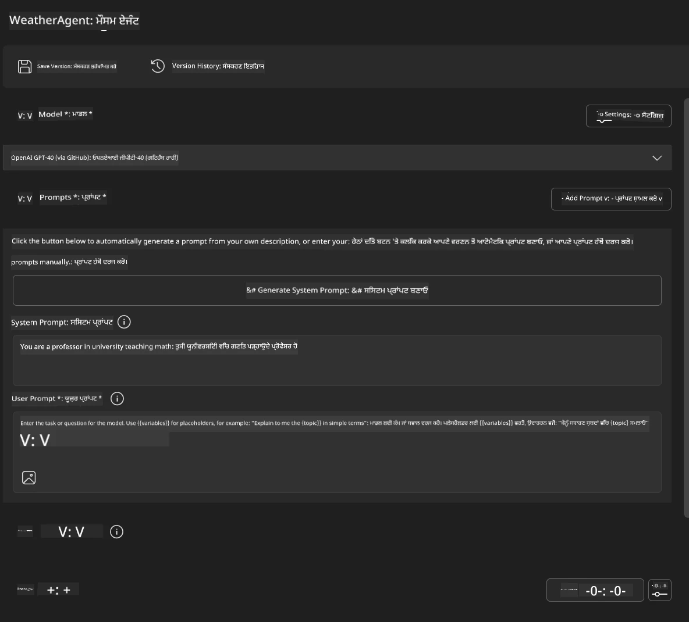
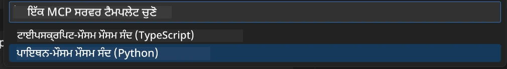
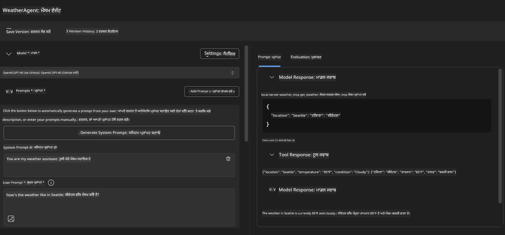
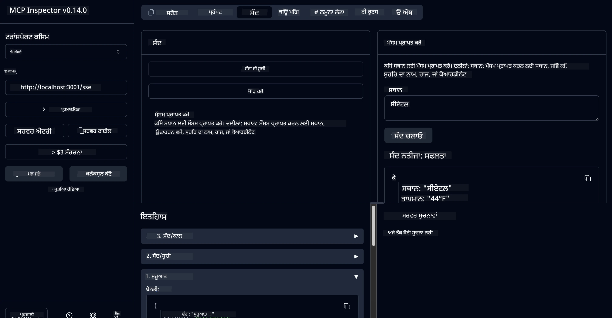

# 🔧 ਮੋਡੀਊਲ 3: ਮਾਈਕ੍ਰੋਸੋਫਟ ਫਾਊਂਡਰੀ ਟੂਲਕਿਟ ਨਾਲ ਐਡਵਾਂਸਡ MCP ਵਿਕਾਸ

> [!NOTE]
> ਇਸ ਲੈੱਬ ਵਿੱਚ ਇੰਸਪੈਕਟਰ URLs ਪ੍ਰਾਚੀਨ `/sse` ਐਂਡਪੋਇੰਟ ਦੀ ਵਰਤੋਂ ਕਰਦੇ ਹਨ ਅਤੇ ਪਿੰਨ ਕੀਤੇ MCP SDK `1.9.3` ਅਤੇ ਇੰਸਪੈਕਟਰ `0.14.0` ਡੀਪੈਂਡੈਂਸੀਜ਼ ਨੂੰ ਨਿਸ਼ਾਨਾ ਬਣਾਉਂਦੇ ਹਨ। ਇਹ ਮੌਜੂਦਾ `2026-07-28` ਸਟ੍ਰੀਮੇਬਲ HTTP ਉਦਾਹਰਣ ਨਹੀਂ ਹਨ।
> 
> 


## 🎯 ਸਿੱਖਣ ਦੇ ਉਦੇਸ਼

ਇਸ ਲੈੱਬ ਦੇ ਅਖੀਰ ਤਕ, ਤੁਸੀਂ ਸਮਰੱਥ ਹੋਵੋਗੇ:

- ✅ ਮਾਈਕ੍ਰੋਸੋਫਟ ਫਾਊਂਡਰੀ ਟੂਲਕਿਟ ਦੀ ਵਰਤੋਂ ਕਰਕੇ ਕਸਟਮ MCP ਸਰਵਰ ਬਣਾਉਣਾ
- ✅ ਅਖੀਰੀ MCP ਪਾਇਥਨ SDK (v1.9.3) ਨੂੰ ਸੰਰਚਿਤ ਕਰਨ ਅਤੇ ਵਰਤਣ ਲਈ
- ✅ ਡੀਬੱਗਿੰਗ ਲਈ MCP ਇੰਸਪੈਕਟਰ ਸੈੱਟਅੱਪ ਅਤੇ ਵਰਤਣਾ
- ✅ ਏਜੈਂਟ ਬਿਲਡਰ ਅਤੇ ਇੰਸਪੈਕਟਰ ਮਾਹੌਲ ਵਿੱਚ MCP ਸਰਵਰਾਂ ਦੀ ਡੀਬੱਗਿੰਗ ਕਰਨਾ
- ✅ ਉन्नਤ MCP ਸਰਵਰ ਵਿਕਾਸ ਵਰਕਫਲੋਜ਼ ਨੂੰ ਸਮਝਣਾ

## 📋 ਪਹਿਲਾਂ ਤੋਂ ਲੋੜੀਂਦੇ ਚੀਜ਼ਾਂ

- ਲੈੱਬ 2 (MCP ਬੁਨਿਆਦੀ ਜਾਨਕਾਰੀ) ਦੀ ਪੂਰੀਤਾ
- VS ਕੋਡ ਵਿੱਚ ਮਾਈਕ੍ਰੋਸੋਫਟ ਫਾਊਂਡਰੀ ਟੂਲਕਿਟ ਐਕਸਟੈਂਸ਼ਨ ਇੰਸਟਾਲ ਕੀਤਾ ਹੋਇਆ
- ਪਾਇਥਨ 3.10+ ਵਾਤਾਵਰਣ
- ਇੰਸਪੈਕਟਰ ਸੈੱਟਅੱਪ ਲਈ Node.js ਅਤੇ npm

## 🏗️ ਤੁਸੀਂ ਕੀ ਬਣਾਵੋਗੇ

ਇਸ ਲੈੱਬ ਵਿੱਚ, ਤੁਸੀਂ ਇੱਕ **ਵੈਦਰ MCP ਸਰਵਰ** ਬਣਾਵੋਗੇ ਜੋ ਇਹਨਾਂ ਵਿਸ਼ੇਸ਼ਤਾਵਾਂ ਨੂੰ ਦਰਸਾਉਂਦਾ ਹੈ:
- ਕਸਟਮ MCP ਸਰਵਰ ਦੀ ਨਿਰਮਾਣ ਪ੍ਰਕਿਰਿਆ
- ਮਾਈਕ੍ਰੋਸੋਫਟ ਫਾਊਂਡਰੀ ਟੂਲਕਿਟ ਏਜੈਂਟ ਬਿਲਡਰ ਨਾਲ ਇੰਟਿਗ੍ਰੇਸ਼ਨ
- ਪ੍ਰੋਫੈਸ਼ਨਲ ਡੀਬੱਗਿੰਗ ਵਰਕਫਲੋਜ਼
- ਆਧੁਨਿਕ MCP SDK ਦੀ ਵਰਤੋਂ ਦੇ ਤਰੀਕੇ

---

## 🔧 ਮੁੱਖ ਭਾਗਾਂ ਦਾ ਜਾਇਜ਼ਾ

### 🐍 MCP ਪਾਇਥਨ SDK
ਮਾਡਲ ਸੰਦਰਭ ਪ੍ਰੋਟੋਕੋਲ ਪਾਇਥਨ SDK ਕਸਟਮ MCP ਸਰਵਰਾਂ ਦੇ ਬਣਾਉਣ ਲਈ ਬਨੀਯਾਦ ਮੁਹੱਈਆ ਕਰਵਾਉਂਦਾ ਹੈ। ਤੁਸੀਂ ਵਰਜ਼ਨ 1.9.3 ਨੂੰ ਵਧੀਆ ਡੀਬੱਗਿੰਗ ਸਮਰੱਥਤਾ ਨਾਲ ਵਰਤੋਂਗੇ।

### 🔍 MCP ਇੰਸਪੈਕਟਰ
ਇੱਕ ਸ਼ਕਤੀਸ਼ਾਲੀ ਡੀਬੱਗਿੰਗ ਸੰਦ ਜੋ ਇਹ ਸਹੂਲਤਾਂ ਦਿੰਦਾ ਹੈ:
- ਰੀਅਲ-ਟਾਈਮ ਸਰਵਰ ਮਾਨੀਟਰਨਗ
- ਟੂਲ ਕੁੱਸਲ ਦਿਖਾਉਣਾ
- ਨੈੱਟਵਰਕ ਬੇਨਤੀ/ਜਵਾਬ ਦੀ ਜਾਂਚ
- ਇੰਟਰਐਕਟਿਵ ਟੈਸਟਿੰਗ ਮਾਹੌਲ

---

## 📖 ਕਦਮ-ਦਰ-कਦਮ ਨਿਰਮਾਣ

### ਕਦਮ 1: ਏਜੈਂਟ ਬਿਲਡਰ ਵਿੱਚ WeatherAgent ਬਣਾਓ

1. **VS ਕੋਡ ਵਿੱਚ ਮਾਈਕ੍ਰੋਸੋਫਟ ਫਾਊਂਡਰੀ ਟੂਲਕਿਟ ਐਕਸਟੈਂਸ਼ਨ ਰਾਹੀਂ ਏਜੈਂਟ ਬਿਲਡਰ ਚਾਲੂ ਕਰੋ**
2. **ਹੇਠਾਂ ਦਿੱਤੇ ਸੰਰਚਨਾ ਨਾਲ ਨਵਾਂ ਏਜੈਂਟ ਬਣਾਓ:**
   - ਏਜੈਂਟ ਨਾਮ: `WeatherAgent`



### ਕਦਮ 2: MCP ਸਰਵਰ ਪ੍ਰੋਜੈਕਟ ਸ਼ੁਰੂ ਕਰੋ

1. **ਟੂਲਜ਼ → ਐਡ ਟੂਲ ਵਿੱਚ ਜਾਵੋ** ਏਜੈਂਟ ਬਿਲਡਰ ਵਿੱਚ
2. **"MCP ਸਰਵਰ" ਚੁਣੋ** ਉਪਲਬਧ ਵਿਕਲਪਾਂ ਵਿੱਚੋਂ
3. **"ਨਵਾਂ MCP ਸਰਵਰ ਬਣਾਓ" ਚੁਣੋ**
4. **`python-weather` ਟੈਮਪਲੇਟ ਚੁਣੋ**
5. **ਆਪਣੇ ਸਰਵਰ ਦਾ ਨਾਮ ਦਿਓ:** `weather_mcp`



### ਕਦਮ 3: ਪ੍ਰੋਜੈਕਟ ਖੋਲ੍ਹੋ ਅਤੇ ਜਾਂਚੋ

1. **ਉਤਪੰਨ ਪ੍ਰੋਜੈਕਟ VS ਕੋਡ ਵਿੱਚ ਖੋਲ੍ਹੋ**
2. **ਪ੍ਰੋਜੈਕਟ ਸੰਰਚਨਾ ਸਮੀਖਿਆ ਕਰੋ:**
   ```
   weather_mcp/
   ├── src/
   │   ├── __init__.py
   │   └── server.py
   ├── inspector/
   │   ├── package.json
   │   └── package-lock.json
   ├── .vscode/
   │   ├── launch.json
   │   └── tasks.json
   ├── pyproject.toml
   └── README.md
   ```

### ਕਦਮ 4: ਨਵੀਨਤਮ MCP SDK 'ਤੇ ਅਪਗ੍ਰੇਡ ਕਰੋ

> **🔍 ਅਪਗ੍ਰੇਡ ਕਿਉਂ?** ਅਸੀਂ ਵਧੀਆ ਫੀਚਰਾਂ ਅਤੇ ਬਿਹਤਰ ਡੀਬੱਗਿੰਗ ਸਮਰੱਥਾ ਲਈ ਅਖੀਰੀ MCP SDK (v1.9.3) ਅਤੇ ਇੰਸਪੈਕਟਰ ਸੇਵਾ (0.14.0) ਵਰਤਣਾ ਚਾਹੁੰਦੇ ਹਾਂ।

#### 4a. ਪਾਇਥਨ ਡੀਪੈਂਡੈਂਸੀਜ਼ ਅਪਡੇਟ ਕਰੋ

**`pyproject.toml` ਸੋਧੋ:** [./code/weather_mcp/pyproject.toml](../../../../10-StreamliningAIWorkflowsBuildingAnMCPServerWithAIToolkit/lab3/code/weather_mcp/pyproject.toml) ਨੂੰ ਅਪਡੇਟ ਕਰੋ


#### 4b. ਇੰਸਪੈਕਟਰ ਸੰਰਚਨਾ ਅਪਡੇਟ ਕਰੋ

**`inspector/package.json` ਸੋਧੋ:** [./code/weather_mcp/inspector/package.json](../../../../10-StreamliningAIWorkflowsBuildingAnMCPServerWithAIToolkit/lab3/code/weather_mcp/inspector/package.json) ਨੂੰ ਅਪਡੇਟ ਕਰੋ

#### 4c. ਇੰਸਪੈਕਟਰ ਡੀਪੈਂਡੈਂਸੀਜ਼ ਅਪਡੇਟ ਕਰੋ

**`inspector/package-lock.json` ਸੋਧੋ:** [./code/weather_mcp/inspector/package-lock.json](../../../../10-StreamliningAIWorkflowsBuildingAnMCPServerWithAIToolkit/lab3/code/weather_mcp/inspector/package-lock.json) ਨੂੰ ਅਪਡੇਟ ਕਰੋ

> **📝 ਨੋਟ:** ਇਸ ਫਾਇਲ ਵਿੱਚ ਵਿਆਪਕ ਡੀਪੈਂਡੈਂਸੀ ਪਰਿਭਾਸ਼ਾਵਾਂ ਹਨ। ਹੇਠਾਂ ਅਹੰਕਾਰਪੂਰਕ ਢਾਂਚਾ ਹੈ - ਪੂਰੀ ਸਮੱਗਰੀ ਸਹੀ ਡੀਪੈਂਡੈਂਸੀ ਵਿਵਸਥਾ ਨੂੰ ਯਕੀਨੀ ਬਣਾਉਂਦੀ ਹੈ।


> **⚡ ਪੂਰਾ ਪੈਕੇਜ ਲੌਕ:** ਪੂਰੀ package-lock.json ਵਿੱਚ ~3000 ਲਾਈਨਾਂ ਦੀ ਡੀਪੈਂਡੈਂਸੀ ਪਰਿਭਾਸ਼ਾਵਾਂ ਹਨ। ਉੱਪਰ ਦਿੱਤਾ ਢਾਂਚਾ ਮੁੱਖ ਹੈ - ਪੂਰਾ ਡੀਪੈਂਡੈਂਸੀ ਨਿਪਟਾਰਾ ਕਰਨ ਲਈ ਦਿੱਤੀ ਫਾਇਲ ਵਰਤੋ।

### ਕਦਮ 5: VS ਕੋਡ ਡੀਬੱਗਿੰਗ ਸੰਰਚਨਾ

*ਟਿੱਪਣੀ: ਕਿਰਪਾ ਕਰਕੇ ਦੱਸੀ ਗਈ ਫਾਇਲ ਨੂੰ ਦਿੱਤੇ ਪਾਥ ਵਿੱਚ ਕਾਪੀ ਕਰਕੇ ਸਥਾਨਕ ਫਾਇਲ ਨੂੰ ਬਦਲੋ*

#### 5a. ਲਾਂਚ ਸੰਰਚਨਾ ਅਪਡੇਟ ਕਰੋ

**`.vscode/launch.json` ਸੋਧੋ:**

```json
{
  "version": "0.2.0",
  "configurations": [
    {
      "name": "Attach to Local MCP",
      "type": "debugpy",
      "request": "attach",
      "connect": {
        "host": "localhost",
        "port": 5678
      },
      "presentation": {
        "hidden": true
      },
      "internalConsoleOptions": "neverOpen",
      "postDebugTask": "Terminate All Tasks"
    },
    {
      "name": "Launch Inspector (Edge)",
      "type": "msedge",
      "request": "launch",
      "url": "http://localhost:6274?timeout=60000&serverUrl=http://localhost:3001/sse#tools",
      "cascadeTerminateToConfigurations": [
        "Attach to Local MCP"
      ],
      "presentation": {
        "hidden": true
      },
      "internalConsoleOptions": "neverOpen"
    },
    {
      "name": "Launch Inspector (Chrome)",
      "type": "chrome",
      "request": "launch",
      "url": "http://localhost:6274?timeout=60000&serverUrl=http://localhost:3001/sse#tools",
      "cascadeTerminateToConfigurations": [
        "Attach to Local MCP"
      ],
      "presentation": {
        "hidden": true
      },
      "internalConsoleOptions": "neverOpen"
    }
  ],
  "compounds": [
    {
      "name": "Debug in Agent Builder",
      "configurations": [
        "Attach to Local MCP"
      ],
      "preLaunchTask": "Open Agent Builder",
    },
    {
      "name": "Debug in Inspector (Edge)",
      "configurations": [
        "Launch Inspector (Edge)",
        "Attach to Local MCP"
      ],
      "preLaunchTask": "Start MCP Inspector",
      "stopAll": true
    },
    {
      "name": "Debug in Inspector (Chrome)",
      "configurations": [
        "Launch Inspector (Chrome)",
        "Attach to Local MCP"
      ],
      "preLaunchTask": "Start MCP Inspector",
      "stopAll": true
    }
  ]
}
```

**`.vscode/tasks.json` ਸੋਧੋ:**

```
{
  "version": "2.0.0",
  "tasks": [
    {
      "label": "Start MCP Server",
      "type": "shell",
      "command": "python -m debugpy --listen 127.0.0.1:5678 src/__init__.py sse",
      "isBackground": true,
      "options": {
        "cwd": "${workspaceFolder}",
        "env": {
          "PORT": "3001"
        }
      },
      "problemMatcher": {
        "pattern": [
          {
            "regexp": "^.*$",
            "file": 0,
            "location": 1,
            "message": 2
          }
        ],
        "background": {
          "activeOnStart": true,
          "beginsPattern": ".*",
          "endsPattern": "Application startup complete|running"
        }
      }
    },
    {
      "label": "Start MCP Inspector",
      "type": "shell",
      "command": "npm run dev:inspector",
      "isBackground": true,
      "options": {
        "cwd": "${workspaceFolder}/inspector",
        "env": {
          "CLIENT_PORT": "6274",
          "SERVER_PORT": "6277",
        }
      },
      "problemMatcher": {
        "pattern": [
          {
            "regexp": "^.*$",
            "file": 0,
            "location": 1,
            "message": 2
          }
        ],
        "background": {
          "activeOnStart": true,
          "beginsPattern": "Starting MCP inspector",
          "endsPattern": "Proxy server listening on port"
        }
      },
      "dependsOn": [
        "Start MCP Server"
      ]
    },
    {
      "label": "Open Agent Builder",
      "type": "shell",
      "command": "echo ${input:openAgentBuilder}",
      "presentation": {
        "reveal": "never"
      },
      "dependsOn": [
        "Start MCP Server"
      ],
    },
    {
      "label": "Terminate All Tasks",
      "command": "echo ${input:terminate}",
      "type": "shell",
      "problemMatcher": []
    }
  ],
  "inputs": [
    {
      "id": "openAgentBuilder",
      "type": "command",
      "command": "ai-mlstudio.agentBuilder",
      "args": {
        "initialMCPs": [ "local-server-weather_mcp" ],
        "triggeredFrom": "vsc-tasks"
      }
    },
    {
      "id": "terminate",
      "type": "command",
      "command": "workbench.action.tasks.terminate",
      "args": "terminateAll"
    }
  ]
}
```


---

## 🚀 ਆਪਣਾ MCP ਸਰਵਰ ਚਲਾਉਣਾ ਅਤੇ ਟੈਸਟ ਕਰਨਾ

### ਕਦਮ 6: ਡੀਪੈਂਡੈਂਸੀਜ਼ ਇੰਸਟਾਲ ਕਰੋ

ਸੰਰਚਨਾ ਬਦਲਾਅ ਕਰਨ ਤੋਂ ਬਾਅਦ ਇਹ ਹੁਕਮ ਚਲਾਓ:

**ਪਾਇਥਨ ਡੀਪੈਂਡੈਂਸੀਜ਼ ਇੰਸਟਾਲ ਕਰੋ:**
```bash
uv sync
```

**ਇੰਸਪੈਕਟਰ ਡੀਪੈਂਡੈਂਸੀਜ਼ ਇੰਸਟਾਲ ਕਰੋ:**
```bash
cd inspector
npm install
```

### ਕਦਮ 7: ਏਜੈਂਟ ਬਿਲਡਰ ਨਾਲ ਡੀਬੱਗ ਕਰੋ

1. **F5 ਦਬਾਓ** ਜਾਂ **"Debug in Agent Builder"** ਸੰਰਚਨਾ ਵਰਤੋ
2. **ਡੀਬੱਗ ਪੈਨਲ ਵਿੱਚ ਕਾਂਪਾਊਂਡ ਸੰਰਚਨਾ ਚੁਣੋ**
3. **ਸਰਵਰ ਚੱਲਣ ਅਤੇ ਏਜੈਂਟ ਬਿਲਡਰ ਖੁੱਲਣ ਲਈ ਉਡੀਕੋ**
4. **ਆਪਣੇ ਵੈਦਰ MCP ਸਰਵਰ ਨੂੰ ਕੁਦਰਤੀ ਭਾਸ਼ਾ ਵਿਚ ਕਿਵੇਂ ਪੁੱਛ ਤੱਛ ਕਰੋ**

ਇਸ ਤਰ੍ਹਾਂ ਇਨਪੁੱਟ ਪ੍ਰਾਂਪਟ

SYSTEM_PROMPT

```
You are my weather assistant
```

USER_PROMPT

```
How's the weather like in Seattle
```



### ਕਦਮ 8: MCP ਇੰਸਪੈਕਟਰ ਨਾਲ ਡੀਬੱਗ ਕਰੋ

1. **"Debug in Inspector"** ਸੰਰਚਨਾ ਵਰਤੋ (Edge ਜਾਂ Chrome)
2. **ਇੰਸਪੈਕਟਰ ਇੰਟਰਫੇਸ `http://localhost:6274` 'ਤੇ ਖੋਲ੍ਹੋ**
3. **ਇੰਟਰਐਕਟਿਵ ਟੈਸਟਿੰਗ ਮਾਹੌਲ ਦੀ ਖੋਜ ਕਰੋ:**
   - ਉਪਲਬਧ ਟੂਲ ਵੇਖੋ
   - ਟੂਲ ਕੁੱਸਲ ਟੈਸਟ ਕਰੋ
   - ਨੈੱਟਵਰਕ ਬੇਨਤੀਆਂ ਵੇਖੋ
   - ਸਰਵਰ ਜਵਾਬਾਂ ਨੂੰ ਡੀਬੱਗ ਕਰੋ



---

## 🎯 ਮੁੱਖ ਸਿੱਖਣ ਦੇ ਨਤੀਜੇ

ਇਸ ਲੈੱਬ ਨੂੰ ਪੂਰਾ ਕਰਕੇ, ਤੁਸੀਂ:

- [x] ਮਾਈਕ੍ਰੋਸੋਫਟ ਫਾਊਂਡਰੀ ਟੂਲਕਿਟ ਟੈਮਪਲੇਟ ਵਰਤ ਕੇ ਇੱਕ ਕਸਟਮ MCP ਸਰਵਰ ਬਣਾਇਆ
- [x] ਵਧੀਆ ਕਾਰਕਿਰਦਗੀ ਲਈ ਨਵੀਨਤਮ MCP SDK (v1.9.3) ਉੱਤੇ ਅਪਗ੍ਰੇਡ ਕੀਤਾ
- [x] ਦੋਹਾਂ ਏਜੈਂਟ ਬਿਲਡਰ ਅਤੇ ਇੰਸਪੈਕਟਰ ਲਈ ਪ੍ਰੋਫੈਸ਼ਨਲ ਡੀਬੱਗਿੰਗ ਵਰਕਫਲੋਜ਼ ਸੰਰਚਿਤ ਕੀਤੇ
- [x] ਇੰਟਰਐਕਟਿਵ ਸਰਵਰ ਟੈਸਟਿੰਗ ਲਈ MCP ਇੰਸਪੈਕਟਰ ਸੈੱਟਅੱਪ ਕੀਤਾ
- [x] MCP ਵਿਕਾਸ ਲਈ VS ਕੋਡ ਡੀਬੱਗਿੰਗ ਸੰਰਚਨਾ ਵਿੱਚ ਨਿਪੁੰਨਤਾ ਹਾਸਲ ਕੀਤੀ

## 🔧 ਖੋਜੇ ਗਏ ਉन्नਤ ਫੀਚਰ

| ਫੀਚਰ | ਵੇਰਵਾ | ਵਰਤੋਂ ਦਾ ਮਾਮਲਾ |
|---------|-------------|----------|
| **MCP ਪਾਇਥਨ SDK v1.9.3** | ਨਵੀਨਤਮ ਪ੍ਰੋਟੋਕੋਲ ਕਾਰਜਨਵੀਤੀ | ਆਧੁਨਿਕ ਸਰਵਰ ਵਿਕਾਸ |
| **MCP ਇੰਸਪੈਕਟਰ 0.14.0** | ਇੰਟਰਐਕਟਿਵ ਡੀਬੱਗਿੰਗ ਟੂਲ | ਰੀਅਲ-ਟਾਈਮ ਸਰਵਰ ਟੈਸਟਿੰਗ |
| **VS ਕੋਡ ਡੀਬੱਗਿੰਗ** | ਏਕਿੱਕ੍ਰਿਤ ਵਿਕਾਸ ਮਾਹੌਲ | ਪ੍ਰੋਫੈਸ਼ਨਲ ਡੀਬੱਗਿੰਗ ਵਰਕਫਲੋ |
| **ਏਜੈਂਟ ਬਿਲਡਰ ਇੰਟਿਗ੍ਰੇਸ਼ਨ** | ਮਾਈਕ੍ਰੋਸੋਫਟ ਫਾਊਂਡਰੀ ਟੂਲਕਿਟ ਨਾਲ ਸਿੱਧਾ ਜੁੜਾਅ | ਅੰਤ-ਤੱਕ ਏਜੈਂਟ ਟੈਸਟਿੰਗ |

## 📚 ਵਧੇਰੇ ਸਰੋਤ

- [MCP ਪਾਇਥਨ SDK ਦਸਤਾਵੇਜ਼](https://modelcontextprotocol.io/docs/sdk/python)
- [Microsoft Foundry Toolkit ਐਕਸਟੈਂਸ਼ਨ ਗਾਈਡ](https://code.visualstudio.com/docs/ai/ai-toolkit)
- [VS ਕੋਡ ਡੀਬੱਗਿੰਗ ਦਸਤਾਵੇਜ਼](https://code.visualstudio.com/docs/editor/debugging)
- [ਮਾਡਲ ਸੰਦਰਭ ਪ੍ਰੋਟੋਕੋਲ ਵਿਸ਼ੇਸ਼ਤਾ](https://modelcontextprotocol.io/docs/concepts/architecture)

---

**🎉 ਬਧਾਈਆਂ!** ਤੁਸੀਂ ਲੈੱਬ 3 ਨੂੰ ਸਫਲਤਾਪੂਰਵਕ ਪੂਰਾ ਕੀਤਾ ਹੈ ਅਤੇ ਹੁਣ ਪ੍ਰੋਫੈਸ਼ਨਲ ਵਿਕਾਸ ਵਰਕਫਲੋਜ਼ ਵਰਤ ਕੇ ਕਸਟਮ MCP ਸਰਵਰ ਬਣਾਉਣ, ਡੀਬੱਗ ਕਰਨ ਅਤੇ ਡਿਪਲੋਇ ਕਰਨ ਦੇ ਸਮਰੱਥ ਹੋ।

### 🔜 ਅਗਲੇ ਮੋਡੀਊਲ ਵੱਲ ਜਾਰੀ ਰੱਖੋ

ਕੀ ਤੁਸੀਂ ਆਪਣੇ MCP ਹੁਨਰਾਂ ਨੂੰ ਇੱਕ ਹਕੀਕਤੀ ਵਿਕਾਸ ਵਰਕਫਲੋ ਵਿੱਚ ਲਾਗੂ ਕਰਨ ਲਈ ਤਿਆਰ ਹੋ? ਅਗਲੇ ਲਈ ਜਾਰੀ ਰੱਖੋ **[ਮੋਡੀਊਲ 4: ਪ੍ਰੈਕਟਿਕਲ MCP ਵਿਕਾਸ - ਕਸਟਮ GitHub ਕਲੋਨ ਸਰਵਰ](../lab4/README.md)**, ਜਿਥੇ ਤੁਸੀਂ:
- ਇੱਕ ਉਤਪਾਦਨ-ਤਿਆਰ MCP ਸਰਵਰ ਬਣਾਓਗੇ ਜੋ GitHub ਰਿਪੋਜ਼ਿਟਰੀ ਕਾਰਜਾਂ ਨੂੰ ਸੁਚਾਲੂ ਕਰਦਾ ਹੈ
- MCP ਰਾਹੀਂ GitHub ਰਿਪੋਜ਼ਿਟਰੀ ਕਲੋਨਿੰਗ ਫੰਕਸ਼ਨਲਟੀ ਨੂੰ ਲਾਗੂ ਕਰਦੇ ਹੋਏ
- VS ਕੋਡ ਅਤੇ GitHub Copilot ਏਜੈਂਟ ਮੋਡ ਸਾਥੀ ਅਨੁਕੂਲ MCP ਸਰਵਰ ਇਕੱਠੇ ਕਰਨਾ
- ਉਤਪਾਦਨ ਵਾਤਾਵਰਣ ਵਿੱਚ ਕਸਟਮ MCP ਸਰਵਰਾਂ ਦੀ ਜਾਂਚ ਅਤੇ ਡਿਪਲੋਇਮੈਂਟ
- ਵਿਕਾਸਕਾਰਾਂ ਲਈ ਪ੍ਰਯੋਗਿਕ ਵਰਕਫਲੋ ਆਟੋਮੇਸ਼ਨ ਸਿੱਖਣਾ

---

<!-- CO-OP TRANSLATOR DISCLAIMER START -->
**ਅਸਵੀਕਾਰੋਪਣ**:
ਇਸ ਦਸਤਾਵੇਜ਼ ਦਾ ਅਨੁਵਾਦ ਏਆਈ ਅਨੁਵਾਦ ਸੇਵਾ [Co-op Translator](https://github.com/Azure/co-op-translator) ਦੀ ਵਰਤੋਂ ਕਰਕੇ ਕੀਤਾ ਗਿਆ ਹੈ। ਜਦੋਂ ਕਿ ਅਸੀਂ ਸਹੀਤਾਵਾਂ ਲਈ ਯਤਨਸ਼ੀਲ ਹਾਂ, ਕਿਰਪਾ ਕਰਕੇ ਧਿਆਨ ਰੱਖੋ ਕਿ ਸਵੈਚਾਲਿਤ ਅਨੁਵਾਦਾਂ ਵਿੱਚ ਗਲਤੀਆਂ ਜਾਂ ਅਸਮੱਤਿਆਵਾਂ ਹੋ ਸਕਦੀਆਂ ਹਨ। ਮੂਲ ਦਸਤਾਵੇਜ਼ ਆਪਣੀ ਮੂਲ ਭਾਸ਼ਾ ਵਿੱਚ ਅਧਿਕਾਰਕ ਸਰੋਤ ਮੰਨਿਆ ਜਾਣਾ ਚਾਹੀਦਾ ਹੈ। ਜਰੂਰੀ ਜਾਣਕਾਰੀ ਲਈ, ਪੇਸ਼ੇਵਰ ਮਨੁੱਖੀ ਅਨੁਵਾਦ ਦੀ ਸਿਫ਼ਾਰਸ਼ ਕੀਤੀ ਜਾਂਦੀ ਹੈ। ਅਸੀਂ ਇਸ ਅਨੁਵਾਦ ਦੇ ਉਪਯੋਗ ਤੋਂ ਪੈਦਾ ਹੋਣ ਵਾਲੀਆਂ ਕਿਸੇ ਵੀ ਗਲਤਫਹਿਮੀਆਂ ਜਾਂ ਗਲਤ ਵਿਆਖਿਆਵਾਂ ਲਈ ਜਵਾਬਦੇਹ ਨਹੀਂ ਹਾਂ।
<!-- CO-OP TRANSLATOR DISCLAIMER END -->