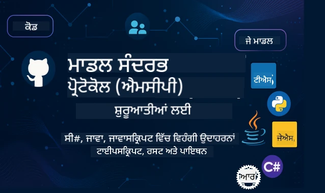

 

[](https://GitHub.com/microsoft/mcp-for-beginners/graphs/contributors)
[](https://GitHub.com/microsoft/mcp-for-beginners/issues)
[](https://GitHub.com/microsoft/mcp-for-beginners/pulls)
[](http://makeapullrequest.com)

[](https://GitHub.com/microsoft/mcp-for-beginners/watchers)
[](https://GitHub.com/microsoft/mcp-for-beginners/fork)
[](https://GitHub.com/microsoft/mcp-for-beginners/stargazers)


[](https://discord.gg/nTYy5BXMWG)

ਇਹ ਸਰੋਤਾਂ ਨੂੰ ਵਰਤਣ ਲਈ ਸ਼ੁਰੂਆਤ ਕਰਨ ਲਈ ਇਹ ਕਦਮ ਫਾਲੋ ਕਰੋ:
1. **ਰਿਪੋਜ਼ਟਰੀ ਨੂੰ ਫੋਰਕ ਕਰੋ**: ਕਲਿੱਕ ਕਰੋ [](https://GitHub.com/microsoft/mcp-for-beginners/fork)
2. **ਰਿਪੋਜ਼ਟਰੀ ਨੂੰ ਕਲੋਨ ਕਰੋ**: `git clone https://github.com/microsoft/mcp-for-beginners.git`
3. **ਸ਼ਾਮਿਲ ਹੋਵੋ** [](https://discord.gg/nTYy5BXMWG)


### 🌐 ਬਹੁ-ਭਾਸ਼ਾ ਸਹਾਇਤਾ

#### ਗਿਟਹਬ ਐਕਸ਼ਨ ਦੇ ਜ਼ਰੀਏ ਸਹਾਇਤਾਦਾਨ (ਆਟੋਮੇਟਿਕ ਅਤੇ ਹਮੇਸ਼ਾ ਅਪ-ਟੂ-ਡੇਟ)

<!-- CO-OP TRANSLATOR LANGUAGES TABLE START -->
[Arabic](../ar/README.md) | [Bengali](../bn/README.md) | [Bulgarian](../bg/README.md) | [Burmese (Myanmar)](../my/README.md) | [Chinese (Simplified)](../zh-CN/README.md) | [Chinese (Traditional, Hong Kong)](../zh-HK/README.md) | [Chinese (Traditional, Macau)](../zh-MO/README.md) | [Chinese (Traditional, Taiwan)](../zh-TW/README.md) | [Croatian](../hr/README.md) | [Czech](../cs/README.md) | [Danish](../da/README.md) | [Dutch](../nl/README.md) | [Estonian](../et/README.md) | [Finnish](../fi/README.md) | [French](../fr/README.md) | [German](../de/README.md) | [Greek](../el/README.md) | [Hebrew](../he/README.md) | [Hindi](../hi/README.md) | [Hungarian](../hu/README.md) | [Indonesian](../id/README.md) | [Italian](../it/README.md) | [Japanese](../ja/README.md) | [Kannada](../kn/README.md) | [Korean](../ko/README.md) | [Lithuanian](../lt/README.md) | [Malay](../ms/README.md) | [Malayalam](../ml/README.md) | [Marathi](../mr/README.md) | [Nepali](../ne/README.md) | [Nigerian Pidgin](../pcm/README.md) | [Norwegian](../no/README.md) | [Persian (Farsi)](../fa/README.md) | [Polish](../pl/README.md) | [Portuguese (Brazil)](../pt-BR/README.md) | [Portuguese (Portugal)](../pt-PT/README.md) | [Punjabi (Gurmukhi)](./README.md) | [Romanian](../ro/README.md) | [Russian](../ru/README.md) | [Serbian (Cyrillic)](../sr/README.md) | [Slovak](../sk/README.md) | [Slovenian](../sl/README.md) | [Spanish](../es/README.md) | [Swahili](../sw/README.md) | [Swedish](../sv/README.md) | [Tagalog (Filipino)](../tl/README.md) | [Tamil](../ta/README.md) | [Telugu](../te/README.md) | [Thai](../th/README.md) | [Turkish](../tr/README.md) | [Ukrainian](../uk/README.md) | [Urdu](../ur/README.md) | [Vietnamese](../vi/README.md)

> **ਇਸ ਨੂੰ ਲੋਕਲ ਤੌਰ 'ਤੇ ਕਲੋਨ ਕਰਨਾ ਪਸੰਦ ਕਰੋ?**

> ਇਸ ਰਿਪੋਜ਼ਟਰੀ ਵਿੱਚ 50+ ਭਾਸ਼ਾਵਾਂ ਦੇ ਅਨੁਵਾਦ ਸ਼ਾਮਿਲ ਹਨ ਜਿਸ ਨਾਲ ਡਾਊਨਲੋਡ ਸਾਈਜ਼ ਕਾਫੀ ਵਧ ਜਾਂਦਾ ਹੈ। ਬਿਨਾਂ ਅਨੁਵਾਦਾਂ ਦੇ ਕਲੋਨ ਕਰਨ ਲਈ sparse checkout ਦੀ ਵਰਤੋਂ ਕਰੋ:
> ```bash
> git clone --filter=blob:none --sparse https://github.com/microsoft/mcp-for-beginners.git
> cd mcp-for-beginners
> git sparse-checkout set --no-cone '/*' '!translations' '!translated_images'
> ```
> ਇਹ ਤੁਹਾਨੂੰ ਉਹ ਸਭ ਕੁਝ ਦਿੰਦਾ ਹੈ ਜੋ ਤੁਹਾਨੂੰ ਕੋਰਸ ਪੂਰਾ ਕਰਨ ਲਈ ਲੋੜੀਂਦਾ ਹੈ ਤੇ ਡਾਊਨਲੋਡ ਤੇਜ਼ ਹੋ ਜਾਂਦਾ ਹੈ।
<!-- CO-OP TRANSLATOR LANGUAGES TABLE END -->

# 🚀 ਮਾਡਲ ਕਾਂਟੈਕਸਟ ਪ੍ਰੋਟੋਕੋਲ (MCP) ਕਰੀਕੁਲਮ ਬਿਗਿਨਰਜ਼ ਲਈ

## **C#, ਜਾਵਾ, ਜਾਵਾਸਕ੍ਰਿਪਟ, ਰੱਸਟ, ਪਾਈਥਨ ਅਤੇ ਟਾਈਪਸਕ੍ਰਿਪਟ ਵਿੱਚ ਹੈਂਡਸ-ਆਨ ਕੋਡ ਉਦਾਹਰਨਾਂ ਨਾਲ MCP ਸਿੱਖੋ**

## 🧠 ਮਾਡਲ ਕਾਂਟੈਕਸਟ ਪ੍ਰੋਟੋਕੋਲ ਕਰੀਕੁਲਮ ਦਾ ਸਾਰਾਂਸ਼
ਮਾਡਲ ਕਾਂਟੈਕਸਟ ਪ੍ਰੋਟੋਕੋਲ ਵਿੱਚ ਤੁਹਾਡੀ ਯਾਤਰਾ ਵਿੱਚ ਤੁਹਾਡਾ ਸਵਾਗਤ ਹੈ! ਜੇ ਤੁਸੀਂ ਕਦੇ ਸੋਚਿਆ ਹੈ ਕਿ AI ਐਪਲੀਕੇਸ਼ਨ ਕਿਵੇਂ ਵੱਖ-ਵੱਖ ਟੂਲਸ ਅਤੇ ਸਰਵਿਸਜ਼ ਨਾਲ ਗੱਲ ਕਰਦੇ ਹਨ, ਤਾਂ ਤੁਸੀਂ ਹੁਣ ਉਹ ਸ਼ਾਨਦਾਰ ਸਮਾਧਾਨ ਜਾਣਣ ਵਾਲੇ ਹੋ ਜੋ ਡਿਵੈਲਪਰਾਂ ਨੂੰ ਹੁਸ਼ਿਆਰ ਸਿਸਟਮ ਬਣਾਉਣ ਵਿੱਚ ਬਦਲ ਰਹੇ ਹਨ।

MCP ਨੂੰ AI ਐਪਲੀਕੇਸ਼ਨ ਲਈ ਇੱਕ ਯੂਨੀਵਰਸਲ ਟ੍ਰਾਂਸਲੇਟਰ ਵਾਂਗ ਸਮਝੋ - ਬਿਲਕੁਲ ਉਸ ਤਰ੍ਹਾਂ ਜਿਵੇਂ USB ਪੋਰਟ ਤੁਹਾਨੂੰ ਕਿਸੇ ਵੀ ਡਿਵਾਇਸ ਨੂੰ ਆਪਣੇ ਕੰਪਿਊਟਰ ਨਾਲ ਜੁੜਨ ਦਿੰਦਾ ਹੈ, ਐਸੇ ਹੀ MCP AI ਮਾਡਲ ਨੂੰ ਕਿਸੇ ਵੀ ਟੂਲ ਜਾਂ ਸਰਵਿਸ ਨਾਲ ਸਮਾਨ ਢੰਗ ਨਾਲ ਕਨੈਕਟ ਕਰਨ ਦਿੰਦਾ ਹੈ। ਚਾਹੇ ਤੁਸੀਂ ਆਪਣਾ ਪਹਿਲਾ ਚੈਟਬੋਟ ਬਣਾ ਰਹੇ ਹੋ ਜਾਂ ਪੇਚੀਦਾ AI ਵਰਕਫਲੋਜ਼ 'ਤੇ ਕੰਮ ਕਰ ਰਹੇ ਹੋ, MCP ਨੂੰ ਸਮਝਣਾ ਤੁਹਾਨੂੰ ਹੋਰ ਸਮਰਥ ਅਤੇ ਲਚਕੀਲੇ ਐਪਲੀਕੇਸ਼ਨ ਬਣਾਉਣ ਦੀ ਸ਼ਕਤੀ ਦੇਵੇਗਾ।

ਇਹ ਕਰੀਕੁਲਮ ਤੁਹਾਡੇ ਸਿੱਖਣ ਦੀ ਯਾਤਰਾ ਲਈ ਧੀਰਜ ਅਤੇ ਧਿਆਨ ਨਾਲ ਡਿਜ਼ਾਈਨ ਕੀਤਾ ਗਿਆ ਹੈ। ਅਸੀਂ ਸਾਦੇ ਮੂਲ概念 ਜਿਹੜੇ ਤੁਸੀਂ ਪਹਿਲਾਂ ਹੀ ਸਮਝਦੇ ਹੋ ਨਾਲ ਸ਼ੁਰੂ ਕਰਾਂਗੇ ਅਤੇ ਹੌਲੀ-ਹੌਲੀ ਤੁਹਾਡੀ ਮਹਾਰਤ ਨੂੰ ਤੁਹਾਡੇ ਮਨਪਸੰਦ ਪ੍ਰੋਗ੍ਰਾਮਿੰਗ ਲੈੰਗਵੇਜ ਵਿੱਚ ਹੈਂਡਸ-ਆਨ ਅਭਿਆਸ ਰਾਹੀਂ ਵਧਾਵਾਂਗੇ। ਹਰ ਕਦਮ ਸਾਫ਼-ਸੁਥਰੇ ਵਿਆਖਿਆਵਾਂ, ਕਾਰਗਰ ਉਦਾਹਰਨਾਂ ਅਤੇ ਬਹੁਤ ਪ੍ਰੋਤਸਾਹਨ ਨਾਲ ਭਰਿਆ ਹੋਇਆ ਹੈ।

ਜਦ ਤਕ ਤੁਸੀਂ ਇਸ ਯਾਤਰਾ ਨੂੰ ਪੂਰਾ ਕਰੋਗੇ, ਤੁਹਾਡੇ ਕੋਲ ਆਪਣਾ MCP ਸਰਵਰ ਬਣਾਉਣ ਦਾ ਧਿਰਜ ਅਤੇ ਲੋਕਪ੍ਰਿਯ AI ਪਲੇਟਫਾਰਮਾਂ ਨਾਲ ਇੰਟੀਗ੍ਰੇਟ ਕਰਨ ਦੀ ਸਮਝ ਹੋਵੇਗੀ, ਅਤੇ ਸਮਝਿਆ ਜਾਵੇਗਾ ਕਿ ਇਹ ਤਕਨੀਕ ਕਿਸ ਤਰ੍ਹਾਂ AI ਵਿਕਾਸ ਦਾ ਭਵਿੱਖ ਰੂਪ ਦੇ ਰਹੀ ਹੈ। ਆਓ ਇਸ ਰੋਮਾਂਚਕ ਸਫ਼ਰ ਦੀ ਸ਼ੁਰੂਆਤ ਕਰੀਏ!

### ਅਧਿਕਾਰਕ ਡਾਕੂਮੈਂਟੇਸ਼ਨ ਅਤੇ ਵਿਸ਼ੇਸ਼ਤਾਵਾਂ

ਜਿਵੇਂ ਜਿਵੇਂ ਤੁਹਾਡੀ ਸਮਝ ਵੱਧੇਗੀ, ਇਹ ਸਰੋਤ ਹੋਰ ਮੂਲਯਵਾਨ ਬਣਨਗੇ, ਪਰ ਫੌਰਨ ਸਭ ਕੁਝ ਪੜ੍ਹਨ ਲਈ ਦਬਾਅ ਮਹਿਸੂਸ ਨਾ ਕਰੋ। ਉਹਨਾਂ ਖੇਤਰਾਂ ਤੋਂ ਸ਼ੁਰੂ ਕਰੋ ਜਿਹੜੇ ਤੁਹਾਨੂੰ ਸਭ ਤੋਂ ਵੱਧ ਜਾਣਣ ਵਿੱਚ ਰੁਚੀ ਹਨ!
- 📘 [MCP ਡਾਕੂਮੈਂਟੇਸ਼ਨ](https://modelcontextprotocol.io/) – ਇਹ ਤੁਹਾਡਾ ਸਟੈਪ-ਬਾਈ-ਸਟੈਪ ਟਿਊਟੋਰਿਯਲ ਅਤੇ ਉਪਭੋਗਤਾ ਮਾਰਗਦਰਸ਼ਕ ਹੈ। ਡਾਕੂਮੈਂਟੇਸ਼ਨ ਨਵਾਂ ਸਿੱਖਣ ਵਾਲਿਆਂ ਲਈ ਲਿਖੀ ਗਈ ਹੈ, ਜਿਸ ਵਿੱਚ ਸਾਫ਼ ਉਦਾਹਰਨਾਂ ਸ਼ਾਮਿਲ ਹਨ ਜਿਨ੍ਹਾਂ ਨੂੰ ਤੁਸੀਂ ਆਪਣੀ ਮਨਮੱਦੀ ਰਫ਼ਤਾਰ ਨਾਲ ਫਾਲੋ ਕਰ ਸਕਦੇ ਹੋ।
- 📜 [MCP ਵਿਸ਼ੇਸ਼ਤਾ](https://modelcontextprotocol.io/docs/) – ਇਸਨੂੰ ਆਪਣਾ ਵਿਸ਼ਤ੍ਰਿਤ ਰੀਫਰੈਂਸ ਮੈਨੁਅਲ ਸਮਝੋ। ਜਿਵੇਂ ਜਿਵੇਂ ਤੁਸੀਂ ਕਰੀਕੁਲਮ ਵਿੱਚ ਅੱਗੇ ਵਧਦੇ ਹੋ, ਤੁਸੀਂ ਇੱਥੇ ਖਾਸ ਵੇਰਵਿਆਂ ਦੀ ਚੰਗੀ ਤਰ੍ਹਾਂ ਜਾਂਚ ਕਰਨ ਲਈ ਵਾਪਸ ਆਓਗੇ ਅਤੇ ਉੱਚ ਤਕਨੀਕੀ ਵਿਸ਼ੇਸ਼ਤਾਵਾਂ ਨੂੰ ਵੇਖੋਗੇ।
- 📜 [ਅਸਲ MCP ਵਿਸ਼ੇਸ਼ਤਾ](https://modelcontextprotocol.io/specification/versioning) – ਇਸ ਵਿੱਚ ਵਾਧੂ ਤਕਨੀਕੀ ਵੇਰਵੇ ਹਨ ਜੋ ਉੱਚ ਪੱਧਰ ਦੀਆਂ ਅਮਲਦਾਰੀਆਂ ਲਈ ਮਦਦਗਾਰ ਹੋ ਸਕਦੇ ਹਨ। ਜਦ ਤੁਸੀਂ ਲੋੜ ਮਿਹਸੂਸ ਕਰੋ ਤਾਂ ਇਸ ਨੂੰ ਵੇਖੋ, ਪਰ ਸ਼ੁਰੂਆਤ ਵਿੱਚ ਇਸਦੀ ਚਿੰਤਾ ਨਾ ਕਰੋ।
- 🧑‍💻 [MCP ਗਿਟਹਬ ਰਿਪੋਜ਼ਟਰੀ](https://github.com/modelcontextprotocol) – ਇੱਥੇ ਤੁਹਾਨੂੰ ਕਈ ਭਾਸ਼ਾਵਾਂ ਵਿੱਚ SDKs, ਟੂਲਸ, ਅਤੇ ਕੋਡ ਉਦਾਹਰਨਾਂ ਮਿਲਦੀਆਂ ਹਨ। ਇਹ ਕਾਰਗਰ ਉਦਾਹਰਨਾਂ ਅਤੇ ਤਿਆਰ ਕੰਪੋਨੇਟਾਂ ਦਾ ਖਜ਼ਾਨਾ ਵਰਗਾ ਹੈ।
- 🌐 [MCP ਕਮਿਊਨਿਟੀ](https://github.com/orgs/modelcontextprotocol/discussions) – MCP ਬਾਰੇ ਚਰਚਾਵਾਂ ਵਿੱਚ ਹੋਰ ਸਿੱਖਣ ਵਾਲੇ ਅਤੇ ਅਨੁਭਵੀ ਡਿਵੈਲਪਰਾਂ ਨਾਲ ਜੁੜੋ। ਇਹ ਸਹਿਯੋਗੀ ਕਮਿਊਨਿਟੀ ਹੈ ਜਿੱਥੇ ਪ੍ਰਸ਼ਨ ਸਵਾਗਤ ਯੋਗ ਹਨ ਅਤੇ ਗਿਆਨ ਬੇਅੜਥਾ ਵੰਡਿਆ ਜਾਂਦਾ ਹੈ।
  
## ਸਿੱਖਣ ਵਾਲੇ ਉਦੇਸ਼

ਇਸ ਕਰੀਕੁਲਮ ਦੇ ਅਖੀਰ ਤੱਕ, ਤੁਸੀਂ ਆਪਣੀਆਂ ਨਵੀਂ ਯੋਗਤਾਵਾਂ ਬਾਰੇ ਧੀਰਜ ਅਤੇ ਉਤਸ਼ਾਹ ਮਹਿਸੂਸ ਕਰੋਗੇ। ਇਹ ਹਨ ਉਹ ਜਿਨ੍ਹਾਂ ਤੇ ਤੁਸੀਂ ਕਾਬੂ ਪਾਉਗੇ:

• **MCP ਬੁਨਿਆਦੀ ਗੱਲਾਂ ਸਮਝੋ**: ਤੁਸੀਂ ਸਮਝੋਂਗੇ ਕਿ ਮਾਡਲ ਕਾਂਟੈਕਸਟ ਪ੍ਰੋਟੋਕੋਲ ਕੀ ਹੈ ਅਤੇ ਕਿਵੇਂ ਇਹ AI ਐਪਲੀਕੇਸ਼ਨਾਂ ਨੂੰ ਇੰਨੀ ਆਸਾਨੀ ਨਾਲ ਕੰਮ ਕਰਨ ਵਿੱਚ ਬਦਲ ਰਹੀ ਹੈ, ਉਦਾਹਰਨਾਂ ਅਤੇ ਸਮਝਦਾਰ ਬਾਤਾਂ ਨਾਲ।

• **ਆਪਣਾ ਪਹਿਲਾ MCP ਸਰਵਰ ਬਣਾਓ**: ਤੁਸੀਂ ਆਪਣੀ ਮਨਪਸੰਦ ਪ੍ਰੋਗ੍ਰਾਮਿੰਗ ਭਾਸ਼ਾ ਚੋਣ ਕਰਕੇ ਪਹਿਲਾ MCP ਸਰਵਰ ਬਣਾਉਗੇ, ਸ਼ੁਰੂਆਤੀ ਸਾਦੇ ਉਦਾਹਰਨਾਂ ਨਾਲ ਅਤੇ ਹੌਲੀ ਹੌਲੀ ਆਪਣੀ ਮਹਾਰਤ ਵਧੋਂਗੇ।

• **AI ਮਾਡਲਾਂ ਨੂੰ ਅਸਲੀ ਟੂਲਜ਼ ਨਾਲ ਜੋੜੋ**: ਤੁਸੀਂ ਸਿੱਖੋਂਗੇ ਕਿ AI ਮਾਡਲਾਂ ਅਤੇ ਹਕੀਕਤੀ ਸਰਵਿਸਾਂ ਦੇ ਵਿਚਕਾਰ ਸੇतु ਬਣਾਉਣਾ ਕਿਵੇਂ ਹੈ, ਆਪਣੀਆਂ ਐਪਲੀਕੇਸ਼ਨਾਂ ਨੂੰ ਨਵੀਆਂ ਤਾਕਤਵਰ ਸਮਰੱਥਾਵਾਂ ਦੇਣਾ।

• **ਸੁਰੱਖਿਆ ਦੀਆਂ ਸਭ ਤੋਂ ਵਧੀਆਆਂ ਪ੍ਰਥਾਵਾਂ ਲਾਗੂ ਕਰੋ**: MCP ਅਮਲਾਂ ਨੂੰ ਸੁਰੱਖਿਅਤ ਰੱਖਣ ਲਈ ਯੋਗਤਾ ਹਾਸਲ ਕਰੋ, ਆਪਣੇ ਐਪਲੀਕੇਸ਼ਨਾਂ ਤੇ ਉਪਭੋਗਤਿਆਂ ਦੋਹਾਂ ਦੀ ਸੁਰੱਖਿਆ ਕਰੋ।

• **ਆਤਮ ਵਿਸ਼ਵਾਸ ਨਾਲ ਡਿਪਲ.deploy ਕਰੋ**: ਵਿਕਾਸ ਤੋਂ ਉਤਪਾਦਨ ਤੱਕ MCP ਪਰੋਜੈਕਟ ਲੈ ਜਾਣ ਦੀ ਸਮਰੱਥਾ ਹਾਸਲ ਕਰੋ, ਅਸਲ ਦੁਨੀਆਂ ਵਿੱਚ ਕੰਮ ਕਰਨ ਵਾਲੀਆਂ ਪ੍ਰਯੋਗਤਮਕ ਰਣਨੀਤੀਆਂ ਨਾਲ।

• **MCP ਕਮਿਊਨਿਟੀ ਨਾਲ ਜੁੜੋ**: ਤੁਸੀਂ ਉਹਨਾਂ ਡਿਵੈਲਪਰਾਂ ਦੀ ਵਧ ਰਹੀ ਕਮਿਊਨਿਟੀ ਦਾ ਹਿੱਸਾ ਬਣ ਜਾਵੋਗੇ ਜੋ AI ਐਪਲੀਕੇਸ਼ਨ ਵਿਕਾਸ ਦਾ ਭਵਿੱਖ ਬਣਾ ਰਹੇ ਹਨ।

## ਜਰੂਰੀ ਮੂਲ ਤੱਥ

MCP ਦੀਆਂ ਵਿਸ਼ੇਸ਼ਤਾਵਾਂ ਵਿੱਚ ਡੁਬਕੀ ਲੱਗਾਉਣ ਤੋਂ ਪਹਿਲਾਂ, ਆਓ ਇਹ ਯਕੀਨੀ ਬਣਾਈਏ ਕਿ ਤੁਸੀਂ ਕੁਝ ਆਧਾਰਭੂਤ ਤੱਤਾਂ ਨਾਲ ਆਰਾਮਦਾਇਕ ਮਹਿਸੂਸ ਕਰਦੇ ਹੋ। ਜੇ ਤੁਸੀਂ ਇਨ੍ਹਾਂ ਖੇਤਰਾਂ ਵਿੱਚ ਮਾਹਰ ਨਹੀਂ ਹੋ ਤਾਂ ਕੋਈ ਗੱਲ ਨਹੀਂ - ਅਸੀਂ ਸਾਰੀ ਜ਼ਰੂਰੀ ਜਾਣਕਾਰੀ ਸਪਸ਼ਟ ਕਰਾਂਗੇ!

### ਪ੍ਰੋਟੋਕੋਲ ਸਮਝਣਾ (ਨੀਂਹ)

ਪ੍ਰੋਟੋਕੋਲ ਨੂੰ ਇੱਕ ਗੱਲਬਾਤ ਦੇ ਨਿਯਮਾਂ ਵਾਂਗ ਸੋਚੋ। ਜਦੋਂ ਤੁਸੀਂ ਆਪਣੇ ਦੋਸਤ ਨੂੰ ਕਾਲ ਕਰਦੇ ਹੋ, ਤਾਂ ਦੋਹਾਂ ਜਾਣਦੇ ਹੋ ਕਿ ਜਵਾਬ 'ਹੈਲੋ' ਦੇਣਾ ਹੈ, ਵਾਰੀ-ਵਾਰੀ ਗੱਲ ਕਰਨੀ ਹੈ ਅਤੇ ਅੰਤ 'ਗੁਡਬਾਈ' ਕਹਿਣਾ ਹੈ। ਕੰਪਿਊਟਰ ਕਾਰਜਕ੍ਰਮਾਂ ਨੂੰ ਵੀ ਗੱਲਬਾਤ ਲਈ ਇਨ੍ਹਾਂ ਜਿਹੇ ਨਿਯਮ ਚਾਹੀਦੇ ਹਨ।

MCP ਇੱਕ ਪ੍ਰੋਟੋਕੋਲ ਹੈ – ਨਿਯਮਾਂ ਦਾ ਇੱਕ ਸੈੱਟ ਜੋ AI ਮਾਡਲਾਂ ਅਤੇ ਐਪਲੀਕੇਸ਼ਨਾਂ ਨੂੰ ਟੂਲਾਂ ਅਤੇ ਸਰਵਿਸਾਂ ਨਾਲ ਮੁਲਾਕਾਤ ਕਰਨ ਲਈ ਮਦਦ ਕਰਦਾ ਹੈ। ਬਿਲਕੁਲ ਉਸ ਤਰ੍ਹਾਂ ਜਿਵੇਂ ਗੱਲਬਾਤ ਦੇ ਨਿਯਮ ਮਨੁੱਖੀ ਸੰਚਾਰ ਨੂੰ ਆਸਾਨ ਬਣਾਉਂਦੇ ਹਨ, MCP AI ਐਪਲੀਕੇਸ਼ਨਾਂ ਦੀ ਸੰਚਾਰਨਾ ਨੂੰ ਜ਼ਿਆਦਾ ਭਰੋਸੇਯੋਗ ਅਤੇ ਸ਼ਕਤੀਸ਼ালী ਬਣਾਉਂਦਾ ਹੈ।

### ਕਲਾਇੰਟ-ਸਰਵਰ ਸੰਬੰਧ (ਪਰੋਗਰਾਮ ਇੱਕਠੇ ਕੰਮ ਕਰਨਾ)

ਤੁਸੀਂ ਹਰ ਰੋਜ਼ ਕਲਾਇੰਟ-ਸਰਵਰ ਸੰਬੰਧ ਵਰਤ ਰਹੇ ਹੋ! ਜਦੋਂ ਤੁਸੀਂ ਵੈੱਬ ਬ੍ਰਾਊਜ਼ਰ (ਕਲਾਇੰਟ) ਨਾਲ ਕੋਈ ਵੈੱਬਸਾਈਟ ਖੋਲ੍ਹਦੇ ਹੋ, ਤਾਂ ਤੁਹਾਡਾ ਬ੍ਰਾਊਜ਼ਰ ਵੈੱਬ ਸਰਵਰ ਨਾਲ ਜੁੜਦਾ ਹੈ ਜੋ ਤੁਹਾਨੂੰ ਪੰਨਾ ਭੇਜਦਾ ਹੈ। ਬ੍ਰਾਊਜ਼ਰ ਜਾਣਦਾ ਹੈ ਕਿ ਇੰਫਰਮੇਸ਼ਨ ਕਿਵੇਂ ਮੰਗਣੀ ਹੈ ਅਤੇ ਸਰਵਰ ਜਾਣਦਾ ਹੈ ਕਿ ਕਿਵੇਂ ਜਵਾਬ ਦੇਣਾ ਹੈ।

MCP ਵਿੱਚ ਵੀ ਇਸੇ ਤਰ੍ਹਾਂ ਸੰਬੰਧ ਹੈ: AI ਮਾਡਲ ਕਲਾਇੰਟ ਵਾਂਗ ਹਨ ਜੋ ਜਾਣਕਾਰੀ ਜਾਂ ਕਾਰਵਾਈ ਮੰਗਦੇ ਹਨ, ਅਤੇ MCP ਸਰਵਰ ਉਹ ਸਮਰੱਥਾਵਾਂ ਪ੍ਰਦਾਨ ਕਰਦਾ ਹੈ। ਇਹ ਇੱਕ ਮਦਦਗਾਰ ਸਹਾਇਕ ਵਾਂਗ ਹੈ (ਸਰਵਰ) ਜਿਸਦੇ ਕੋਲ AI ਵੱਲੋਂ ਖਾਸ ਕਾਰਜ ਕਰਨ ਲਈ ਆਗਿਆ ਮੰਗੀ ਜਾ ਸਕਦੀ ਹੈ।

### ਸਟੈਂਡਰਡਾਈਜੇਸ਼ਨ ਦੀ ਮਹੱਤਤਾ (ਚੀਜ਼ਾਂ ਨੂੰ ਇਕੱਠੇ ਕੰਮ ਕਰਨ ਯੋਗ ਬਣਾਉਣਾ)

ਸੋਚੋ ਜੇ ਹਰ ਕਾਰ ਨਿਰਮਾਤਾ ਵੱਖਰੇ ਆਕਾਰ ਦੇ ਗੈਸ ਪੰਪ ਵਰਤੇ, ਤਾਂ ਤੁਹਾਨੂੰ ਹਰ ਕਾਰ ਲਈ ਵੱਖਰਾ ਐਡਾਪਟਰ ਚਾਹੀਦਾ ਹੋਵੇਗਾ! ਸਟੈਂਡਰਡਾਈਜੇਸ਼ਨ ਦਾ ਮਤਲਬ ਸਾਂਝੇ ਢੰਗਾਂ 'ਤੇ ਸਹਿਮਤੀ ਹੈ ਤਾਂ ਕਿ ਚੀਜ਼ਾਂ ਬਿਨਾਂ ਰੁਕਾਵਟ ਕੰਮ ਕਰਨ।

MCP AI ਐਪਲੀਕੇਸ਼ਨਾਂ ਲਈ ਇਹ ਸਟੈਂਡਰਡਾਈਜ਼ਡ ਤਰੀਕਾ ਦਿੰਦਾ ਹੈ। ਹਰ AI ਮਾਡਲ ਨੂੰ ਹਰ ਟੂਲ ਨਾਲ ਕੰਮ ਕਰਨ ਲਈ ਵਿਅਕਤਿਗਤ ਕੋਡ ਦੀ ਲੋੜ ਨਹੀ ਰਹਿੰਦੀ; MCP ਇੱਕ ਏਸਾ ਯੂਨੀਵਰਸਲ ਤਰੀਕਾ ਬਣਾਉਂਦਾ ਹੈ। ਇਸਦਾ ਮਤਲਬ ਹੈ ਕਿ ਡਿਵੈਲਪਰ ਟੂਲਜ਼ ਇਕ ਵਾਰ ਬਣਾ ਕੇ ਕਈ ਵੱਖਰੇ AI ਸਿਸਟਮਾਂ ਨਾਲ ਕੰਮ ਕਰ ਸਕਦੇ ਹਨ।

## 🧭 ਤੁਹਾਡਾ ਸਿੱਖਣ ਜਾਤਰਾ ਸਰਵੇਖਣ

ਤੁਹਾਡੀ MCP ਯਾਤਰਾ ਧੀਰਜ ਨਾਲ ਤੇ ਹੌਲੀ-ਹੌਲੀ ਤੁਹਾਡੇ ਧਿਰਜ ਅਤੇ ਹੋਨਰਤ ਨੂੰ ਵਧਾਉਂਦੇ ਹੋਏ ਬਣਾਈ ਗਈ ਹੈ। ਹਰ ਸਟੇਜ ਨਵੇਂ概念 ਪਰਚਾਰ ਕਰਦਾ ਹੈ ਅਤੇ ਪਹਿਲਾਂ ਸਿੱਖੇ ਗਏ ਪਾਠਾਂ ਨੂੰ ਦੁਰਸਤ ਕਰਦਾ ਹੈ।

### 🌱 ਨੀਂਹ ਦਾ ਪਹਰਾਵਾ: ਬੁਨਿਆਦੀ ਗੱਲਾਂ ਸਮਝਣਾ (ਮੋਡੀਊਲ 0-2)

ਇੱਥੇ ਤੁਹਾਡੀ ਮੁਹਿੰਮ ਸ਼ੁਰੂ ਹੁੰਦੀ ਹੈ! ਅਸੀਂ MCP概念 ਨੂੰ ਜਾਣਪਛਾਣ ਨਾਲ ਭਰਪੂਰ ਉਦਾਹਰਨਾਂ ਨਾਲ ਜਾਣੂ ਕਰਵਾਂਗੇ। ਤੁਸੀਂ ਜਾਣੋਗੇ ਕਿ MCP ਕੀ ਹੈ, ਇਹ ਕਿਉਂ ਬਣਾਇਆ ਗਿਆ ਹੈ ਅਤੇ ਇਹ AI ਵਿਕਾਸ ਦੀ ਵੱਡੀ ਦੁਨੀਆ ਵਿੱਚ ਕਿਵੇਂ ਫਿੱਟ ਹੁੰਦਾ ਹੈ।

• **ਮੋਡੀਊਲ 0 - MCP ਦਾ ਪਰਿਚਯ**: ਅਸੀਂ ਇਹ ਜਾਣੌਗੇ ਕਿ MCP ਕੀ ਹੈ ਅਤੇ ਇਹ ਮਾਡਰਨ AI ਐਪਲੀਕੇਸ਼ਨਾਂ ਲਈ ਕਿਵੇਂ ਮਹੱਤਵਪੂਰਨ ਹੈ। ਤੁਸੀਂ MCP ਦੇ ਅਸਲੀ ਦਿਨਚਰਿਆ ਦੇ ਉਦਾਹਰਨ ਵੇਖੋਗੇ ਅਤੇ ਸਮਝੋਂਗੇ ਕਿ ਇਹ ਡਿਵੈਲਪਰਾਂ ਸਾਹਮਣੇ ਆਉਣ ਵਾਲੀਆਂ ਆਮ ਸਮੱਸਿਆਵਾਂ ਨੂੰ ਕਿਵੇਂ ਹੱਲ ਕਰਦਾ ਹੈ।

• **ਮੋਡੀਊਲ 1 - ਮੁੱਖ概念 ਦੀ ਵਿਆਖਿਆ**: ਇੱਥੇ ਤੁਸੀਂ MCP ਦੇ ਅਹੰਕਾਰਕ ਤੱਤਾਂ ਨੂੰ ਸਿੱਖੋਂਗੇ। ਅਸੀਂ ਬਹੁਤ ਸਾਰੀਆਂ ਸਮਝ ਲੱਗਣ ਵਾਲੀਆਂ ਬਾਤਾਂ ਅਤੇ ਦ੍ਰਿਸ਼ਕ ਅਦਾਂਸ਼ਾਂ ਦੀ ਵਰਤੋਂ ਕਰਾਂਗੇ ਤਾਂ ਜੋ ਇਹ概念 ਕੁਦਰਤੀ ਅਤੇ ਸਮਝਣਯੋਗ ਹੋਣ।

• **ਮੋਡੀਊਲ 2 - MCP ਵਿੱਚ ਸੁਰੱਖਿਆ**: ਸੁਰੱਖਿਆ ਥੋੜ੍ਹੀ ਡਰਾਉਣੀ ਲੱਗ ਸਕਦੀ ਹੈ, ਪਰ ਅਸੀਂ ਦਿਖਾਵਾਂਗੇ ਕਿ MCP ਵਿੱਚ ਕਿਵੇਂ ਇਨਬਿਲਟ ਸੇਫਟੀ ਫੀਚਰ ਹਨ ਅਤੇ ਤੁਹਾਨੂੰ ਬਿਹਤਰ ਪ੍ਰਥਾਵਾਂ ਸਿਖਾਵਾਂਗੇ ਜੋ ਸ਼ੁਰੂ ਤੋਂ ਤੁਹਾਡੇ ਐਪਲੀਕੇਸ਼ਨਾਂ ਦੀ ਸੁਰੱਖਿਆ ਕਰਦੀਆਂ ਹਨ।

### 🔨 ਬਣਾਉਣ ਦਾ ਪਹਿਰਾਵਾ: ਆਪਣੀਆਂ ਪਹਿਲੀਆਂ ਅਮਲਦਾਰੀਆਂ ਬਣਾਉਣਾ (ਮੋਡੀਊਲ 3)

ਹੁਣ ਅਸਲ ਮਜ਼ਾ ਸ਼ੁਰੂ ਹੁੰਦਾ ਹੈ! ਤੁਸੀਂ MCP ਸਰਵਰ ਅਤੇ ਕਲਾਇੰਟ ਬਣਾਉਣ ਵਿੱਚ ਰਿਹਰਸਲ ਕਰੋਂਗੇ। ਚਿੰਤਾ ਨਾ ਕਰੋ - ਅਸੀਂ ਸਧਾਰਨ ਤਰੀਕੇ ਨਾਲ ਸ਼ੁਰੂ ਕਰਾਂਗੇ ਅਤੇ ਹਰ ਕਦਮ ਤੁਹਾਡੀ ਮਦਦ ਕਰਾਂਗੇ।

ਇਸ ਮੋਡੀਊਲ ਵਿੱਚ ਕਈ ਹੈਂਡਸ-ਆਨ ਗਾਈਡਜ਼ ਹਨ ਜੋ ਤੁਹਾਨੂੰ ਆਪਣੇ ਮਨਪਸੰਦ ਪ੍ਰੋਗ੍ਰਾਮਿੰਗ ਭਾਸ਼ਾ ਵਿੱਚ ਅਭਿਆਸ ਕਰਨ ਦਿੰਦੇ ਹਨ। ਤੁਸੀਂ ਆਪਣਾ ਪਹਿਲਾ ਸਰਵਰ ਬਣਾਵੋਗੇ, ਇਸ ਨਾਲ ਕਲਾਇੰਟ ਕਨੈਕਟ ਕਰੋਗੇ, ਅਤੇ ਲੋਕਪ੍ਰਿਯ ਵਿਕਾਸ ਟੂਲਜ਼ ਜਿਵੇਂ VS ਕੋਡ ਨਾਲ ਇੰਟੀਗ੍ਰੇਸ਼ਨ ਕਰਨਾ ਵੀ ਸਿੱਖੋਂਗੇ।
ਹਰ ਇਕ ਗਾਈਡ ਵਿੱਚ ਪੂਰੇ ਕੋਡ ਉਦਾਹਰਨਾਂ, ਸਮੱਸਿਆ ਤੇ ਕਿਵੇਂ ਮੁਕਾਬਲਾ ਕਰਨਾ ਹੈ, ਅਤੇ ਇਹ ਵੀ ਸਮਝਾਇਆ ਗਿਆ ਹੈ ਕਿ ਅਸੀਂ ਵਿਸ਼ੇਸ਼ ਡਿਜ਼ਾਇਨ ਚੋਣਾਂ ਕਿਉਂ ਕਰਦੇ ਹਾਂ। ਇਸ ਚਰਣ ਦੇ ਅੰਤ ਤੱਕ, ਤੁਹਾਡੇ ਕੋਲ ਐਸੇ MCP ਲਾਗੂਕਰਨ ਹੋਣਗੇ ਜਿਨ੍ਹਾਂ 'ਤੇ ਤੁਸੀਂ ਮਾਣ ਕਰ ਸਕਦੇ ਹੋ!

### 🚀 ਵਿਕਾਸ ਚਰਣ: ਉੱਚ ਪੱਧਰੀ ਧਾਰਨਾ ਅਤੇ ਹਕੀਕਤੀ ਜਗਤ ਵਿੱਚ ਲਾਗੂਕਰਨ (ਮੌਡੀਊਲ 4-5)

ਬੁਨਿਆਦੀ ਸਿੱਖਣ ਤੋਂ ਬਾਅਦ, ਤੁਸੀਂ ਹੋਰ ਸੁਧਰੇ ਹੋਏ MCP ਫੀਚਰਾਂ ਨੂੰ ਖੋਜਣ ਲਈ ਤਿਆਰ ਹੋ। ਅਸੀਂ ਪ੍ਰਯੋਗਿਕ ਲਾਗੂਕਰਨ ਦੀਆਂ ਯੁਕਤੀਆਂ, ਡੀਬੱਗਿੰਗ ਤਕਨੀਕਾਂ, ਅਤੇ ਉੱਚ ਪੱਧਰੀ ਵਿਸ਼ਿਆਂ ਜਿਵੇਂ ਕਿ ਬਹੁ-ਮੋਡਲ AI ਇੰਟੀਗ੍ਰੇਸ਼ਨ ਨੂੰ ਸਮਝਾਂਗੇ।

ਤੁਸੀਂ ਇਹ ਵੀ ਸਿੱਖੋਗੇ ਕਿ ਆਪਣੀਆਂ MCP ਲਾਗੂਕਰਨਾਂ ਨੂੰ ਉਤਪਾਦਨ ਲਈ ਕਿਵੇਂ ਵਧਾਇਆ ਜਾ ਸਕਦਾ ਹੈ ਅਤੇ Azure ਵਰਗੇ ਕਲਾਉਡ ਪਲੇਟਫਾਰਮਾਂ ਨਾਲ ਕਿਵੇਂ ਇਕੱਠਾ ਕੀਤਾ ਜਾ ਸਕਦਾ ਹੈ। ਇਹ ਮੌਡੀਊਲ ਤੁਹਾਨੂੰ ਐਸੀਆਂ MCP ਸਮਾਧਾਨ ਬਣਾਉਣ ਲਈ ਤਿਆਰ ਕਰਦੇ ਹਨ ਜੋ ਹਕੀਕਤੀ ਜਗਤ ਦੀਆਂ ਜ਼ਰੂਰਤਾਂ ਨੂੰ ਸਮਭਾਲ ਸਕਦੇ ਹਨ।

### 🌟 ਪ੍ਰਾਵੀਣਤਾ ਚਰਣ: ਕਮਿਊਨਿਟੀ ਅਤੇ ਵਿਸ਼ੇਸ਼ਗੀ (ਮੌਡੀਊਲ 6-11)

ਆਖਰੀ ਚਰਣ MCP ਕਮਿਊਨਿਟੀ ਵਿੱਚ ਸ਼ਾਮਿਲ ਹੋਣ ਤੇ ਆਪਣੇ ਮਨਪਸੰਦ ਖੇਤਰਾਂ ਵਿੱਚ ਵਿਸ਼ੇਸ਼ਗੀ ਪ੍ਰਾਪਤ ਕਰਨ ਤੇ ਧਿਆਨ ਕੇਂਦਰਿਤ ਕਰਦਾ ਹੈ। ਤੁਸੀਂ ਸਿੱਖੋਗੇ ਕਿ ਓਪਨ-ਸੋਰਸ MCP ਪ੍ਰੋਜੈਕਟਾਂ ਵਿੱਚ ਕਿਵੇਂ ਯੋਗਦਾਨ ਪਾਇਆ ਜਾਵੇ, ਉੱਚ ਪੱਧਰੀ ਪ੍ਰਮਾਣਿਕਤਾ ਦੇ ਰੂਪਾਂ ਨੂੰ ਲਾਗੂ ਕਰੋ ਅਤੇ ਅਜੇਹੀਆਂ ਪੁਰੀ ਤਰ੍ਹਾਂ ਡਾਟਾਬੇਸ-ਇੰਟੀਗ੍ਰੇਟਡ ਸਮਾਧਾਨ ਬਣਾਉ।

ਮੌਡੀਊਲ 11 ਨੂੰ ਖ਼ਾਸ ਤੌਰ 'ਤੇ ਯਾਦ ਕੀਤਾ ਜਾਣਾ ਚਾਹੀਦਾ ਹੈ - ਇਹ ਇੱਕ ਪੂਰਾ 13-ਲੈਬ ਹੱਥੋਂ-ਹੱਥ ਸਿੱਖਣ ਵਾਲਾ ਰਸਤਾ ਹੈ ਜੋ ਤੁਹਾਨੂੰ PostgreSQL ਇੰਟੀਗ੍ਰੇਸ਼ਨ ਨਾਲ ਉਤਪਾਦਨ ਲਈ ਤਿਆਰ MCP ਸਰਵਰ ਬਣਾਉਣਾ ਸਿਖਾਉਂਦਾ ਹੈ। ਇਹ ਇਕ ਤਿਖੀ ਯੋਜਨਾ ਹੈ ਜੋ ਤੁਸੀਂ ਸਿੱਖਿਆ ਸਭ ਨੂੰ ਇਕੱਠਾ ਕਰਦੀ ਹੈ!

### 📚 ਪੂਰੀ ਪਾਠਕ੍ਰਮ ਸੰਰਚਨਾ

| ਮੌਡੀਊਲ | ਵਿਸ਼ਾ | ਵੇਰਵਾ | ਲਿੰਕ |
|--------|-------|-------------|------|
| **ਮੌਡੀਊਲ 1-3: ਬੁਨਿਆਦੀਆਂ** | | | |
| 00 | MCP ਦਾ ਪਰਿਚਯ | ਮਾਡਲ ਕਾਂਟੈਕਸਟ ਪ੍ਰੌਟੋਕੋਲ ਦਾ ਸਾਰ ਅਤੇ ਇਸ ਦੀ AI ਪਾਈਪਲਾਈਨਾਂ ਵਿੱਚ ਮਹੱਤਤਾ | [ਵਧੇਰੇ ਪੜ੍ਹੋ](./00-Introduction/README.md) |
| 01 | ਮੁੱਖ ਧਾਰਨਾਵਾਂ ਦੀ ਵਿਆਖਿਆ | MCP ਦੀਆਂ ਮੁੱਖ ਧਾਰਨਾਵਾਂ ਦਾ ਗਹਿਰਾਈ ਨਾਲ ਅਧਿਆਨ | [ਵਧੇਰੇ ਪੜ੍ਹੋ](./01-CoreConcepts/README.md) |
| 02 | MCP ਵਿੱਚ ਸੁਰੱਖਿਆ | ਸੁਰੱਖਿਆ ਖ਼ਤਰਿਆਂ ਅਤੇ ਸਰਵੋਤਮ ਅਭਿਆਸਾਂ ਬਾਰੇ | [ਵਧੇਰੇ ਪੜ੍ਹੋ](./02-Security/README.md) |
| 03 | MCP ਨਾਲ ਸ਼ੁਰੂਆਤ ਕਰਨਾ | ਵਾਤਾਵਰਨ ਸੈਟਅੱਪ, ਬੁਨਿਆਦੀ ਸਰਵਰ/ਕਲਾਇੰਟ, ਇੰਟੀਗ੍ਰੇਸ਼ਨ | [ਵਧੇਰੇ ਪੜ੍ਹੋ](./03-GettingStarted/README.md) |
| **ਮੌਡੀਊਲ 3: ਆਪਣਾ ਪਹਿਲਾ ਸਰਵਰ ਅਤੇ ਕਲਾਇੰਟ ਬਣਾਉਣਾ** | | | |
| 3.1 | ਪਹਿਲਾ ਸਰਵਰ | ਆਪਣਾ ਪਹਿਲਾ MCP ਸਰਵਰ ਬਣਾਓ | [ਗਾਈਡ](./03-GettingStarted/01-first-server/README.md) |
| 3.2 | ਪਹਿਲਾ ਕਲਾਇੰਟ | ਇਕ ਬੁਨਿਆਦੀ MCP ਕਲਾਇੰਟ ਵਿਕਸਿਤ ਕਰੋ | [ਗਾਈਡ](./03-GettingStarted/02-client/README.md) |
| 3.3 | LLM ਨਾਲ ਕਲਾਇੰਟ | ਵੱਡੇ ਭਾਸ਼ਾਈ ਮਾਡਲਾਂ ਨੂੰ ਜੋੜੋ | [ਗਾਈਡ](./03-GettingStarted/03-llm-client/README.md) |
| 3.4 | VS ਕੋਡ ਇੰਟੀਗ੍ਰੇਸ਼ਨ | VS ਕੋਡ ਵਿੱਚ MCP ਸਰਵਰਾਂ ਦੀ ਵਰਤੋਂ | [ਗਾਈਡ](./03-GettingStarted/04-vscode/README.md) |
| 3.5 | stdio ਸਰਵਰ | stdio ਟਰਾਂਸਪੋਰਟ ਦੀ ਵਰਤੋਂ ਕਰਕੇ ਸਰਵਰ ਬਣਾਉ | [ਗਾਈਡ](./03-GettingStarted/05-stdio-server/README.md) |
| 3.6 | HTTP ਸਟ੍ਰੀਮਿੰਗ | MCP ਵਿੱਚ HTTP ਸਟ੍ਰੀਮਿੰਗ ਲਾਗੂ ਕਰੋ | [ਗਾਈਡ](./03-GettingStarted/06-http-streaming/README.md) |
| 3.7 | AI ਟੂਲਕਿਟ | MCP ਨਾਲ AI ਟੂਲਕਿਟ ਦੀ ਵਰਤੋਂ ਕਰੋ | [ਗਾਈਡ](./03-GettingStarted/07-aitk/README.md) |
| 3.8 | ਟੈਸਟਿੰਗ | ਆਪਣੀ MCP ਸਰਵਰ ਲਾਗੂਕਰਨ ਦੀ ਟੈਸਟਿੰਗ ਕਰੋ | [ਗਾਈਡ](./03-GettingStarted/08-testing/README.md) |
| 3.9 | ਡਿਪਲੌਇਮੈਂਟ | MCP ਸਰਵਰਾਂ ਨੂੰ ਉਤਪਾਦਨ ਲਈ ਡਿਪਲੌਇ ਕਰੋ | [ਗਾਈਡ](./03-GettingStarted/09-deployment/README.md) |
| 3.10 | ਅਡਵਾਂਸਡ ਸਰਵਰ ਵਰਤੋਂ | ਉੱਚ ਫੀਚਰ ਵਰਤੋਂ ਅਤੇ ਬਿਹਤਰ ਆਰਕੀਟੈਕਚਰ ਲਈ ਅਡਵਾਂਸਡ ਸਰਵਰ ਦੀ ਵਰਤੋਂ | [ਗਾਈਡ](./03-GettingStarted/10-advanced/README.md) |
| 3.11 | ਸਾਦਾ ਪ੍ਰਮਾਣਿਕਤਾ | ਸ਼ੁਰੂਆਤ ਤੋਂ ਪ੍ਰਮਾਣਿਕਤਾ ਅਤੇ RBAC ਦਿਖਾਉਣ ਵਾਲਾ ਅਧਿਆਇ | [ਗਾਈਡ](./03-GettingStarted/11-simple-auth/README.md) |
| **ਮੌਡੀਊਲ 4-5: ਪ੍ਰਯੋਗਿਕ ਅਤੇ ਉੱਚ ਪੱਧਰੀ** | | | |
| 04 | ਪ੍ਰਯੋਗਿਕ ਲਾਗੂਕਰਨ | SDK, ਡੀਬੱਗਿੰਗ, ਟੈਸਟਿੰਗ, ਦੁਬਾਰਾ ਵਰਤਣ ਯੋਗ ਪ੍ਰਾਂਪਟ ਟੈਂਪਲੇਟ | [ਵਧੇਰੇ ਪੜ੍ਹੋ](./04-PracticalImplementation/README.md) |
| 05 | MCP ਵਿੱਚ ਉੱਚ ਪੱਧਰੀ ਵਿਸ਼ੇ | ਬਹੁ-ਮੋਡਲ AI, ਸਕੇਲਿੰਗ, ਉੱਦਮੀ ਵਰਤੋਂ | [ਵਧੇਰੇ ਪੜ੍ਹੋ](./05-AdvancedTopics/README.md) |
| 5.1 | Azure ਇੰਟੀਗ੍ਰੇਸ਼ਨ | MCP ਦਾ Azure ਨਾਲ ਇੰਟੀਗ੍ਰੇਸ਼ਨ | [ਗਾਈਡ](./05-AdvancedTopics/mcp-integration/README.md) |
| 5.2 | ਬਹੁ-ਮੋਡਲਿਟੀ | ਕਈ ਮੋਡਾਲਿਟੀ ਨਾਲ ਕੰਮ ਕਰਨਾ | [ਗਾਈਡ](./05-AdvancedTopics/mcp-multi-modality/README.md) |
| 5.3 | OAuth2 ਡੈਮੋ | OAuth2 ਪ੍ਰਮਾਣਿਕਤਾ ਲਾਗੂ ਕਰੋ | [ਗਾਈਡ](./05-AdvancedTopics/mcp-oauth2-demo/README.md) |
| 5.4 | ਰੂਟ ਕਾਂਟੈਕਸਟ | ਰੂਟ ਕਾਂਟੈਕਸਟ ਸਮਝੋ ਅਤੇ ਲਾਗੂ ਕਰੋ | [ਗਾਈਡ](./05-AdvancedTopics/mcp-root-contexts/README.md) |
| 5.5 | ਰਾਉਟਿੰਗ | MCP ਰਾਉਟਿੰਗ ਦੀਆਂ ਯੁਕਤੀਆਂ | [ਗਾਈਡ](./05-AdvancedTopics/mcp-routing/README.md) |
| 5.6 | ਸੈਮਪਲਿੰਗ | MCP ਵਿੱਚ ਸੈਮਪਲਿੰਗ ਤਕਨੀਕਾਂ | [ਗਾਈਡ](./05-AdvancedTopics/mcp-sampling/README.md) |
| 5.7 | ਸਕੇਲਿੰਗ | MCP ਲਾਗੂਕਰਨ ਨੂੰ ਵਧਾਓ | [ਗਾਈਡ](./05-AdvancedTopics/mcp-scaling/README.md) |
| 5.8 | ਸੁਰੱਖਿਆ | ਉੱਚ ਪੱਧਰੀ ਸੁਰੱਖਿਆ ਵਿਚਾਰ | [ਗਾਈਡ](./05-AdvancedTopics/mcp-security/README.md) |
| 5.9 | ਵੈੱਬ ਖੋਜ | ਵੈੱਬ ਖੋਜ ਸਮਰੱਥਾਵਾਂ ਲਾਗੂ ਕਰੋ | [ਗਾਈਡ](./05-AdvancedTopics/web-search-mcp/README.md) |
| 5.10 | ਅਸਲੀ ਸਮੇਂ ਸਟ੍ਰੀਮਿੰਗ | ਅਸਲੀ ਸਮੇਂ ਸਟ੍ਰੀਮਿੰਗ ਫੰਕਸ਼ਨਾਲਿਟੀ ਬਣਾਓ | [ਗਾਈਡ](./05-AdvancedTopics/mcp-realtimestreaming/README.md) |
| 5.11 | ਅਸਲੀ ਸਮੇਂ ਖੋਜ | ਅਸਲੀ ਸਮੇਂ ਖੋਜ ਲਾਗੂ ਕਰੋ | [ਗਾਈਡ](./05-AdvancedTopics/mcp-realtimesearch/README.md) |
| 5.12 | Entra ID ਪ੍ਰਮਾਣਿਕਤਾ | Microsoft Entra ID ਨਾਲ ਪ੍ਰਮਾਣਿਕਤਾ | [ਗਾਈਡ](./05-AdvancedTopics/mcp-security-entra/README.md) |
| 5.13 | Foundry ਇੰਟੀਗ੍ਰੇਸ਼ਨ | Azure AI Foundry ਨਾਲ ਇੰਟੀਗ੍ਰੇਸ਼ਨ | [ਗਾਈਡ](./05-AdvancedTopics/mcp-foundry-agent-integration/README.md) |
| 5.14 | ਕਾਂਟੈਕਸਟ ਇੰਜੀਨੀਅਰਿੰਗ | ਪ੍ਰਭਾਵਸ਼ালী ਕਾਂਟੈਕਸਟ ਇੰਜੀਨੀਅਰਿੰਗ ਲਈ ਤਕਨੀਕਾਂ | [ਗਾਈਡ](./05-AdvancedTopics/mcp-contextengineering/README.md) |
| 5.15 | MCP ਕਸਟਮ ਟਰਾਂਸਪੋਰਟ | ਕਸਟਮ ਟਰਾਂਸਪੋਰਟ ਲਾਗੂਕਰਨ | [ਗਾਈਡ](./05-AdvancedTopics/mcp-transport/README.md) |
| **ਮੌਡੀਊਲ 6-10: ਕਮਿਊਨਿਟੀ ਅਤੇ ਸਰਵੋਤਮ ਅਭਿਆਸ** | | | |
| 06 | ਕਮਿਊਨਿਟੀ ਯੋਗਦਾਨ | MCP ਪਰਿਵਾਰ ਵਿੱਚ ਯੋਗਦਾਨ ਕਿਵੇਂ ਪਾਇਆ ਜਾਵੇ | [ਗਾਈਡ](./06-CommunityContributions/README.md) |
| 07 | ਪਹਿਲੇ ਗ੍ਰਹਿਣ ਤੋਂ ਸਿੱਖਿਆ | ਹਕੀਕਤੀ ਜਗਤ ਦੀਆਂ ਲਾਗੂਕਰਨ ਕਹਾਣੀਆਂ | [ਗਾਈਡ](./07-LessonsFromEarlyAdoption/README.md) |
| 08 | MCP ਲਈ ਸਰਵੋਤਮ ਅਭਿਆਸ | ਕਾਰਗੁਜ਼ਾਰੀ, ਫਾਲਟ-ਟੋਲਰੈਂਸ, ਲਚੀਲਾਪਣ | [ਗਾਈਡ](./08-BestPractices/README.md) |
| 09 | MCP ਕੇਸ ਅਧਿਐਨ | ਪ੍ਰਯੋਗਿਕ ਲਾਗੂਕਰਨ ਉਦਾਹਰਨਾਂ | [ਗਾਈਡ](./09-CaseStudy/README.md) |
| 10 | ਹੱਥ-ਚਾਲੂ ਵਰਕਸ਼ਾਪ | AI ਟੂਲਕਿਟ ਨਾਲ MCP ਸਰਵਰ ਬਣਾਉਣਾ | [ਲੈਬ](./10-StreamliningAIWorkflowsBuildingAnMCPServerWithAIToolkit/README.md) |
| **ਮੌਡੀਊਲ 11: MCP ਸਰਵਰ ਹੱਥੋਂ-ਹੱਥ ਲੈਬ** | | | |
| 11 | MCP ਸਰਵਰ ਡਾਟਾਬੇਸ ਇੰਟੀਗ੍ਰੇਸ਼ਨ | PostgreSQL ਇੰਟੀਗ੍ਰੇਸ਼ਨ ਲਈ 13-ਲੈਬ ਹੱਥੋਂ-ਹੱਥ ਸਿੱਖਣ ਦਾ ਰਸਤਾ | [ਲੈਬ](./11-MCPServerHandsOnLabs/README.md) |
| 11.1 | ਪਰਿਚਯ | MCP ਦਾ ਡਾਟਾਬੇਸ ਇੰਟੀਗ੍ਰੇਸ਼ਨ ਅਤੇ ਰਿਟੇਲ ਵਿਸ਼ਲੇਸ਼ਣ ਮਾਮਲਾ | [ਲੈਬ 00](./11-MCPServerHandsOnLabs/00-Introduction/README.md) |
| 11.2 | ਮੁੱਖ ਆਰਕੀਟੈਕਚਰ | MCP ਸਰਵਰ ਆਰਕੀਟੈਕਚਰ, ਡਾਟਾਬੇਸ ਪਰਤਾਂ, ਤੇ ਸੁਰੱਖਿਆ ਧਾਰਨਾਂ ਨੂੰ ਸਮਝਣਾ | [ਲੈਬ 01](./11-MCPServerHandsOnLabs/01-Architecture/README.md) |
| 11.3 | ਸੁਰੱਖਿਆ ਅਤੇ ਬਹੁ-ਕਿਰਾਇਆਦਾਰਤਾ | ਰੋ ਲੈਵਲ ਸੁਰੱਖਿਆ, ਪ੍ਰਮਾਣਿਕਤਾ, ਅਤੇ ਬਹੁ-ਕਿਰਾਇਆਦਾਰ ਡਾਟਾ ਪਹੁੰਚ | [ਲੈਬ 02](./11-MCPServerHandsOnLabs/02-Security/README.md) |
| 11.4 | ਵਾਤਾਵਰਨ ਸੈਟਅੱਪ | ਵਿਕਾਸ ਵਾਤਾਵਰਨ ਸੈਟਅੱਪ, Docker, Azure ਸਰੋਤ | [ਲੈਬ 03](./11-MCPServerHandsOnLabs/03-Setup/README.md) |
| 11.5 | ਡਾਟਾਬੇਸ ਡਿਜ਼ਾਇਨ | PostgreSQL ਸੈਟਅੱਪ, ਰਿਟੇਲ ਸਕੀਮਾ ਡਿਜ਼ਾਇਨ, ਅਤੇ ਨਮੂਨਾ ਡਾਟਾ | [ਲੈਬ 04](./11-MCPServerHandsOnLabs/04-Database/README.md) |
| 11.6 | MCP ਸਰਵਰ ਲਾਗੂਕਰਨ | ਡਾਟਾਬੇਸ ਇਕੀਕਰਨ ਨਾਲ FastMCP ਸਰਵਰ ਬਣਾਉਣਾ | [ਲੈਬ 05](./11-MCPServerHandsOnLabs/05-MCP-Server/README.md) |
| 11.7 | ਟੂਲ ਵਿਕਾਸ | ਡਾਟਾਬੇਸ ਕੁਏਰੀ ਟੂਲਾਂ ਅਤੇ ਸਕੀਮਾ ਇੰਟਰੋਸਪੈਕਸ਼ਨ ਬਣਾਉਣਾ | [ਲੈਬ 06](./11-MCPServerHandsOnLabs/06-Tools/README.md) |
| 11.8 | ਸੈਮੈਂਟਿਕ ਖੋਜ | Azure OpenAI ਅਤੇ pgvector ਨਾਲ ਵੇਕਟਰ ਐਂਬੈਡਿੰਗ ਲਾਗੂ ਕਰਨਾ | [ਲੈਬ 07](./11-MCPServerHandsOnLabs/07-Semantic-Search/README.md) |
| 11.9 | ਟੈਸਟਿੰਗ ਅਤੇ ਡੀਬੱਗਿੰਗ | ਟੈਸਟਿੰਗ ਯੁਕਤੀਆਂ, ਡੀਬੱਗਿੰਗ ਟੂਲਾਂ, ਅਤੇ ਪ੍ਰਮਾਣੀਕਰਨ ਤਰੀਕੇ | [ਲੈਬ 08](./11-MCPServerHandsOnLabs/08-Testing/README.md) |
| 11.10 | VS ਕੋਡ ਇੰਟੀਗ੍ਰੇਸ਼ਨ | VS ਕੋਡ MCP ਇੰਟੀਗ੍ਰੇਸ਼ਨ ਅਤੇ AI ਚੈਟ ਵਰਤੋਂ ਸੈੱਟਅੱਪ | [ਲੈਬ 09](./11-MCPServerHandsOnLabs/09-VS-Code/README.md) |
| 11.11 | ਡਿਪਲੌਇਮੈਂਟ ਯੁਕਤੀਆਂ | Docker ਡਿਪਲੌਇਮੈਂਟ, Azure ਕੰਟੇਨਰ ਐਪਸ, ਅਤੇ ਸਕੇਲਿੰਗ ਵਿਚਾਰ | [ਲੈਬ 10](./11-MCPServerHandsOnLabs/10-Deployment/README.md) |
| 11.12 | ਨਿਗਰਾਨੀ | ਐਪਲੀਕੇਸ਼ਨ ਇਨਸਾਈਟਸ, ਲੋਗਿੰਗ, ਕਾਰਗੁਜ਼ਾਰੀ ਨਿਗਰਾਨੀ | [ਲੈਬ 11](./11-MCPServerHandsOnLabs/11-Monitoring/README.md) |
| 11.13 | ਸਰਵੋਤਮ ਅਭਿਆਸ | ਕਾਰਗੁਜ਼ਾਰੀ ਸੁਧਾਰ, ਸੁਰੱਖਿਆ ਮਜ਼ਬੂਤੀ, ਅਤੇ ਉਤਪਾਦਨ ਟਿੱਪਸ | [ਲੈਬ 12](./11-MCPServerHandsOnLabs/12-BestPractices/README.md) |

### 💻 ਨਮੂਨਾ ਕੋਡ ਪ੍ਰੋਜੈਕਟ

MCP ਸਿੱਖਣ ਦਾ ਇੱਕ ਸਭ ਤੋਂ ਰੋਮਾਂਚਕ ਹਿੱਸਾ ਇਹ ਹੈ ਕਿ ਤੁਹਾਡੇ ਕੋਡ ਹੁਨਰ ਕਿਵੇਂ ਪੈਦਾ ਹੁੰਦੇ ਹਨ। ਅਸੀਂ ਆਪਣੀਆਂ ਕੋਡ ਉਦਾਹਰਨਾਂ ਨੂੰ ਇਸ ਤਰ੍ਹਾਂ ਡਿਜ਼ਾਈਨ ਕੀਤਾ ਹੈ ਕਿ ਸ਼ੁਰੂਆਤ ਸਧਾਰਣ ਹੋਵੇ ਅਤੇ ਜਿਵੇਂ ਤੁਹਾਡੀ ਸਮਝ ਵਧੇ, ਉਹ ਹੋਰ ਸੁਧਰੇ। ਇਹ ਹੈ ਕਿ ਅਸੀਂ ਕਿਵੇਂ ਧਾਰਨਾਵਾਂ ਪੇਸ਼ ਕਰਦੇ ਹਾਂ - ਅਸਾਨ ਕੋਡ ਨਾਲ ਪਰ ਅਸਲੀ MCP ਸਿਧਾਂਤਾਂ ਨੂੰ ਦਰਸਾਉਂਦਾ ਹੈ, ਤੁਸੀਂ ਨਾਂ ਸਿਰਫ ਸਮਝੋਗੇ ਕਿ ਇਹ ਕੋਡ ਕੀ ਕਰਦਾ ਹੈ, ਪਰ ਇਹ ਵੀ ਕਿ ਇਹ ਇਸ ਤਰ੍ਹਾਂ ਕਿਵੇਂ ਬਣਾਇਆ ਗਿਆ ਹੈ ਅਤੇ ਵੱਡੇ MCP ਐਪਲੀਕੇਸ਼ਨਾਂ ਵਿੱਚ ਕਿਵੇਂ ਫਿੱਟ ਹੁੰਦਾ ਹੈ।

#### ਬੁਨਿਆਦੀ MCP ਕੈਲਕੂਲੇਟਰ ਨਮੂਨੇ

| ਭਾਸ਼ਾ | ਵੇਰਵਾ | ਲਿੰਕ |
|----------|-------------|------|
| C# | MCP ਸਰਵਰ ਉਦਾਹਰਨ | [ਕੋਡ ਵੇਖੋ](./03-GettingStarted/samples/csharp/README.md) |
| Java | MCP ਕੈਲਕੂਲੇਟਰ | [ਕੋਡ ਵੇਖੋ](./03-GettingStarted/samples/java/calculator/README.md) |
| ਜਾਵਾਸਕ੍ਰਿਪਟ | MCP ਡੈਮੋ | [ਕੋਡ ਵੇਖੋ](./03-GettingStarted/samples/javascript/README.md) |
| ਪਾਇਥਨ | MCP ਸਰਵਰ | [ਕੋਡ ਵੇਖੋ](../../03-GettingStarted/samples/python/mcp_calculator_server.py) |
| ਟਾਈਪਸਕ੍ਰਿਪਟ | MCP ਉਦਾਹਰਨ | [ਕੋਡ ਵੇਖੋ](./03-GettingStarted/samples/typescript/README.md) |
| ਰਸਟ | MCP ਉਦਾਹਰਨ | [ਕੋਡ ਵੇਖੋ](./03-GettingStarted/samples/rust/README.md) |

#### ਉੱਚ ਪੱਧਰੀ MCP ਲਾਗੂਕਰਨ

| ਭਾਸ਼ਾ | ਵੇਰਵਾ | ਲਿੰਕ |
|----------|-------------|------|
| C# | ਉੱਚ ਪੱਧਰੀ ਨਮੂਨਾ | [ਕੋਡ ਵੇਖੋ](./04-PracticalImplementation/samples/csharp/README.md) |
| Java ਜੇਕਰ Spring ਨਾਲ | ਕੰਟੇਨਰ ਐਪ ਉਦਾਹਰਨ | [ਕੋਡ ਵੇਖੋ](./04-PracticalImplementation/samples/java/containerapp/README.md) |
| ਜਾਵਾਸਕ੍ਰਿਪਟ | ਉੱਚ ਪੱਧਰੀ ਨਮੂਨਾ | [ਕੋਡ ਵੇਖੋ](./04-PracticalImplementation/samples/javascript/README.md) |
| ਪਾਇਥਨ | ਜਟਿਲ ਲਾਗੂਕਰਨ | [ਕੋਡ ਵੇਖੋ](../../04-PracticalImplementation/samples/python/READMEmd) |
| ਟਾਈਪਸਕ੍ਰਿਪਟ | ਕੰਟੇਨਰ ਨਮੂਨਾ | [ਕੋਡ ਵੇਖੋ](./04-PracticalImplementation/samples/typescript/README.md) |


## 🎯 MCP ਸਿੱਖਣ ਲਈ ਜਰੂਰੀ ਮੰਗਾਂ

ਇਸ ਪਾਠਕ੍ਰਮ ਤੋਂ ਵੱਧ ਤੋਂ ਵੱਧ ਲਾਭ ਲੈਣ ਲਈ, ਤੁਹਾਡੇ ਕੋਲ ਹੋਣਾ ਚਾਹੀਦਾ ਹੈ:

- ਘੱਟੋ-ਘੱਟ ਇੱਕ ਭਾਸ਼ਾ ਵਿਚ ਬੁਨਿਆਦੀ ਪ੍ਰੋਗ੍ਰਾਮਿੰਗ ਦਾ ਗਿਆਨ: C#, Java, ਜਾਵਾਸਕ੍ਰਿਪਟ, ਪਾਇਥਨ ਜਾਂ ਟਾਈਪਸਕ੍ਰਿਪਟ
- ਕਲਾਇੰਟ-ਸਰਵਰ ਮਾਡਲ ਅਤੇ APIs ਦੀ ਸਮਝ
- REST ਅਤੇ HTTP ਧਾਰਨਾਵਾਂ ਨਾਲ ਜਾਣੂ
- (ঐচ্ছਿਕ) AI/ML ਧਾਰਨਾਵਾਂ ਵਿੱਚ ਪ੍ਰਿਸ਼ਠਭੂਮੀ

- ਮਦਦ ਲਈ ਸਾਡੇ ਕਮਿਊਨਿਟੀ ਵਿਚਾਰ-ਵਟਾਂਦਰੇ ਵਿੱਚ ਸ਼ਾਮਿਲ ਹੋਣਾ

## 📚 ਅਧਿਐਨ ਗਾਈਡ ਅਤੇ ਸਰੋਤ

ਇਹ ਰਿਪੋਜ਼ਿਟਰੀ ਤੁਹਾਨੂੰ ਪ੍ਰਭਾਵਸ਼ਾਲੀ ਸਿਖਲਾਈ ਲਈ ਕਈ ਸਰੋਤ ਪ੍ਰਦਾਨ ਕਰਦੀ ਹੈ:

### ਅਧਿਐਨ ਗਾਈਡ

ਇਹਾਂ ਇੱਕ ਵਿਸ਼ਤਰੀਤ [ਅਧਿਐਨ ਗਾਈਡ](./study_guide.md) ਹੈ ਜੋ ਤੁਹਾਨੂੰ ਇਸ ਰਿਪੋਜ਼ਿਟਰੀ ਵਿੱਚ ਸੁਚੱਜੇ ਤਰੀਕੇ ਨਾਲ ਦਿੱਸ਼ਾ-ਨਿਰਦੇਸ਼ ਦੇਵੇਗੀ। ਇਹ ਦ੍ਰਿਸ਼ਟੀ-ਰੂਪਕ ਪਾਠਕ੍ਰਮ ਨਕਸ਼ਾ ਦਿਖਾਉਂਦੀ ਹੈ ਕਿ ਸਾਰੇ ਵਿਸ਼ੇ ਕਿਵੇਂ ਜੁੜੇ ਹੋਏ ਹਨ ਅਤੇ ਨਮੂਨਾ ਪ੍ਰੋਜੈਕਟਾਂ ਦੀ ਕਾਰਗੁਜ਼ਾਰੀ ਲਈ ਮਾਰਗਦਰਸ਼ਨ ਪ੍ਰਦਾਨ ਕਰਦੀ ਹੈ। ਜੇ ਤੁਸੀਂ ਵਿਜੂਅਲ ਸਿੱਖਣ ਵਾਲੇ ਹੋ ਤਾਂ ਇਹ ਬਹੁਤ ਲਾਭਦਾਇਕ ਹੈ ਕਿਉਂਕਿ ਇਹ ਤੁਹਾਨੂੰ ਵੱਡਾ ਚਿੱਤਰ ਵੇਖਣ ਵਿੱਚ ਮਦਦ ਕਰਦਾ ਹੈ।

ਇਸ ਗਾਈਡ ਵਿੱਚ ਸ਼ਾਮਿਲ ਹੈ:
- ਦਿੱਖਵੇਂ ਪਾਠਕ੍ਰਮ ਨਕਸ਼ਾ ਜਿਸ ਵਿੱਚ ਸਾਰੇ ਵਿਸ਼ਿਆਂ ਨੂੰ ਕਵਰ ਕੀਤਾ ਗਿਆ ਹੈ
- ਹਰ ਰਿਪੋਜ਼ਿਟਰੀ ਭਾਗ ਦਾ ਵੇਰਵਾ
- ਨਮੂਨਾ ਪ੍ਰੋਜੈਕਟਾਂ ਦੀ ਵਰਤੋਂ ਵਾਸਤੇ ਮਾਰਗਦਰਸ਼ਨ
- ਵੱਖ-ਵੱਖ ਕੌਸ਼ਲ ਪੱਧਰਾਂ ਲਈ ਸਿਫਾਰਸ਼ ਕੀਤੇ ਸਿੱਖਣ ਵਾਲੇ ਰਸਤੇ
- ਤੁਹਾਡੇ ਸਿਖਿਆ ਯਾਤਰਾ ਨੂੰ ਸਹਾਰਨ ਵਾਲੇ ਵਾਧੂ ਸਰੋਤ

### ਚੇਂਜਲੌਗ

ਅਸੀਂ ਇੱਕ ਵਿਸ਼ਤਰੀਤ [ਚੇਂਜਲੌਗ](./changelog.md) ਰੱਖਦੇ ਹਾਂ ਜੋ ਪਾਠਕ੍ਰਮ ਸਮੱਗਰੀ ਵਿੱਚ ਸਾਰੇ ਮਹੱਤਵਪੂਰਨ ਅਪਡੇਟ ਟਰੈਕ ਕਰਦਾ ਹੈ, ਤਾਂ ਜੋ ਤੁਸੀਂ ਤਾਜ਼ਾ ਸੁਧਾਰਾਂ ਅਤੇ ਵਾਧਿਆਂ ਨਾਲ ਅਪ-ਟੂ-ਡੇਟ ਰਹੋ।
- ਨਵੀਂ ਸਮੱਗਰੀ ਸ਼ਾਮਲ ਕਰਨਾ
- ਸੰਰਚਨਾਤਮਕ ਬਦਲਾਅ
- ਫੀਚਰ ਸੁਧਾਰ
- ਦਸਤਾਵੇਜ਼ਿਆ ਅਪਡੇਟ

## 🛠️ ਇਸ ਪਾਠਕ੍ਰਮ ਨੂੰ ਪ੍ਰਭਾਵਸ਼ਾਲੀ ਤਰੀਕੇ ਨਾਲ ਵਰਤਣ ਲਈ

ਇਸ ਮਾਰਗਦਰਸ਼ਕ ਵਿੱਚ ਹਰ ਪਾਠ ਵਿੱਚ ਸ਼ਾਮਿਲ ਹਨ:
1. MCP ਧਾਰਣਾਵਾਂ ਦੀ ਸਾਫ਼ ਸਮਝ  
2. ਕਈ ਭਾਸ਼ਾਵਾਂ ਵਿੱਚ ਲਾਈਵ ਕੋਡ ਉਦਾਹਰਣਾਂ  
3. ਅਸਲੀ MCP ਐਪਲੀਕੇਸ਼ਨਾਂ ਬਣਾਉਣ ਲਈ ਕਸਰਤਾਂ  
4. ਉੱਚ ਸਿਖਿਆਰਥੀਆਂ ਲਈ ਵਾਧੂ ਸਾਧਨ  

## ਮੰਗ 'ਤੇ ਸਮੱਗਰੀ

### [MCP ਡੈਵ ਡੇਜ਼ ਜੁਲਾਈ 2025](https://developer.microsoft.com/en-us/reactor/series/S-1563/)
#### [➡️ਮੰਗ 'ਤੇ ਵੇਖੋ - MCP ਡੈਵ ਡੇਜ਼](https://developer.microsoft.com/en-us/reactor/series/S-1563/)
MCP ਡੈਵ ਡੇਜ਼ ਲਈ ਦੋ ਦਿਨ ਦੀ ਡੂੰਘੀ ਤਕਨੀਕੀ ਜਾਣਕਾਰੀ, ਸਮੁਦਾਇਕ ਜੁੜਾਅ, ਅਤੇ ਹੱਥ-ਵਿੱਚ ਸਿੱਖਣ ਲਈ ਤਿਆਰ ਹੋ ਜਾਓ, ਜੋ ਮਾਡਲ ਕਾਂਟੈਕਸਟ ਪ੍ਰੋਟੋਕੋਲ (MCP) ਨੂੰ ਸਮਰਪਿਤ ਇਕ ਵਰਚੁਅਲ ਇਵੈਂਟ ਹੈ — ਜੋ ਉभर ਰਹੀ ਸਟੈਂਡਰਡ ਹੈ ਜੋ AI ਮਾਡਲਾਂ ਅਤੇ ਉਹਨਾਂ ਦੇ ਸਾਧਨਾਂ ਨੂੰ ਜੋੜਦਾ ਹੈ।  
ਤੁਸੀਂ MCP ਡੈਵ ਡੇਜ਼ ਨੂੰ ਸਾਡੀ ਇਵੈਂਟ ਪੇਜ 'ਤੇ ਰਜਿਸਟਰ ਕਰਕੇ ਵੇਖ ਸਕਦੇ ਹੋ: https://aka.ms/mcpdevdays.  

#### [ਦਿਨ 1: MCP ਉਤਪਾਦਕਤਾ, ਡੈਵਟੂਲਜ਼, ਅਤੇ ਸਮੁਦਾਇਕ:](https://developer.microsoft.com/en-us/reactor/series/S-1563/)

ਇਹ ਸਾਰੇ ਡੈਵਲਪਰਾਂ ਨੂੰ MCP ਆਪਣੇ ਡੈਵਲਪਮੈਂਟ ਵਰਕਫਲੋ ਵਿੱਚ ਵਰਤਣ ਦੀ ਸਮਰੱਥਾ ਦੇਣ ਅਤੇ ਸ਼ਾਨਦਾਰ MCP ਸਮੁਦਾਇਕ ਦਾ ਜਸ਼ਨ ਮਨਾਉਣ ਬਾਰੇ ਹੈ। ਅਸੀਂ ਸਮੁਦਾਇਕ ਮੈਂਬਰਾਂ ਅਤੇ ਭਾਗੀਦਾਰਾਂ ਜਿਵੇਂ ਕਿ ਆਰਕੇਡ, ਬਲਾਕ, ਓਕਟਾ, ਅਤੇ ਨਿਓਨ ਨਾਲ ਮਿਲਕੇ ਦੇਖਾਂਗੇ ਕਿ ਉਹ ਮਾਇਕਰੋਸਾਫਟ ਨਾਲ ਮਿਲ ਕੇ ਕਿਵੇਂ ਖੁੱਲਾ ਅਤੇ ਵਿਸਤਰੀਤ MCP ਇਕੋਸਿਸਟਮ ਬਣਾਉ ਰਹੇ ਹਨ। VS ਕੋਡ, ਵਿਜ਼ੂਅਲ ਸਟੂਡੀਓ, GitHub ਕੋਪਾਇਲਟ ਅਤੇ ਪ੍ਰਸਿੱਧ ਸਮੁਦਾਇਕ ਸਾਧਨਾਂ ਵਿੱਚ ਅਸਲੀ ਦੁਨੀਆ ਦੇ ਡੈਮੋਜ਼  
ਅਮਲੀ, ਪਰਿਸ਼ਥਿਤੀ-ਚਾਲਿਤ ਡੈਵ ਵਰਕਫਲੋਜ਼  
ਸਮੁਦਾਇਕ-ਚਲਾਏ ਸੈਸ਼ਨਾਂ ਅਤੇ ਜਾਣਕਾਰੀਆਂ  
ਚਾਹੇ ਤੁਸੀਂ MCP ਨਾਲ ਹਾਲੇ ਸ਼ੁਰੂਆਤ ਕਰ ਰਹੇ ਹੋ ਜਾਂ ਪਹਿਲਾਂ ਹੀ ਇਸ ਦੇ ਨਾਲ ਬਣਾ ਰਹੇ ਹੋ, ਦਿਨ 1 ਪ੍ਰੇਰਣਾ ਅਤੇ ਕਾਰਗਰ ਸਿੱਖਣ ਵਾਲੇ ਨਤੀਜੇ ਦੇ ਨਾਲ ਮੰਚ ਸਥਾਪਿਤ ਕਰੇਗਾ।  

#### [ਦਿਨ 2: ਪੂਰੀ ਆਤਮੇ ਪ੍ਰਭਾਵ ਨਾਲ MCP ਸਰਵਰ ਬਣਾਓ](https://developer.microsoft.com/en-us/reactor/series/S-1563/)

ਇਹ MCP ਬਣਾਉਣ ਵਾਲਿਆਂ ਲਈ ਹੈ। ਅਸੀਂ MCP ਸਰਵਰ ਬਣਾਉਣ ਅਤੇ MCP ਨੂੰ ਆਪਣੇ AI ਵਰਕਫਲੋਜ਼ ਵਿੱਚ ਸ਼ਾਮਲ ਕਰਨ ਲਈ ਲਾਗੂ ਕਰਨ ਦੇ ਰਣਨੀਤੀਆਂ ਅਤੇ ਸਭ ਤੋਂ ਵਧੀਆ ਅਮਲਾਂ 'ਤੇ ਡੂੰਘਾਈ ਨਾਲ ਜਾਵਾਂਗੇ।  

#### ਵਿਸ਼ੇ ਸ਼ਾਮਲ ਹਨ:

- MCP ਸਰਵਰਾਂ ਦਾ ਨਿਰਮਾਣ ਅਤੇ ਉਹਨਾਂ ਨੂੰ ਏਜੰਟ ਅਨੁਭਵਾਂ ਵਿੱਚ ਇੰਟੀਗ੍ਰੇਟ ਕਰਨਾ  
- ਪ੍ਰੋਮਪਟ-ਚਲਿਤ ਵਿਕਾਸ  
- ਸੁਰੱਖਿਆ ਦੇ ਸਭ ਤੋਂ ਵਧੀਆ ਅਮਲ  
- ਫੰਕਸ਼ਨਾਂ, ACA, ਅਤੇ API ਪ੍ਰਬੰਧਨ ਵਰਗੇ ਬਣਾਉਣ ਵਾਲੇ ਬਲਾਕ ਵਰਤਣਾ  
- ਰਜਿਸਟਰੀ ਸਹਿਯੋਗ ਅਤੇ ਸਾਧਨ (1ਪੀ + 3ਪੀ)  

ਜੇ ਤੁਸੀਂ ਡੈਵਲਪਰ, ਸਾਧਨ ਨਿਰਮਾਤਾ, ਜਾਂ AI ਪ੍ਰੋਡਕਟ ਰਣਨੀਤੀਕਾਰ ਹੋ, ਇਹ ਦਿਨ ਤੁਹਾਨੂੰ ਸਕੇਲਐਬਲ, ਸੁਰੱਖਿਅਤ ਅਤੇ ਭਵਿੱਖ ਲਈ ਤਿਆਰ MCP ਹੱਲ ਬਨਾਉਣ ਲਈ ਲੋੜੀਂਦੇ ਜਾਨਕਾਰੀ ਨਾਲ ਭਰਪੂਰ ਹੈ।  

### MCP ਬੂਟ ਕੈਂਪ ਅਗਸਤ 2025  
ਤਗੜੇ ਵੀਡੀਓ ਸੈਸ਼ਨਾਂ ਵਿੱਚ ਸਿੱਖੋ ਕਿ MCP ਸਰਵਰ ਕਿਵੇਂ ਬਣਾਉਣਾ ਹੈ, VS ਕੋਡ ਨਾਲ ਇੰਟੀਗਰੇਟ ਕਰਨਾ ਹੈ, ਅਤੇ Azure 'ਤੇ ਪੇਸ਼ੇਵਰ ਤੌਰ 'ਤੇ ਕਿਵੇਂ ਡਿਪਲੌਇ ਕਰਨਾ ਹੈ, MCP ਫਾਰ ਬਿਗਿਨਰਜ਼ ਕਰਿਕੁਲਮ ਦੀ ਸਮੱਗਰੀ ਦੇ ਅਧਾਰ 'ਤੇ। ਇਕ ਐਸੀ ਤਕਨਾਲੋਜੀ ਵਿੱਚ ਪ੍ਰਯੋਗਿਕ ਸਿਆਣਪ ਸਾਧ ਕੇ ਜਾਓ ਜੋ ਪਹਿਲਾਂ ਹੀ ਵੱਡੀਆਂ ਕੰਪਨੀਆਂ ਵੱਲੋਂ ਵਰਤੀ ਜਾ ਰਹੀ ਹੈ।  

#### [➡️ਮੰਗ 'ਤੇ MCP ਬੂਟਕੈਂਪ ਵੇਖੋ | ਅੰਗਰੇਜ਼ੀ](https://developer.microsoft.com/en-us/reactor/series/s-1568/)  
#### [➡️ਮੰਗ 'ਤੇ MCP ਬੂਟਕੈਂਪ ਵੇਖੋ | ਬ੍ਰਾਜ਼ੀਲ](https://developer.microsoft.com/en-us/reactor/series/S-1566/)  
#### [➡️ਮੰਗ 'ਤੇ MCP ਬੂਟਕੈਂਪ ਵੇਖੋ | ਸਪੇਨੀ](https://developer.microsoft.com/en-us/reactor/series/S-1567/)  

### ਚਲੋ C# ਨਾਲ MCP ਸਿੱਖੀਏ - ਟਿਊਟੋਰੀਅਲ ਸੀਰੀਜ਼  
ਆਓ ਮਾਡਲ ਕਾਂਟੈਕਸਟ ਪ੍ਰੋਟੋਕੋਲ (MCP) ਬਾਰੇ ਸਿੱਖੀਏ, ਜੋ ਇੱਕ ਅਗਲੇ ਦਰਜੇ ਦਾ ਫਰੇਮਵਰਕ ਹੈ ਜਿਸ ਦਾ ਉਦੇਸ਼ AI ਮਾਡਲਾਂ ਅਤੇ ਕਲਾਇੰਟ ਐਪਲੀਕੇਸ਼ਨਾਂ ਵਿੱਚ ਬਰਾਬਰ ਸੰਚਾਰ ਕਰਨ ਵਾਲੇ ਮਿਆਰ ਸਥਾਪਿਤ ਕਰਨਾ ਹੈ। ਇਸ ਅਰੰਭਕ-ਮਿੱਤਰ ਸੈਸ਼ਨ ਰਾਹੀਂ, ਅਸੀਂ ਤੁਹਾਨੂੰ MCP ਦੇ ਨਾਲ ਮਿਲਵਾਊਂਗੇ ਅਤੇ ਆਪਣਾ ਪਹਿਲਾ MCP ਸਰਵਰ ਬਣਾਉਣ ਵਿੱਚ ਮਦਦ ਕਰਾਂਗੇ।  
#### C#: [https://aka.ms/letslearnmcp-csharp](https://aka.ms/letslearnmcp-csharp)  
#### ਜਾਵਾ: [https://aka.ms/letslearnmcp-java](https://aka.ms/letslearnmcp-java)  
#### ਜਾਵਾਸਕ੍ਰਿਪਟ: [https://aka.ms/letslearnmcp-javascript](https://aka.ms/letslearnmcp-javascript)  
#### ਪਾਇਥਨ: [https://aka.ms/letslearnmcp-python](https://aka.ms/letslearnmcp-python)  

## 🎓 ਤੁਹਾਡਾ MCP ਯਾਤਰਾ ਸ਼ੁਰੂ ਹੁੰਦੀ ਹੈ

ਸ਼ਾਬਾਸ਼! ਤੁਸੀਂ ਇੱਕ ਰੋਮਾਂਚਕ ਯਾਤਰਾ ਦਾ ਪਹਿਲਾ ਕਦਮ ਲਿਆ ਹੈ ਜੋ ਤੁਹਾਡੇ ਪ੍ਰੋਗਰਾਮਿੰਗ ਹੁਨਰਾਂ ਨੂੰ ਵਧਾਏਗੀ ਅਤੇ ਤੁਹਾਨੂੰ AI ਵਿਕਾਸ ਦੀ ਅਗਵਾਈ ਵਾਲੀ ਕਟੀੰਗ ਐਜ ਨਾਲ ਜੋੜੇਗੀ।  

### ਤੁਸੀਂ ਹੁਣ ਤੱਕ ਕੀ ਕੀਤਾ ਹੈ

ਇਸ ਪਰਿਚਯ ਨੂੰ ਪੜ੍ਹ ਕੇ, ਤੁਸੀਂ MCP ਦਾ ਮੂਲ ਗਿਆਨ ਬੁਨਿਆਦ ਤਿਆਰ ਕਰ ਲਈ ਹੈ। ਤੁਸੀਂ ਸਮਝਦੇ ਹੋ ਕਿ MCP ਕੀ ਹੈ, ਕਿਉਂ ਇਹ ਮਹੱਤਵਪੂਰਨ ਹੈ, ਅਤੇ ਇਹ ਕਰਿਕੁਲਮ ਤੁਹਾਡੇ ਸਿੱਖਣ ਦੀ ਯਾਤਰਾ ਵਿੱਚ ਕਿਵੇਂ ਮਦਦ ਕਰੇਗੀ। ਇਹ ਇੱਕ ਵੱਡੀ ਕਾਮਯਾਬੀ ਹੈ ਅਤੇ ਇਸ ਮਹੱਤਵਪੂਰਨ ਤਕਨਾਲੋਜੀ ਵਿੱਚ ਤੁਹਾਡੇ ਮਹਾਰਤ ਦੀ ਸ਼ੁਰੂਆਤ ਹੈ।  

### ਅੱਗੇ ਦਾ ਸਫਰ

ਜਿਵੇਂ ਜਿਵੇਂ ਤੁਸੀਂ ਮੋਡੀਊਲਾਂ ਵਿੱਚ ਅੱਗੇ ਵਧੋਂਗੇ, ਯਾਦ ਰੱਖੋ ਕਿ ਹਰ ਵਿਦਵਾਨ ਕਦੇ ਸਾਬਕਾ ਦਮਦਾਰ ਮੁਲਾਜ਼ਮ ਸੀ। ਜੋ ਧਾਰਣਾਵਾਂ ਹੁਣ ਔਖੀਆਂ ਲੱਗਦੀਆਂ ਹਨ, ਉਹ ਅਭਿਆਸ ਅਤੇ ਲਾਗੂ ਕਰਨ ਨਾਲ ਸੁਭਾਉ ਬਣ ਜਾਣਗੀਆਂ। ਹਰ ਛੋਟਾ ਕਦਮ ਸ਼ਕਤੀਸ਼ਾਲੀ ਸਮਰਥਾਵਾਂ ਵੱਲ ਵਧਦਾ ਹੈ ਜੋ ਤੁਹਾਡੇ ਵਿਕਾਸ ਕਰੀਅਰ ਦੌਰਾਨ ਤੁਹਾਡੀ ਸੇਵਾ ਕਰਨਗੇ।  

### ਤੁਹਾਡਾ ਸਹਾਇਤਾ ਜਾਲ

ਤੁਸੀਂ ਉਹਨਾਂ ਸਿੱਖਣ ਵਾਲਿਆਂ ਅਤੇ ਵਿਦਵਾਨਾਂ ਦੇ ਇੱਕ ਸਮੁਦਾਇਕ ਵਿੱਚ ਸ਼ਾਮਿਲ ਹੋ ਰਹੇ ਹੋ ਜੋ MCP ਲਈ ਉਤਸ਼ਾਹੀਤ ਹਨ ਅਤੇ ਦੂਜਿਆਂ ਦੀ ਸਫਲਤਾ ਵਿੱਚ ਮਦਦ ਕਰਨਾ ਚਾਹੁੰਦੇ ਹਨ। ਚਾਹੇ ਤੁਸੀਂ ਕੋਡਿੰਗ ਦੀ ਮੁਸ਼ਕਲ ਵਿੱਚ ਫਸੇ ਹੋ ਜਾਂ ਕਿਸੇ ਪ੍ਰਗਟੀ ਨੂੰ ਸਾਂਝਾ ਕਰਨ ਲਈ ਉਤਸ਼ਾਹਤ ਹੋ, ਸਮੁਦਾਇਕ ਤੁਹਾਡੇ ਯਾਤਰਾ ਦੀ ਸਹਾਇਤਾ ਲਈ ਉਪਲਬਧ ਹੈ।  

ਜੇ ਤੁਸੀਂ ਫਸ ਜਾਂਦੇ ਹੋ ਜਾਂ AI ਐਪ ਬਣਾਉਣ ਬਾਰੇ ਕੋਈ ਸਵਾਲ ਹਨ, ਤਾਂ MCP ਬਾਰੇ ਚਰਚਾਵਾਂ ਵਿੱਚ ਸਾਥੀਆਂ ਸਿੱਖਣ ਵਾਲਿਆਂ ਅਤੇ ਅਨੁਭਵੀ ਵਿਕਸਕਾਂ ਨਾਲ ਸ਼ਾਮਿਲ ਹੋਵੋ। ਇਹ ਇਕ ਸਮਰਥਕ ਸਮੁਦਾਇਕ ਹੈ ਜਿੱਥੇ ਸਵਾਲਾ-ਜਵਾਬ ਦੀ ਖੁਲ੍ਹੀ ਗੱਲ-ਬਾਤ ਹੁੰਦੀ ਹੈ ਅਤੇ ਗਿਆਨ ਆਜ਼ਾਦੀ ਨਾਲ ਵੰਡਿਆ ਜਾਂਦਾ ਹੈ।  

[](https://discord.gg/nTYy5BXMWG)  

ਜੇ ਤੁਹਾਨੂੰ ਕਿਸੇ ਪ੍ਰੋਡਕਟ ਫੀਡਬੈਕ ਜਾਂ ਗਲਤੀਆਂ ਮਿਲਦੀਆਂ ਹਨ ਤਾਂ ਸਰਕਾਰ ਕਰੋ:  

[](https://aka.ms/foundry/forum)  

### ਸ਼ੁਰੂ ਕਰਨ ਲਈ ਤਿਆਰ?

ਤੁਹਾਡਾ MCP ਸਫਰ ਹੁਣ ਸ਼ੁਰੂ ਹੁੰਦਾ ਹੈ! ਆਪਣੀ ਪਹਿਲੀ ਹੱਥ-ਵਿੱਚ MCP ਅਨੁਭਵਾਂ ਵਿੱਚ ਡੁੱਬਕੀ ਲੱਗਾਉਣ ਲਈ ਮੋਡੀਊਲ 0 ਨਾਲ ਸ਼ੁਰੂ ਕਰੋ, ਜਾਂ ਦੇਖਣ ਲਈ ਸੈਂਪਲ ਪ੍ਰੋਜੈਕਟਾਂ ਦਾ ਪਤਾ ਲਗਾਓ ਕਿ ਤੁਸੀਂ ਕੀ ਬਣਾਉਣ ਜਾ ਰਹੇ ਹੋ। ਯਾਦ ਰੱਖੋ - ਹਰ ਵਿਦਵਾਨ ਨੇ ਬਿਲਕੁਲ ਤੁਹਾਡੇ ਵਰਗੇ ਸ਼ੁਰੂਆਤ ਕੀਤੀ ਸੀ, ਅਤੇ ਧੀਰਜ ਅਤੇ ਅਭਿਆਸ ਨਾਲ, ਤੁਸੀਂ ਹੈਰਾਨ ਹੋ ਜਾਵੋਗੇ ਕਿ ਤੁਸੀਂ ਕੀ ਪ੍ਰਾਪਤ ਕਰ ਸਕਦੇ ਹੋ।  

ਮਾਡਲ ਕਾਂਟੈਕਸਟ ਪ੍ਰੋਟੋਕੋਲ ਵਿਕਾਸ ਦੀ ਦੁਨੀਆਂ ਵਿੱਚ ਤੁਹਾਡਾ ਸਵਾਗਤ ਹੈ। ਆਓ ਕੁਝ ਸ਼ਾਨਦਾਰ ਇੱਕੱਠੇ ਬਣਾਈਏ!  

## 🤝 ਸਿੱਖਣ ਵਾਲੇ ਸਮੁਦਾਇਕ ਵਿੱਚ ਯੋਗਦਾਨ

ਇਹ ਕਰਿਕੁਲਮ ਤੁਹਾਡੇ ਵਰਗੇ ਸਿੱਖਣ ਵਾਲਿਆਂ ਦੀ ਯੋਗਦਾਨ ਨਾਲ ਮਜ਼ਬੂਤ ਹੁੰਦਾ ਹੈ! ਚਾਹੇ ਤੁਸੀਂ ਕਿਸੇ ਟਾਈਪੋ ਨੂੰ ਠੀਕ ਕਰ ਰਹੇ ਹੋ, ਹੋਰ ਸਪੱਸ਼ਟ ਵਿਆਖਿਆ ਸੁਝਾ ਰਹੇ ਹੋ, ਜਾਂ ਨਵਾਂ ਉਦਾਹਰਣ ਜੋੜ ਰਹੇ ਹੋ, ਤੁਹਾਡੇ ਯੋਗਦਾਨ ਹੋਰ ਨਵੇਂ ਆਰੰਭਕਾਂ ਨੂੰ ਸਫਲ ਬਣਾਉਣ ਵਿੱਚ ਮਦਦ ਕਰਦੇ ਹਨ।  

ਮਾਇਕਰੋਸਾਫਟ ਵੈਲਯੂਡ ਪ੍ਰੋਫੈਸ਼ਨਲ [ਸ਼ਿਵਮ ਗੋਯਲ](https://www.linkedin.com/in/shivam2003/) ਨੂੰ ਕੋਡ ਸੈਂਪਲ ਦਿੰਨ ਲਈ ਧੰਨਵਾਦ।  

ਯੋਗਦਾਨ ਪ੍ਰਕਿਰਿਆ ਸੁਆਗਤਯੋਗ ਅਤੇ ਸਹਾਇਤਾ ਯੋਗ ਬਣਾਈ ਗਈ ਹੈ। ਜ਼ਿਆਦਾਤਰ ਯੋਗਦਾਨ ਲੈ ਖਿਤ Contributor License Agreement (CLA) ਦੀ ਲੋੜ ਹੰਦੀ ਹੈ, ਪਰ ਆਟੋਮੇਟਿਕ ਸਾਧਨ ਤੁਹਾਨੂੰ ਇਸ ਪ੍ਰਕਿਰਿਆ ਵਿੱਚ ਸੁਚੱਜੀ ਮਦਦ ਦੇਣਗੇ।  

## 📜 ਖੁੱਲਾ ਸਰੋਤ ਸਿੱਖਿਆ

ਇਹ ਪੂਰਾ ਕਰਿਕੁਲਮ MIT [ਲਾਇਸੈਂਸ](../../LICENSE) ਦੇ ਅਧੀਨ ਉਪਲਬਧ ਹੈ, ਜਿਸਦਾ ਅਰਥ ਹੈ ਕਿ ਤੁਸੀਂ ਇਸਦਾ ਮੁਫ਼ਤ ਵਰਤੋਂ, ਸੋਧ ਅਤੇ ਸਾਂਝਾ ਕਰ ਸਕਦੇ ਹੋ। ਇਹ ਸਾਡੇ ਮਿਸ਼ਨ ਨੂੰ ਸਹਾਰਾ ਦਿੰਦਾ ਹੈ ਕਿ MCP ਗਿਆਨ ਨੂੰ ਹਰ ਥਾਂ ਦੇ ਡੈਵਲਪਰਾਂ ਲਈ ਸੌਖਾ ਕਰਨਾ।  

## 🤝 ਯੋਗਦਾਨ ਨਿਰਦੇਸ਼

ਇਹ ਪ੍ਰੋਜੈਕਟ ਯੋਗਦਾਨਾਂ ਅਤੇ ਸੁਝਾਵਾਂ ਦਾ ਸਵਾਗਤ ਕਰਦਾ ਹੈ। ਜ਼ਿਆਦਾਤਰ ਯੋਗਦਾਨਾਂ ਲਈ ਤੁਹਾਨੂੰ Contributor License Agreement (CLA) ਨੂੰ ਸਵੀਕਾਰਣਾ ਪਵੇਗਾ, ਜਿਸ ਵਿੱਚ ਤੁਸੀਂ ਐਲਾਨ ਕਰਦੇ ਹੋ ਕਿ ਤੁਹਾਡੇ ਕੋਲ ਆਪਣੇ ਯੋਗਦਾਨ ਦਾ ਉਪਯੋਗ ਕਰਨ ਦਾ ਅਧਿਕਾਰ ਹੈ। ਵੇਰਵੇ ਲਈ <https://cla.opensource.microsoft.com> 'ਤੇ ਜਾਓ।  

ਜਦੋਂ ਤੁਸੀਂ ਪੂਲ ਰਿਕਵੇਸਟ ਸਬਮਿਟ ਕਰੋਗੇ, ਤਾਂ CLA ਬੌਟ ਆਪਣੇ ਆਪ ਨਿਰਣਯ ਕਰੇਗਾ ਕਿ ਕੀ ਤੁਹਾਨੂੰ CLA ਦੇਣ ਦੀ ਲੋੜ ਹੈ ਅਤੇ PR ਨੂੰ ਢੰਗ ਨਾਲ ਸਜਾਏਗਾ (ਜਿਵੇਂ ਸਥਿਤੀ ਜਾਂਚ, ਟਿੱਪਣੀ)। ਬੌਟ ਦੁਆਰਾ ਦਿੱਤੇ ਨਿਰਦੇਸ਼ਾਂ ਦਾ ਪਾਲਣ ਕਰੋ। ਤੁਹਾਨੂੰ ਸਾਡੀ ਸਾਰੀਆਂ ਰეპੋਜ਼ 'ਤੇ ਇਹ ਇਕ ਵਾਰੀ ਹੀ ਕਰਨਾ ਪਵੇਗਾ।  

ਇਹ ਪ੍ਰੋਜੈਕਟ ਨੇ [Microsoft ਖੁੱਲਾ ਸਰੋਤ ਕੋਡ ਆਫ਼ ਕੋਂਡਕਟ](https://opensource.microsoft.com/codeofconduct/) ਨੂੰ ਅਪਣਾਇਆ ਹੈ। ਵਧੇਰੇ ਜਾਣਕਾਰੀ ਲਈ [Code of Conduct FAQ](https://opensource.microsoft.com/codeofconduct/faq/) ਵੇਖੋ ਜਾਂ ਕਿਸੇ ਵੀ ਹੋਰ ਸਵਾਲ ਜਾਂ ਟਿੱਪਣੀ ਲਈ [opencode@microsoft.com](mailto:opencode@microsoft.com) ਨੂੰ ਸੰਪਰਕ ਕਰੋ।  

---

*ਤੁਹਾਡਾ MCP ਸਫਰ ਸ਼ੁਰੂ ਕਰਨ ਲਈ ਤਿਆਰ? [ਮੋਡੀਊਲ 00 - MCP ਦਾ ਪਰਿਚਯ](./00-Introduction/README.md) ਨਾਲ ਸ਼ੁਰੂ ਕਰੋ ਅਤੇ ਮਾਡਲ ਕਾਂਟੈਕਸਟ ਪ੍ਰੋਟੋਕੋਲ ਵਿਕਾਸ ਦੀ ਦੁਨੀਆਂ ਵਿੱਚ ਆਪਣੇ ਪਹਿਲੇ ਕਦਮ ਚੁੱਕੋ!*  

## 🎒 ਹੋਰ ਕੋਰਸ  
ਸਾਡੀ ਟੀਮ ਹੋਰ ਕੋਰਸ ਵੀ ਬਣਾਉਂਦੀ ਹੈ! ਦੇਖੋ:  

<!-- CO-OP TRANSLATOR OTHER COURSES START -->
### LangChain  
[](https://aka.ms/langchain4j-for-beginners)  
[](https://aka.ms/langchainjs-for-beginners?WT.mc_id=m365-94501-dwahlin)  

---  

### Azure / Edge / MCP / ਏਜੰਟ  
[](https://github.com/microsoft/AZD-for-beginners?WT.mc_id=academic-105485-koreyst)  
[](https://github.com/microsoft/edgeai-for-beginners?WT.mc_id=academic-105485-koreyst)  
[](https://github.com/microsoft/mcp-for-beginners?WT.mc_id=academic-105485-koreyst)  
[](https://github.com/microsoft/ai-agents-for-beginners?WT.mc_id=academic-105485-koreyst)  

---  
 
### ਜਨਰੇਟਿਵ AI ਸੀਰੀਜ਼  
[](https://github.com/microsoft/generative-ai-for-beginners?WT.mc_id=academic-105485-koreyst)  
[-9333EA?style=for-the-badge&labelColor=E5E7EB&color=9333EA)](https://github.com/microsoft/Generative-AI-for-beginners-dotnet?WT.mc_id=academic-105485-koreyst)  
[-C084FC?style=for-the-badge&labelColor=E5E7EB&color=C084FC)](https://github.com/microsoft/generative-ai-for-beginners-java?WT.mc_id=academic-105485-koreyst)  
[-E879F9?style=for-the-badge&labelColor=E5E7EB&color=E879F9)](https://github.com/microsoft/generative-ai-with-javascript?WT.mc_id=academic-105485-koreyst)  

---  
 
### ਮੁੱਖ ਸਿੱਖਿਆ  
[](https://aka.ms/ml-beginners?WT.mc_id=academic-105485-koreyst)  
[](https://aka.ms/datascience-beginners?WT.mc_id=academic-105485-koreyst)  
[](https://aka.ms/ai-beginners?WT.mc_id=academic-105485-koreyst)  
[](https://github.com/microsoft/Security-101?WT.mc_id=academic-96948-sayoung)
[](https://aka.ms/webdev-beginners?WT.mc_id=academic-105485-koreyst)
[](https://aka.ms/iot-beginners?WT.mc_id=academic-105485-koreyst)
[](https://github.com/microsoft/xr-development-for-beginners?WT.mc_id=academic-105485-koreyst)

---
 
### ਕੋਪਾਇਲਟ ਸੀਰੀਜ਼
[](https://aka.ms/GitHubCopilotAI?WT.mc_id=academic-105485-koreyst)
[](https://github.com/microsoft/mastering-github-copilot-for-dotnet-csharp-developers?WT.mc_id=academic-105485-koreyst)
[](https://github.com/microsoft/CopilotAdventures?WT.mc_id=academic-105485-koreyst)
<!-- CO-OP TRANSLATOR OTHER COURSES END -->

---

<!-- CO-OP TRANSLATOR DISCLAIMER START -->
**ਸਪਸ਼ਟੀਕਰਨ**:  
ਇਸ ਦਸਤਾਵੇਜ਼ ਦਾ ਅਨੁਵਾਦ AI ਅਨੁਵਾਦ ਸੇਵਾ [Co-op Translator](https://github.com/Azure/co-op-translator) ਦੀ ਵਰਤੋਂ ਕਰਕੇ ਕੀਤਾ ਗਿਆ ਹੈ। ਜਦੋਂ ਕਿ ਅਸੀਂ ਸਹੀਅਤ ਲਈ ਕੋਸ਼ਿਸ਼ ਕਰਦੇ ਹਾਂ, ਕਿਰਪਾ ਕਰਕੇ ਜਾਣੋਂ ਕਿ ਸਵੈਚਾਲਿਤ ਅਨੁਵਾਦਾਂ ਵਿੱਚ ਗਲਤੀਆਂ ਜਾਂ ਅਸਮੀਮਤੀਆਂ ਹੋ ਸਕਦੀਆਂ ਹਨ। ਮੂਲ ਦਸਤਾਵੇਜ਼ ਆਪਣੇ ਮੂਲ ਭਾਸ਼ਾ ਵਿੱਚ ਹੀ ਪ੍ਰਮਾਣਿਕ ਸਰੋਤ ਮੰਨਿਆ ਜਾਣਾ ਚਾਹੀਦਾ ਹੈ। ਸੰਵੇਦਨਸ਼ੀਲ ਜਾਣਕਾਰੀ ਲਈ, ਪੇਸ਼ੇਵਰ ਮਨੁੱਖੀ ਅਨੁਵਾਦ ਦੀ ਸਿਫਾਰਿਸ਼ ਕੀਤੀ ਜਾਂਦੀ ਹੈ। ਇਸ ਅਨੁਵਾਦ ਦੀ ਵਰਤੋਂ ਤੋਂ ਹੋਣ ਵਾਲੀਆਂ ਕਿਸੇ ਵੀ ਗਲਤ ਫਹਿਮੀਆਂ ਜਾਂ ਗਲਤ ਵਿਵਰਤੀਆਂ ਲਈ ਅਸੀਂ ਜ਼ਿੰਮੇਵਾਰ ਨਹੀਂ ਹਾਂ।
<!-- CO-OP TRANSLATOR DISCLAIMER END -->