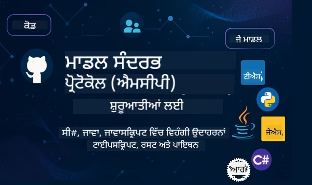

 

[](https://GitHub.com/microsoft/mcp-for-beginners/graphs/contributors)
[](https://GitHub.com/microsoft/mcp-for-beginners/issues)
[](https://GitHub.com/microsoft/mcp-for-beginners/pulls)
[](http://makeapullrequest.com)

[](https://GitHub.com/microsoft/mcp-for-beginners/watchers)
[](https://GitHub.com/microsoft/mcp-for-beginners/fork)
[](https://GitHub.com/microsoft/mcp-for-beginners/stargazers)


[](https://discord.gg/nTYy5BXMWG)

ਇਹ ਸਰੋਤ ਵਰਤਣਾ ਸ਼ੁਰੂ ਕਰਨ ਲਈ ਇਹਨਾਂ ਕਦਮਾਂ ਦੀ ਪਾਲਣਾ ਕਰੋ:
1. **ਰਿਪੋਜ਼ਿਟਰੀ ਫੋਰਕ ਕਰੋ**: ਕਲਿੱਕ ਕਰੋ [](https://GitHub.com/microsoft/mcp-for-beginners/fork)
2. **ਰਿਪੋਜ਼ਿਟਰੀ ਕਲੋਨ ਕਰੋ**:   `git clone https://github.com/microsoft/mcp-for-beginners.git`
3. **ਜੁੜੋ ਤਾਂ ਨਾਲ** [](https://discord.gg/nTYy5BXMWG)


### 🌐 ਬਹੁਭਾਸ਼ੀ ਸਹਾਇਤਾ

#### GitHub Action ਦੇ ਜ਼ਰੀਏ ਸਹਾਇਤਾਕਰਤਾ (ਸਵੈਚਲਿਤ ਅਤੇ ਹਮੇਸ਼ਾਂ ਨਵੀਨਤਮ)

<!-- CO-OP TRANSLATOR LANGUAGES TABLE START -->
[ਅਰਬੀ](../ar/README.md) | [ਬੰਗਾਲੀ](../bn/README.md) | [ਬੁਲਗਾਰੀਆਈ](../bg/README.md) | [ਬੁਰਮੀ (ਮਿਆਂਮਾਰ)](../my/README.md) | [ਚੀਨੀ (ਸਰਲ ਕੀਤੀ)](../zh-CN/README.md) | [ਚੀਨੀ (ਪਰੰਪਰਾਗਤ, ਹਾਂਗ ਕਾਂਗ)](../zh-HK/README.md) | [ਚੀਨੀ (ਪਰੰਪਰਾਗਤ, ਮਕਾਉ)](../zh-MO/README.md) | [ਚੀਨੀ (ਪਰੰਪਰਾਗਤ, ਤਾਈਵਾਨ)](../zh-TW/README.md) | [ਕਰੋਏਟੀਆਈ](../hr/README.md) | [ਚੈਕ](../cs/README.md) | [ਡੈਨਿਸ਼](../da/README.md) | [ਡੱਚ](../nl/README.md) | [ਐਸਟੋਨੀਆਈ](../et/README.md) | [ਫਿਨਿਸ਼](../fi/README.md) | [ਫ੍ਰੈਂਚ](../fr/README.md) | [ਜਰਮਨ](../de/README.md) | [ਗ੍ਰੀਕ](../el/README.md) | [ਹਿਬਰੂ](../he/README.md) | [ਹਿੰਦੀ](../hi/README.md) | [ਹੰਗੇਰੀ](../hu/README.md) | [ਇੰਡੋਨੇਸ਼ੀਅਨ](../id/README.md) | [ਇਤਾਲਵੀ](../it/README.md) | [ਜਪਾਨੀ](../ja/README.md) | [ਕੰਨੜ](../kn/README.md) | [ਕੋਰੀਅਨ](../ko/README.md) | [ਲਿਥੁਆਨੀਆਈ](../lt/README.md) | [ਮਲਈ](../ms/README.md) | [ਮലയാളം](../ml/README.md) | [ਮਰਾਠੀ](../mr/README.md) | [ਨੇਪਾਲੀ](../ne/README.md) | [ਨਾਈਜੀਰੀਆਈ ਪਿਡਗਿਨ](../pcm/README.md) | [ਨਾਰਵੇਜੀਅਨ](../no/README.md) | [ਫ਼ਾਰਸੀ (ਪੰਜਾਬੀ)](../fa/README.md) | [ਪੋਲਿਸ਼](../pl/README.md) | [ਪੁਰਤਗਾਲੀ (ਬ੍ਰਾਜ਼ੀਲ)](../pt-BR/README.md) | [ਪੁਰਤਗਾਲੀ (ਪੁਰਤਗਾਲ)](../pt-PT/README.md) | [ਪੰਜਾਬੀ (ਗੁਰਮੁਖੀ)](./README.md) | [ਰੋਮਾਨੀਆਈ](../ro/README.md) | [ਰੂਸੀ](../ru/README.md) | [ਸਰਬੀਆਈ (ਸਿਰਿਲਿਕ)](../sr/README.md) | [ਸਲੋਵਾਕ](../sk/README.md) | [ਸਲੋਵੇਨੀਆਈ](../sl/README.md) | [ਸਪੇਨੀ](../es/README.md) | [ਸਵਾਹਿਲੀ](../sw/README.md) | [ਸਵੀਡਿਸ਼](../sv/README.md) | [ਟਾਗਾਲੋਗ (ਫਿਲੀਪੀਨੋ)](../tl/README.md) | [ਤਮਿਲ](../ta/README.md) | [ਤੇਲਗੂ](../te/README.md) | [ਥਾਈ](../th/README.md) | [ਤੁਰਕੀ](../tr/README.md) | [ਯੂਕਰੇਨੀਅਨ](../uk/README.md) | [ਉਰਦੂ](../ur/README.md) | [ਵਿਏਤਨਾਮੀਜ਼](../vi/README.md)

> **ਥਾਂ-ਥਾਂ ਕਲੋਨ ਕਰਨ ਲਈ ਪਸੰਦ ਕਰਦੇ ਹੋ?**
>
> ਇਸ ਰਿਪੋਜ਼ਿਟਰੀ ਵਿੱਚ 50+ ਭਾਸ਼ਾ ਅਨੁਵਾਦ ਸ਼ਾਮਲ ਹਨ ਜੋ ਡਾਊਨਲੋਡ ਦਾ ਆਕਾਰ ਕਾਫੀ ਵਧਾਉਂਦੇ ਹਨ। ਬਿਨਾਂ ਅਨੁਵਾਦ ਦੇ ਕਲੋਨ ਕਰਨ ਲਈ, sparse checkout ਵਰਤੋਂ ਕਰੋ:
>
> **ਬੈਸ਼ / macOS / ਲਿਨਕਸ:**
> ```bash
> git clone --filter=blob:none --sparse https://github.com/microsoft/mcp-for-beginners.git
> cd mcp-for-beginners
> git sparse-checkout set --no-cone '/*' '!translations' '!translated_images'
> ```
>
> **CMD (Windows):**
> ```cmd
> git clone --filter=blob:none --sparse https://github.com/microsoft/mcp-for-beginners.git
> cd mcp-for-beginners
> git sparse-checkout set --no-cone "/*" "!translations" "!translated_images"
> ```
>
> ਇਸ ਨਾਲ ਤੁਹਾਨੂੰ ਕੋਰਸ ਪੂਰਾ ਕਰਨ ਲਈ ਸਭ ਕੁਝ ਮਿਲੇਗਾ ਬਹੁਤ ਤੇਜ਼ ਡਾਊਨਲੋਡ ਸਹਿਤ।
<!-- CO-OP TRANSLATOR LANGUAGES TABLE END -->

# 🚀 ਬਾਰੇ ਮਾਡਲ ਸੰਦਰਭ ਪ੍ਰੋਟੋਕੋਲ (MCP) ਸਿਲੈਬਸ ਸ਼ੁਰੂਆਤੀਆਂ ਲਈ

## **C#, ਜਾਵਾ, ਜਾਵਾਸਕ੍ਰਿਪਟ, ਰਸਟ, ਪਾਈਥਨ, ਅਤੇ ਟਾਈਪਸਕ੍ਰਿਪਟ ਵਿੱਚ ਹਥਾਂ-ਹਥ ਕੋਡ ਉਦਾਹਰਣਾਂ ਨਾਲ MCP ਸਿੱਖੋ**

## 🧠 ਮਾਡਲ ਸੰਦਰਭ ਪ੍ਰੋਟੋਕੋਲ ਸਿਲੈਬਸ ਦਾ ਝਲਕ
ਤੁਹਾਡੇ ਲਈ ਮਾਡਲ ਸੰਦਰਭ ਪ੍ਰੋਟੋਕੋਲ ਵਿੱਚ ਯਾਤਰਾ 'ਚ ਸਵਾਗਤ ਹੈ! ਜੇ ਤੁਸੀਂ ਕਦੇ ਸੋਚਿਆ ਹੈ ਕਿ AI ਐਪਲੀਕੇਸ਼ਨ ਵੱਖ-ਵੱਖ ਟੂਲ ਅਤੇ ਸੇਵਾਵਾਂ ਨਾਲ ਕਿਵੇਂ ਗੱਲਬਾਤ ਕਰਦੀਆਂ ਹਨ, ਤਾਂ ਤੁਸੀਂ ਉਸ ਸੁੰਦਰ ਹੱਲ ਨੂੰ ਵੇਖਣ ਵਾਲੇ ਹੋ ਜੋ ਡਿਵੈਲਪਰਾਂ ਨੂੰ ਬੁੱਧੀਮਾਨ ਸਿਸਟਮ ਬਣਾਉਣ ਲਈ ਬਦਲ ਰਿਹਾ ਹੈ।

MCP ਨੂੰ ਇੱਕ ਸਰਵਜਨੀਨ ਅਨੁਵਾਦਕ ਵਜੋਂ ਸੋਚੋ - ਜਿਵੇਂ USB ਪੋਰਟ ਤੁਹਾਨੂੰ ਕਿਸੇ ਵੀ ਡਿਵਾਈਸ ਨੂੰ ਆਪਣੇ ਕੰਪਿਊਟਰ ਨਾਲ ਜੁੜਨ ਦੀ ਆਗਿਆ ਦਿੰਦਾ ਹੈ, ਤਿਵੇਂ MCP AI ਮਾਡਲਾਂ ਨੂੰ ਕਿਸੇ ਵੀ ਟੂਲ ਜਾਂ ਸੇਵਾ ਨਾਲ ਇੱਕ ਮਿਆਰੀ ਤਰੀਕੇ ਨਾਲ ਜੁੜਨ ਦਿੰਦਾ ਹੈ। ਚਾਹੇ ਤੁਸੀਂ ਆਪਣਾ ਪਹਿਲਾ ਚੈਟਬੋਟ ਬਣਾ ਰਹੇ ਹੋ ਜਾਂ ਜਟਿਲ AI ਵਰਕਫਲੋ 'ਤੇ ਕੰਮ ਕਰ ਰਹੇ ਹੋ, MCP ਨੂੰ ਸਮਝਣਾ ਤੁਹਾਨੂੰ ਹੋਰ ਸਮਰੱਥ ਅਤੇ ਲਚਕੀਲੇ ਐਪਲੀਕੇਸ਼ਨ ਬਣਾਉਣ ਦੀ ਤਾਕਤ ਦੇਵੇਗਾ।

ਇਹ ਸਿਲੈਬਸ ਤੁਹਾਡੇ ਸਿੱਖਣ ਦੇ ਸਫ਼ਰ ਲਈ ਸਬਰ ਅਤੇ ਧਿਆਨ ਨਾਲ ਡਿਜ਼ਾਈਨ ਕੀਤਾ ਗਿਆ ਹੈ। ਅਸੀਂ ਅਸਾਨ ਧਾਰਨਾਵਾਂ ਨਾਲ ਸ਼ੁਰੂ ਕਰਾਂਗੇ ਜੋ ਤੁਸੀਂ ਪਹਿਲਾਂ ਹੀ ਸਮਝਦੇ ਹੋ ਅਤੇ ਹੌਲੀ-ਹੌਲੀ ਆਪਣੇ ਮਨਪਸੰਦ ਪ੍ਰੋਗਰਾਮਿੰਗ ਭਾਸ਼ਾ ਵਿੱਚ ਹਥਾਂ-ਹਥ ਅਭਿਆਸ ਰਾਹੀਂ ਆਪਣੀ ਮਹਾਰਤ ਬਣਾਉਂਦੇ ਜਾਵਾਂਗੇ। ਹਰ ਕਦਮ ਵਿੱਚ ਸਪਸ਼ਟ ਵਿਆਖਿਆਵਾਂ, ਬਹਿਰੀਕ ਉਦਾਹਰਣ ਅਤੇ ਕਾਫ਼ੀ ਉਤਸ਼ਾਹ ਮਿਲੇਗਾ।

ਜਦੋਂ ਤੁਸੀਂ ਇਸ ਯਾਤਰਾ ਨੂੰ ਪੂਰਾ ਕਰ ਲਵੋਗੇ, ਤਾਂ ਤੁਹਾਡੇ ਕੋਲ ਆਪਣਾ MCP ਸਰਵਰ ਬਣਾਉਣ, ਪ੍ਰਸਿੱਧ AI ਪਲੇਟਫਾਰਮਾਂ ਨਾਲ ਜੋੜਨ ਅਤੇ ਇਹ ਸਮਝਣ ਦਾ ਵਿਸ਼ਵਾਸ ਹੋਵੇਗਾ ਕਿ ਇਹ ਤਕਨੋਲੋਜੀ AI ਵਿਕਾਸ ਦੇ ਭਵਿੱਖ ਨੂੰ ਕਿਵੇਂ ਬਦਲ ਰਹੀ ਹੈ। ਚਲੋ ਇਸ ਰੋਮਾਂਚਕ ਯਾਤਰਾ ਦੀ ਸ਼ੁਰੂਆਤ ਕਰੀਏ!

### ਅਧਿਕਾਰਿਕ ਦਸਤਾਵੇਜ਼ ਅਤੇ ਵਿਸ਼ੇਸ਼ਤਾਵਾਂ

ਇਹ ਸਿਲੈਬਸ **MCP ਵਿਸ਼ੇਸ਼ਤਾ 2025-11-25** (ਸਭ ਤੋਂ ਨਵੀਂ ਸਥਿਰ ਰਿਲੀਜ਼) ਨਾਲ ਸੰਗਤ ਹੈ। MCP ਵਿਸ਼ੇਸ਼ਤਾ ਦੀ ਗਤੀਵਿਧੀ ਤਾਰੀਖ-ਆਧਾਰਿਤ ਵਰਜਨਿੰਗ (YYYY-MM-DD ਫਾਰਮੈਟ) ਨਾਲ ਹੁੰਦੀ ਹੈ ਤਾਂ ਜੋ ਪ੍ਰੋਟੋਕੋਲ ਵਰਜਨ ਟਰੈਕਿੰਗ ਸਪਸ਼ਟ ਰਹੇ।

ਇਹ ਸਰੋਤ ਤੁਹਾਡੇ ਸਮਝ ਵਿੱਚ ਵਾਧਾ ਹੁੰਦਿਆਂ ਜ਼ਿਆਦਾ ਕੀਮਤੀ ਬਣਦੇ ਹਨ, ਪਰ ਸੱਜਣ ਨਾ ਹੋਵੋ ਕਿ ਤੁਸੀਂ ਤੁਰੰਤ ਸਭ ਕੁਝ ਪੜ੍ਹੋ। ਪਹਿਲਾਂ ਉਹ ਖੇਤਰ ਸ਼ੁਰੂ ਕਰੋ ਜੋ ਤੁਹਾਨੂੰ ਸਭ ਤੋਂ ਜ਼ਿਆਦਾ ਰੁਚਿਕਰ ਲੱਗਦੇ ਹਨ!
- 📘 [MCP ਦਸਤਾਵੇਜ਼](https://modelcontextprotocol.io/) – ਇਹ ਤੁਹਾਡਾ ਕਦਮ-ਦਰ-ਕਦਮ ਟਿਊਟੋਰੀਅਲ ਅਤੇ ਉਪਭੋਗਤਾ ਗਾਈਡ ਲਈ ਪ੍ਰਮੁੱਖ ਸਰੋਤ ਹੈ। ਦਸਤਾਵੇਜ਼ ਸ਼ੁਰੂਆਤੀ ਲਈ ਲਿਖੀ ਗਈ ਹੈ, ਸਪਸ਼ਟ ਉਦਾਹਰਣਾਂ ਦੇ ਨਾਲ ਜਿਸਨੂੰ ਤੁਸੀਂ ਆਪਣੀ ਰਫ਼ਤਾਰ ਨਾਲ ਫਾਲੋ ਕਰ ਸਕਦੇ ਹੋ।
- 📜 [MCP ਵਿਸ਼ੇਸ਼ਤਾ](https://modelcontextprotocol.io/specification/2025-11-25) – ਇਸਨੂੰ ਤੁਸੀਂ ਆਪਣਾ ਵਿਆਪਕ ਸੰਦਰਭ ਮੈਨੁਅਲ ਸਮਝੋ। ਜਦੋਂ ਤੁਸੀਂ ਸਿਲੈਬਸ ਵਿੱਚ ਕੰਮ ਕਰਦੇ ਹੋ, ਤਾਂ ਤੁਸੀਂ ਇੱਥੇ ਖਾਸ ਵਿੱਸਤਰਾਂ ਅਤੇ ਉੱਚ ਕੋटੀਆਂ ਦੀਆਂ ਖਾਸਿਅਤਾਂ ਨੂੰ ਵੇਖਣ ਲਈ ਵਾਪਸ ਆਉਂਦੇ ਹੋ।
- 📜 [MCP ਵਿਸ਼ੇਸ਼ਤਾ ਵਰਜਨਿੰਗ](https://modelcontextprotocol.io/specification/versioning) – ਇਸ ਵਿੱਚ ਪ੍ਰੋਟੋਕੋਲ ਵਰਜਨ ਇਤਿਹਾਸ ਬਾਰੇ ਜਾਣਕਾਰੀ ਅਤੇ MCP ਵੇਰਵੇ ਮਿਤੀ-ਆਧਾਰਿਤ ਵਰਜਨਿੰਗ (YYYY-MM-DD ਫਾਰਮੈਟ) ਦਿਖਾਉਂਦਾ ਹੈ।
- 🧑‍💻 [MCP GitHub ਰਿਪੋਜ਼ਿਟਰੀ](https://github.com/modelcontextprotocol) – ਇੱਥੇ ਤੁਸੀਂ ਵੱਖ-ਵੱਖ ਪ੍ਰੋਗਰਾਮਿੰਗ ਭਾਸ਼ਾਵਾਂ ਵਿੱਚ SDK, ਟੂਲ ਅਤੇ ਕੋਡ ਨਮੂਨੇ ਲੱਭੋਗੇ। ਇਹ ਵਰਤੋਂਯੋਗ ਉਦਾਹਰਣਾਂ ਅਤੇ ਤਿਆਰ ਹਿੱਸਿਆਂ ਦਾ ਖਜ਼ਾਨਾ ਹੈ।
- 🌐 [MCP ਕਮਿਊਨਿਟੀ](https://github.com/orgs/modelcontextprotocol/discussions) – MCP ਬਾਰੇ ਗੱਲਬਾਤਾਂ ਵਿੱਚ ਸਾਥੀ ਸਿੱਖਣਹਾਰੇ ਅਤੇ ਅਨੁਭਵੀ ਡਿਵੈਲਪਰਾਂ ਨਾਲ ਸ਼ਾਮਿਲ ਹੋਵੋ। ਇਹ ਸਹਿਯੋਗੀ ਭਾਈਚਾਰਾ ਹੈ ਜਿੱਥੇ ਸਵਾਲ ਸਵਾਗਤਯੋਗ ਹਨ ਅਤੇ ਗਿਆਨ ਖੁੱਲ੍ਹ ਕੇ ਸਾਂਝਾ ਕੀਤਾ ਜਾਂਦਾ ਹੈ।
  
## ਸਿੱਖਣ ਦੇ ਲਕੜੀ ਨਿਸ਼ਾਨ

ਇਸ ਸਿਲੈਬਸ ਦੇ ਅੰਤ ਤੱਕ, ਤੁਸੀਂ ਆਪਣੇ ਨਵੇਂ ਕੌਸ਼ਲਾਂ 'ਤੇ ਵਿਸ਼ਵਾਸ ਮੁਹੈੱਈਆ ਕਰੋਗੇ ਅਤੇ ਉਤਸ਼ਾਹਿਤ ਹੋਵੋਗੇ। ਇਹ ਹਨ ਉਹਨਾਂ ਚੀਜ਼ਾਂ ਲਈ ਤੁਸੀਂ ਕਾਬਿਲ ਹੋਵੋਗੇ:

• **MCP ਮੂਲ ਕੌਸ਼ਲ ਸਮਝੋ**: ਤੁਸੀਂ ਸਮਝੋਗੇ ਕਿ ਮਾਡਲ ਸੰਦਰਭ ਪ੍ਰੋਟੋਕੋਲ ਕੀ ਹੈ ਅਤੇ ਕਿਵੇਂ ਇਹ AI ਐਪਲੀਕੇਸ਼ਨਾਂ ਨੂੰ ਇਕੱਠੇ ਕੰਮ ਕਰਨ ਵਿੱਚ ਬਦਲ ਰਿਹਾ ਹੈ, ਸਪਸ਼ਟ ਉਦਾਹਰਣਾਂ ਅਤੇ ਸਾੰਝੇ ਤਰਜ਼ ਤੇ।

• **ਆਪਣਾ ਪਹਿਲਾ MCP ਸਰਵਰ ਬਣਾੋ**: ਤੁਸੀਂ ਆਪਣੀ ਮਨਪਸੰਦ ਪ੍ਰੋਗਰਾਮਿੰਗ ਭਾਸ਼ਾ ਵਿੱਚ ਇੱਕ ਕੰਮ ਕਰਨ ਵਾਲਾ MCP ਸਰਵਰ ਬਣਾਉਗੇ, ਸਧਾਰਣ ਉਦਾਹਰਣਾਂ ਦੇ ਨਾਲ ਸ਼ੁਰੂ ਕਰਕੇ ਕਦਮ ਦਰ ਕਦਮ ਆਪਣੀਆਂ ਯੋਗਤਾਵਾਂ ਨੂੰ ਵਧਾਵੋਗੇ।

• **AI ਮਾਡਲਾਂ ਨੂੰ ਅਸਲੀ ਟੂਲ ਨਾਲ ਜੁੜੋ**: ਤੁਸੀਂ ਜਾਣੋਗੇ ਕਿ ਕਿਵੇਂ AI ਮਾਡਲਾਂ ਅਤੇ ਅਸਲੀ ਸੇਵਾਵਾਂ ਦੇ ਵਿਚਕਾਰ ਪੁਲ ਬਣਾਈਏ, ਜਿਸ ਨਾਲ ਤੁਹਾਡੇ ਐਪਲੀਕੇਸ਼ਨ ਸ਼ਕਤੀਸ਼ਾਲੀ ਨਵੀਂ ਖੂਬੀਆਂ ਪ੍ਰਾਪਤ ਕਰਦੇ ਹਨ।

• **ਸੁਰੱਖਿਆ ਦੀਆਂ ਵਧੀਆ ਪ੍ਰਥਮਾਵਾਂ ਲਾਗੂ ਕਰੋ**: ਤੁਸੀਂ ਸਮਝੋਗੇ ਕਿ MCP ਨੂੰ ਸੁਰੱਖਿਅਤ ਰੱਖਣਾ ਕਿਵੇਂ ਹੈ, ਜਿਸ ਨਾਲ ਤੁਹਾਡੇ ਐਪ ਅਤੇ ਉਪਭੋਗਤਿਆਂ ਦੋਵਾਂ ਦੀ ਸੁਰੱਖਿਆ ਹੁੰਦੀ ਹੈ।

• **ਵਿਸ਼ਵਾਸ ਨਾਲ ਡਿਪਲੋਯ ਕਰੋ**: ਤੁਸੀਂ ਜਾਣੋਗੇ ਕਿ MCP ਪਰਿਯੋਜਨਾਵਾਂ ਨੂੰ ਵਿਕਾਸ ਤੋਂ ਉਤਪਾਦਨ ਤੱਕ ਕਿਵੇਂ ਲਿਜਾਇਆ ਜਾਵੇ, ਜਿਸ ਵਿੱਚ ਹਕੀਕਤੀ ਦੁਨੀਆਂ ਵਿੱਚ ਕੰਮ ਕਰਨ ਵਾਲੀਆਂ ਡਿਪਲੋਯਮੈਂਟ ਰਣਨੀਤੀਆਂ ਸ਼ਾਮਲ ਹਨ।

• **MCP ਕਮਿਊਨਿਟੀ ਨਾਲ ਜੁੜੋ**: ਤੁਸੀਂ ਉਸ ਵਿਕਸਿਤ ਹੋ ਰਹੀ ਡਿਵੈਲਪਰ ਕਮਿਊਨਿਟੀ ਦਾ ਹਿੱਸਾ ਬਣੋਗੇ ਜੋ AI ਐਪਲੀਕੇਸ਼ਨ ਵਿਕਾਸ ਦੇ ਭਵਿੱਖ ਨੂੰ ਰੂਪ ਦੇ ਰਹੀ ਹੈ।

## ਜਰੂਰੀ ਬੁਨਿਆਦੀ ਜਾਣਕਾਰੀ

ਸਾਨੂੰ MCP ਵਿਸ਼ੇਸ਼ਤਾਵਾਂ ਵਿੱਚ ਡੁੱਬਣ ਤੋਂ ਪਹਿਲਾਂ ਇਹ ਯਕੀਨੀ ਬਣਾਉਣਾ ਚਾਹੀਦਾ ਹੈ ਕਿ ਤੁਸੀਂ ਕੁਝ ਬੁਨਿਆਦੀ ਧਾਰਨਾਵਾਂ ਨਾਲ ਆਪ ਤੁਲਣਾ ਕਰਦੇ ਹੋ। ਫਿਕਰ ਨਾ ਕਰੋ ਜੇ ਤੁਸੀਂ ਇਨ੍ਹਾਂ ਖੇਤਰਾਂ ਵਿੱਚ ਪੂਰਨ ਮਾਹਿਰ ਨਹੀਂ ਹੋ - ਅਸੀਂ ਹਰ ਚੀਜ਼ ਨੂੰ ਤੁਹਾਨੂੰ ਜਾਣਨ ਲਈ ਵਿਆਖਿਆ ਕਰਾਂਗੇ ਜਿਵੇਂ ਅਸੀਂ ਅੱਗੇ ਵਧਦੇ ਹਾਂ!

### ਪ੍ਰੋਟੋਕੋਲਾਂ ਦੀ ਸਮਝ (ਮੂਲਧਾਰ)

ਇੱਕ ਪ੍ਰੋਟੋਕੋਲ ਨੂੰ ਇੱਕ ਗੱਲਬਾਤ ਦੇ ਨਿਯਮਾਂ ਵਾਂਗ ਸੋਚੋ। ਜਦੋਂ ਤੁਸੀਂ ਆਪਣੇ ਦੋਸਤ ਨੂੰ ਕਾਲ ਕਰਦੇ ਹੋ, ਤਦੋਂ ਦੋਹਾਂ ਨੂੰ ਪਤਾ ਹੁੰਦਾ ਹੈ ਕਿ ਜਵਾਬ ਵਿੱਚ "ਹੈਲੋ" ਕਹਿਣਾ ਹੈ, ਬੋਲਣ ਵਿਚ ਵਾਰੀ ਲੈਣੀ ਹੈ ਅਤੇ ਮੁੱਖਤ ਕਰਦਿਆਂ "ਅਲਵਿਦਾ" ਕਹਿਣਾ ਹੈ। ਕੰਪਿਊਟਰ ਪ੍ਰੋਗਰਾਮਾਂ ਨੂੰ ਵੀ ਇਨ੍ਹਾਂ ਬੋਲਚਾਲ ਲਈ ਸਮਾਨ ਨਿਯਮਾਂ ਦੀ ਲੋੜ ਹੁੰਦੀ ਹੈ।

MCP ਇੱਕ ਪ੍ਰੋਟੋਕੋਲ ਹੈ - ਇੱਕ ਸਹਿਮਤ ਨਿਯਮਾਂ ਦਾ ਸਮੂਹ ਜੋ AI ਮਾਡਲਾਂ ਅਤੇ ਐਪਲੀਕੇਸ਼ਨਾਂ ਨੂੰ ਟੂਲਾਂ ਅਤੇ ਸੇਵਾਵਾਂ ਨਾਲ ਫਲਦਾਇਕ "ਗੱਲਬਾਤ" ਕਰਨ ਵਿੱਚ ਸਹਾਇਤਾ ਦਿੰਦਾ ਹੈ। ਜਿਵੇਂ ਗੱਲਬਾਤ ਦੇ ਨਿਯਮ ਮਨੁੱਖੀ ਸੰਚਾਰ ਨੂੰ ਸੌਖਾ ਬਣਾਉਂਦੇ ਹਨ, ਤਿਵੇਂ MCP AI ਐਪਲੀਕੇਸ਼ਨ ਸੰਚਾਰ ਨੂੰ ਬਹੁਤ ਜ਼ਿਆਦਾ ਭਰੋਸਮੰਦ ਅਤੇ ਸ਼ਕਤੀਸ਼ਾਲੀ ਬਣਾਉਂਦਾ ਹੈ।

### ਕਲਾਇੰਟ-ਸਰਵਰ ਸੰਬੰਧ (ਪ੍ਰੋਗਰਾਮ ਇਕੱਠੇ ਕਿਵੇਂ ਕੰਮ ਕਰਦੇ ਹਨ)

ਤੁਸੀਂ ਹਰ ਰੋਜ਼ ਕਲਾਇੰਟ-ਸਰਵਰ ਸੰਬੰਧਾਂ ਨੂੰ ਵਰਤ ਰਹੇ ਹੋ! ਜਦੋਂ ਤੁਸੀਂ ਵੈੱਬ ਬ੍ਰਾਉਜ਼ਰ (ਕਲਾਇੰਟ) ਨਾਲ ਕਿਸੇ ਵੈਬਸਾਈਟ ਨੂੰ ਖੋਲ੍ਹਦੇ ਹੋ, ਤਾਂ ਤੁਸੀਂ ਇੱਕ ਵੈਬ ਸਰਵਰ ਨਾਲ ਜੁੜੇ ਹੋ ਜੋ ਤੁਹਾਨੂੰ ਸਫ਼ਾ ਦੀ ਸਮੱਗਰੀ ਭੇਜਦਾ ਹੈ। ਬ੍ਰਾਉਜ਼ਰ ਜਾਣਦਾ ਹੈ ਕਿਦਾਂ ਜਾਣਕਾਰੀ ਮੰਗਣੀ ਹੈ ਅਤੇ ਸਰਵਰ ਜਾਣਦਾ ਹੈ ਕਿਵੇਂ ਜਵਾਬ ਦੇਣਾ ਹੈ।

MCP ਵਿੱਚ, ਇੱਕ ਸਮਾਨ ਸੰਬੰਧ ਹੈ: AI ਮਾਡਲ ਕਲਾਇੰਟ ਵਜੋਂ ਕੰਮ ਕਰਦੇ ਹਨ ਜੋ ਜਾਣਕਾਰੀ ਜਾਂ ਕਾਰਵਾਈ ਦੀ ਮੰਗ ਕਰਦੇ ਹਨ, ਜਦਕਿ MCP ਸਰਵਰ ਉਹ ਸਮਰੱਥਾਵਾਂ ਪ੍ਰਦਾਨ ਕਰਦੇ ਹਨ। ਇਹ ਇਕ ਮਦਦਗਾਰ ਸਹਾਇਕ (ਸਰਵਰ) ਵਾਂਗ ਹੈ ਜਿਸਨੂੰ AI ਵਿਸ਼ੇਸ਼ ਕੰਮ ਕਰਵਾਉਣ ਲਈ ਪੁੱਛਦਾ ਹੈ।

### ਮਿਆਰੀਕਰਨ ਕਿਉਂ ਜਰੂਰੀ ਹੈ (ਚੀਜ਼ਾਂ ਨੂੰ ਇਕੱਠੇ ਕੰਮ ਕਰਵਾਉਣਾ)

ਸੋਚੋ ਕਿ ਹਰ ਕਾਰ ਨਿਰਮਾਤਾ ਵੱਖ-ਵੱਖ ਆਕਾਰ ਦੇ ਗੈਸ ਪੰਪ ਵਰਤਦਾ ਹੈ - ਤਾਂ ਤੁਹਾਨੂੰ ਹਰ ਇਕ ਕਾਰ ਲਈ ਇੱਕ ਵੱਖਰਾ ਐਡੈਪਟਰ ਲੱਗੇਗਾ! ਮਿਆਰੀਕਰਨ ਦਾ ਮਤਲਬ ਹੈ ਆਮ ਤਰੀਕਿਆਂ 'ਤੇ ਸਹਿਮਤ ਹੋਣਾ ਤਾਂ ਜੋ ਚੀਜ਼ਾਂ ਸੁਚਾਰੂ ਤਰੀਕੇ ਨਾਲ ਕੰਮ ਕਰਨ।

MCP AI ਐਪਲੀਕੇਸ਼ਨਾਂ ਲਈ ਇਹ ਮਿਆਰੀਕਰਨ ਪ੍ਰਦਾਨ ਕਰਦਾ ਹੈ। ਹਰ AI ਮਾਡਲ ਨੂੰ ਹਰ ਟੂਲ ਲਈ ਕੁਸਟਮ ਕੋਡ ਲਿਖਣ ਦੀ ਬਜਾਏ, MCP ਉਹਨਾਂ ਲਈ ਗੱਲਬਾਤ ਦਾ ਇੱਕ ਸਰਵਜਨੀਨ ਤਰੀਕਾ ਬਣਾਉਂਦਾ ਹੈ। ਇਸਦਾ ਮਤਲਬ ਹੈ ਕਿ ਡਿਵੈਲਪਰ ਇੱਕ ਵਾਰੀ ਟੂਲ ਬਣਾਉਂਦੇ ਹਨ ਅਤੇ ਉਹ ਕਈ ਵੱਖ-ਵੱਖ AI ਸਿਸਟਮਾਂ ਨਾਲ ਕੰਮ ਕਰਦੇ ਹਨ।

## 🧭 ਤੁਹਾਡੇ ਸਿੱਖਣ ਦੇ ਰਸਤੇ ਦਾ ਝਲਕ

ਤੁਹਾਡੀ MCP ਯਾਤਰਾ ਧੀਰੇ-ਧੀਰੇ ਤੁਹਾਡੇ ਵਿਸ਼ਵਾਸ ਅਤੇ ਕੌਸ਼ਲਵਾਂ ਨੂੰ ਤਿਆਰ ਕਰਨ ਲਈ ਧਿਆਨਪੂਰਕ ਤਰੀਕੇ ਨਾਲ ਬਣਾਈ ਗਈ ਹੈ। ਹਰ ਪੜਾਅ ਨਵੀਆਂ ਧਾਰਨਾਵਾਂ ਪੇਸ਼ ਕਰਦਾ ਹੈ ਅਤੇ ਪਹਿਲਾਂ ਸਿੱਖੀ ਗਈਆਂ ਸ਼ੀਖਰਾਂ ਨੂੰ ਮਜ਼ਬੂਤ ਕਰਦਾ ਹੈ।

### 🌱 ਬੁਨਿਆਦੀ ਪੜਾਅ: ਮੂਲਭੂਤ ਸਮਝ (ਮੌਡਿਊਲ 0-2)

ਇੱਥੇ ਤੁਹਾਡਾ ਸਫਰ ਸ਼ੁਰੂ ਹੁੰਦਾ ਹੈ! ਅਸੀਂ MCP ਦੇ ਸਿਧਾਂਤਾਂ ਨੂੰ ਜਾਣੂ ਕੀਤਾ ਜਾਵੇਗਾ ਮਮਹੂਨ ਤਰਜ਼ ਅਤੇ ਸਧਾਰਣ ਉਦਾਹਰਣਾਂ ਨਾਲ। ਤੁਸੀਂ ਸਮਝੋਗੇ ਕਿ MCP ਕੀ ਹੈ, ਇਹ ਕਿਉਂ ਹੈ ਅਤੇ ਇਹ AI ਵਿਕਾਸ ਦੀ ਵੱਡੀ ਦੁਨੀਆਂ ਵਿੱਚ ਕਿਵੇਂ ਫਿੱਟ ਹੁੰਦਾ ਹੈ।

• **ਮੌਡਿਊਲ 0 - MCP ਦਾ ਪਰਚਿਆਵਾਂ**: ਅਸੀਂ MCP ਕੀ ਹੈ ਅਤੇ ਇਹ ਆਧੁਨਿਕ AI ਐਪਲੀਕੇਸ਼ਨਾਂ ਲਈ ਕਿਉਂ ਮਹੱਤਵਪੂਰਣ ਹੈ, ਇਹ ਵੇਖਣਾ ਸੁਰੂ ਕਰਾਂਗੇ। ਤੁਸੀਂ ਅਸਲੀ ਦੁਨੀਆ ਦੇ MCP ਦੇ ਉਦਾਹਰਣ ਵੇਖੋਗੇ ਅਤੇ ਸਮਝੋਗੇ ਕਿ ਇਹ ਡਿਵੈਲਪਰਾਂ ਨੂੰ ਮੁੜ-ਮੁੜ ਆਉਂਦੇ ਸਮੱਸਿਆਵਾਂ ਤੋਂ ਕਿਵੇਂ ਛੁਟਕਾਰਾ ਦਿੰਦਾ ਹੈ।

• **ਮੌਡਿਊਲ 1 - ਮੁੱਖ ਧਾਰਨਾਵਾਂ ਵਿਆਖਿਆਯਕ**: ਇੱਥੇ ਤੁਸੀਂ MCP ਦੇ ਅਹੰਕਾਰਕ ਅਤੇ ਜਰੂਰੀ ਨਿਰਮਾਣ ਟੁਕੜੇ ਸਿੱਖੋਗੇ। ਅਸੀਂ ਕਾਫੀ ਮਿਸਾਲਾਂ ਅਤੇ ਵਿਜ਼ੂਅਲ ਉਦਾਹਰਣਾਂ ਨਾਲ ਇਹ ਧਾਰਨਾਵਾਂ ਆਸਾਨ ਬਣਾਈਏਗਾ।

• **ਮੌਡਿਊਲ 2 - MCP ਵਿੱਚ ਸੁਰੱਖਿਆ**: ਸੁਰੱਖਿਆ ਦਰਅਸਲ ਡਰਾਉਣੀ ਹੋ ਸਕਦੀ ਹੈ, ਪਰ ਅਸੀਂ ਤੁਹਾਨੂੰ ਦਿਖਾਵਾਂਗੇ ਕਿ MCP ਬਿਲਟ-ਇਨ ਸੁਰੱਖਿਆ ਵਿਸ਼ੇਸ਼ਤਾਵਾਂ ਕੀਤੇ ਹਨ ਅਤੇ ਉਹ ਸਰਵੋਤਮ ਅਭਿਆਸ ਜੋ ਤੁਹਾਡੇ ਐਪਲੀਕੇਸ਼ਨ ਨੂੰ ਸ਼ੁਰੂ ਤੋਂ ਸੁਰੱਖਿਅਤ ਰੱਖਦੇ ਹਨ।

### 🔨 ਨਿਰਮਾਣ ਪੜਾਅ: ਆਪਣੇ ਪਹਿਲੇ ਅਮਲ ਬਣਾ ਰਹੇ ਹੋ (ਮੌਡਿਊਲ 3)

ਹੁਣ ਅਸਲ ਮਜ਼ਾ ਸ਼ੁਰੂ ਹੁੰਦਾ ਹੈ! ਤੁਸੀਂ ਹਥਾਂ-ਹਥ ਤਜ਼ਰਬਾ ਲੈ ਕੇ ਵਾਸਤਵਿਕ MCP ਸਰਵਰ ਅਤੇ ਕਲਾਇੰਟ ਬਣਾਉਗੇ। ਫਿਕਰ ਨਾ ਕਰੋ - ਅਸੀਂ ਸਧਾਰਣ ਤਰੀਕੇ ਨਾਲ ਸ਼ੁਰੂ ਕਰਾਂਗੇ ਅਤੇ ਹਰ ਕਦਮ ਤੇ ਮਦਦ ਕਰਾਂਗੇ।
ਇਹ ਮੋਡੀਊਲ ਕਈ ਹੱਥ-ਓਨ ਗਾਈਡਾਂ ਸ਼ਾਮਿਲ ਕਰਦਾ ਹੈ ਜੋ ਤੁਹਾਨੂੰ ਆਪਣੇ ਪREFERRED ਪ੍ਰੋਗ੍ਰਾਮਿੰਗ ਭਾਸ਼ਾ ਵਿੱਚ ਅਭਿਆਸ ਕਰਨ ਦਿੰਦੀਆਂ ਹਨ। ਤੁਸੀਂ ਆਪਣਾ ਪਹਿਲਾ ਸਰਵਰ ਬਣਾਉਗੇ, ਇਸ ਨਾਲ ਜੁੜਨ ਲਈ ਇੱਕ ਕੰਲਾਇੰਟ ਬਣਾਉਗੇ, ਅਤੇ ਪ੍ਰਸਿੱਧ ਵਿਕਾਸ ਟੂਲਾਂ ਜਿਵੇਂ ਕਿ VS ਕੋਡ ਨਾਲ ਇੰਟੀਗਰੇਟ ਵੀ ਕਰੋਗੇ।

ਹਰ ਗਾਈਡ ਵਿੱਚ ਪੂਰੇ ਕੋਡ ਉਦਾਹਰਣਾਂ, ਸਮੱਸਿਆ ਸਮਾਧਾਨ ਟਿਪਸ ਅਤੇ ਇਹ ਸਮਝਾਇਆ ਗਿਆ ਹੈ ਕਿ ਸਾਡੇ ਵਿਸ਼ੇਸ਼ ਡਿਜ਼ਾਈਨ ਚੋਣਾਂ ਕਿਉਂ ਕੀਤੀਆਂ ਜਾਂਦੀਆਂ ਹਨ। ਇਸ ਚਰਣ ਦੇ ਅੰਤ ਤੱਕ, ਤੁਹਾਡੇ ਕੋਲ ਕੰਮ ਕਰ ਰਹੀਆਂ MCP ਲਾਗੂਵਾਂਗੀਆਂ ਹੋਣਗੀਆਂ ਜਿਨ੍ਹਾਂ 'ਤੇ ਤੁਸੀਂ ਗਰਵ ਮਹਿਸੂਸ ਕਰ ਸਕਦੇ ਹੋ!

### 🚀 ਵਿਕਾਸ ਚਰਣ: ਉन्नਤ ਧਾਰਨਾਵਾਂ ਅਤੇ ਅਸਲੀ ਦੁਨੀਆ ਦੀ ਅਰਜ਼ੀ (ਮੋਡੀਊਲ 4-5)

ਬੁਨਿਆਦੀ ਗੱਲਾਂ ਮਾਹਰ ਕਰਨ ਦੇ ਬਾਅਦ, ਤੁਸੀਂ ਜ਼ਿਆਦਾ ਸੁਧਰੇ ਹੋਏ MCP ਫੀਚਰ ਦੀ ਖੋਜ ਕਰਨ ਲਈ ਤਿਆਰ ਹੋ। ਅਸੀਂ ਵਾਲੀ ਅਮਲ ਵਿੱਚ ਲਿਆਉਣ ਲਈ ਰਣਨੀਤੀਆਂ, ਡਿਬੱਗਿੰਗ ਤਕਨੀਕਾਂ ਅਤੇ ਉੱਨਤ ਵਿਸ਼ਿਆਂ ਜਿਵੇਂ ਕਿ ਮਲਟੀ-ਮੋਡਲ ਏਆਈ ਇੰਟੀਗਰੇਸ਼ਨ ਕਵਰ ਕਰਾਂਗੇ।

ਤੁਸੀਂ ਇਹ ਵੀ ਸਿੱਖੋਗੇ ਕਿ ਆਪਣੇ MCP ਲਾਗੂਵਾਂਗੀਆਂ ਨੂੰ ਉਤਪਾਦਨ ਲਈ ਕਿਵੇਂ ਸਕੇਲ ਕਰਨਾ ਹੈ ਅਤੇ ਐਜ਼ਯੂਰ ਵਰਗੇ ਕਲਾਉਡ ਪਲੇਟਫਾਰਮਾਂ ਨਾਲ ਇੰਟੀਗਰੇਟ ਕਰਨਾ ਹੈ। ਇਹ ਮੋਡੀਊਲ ਤੁਹਾਨੂੰ ਅਸਲੀ ਦੁਨੀਆ ਦੀਆਂ ਮੰਗਾਂ ਨੂੰ ਸੰਭਾਲਣ ਵਾਲੇ MCP ਹੱਲ ਬਣਾਉਣ ਲਈ ਤਿਆਰ ਕਰਦੇ ਹਨ।

### 🌟 ਮਹਾਰਥ ਚਰਣ: ਕਮਿਊਨਿਟੀ ਅਤੇ ਵਿਸ਼ੇਸ਼ਤਾ (ਮੋਡੀਊਲ 6-11)

ਅਖੀਰਲਾ ਚਰਣ MCP ਕਮਿਊਨਿਟੀ ਨਾਲ ਜੁੜਨ ਅਤੇ ਆਪਣੇ ਸਭ ਤੋਂ ਵੱਧ ਇੱਛਿਤ ਖੇਤਰਾਂ ਵਿੱਚ ਵਿਸ਼ੇਸ਼ ਪਸ਼ਟੀ ਕਰਨ 'ਤੇ ਧਿਆਨ ਕੇਂਦ੍ਰਿਤ ਕਰਦਾ ਹੈ। ਤੁਸੀਂ ਖੁੱਲ੍ਹੇ ਸਰੋਤ MCP ਪ੍ਰੋਜੈਕਟਾਂ ਵਿੱਚ ਯੋਗਦਾਨ ਕਿਵੇਂ ਪਾਉਣਾ ਹੈ, ਉੱਨਤ ਪ੍ਰਮਾਣਿਕਤਾ ਪੈਟਰਨਾਂ ਨੂੰ ਕਿਵੇਂ ਲਾਗੂ ਕਰਨਾ ਹੈ ਅਤੇ ਵਿਸਤ੍ਰਿਤ ਡੇਟਾਬੇਸ ਇੰਟੀਗਰੇਟਿਡ ਹੱਲ ਕਿਵੇਂ ਬਣਾਉਣੇ ਹਨ ਸਿੱਖੋਗੇ।

ਮੋਡੀਊਲ 11 ਨੂੰ ਵਿਸ਼ੇਸ਼ ਜ਼ਿਕਰ ਮਿਲਣਾ ਚਾਹੀਦਾ ਹੈ - ਇਹ ਇੱਕ ਪੂਰਾ 13-ਲੈਬ ਹੱਥ-ਓਨ ਸਿਖਲਾਈ ਪੱਥ ਹੈ ਜੋ ਤੁਹਾਨੂੰ PostgreSQL ਇੰਟੀਗਰੇਸ਼ਨ ਨਾਲ ਉਤਪਾਦਨ-ਤੇਯਾਰ MCP ਸਰਵਰ ਬਣਾਉਣਾ ਸਿਖਾਉਂਦਾ ਹੈ। ਇਹ ਇੱਕ ਕੈਪਸਟੋਨ ਪ੍ਰੋਜੇਕਟ ਵਰਗਾ ਹੈ ਜੋ ਤੁਹਾਡੀ ਸਿੱਖਿਆ ਵਿੱਚ ਸਾਰੀ ਕੁਝ ਇੱਕਠੀ ਕਰਦਾ ਹੈ!

### 📚 ਪੂਰਾ ਸਿਲੇਬਸ ਸੰਰਚਨਾ

| ਮੋਡੀਊਲ | ਵਿਸ਼ਾ | ਵੇਰਵਾ | ਲਿੰਕ |
|--------|-------|-------------|------|
| **ਮੋਡੀਊਲ 0-3: ਬੁਨਿਆਦੀਆਂ** | | | |
| 00 | MCP ਦਾ ਪਰਿਚਯ | ਮਾਡਲ ਕਾਂਟੈਕਸਟ ਪ੍ਰੋਟੋਕਾਲ ਅਤੇ ਇਸਦੀ AI ਪਾਈਪਲਾਈਨਾਂ ਵਿੱਚ ਮਹੱਤਤਾ ਦਾ ਝਲਕ | [ਇਹਨਾਂ ਹੋਰ ਪੜ੍ਹੋ](./00-Introduction/README.md) |
| 01 | ਮੁੱਖ ਧਾਰਨਾਵਾਂ ਦੀ ਵਿਆਖਿਆ | MCP ਦੀਆਂ ਮੁੱਖ ਧਾਰਨਾਵਾਂ ਦੀ ਵਿਸਤ੍ਰਿਤ ਖੋਜ | [ਇਹਨਾਂ ਹੋਰ ਪੜ੍ਹੋ](./01-CoreConcepts/README.md) |
| 02 | MCP ਵਿੱਚ ਸੁਰੱਖਿਆ | ਸੁਰੱਖਿਆ ਧਮਕੀਆਂ ਅਤੇ ਸਰਵੋਤਮ ਅਭਿਆਸ | [ਇਹਨਾਂ ਹੋਰ ਪੜ੍ਹੋ](./02-Security/README.md) |
| 03 | MCP ਨਾਲ ਸ਼ੁਰੂਆਤ | ਵਾਤਾਵਰਣ ਸੈੱਟਅੱਪ, ਬੁਨਿਆਦੀ ਸਰਵਰ/ਕੰਲਾਇੰਟ, ਇੰਟੀਗਰੇਸ਼ਨ | [ਇਹਨਾਂ ਹੋਰ ਪੜ੍ਹੋ](./03-GettingStarted/README.md) |
| **ਮੋਡੀਊਲ 3: ਆਪਣਾ ਪਹਿਲਾ ਸਰਵਰ ਤੇ ਕੰਲਾਇੰਟ ਬਣਾਉਣਾ** | | | |
| 3.1 | ਪਹਿਲਾ ਸਰਵਰ | ਆਪਣਾ ਪਹਿਲਾ MCP ਸਰਵਰ ਬਣਾਓ | [ਗਾਈਡ](./03-GettingStarted/01-first-server/README.md) |
| 3.2 | ਪਹਿਲਾ ਕੰਲਾਇੰਟ | ਇੱਕ ਬੁਨਿਆਦੀ MCP ਕੰਲਾਇੰਟ ਵਿਕਸਤ ਕਰੋ | [ਗਾਈਡ](./03-GettingStarted/02-client/README.md) |
| 3.3 | LLM ਨਾਲ ਕੰਲਾਇੰਟ | ਵੱਡੇ ਭਾਸ਼ਾ ਮਾਡਲਾਂ ਨੂੰ ਇੰਟੀਗਰੇਟ ਕਰੋ | [ਗਾਈਡ](./03-GettingStarted/03-llm-client/README.md) |
| 3.4 | VS ਕੋਡ ਇੰਟੀਗਰੇਸ਼ਨ | VS ਕੋਡ ਵਿੱਚ MCP ਸਰਵਰਾਂ ਦਾ ਉਪਭੋਗ | [ਗਾਈਡ](./03-GettingStarted/04-vscode/README.md) |
| 3.5 | stdio ਸਰਵਰ | stdio ਟ੍ਰਾਂਸਪੋਰਟ ਨਾਲ ਸਰਵਰ ਬਣਾਓ | [ਗਾਈਡ](./03-GettingStarted/05-stdio-server/README.md) |
| 3.6 | HTTP ਸਟ੍ਰੀਮਿੰਗ | MCP ਵਿੱਚ HTTP ਸਟ੍ਰੀਮਿੰਗ ਲਾਗੂ ਕਰੋ | [ਗਾਈਡ](./03-GettingStarted/06-http-streaming/README.md) |
| 3.7 | AI ਟੂਲਕਿਟ | MCP ਨਾਲ AI ਟੂਲਕਿਟ ਵਰਤੋ | [ਗਾਈਡ](./03-GettingStarted/07-aitk/README.md) |
| 3.8 | ਟੈਸਟਿੰਗ | ਆਪਣੀ MCP ਸਰਵਰ ਲਾਗੂਵਾਈ ਦੀ ਜਾਂਚ ਕਰੋ | [ਗਾਈਡ](./03-GettingStarted/08-testing/README.md) |
| 3.9 | ਤਾਇਨਾਤੀ | MCP ਸਰਵਰ ਉਤਪਾਦਨ ਤੇ ਤਾਇਨਾਤ ਕਰੋ | [ਗਾਈਡ](./03-GettingStarted/09-deployment/README.md) |
| 3.10 | ਉੱਨਤ ਸਰਵਰ ਵਰਤੋਂ | ਉੱਨਤ ਫੀਚਰ ਵਰਤੋਂ ਅਤੇ ਸੁਧਰੀ ਹੋਈ ਸੰਗਠਨਾ ਲਈ ਉੱਨਤ ਸਰਵਰ ਵਰਤੋ | [ਗਾਈਡ](./03-GettingStarted/10-advanced/README.md) |
| 3.11 | ਸਧਾਰਣ ਪ੍ਰਮਾਣਿਕਤਾ | ਸ਼ੁਰੂ ਤੋਂ ਪ੍ਰਮਾਣਿਕਤਾ ਅਤੇ RBAC ਦਿੱਖਾਉਂਦੇ ਚੈਪਟਰ | [ਗਾਈਡ](./03-GettingStarted/11-simple-auth/README.md) |
| 3.12 | MCP ਹੋਸਟ | Claude ਡੈਸਕਟੌਪ, Cursor, Cline ਅਤੇ ਹੋਰ MCP ਹੋਸਟ ਸੰਰਚਨਾ | [ਗਾਈਡ](./03-GettingStarted/12-mcp-hosts/README.md) |
| 3.13 | MCP ਇੰਸਪੈਕਟਰ | ਇੰਸਪੈਕਟਰ ਟੂਲ ਨਾਲ MCP ਸਰਵਰਾਂ ਦੀ ਡਿਬੱਗ ਅਤੇ ਟੈਸਟਿੰਗ | [ਗਾਈਡ](./03-GettingStarted/13-mcp-inspector/README.md) |
| 3.14 | ਸੈਂਪਲਿੰਗ | ਕੰਲਾਇੰਟ ਨਾਲ ਸਹਿਯੋਗ ਲਈ ਸੈਂਪਲਿੰਗ ਵਰਤੋਂ | [ਗਾਈਡ](./03-GettingStarted/14-sampling/README.md) |
| 3.15 | MCP ਐਪਸ | MCP ਐਪਸ ਬਣਾਓ | [ਗਾਈਡ](./03-GettingStarted/15-mcp-apps/README.md) |
| **ਮੋਡੀਊਲ 4-5: ਪ੍ਰੈਕਟਿਕਲ ਅਤੇ ਉੱਨਤ** | | | |
| 04 | ਪ੍ਰੈਕਟਿਕਲ ਲਾਗੂਵਾਈ | SDKs, ਡਿਬੱਗਿੰਗ, ਟੈਸਟਿੰਗ, ਦੁਬਾਰਾ ਵਰਤਣ ਯੋਗ ਪ੍ਰੋਮਪਟ ਟੈਂਪਲੇਟ | [ਇਹਨਾਂ ਹੋਰ ਪੜ੍ਹੋ](./04-PracticalImplementation/README.md) |
| 4.1 | ਪੇਜੀਨੇਸ਼ਨ | ਕਰਸਰ ਆਧਾਰਿਤ ਪੇਜੀਨੇਸ਼ਨ ਨਾਲ ਵੱਡੇ ਨਤੀਜੇ ਸੰਭਾਲੋ | [ਗਾਈਡ](./04-PracticalImplementation/pagination/README.md) |
| 05 | MCP ਵਿੱਚ ਉੱਨਤ ਵਿਸ਼ੇ | ਮਲਟੀ-ਮੋਡਲ ਏਆਈ, ਸਕੇਲਿੰਗ, ਉਦਯੋਗਿਕ ਉਪਯੋਗ | [ਇਹਨਾਂ ਹੋਰ ਪੜ੍ਹੋ](./05-AdvancedTopics/README.md) |
| 5.1 | ਐਜ਼ਯੂਰ ਇੰਟੀਗਰੇਸ਼ਨ | MCP ਐਜ਼ਯੂਰ ਨਾਲ ਇੰਟੀਗਰੇਸ਼ਨ | [ਗਾਈਡ](./05-AdvancedTopics/mcp-integration/README.md) |
| 5.2 | ਮਲਟੀ-ਮੋਡੈਲੀਟੀ | ਵੱਖ-ਵੱਖ ਮੋਡੈਲੀਟੀਆਂ ਨਾਲ ਕੰਮ ਕਰਨਾ | [ਗਾਈਡ](./05-AdvancedTopics/mcp-multi-modality/README.md) |
| 5.3 | OAuth2 ਡੈਮੋ | OAuth2 ਪ੍ਰਮਾਣਿਕਤਾ ਲਾਗੂ ਕਰੋ | [ਗਾਈਡ](./05-AdvancedTopics/mcp-oauth2-demo/README.md) |
| 5.4 | ਰੂਟ ਕਾਂਟੈਕਸਟ | ਰੂਟ ਕਾਂਟੈਕਸਟ ਸਾਂਝਾ ਕਰੋ ਅਤੇ ਲਾਗੂ ਕਰੋ | [ਗਾਈਡ](./05-AdvancedTopics/mcp-root-contexts/README.md) |
| 5.5 | ਰਾਊਟਿੰਗ | MCP ਰਾਊਟਿੰਗ ਰਣਨੀਤੀਆਂ | [ਗਾਈਡ](./05-AdvancedTopics/mcp-routing/README.md) |
| 5.6 | ਸੈਂਪਲਿੰਗ | MCP ਵਿੱਚ ਸੈਂਪਲਿੰਗ ਤਕਨੀਕਾਂ | [ਗਾਈਡ](./05-AdvancedTopics/mcp-sampling/README.md) |
| 5.7 | ਸਕੇਲਿੰਗ | MCP ਲਾਗੂਵਾਈ ਸਕੇਲ ਕਰੋ | [ਗਾਈਡ](./05-AdvancedTopics/mcp-scaling/README.md) |
| 5.8 | ਸੁਰੱਖਿਆ | ਉੱਨਤ ਸੁਰੱਖਿਆ ਧਿਆਨ | [ਗਾਈਡ](./05-AdvancedTopics/mcp-security/README.md) |
| 5.9 | ਵੈੱਬ ਖੋਜ | ਵੈੱਬ ਖੋਜ ਸਮਰੱਥਾ ਲਾਗੂ ਕਰੋ | [ਗਾਈਡ](./05-AdvancedTopics/web-search-mcp/README.md) |
| 5.10 | ਰੀਅਲਟਾਈਮ ਸਟ੍ਰੀਮਿੰਗ | ਰੀਅਲਟਾਈਮ ਸਟ੍ਰੀਮਿੰਗ ਕਾਰਜਕੁਸ਼ਲਤਾ ਬਣਾਓ | [ਗਾਈਡ](./05-AdvancedTopics/mcp-realtimestreaming/README.md) |
| 5.11 | ਰੀਅਲਟਾਈਮ ਖੋਜ | ਰੀਅਲਟਾਈਮ ਖੋਜ ਲਾਗੂ ਕਰੋ | [ਗਾਈਡ](./05-AdvancedTopics/mcp-realtimesearch/README.md) |
| 5.12 | Entra ID ਪ੍ਰਮਾਣਿਕਤਾ | Microsoft Entra ID ਨਾਲ ਪ੍ਰਮਾਣਿਕਤਾ | [ਗਾਈਡ](./05-AdvancedTopics/mcp-security-entra/README.md) |
| 5.13 | ਫਾਉਂਡਰੀ ਇੰਟੀਗਰੇਸ਼ਨ | ਐਜ਼ਯੂਰ AI ਫਾਉਂਡਰੀ ਨਾਲ ਇੰਟੀਗਰੇਟ ਕਰੋ | [ਗਾਈਡ](./05-AdvancedTopics/mcp-foundry-agent-integration/README.md) |
| 5.14 | ਕਾਂਟੈਕਸਟ ਇੰਜੀਨੀਅਰੀੰਗ | ਪ੍ਰਭਾਵਸ਼ਾਲੀ ਕਾਂਟੈਕਸਟ ਇੰਜੀਨੀਅਰੀੰਗ ਲਈ ਤਕਨੀਕਾਂ | [ਗਾਈਡ](./05-AdvancedTopics/mcp-contextengineering/README.md) |
| 5.15 | MCP ਕਸਟਮ ਟ੍ਰਾਂਸਪੋਰਟ | ਕਸਟਮ ਟ੍ਰਾਂਸਪੋਰਟ ਲਾਗੂਵਾਈਆਂ | [ਗਾਈਡ](./05-AdvancedTopics/mcp-transport/README.md) |
| 5.16 | ਪ੍ਰੋਟੋਕਾਲ ਫੀਚਰ | ਪ੍ਰਗਤੀ ਸੂਚਨਾਵਾਂ, ਰੱਦਗੀ, ਸਾਂਸਾਧਨ ਟੈਂਪਲੇਟ | [ਗਾਈਡ](./05-AdvancedTopics/mcp-protocol-features/README.md) |
| **ਮੋਡੀਊਲ 6-10: ਕਮਿਊਨਿਟੀ ਅਤੇ ਸਰਵੋਤਮ ਅਭਿਆਸ** | | | |
| 06 | ਕਮਿਊਨਿਟੀ ਯੋਗਦਾਨ | MCP ਪਰਿਵਾਰ ਵਿੱਚ ਕਿਵੇਂ ਯੋਗਦਾਨ ਦਿਓ | [ਗਾਈਡ](./06-CommunityContributions/README.md) |
| 07 | ਸ਼ੁਰੂਆਤੀ ਅਪਣਾਉਣ ਤੋਂ ਸਿੱਖਿਆ | ਅਸਲੀ ਦੁਨੀਆ ਦੀਆਂ ਲਾਗੂਵਾਈ ਕਹਾਣੀਆਂ | [ਗਾਈਡ](./07-LessonsfromEarlyAdoption/README.md) |
| 08 | MCP ਲਈ ਸਰਵੋਤਮ ਅਭਿਆਸ | ਪ੍ਰਦਰਸ਼ਨ, ਤ੍ਰੁੱਟੀ-ਸਹਿਣਸ਼ੀਲਤਾ, ਸਹਿ-ਮਿਲਾਪ | [ਗਾਈਡ](./08-BestPractices/README.md) |
| 09 | MCP ਕੇਸ ਅਧਿਐਨ | ਪ੍ਰਯੋਗਿਕ ਲਾਗੂਵਾਈ ਉਦਾਹਰਣ | [ਗਾਈਡ](./09-CaseStudy/README.md) |
| 10 | ਹੱਥ-ਓਨ ਵਰਕਸ਼ਾਪ | AI ਟੂਲਕਿਟ ਨਾਲ MCP ਸਰਵਰ ਬਣਾਉਣਾ | [ਲੈਬ](./10-StreamliningAIWorkflowsBuildingAnMCPServerWithAIToolkit/README.md) |
| **ਮੋਡੀਊਲ 11: MCP ਸਰਵਰ ਹੱਥ-ਓਨ ਲੈਬ** | | | |
| 11 | MCP ਸਰਵਰ ਡੇਟਾਬੇਸ ਇੰਟੀਗਰੇਸ਼ਨ | ਪੋਸਟਗਰੇSQL ਇੰਟੀਗਰੇਸ਼ਨ ਲਈ ਵਿਸਤ੍ਰਿਤ 13-ਲੈਬ ਹੱਥ-ਓਨ ਸਿਖਲਾਈ | [ਲੈਬ](./11-MCPServerHandsOnLabs/README.md) |
| 11.1 | ਪਰਿਚਯ | MCP ਅਤੇ ਡੇਟਾਬੇਸ ਇੰਟੀਗਰੇਸ਼ਨ ਅਤੇ ਰੀਟੇਲ ਐਨਾਲਿਟਿਕਸ ਕੇਸ ਦਾ ਝਲਕ | [ਲੈਬ 00](./11-MCPServerHandsOnLabs/00-Introduction/README.md) |
| 11.2 | ਮੁੱਖ ਸਾਂਚਾ | MCP ਸਰਵਰ ਸਾਂਚਾ, ਡੇਟਾਬੇਸ ਲੇਅਰ ਅਤੇ ਸੁਰੱਖਿਆ ਪੈਟਰਨਾਂ ਦੀ ਸਮਝ | [ਲੈਬ 01](./11-MCPServerHandsOnLabs/01-Architecture/README.md) |
| 11.3 | ਸੁਰੱਖਿਆ ਅਤੇ ਮਲਟੀ-ਟੇਨੈਂਸੀ | ਰੋਅ ਲੈਵਲ ਸੁਰੱਖਿਆ, ਪ੍ਰਮਾਣਿਕਤਾ, ਅਤੇ ਬਹੁ-ਕਿਰਾਇਆਦਾਰ ਡੇਟਾ ਐਕਸੇਸ | [ਲੈਬ 02](./11-MCPServerHandsOnLabs/02-Security/README.md) |
| 11.4 | ਵਾਤਾਵਰਣ ਸੈੱਟਅੱਪ | ਵਿਕਾਸ ਵਾਤਾਵਰਣ ਸੈੱਟਅੱਪ, ਡੌਕਰ, ਐਜ਼ਯੂਰ ਸਰੋਤ | [ਲੈਬ 03](./11-MCPServerHandsOnLabs/03-Setup/README.md) |
| 11.5 | ਡੇਟਾਬੇਸ ਡਿਜ਼ਾਈਨ | PostgreSQL ਸੈੱਟਅੱਪ, ਰੀਟੇਲ ਸਕੀਮਾ ਡਿਜ਼ਾਈਨ, ਅਤੇ ਨਮੂਨਾ ਡੇਟਾ | [ਲੈਬ 04](./11-MCPServerHandsOnLabs/04-Database/README.md) |
| 11.6 | MCP ਸਰਵਰ ਲਾਗੂਵਾਈ | ਡੇਟਾਬੇਸ ਇੰਟੀਗਰੇਸ਼ਨ ਨਾਲ FastMCP ਸਰਵਰ ਬਣਾਉਣਾ | [ਲੈਬ 05](./11-MCPServerHandsOnLabs/05-MCP-Server/README.md) |
| 11.7 | ਟੂਲ ਵਿਕਾਸ | ਡੇਟਾਬੇਸ ਕੁਐਰੀ ਟੂਲ ਅਤੇ ਸਕੀਮਾ ਇੰਟਰੋਸਪੈਕਸ਼ਨ ਬਣਾਉਣਾ | [ਲੈਬ 06](./11-MCPServerHandsOnLabs/06-Tools/README.md) |
| 11.8 | ਸੈਮਾਂਟਿਕ ਖੋਜ | ਐਜ਼ਯੂਰ OpenAI ਅਤੇ pgvector ਨਾਲ ਵੇਕਟਰ ਐਂਬੈਡਿੰਗ ਲਾਗੂ ਕਰੋ | [ਲੈਬ 07](./11-MCPServerHandsOnLabs/07-Semantic-Search/README.md) |
| 11.9 | ਟੈਸਟਿੰਗ ਅਤੇ ਡਿਬੱਗਿੰਗ | ਟੈਸਟਿੰਗ ਰਣਨੀਤੀਆਂ, ਡਿਬੱਗਿੰਗ ਟੂਲ, ਅਤੇ ਪ੍ਰਮਾਣਿਕਤਾ ਦੇ ਤਰੀਕੇ | [ਲੈਬ 08](./11-MCPServerHandsOnLabs/08-Testing/README.md) |
| 11.10 | VS ਕੋਡ ਇੰਟੀਗਰੇਸ਼ਨ | VS ਕੋਡ MCP ਇੰਟੀਗਰੇਸ਼ਨ ਅਤੇ AI ਚੈਟ ਉਪਯੋਗਤਾ ਸੰਰਚਨਾ | [ਲੈਬ 09](./11-MCPServerHandsOnLabs/09-VS-Code/README.md) |
| 11.11 | ਤਾਇਨਾਤੀ ਰਣਨੀਤੀਆਂ | ਡੌਕਰ ਤਾਇਨਾਤੀ, ਐਜ਼ਯੂਰ ਕੰਟੇਨਰ ਐਪਸ, ਅਤੇ ਸਕੇਲਿੰਗ ਧਿਆਨ | [ਲੈਬ 10](./11-MCPServerHandsOnLabs/10-Deployment/README.md) |
| 11.12 | ਮਾਨੀਟਰਿੰਗ | ਐਪਲੀਕੇਸ਼ਨ ਇੰਸਾਈਟਸ, ਲੌਗਿੰਗ, ਕਾਰਗੁਜ਼ਾਰੀ ਮਾਨੀਟਰਿੰਗ | [ਲੈਬ 11](./11-MCPServerHandsOnLabs/11-Monitoring/README.md) |
| 11.13 | ਸਰਵੋਤਮ ਅਭਿਆਸ | ਪ੍ਰਦਰਸ਼ਨ ਤੇਜ਼ੀ, ਸੁਰੱਖਿਆ ਮਜ਼ਬੂਤੀ, ਅਤੇ ਉਤਪਾਦਨ ਟਿਪਸ | [ਲੈਬ 12](./11-MCPServerHandsOnLabs/12-BestPractices/README.md) |

### 💻 ਨਮੂਨਾ ਕੋਡ ਪ੍ਰੋਜੈਕਟ

MCP ਸਿੱਖਣ ਦਾ ਸਭ ਤੋਂ ਰੁਚਿਕਰ ਹਿੱਸਾ ਤੁਹਾਡੀਆਂ ਕੋਡਿੰਗ ਦੱਖਲਾਂ ਦਾ ਕ੍ਰਮਬੱਧ ਵਿਕਾਸ ਦੇਖਣਾ ਹੈ। ਅਸੀਂ ਆਪਣੇ ਕੋਡ ਉਦਾਹਰਣਾਂ ਨੂੰ ਐਸਾ ਤਿਆਰ ਕੀਤਾ ਹੈ ਕਿ ਉਹ ਸਧਾਰਣ ਸ਼ੁਰੂ ਹੁੰਦੇ ਹਨ ਅਤੇ ਜਿਵੇਂ ਜਿਵੇਂ ਤੁਹਾਡੀ ਸਮਝ ਗਹਿਰੀ ਹੁੰਦੀ ਹੈ, ਜ਼ਿਆਦਾ ਸੁਧਰੇ ਹੁੰਦੇ ਹਨ। ਇੱਥੇ ਅਸੀਂ ਧਾਰਨਾਵਾਂ ਕਿਵੇਂ ਪ੍ਰਸਤੁਤ ਕਰਦੇ ਹਾਂ - ਅਜਿਹਾ ਕੋਡ ਜੋ ਆਸਾਨੀ ਨਾਲ ਸਮਝ ਆ ਜਾਵੇ ਪਰ ਅਸਲੀ MCP ਨਿਯਮ ਦਿਖਾਉਂਦਾ ਹੋਵੇ, ਤੁਸੀਂ ਸਮਝੋਗੇ ਕਿ ਇਹ ਕੋਡ ਕੀ ਕਰਦਾ ਹੈ, ਕਿਉਂ ਇਹ ਇਸ ਤਰ੍ਹਾਂ ਬਣਿਆ ਹੈ ਅਤੇ ਇਹ ਵੱਡੇ MCP ਐਪਲੀਕੇਸ਼ਨਾਂ ਵਿੱਚ ਕਿਵੇਂ ਫਿੱਟ ਹੁੰਦਾ ਹੈ।

#### ਬੁਨਿਆਦੀ MCP ਕੈਲਕੁਲੇਟਰ ਨਮੂਨੇ

| ਭਾਸ਼ਾ | ਵੇਰਵਾ | ਲਿੰਕ |
|----------|-------------|------|
| C# | MCP ਸਰਵਰ ਉਦਾਹਰਣ | [ਕੋਡ ਵੇਖੋ](./03-GettingStarted/samples/csharp/README.md) |
| ਜਾਵਾ | MCP ਕੈਲਕੁਲੇਟਰ | [ਕੋਡ ਵੇਖੋ](./03-GettingStarted/samples/java/calculator/README.md) |
| ਜਾਵਾਸਕ੍ਰਿਪਟ | MCP ਡੈਮੋ | [ਕੋਡ ਵੇਖੋ](./03-GettingStarted/samples/javascript/README.md) |
| ਪਾਇਥਨ | MCP ਸਰਵਰ | [ਕੋਡ ਵੇਖੋ](../../03-GettingStarted/samples/python/mcp_calculator_server.py) |
| ਟਾਈਪਸਕ੍ਰਿਪਟ | MCP ਉਦਾਹਰਣ | [ਕੋਡ ਵੇਖੋ](./03-GettingStarted/samples/typescript/README.md) |
| ਰਸ੍ਟ | MCP ਉਦਾਹਰਣ | [ਕੋਡ ਵੇਖੋ](./03-GettingStarted/samples/rust/README.md) |

#### ਉੱਨਤ MCP ਲਾਗੂਵਾਈਆਂ

| ਭਾਸ਼ਾ | ਵੇਰਵਾ | ਲਿੰਕ |
|----------|-------------|------|
| C# | ਉੱਨਤ ਨਮੂਨਾ | [ਕੋਡ ਵੇਖੋ](./04-PracticalImplementation/samples/csharp/README.md) |
| ਸਪ੍ਰਿੰਗ ਨਾਲ ਜਾਵਾ | ਕੰਟੇਨਰ ਐਪ ਉਦਾਹਰਣ | [ਕੋਡ ਵੇਖੋ](./04-PracticalImplementation/samples/java/containerapp/README.md) |
| ਜਾਵਾਸਕ੍ਰਿਪਟ | ਉੱਨਤ ਨਮੂਨਾ | [ਕੋਡ ਵੇਖੋ](./04-PracticalImplementation/samples/javascript/README.md) |
| ਪਾਇਥਨ | ਜਟਿਲ ਲਾਗੂਵਾਈ | [ਕੋਡ ਵੇਖੋ](./04-PracticalImplementation/samples/python/README.md) |
| ਟਾਈਪਸਕ੍ਰਿਪਟ | ਕੰਟੇਨਰ ਨਮੂਨਾ | [ਕੋਡ ਵੇਖੋ](./04-PracticalImplementation/samples/typescript/README.md) |


## 🎯 MCP ਸਿੱਖਣ ਲਈ ਜ਼ਰੂਰੀਆਂ ਸ਼ਰਤਾਂ

ਇਸ ਸਿਲੇਬਸ ਤੋਂ ਵਧੀਆ ਲਾਭ ਲੈਣ ਲਈ, ਤੁਹਾਡੇ ਕੋਲ ਹੋਣਾ ਚਾਹੀਦਾ ਹੈ:
- ਘੱਟੋ-ਘੱਟ ਇੱਕ ਹੇਠਾਂ ਦਿੱਤੀਆਂ ਭਾਸ਼ਾਵਾਂ ਵਿੱਚ ਪ੍ਰੋਗ੍ਰਾਮਿੰਗ ਦਾ ਮੂਲ ਗਿਆਨ: C#, ਜਾਵਾ, ਜਾਵਾਸਕ੍ਰਿਪਟ, ਪਾਇਥਨ, ਜਾਂ ਟਾਈਪਸਕ੍ਰਿਪਟ  
- ਕਲਾਇੰਟ-ਸਰਵਰ ਮਾਡਲ ਅਤੇ APIs ਦੀ ਸਮਝ  
- REST ਅਤੇ HTTP ਸੰਕਲਪਾਂ ਨਾਲ ਜਾਣੂ  
- (ਵਿਕਲਪਿਕ) AI/ML ਸੰਕਲਪਾਂ ਵਿੱਚ ਪਿਛੋਕੜ  

- ਸਹਾਇਤਾ ਲਈ ਸਾਡੇ ਕਮਿਊਨਿਟੀ ਵਿਚਾਰ-ਵਟਾਂਦਰੇ ਵਿੱਚ ਸ਼ਾਮਿਲ ਹੋਣਾ  

## 📚 ਅਧਿਐਨ ਮਾਰਗਦਰਸ਼ਕ ਅਤੇ ਸਰੋਤ

ਇਹ ਰੀਪੋਜ਼ਿਟਰੀ ਤੁਹਾਨੂੰ ਪ੍ਰਭਾਵਸ਼ੀਲ ਢੰਗ ਨਾਲ ਸਿਖਣ ਅਤੇ ਅਸਾਨੀ ਨਾਲ ਸਮਝਣ ਵਿੱਚ ਸਹਾਇਤਾ ਲਈ ਕਈ ਸਰੋਤ ਸ਼ਾਮਿਲ ਕਰਦੀ ਹੈ:

### ਅਧਿਐਨ ਮਾਰਗਦਰਸ਼ਕ

ਇਕ ਵਿਸਤ੍ਰਿਤ [ਅਧਿਐਨ ਮਾਰਗਦਰਸ਼ਕ](./study_guide.md) ਉਪਲਬਧ ਹੈ, ਜੋ ਤੁਹਾਨੂੰ ਇਸ ਰੀਪੋਜ਼ਿਟਰੀ ਨੂੰ ਪ੍ਰਭਾਵਸ਼ੀਲ ਤਰੀਕੇ ਨਾਲ ਸਮਝਣ ਵਿੱਚ ਮਦਦ ਕਰਦਾ ਹੈ। ਇਹ ਵਿਜ਼ੂਅਲ ਪਾਠਕ੍ਰਮ ਨਕਸ਼ਾ ਦਰਸਾਉਂਦਾ ਹੈ ਕਿ ਸਾਰੇ ਵਿਸ਼ੇ ਕਿਵੇਂ ਜੁੜੇ ਹੋਏ ਹਨ ਅਤੇ ਸੈਂਪਲ ਪ੍ਰੋਜੈਕਟਾਂ ਨੂੰ ਕਿਵੇਂ ਪ੍ਰਯੋਗ ਕਰਨਾ ਹੈ। ਖਾਸ ਕਰਕੇ, ਜੇ ਤੁਸੀਂ ਵਿਜ਼ੂਅਲ ਲਰਨਰ ਹੋ ਜਿਹੜੇ ਵੱਡੀ ਤਸਵੀਰ ਵੇਖਣਾ ਪਸੰਦ ਕਰਦੇ ਹੋ, ਤਾਂ ਇਹ ਤੁਹਾਡੇ ਲਈ ਬਹੁਤ ਲਾਭਦਾਇਕ ਹੈ।  

ਮਾਰਗਦਰਸ਼ਕ ਵਿੱਚ ਸ਼ਾਮਿਲ ਹਨ:  
- ਸਾਰੇ ਕਵਰ ਕੀਤੇ ਵਿਸ਼ਿਆਂ ਦਾ ਵਿਜ਼ੂਅਲ ਕਰਿਕੁਲਮ ਨਕਸ਼ਾ  
- ਹਰ ਰੀਪੋਜ਼ਿਟਰੀ ਹਿੱਸੇ ਦੀ ਵਿਸਥਾਰਪੂਰਵਕ ਵਿਭਾਜ਼  
- ਸੈਂਪਲ ਪ੍ਰੋਜੈਕਟਾਂ ਦੇ ਇਸਤੇਮਾਲ ਬਾਰੇ ਦਿਸ਼ਾ-ਨਿਰਦੇਸ਼  
- ਵੱਖ-ਵੱਖ ਹੁਨਰ ਦੇ ਪੱਧਰਾਂ ਲਈ ਸਿਫਾਰਸ਼ ਕੀਤੀਆਂ ਸਿੱਖਣ ਮਾਰਗ  
- ਤੁਹਾਡੇ ਅਧਿਐਨ ਯਾਤਰਾ ਨੂੰ ਪੂਰਕ ਕਰਨ ਵਾਲੇ ਵਾਧੂ ਸਰੋਤ  

### ਬਦਲਾਅ ਸੂਚੀ

ਅਸੀਂ ਇੱਕ ਵਿਸਥਾਰਪੂਰਵਕ [ਬਦਲਾਅ ਸੂਚੀ](./changelog.md) ਰੱਖਦੇ ਹਾਂ ਜੋ ਪਾਠਕ੍ਰਮ ਸਮੱਗਰੀ ਵਿੱਚ ਸਾਰੀਆਂ ਮਹੱਤਵਪੂਰਨ ਅਪਡੇਟਸ ਨੂੰ ਟਰੈਕ ਕਰਦੀ ਹੈ, ਤਾਂ ਜੋ ਤੁਸੀਂ ਤਾਜ਼ਾ ਬਦਲਾਅ ਅਤੇ ਵਾਧਾ ਨਾਲ ਅਪ-ਟੂ-ਡੇਟ ਰਹੋ।  
- ਨਵੀਂ ਸਮੱਗਰੀ ਸ਼ਾਮਿਲ ਕਰਨਾ  
- ਸਟ੍ਰਕਚਰਲ ਤਬਦੀਲੀਆਂ  
- ਫੀਚਰ ਸੁਧਾਰ  
- ਦਸਤਾਵੇਜ਼ੀ ਅਪਡੇਟਸ  

## 🛠️ ਇਸ ਪਾਠਕ੍ਰਮ ਨੂੰ ਪ੍ਰਭਾਵਸ਼ੀਲ ਤਰੀਕੇ ਨਾਲ ਕਿਵੇਂ ਵਰਤਣਾ ਹੈ

ਇਸ ਮਾਰਗਦਰਸ਼ਕ ਵਿੱਚ ਹਰ ਪਾਠ ਸ਼ਾਮਿਲ ਹੈ:  

1. MCP ਸੰਕਲਪਾਂ ਦੀ ਸਾਫ ਸਮਝ   
2. ਕਈ ਭਾਸ਼ਾਵਾਂ ਵਿੱਚ ਲਾਈਵ ਕੋਡ ਉਦਾਹਰਨਾਂ  
3. ਅਸਲ MCP ਐਪਲੀਕੇਸ਼ਨਾਂ ਬਣਾਉਣ ਲਈ ਅਭਿਆਸ  
4. ਅਗੇਤਰ ਸਿਖਣ ਵਾਲਿਆਂ ਲਈ ਵਾਧੂ ਸਰੋਤ  

### ਚਲੋ MCP ਸਿੱਖੀਏ C# ਨਾਲ - ਟਿਊਟੋਰਿਯਲ ਸੀਰੀਜ਼  
ਆਓ ਮਾਡਲ ਸੰਦੇਸ਼ ਪ੍ਰੋਟੋਕੋਲ (MCP) ਬਾਰੇ ਸਿੱਖੀਏ, ਜੋ ਇੱਕ ਆਧੁਨਿਕ ਫਰੇਮਵਰਕ ਹੈ ਜੋ AI ਮਾਡਲਾਂ ਅਤੇ ਕਲਾਇੰਟ ਐਪਲੀਕੇਸ਼ਨਾਂ ਦੇ ਵਿਚਕਾਰ ਪਰਸਪਰਕਰਿਯਾ ਨੂੰ ਸਧਾਰਨ ਕਰਨ ਲਈ ਬਣਾਇਆ ਗਿਆ ਹੈ। ਇਸ ਸ਼ੁਰੂਆਤੀ ਸੈਸ਼ਨ ਰਾਹੀਂ ਅਸੀਂ ਤੁਹਾਨੂੰ MCP ਨਾਲ పరిచయం ਕਰਵਾਂਗੇ ਅਤੇ ਤੁਹਾਡੇ ਪਹਿਲੇ MCP ਸਰਵਰ ਬਣਾਉਣ ਵਿੱਚ ਮਦਦ ਕਰਾਂਗੇ।  
#### C#: [https://aka.ms/letslearnmcp-csharp](https://aka.ms/letslearnmcp-csharp)  
#### ਜਾਵਾ: [https://aka.ms/letslearnmcp-java](https://aka.ms/letslearnmcp-java)  
#### ਜਾਵਾਸਕ੍ਰਿਪਟ: [https://aka.ms/letslearnmcp-javascript](https://aka.ms/letslearnmcp-javascript)  
#### ਪਾਇਥਨ: [https://aka.ms/letslearnmcp-python](https://aka.ms/letslearnmcp-python)  

## 🎓 ਤੁਹਾਡੀ MCP ਯਾਤਰਾ ਸ਼ੁਰੂ ਹੁੰਦੀ ਹੈ  

ਬਧਾਈ ਹੋ! ਤੁਸੀਂ ਇੱਕ ਰੋਮਾਂਚਕ ਯਾਤਰਾ ਦਾ ਪਹਿਲਾ ਕਦਮ ਚੁੱਕਿਆ ਹੈ ਜੋ ਤੁਹਾਡੇ ਪ੍ਰੋਗ੍ਰਾਮਿੰਗ ਕਾਬਲੀਆਂ ਨੂੰ ਵਿਸ਼ਾਲ ਕਰੇਗਾ ਅਤੇ ਤੁਹਾਨੂੰ AI ਵਿਕਾਸ ਦੀ ਅਗਵਾਈ ਨਾਲ ਜੋੜੇਗਾ।  

### ਤੁਸੀਂ ਪਹਿਲਾਂ ਹੀ ਕੀ ਪ੍ਰਾਪਤ ਕੀਤਾ ਹੈ  

ਇਸ ਪਰਿਚਯ ਨੂੰ ਪੜ੍ਹ ਕੇ, ਤੁਸੀਂ ਆਪਣਾ MCP ਗਿਆਨ ਆਧਾਰ ਬਣਾਉਣਾ ਸ਼ੁਰੂ ਕਰ ਦਿੱਤਾ ਹੈ। ਤੁਸੀਂ ਜਾਣਦੇ ਹੋ ਕਿ MCP ਕੀ ਹੈ, ਇਹ ਕਿਉਂ ਮਹੱਤਵਪੂਰਣ ਹੈ, ਅਤੇ ਇਹ ਪਾਠਕ੍ਰਮ ਤੁਹਾਡੇ ਸਿੱਖਣ ਯਾਤਰਾ ਨੂੰ ਕਿਵੇਂ ਸਹਾਇਤਾ ਕਰੇਗਾ। ਇਹ ਇੱਕ ਮਹੱਤਵਪੂਰਨ ਉਪਲਬਧੀ ਹੈ ਅਤੇ ਇਸ ਤਕਨੀਕ ਵਿੱਚ ਤੁਹਾਡੇ ਨਿਪੁੰਨਤਾ ਦੀ ਸ਼ੁਰੂਆਤ ਹੈ।  

### ਅੱਗੇ ਦਾ ਸਫਰ  

ਜਿਵੇਂ ਤੁਸੀਂ ਮਾਡਿਊਲਾਂ ਰਾਹੀਂ ਅੱਗੇ ਵਧ ਰਹੇ ਹੋ, ਯਾਦ ਰੱਖੋ ਕਿ ਹਰ ਮਾਹਿਰ ਪਹਿਲਾਂ ਇੱਕ ਸ਼ੁਰੂਆਤੀ ਹੁੰਦਾ ਹੈ। ਜਿਹੜੇ ਸੰਕਲਪ ਹੁਣ ਔਖੇ ਲੱਗਦੇ ਹਨ, ਉਹਨਾਂ ਨੂੰ ਅਭਿਆਸ ਅਤੇ ਲਾਗੂ ਕਰਨ ਨਾਲ ਤੁਸੀਂ ਸੋਝੀਲਾ ਕਰ ਲਵੋਗੇ। ਹਰ ਛੋਟਾ ਕਦਮ ਤਾਕਤਵਰ ਸਮਰੱਥਾਵਾਂ ਦੀ ਨਿਰਮਾਣ ਕਰਦਾ ਹੈ ਜੋ ਤੁਹਾਡੀ ਵਿਕਾਸ ਕੈਰੀਅਰ ਵਿੱਚ ਸਦਾ ਤੁਹਾਡੀ ਸਹਾਇਤਾ ਕਰੇਗਾ।  

### ਤੁਹਾਡੀ ਸਹਾਇਤਾ ਜਾਲ  

ਤੁਸੀਂ ਐਸੇ ਸਿੱਖਣ ਵਾਲਿਆਂ ਅਤੇ ਮਾਹਿਰਾਂ ਦੇ ਕਮਿਊਨਿਟੀ ਦਾ ਹਿੱਸਾ ਬਣ ਰਹੇ ਹੋ ਜੋ MCP ਲਈ ਉਤਸ਼ਾਹੀਤ ਹਨ ਅਤੇ ਦੂਜਿਆਂ ਦੀ ਸਫਲਤਾ ਵਿੱਚ ਸਹਾਇਤਾ ਕਰਨ ਲਈ ਤਯਾਰ ਹਨ। ਚਾਹੇ ਤੁਸੀਂ ਕੋਡਿੰਗ ਚੁਣੌਤੀ ਵਿੱਚ ਫਸੇ ਹੋ ਜਾਂ ਕਿਸੇ ਨਵੀ ਖੋਜ ਨੂੰ ਸਾਂਝਾ ਕਰਨ ਦੀ ਉਤਸ਼ਾਹਿਤ ਹੋ, ਕਮਿਊਨਿਟੀ ਤੁਹਾਡੇ ਯਾਤਰਾ ਦਾ ਸਹਾਰਾ ਹੈ।  

ਜੇ ਤੁਸੀਂ ਫਸ ਜਾਂਦੇ ਹੋ ਜਾਂ AI ਐਪ ਬਣਾਉਣ ਸਬੰਧੀ ਕਿਸੇ ਵੀ ਸਵਾਲ ਦਾ ਜਵਾਬ ਲੱਭ ਰਹੇ ਹੋ, ਤਾਂ ਹੋਰ ਸਿੱਖਣ ਵਾਲਿਆਂ ਅਤੇ ਅਨੁਭਵੀ ਡਿਵੈਲਪਰਾਂ ਨਾਲ MCP ਬਾਰੇ ਗੱਲਬਾਤ ਵਿੱਚ ਸ਼ਾਮਿਲ ਹੋਵੋ। ਇਹ ਇੱਕ ਸਹਾਇਕ ਕਮਿਊਨਿਟੀ ਹੈ ਜਿੱਥੇ ਸਵਾਲ ਬਿਨਾਂ ਕਿਸੇ ਹਿਜਜਕ ਦੇ ਸੁਣੇ ਜਾਂਦੇ ਹਨ ਤੇ ਗਿਆਨ ਖੁੱਲ੍ਹ ਕੇ ਵੰਡਿਆ ਜਾਂਦਾ ਹੈ।  

[](https://discord.gg/nTYy5BXMWG)  

ਜੇ ਤੁਹਾਡੇ ਕੋਲ ਪ੍ਰੋਡਕਟ ਦੀ ਪ੍ਰਤੀਕਿਰਿਆ ਜਾਂ ਕੋਈ ਗਲਤੀ ਆਏ ਤੇ ਨਿਰਮਾਣ ਦੌਰਾਨ, ਖਤਰਨਾਕ ਬੂਗ ਹੈ, ਤਾਂ ਇਹ ਸਾਈਟ ਵੇਖੋ:  

[](https://aka.ms/foundry/forum)  

### ਸ਼ੁਰੂ ਕਰਨ ਲਈ ਤਤਪਰ?  

ਤੁਹਾਡੀ MCP ਸਫਰ ਹੁਣ ਸ਼ੁਰੂ ਹੁੰਦੀ ਹੈ! ਪਹਿਲੇ ਹੱਥ-ਵਾਲੇ MCP ਅਨੁਭਵਾਂ ਵਿੱਚ ਵੱਧਣ ਲਈ ਮਾਡਿਊਲ 0 ਨਾਲ ਸ਼ੁਰੂ ਕਰੋ, ਜਾਂ ਤੁਸੀਂ ਜੋ ਬਣਾਉਣ ਜਾ ਰਹੇ ਹੋ, ਉਹ ਵੇਖਣ ਲਈ ਸੈਂਪਲ ਪ੍ਰੋਜੈਕਟ ਖੋਜੋ। ਯਾਦ ਰੱਖੋ - ਹਰ ਮਾਹਿਰ ਉਸੇ ਜਗ੍ਹਾ ਤੋਂ ਸ਼ੁਰੂ ਹੁੰਦਾ ਹੈ ਜਿਥੇ ਤੁਸੀਂ ਹੁਣ ਹੋ, ਅਤੇ ਧੀਰਜ ਨਾਲ ਅਭਿਆਸ ਕਰਕੇ, ਤੁਸੀਂ ਆਪਣੇ ਕਾਬਲੀਆਂ ਦੇ ਨਾਲ ਹੈਰਾਨ ਰਹਿਣਗੇ।  

ਮਾਡਲ ਸੰਦੇਸ਼ ਪ੍ਰੋਟੋਕੋਲ ਵਿਕਾਸ ਦੀ ਦੁਨੀਆ ਵਿੱਚ ਤੁਹਾਡਾ ਸਵਾਗਤ ਹੈ। ਆਓ ਕੁਝ ਅਦਭੁਤ ਚੀਜ਼ਾਂ ਬਣਾਈਏ!  

## 🤝 ਸਿੱਖਣ ਵਾਲੀ ਕਮਿਊਨਿਟੀ ਨੂੰ ਯੋਗਦਾਨ  

ਇਹ ਪਾਠਕ੍ਰਮ ਤੁਹਾਡੇ ਵਰਗੇ ਸਿੱਖਣ ਵਾਲਿਆਂ ਤੋਂ ਮਿਲਦੇ ਯੋਗਦਾਨ ਨਾਲ ਹੋਰ ਮਜ਼ਬੂਤ ਹੁੰਦਾ ਹੈ! ਚਾਹੇ ਤੁਸੀਂ ਟਾਈਪੋ ਠੀਕ ਕਰ ਰਹੇ ਹੋ, ਵਧੀਆ ਵਿਆਖਿਆ ਦੇ ਰਹੇ ਹੋ, ਜਾਂ ਨਵਾਂ ਉਦਾਹਰਨ ਜੋੜ ਰਹੇ ਹੋ, ਤੁਹਾਡੇ ਯੋਗਦਾਨ ਹੋਰ ਸ਼ੁਰੂਆਤੀ ਲੋਕਾਂ ਦੀ ਸਫਲਤਾ ਵਿੱਚ ਸਹਾਇਤਾ ਕਰਦੇ ਹਨ।  

ਮਾਈਕ੍ਰੋਸੌਫਟ ਵੈਲਿਊਡ ਪ੍ਰੋਫੈਸ਼ਨਲ [ਸ਼ਿਵਮ ਗੋਇਲ](https://www.linkedin.com/in/shivam2003/) ਦਾ ਧੰਨਵਾਦ ਜੋ ਕੋਡ ਸੈਂਪਲ ਯੋਗਦਾਨ ਦਿੰਦੇ ਹਨ।  

ਯੋਗਦਾਨ ਦੀ ਪ੍ਰਕਿਰਿਆ ਸਵਾਗਤਯੋਗ ਅਤੇ ਸਹਾਇਕ ਬਣਾਈ ਗਈ ਹੈ। ਜ਼ਿਆਦਾਤਰ ਯੋਗਦਾਨਾਂ ਲਈ ਤੁਹਾਨੂੰ Contributor License Agreement (CLA) ਸਹਿਮਤੀ ਦੇਣੀ ਲਾਜ਼ਮੀ ਹੈ, ਪਰ ਆਟੋਮੇਟੇਡ ਟੂਲ ਤੁਹਾਡੀ ਸਹੂਲਤ ਲਈ ਇਸ ਪ੍ਰਕਿਰਿਆ ਨੂੰ ਸੁਗਮ ਬਣਾਓਗੇ।  

## 📜 ਖੁੱਲਾ ਸਰੋਤ ਸਿੱਖਿਆ  

ਇਹ ਪੂਰਾ ਪਾਠਕ੍ਰਮ MIT [LICENSE](../../LICENSE) ਅਧੀਨ ਉਪਲਬਧ ਹੈ, ਜਿਸਦਾ ਅਰਥ ਹੈ ਕਿ ਤੁਸੀਂ ਇਸ ਨੂੰ ਆਜ਼ਾਦੀ ਨਾਲ ਵਰਤ, ਸੋਧ ਅਤੇ ਸਾਂਝਾ ਕਰ ਸਕਦੇ ਹੋ। ਇਹ ਸਾਡਾ ਮਿਸ਼ਨ ਹੈ ਕਿ MCP ਗਿਆਨ ਨੂੰ ਹਰ ਵਿਕਾਸਕਾਰ ਤੱਕ ਪਹੁੰਚਾਇਆ ਜਾਵੇ।  
## 🤝 ਯੋਗਦਾਨ ਦੇ ਨਿਯਮ  

ਇਹ ਪ੍ਰੋਜੈਕਟ ਯੋਗਦਾਨ ਅਤੇ ਸੁਝਾਅ ਨੂੰ ਸਵਾਗਤ ਕਰਦਾ ਹੈ। ਜ਼ਿਆਦਾਤਰ ਯੋਗਦਾਨ ਵਿੱਚ ਤੁਹਾਡੇ ਲਈ Contributor License Agreement (CLA) ਨਾਲ ਸਹਿਮਤ ਹੋਣਾ ਲਾਜ਼ਮੀ ਹੈ, ਜੋ ਦੱਸਦਾ ਹੈ ਕਿ ਤੁਹਾਡੇ ਕੋਲ ਯੋਗਦਾਨ ਦੇਣ ਦੇ ਅਧਿਕਾਰ ਹਨ ਅਤੇ ਤੁਸੀਂ ਇਸ ਅਧਿਕਾਰ ਨੂੰ ਸਾਨੂੰ ਦਿੰਦੇ ਹੋ। ਵਿਸਥਾਰ ਲਈ <https://cla.opensource.microsoft.com> ਵੇਖੋ।  

ਜਦੋਂ ਤੁਸੀਂ ਪੁੱਲ ਰਿਕਵੇਸਟ ਸਬਮਿੱਟ ਕਰਦੇ ਹੋ, ਤਦ CLA ਬੋਟ ਆਪ ਬਿਨਾਂ ਮੁੱਲ ਤੈਅ ਕਰੇਗਾ ਕਿ ਕੀ ਤੁਹਾਨੂੰ CLA ਦਿੱਤੀ ਜਾਣੀ ਲੋੜੀਂਦੀ ਹੈ ਅਤੇ PR ਨੂੰ ਉਚਿਤ ਢੰਗ ਨਾਲ ਸੋਭ਼ਿਤ ਕਰੇਗਾ (ਜਿਵੇਂ ਕਿ ਸਥਿਤੀ ਸੰਦਰਭ ਜਾਂ ਟਿਪਪਣੀ)। ਸਿਰਫ ਇੱਕ ਵਾਰ ਇਹ ਪ੍ਰਕਿਰਿਆ ਸਾਰੇ ਰੀਪੋਜ਼ਿਟਰੀਜ਼ ਵਿੱਚ ਕਰਨ ਦੀ ਲੋੜ ਹੋਵੇਗੀ ਜੋ ਸਾਡੇ CLA ਦੀ ਵਰਤੋਂ ਕਰਦੇ ਹਨ।  

ਇਸ ਪ੍ਰੋਜੈਕਟ ਨੇ [Microsoft Open Source Code of Conduct](https://opensource.microsoft.com/codeofconduct/) ਨੂੰ ਅਪਣਾਇਆ ਹੈ। ਵਧੇਰੇ ਜਾਣਕਾਰੀ ਲਈ [Code of Conduct FAQ](https://opensource.microsoft.com/codeofconduct/faq/) ਵੇਖੋ ਜਾਂ ਕਿਸੇ ਵੀ ਹੋਰ ਸਵਾਲ ਜਾਂ ਟਿੱਪਣੀ ਲਈ [opencode@microsoft.com](mailto:opencode@microsoft.com) ਨਾਲ ਸੰਪਰਕ ਕਰੋ।  

---  

*ਆਪਣੀ MCP ਯਾਤਰਾ ਸ਼ੁਰੂ ਕਰਨ ਲਈ ਤਿਆਰ ਹੋ? [Module 00 - MCP ਦਾ ਪਰਿਚਯ](./00-Introduction/README.md) ਨਾਲ ਸ਼ੁਰੂ ਕਰੋ ਅਤੇ ਮਾਡਲ ਸੰਦੇਸ਼ ਪ੍ਰੋਟੋਕੋਲ ਵਿਕਾਸ ਦੀ ਦੁਨੀਆ ਵਿੱਚ ਆਪਣਾ ਪਹਿਲਾ ਕਦਮ ਉਠਾਓ!*  

## 🎒 ਹੋਰ ਕੋਰਸ  

ਸਾਡੀ ਟੀਮ ਹੋਰ ਕੋਰਸ ਵੀ ਬਣਾਂਦੀ ਹੈ! ਇਨ੍ਹਾਂ ਨੂੰ ਵੇਖੋ:  

<!-- CO-OP TRANSLATOR OTHER COURSES START -->  
### LangChain  
[](https://aka.ms/langchain4j-for-beginners)  
[](https://aka.ms/langchainjs-for-beginners?WT.mc_id=m365-94501-dwahlin)  
[](https://github.com/microsoft/langchain-for-beginners?WT.mc_id=m365-94501-dwahlin)  
---  

### Azure / Edge / MCP / Agents  
[](https://github.com/microsoft/AZD-for-beginners?WT.mc_id=academic-105485-koreyst)  
[](https://github.com/microsoft/edgeai-for-beginners?WT.mc_id=academic-105485-koreyst)  
[](https://github.com/microsoft/mcp-for-beginners?WT.mc_id=academic-105485-koreyst)  
[](https://github.com/microsoft/ai-agents-for-beginners?WT.mc_id=academic-105485-koreyst)  

---  

### Generative AI Series  
[](https://github.com/microsoft/generative-ai-for-beginners?WT.mc_id=academic-105485-koreyst)  
[-9333EA?style=for-the-badge&labelColor=E5E7EB&color=9333EA)](https://github.com/microsoft/Generative-AI-for-beginners-dotnet?WT.mc_id=academic-105485-koreyst)  
[-C084FC?style=for-the-badge&labelColor=E5E7EB&color=C084FC)](https://github.com/microsoft/generative-ai-for-beginners-java?WT.mc_id=academic-105485-koreyst)  
[-E879F9?style=for-the-badge&labelColor=E5E7EB&color=E879F9)](https://github.com/microsoft/generative-ai-with-javascript?WT.mc_id=academic-105485-koreyst)  

---  

### ਮੁੱਖ ਸਿੱਖਿਆ  
[](https://aka.ms/ml-beginners?WT.mc_id=academic-105485-koreyst)  
[](https://aka.ms/datascience-beginners?WT.mc_id=academic-105485-koreyst)  
[](https://aka.ms/ai-beginners?WT.mc_id=academic-105485-koreyst)  
[](https://github.com/microsoft/Security-101?WT.mc_id=academic-96948-sayoung)  
[](https://aka.ms/webdev-beginners?WT.mc_id=academic-105485-koreyst)  
[](https://aka.ms/iot-beginners?WT.mc_id=academic-105485-koreyst)  
[](https://github.com/microsoft/xr-development-for-beginners?WT.mc_id=academic-105485-koreyst)  

---  

### ਕੋਪਾਇਲਟ ਸੀਰੀਜ਼  

[](https://aka.ms/GitHubCopilotAI?WT.mc_id=academic-105485-koreyst)
[](https://github.com/microsoft/mastering-github-copilot-for-dotnet-csharp-developers?WT.mc_id=academic-105485-koreyst)
[](https://github.com/microsoft/CopilotAdventures?WT.mc_id=academic-105485-koreyst)
<!-- CO-OP TRANSLATOR OTHER COURSES END -->

---

<!-- CO-OP TRANSLATOR DISCLAIMER START -->
**ਅਸਵੀਕਰਣ**:  
ਇਸ ਦਸਤਾਵੇਜ਼ ਦਾ ਅਨੁਵਾਦ ਏਆਈ ਅਨੁਵਾਦ ਸੇਵਾ [Co-op Translator](https://github.com/Azure/co-op-translator) ਦੀ ਵਰਤੋਂ ਕਰਕੇ ਕੀਤਾ ਗਿਆ ਹੈ। ਜਦੋਂ ਕਿ ਅਸੀਂ ਸਹੀਤਾ ਲਈ ਯਤਨਸ਼ੀਲ ਹਾਂ, ਕਿਰਪਾ ਕਰਕੇ ਧਿਆਨ ਵਿੱਚ ਰੱਖੋ ਕਿ ਸਵੈਚਾਲਿਤ ਅਨੁਵਾਦਾਂ ਵਿੱਚ ਗਲਤੀਆਂ ਜਾਂ ਅਸੰਭਵਤਾਂ ਹੋ ਸਕਦੀਆਂ ਹਨ। ਮੂਲ ਦਸਤਾਵੇਜ਼ ਆਪਣੇ ਮੂਲ ਭਾਸ਼ਾ ਵਿੱਚ ਹੀ ਅਧਿਕਾਰਿਕ ਸਰੋਤ ਮੰਨਿਆ ਜਾਣਾ ਚਾਹੀਦਾ ਹੈ। ਜਿਨ੍ਹਾਂ ਜਾਣਕਾਰੀਆਂ ਲਈ ਗੰਭੀਰਤਾ ਜਰੂਰੀ ਹੈ, ਉਹਨਾਂ ਲਈ ਪੇਸ਼ੇਵਰ ਮਨੁੱਖੀ ਅਨੁਵਾਦ ਦੀ ਸਿਫ਼ਾਰਸ਼ ਕੀਤੀ ਜਾਂਦੀ ਹੈ। ਅਸੀਂ ਇਸ ਅਨੁਵਾਦ ਦੀ ਵਰਤੋਂ ਕਰਕੇ ਪੈਦਾ ਹੋਣ ਵਾਲੀਆਂ ਕਿਸੇ ਵੀ ਗਲਤ ਸਮਝ ਜਾਂ ਗਲਤ ਵਿਆਖਿਆ ਲਈ ਜ਼ਿੰਮੇਵਾਰ ਨਹੀਂ ਹਾਂ।
<!-- CO-OP TRANSLATOR DISCLAIMER END -->