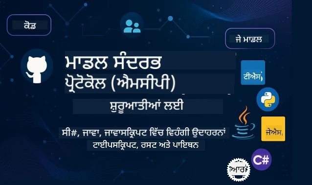

 

[](https://GitHub.com/microsoft/mcp-for-beginners/graphs/contributors)
[](https://GitHub.com/microsoft/mcp-for-beginners/issues)
[](https://GitHub.com/microsoft/mcp-for-beginners/pulls)
[](http://makeapullrequest.com)
[](https://mcptoplist.com/server/mcp.so%2Fmcp-for-beginners%2Fmicrosoft)

[](https://GitHub.com/microsoft/mcp-for-beginners/watchers)
[](https://GitHub.com/microsoft/mcp-for-beginners/fork)
[](https://GitHub.com/microsoft/mcp-for-beginners/stargazers)


[](https://discord.gg/nTYy5BXMWG)

ਇਹ ਸਰੋਤਾਂ ਦੀ ਵਰਤੋਂ ਸ਼ੁਰੂ ਕਰਨ ਲਈ ਇਹ ਕਦਮ ਫਾਲੋ ਕਰੋ:
1. **ਰੇਪੋਜ਼ਿਟਰੀ ਨੂੰ ਫੋਰਕ ਕਰੋ**: ਕਲਿੱਕ ਕਰੋ [](https://GitHub.com/microsoft/mcp-for-beginners/fork)
2. **ਰੇਪੋਜ਼ਿਟਰੀ ਕਲੋਨ ਕਰੋ**:   `git clone https://github.com/microsoft/mcp-for-beginners.git`
3. **ਸ਼ਾਮਲ ਹੋਵੋ** [](https://discord.gg/nTYy5BXMWG)


### 🌐 ਬਹੁ-ਭਾਸ਼ਾਈ ਸਹਿਯੋਗ

#### GitHub Action ਰਾਹੀਂ ਸਮਰਥਤ (ਆਟੋਮੈਟਿਕ ਅਤੇ ਹਮੇਸ਼ਾਂ ਅਪਡੇਟ ਹੁੰਦਾ ਰਹਿੰਦਾ)

<!-- CO-OP TRANSLATOR LANGUAGES TABLE START -->
[Arabic](../ar/README.md) | [Bengali](../bn/README.md) | [Bulgarian](../bg/README.md) | [Burmese (Myanmar)](../my/README.md) | [Chinese (Simplified)](../zh-CN/README.md) | [Chinese (Traditional, Hong Kong)](../zh-HK/README.md) | [Chinese (Traditional, Macau)](../zh-MO/README.md) | [Chinese (Traditional, Taiwan)](../zh-TW/README.md) | [Croatian](../hr/README.md) | [Czech](../cs/README.md) | [Danish](../da/README.md) | [Dutch](../nl/README.md) | [Estonian](../et/README.md) | [Finnish](../fi/README.md) | [French](../fr/README.md) | [German](../de/README.md) | [Greek](../el/README.md) | [Hebrew](../he/README.md) | [Hindi](../hi/README.md) | [Hungarian](../hu/README.md) | [Indonesian](../id/README.md) | [Italian](../it/README.md) | [Japanese](../ja/README.md) | [Kannada](../kn/README.md) | [Khmer](../km/README.md) | [Korean](../ko/README.md) | [Lithuanian](../lt/README.md) | [Malay](../ms/README.md) | [Malayalam](../ml/README.md) | [Marathi](../mr/README.md) | [Nepali](../ne/README.md) | [Nigerian Pidgin](../pcm/README.md) | [Norwegian](../no/README.md) | [Persian (Farsi)](../fa/README.md) | [Polish](../pl/README.md) | [Portuguese (Brazil)](../pt-BR/README.md) | [Portuguese (Portugal)](../pt-PT/README.md) | [Punjabi (Gurmukhi)](./README.md) | [Romanian](../ro/README.md) | [Russian](../ru/README.md) | [Serbian (Cyrillic)](../sr/README.md) | [Slovak](../sk/README.md) | [Slovenian](../sl/README.md) | [Spanish](../es/README.md) | [Swahili](../sw/README.md) | [Swedish](../sv/README.md) | [Tagalog (Filipino)](../tl/README.md) | [Tamil](../ta/README.md) | [Telugu](../te/README.md) | [Thai](../th/README.md) | [Turkish](../tr/README.md) | [Ukrainian](../uk/README.md) | [Urdu](../ur/README.md) | [Vietnamese](../vi/README.md)

> **ਕੀ ਤੁਸੀਂ ਲੋਕਲ ਕਲੋਨ ਪ੍ਰਾਥਮਿਕਤਾ ਦਿੰਦੇ ਹੋ?**
>
> ਇਹ ਰੇਪੋਜ਼ਿਟਰੀ 50+ ਭਾਸ਼ਾ ਅਨੁਵਾਦ शामिल ਕਰਦੀ ਹੈ ਜੋ ਡਾਊਨਲੋਡ ਸਾਈਜ਼ ਵੱਧਾ ਦਿੰਦੇ ਹਨ। ਬਿਨਾਂ ਅਨੁਵਾਦਾਂ ਦੇ ਕਲੋਨ ਕਰਨ ਲਈ sparse checkout ਵਰਤੋ:
>
> **Bash / macOS / Linux:**
> ```bash
> git clone --filter=blob:none --sparse https://github.com/microsoft/mcp-for-beginners.git
> cd mcp-for-beginners
> git sparse-checkout set --no-cone '/*' '!translations' '!translated_images'
> ```
>
> **CMD (Windows):**
> ```cmd
> git clone --filter=blob:none --sparse https://github.com/microsoft/mcp-for-beginners.git
> cd mcp-for-beginners
> git sparse-checkout set --no-cone "/*" "!translations" "!translated_images"
> ```
>
> ਇਹ ਤੁਹਾਨੂੰ ਕੋਰਸ ਪੂਰਾ ਕਰਨ ਲਈ ਸਭ ਕੁਝ ਤੇਜ਼ ਡਾਊਨਲੋਡ ਨਾਲ ਦਿੰਦਾ ਹੈ।
<!-- CO-OP TRANSLATOR LANGUAGES TABLE END -->

# 🚀 ਮਾਡਲ ਕਾਨਟੈਕਸਟ ਪ੍ਰੋਟੋਕੋਲ (MCP) ਨਿਵਆਰੇ ਲਈ ਕੋਰਸ

## **C#, Java, JavaScript, Rust, Python, ਅਤੇ TypeScript ਵਿੱਚ MCP ਨੂੰ ਕੌੜ੍ਹੀ ਕੋਡ ਉਦਾਹਰਨਾਂ ਨਾਲ ਸਿੱਖੋ**

## 🧠 ਮਾਡਲ ਕਾਨਟੈਕਸਟ ਪ੍ਰੋਟੋਕੋਲ ਕੋਰਸ ਦਾ ਜਾਇਜ਼ਾ
ਤੁਹਾਡੇ ਮਾਡਲ ਕਾਨਟੈਕਸਟ ਪ੍ਰੋਟੋਕੋਲ ਯਾਤਰਾ ਵਿੱਚ ਤੁਹਾਡਾ ਸਵਾਗਤ ਹੈ! ਜੇ ਤੁਸੀਂ ਕਦੇ ਸੋਚਿਆ ਹੈ ਕਿ AI ਐਪਲੀਕੇਸ਼ਨ ਕਿਵੇਂ ਵੱਖ-ਵੱਖ ਟੂਲਾਂ ਅਤੇ ਸੇਵਾਵਾਂ ਨਾਲ ਗੱਲ ਕਰਦੀਆਂ ਹਨ, ਤਾਂ ਤੁਸੀਂ ਉਸ ਸੁੰਦਰ ਹੱਲ ਨੂੰ ਖੋਜਣ ਜਾ ਰਹੇ ਹੋ ਜੋ ਡਿਵੈਲਪਰਾਂ ਨੂੰ ਸਮਰੱਥ ਅਤੇ ਲਚਕੀਲੇ ਸਿਸਟਮ ਬਣਾਉਣ ਵਿੱਚ ਸਹਾਇਤਾ ਕਰ ਰਿਹਾ ਹੈ।

MCP ਨੂੰ ਇੱਕ ਯੂਨੀਵਰਸਲ ਅਨੁਵਾਦਕ ਦੇ ਤੌਰ ਤੇ ਸੋਚੋ - ਬਿਲਕੁਲ ਉਸ ਤਰ੍ਹਾਂ ਜਿਵੇਂ USB ਪੋਰਟ ਤੁਹਾਨੂੰ ਕਿਸੇ ਵੀ ਡਿਵਾਈਸ ਨੂੰ ਕਨੈਕਟ ਕਰਨ ਦਿੰਦਾ ਹੈ, MCP AI ਮਾਡਲਾਂ ਨੂੰ ਕਿਸੇ ਵੀ ਟੂਲ ਜਾਂ ਸੇਵਾ ਨਾਲ ਇੱਕ ਮਿਆਰੀ ਢੰਗ ਨਾਲ ਜੋੜਨ ਦਿੰਦਾ ਹੈ। ਚਾਹੇ ਤੁਸੀਂ ਆਪਣਾ ਪਹਿਲਾ ਚੈਟਬੋਟ ਬਣਾ ਰਹੇ ਹੋ ਜਾਂ ਜਟਿਲ AI ਵਰਕਫਲੋਅਜ਼ ‘ਤੇ ਕੰਮ ਕਰ ਰਹੇ ਹੋ, MCP ਨੂੰ ਸਮਝਣ ਨਾਲ ਤੁਹਾਨੂੰ ਕਮਜ਼ੋਰ ਅਤੇ ਲਚਕੀਲੇ ਐਪਲੀਕੇਸ਼ਨ ਬਣਾਉਣ ਦੀ ਤਾਕਤ ਮਿਲੇਗੀ।

ਇਹ ਕੋਰਸ ਤੁਹਾਡੇ ਸਿੱਖਣ ਦੀ ਯਾਤਰਾ ਲਈ ਧੀਰਜ ਅਤੇ ਧਿਆਨ ਨਾਲ ਡਿਜ਼ਾਈਨ ਕੀਤਾ ਗਿਆ ਹੈ। ਅਸੀਂ ਸੌਖੇ ਸਿਧਾਂਤਾਂ ਨਾਲ ਸ਼ੁਰੂ ਕਰਾਂਗੇ ਜੋ ਤੁਸੀਂ ਪਹਿਲਾਂ ਤੋਂ ਸਮਝਦੇ ਹੋ ਅਤੇ ਧੀਰੇ-ਧੀਰੇ ਆਪਣੇ ਮਨਪਸੰਦ ਪ੍ਰੋਗ੍ਰਾਮਿੰਗ ਭਾਸ਼ਾ ਵਿੱਚ ਹੱਥ-ਓਂਹਦਾ ਅਭਿਆਸ ਨਾਲ ਆਪਣੀ ਕਾਬਲियत ਵਧਾਵਾਂਗੇ। ਹਰ ਕਦਮ ਵਿੱਚ ਸਾਫ਼ ਸਮਝਾਓ, ਪ੍ਰਯੋਗਾਤਮਕ ਉਦਾਹਰਨਾਂ ਅਤੇ ਕਾਫ਼ੀ ਪ੍ਰੋਤਸਾਹਨ ਸ਼ਾਮਲ ਹੈ।

ਜਦੋਂ ਤੁਸੀਂ ਇਹ ਯਾਤਰਾ ਮੁਕੰਮਲ ਕਰ ਲੋਗੇ, ਤਾਂ ਤੁਹਾਡੇ ਕੋਲ ਆਪਣਾ MCP ਸਰਵਰ ਬਣਾਉਣ, ਮਸ਼ਹੂਰ AI ਪਲੇਟਫਾਰਮਾਂ ਨਾਲ ਇੰਟੀਗ੍ਰੇਟ ਕਰਨ ਅਤੇ ਸਮਝਣ ਦੀ ਸੰਪੂਰਨ ਯੋਗਤਾ ਹੋਵੇਗੀ ਕਿ ਇਹ ਤਕਨਾਲੋਜੀ AI ਵਿਕਾਸ ਦੇ ਭਵਿੱਖ ਨੂੰ ਕਿਵੇਂ ਬਦਲ ਰਹੀ ਹੈ। ਆਓ ਇਸ ਰੋਮਾਂਚਕ ਸਫ਼ਰ ਦੀ ਸ਼ੁਰੂਆਤ ਕਰੀਏ!

### ਅਧਿਕਾਰਿਕ ਦਸਤਾਵੇਜ਼ ਅਤੇ ਵਿਸ਼ੇਸ਼ਤਾਵਾਂ

ਇਹ ਕੋਰਸ **MCP Specification 2025-11-25** (ਸਭ ਤੋਂ ਨਵੀਂ ਸਥਿਰ ਰਿਲੀਜ਼) ਦੇ ਅਨੁਕੂਲ ਹੈ। MCP ਵਿਸ਼ੇਸ਼ਤਾ ਤਾਰੀਖ आधारित ਵਰਜ਼ਨਿੰਗ (YYYY-MM-DD ਫਾਰਮੈਟ) ਵਰਤਦੀ ਹੈ ਤਾਂ ਕਿ ਪ੍ਰੋਟੋਕੋਲ ਵਰਜ਼ਨ ਟ੍ਰੈਕਿੰਗ ਸਪਸ਼ਟ ਹੋਵੇ।

> **ਅਗਲੀ ਨਜ਼ਰ:** ਅਗਲੀ ਵਿਸ਼ੇਸ਼ਤਾ ਵਰਜ਼ਨ, **2026-07-28**, ਦੀ ਰਿਲੀਜ਼ ਕੈਂਡੀਡੇਟ 28 ਜੁਲਾਈ, 2026 ਨੂੰ ਜਾਰੀ ਹੋਣੀ ਹੈ। ਇਹ ਪ੍ਰੋਟੋਕੋਲ ਨੂੰ ਟਰਾਂਸਪੋਰਟ ਲੇਅਰ ‘ਤੇ ਸਟੇਟਲੇਸ ਬਣਾਉਂਦਾ ਹੈ, ਐਕਸਟੈਂਸ਼ਨ ਫਰੇਮਵਰਕ (MCP Apps, Tasks) ਨੂੰ ਫ਼ਾਰਮਲ ਕਰਦਾ ਹੈ, ਅਧਿਕਾਰਿਕਤਾ ਨੂੰ ਮਜ਼ਬੂਤ ਕਰਦਾ ਹੈ ਅਤੇ Roots, Sampling, ਅਤੇ Logging ਨੂੰ ਡੀਪ੍ਰੇਕੇਟ ਕਰਦਾ ਹੈ। ਪੂਰਾ ਵੇਰਵਾ ਵੇਖਣ ਲਈ [What's Changing in MCP: The 2026-07-28 Release Candidate](./01-CoreConcepts/mcp-2026-07-28-release-candidate.md) ਚੈੱਕ ਕਰੋ।

ਇਹ ਸਰੋਤ ਜਿਵੇਂ ਤੁਹਾਡੀ ਸਮਝ ਵਧਦੀ ਹੈ ਉਨ੍ਹਾਂ ਦੀ ਕੀਮਤ ਵੱਧਦੀ ਹੈ, ਪਰ ਫਿੰਡ ਤੁਰੰਤ ਸਭ ਕੁਝ ਪੜ੍ਹਨ ਦਾ ਬੋਝ ਮਹਿਸੂਸ ਨਾ ਕਰੋ। ਪਹਿਲਾਂ ਉਹ ਖੇਤਰ ਸ਼ੁਰੂ ਕਰੋ ਜਿਹੜੇ ਤੁਹਾਨੂੰ ਸਭ ਤੋਂ ਜ਼ਿਆਦਾ ਰੁਚੀ ਵਾਲੇ ਹਨ!
- 📘 [MCP ਦਸਤਾਵੇਜ਼](https://modelcontextprotocol.io/) – ਇਹ ਤੁਹਾਡਾ ਸਬ ਤੋਂ ਵਧੀਆ ਸਰੋਤ ਹੈ ਕਦਮ-ਦਰ-ਕਦਮ ਟਿਊਟੋਰੀਅਲ ਅਤੇ ਯੂਜ਼ਰ ਗਾਈਡਜ਼ ਲਈ। ਦਸਤਾਵੇਜ਼ ਨਵਾਂ-ਆਏ ਲੋਕਾਂ ਲਈ ਲਿਖਿਆ ਗਿਆ ਹੈ, ਸਾਫ਼ ਉਦਾਹਰਨਾਂ ਜੋ ਤੁਸੀਂ ਆਪਣੇ ਢੰਗ ਨਾਲ ਅੰਨਦੁਕ ਕਰ ਸਕਦੇ ਹੋ।
- 📜 [MCP ਵਿਸ਼ੇਸ਼ਤਾ](https://modelcontextprotocol.io/specification/2025-11-25) – ਇਸ ਨੂੰ ਆਪਣਾ ਬਹੁਤ ਵਿਸਤ੍ਰਤ ਸੰਦਰਭ ਮੈਨੂਅਲ ਸਮਝੋ। ਕੋਰਸ ਕਰਦੇ ਹੋਏ, ਤੁਸੀਂ ਵੱਖਰੀਆਂ ਜਾਣਕਾਰੀਆਂ ਲਈ ਇੱਥੇ ਵਾਪਸ ਆਉਂਦੇ ਹੋ ਅਤੇ ਅਡਵਾਂਸ ਵਿਸ਼ੇਸ਼ਤਾਵਾਂ ਨੂੰ ਪੜ੍ਹਦੇ ਹੋ।
- 📜 [MCP ਵਿਸ਼ੇਸ਼ਤਾ ਵਰਜ਼ਨਿੰਗ](https://modelcontextprotocol.io/specification/versioning) – ਇਸ ਵਿੱਚ ਪ੍ਰੋਟੋਕੋਲ ਵਰਜ਼ਨ ਇਤਿਹਾਸ ਅਤੇ MCP ਤਾਰੀਖ ਅਧਾਰਿਤ ਵਰਜ਼ਨਿੰਗ (YYYY-MM-DD ਫਾਰਮੈਟ) ਬਾਰੇ ਜਾਣਕਾਰੀ ਹੈ।
- 🧑‍💻 [MCP GitHub ਰੇਪੋਜ਼ਿਟਰੀ](https://github.com/modelcontextprotocol) – ਇੱਥੇ ਤੁਹਾਨੂੰ SDKs, ਟੂਲ, ਅਤੇ ਕਈ ਪ੍ਰੋਗ੍ਰਾਮਿੰਗ ਭਾਸ਼ਾਵਾਂ ਵਿੱਚ ਕੋਡ ਨਮੂਨੇ ਮਿਲਣਗੇ। ਇਹ ਪ੍ਰਯੋਗਕਾਰੀ ਉਦਾਹਰਨਾਂ ਅਤੇ ਤਿਆਰ ਹਿੱਸਿਆਂ ਦਾ ਖਜ਼ਾਨਾ ਹੈ।
- 🌐 [MCP ਕਮਿਊਨਿਟੀ](https://github.com/orgs/modelcontextprotocol/discussions) – MCP ਬਾਰੇ ਸਿੱਖਣ ਵਾਲੇ ਅਤੇ ਅਨੁਭਵੀ ਡਿਵੈਲਪਰਾਂ ਨਾਲ ਗੱਲਬਾਤ ਵਿੱਚ ਸ਼ਾਮਲ ਹੋਵੋ। ਇਹ ਇੱਕ ਸਹਾਇਕ ਸਮੁਦਾਇ ਹੈ ਜਿੱਥੇ ਸਵਾਲ ਸਵਾਗਤਯੋਗ ਹਨ ਅਤੇ ਗਿਆਨ ਖੁੱਲ੍ਹੇ ਤੌਰ ਤੇ ਵੰਡਿਆ ਜਾਂਦਾ ਹੈ।
  
## ਸਿੱਖਣ ਦੇ ਉਦੇਸ਼

ਇਸ ਕੋਰਸ ਦੇ ਅੰਤ ਤੱਕ, ਤੁਸੀਂ ਆਪਣੇ ਨਵੇਂ ਹੁਨਰਾਂ ਬਾਰੇ ਵਿਸ਼ਵਾਸੀ ਅਤੇ ਉਤਸ਼ਾਹੀਤ ਮਹਿਸੂਸ ਕਰੋਗੇ। ਇਹ ਹੈ ਜੋ ਤੁਸੀਂ ਪ੍ਰਾਪਤ ਕਰੋਗੇ:

• **MCP ਮੁੱਢਲੇ ਤੱਤ ਨੂੰ ਸਮਝੋ**: ਤੁਸੀਂ ਸਮਝੋਗੇ ਕਿ Model Context Protocol ਕੀ ਹੈ ਅਤੇ ਇਹ AI ਐਪਲੀਕੇਸ਼ਨਾਂ ਦੇ ਸਹਿਯੋਗ ਵਿਚ ਕਿਵੇਂ ਇਨਕਲਾਬ ਲਾ ਰਿਹਾ ਹੈ, ਉਹ ਵੀ ਸਧਾਰਣ ਉਦਾਹਰਨ ਅਤੇ ਤਰକ ਨਾਲ।

• **ਆਪਣਾ ਪਹਿਲਾ MCP ਸਰਵਰ ਬਣਾਓ**: ਤੁਸੀਂ ਆਪਣੀ ਮਨਪਸੰਦ ਪ੍ਰੋਗ੍ਰਾਮਿੰਗ ਭਾਸ਼ਾ ਵਿੱਚ ਕਾਰਗਰ MCP ਸਰਵਰ ਬਣਾਓਗੇ, ਸੌਖੇ ਉਦਾਹਰਨਾਂ ਨਾਲ ਸ਼ੁਰੂ ਕਰਕੇ ਕਦਮ-ਦਰ-ਕਦਮ ਆਪਣੇ ਹੁਨਰ ਵਧਾਓਗੇ।

• **AI ਮਾਡਲਾਂ ਨੂੰ ਅਸਲ ਟੂਲਾਂ ਨਾਲ ਜੋੜੋ**: ਤੁਸੀਂ ਸਿੱਖੋਗੇ ਕਿ AI ਮਾਡਲਾਂ ਅਤੇ ਅਸਲ ਸੇਵਾਵਾਂ ਵਿਚਕਾਰ ਪੈਲ ਬਣਾਉਣੀ ਕਿਵੇਂ ਹੈ, ਆਪਣੇ ਐਪਲੀਕੇਸ਼ਨਾਂ ਨੂੰ ਨਵੀਆਂ ਸ਼ਕਤੀਆਂ ਦੇਣ ਲਈ।

• **ਸੁਰੱਖਿਆ ਦੇ ਵਧੀਆ ਤਰੀਕੇ ਲਾਗੂ ਕਰੋ**: ਤੁਸੀਂ ਸਮਝੋਗੇ ਕਿ MCP ਇੰਪਲੀਮੈਂਟੇਸ਼ਨ ਨੂੰ ਕਿਵੇਂ ਸੁਰੱਖਿਅਤ ਅਤੇ ਸੁਰੱਖਿਅਤ ਬਣਾਇਆ ਜਾ ਸਕਦਾ ਹੈ, ਆਪਣੇ ਐਪਸ ਅਤੇ ਉਪਭੋਗਤਾਂ ਦੀ ਰੱਖਿਆ ਲਈ।

• **ਵਿਸ਼ਵਾਸ ਨਾਲ ਤਾਇਨਾਤ ਕਰੋ**: ਤੁਸੀਂ ਜਾਣੋਗੇ ਕਿ MCP ਪ੍ਰਾਜੈਕਟਾਂ ਨੂੰ ਵਿਕਾਸ ਤੋਂ ਉਤਪਾਦਨ ਤੱਕ ਕਿਵੇਂ ਲੈ ਜਾਣਾ ਹੈ, ਵਿਅਵਹਾਰਿਕ ਤਾਇਨਾਤੀ ਰਣਨੀਤੀਆਂ ਦੇ ਨਾਲ ਜੋ ਅਸਲ ਜ਼ਿੰਦਗੀ ਵਿੱਚ ਕੰਮ ਕਰਦੀਆਂ ਹਨ।

• **MCP ਕਮਿਊਨਿਟੀ ਨਾਲ ਜੁੜੋ**: ਤੁਸੀਂ ਡਿਵੈਲਪਰਾਂ ਦੇ ਇਕ ਵੱਧ ਰਹੀ ਕਮਿਊਨਿਟੀ ਦਾ ਹਿੱਸਾ ਬਣ ਜਾਓਗੇ, ਜੋ AI ਐਪਲੀਕੇਸ਼ਨ ਵਿਕਾਸ ਦਾ ਭਵਿੱਖ ਗਠਿਤ ਕਰ ਰਹੀ ਹੈ। 

## ਜ਼ਰੂਰੀ ਪਿਛੋਕੜ

MCP ਵਿਸ਼ੇਸ਼ਤਾਵਾਂ ਵਿੱਚ ਸ਼ੁਰੂ ਕਰਨ ਤੋਂ ਪਹਿਲਾਂ, ਆਓ ਇਹ ਯਕੀਨੀ ਬਣਾਈਏ ਕਿ ਤੁਸੀਂ ਕੁਝ ਬੁਨਿਆਦੀ ਵਿਚਾਰਾਂ ਨਾਲ ਕੁਸ਼ਲ ਹੋ। ਚਿੰਤਾ ਨਾ ਕਰੋ ਜੇ ਤੁਹਾਨੂੰ ਇਨ੍ਹਾਂ ਖੇਤਰਾਂ ਵਿੱਚ ਮਹਿਰਤ ਨਹੀਂ, ਅਸੀਂ ਹਰ ਇੱਕ ਗੱਲ ਦੇਣਗੇ ਜਿਵੇਂ ਅਸੀਂ ਅੱਗੇ ਵਧਦੇ ਹਾਂ!

### ਪ੍ਰੋਟੋਕੋਲ ਨੂੰ ਸਮਝਣਾ (ਬੁਨਿਆਦ)

ਪ੍ਰੋਟੋਕੋਲ ਨੂੰ ਸਾਂਝੇ ਕੀਤੇ ਗਏ ਨਿਯਮਾਂ ਵਾਂਗ ਸੋਚੋ। ਜਦੋਂ ਤੁਸੀਂ ਕਿਸੇ ਦੋਸਤ ਨੂੰ ਕਾਲ ਕਰਦੇ ਹੋ, ਤੁਸੀਂ ਦੋਹਾਂ "ਹੈਲੋ" ਕਹਿਣਾ ਅਤੇ ਬਦਲੇ ਵਿੱਚ ਬੋਲਦੇ ਹੋ, ਅਤੇ "ਅਲਵਿਦਾ" ਕਹਿਣ ਦੇ ਨਾਲ ਗੱਲਬਾਤ ਖਤਮ ਕਰਦੇ ਹੋ। ਕੰਪਿਊਟਰ ਪ੍ਰੋਗਰਾਮਾਂ ਨੂੰ ਵੀ ਕੁਝ ਇਸੇ ਤਰ੍ਹਾਂ ਨਿਯਮਾਂ ਦੀ ਲੋੜ ਹੁੰਦੀ ਹੈ ਤਾਂ ਜੋ ਉਹ ਸਮਰਥ ਤਰੀਕੇ ਨਾਲ ਗੱਲ ਕਰ ਸਕਣ।

MCP ਇੱਕ ਪ੍ਰੋਟੋਕੋਲ ਹੈ - ਐਸਾ ਇੱਕ ਸਮੂਹ ਨਿਯਮਾਂ ਦਾ ਜੋ AI ਮਾਡਲਾਂ ਅਤੇ ਐਪਲੀਕੇਸ਼ਨਾਂ ਨੂੰ ਟੂਲਾਂ ਅਤੇ ਸੇਵਾਵਾਂ ਨਾਲ ਉਤਪਾਦਕ "ਗੱਲਬਾਤ" ਕਰਨ ਵਿੱਚ ਸਹਾਇਤਾ ਕਰਦਾ ਹੈ। ਜਿਸ ਤਰ੍ਹਾਂ ਗੱਲ ਕਰਨ ਦੇ ਨਿਯਮ ਮਨੁੱਖੀ ਸੰਚਾਰ ਨੂੰ ਸੌਖਾ ਬਣਾਉਂਦੇ ਹਨ, ਉਸੇ ਤਰ੍ਹਾਂ MCP AI ਐਪਲੀਕੇਸ਼ਨ ਦੀ ਗੱਲਬਾਤ ਨੂੰ ਬਹੁਤ ਜ਼ਿਆਦਾ ਭਰੋਸੇਯੋਗ ਅਤੇ ਸਮਰੱਥ ਬਣਾਉਂਦਾ ਹੈ।

### ਕਲੀਐਂਟ-ਸਰਵਰ ਸੰਬੰਧ (ਪ੍ਰੋਗਰਾਮਾਂ ਦਾ ਮਿਲ ਕੇ ਕੰਮ ਕਰਨਾ)

ਤੁਸੀਂ ਹਰ ਰੋਜ਼ ਕਲੀਐਂਟ-ਸਰਵਰ ਸੰਬੰਧਾਂ ਦਾ ਉਪਯੋਗ ਕਰਦੇ ਹੋ! ਜਦੋਂ ਤੁਸੀਂ ਇੱਕ ਵੈੱਬ ਬ੍ਰਾਊਜ਼ਰ (ਕਲੀਐਂਟ) ਨਾਲ ਵੈੱਬਸਾਈਟ ਵੇਖਦੇ ਹੋ, ਤਾਂ ਤੁਸੀਂ ਇੱਕ ਵੈੱਬ ਸਰਵਰ ਨਾਲ ਜੁੜਦੇ ਹੋ ਜੋ ਤੁਸੀਂ ਪੇਜ ਦਾ ਸਮੱਗਰੀ ਭੇਜਦਾ ਹੈ। ਬ੍ਰਾਊਜ਼ਰ ਜਾਣਦਾ ਹੈ ਕਿ ਜਾਣਕਾਰੀ ਕਿਵੇਂ ਮੰਗਨੀ ਹੈ, ਅਤੇ ਸਰਵਰ ਜਾਣਦਾ ਹੈ ਕਿ ਕਿਵੇਂ ਜਵਾਬ ਦੇਣਾ ਹੈ।

MCP ਵਿੱਚ, ਸਾਡੇ ਕੋਲ ਇੰਝ ਹੀ ਇਕ ਸੰਬੰਧ ਹੈ: AI ਮਾਡਲ ਕਲੀਐਂਟ ਵਾਂਗ ਵਹਵਾਰ ਕਰਦੇ ਹਨ ਜੋ ਜਾਣਕਾਰੀ ਜਾਂ ਕਾਰਵਾਈਆਂ ਦੀ ਮੰਗ ਕਰਦੇ ਹਨ, ਜਦਕਿ MCP ਸਰਵਰ ਉਹ ਸਮਰੱਥਾ ਦਿੰਦੇ ਹਨ। ਇਹ ਇਕ ਸਹਾਇਕ ਮਦਦਗਾਰ (ਸਰਵਰ) ਵਾਂਗ ਹੈ ਜਿਸਨੂੰ AI ਕਿਸੇ ਖਾਸ ਟਾਸਕ ਨਾਲ ਜੁੜਨ ਲਈ ਪੁੱਛ ਸਕਦਾ ਹੈ।

### ਮਿਆਰੀਕਰਨ ਦੀ ਮਹੱਤਤਾ (ਚੀਜ਼ਾਂ ਨੂੰ ਮੀਲ ਬੈਠਾਉਣਾ)

ਸੋਚੋ ਕਿ ਹਰ ਕਾਰ ਨਿਰਮਾਤਾ ਵੱਖ-ਵੱਖ ਆਕਾਰ ਦੇ ਗੈਸ ਪੰਪ ਵਰਤਦਾ - ਹਰ ਕਾਰ ਲਈ ਤੁਹਾਨੂੰ ਵੱਖਰਾ ਐਡਾਪਟਰ ਲੱਗੇਗਾ! ਮਿਆਰੀਕਰਨ ਦਾ ਮਤਲਬ ਹੈ ਸਾਥ-ਸਾਥ ਆਮ ਤਰੀਕਿਆਂ 'ਤੇ ਸਹਿਮਤੀ ਜਿਵੇਂ ਚੀਜ਼ਾਂ ਬਿਨਾਂ ਰੁਕਾਵਟ ਕੰਮ ਕਰਨ।

MCP AI ਐਪਲੀਕੇਸ਼ਨਾਂ ਲਈ ਇਹ ਮੰਇਆਰੀਕਰਨ ਦਿੰਦਾ ਹੈ। ਹਰ AI ਮਾਡਲ ਨੂੰ ਹਰ ਟੂਲ ਨਾਲ ਕੰਮ ਕਰਨ ਲਈ ਵਿਸ਼ੇਸ਼ ਕੋਡ ਦੀ ਲੋੜ ਨਾ ਹੋਵੇ, MCP ਉਹਨਾਂ ਲਈ ਇੱਕ ਸਾਰਵਜਨਿਕ ਤਰੀਕਾ ਤਿਆਰ ਕਰਦਾ ਹੈ। ਇਸਦਾ ਮਤਲਬ ਹੈ ਕਿ ਡਿਵੈਲਪਰ ਟੂਲ ਇਕ ਵਾਰੀ ਬਣਾਉਂਦੇ ਹਨ ਅਤੇ ਉਹ ਕਈ AI ਸਿਸਟਮਾਂ ਨਾਲ ਕੰਮ ਕਰਦੇ ਹਨ।

## 🧭 ਤੁਹਾਡਾ ਸਿੱਖਣ ਦਾ ਰਾਹ

ਤੁਹਾਡੀ MCP ਯਾਤਰਾ ਧੀਆਂ ਨਾਲ ਇਹੋ ਜਿਹੇ ਕਦਮਾਂ ਨਾਲ ਤੁਹਾਡਾ ਵਿਸ਼ਵਾਸ ਅਤੇ ਹੁਨਰ ਧੀਰੇ-ਧੀਰੇ ਬਣਾਏਗੀ। ਹਰ ਮੈਲ ਖੰਡ ਨਵੇਂ ਤੱਤ ਪੇਸ਼ ਕਰਦਾ ਹੈ ਜਦਕਿ ਪਹਿਲਾਂ ਸਿੱਖੀਆਂ ਨੂੰ ਦੁਹਰਾਉਂਦਾ ਹੈ।

### 🌱 ਬੁਨਿਆਦੀ ਪੜਾਅ: modi ਬੁਨਿਆਦ ਨੂੰ ਸਮਝਣਾ (ਮੌਡੀਊਲ 0-2)

ਇਹੀ ਤੁਹਾਡੀ ਯਾਤਰਾ ਦੀ ਸ਼ੁਰੂਆਤ ਹੈ! ਅਸੀਂ ਤੁਹਾਡੇ ਲਈ MCP ਧਾਰਣਾਵਾਂ ਨੂੰ ਜਾਣੂ ਅਮਿਸ਼ਰਣਾਂ ਅਤੇ ਸੌਖੇ ਉਦਾਹਰਨਾਂ ਨਾਲ ਪੇਸ਼ ਕਰਾਂਗੇ। ਤੁਸੀਂ ਸਮਝੋਗੇ ਕਿ MCP ਕੀ ਹੈ, ਇਹ ਮੌਜੂਦ ਕਿਉਂ ਹੈ, ਅਤੇ ਕਿਵੇਂ ਇਹ AI ਵਿਕਾਸ ਦੀ ਵੱਡੀ ਦੁਨੀਆ ਵਿੱਚ ਫਿੱਟ ਹੁੰਦਾ ਹੈ।


• **ਮੋਡਿਊਲ 0 - MCP ਦਾ ਪਰਿਚਯ**: ਅਸੀਂ MCP ਕੀ ਹੈ ਅਤੇ ਇਹ ਆਧੁਨਿਕ AI ਐਪਲੀਕੇਸ਼ਨਾਂ ਲਈ ਕਿੰਨਾ ਮਹੱਤਵਪੂਰਨ ਹੈ, ਇਸ ਦੀ ਖੋਜ ਕਰਾਂਗੇ। ਤੁਸੀਂ MCP ਦੇ ਕਾਰਜਕਾਰੀ ਉਦਾਹਰਣ ਦੇਖੋਗੇ ਅਤੇ ਸਮਝੋਂਗੇ ਕਿ ਇਹ ਵਿਕਾਸਕਾਰਾਂ ਨੂੰ ਆਮ ਸਮੱਸਿਆਵਾਂ ਕਿਵੇਂ ਹੱਲ ਕਰਦਾ ਹੈ।

• **ਮੋਡਿਊਲ 1 - ਮੁੱਖ ਸੰਕਲਪ ਸਮਝਾਏ ਗਏ**: ਇਥੇ ਤੁਸੀਂ MCP ਦੇ ਬੁਨਿਆਦੀ ਤੱਤ ਸਿੱਖੋਗੇ। ਇਹ ਸੰਕਲਪ ਕੁਦਰਤੀ ਅਤੇ ਸਮਝਣ ਯੋਗ ਲੱਗਣ ਲਈ ਅਸੀਂ ਬਹੁਤ ਸਾਰੇ ਉਦਾਹਰਣ ਅਤੇ ਦ੍ਰਿਸ਼ੀ ਸਮਝਾਹਟਾਂ ਦੀ ਵਰਤੋਂ ਕਰਾਂਗੇ।

• **ਮੋਡਿਊਲ 2 - MCP ਵਿੱਚ ਸੁਰੱਖਿਆ**: ਸੁਰੱਖਿਆ ਹੌਂਸਲਾ ਢਹਾਉਣ ਵਾਲੀ ਲੱਗ ਸਕਦੀ ਹੈ, ਪਰ ਅਸੀਂ ਤੁਹਾਨੂੰ ਦਿਖਾਵਾਂਗੇ ਕਿ MCP ਵਿਚ ਨਿਰਮਿਤ ਸੁਰੱਖਿਆ ਵਿਸ਼ੇਸ਼ਤਾਵਾਂ ਹੁੰਦੀਆਂ ਹਨ ਅਤੇ ਤੁਹਾਡੇ ਐਪਲੀਕੇਸ਼ਨਾਂ ਨੂੰ ਸ਼ੁਰੂਆਤ ਤੋਂ ਹੀ ਸੁਰੱਖਿਅਤ ਰੱਖਣ ਲਈ ਸ੍ਰੇਸ਼ਠ ਅਭਿਆਸ ਸਿਖਾਵਾਂਗੇ।

### 🔨 ਨਿਰਮਾਣ ਚਰਨ: ਤੁਹਾਡੇ ਪਹਿਲੇ ਇੰਪਲੀਮੈਂਟੇਸ਼ਨਾਂ ਦਾ ਸਿਰਜਣ (ਮੋਡਿਊਲ 3)

ਹੁਣ ਅਸਲ ਮਜ਼ਾ ਸ਼ੁਰੂ ਹੁੰਦਾ ਹੈ! ਤੁਹਾਨੂੰ ਵਾਸਤਵਿਕ MCP ਸਰਵਰ ਅਤੇ ਕਲਾਇੰਟ ਬਣਾਉਣ ਦਾ ਹੱਥੋਂ ਹੱਥ ਅਨੁਭਵ ਮਿਲੇਗਾ। ਚਿੰਤਾ ਨਾ ਕਰੋ - ਅਸੀਂ ਸਧਾਰਣ ਤੋਂ ਸ਼ੁਰੂ ਕਰਾਂਗੇ ਅਤੇ ਹਰ ਕਦਮ ਦਾ ਮਾਰਗਦਰਸ਼ਨ ਕਰਾਂਗੇ।

ਇਸ ਮੋਡਿਊਲ ਵਿੱਚ ਕਈ ਹੱਥੋਂ ਹੱਥ ਗਾਈਡ ਸ਼ਾਮਲ ਹਨ ਜੋ ਤੁਹਾਨੂੰ ਆਪਣੀ ਪਸੰਦ ਦੀ ਪ੍ਰੋਗਰਾਮਿੰਗ ਭਾਸ਼ਾ ਵਿੱਚ ਅਭਿਆਸ ਕਰਨ ਦਿੰਦੇ ਹਨ। ਤੁਸੀਂ ਆਪਣਾ ਪਹਿਲਾ ਸਰਵਰ ਬਣਾਵੋਗੇ, ਉਸ ਨਾਲ ਜੁੜਨ ਲਈ ਕਲਾਇੰਟ ਬਣਾਵੋਗੇ, ਅਤੇ VS Code ਵਰਗੇ ਲੋਕਪ੍ਰਿਯ ਵਿਕਾਸੀਕ ਉਪਕਰਨਾਂ ਨਾਲ ਇੰਟੀਗ੍ਰੇਟ ਵੀ ਕਰਾਂਗੇ।

ਹਰੇਕ ਗਾਈਡ ਵਿੱਚ ਪੂਰੇ ਕੋਡ ਉਦਾਹਰਣ, ਸਮੱਸਿਆ ਨਿਵਾਰਣ ਸੁਝਾਅ, ਅਤੇ ਸਾਡੇ ਵਿਸ਼ੇਸ਼ ਡਿਜ਼ਾਈਨ ਚੋਣਾਂ ਦੇ ਕਾਰਨ ਦੀ ਵਿਆਖਿਆ ਸ਼ਾਮਲ ਹੈ। ਇਸ ਚਰਨ ਦੇ ਅੰਤ ਵਿੱਚ, ਤੁਹਾਡੇ ਕੋਲ ਕਾਰਗਰ MCP ਇੰਪਲੀਮੈਂਟੇਸ਼ਨ ਹੋਣਗੇ ਜਿਨ੍ਹਾਂ 'ਤੇ ਤੁਸੀਂ ਗਰਵ ਮਹਿਸੂਸ ਕਰ ਸਕਦੇ ਹੋ!

### 🚀 ਵਿਕਾਸ ਚਰਨ: ਅੱਗੇ ਦੇ ਸੰਕਲਪ ਅਤੇ ਹਕੀਕਤੀ ਲਾਗੂ ਕਰਨਾ (ਮੋਡਿਊਲ 4-5)

ਬੁਨਿਆਦਾਂ ਮਾਹਿਰ ਕਰ ਲੈਣ ਤੋਂ ਬਾਅਦ, ਤੁਸੀਂ MCP ਦੀਆਂ ਹੋਰ ਸੁਧਾਰਤ ਵਿਸ਼ੇਸ਼ਤਾਵਾਂ ਦੀ ਖੋਜ ਕਰਨ ਲਈ ਤਿਆਰ ਹੋ। ਅਸੀਂ ਕਾਰਗਰ ਇੰਪਲੀਮੈਂਟੇਸ਼ਨ ਰਣਨੀਤੀਆਂ, ਡਿਬੱਗਿੰਗ ਤਕਨੀਕਾਂ, ਅਤੇ ਮਲਟੀ-ਮੋਡਲ AI ਇੰਟੀਗ੍ਰੇਸ਼ਨ ਵਰਗੇ ਉन्नਤ ਵਿਸ਼ਿਆਂ ਨੂੰ ਕਵਰ ਕਰਾਂਗੇ।

ਤੁਸੀਂ ਇਹ ਵੀ ਸਿੱਖੋਗੇ ਕਿ MCP ਇੰਪਲੀਮੈਂਟੇਸ਼ਨਾਂ ਨੂੰ ਪ੍ਰੋਡਕਸ਼ਨ ਲਈ ਕਿਵੇਂ ਸਕੇਲ ਕਰਨਾ ਹੈ ਅਤੇ Azure ਵਰਗੇ ਕਲਾਊਡ ਪਲੇਟਫਾਰਮਾਂ ਨਾਲ ਕਿਵੇਂ ਇੰਟੀਗ੍ਰੇਟ ਕਰਨਾ ਹੈ। ਇਹ ਮੋਡਿਊਲ ਤੁਹਾਨੂੰ ਅਜਿਹੇ MCP ਸਮਾਧਾਨ ਬਣਾਉਣ ਲਈ ਤਿਆਰ ਕਰਦੇ ਹਨ ਜੋ ਹਕੀਕਤੀ ਸੰਸਾਰ ਦੀਆਂ ਮੰਗਾਂ ਨੂੰ ਸੰਭਾਲ ਸਕਦੇ ਹਨ।

### 🌟 ਮਾਸਟਰੀ ਚਰਨ: ਕਮਿਊਨਿਟੀ ਅਤੇ ਵਿਸ਼ੇਸ਼ਤਾ (ਮੋਡਿਊਲ 6-11)

ਆਖਰੀ ਚਰਨ MCP ਕਮਿਊਨਿਟੀ ਵਿੱਚ ਸ਼ਾਮਲ ਹੋਣ ਅਤੇ ਉਹਨਾਂ ਖੇਤਰਾਂ ਵਿੱਚ ਵਿਸ਼ੇਸ਼ਗਿਆ ਬਣਨ 'ਤੇ ਧਿਆਨ ਕੇਂਦ੍ਰਿਤ ਕਰਦਾ ਹੈ ਜਿਹੜੇ ਤੁਹਾਡੇ ਲਈ ਸਭ ਤੋਂ ਜ਼ਿਆਦਾ ਦਿਲਚਸਪ ਹਨ। ਤੁਸੀਂ ਖੁੱਲ੍ਹੇ ਸਰੋਤ MCP ਪ੍ਰੋਜੈਕਟਾਂ ਵਿੱਚ ਯੋਗਦਾਨ ਦੇਣਾ, ਉੱਚ ਦਰਜੇ ਦੇ ਪ੍ਰਮਾਣਿਕਤਾ ਪੈਟਰਨ ਲਾਗੂ ਕਰਨਾ, ਅਤੇ ਵਿਆਪਕ ਡੇਟਾਬੇਸ-ਇੰਟੀਗਰੇਟਡ ਸਮਾਧਾਨ ਬਣਾਉਣਾ ਸਿੱਖੋਗੇ।

ਮੋਡਿਊਲ 11 ਖਾਸ ਜ਼ਿਕਰ ਦੇ ਯੋਗ ਹੈ - ਇਹ ਇੱਕ ਪੁਰੀ 13-ਲੈਬ ਹੱਥੋਂ-ਹੱਥ ਸਿੱਖਣ ਵਾਲਾ ਰਸਤਾ ਹੈ ਜੋ ਤੁਹਾਨੂੰ PostgreSQL ਇੰਟੀਗ੍ਰੇਸ਼ਨ ਨਾਲ ਪ੍ਰੋਡਕਸ਼ਨ-ਤਯਾਰ MCP ਸਰਵਰ ਬਣਾਉਣ ਸਿਖਾਉਂਦਾ ਹੈ। ਇਹ ਇਕ ਕੈਪਸਟੋਨ ਪ੍ਰੋਜੈਕਟ ਵਾਂਗ ਹੈ ਜੋ ਤੁਸੀਂ ਜੋ ਕੁਝ ਸਿੱਖਿਆ ਉਸ ਨੂੰ ਇਕੱਠਾ ਕਰਦਾ ਹੈ!

### 📚 ਪੂਰਾ ਕੋਰਸਵਰਕ ਸੰਰਚਨਾ

| ਮੋਡਿਊਲ | ਵਿਸ਼ਾ | ਵਰਣਨ | ਲਿੰਕ |
|--------|-------|-------------|------|
| **ਮੋਡਿਊਲ 0-3: ਮੁਢਲੇ ਤੱਤ** | | | |
| 00 | MCP ਦਾ ਪਰਿਚਯ | ਮਾਡਲ ਕੰਟੈਕਸਟ ਪ੍ਰੋਟੋਕੋਲ ਦੀ ਸਮੀਖਿਆ ਅਤੇ AI ਪਾਈਪਲਾਈਨਾਂ ਵਿੱਚ ਇਸਦੀ ਮਹੱਤਤਾ | [Read more](./00-Introduction/README.md) |
| 01 | ਮੁੱਖ ਸੰਕਲਪ ਸਮਝਾਏ ਗਏ | ਮੁੱਖ MCP ਸੰਕਲਪਾਂ ਦੀ ਡੂੰਘੀ ਵਿਸ਼ਲੇਸ਼ਣ | [Read more](./01-CoreConcepts/README.md) |
| 1.1 | MCP ਵਿੱਚ ਕੀ ਬਦਲ ਰਿਹਾ ਹੈ (2026-07-28 RC) | Stateless ਪ੍ਰੋਟੋਕੋਲ, ਐਕਸਟੈਂਸ਼ਨ ਫਰੇਮਵਰਕ, ਅਤੇ ਅਗਲੇ ਵਿਸ਼ੇਸ਼ ਸੰਸਕਰਨ ਵਿੱਚ ਆਉਣ ਵਾਲੀਆਂ ਵਿਸ਼ੇਸ਼ਤਾਵਾਂ | [Guide](./01-CoreConcepts/mcp-2026-07-28-release-candidate.md) |
| 02 | MCP ਵਿੱਚ ਸੁਰੱਖਿਆ | ਸੁਰੱਖਿਆ ਖਤਰੇ ਅਤੇ ਸ੍ਰੇਸ਼ਠ ਅਭਿਆਸ | [Read more](./02-Security/README.md) |
| 03 | MCP ਨਾਲ ਸ਼ੁਰੂਆਤ | ਵਾਤਾਵਰਣ ਸਥਾਪਨਾ, ਮੂਲ ਸਰਵਰ/ਕਲਾਇੰਟ, ਇੰਟੀਗ੍ਰੇਸ਼ਨ | [Read more](./03-GettingStarted/README.md) |
| **ਮੋਡਿਊਲ 3: ਤੁਹਾਡੇ ਪਹਿਲੇ ਸਰਵਰ ਅਤੇ ਕਲਾਇੰਟ ਤਿਆਰ ਕਰਨਾ** | | | |
| 3.1 | ਪਹਿਲਾ ਸਰਵਰ | ਆਪਣਾ ਪਹਿਲਾ MCP ਸਰਵਰ ਬਣਾਓ | [Guide](./03-GettingStarted/01-first-server/README.md) |
| 3.2 | ਪਹਿਲਾ ਕਲਾਇੰਟ | ਇੱਕ ਬੁਨਿਆਦੀ MCP ਕਲਾਇੰਟ ਵਿਕਸਿਤ ਕਰੋ | [Guide](./03-GettingStarted/02-client/README.md) |
| 3.3 | LLM ਵਾਲਾ ਕਲਾਇੰਟ | ਵੱਡੇ ਭਾਸ਼ਾ ਮਾਡਲਾਂ ਨਾਲ ਇੰਟੀਗ੍ਰੇਟ ਕਰੋ | [Guide](./03-GettingStarted/03-llm-client/README.md) |
| 3.4 | VS ਕੋਡ ਇੰਟੀਗ੍ਰੇਸ਼ਨ | MCP ਸਰਵਰਾਂ ਨੂੰ VS ਕੋਡ ਵਿੱਚ ਵਰਤੋਂ | [Guide](./03-GettingStarted/04-vscode/README.md) |
| 3.5 | stdio ਸਰਵਰ | stdio ਟਰਾਂਸਪੋਰਟ ਦੀ ਵਰਤੋਂ ਨਾਲ ਸਰਵਰ ਬਣਾਓ | [Guide](./03-GettingStarted/05-stdio-server/README.md) |
| 3.6 | HTTP ਸਟ੍ਰੀਮਿੰਗ | MCP ਵਿੱਚ HTTP ਸਟ੍ਰੀਮਿੰਗ ਲਾਗੂ ਕਰੋ | [Guide](./03-GettingStarted/06-http-streaming/README.md) |
| 3.7 | Microsoft Foundry ਟੂਲਕਿਟ | MCP ਨਾਲ ਮਾਇਕ੍ਰੋਸੌਫਟ ਫਾਊਂਡਰੀ ਟੂਲਕਿਟ ਦੀ ਵਰਤੋਂ ਕਰੋ | [Guide](./03-GettingStarted/07-aitk/README.md) |
| 3.8 | ਟੈਸਟਿੰਗ | ਆਪਣੇ MCP ਸਰਵਰ ਇੰਪਲੀਮੈਂਟੇਸ਼ਨ ਦੀ ਜਾਂਚ ਕਰੋ | [Guide](./03-GettingStarted/08-testing/README.md) |
| 3.9 | ਡੇਪਲਾਇਮੈਂਟ | MCP ਸਰਵਰਾਂ ਨੂੰ ਪ੍ਰੋਡਕਸ਼ਨ ਵਿੱਚ ਡੇਪਲਾਇ ਕਰੋ | [Guide](./03-GettingStarted/09-deployment/README.md) |
| 3.10 | ਅੱਗੇ ਵਧੇ ਸਰਵਰ ਵਰਤੋਂ | ਅੱਗੇ ਦੇ ਫੀਚਰਾਂ ਦੇ ਵਰਤੋਂ ਲਈ ਉੱਚ ਦਰਜੇ ਦੇ ਸਰਵਰ ਅਤੇ ਸੁਧਾਰਤ ਆਰਕੀਟੈਕਚਰ | [Guide](./03-GettingStarted/10-advanced/README.md) |
| 3.11 | ਸਧਾਰਣ ਪ੍ਰਮਾਣਿਕਤਾ | ਸ਼ੁਰੂਆਤ ਤੋਂ ਪ੍ਰਮਾਣਿਕਤਾ ਅਤੇ RBAC ਬਾਰੇ ਇੱਕ ਅਧਿਆਇ | [Guide](./03-GettingStarted/11-simple-auth/README.md) |
| 3.12 | MCP ਹੋਸਟ | Claude ਡੈਸਕਟਾਪ, Cursor, Cline, ਅਤੇ ਹੋਰ MCP ਹੋਸਟਾਂ ਦੀ ਸੈਟਿੰਗ | [Guide](./03-GettingStarted/12-mcp-hosts/README.md) |
| 3.13 | MCP ਇੰਸਪੈਕਟਰ | ਇੰਸਪੈਕਟਰ ਟੂਲ ਨਾਲ MCP ਸਰਵਰਾਂ ਨੂੰ ਡਿਬੱਗ ਅਤੇ ਟੈਸਟ ਕਰੋ | [Guide](./03-GettingStarted/13-mcp-inspector/README.md) |
| 3.14 | ਸੈਂਪਲਿੰਗ | ਕਲਾਇੰਟ ਨਾਲ ਸਾਂਝਾ ਕਰਨ ਲਈ ਸੈਂਪਲਿੰਗ ਦੀ ਵਰਤੋਂ | [Guide](./03-GettingStarted/14-sampling/README.md) |
| 3.15 | MCP ਐਪਸ | MCP ਐਪਸ ਬਣਾਓ | [Guide](./03-GettingStarted/15-mcp-apps/README.md) |
| **ਮੋਡਿਊਲ 4-5: ਕਾਰਗਰ ਅਤੇ ਉੱਚ ਦਰਜੇ** | | | |
| 04 | ਕਾਰਗਰ ਇੰਪਲੀਮੈਂਟੇਸ਼ਨ | SDKs, ਡਿਬੱਗਿੰਗ, ਟੈਸਟਿੰਗ, ਮੁੜ ਵਰਤੋਂਯੋਗ ਪ੍ਰਾਰੰਭਿਕ ਟੈਂਪਲੇਟ | [Read more](./04-PracticalImplementation/README.md) |
| 4.1 | ਪੈਜੀਨੇਸ਼ਨ | ਕੁਰਸਰ-ਅਧਾਰਤ ਪੈਜੀਨੇਸ਼ਨ ਨਾਲ ਵੱਡੇ ਨਤੀਜੇ ਸੈੱਟਾਂ ਨੂੰ ਸੰਭਾਲੋ | [Guide](./04-PracticalImplementation/pagination/README.md) |
| 05 | MCP ਵਿੱਚ ਉੱਚ ਦਰਜੇ ਦੇ ਵਿਸ਼ੇ | ਮਲਟੀ-ਮੋਡਲ AI, ਸਕੇਲਿੰਗ, ਉਦਯੋਗਿਕ ਵਰਤੋਂ | [Read more](./05-AdvancedTopics/README.md) |
| 5.1 | Azure ਇੰਟੀਗ੍ਰੇਸ਼ਨ | MCP ਦੀ Azure ਨਾਲ ਇੰਟੀਗ੍ਰੇਸ਼ਨ | [Guide](./05-AdvancedTopics/mcp-integration/README.md) |
| 5.2 | ਮਲਟੀ-ਮੋਡੈਲਿਟੀ | ਕਈ ਮੋਡੈਲਿਟੀਜ਼ ਨਾਲ ਕੰਮ ਕਰਨਾ | [Guide](./05-AdvancedTopics/mcp-multi-modality/README.md) |
| 5.3 | OAuth2 ਡੈਮੋ | OAuth2 ਪ੍ਰਮਾਣਿਕਤਾ ਲਾਗੂ ਕਰੋ | [Guide](./05-AdvancedTopics/mcp-oauth2-demo/README.md) |
| 5.4 | ਰੂਟ ਕੰਟੈਕਸਟ | ਰੂਟ ਕੰਟੈਕਸਟ ਨੂੰ ਸਮਝੋ ਅਤੇ ਲਾਗੂ ਕਰੋ | [Guide](./05-AdvancedTopics/mcp-root-contexts/README.md) |
| 5.5 | ਰਾਊਟਿੰਗ | MCP ਰਾਊਟਿੰਗ ਰਣਨੀਤੀਆਂ | [Guide](./05-AdvancedTopics/mcp-routing/README.md) |
| 5.6 | ਸੈਂਪਲਿੰਗ | MCP ਵਿੱਚ ਸੈਂਪਲਿੰਗ ਤਕਨੀਕਾਂ | [Guide](./05-AdvancedTopics/mcp-sampling/README.md) |
| 5.7 | ਸਕੇਲਿੰਗ | MCP ਇੰਪਲੀਮੈਂਟੇਸ਼ਨਾਂ ਨੂੰ ਵੱਧਾਓ | [Guide](./05-AdvancedTopics/mcp-scaling/README.md) |
| 5.8 | ਸੁਰੱਖਿਆ | ਉੱਚ ਦਰਜੇ ਦੀ ਸੁਰੱਖਿਆ ਦੇ ਵਿਚਾਰ | [Guide](./05-AdvancedTopics/mcp-security/README.md) |
| 5.9 | ਵੈੱਬ ਖੋਜ | ਵੈੱਬ ਖੋਜ ਸਮਰੱਥਾਵਾਂ ਲਾਗੂ ਕਰੋ | [Guide](./05-AdvancedTopics/web-search-mcp/README.md) |
| 5.10 | ਰੀਅਲਟਾਈਮ ਸਟ੍ਰੀਮਿੰਗ | ਰੀਅਲਟਾਈਮ ਸਟ੍ਰੀਮਿੰਗ ਫੰਕਸ਼ਨਾਲਿਟੀ ਬਣਾਓ | [Guide](./05-AdvancedTopics/mcp-realtimestreaming/README.md) |
| 5.11 | ਰੀਅਲਟਾਈਮ ਖੋਜ | ਰੀਅਲਟਾਈਮ ਖੋਜ ਲਾਗੂ ਕਰੋ | [Guide](./05-AdvancedTopics/mcp-realtimesearch/README.md) |
| 5.12 | Entra ID ਪ੍ਰਮਾਣਿਕਤਾ | ਮਾਇਕ੍ਰੋਸੌਫਟ Entra ID ਨਾਲ ਪ੍ਰਮਾਣਿਕਤਾ | [Guide](./05-AdvancedTopics/mcp-security-entra/README.md) |
| 5.13 | ਫਾਊਂਡਰੀ ਇੰਟੀਗ੍ਰੇਸ਼ਨ | ਮਾਇਕ੍ਰੋਸੌਫਟ ਫਾਊਂਡਰੀ ਨਾਲ ਇੰਟੀਗ੍ਰੇਟ ਕਰੋ | [Guide](./05-AdvancedTopics/mcp-foundry-agent-integration/README.md) |
| 5.14 | ਕੰਟੈਕਸਟ ਇੰਜੀਨੀਅਰਿੰਗ | ਪ੍ਰਭਾਵਸ਼ਾਲੀ ਕੰਟੈਕਸਟ ਇੰਜੀਨੀਅਰਿੰਗ ਲਈ ਤਕਨੀਕਾਂ | [Guide](./05-AdvancedTopics/mcp-contextengineering/README.md) |
| 5.15 | MCP ਕਸਟਮ ਟਰਾਂਸਪੋਰਟ | ਕਸਟਮ ਟਰਾਂਸਪੋਰਟ ਇੰਪਲੀਮੈਂਟੇਸ਼ਨ | [Guide](./05-AdvancedTopics/mcp-transport/README.md) |
| 5.16 | ਪ੍ਰੋਟੋਕੋਲ ਵਿਸ਼ੇਸ਼ਤਾਵਾਂ | ਪ੍ਰਗਟਿ ਸੂਚਨਾਵਾਂ, ਰੱਦਗੀ, ਸਰੋਤ ਟੈਂਪਲੇਟ | [Guide](./05-AdvancedTopics/mcp-protocol-features/README.md) |
| 5.17 | ਵਿਰੋਧੀ ਬਹੁ-ਏਜੰਟ ਤਰਕ | ਦੋ ਏਜੰਟ ਸਾਂਝੇ MCP ਟੂਲ ਦੀ ਵਰਤੋਂ ਕਰਕੇ ਵਿਰੋਧੀ ਪੱਖ ਤਰਕ ਕਰਦੇ ਹਨ, ਜਿਨ੍ਹਾਂ ਦਾ ਮੁਲਾਂਕਣ ਇੱਕ ਜੱਜ ਏਜੰਟ ਕਰਦਾ ਹੈ | [Guide](./05-AdvancedTopics/mcp-adversarial-agents/README.md) |
| **ਮੋਡਿਊਲ 6-10: ਕਮਿਊਨਿਟੀ ਅਤੇ ਬਿਹਤਰ ਅਭਿਆਸ** | | | |
| 06 | ਕਮਿਊਨਿਟੀ ਯੋਗਦਾਨ | MCP ਪਰਿਵਾਰ ਵਿੱਚ ਯੋਗਦਾਨ ਕਿਵੇਂ ਦੇਣਾ ਹੈ | [Guide](./06-CommunityContributions/README.md) |
| 07 | ਸ਼ੁਰੂਆਤੀ ਅਪਣਾਏ ਜਾਣ ਤੋਂ ਸਿੱਖਿਆ | ਹਕੀਕਤੀ ਲਾਗੂ ਕਰਨ ਵਾਲੀਆਂ ਕਹਾਣੀਆਂ | [Guide](./07-LessonsfromEarlyAdoption/README.md) |
| 08 | MCP ਲਈ ਸਰਵੋਤਮ ਅਭਿਆਸ | ਪ੍ਰਦਰਸ਼ਨ, ਤਰੁੱਟੀ-ਸਹਿਣਸ਼ੀਲਤਾ, ਲਚੀਲਾਪਣ | [Guide](./08-BestPractices/README.md) |
| 09 | MCP ਮਾਮਲਾ ਅਧਿਐਨ | ਕਾਰਗਰ ਇੰਪਲੀਮੈਂਟੇਸ਼ਨ ਉਦਾਹਰਣ | [Guide](./09-CaseStudy/README.md) |
| 10 | ਹੱਥੋਂ-ਹੱਥ ਵਰਕਸ਼ਾਪ | ਮਾਇਕ੍ਰੋਸੌਫਟ ਫਾਊਂਡਰੀ ਟੂਲਕੀਟ ਨਾਲ MCP ਸਰਵਰ ਬਣਾਉਣਾ | [Lab](./10-StreamliningAIWorkflowsBuildingAnMCPServerWithAIToolkit/README.md) |
| **ਮੋਡਿਊਲ 11: MCP ਸਰਵਰ ਹੱਥੋਂ-ਹੱਥ ਲੈਬ** | | | |
| 11 | MCP ਸਰਵਰ ਡੇਟਾਬੇਸ ਇੰਟੀਗ੍ਰੇਸ਼ਨ | PostgreSQL ਇੰਟੀਗ੍ਰੇਸ਼ਨ ਲਈ ਵਿਆਪਕ 13-ਲੈਬ ਹੱਥੋਂ-ਹੱਥ ਸਿੱਖਣ ਵਾਲਾ ਰਸਤਾ | [Labs](./11-MCPServerHandsOnLabs/README.md) |
| 11.1 | ਪਰਿਚਯ | ਡੇਟਾਬੇਸ ਇੰਟੀਗ੍ਰੇਸ਼ਨ ਅਤੇ ਰੀਟੇਲ ਵਿਸ਼ਲੇਸ਼ਣ ਉਪਯੋਗ ਕੇਸ ਨਾਲ MCP ਦਾ ਜਾਇਜ਼ਾ | [Lab 00](./11-MCPServerHandsOnLabs/00-Introduction/README.md) |
| 11.2 | ਮੁੱਖ ਆਰਕੀਟੈਕਚਰ | MCP ਸਰਵਰ ਆਰਕੀਟੈਕਚਰ, ਡੇਟਾਬੇਸ ਲੇਅਰਾਂ ਅਤੇ ਸੁਰੱਖਿਆ ਪੈਟਰਨਾਂ ਨੂੰ ਸਮਝਣਾ | [Lab 01](./11-MCPServerHandsOnLabs/01-Architecture/README.md) |
| 11.3 | ਸੁਰੱਖਿਆ ਅਤੇ ਬਹੁ-ਟੈਨੰਸੀ | ਰੋ ਲੈਵਲ ਸੁਰੱਖਿਆ, ਪ੍ਰਮਾਣਿਕਤਾ, ਅਤੇ ਬਹੁ-ਕਿਰਾਏਦਾਰ ਡੇਟਾ ਪਹੁੰਚ | [Lab 02](./11-MCPServerHandsOnLabs/02-Security/README.md) |
| 11.4 | ਵਾਤਾਵਰਣ ਸੈਟਅਪ | ਵਿਕਾਸ ਵਾਤਾਵਰਣ ਸੈਟਅਪ ਕਰਨਾ, ਡੋਕਰ, Azure ਸਰੋਤ | [Lab 03](./11-MCPServerHandsOnLabs/03-Setup/README.md) |
| 11.5 | ਡੇਟਾਬੇਸ ਡਿਜ਼ਾਇਨ | PostgreSQL ਸੈਟਅਪ, ਰੀਟੇਲ ਸਕੀਮਾ ਡਿਜ਼ਾਇਨ, ਅਤੇ ਨਮੂਨਾ ਡੇਟਾ | [Lab 04](./11-MCPServerHandsOnLabs/04-Database/README.md) |
| 11.6 | MCP ਸਰਵਰ ਇੰਪਲੀਮੈਂਟੇਸ਼ਨ | ਡੇਟਾਬੇਸ ਇੰਟੀਗ੍ਰੇਸ਼ਨ ਨਾਲ FastMCP ਸਰਵਰ ਬਣਾਉਣਾ | [Lab 05](./11-MCPServerHandsOnLabs/05-MCP-Server/README.md) |
| 11.7 | ਟੂਲ ਵਿਕਾਸ | ਡੇਟਾਬੇਸ ਕਵੈਰੀ ਟੂਲਾਂ ਅਤੇ ਸਕੀਮਾ ਇੰਟਰੋਸਪੈਕਸ਼ਨ ਬਣਾਉਣਾ | [Lab 06](./11-MCPServerHandsOnLabs/06-Tools/README.md) |
| 11.8 | ਸੈਮਾਂਟਿਕ ਖੋਜ | Azure OpenAI ਅਤੇ pgvector ਨਾਲ ਵੈਕਟਰ ਐਂਬੈੱਡਿੰਗ ਲਾਗੂ ਕਰਨਾ | [Lab 07](./11-MCPServerHandsOnLabs/07-Semantic-Search/README.md) |
| 11.9 | ਟੈਸਟਿੰਗ ਅਤੇ ਡਿਬੱਗਿੰਗ | ਟੈਸਟਿੰਗ ਰਣਨੀਤੀਆਂ, ਡਿਬੱਗ ਟੂਲ, ਅਤੇ ਪ੍ਰਮਾਣਿਕਤਾ ਪੱਧਤੀਆਂ | [Lab 08](./11-MCPServerHandsOnLabs/08-Testing/README.md) |
| 11.10 | VS ਕੋਡ ਇੰਟੀਗ੍ਰੇਸ਼ਨ | VS ਕੋਡ MCP ਇੰਟੀਗ੍ਰੇਸ਼ਨ ਅਤੇ AI ਚੈਟ ਵਰਤੋਂ ਦੀ ਵਿਵਸਥਾ | [Lab 09](./11-MCPServerHandsOnLabs/09-VS-Code/README.md) |
| 11.11 | ਡੇਪਲਾਇਮੈਂਟ ਰਣਨੀਤੀਆਂ | ਡੋਕਰ ਡੇਪਲਾਇਮੈਂਟ, Azure ਕਨਟੇਨਰ ਐਪਸ, ਅਤੇ ਸਕੇਲਿੰਗ ਵਿਚਾਰ | [Lab 10](./11-MCPServerHandsOnLabs/10-Deployment/README.md) |
| 11.12 | ਨਿਗਰਾਨੀ | ਐਪਲੀਕੇਸ਼ਨ ਇਨਸਾਈਟਸ, ਲਾਗਿੰਗ, ਪ੍ਰਦਰਸ਼ਨ ਨਿਗਰਾਨੀ | [Lab 11](./11-MCPServerHandsOnLabs/11-Monitoring/README.md) |
| 11.13 | ਸਰਵੋਤਮ ਅਭਿਆਸ | ਪ੍ਰਦਰਸ਼ਨ ਸੁਧਾਰ, ਸੁਰੱਖਿਆ ਮਜ਼ਬੂਤੀ, ਅਤੇ ਪ੍ਰੋਡਕਸ਼ਨ ਟਿੱਪਸ | [Lab 12](./11-MCPServerHandsOnLabs/12-Best-Practices/README.md) |
| **ਮੋਡਿਊਲ 12: MCP ਟੂਲਿੰਗ** | | | |
| 12.1 | ਟੂਲਿੰਗ | Copilot ਐਪ ਵਿੱਚ MCP ਦੀ ਵਰਤੋਂ | [ Guide ](./12-tooling/README.md) |

### 💻 ਨਮੂਨਾ ਕੋਡ ਪ੍ਰੋਜੈਕਟ

MCP ਸਿੱਖਣ ਦਾ ਇੱਕ ਸਭ ਤੋਂ ਰੋਮਾਂਚਕ ਹਿਸਾ ਤੁਹਾਡੇ ਕੋਡ ਕੌਸ਼ਲਾਂ ਵਿੱਚ ਕ੍ਰਮਵੱਧ ਤਰੱਕੀ ਦੇਖਣਾ ਹੈ। ਅਸੀਂ ਆਪਣੇ ਕੋਡ ਉਦਾਹਰਣਾਂ ਨੂੰ ਇਸ ਤਰ੍ਹਾਂ ਡਿਜ਼ਾਈਨ ਕੀਤਾ ਹੈ ਕਿ ਉਹ ਸਧਾਰਣ ਤੋਂ ਸ਼ੁਰੂ ਹੁੰਦੀਆਂ ਹਨ ਅਤੇ ਜਿਵੇਂ ਤੇਜ਼ੀ ਨਾਲ ਸਮਝ ਵਿੱਚ ਆਉਂਦੇ ਹਨ, ਉਹ ਹੋਰ ਸੁਧਾਰਤ ਹੁੰਦੀਆਂ ਹਨ। ਇੱਥੇ ਅਸੀਂ ਸੰਕਲਪਾਂ ਨੂੰ ਕਿਵੇਂ ਪੇਸ਼ ਕਰਦੇ ਹਾਂ - ਉਹ ਕੋਡ ਜੋ ਸਮਝਣ ਲਈ ਆਸਾਨ ਹੈ ਪਰ ਹਕੀਕਤੀ MCP ਨਿਯਮ ਦਿਖਾਉਂਦਾ ਹੈ, ਤੁਸੀਂ ਨਾ ਸਿਰਫ਼ ਇਹ ਸਮਝੋਗੇ ਕਿ ਇਹ ਕੋਡ ਕੀ ਕਰਦਾ ਹੈ, ਬਲਕਿ ਇਹ ਵੀ ਕਿ ਇਹ ਕਿਵੇਂ ਬਣਾਇਆ ਗਿਆ ਹੈ ਅਤੇ MCP ਦੀ ਵੱਡੀ ਐਪਲੀਕੇਸ਼ਨਾਂ ਵਿੱਚ ਕਿਵੇਂ ਫਿੱਟ ਹੁੰਦਾ ਹੈ।

#### ਮੂਲ MCP ਕੈਲਕुलेਟਰ ਨਮੂਨੇ

| ਭਾਸ਼ਾ | ਵਰਣਨ | ਲਿੰਕ |
|----------|-------------|------|

| C# | MCP ਸਰਵਰ ਉਦਾਹਰਨ | [ਕੋਡ ਵੇਖੋ](./03-GettingStarted/samples/csharp/README.md) |
| ਜਾਵਾ | MCP ਕੈਲਕੁਲੇਟਰ | [ਕੋਡ ਵੇਖੋ](./03-GettingStarted/samples/java/calculator/README.md) |
| ਜਾਵਾਸਕ੍ਰਿਪਟ | MCP ਡੈਮੋ | [ਕੋਡ ਵੇਖੋ](./03-GettingStarted/samples/javascript/README.md) |
| ਪਾਇਥਨ | MCP ਸਰਵਰ | [ਕੋਡ ਵੇਖੋ](../../03-GettingStarted/samples/python/mcp_calculator_server.py) |
| ਟਾਈਪਸਕ੍ਰਿਪਟ | MCP ਉਦਾਹਰਨ | [ਕੋਡ ਵੇਖੋ](./03-GettingStarted/samples/typescript/README.md) |
| ਰਸਟ | MCP ਉਦਾਹਰਨ | [ਕੋਡ ਵੇਖੋ](./03-GettingStarted/samples/rust/README.md) |

#### ਉਨਤ MCP ਲਾਗੂਆਂ

| ਭਾਸ਼ਾ | ਵਰਣਨ | ਲਿੰਕ |
|----------|-------------|------|
| C# | ਉਨਤ ਨਮੂਨਾ | [ਕੋਡ ਵੇਖੋ](./04-PracticalImplementation/samples/csharp/README.md) |
| ਜਾਵਾ ਸਹਿਤ ਸਪ੍ਰਿੰਗ | ਕੰਟੇਨਰ ਐਪ ਉਦਾਹਰਨ | [ਕੋਡ ਵੇਖੋ](./04-PracticalImplementation/samples/java/containerapp/README.md) |
| ਜਾਵਾਸਕ੍ਰਿਪਟ | ਉਨਤ ਨਮੂਨਾ | [ਕੋਡ ਵੇਖੋ](./04-PracticalImplementation/samples/javascript/README.md) |
| ਪਾਇਥਨ | ਜਟਿਲ ਲਾਗੂਗਈ | [ਕੋਡ ਵੇਖੋ](./04-PracticalImplementation/samples/python/README.md) |
| ਟਾਈਪਸਕ੍ਰਿਪਟ | ਕੰਟੇਨਰ ਨਮੂਨਾ | [ਕੋਡ ਵੇਖੋ](./04-PracticalImplementation/samples/typescript/README.md) |


## 🎯 MCP ਸਿੱਖਣ ਲਈ ਜ਼ਰੂਰੀਆਂ ਸ਼ਰਤਾਂ

ਇਸ ਕਰਿਕੁਲਮ ਤੋਂ ਸਭ ਤੋਂ ਵਧੀਆ ਲਾਭ اٹھਾਉਣ ਲਈ, ਤੁਹਾਡੇ ਕੋਲ ਹੇਠ ਲਿਖੀਆਂ ਗੱਲਾਂ ਹੋਣੀਆਂ ਚਾਹੀਦੀਆਂ ਹਨ:

- ਘੱਟੋ-ਘੱਟ ਇੱਕ ਭਾਸ਼ਾ ਵਿੱਚ ਪ੍ਰੋਗ੍ਰਾਮਿੰਗ ਦੀ ਮੂਲ ਜਾਣਕਾਰੀ: C#, ਜਾਵਾ, ਜਾਵਾਸਕ੍ਰਿਪਟ, ਪਾਇਥਨ, ਜਾਂ ਟਾਈਪਸਕ੍ਰਿਪਟ
- ਕਲਾਇੰਟ-ਸਰਵਰ ਮਾਡਲ ਅਤੇ APIs ਦੀ ਸਮਝ
- REST ਅਤੇ HTTP ਧਾਰਨਾਵਾਂ ਨਾਲ ਜਾਣਪਹਚਾਣ
- (ਚਾਹੁਣ ਤੇ) AI/ML ਧਾਰਨਾਵਾਂ ਦਾ ਪਿਛੋਕੜ

- ਸਹਾਇਤਾ ਲਈ ਸਾਡੀ ਕਮਿਊਨਿਟੀ ਵਿਚਾਰ-ਵਟਾਂਦਰਾ ਵਿੱਚ ਸ਼ਾਮਲ ਹੋਣਾ

## 📚 ਅਧਿਐਨ ਗਾਈਡ ਅਤੇ ਸਾਧਨ

ਇਸ ਰਿਪਾਜ਼ਟਰੀ ਵਿੱਚ ਕਈ ਸਾਧਨ ਹਨ ਜੋ ਤੁਹਾਨੂੰ ਪ੍ਰਭਾਵਸ਼ਾਲੀ ਤਰੀਕੇ ਨਾਲ ਸਿੱਖਣ ਅਤੇ ਰਸਤਾ ਨਿਰਦੇਸ਼ ਕਰਨ ਵਿੱਚ ਮਦਦ ਕਰਦੇ ਹਨ:

### ਅਧਿਐਨ ਗਾਈਡ

ਇੱਕ ਵਿਸਥਾਰਪੂਰਕ [ਅਧਿਐਨ ਗਾਈਡ](./study_guide.md) ਉਪਲਬਧ ਹੈ ਜੋ ਤੁਹਾਡੇ ਲਈ ਇਸ ਰਿਪਾਜ਼ਟਰੀ ਨੂੰ ਪ੍ਰਭਾਵਸ਼ਾਲੀ ਢੰਗ ਨਾਲ ਸਮਝਾਉਂਦੀ ਹੈ। ਇਹ ਵਿਜ਼ੂਅਲ ਕਰਿਕੁਲਮ ਨਕਸ਼ਾ ਦਿਖਾਉਂਦਾ ਹੈ ਕਿ ਸਾਰੇ ਵਿਸ਼ਿਆਂ ਕਿਵੇਂ ਜੁੜੇ ਹੋਏ ਹਨ ਅਤੇ ਨਮੂਨਾ ਪ੍ਰੋਜੈਕਟਾਂ ਨੂੰ ਕਿਵੇਂ ਪ੍ਰਭਾਵਸ਼ਾਲੀ ਤਰੀਕੇ ਨਾਲ ਵਰਤਣਾ ਹੈ। ਇਹ ਖਾਸ ਕਰਕੇ ਉਨ੍ਹਾਂ ਲਈ ਮਦਦਗਾਰ ਹੈ ਜੋ ਵਿਜ਼ੂਅਲ ਸਿੱਖਣ ਵਾਲੇ ਹਨ ਅਤੇ ਵੱਡੀ ਤਸਵੀਰ ਵੇਖਣਾ ਪਸੰਦ ਕਰਦੇ ਹਨ।

ਗਾਈਡ ਵਿੱਚ ਸ਼ਾਮਲ ਹਨ:
- ਇਕ ਵਿਜ਼ੂਅਲ ਕਰਿਕੁਲਮ ਨਕਸ਼ਾ ਜੋ ਸਾਰੇ ਵਿਸ਼ਿਆਂ ਨੂੰ ਕਵਰ ਕਰਦਾ ਹੈ
- ਹਰ ਰਿਪਾਜ਼ਟਰੀ ਸੈਕਸ਼ਨ ਦਾ ਵਿਸਥਾਰਿਤ ਵਿਭાજਨ
- ਨਮੂਨਾ ਪ੍ਰੋਜੈਕਟਾਂ ਨੂੰ ਕਿਵੇਂ ਵਰਤਣਾ ਹੈ ਇਸ ਬਾਰੇ ਮਾਰਗਦਰਸ਼ਨ
- ਵੱਖ-ਵੱਖ ਹੁਨਰ ਸਤਰਾਂ ਲਈ ਸੁਝਾਅਤ ਲਰਨਿੰਗ ਰਸਤੇ
- ਤੁਹਾਡੇ ਸਿੱਖਣ ਦੇ ਯਾਤਰਾ ਦੇ ਪੂਰਕ ਵਾਧੂ ਸਾਧਨ

### ਚੇਂਜਲੌਗ

ਅਸੀਂ ਇੱਕ ਵਿਸਥਾਰਪੂਰਕ [ਚੇਂਜਲੌਗ](./changelog.md) ਨੂੰ ਬਰਕਰਾਰ ਰੱਖਦੇ ਹਾਂ ਜੋ ਕਰਿਕੁਲਮ ਸਾਮੱਗਰੀ ਵਿੱਚ ਸਾਰੇ ਮਹੱਤਵਪੂਰਨ ਅਪਡੇਟਾਂ ਨੂੰ ਟ੍ਰੈਕ ਕਰਦਾ ਹੈ, ਤਾਂ ਜੋ ਤੁਸੀਂ ਤਾਜ਼ਾ ਸੁਧਾਰਾਂ ਅਤੇ ਇਜਾਫਿਆਂ ਨਾਲ ਅਪ-ਟੂ-ਡੇਟ ਰਹਿ ਸਕੋ।
- ਨਵੀਂ ਸਮੱਗਰੀ ਸ਼ਾਮਲ ਕਰਨ
-ਨਿਰਧਾਰਤ ਤਬਦੀਲੀਆਂ
- ਵਿਸ਼ੇਸ਼ਤਾਵਾਂ ਵਿੱਚ ਸੁਧਾਰ
- ਡੌਕੂਮੈਂਟੇਸ਼ਨ ਅਪਡੇਟ

## 🛠️ ਇਸ ਕਰਿਕੁਲਮ ਨੂੰ ਪ੍ਰਭਾਵਸ਼ਾਲੀ ਤਰੀਕੇ ਨਾਲ ਕਿਵੇਂ ਵਰਤਣਾ ਹੈ

ਇਸ ਗਾਈਡ ਵਿੱਚ ਹਰ ਪਾਠ ਵਿੱਚ ਸ਼ਾਮਲ ਹਨ:

1. MCP ਧਾਰਨਾਵਾਂ ਦੀ ਸਪਸ਼ਟ ਵਿਆਖਿਆ  
2. ਕਈ ਭਾਸ਼ਾਵਾਂ ਵਿੱਚ ਲਾਈਵ ਕੋਡ ਉਦਾਹਰਣਾਂ  
3. ਅਸਲ MCP ਐਪਲੀਕੇਸ਼ਨਾਂ ਬਣਾਉਣ ਲਈ ਅਭਿਆਸ  
4. ਉੱਚ ਦਰਜੇ ਦੇ ਸਿੱਖਣ ਵਾਲਿਆਂ ਲਈ ਵਾਧੂ ਸਾਧਨ

### ਚਲੋ C# ਦੇ ਨਾਲ MCP ਸਿੱਖੀਏ - ਟਿਊਟੋਰਿਯਲ ਸੀਰੀਜ਼
ਆਓ ਮਾਡਲ ਕਾਨਟੈਕਸਟ ਪ੍ਰੋਟੋਕਾਲ (MCP) ਬਾਰੇ ਸਿੱਖੀਏ, ਜੋ ਕਿ ਕੱਟਿੰਗ-ਏਜ ਫਰੇਮਵਰਕ ਹੈ ਜੋ AI ਮਾਡਲਾਂ ਅਤੇ ਕਲਾਇੰਟ ਐਪਲੀਕੇਸ਼ਨਾਂ ਦੇ ਵਿਚਕਾਰ ਇੰਟਰਐਕਸ਼ਨਾਂ ਨੂੰ ਸਾਂਝਾ ਕਰਨ ਲਈ ਬਣਾਇਆ ਗਿਆ ਹੈ। ਇਸ ਸ਼ੁਰੂਆਤੀ-ਮਿੱਤਰ ਸੈਸ਼ਨ ਰਾਹੀਂ, ਅਸੀਂ ਤੁਹਾਨੂੰ MCP ਨਾਲ ਜਾਣੂ ਕਰਵਾਉਂਦੇ ਹਾਂ ਅਤੇ ਤੁਹਾਡੇ ਪਹਿਲੇ MCP ਸਰਵਰ ਬਣਾਉਣ ਵਿੱਚ ਮਦਦ ਕਰੀਏਗਾ।

#### C#: [https://aka.ms/letslearnmcp-csharp](https://aka.ms/letslearnmcp-csharp)
#### ਜਾਵਾ: [https://aka.ms/letslearnmcp-java](https://aka.ms/letslearnmcp-java)
#### ਜਾਵਾਸਕ੍ਰਿਪਟ: [https://aka.ms/letslearnmcp-javascript](https://aka.ms/letslearnmcp-javascript)
#### ਪਾਈਥਨ: [https://aka.ms/letslearnmcp-python](https://aka.ms/letslearnmcp-python)

## 🎓 ਤੁਹਾਡੀ MCP ਯਾਤਰਾ ਸ਼ੁਰੂ ਹੁੰਦੀ ਹੈ

ਵਧਾਈਆਂ! ਤੁਸੀਂ ਇੱਕ ਰੋਮਾਂਚਕ ਯਾਤਰਾ ਦਾ ਪਹਿਲਾ ਕਦਮ ਚੁੱਕ ਲਿਆ ਹੈ ਜੋ ਤੁਹਾਡੇ ਪ੍ਰੋਗਰਾਮਿੰਗ ਯੋਗਤਾਵਾਂ ਨੂੰ ਵਧਾਵੇਗੀ ਅਤੇ ਤੁਹਾਨੂੰ AI ਵਿਕਾਸ ਦੀ ਅਗਲੀ ਪੀੜ੍ਹੀ ਨਾਲ ਜੋੜੇਗੀ।

### ਤੁਸੀਂ ਪਹਿਲਾਂ ਹੀ ਜੋ ਪ੍ਰਾਪਤ ਕੀਤਾ ਹੈ

ਇਸ ਪਰੇਚੇ ਪਰਚੇ ਨੂੰ ਪੜ੍ਹ ਕੇ, ਤੁਸੀਂ ਪਹਿਲਾਂ ਹੀ ਆਪਣਾ MCP ਗਿਆਨ ਦਾ ਆਧਾਰ ਬਣਾਉਣਾ ਸ਼ੁਰੂ ਕਰ ਦਿੱਤਾ ਹੈ। ਤੁਸੀਂ ਸਮਝਦੇ ਹੋ ਕਿ MCP ਕੀ ਹੈ, ਇਹ ਕਿਉਂ ਮਹੱਤਵਪੂਰਨ ਹੈ, ਅਤੇ ਇਹ ਪਾਠਕ੍ਰਮ ਤੁਹਾਡੀ ਸਿਖਲਾਈ ਯਾਤਰਾ ਨੂੰ ਕਿਵੇਂ ਸਹਾਇਤਾ ਦੇਵੇਗਾ। ਇਹ ਇੱਕ ਮਹੱਤਵਪੂਰਨ ਉਪਲਬਧੀ ਹੈ ਅਤੇ ਇਸ ਅਹੰਕਾਰਪੂਰਨ ਤਕਨਾਲੋਜੀ ਵਿੱਚ ਤੁਹਾਡੇ ਨਿਪੁੰਨਤਾ ਦੀ ਸ਼ੁਰੂਆਤ ਹੈ।

### ਅੱਗੇ ਦਾ ਸਫਰ

ਜਿਵੇਂ ਜਿਵੇਂ ਤੁਸੀਂ ਮਾਡਿਊਲਾਂ ਵਿਚ ਤਰੱਕੀ ਕਰੋਗੇ, ਯਾਦ ਰੱਖੋ ਕਿ ਹਰ ਇੱਕ ਮਾਹਰ ਪਹਿਲਾਂ ਇੱਕ ਸ਼ੁਰੂਆਤੀ ਸੀ। ਜੋ ਧਾਰਣਾਵਾਂ ਹੁਣ ਕਠਿਨ ਲੱਗ ਰਹੀਆਂ ਹਨ, ਉਹ ਅਭਿਆਸ ਅਤੇ ਲਾਗੂ ਕਰਨ ਨਾਲ ਦੂਜਾ ਪ੍ਰਕ੍ਰਿਤਿ ਬਣ ਜਾਣਗੀਆਂ। ਹਰ ਛੋਟਾ ਕਦਮ ਸ਼ਕਤੀਸ਼ਾਲੀ ਯੋਗਤਾਵਾਂ ਬਣਾਉਂਦਾ ਹੈ ਜੋ ਤੁਹਾਡੀ ਵਿਕਾਸ ਕਾਰਜਕਾਲ ਦੌਰਾਨ ਤੁਹਾਡੀ ਸੇਵਾ ਕਰਨਗੇ।

### ਤੁਹਾਡਾ ਸਹਿਯੋਗ ਨੈੱਟਵਰਕ

ਤੁਸੀਂ ਇੱਕ ਸਿੱਖਣ ਵਾਲੇ ਲੋੜਾਂ ਅਤੇ ਮਾਹਿਰਾਂ ਦੀ ਕਮੇਊਨਿਟੀ ਨਾਲ ਜੁੜ ਰਹੇ ਹੋ ਜੋ MCP ਲਈ ਜਜ਼ਬਾਤੀ ਹਨ ਅਤੇ ਦੂਜਿਆਂ ਦੀ ਸਫਲਤਾ ਵਿੱਚ ਮਦਦ ਕਰਨ ਲਈ ਤਤਪੜ ਹਨ। ਚਾਹੇ ਤੁਸੀਂ ਕਿਸੇ ਕੋਡਿੰਗ ਚੁਣੌਤੀ 'ਤੇ ਅਟਕੇ ਹੋ ਜਾਂ ਕੋਈ ਨਵਾਂ ਆవਿਸਕਾਰ ਸਾਂਝਾ ਕਰਨ ਲਈ ਉਤਸ਼ਾਹਿਤ ਹੋ, ਕਮੇਊਨਿਟੀ ਤੁਹਾਡੇ ਸਫਰ ਵਿੱਚ ਸਹਿਯੋਗ ਦੇਣ ਲਈ ਮੌਜੂਦ ਹੈ।

ਜੇ ਤੁਸੀਂ ਫਸ ਜਾਓ ਜਾਂ AI ਐਪ ਬਣਾਉਣ ਬਾਰੇ ਕਿਸੇ ਵੀ ਪ੍ਰਸ਼ਨ ਹੋਣ, ਤਾਂ MCP ਬਾਰੇ ਚਰਚਾਵਾਂ ਵਿੱਚ ਸਿੱਖਣ ਵਾਲਿਆਂ ਅਤੇ ਅਨੁਭਵਕਾਰ ਵਿਕਾਸਕਾਰਾਂ ਨਾਲ ਜੁੜੋ। ਇਹ ਇੱਕ ਸਹਿਯੋਗੀ ਭਾਈਚਾਰਾ ਹੈ ਜਿੱਥੇ ਪ੍ਰਸ਼ਨਾਂ ਦਾ استقبال ਕੀਤਾ ਜਾਂਦਾ ਹੈ ਅਤੇ ਗਿਆਨ ਖੁੱਲ ਕੇ ਸਾਂਝਾ ਕੀਤਾ ਜਾਂਦਾ ਹੈ।

[](https://discord.gg/nTYy5BXMWG)

ਜੇ ਤੁਹਾਨੂੰ ਉਤਪਾਦ ਫੀਡਬੈਕ ਜਾਂ ਗਲਤੀਆਂ ਮਿਲ ਰਹੀਆਂ ਹਨ ਤਾਂ ਇੱਥੇ ਜਾਓ:

[](https://aka.ms/foundry/forum)

### ਸ਼ੁਰੂ ਕਰਨ ਲਈ ਤਿਆਰ ਹੋ?

ਤੁਹਾਡਾ MCP ਸਫਰ ਹੁਣ ਸ਼ੁਰੂ ਹੁੰਦਾ ਹੈ! ਮਾਡਿਊਲ 0 ਨਾਲ ਅਰੰਭ ਕਰੋ ਤਾਂ ਜੋ ਤੁਸੀਂ ਆਪਣੇ ਪਹਿਲੇ ਹੱਥਾਂ-ਹੱਥ MCP ਅਨੁਭਵਾਂ ਵਿੱਚ ਡੁੱਬੋ ਜਾ ਸਕੋ, ਜਾਂ ਨਮੂਨਾ ਪ੍ਰਾਜੈਕਟ ਵੇਖੋ ਕਿ ਤੁਸੀਂ ਕੀ ਬਣਾਉਣ ਵਾਲੇ ਹੋ। ਯਾਦ ਰੱਖੋ - ਹਰ ਮਾਹਰ ਨੇ ਬਿਲਕੁਲ ਤੁਹਾਡੇ ਵਰਗੇ ਇੱਥੇ ਤੋਂ ਸ਼ੁਰੂਆਤ ਕੀਤੀ ਸੀ, ਅਤੇ ਧੀਰਜ ਅਤੇ ਅਭਿਆਸ ਨਾਲ, ਤੁਸੀਂ ਹੈਰਾਨ ਹੋ ਜਾਵੋਗੇ ਕਿ ਤੁਸੀਂ ਕੀ ਪ੍ਰਾਪਤ ਕਰ ਸਕਦੇ ਹੋ।

ਮਾਡਲ ਕਨਟੈਕਸਟ ਪ੍ਰੋਟੋਕਾਲ ਵਿਕਾਸ ਦੀ ਦੁਨੀਆ ਵਿੱਚ ਤੁਹਾਡਾ ਸਵਾਗਤ ਹੈ। ਆਓ ਕੁਝ ਸ਼ਾਨਦਾਰ ਬਣਾਈਏ ਇਕੱਠੇ!

## 🤝 ਸਿੱਖਣ ਵਾਲੇ ਭਾਈਚਾਰੇ ਵਿੱਚ ਯੋਗਦਾਨ ਦੇਣਾ

ਇਹ ਪਾਠਕ੍ਰਮ ਤੁਹਾਡੇ ਵਰਗੇ ਸਿੱਖਣ ਵਾਲਿਆਂ ਦੇ ਯੋਗਦਾਨ ਨਾਲ ਹੋਰ ਮਜ਼ਬੂਤ ਹੁੰਦੀ ਹੈ! ਚਾਹੇ ਤੁਸੀਂ ਕੋਈ ਟਾਈਪੋ ਠੀਕ ਕਰ ਰਹੇ ਹੋ, ਸਪਸ਼ਟ ਵਿਆਖਿਆ ਸੂਝਾ ਰਹੇ ਹੋ, ਜਾਂ ਨਵਾਂ ਉਦਾਹਰਨ ਵਧਾ ਰਹੇ ਹੋ, ਤੁਹਾਡੇ ਯੋਗਦਾਨ ਦੂਜੇ ਸ਼ੁਰੂਆਤੀ ਨੂੰ ਸਫਲ ਹੋਣ ਵਿੱਚ ਮਦਦ ਕਰਦੇ ਹਨ।

Microsoft ਮੁੱਲਵਾਨ ਪ੍ਰਫੈਸ਼ਨਲ [Shivam Goyal](https://www.linkedin.com/in/shivam2003/) ਨੂੰ ਕੋਡ ਨਮੂਨੇ ਯੋਗਦਾਨ ਦੇਣ ਲਈ ਧੰਨਵਾਦ।

ਯੋਗਦਾਨ ਦੇਣ ਦੀ ਪ੍ਰਕਿਰਿਆ ਸਵਾਗਤਯੋਗ ਅਤੇ ਸਹਿਯੋਗੀ ਬਣਾਈ ਗਈ ਹੈ। ਜ਼ਿਆਦਾਤਰ ਯੋਗਦਾਨਾਂ ਲਈ Contributor License Agreement (CLA) ਦੀ ਲੋੜ ਹੁੰਦੀ ਹੈ, ਪਰ ਆਟੋਮੈਟਿਕ ਟੂਲ ਤੁਹਾਨੂੰ ਸੰਕਲਪਣੀ ਤੌਰ ਤੇ ਸਹੀ ਰਾਹ ਤੇ ਲੈ ਜਾਵੇਗਾ।

## 📜 ਓਪਨ ਸੋਰਸ ਸਿੱਖਿਆ

ਸਾਰੀ ਇਹ ਪਾਠਕ੍ਰਮ MIT [LICENSE](../../LICENSE) ਦੇ ਤਹਿਤ ਉਪਲਬਧ ਹੈ, ਜਿਸਦਾ ਅਰਥ ਤੁਸੀਂ ਇਸ ਨੂੰ ਬਿਨਾਂ ਕੋਈ ਰੁਕਾਵਟ ਵਰਤ, ਤਬਦੀਲ ਅਤੇ ਸਾਂਝਾ ਕਰ ਸਕਦੇ ਹੋ। ਇਹ ਸਾਡਾ ਮਿਸ਼ਨ ਸਹਿਯੋਗ ਕਰਦਾ ਹੈ ਕਿ MCP ਦਾ ਗਿਆਨ ਵਿਕਾਸਕਾਰਾਂ ਤੱਕ ਹਰ ਜਗ੍ਹਾ ਸੌਖਾ ਪਹੁੰਚ ਸਕੇ।

## 🤝 ਯੋਗਦਾਨ ਦਿੰਦੇ ਸਮੇਂ ਦਿਧਾਨ ਵਿੱਚ ਰੱਖਣ ਵਾਲੀਆਂ ਗੱਲਾਂ


ਇਹ ਪ੍ਰੋਜੈਕਟ ਯੋਗਦਾਨ ਅਤੇ ਸੁਝਾਵਾਂ ਦਾ ਸਵਾਗਤ ਕਰਦਾ ਹੈ। ਜ਼ਿਆਦਾਤਰ ਯੋਗਦਾਨਾਂ ਲਈ ਤੁਹਾਨੂੰ
Contributor License Agreement (CLA) ਨਾਲ ਸਹਿਮਤ ਹੋਣਾ ਪੈਂਦਾ ਹੈ ਜਿਸ ਵਿੱਚ ਤਸੀਂ ਕਹਿੰਦੇ ਹੋ ਕਿ ਤੁਹਾਡੇ ਕੋਲ
ਆਪਣਾ ਯੋਗਦਾਨ ਵਰਤਣ ਦੇ ਅਧਿਕਾਰ ਹਨ ਅਤੇ ਤੁਸੀਂ ਹਕੀਕਤ ਵਿੱਚ ਸਾਨੂੰ ਇਹ ਅਧਿਕਾਰ ਦਿੰਦੇ ਹੋ। ਵਧੇਰੇ ਜਾਣਕਾਰੀ ਲਈ, ਵੇਖੋ <https://cla.opensource.microsoft.com>।

ਜਦੋਂ ਤੁਸੀਂ ਇੱਕ ਪੁਲ ਰਿਕਵੇਸਟ ਸਬਮਿਟ ਕਰਦੇ ਹੋ, ਇੱਕ CLA ਬੋਟ ਆਪਣੇ ਆਪ ਹੀ ਇਹ ਨਿਰਣਾ ਕਰੇਗਾ ਕਿ ਤੁਹਾਨੂੰ CLA ਦੇਣੀ ਲੋੜ ਹੈ ਕਿ ਨਹੀਂ
ਅਤੇ PR ਨੂੰ ਢੰਗ ਨਾਲ ਸਜਾਏਗਾ (ਜਿਵੇਂ ਕਿ ਸਥਿਤੀ ਚੈੱਕ, ਟਿੱਪਣੀ)। ਸਿਰਫ ਬੋਟ ਵੱਲੋਂ ਦਿੱਤੇ ਗਏ ਹਦਾਇਤਾਂ ਦੀ ਪਾਲਣਾ ਕਰੋ।
ਤੁਸੀਂ ਸਾਰੇ ਰੇਪੋਜ਼ ਵਿੱਚ ਸਿਰਫ ਇਕ ਵਾਰੀ ਇਹ ਕਦਮ ਕਰੋਗੇ ਜੇਕਰ ਉਨ੍ਹਾਂ 'ਚ ਸਾਡਾ CLA ਵਰਤਿਆ ਜਾ ਰਿਹਾ ਹੈ।

ਇਸ ਪ੍ਰੋਜੈਕਟ ਨੇ [Microsoft Open Source Code of Conduct](https://opensource.microsoft.com/codeofconduct/) ਨੂੰ ਅਪਣਾ ਲਿਆ ਹੈ।
ਵਧੇਰੇ ਜਾਣਕਾਰੀ ਲਈ [Code of Conduct FAQ](https://opensource.microsoft.com/codeofconduct/faq/) ਵੇਖੋ ਜਾਂ
ਹੋਰ ਸਵਾਲਾਂ ਜਾਂ ਟਿੱਪਣੀਆਂ ਲਈ [opencode@microsoft.com](mailto:opencode@microsoft.com) ਨਾਲ ਸੰਪਰਕ ਕਰੋ।

---

*ਆਪਣੀ MCP ਯਾਤਰਾ ਸ਼ੁਰੂ ਕਰਨ ਲਈ ਤਿਆਰ ਹੋ? [Module 00 - Introduction to MCP](./00-Introduction/README.md) ਨਾਲ ਸ਼ੁਰੂ ਕਰੋ ਅਤੇ ਮਾਡਲ ਕਾਂਟੈਕਸਟ ਪ੍ਰੋਟੋਕੋਲ ਵਿਕਾਸ ਦੀ ਦੁਨੀਆ ਵਿੱਚ ਆਪਣੇ ਪਹਿਲੇ ਕਦਮ ਚੁੱਕੋ!*


## 🎒 ਹੋਰ ਕੋਰਸ
ਸਾਡੀ ਟੀਮ ਹੋਰ ਕੋਰਸ ਵੀ ਪ੍ਰਸ্তুਤ ਕਰਦੀ ਹੈ! ਵੇਖੋ:

<!-- CO-OP TRANSLATOR OTHER COURSES START -->
### LangChain
[](https://aka.ms/langchain4j-for-beginners)
[](https://aka.ms/langchainjs-for-beginners?WT.mc_id=m365-94501-dwahlin)
[](https://github.com/microsoft/langchain-for-beginners?WT.mc_id=m365-94501-dwahlin)
---

### Azure / Edge / MCP / Agents
[](https://github.com/microsoft/AZD-for-beginners?WT.mc_id=academic-105485-koreyst)
[](https://github.com/microsoft/edgeai-for-beginners?WT.mc_id=academic-105485-koreyst)
[](https://github.com/microsoft/mcp-for-beginners?WT.mc_id=academic-105485-koreyst)
[](https://github.com/microsoft/ai-agents-for-beginners?WT.mc_id=academic-105485-koreyst)

---
 
### ਜਨਰੇਟਿਵ AI ਸੀਰੀਜ਼
[](https://github.com/microsoft/generative-ai-for-beginners?WT.mc_id=academic-105485-koreyst)
[-9333EA?style=for-the-badge&labelColor=E5E7EB&color=9333EA)](https://github.com/microsoft/Generative-AI-for-beginners-dotnet?WT.mc_id=academic-105485-koreyst)
[-C084FC?style=for-the-badge&labelColor=E5E7EB&color=C084FC)](https://github.com/microsoft/generative-ai-for-beginners-java?WT.mc_id=academic-105485-koreyst)
[-E879F9?style=for-the-badge&labelColor=E5E7EB&color=E879F9)](https://github.com/microsoft/generative-ai-with-javascript?WT.mc_id=academic-105485-koreyst)

---
 
### ਕੋਰ ਲਰਨਿੰਗ
[](https://aka.ms/ml-beginners?WT.mc_id=academic-105485-koreyst)
[](https://aka.ms/datascience-beginners?WT.mc_id=academic-105485-koreyst)
[](https://aka.ms/ai-beginners?WT.mc_id=academic-105485-koreyst)

[](https://github.com/microsoft/Security-101?WT.mc_id=academic-96948-sayoung)
[](https://aka.ms/webdev-beginners?WT.mc_id=academic-105485-koreyst)
[](https://aka.ms/iot-beginners?WT.mc_id=academic-105485-koreyst)
[](https://github.com/microsoft/xr-development-for-beginners?WT.mc_id=academic-105485-koreyst)

---
 
### ਕੋਪਾਇਲਟ ਸਿਰੀਜ਼
[](https://aka.ms/GitHubCopilotAI?WT.mc_id=academic-105485-koreyst)
[](https://github.com/microsoft/mastering-github-copilot-for-dotnet-csharp-developers?WT.mc_id=academic-105485-koreyst)
[](https://github.com/microsoft/CopilotAdventures?WT.mc_id=academic-105485-koreyst)
<!-- CO-OP TRANSLATOR OTHER COURSES END -->

---

<!-- CO-OP TRANSLATOR DISCLAIMER START -->
**ਅਸਵੀਕਾਰੋਪਣ**:
ਇਸ ਦਸਤਾਵੇਜ਼ ਦਾ ਅਨੁਵਾਦ ਏਆਈ ਅਨੁਵਾਦ ਸੇਵਾ [Co-op Translator](https://github.com/Azure/co-op-translator) ਦੀ ਵਰਤੋਂ ਕਰਕੇ ਕੀਤਾ ਗਿਆ ਹੈ। ਜਦੋਂ ਕਿ ਅਸੀਂ ਸਹੀਤਾਵਾਂ ਲਈ ਯਤਨਸ਼ੀਲ ਹਾਂ, ਕਿਰਪਾ ਕਰਕੇ ਧਿਆਨ ਰੱਖੋ ਕਿ ਸਵੈਚਾਲਿਤ ਅਨੁਵਾਦਾਂ ਵਿੱਚ ਗਲਤੀਆਂ ਜਾਂ ਅਸਮੱਤਿਆਵਾਂ ਹੋ ਸਕਦੀਆਂ ਹਨ। ਮੂਲ ਦਸਤਾਵੇਜ਼ ਆਪਣੀ ਮੂਲ ਭਾਸ਼ਾ ਵਿੱਚ ਅਧਿਕਾਰਕ ਸਰੋਤ ਮੰਨਿਆ ਜਾਣਾ ਚਾਹੀਦਾ ਹੈ। ਜਰੂਰੀ ਜਾਣਕਾਰੀ ਲਈ, ਪੇਸ਼ੇਵਰ ਮਨੁੱਖੀ ਅਨੁਵਾਦ ਦੀ ਸਿਫ਼ਾਰਸ਼ ਕੀਤੀ ਜਾਂਦੀ ਹੈ। ਅਸੀਂ ਇਸ ਅਨੁਵਾਦ ਦੇ ਉਪਯੋਗ ਤੋਂ ਪੈਦਾ ਹੋਣ ਵਾਲੀਆਂ ਕਿਸੇ ਵੀ ਗਲਤਫਹਿਮੀਆਂ ਜਾਂ ਗਲਤ ਵਿਆਖਿਆਵਾਂ ਲਈ ਜਵਾਬਦੇਹ ਨਹੀਂ ਹਾਂ।
<!-- CO-OP TRANSLATOR DISCLAIMER END -->