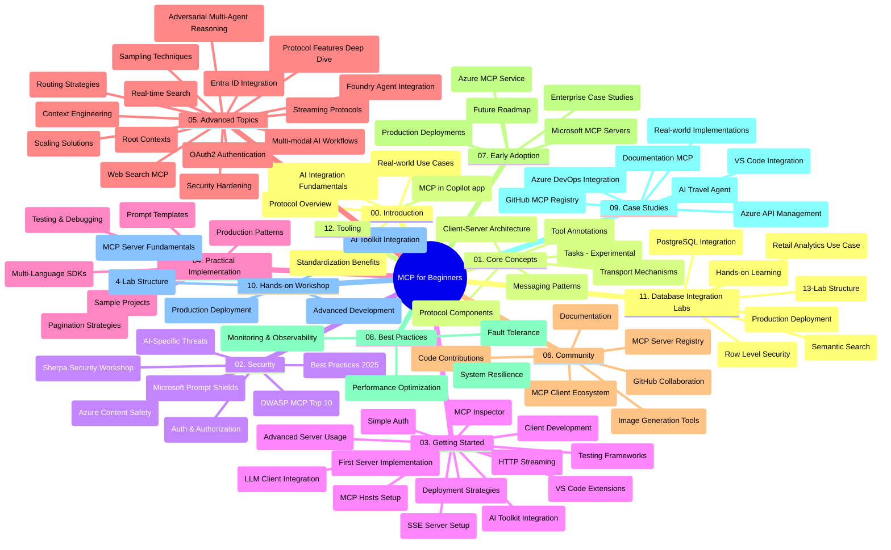

# ਬਿਗਿਨਰਜ਼ ਲਈ ਮਾਡਲ ਕਾਂਟੈਕਸਟ ਪ੍ਰੋਟੋਕੋਲ (MCP) - ਅਧਿਐਨ ਮਾਰਗਦਰਸ਼ਕ

ਇਹ ਅਧਿਐਨ ਮਾਰਗਦਰਸ਼ਕ "ਬਿਗਿਨਰਜ਼ ਲਈ ਮਾਡਲ ਕਾਂਟੈਕਸਟ ਪ੍ਰੋਟੋਕੋਲ (MCP)" ਕਰਿਕੁਲਮ ਲਈ ਰੈਪੋਜ਼ਿਟਰੀ ਦੀ ਸੰਰਚਨਾ ਅਤੇ ਸਮੱਗਰੀ ਦੀ ਇੱਕ ਝਲਕ ਦਿੰਦਾ ਹੈ। ਇਸ ਮਾਰਗਦਰਸ਼ਕ ਨੂੰ ਰੈਪੋਜ਼ਿਟਰੀ ਨੂੰ ਪ੍ਰਭਾਵਸ਼ਾਲੀ ਢੰਗ ਨਾਲ ਨੈਵੀਗੇਟ ਕਰਨ ਅਤੇ ਉਪਲੱਬਧ ਸਰੋਤਾਂ ਦਾ ਪੂਰਾ ਲਾਭ ਚੁੱਕਣ ਲਈ ਵਰਤੋਂ ਕਰੋ।

## ਰੈਪੋਜ਼ਿਟਰੀ ਦੇਖਭਾਲ

ਮਾਡਲ ਕਾਂਟੈਕਸਟ ਪ੍ਰੋਟੋਕੋਲ (MCP) ਏਆਈ ਮਾਡਲਾਂ ਅਤੇ ਕਲਾਇੰਟ ਐਪਲੀਕੇਸ਼ਨਜ਼ ਵਿਚਕਾਰ ਇੰਟਰੈਕਸ਼ਨ ਲਈ ਇੱਕ ਮਿਆਰੀਕ੍ਰਿਤ ਫਰੇਮਵਰਕ ਹੈ। ਪਹਿਲਾਂ ਐਂਥਰੋਪਿਕ ਦੁਆਰਾ ਬਣਾਇਆ ਗਿਆ, MCP ਹੁਣ ਅਧਿਕਾਰਿਕ GitHub ਸੰਗਠਨ ਰਾਹੀਂ ਵਿਆਪਕ MCP ਕਮਿਊਨਿਟੀ ਵੱਲੋਂ ਸੰਭਾਲਿਆ ਜਾਂਦਾ ਹੈ। ਇਹ ਰੈਪੋਜ਼ਿਟਰੀ AI ਵਿਕਾਸਕਾਰਾਂ, ਸਿਸਟਮ ਆਰਕੀਟੈਕਟਾਂ, ਅਤੇ ਸਾਫਟਵੇਅਰ ਇੰਜੀਨੀਅਰਾਂ ਲਈ C#, ਜਾਵਾ, ਜਾਵਾਸਕ੍ਰਿਪਟ, ਪਾਇਥਨ, ਅਤੇ ਟਾਈਪਸਕ੍ਰਿਪਟ ਵਿੱਚ ਹੱਥ-ਉੱਤੇ ਕੋਡ ਉਦਾਹਰਣਾਂ ਨਾਲ ਇੱਕ ਵਿਸ਼ਤ੍ਰਿਤ ਕਰਿਕੁਲਮ ਪ੍ਰਦਾਨ ਕਰਦੀ ਹੈ।

## ਦ੍ਰਿਸ਼ਟੀਗਤ ਕਰਿਕੁਲਮ ਮੈਪ

## ਰੈਪੋਜ਼ਿਟਰੀ ਸੰਰਚਨਾ

ਰੈਪੋਜ਼ਿਟਰੀ ਨੂੰ ਬਾਰਾਂ ਮੁੱਖ ਭਾਗਾਂ ਵਿੱਚ ਵੰਡਿਆ ਗਿਆ ਹੈ, ਜਿੱਥੇ ਹਰ ਇਕ ਭਾਗ MCP ਦੇ ਵੱਖ-ਵੱਖ ਪਹਿਲੂਆਂ ਉੱਤੇ ਧਿਆਨ ਕੇਂਦਰਤ ਕਰਦਾ ਹੈ:

1. **ਪ੍ਰਸਤਾਵਨਾ (00-Introduction/)**
   - ਮਾਡਲ ਕਾਂਟੈਕਸਟ ਪ੍ਰੋਟੋਕੋਲ ਦਾ ਝਲਕ
   - ਏਆਈ ਪਾਈਪਲਾਈਨਜ਼ ਵਿੱਚ ਮਿਆਰੀਕਰਨ ਕਿਉਂ ਜਰੂਰੀ ਹੈ
   - ਵਿਆਵਹਾਰਿਕ ਉਪਯੋਗ ਕੇਸ ਅਤੇ ਲਾਭ

2. **ਮੁਢਲੇ ਸੰਕਲਪ (01-CoreConcepts/)**
   - ਕਲਾਇੰਟ-ਸਰਵਰ ਆਰਕੀਟੈਕਚਰ
   - ਮੁੱਖ ਪ੍ਰੋਟੋਕੋਲ ਭਾਗ
   - MCP ਵਿੱਚ ਸਨੇਹਾ ਭੇਜਣ ਦੇ ਪੈਟਰਨ
   - ਵਰਤਮਾਨ ਵਿਸ਼ੇਸ਼ਤਾ: [MCP ਵਿੱਚ ਕੀ ਬਦਲਿਆ ਹੈ: 2026-07-28 ਵਿਸ਼ੇਸ਼ਤਾ](./01-CoreConcepts/mcp-2026-07-28.md) — ਸਟੇਟਲੈੱਸ ਪ੍ਰੋਟੋਕੋਲ ਕੋਰ, ਐਕਸਟੈਂਸ਼ਨ ਫਰੇਮਵਰਕ, ਅਤੇ ਰੂਟਸ/ਸੈਂਪਲਿੰਗ/ਲੌਗਿੰਗ ਡਿਪ੍ਰੀਕੇਸ਼ਨ

3. **ਸੁਰੱਖਿਆ (02-Security/)**
   - MCP-ਆਧਾਰਿਤ ਪ੍ਰਣਾਲੀਆਂ ਵਿੱਚ ਸੁਰੱਖਿਆ ਖਤਰਿਆਂ
   - ਲਾਗੂ ਕਰਨ ਲਈ ਸ਼੍ਰੇੱਸਠ ਅਭਿਆਸ
   - ਪ੍ਰਮਾਣੀਕਰਨ ਅਤੇ ਅਧਿਕਾਰਣ ਰਣਨੀਤੀਆਂ
   - ਹੱਥ-ਉੱਤੇ [CIMD ਅਤੇ DCR ਅਧਿਕਾਰਣ ਲਈ ਉਦਾਹਰਣ](./02-Security/samples/cimd-dcr-auth/README.md)
   - **ਵਿਸਤ੍ਰਿਤ ਸੁਰੱਖਿਆ ਦਸਤਾਵੇਜ਼**:
     - MCP ਸੁਰੱਖਿਆ ਦੀਆਂ ਸ਼੍ਰੇੱਸਠ ਪ੍ਰਥਾਵਾਂ
     - ਅਜ਼ੂਰੇ ਕੰਟੈਂਟ ਸੁਰੱਖਿਆ ਲਾਗੂ ਕਰਨ ਲਈ ਮਾਰਗਦਰਸ਼ਿਕਾ
     - MCP ਸੁਰੱਖਿਆ ਨਿਯੰਤਰਣ ਅਤੇ ਤਕਨੀਕਾਂ
     - MCP ਸ਼੍ਰੇੱਸਠ ਪ੍ਰਥਾਵਾਂ ਦਾ ਤੁਰੰਤ ਸੰਦਰਭ
   - **ਮੁੱਖ ਸੁਰੱਖਿਆ ਵਿਸ਼ੇ**:
     - ਪ੍ਰੰਪਟ ਇੰਜੈਕਸ਼ਨ ਅਤੇ ਟੂਲ ਜਹਿਰਲਾ ਹਮਲੇ
     - ਸੈਸ਼ਨ ਹਾਈਜੈਕਿੰਗ ਅਤੇ ਗੁੰਝਲਦਾਰ ਡਿਊਟੀ ਸਮੱਸਿਆਵਾਂ
     - ਟੋਕਨ ਪਾਸਥਰੂ ਕਮਜ਼ੋਰੀਆਂ
     - ਬਹੁਤ ਜ਼ਿਆਦਾ ਅਧਿਕਾਰ ਅਤੇ ਪਹੁੰਚ ਨਿਯੰਤਰਣ
     - ਏਆਈ ਘਟਕਾਂ ਲਈ ਸਪਲਾਈ ਚੇਨ ਸੁਰੱਖਿਆ
     - ਮਾਈਕ੍ਰੋਸਾਫਟ ਪ੍ਰੰਪਟ ਸ਼ੀਲਡਜ਼ ਇਕਜੁਟਤਾ

4. **ਸ਼ੁਰੂਆਤ ਕਰਨ ਲਈ (03-GettingStarted/)**
   - ਵਾਤਾਵਰਣ ਸੈਟਅਪ ਅਤੇ ਸੰਰਚਨਾ
   - ਮੂਲ MCP ਸਰਵਰ ਅਤੇ ਕਲਾਇੰਟ ਬਣਾਉਣਾ
   - ਮੌਜੂਦਾ ਐਪਲੀਕੇਸ਼ਨਾਂ ਨਾਲ ਇਕਜੁਟਤਾ
   - ਸ਼ਾਮਲ ਭਾਗ:
     - ਪਹਿਲਾ ਸਰਵਰ ਲਾਗੂ ਕਰਨ ਦੀ ਪ੍ਰਕਿਰਿਆ
     - ਕਲਾਇੰਟ ਵਿਕਾਸ
     - LLM ਕਲਾਇੰਟ ਇਕਜੁਟਤਾ
     - VS ਕੋਡ ਇਕਜੁਟਤਾ
     - ਸਰਵਰ-ਸੈੰਟ ਇਵੈਂਟਸ (SSE) ਸਰਵਰ
     - ਉन्नਤ ਸਰਵਰ ਵਰਤੋਂ
     - HTTP ਸਟ੍ਰੀਮਿੰਗ
     - ਏਆਈ ਟੂਲਕਿਟ ਇਕਜੁਟਤਾ
     - ਟੈਸਟਿੰਗ ਰਣਨੀਤੀਆਂ
     - ਡਿਪਲੋਇਮੈਂਟ ਮਾਰਗਦਰਸ਼ਕ

5. **ਵਿਆਵਹਾਰਿਕ ਲਾਗੂ ਕਰਨ (04-PracticalImplementation/)**
   - ਵੱਖ-ਵੱਖ ਪ੍ਰੋਗ੍ਰਾਮਿੰਗ ਭਾਸ਼ਾਵਾਂ ਵਿਚ SDK ਵਰਤਣਾ
   - ਡਿਬੱਗਿੰਗ, ਟੈਸਟਿੰਗ ਅਤੇ ਪ੍ਰਮਾਣਕਰਨ ਦੀਆਂ ਤਕਨੀਕਾਂ
   - ਮੁੜ ਵਰਤੇ ਜਾ ਸਕਦੇ ਪ੍ਰੰਪਟ ਟੈਮਪਲੇਟ ਅਤੇ ਵਰਕਫਲੋ ਬਣਾਉਣਾ
   - ਲਾਗੂ ਕਰਨ ਵਾਲੇ ਉਦਾਹਰਣਾਂ ਵਾਲੇ ਪ੍ਰੋਜੈਕਟ

6. **ਉਨੱਤ ਵਿਸ਼ੇ (05-AdvancedTopics/)**
   - ਕਾਂਟੈਕਸਟ ਇੰਜੀਨੀਅਰਿੰਗ ਤਕਨੀਕਾਂ
   - ਫਾਊਂਡਰੀ ਏਜੰਟ ਇਕਜੁਟਤਾ
   - ਬਹੁ-ਮੋਡਲ ਏਆਈ ਵਰਕਫਲੋ
   - OAuth2 ਪ੍ਰਮਾਣੀਕਰਨ ਡੈਮੋ
   - ਰੀਅਲ-ਟਾਈਮ ਖੋਜ ਯੋਗਤਾਵਾਂ
   - ਰੀਅਲ-ਟਾਈਮ ਸਟਰੀਮਿੰਗ
   - ਰੂਟ ਕਾਂਟੈਕਸਟ ਲਾਗੂ ਕਰਨ
   - ਰਾਊਟਿੰਗ ਰਣਨੀਤੀਆਂ
   - ਸੈਂਪਲਿੰਗ ਤਕਨੀਕਾਂ
   - ਸਕੇਲਿੰਗ ਦੇ ਤਰੀਕੇ
   - ਸੁਰੱਖਿਆ ਵਿਚਾਰ
   - ਐਂਟਰਾ ਆਈਡੀ ਸੁਰੱਖਿਆ ਇਕਜੁਟਤਾ
   - ਵੈੱਬ ਖੋਜ ਇਕਜੁਟਤਾ
   - ਵਿਰੋਧੀ ਬਹੁ-ਏਜੰਟ ਤਰਕ (ਵਾਦ ਪ੍ਰਣਾਲੀ)

7. **ਕਮਿਊਨਿਟੀ ਯੋਗਦਾਨ (06-CommunityContributions/)**
   - ਕੋਡ ਅਤੇ ਦਸਤਾਵੇਜ਼ਾਂ ਵਿੱਚ ਯੋਗਦਾਨ ਢੰਗ
   - GitHub ਰਾਹੀਂ ਸਹਯੋਗ
   - ਕਮਿਊਨਿਟੀ ਨੇਤ੍ਰਿਤਵ ਵਾਲੇ ਸੁਧਾਰ ਅਤੇ ਫੀਡਬੈਕ
   - ਵੱਖ-ਵੱਖ MCP ਕਲਾਇੰਟ ਉਪਯੋਗ ਕਰਨਾ (Claude Desktop, Cline, VSCode)
   - ਚਿੱਤਰ ਤਿਆਰ ਕਰਨ ਸਮੇਤ ਪ੍ਰਸਿੱਧ MCP ਸਰਵਰਾਂ ਨਾਲ ਕੰਮ ਕਰਨਾ

8. **ਪਹਿਲੀ ਦਫਾ ਗ੍ਰਹਿਣ ਕਰਨ ਤੋਂ ਸਬਕ (07-LessonsfromEarlyAdoption/)**
   - ਹਕੀਕਤੀ ਜਿ਼ੰਦਗੀ ਵਿੱਚ ਲਾਗੂ ਕਰਨ ਅਤੇ ਸਫਲਤਾਵਾਂ ਦੀਆਂ ਕਹਾਣੀਆਂ
   - MCP-ਆਧਾਰਿਤ ਹੱਲ ਬਣਾਉਣਾ ਅਤੇ ਡਿਪਲੋਇਮੈਂਟ ਕਰਨਾ
   - ਰੁਝਾਨ ਅਤੇ ਭਵਿੱਖ ਦੀ ਰੋਡਮੇਪ
   - **ਮਾਈਕ੍ਰੋਸਾਫਟ MCP ਸਰਵਰਾਂ ਲਈ ਮਾਰਗਦਰਸ਼ਕ**: 10 ਉਤਪਾਦਨ-ਤਿਆਰ ਮਾਈਕ੍ਰੋਸਾਫਟ MCP ਸਰਵਰਾਂ ਦਾ ਵਿਸ਼ਤ੍ਰਿਤ ਮਾਰਗਦਰਸ਼ਕ ਜਿਸ ਵਿੱਚ ਸ਼ਾਮਿਲ ਹਨ:
     - ਮਾਈਕ੍ਰੋਸਾਫਟ ਲਰਨ ਡੌਕਸ MCP ਸਰਵਰ
     - ਅਜ਼ੂਰੇ MCP ਸਰਵਰ (15+ ਖਾਸ ਕਨੈਕਟਰ)
     - GitHub MCP ਸਰਵਰ
     - ਅਜ਼ੂਰੇ ਡਿਵਓਪਸ MCP ਸਰਵਰ
     - MarkItDown MCP ਸਰਵਰ
     - SQL ਸਰਵਰ MCP ਸਰਵਰ
     - ਪਲੇਇਰਾਈਟ MCP ਸਰਵਰ
     - ਡੈਵ ਬਾਕਸ MCP ਸਰਵਰ
     - ਮਾਈਕ੍ਰੋਸਾਫਟ ਫਾਊਂਡਰੀ MCP ਸਰਵਰ
     - ਮਾਈਕ੍ਰੋਸਾਫਟ 365 ਏਜੰਟ ਟੂਲਕਿਟ MCP ਸਰਵਰ

9. **ਸ਼੍ਰੇਸ਼ਠ ਅਭਿਆਸ (08-BestPractices/)**
   - ਪ੍ਰਦਰਸ਼ਨ ਟਿਊਨਿੰਗ ਅਤੇ ਅਪਟੀਮਾਈਜ਼ੇਸ਼ਨ
   - ਦੋਸ਼-ਸਹਿਣਸ਼ੀਲ MCP ਪ੍ਰਣਾਲੀਆਂ ਦਾ ਡਿਜ਼ਾਈਨ
   - ਟੈਸਟਿੰਗ ਅਤੇ ਲਚਕੀਲਾਪਣ ਰਣਨੀਤੀਆਂ

10. **ਕੇਸ ਅਧਿਐਨ (09-CaseStudy/)**
    - **ਸੱਤ ਵਿਸ਼ਤ੍ਰਿਤ ਕੇਸ ਅਧਿਐਨ** ਜੋ MCP ਦੀ ਵਿਆਪਕ ਤਾਕਤ ਨੂੰ ਵੱਖ-ਵੱਖ ਸੰਦਰਭਾਂ ਵਿੱਚ ਦਰਸਾਉਂਦੇ ਹਨ:
    - **ਅਜ਼ੂਰੇ ਏਆਈ ਟ੍ਰੈਵਲ ਏਜੰਟਸ**: ਏਜ਼ੂਰੇ ਓਪਨਏਆਈ ਅਤੇ ਏਆਈ ਖੋਜ ਨਾਲ ਬਹੁ-ਏਜੰਟ ਸੁਰੰਖਲਾ
    - **ਅਜ਼ੂਰੇ ਡਿਵਓਪਸ ਇਕਜੁਟਤਾ**: ਯੂਟਿਊਬ ਡਾਟਾ ਅਪਡੇਟ ਨਾਲ ਵਰਕਫਲੋ ਪ੍ਰਕਿਰਿਆਵਾਂ ਦਾ ਆਟੋਮੇਸ਼ਨ
    - **ਰੀਅਲ-ਟਾਈਮ ਦਸਤਾਵੇਜ਼ ਪ੍ਰਾਪਤੀ**: ਪਾਇਥਨ ਕਨਸੋਲ ਕਲਾਇੰਟ ਨਾਲ ਸਟ੍ਰੀਮਿੰਗ HTTP
    - **ਇੰਟਰਐਕਟਿਵ ਅਧਿਐਨ ਯੋਜਨਾ ਜਨਰੇਟਰ**: ਚੇਨਲਿੱਟ ਵੈੱਬ ਐਪ ਸੰਵਾਦਾਤਮਕ ਏਆਈ ਨਾਲ
    - **ਇੰ-ਐਡੀਟਰ ਦਸਤਾਵੇਜ਼**: VS ਕੋਡ ਇਕਜੁਟਤਾ GitHub ਕੋਪਾਇਲਟ ਵਰਕਫਲੋਜ਼ ਨਾਲ
    - **ਅਜ਼ੂਰੇ API ਪ੍ਰਬੰਧ ਪ੍ਰਣਾਲੀ**: ਮੰਚ ICP ਸਰਵਰ ਬਣਾਉਣ ਲਈ ਉੱਢਦੀਆਂ ਕਮਪਨੀ API ਇਕਜੁਟਤਾਵਾਂ
    - **GitHub MCP ਰਜਿਸਟਰੀ**: ਇਤਿਹਾਸ ਅਤੇ ਏਜੰਟਿਕ ਇੰਤਿਗ੍ਰੇਸ਼ਨ ਫਲੈਟਫਾਰਮ ਵਿਕਾਸ
    - ਉਦਾਹਰਣਾਂ ਜਿੰਨਾਂ ਵਿੱਚ ਕਾਰੋਬਾਰੀ ਇਕਜੁਟਤਾ, ਡਿਵੈਲਪਰ ਉਤਪਾਦਕਤਾ, ਅਤੇ ਪਰਿਵਾਰਿਕ ਵਿਕਾਸ ਸ਼ਾਮਿਲ ਹਨ

11. **ਹੱਥ-ਉੱਤੇ ਵਰਕਸ਼ਾਪ (10-StreamliningAIWorkflowsBuildingAnMCPServerWithAIToolkit/)**
    - MCP ਨੂੰ ਏਆਈ ਟੂਲਕਿਟ ਨਾਲ ਜੋੜਦਿਆਂ ਇੱਕ ਵਿਸ਼ਤ੍ਰਿਤ ਹੱਥ-ਉੱਤੇ ਵਰਕਸ਼ਾਪ
    - ਬੁੱਧੀਮਾਨ ਐਪਲੀਕੇਸ਼ਨਾਂ ਦਾ ਨਿਰਮਾਣ ਜੋ ਏਆਈ ਮਾਡਲਾਂ ਨੂੰ ਹਕੀਕਤੀ ਸੰਦਾਂ ਨਾਲ ਜੋੜਦੀਆਂ ਹਨ
    - ਮੂਲ ਬੁਨਿਆਦੀ, ਕਸਟਮ ਸਰਵਰ ਵਿਕਾਸ, ਅਤੇ ਉਤਪਾਦਨ ਡਿਪਲੋਇਮੈਂਟ ਰਣਨੀਤੀਆਂ ਉੱਤੇ ਕਾਇਮ ਪ੍ਰੈਕਟਿਕਲ ਮਾਡਿਊਲ
    - **ਲੈਬ ਸੰਰਚਨਾ**:
      - ਲੈਬ 1: MCP ਸਰਵਰ ਮੁਢਲੇ ਸੰਕਲਪ
      - ਲੈਬ 2: ਉਨੱਤ MCP ਸਰਵਰ ਵਿਕਾਸ
      - ਲੈਬ 3: ਏਆਈ ਟੂਲਕਿਟ ਇਕਜੁਟਤਾ
      - ਲੈਬ 4: ਉਤਪਾਦਨ ਡਿਪਲੋਇਮੈਂਟ ਅਤੇ ਸਕੇਲਿੰਗ
    - ਲੈਬ ਆਧਾਰਿਤ ਸਿੱਖਣ ਦੀ ਪ੍ਰਕਿਰਿਆ ਸਟੈਪ-ਬਾਇ-ਸਟੈਪ ਦਿਸ਼ਾ-ਨਿਰਦੇਸ਼ਾਂ ਨਾਲ

12. **MCP ਸਰਵਰ ਡਾਟਾਬੇਸ ਇਕਜੁਟਤਾ ਲੈਬ (11-MCPServerHandsOnLabs/)**
    - ਉਤਪਾਦਨ-ਤਿਆਰ MCP ਸਰਵਰਾਂ ਲਈ ਪੋਸਟਗਰੇSQL ਇਕਜੁਟਤਾ ਨਾਲ 13 ਲੈਬ ਦਾ ਵਿਸ਼ਤ੍ਰਿਤ ਪਾਠਯਕ੍ਰਮ
    - ਰੀਅਲ-ਵਿੱਚ ਵਿਕਰੀ ਵਿਸ਼ਲੇਸ਼ਣ ਲਈ Zava ਰੀਟੇਲ ਉਪਯੋਗ ਕੇਸ
    - ਕਾਰੋਬਾਰੀ ਦਰਜੇ ਦੇ ਪੈਟਰਨ ਜਿਵੇਂ ਕਿ ਰੋ ਲੈਵਲ ਸੁਰੱਖਿਆ (RLS), ਸੈਮੈਂਟਿਕ ਖੋਜ ਅਤੇ ਬਹੁ-ਕਿਰਾਇਆਦਾਰ ਡੇਟਾ ਪਹੁੰਚ
    - **ਪੂਰੀ ਲੈਬ ਸੰਰਚਨਾ**:
      - **ਲੈਬ 00-03: ਬੁਨਿਆਦਾਂ** - ਪ੍ਰਸਤਾਵਨਾ, ਆਰਕੀਟੈਕਚਰ, ਸੁਰੱਖਿਆ, ਵਾਤਾਵਰਣ ਸੈਟਅਪ
      - **ਲੈਬ 04-06: MCP ਸਰਵਰ ਬਣਾਉਣਾ** - ਡਾਟਾਬੇਸ ਡਿਜ਼ਾਈਨ, MCP ਸਰਵਰ ਲਾਗੂ ਕਰਨਾ, ਟੂਲ ਵਿਕਾਸ
      - **ਲੈਬ 07-09: ਉਨੱਤ ਵਿਸ਼ੇਸ਼ਤਾਵਾਂ** - ਸੈਮੈਂਟਿਕ ਖੋਜ, ਟੈਸਟਿੰਗ ਅਤੇ ਡਿਬੱਗਿੰਗ, VS ਕੋਡ ਇਕਜੁਟਤਾ
      - **ਲੈਬ 10-12: ਉਤਪਾਦਨ ਅਤੇ ਸ਼੍ਰੇਸ਼ਠ ਅਭਿਆਸ** - ਡਿਪਲੋਇਮੈਂਟ, ਨਿਗਰਾਨੀ, ਅਪਟੀਮਾਈਜ਼ੇਸ਼ਨ
    - **ਸੰਬੰਧਤ ਤਕਨੀਕਾਂ**: FastMCP ਫਰੇਮਵਰਕ, ਪੋਸਟਗਰੇSQL, ਅਜ਼ੂਰੇ ਓਪਨਏਆਈ, ਅਜ਼ੂਰੇ ਕੰਟੇਨਰ ਐਪਸ, ਐਪਲੀਕੇਸ਼ਨ ਇਨਸਾਇਟਸ
    - **ਸਿੱਖਿਆ ਨਤੀਜੇ**: ਉਤਪਾਦਨ-ਤਿਆਰ MCP ਸਰਵਰ, ਡਾਟਾਬੇਸ ਇਕਜੁਟਤਾ ਪੈਟਰਨ, ਏਆਈ ਚਲਾਇਆ ਗਿਆ ਵਿਸ਼ਲੇਸ਼ਣ, ਕਾਰੋਬਾਰੀ ਸੁਰੱਖਿਆ

13. **ਟੂਲਿੰਗ (12-tooling/)**
    - MCP ਨੂੰ ਕੋਪਾਇਲਟ ਐਪ ਅਤੇ ਹੋਰ ਟੂਲਾਂ ਵਿੱਚ ਕਿਵੇਂ ਵਰਤਣਾ ਹੈ,

## ਵਾਧੂ ਸਰੋਤ

ਰੈਪੋਜ਼ਿਟਰੀ ਵਿੱਚ ਸਹਾਇਕ ਸਰੋਤ ਸ਼ਾਮਲ ਹਨ:

- **ਪਿਕਚਰ ਫੋਲਡਰ**: ਕਰਿਕੁਲਮ ਵਿਚ ਵਰਤੇ ਗਏ ਚਿੱਤਰ ਅਤੇ ਰੂਪਕ
- **ਅਨੁਵਾਦ**: ਦਸਤਾਵੇਜ਼ਾਂ ਦੇ ਵੱਖ-ਵੱਖ ਭਾਸ਼ਾਈ ਸਹਿਯੋਗ ਲਈ ਸਵਚਾਲਿਤ ਅਨੁਵਾਦ
- **ਅਧਿਕਾਰਿਕ MCP ਸਰੋਤ**:
  - [MCP ਦਸਤਾਵੇਜ਼](https://modelcontextprotocol.io/)
  - [MCP ਵਿਸ਼ੇਸ਼ਤਾ](https://modelcontextprotocol.io/specification/2026-07-28/)
  - [MCP GitHub ਰੈਪੋਜ਼ਿਟਰੀ](https://github.com/modelcontextprotocol)

## ਇਸ ਰੈਪੋਜ਼ਿਟਰੀ ਨੂੰ ਕਿਵੇਂ ਵਰਤਣਾ ਹੈ

1. **ਕ੍ਰਮਵਾਰ ਸਿੱਖਿਆ**: ਇੱਕ ਵਿਵਸਥਿਤ ਸਿੱਖਣ ਦਾ ਅਨੁਭਵ ਲਈ ਅਧਿਆਯਾਂ ਨੂੰ ਕ੍ਰਮ ਵਿੱਚ (00 ਤੋਂ 11 ਤੱਕ) ਫਾਲੋ ਕਰੋ।
2. **ਭਾਸ਼ਾ-ਵਿਸ਼ੇਸ਼ ਧਿਆਨ**: ਜੇ ਤੁਸੀਂ ਕਿਸੇ ਖਾਸ ਪ੍ਰੋਗ੍ਰਾਮਿੰਗ ਭਾਸ਼ਾ ਵਿਚ ਦਿਲਚਸਪੀ ਰੱਖਦੇ ਹੋ, ਤਾਂ ਆਪਣੇ ਮਨਪਸੰਦ ਭਾਸ਼ਾ ਵਿੱਚ ਲਾਗੂ ਕਰਨ ਲਈ ਸੈਂਪਲ ਡਾਇਰੈਕਟਰੀਆਂ ਦੀ ਪੜਚਾਲ ਕਰੋ।
3. **ਵਿਆਵਹਾਰਿਕ ਲਾਗੂ ਕਰਨ**: ਆਪਣੇ ਵਾਤਾਵਰਣ ਨੂੰ ਸੈਟਅਪ ਕਰਨ ਅਤੇ ਆਪਣਾ ਪਹਿਲਾ MCP ਸਰਵਰ ਅਤੇ ਕਲਾਇੰਟ ਬਣਾਉਣ ਲਈ "ਸ਼ੁਰੂਆਤ ਕਰਨ ਲਈ" ਭਾਗ ਤੋਂ ਸ਼ੁਰੂ ਕਰੋ।
4. **ਉਨੱਤ ਜਾਚ**: ਜਿਵੇਂ ਹੀ ਮੂਲ ਗਿਆਨ ਵਿੱਚ ਕਾਫੀ ਹੁਨਰ ਹੋਵੇ, ਆਪਣੀ ਜਾਣਕਾਰੀ ਨੂੰ ਵਧਾਉਣ ਲਈ ਉਨੱਤ ਵਿਸ਼ਿਆਂ ਵਿੱਚ ਡੁੱਬਕੀ ਲਗਾਓ।
5. **ਕਮਿਊਨਿਟੀ ਸਹਭਾਗ**: GitHub ਚਰਚਾ ਅਤੇ ਡਿਸਕੋਰਡ ਚੈਨਲਾਂ ਰਾਹੀਂ MCP ਕਮਿਊਨਿਟੀ ਵਿੱਚ ਸ਼ਾਮਿਲ ਹੋਵੋ ਤਾਂ ਜੋ ਮਾਹਿਰਾਂ ਅਤੇ ਹੋਰ ਵਿਕਾਸਕਾਰਾਂ ਨਾਲ ਜੁੜ ਸਕੋ।

## MCP ਕਲਾਇੰਟ ਅਤੇ ਟੂਲ

ਕਰਿਕੁਲਮ ਵਿੱਚ ਵੱਖ-ਵੱਖ MCP ਕਲਾਇੰਟ ਅਤੇ ਟੂਲ ਕਵਰ ਕੀਤੇ ਗਏ ਹਨ:

1. **ਅਧਿਕਾਰਿਕ ਕਲਾਇੰਟ**:
   - ਵਿਜ਼ੂਅਲ ਸਟੂਡੀਓ ਕੋਡ
   - MCP ਵਿਜ਼ੂਅਲ ਸਟੂਡੀਓ ਕੋਡ ਵਿੱਚ
   - ਕਲੌਡ ਡੈਸਕਟਾਪ
   - ਕਲੌਡ VSCode ਵਿੱਚ
   - ਕਲੌਡ API

2. **ਕਮਿਊਨਿਟੀ ਕਲਾਇੰਟ**:
   - ਕਲਾਈਨ (ਟਰਮਿਨਲ-ਆਧਾਰਿਤ)
   - ਕੁਰਸਰ (ਕੋਡ ਐਡੀਟਰ)
   - ਚੈਟਮcp
   - ਵਿਂਡਸਰਫ

3. **MCP ਪ੍ਰਬੰਧਨ ਟੂਲ**:
   - MCP CLI
   - MCP ਮੈਨੇਜਰ
   - MCP ਲਿੰਕਰ
   - MCP ਰਾਊਟਰ

## ਪ੍ਰਸਿੱਧ MCP ਸਰਵਰ

ਰੈਪੋਜ਼ਿਟਰੀ ਵੱਖ-ਵੱਖ MCP ਸਰਵਰਾਂ ਨੂੰ ਜਾਣੂ ਕਰਵਾਉਂਦਾ ਹੈ, ਜਿਨ੍ਹਾਂ ਵਿੱਚ ਸ਼ਾਮਿਲ ਹਨ:

1. **ਅਧਿਕਾਰਿਕ ਮਾਈਕ੍ਰੋਸਾਫਟ MCP ਸਰਵਰ**:
   - ਮਾਈਕ੍ਰੋਸਾਫਟ ਲਰਨ ਡੌਕਸ MCP ਸਰਵਰ
   - ਅਜ਼ੂਰੇ MCP ਸਰਵਰ (15+ ਖਾਸ ਕਨੈਕਟਰ)
   - GitHub MCP ਸਰਵਰ
   - ਅਜ਼ੂਰੇ ਡਿਵਓਪਸ MCP ਸਰਵਰ
   - MarkItDown MCP ਸਰਵਰ
   - SQL ਸਰਵਰ MCP ਸਰਵਰ
   - ਪਲੇਇਰਾਈਟ MCP ਸਰਵਰ
   - ਡੈਵ ਬਾਕਸ MCP ਸਰਵਰ
   - ਮਾਈਕ੍ਰੋਸਾਫਟ ਫਾਊਂਡਰੀ MCP ਸਰਵਰ
   - ਮਾਈਕ੍ਰੋਸਾਫਟ 365 ਏਜੰਟ ਟੂਲਕਿਟ MCP ਸਰਵਰ

2. **ਅਧਿਕਾਰਿਕ ਸੰਦਰਭ ਸਰਵਰ**:
   - ਫਾਇਲਸਿਸਟਮ
   - ਫੈਚ
   - ਮੈਮੋਰੀ
   - ਲੜੀਵਾਰ ਸੋਚ

3. **ਚਿੱਤਰ ਤਿਆਰ ਕਰਨ**:
   - ਅਜ਼ੂਰੇ ਓਪਨਏਆਈ DALL-E 3
   - ਸਟੇਬਲ ਡਿਫਿਊਜ਼ਨ ਵੈੱਬUI
   - ਰਿਪਲਿਕੇਟ

4. **ਵਿਕਾਸ ਟੂਲ**:
   - Git MCP
   - ਟਰਮਿਨਲ ਕੰਟਰੋਲ
   - ਕੋਡ ਸਹਾਇਕ

5. **ਖਾਸ ਸਰਵਰ**:
   - ਸੇਲਜ਼ਫੋਰਸ
   - ਮਾਈਕ੍ਰੋਸਾਫਟ ਟੀਮਜ਼
   - ਜੀਰਾ ਅਤੇ ਕੋਨਫਲੂਐਂਸ

## ਯੋਗਦਾਨ ਦੇਣਾ

ਇਹ ਰੈਪੋਜ਼ਿਟਰੀ ਕਮਿਊਨਿਟੀ ਤੋਂ ਯੋਗਦਾਨਾਂ ਦਾ ਸਵਾਗਤ ਕਰਦੀ ਹੈ। MCP ਇਕੋਸਿਸਟਮ ਵਿੱਚ ਪ੍ਰਭਾਵਸ਼ਾਲੀ ਤਰੀਕੇ ਨਾਲ ਯੋਗਦਾਨ ਦੇਣ ਲਈ ਕਮਿਊਨਿਟੀ ਯੋਗਦਾਨ ਭਾਗ ਨੂੰ ਵੇਖੋ।

----

*ਇਸ ਅਧਿਐਨ ਮਾਰਗਦਰਸ਼ਕ ਨੂੰ ਆਖਰੀ ਵਾਰ 9 ਸਤੰਬਰ 2026 ਨੂੰ ਅਪਡੇਟ ਕੀਤਾ ਗਿਆ ਸੀ। ਇਹ MCP
ਵਿਸ਼ੇਸ਼ਤਾ `2026-07-28` ਨੂੰ ਦਰਸਾਉਂਦਾ ਹੈ, ਜੋ ਮੌਜੂਦਾ ਪ੍ਰੋਟੋਕੋਲ ਸੋਧ ਹੈ। ਕੁਝ ਹੱਥ-ਉੱਤੇ
ਉਦਾਹਰਣਾਂ ਖ਼ਾਸ ਤੌਰ 'ਤੇ `2025-11-25` ਤਾਰੀਖ ਵਾਲੀਆਂ ਹਨ ਜਦਕਿ ਉਨ੍ਹਾਂ ਦੇ SDK ਅਤੇ ਟੂਲ
ਸਟੇਟਲੇੱਸ ਪ੍ਰੋਟੋਕੋਲ APIਆਂ ਨੂੰ ਅਪਣਾਉਂਦੇ ਹਨ।*

---

<!-- CO-OP TRANSLATOR DISCLAIMER START -->
**ਅਸਵੀਕਾਰੋਪਣ**:
ਇਸ ਦਸਤਾਵੇਜ਼ ਦਾ ਅਨੁਵਾਦ ਏਆਈ ਅਨੁਵਾਦ ਸੇਵਾ [Co-op Translator](https://github.com/Azure/co-op-translator) ਦੀ ਵਰਤੋਂ ਕਰਕੇ ਕੀਤਾ ਗਿਆ ਹੈ। ਜਦੋਂ ਕਿ ਅਸੀਂ ਸਹੀਤਾਵਾਂ ਲਈ ਯਤਨਸ਼ੀਲ ਹਾਂ, ਕਿਰਪਾ ਕਰਕੇ ਧਿਆਨ ਰੱਖੋ ਕਿ ਸਵੈਚਾਲਿਤ ਅਨੁਵਾਦਾਂ ਵਿੱਚ ਗਲਤੀਆਂ ਜਾਂ ਅਸਮੱਤਿਆਵਾਂ ਹੋ ਸਕਦੀਆਂ ਹਨ। ਮੂਲ ਦਸਤਾਵੇਜ਼ ਆਪਣੀ ਮੂਲ ਭਾਸ਼ਾ ਵਿੱਚ ਅਧਿਕਾਰਕ ਸਰੋਤ ਮੰਨਿਆ ਜਾਣਾ ਚਾਹੀਦਾ ਹੈ। ਜਰੂਰੀ ਜਾਣਕਾਰੀ ਲਈ, ਪੇਸ਼ੇਵਰ ਮਨੁੱਖੀ ਅਨੁਵਾਦ ਦੀ ਸਿਫ਼ਾਰਸ਼ ਕੀਤੀ ਜਾਂਦੀ ਹੈ। ਅਸੀਂ ਇਸ ਅਨੁਵਾਦ ਦੇ ਉਪਯੋਗ ਤੋਂ ਪੈਦਾ ਹੋਣ ਵਾਲੀਆਂ ਕਿਸੇ ਵੀ ਗਲਤਫਹਿਮੀਆਂ ਜਾਂ ਗਲਤ ਵਿਆਖਿਆਵਾਂ ਲਈ ਜਵਾਬਦੇਹ ਨਹੀਂ ਹਾਂ।
<!-- CO-OP TRANSLATOR DISCLAIMER END -->