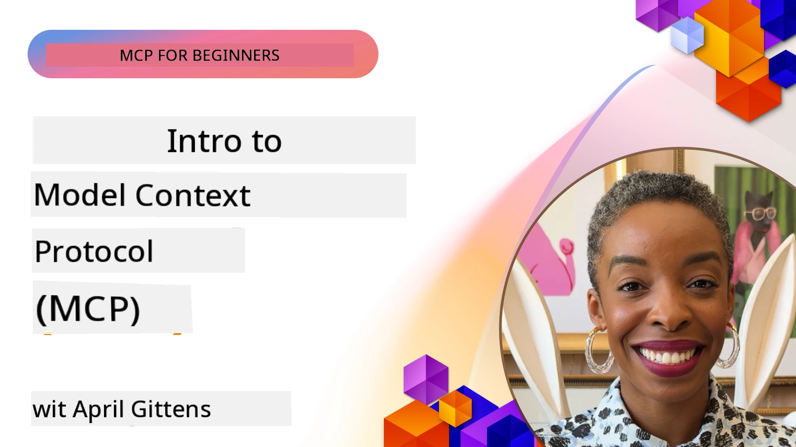
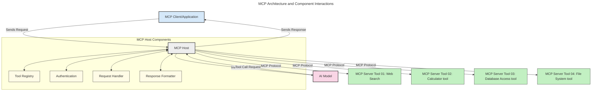
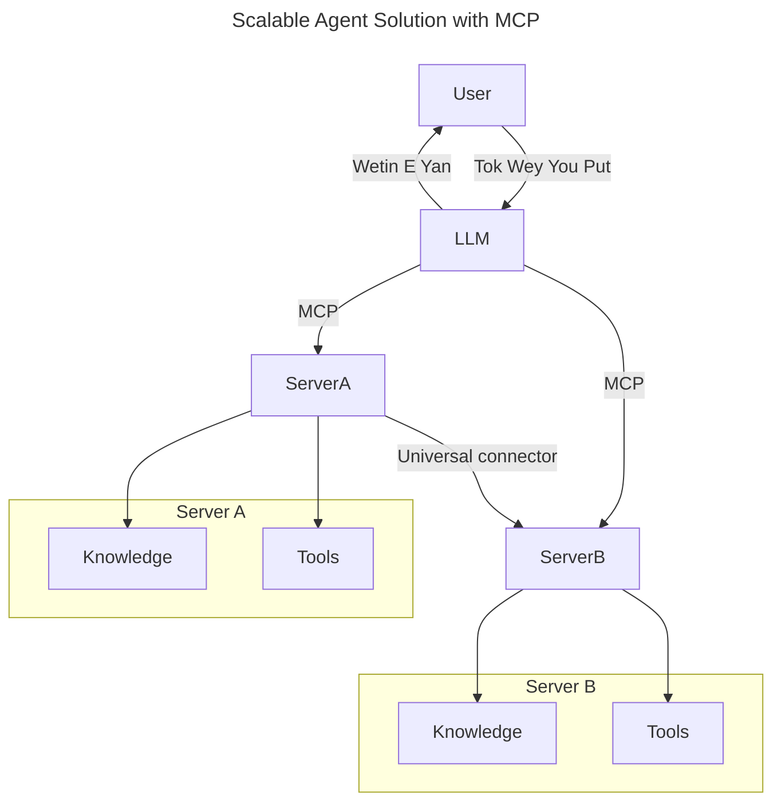
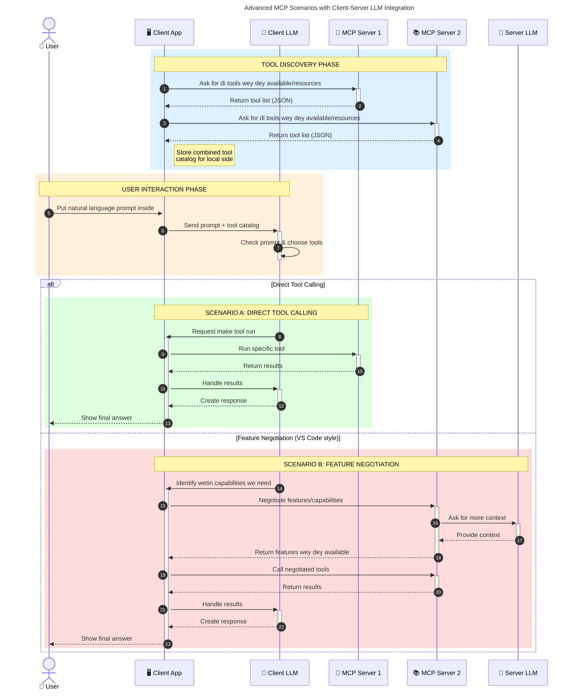

# Introduction to Model Context Protocol (MCP): Why E Dey Important for Scalable AI Applications

_(Click the image above to view video of this lesson)_

Generative AI applications na beta step forward as dem dey often make the user fit interact wit di app using natural language prompts. But as di time and resources plenty for dis kain apps, you go want make sure say you fit easily put functionalities and resources togeder in betta way wey go easy to extend, say your app fit handle more than one model and fit manage different model wahala dem. For short, building Gen AI apps simple to start wit, but as dem dey grow and e get as e be, you go need to start to define architecture and you fit need rely on one standard to make sure say your apps dey build for one kain way. Na here MCP come fit organize tins and give standard.

---

## **🔍 Wetin Be Model Context Protocol (MCP)?**

The **Model Context Protocol (MCP)** na **open, standardized interface** wey dey let Large Language Models (LLMs) connect wella wit outside tools, APIs, and data sources. E provide one kain architecture wey dey consistent to make AI model fit work well pass their training data, so AI system go dey smarter, scalable, and fit respond well.

---

## **🎯 Why E Important to Get Standards for AI**

As generative AI apps dey get complex, e no go bad to get standards wey go fix things like **scalability, extensibility, maintainability,** and **avoid vendor lock-in**. MCP dey solve these tins by:

- Join model and tool integration dem together
- Cut down brittle, one-off custom solutions
- Make different models from different vendors fit live together for the same place

**Note:** Even though MCP dey call itself open standard, dem no get plan to make MCP standard through any existing standards group like IEEE, IETF, W3C, ISO, or any oda standards group.

---

## **📚 Wetin You Go Learn**

By the time you finish to read this article, you go fit:

- Define **Model Context Protocol (MCP)** and how e take work
- Understand how MCP dey standardize model-to-tool talk talk
- Know the main parts for MCP architecture
- Check real-world work wey MCP dey do for enterprise and development levels

---

## **💡 Why Model Context Protocol (MCP) Na Big Deal**

### **🔗 MCP Dey Solve Fragmentation for AI Interactions**

Before MCP, to join models with tools you need:

- Custom code for each tool-model pair
- Non-standard APIs for each vendor
- Plenty breaks because of updates
- No good scalability as tools dem increase

### **✅ Wetin MCP Standardization Don Gain**

| **Gain**                  | **Wetin E Mean**                                                                |
|--------------------------|--------------------------------------------------------------------------------|
| Interoperability         | LLMs fit work fine with tools from different vendors                           |
| Consistency              | Same behavior dey all platform and tools                                      |
| Reusability              | Tools wey dem build once, fit use am for many projects and systems            |
| Accelerated Development  | Dev time small as dem dey use standardized, plug-and-play interfaces          |

---

## **🧱 High-Level MCP Architecture Overview**

MCP follow **client-server model**, wey mean:

- **MCP Hosts** dey run the AI models
- **MCP Clients** dey start requests
- **MCP Servers** dey serve context, tools, and capabilities

### **Main Parts:**

- **Resources** – Static or dynamic data wey models fit use  
- **Prompts** – Predefined workflow wey dey guide generation  
- **Tools** – Functions like search, calculations wey fit run  
- **Sampling** – Agent-like behavior dey happen through recursive interactions (e don stop for
    MCP `2026-07-28`; now new ones suppose join direct to LLM
    provider)
- **Elicitation** – Requests wey server dey start to get user input
- **Roots** – Locations for information wey relate to the server file system
    (e don stop for MCP `2026-07-28`; better to use tool parameters, resource URIs, or
    server configuration)

### **Protocol Architecture:**

MCP get two-layer architecture:
- **Data Layer**: JSON-RPC 2.0 messages, metadata per request, discovery, and protocol basics

- **Transport Layer**: stdio for local subprocesses and Streamable HTTP for remote servers. Streamable HTTP fit use SSE framing for streamed answers, but old HTTP+SSE transport don stop.

---

## How MCP Servers Dey Work

MCP servers dey work like dis:

- **Request Flow**:
    1. Request dey start from end user or software wey dey represent am.
    2. The **MCP Client** go send the request go **MCP Host**, wey dey manage the AI Model runtime.
    3. The **AI Model** go get the user prompt and fit request external tools or data through one or more tool call.
    4. The **MCP Host**, no be the model itself, na e go communicate with correct **MCP Server(s)** using the standardized protocol.
- **MCP Host Functionality**:
    - **Tool Registry**: E go keep catalog of available tools and their capabilities.
    - **Authentication**: E go verify permission to use tool.
    - **Request Handler**: E go handle incoming tool requests from model.
    - **Response Formatter**: E go arrange tool outputs inside format wey model fit understand.
- **MCP Server Execution**:
    - The **MCP Host** go send tool calls to one or more **MCP Servers**, each one dey do specialized work (like search, calculation, database queries).
    - The **MCP Servers** go do their work and return results to **MCP Host** inside one consistent format.
    - The **MCP Host** go arrange and pass these results to **AI Model**.
- **Response Completion**:
    - The **AI Model** go join tool outputs inside final response.
    - The **MCP Host** go send this response back to **MCP Client**, wey go drop am to end user or calling software.
    

```mermaid
---
title: MCP Architecture and Component Interactions
description: A diagram showing the flows of the components in MCP.
---
graph TD
    Client[MCP Client/Application] -->|Sends Request| H[MCP Host]
    H -->|Invokes| A[AI Model]
    A -->|Tool Call Request| H
    H -->|MCP Protocol| T1[MCP Server Tool 01: Web Search]
    H -->|MCP Protocol| T2[MCP Server Tool 02: Calculator tool]
    H -->|MCP Protocol| T3[MCP Server Tool 03: Database Access tool]
    H -->|MCP Protocol| T4[MCP Server Tool 04: File System tool]
    H -->|Sends Response| Client

    subgraph "MCP Host Components"
        H
        G[Tool Registry]
        I[Authentication]
        J[Request Handler]
        K[Response Formatter]
    end

    H <--> G
    H <--> I
    H <--> J
    H <--> K

    style A fill:#f9d5e5,stroke:#333,stroke-width:2px
    style H fill:#eeeeee,stroke:#333,stroke-width:2px
    style Client fill:#d5e8f9,stroke:#333,stroke-width:2px
    style G fill:#fffbe6,stroke:#333,stroke-width:1px
    style I fill:#fffbe6,stroke:#333,stroke-width:1px
    style J fill:#fffbe6,stroke:#333,stroke-width:1px
    style K fill:#fffbe6,stroke:#333,stroke-width:1px
    style T1 fill:#c2f0c2,stroke:#333,stroke-width:1px
    style T2 fill:#c2f0c2,stroke:#333,stroke-width:1px
    style T3 fill:#c2f0c2,stroke:#333,stroke-width:1px
    style T4 fill:#c2f0c2,stroke:#333,stroke-width:1px
```

## 👨‍💻 How to Build MCP Server (With Examples)

MCP servers dey allow you extend LLM capabilities by providing data and functionality.

Ready make you try am? Here dem get language and/or stack SDKs wit examples of how to create simple MCP servers for different languages/stacks:

- **Python SDK**: https://github.com/modelcontextprotocol/python-sdk

- **TypeScript SDK**: https://github.com/modelcontextprotocol/typescript-sdk

- **Java SDK**: https://github.com/modelcontextprotocol/java-sdk

- **C#/.NET SDK**: https://github.com/modelcontextprotocol/csharp-sdk

## 🌍 Real-World Use Cases for MCP

MCP make e possible to do many kain applications by extending AI power:

| **Application**               | **Wetin E Mean**                                                                |
|------------------------------|--------------------------------------------------------------------------------|
| Enterprise Data Integration  | Join LLMs to databases, CRMs, or internal tools                                |
| Agentic AI Systems           | Make autonomous agents wey fit use tool access and decision-making workflows  |
| Multi-modal Applications     | Mix text, image, and audio tools inside one AI app                             |
| Real-time Data Integration   | Bring live data enter AI interaction for more correct and current results       |

### 🧠 MCP = Universal Standard for AI Interactions

The Model Context Protocol (MCP) act like universal standard for AI interactions, like how USB-C make all device connection uniform. For AI world, MCP na consistent interface wey make models (clients) fit join wella wit external tools and data providers (servers). E make no need for many custom protocol for each API or data source.

Under MCP, MCP-compatible tool (we dey call am MCP server) obey one joint standard. Dis servers fit list the tools or actions dem get and perform those actions wen AI agent request am. AI agent platforms wey support MCP go fit discover available tools from servers and use am through this standard protocol.

### 💡 E Make Knowledge Access Easy

Pass just to give tools, MCP dey help make knowledge easy to access. E dey make apps fit give context to big language models (LLMs) by linking dem to different data sources. Example, MCP server fit mean company document store, make agents fit find information wen dem ask. Another server fit do specific things like send emails or update records. For agent eye, na tools to use — some dey give knowledge data, others dey perform actions. MCP handle all well.

Agent wey connect to MCP server go automatically sabi the server available capabilities and data through standard format. This standard fit make tools dey available anytime. For example, if you add new MCP server to agent system, e go dey usable quick quick without changing agent instruction.

This simple connection follow the flow wey diagram show, where servers provide both tools and knowledge, to make collaboration smooth across systems.

### 👉 Example: Scalable Agent Solution

```mermaid
---
title: Scalable Agent Solution with MCP
description: A diagram illustrating how a user interacts with an LLM that connects to multiple MCP servers, with each server providing both knowledge and tools, creating a scalable AI system architecture
---
graph TD
    User -->|Tok Wey You Put| LLM
    LLM -->|Wetin E Yan| User
    LLM -->|MCP| ServerA
    LLM -->|MCP| ServerB
    ServerA -->|Universal connector| ServerB
    ServerA --> KnowledgeA
    ServerA --> ToolsA
    ServerB --> KnowledgeB
    ServerB --> ToolsB

    subgraph Server A
        KnowledgeA[Knowledge]
        ToolsA[Tools]
    end

    subgraph Server B
        KnowledgeB[Knowledge]
        ToolsB[Tools]
    end
```
The Universal Connector dey enable MCP servers to dey communicate and share capabilities among dem, make ServerA fit give work to ServerB or use im tools and knowledge. This way, tools and data spread across servers, support scalable and modular agent design. Because MCP standardize tool exposure, agents fit discover and route requests between servers without hardcode integration.

Tool and knowledge federation: Tools and data fit dey accessed from many servers, enable more scalable and modular agent systems.

### 🔄 Advanced MCP Scenarios wit Client-Side LLM Integration

Pass the basic MCP architecture, dey get advanced cases wey both client and server get LLMs, so dem fit do beta communication. For this diagram, **Client App** fit be IDE wey get plenty MCP tools to use by LLM:

```mermaid
---
title: Advanced MCP Scenarios with Client-Server LLM Integration
description: A sequence diagram showing the detailed interaction flow between user, client application, client LLM, multiple MCP servers, and server LLM, illustrating tool discovery, user interaction, direct tool calling, and feature negotiation phases
---
sequenceDiagram
    autonumber
    actor User as 👤 User
    participant ClientApp as 🖥️ Client App
    participant ClientLLM as 🧠 Client LLM
    participant Server1 as 🔧 MCP Server 1
    participant Server2 as 📚 MCP Server 2
    participant ServerLLM as 🤖 Server LLM
    
    %% Discovery Phase
    rect rgb(220, 240, 255)
        Note over ClientApp, Server2: TOOL DISCOVERY PHASE
        ClientApp->>+Server1: Ask for di tools wey dey available/resources
        Server1-->>-ClientApp: Return tool list (JSON)
        ClientApp->>+Server2: Ask for di tools wey dey available/resources
        Server2-->>-ClientApp: Return tool list (JSON)
        Note right of ClientApp: Store combined tool<br/>catalog for local side
    end
    
    %% User Interaction
    rect rgb(255, 240, 220)
        Note over User, ClientLLM: USER INTERACTION PHASE
        User->>+ClientApp: Put natural language prompt inside
        ClientApp->>+ClientLLM: Send prompt + tool catalog
        ClientLLM->>-ClientLLM: Check prompt & choose tools
    end
    
    %% Scenario A: Direct Tool Calling
    alt Direct Tool Calling
        rect rgb(220, 255, 220)
            Note over ClientApp, Server1: SCENARIO A: DIRECT TOOL CALLING
            ClientLLM->>+ClientApp: Request make tool run
            ClientApp->>+Server1: Run specific tool
            Server1-->>-ClientApp: Return results
            ClientApp->>+ClientLLM: Handle results
            ClientLLM-->>-ClientApp: Create response
            ClientApp-->>-User: Show final answer
        end
    
    %% Scenario B: Feature Negotiation (VS Code style)
    else Feature Negotiation (VS Code style)
        rect rgb(255, 220, 220)
            Note over ClientApp, ServerLLM: SCENARIO B: FEATURE NEGOTIATION
            ClientLLM->>+ClientApp: Identify wetin capabilities we need
            ClientApp->>+Server2: Negotiate features/capabilities
            Server2->>+ServerLLM: Ask for more context
            ServerLLM-->>-Server2: Provide context
            Server2-->>-ClientApp: Return features wey dey available
            ClientApp->>+Server2: Call negotiated tools
            Server2-->>-ClientApp: Return results
            ClientApp->>+ClientLLM: Handle results
            ClientLLM-->>-ClientApp: Create response
            ClientApp-->>-User: Show final answer
        end
    end
```

## 🔐 Practical Benefits of MCP

Here be wetin MCP fit do for practical level:

- **Freshness**: Models fit get new information beyond wetin dem learn training
- **Capability Extension**: Models fit use special tools for task dem no train for
- **Reduced Hallucinations**: External data sources make model talk facts
- **Privacy**: Sensitive data fit remain for secure place no go inside prompts

## 📌 Key Takeaways

Here be key points to remember about MCP:

- **MCP** na standard wey define how AI model go take interact wit tools and data
- E support **extensibility, consistency, and interoperability**
- MCP help **reduce dev time, improve reliability, and extend model ability**
- Client-server design **go allow flexible, extensible AI apps**

## 🧠 Exercise

Think about AI app wey you want build.

- Which **outside tools or data** fit make am beta?
- How MCP fit make integration **easier and more steady?**

## Additional Resources

- [MCP GitHub Repository](https://github.com/modelcontextprotocol)

## Wetin dey next

Next: [Chapter 1: Core Concepts](../01-CoreConcepts/README.md)

---

<!-- CO-OP TRANSLATOR DISCLAIMER START -->
**Disclaimer**:
Dis document don translate wit AI translation service [Co-op Translator](https://github.com/Azure/co-op-translator). Even tho we dey try make am correct, abeg make you know say automated translation fit get errors or mistakes. Di original document for dia own language na im be di correct source. For important info, make person wey sabi human translation do am. We no go responsible for any misunderstanding or wrong understanding wey fit happen because of dis translation.
<!-- CO-OP TRANSLATOR DISCLAIMER END -->