<!--
CO_OP_TRANSLATOR_METADATA:
{
  "original_hash": "9678e0c6945b8e0c23586869b0e26783",
  "translation_date": "2025-11-18T19:40:59+00:00",
  "source_file": "00-Introduction/README.md",
  "language_code": "pcm"
}
-->
# Introduction to Model Context Protocol (MCP): Why E Matter for Scalable AI Applications

_(Click di image wey dey up to watch di video for dis lesson)_

Generative AI apps na big step forward because dem dey allow user interact wit di app using natural language prompts. But as you dey put more time and resources for dis kind apps, you go wan make sure say e go easy to add functionalities and resources so dat e go dey easy to expand, make di app fit work wit more than one model, and handle di different model wahala. To summarize, e dey easy to start to build Gen AI apps, but as dem dey grow and dey more complex, you go need define architecture and fit need rely on one standard to make sure say your apps dey consistent. Na here MCP go help organize things and provide standard.

---

## **🔍 Wetin Be Model Context Protocol (MCP)?**

Di **Model Context Protocol (MCP)** na **open, standardized interface** wey dey allow Large Language Models (LLMs) connect well wit external tools, APIs, and data sources. E dey provide consistent architecture to make AI model functionality better pass wetin dem learn during training, so dem go dey smarter, scalable, and dey respond well.

---

## **🎯 Why Standardization for AI Matter**

As generative AI apps dey more complex, e dey important to use standards wey go make sure say **scalability, extensibility, maintainability,** and **avoiding vendor lock-in** dey possible. MCP dey address dis needs by:

- Making model-tool integration dey unified
- Reducing wahala of custom solutions wey no dey strong
- Allowing multiple models from different vendors to work together inside one ecosystem

**Note:** Even though MCP dey call itself open standard, dem no get plan to standardize MCP through any existing standards body like IEEE, IETF, W3C, ISO, or any other standards body.

---

## **📚 Wetin You Go Learn**

By di time you finish dis article, you go fit:

- Explain wetin **Model Context Protocol (MCP)** be and how e dey useful
- Understand how MCP dey standardize model-to-tool communication
- Identify di main parts of MCP architecture
- See real-life examples of MCP for enterprise and development

---

## **💡 Why Model Context Protocol (MCP) Na Big Deal**

### **🔗 MCP Dey Solve Fragmentation for AI Interactions**

Before MCP, to connect models wit tools na wahala because:

- You go need custom code for each tool-model pair
- APIs no dey standard for each vendor
- Updates dey break things anyhow
- E no dey scale well as tools dey increase

### **✅ Benefits of MCP Standardization**

| **Benefit**              | **Description**                                                                |
|--------------------------|--------------------------------------------------------------------------------|
| Interoperability         | LLMs go fit work well wit tools from different vendors                        |
| Consistency              | Uniform behavior across platforms and tools                                    |
| Reusability              | Tools wey you build once go fit work for different projects and systems         |
| Accelerated Development  | Reduce dev time by using standardized, plug-and-play interfaces                |

---

## **🧱 Overview of MCP Architecture**

MCP dey follow **client-server model**, where:

- **MCP Hosts** dey run di AI models
- **MCP Clients** dey start requests
- **MCP Servers** dey provide context, tools, and capabilities

### **Main Parts:**

- **Resources** – Static or dynamic data for models  
- **Prompts** – Predefined workflows to guide generation  
- **Tools** – Functions wey fit run like search, calculations  
- **Sampling** – Agentic behavior wey dey use recursive interactions

---

## How MCP Servers Dey Work

MCP servers dey operate like dis:

- **Request Flow**:
    1. End user or software go start request.
    2. **MCP Client** go send di request to **MCP Host**, wey dey manage di AI Model runtime.
    3. **AI Model** go receive di user prompt and fit request access to external tools or data through tool calls.
    4. **MCP Host**, no be di model directly, go communicate wit di correct **MCP Server(s)** using di standardized protocol.
- **MCP Host Functionality**:
    - **Tool Registry**: E dey keep list of available tools and wetin dem fit do.
    - **Authentication**: E dey check permission for tool access.
    - **Request Handler**: E dey process tool requests wey di model send.
    - **Response Formatter**: E dey arrange tool outputs in format wey di model go understand.
- **MCP Server Execution**:
    - **MCP Host** go send tool calls to one or more **MCP Servers**, wey dey expose special functions (e.g., search, calculations, database queries).
    - **MCP Servers** go do di operations and send results back to **MCP Host** in consistent format.
    - **MCP Host** go arrange di results and send am to di **AI Model**.
- **Response Completion**:
    - **AI Model** go use di tool outputs to create final response.
    - **MCP Host** go send di response back to **MCP Client**, wey go deliver am to di end user or software.

## 👨‍💻 How to Build MCP Server (Wit Examples)

MCP servers dey allow you extend LLM capabilities by providing data and functionality.

Ready to try am? Here be language and/or stack specific SDKs wit examples of how to create simple MCP servers for different languages/stacks:

- **Python SDK**: https://github.com/modelcontextprotocol/python-sdk

- **TypeScript SDK**: https://github.com/modelcontextprotocol/typescript-sdk

- **Java SDK**: https://github.com/modelcontextprotocol/java-sdk

- **C#/.NET SDK**: https://github.com/modelcontextprotocol/csharp-sdk

## 🌍 Real-Life Examples of MCP

MCP dey make plenty applications possible by extending AI capabilities:

| **Application**              | **Description**                                                                |
|------------------------------|--------------------------------------------------------------------------------|
| Enterprise Data Integration  | Connect LLMs to databases, CRMs, or internal tools                             |
| Agentic AI Systems           | Allow autonomous agents to use tools and make decisions                        |
| Multi-modal Applications     | Combine text, image, and audio tools inside one AI app                         |
| Real-time Data Integration   | Bring live data into AI interactions for better, current outputs               |

### 🧠 MCP = Universal Standard for AI Interactions

Model Context Protocol (MCP) dey act like universal standard for AI interactions, just like how USB-C dey standardize physical connections for devices. For AI world, MCP dey provide consistent interface, wey dey allow models (clients) connect well wit external tools and data providers (servers). Dis one dey remove di need for different, custom protocols for each API or data source.

Under MCP, MCP-compatible tool (wey dem dey call MCP server) dey follow unified standard. Dis servers fit list di tools or actions wey dem get and fit do di actions when AI agent request am. AI agent platforms wey support MCP fit discover di tools wey dey available from di servers and use dem through dis standard protocol.

### 💡 E dey make knowledge dey accessible

Apart from tools, MCP dey also make knowledge dey accessible. E dey allow apps provide context to large language models (LLMs) by connecting dem to different data sources. For example, MCP server fit represent company document repository, wey go allow agents retrieve relevant information anytime. Another server fit handle actions like sending emails or updating records. For di agent, na just tools e dey use—some tools dey return data (knowledge context), while others dey perform actions. MCP dey manage both well.

Agent wey connect to MCP server go automatically know di server capabilities and di data wey e fit access through standard format. Dis standardization dey make tool availability dynamic. For example, if you add new MCP server to agent system, e go immediately dey usable without needing extra customization for di agent instructions.

Dis smooth integration dey follow di flow wey di diagram show, where servers dey provide tools and knowledge, so systems go fit work together well.

### 👉 Example: Scalable Agent Solution

Di Universal Connector dey allow MCP servers to communicate and share capabilities wit each other, so ServerA fit delegate tasks to ServerB or use di tools and knowledge wey ServerB get. Dis one dey federate tools and data across servers, wey dey support scalable and modular agent architectures. Because MCP dey standardize tool exposure, agents fit discover and route requests between servers without hardcoded integrations.

Tool and knowledge federation: Tools and data fit dey accessible across servers, wey dey make agentic architectures dey scalable and modular.

### 🔄 Advanced MCP Scenarios wit Client-Side LLM Integration

Apart from di basic MCP architecture, e get advanced scenarios where both client and server get LLMs, wey dey allow more advanced interactions. For di diagram wey dey follow, **Client App** fit be IDE wey get MCP tools wey LLM fit use:

```mermaid
---
title: Advanced MCP Scenarios with Client-Server LLM Integration
description: A sequence diagram showing the detailed interaction flow between user, client application, client LLM, multiple MCP servers, and server LLM, illustrating tool discovery, user interaction, direct tool calling, and feature negotiation phases
---
sequenceDiagram
    autonumber
    actor User as 👤 User
    participant ClientApp as 🖥️ Client App
    participant ClientLLM as 🧠 Client LLM
    participant Server1 as 🔧 MCP Server 1
    participant Server2 as 📚 MCP Server 2
    participant ServerLLM as 🤖 Server LLM
    
    %% Discovery Phase
    rect rgb(220, 240, 255)
        Note over ClientApp, Server2: TOOL DISCOVERY PHASE
        ClientApp->>+Server1: Request available tools/resources
        Server1-->>-ClientApp: Return tool list (JSON)
        ClientApp->>+Server2: Request available tools/resources
        Server2-->>-ClientApp: Return tool list (JSON)
        Note right of ClientApp: Store combined tool<br/>catalog locally
    end
    
    %% User Interaction
    rect rgb(255, 240, 220)
        Note over User, ClientLLM: USER INTERACTION PHASE
        User->>+ClientApp: Enter natural language prompt
        ClientApp->>+ClientLLM: Forward prompt + tool catalog
        ClientLLM->>-ClientLLM: Analyze prompt & select tools
    end
    
    %% Scenario A: Direct Tool Calling
    alt Direct Tool Calling
        rect rgb(220, 255, 220)
            Note over ClientApp, Server1: SCENARIO A: DIRECT TOOL CALLING
            ClientLLM->>+ClientApp: Request tool execution
            ClientApp->>+Server1: Execute specific tool
            Server1-->>-ClientApp: Return results
            ClientApp->>+ClientLLM: Process results
            ClientLLM-->>-ClientApp: Generate response
            ClientApp-->>-User: Display final answer
        end
    
    %% Scenario B: Feature Negotiation (VS Code style)
    else Feature Negotiation (VS Code style)
        rect rgb(255, 220, 220)
            Note over ClientApp, ServerLLM: SCENARIO B: FEATURE NEGOTIATION
            ClientLLM->>+ClientApp: Identify needed capabilities
            ClientApp->>+Server2: Negotiate features/capabilities
            Server2->>+ServerLLM: Request additional context
            ServerLLM-->>-Server2: Provide context
            Server2-->>-ClientApp: Return available features
            ClientApp->>+Server2: Call negotiated tools
            Server2-->>-ClientApp: Return results
            ClientApp->>+ClientLLM: Process results
            ClientLLM-->>-ClientApp: Generate response
            ClientApp-->>-User: Display final answer
        end
    end
```

## 🔐 Practical Benefits of MCP

Here be di practical benefits of MCP:

- **Freshness**: Models fit access current information wey dey pass wetin dem learn during training
- **Capability Extension**: Models fit use special tools for tasks wey dem no train for
- **Reduced Hallucinations**: External data sources dey provide correct information
- **Privacy**: Sensitive data fit dey secure environment instead of dey inside prompts

## 📌 Key Points

Dis na di key points for MCP:

- **MCP** dey standardize how AI models dey interact wit tools and data
- E dey promote **extensibility, consistency, and interoperability**
- MCP dey help **reduce development time, improve reliability, and extend model capabilities**
- Di client-server architecture dey allow **flexible, extensible AI applications**

## 🧠 Exercise

Think about one AI app wey you wan build.

- Which **external tools or data** fit make di app better?
- How MCP fit make integration **easy and reliable?**

## Extra Resources

- [MCP GitHub Repository](https://github.com/modelcontextprotocol)

## Wetin Next

Next: [Chapter 1: Core Concepts](../01-CoreConcepts/README.md)

---

<!-- CO-OP TRANSLATOR DISCLAIMER START -->
**Disclaimer**:  
Dis dokyument don use AI translation service [Co-op Translator](https://github.com/Azure/co-op-translator) do di translation. Even as we dey try make am accurate, abeg sabi say machine translation fit get mistake or no dey correct well. Di original dokyument wey dey for im native language na di main source wey you go fit trust. For important information, e better make professional human translator check am. We no go fit take blame for any misunderstanding or wrong interpretation wey fit happen because you use dis translation.
<!-- CO-OP TRANSLATOR DISCLAIMER END -->