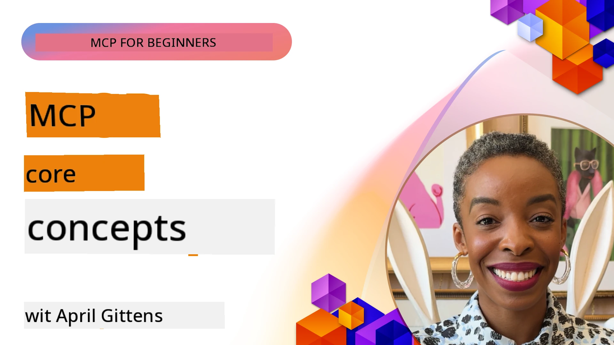
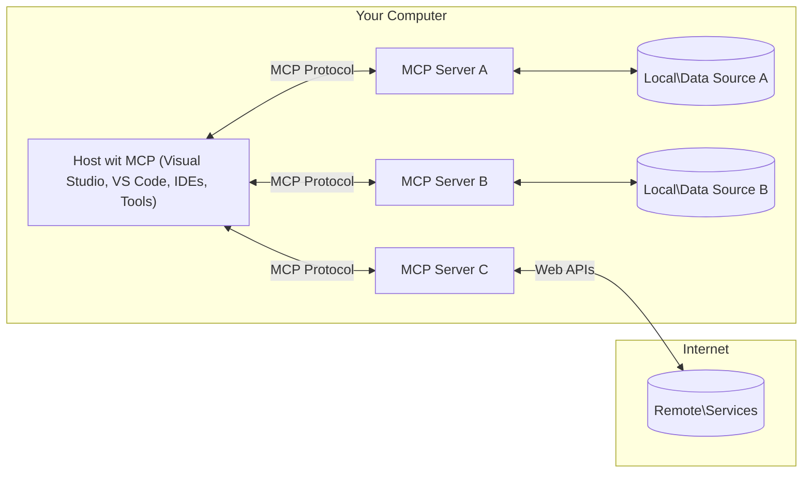

# MCP Core Concepts: Mastering the Model Context Protocol for AI Integration

[](https://youtu.be/earDzWGtE84)

_(Click di image wey dey above to watch video of dis lesson)_

Di [Model Context Protocol (MCP)](https://github.com/modelcontextprotocol) na powerful, standardized framework wey dey optimize communication between Large Language Models (LLMs) and external tools, applications, and data sources.  
Dis guide go waka you through di core concepts of MCP. You go learn about im client-server architecture, important components, communication mechanics, and how to implement am well well.

- **Explicit User Consent**: All data access and operations need explicit user approval before dem fit run am. Users must sabi well well wetin data dem go access and wetin dem go do, with fine control over permissions and authorizations.

- **Data Privacy Protection**: User data no go show unless user gree and e must dey protected by strong access controls throughout di whole interaction time. Implementations must stop unauthorized data transmission and keep strict privacy boundaries.

- **Tool Execution Safety**: Every tool wey dem wan run must get explicit user consent with clear understanding of how di tool dey work, parameters, and wetin e fit cause. Strong security boundaries must stop any unsafe or bad tool execution.

- **Transport Layer Security**: All communication channels suppose use correct encryption and authentication methods. Remote connections suppose use secure transport protocols and proper credential management.

#### Implementation Guidelines:

- **Permission Management**: Make fine-grained permission systems wey go allow users control which servers, tools, and resources dem fit access  
- **Authentication & Authorization**: Use secure authentication methods (OAuth, API keys) with proper token management and expiration  
- **Input Validation**: Check all parameters and data inputs according to defined schemas to stop injection attacks  
- **Audit Logging**: Keep full logs of all operations for security monitoring and compliance  

## Overview

Dis lesson go explore di basic architecture and components wey make up di Model Context Protocol (MCP) ecosystem. You go learn about di client-server architecture, key components, and communication ways wey power MCP interactions.

## Key Learning Objectives

By di end of dis lesson, you go:

- Understand di MCP client-server architecture.  
- Identify roles and responsibilities of Hosts, Clients, and Servers.  
- Analyze di core features wey make MCP flexible for integration.  
- Learn how information dey flow inside di MCP ecosystem.  
- Get practical insights through code examples for .NET, Java, Python, and JavaScript.  

## MCP Architecture: A Deeper Look

Di MCP ecosystem dey built on top client-server model. Dis modular structure dey allow AI applications to interact with tools, databases, APIs, and contextual resources well well. Make we break down dis architecture into im core components.

For im core, MCP dey follow client-server architecture wey allow host application connect to many servers:


- **MCP Hosts**: Programs like VSCode, Claude Desktop, IDEs, or AI tools wey wan access data through MCP  
- **MCP Clients**: Protocol clients wey maintain 1:1 connections with servers  
- **MCP Servers**: Lightweight programs wey each dey expose specific capabilities through di standardized Model Context Protocol  
- **Local Data Sources**: Your computer files, databases, and services wey MCP servers fit access securely  
- **Remote Services**: External systems wey dey internet wey MCP servers fit connect to through APIs.  

Di MCP Protocol na evolving standard wey dey use date-based versioning (YYYY-MM-DD format). Di current protocol version na **2025-11-25**. You fit see di latest updates to di [protocol specification](https://modelcontextprotocol.io/specification/2025-11-25/)

### 1. Hosts

For di Model Context Protocol (MCP), **Hosts** na AI applications wey serve as di main interface wey users dey use to interact with di protocol. Hosts dey coordinate and manage connections to many MCP servers by creating dedicated MCP clients for each server connection. Examples of Hosts na:

- **AI Applications**: Claude Desktop, Visual Studio Code, Claude Code  
- **Development Environments**: IDEs and code editors wey get MCP integration  
- **Custom Applications**: Special AI agents and tools wey dem build for specific purpose  

**Hosts** na applications wey dey coordinate AI model interactions. Dem:

- **Orchestrate AI Models**: Run or interact with LLMs to generate responses and coordinate AI workflows  
- **Manage Client Connections**: Create and maintain one MCP client per MCP server connection  
- **Control User Interface**: Handle conversation flow, user interactions, and how dem show response  
- **Enforce Security**: Control permissions, security constraints, and authentication  
- **Handle User Consent**: Manage user approval for data sharing and tool execution  

### 2. Clients

**Clients** na important components wey maintain dedicated one-to-one connections between Hosts and MCP servers. Each MCP client na im Host create to connect to one specific MCP server, to make communication organized and secure. Many clients fit allow Hosts connect to many servers at once.

**Clients** na connector components inside di host application. Dem:

- **Protocol Communication**: Send JSON-RPC 2.0 requests to servers with prompts and instructions  
- **Capability Negotiation**: Talk about supported features and protocol versions with servers during initialization  
- **Tool Execution**: Manage tool execution requests from models and process responses  
- **Real-time Updates**: Handle notifications and real-time updates from servers  
- **Response Processing**: Process and format server responses to show users  

### 3. Servers

**Servers** na programs wey provide context, tools, and capabilities to MCP clients. Dem fit run locally (for same machine as di Host) or remotely (for external platforms), and dem dey responsible to handle client requests and give structured responses. Servers dey expose specific functionality through di standardized Model Context Protocol.

**Servers** na services wey provide context and capabilities. Dem:

- **Feature Registration**: Register and expose available primitives (resources, prompts, tools) to clients  
- **Request Processing**: Receive and run tool calls, resource requests, and prompt requests from clients  
- **Context Provision**: Provide contextual information and data to improve model responses  
- **State Management**: Maintain session state and handle stateful interactions when needed  
- **Real-time Notifications**: Send notifications about capability changes and updates to connected clients  

Servers fit be developed by anybody to extend model capabilities with special functionality, and dem support both local and remote deployment.

### 4. Server Primitives

Servers for Model Context Protocol (MCP) provide three core **primitives** wey define di basic building blocks for rich interactions between clients, hosts, and language models. These primitives show di types of contextual information and actions wey dem fit do through di protocol.

MCP servers fit expose any combination of these three core primitives:

#### Resources 

**Resources** na data sources wey provide contextual information to AI applications. Dem represent static or dynamic content wey fit improve model understanding and decision-making:

- **Contextual Data**: Structured information and context for AI model use  
- **Knowledge Bases**: Document repositories, articles, manuals, and research papers  
- **Local Data Sources**: Files, databases, and local system information  
- **External Data**: API responses, web services, and remote system data  
- **Dynamic Content**: Real-time data wey dey update based on external conditions  

Resources dem get URIs and dem support discovery through `resources/list` and retrieval through `resources/read` methods:

```text
file://documents/project-spec.md
database://production/users/schema
api://weather/current
```

#### Prompts

**Prompts** na reusable templates wey help structure interactions with language models. Dem provide standardized interaction patterns and templated workflows:

- **Template-based Interactions**: Pre-structured messages and conversation starters  
- **Workflow Templates**: Standardized sequences for common tasks and interactions  
- **Few-shot Examples**: Example-based templates for model instruction  
- **System Prompts**: Foundational prompts wey define model behavior and context  
- **Dynamic Templates**: Parameterized prompts wey fit adjust to specific contexts  

Prompts support variable substitution and fit be discovered via `prompts/list` and retrieved with `prompts/get`:

```markdown
Generate a {{task_type}} for {{product}} targeting {{audience}} with the following requirements: {{requirements}}
```

#### Tools

**Tools** na executable functions wey AI models fit call to perform specific actions. Dem represent di "verbs" of di MCP ecosystem, wey enable models to interact with external systems:

- **Executable Functions**: Separate operations wey models fit call with specific parameters  
- **External System Integration**: API calls, database queries, file operations, calculations  
- **Unique Identity**: Each tool get im own name, description, and parameter schema  
- **Structured I/O**: Tools dey accept validated parameters and return structured, typed responses  
- **Action Capabilities**: Enable models to perform real-world actions and get live data  

Tools dem define with JSON Schema for parameter validation and dem fit be discovered through `tools/list` and executed via `tools/call`:

```typescript
server.tool(
  "search_products", 
  {
    query: z.string().describe("Search query for products"),
    category: z.string().optional().describe("Product category filter"),
    max_results: z.number().default(10).describe("Maximum results to return")
  }, 
  async (params) => {
    // Run search and bring back correct arranged results
    return await productService.search(params);
  }
);
```

## Client Primitives

For Model Context Protocol (MCP), **clients** fit expose primitives wey allow servers to request extra capabilities from di host application. These client-side primitives dey allow richer, more interactive server implementations wey fit access AI model capabilities and user interactions.

### Sampling

**Sampling** dey allow servers to request language model completions from di client's AI application. Dis primitive dey enable servers to access LLM capabilities without needing to embed their own model dependencies:

- **Model-Independent Access**: Servers fit request completions without including LLM SDKs or managing model access  
- **Server-Initiated AI**: Enables servers to generate content on their own using di client's AI model  
- **Recursive LLM Interactions**: Supports complex cases where servers need AI help for processing  
- **Dynamic Content Generation**: Allows servers to create contextual responses using di host's model  

Sampling dey start through di `sampling/complete` method, where servers send completion requests to clients.

### Elicitation  

**Elicitation** dey allow servers to request extra information or confirmation from users through di client interface:

- **User Input Requests**: Servers fit ask for extra information when dem need am for tool execution  
- **Confirmation Dialogs**: Request user approval for sensitive or important operations  
- **Interactive Workflows**: Allow servers to create step-by-step user interactions  
- **Dynamic Parameter Collection**: Gather missing or optional parameters during tool execution  

Elicitation requests dem dey made using di `elicitation/request` method to collect user input through di client's interface.

### Logging

**Logging** dey allow servers to send structured log messages to clients for debugging, monitoring, and operational visibility:

- **Debugging Support**: Allow servers to provide detailed execution logs for troubleshooting  
- **Operational Monitoring**: Send status updates and performance metrics to clients  
- **Error Reporting**: Provide detailed error context and diagnostic information  
- **Audit Trails**: Create full logs of server operations and decisions  

Logging messages dem dey sent to clients to provide transparency into server operations and help debugging.

## Information Flow in MCP

Di Model Context Protocol (MCP) define structured flow of information between hosts, clients, servers, and models. To understand dis flow go help you sabi how user requests dey processed and how external tools and data dey join model responses.

- **Host Initiates Connection**  
  Di host application (like IDE or chat interface) go establish connection to MCP server, usually via STDIO, WebSocket, or another supported transport.

- **Capability Negotiation**  
  Di client (wey dey inside di host) and di server go exchange information about their supported features, tools, resources, and protocol versions. Dis one dey make sure both sides sabi wetin capabilities dey available for di session.

- **User Request**  
  Di user go interact with di host (e.g., enter prompt or command). Di host go collect dis input and pass am to di client for processing.

- **Resource or Tool Use**  
  - Di client fit request extra context or resources from di server (like files, database entries, or knowledge base articles) to improve di model understanding.  
  - If di model see say tool dey needed (e.g., to fetch data, do calculation, or call API), di client go send tool invocation request to di server, specifying di tool name and parameters.

- **Server Execution**  
  Di server go receive di resource or tool request, run di necessary operations (like run function, query database, or get file), and return di results to di client in structured format.

- **Response Generation**  
  Di client go join di server responses (resource data, tool outputs, etc.) into di ongoing model interaction. Di model go use dis information to generate full and contextually correct response.

- **Result Presentation**  
  Di host go receive di final output from di client and show am to di user, often including both di model generated text and any results from tool executions or resource lookups.

Dis flow dey enable MCP to support advanced, interactive, and context-aware AI applications by connecting models with external tools and data sources smoothly.

## Protocol Architecture & Layers

MCP get two different architectural layers wey dey work together to provide complete communication framework:

### Data Layer

Di **Data Layer** dey implement di core MCP protocol using **JSON-RPC 2.0** as im base. Dis layer dey define di message structure, meaning, and interaction patterns:

#### Core Components:

- **JSON-RPC 2.0 Protocol**: All communication dey use standardized JSON-RPC 2.0 message format for method calls, responses, and notifications
- **Lifecycle Management**: Dey handle connection initialization, capability negotiation, and session termination between clients and servers
- **Server Primitives**: E dey enable servers to provide core functionality through tools, resources, and prompts
- **Client Primitives**: E dey enable servers to request sampling from LLMs, make user input, and send log messages
- **Real-time Notifications**: E dey support asynchronous notifications for dynamic updates without polling

#### Key Features:

- **Protocol Version Negotiation**: E dey use date-based versioning (YYYY-MM-DD) to make sure say e dey compatible
- **Capability Discovery**: Clients and servers dey exchange supported feature information during initialization
- **Stateful Sessions**: E dey maintain connection state across multiple interactions for context continuity

### Transport Layer

The **Transport Layer** dey manage communication channels, message framing, and authentication between MCP participants:

#### Supported Transport Mechanisms:

1. **STDIO Transport**:
   - E dey use standard input/output streams for direct process communication
   - E best for local processes wey dey the same machine without network wahala
   - E dey commonly used for local MCP server implementations

2. **Streamable HTTP Transport**:
   - E dey use HTTP POST for client-to-server messages  
   - Optional Server-Sent Events (SSE) for server-to-client streaming
   - E dey enable remote server communication across networks
   - E dey support standard HTTP authentication (bearer tokens, API keys, custom headers)
   - MCP dey recommend OAuth for secure token-based authentication

#### Transport Abstraction:

The transport layer dey abstract communication details from the data layer, e dey enable the same JSON-RPC 2.0 message format across all transport mechanisms. This abstraction dey allow applications to switch between local and remote servers without stress.

### Security Considerations

MCP implementations must follow some important security principles to make sure say interactions dey safe, trustworthy, and secure for all protocol operations:

- **User Consent and Control**: Users must give clear consent before any data dem access or operations dem perform. Dem suppose get clear control over wetin dem share and which actions dem authorize, supported by easy-to-use interfaces to review and approve activities.

- **Data Privacy**: User data suppose only dey exposed with explicit consent and e must dey protected by correct access controls. MCP implementations must protect against unauthorized data transmission and make sure say privacy dey maintained for all interactions.

- **Tool Safety**: Before any tool fit run, explicit user consent must dey. Users suppose understand well well how each tool dey work, and strong security boundaries must dey to prevent any unintended or unsafe tool execution.

If dem follow these security principles, MCP go make sure say user trust, privacy, and safety dey maintained for all protocol interactions while e still dey enable powerful AI integrations.

## Code Examples: Key Components

Below na code examples for some popular programming languages wey show how to implement key MCP server components and tools.

### .NET Example: Creating a Simple MCP Server with Tools

Here na practical .NET code example wey show how to implement simple MCP server with custom tools. This example dey show how to define and register tools, handle requests, and connect the server using the Model Context Protocol.

```csharp
using System;
using System.Threading.Tasks;
using ModelContextProtocol.Server;
using ModelContextProtocol.Server.Transport;
using ModelContextProtocol.Server.Tools;

public class WeatherServer
{
    public static async Task Main(string[] args)
    {
        // Create an MCP server
        var server = new McpServer(
            name: "Weather MCP Server",
            version: "1.0.0"
        );
        
        // Register our custom weather tool
        server.AddTool<string, WeatherData>("weatherTool", 
            description: "Gets current weather for a location",
            execute: async (location) => {
                // Call weather API (simplified)
                var weatherData = await GetWeatherDataAsync(location);
                return weatherData;
            });
        
        // Connect the server using stdio transport
        var transport = new StdioServerTransport();
        await server.ConnectAsync(transport);
        
        Console.WriteLine("Weather MCP Server started");
        
        // Keep the server running until process is terminated
        await Task.Delay(-1);
    }
    
    private static async Task<WeatherData> GetWeatherDataAsync(string location)
    {
        // This would normally call a weather API
        // Simplified for demonstration
        await Task.Delay(100); // Simulate API call
        return new WeatherData { 
            Temperature = 72.5,
            Conditions = "Sunny",
            Location = location
        };
    }
}

public class WeatherData
{
    public double Temperature { get; set; }
    public string Conditions { get; set; }
    public string Location { get; set; }
}
```

### Java Example: MCP Server Components

This example dey show the same MCP server and tool registration as the .NET example above, but e implement for Java.

```java
import io.modelcontextprotocol.server.McpServer;
import io.modelcontextprotocol.server.McpToolDefinition;
import io.modelcontextprotocol.server.transport.StdioServerTransport;
import io.modelcontextprotocol.server.tool.ToolExecutionContext;
import io.modelcontextprotocol.server.tool.ToolResponse;

public class WeatherMcpServer {
    public static void main(String[] args) throws Exception {
        // Make one MCP server
        McpServer server = McpServer.builder()
            .name("Weather MCP Server")
            .version("1.0.0")
            .build();
            
        // Register one weather tool
        server.registerTool(McpToolDefinition.builder("weatherTool")
            .description("Gets current weather for a location")
            .parameter("location", String.class)
            .execute((ToolExecutionContext ctx) -> {
                String location = ctx.getParameter("location", String.class);
                
                // Collect weather data (easy version)
                WeatherData data = getWeatherData(location);
                
                // Return correct formatted response
                return ToolResponse.content(
                    String.format("Temperature: %.1f°F, Conditions: %s, Location: %s", 
                    data.getTemperature(), 
                    data.getConditions(), 
                    data.getLocation())
                );
            })
            .build());
        
        // Connect the server with stdio transport
        try (StdioServerTransport transport = new StdioServerTransport()) {
            server.connect(transport);
            System.out.println("Weather MCP Server started");
            // Make server dey run till process stop
            Thread.currentThread().join();
        }
    }
    
    private static WeatherData getWeatherData(String location) {
        // Implementation go call one weather API
        // Simplify am for example purposes
        return new WeatherData(72.5, "Sunny", location);
    }
}

class WeatherData {
    private double temperature;
    private String conditions;
    private String location;
    
    public WeatherData(double temperature, String conditions, String location) {
        this.temperature = temperature;
        this.conditions = conditions;
        this.location = location;
    }
    
    public double getTemperature() {
        return temperature;
    }
    
    public String getConditions() {
        return conditions;
    }
    
    public String getLocation() {
        return location;
    }
}
```

### Python Example: Building an MCP Server

This example dey use fastmcp, so abeg make sure say you install am first:

```python
pip install fastmcp
```
Code Sample:

```python
#!/usr/bin/env python3
import asyncio
from fastmcp import FastMCP
from fastmcp.transports.stdio import serve_stdio

# Make FastMCP server
mcp = FastMCP(
    name="Weather MCP Server",
    version="1.0.0"
)

@mcp.tool()
def get_weather(location: str) -> dict:
    """Gets current weather for a location."""
    return {
        "temperature": 72.5,
        "conditions": "Sunny",
        "location": location
    }

# Different way wey use class
class WeatherTools:
    @mcp.tool()
    def forecast(self, location: str, days: int = 1) -> dict:
        """Gets weather forecast for a location for the specified number of days."""
        return {
            "location": location,
            "forecast": [
                {"day": i+1, "temperature": 70 + i, "conditions": "Partly Cloudy"}
                for i in range(days)
            ]
        }

# Register class tools dem
weather_tools = WeatherTools()

# Start di server
if __name__ == "__main__":
    asyncio.run(serve_stdio(mcp))
```

### JavaScript Example: Creating an MCP Server

This example dey show MCP server creation for JavaScript and how to register two weather-related tools.

```javascript
// Dey use di official Model Context Protocol SDK
import { McpServer } from "@modelcontextprotocol/sdk/server/mcp.js";
import { StdioServerTransport } from "@modelcontextprotocol/sdk/server/stdio.js";
import { z } from "zod"; // For parameter validation

// Make one MCP server
const server = new McpServer({
  name: "Weather MCP Server",
  version: "1.0.0"
});

// Define one weather tool
server.tool(
  "weatherTool",
  {
    location: z.string().describe("The location to get weather for")
  },
  async ({ location }) => {
    // Normally, dis one go call weather API
    // E simplify for demonstration
    const weatherData = await getWeatherData(location);
    
    return {
      content: [
        { 
          type: "text", 
          text: `Temperature: ${weatherData.temperature}°F, Conditions: ${weatherData.conditions}, Location: ${weatherData.location}` 
        }
      ]
    };
  }
);

// Define one forecast tool
server.tool(
  "forecastTool",
  {
    location: z.string(),
    days: z.number().default(3).describe("Number of days for forecast")
  },
  async ({ location, days }) => {
    // Normally, dis one go call weather API
    // E simplify for demonstration
    const forecast = await getForecastData(location, days);
    
    return {
      content: [
        { 
          type: "text", 
          text: `${days}-day forecast for ${location}: ${JSON.stringify(forecast)}` 
        }
      ]
    };
  }
);

// Helper functions
async function getWeatherData(location) {
  // Simulate API call
  return {
    temperature: 72.5,
    conditions: "Sunny",
    location: location
  };
}

async function getForecastData(location, days) {
  // Simulate API call
  return Array.from({ length: days }, (_, i) => ({
    day: i + 1,
    temperature: 70 + Math.floor(Math.random() * 10),
    conditions: i % 2 === 0 ? "Sunny" : "Partly Cloudy"
  }));
}

// Connect di server using stdio transport
const transport = new StdioServerTransport();
server.connect(transport).catch(console.error);

console.log("Weather MCP Server started");
```

This JavaScript example dey show how to create MCP client wey go connect to server, send prompt, and process the response including any tool calls wey dem make.

## Security and Authorization

MCP get some built-in concepts and mechanisms to manage security and authorization for the whole protocol:

1. **Tool Permission Control**:  
  Clients fit specify which tools model fit use during session. This one dey make sure say only tools wey dem authorize fit dey accessible, e reduce risk of unintended or unsafe operations. Permissions fit dey configured dynamically based on user preferences, organizational policies, or interaction context.

2. **Authentication**:  
  Servers fit require authentication before dem allow access to tools, resources, or sensitive operations. This one fit involve API keys, OAuth tokens, or other authentication schemes. Proper authentication dey make sure say only trusted clients and users fit invoke server-side capabilities.

3. **Validation**:  
  Parameter validation dey enforced for all tool invocations. Each tool dey define expected types, formats, and constraints for parameters, and server dey validate incoming requests accordingly. This one dey prevent malformed or malicious input from reach tool implementations and e help maintain operation integrity.

4. **Rate Limiting**:  
  To prevent abuse and make sure say server resources dey used fairly, MCP servers fit implement rate limiting for tool calls and resource access. Rate limits fit apply per user, per session, or globally, and e help protect against denial-of-service attacks or excessive resource consumption.

By combining these mechanisms, MCP dey provide secure foundation to integrate language models with external tools and data sources, while e still give users and developers fine-grained control over access and usage.

## Protocol Messages & Communication Flow

MCP communication dey use structured **JSON-RPC 2.0** messages to make interactions between hosts, clients, and servers clear and reliable. The protocol dey define specific message patterns for different types of operations:

### Core Message Types:

#### **Initialization Messages**
- **`initialize` Request**: E dey establish connection and negotiate protocol version and capabilities
- **`initialize` Response**: E dey confirm supported features and server information  
- **`notifications/initialized`**: E dey signal say initialization don complete and session ready

#### **Discovery Messages**
- **`tools/list` Request**: E dey discover available tools from server
- **`resources/list` Request**: E dey list available resources (data sources)
- **`prompts/list` Request**: E dey retrieve available prompt templates

#### **Execution Messages**  
- **`tools/call` Request**: E dey execute specific tool with provided parameters
- **`resources/read` Request**: E dey retrieve content from specific resource
- **`prompts/get` Request**: E dey fetch prompt template with optional parameters

#### **Client-side Messages**
- **`sampling/complete` Request**: Server dey request LLM completion from client
- **`elicitation/request`**: Server dey request user input through client interface
- **Logging Messages**: Server dey send structured log messages to client

#### **Notification Messages**
- **`notifications/tools/list_changed`**: Server dey notify client of tool changes
- **`notifications/resources/list_changed`**: Server dey notify client of resource changes  
- **`notifications/prompts/list_changed`**: Server dey notify client of prompt changes

### Message Structure:

All MCP messages dey follow JSON-RPC 2.0 format with:
- **Request Messages**: Dem get `id`, `method`, and optional `params`
- **Response Messages**: Dem get `id` and either `result` or `error`  
- **Notification Messages**: Dem get `method` and optional `params` (no `id` or response expected)

This structured communication dey ensure say interactions dey reliable, traceable, and extensible, e dey support advanced scenarios like real-time updates, tool chaining, and robust error handling.

## Key Takeaways

- **Architecture**: MCP dey use client-server architecture where hosts dey manage multiple client connections to servers
- **Participants**: The ecosystem get hosts (AI applications), clients (protocol connectors), and servers (capability providers)
- **Transport Mechanisms**: Communication dey support STDIO (local) and Streamable HTTP with optional SSE (remote)
- **Core Primitives**: Servers dey expose tools (executable functions), resources (data sources), and prompts (templates)
- **Client Primitives**: Servers fit request sampling (LLM completions), elicitation (user input), and logging from clients
- **Protocol Foundation**: E build on JSON-RPC 2.0 with date-based versioning (current: 2025-11-25)
- **Real-time Capabilities**: E dey support notifications for dynamic updates and real-time synchronization
- **Security First**: Explicit user consent, data privacy protection, and secure transport na core requirements

## Exercise

Design simple MCP tool wey go useful for your domain. Define:
1. Wetin the tool go dey called
2. Wetin parameters e go accept
3. Wetin output e go return
4. How model fit use this tool to solve user problems


---

## What's next

Next: [Chapter 2: Security](../02-Security/README.md)

---

<!-- CO-OP TRANSLATOR DISCLAIMER START -->
**Disclaimer**:
Dis document don translate wit AI translation service [Co-op Translator](https://github.com/Azure/co-op-translator). Even though we dey try make am correct, abeg sabi say automated translation fit get some mistakes or wrong tins. Di original document wey dey im own language na di correct one. If na serious matter, e better make professional human translation do am. We no go responsible for any misunderstanding or wrong meaning wey fit come from dis translation.
<!-- CO-OP TRANSLATOR DISCLAIMER END -->