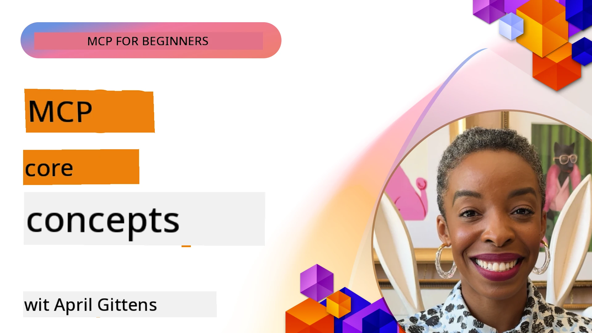
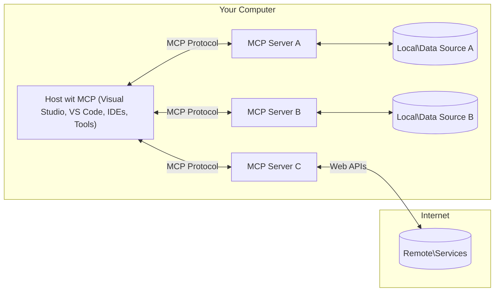

# MCP Core Concepts: Mastering the Model Context Protocol for AI Integration

[](https://youtu.be/earDzWGtE84)

_(Click di picture wey dey top to watch video of dis lesson)_

Di [Model Context Protocol (MCP)](https://github.com/modelcontextprotocol) na strong, standardized framework wey dey optimize communication between Big Language Models (LLMs) and outside tools, apps, and data sources.  
Dis guide go show you di main concepts of MCP. You go learn about how e get client-server architecture, important parts, communication mechanics, and best way to implement am.

- **Clear User Permission**: Everything wey relate to accessing data and operations need clear approval from user before e fit execute. Users must sabi clear wetin data dem go access and wetin dem go do, with fine control over permissions and authorizations.

- **Protect Data Privacy**: User data go only show if user approve am and e must dey protected by strong access controls for whole interaction time. Implementation go prevent unauthorized data waka and keep privacy strong.

- **Tool Execution Safety**: Every time person wan use tool, user must give clear permission wey sabi well-well about tool function, parameters, and wetin fit happen. Strong security lines go stop any wrong, unsafe, or bad tool execution.

- **Transport Layer Security**: All communication channel dem suppose use correct encryption and authentication methods. Remote connection suppose use strong transport protocols and proper credential management.

#### Implementation Guidelines:

- **Permission Management**: Make fine-tuned permission systems wey allow users control which servers, tools, and resources dem fit use  
- **Authentication & Authorization**: Use secure ways to authenticate (OAuth, API keys) with good token management and expiration  
- **Input Validation**: Check all parameters and data inputs according to schema wey dem set make e prevent injection attacks  
- **Audit Logging**: Keep full logs of every operation for security checking and compliance

## Overview

Dis lesson go explore the basic architecture and parts wey make up the Model Context Protocol (MCP) system. You go learn about client-server architecture, key parts, and communication ways wey power MCP interaction.

## Key Learning Objectives

By di end of dis lesson, you go:

- Understand how MCP client-server architecture dey  
- Know di roles and responsibilities of Hosts, Clients, and Servers  
- Analyze main features wey make MCP flexible for integration  
- Learn how information dey flow inside MCP system  
- Get practical knowledge through code examples for .NET, Java, Python, and JavaScript

## MCP Architecture: A Deeper Look

Di MCP system dey build on top client-server model. Dis modular structure dey allow AI apps to interact with tools, databases, APIs, and contextual resources well well. Make we break down dis architecture into im main parts.

For e core, MCP dey follow client-server structure where host app fit connect to plenty servers:


```mermaid
flowchart LR
    subgraph "Your Computer"
        Host["Host wit MCP (Visual Studio, VS Code, IDEs, Tools)"]
        S1["MCP Server A"]
        S2["MCP Server B"]
        S3["MCP Server C"]
        Host <-->|"MCP Protocol"| S1
        Host <-->|"MCP Protocol"| S2
        Host <-->|"MCP Protocol"| S3
        S1 <--> D1[("Local\Data Source A")]
        S2 <--> D2[("Local\Data Source B")]
    end
    subgraph "Internet"
        S3 <-->|"Web APIs"| D3[("Remote\Services")]
    end
```
- **MCP Hosts**: Programs like VSCode, Claude Desktop, IDEs, or AI tools wey wan access data through MCP  
- **MCP Clients**: Protocol clients wey keep 1:1 connection with servers  
- **MCP Servers**: Lightweight programs wey each expose specific abilities through standard Model Context Protocol  
- **Local Data Sources**: Your computer files, databases, and services wey MCP servers fit securely access  
- **Remote Services**: Outside systems wey dey internet wey MCP servers fit connect through APIs.

Di MCP Protocol na standard wey dey develop using date-based version style (YYYY-MM-DD format). Di current protocol version na **2025-11-25**. You fit see di latest updates for di [protocol specification](https://modelcontextprotocol.io/specification/2025-11-25/)

### 1. Hosts

For Model Context Protocol (MCP), **Hosts** na AI apps wey be di main interface wey users dey use take interact with di protocol. Hosts na dem dey organize and manage connections to many MCP servers by creating MCP clients wey dey assigned per each server connection. Examples of Hosts include:

- **AI Applications**: Claude Desktop, Visual Studio Code, Claude Code  
- **Development Environments**: IDEs and code editors wey get MCP integration  
- **Custom Applications**: Special AI agents and tools wey dem build for purpose

**Hosts** na apps wey dey manage AI model interactions. Dem:

- **Orchestrate AI Models**: Dem dey run or interact with LLMs to deliver replies and coordinate AI workflows  
- **Manage Client Connections**: Dem dey create and maintain one MCP client per MCP server connection  
- **Control User Interface**: Handle conversation flow, user interactions, and how e dey show results  
- **Enforce Security**: Manage permissions, security settings, and authentication  
- **Handle User Consent**: Manage user approval for how data go share and tool use

### 2. Clients

**Clients** na parts wey dey very important wey keep one-to-one connection between Hosts and MCP servers. Each MCP client na im Host create to connect one specific MCP server, make sure communication organized and secure. Plenty clients mean Hosts fit connect to many servers at once.

**Clients** na connector parts inside di host app. Dem:

- **Protocol Communication**: Send JSON-RPC 2.0 requests to servers with prompts and instructions  
- **Capability Negotiation**: Talk and agree on features and protocol versions with servers when dem dey start  
- **Tool Execution**: Manage requests to run tools from models and handle responses  
- **Real-time Updates**: Manage notifications and live updates from servers  
- **Response Processing**: Process and arrange server answers to show to users

### 3. Servers

**Servers** na programs wey provide context, tools, and ability to MCP clients. Dem fit run locally (for same machine as di Host) or remotely (for outside platforms), and dem dey responsible to handle client requests and give structured responses. Servers dey expose specific functionality through di standardized Model Context Protocol.

**Servers** na services wey provide context and abilities. Dem:

- **Feature Registration**: Register and show available basics (resources, prompts, tools) to clients  
- **Request Processing**: Receive and run tool calls, resource requests, and prompt requests from clients  
- **Context Provision**: Provide context info and data to improve model replies  
- **State Management**: Keep session state and manage interactions wey need state when necessary  
- **Real-time Notifications**: Send info about capability changes and updates to clients wey connect

Servers fit be build by anybody to extend model abilities with special functions, and dem support both local and remote deployment cases.

### 4. Server Primitives

Servers for Model Context Protocol (MCP) dey provide three main **primitives** wey define basic building blocks for rich interaction between clients, hosts, and language models. These primitives show the kind contextual info and actions wey dey available through di protocol.

MCP servers fit expose any combination of these three main primitives:

#### Resources 

**Resources** na data sources wey provide contextual info to AI apps. Dem represent static or dynamic content wey fit improve model understanding and decision-making:

- **Contextual Data**: Structured info and context for AI model to use  
- **Knowledge Bases**: Document stores, articles, manuals, and research papers  
- **Local Data Sources**: Files, databases, and local system info  
- **External Data**: API responses, web services, and remote system data  
- **Dynamic Content**: Live data wey dey update based on outside conditions

Resources dem dey identified with URIs and fit be discover through `resources/list` and take retrieve through `resources/read` methods:

```text
file://documents/project-spec.md
database://production/users/schema
api://weather/current
```

#### Prompts

**Prompts** na reusable templates wey help structure interaction with language models. Dem provide standard interaction patterns and template workflows:

- **Template-based Interactions**: Messages and conversation starters wey dem pre-structure  
- **Workflow Templates**: Standard ordered steps for common tasks and interactions  
- **Few-shot Examples**: Template based on examples for model instruction  
- **System Prompts**: Base prompts wey define model behavior and context  
- **Dynamic Templates**: Parameterized prompts wey fit adjust for specific contexts

Prompts dem support variable substitution and fit be discover with `prompts/list` and retrieve with `prompts/get`:

```markdown
Generate a {{task_type}} for {{product}} targeting {{audience}} with the following requirements: {{requirements}}
```

#### Tools

**Tools** na functions wey AI models fit run to perform specific actions. Dem be di "verbs" of MCP system, wey make models fit interact with outside systems:

- **Executable Functions**: Separate operations wey models fit run with specific parameters  
- **External System Integration**: API calls, database searches, file handling, calculations  
- **Unique Identity**: Every tool get im own name, description, and parameter schema  
- **Structured I/O**: Tools dey accept validated parameters and return structured, typed replies  
- **Action Capabilities**: Make models fit do real-world actions and fetch live data

Tools dem get JSON Schema for parameter validation and dem fit be discover through `tools/list` and run through `tools/call`. Tools fit also get **icons** as extra metadata for better UI display.

**Tool Annotations**: Tools dem support behavior notes (like `readOnlyHint`, `destructiveHint`) wey describe if tool na read-only or destructive, wey help clients make better choice for tool use.

Example tool definition:

```typescript
server.tool(
  "search_products", 
  {
    query: z.string().describe("Search query for products"),
    category: z.string().optional().describe("Product category filter"),
    max_results: z.number().default(10).describe("Maximum results to return")
  }, 
  async (params) => {
    // Run search and show structured results
    return await productService.search(params);
  }
);
```

## Client Primitives

For Model Context Protocol (MCP), **clients** fit expose primitives wey make servers fit request more capabilities from di host app. These client-side primitives allow richer, more interactive server implementations wey fit access AI model abilities and user interactions.

### Sampling

**Sampling** dey allow servers request language model completions from di client's AI app. Dis primitive dey enable servers access LLM capabilities without putting their own model dependencies inside:

- **Model-Independent Access**: Servers fit request completions without LLM SDK or manage model access  
- **Server-Initiated AI**: Servers fit generate content by themselves using client AI model  
- **Recursive LLM Interactions**: Support complex cases where servers need AI help for processing  
- **Dynamic Content Generation**: Servers fit create context-based replies using host model  
- **Tool Calling Support**: Servers fit add `tools` and `toolChoice` parameters to allow client's model invoke tools anytime during sampling

Sampling start with `sampling/complete` method, where servers send completion requests to clients.

### Roots

**Roots** na standard way for clients to expose filesystem boundaries to servers, to help servers understand which directories and files dem fit access:

- **Filesystem Boundaries**: Define where servers fit operate for filesystem  
- **Access Control**: Help servers sabi which folders and files dem get permission to use  
- **Dynamic Updates**: Clients fit notify servers if root list don change  
- **URI-Based Identification**: Roots use `file://` URIs to show accessible directories and files

Roots fit be discover through `roots/list` method, plus clients dey send `notifications/roots/list_changed` when roots change.

### Elicitation  

**Elicitation** dey allow servers request extra info or confirmation from users through client interface:

- **User Input Requests**: Servers fit ask for more info if e need am for tool run  
- **Confirmation Dialogs**: Ask user approval for sensitive or important actions  
- **Interactive Workflows**: Allow servers create step-by-step user interaction  
- **Dynamic Parameter Collection**: Gather missing or optional parameters when tool dey run

Elicitation request dey use `elicitation/request` method to collect user input through client interface.

**URL Mode Elicitation**: Servers fit also ask for URL-based user interaction, so servers fit direct users go outside web pages for login, approval, or data entry.

### Logging

**Logging** dey allow servers send structured log messages to clients for debugging, monitoring, and operational visibility:

- **Debugging Support**: Make servers fit send detailed execution logs for troubleshooting  
- **Operational Monitoring**: Send status updates and metrics to clients  
- **Error Reporting**: Provide detailed error info and diagnostics  
- **Audit Trails**: Create full logs of server actions and decisions

Logging messages dey send to clients to give transparency about server operations and support debugging.

## Information Flow in MCP

Model Context Protocol (MCP) define structured way for information to move between hosts, clients, servers, and models. Understanding dis flow go help clear how user requests dem dey process and how outside tools and data dey join model replies.
- **Host Dey Start Connection**  
  Di host application (wey fit be IDE or chat interface) dey establish connection to MCP server, normally through STDIO, WebSocket, or another transport wey e support.

- **Capability Negotiation**  
  Di client (wey dey inside di host) and di server dey exchange information about di features, tools, resources, and protocol versions wey dem sabi. Dis one dey make sure say both sides sabi di capabilities wey dey for di session.

- **User Request**  
  Di user dey interact with di host (for example, e fit type prompt or command). Di host go collect dis input come pass am go client for processing.

- **Resource or Tool Use**  
  - Di client fit ask for extra context or resources from di server (like files, database entries, or knowledge base articles) to make di model sabi better.
  - If di model see say e need tool (for example, to fetch data, do calculation, or call API), di client go send tool invocation request go server, tell di tool name and parameters.

- **Server Execution**  
  Di server go receive di resource or tool request, run di necessary operations (like run function, query database, or get file), then send di results back to di client in structured format.

- **Response Generation**  
  Di client go use di server responses (resource data, tool outputs, etc.) join di ongoing model interaction. Di model go use dis information generate full and context-relevant response.

- **Result Presentation**  
  Di host go receive di final output from di client come show am to di user, often including di model generated text and any results from tool take action or resource lookup.

Dis kain flow dey allow MCP support advanced, interactive, and context-aware AI applications by smoothly connect models with external tools and data sources.

## Protocol Architecture & Layers

MCP get two different architectural layers wey dey work together to provide full communication framework:

### Data Layer

Di **Data Layer** na di core MCP protocol wey dey use **JSON-RPC 2.0** as e base. Dis layer define message structure, semantics, and how dem interact:

#### Core Components:

- **JSON-RPC 2.0 Protocol**: All communication dey use standardized JSON-RPC 2.0 message format for method calls, responses, and notifications
- **Lifecycle Management**: E dey handle connection start, capability negotiation, and session end between clients and servers
- **Server Primitives**: Servers fit provide core work through tools, resources, and prompts
- **Client Primitives**: Servers fit ask sampling from LLMs, ask user input, and send log messages through clients
- **Real-time Notifications**: E support asynchronous notifications for live updates without polling

#### Key Features:

- **Protocol Version Negotiation**: E dey use date-based versioning (YYYY-MM-DD) to make sure say pipo fit work together well
- **Capability Discovery**: Clients and servers dey exchange information about supported features during start
- **Stateful Sessions**: E dey keep connection state through many interactions so context no lost

### Transport Layer

Di **Transport Layer** dey manage communication channels, message framing, and authentication between MCP people:

#### Supported Transport Mechanisms:

1. **STDIO Transport**:
   - E dey use standard input/output streams for process communication directly
   - Best for local processes for the same machine without any network wahala
   - Commonly dey use for local MCP server dem

2. **Streamable HTTP Transport**:
   - E dey use HTTP POST for client-to-server messages  
   - Optional Server-Sent Events (SSE) for server-to-client streaming
   - E fit connect remote server across networks
   - E support standard HTTP authentication (bearer tokens, API keys, custom headers)
   - MCP recommend say make dem use OAuth for secure token authentication

#### Transport Abstraction:

Di transport layer dey separate communication details from di data layer, so e fit use di same JSON-RPC 2.0 message format for all transport ways. Dis abstraction allow apps change between local and remote servers sharp sharp.

### Security Considerations

MCP implementations must follow some important security rules to make sure say all interactions safe, trustable, and secure for all protocol operations:

- **User Consent and Control**: Users must give clear permission before any data dey accessed or operation dey do. Dem must get clear control on wetin dem share and which actions dem allow, supported by easy-to-use UI to check and approve actions.

- **Data Privacy**: User data suppose only show if user gree and must dey protected with correct access controls. MCP implementation suppose avoid unauthorized data transfer and make sure privacy maintain throughout all interactions.

- **Tool Safety**: Before dem invoke any tool, user must give explicit consent. Users suppose sabi well how each tool dey work, and strong security boundaries must dey to prevent wrong or unsafe tool use.

If dem follow these security rules, MCP go make sure say user trust, privacy, and safety dey strong for all interactions while still fit connect strong AI tools.

## Code Examples: Key Components

Below na code examples for some popular programming languages wey show how to implement key MCP server parts and tools.

### .NET Example: Creating a Simple MCP Server with Tools

Here na practical .NET code wey show how to make simple MCP server with custom tools. This one show how to define and register tools, handle requests, and connect the server using Model Context Protocol.

```csharp
using System;
using System.Threading.Tasks;
using ModelContextProtocol.Server;
using ModelContextProtocol.Server.Transport;
using ModelContextProtocol.Server.Tools;

public class WeatherServer
{
    public static async Task Main(string[] args)
    {
        // Create an MCP server
        var server = new McpServer(
            name: "Weather MCP Server",
            version: "1.0.0"
        );
        
        // Register our custom weather tool
        server.AddTool<string, WeatherData>("weatherTool", 
            description: "Gets current weather for a location",
            execute: async (location) => {
                // Call weather API (simplified)
                var weatherData = await GetWeatherDataAsync(location);
                return weatherData;
            });
        
        // Connect the server using stdio transport
        var transport = new StdioServerTransport();
        await server.ConnectAsync(transport);
        
        Console.WriteLine("Weather MCP Server started");
        
        // Keep the server running until process is terminated
        await Task.Delay(-1);
    }
    
    private static async Task<WeatherData> GetWeatherDataAsync(string location)
    {
        // This would normally call a weather API
        // Simplified for demonstration
        await Task.Delay(100); // Simulate API call
        return new WeatherData { 
            Temperature = 72.5,
            Conditions = "Sunny",
            Location = location
        };
    }
}

public class WeatherData
{
    public double Temperature { get; set; }
    public string Conditions { get; set; }
    public string Location { get; set; }
}
```

### Java Example: MCP Server Components

Dis example show di same MCP server and tool registration as di .NET example, but e implement for Java.

```java
import io.modelcontextprotocol.server.McpServer;
import io.modelcontextprotocol.server.McpToolDefinition;
import io.modelcontextprotocol.server.transport.StdioServerTransport;
import io.modelcontextprotocol.server.tool.ToolExecutionContext;
import io.modelcontextprotocol.server.tool.ToolResponse;

public class WeatherMcpServer {
    public static void main(String[] args) throws Exception {
        // Make one MCP server
        McpServer server = McpServer.builder()
            .name("Weather MCP Server")
            .version("1.0.0")
            .build();
            
        // Register one weather tool
        server.registerTool(McpToolDefinition.builder("weatherTool")
            .description("Gets current weather for a location")
            .parameter("location", String.class)
            .execute((ToolExecutionContext ctx) -> {
                String location = ctx.getParameter("location", String.class);
                
                // Collect weather data (easy version)
                WeatherData data = getWeatherData(location);
                
                // Return formatted answer
                return ToolResponse.content(
                    String.format("Temperature: %.1f°F, Conditions: %s, Location: %s", 
                    data.getTemperature(), 
                    data.getConditions(), 
                    data.getLocation())
                );
            })
            .build());
        
        // Connect server with stdio transport
        try (StdioServerTransport transport = new StdioServerTransport()) {
            server.connect(transport);
            System.out.println("Weather MCP Server started");
            // Make server dey run till process kpai
            Thread.currentThread().join();
        }
    }
    
    private static WeatherData getWeatherData(String location) {
        // Implementation go call weather API
        // E simplify for example purposes
        return new WeatherData(72.5, "Sunny", location);
    }
}

class WeatherData {
    private double temperature;
    private String conditions;
    private String location;
    
    public WeatherData(double temperature, String conditions, String location) {
        this.temperature = temperature;
        this.conditions = conditions;
        this.location = location;
    }
    
    public double getTemperature() {
        return temperature;
    }
    
    public String getConditions() {
        return conditions;
    }
    
    public String getLocation() {
        return location;
    }
}
```

### Python Example: Building an MCP Server

Dis example dey use fastmcp, so abeg make sure say you install am first:

```python
pip install fastmcp
```
Code Sample:

```python
#!/usr/bin/env python3
import asyncio
from fastmcp import FastMCP
from fastmcp.transports.stdio import serve_stdio

# Make one FastMCP server
mcp = FastMCP(
    name="Weather MCP Server",
    version="1.0.0"
)

@mcp.tool()
def get_weather(location: str) -> dict:
    """Gets current weather for a location."""
    return {
        "temperature": 72.5,
        "conditions": "Sunny",
        "location": location
    }

# Another way to do am na to use class
class WeatherTools:
    @mcp.tool()
    def forecast(self, location: str, days: int = 1) -> dict:
        """Gets weather forecast for a location for the specified number of days."""
        return {
            "location": location,
            "forecast": [
                {"day": i+1, "temperature": 70 + i, "conditions": "Partly Cloudy"}
                for i in range(days)
            ]
        }

# Register class tools dem
weather_tools = WeatherTools()

# Begin di server run
if __name__ == "__main__":
    asyncio.run(serve_stdio(mcp))
```

### JavaScript Example: Creating an MCP Server

Dis example dey show how to create MCP server for JavaScript and how to register two weather tools.

```javascript
// Di official Model Context Protocol SDK dey used
import { McpServer } from "@modelcontextprotocol/sdk/server/mcp.js";
import { StdioServerTransport } from "@modelcontextprotocol/sdk/server/stdio.js";
import { z } from "zod"; // For parameter validation

// Make one MCP server
const server = new McpServer({
  name: "Weather MCP Server",
  version: "1.0.0"
});

// Define one weather tool
server.tool(
  "weatherTool",
  {
    location: z.string().describe("The location to get weather for")
  },
  async ({ location }) => {
    // Normally, e for dey call weather API
    // E be simplify for demonstration
    const weatherData = await getWeatherData(location);
    
    return {
      content: [
        { 
          type: "text", 
          text: `Temperature: ${weatherData.temperature}°F, Conditions: ${weatherData.conditions}, Location: ${weatherData.location}` 
        }
      ]
    };
  }
);

// Define one forecast tool
server.tool(
  "forecastTool",
  {
    location: z.string(),
    days: z.number().default(3).describe("Number of days for forecast")
  },
  async ({ location, days }) => {
    // Normally, e for dey call weather API
    // E be simplify for demonstration
    const forecast = await getForecastData(location, days);
    
    return {
      content: [
        { 
          type: "text", 
          text: `${days}-day forecast for ${location}: ${JSON.stringify(forecast)}` 
        }
      ]
    };
  }
);

// Helper functions dem
async function getWeatherData(location) {
  // Make we show like na API call
  return {
    temperature: 72.5,
    conditions: "Sunny",
    location: location
  };
}

async function getForecastData(location, days) {
  // Make we show like na API call
  return Array.from({ length: days }, (_, i) => ({
    day: i + 1,
    temperature: 70 + Math.floor(Math.random() * 10),
    conditions: i % 2 === 0 ? "Sunny" : "Partly Cloudy"
  }));
}

// Connect di server wit stdio transport
const transport = new StdioServerTransport();
server.connect(transport).catch(console.error);

console.log("Weather MCP Server started");
```

Dis JavaScript example dey show how to build MCP server wey register weather tools and connect through stdio transport to handle client requests.

## Security and Authorization

MCP get some built-in idea and ways to handle security and authorization throughout di protocol:

1. **Tool Permission Control**:  
  Clients fit talk which tools di model fit use during session. Dis one make sure say only tools wey e gree fit access, and e reduce risk of unsafe operations. Permissions fit set dynamically base on user preference, company policy, or interaction context.

2. **Authentication**:  
  Servers fit require authentication before e allow access to tools, resources, or sensitive work. Dis fit be with API keys, OAuth tokens, or other authentication ways. Correct authentication make sure only trusted clients and users fit use server capabilities.

3. **Validation**:  
  Parameter validation dey for all tool calls. Each tool dey define type, format, and rules for e parameters, and server go check incoming requests well. Dis one prevent bad or dangerous data from enter tool and keep operations safe.

4. **Rate Limiting**:  
  To stop abuse and make sure resources no overuse, MCP servers fit put rate limits for tool calls and resource access. Rate limits fit apply per user, session, or globally, to protect from denial-of-service attacks or too much resource consumption.

By combining these ways, MCP dey give strong security foundation to join language models with external tools and data, while still giving users and developers fine control over access and use.

## Protocol Messages & Communication Flow

MCP dey use structured **JSON-RPC 2.0** messages to help clear and reliable talks between hosts, clients, and servers. Di protocol get special message patterns for different kinds operations:

### Core Message Types:

#### **Initialization Messages**
- **`initialize` Request**: Start connection and agree protocol version and capabilities
- **`initialize` Response**: Confirm supported features and server info  
- **`notifications/initialized`**: Show say initialization done and session ready

#### **Discovery Messages**
- **`tools/list` Request**: Find tools wey server get
- **`resources/list` Request**: List available resources (data sources)
- **`prompts/list` Request**: Get prompt templates

#### **Execution Messages**  
- **`tools/call` Request**: Run specific tool with parameters
- **`resources/read` Request**: Get content from a resource
- **`prompts/get` Request**: Fetch prompt template with params if needed

#### **Client-side Messages**
- **`sampling/complete` Request**: Server ask client for LLM completion
- **`elicitation/request`**: Server ask client for user input
- **Logging Messages**: Server sends log messages to client

#### **Notification Messages**
- **`notifications/tools/list_changed`**: Server tell client tools change
- **`notifications/resources/list_changed`**: Server tell client resource change  
- **`notifications/prompts/list_changed`**: Server tell client prompt change

### Message Structure:

All MCP messages follow JSON-RPC 2.0 format with:
- **Request Messages**: Get `id`, `method`, and optional `params`
- **Response Messages**: Get `id` and either `result` or `error`  
- **Notification Messages**: Get `method` and optional `params` (no `id` or response expected)

Dis structured communication make sure say interaction reliable, traceable, and fit support big things like real-time updates, tool chaining, and strong error handling.

### Tasks (Experimental)

**Tasks** na experimental feature wey give durable execution wrappers wey fit enable result retrieval and status tracking for MCP requests:

- **Long-Running Operations**: Fit follow expensive calculations, workflow automation, batch processing
- **Deferred Results**: You fit check task status and get results when e finish
- **Status Tracking**: You fit monitor task progress through lifecycle states
- **Multi-Step Operations**: E fit support complex workflows wey go through multiple interactions

Tasks dey wrap normal MCP requests make e fit run asynchronous operations wey no fit finish immediately.

## Key Takeaways

- **Architecture**: MCP dey use client-server design where hosts handle many client connections to servers
- **Participants**: Ecosystem get hosts (AI apps), clients (protocol connectors), and servers (capability providers)
- **Transport Mechanisms**: Communication support STDIO (local) and Streamable HTTP with optional SSE (remote)
- **Core Primitives**: Servers expose tools (functions to run), resources (data sources), and prompts (templates)
- **Client Primitives**: Servers fit ask sampling (LLM completions with tool calls), elicitation (user input including URL mode), roots (filesystem boundaries), and logging from clients
- **Experimental Features**: Tasks provide durable execution wrappers for long operations
- **Protocol Foundation**: Built on JSON-RPC 2.0 with date-based versioning (now: 2025-11-25)
- **Real-time Capabilities**: Support notifications for live updates and real-time sync
- **Security First**: Explicit user consent, data privacy protection, and secure transport be di main requirements

## Exercise

Design simple MCP tool wey go useful for your area. Define:
1. Wetin you go name di tool
2. Wetin parameters e go accept
3. Wetin output e go return
4. How model fit use dis tool to solve user problems


---

## Wetin next

Next: [Chapter 2: Security](../02-Security/README.md)

---

<!-- CO-OP TRANSLATOR DISCLAIMER START -->
**Disclaimer**:
Dis document don translate wit AI translation service [Co-op Translator](https://github.com/Azure/co-op-translator). Even tho we dey try make am correct, abeg sabi say automated translation fit get some mistake or no pure. The original document for im own language na the correct source to trust. For important info, make you use professional human translation. We no go responsible for any misunderstanding or wrong meaning wey fit show because of dis translation.
<!-- CO-OP TRANSLATOR DISCLAIMER END -->