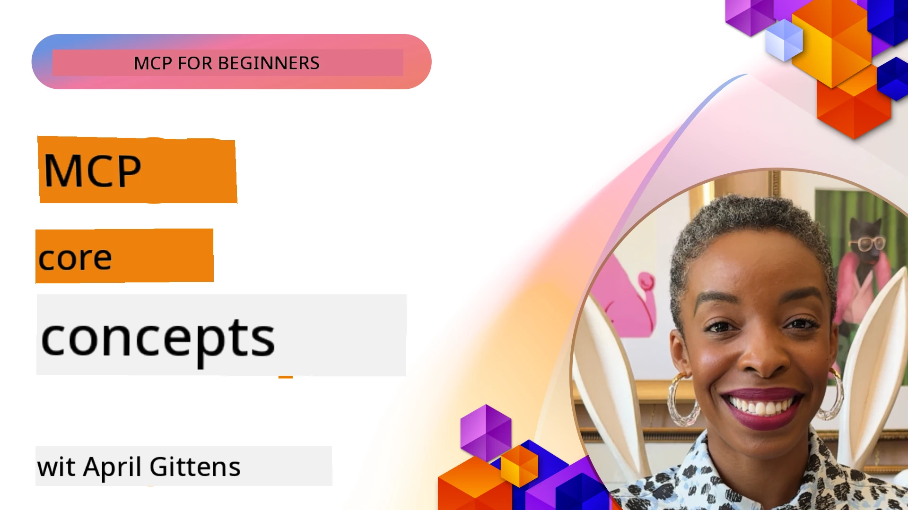
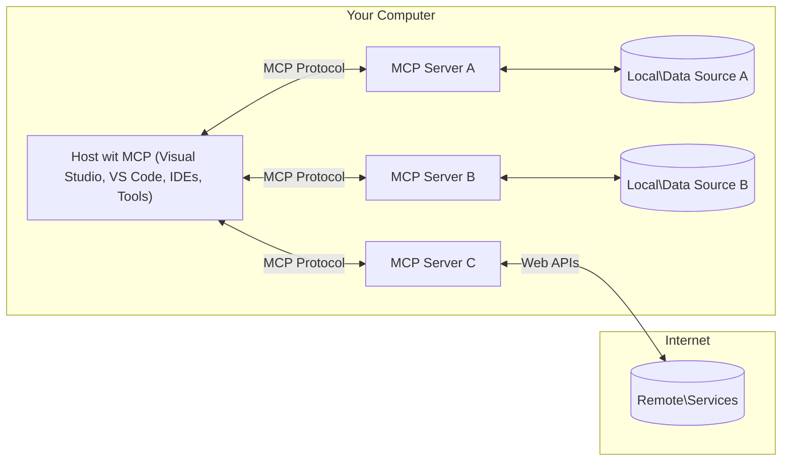

# MCP Core Concepts: Mastering di Model Context Protocol for AI Integration

[](https://youtu.be/earDzWGtE84)

_(Click di image wey dey for top to watch video for dis lesson)_

Di [Model Context Protocol (MCP)](https://github.com/modelcontextprotocol) na strong, standardized framework wey dey optimize how Large Language Models (LLMs) and outside tools, applications, and data sources dey communicate. 
Dis guide go waka you through di main tins about MCP. You go learn about how e get client-server architecture, important parts, how dem dey take yarn, and beta way to use am well.

- **Clear User Permission**: All data wey person wan use or operation dem wan do, person gats first approve am clear clear before e start. People mus sabi well well which data dem wan access and which action dem wan take, plus make dem fit control permissions well well.

- **Data Privacy Protection**: User data no go show unless person approve am plus dem gats protect am with strong access control for all di period dem dey use am. CD implementations gats stop any person wey no get permission from sending data and protect private areas well well.

- **Tool Execution Safety**: Any time dem wan use any tool, dem gats get clear approval from user, plus the user gots sabi how tool dey work, e parameters, and wetin e fit do. Strong security gats stop tool wey fit harm or misuse.

- **Transport Layer Security**: All communication path dem gats use correct encryption plus authentication system. Remote connections suppose use secure transport protocol plus correct way to manage credentials.

#### How to Implement Am:

- **Permission Management**: Make system wey go allow fine control so users fit decide which servers, tools, and resources dem fit access
- **Authentication & Authorization**: Use secure authentication like OAuth, API keys wey get proper token control and expiry  
- **Input Validation**: Check all data and parameters according to schema dem to stop injection attack
- **Audit Logging**: Keep full log of all operations for security check and compliance

## Overview

Dis lesson go show you how di basic design and parts wey dey Model Context Protocol (MCP) system dey work. You go learn about di client-server architecture, important parts, and communication ways dem wey dey power MCP connection.

## Key Learning Objectives

By di end of dis lesson, you go:

- Understand di MCP client-server architecture.
- Know di roles and responsibilities of Hosts, Clients, and Servers.
- Check wetin be di core features wey make MCP flexible for integration.
- Learn how info dey flow inside MCP system.
- Get practical sense through code examples for .NET, Java, Python, and JavaScript.

## MCP Architecture: A Deeper Look

MCP system dey follow client-server model. Dis format allow AI apps to interact with tools, databases, APIs, and other contextual resources sharply. Make we break down dis architecture into di main parts.

For di center, MCP dey follow one client-server architecture where host app fit connect to many servers:


```mermaid
flowchart LR
    subgraph "Your Computer"
        Host["Host wit MCP (Visual Studio, VS Code, IDEs, Tools)"]
        S1["MCP Server A"]
        S2["MCP Server B"]
        S3["MCP Server C"]
        Host <-->|"MCP Protocol"| S1
        Host <-->|"MCP Protocol"| S2
        Host <-->|"MCP Protocol"| S3
        S1 <--> D1[("Local\Data Source A")]
        S2 <--> D2[("Local\Data Source B")]
    end
    subgraph "Internet"
        S3 <-->|"Web APIs"| D3[("Remote\Services")]
    end
```

- **MCP Hosts**: Programs like VSCode, Claude Desktop, IDEs, or AI tools wey wan access data through MCP
- **MCP Clients**: Protocol clients wey dey keep 1:1 connections with servers
- **MCP Servers**: Lightweight programs wey dey show specific abilities through the standard Model Context Protocol
- **Local Data Sources**: Your computer files, databases, and services wey MCP servers fit safely access
- **Remote Services**: Systems wey dey outside anywhere online, MCP servers fit connect to dem through APIs.

Di MCP Protocol na one evolving standard wey dey use date-based version (YYYY-MM-DD style). Di current protocol version na **2025-11-25**. You fit see di latest updates for di [protocol specification](https://modelcontextprotocol.io/specification/2025-11-25/)

> **Look ahead:** One release candidate for di next specification version, **2026-07-28**, dem announce am for May 2026 and e dey scheduled to drop for July 28, 2026. E make di protocol stateless for transport layer (e remove di `initialize` handshake and session IDs), e formalize Extensions framework, plus e stop using Roots, Sampling, and Logging but replace them with new beta ways. Check [What's Changing in MCP: The 2026-07-28 Release Candidate](./mcp-2026-07-28-release-candidate.md) for full details.

### 1. Hosts

For Model Context Protocol (MCP), **Hosts** na AI applications wey dey serve as di primary front-end wey users take interact with di protocol. Hosts dey coordinate and manage connection to many MCP servers by creating special MCP clients for each server connection. Examples of Hosts include:

- **AI Applications**: Claude Desktop, Visual Studio Code, Claude Code
- **Development Environments**: IDEs and code editors wey get MCP integration  
- **Custom Applications**: AI agents and tools wey dem build specially

**Hosts** na applications wey dey coordinate AI model interactions. Dem:

- **Arrange AI Models**: Run or interact with LLMs to generate responses and coordinate AI work
- **Manage Client Connections**: Create and maintain one MCP client for every MCP server connection
- **Control User Interface**: Manage story flow, user talks, and response display  
- **Enforce Security**: Control permissions, security rules, and authentication
- **Handle User Consent**: Manage user ok for data sharing and tool use


### 2. Clients

**Clients** na important parts wey keep one-to-one connection between Hosts and MCP servers. Each MCP client na one instance wey Host use connect to particular MCP server, so that communication go straight and secure. Plenty clients fit allow Hosts connect to many servers for same time.

**Clients** na connector parts inside di host app. Dem:

- **Protocol Communication**: Send JSON-RPC 2.0 requests to servers with prompts and commands
- **Capability Negotiation**: Negotiate supported features and protocol versions with servers when e dey start
- **Tool Execution**: Manage tool calls from models and handle responses
- **Real-time Updates**: Handle notifications and real-time update from servers
- **Response Processing**: Process and prepare server replies for user display

### 3. Servers

**Servers** na programs wey provide context, tools, and abilities to MCP clients. Dem fit run locally (for the same computer as the Host) or remotely (on outside platforms), dem dey responsible to handle client requests and give structured responses. Servers show specific functions through di standardized Model Context Protocol.

**Servers** na services wey provide context and abilities. Dem:

- **Feature Registration**: Register and show available primitives (resources, prompts, tools) to clients
- **Request Processing**: Receive and do tool calls, resource requests, and prompt requests from clients
- **Context Provision**: Provide context information and data to help model answer well
- **State Management**: Keep session state and manage stateful talks if necessary
- **Real-time Notifications**: Send notifications about capability changes and updates to clients wey connect

Anybody fit build servers to increase model ability with special functions, and dem fit run both locally and remotely.

### 4. Server Primitives

Servers for Model Context Protocol (MCP) dey provide three main **primitives** wey define basic building blocks for strong interaction between clients, hosts, and language models. These primitives dey set di types of contextual information and actions wey dem fit take through di protocol.

MCP servers fit show any combination of these three core primitives:

#### Resources 

**Resources** na data sources wey provide contextual info to AI apps. Dem fit be static or dynamic content wey go help model sabi well and make better decisions:

- **Contextual Data**: Structured info and context for AI model to use
- **Knowledge Bases**: Document storage, articles, manuals, and research papers
- **Local Data Sources**: Files, databases, and local machine info  
- **External Data**: API responses, web services, and outside system data
- **Dynamic Content**: Real-time data wey update based on outside conditions

Resources dem dey identify by URIs and dem fit show `resources/list` and give am via `resources/read` methods:

```text
file://documents/project-spec.md
database://production/users/schema
api://weather/current
```

#### Prompts

**Prompts** na reusable templates wey help arrange interaction with language models. Dem give steady interaction ways and templated workflows:

- **Template-based Interactions**: Pre-set messages and conversation openers
- **Workflow Templates**: Standard sequences for normal tasks and talks
- **Few-shot Examples**: Example-based templates wey teach model
- **System Prompts**: Base prompts wey define how model go behave and context
- **Dynamic Templates**: Parameterized prompts wey fit change to fit specific context

Prompts fit change variables and dem fit show via `prompts/list` and fetch with `prompts/get`:

```markdown
Generate a {{task_type}} for {{product}} targeting {{audience}} with the following requirements: {{requirements}}
```

#### Tools

**Tools** na functions wey AI models fit call to do certain action. Dem be di "verbs" for MCP system, wey make models fit interact with outside systems:

- **Executable Functions**: Separate operations wey models fit call with correct parameters
- **External System Integration**: API calls, database queries, file works, calculations
- **Unique Identity**: Each tool get separate name, description, and parameter rules
- **Structured I/O**: Tools accept checked parameters and give structured, typed response
- **Action Capabilities**: Allow models to do real-world actions and collect live data

Tools dem define with JSON Schema to check parameters and dem fit show for `tools/list` and call for `tools/call`. Tools fit also get **icons** as extra info to make UI better.

**Tool Annotations**: Tools fit carry behavioral notes (like `readOnlyHint`, `destructiveHint`) wey explain if tool na read-only or destructive, help clients decide well how to run tool.

Example tool definition:

```typescript
server.tool(
  "search_products", 
  {
    query: z.string().describe("Search query for products"),
    category: z.string().optional().describe("Product category filter"),
    max_results: z.number().default(10).describe("Maximum results to return")
  }, 
  async (params) => {
    // Run search and bring back structured result dem
    return await productService.search(params);
  }
);
```

## Client Primitives

For Model Context Protocol (MCP), **clients** fit show primitives wey make servers fit ask more abilities from the host app. These client-side primitives allow richer, more interactive server builds wey fit access AI model powers and user interaction.

### Sampling

> **Deprecation notice:** di `2026-07-28` release candidate don mark Sampling as deprecated, replace am with direct connection to LLM provider APIs. E still dey work for `2025-11-25` and for at least one year after deprecation, but new designs suppose use di new pattern. See [What's Changing in MCP: The 2026-07-28 Release Candidate](./mcp-2026-07-28-release-candidate.md).

**Sampling** allow servers to ask language model completion from the client’s AI app. Dis primitive let servers use LLM power without putting their own model dependencies inside:

- **Model-Independent Access**: Servers fit ask for completions without LLM SDKs or managing model themselves
- **Server-Initiated AI**: Servers fit generate content on their own using client’s AI model
- **Recursive LLM Interactions**: Supports complex cases where servers need AI help to process
- **Dynamic Content Generation**: Allows servers to create responses with context using host’s model
- **Tool Calling Support**: Servers fit add `tools` and `toolChoice` parameters so client model fit call tools during sampling

Sampling dey start with `sampling/complete` method, where servers send request to clients.

### Roots

> **Deprecation notice:** di `2026-07-28` release candidate don mark Roots as deprecated, replacements na tool parameters, resource URIs, or server settings. E still dey work for `2025-11-25` and for at least one year after, but new design gats use new way. Check [What's Changing in MCP: The 2026-07-28 Release Candidate](./mcp-2026-07-28-release-candidate.md).

**Roots** na standard way for clients to show filesystem limits to servers, to help servers sabi which directories and files dem fit access:

- **Filesystem Boundaries**: Define places where servers fit work inside filesystem
- **Access Control**: Help servers know which directories and files dem get permission to open
- **Dynamic Updates**: Clients fit tell servers when roots list change
- **URI-Based Identification**: Roots dey use `file://` URIs to show accessible directories and files

Roots dey show via `roots/list` method, clients go send `notifications/roots/list_changed` if roots change.

### Elicitation  

**Elicitation** allow servers to ask for extra info or confirmation from users through client interface:

- **User Input Requests**: Servers fit ask for more info when dem need am for tool execution
- **Confirmation Dialogs**: Ask user okay for sensitive or important actions
- **Interactive Workflows**: Allow servers to do step-by-step user interaction
- **Dynamic Parameter Collection**: Collect missing or optional parameters while tools dey run

Elicitation requests dem send with `elicitation/request` method to collect user input via client interface.

**URL Mode Elicitation**: Servers fit also ask for URL-based user interaction, so servers fit direct user go outside web page for authentication, confirmation, or data entry.

### Logging
> **Deprecation notice:** di `2026-07-28` release candidate don mark Logging as deprecated in favor of `stderr` for stdio transports and OpenTelemetry for structured observability. E still dey work for `2025-11-25` and for at least one year after any deprecation. See [What's Changing in MCP: The 2026-07-28 Release Candidate](./mcp-2026-07-28-release-candidate.md).

**Logging** dey allow servers to send structured log messages to clients for debugging, monitoring, and operational visibility:

- **Debugging Support**: Make servers fit provide detailed execution logs for troubleshooting
- **Operational Monitoring**: Send status updates and performance metrics to clients
- **Error Reporting**: Provide detailed error context and diagnostic information
- **Audit Trails**: Create comprehensive logs of server operations and decisions

Logging messages dey sent go clients to provide transparency into server operations and make debugging easier.

## Information Flow in MCP

The Model Context Protocol (MCP) dey define structured flow of information between hosts, clients, servers, and models. To sabi dis flow go help make clear how user requests dey process and how external tools and data dey integrate inside model responses.

- **Host Initiates Connection**  
  The host application (like IDE or chat interface) go establish connection to MCP server, normally via STDIO, WebSocket, or another supported transport.

- **Capability Negotiation**  
  The client (wey dey inside di host) and the server go exchange information about their features, tools, resources, and protocol versions wey dem support. Dis one go make sure both sides sabi the capabilities wey dey for the session.

- **User Request**  
  The user go interact with di host (for example, enter prompt or command). The host go collect dis input and pass am to di client for processing.

- **Resource or Tool Use**  
  - Di client fit request additional context or resources from the server (like files, database entries, or knowledge base articles) to help di model understanding.
  - If di model see say tool need (like to fetch data, do calculation, or call API), di client go send tool invocation request to di server, specify the tool name and parameters.

- **Server Execution**  
  Di server go receive di resource or tool request, e go run di operations (like run function, query database, or find file), then e go return di results to di client inside structured format.

- **Response Generation**  
  Di client go join di server's responses (resource data, tool outputs, etc.) inside the ongoing model interaction. Di model go use this one generate comprehensive and contextually correct answer.

- **Result Presentation**  
  Di host go receive di final output from di client and show am to di user, including both di model generated text and any results from tool executions or resource lookups.

Dis flow dey allow MCP support advanced, interactive, and context-aware AI apps by connecting models with external tools and data sources smoothly.

## Protocol Architecture & Layers

MCP get two main architecture layers wey dey work together to give complete communication framework:

### Data Layer

The **Data Layer** implement core MCP protocol using **JSON-RPC 2.0** as foundation. Dis layer dey define how message structure, semantics, and interaction patterns go be:

#### Core Components:

- **JSON-RPC 2.0 Protocol**: All communication dey use standardized JSON-RPC 2.0 message format for method calls, responses, and notifications
- **Lifecycle Management**: E dey handle connection initialization, capability negotiation, and session termination between clients and servers
- **Server Primitives**: E make servers fit provide core functions through tools, resources, and prompts
- **Client Primitives**: E make servers fit ask for sampling from LLMs, request user input, and send log messages
- **Real-time Notifications**: E support asynchronous notifications wey no need polling for updates

#### Key Features:

- **Protocol Version Negotiation**: E use date-based versioning (YYYY-MM-DD) to make sure say dem compatible
- **Capability Discovery**: Clients and servers go exchange supported feature info during initialization
- **Stateful Sessions**: E maintain connection state for multiple interactions to keep context continuity

### Transport Layer

The **Transport Layer** dey manage communication channels, message framing, and authentication between MCP participants:

#### Supported Transport Mechanisms:

1. **STDIO Transport**:
   - E use standard input/output streams for direct process communication
   - Best for local processes wey dey same machine without network wahala
   - Commonly used for local MCP server implementations

2. **Streamable HTTP Transport**:
   - E use HTTP POST for client-to-server messages  
   - Optional Server-Sent Events (SSE) for server-to-client streaming
   - E enable remote server communication across networks
   - E support standard HTTP authentication (bearer tokens, API keys, custom headers)
   - MCP recommend OAuth for secure token-based authentication

#### Transport Abstraction:

The transport layer dey hide communication details from the data layer, so that di same JSON-RPC 2.0 message format fit work for all transport types. Dis abstraction make e easy for apps to change between local and remote servers.

### Security Considerations

MCP implementations must follow important security principles to make sure say interaction safe, trustworthy, and secure throughout all protocol operations:

- **User Consent and Control**: Users must give clear permission before any data dem access or make any operations. Dem suppose get clear control over which data dem share and which actions dem allow, plus easy user interfaces for approving activities.

- **Data Privacy**: User data suppose only dey accessed with clear permission and e must get proper access controls. MCP implementations must protect data from unauthorized transmission and keep privacy throughout all interactions.

- **Tool Safety**: Before call any tool, user consent must dey. Users suppose sabi wetin each tool fit do, and strong security boundaries must dey to stop unsafe or unintended tool usage.

If these security principles follow well, MCP go keep user trust, privacy, and safety for all protocol actions while still give strong AI integrations.

## Code Examples: Key Components

Below na some code examples for different popular programming languages wey show how to build key MCP server components and tools.

### .NET Example: Creating a Simple MCP Server with Tools

Here na practical .NET code example wey show how to build simple MCP server with custom tools. The example show how to define and register tools, handle requests, and connect server using Model Context Protocol.

```csharp
using System;
using System.Threading.Tasks;
using ModelContextProtocol.Server;
using ModelContextProtocol.Server.Transport;
using ModelContextProtocol.Server.Tools;

public class WeatherServer
{
    public static async Task Main(string[] args)
    {
        // Create an MCP server
        var server = new McpServer(
            name: "Weather MCP Server",
            version: "1.0.0"
        );
        
        // Register our custom weather tool
        server.AddTool<string, WeatherData>("weatherTool", 
            description: "Gets current weather for a location",
            execute: async (location) => {
                // Call weather API (simplified)
                var weatherData = await GetWeatherDataAsync(location);
                return weatherData;
            });
        
        // Connect the server using stdio transport
        var transport = new StdioServerTransport();
        await server.ConnectAsync(transport);
        
        Console.WriteLine("Weather MCP Server started");
        
        // Keep the server running until process is terminated
        await Task.Delay(-1);
    }
    
    private static async Task<WeatherData> GetWeatherDataAsync(string location)
    {
        // This would normally call a weather API
        // Simplified for demonstration
        await Task.Delay(100); // Simulate API call
        return new WeatherData { 
            Temperature = 72.5,
            Conditions = "Sunny",
            Location = location
        };
    }
}

public class WeatherData
{
    public double Temperature { get; set; }
    public string Conditions { get; set; }
    public string Location { get; set; }
}
```

### Java Example: MCP Server Components

Dis example show di same MCP server and tool registration as di .NET example above, but e implement for Java.

```java
import io.modelcontextprotocol.server.McpServer;
import io.modelcontextprotocol.server.McpToolDefinition;
import io.modelcontextprotocol.server.transport.StdioServerTransport;
import io.modelcontextprotocol.server.tool.ToolExecutionContext;
import io.modelcontextprotocol.server.tool.ToolResponse;

public class WeatherMcpServer {
    public static void main(String[] args) throws Exception {
        // Mak one MCP server
        McpServer server = McpServer.builder()
            .name("Weather MCP Server")
            .version("1.0.0")
            .build();
            
        // Register one weather tool
        server.registerTool(McpToolDefinition.builder("weatherTool")
            .description("Gets current weather for a location")
            .parameter("location", String.class)
            .execute((ToolExecutionContext ctx) -> {
                String location = ctx.getParameter("location", String.class);
                
                // Comot weather data (simplified)
                WeatherData data = getWeatherData(location);
                
                // Return formatted response
                return ToolResponse.content(
                    String.format("Temperature: %.1f°F, Conditions: %s, Location: %s", 
                    data.getTemperature(), 
                    data.getConditions(), 
                    data.getLocation())
                );
            })
            .build());
        
        // Join the server wit stdio transport
        try (StdioServerTransport transport = new StdioServerTransport()) {
            server.connect(transport);
            System.out.println("Weather MCP Server started");
            // Make server dey run till dem kill the process
            Thread.currentThread().join();
        }
    }
    
    private static WeatherData getWeatherData(String location) {
        // Implementation go call one weather API
        // Simplified for example sake
        return new WeatherData(72.5, "Sunny", location);
    }
}

class WeatherData {
    private double temperature;
    private String conditions;
    private String location;
    
    public WeatherData(double temperature, String conditions, String location) {
        this.temperature = temperature;
        this.conditions = conditions;
        this.location = location;
    }
    
    public double getTemperature() {
        return temperature;
    }
    
    public String getConditions() {
        return conditions;
    }
    
    public String getLocation() {
        return location;
    }
}
```

### Python Example: Building an MCP Server

Dis example use fastmcp, so make sure you install am first:

```python
pip install fastmcp
```
Code Sample:

```python
#!/usr/bin/env python3
import asyncio
from fastmcp import FastMCP
from fastmcp.transports.stdio import serve_stdio

# Make FastMCP server
mcp = FastMCP(
    name="Weather MCP Server",
    version="1.0.0"
)

@mcp.tool()
def get_weather(location: str) -> dict:
    """Gets current weather for a location."""
    return {
        "temperature": 72.5,
        "conditions": "Sunny",
        "location": location
    }

# Different way wey use class
class WeatherTools:
    @mcp.tool()
    def forecast(self, location: str, days: int = 1) -> dict:
        """Gets weather forecast for a location for the specified number of days."""
        return {
            "location": location,
            "forecast": [
                {"day": i+1, "temperature": 70 + i, "conditions": "Partly Cloudy"}
                for i in range(days)
            ]
        }

# Register class tools
weather_tools = WeatherTools()

# Begin de server
if __name__ == "__main__":
    asyncio.run(serve_stdio(mcp))
```

### JavaScript Example: Creating an MCP Server

Dis example show how to create MCP server for JavaScript and how to register two tools wey dey relate to weather.

```javascript
// De use di official Model Context Protocol SDK
import { McpServer } from "@modelcontextprotocol/sdk/server/mcp.js";
import { StdioServerTransport } from "@modelcontextprotocol/sdk/server/stdio.js";
import { z } from "zod"; // For parameter validation

// Make MCP server
const server = new McpServer({
  name: "Weather MCP Server",
  version: "1.0.0"
});

// Define weather tool
server.tool(
  "weatherTool",
  {
    location: z.string().describe("The location to get weather for")
  },
  async ({ location }) => {
    // Normally dis one go dey call weather API
    // E simplify for demonstration
    const weatherData = await getWeatherData(location);
    
    return {
      content: [
        { 
          type: "text", 
          text: `Temperature: ${weatherData.temperature}°F, Conditions: ${weatherData.conditions}, Location: ${weatherData.location}` 
        }
      ]
    };
  }
);

// Define forecast tool
server.tool(
  "forecastTool",
  {
    location: z.string(),
    days: z.number().default(3).describe("Number of days for forecast")
  },
  async ({ location, days }) => {
    // Normally dis one go dey call weather API
    // E simplify for demonstration
    const forecast = await getForecastData(location, days);
    
    return {
      content: [
        { 
          type: "text", 
          text: `${days}-day forecast for ${location}: ${JSON.stringify(forecast)}` 
        }
      ]
    };
  }
);

// Helper functions
async function getWeatherData(location) {
  // Simulate API call
  return {
    temperature: 72.5,
    conditions: "Sunny",
    location: location
  };
}

async function getForecastData(location, days) {
  // Simulate API call
  return Array.from({ length: days }, (_, i) => ({
    day: i + 1,
    temperature: 70 + Math.floor(Math.random() * 10),
    conditions: i % 2 === 0 ? "Sunny" : "Partly Cloudy"
  }));
}

// Join di server wit stdio transport
const transport = new StdioServerTransport();
server.connect(transport).catch(console.error);

console.log("Weather MCP Server started");
```

Dis JavaScript example show how to create MCP server using Model Context Protocol SDK. E show how to register two tools wey dem call `weatherTool` and `forecastTool` and make dem available for MCP clients through `StdioServerTransport`.

## Security and Authorization

MCP get built-in concepts and mechanisms for managing security and authorization through di protocol:

1. **Tool Permission Control**:  
  Clients fit specify which tools model fit use during session. Dis one make sure say only tools wey user allow fit work, to reduce risk of unsafe or wrong operations. Permissions fit change based on user preferences, org policies, or interaction context.

2. **Authentication**:  
  Servers fit require authentication before allow access to tools, resources, or sensitive operations. Dis fit include API keys, OAuth tokens, or other schemes. Proper authentication make sure only trusted clients and users fit call server functions.

3. **Validation**:  
  Parameter validation dey enforced for all tool calls. Each tool define wetin types, formats, and limits for parameters dem dey expect, and server go validate incoming requests like that. Dis one go stop bad or dangerous input from reach tool code and keep operation correct.

4. **Rate Limiting**:  
  To avoid abuse and make sure server resources dey used well, MCP servers fit put rate limits for tool calls and resource access. Rate limits fit be per user, per session, or global, and dem go protect against denial-of-service or excess resource use.

If these mechanisms combine, MCP go provide strong security base for language models wey connect with external tools and data, plus give users and developers correct control over access and usage.

## Protocol Messages & Communication Flow

MCP communication use structured **JSON-RPC 2.0** messages to enable clear and trustable interaction between hosts, clients, and servers. The protocol define specific message types for different actions:

### Core Message Types:

#### **Initialization Messages**
- **`initialize` Request**: To start connection and negotiate protocol version and capabilities
- **`initialize` Response**: To confirm supported features and server info  
- **`notifications/initialized`**: Tell say initialization don finish and session ready

#### **Discovery Messages**
- **`tools/list` Request**: To find tools wey server get available
- **`resources/list` Request**: To list available resources (data sources)
- **`prompts/list` Request**: To get available prompt templates

#### **Execution Messages**  
- **`tools/call` Request**: To run specific tool with given parameters
- **`resources/read` Request**: To get content from specific resource
- **`prompts/get` Request**: To fetch prompt template with optional parameters

#### **Client-side Messages**
- **`sampling/complete` Request**: Server ask client for LLM completion
- **`elicitation/request`**: Server ask user input through client
- **Logging Messages**: Server send structured logs to client

#### **Notification Messages**
- **`notifications/tools/list_changed`**: Server notify client about tool changes
- **`notifications/resources/list_changed`**: Server notify client about resource changes  
- **`notifications/prompts/list_changed`**: Server notify client about prompt changes

### Message Structure:

All MCP messages follow JSON-RPC 2.0 format with:
- **Request Messages**: Get `id`, `method`, and optional `params`
- **Response Messages**: Get `id` and either `result` or `error`  
- **Notification Messages**: Get `method` and optional `params` (dem no get `id` and no need response)

Dis structured communication dey ensure say interaction go reliable, dey traceable, and easy to add new features, support real-time updates, tool chaining, and proper error handling.

### Tasks (Experimental)

> **Looking ahead:** di `2026-07-28` release candidate don graduate Tasks from experimental core spec into dedicated Tasks extension with redesigned lifecycle (`tasks/get`, `tasks/update`, `tasks/cancel`; `tasks/list` don comot). If you build with experimental API wey dey below, plan to migrate. See [What's Changing in MCP: The 2026-07-28 Release Candidate](./mcp-2026-07-28-release-candidate.md).

**Tasks** na experimental feature wey provide durable execution wrappers wey allow deferred result retrieval and status tracking for MCP requests:

- **Long-Running Operations**: Fit track expensive computations, workflow automation, batch processing
- **Deferred Results**: Fit poll for task status and get results when operation finish
- **Status Tracking**: Fit monitor task progress with lifecycle states
- **Multi-Step Operations**: Support complex workflows wey involve many interactions

Tasks dey wrap standard MCP requests to allow asynchronous execution for operations wey no fit complete sharpaly.

## Key Takeaways

- **Architecture**: MCP dey use client-server structure where hosts manage many client connections to servers
- **Participants**: Ecosystem get hosts (AI apps), clients (protocol connectors), and servers (capability providers)
- **Transport Mechanisms**: Communication support STDIO (local) and Streamable HTTP wit optional SSE (remote)
- **Core Primitives**: Servers expose tools (executable functions), resources (data sources), and prompts (templates)
- **Client Primitives**: Servers fit request sampling (LLM completions with tool calls), elicitation (user input including URL mode), roots (filesystem limits), and logging from clients
- **Experimental Features**: Tasks fit provide durable wrappers for long-running ops
- **Protocol Foundation**: Built on JSON-RPC 2.0 with date-based versioning (current: 2025-11-25)
- **Real-time Capabilities**: Supports notifications for dynamic updates and real-time sync
- **Security First**: Explicit user consent, data privacy protection, and secure transport na main requirements

## Exercise

Design simple MCP tool wey go useful for your work domain. Define:
1. Wetin you go call the tool
2. Wetin parameters e go accept
3. Wetin output e go return
4. How model fit use dis tool to solve user problems


---

## What's next

Next: [Chapter 2: Security](../02-Security/README.md)
Wuna curious wetin go happen afta `2025-11-25`? Read [Wetin Dey Change for MCP: The 2026-07-28 Release Candidate](./mcp-2026-07-28-release-candidate.md).

---

<!-- CO-OP TRANSLATOR DISCLAIMER START -->
**Disclaimer**:
Dis document don translate wit AI translation service [Co-op Translator](https://github.com/Azure/co-op-translator). Even tho we dey try make am correct, abeg make you know say automated translation fit get errors or mistakes. Di original document for dia own language na im be di correct source. For important info, make person wey sabi human translation do am. We no go responsible for any misunderstanding or wrong understanding wey fit happen because of dis translation.
<!-- CO-OP TRANSLATOR DISCLAIMER END -->