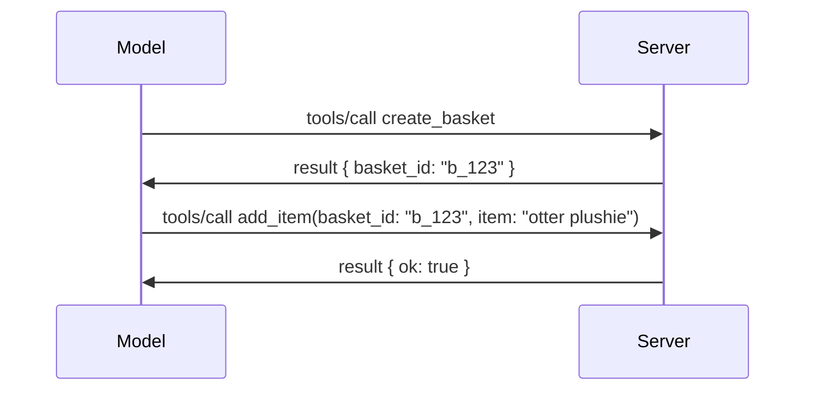

# Wetin Dey Change for MCP: The 2026-07-28 Release Candidate

> **Status:** Release Candidate. The `2026-07-28` specification no be final as of dis time wey dis writing dey. Dem announce am May 21, 2026, and e dey schedule to release July 28, 2026. Everything wey dey dis lesson na about the release candidate; check the [draft specification](https://modelcontextprotocol.io/specification/draft) and e [changelog](https://modelcontextprotocol.io/specification/draft/changelog) make you sabi the latest status before you start to build based on am. The rest of dis curriculum na based on the current stable release, **MCP Specification 2025-11-25**, and e go update once `2026-07-28` don release.

## Overview

`2026-07-28` na di biggest update of MCP since e first launch. Six Specification Enhancement Proposals (SEPs) remove protocol-level sessions and make MCP stateless for the transport layer, extensions don become first-class, versioned mechanism, and some features wey you don learn before for dis curriculum (Roots, Sampling, Logging) don dey mark as deprecated under new lifecycle policy. Dis lesson go summarize wetin dey change, why e important, and wetin e mean for the code wey you don write before based on `2025-11-25`.

Source: [The 2026-07-28 MCP Specification Release Candidate](https://blog.modelcontextprotocol.io/posts/2026-07-28-release-candidate/) (Model Context Protocol Blog, David Soria Parra and Den Delimarsky).

## Learning Objectives

By the time you finish dis lesson, you go fit:

- Explain why MCP dey move go stateless protocol core and di problem wey e solve for horizontally scaled deployments.
- Describe how `initialize`/`initialized` handshake and `Mcp-Session-Id` header dem get replace.
- Identify the new `Mcp-Method` and `Mcp-Name` headers plus di `ttlMs`/`cacheScope` caching metadata.
- Recognize the Extensions framework and the two extensions wey dey come with dis release: MCP Apps and Tasks.
- List di six authorization SEPs wey dey harden OAuth 2.0 / OIDC alignment.
- Identify which core features (Roots, Sampling, Logging) don dey deprecated now, and wetin dat mean for everyday practice.
- Explain di Full JSON Schema 2020-12 change for tool `inputSchema`/`outputSchema`.

## A Stateless Protocol

Di main change: MCP don become stateless for the protocol layer.

### Before (2025-11-25): sessions dey pin you to one server instance

To call tool over Streamable HTTP, e dey start with `initialize` handshake. Di server go respond with `Mcp-Session-Id` header wey every subsequent request suppose carry:

```http
POST /mcp HTTP/1.1
Mcp-Session-Id: 1868a90c-3a3f-4f5b
Content-Type: application/json

{"jsonrpc":"2.0","id":2,"method":"tools/call",
 "params":{"name":"search","arguments":{"q":"otters"}}}
```

Because session dey tied to di particular server instance wey issue am, horizontally scaled deployments need **sticky routing** for load balancer and **shared session store** wey go dey among instances.

### After (2026-07-28): every request na self-contained

```http
POST /mcp HTTP/1.1
MCP-Protocol-Version: 2026-07-28
Mcp-Method: tools/call
Mcp-Name: search
Content-Type: application/json

{"jsonrpc":"2.0","id":1,"method":"tools/call",
 "params":{"name":"search","arguments":{"q":"otters"},
           "_meta":{"io.modelcontextprotocol/clientInfo":{"name":"my-app","version":"1.0"}}}}
```

Any server instance fit handle dis request. Key changes be:

- **Dem comot di `initialize`/`initialized` handshake** ([SEP-2575](https://github.com/modelcontextprotocol/modelcontextprotocol/pull/2575)). Protocol version, client info, and client capabilities don move enter `_meta` for every request. New `server/discover` method dey allow client to fetch server capabilities in advance if e need am.
- **Dem remove `Mcp-Session-Id` header and protocol-level session** ([SEP-2567](https://github.com/modelcontextprotocol/modelcontextprotocol/pull/2567)). Sticky routing and shared session stores no need again for the protocol layer.

### Stateless protocol, stateful applications

To remove protocol-level session no mean say your server no fit get state. Di recommended way na the same way HTTP APIs don always take do am: you go mint explicit handle (e.g., `basket_id`, `browser_id`) from one tool call, then the model go pass dat handle back like normal argument for later calls.



Dis one dey make the state dey visible and make sense to di model instead of to hide am inside transport metadata, and e let any server instance handle any call.

### Server-to-client requests, dem restructure am

Stateless protocol still need way for server to ask client for something during call (like elicitation prompt):

- **Server-initiated requests fit only happen when server dey actively process client request** ([SEP-2260](https://github.com/modelcontextprotocol/modelcontextprotocol/pull/2260)) — before e be just recommendation, now e don become requirement. User no go ever dey prompt from nowhere.
- **Multi Round-Trip Requests** ([SEP-2322](https://github.com/modelcontextprotocol/modelcontextprotocol/pull/2322)) don replace di way wey SSE stream dey hold open. Instead, di server go return `InputRequiredResult`:

  ```json
  {
    "resultType": "inputRequired",
    "inputRequests": {
      "confirm": {
        "type": "elicitation",
        "message": "Delete 3 files?",
        "schema": { "type": "boolean" }
      }
    },
    "requestState": "eyJzdGVwIjoxLCJmaWxlcyI6WyJhIiwiYiIsImMiXX0="
  }
  ```

  Client go collect di answers and re-issue di original call wit `inputResponses` plus echoed `requestState`. Any server instance fit take continue di retry because everything wey dem need dey inside di payload.

### Routable, cacheable, traceable

Three smaller changes dey make stateless traffic easier to manage:

- **`Mcp-Method` and `Mcp-Name` headers dey required on Streamable HTTP** ([SEP-2243](https://github.com/modelcontextprotocol/modelcontextprotocol/pull/2243)), so load balancers, gateways, and rate limiters fit route based on di operation without to check di JSON body. Servers go reject requests wey headers and body no match.
- **`tools/list` and resource read results carry `ttlMs` and `cacheScope`** ([SEP-2549](https://github.com/modelcontextprotocol/modelcontextprotocol/pull/2549)), dem style like HTTP `Cache-Control`. Clients go sabi how long di list results fresh and whether e safe to share among users, without to need long-lived SSE stream to dey learn about changes.
- **W3C Trace Context propagation inside `_meta` don get documentation** ([SEP-414](https://github.com/modelcontextprotocol/modelcontextprotocol/pull/414)), dem fix di names `traceparent`, `tracestate`, and `baggage` make distributed trace fit follow call across client SDK, di MCP server, and downstream systems inside [OpenTelemetry](https://opentelemetry.io/) compatible backend.

## Extensions Don Become First-Class

Extensions bin dey informally inside `2025-11-25`. [SEP-2133](https://github.com/modelcontextprotocol/modelcontextprotocol/pull/2133) don formalize dem:

- Extensions dey identify by reverse-DNS IDs.
- Dem dey negotiate through `extensions` map for client and server capabilities.
- Dem live for their own `ext-*` repositories with maintainers wey dem delegate and dem get version separately from the core specification.
- New Extensions Track inside di SEP process dey give dem path from experimental to official.

Dis release di ship two official extensions.

### MCP Apps: server-rendered user interfaces

[MCP Apps](https://blog.modelcontextprotocol.io/posts/2026-01-26-mcp-apps/) ([SEP-1865](https://github.com/modelcontextprotocol/modelcontextprotocol/pull/1865)) dey allow servers to send interactive HTML interfaces wey host dem fit render for sandoxed iframe. Tools declare their UI templates before time so hosts fit prefetch, cache, and security-review dem before dem run anything. You don already cover basics for dis one for [Lesson 15: MCP Apps](../03-GettingStarted/15-mcp-apps/README.md) — inside the Extensions framework, MCP Apps don become formal extension now instead of experimental core feature.

### Tasks don graduate to extension

Tasks bin be experimental core feature inside `2025-11-25`. When production use start, e show clear redesign wey need make e correct place be extension: di [Tasks extension](https://github.com/modelcontextprotocol/modelcontextprotocol/pull/2663) reshape di lifecycle around di stateless model — server fit answer `tools/call` with task handle, and client go drive am forward with `tasks/get`, `tasks/update`, and `tasks/cancel`. Task creation na server direct: client go advertise di extension, and server go decide when call go run as task. `tasks/list` don comot fully because e no fit dey scoped safely without sessions.

> **Migration note:** if you implement experimental `2025-11-25` Tasks API, you go need migrate to the new extension lifecycle — e no go compatible with the old one.

## Authorization Hardening

Six SEPs dey harden di [authorization specification](https://modelcontextprotocol.io/specification/draft/basic/authorization) to make dem align better with real-world OAuth 2.0 / OpenID Connect deployments:

| SEP | Change |
|---|---|
| [SEP-2468](https://github.com/modelcontextprotocol/modelcontextprotocol/pull/2468) | Clients must validate `iss` parameter on authorization response per [RFC 9207](https://www.rfc-editor.org/rfc/rfc9207), wey go help reduce mix-up attacks wey dey common for MCP one-client, many-server pattern. Future version go require make them reject responses wey no get `iss`. |
| [SEP-837](https://github.com/modelcontextprotocol/modelcontextprotocol/pull/837) | Clients must declare their OpenID Connect `application_type` during Dynamic Client Registration, so authorization servers no go by default treat desktop/CLI client as `"web"` and reject e localhost redirect URI. |
| [SEP-2352](https://github.com/modelcontextprotocol/modelcontextprotocol/pull/2352) | Clients go bind registered credentials to di issuing authorization server's `issuer` and re-register when resource move between authorization servers. |
| [SEP-2207](https://github.com/modelcontextprotocol/modelcontextprotocol/pull/2207) | Document how to request refresh tokens from OpenID Connect-style authorization servers. |
| [SEP-2350](https://github.com/modelcontextprotocol/modelcontextprotocol/pull/2350) | Clarify scope accumulation during step-up authorization. |
| [SEP-2351](https://github.com/modelcontextprotocol/modelcontextprotocol/pull/2351) | Clarify di `.well-known` discovery suffix. |

If you dey build authorization server for MCP today, start to supply `iss` for authorization responses now — check [02-Security](../02-Security/README.md) for current authorization guidance wey dis one go build on.

## Roots, Sampling, and Logging Don Dey Deprecated

Under new [feature lifecycle policy](https://github.com/modelcontextprotocol/modelcontextprotocol/pull/2577) ([SEP-2577](https://github.com/modelcontextprotocol/modelcontextprotocol/pull/2577)), three core client primitives wey you learn for [Core Concepts](./README.md#roots) don move go **Deprecated** status:

| Feature | Recommended replacement |
|---|---|
| Roots | Tool parameters, resource URIs, or server configuration |
| Sampling | Direct integration with LLM provider APIs |
| Logging | `stderr` for stdio transports; OpenTelemetry for structured observability |

Dem be **annotation-only deprecations**: di methods, types, and capability flags go still work for dis release and for every specification version wey dem publish within year after am. To remove any of dem completely go require separate SEP under lifecycle policy — so nothing go break for your existing [Sampling](../03-GettingStarted/14-sampling/README.md) samples today, but new servers suppose prefer di replacement patterns wey I list above.

## Full JSON Schema 2020-12 for Tools

Tool `inputSchema` and `outputSchema` don upgrade to full [JSON Schema 2020-12](https://json-schema.org/draft/2020-12) ([SEP-2106](https://github.com/modelcontextprotocol/modelcontextprotocol/pull/2106)):

- Input schemas still hold di `type: "object"` root constraint but now dem allow composition (`oneOf`, `anyOf`, `allOf`), conditionals, and references (`$ref`, `$defs`).
- Output schemas no get restrictions anymore, and `structuredContent` fit now be any JSON value instead of only object.
- Implementations no suppose auto-dereference external `$ref` URIs and dem suppose limit schema depth and validation time (dis na denial-of-service consideration if you dey validate schemas server-side).

Separately, error code for missing resource don change from MCP-custom `-32002` to JSON-RPC standard `-32602` (Invalid Params) ([SEP-2164](https://github.com/modelcontextprotocol/modelcontextprotocol/pull/2164)). If your client dey match on literal `-32002` value, you go need update am.

## How the Protocol Go Evolve From Here

Dis release get breaking changes, but MCP maintainers no dey plan for am to become normal from now on. Three governance SEPs dey try stop repeat:

- Di **feature lifecycle policy** dey give every feature path from Active → Deprecated → Removed with at least twelve months between deprecation and earliest possible removal.
- Di **Extensions framework** go let new capabilities ship as opt-in extensions and dem go stabilize there before dem (if dem ever do am) move into core specification.
- A Standards Track SEP no fit reach Final status again until scenario wey match land for the [conformance suite](https://github.com/modelcontextprotocol/conformance) ([SEP-2484](https://github.com/modelcontextprotocol/modelcontextprotocol/pull/2484)) — na the same suite wey the [SDK tier system](https://github.com/modelcontextprotocol/modelcontextprotocol/pull/1777) dey score official SDKs against.

## Release Timeline and Validation

- The release candidate lock on May 21, 2026.
- The final specification dey schedule for July 28, 2026.
- The ten-week window between the two dey give chance make SDK maintainers and client implementers validate the changes against real workloads; Tier 1 SDKs suppose ship support for this window under the [SDK tier system](https://modelcontextprotocol.io/docs/sdk).
- Track the full set of changes for the [draft specification](https://modelcontextprotocol.io/specification/draft) plus the [changelog](https://modelcontextprotocol.io/specification/draft/changelog).

## Wetin Dis Mean for Dis Curriculum

Everything wey you don learn so far for this course na for **2025-11-25**, wey still be the current stable specification until `2026-07-28` ship. Specifically:

- **Sessions and the `initialize` handshake** (wey dem cover inside [Core Concepts](./README.md) and [Lesson 6: HTTP Streaming](../03-GettingStarted/06-http-streaming/README.md)) still dey work as dem document am today, but expect say dem go change am to the stateless request model wey dey above once you upgrade to `2026-07-28`-compatible SDKs.
- **Sampling and Roots** (dem cover am too for [Core Concepts](./README.md)) still dey fully functional but dem dey deprecated — new designs suppose prefer the replacement patterns wey dem list for above.
- **The experimental Tasks feature**, if you don use am before, you go need move am go the new lifecycle for the Tasks extension.
- **MCP Apps** ([Lesson 15](../03-GettingStarted/15-mcp-apps/README.md)) no get wahala with am; e just move go under the formal Extensions framework.

## Additional Resources

- [The 2026-07-28 MCP Specification Release Candidate (blog post)](https://blog.modelcontextprotocol.io/posts/2026-07-28-release-candidate/)
- [The Future of MCP Transports](https://blog.modelcontextprotocol.io/posts/2025-12-19-mcp-transport-future/)
- [MCP Draft Specification](https://modelcontextprotocol.io/specification/draft)
- [MCP Draft Changelog](https://modelcontextprotocol.io/specification/draft/changelog)
- [SEP Guidelines](https://modelcontextprotocol.io/community/sep-guidelines)
- [MCP SDK Tier System](https://modelcontextprotocol.io/docs/sdk)

## Next Steps

Comot go [Core Concepts](./README.md) or continue go [Security](../02-Security/README.md) make you see how today's `2025-11-25` guidance dey connect with wetin dey come.

---

<!-- CO-OP TRANSLATOR DISCLAIMER START -->
**Disclaimer**:
Dis document don translate wit AI translation service [Co-op Translator](https://github.com/Azure/co-op-translator). Even tho we dey try make am correct, abeg make you know say automated translation fit get errors or mistakes. Di original document for dia own language na im be di correct source. For important info, make person wey sabi human translation do am. We no go responsible for any misunderstanding or wrong understanding wey fit happen because of dis translation.
<!-- CO-OP TRANSLATOR DISCLAIMER END -->