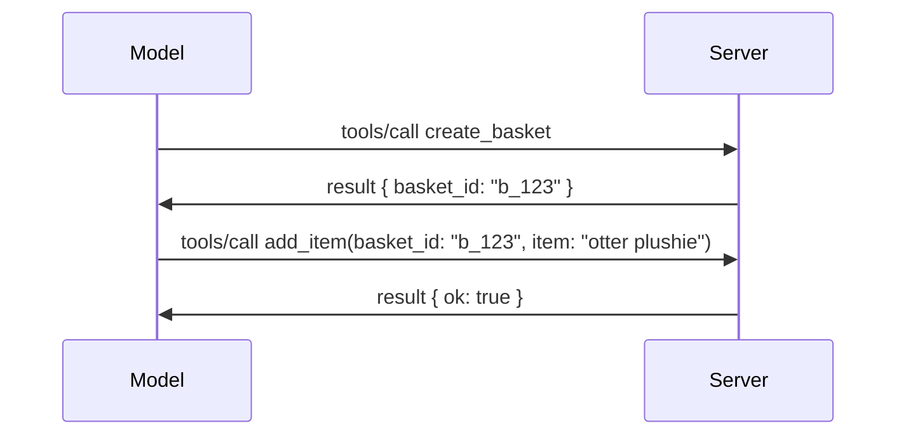

# Wetin Don Change for MCP: Di 2026-07-28 Specification

> **Status:** Final. MCP Specification `2026-07-28` commot for July 28, 2026
> and na di current protocol revision. Dis lesson dey describe di final
> specification. Some curriculum examples still get explicit version
> `2025-11-25` because dia SDKs never adopt di new stateless API yet;
> treat those examples as legacy compatibility guidance.

## Overview

`2026-07-28` na di biggest revision wey MCP don get since e start. Six
Specification Enhancement Proposals (SEPs) comot protocol-level sessions and
make MCP stateless for di transport layer, extensions come be first-class,
versioned mechanism, and some features wey dem talk about for dis curriculum before
(Roots, Sampling, Logging) don become deprecated under new lifecycle policy. Dis
lesson summarize wetin change, why e matter, and wetin e mean for code
wey dem write for `2025-11-25`.

Source: [The 2026-07-28 MCP Specification Release Candidate](https://blog.modelcontextprotocol.io/posts/2026-07-28-release-candidate/) (Model Context Protocol Blog, David Soria Parra and Den Delimarsky).

## Learning Objectives

By di time you finish dis lesson, you go fit:

- Explain why MCP dey move to stateless protocol core and wetin e solve for horizontally scaled deployments.
- Describe how dem take replace di `initialize`/`initialized` handshake and `Mcp-Session-Id` header.
- Identify di new `Mcp-Method` and `Mcp-Name` headers and di `ttlMs`/`cacheScope` caching metadata.
- Recognize di Extensions framework and di two extensions wey dis release carry: MCP Apps and Tasks.
- Summarize di authorization hardening and Dynamic Client Registration
  deprecation.
- Identify which core features (Roots, Sampling, Logging) don become deprecated, and wetin dat mean for practice.
- Explain di Full JSON Schema 2020-12 change for tool `inputSchema`/`outputSchema`.

## Stateless Protocol

Di main change: MCP don become stateless for protocol layer.

### Before (2025-11-25): sessions dey pin you to one server instance

To call tool over Streamable HTTP, e go start with `initialize` handshake. Di server will respond with `Mcp-Session-Id` header wey every next request must carry:

```http
POST /mcp HTTP/1.1
Mcp-Session-Id: 1868a90c-3a3f-4f5b
Content-Type: application/json

{"jsonrpc":"2.0","id":2,"method":"tools/call",
 "params":{"name":"search","arguments":{"q":"otters"}}}
```

Because di session tie to which server instance wey issue am, horizontally scaled deployments need **sticky routing** for load balancer and **shared session store** across instances.

### After (2026-07-28): every request dey carry everything

```http
POST /mcp HTTP/1.1
MCP-Protocol-Version: 2026-07-28
Mcp-Method: tools/call
Mcp-Name: search
Content-Type: application/json

{"jsonrpc":"2.0","id":1,"method":"tools/call",
 "params":{"name":"search","arguments":{"q":"otters"},
           "_meta":{"io.modelcontextprotocol/protocolVersion":"2026-07-28",
                    "io.modelcontextprotocol/clientInfo":{"name":"my-app","version":"1.0"},
                    "io.modelcontextprotocol/clientCapabilities":{}}}}
```

Any server instance fit handle dis request. Key changes:

- **Di `initialize`/`initialized` handshake don comot** ([SEP-2575](https://github.com/modelcontextprotocol/modelcontextprotocol/pull/2575)). Protocol version, client info, and client capabilities dey move into `_meta` for every request. New `server/discover` method let client fit fetch server capabilities upfront when e need dem.
- **Di `Mcp-Session-Id` header and protocol-level session don comot** ([SEP-2567](https://github.com/modelcontextprotocol/modelcontextprotocol/pull/2567)). Sticky routing and shared session stores no dey needed for protocol layer again.

### Stateless protocol, stateful applications

Comot protocol-level session no mean say your server no fit be stateful. Di recommended pattern still be di one wey HTTP APIs don always use before: mint explicit handle (like `basket_id`, `browser_id`) from one tool call, make di model pass am back as normal argument for later calls.



Dis one dey make state dey visible and reasonable to di model instead of to hide am inside transport metadata, and e make any server instance fit handle any call.

### Server-to-client requests, rearranged

Stateless protocol still need way for server to ask client for something for middle of call (like elicitation prompt):

- **Server-initiated requests fit only happen while server dey actively process client request** ([SEP-2260](https://github.com/modelcontextprotocol/modelcontextprotocol/pull/2260)) — before e been just recommendation, now e be requirement. User no go just randomly dey prompted.
- **Multi Round-Trip Requests** ([SEP-2322](https://github.com/modelcontextprotocol/modelcontextprotocol/pull/2322)) don replace hold open SSE stream. Server go return `InputRequiredResult` instead:

  ```json
  {
    "resultType": "input_required",
    "inputRequests": {
      "confirm": {
        "type": "elicitation",
        "message": "Delete 3 files?",
        "schema": { "type": "boolean" }
      }
    },
    "requestState": "eyJzdGVwIjoxLCJmaWxlcyI6WyJhIiwiYiIsImMiXX0="
  }
  ```

  Client go gather answers then re-issue original call with `inputResponses` plus echoed `requestState`. Any server instance fit pick di retry because everything wey e need dey inside di payload.

### Routable, cacheable, traceable

Three small changes make stateless traffic easier to manage:

- **`Mcp-Method` and `Mcp-Name` headers dey required on Streamable HTTP** ([SEP-2243](https://github.com/modelcontextprotocol/modelcontextprotocol/pull/2243)), so load balancers, gateways, and rate limiters fit route based on operation without checking inside JSON body. Servers go reject requests where headers and body no agree.
- **`tools/list` and resource read results carry `ttlMs` and `cacheScope`** ([SEP-2549](https://github.com/modelcontextprotocol/modelcontextprotocol/pull/2549)), based on HTTP `Cache-Control`. Clients know how long list result fresh remain, and whether e safe to share with other users, without needing long-lived SSE stream to sabi changes.
- **W3C Trace Context propagation for `_meta` don dey documented** ([SEP-414](https://github.com/modelcontextprotocol/modelcontextprotocol/pull/414)), fix key names for `traceparent`, `tracestate`, and `baggage` so distributed trace fit follow call across client SDK, MCP server, and downstream systems for [OpenTelemetry](https://opentelemetry.io/)-compatible backend.

## Extensions Don Become First-Class

Extensions dey for `2025-11-25` but dem no dey formal. [SEP-2133](https://github.com/modelcontextprotocol/modelcontextprotocol/pull/2133) formalize dem:

- Extensions dem dey identify by reverse-DNS IDs.
- Dem dey negotiate through `extensions` map for client and server capabilities.
- Dem dey live for diir own `ext-*` repositories wey get delegated maintainers and dem version independent from core specification.
- New Extensions Track for SEP process dey give dem way from experimental to official.

Dis release carry two official extensions.

### MCP Apps: server-rendered user interfaces

[MCP Apps](https://blog.modelcontextprotocol.io/posts/2026-01-26-mcp-apps/) ([SEP-1865](https://github.com/modelcontextprotocol/modelcontextprotocol/pull/1865)) make servers fit ship interactive HTML interfaces wey hosts go render for sandboxed iframe. Tools go declare dia UI templates before time so hosts fit prefetch, cache, and security-review am before anything run. You don already learn groundlayer for dis for [Lesson 15: MCP Apps](../03-GettingStarted/15-mcp-apps/README.md) — under Extensions framework, MCP Apps don become formal extension instead experimental core feature.

### Tasks don graduate to extension

Tasks begin as experimental core feature for `2025-11-25`. Production use show say dem need redesign, and correct place na extension: [Tasks extension](https://github.com/modelcontextprotocol/modelcontextprotocol/pull/2663) reshape lifecycle around stateless model — server fit answer `tools/call` with task handle, client go dey drive am with `tasks/get`, `tasks/update`, and `tasks/cancel`. Task creation na server dey direct: client go advertise extension, server go decide when call go run as task. `tasks/list` don comot entirely because e no fit scope safely without sessions.

> **Migration note:** if you implement the experimental `2025-11-25` Tasks API, you need change go new extension lifecycle — e no backward compatible.

## Authorization Hardening

Some SEPs dey harden
[authorization specification](https://modelcontextprotocol.io/specification/2026-07-28/basic/authorization)
to fit better with real-world OAuth 2.0 / OpenID Connect deployments:

| SEP | Change |
|---|---|
| [SEP-2468](https://github.com/modelcontextprotocol/modelcontextprotocol/pull/2468) | Clients must validate di `iss` parameter for authorization responses like [RFC 9207](https://www.rfc-editor.org/rfc/rfc9207) talk, to stop mix-up attacks wey dey common for MCP's single-client, many-server pattern. Future version go require to reject responses wey no get `iss`. |
| [SEP-837](https://github.com/modelcontextprotocol/modelcontextprotocol/pull/837) | Compatibility-only Dynamic Client Registration clients dey declare OpenID Connect `application_type`, so e no go default `"web"` wrong for desktop and CLI clients. |
| [SEP-2352](https://github.com/modelcontextprotocol/modelcontextprotocol/pull/2352) | Compatibility-only registered credentials dey tied to issuing authorization server's `issuer`; clients go re-register if resource migrate. |
| [SEP-2207](https://github.com/modelcontextprotocol/modelcontextprotocol/pull/2207) | Documents how to request refresh tokens from OpenID Connect-type authorization servers. |
| [SEP-2350](https://github.com/modelcontextprotocol/modelcontextprotocol/pull/2350) | Clarifies how scope dey accumulate during step-up authorization. |
| [SEP-2351](https://github.com/modelcontextprotocol/modelcontextprotocol/pull/2351) | Clarifies `.well-known` discovery suffix. |

If you dey build authorization server for MCP, make sure say you supply `iss` on
authorization response and follow final authorization specification. Check
[02-Security](../02-Security/README.md) for how to implement am.

Dynamic Client Registration still dey available for compatibility but e don
become deprecated for `2026-07-28`. New implementation suppose use Client ID Metadata
Documents.

## Deprecated Features

Under new
[feature lifecycle policy](https://github.com/modelcontextprotocol/modelcontextprotocol/pull/2577),
Roots, Sampling, Logging, and Dynamic Client Registration don become **Deprecated**:

| Feature | Recommended replacement |
|---|---|
| Roots | Tool parameters, resource URIs, or server configuration |
| Sampling | Direct integration with LLM provider APIs |
| Logging | `stderr` for stdio transports; OpenTelemetry for structured observability |
| Dynamic Client Registration | Client ID Metadata Documents |

These features still dey for `2026-07-28` for compatibility. Dem fit get
removed for di first specification revision wey release on or after July 28, 2027;
but actual removal fit happen later. New implementation make dem use di replacement
patterns wey we talk for above.

## Full JSON Schema 2020-12 for Tools

Tool `inputSchema` and `outputSchema` don upgrade to full [JSON Schema 2020-12](https://json-schema.org/draft/2020-12) ([SEP-2106](https://github.com/modelcontextprotocol/modelcontextprotocol/pull/2106)):

- Input schemas still get `type: "object"` root constraint but now dem allow composition (`oneOf`, `anyOf`, `allOf`), conditionals, and references (`$ref`, `$defs`).
- Output schemas no get restriction again, and `structuredContent` fit be any JSON value instead of only object.
- Implementations no suppose auto-dereference external `$ref` URIs and dem suppose limit schema depth and validation time (na denial-of-service thing wey person suppose consider if you validate schemas server-side).

Separately, error code for missing resource don change from MCP-custom `-32002` to JSON-RPC standard `-32602` (Invalid Params) ([SEP-2164](https://github.com/modelcontextprotocol/modelcontextprotocol/pull/2164)). If your client dey look for literal `-32002`, you go need update am.

## How Protocol Go Take Evolve From Here

Dis release get breaking changes, but MCP maintainers no dey plan say na normal thing e go be going forward. Three governance SEPs dey try stop am from happening again:

- **feature lifecycle policy** dey give every feature Active → Deprecated → Removed path, with at least twelve months between deprecation and earliest possible removal.
- **Extensions framework** make new capabilities fit ship as opt-in extensions and dem go stabilize there before (if dem ever go) enter core specification.
- Standards Track SEP no fit reach Final status until matching scenario show for [conformance suite](https://github.com/modelcontextprotocol/conformance) ([SEP-2484](https://github.com/modelcontextprotocol/modelcontextprotocol/pull/2484)) — same suite wey [SDK tier system](https://github.com/modelcontextprotocol/modelcontextprotocol/pull/1777) use score official SDKs.

## Release Timeline and Validation

- Release candidate lock on May 21, 2026.
- Final specification release on July 28, 2026.

- SDK support fit no reach the specification quick-quick. Check the
  [SDK documentation](https://modelcontextprotocol.io/docs/sdk) and the SDK's
  release notes before you change example.
- Track the final changes for the
  [2026-07-28 specification](https://modelcontextprotocol.io/specification/2026-07-28/)
  and the
  [changelog](https://modelcontextprotocol.io/specification/2026-07-28/changelog).

## Wetin Dis Mean for Dis Curriculum

The curriculum dey move from `2025-11-25` examples go the current
`2026-07-28` specification. E mean say:

- **Sessions and the `initialize` handshake** wey dey examples wey target
  `2025-11-25` na old way. The `2026-07-28` protocol don replace dem
  wit the stateless request model wey dey up.
- **Sampling and Roots** still dey but na for compatibility, dem don stop to use am.
  New design suppose use the new patterns wey we list for top.
- **The experimental Tasks feature**, if you don use am before, you go need change am go the new Tasks extension lifecycle.
- **MCP Apps** ([Lesson 15](../03-GettingStarted/15-mcp-apps/README.md)) no get wahala; e just dey under the new Extensions framework now.

## Additional Resources

- [MCP Specification 2026-07-28](https://modelcontextprotocol.io/specification/2026-07-28/)
- [2026-07-28 Changelog](https://modelcontextprotocol.io/specification/2026-07-28/changelog)
- [The 2026-07-28 MCP Specification Release Candidate (historical blog post)](https://blog.modelcontextprotocol.io/posts/2026-07-28-release-candidate/)
- [The Future of MCP Transports](https://blog.modelcontextprotocol.io/posts/2025-12-19-mcp-transport-future/)
- [SEP Guidelines](https://modelcontextprotocol.io/community/sep-guidelines)
- [MCP SDK Tier System](https://modelcontextprotocol.io/docs/sdk)

## Next Steps

Go back to [Core Concepts](./README.md) or continue to
[Security](../02-Security/README.md) to use the current `2026-07-28` advice.

---

<!-- CO-OP TRANSLATOR DISCLAIMER START -->
**Disclaimer**:
Dis document don translate wit AI translation service [Co-op Translator](https://github.com/Azure/co-op-translator). Even tho we dey try make am correct, abeg make you know say automated translation fit get errors or mistakes. Di original document for dia own language na im be di correct source. For important info, make person wey sabi human translation do am. We no go responsible for any misunderstanding or wrong understanding wey fit happen because of dis translation.
<!-- CO-OP TRANSLATOR DISCLAIMER END -->