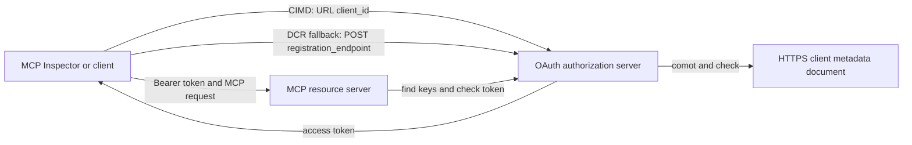

# CIMD and DCR Authorization Sample

Dis TypeScript sample dey compare two ways wey OAuth client fit get identity
before e fit access protected MCP server:

- **Client ID Metadata Documents (CIMD)** dey use one beta HTTPS URL as di
  `client_id`. Na dis one be di best way for clients and authorization
  servers wey no get any kain relationship before.
- **Dynamic Client Registration (DCR)** dey ask di authorization server make e create
  one opaque client ID when e dey run. MCP `2026-07-28` still get DCR for backward
  compatibility.

Di sample dey use di beta MCP TypeScript SDK v2 and di stateless
MCP `2026-07-28` request model. E go work with external OAuth 2.1/OpenID
Connect authorization server like Auth0. Di MCP server na resource
server: e dey check access tokens but e no dey authenticate users or give
tokens.

## Learning Objectives

If you finish dis sample, you go fit:

- Talk why CIMD better pass DCR for new MCP clients.
- Publish correct CIMD document for public native client.
- Configure MCP resource server for OAuth discovery and JWT check.
- Use CIMD and DCR with di same MCP server and authorization server.
- Enforce OAuth scope inside MCP tool.
- Know which work belong to di client, resource server, and
  authorization server.

## Architecture



Di authorization server dey choose and check registration method.
Di MCP server go only see di verified `client_id` claim. HTTPS URL
wey get path na wetin show CIMD. Opaque ID no reach to prove DCR because na
pre-registered client fit also use opaque ID; di optional
`DCR_CLIENT_ID_PREFIX` setting dey give provider-specific demo hint.

## Registration Priority

MCP clients wey fit support all di methods suppose use dis order:

1. Use pre-registered client info if e don dey already.
2. Use CIMD if di authorization server dey talk
   `client_id_metadata_document_supported: true`.
3. Use DCR only if server talk say e get
   `registration_endpoint`.
4. Ask user for pre-registered client info if nothing
   dey.

## Project Layout

```text
src/
  config.ts          Environment validation
  dcr.ts             DCR compatibility request
  mcp.ts             MCP tools and scope checks
  oauth.ts           Authorization metadata and JWT verification
  register-dcr.ts    DCR command-line helper
  registration.ts    CIMD document and mechanism classification
  server.ts          Express, OAuth discovery, and MCP endpoint
test/
  dcr.test.ts
  oauth.test.ts
  registration.test.ts
  server.test.ts
```

## Prerequisites

- Node.js 20.6 or newer. Scripts dey use `--env-file` and `--import`.
- OAuth 2.1/OpenID Connect authorization server wey fit do:
  - Authorization code flow with S256 PKCE.
  - OAuth Protected Resource Metadata and Resource Indicators.
  - JWT access tokens and JWKS endpoint.
  - CIMD, plus DCR if you want compare old fallback.
- MCP Inspector or another MCP `2026-07-28` client.
- Public HTTPS URL for CIMD document. Development tunnel go work for lab,
  but make sure say domain steady for production.

## Install and Test

```bash
npm install
npm run build
npm test
```

Di twelve tests dey use local keys and mock HTTP endpoints. Dem no need
authorization server account. Dem go check:

- CIMD document shape and URL rules.
- Honest classification of URL and opaque client IDs.
- DCR request and response handling.
- Reject insecure non-loopback DCR endpoints.
- JWT signature, issuer, audience, expiry, client ID, and scope check.
- MCP `2026-07-28` call to `registration-info` inside process.

## Configure the Authorization Server

Di exact control names fit change by provider. Configure these:

1. Create API or resource server wey identifier match your MCP
   URL, like `/mcp`, e.g. `http://127.0.0.1:3001/mcp`.
2. Use RS256 access tokens and put `client_id` or `azp` claim.
3. Add `tool:greet` permission or scope.
4. Enable authorization code flow with S256 PKCE for public native clients.
5. Enable Client ID Metadata Documents.
6. For comparison, enable Dynamic Client Registration.
7. Make sure authorization server metadata show:
   - `issuer`
   - `authorization_endpoint`
   - `token_endpoint`
   - `jwks_uri`
   - `client_id_metadata_document_supported: true`
   - `registration_endpoint` if DCR dey enabled

### Auth0 Example

For Auth0, enable Client ID Metadata Document Registration, OIDC Dynamic
Application Registration, plus Resource Parameter compatibility. Create API
wey identifier na exact MCP URL and add `tool:greet` permission.
Allow test user and third-party clients make dem request that permission.

Provider dashboards and feature fit change time to time. Check
provider documents before you use these settings outside this lab.

## Configure the Sample

Create `.env` from di example:

```powershell
Copy-Item .env.example .env
```

For bash-compatible shells:

```bash
cp .env.example .env
```

Set dis values:

```dotenv
MCP_SERVER_URL=http://127.0.0.1:3001/mcp
AUTHORIZATION_SERVER_ISSUER=https://your-tenant.example.com/
AUTHORIZATION_SERVER_METADATA_URL=https://your-tenant.example.com/.well-known/openid-configuration
CLIENT_METADATA_URL=https://your-public-host.example.com/client-metadata.json
OAUTH_REDIRECT_URIS=http://127.0.0.1:6274/oauth/callback
DCR_CLIENT_ID_PREFIX=tpc_
```

Important tori:

- `AUTHORIZATION_SERVER_ISSUER` must match `issuer` for discovered
  authorization server metadata, including trailing slash if e dey.
- `MCP_SERVER_URL` must match access token audience.
- `CLIENT_METADATA_URL` must use HTTPS, get non-root path, and be
  public URL wey serve di metadata route. No allow query strings or fragments,
  so route and `client_id` go remain same.
- `OAUTH_REDIRECT_URIS` na comma-separated allowlist. Default na MCP
  Inspector loopback callback.
- `DCR_CLIENT_ID_PREFIX` na optional and provider-specific. Leave am empty if
  your provider no get correct DCR prefix.

## Publish the CIMD Document

Start tunnel wey go forward public HTTPS origin to `127.0.0.1:3001`.
Set `CLIENT_METADATA_URL` to that origin + `/client-metadata.json`, then run:

```bash
npm run build
npm start
```

Check both discovery documents:

```bash
curl http://127.0.0.1:3001/health
curl http://127.0.0.1:3001/client-metadata.json
curl http://127.0.0.1:3001/.well-known/oauth-protected-resource/mcp
```

Di `client_id` wey public HTTPS metadata URL return must match byte-for-byte
the URL. Di authorization server must check the document and
redirect URI before e fit give token.

> [!NOTE]
> Di sample dey host client document and MCP resource server inside one process
> to keep di lab small. For production, di MCP client go own and host im CIMD
> document separate from resource server.

## Compare CIMD and DCR

Start MCP Inspector:

```bash
npx @modelcontextprotocol/inspector
```

Use Streamable HTTP and connect to `http://127.0.0.1:3001/mcp`.

### CIMD (Preferred)


1. Put di public `CLIENT_METADATA_URL` as di OAuth Client ID.
2. Request `tool:greet` plus any identity scopes wey your provider need.
3. Finish sign-in and consent.
4. Call `registration-info`. E go report `mechanism: "cimd"`.
5. Call `greet` to check scope enforcement.

### DCR (Compatibility Fallback)

1. Clear Inspector saved OAuth state.
2. Leave OAuth Client ID empty so Inspector fit use the advertised
   `registration_endpoint`.
3. Finish sign-in and consent.
4. Call `registration-info`.
5. If `DCR_CLIENT_ID_PREFIX` match the provider generated IDs, the tool
   go report `mechanism: "dcr"`; if no e go report
   `opaque-client-id`.

You fit show the registration request directly too:

```bash
npm run build
npm run register:dcr
```

The helper go print di client ID wey e return but e no go print client secret.
Treat any secret wey e return as sensitive and store am for proper secret store.

## Tools

| Tool | Required scope | Purpose |
| --- | --- | --- |
| `registration-info` | Verified client | Report di client ID type |
| `greet` | `tool:greet` | Show per-tool authorization |

## Security Notes

- Validate JWT signatures through di authorization server JWKS endpoint.
- Require exact issuer and audience matches.
- Require expiration and client ID claims.
- No ever accept token wey dem issue for different resource.
- No ever pass di MCP token to downstream API.
- Keep DCR credentials tight to di issuer wey create dem.
- Validate CIMD redirect URIs with exact matching.
- Apply SSRF controls when authorization server dey fetch CIMD URLs.
- Use HTTPS for authorization and metadata endpoints outside loopback
  development.
- No try infer DCR from opaque client ID unless provider talk say
  e get reliable identifier convention.

## References

- [MCP authorization specification](https://modelcontextprotocol.io/specification/2026-07-28/basic/authorization)
- [MCP client registration](https://modelcontextprotocol.io/specification/2026-07-28/basic/authorization/client-registration)
- [MCP security best practices](https://modelcontextprotocol.io/specification/2026-07-28/basic/security_best_practices)
- [MCP TypeScript SDK v2 authorization guide](https://ts.sdk.modelcontextprotocol.io/v2/serving/authorization)
- [OAuth Dynamic Client Registration (RFC 7591)](https://datatracker.ietf.org/doc/html/rfc7591)
- [OAuth Client ID Metadata Document draft](https://datatracker.ietf.org/doc/html/draft-ietf-oauth-client-id-metadata-document-00)

## Acknowledgement

Di side-by-side teaching approach na from
[Sambego/auth0-xmcp-cimd](https://github.com/Sambego/auth0-xmcp-cimd). This
sample na original, provider-neutral implementation wey dem build with official
MCP TypeScript SDK v2 for dis curriculum.

---

<!-- CO-OP TRANSLATOR DISCLAIMER START -->
**Disclaimer**:
Dis document don translate wit AI translation service [Co-op Translator](https://github.com/Azure/co-op-translator). Even tho we dey try make am correct, abeg make you know say automated translation fit get errors or mistakes. Di original document for dia own language na im be di correct source. For important info, make person wey sabi human translation do am. We no go responsible for any misunderstanding or wrong understanding wey fit happen because of dis translation.
<!-- CO-OP TRANSLATOR DISCLAIMER END -->