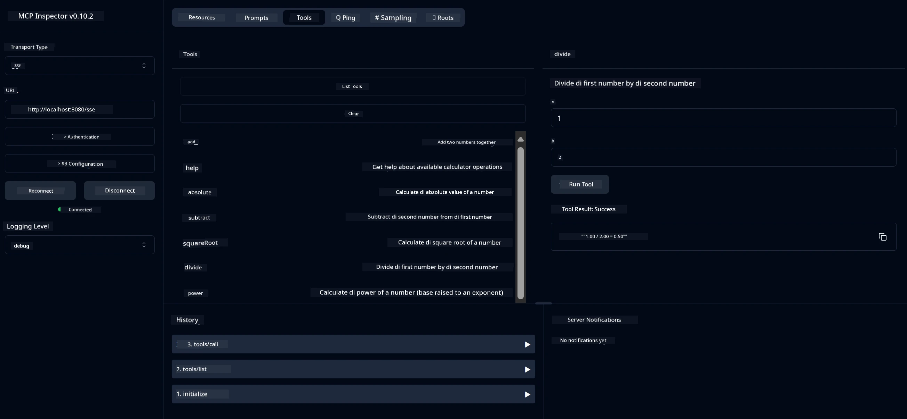

# Basic Calculator MCP Service

> [!NOTE]
> Dis Java solution dey use di old HTTP+SSE transport and e dey target SDK
> wey go fit work wit MCP `2025-11-25`. E still dey for match course code;
> new remote servers suppose use `2026-07-28` Streamable HTTP support.

Dis service dey provide basic calculator operations through di Model Context Protocol (MCP) wit Spring Boot plus WebFlux transport. E design as simple example for beginners wey dey learn about MCP implementations.

For more info, check di [MCP Server Boot Starter](https://docs.spring.io/spring-ai/reference/api/mcp/mcp-server-boot-starter-docs.html) reference documentation.


## How To Use Di Service

Di service dey show di following API endpoints through di MCP protocol:

- `add(a, b)`: Add two number dem together
- `subtract(a, b)`: Take di second number comot for di first one
- `multiply(a, b)`: Multiply two numbers
- `divide(a, b)`: Divide di first number by di second one (check if na zero)
- `power(base, exponent)`: Calculate power of one number
- `squareRoot(number)`: Find di square root (check if number no be negative)
- `modulus(a, b)`: Find di remainder when you divide
- `absolute(number)`: Calculate di absolute value

## Dependencies

Di project need these main dependencies:

```xml
<dependency>
    <groupId>org.springframework.ai</groupId>
    <artifactId>spring-ai-starter-mcp-server-webflux</artifactId>
</dependency>
```

## How To Build Di Project

Build di project using Maven:
```bash
./mvnw clean install -DskipTests
```

## How To Run Di Server

### Using Java

```bash
java -jar target/calculator-server-0.0.1-SNAPSHOT.jar
```

### Using MCP Inspector

MCP Inspector na beta tool for to interact with MCP services. To use am with dis calculator service:

1. **Install and run MCP Inspector** for new terminal window:
   ```bash
   npx @modelcontextprotocol/inspector
   ```

2. **Open di web UI** by clicking di URL wey di app show you (usually http://localhost:6274)

3. **Configure di connection**:
   - Set di transport type to "SSE"
   - Put di URL for your running server SSE endpoint: `http://localhost:8080/sse`
   - Click "Connect"

4. **Use di tools**:
   - Click "List Tools" to see calculator operations wey dey
   - Select one tool then click "Run Tool" to run di operation



---

<!-- CO-OP TRANSLATOR DISCLAIMER START -->
**Disclaimer**:
Dis document don translate wit AI translation service [Co-op Translator](https://github.com/Azure/co-op-translator). Even tho we dey try make am correct, abeg make you know say automated translation fit get errors or mistakes. Di original document for dia own language na im be di correct source. For important info, make person wey sabi human translation do am. We no go responsible for any misunderstanding or wrong understanding wey fit happen because of dis translation.
<!-- CO-OP TRANSLATOR DISCLAIMER END -->