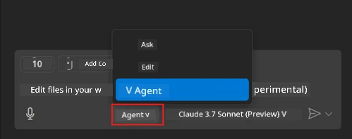
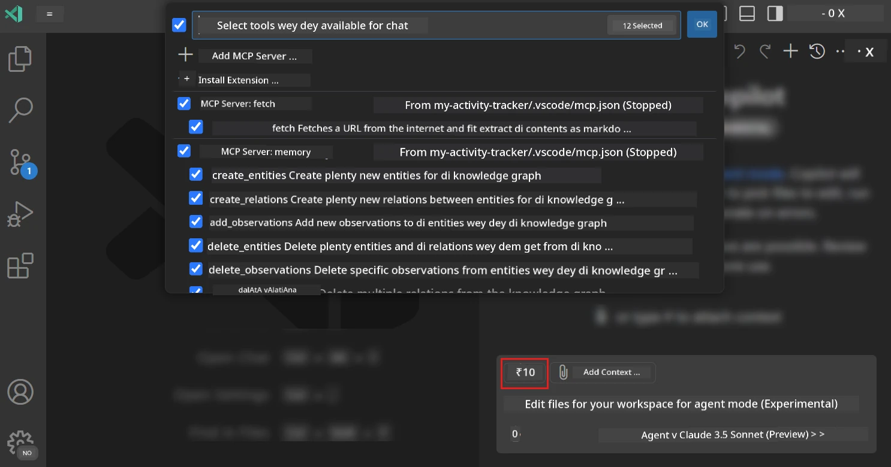
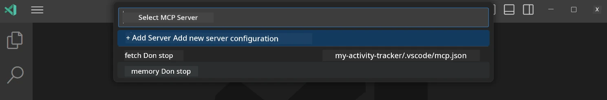
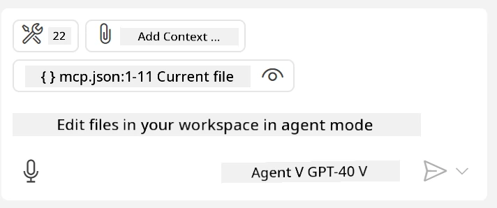
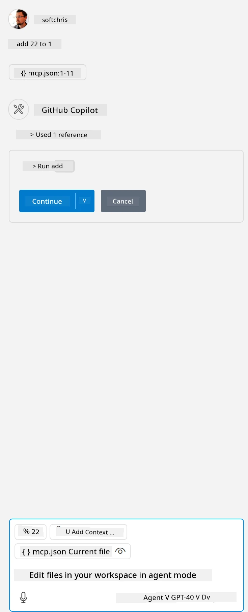

# How to use server from GitHub Copilot Agent mode

Visual Studio Code and GitHub Copilot fit act like client to take MCP Server. Why you go want do am you fit ask? E mean say any beta feature wey MCP Server get, you fit use am for inside your IDE. Imagine say you add for example GitHub MCP server, e go allow you control GitHub with prompts instead make you type commands for terminal. Or imagine anything wey fit make your developer experience better all na natural language dey control am. Now you don dey see beta thing abi?

## Overview

Dis lesson go show you how to use Visual Studio Code and GitHub Copilot Agent mode as client for your MCP Server.

## Learning Objectives

By the end of dis lesson, you go fit:

- Use MCP Server via Visual Studio Code.
- Run things like tools via GitHub Copilot.
- Arrange Visual Studio Code to find and manage your MCP Server.

## Usage

You fit control your MCP server for two different ways:

- User interface, you go see how e dey happen later for this chapter.
- Terminal, e possible to control tins from terminal by using `code` executable:

  To add MCP server to your user profile, use --add-mcp command line option, then provide JSON server configuration for inside {\"name\":\"server-name\",\"command\":...}.

  ```
  code --add-mcp "{\"name\":\"my-server\",\"command\": \"uvx\",\"args\": [\"mcp-server-fetch\"]}"
  ```

### Screenshots





Make we talk more about how we dey take use the visual interface for the next sections.

## Approach

Dis na how we go take approach am for high level:

- Arrange file to find our MCP Server.
- Start or Connect to that server make e list the capabilities.
- Use the capabilities through GitHub Copilot Chat interface.

Great, now we sabi di flow, make we try take use MCP Server through Visual Studio Code with exercise.

## Exercise: Using server

For dis exercise, we go arrange Visual Studio Code to find your MCP server so e fit use from GitHub Copilot Chat interface.

### -0- Prestep, enable MCP Server discovery

You fit need to enable discovery for MCP Servers.

1. Go `File -> Preferences -> Settings` for Visual Studio Code.

1. Search "MCP" then enable `chat.mcp.discovery.enabled` for settings.json file.

### -1- Create config file

Begin by creating config file for your project root, you go need file wey name MCP.json and put am for folder wey dem call .vscode. E go look like dis:

```text
.vscode
|-- mcp.json
```

Next, make we see how we fit add server entry.

### -2- Arrange server

Add this content to *mcp.json*:

```json
{
    "inputs": [],
    "servers": {
       "hello-mcp": {
           "command": "node",
           "args": [
               "build/index.js"
           ]
       }
    }
}
```

Na simple example for how to start Node.js server, for other runtimes, point correct command to start server with `command` and `args`.

### -3- Start the server

Now wey you don add entry, make we start the server:

1. Find your entry for *mcp.json* and make sure say you fit see "play" icon:

    

1. Click "play" icon, you go see tools icon for GitHub Copilot Chat go increase the number of tools wey dey. If you click the tools icon, you go see list of registered tools. You fit check or uncheck each tool depending if you want GitHub Copilot to use am as context:

  

1. To run tool, type prompt wey go match description of one tool, example prompt like "add 22 to 1":

  

  You go see answer wey say 23.

## Assignment

Try add server entry for your *mcp.json* file and make sure say you fit start and stop server. Make sure you fit also communicate with tools for your server via GitHub Copilot Chat interface.

## Solution

[Solution](./solution/README.md)

## Key Takeaways

Takeaways from dis chapter na:

- Visual Studio Code na beta client for consume multiple MCP Servers and their tools.
- GitHub Copilot Chat interface na how you dey interact with servers.
- You fit ask user to input things like API keys wey you fit pass to MCP Server when you dey configure server entry inside *mcp.json* file.

## Samples

- [Java Calculator](../samples/java/calculator/README.md)
- [.Net Calculator](../../../../03-GettingStarted/samples/csharp)
- [JavaScript Calculator](../samples/javascript/README.md)
- [TypeScript Calculator](../samples/typescript/README.md)
- [Python Calculator](../../../../03-GettingStarted/samples/python)

## Additional Resources

- [Visual Studio docs](https://code.visualstudio.com/docs/copilot/chat/mcp-servers)

## Wetin Next

- Next: [Creating a stdio Server](../05-stdio-server/README.md)

---

<!-- CO-OP TRANSLATOR DISCLAIMER START -->
**Disclaimer**:
Dis document don translate wit AI translation service [Co-op Translator](https://github.com/Azure/co-op-translator). Even tho we dey try make am correct, abeg make you know say automated translation fit get errors or mistakes. Di original document for dia own language na im be di correct source. For important info, make person wey sabi human translation do am. We no go responsible for any misunderstanding or wrong understanding wey fit happen because of dis translation.
<!-- CO-OP TRANSLATOR DISCLAIMER END -->