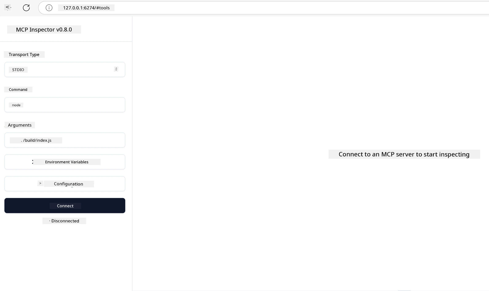

## Testing and Debugging

Before you begin to dey test your MCP server, e important to understand the tools wey dey available and best way dem for debugging. Correct testing go make sure say your server dey behave as e suppose and e go help you quickly sabi and solve wahala. Di section wey follow go show beta way dem recommend for tozzle your MCP implementation.

## Overview

Dis lesson go teach how to choose beta testing way and di best tool for testing.

## Learning Objectives

By di time you finish dis lesson, you go fit:

- Talk about different ways for testing.
- Use different tools to test your code well well.

## Testing MCP Servers

MCP get tools to help you test and debug your servers:

- **MCP Inspector**: Na command line tool wey fit run both as CLI tool and as visual tool.
- **Manual testing**: You fit use tool like curl to run web requests, but any tool wey fit run HTTP go work.
- **Unit testing**: You fit use your preferred testing framework test features of both server and client.

### Using MCP Inspector

We don talk about how to use dis tool for previous lessons but make we yan small for high level. Na tool wey dem build for Node.js and you fit use am by calling `npx` executable wey go download and install di tool for a short time and e go clear by itself after e finish run your request.

Di [MCP Inspector](https://github.com/modelcontextprotocol/inspector) go help you:

- **Discover Server Capabilities**: Automatically know which resources, tools, and prompts dey available
- **Test Tool Execution**: Try different parameters and see responses live
- **View Server Metadata**: Check server info, schemas, and configurations

Normal way to run di tool na dis:

```bash
npx @modelcontextprotocol/inspector node build/index.js
```

Di command wey dey above go start MCP and e visual interface and e go launch local web interface for your browser. You fit expect to see dashboard wey show your registered MCP servers, their tools wey dey available, resources, and prompts. Di interface let you take test tool execution, check server metadata, and see live responses, e go make am easy to confirm and debug your MCP server implementations.

Dis na how e fit look like: 

You fit still run dis tool for CLI mode by to add `--cli` attribute. See example how e go be to run di tool as "CLI" mode wey go list all di tools for di server:

```sh
npx @modelcontextprotocol/inspector --cli node build/index.js --method tools/list
```

### Manual Testing

Besides to run di inspector tool to test server capabilities, another way like dis na to run client wey fit use HTTP, example na curl.

With curl, you fit test MCP servers direct with HTTP requests:

```bash
# Example: Test server mata dem
curl http://localhost:3000/v1/metadata

# Example: Run tool
curl -X POST http://localhost:3000/v1/tools/execute \
  -H "Content-Type: application/json" \
  -d '{"name": "calculator", "parameters": {"expression": "2+2"}}'
```

Like you see from how curl dey work up there, you dey use POST request to call tool with payload wey get di tool name and di parameters. Choose di way wey best suit you. CLI tools e dey faster to use and e fit run as script, dis fit help well for CI/CD environment.

### Unit Testing

Make unit tests for your tools and resources to make sure dem dey work well. Here na some example testing code.

```python
import pytest

from mcp.server.fastmcp import FastMCP
from mcp.shared.memory import (
    create_connected_server_and_client_session as create_session,
)

# Mark di whole module for async tests
pytestmark = pytest.mark.anyio


async def test_list_tools_cursor_parameter():
    """Test that the cursor parameter is accepted for list_tools.

    Note: FastMCP doesn't currently implement pagination, so this test
    only verifies that the cursor parameter is accepted by the client.
    """

 server = FastMCP("test")

    # Create some test tools
    @server.tool(name="test_tool_1")
    async def test_tool_1() -> str:
        """First test tool"""
        return "Result 1"

    @server.tool(name="test_tool_2")
    async def test_tool_2() -> str:
        """Second test tool"""
        return "Result 2"

    async with create_session(server._mcp_server) as client_session:
        # Test without cursor parameter (no put am)
        result1 = await client_session.list_tools()
        assert len(result1.tools) == 2

        # Test with cursor=None
        result2 = await client_session.list_tools(cursor=None)
        assert len(result2.tools) == 2

        # Test with cursor as string
        result3 = await client_session.list_tools(cursor="some_cursor_value")
        assert len(result3.tools) == 2

        # Test with empty string cursor
        result4 = await client_session.list_tools(cursor="")
        assert len(result4.tools) == 2
    
```

Di code wey dey before do dis:

- Use pytest framework wey let you create tests as functions and use assert statements.
- Create MCP Server with two different tools.
- Use `assert` statement to check say certain conditions meet.

Check [full file here](https://github.com/modelcontextprotocol/python-sdk/blob/main/tests/client/test_list_methods_cursor.py)

With di file above, you fit test your own server to confirm say capabilities get set as e suppose be.

All major SDKs get similar testing sections so you fit adjust am to your chosen runtime.

## Samples 

- [Java Calculator](../samples/java/calculator/README.md)
- [.Net Calculator](../../../../03-GettingStarted/samples/csharp)
- [JavaScript Calculator](../samples/javascript/README.md)
- [TypeScript Calculator](../samples/typescript/README.md)
- [Python Calculator](../../../../03-GettingStarted/samples/python) 

## Additional Resources

- [Python SDK](https://github.com/modelcontextprotocol/python-sdk)

## What's Next

- Next: [Deployment](../09-deployment/README.md)

---

<!-- CO-OP TRANSLATOR DISCLAIMER START -->
**Disclaimer**:
Dis document don translate wit AI translation service wey dem call [Co-op Translator](https://github.com/Azure/co-op-translator). Even though we dey try make am correct, abeg sabi say automatic translation fit get some errors or no too clear. The original document for the original language na im be the real correct source. If na serious info, e better make person wey sabi human translation do am. We no go responsible if pesin no understand well or make mistake because of dis translation.
<!-- CO-OP TRANSLATOR DISCLAIMER END -->