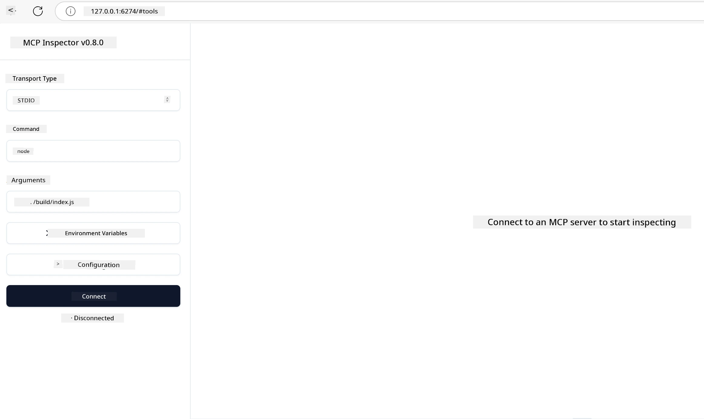

## Testing an Debugging

Before you start to test your MCP server, e important make you understand di tools wey dey available an di better way dem for debug. Good testing go make sure say your server dey do wetin e suppose do an go help you quick find an fix wahala dem. Di next part go show di best way dem wey you fit use check your MCP work well.

## Overview

Dis lesson go show how you go choose di correct testing way an di best testing tool.

## Wetin You Go Learn

By di time you finish dis lesson, you go fit:

- Talk about different ways for test.
- Use different tools to test your code well.


## Testing MCP Servers

MCP get tools wey fit help you test an debug your servers:

- **MCP Inspector**: Na command line tool wey you fit run as CLI tool an as visual tool.
- **Manual testing**: You fit use tool like curl to run web requests, but any tool wey fit run HTTP go work.
- **Unit testing**: E possible to use your preferred testing framework to test features of both server an client.

### How To Use MCP Inspector

We don yarn about how to use dis tool for past lessons but make we talk small about am for high level. E be tool wey dem build for Node.js an you fit use am by calling di `npx` command wey go download an install di tool for small time an e go wipe after e don finish your request.

Di [MCP Inspector](https://github.com/modelcontextprotocol/inspector) fit help you:

- **Discover Server Capabilities**: E go automaticly find resources, tools, an prompts wey dey available
- **Test Tool Execution**: Try different parameters an see response for real-time
- **View Server Metadata**: Check server info, schemas, an configurations

Normal way to run di tool be like dis:

```bash
npx @modelcontextprotocol/inspector node build/index.js
```

Di command wey dey above go start MCP an e visual interface an e go open local web interface for your browser. You fit expect to see dashboard wey show di MCP servers wey you don register, di tools wey dem get, resources an prompts. Di interface go let you test tool execution, check server metadata, an see response for real-time to help you validate an debug your MCP server work.

Dis na how e fit look like: 

You fit run dis tool as CLI mode by adding `--cli` attribute. Example to run am for "CLI" mode wey go list all di tools wey dey server:

```sh
npx @modelcontextprotocol/inspector --cli node build/index.js --method tools/list
```

### Manual Testing

Besides running di inspector tool to test server capabilities, another way na to run client wey fit use HTTP like curl for example.

With curl, you fit test MCP servers directly with HTTP requests:

```bash
# Example: Test server metadata
curl http://localhost:3000/v1/metadata

# Example: Run tool
curl -X POST http://localhost:3000/v1/tools/execute \
  -H "Content-Type: application/json" \
  -d '{"name": "calculator", "parameters": {"expression": "2+2"}}'
```

From di curl example wey dey above, you use POST request to run tool by sending tool name an parameters inside payload. Use di way wey go suit you well. CLI tools normally fast an fit run inside script wey go help for CI/CD environment.

### Unit Testing

Make unit tests for your tools an resources to make sure dem dey work well. Here na some example testing code.

```python
import pytest

from mcp.server.fastmcp import FastMCP
from mcp.shared.memory import (
    create_connected_server_and_client_session as create_session,
)

# Mark di whole module for async tests
pytestmark = pytest.mark.anyio


async def test_list_tools_cursor_parameter():
    """Test that the cursor parameter is accepted for list_tools.

    Note: FastMCP doesn't currently implement pagination, so this test
    only verifies that the cursor parameter is accepted by the client.
    """

 server = FastMCP("test")

    # Create some test tools
    @server.tool(name="test_tool_1")
    async def test_tool_1() -> str:
        """First test tool"""
        return "Result 1"

    @server.tool(name="test_tool_2")
    async def test_tool_2() -> str:
        """Second test tool"""
        return "Result 2"

    async with create_session(server._mcp_server) as client_session:
        # Test without cursor parameter (no add)
        result1 = await client_session.list_tools()
        assert len(result1.tools) == 2

        # Test with cursor=None
        result2 = await client_session.list_tools(cursor=None)
        assert len(result2.tools) == 2

        # Test wit cursor as string
        result3 = await client_session.list_tools(cursor="some_cursor_value")
        assert len(result3.tools) == 2

        # Test wit empty string cursor
        result4 = await client_session.list_tools(cursor="")
        assert len(result4.tools) == 2
    
```

Di code wey pass like dis na wetin e dey do:

- E use pytest framework wey let you create tests as functions an use assert statements.
- E create MCP Server with two different tools.
- E use `assert` statement to check say certain conditions dey true.

Make you check di [full file here](https://github.com/modelcontextprotocol/python-sdk/blob/main/tests/client/test_list_methods_cursor.py)

With di file wey dem talk about, you fit test your own server to make sure say capabilities dey created as e suppose be.

All big SDKs get similar testing section so you fit adjust to your runtime.

## Samples 

- [Java Calculator](../samples/java/calculator/README.md)
- [.Net Calculator](../../../../03-GettingStarted/samples/csharp)
- [JavaScript Calculator](../samples/javascript/README.md)
- [TypeScript Calculator](../samples/typescript/README.md)
- [Python Calculator](../../../../03-GettingStarted/samples/python) 

## Additional Resources

- [Python SDK](https://github.com/modelcontextprotocol/python-sdk)

## Wetin Dey Next

- Next: [Deployment](../09-deployment/README.md)

---

<!-- CO-OP TRANSLATOR DISCLAIMER START -->
**Disclaimer**:
Dis document don translate wit AI translation service [Co-op Translator](https://github.com/Azure/co-op-translator). Even tho we dey try make am correct, abeg make you know say automated translation fit get errors or mistakes. Di original document for dia own language na im be di correct source. For important info, make person wey sabi human translation do am. We no go responsible for any misunderstanding or wrong understanding wey fit happen because of dis translation.
<!-- CO-OP TRANSLATOR DISCLAIMER END -->