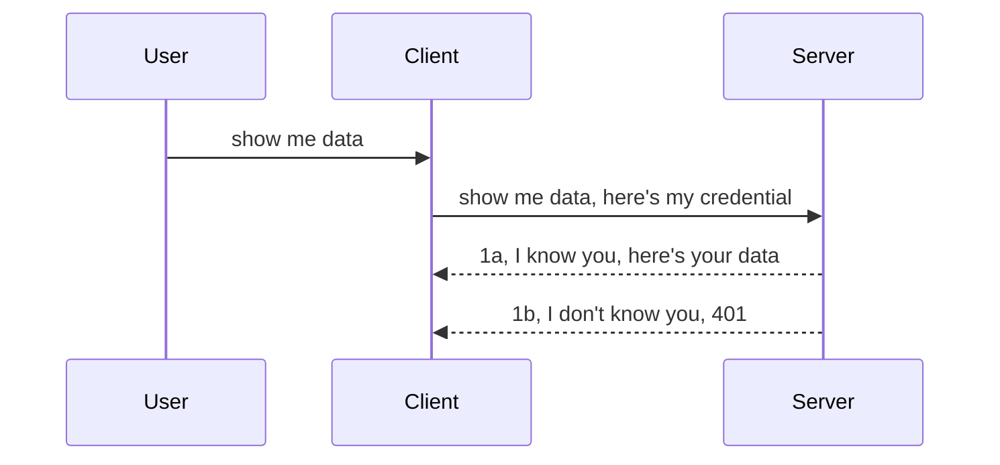

<!--
CO_OP_TRANSLATOR_METADATA:
{
  "original_hash": "5b00b8a8971a07d2d8803be4c9f138f8",
  "translation_date": "2025-11-18T19:18:49+00:00",
  "source_file": "03-GettingStarted/11-simple-auth/README.md",
  "language_code": "pcm"
}
-->
# Simple auth

MCP SDKs dey support OAuth 2.1 wey no be small work, e involve things like auth server, resource server, posting credentials, getting code, exchanging code for bearer token until you fit finally collect your resource data. If you no sabi OAuth wey be better thing to use, e good make you start with simple auth first before you go dey add better security. Na why dis chapter dey here, to help you move from simple auth go advanced auth.

## Wetin auth mean?

Auth na short for authentication and authorization. The idea be say we need do two things:

- **Authentication**, na the process wey we go use know whether we go allow person enter our house, say dem get right to dey "here" wey mean dem fit access our resource server wey MCP Server features dey.
- **Authorization**, na the process wey we go use know whether user suppose get access to the specific resources wey dem dey ask for, like orders or products, or whether dem fit read content but no fit delete am.

## Credentials: how we go tell system who we be

Most web developers dey think say to provide credential to server na the way, usually secret wey go show say dem fit dey "Authentication". Dis credential na usually base64 encoded version of username and password or API key wey dey identify specific user.

Dis one involve sending am through header wey dem dey call "Authorization" like dis:

```json
{ "Authorization": "secret123" }
```

Dem dey call dis one basic authentication. How e dey work na like dis:



Now we don understand how e dey work from flow side, how we go implement am? Most web servers get something wey dem dey call middleware, na code wey dey run as part of request wey fit verify credentials, and if credentials dey valid, e go allow request pass. If credentials no valid, you go get auth error. Make we see how we fit implement am:

**Python**

```python
class AuthMiddleware(BaseHTTPMiddleware):
    async def dispatch(self, request, call_next):

        has_header = request.headers.get("Authorization")
        if not has_header:
            print("-> Missing Authorization header!")
            return Response(status_code=401, content="Unauthorized")

        if not valid_token(has_header):
            print("-> Invalid token!")
            return Response(status_code=403, content="Forbidden")

        print("Valid token, proceeding...")
       
        response = await call_next(request)
        # add any customer headers or change in the response in some way
        return response


starlette_app.add_middleware(CustomHeaderMiddleware)
```

For here we don:

- Create middleware wey we call `AuthMiddleware` wey `dispatch` method dey run for web server.
- Add middleware to web server:

    ```python
    starlette_app.add_middleware(AuthMiddleware)
    ```

- Write validation logic wey dey check if Authorization header dey and if secret wey dem send dey valid:

    ```python
    has_header = request.headers.get("Authorization")
    if not has_header:
        print("-> Missing Authorization header!")
        return Response(status_code=401, content="Unauthorized")

    if not valid_token(has_header):
        print("-> Invalid token!")
        return Response(status_code=403, content="Forbidden")
    ```

    If secret dey and e valid, we go allow request pass by calling `call_next` and return response.

    ```python
    response = await call_next(request)
    # add any customer headers or change in the response in some way
    return response
    ```

How e dey work be say if web request come server, middleware go run and based on how e dey work, e go either allow request pass or return error wey go show say client no fit continue.

**TypeScript**

For here we go create middleware with popular framework Express and intercept request before e reach MCP Server. See code:

```typescript
function isValid(secret) {
    return secret === "secret123";
}

app.use((req, res, next) => {
    // 1. Authorization header present?  
    if(!req.headers["Authorization"]) {
        res.status(401).send('Unauthorized');
    }
    
    let token = req.headers["Authorization"];

    // 2. Check validity.
    if(!isValid(token)) {
        res.status(403).send('Forbidden');
    }

   
    console.log('Middleware executed');
    // 3. Passes request to the next step in the request pipeline.
    next();
});
```

For dis code we:

1. Check if Authorization header dey, if e no dey, we go send 401 error.
2. Make sure credential/token dey valid, if e no valid, we go send 403 error.
3. Finally allow request pass pipeline and return resource wey dem ask for.

## Exercise: Implement authentication

Make we use wetin we don learn try implement am. Dis na the plan:

Server

- Create web server and MCP instance.
- Implement middleware for server.

Client 

- Send web request, with credential, through header.

### -1- Create web server and MCP instance

First step na to create web server instance and MCP Server.

**Python**

For here we go create MCP server instance, create starlette web app and host am with uvicorn.

```python
# creating MCP Server

app = FastMCP(
    name="MCP Resource Server",
    instructions="Resource Server that validates tokens via Authorization Server introspection",
    host=settings["host"],
    port=settings["port"],
    debug=True
)

# creating starlette web app
starlette_app = app.streamable_http_app()

# serving app via uvicorn
async def run(starlette_app):
    import uvicorn
    config = uvicorn.Config(
            starlette_app,
            host=app.settings.host,
            port=app.settings.port,
            log_level=app.settings.log_level.lower(),
        )
    server = uvicorn.Server(config)
    await server.serve()

run(starlette_app)
```

For dis code we:

- Create MCP Server.
- Build starlette web app from MCP Server, `app.streamable_http_app()`.
- Host and serve web app using uvicorn `server.serve()`.

**TypeScript**

For here we go create MCP Server instance.

```typescript
const server = new McpServer({
      name: "example-server",
      version: "1.0.0"
    });

    // ... set up server resources, tools, and prompts ...
```

Dis MCP Server creation go need happen inside our POST /mcp route definition, so make we move code like dis:

```typescript
import express from "express";
import { randomUUID } from "node:crypto";
import { McpServer } from "@modelcontextprotocol/sdk/server/mcp.js";
import { StreamableHTTPServerTransport } from "@modelcontextprotocol/sdk/server/streamableHttp.js";
import { isInitializeRequest } from "@modelcontextprotocol/sdk/types.js"

const app = express();
app.use(express.json());

// Map to store transports by session ID
const transports: { [sessionId: string]: StreamableHTTPServerTransport } = {};

// Handle POST requests for client-to-server communication
app.post('/mcp', async (req, res) => {
  // Check for existing session ID
  const sessionId = req.headers['mcp-session-id'] as string | undefined;
  let transport: StreamableHTTPServerTransport;

  if (sessionId && transports[sessionId]) {
    // Reuse existing transport
    transport = transports[sessionId];
  } else if (!sessionId && isInitializeRequest(req.body)) {
    // New initialization request
    transport = new StreamableHTTPServerTransport({
      sessionIdGenerator: () => randomUUID(),
      onsessioninitialized: (sessionId) => {
        // Store the transport by session ID
        transports[sessionId] = transport;
      },
      // DNS rebinding protection is disabled by default for backwards compatibility. If you are running this server
      // locally, make sure to set:
      // enableDnsRebindingProtection: true,
      // allowedHosts: ['127.0.0.1'],
    });

    // Clean up transport when closed
    transport.onclose = () => {
      if (transport.sessionId) {
        delete transports[transport.sessionId];
      }
    };
    const server = new McpServer({
      name: "example-server",
      version: "1.0.0"
    });

    // ... set up server resources, tools, and prompts ...

    // Connect to the MCP server
    await server.connect(transport);
  } else {
    // Invalid request
    res.status(400).json({
      jsonrpc: '2.0',
      error: {
        code: -32000,
        message: 'Bad Request: No valid session ID provided',
      },
      id: null,
    });
    return;
  }

  // Handle the request
  await transport.handleRequest(req, res, req.body);
});

// Reusable handler for GET and DELETE requests
const handleSessionRequest = async (req: express.Request, res: express.Response) => {
  const sessionId = req.headers['mcp-session-id'] as string | undefined;
  if (!sessionId || !transports[sessionId]) {
    res.status(400).send('Invalid or missing session ID');
    return;
  }
  
  const transport = transports[sessionId];
  await transport.handleRequest(req, res);
};

// Handle GET requests for server-to-client notifications via SSE
app.get('/mcp', handleSessionRequest);

// Handle DELETE requests for session termination
app.delete('/mcp', handleSessionRequest);

app.listen(3000);
```

Now you fit see how MCP Server creation don move inside `app.post("/mcp")`.

Make we move go next step to create middleware wey go validate incoming credential.

### -2- Implement middleware for server

Make we enter middleware part. For here we go create middleware wey go look for credential inside `Authorization` header and validate am. If e dey okay, request go continue to do wetin e suppose do (like list tools, read resource or any MCP functionality wey client dey ask for).

**Python**

To create middleware, we need class wey go inherit from `BaseHTTPMiddleware`. Two things dey important:

- The request `request`, wey we go use read header info.
- `call_next` wey be callback we need call if client bring credential wey we accept.

First, we go handle case if `Authorization` header no dey:

```python
has_header = request.headers.get("Authorization")

# no header present, fail with 401, otherwise move on.
if not has_header:
    print("-> Missing Authorization header!")
    return Response(status_code=401, content="Unauthorized")
```

For here we go send 401 unauthorized message as client no pass authentication.

Next, if credential dey, we go check if e valid like dis:

```python
 if not valid_token(has_header):
    print("-> Invalid token!")
    return Response(status_code=403, content="Forbidden")
```

Note how we dey send 403 forbidden message above. See full middleware below wey implement everything we talk:

```python
class AuthMiddleware(BaseHTTPMiddleware):
    async def dispatch(self, request, call_next):

        has_header = request.headers.get("Authorization")
        if not has_header:
            print("-> Missing Authorization header!")
            return Response(status_code=401, content="Unauthorized")

        if not valid_token(has_header):
            print("-> Invalid token!")
            return Response(status_code=403, content="Forbidden")

        print("Valid token, proceeding...")
        print(f"-> Received {request.method} {request.url}")
        response = await call_next(request)
        response.headers['Custom'] = 'Example'
        return response

```

Okay, but wetin be `valid_token` function? See am below:

```python
# DON'T use for production - improve it !!
def valid_token(token: str) -> bool:
    # remove the "Bearer " prefix
    if token.startswith("Bearer "):
        token = token[7:]
        return token == "secret-token"
    return False
```

Dis one suppose improve.

IMPORTANT: You no suppose ever put secrets like dis for code. You suppose dey collect value from data source or IDP (identity service provider) or better still, make IDP dey do validation.

**TypeScript**

To implement dis one with Express, we go call `use` method wey dey take middleware functions.

We need:

- Interact with request variable to check credential wey dey `Authorization` property.
- Validate credential, and if e valid, allow request continue and make client MCP request do wetin e suppose do (like list tools, read resource or anything MCP related).

For here, we dey check if `Authorization` header dey, if e no dey, we go stop request:

```typescript
if(!req.headers["authorization"]) {
    res.status(401).send('Unauthorized');
    return;
}
```

If header no dey, you go get 401.

Next, we go check if credential dey valid, if e no valid, we go stop request again but with different message:

```typescript
if(!isValid(token)) {
    res.status(403).send('Forbidden');
    return;
} 
```

Note how you go get 403 error.

See full code:

```typescript
app.use((req, res, next) => {
    console.log('Request received:', req.method, req.url, req.headers);
    console.log('Headers:', req.headers["authorization"]);
    if(!req.headers["authorization"]) {
        res.status(401).send('Unauthorized');
        return;
    }
    
    let token = req.headers["authorization"];

    if(!isValid(token)) {
        res.status(403).send('Forbidden');
        return;
    }  

    console.log('Middleware executed');
    next();
});
```

We don set up web server to accept middleware wey go check credential wey client dey send. Wetin we go do for client side?

### -3- Send web request with credential through header

We need make sure client dey pass credential through header. As we go use MCP client do am, we need know how e dey work.

**Python**

For client, we need pass header with credential like dis:

```python
# DON'T hardcode the value, have it at minimum in an environment variable or a more secure storage
token = "secret-token"

async with streamablehttp_client(
        url = f"http://localhost:{port}/mcp",
        headers = {"Authorization": f"Bearer {token}"}
    ) as (
        read_stream,
        write_stream,
        session_callback,
    ):
        async with ClientSession(
            read_stream,
            write_stream
        ) as session:
            await session.initialize()
      
            # TODO, what you want done in the client, e.g list tools, call tools etc.
```

Note how we dey populate `headers` property like dis ` headers = {"Authorization": f"Bearer {token}"}`.

**TypeScript**

We fit solve dis one in two steps:

1. Create configuration object with credential.
2. Pass configuration object to transport.

```typescript

// DON'T hardcode the value like shown here. At minimum have it as a env variable and use something like dotenv (in dev mode).
let token = "secret123"

// define a client transport option object
let options: StreamableHTTPClientTransportOptions = {
  sessionId: sessionId,
  requestInit: {
    headers: {
      "Authorization": "secret123"
    }
  }
};

// pass the options object to the transport
async function main() {
   const transport = new StreamableHTTPClientTransport(
      new URL(serverUrl),
      options
   );
```

For here you go see how we create `options` object and put headers under `requestInit` property.

IMPORTANT: How we go improve dis one? Well, dis implementation get some wahala. First, passing credential like dis dey risky unless you get HTTPS. Even with HTTPS, credential fit still dey stolen so you need system wey go allow you revoke token easily and add extra checks like where request dey come from, whether request dey happen too much (like bot behavior), and other concerns.

E good make we talk say for simple APIs wey you no want make anybody dey call your API without authentication, wetin we get here na good start.

With dat, make we try improve security small by using standardized format like JSON Web Token, wey dem dey call JWT or "JOT" tokens.

## JSON Web Tokens, JWT

So, we dey try improve from sending simple credentials. Wetin JWT go give us?

- **Security improvements**. For basic auth, you dey send username and password as base64 encoded token (or API key) over and over wey dey increase risk. With JWT, you go send username and password once collect token wey dey time bound wey go expire. JWT dey allow fine-grained access control using roles, scopes and permissions.
- **Statelessness and scalability**. JWTs dey self-contained, dem carry all user info and no need server-side session storage. Token fit dey validated locally.
- **Interoperability and federation**. JWTs dey central for Open ID Connect and dey work with known identity providers like Entra ID, Google Identity and Auth0. Dem dey allow single sign on and more wey make am enterprise-grade.
- **Modularity and flexibility**. JWTs fit dey used with API Gateways like Azure API Management, NGINX and more. E dey support authentication scenarios and server-to-service communication including impersonation and delegation scenarios.
- **Performance and caching**. JWTs fit dey cached after decoding wey go reduce need for parsing. Dis dey help for high-traffic apps as e dey improve throughput and reduce load for infrastructure.
- **Advanced features**. E dey support introspection (check validity for server) and revocation (make token invalid).

With all dis benefits, make we see how we fit take implementation to next level.

## Turning basic auth into JWT

So, wetin we need change na:

- **Learn how to construct JWT token** wey go dey ready to send from client to server.
- **Validate JWT token**, and if e valid, allow client collect resources.
- **Secure token storage**. How we go store dis token.
- **Protect routes**. We need protect routes, for our case, we need protect routes and specific MCP features.
- **Add refresh tokens**. Create tokens wey go expire quick but refresh tokens wey go last long wey fit dey used to collect new tokens if dem expire. Also create refresh endpoint and rotation strategy.

### -1- Construct JWT token

First, JWT token get three parts:

- **header**, algorithm wey e use and token type.
- **payload**, claims, like sub (user or entity wey token represent. For auth, na usually userid), exp (when e go expire), role (role).
- **signature**, signed with secret or private key.

To do dis, we go need construct header, payload and encoded token.

**Python**

```python

import jwt
import jwt
from jwt.exceptions import ExpiredSignatureError, InvalidTokenError
import datetime

# Secret key used to sign the JWT
secret_key = 'your-secret-key'

header = {
    "alg": "HS256",
    "typ": "JWT"
}

# the user info andits claims and expiry time
payload = {
    "sub": "1234567890",               # Subject (user ID)
    "name": "User Userson",                # Custom claim
    "admin": True,                     # Custom claim
    "iat": datetime.datetime.utcnow(),# Issued at
    "exp": datetime.datetime.utcnow() + datetime.timedelta(hours=1)  # Expiry
}

# encode it
encoded_jwt = jwt.encode(payload, secret_key, algorithm="HS256", headers=header)
```

For dis code we don:

- Define header wey use HS256 as algorithm and type na JWT.
- Build payload wey get subject or user id, username, role, when e issue and when e go expire wey dey implement time bound aspect we talk before.

**TypeScript**

For here we go need some dependencies wey go help us construct JWT token.

Dependencies

```sh

npm install jsonwebtoken
npm install --save-dev @types/jsonwebtoken
```

Now we don get am, make we create header, payload and through dat create encoded token.

```typescript
import jwt from 'jsonwebtoken';

const secretKey = 'your-secret-key'; // Use env vars in production

// Define the payload
const payload = {
  sub: '1234567890',
  name: 'User usersson',
  admin: true,
  iat: Math.floor(Date.now() / 1000), // Issued at
  exp: Math.floor(Date.now() / 1000) + 60 * 60 // Expires in 1 hour
};

// Define the header (optional, jsonwebtoken sets defaults)
const header = {
  alg: 'HS256',
  typ: 'JWT'
};

// Create the token
const token = jwt.sign(payload, secretKey, {
  algorithm: 'HS256',
  header: header
});

console.log('JWT:', token);
```

Dis token:

E dey signed with HS256
E dey valid for 1 hour
E get claims like sub, name, admin, iat, and exp.

### -2- Validate token

We go need validate token, dis one suppose dey happen for server to make sure wetin client dey send dey valid. Many checks dey we suppose do from validating structure to validity. You fit also add other checks to confirm user dey your system and more.

To validate token, we need decode am so we fit read am and start check validity:

**Python**

```python

# Decode and verify the JWT
try:
    decoded = jwt.decode(token, secret_key, algorithms=["HS256"])
    print("✅ Token is valid.")
    print("Decoded claims:")
    for key, value in decoded.items():
        print(f"  {key}: {value}")
except ExpiredSignatureError:
    print("❌ Token has expired.")
except InvalidTokenError as e:
    print(f"❌ Invalid token: {e}")

```

For dis code, we dey call `jwt.decode` using token, secret key and chosen algorithm as input. Note how we dey use try-catch because failed validation go raise error.

**TypeScript**

For here we go call `jwt.verify` to get decoded version of token wey we fit analyze. If dis call fail, e mean say structure of token no correct or e don expire.

```typescript

try {
  const decoded = jwt.verify(token, secretKey);
  console.log('Decoded Payload:', decoded);
} catch (err) {
  console.error('Token verification failed:', err);
}
```

NOTE: as we talk before, we suppose do extra checks to make sure dis token dey point to user for our system and confirm user get rights wey e claim.
Next, make we look into role based access control, wey dem dey call RBAC.

## Add role based access control

Di idea be say we wan show say different roles get different permissions. For example, we fit assume say admin fit do everything, normal user fit do read/write, and guest fit only read. So, here be some possible permission levels:

- Admin.Write 
- User.Read
- Guest.Read

Make we see how we fit implement dis kain control with middleware. Middleware fit dey added per route or for all routes.

**Python**

```python
from starlette.middleware.base import BaseHTTPMiddleware
from starlette.responses import JSONResponse
import jwt

# DON'T have the secret in the code like, this is for demonstration purposes only. Read it from a safe place.
SECRET_KEY = "your-secret-key" # put this in env variable
REQUIRED_PERMISSION = "User.Read"

class JWTPermissionMiddleware(BaseHTTPMiddleware):
    async def dispatch(self, request, call_next):
        auth_header = request.headers.get("Authorization")
        if not auth_header or not auth_header.startswith("Bearer "):
            return JSONResponse({"error": "Missing or invalid Authorization header"}, status_code=401)

        token = auth_header.split(" ")[1]
        try:
            decoded = jwt.decode(token, SECRET_KEY, algorithms=["HS256"])
        except jwt.ExpiredSignatureError:
            return JSONResponse({"error": "Token expired"}, status_code=401)
        except jwt.InvalidTokenError:
            return JSONResponse({"error": "Invalid token"}, status_code=401)

        permissions = decoded.get("permissions", [])
        if REQUIRED_PERMISSION not in permissions:
            return JSONResponse({"error": "Permission denied"}, status_code=403)

        request.state.user = decoded
        return await call_next(request)


```

E get different ways wey we fit take add di middleware like dis:

```python

# Alt 1: add middleware while constructing starlette app
middleware = [
    Middleware(JWTPermissionMiddleware)
]

app = Starlette(routes=routes, middleware=middleware)

# Alt 2: add middleware after starlette app is a already constructed
starlette_app.add_middleware(JWTPermissionMiddleware)

# Alt 3: add middleware per route
routes = [
    Route(
        "/mcp",
        endpoint=..., # handler
        middleware=[Middleware(JWTPermissionMiddleware)]
    )
]
```

**TypeScript**

We fit use `app.use` and middleware wey go run for all requests.

```typescript
app.use((req, res, next) => {
    console.log('Request received:', req.method, req.url, req.headers);
    console.log('Headers:', req.headers["authorization"]);

    // 1. Check if authorization header has been sent

    if(!req.headers["authorization"]) {
        res.status(401).send('Unauthorized');
        return;
    }
    
    let token = req.headers["authorization"];

    // 2. Check if token is valid
    if(!isValid(token)) {
        res.status(403).send('Forbidden');
        return;
    }  

    // 3. Check if token user exist in our system
    if(!isExistingUser(token)) {
        res.status(403).send('Forbidden');
        console.log("User does not exist");
        return;
    }
    console.log("User exists");

    // 4. Verify the token has the right permissions
    if(!hasScopes(token, ["User.Read"])){
        res.status(403).send('Forbidden - insufficient scopes');
    }

    console.log("User has required scopes");

    console.log('Middleware executed');
    next();
});

```

E get plenty things wey our middleware fit do and wey e suppose do, like:

1. Check say authorization header dey present.
2. Check say token dey valid, we go call `isValid` wey be method wey we write to check di integrity and validity of JWT token.
3. Confirm say di user dey our system, we suppose check dis one.

   ```typescript
    // users in DB
   const users = [
     "user1",
     "User usersson",
   ]

   function isExistingUser(token) {
     let decodedToken = verifyToken(token);

     // TODO, check if user exists in DB
     return users.includes(decodedToken?.name || "");
   }
   ```

   For di code above, we don create simple `users` list, but normally e suppose dey for database.

4. Plus, we suppose also check say di token get di correct permissions.

   ```typescript
   if(!hasScopes(token, ["User.Read"])){
        res.status(403).send('Forbidden - insufficient scopes');
   }
   ```

   For di code above from di middleware, we dey check say di token get User.Read permission, if e no get, we go send 403 error. Below na di `hasScopes` helper method.

   ```typescript
   function hasScopes(scope: string, requiredScopes: string[]) {
     let decodedToken = verifyToken(scope);
    return requiredScopes.every(scope => decodedToken?.scopes.includes(scope));
  }
   ```

Have a think which additional checks you should be doing, but these are the absolute minimum of checks you should be doing.

Using Express as a web framework is a common choice. There are helpers library when you use JWT so you can write less code.

- `express-jwt`, helper library that provides a middleware that helps decode your token.
- `express-jwt-permissions`, this provides a middleware `guard` that helps check if a certain permission is on the token.

Here's what these libraries can look like when used:

```typescript
const express = require('express');
const jwt = require('express-jwt');
const guard = require('express-jwt-permissions')();

const app = express();
const secretKey = 'your-secret-key'; // put this in env variable

// Decode JWT and attach to req.user
app.use(jwt({ secret: secretKey, algorithms: ['HS256'] }));

// Check for User.Read permission
app.use(guard.check('User.Read'));

// multiple permissions
// app.use(guard.check(['User.Read', 'Admin.Access']));

app.get('/protected', (req, res) => {
  res.json({ message: `Welcome ${req.user.name}` });
});

// Error handler
app.use((err, req, res, next) => {
  if (err.code === 'permission_denied') {
    return res.status(403).send('Forbidden');
  }
  next(err);
});

```

Now you don see how middleware fit dey used for both authentication and authorization, wetin about MCP? E go change how we dey do auth? Make we find out for di next section.

### -3- Add RBAC to MCP

You don see how you fit add RBAC through middleware, but for MCP, e no get easy way to add per MCP feature RBAC, so wetin we go do? Well, we go just add code like dis wey go check whether di client get di rights to call specific tool:

You get different options on how to do per feature RBAC, here be some:

- Add check for each tool, resource, or prompt wey you need to check permission level.

   **python**

   ```python
   @tool()
   def delete_product(id: int):
      try:
          check_permissions(role="Admin.Write", request)
      catch:
        pass # client failed authorization, raise authorization error
   ```

   **typescript**

   ```typescript
   server.registerTool(
    "delete-product",
    {
      title: Delete a product",
      description: "Deletes a product",
      inputSchema: { id: z.number() }
    },
    async ({ id }) => {
      
      try {
        checkPermissions("Admin.Write", request);
        // todo, send id to productService and remote entry
      } catch(Exception e) {
        console.log("Authorization error, you're not allowed");  
      }

      return {
        content: [{ type: "text", text: `Deletected product with id ${id}` }]
      };
    }
   );
   ```


- Use advanced server approach and request handlers so you fit reduce how many places you need to dey check.

   **Python**

   ```python
   
   tool_permission = {
      "create_product": ["User.Write", "Admin.Write"],
      "delete_product": ["Admin.Write"]
   }

   def has_permission(user_permissions, required_permissions) -> bool:
      # user_permissions: list of permissions the user has
      # required_permissions: list of permissions required for the tool
      return any(perm in user_permissions for perm in required_permissions)

   @server.call_tool()
   async def handle_call_tool(
     name: str, arguments: dict[str, str] | None
   ) -> list[types.TextContent]:
    # Assume request.user.permissions is a list of permissions for the user
     user_permissions = request.user.permissions
     required_permissions = tool_permission.get(name, [])
     if not has_permission(user_permissions, required_permissions):
        # Raise error "You don't have permission to call tool {name}"
        raise Exception(f"You don't have permission to call tool {name}")
     # carry on and call tool
     # ...
   ```   
   

   **TypeScript**

   ```typescript
   function hasPermission(userPermissions: string[], requiredPermissions: string[]): boolean {
       if (!Array.isArray(userPermissions) || !Array.isArray(requiredPermissions)) return false;
       // Return true if user has at least one required permission
       
       return requiredPermissions.some(perm => userPermissions.includes(perm));
   }
  
   server.setRequestHandler(CallToolRequestSchema, async (request) => {
      const { params: { name } } = request;
  
      let permissions = request.user.permissions;
  
      if (!hasPermission(permissions, toolPermissions[name])) {
         return new Error(`You don't have permission to call ${name}`);
      }
  
      // carry on..
   });
   ```

   Note, you go need make sure say your middleware dey assign decoded token to di request's user property so di code above go dey simple.

### Summing up

Now wey we don discuss how to add support for RBAC generally and for MCP specifically, e don reach time to try implement security by yourself to make sure you understand di concepts wey we don show you.

## Assignment 1: Build MCP server and MCP client using basic authentication

For here, you go use wetin you don learn about how to send credentials through headers.

## Solution 1

[Solution 1](./code/basic/README.md)

## Assignment 2: Upgrade di solution from Assignment 1 to use JWT

Take di first solution but dis time, make we improve am.

Instead of Basic Auth, make we use JWT.

## Solution 2

[Solution 2](./solution/jwt-solution/README.md)

## Challenge

Add di RBAC per tool wey we describe for section "Add RBAC to MCP".

## Summary

We dey hope say you don learn plenty for dis chapter, from no security at all, to basic security, to JWT and how e fit dey added to MCP.

We don build solid foundation with custom JWTs, but as we dey scale, we dey move towards standards-based identity model. To adopt IdP like Entra or Keycloak go help us offload token issuance, validation, and lifecycle management to trusted platform — so we fit focus on app logic and user experience.

For dat one, we get more [advanced chapter on Entra](../../05-AdvancedTopics/mcp-security-entra/README.md)

---

<!-- CO-OP TRANSLATOR DISCLAIMER START -->
**Disclaimer**:  
Dis dokyument don use AI transleto service [Co-op Translator](https://github.com/Azure/co-op-translator) do di translation. Even though we dey try make am correct, abeg sabi say machine translation fit get mistake or no dey accurate well. Di original dokyument wey dey for im native language na di main source wey you go fit trust. For important information, e better make professional human translator check am. We no go fit take blame for any misunderstanding or wrong interpretation wey fit happen because you use dis translation.
<!-- CO-OP TRANSLATOR DISCLAIMER END -->