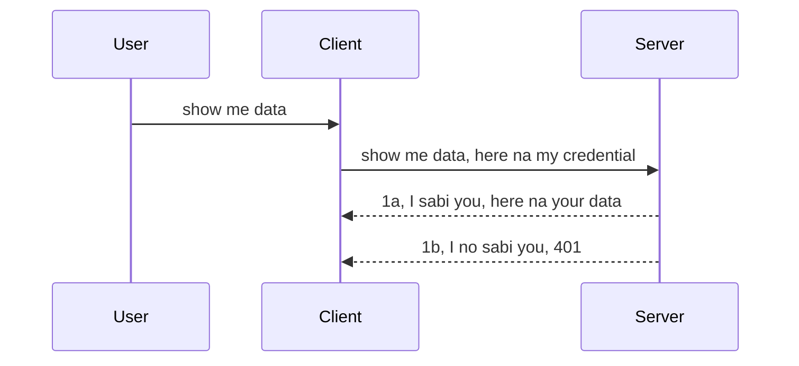

# Simple auth

MCP SDKs dey support di use of OAuth 2.1 wey, to be honest, na wahala process wey get concepts like auth server, resource server, posting credentials, getting code, exchanging di code for bearer token before person fit finally get resource data. If you never too sabi OAuth wey good idea to use, e good make you start wit small small auth den build up to beta security. Na why dis chapter dey, to build you up to better auth.

## Auth, wetin we mean?

Auth na short for authentication and authorization. Di idea be say we need do two tins:

- **Authentication**, na di process to sabi if we go allow person enter our house, say dem get right to "here" mean say dem fit access our resource server weh MCP Server features dey.
- **Authorization**, na di process to find out if user suppose get access to dis particular resources dem dey ask for, like orders or products or if dem fit read di content but no fit delete am as example.

## Credentials: how we dey tell di system who we be

Well, most web developers go start to think say dem go provide credential to server, normally na secret wey talk say if dem fit dey here "Authentication". Dis credential usually be base64 encoded username and password or API key wey identify one user sharply. 

Dis one dey involve to send am through header called "Authorization" like dis:

```json
{ "Authorization": "secret123" }
```

Dis one dem dey call basic authentication. How di whole flow dey waka na dis way:


```mermaid
sequenceDiagram
   participant User
   participant Client
   participant Server

   User->>Client: show me data
   Client->>Server: show me data, here na my credential
   Server-->>Client: 1a, I sabi you, here na your data
   Server-->>Client: 1b, I no sabi you, 401 
```
Now we don understand how e dey flow, how we go do am? Well, most web servers get middleware, na part of code wey run as part of request wey fit check credentials, and if credentials valid, e fit make request pass through. If request no get valid credentials, you go get auth error. Make we see how e fit implement:

**Python**

```python
class AuthMiddleware(BaseHTTPMiddleware):
    async def dispatch(self, request, call_next):

        has_header = request.headers.get("Authorization")
        if not has_header:
            print("-> Missing Authorization header!")
            return Response(status_code=401, content="Unauthorized")

        if not valid_token(has_header):
            print("-> Invalid token!")
            return Response(status_code=403, content="Forbidden")

        print("Valid token, proceeding...")
       
        response = await call_next(request)
        # add any customer headers or change for the response for some way
        return response


starlette_app.add_middleware(CustomHeaderMiddleware)
```

Here we get: 

- Middleware called `AuthMiddleware` wey `dispatch` method dey run by web server. 
- Middleware add for web server:

    ```python
    starlette_app.add_middleware(AuthMiddleware)
    ```

- Validation logic wey dey check if Authorization header dey and if di secret wey dem send dey valid:

    ```python
    has_header = request.headers.get("Authorization")
    if not has_header:
        print("-> Missing Authorization header!")
        return Response(status_code=401, content="Unauthorized")

    if not valid_token(has_header):
        print("-> Invalid token!")
        return Response(status_code=403, content="Forbidden")
    ```

    if di secret dey and e valid, we go let request pass by call `call_next` den return response.

    ```python
    response = await call_next(request)
    # add any customer headers or change for the response one way or another
    return response
    ```

How e dey work be say if web request happen go server middleware go run, and based on how e implement, e go either allow request pass or return error say client no fit continue.

**TypeScript**

Here we create middleware with popular framework Express and intercept request before e reach MCP Server. See code for that:

```typescript
function isValid(secret) {
    return secret === "secret123";
}

app.use((req, res, next) => {
    // 1. Authorization header dey present?
    if(!req.headers["Authorization"]) {
        res.status(401).send('Unauthorized');
    }
    
    let token = req.headers["Authorization"];

    // 2. Check say e valid.
    if(!isValid(token)) {
        res.status(403).send('Forbidden');
    }

   
    console.log('Middleware executed');
    // 3. Pass di request go next step for di request pipeline.
    next();
});
```

For dis code we:

1. Check if Authorization header dey. If no, we send 401 error.
2. Confirm if credential/token dey valid, if no, we send 403 error.
3. Lastly, pass request forward in request pipeline and return wetin dem ask for.

## Exercise: Implement authentication

Make we use our knowledge try do am. Plan be this:

Server

- Create web server and MCP instance.
- Implement middleware for di server.

Client 

- Send web request wit credential, through header.

### -1- Create web server and MCP instance

For first step, we need create web server instance and MCP Server.

**Python**

Here we create MCP server instance, create starlette web app and host am with uvicorn.

```python
# di MCP Server wey dem dey create

app = FastMCP(
    name="MCP Resource Server",
    instructions="Resource Server that validates tokens via Authorization Server introspection",
    host=settings["host"],
    port=settings["port"],
    debug=True
)

# di starlette web app wey dem dey create
starlette_app = app.streamable_http_app()

# dey serve app through uvicorn
async def run(starlette_app):
    import uvicorn
    config = uvicorn.Config(
            starlette_app,
            host=app.settings.host,
            port=app.settings.port,
            log_level=app.settings.log_level.lower(),
        )
    server = uvicorn.Server(config)
    await server.serve()

run(starlette_app)
```

For dis code we:

- Create di MCP Server.
- Construct starlette web app from MCP Server, `app.streamable_http_app()`.
- Host and serve web app using uvicorn `server.serve()`.

**TypeScript**

Here we create MCP Server instance.

```typescript
const server = new McpServer({
      name: "example-server",
      version: "1.0.0"
    });

    // ... arrange server tins dem, tools, an prompts ...
```

Dis MCP Server creation must happen inside our POST /mcp route, so make we move dis code like dis:

```typescript
import express from "express";
import { randomUUID } from "node:crypto";
import { McpServer } from "@modelcontextprotocol/sdk/server/mcp.js";
import { StreamableHTTPServerTransport } from "@modelcontextprotocol/sdk/server/streamableHttp.js";
import { isInitializeRequest } from "@modelcontextprotocol/sdk/types.js"

const app = express();
app.use(express.json());

// Map wey de store transports by session ID
const transports: { [sessionId: string]: StreamableHTTPServerTransport } = {};

// Handle POST requests for client-to-server communication
app.post('/mcp', async (req, res) => {
  // Check if session ID don dey already
  const sessionId = req.headers['mcp-session-id'] as string | undefined;
  let transport: StreamableHTTPServerTransport;

  if (sessionId && transports[sessionId]) {
    // Use the same transport again
    transport = transports[sessionId];
  } else if (!sessionId && isInitializeRequest(req.body)) {
    // New initialization request
    transport = new StreamableHTTPServerTransport({
      sessionIdGenerator: () => randomUUID(),
      onsessioninitialized: (sessionId) => {
        // Store the transport by session ID
        transports[sessionId] = transport;
      },
      // DNS rebinding protection no dey enabled by default for backwards compatibility. If you dey run dis server
      // locally, make sure say you set:
      // enableDnsRebindingProtection: true,
      // allowedHosts: ['127.0.0.1'],
    });

    // Clean up transport when e close
    transport.onclose = () => {
      if (transport.sessionId) {
        delete transports[transport.sessionId];
      }
    };
    const server = new McpServer({
      name: "example-server",
      version: "1.0.0"
    });

    // ... arrange server resources, tools, and prompts ...

    // Connect to di MCP server
    await server.connect(transport);
  } else {
    // Invalid request
    res.status(400).json({
      jsonrpc: '2.0',
      error: {
        code: -32000,
        message: 'Bad Request: No valid session ID provided',
      },
      id: null,
    });
    return;
  }

  // Handle the request
  await transport.handleRequest(req, res, req.body);
});

// Handler wey fit use again for GET and DELETE requests
const handleSessionRequest = async (req: express.Request, res: express.Response) => {
  const sessionId = req.headers['mcp-session-id'] as string | undefined;
  if (!sessionId || !transports[sessionId]) {
    res.status(400).send('Invalid or missing session ID');
    return;
  }
  
  const transport = transports[sessionId];
  await transport.handleRequest(req, res);
};

// Handle GET requests for server-to-client notifications via SSE
app.get('/mcp', handleSessionRequest);

// Handle DELETE requests for session termination
app.delete('/mcp', handleSessionRequest);

app.listen(3000);
```

Now you see di MCP Server creation dey inside `app.post("/mcp")`.

Make we move to second step to create middleware so we fit check di credential wey come.

### -2- Implement middleware for server

Make we do middleware now. Here we go create middleware wey go check credential inside `Authorization` header and validate am. If e good, request go continue do wetin e suppose do (like list tools, read resource or whatever MCP function client dey request).

**Python**

To create middleware, we need create class wey inherit from `BaseHTTPMiddleware`. E get two important parts:

- Request `request`, we read header info from here.
- `call_next`, dis na di callback we need call if client bring credential we accept.

First, handle case if `Authorization` header no dey:

```python
has_header = request.headers.get("Authorization")

# no header dey, make e fail wit 401, if no, make e continue.
if not has_header:
    print("-> Missing Authorization header!")
    return Response(status_code=401, content="Unauthorized")
```

Here we send 401 unauthorized cos client fail authentication.

Next, if credential dey, make we check if e valid like dis:

```python
 if not valid_token(has_header):
    print("-> Invalid token!")
    return Response(status_code=403, content="Forbidden")
```

Note say we dey send 403 forbidden message here. See full middleware below wey do everything we talk before:

```python
class AuthMiddleware(BaseHTTPMiddleware):
    async def dispatch(self, request, call_next):

        has_header = request.headers.get("Authorization")
        if not has_header:
            print("-> Missing Authorization header!")
            return Response(status_code=401, content="Unauthorized")

        if not valid_token(has_header):
            print("-> Invalid token!")
            return Response(status_code=403, content="Forbidden")

        print("Valid token, proceeding...")
        print(f"-> Received {request.method} {request.url}")
        response = await call_next(request)
        response.headers['Custom'] = 'Example'
        return response

```

Correct, but how about `valid_token` function? Here e dey below:
:

```python
# NO use am for production - make am beta !!
def valid_token(token: str) -> bool:
    # comot the "Bearer " prefix
    if token.startswith("Bearer "):
        token = token[7:]
        return token == "secret-token"
    return False
```

Dis one fit beta.

IMPORTANT: You NEVER suppose get secrets like dis for code. Better if you fetch di value to check from data source or from IDP (identity service provider) or better still, make IDP do validation.

**TypeScript**

To do am with Express, we need call `use` method wey take middleware functions.

We go:

- Check request variable to find credential under `Authorization`.
- Validate credential, if good make request continue and let client MCP request do e work (like list tools, read resource or any MCP task).

Here, we dey check if `Authorization` header dey, if no, we stop request:

```typescript
if(!req.headers["authorization"]) {
    res.status(401).send('Unauthorized');
    return;
}
```

If header no dey, you go get 401 error.

Next, we check if credential dey valid, if no, we stop request with different error:

```typescript
if(!isValid(token)) {
    res.status(403).send('Forbidden');
    return;
} 
```

See how you go get 403 error.

Full code be dis:

```typescript
app.use((req, res, next) => {
    console.log('Request received:', req.method, req.url, req.headers);
    console.log('Headers:', req.headers["authorization"]);
    if(!req.headers["authorization"]) {
        res.status(401).send('Unauthorized');
        return;
    }
    
    let token = req.headers["authorization"];

    if(!isValid(token)) {
        res.status(403).send('Forbidden');
        return;
    }  

    console.log('Middleware executed');
    next();
});
```

We don set web server to accept middleware to check credential wey client dey send for us. How about client part?

### -3- Send web request with credential via header

We must make sure client dey pass credential through header. Since we wan use MCP client to do am, we must know how e dey happen.

**Python**

For client, we must pass header with our credential like dis:

```python
# NO hardcode di value, make e dey for environment variable or beta secure storage
token = "secret-token"

async with streamablehttp_client(
        url = f"http://localhost:{port}/mcp",
        headers = {"Authorization": f"Bearer {token}"}
    ) as (
        read_stream,
        write_stream,
        session_callback,
    ):
        async with ClientSession(
            read_stream,
            write_stream
        ) as session:
            await session.initialize()
      
            # TODO, wetin you want make e do for di client, like list tools, call tools etc.
```

See as we set `headers` property like dis: ` headers = {"Authorization": f"Bearer {token}"}`.

**TypeScript**

We fit do am in two steps:

1. Populate configuration object wit our credential.
2. Pass configuration object to transport.

```typescript

// NO hardcode di value like we show here. At least make am be env variable and use something like dotenv (for dev mode).
let token = "secret123"

// define client transport option object
let options: StreamableHTTPClientTransportOptions = {
  sessionId: sessionId,
  requestInit: {
    headers: {
      "Authorization": "secret123"
    }
  }
};

// pass di options object go di transport
async function main() {
   const transport = new StreamableHTTPClientTransport(
      new URL(serverUrl),
      options
   );
```

See how we create `options` object and put headers under `requestInit`.

IMPORTANT: How we fit improve am? Well, this implementation get some wahala. First, passing credential like dis risky unless you get HTTPS for sure. Even then, credential fit get steal, so you need system wey go fit revoke token quick quick and add more checks like where from, if request dey too frequent (bot behavior), plus many more concerns. 

But for very simple APIs wey you no want anybody call your API without authentication, wetin we get here na good beginning.

Make we try harden security small by using standard format like JSON Web Token, wey dem also call JWT or "JOT" tokens.

## JSON Web Tokens, JWT

So, we wan improve from sending simple credentials. Wetin immediate better thing we fit get adopting JWT?

- **Security improvements**. For basic auth, you dey send username and password encoded base64 or API key repeatedly, wey increase risk. With JWT, you send username and password one time and get token wey expire. JWT fit easily do fine-grained access control using roles, scopes and permissions. 
- **Statelessness and scalability**. JWTs dey self-contained, carry all user info and no need store anything server-side. Token fit validate locally.
- **Interoperability and federation**. JWTs dey center for Open ID Connect and dem dey use with well known identity providers like Entra ID, Google Identity and Auth0. Dem fit also do single sign on and more, making am enterprise-grade.
- **Modularity and flexibility**. JWTs fit use with API Gateways like Azure API Management, NGINX and others. E also fit handle user authentication and server-to-service communication including impersonation and delegation.
- **Performance and caching**. JWTs fit cache after decoding, reduce parsing. E help with high-traffic apps by improving throughput and reduce load.
- **Advanced features**. E support introspection (check if valid on server) and revocation (make token no valid).

With all these benefits, make we see how we fit take our implementation go next level.

## Turning basic auth into JWT

So, di big changes we need:

- **Learn how to construct JWT token** make e ready to send from client to server.
- **Validate JWT token**, if e valid, make client get resources.
- **Secure token storage**. How we store dis token.
- **Protect routes**. We need protect routes and specific MCP features.
- **Add refresh tokens**. Make tokens short-lived but get refresh tokens long-lived to get new tokens if dem expire. Make sure refresh endpoint and rotation strategy dey.

### -1- Construct JWT token

First, JWT token get dis parts:

- **header**, algorithm and token type.
- **payload**, claims like sub (user or entity token represents, usually userid), exp (expiry time), role.
- **signature**, signed with secret or private key.

To do dis, we need construct header, payload and create encoded token.

**Python**

```python

import jwt
import jwt
from jwt.exceptions import ExpiredSignatureError, InvalidTokenError
import datetime

# Secret key wey dem dey use sign the JWT
secret_key = 'your-secret-key'

header = {
    "alg": "HS256",
    "typ": "JWT"
}

# the user info plus e claims and how long e go last
payload = {
    "sub": "1234567890",               # Subject (user ID)
    "name": "User Userson",                # Custom claim
    "admin": True,                     # Custom claim
    "iat": datetime.datetime.utcnow(),# When e start to dey issued
    "exp": datetime.datetime.utcnow() + datetime.timedelta(hours=1)  # When e go expire
}

# make e encode am
encoded_jwt = jwt.encode(payload, secret_key, algorithm="HS256", headers=header)
```

For above code we:

- Define header using HS256 algorithm and token type JWT.
- Construct payload with subject/user id, username, role, issued at and expire time making e time bound.

**TypeScript**

Here we need dependencies to help create JWT token.

Dependencies

```sh

npm install jsonwebtoken
npm install --save-dev @types/jsonwebtoken
```

Now we get all, make we create header, payload and encoded token.

```typescript
import jwt from 'jsonwebtoken';

const secretKey = 'your-secret-key'; // Use env vars for production

// Define di payload
const payload = {
  sub: '1234567890',
  name: 'User usersson',
  admin: true,
  iat: Math.floor(Date.now() / 1000), // Issued at
  exp: Math.floor(Date.now() / 1000) + 60 * 60 // Go expire after 1 hour
};

// Define di header (optional, jsonwebtoken dey set defaults)
const header = {
  alg: 'HS256',
  typ: 'JWT'
};

// Create di token
const token = jwt.sign(payload, secretKey, {
  algorithm: 'HS256',
  header: header
});

console.log('JWT:', token);
```

Dis token:

Signed with HS256
Valid 1 hour
Includes claims like sub, name, admin, iat, exp.

### -2- Validate token

We must validate token on server to confirm client token dey valid. Plenty checks like structure and validity. You should also check if user dey system and if user get rights e claim.

To validate, decode token to read am, then check if e valid:

**Python**

```python

# Decode an check di JWT
try:
    decoded = jwt.decode(token, secret_key, algorithms=["HS256"])
    print("✅ Token is valid.")
    print("Decoded claims:")
    for key, value in decoded.items():
        print(f"  {key}: {value}")
except ExpiredSignatureError:
    print("❌ Token has expired.")
except InvalidTokenError as e:
    print(f"❌ Invalid token: {e}")

```

For dis code, we call `jwt.decode` with token, secret key and algorithm. We use try-catch block cos failed validation go throw error.

**TypeScript**

Here we call `jwt.verify` to get decoded token to analyze. If fail, token don incorrect or expired.

```typescript

try {
  const decoded = jwt.verify(token, secretKey);
  console.log('Decoded Payload:', decoded);
} catch (err) {
  console.error('Token verification failed:', err);
}
```

NOTE: as we talk before, you fit add more checks to confirm token relate to user inside your system and confirm user get rights.

Next, make we check role-based access control, wey dem also call RBAC.
## Adding role based access control

Di idea na say we want talk say different roles get different permission dem. For example, we assume say admin fit do everything and say normal users fit do read/write and say guest fit only read. So, these ones na some possible permission levels:

- Admin.Write 
- User.Read
- Guest.Read

Make we look how we fit implement control like dis with middleware. Middlewares fit dey add per route plus for all routes.

**Python**

```python
from starlette.middleware.base import BaseHTTPMiddleware
from starlette.responses import JSONResponse
import jwt

# NO gèt di secret for inside di code like dis, dis one na only for show how e dey work. Make you read am from beta and safe place.
SECRET_KEY = "your-secret-key" # put dis one for env variable
REQUIRED_PERMISSION = "User.Read"

class JWTPermissionMiddleware(BaseHTTPMiddleware):
    async def dispatch(self, request, call_next):
        auth_header = request.headers.get("Authorization")
        if not auth_header or not auth_header.startswith("Bearer "):
            return JSONResponse({"error": "Missing or invalid Authorization header"}, status_code=401)

        token = auth_header.split(" ")[1]
        try:
            decoded = jwt.decode(token, SECRET_KEY, algorithms=["HS256"])
        except jwt.ExpiredSignatureError:
            return JSONResponse({"error": "Token expired"}, status_code=401)
        except jwt.InvalidTokenError:
            return JSONResponse({"error": "Invalid token"}, status_code=401)

        permissions = decoded.get("permissions", [])
        if REQUIRED_PERMISSION not in permissions:
            return JSONResponse({"error": "Permission denied"}, status_code=403)

        request.state.user = decoded
        return await call_next(request)


```

E get different way we fit add di middleware like dis:

```python

# Alt 1: add middleware wen you dey build starlette app
middleware = [
    Middleware(JWTPermissionMiddleware)
]

app = Starlette(routes=routes, middleware=middleware)

# Alt 2: add middleware afta starlette app don already build
starlette_app.add_middleware(JWTPermissionMiddleware)

# Alt 3: add middleware for each route
routes = [
    Route(
        "/mcp",
        endpoint=..., # handler
        middleware=[Middleware(JWTPermissionMiddleware)]
    )
]
```

**TypeScript**

We fit use `app.use` plus middleware wey go run for all requests. 

```typescript
app.use((req, res, next) => {
    console.log('Request received:', req.method, req.url, req.headers);
    console.log('Headers:', req.headers["authorization"]);

    // 1. Check if dem don send authorization header

    if(!req.headers["authorization"]) {
        res.status(401).send('Unauthorized');
        return;
    }
    
    let token = req.headers["authorization"];

    // 2. Check if token na correct one
    if(!isValid(token)) {
        res.status(403).send('Forbidden');
        return;
    }  

    // 3. Check if token user dey inside our system
    if(!isExistingUser(token)) {
        res.status(403).send('Forbidden');
        console.log("User does not exist");
        return;
    }
    console.log("User exists");

    // 4. Confirm say the token get the correct permissions
    if(!hasScopes(token, ["User.Read"])){
        res.status(403).send('Forbidden - insufficient scopes');
    }

    console.log("User has required scopes");

    console.log('Middleware executed');
    next();
});

```

E get plenty things we fit let our middleware do and wetin our middleware suppose do, na:

1. Check if authorization header dey
2. Check if token valid, we go call `isValid` na method we write wey dey check JWT token integrity and validity.
3. Verify say user dey for our system, we suppose check dis.

   ```typescript
    // users wey dey inside DB
   const users = [
     "user1",
     "User usersson",
   ]

   function isExistingUser(token) {
     let decodedToken = verifyToken(token);

     // TODO, check if user dey for DB
     return users.includes(decodedToken?.name || "");
   }
   ```

   For up, we don create simple `users` list, wey suppose for database obviously.

4. Besides dat, we suppose check token get correct permissions.

   ```typescript
   if(!hasScopes(token, ["User.Read"])){
        res.status(403).send('Forbidden - insufficient scopes');
   }
   ```

   For dis code wey dey middleware, we dey check say token get User.Read permission, if e no get, we go send 403 error. Below na `hasScopes` helper method.

   ```typescript
   function hasScopes(scope: string, requiredScopes: string[]) {
     let decodedToken = verifyToken(scope);
    return requiredScopes.every(scope => decodedToken?.scopes.includes(scope));
  }
   ```

Have a think which additional checks you should be doing, but these are the absolute minimum of checks you should be doing.

Using Express as a web framework is a common choice. There are helpers library when you use JWT so you can write less code.

- `express-jwt`, helper library that provides a middleware that helps decode your token.
- `express-jwt-permissions`, this provides a middleware `guard` that helps check if a certain permission is on the token.

Here's what these libraries can look like when used:

```typescript
const express = require('express');
const jwt = require('express-jwt');
const guard = require('express-jwt-permissions')();

const app = express();
const secretKey = 'your-secret-key'; // put this in env variable

// Decode JWT and attach to req.user
app.use(jwt({ secret: secretKey, algorithms: ['HS256'] }));

// Check for User.Read permission
app.use(guard.check('User.Read'));

// multiple permissions
// app.use(guard.check(['User.Read', 'Admin.Access']));

app.get('/protected', (req, res) => {
  res.json({ message: `Welcome ${req.user.name}` });
});

// Error handler
app.use((err, req, res, next) => {
  if (err.code === 'permission_denied') {
    return res.status(403).send('Forbidden');
  }
  next(err);
});

```

Now you don see how middleware fit use for both authentication and authorization, but how about MCP, e go change how we dey do auth? Make we find out for next section.

### -3- Add RBAC to MCP

You don see how you fit add RBAC with middleware, but for MCP e no get easy way to add per MCP feature RBAC, so wetin we go do? We go just add code like dis wey go check if client get rights to call one particular tool:

You get different options on how to do per feature RBAC, here be some:

- Add check for each tool, resource, prompt where you need check permission level.

   **python**

   ```python
   @tool()
   def delete_product(id: int):
      try:
          check_permissions(role="Admin.Write", request)
      catch:
        pass # client no fit authorize, raise authorization error
   ```

   **typescript**

   ```typescript
   server.registerTool(
    "delete-product",
    {
      title: Delete a product",
      description: "Deletes a product",
      inputSchema: { id: z.number() }
    },
    async ({ id }) => {
      
      try {
        checkPermissions("Admin.Write", request);
        // todo, send id go productService and remote entry
      } catch(Exception e) {
        console.log("Authorization error, you're not allowed");  
      }

      return {
        content: [{ type: "text", text: `Deletected product with id ${id}` }]
      };
    }
   );
   ```


- Use advanced server approach plus request handlers so you reduce how many places wey you need do the check.

   **Python**

   ```python
   
   tool_permission = {
      "create_product": ["User.Write", "Admin.Write"],
      "delete_product": ["Admin.Write"]
   }

   def has_permission(user_permissions, required_permissions) -> bool:
      # user_permissions: list of permissions wey di user get
      # required_permissions: list of permissions wey di tool need
      return any(perm in user_permissions for perm in required_permissions)

   @server.call_tool()
   async def handle_call_tool(
     name: str, arguments: dict[str, str] | None
   ) -> list[types.TextContent]:
    # Make we assume say request.user.permissions na list of permissions wey di user get
     user_permissions = request.user.permissions
     required_permissions = tool_permission.get(name, [])
     if not has_permission(user_permissions, required_permissions):
        # Make e raise error "You no get permission to call tool {name}"
        raise Exception(f"You don't have permission to call tool {name}")
     # continue make e call tool
     # ...
   ```   
   

   **TypeScript**

   ```typescript
   function hasPermission(userPermissions: string[], requiredPermissions: string[]): boolean {
       if (!Array.isArray(userPermissions) || !Array.isArray(requiredPermissions)) return false;
       // Return true if user get at least one required permission
       
       return requiredPermissions.some(perm => userPermissions.includes(perm));
   }
  
   server.setRequestHandler(CallToolRequestSchema, async (request) => {
      const { params: { name } } = request;
  
      let permissions = request.user.permissions;
  
      if (!hasPermission(permissions, toolPermissions[name])) {
         return new Error(`You don't have permission to call ${name}`);
      }
  
      // carry on..
   });
   ```

   Note, you need make sure your middleware assign decoded token to request's user property so code above go simple.

### Summing up

Now say we don tok how to add RBAC support in general and MCP in particular, na time to try implement security by yourself to sabi the concepts wey we show you.

## Assignment 1: Build an mcp server and mcp client using basic authentication

For here, you go use wetin you don learn about how to send credentials through headers.

## Solution 1

[Solution 1](./code/basic/README.md)

## Assignment 2: Upgrade the solution from Assignment 1 to use JWT

Take the first solution but dis time, make we improve am. 

Instead of using Basic Auth, make we use JWT. 

## Solution 2

[Solution 2](./solution/jwt-solution/README.md)

## Challenge

Add RBAC per tool wey we describe for section "Add RBAC to MCP".

## Summary

Hopefully you don learn plenty for this chapter, from no security at all, to basic security, to JWT and how e fit add to MCP.

We don build solid foundation with custom JWTs, but as we dey grow, we dey move go standards-based identity model. Using IdP like Entra or Keycloak allow us to offload token issuance, validation, and lifecycle management to trusted platform — make we fit focus on app logic and user experience.

For dat one, we get more [advanced chapter on Entra](../../05-AdvancedTopics/mcp-security-entra/README.md)

## What's Next

- Next: [Setting Up MCP Hosts](../12-mcp-hosts/README.md)

---

<!-- CO-OP TRANSLATOR DISCLAIMER START -->
**Disclaimer**:
Dis document na AI translation service [Co-op Translator](https://github.com/Azure/co-op-translator) wey dem use translate am. Even though we try make am correct, abeg sabi say automated translation fit get some mistakes or wrong tori. The original document wey e be for im own language na the correct one wey you suppose trust. If you get serious matter, e better make person wey sabi translate am do am for you. We no go carry any wahala or mis-understanding wey fit happen from this translation.
<!-- CO-OP TRANSLATOR DISCLAIMER END -->