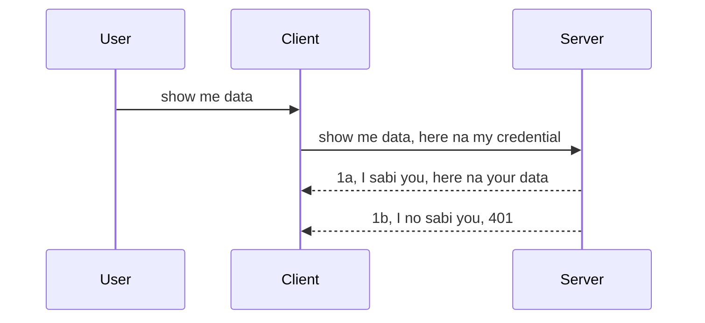

# Simple auth

MCP SDKs dey support di use of OAuth 2.1 wey for be honest na wahala process wey involve things like auth server, resource server, posting credentials, dey find code, change di code for bearer token until you fit finally get your resource data. If you never dey use OAuth wey beta to implement, e good make you start wit some basic level of auth and build am up to beta security. Na why dis chapter dey exist, to build you up to advanced auth.

## Auth, wetin we mean?

Auth mean authentication and authorization. Di idea be say we need do two tins:

- **Authentication**, na di process to sabi whether person fit enter our house, say dem get di right to "de here" meaning get access to our resource server wey MCP Server features dey.
- **Authorization**, na di process to sabi if user suppose get access to di specific resources wey dem dey ask for, example these orders or products or if dem fit read di content but no fit delete am as another example.

## Credentials: how we dey tell di system who we be

Well, majority web developers go start dey think say them go provide credential to di server, usually secret wey talk if dem fit dey here "Authentication". Dis credential na usually base64 encoded version of username and password or API key wey identify specific user.

Dis one involve to send am via header wey dem dey call "Authorization" like dis:

```json
{ "Authorization": "secret123" }
```

Dis one na di basic authentication. How di flow just dey work na like dis:


```mermaid
sequenceDiagram
   participant User
   participant Client
   participant Server

   User->>Client: show me data
   Client->>Server: show me data, here na my credential
   Server-->>Client: 1a, I sabi you, here na your data
   Server-->>Client: 1b, I no sabi you, 401 
```

Now say we don understand how e dey work from flow perspective, how we go take implement am? Well, most web servers get something wey dem dey call middleware, na piece of code wey go run as part of di request wey fit verify credentials, and if credentials valid e go let di request pass. If request no get valid credentials you go get auth error. Make we see how dem fit implement am:

**Python**

```python
class AuthMiddleware(BaseHTTPMiddleware):
    async def dispatch(self, request, call_next):

        has_header = request.headers.get("Authorization")
        if not has_header:
            print("-> Missing Authorization header!")
            return Response(status_code=401, content="Unauthorized")

        if not valid_token(has_header):
            print("-> Invalid token!")
            return Response(status_code=403, content="Forbidden")

        print("Valid token, proceeding...")
       
        response = await call_next(request)
        # add any customer headers or change for di response somehow
        return response


starlette_app.add_middleware(CustomHeaderMiddleware)
```

Here we get:

- Create middleware wey dem call `AuthMiddleware` where di `dispatch` method dey called by di web server.
- Add di middleware to di web server:

    ```python
    starlette_app.add_middleware(AuthMiddleware)
    ```

- Write validation logic wey check if Authorization header dey and if di secret wey dem send valid:

    ```python
    has_header = request.headers.get("Authorization")
    if not has_header:
        print("-> Missing Authorization header!")
        return Response(status_code=401, content="Unauthorized")

    if not valid_token(has_header):
        print("-> Invalid token!")
        return Response(status_code=403, content="Forbidden")
    ```

    if di secret dey and e valid we let di request pass by calling `call_next` and return di response.

    ```python
    response = await call_next(request)
    # put any customer headers or change di response somehow
    return response
    ```

Di way e dey work be say if web request come server middleware go run and because of the way e implement e go either let di request pass or return error say client no fit continue.

**TypeScript**

Here we create middleware wit di popular framework Express and intercept di request before e reach MCP Server. Dis na di code for am:

```typescript
function isValid(secret) {
    return secret === "secret123";
}

app.use((req, res, next) => {
    // 1. Di Authorization header dey?
    if(!req.headers["Authorization"]) {
        res.status(401).send('Unauthorized');
    }
    
    let token = req.headers["Authorization"];

    // 2. Check if e valid.
    if(!isValid(token)) {
        res.status(403).send('Forbidden');
    }

   
    console.log('Middleware executed');
    // 3. Pass di request go di next step for di request pipeline.
    next();
});
```

For dis code we:

1. Check if di Authorization header dey present, if no dey, we send 401 error.
2. Check di credential/token valid, if no valid we send 403 error.
3. Pass di request go di request pipeline and return di resource wey dem ask.

## Exercise: Implement authentication

Make we use di knowledge try implement am. Dis na di plan:

Server

- Create web server and MCP instance.
- Implement middleware for di server.

Client

- Send web request, wit credential, via header.

### -1- Create web server and MCP instance

> **Looking ahead:** di TypeScript example below dey track HTTP transports in one `transports` map wey keyed by `mcp-session-id`, per **MCP Specification 2025-11-25**. Di `2026-07-28` release candidate go remove di `initialize` handshake and session ID completely, so dis per-session transport map no go dey again but dem go do stateless, self-contained requests. See [What's Changing in MCP: The 2026-07-28 Release Candidate](../../01-CoreConcepts/mcp-2026-07-28-release-candidate.md).

For our first step, we need to create di web server and MCP Server.

**Python**

Here we create MCP server instance, create starlette web app and host am with uvicorn.

```python
# di MCP Server dey create

app = FastMCP(
    name="MCP Resource Server",
    instructions="Resource Server that validates tokens via Authorization Server introspection",
    host=settings["host"],
    port=settings["port"],
    debug=True
)

# di starlette web app dey create
starlette_app = app.streamable_http_app()

# di app dey serve via uvicorn
async def run(starlette_app):
    import uvicorn
    config = uvicorn.Config(
            starlette_app,
            host=app.settings.host,
            port=app.settings.port,
            log_level=app.settings.log_level.lower(),
        )
    server = uvicorn.Server(config)
    await server.serve()

run(starlette_app)
```

For dis code we:

- Create MCP Server.
- Construct starlette web app from di MCP Server, `app.streamable_http_app()`.
- Host and serve di webapp using uvicorn `server.serve()`.

**TypeScript**

Here we create MCP Server instance.

```typescript
const server = new McpServer({
      name: "example-server",
      version: "1.0.0"
    });

    // ... set up server resources, tools, and prompts ...
```

Dis MCP Server creation suppose happen inside our POST /mcp route, so make we move di code like dis:

```typescript
import express from "express";
import { randomUUID } from "node:crypto";
import { McpServer } from "@modelcontextprotocol/sdk/server/mcp.js";
import { StreamableHTTPServerTransport } from "@modelcontextprotocol/sdk/server/streamableHttp.js";
import { isInitializeRequest } from "@modelcontextprotocol/sdk/types.js"

const app = express();
app.use(express.json());

// Map wey dey keep transports by session ID
const transports: { [sessionId: string]: StreamableHTTPServerTransport } = {};

// Handle POST requests for client-to-server communication
app.post('/mcp', async (req, res) => {
  // Check if session ID dey already
  const sessionId = req.headers['mcp-session-id'] as string | undefined;
  let transport: StreamableHTTPServerTransport;

  if (sessionId && transports[sessionId]) {
    // Use the existing transport again
    transport = transports[sessionId];
  } else if (!sessionId && isInitializeRequest(req.body)) {
    // New initialization request
    transport = new StreamableHTTPServerTransport({
      sessionIdGenerator: () => randomUUID(),
      onsessioninitialized: (sessionId) => {
        // Store the transport by session ID
        transports[sessionId] = transport;
      },
      // DNS rebinding protection no dey enabled by default make e fit work with old versions. If you dey run this server
      // for your local machine, make sure say you set:
      // enableDnsRebindingProtection: true,
      // allowedHosts: ['127.0.0.1'],
    });

    // Clean transport when e close
    transport.onclose = () => {
      if (transport.sessionId) {
        delete transports[transport.sessionId];
      }
    };
    const server = new McpServer({
      name: "example-server",
      version: "1.0.0"
    });

    // ... set up server resources, tools, and prompts ...

    // Connect to the MCP server
    await server.connect(transport);
  } else {
    // Invalid request
    res.status(400).json({
      jsonrpc: '2.0',
      error: {
        code: -32000,
        message: 'Bad Request: No valid session ID provided',
      },
      id: null,
    });
    return;
  }

  // Handle the request
  await transport.handleRequest(req, res, req.body);
});

// Handler wey fit work for GET and DELETE requests
const handleSessionRequest = async (req: express.Request, res: express.Response) => {
  const sessionId = req.headers['mcp-session-id'] as string | undefined;
  if (!sessionId || !transports[sessionId]) {
    res.status(400).send('Invalid or missing session ID');
    return;
  }
  
  const transport = transports[sessionId];
  await transport.handleRequest(req, res);
};

// Handle GET requests for server-to-client notifications through SSE
app.get('/mcp', handleSessionRequest);

// Handle DELETE requests to end session
app.delete('/mcp', handleSessionRequest);

app.listen(3000);
```

Now you fit see how di MCP Server creation don shift into `app.post("/mcp")`.

Make we move to next step to create middleware so we fit validate di incoming credential.

### -2- Implement middleware for di server

Make we go middleware part now. Here we go create middleware dey find credential for `Authorization` header and validate am. If e good, request go continue do wetin e suppose do (e.g list tools, read resource or any MCP feature wey client dey ask).

**Python**

To create middleware, we need create class wey inherit `BaseHTTPMiddleware`. Two tins dey:

- Di request `request` wey we read header info from.
- `call_next` callback wey we go call if client bring valid credential.

First, make we handle case if `Authorization` header no dey:

```python
has_header = request.headers.get("Authorization")

# no header dey, fail wit 401, or else continue.
if not has_header:
    print("-> Missing Authorization header!")
    return Response(status_code=401, content="Unauthorized")
```

Here we send 401 unauthorized message as client fail di authentication.

Next, if credential submit, make we check if e valid like dis:

```python
 if not valid_token(has_header):
    print("-> Invalid token!")
    return Response(status_code=403, content="Forbidden")
```

See how we send 403 forbidden message. Make we see full middleware implementing all dis:

```python
class AuthMiddleware(BaseHTTPMiddleware):
    async def dispatch(self, request, call_next):

        has_header = request.headers.get("Authorization")
        if not has_header:
            print("-> Missing Authorization header!")
            return Response(status_code=401, content="Unauthorized")

        if not valid_token(has_header):
            print("-> Invalid token!")
            return Response(status_code=403, content="Forbidden")

        print("Valid token, proceeding...")
        print(f"-> Received {request.method} {request.url}")
        response = await call_next(request)
        response.headers['Custom'] = 'Example'
        return response

```

Good, but wetin about `valid_token` function? Here am below:

```python
# NO use am for production - make am beta!!
def valid_token(token: str) -> bool:
    # comot di "Bearer " prefix
    if token.startswith("Bearer "):
        token = token[7:]
        return token == "secret-token"
    return False
```

Dis one suppose beta.

IMPORTANT: You no suppose ever keep secrets like dis for code. E better if you fit get am from data source or IDP (identity service provider) or better, make IDP do validation.

**TypeScript**

To implement wit Express, we need call `use` method wey dey take middleware functions.

We go:

- Work wit request variable to check credential wey dem pass for `Authorization` property.
- Validate di credential, if valid make request continue do wetin e suppose.

Here we dey check if `Authorization` header dey and if no, we stop request:

```typescript
if(!req.headers["authorization"]) {
    res.status(401).send('Unauthorized');
    return;
}
```

If no header dem send for first place, you go get 401.

Next, we check if credential valid, if no we stop request again wit different message:

```typescript
if(!isValid(token)) {
    res.status(403).send('Forbidden');
    return;
} 
```

Now you go get 403 error.

Here na full code:

```typescript
app.use((req, res, next) => {
    console.log('Request received:', req.method, req.url, req.headers);
    console.log('Headers:', req.headers["authorization"]);
    if(!req.headers["authorization"]) {
        res.status(401).send('Unauthorized');
        return;
    }
    
    let token = req.headers["authorization"];

    if(!isValid(token)) {
        res.status(403).send('Forbidden');
        return;
    }  

    console.log('Middleware executed');
    next();
});
```

We don set up web server to accept middleware to check di credential client hopefully dey send. Wetin about client itself?

### -3- Send web request wit credential via header

We need make sure say client dey pass di credential via header. As we go use MCP client, make we sabi how e go work.

**Python**

For client, we go pass header wit our credential like dis:

```python
# NO hardcode di value, try keep am for environment variable or somtin wey secure pass
token = "secret-token"

async with streamablehttp_client(
        url = f"http://localhost:{port}/mcp",
        headers = {"Authorization": f"Bearer {token}"}
    ) as (
        read_stream,
        write_stream,
        session_callback,
    ):
        async with ClientSession(
            read_stream,
            write_stream
        ) as session:
            await session.initialize()
      
            # TODO, wetin you want make di client do, like list tools, call tools and others.
```

See how `headers` property dey set like dis ` headers = {"Authorization": f"Bearer {token}"}`.

**TypeScript**

We fit solve am in two steps:

1. Populate configuration object wit our credential.
2. Pass configuration to transport.

```typescript

// NO go hardcode di value like dis one wey dem show. At di least, make e be env variable and use sometin like dotenv (for dev mode).
let token = "secret123"

// define one client transport option object
let options: StreamableHTTPClientTransportOptions = {
  sessionId: sessionId,
  requestInit: {
    headers: {
      "Authorization": "secret123"
    }
  }
};

// pass di options object to di transport
async function main() {
   const transport = new StreamableHTTPClientTransport(
      new URL(serverUrl),
      options
   );
```

Here you see how we create `options` object put headers under `requestInit` property.

IMPORTANT: How we fit beta am from here? Well, dis implementation get wahala. First, passing credential like dis dey risky unless you get HTTPS. Even then, credential fit get steal so you need system to revoke token and add checks like where e come from, if request dey too many (bot behavior), many concerns dey.

But for simple APIs where you no want anybody call your API if dem no authenticate, dis one good start.

So, make we try make security strong small by using standard format like JSON Web Token, also dem dey call am JWT or "JOT" tokens.

## JSON Web Tokens, JWT

So, we dey try improve tins from basic credentials. Wetin immediate better tin we get from JWT?

- **Security improvements**. For basic auth, you dey send username and password as base64 token (or API key) over and over, wey dey increase risk. Wit JWT, you send username and password and get token back, e also dey time bound wey mean e expire. JWT allow fine-grained access control using roles, scopes and permissions.
- **Statelessness and scalability**. JWT self-contained, e carry all user info no need to store session for server-side. Token fit validate locally.
- **Interoperability and federation**. JWT na central for Open ID Connect and dem dey use am wit known identity providers like Entra ID, Google Identity and Auth0. Dem fit do single sign on and beta tins wey make am enterprise-grade.
- **Modularity and flexibility**. JWT fit use wit API Gateways like Azure API Management, NGINX and others. E fit support authentication scenarios and server-to-service communication like impersonation and delegation.
- **Performance and caching**. JWT fit cache after decode, e reduce parsing need. Dis help high-traffic apps improve throughput and reduce load.
- **Advanced features**. E fit support introspection (check validity on server) and revocation (make token invalid).

Wit all this benefits, make we see how to improve our implementation.

## Turning basic auth into JWT

So, the high-level changes wey we need make na:

- **Learn how to construct JWT token** and make am ready to send client to server.
- **Validate JWT token**, if valid, make client get resources.
- **Secure token storage**. How we dey store dis token.
- **Protect di routes**. We need protect routes and specific MCP features.
- **Add refresh tokens**. Make sure tokens short-lived, add refresh tokens wey long-lived to take get new tokens when old ones expire. Also make we get refresh endpoint and rotation strategy.

### -1- Construct JWT token

First, JWT get these parts:

- **header**, algorithm wey dem use and token type.
- **payload**, claims, like sub (user or entity token represent, usually userid), exp (expiry), role (role).
- **signature**, signed wit secret or private key.

We need construct header, payload and encoded token.

**Python**

```python

import jwt
import jwt
from jwt.exceptions import ExpiredSignatureError, InvalidTokenError
import datetime

# Secret key wey dem dey use sign the JWT
secret_key = 'your-secret-key'

header = {
    "alg": "HS256",
    "typ": "JWT"
}

# di user info and im claims plus im expiry time
payload = {
    "sub": "1234567890",               # Subject (user ID)
    "name": "User Userson",                # Custom claim
    "admin": True,                     # Custom claim
    "iat": datetime.datetime.utcnow(),# Issued at
    "exp": datetime.datetime.utcnow() + datetime.timedelta(hours=1)  # Expiry
}

# encode am
encoded_jwt = jwt.encode(payload, secret_key, algorithm="HS256", headers=header)
```

For above code we:

- Define header using HS256 algorithm and type JWT.
- Construct payload wit subject/user id, username, role, issued time and expire time so e get time bound feature we talk about.

**TypeScript**

Here we need dependencies to help construct JWT token.

Dependencies

```sh

npm install jsonwebtoken
npm install --save-dev @types/jsonwebtoken
```

Now we ready, make we create header, payload and get encoded token.

```typescript
import jwt from 'jsonwebtoken';

const secretKey = 'your-secret-key'; // Use env vars for production

// Define di payload
const payload = {
  sub: '1234567890',
  name: 'User usersson',
  admin: true,
  iat: Math.floor(Date.now() / 1000), // Issued at
  exp: Math.floor(Date.now() / 1000) + 60 * 60 // Expire after 1 hour
};

// Define di header (optional, jsonwebtoken dey set defaults)
const header = {
  alg: 'HS256',
  typ: 'JWT'
};

// Create di token
const token = jwt.sign(payload, secretKey, {
  algorithm: 'HS256',
  header: header
});

console.log('JWT:', token);
```

Dis token:

Signed wit HS256
Valid 1 hour
Include claims like sub, name, admin, iat, exp.

### -2- Validate token

We also need validate token, dis one go happen server to ensure wetin client send na valid. We need do plenty checks from structure to validity. E better add more checks like if user dey your system and others.

To validate token, we need decode to read am and check validity:

**Python**

```python

# Deko an chack di JWT
try:
    decoded = jwt.decode(token, secret_key, algorithms=["HS256"])
    print("✅ Token is valid.")
    print("Decoded claims:")
    for key, value in decoded.items():
        print(f"  {key}: {value}")
except ExpiredSignatureError:
    print("❌ Token has expired.")
except InvalidTokenError as e:
    print(f"❌ Invalid token: {e}")

```

For dis code, we dey call `jwt.decode` using di token, di secret key and di chosen algorithm as input. See how we dey use try-catch construct because if validation fail e go raise error.

**TypeScript**

Here, we gats call `jwt.verify` to get decoded version of di token we fit analyze more. If dis call fail, e mean say di token structure no correct or e don no valid again.

```typescript

try {
  const decoded = jwt.verify(token, secretKey);
  console.log('Decoded Payload:', decoded);
} catch (err) {
  console.error('Token verification failed:', err);
}
```

NOTE: as we mention before, we suppose do extra checks to make sure this token dey point to user for our system and make sure di user get di right dem we e claim.

Next, make we look role based access control, we also sabi am as RBAC.

## Adding role based access control

Di idea be say we wan show say different roles get different permission. For example, we assume admin fit do everything and say normal user fit do read/write and guest fit only read. So, dis na some possible permission levels:

- Admin.Write 
- User.Read
- Guest.Read

Make we see how we fit implement dis kind control with middleware. Middleware fit add per route and also for all routes.

**Python**

```python
from starlette.middleware.base import BaseHTTPMiddleware
from starlette.responses import JSONResponse
import jwt

# NO keep di secret for di code like dis, na just for demonstration only. Make you read am from beta and safe place.
SECRET_KEY = "your-secret-key" # put dis for env variable
REQUIRED_PERMISSION = "User.Read"

class JWTPermissionMiddleware(BaseHTTPMiddleware):
    async def dispatch(self, request, call_next):
        auth_header = request.headers.get("Authorization")
        if not auth_header or not auth_header.startswith("Bearer "):
            return JSONResponse({"error": "Missing or invalid Authorization header"}, status_code=401)

        token = auth_header.split(" ")[1]
        try:
            decoded = jwt.decode(token, SECRET_KEY, algorithms=["HS256"])
        except jwt.ExpiredSignatureError:
            return JSONResponse({"error": "Token expired"}, status_code=401)
        except jwt.InvalidTokenError:
            return JSONResponse({"error": "Invalid token"}, status_code=401)

        permissions = decoded.get("permissions", [])
        if REQUIRED_PERMISSION not in permissions:
            return JSONResponse({"error": "Permission denied"}, status_code=403)

        request.state.user = decoded
        return await call_next(request)


```

E get some ways to add middleware like dis one below:

```python

# Alt 1: put middleware wen you dey build starlette app
middleware = [
    Middleware(JWTPermissionMiddleware)
]

app = Starlette(routes=routes, middleware=middleware)

# Alt 2: put middleware after dem don build starlette app
starlette_app.add_middleware(JWTPermissionMiddleware)

# Alt 3: put middleware for each route
routes = [
    Route(
        "/mcp",
        endpoint=..., # handler
        middleware=[Middleware(JWTPermissionMiddleware)]
    )
]
```

**TypeScript**

We fit use `app.use` plus one middleware wey go run for all requests.

```typescript
app.use((req, res, next) => {
    console.log('Request received:', req.method, req.url, req.headers);
    console.log('Headers:', req.headers["authorization"]);

    // 1. Check if dem don send authorization header

    if(!req.headers["authorization"]) {
        res.status(401).send('Unauthorized');
        return;
    }
    
    let token = req.headers["authorization"];

    // 2. Check if token valid
    if(!isValid(token)) {
        res.status(403).send('Forbidden');
        return;
    }  

    // 3. Check if token user dey for our system
    if(!isExistingUser(token)) {
        res.status(403).send('Forbidden');
        console.log("User does not exist");
        return;
    }
    console.log("User exists");

    // 4. Make sure say the token get correct permissions
    if(!hasScopes(token, ["User.Read"])){
        res.status(403).send('Forbidden - insufficient scopes');
    }

    console.log("User has required scopes");

    console.log('Middleware executed');
    next();
});

```

E get some tins we fit make our middleware do and tins we middleware suppose do, we get:

1. Check say authorization header dey
2. Check say token valid, we dey call `isValid` wey be method wey we write, e dey check JWT token integrity and validity.
3. Verify say di user dey for our system, we suppose check dis.

   ```typescript
    // users wey dey for DB
   const users = [
     "user1",
     "User usersson",
   ]

   function isExistingUser(token) {
     let decodedToken = verifyToken(token);

     // TODO, check if user dey for DB
     return users.includes(decodedToken?.name || "");
   }
   ```

   For top, we don create simple `users` list, we suppose put am for database normally.

4. Plus, we suppose check say token get correct permission.

   ```typescript
   if(!hasScopes(token, ["User.Read"])){
        res.status(403).send('Forbidden - insufficient scopes');
   }
   ```

   For dis code wey dey middleware top, we dey check if token get User.Read permission, if e no get we go send 403 error. Below na di `hasScopes` helper method.

   ```typescript
   function hasScopes(scope: string, requiredScopes: string[]) {
     let decodedToken = verifyToken(scope);
    return requiredScopes.every(scope => decodedToken?.scopes.includes(scope));
  }
   ```

Have a think which additional checks you should be doing, but these are the absolute minimum of checks you should be doing.

Using Express as a web framework is a common choice. There are helpers library when you use JWT so you can write less code.

- `express-jwt`, helper library that provides a middleware that helps decode your token.
- `express-jwt-permissions`, this provides a middleware `guard` that helps check if a certain permission is on the token.

Here's what these libraries can look like when used:

```typescript
const express = require('express');
const jwt = require('express-jwt');
const guard = require('express-jwt-permissions')();

const app = express();
const secretKey = 'your-secret-key'; // put this in env variable

// Decode JWT and attach to req.user
app.use(jwt({ secret: secretKey, algorithms: ['HS256'] }));

// Check for User.Read permission
app.use(guard.check('User.Read'));

// multiple permissions
// app.use(guard.check(['User.Read', 'Admin.Access']));

app.get('/protected', (req, res) => {
  res.json({ message: `Welcome ${req.user.name}` });
});

// Error handler
app.use((err, req, res, next) => {
  if (err.code === 'permission_denied') {
    return res.status(403).send('Forbidden');
  }
  next(err);
});

```

Now you don see how middleware fit use for both authentication and authorization, but how about MCP, e change how we dey do auth? Make we find am out for next section.

### -3- Add RBAC to MCP

You don see so far how you fit add RBAC with middleware, but for MCP e no get easy way to add per MCP feature RBAC, so wetin we go do? We gots just add code like dis wey go check if client get right to call specific tool:

You gat some different ways to do per feature RBAC, here be some:

- Add check for each tool, resource, prompt where you need check permission level.

   **python**

   ```python
   @tool()
   def delete_product(id: int):
      try:
          check_permissions(role="Admin.Write", request)
      catch:
        pass # client no fit get permission, show permission wahala
   ```

   **typescript**

   ```typescript
   server.registerTool(
    "delete-product",
    {
      title: Delete a product",
      description: "Deletes a product",
      inputSchema: { id: z.number() }
    },
    async ({ id }) => {
      
      try {
        checkPermissions("Admin.Write", request);
        // todo, send id go productService an remote entry
      } catch(Exception e) {
        console.log("Authorization error, you're not allowed");  
      }

      return {
        content: [{ type: "text", text: `Deletected product with id ${id}` }]
      };
    }
   );
   ```


- Use advanced server way and di request handlers so you go reduce how many places you go do di check.

   **Python**

   ```python
   
   tool_permission = {
      "create_product": ["User.Write", "Admin.Write"],
      "delete_product": ["Admin.Write"]
   }

   def has_permission(user_permissions, required_permissions) -> bool:
      # user_permissions: list of permissions wey di user get
      # required_permissions: list of permissions wey di tool need
      return any(perm in user_permissions for perm in required_permissions)

   @server.call_tool()
   async def handle_call_tool(
     name: str, arguments: dict[str, str] | None
   ) -> list[types.TextContent]:
    # Assume say request.user.permissions na list of permissions wey di user get
     user_permissions = request.user.permissions
     required_permissions = tool_permission.get(name, [])
     if not has_permission(user_permissions, required_permissions):
        # Raise error "You no get permission to call tool {name}"
        raise Exception(f"You don't have permission to call tool {name}")
     # continue and call tool
     # ...
   ```   
   

   **TypeScript**

   ```typescript
   function hasPermission(userPermissions: string[], requiredPermissions: string[]): boolean {
       if (!Array.isArray(userPermissions) || !Array.isArray(requiredPermissions)) return false;
       // Return true if user get at least one required permission
       
       return requiredPermissions.some(perm => userPermissions.includes(perm));
   }
  
   server.setRequestHandler(CallToolRequestSchema, async (request) => {
      const { params: { name } } = request;
  
      let permissions = request.user.permissions;
  
      if (!hasPermission(permissions, toolPermissions[name])) {
         return new Error(`You don't have permission to call ${name}`);
      }
  
      // carry on..
   });
   ```

   Note, you gats make sure your middleware assign decoded token to request user property so code above go easy.

### Summing up

Now say we don talk how to add support for RBAC generally and for MCP specifically, e don time to try implement security by yourself so you fit understand di concepts wey we talk.

## Assignment 1: Build mcp server and mcp client using basic authentication

Here you go use wetin you learn about sending credentials through headers.

## Solution 1

[Solution 1](./code/basic/README.md)

## Assignment 2: Upgrade di solution from Assignment 1 to use JWT

Take first solution but this time, make we improve am.

Instead of using Basic Auth, make we use JWT.

## Solution 2

[Solution 2](./solution/jwt-solution/README.md)

## Challenge

Add RBAC per tool wey we talk about for section "Add RBAC to MCP".

## Summary

I hope say you don learn plenty for dis chapter, from no security at all, to basic security, to JWT and how you fit add am to MCP.

We don build strong foundation with custom JWTs, but as we dey grow, we dey move toward standard-based identity model. To use IdP like Entra or Keycloak make us fit offload token issuance, validation, and lifecycle management to trusted platform — e go free us make we focus on app logic and user experience.

For dat reason, we get more [advanced chapter on Entra](../../05-AdvancedTopics/mcp-security-entra/README.md)

## What's Next

- Next: [Setting Up MCP Hosts](../12-mcp-hosts/README.md)

---

<!-- CO-OP TRANSLATOR DISCLAIMER START -->
**Disclaimer**:
Dis document don translate wit AI translation service [Co-op Translator](https://github.com/Azure/co-op-translator). Even tho we dey try make am correct, abeg make you know say automated translation fit get errors or mistakes. Di original document for dia own language na im be di correct source. For important info, make person wey sabi human translation do am. We no go responsible for any misunderstanding or wrong understanding wey fit happen because of dis translation.
<!-- CO-OP TRANSLATOR DISCLAIMER END -->