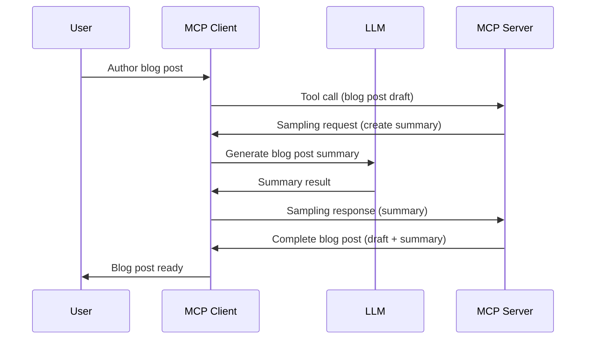

> [!WARNING]
> Sampling don old for MCP `2026-07-28`. Dis lesson dey remain for
> old way wey dem dey do am before. New servers suppose connect directly to LLM
> provider API.

# Sampling - make Client do the work

> Sampling still dey for `2026-07-28` specification make e work with old systems and e fit
> comot for the first revision wey dem go release on or after July 28,
> 2027. Examples for this lesson fit use SDK APIs wey follow `2025-11-25`.
> See [Wetyn Don Change for MCP: The 2026-07-28 Specification](../../01-CoreConcepts/mcp-2026-07-28.md).

For old way to do am, Sampling na how MCP server fit ask for help from LLM
wey client dey manage. For new ways, you suppose call the LLM provider
directly.

Make we look some use cases and how to build solution wey get sampling.

## Overview

For this lesson, we go focus on when and where you go use Sampling and how to set am.

## Wetin You Go Learn

For this chapter, we go:

- Explain wetin Sampling be and when you go use am.
- Show how you go set Sampling for MCP.
- Give examples of Sampling for work.

## Wetin be Sampling and why you go use am?

Sampling na feature wey get advance level, e dey work like dis:



### Sampling request

Ok, now we get overview of one correct scenario, make we yan about the sampling request wey the server go send back to client. Dis na how the request fit be for JSON-RPC format:

```json
{
  "jsonrpc": "2.0",
  "id": 1,
  "method": "sampling/createMessage",
  "params": {
    "messages": [
      {
        "role": "user",
        "content": {
          "type": "text",
          "text": "Create a blog post summary of the following blog post: <BLOG POST>"
        }
      }
    ],
    "modelPreferences": {
      "hints": [
        {
          "name": "claude-3-sonnet"
        }
      ],
      "intelligencePriority": 0.8,
      "speedPriority": 0.5
    },
    "systemPrompt": "You are a helpful assistant.",
    "maxTokens": 100
  }
}
```

Some tins worth to talk about dey here:

- Prompt, under content -> text, na our prompt wey be instruction for the LLM to summarize blog post content.

- **modelPreferences**. Dis section na preference, na advice of which setup to use with the LLM. User fit accept am or change am. For here, e talk about model to use, speed, and intelligence priority.
- **systemPrompt**, dis na your normal system prompt wey give your LLM personality and instructions.
- **maxTokens**, dis one tell how many tokens dem recommend to use for dis task.

### Sampling response

Dis response na wetin MCP Client go send back to MCP Server as result after call LLM, wait for response, then make message. Dis na how the JSON-RPC fit be:

```json
{
  "jsonrpc": "2.0",
  "id": 1,
  "result": {
    "role": "assistant",
    "content": {
      "type": "text",
      "text": "Here's your abstract <ABSTRACT>"
    },
    "model": "gpt-5",
    "stopReason": "endTurn"
  }
}
```

Notice say the response na summary of the blog post like we ask. Notice again say the `model` wey dem use no be the one we ask but "gpt-5" instead of "claude-3-sonnet". This show say user fit change their mind and your sampling request na only advice.

Ok, now we sabi the main flow, and good tin to use am for na "blog post creation + summary", make we see wetin we need do to make am work.

### Message types

Sampling messages no limit to only text, you fit still send images and audio. Dis na how the JSON-RPC go look different:

**Text**

```json
{
  "type": "text",
  "text": "The message content"
}
```

**Image content**

```json
{
  "type": "image",
  "data": "base64-encoded-image-data",
  "mimeType": "image/jpeg"
}
```

**Audio content**

```json
{
  "type": "audio",
  "data": "base64-encoded-audio-data",
  "mimeType": "audio/wav"
}
```

> NOTE: For current status and migration guidance, see the
> [deprecated Sampling documentation](https://modelcontextprotocol.io/specification/2026-07-28/client/sampling).

## How to Configure Sampling for Client

> Note: if na only server you dey build, no too much work dey here.

For client, you need talk the feature like dis:

```json
{
  "capabilities": {
    "sampling": {}
  }
}
```

Dis one go come active after your client connect with server.

## Example of Sampling for Work - Make Blog Post

Make we write sampling server together, we go do dis:

1. Make tool for Server.
1. Tool go create sampling request.
1. Tool go wait for client answer.
1. Then tool go produce result.

Make we see code step by step:

### -1- Make the tool

**python**

```python
@mcp.tool()
async def create_blog(title: str, content: str, ctx: Context[ServerSession, None]) -> str:
    """Create a blog post and generate a summary"""

```

### -2- Create sampling request

Add dis code to your tool:

**python**

```python
post = BlogPost(
        id=len(posts) + 1,
        title=title,
        content=content,
        abstract=""
    )

prompt = f"Create an abstract of the following blog post: title: {title} and draft: {content} "

result = await ctx.session.create_message(
        messages=[
            SamplingMessage(
                role="user",
                content=TextContent(type="text", text=prompt),
            )
        ],
        max_tokens=100,
)

```

### -3- Wait for answer and return am

**python**

```python
post.abstract = result.content.text

posts.append(post)

# mek e give full product back
return json.dumps({
    "id": post.title,
    "abstract": post.abstract
})
```

### -4- Full code

**python**

```python
from starlette.applications import Starlette
from starlette.routing import Mount, Host

from mcp.server.fastmcp import Context, FastMCP

from mcp.server.session import ServerSession
from mcp.types import SamplingMessage, TextContent

import json


from uuid import uuid4
from typing import List
from pydantic import BaseModel


mcp = FastMCP("Blog post generator")

# app = FastAPI()

posts = []

class BlogPost(BaseModel):
    id: int
    title: str
    content: str
    abstract: str

posts: List[BlogPost] = []

@mcp.tool()
async def create_blog(title: str, content: str, ctx: Context[ServerSession, None]) -> str:
    """Create a blog post and generate a summary"""

    post = BlogPost(
        id=len(posts) + 1,
        title=title,
        content=content,
        abstract=""
    )

    prompt = f"Create an abstract of the following blog post: title: {title} and draft: {content} "

    result = await ctx.session.create_message(
        messages=[
            SamplingMessage(
                role="user",
                content=TextContent(type="text", text=prompt),
            )
        ],
        max_tokens=100,
    )

    post.abstract = result.content.text

    posts.append(post)

    # return di full blog post
    return json.dumps({
        "id": post.title,
        "abstract": post.abstract
    })

if __name__ == "__main__":
    print("Starting server...")
    # mcp.run()
    mcp.run(transport="streamable-http")

# run app wit: python server.py
```

### -5- Test am for Visual Studio Code

To test am for Visual Studio Code, do dis:

1. Start server for terminal
1. Add am for *mcp.json* (make sure e dey run) like dis:

   ```json
   "servers": {
      "blog-server": {
        "type": "http",
        "url": "http://localhost:8000/mcp"
      }
   }
   ```

1. Type prompt:

   ```text
   create a blog post named "Where Python comes from", the content is "Python is actually named after Monty Python Flying Circus"
   ```

1. Allow sampling to run. First time you test, dialog go show for you to accept, then normal dialog go ask you to run tool.

1. Check results. You go see results well for GitHub Copilot Chat and you fit check raw JSON response.

**Bonus**. Visual Studio Code get better support for sampling. You fit set Sampling access on your installed server by doing dis:

1. Go extension section.
1. Select the cog icon for your installed server for "MCP SERVERS - INSTALLED".
1 Select "Configure Model Access", here you fit pick which Models GitHub Copilot fit use for sampling. You fit see all sampling requests wey happen recently by selecting "Show Sampling requests".

## Assignment

For this assignment, you go build small different Sampling wey go generate product description. Here be your scenario:

**Scenario**: Back office worker for e-commerce need help, e dey too long to generate product description. So you go build solution wey fit call tool "create_product" wit "title" and "keywords" as arguments and e go produce complete product wit "description" field wey client LLM go fill.

TIP: use wetin you learn before to build dis server and tool using sampling request.

## Solution

[Solution](./solution/README.md)

## Key Takeaways

Sampling na power feature wey make server fit give client work when e need LLM help.

## Wetin Next

- [Chapter 4 - Practical implementation](../../04-PracticalImplementation/README.md)

---

<!-- CO-OP TRANSLATOR DISCLAIMER START -->
**Disclaimer**:
Dis document don translate wit AI translation service [Co-op Translator](https://github.com/Azure/co-op-translator). Even tho we dey try make am correct, abeg make you know say automated translation fit get errors or mistakes. Di original document for dia own language na im be di correct source. For important info, make person wey sabi human translation do am. We no go responsible for any misunderstanding or wrong understanding wey fit happen because of dis translation.
<!-- CO-OP TRANSLATOR DISCLAIMER END -->