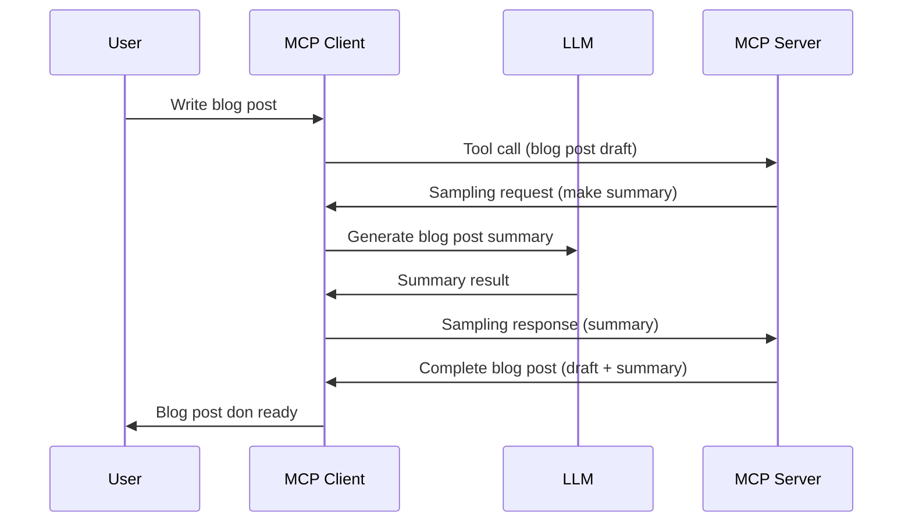

# Sampling - delegate features to the Client

> **Deprecation notice:** di `2026-07-28` MCP specification release candidate mark Sampling as deprecated in favor of direct integration wit LLM provider APIs. Sampling still dey work for `2025-11-25` and for at least one year afta any formal deprecation, so everytin for dis lesson still dey valid — but new server designs suppose evaluate di replacement pattern. See [What's Changing in MCP: The 2026-07-28 Release Candidate](../../01-CoreConcepts/mcp-2026-07-28-release-candidate.md).

Sometimes, you need make di MCP Client and di MCP Server work together to achieve one goal. You fit get case weh di Server need help from LLM wey dey on top di client. For dis kind matter, sampling na wetin you go use.

Make we explore some use cases and how to build solution wey involve sampling.

## Overview

For dis lesson, we go focus on explain when and where to use Sampling and how to configure am.

## Learning Objectives

For dis chapter, we go:

- Explain wetin Sampling be and when to use am.
- Show how to configure Sampling for MCP.
- Provide examples of Sampling for action.

## Wetin Sampling be and why you go use am?

Sampling na advanced feature wey dey work dis way:



### Sampling request

Okay, now we get one big picture of how di scenario fit happen, make we talk about di sampling request wey di server go send back to di client. Dis na wetin dis kind request fit look like for JSON-RPC format:

```json
{
  "jsonrpc": "2.0",
  "id": 1,
  "method": "sampling/createMessage",
  "params": {
    "messages": [
      {
        "role": "user",
        "content": {
          "type": "text",
          "text": "Create a blog post summary of the following blog post: <BLOG POST>"
        }
      }
    ],
    "modelPreferences": {
      "hints": [
        {
          "name": "claude-3-sonnet"
        }
      ],
      "intelligencePriority": 0.8,
      "speedPriority": 0.5
    },
    "systemPrompt": "You are a helpful assistant.",
    "maxTokens": 100
  }
}
```

Some tins wey worth mention for here:

- Prompt, under content -> text, na our prompt weh be instruction for di LLM to summarize blog post content.

- **modelPreferences**. Dis section just be wetin e be, preference, recommendation on which configuration to use wit di LLM. Di user fit choose if e want follow dis recommendations or change dem. For dis case, dem give recommendations on which model to use, speed, and intelligence priority.
- **systemPrompt**, dis na your normal system prompt wey dey give your LLM personality and guide am.
- **maxTokens**, dis na another property wey dey tell how many tokens dem recommend make you use for dis task.

### Sampling response

Dis response na wetin di MCP Client go end up sending back to di MCP Server and na result of di client wey call di LLM, wait for di response then build dis message. Dis na how e fit look for JSON-RPC:

```json
{
  "jsonrpc": "2.0",
  "id": 1,
  "result": {
    "role": "assistant",
    "content": {
      "type": "text",
      "text": "Here's your abstract <ABSTRACT>"
    },
    "model": "gpt-5",
    "stopReason": "endTurn"
  }
}
```

Look as di response na summary of di blog post like how we request am. Also note say di `model` wey dem use no be di one wey we request but "gpt-5" instead of "claude-3-sonnet". Dis di show say di user fit change mind on which model to use and say your sampling request na recommendation.

Okay, now we understand di main flow, and important task to use am for "blog post creation + abstract", make we see wetin we suppo do to make am work.

### Message types

Sampling messages no just dey limited to text, but you fit also send images and audio. Dis na how di JSON-RPC go look different:

**Text**

```json
{
  "type": "text",
  "text": "The message content"
}
```

**Image content**

```json
{
  "type": "image",
  "data": "base64-encoded-image-data",
  "mimeType": "image/jpeg"
}
```

**Audio content**

```json
{
  "type": "audio",
  "data": "base64-encoded-audio-data",
  "mimeType": "audio/wav"
}
```

> NOTE: for more detailed info on Sampling, check out di [official docs](https://modelcontextprotocol.io/specification/2025-11-25/client/sampling)

## How to Configure Sampling in the Client

> Note: if you dey only build server, you no need do much here.

For client, you need talk di feature like dis:

```json
{
  "capabilities": {
    "sampling": {}
  }
}
```

Dis go later dey pick when your chosen client start wit di server.

## Example of Sampling in Action - Create a Blog Post

Make we code sampling server together, we go need do di following:

1. Create tool for di Server.
1. Di tool suppose create sampling request.
1. Tool go wait make client answer sampling request.
1. Later tool result go show.

Make we see di code step by step:

### -1- Create the tool

**python**

```python
@mcp.tool()
async def create_blog(title: str, content: str, ctx: Context[ServerSession, None]) -> str:
    """Create a blog post and generate a summary"""

```

### -2- Create sampling request

Add di code below to your tool:

**python**

```python
post = BlogPost(
        id=len(posts) + 1,
        title=title,
        content=content,
        abstract=""
    )

prompt = f"Create an abstract of the following blog post: title: {title} and draft: {content} "

result = await ctx.session.create_message(
        messages=[
            SamplingMessage(
                role="user",
                content=TextContent(type="text", text=prompt),
            )
        ],
        max_tokens=100,
)

```

### -3- Wait for response and return response

**python**

```python
post.abstract = result.content.text

posts.append(post)

# return di complete product
return json.dumps({
    "id": post.title,
    "abstract": post.abstract
})
```

### -4- Full code

**python**

```python
from starlette.applications import Starlette
from starlette.routing import Mount, Host

from mcp.server.fastmcp import Context, FastMCP

from mcp.server.session import ServerSession
from mcp.types import SamplingMessage, TextContent

import json


from uuid import uuid4
from typing import List
from pydantic import BaseModel


mcp = FastMCP("Blog post generator")

# app = FastAPI()

posts = []

class BlogPost(BaseModel):
    id: int
    title: str
    content: str
    abstract: str

posts: List[BlogPost] = []

@mcp.tool()
async def create_blog(title: str, content: str, ctx: Context[ServerSession, None]) -> str:
    """Create a blog post and generate a summary"""

    post = BlogPost(
        id=len(posts) + 1,
        title=title,
        content=content,
        abstract=""
    )

    prompt = f"Create an abstract of the following blog post: title: {title} and draft: {content} "

    result = await ctx.session.create_message(
        messages=[
            SamplingMessage(
                role="user",
                content=TextContent(type="text", text=prompt),
            )
        ],
        max_tokens=100,
    )

    post.abstract = result.content.text

    posts.append(post)

    # return di full blog post
    return json.dumps({
        "id": post.title,
        "abstract": post.abstract
    })

if __name__ == "__main__":
    print("Starting server...")
    # mcp.run()
    mcp.run(transport="streamable-http")

# run app wit: python server.py
```

### -5- Testing am for Visual Studio Code

To test dis one for Visual Studio Code, do di following:

1. Start server for terminal
1. Add am to *mcp.json* (make sure e don start) e.g something like dis:

   ```json
   "servers": {
      "blog-server": {
        "type": "http",
        "url": "http://localhost:8000/mcp"
      }
   }
   ```

1. Type prompt:

   ```text
   create a blog post named "Where Python comes from", the content is "Python is actually named after Monty Python Flying Circus"
   ```

1. Allow sampling to happen. Di first time wey you try dis, you go see extra dialog wey you need accept, afta dat you go see normal dialog asking you to run the tool.

1. Check results. You go see di results nicely for GitHub Copilot Chat but you fit also check di raw JSON response.

**Bonus**. Visual Studio Code get better support for sampling. You fit configure Sampling access on top your installed server like dis:

1. Go extension section.
1. Select di cog icon for your installed server under "MCP SERVERS - INSTALLED".
1 Select "Configure Model Access", here you fit select which models GitHub Copilot fit use wen e dey do sampling. You fit also see all sampling requests wey don happen lately by selecting "Show Sampling requests".

## Assignment

For dis assignment, you go build one slight different Sampling, na sampling integration wey fit generate product description. Dis na your scenario:

**Scenario**: Di back office worker for e-commerce dey need help, e dey take too much time to generate product descriptions. So, you go build solution wey fit call tool "create_product" wit "title" and "keywords" as arguments and e go produce full product including "description" field wey di client LLM go fill.

TIP: use wetin you learn before to build dis server and tool wit sampling request.

## Solution

[Solution](./solution/README.md)

## Key Takeaways

Sampling na powerful feature wey allow server make e delegate tasks to client wen e need LLM help.

## What's Next

- [Chapter 4 - Practical implementation](../../04-PracticalImplementation/README.md)

---

<!-- CO-OP TRANSLATOR DISCLAIMER START -->
**Disclaimer**:
Dis document don translate wit AI translation service [Co-op Translator](https://github.com/Azure/co-op-translator). Even tho we dey try make am correct, abeg make you know say automated translation fit get errors or mistakes. Di original document for dia own language na im be di correct source. For important info, make person wey sabi human translation do am. We no go responsible for any misunderstanding or wrong understanding wey fit happen because of dis translation.
<!-- CO-OP TRANSLATOR DISCLAIMER END -->